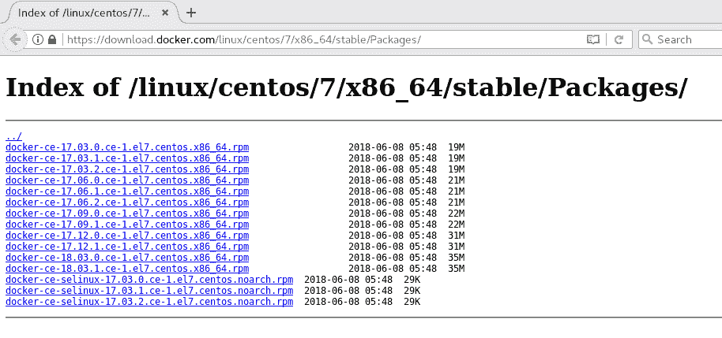
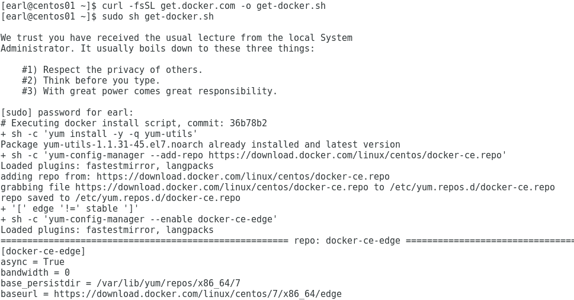
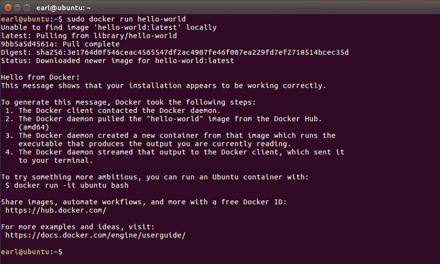
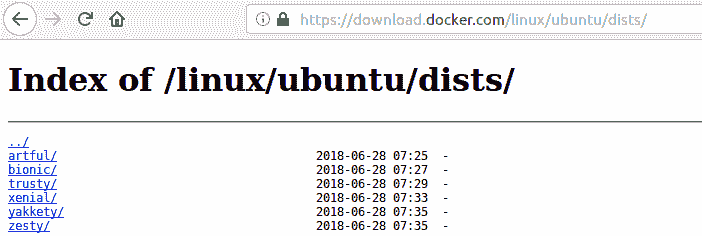
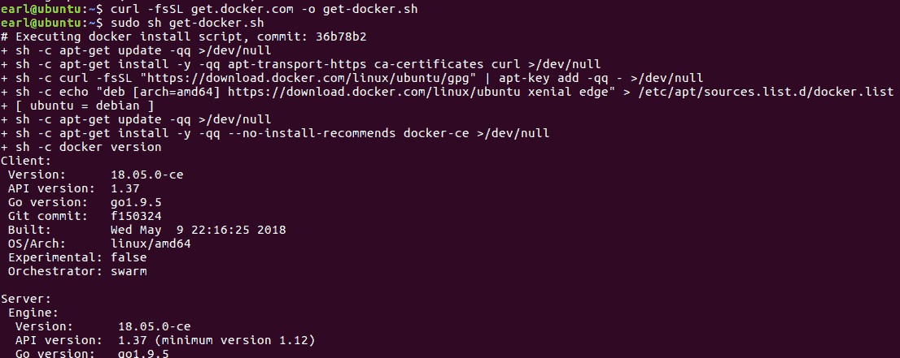
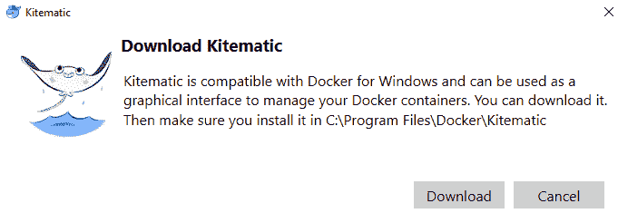

# 第一章：设置 Docker 开发环境

“突然间我想到：如果我的拖车可以被简单地吊起并放在船上，而不触及其中的货物，那不是很好吗？” - Malcolm McLean，美国卡车企业家

在本章中，我们将为我们的工作站设置 Docker 开发环境。我们将学习如何在 Linux、Windows 和 OS X 工作站上设置 Docker 开发环境。然后，我们将处理每个操作系统的一些后安装步骤。最后，我们将了解在每个操作系统上使用 Docker 的区别以及在它们之间需要注意的事项。

到本章结束时，您将了解以下内容：

+   如何设置您的 Docker 开发环境，无论您的工作站运行在以下哪种操作系统上：

+   CentOS

+   Ubuntu

+   Windows

+   OS X

+   在不同操作系统上使用 Docker 时需要注意的差异

# 技术要求

您需要使用您选择的操作系统（包括 Linux、Windows 或 OS X）的开发工作站。您需要在工作站上拥有 sudo 或管理员访问权限。由于您将安装从互联网上拉取的 Docker 软件，因此您需要工作站上的基本互联网连接。

本章的代码文件可以在 GitHub 上找到：

[`github.com/PacktPublishing/Docker-Quick-Start-Guide/tree/master/Chapter01`](https://github.com/PacktPublishing/Docker-Quick-Start-Guide/tree/master/Chapter01)

查看以下视频以查看代码的运行情况：[`bit.ly/2rbGXqy`](http://bit.ly/2rbGXqy)

# 设置您的 Docker 开发环境

现在是时候动手了。让我们开始设置我们的工作站。无论您的首选操作系统是什么，都有相应的 Docker。使用以下内容作为指南，我们将带您完成在工作站上设置 Docker 的过程。我们可以从设置 Linux 工作站开始，然后解决 Windows 系统的问题，最后完成可能是最常见的开发者选项，即 OS X 工作站。虽然 OS X 可能是最受欢迎的开发者选项，但我建议您考虑将 Linux 发行版作为您的首选工作站。稍后在*在 OS X 工作站上安装 Docker*部分中，我们将更多地讨论我为什么做出这样的建议。但现在，如果您被说服在 Linux 上开发，请在 Linux 安装讨论期间仔细关注。

一般来说，有两种 Docker 可供选择：Docker 企业版或 Docker EE，以及 Docker 社区版或 Docker CE。通常，在企业中，你会选择企业版，特别是对于生产环境。它适用于业务关键的用例，Docker EE 正如其名，是经过认证、安全且在企业级别得到支持的。这是一个商业解决方案，由 Docker 提供支持并购买。

另一种类型，Docker CE，是一个社区支持的产品。CE 是免费提供的，通常是小型企业的生产环境和开发人员工作站的选择。Docker CE 是一个完全有能力的解决方案，允许开发人员创建可以与团队成员共享、用于 CI/CD 的自动构建工具，并且如果需要，可以与 Docker 社区大规模共享的容器。因此，它是开发人员工作站的理想选择。值得注意的是，Docker CE 有两种发布路径：稳定版和测试版。在本章的所有安装示例中，我们将使用 Docker CE 的稳定发布路径。

我们将从 CentOS Linux 开始安装讨论，但如果你赶时间，可以直接跳到 Ubuntu、Windows 或 Mac 部分。

# 在 Linux 工作站上安装 Docker

我们将执行 Docker 的 Linux 安装步骤，分别针对基于 RPM 的工作站（使用 CentOS）和基于 DEB 的工作站（使用 Ubuntu），这样你就会得到最符合你当前使用的 Linux 发行版或将来打算使用的指导。我们将从 CentOS 开始我们的安装之旅。

你可以在*参考*部分找到所有操作系统安装中使用的下载链接。

# 在 CentOS 工作站上安装 Docker

CentOS 上的 Docker CE 需要一个维护的 CentOS 7 版本。虽然安装可能在存档版本上运行，但它们既没有经过测试也没有得到支持。

在 CentOS 上安装 Docker CE 有三种方法：

+   通过 Docker 仓库

+   下载并手动安装 RPM 包

+   运行 Docker 的便利脚本

最常用的方法是通过 Docker 仓库，所以让我们从那里开始。

# 通过 Docker 仓库安装 Docker CE

首先，我们需要安装一些必需的软件包。打开终端窗口，输入以下命令：

[PRE0]

这将确保我们在系统上安装了`yum-config-manager`实用程序和设备映射器存储驱动程序。如下截图所示：

请注意，你的 CentOS 7 安装可能已经安装了这些，并且在这种情况下，`yum install`命令将报告没有需要安装的内容。

接下来，我们将为 Docker CE 设置 CentOS 稳定存储库。

值得注意的是，即使你想安装边缘版本，你仍然需要设置稳定的存储库。

输入以下命令设置稳定的存储库：

[PRE1]

如果你想使用边缘版本，可以使用以下命令启用它：

[PRE2]

同样，你可以使用这个命令禁用对边缘版本的访问：

[PRE3]

现在开始有趣的部分...我们将安装 Docker CE。要这样做，请输入以下命令：

[PRE4]

如果出现关于需要安装`container-selinux`的错误，请使用以下命令进行安装，然后重试：

[PRE5]

就是这样！安装 Docker CE 比你想象的要容易得多，对吧？

让我们使用最基本的方法来确认安装成功，通过发出版本命令。

这个命令验证了我们安装了 Docker CE，并显示了刚刚安装的 Docker 的版本。输入以下命令：

[PRE6]

在撰写本文时，最新版本的 Docker CE 是 18.03.1：

我们还有一个关键的步骤。虽然 Docker CE 已安装，但 Docker 守护程序尚未启动。要启动它，我们需要发出以下命令：

[PRE7]

它应该悄悄地启动，看起来像这样：

我们看到了如何使用版本命令验证 Docker 的安装。这是一个很好的快速测试，但有一种简单的方法来确认不仅安装，而且一切都按预期启动和工作，那就是运行我们的第一个 Docker 容器。

让我们发出以下命令来运行 hello-world 容器：

[PRE8]

如果一切顺利，你会看到类似以下的内容：

我们在我们的 CentOS 工作站上安装了 Docker CE，并且它已经在运行容器。我们有了一个很好的开始。现在我们知道如何使用 Docker 存储库进行安装，让我们看看如何手动使用下载的 RPM 进行安装。

# 使用下载的 RPM 手动安装 Docker CE

安装 Docker CE 的另一种方法是使用下载的 RPM。这种方法涉及下载您希望安装的版本的 Docker CE RPM。您需要浏览 Docker CE 稳定版 RPM 下载站点。其 URL 为[`download.docker.com/linux/centos/7/x86_64/stable/Packages`](https://download.docker.com/linux/centos/7/x86_64/stable/Packages)：

单击要下载的 Docker CE 版本，并在提示时告诉浏览器保存文件。接下来，发出`yum install`命令，提供已下载的 RPM 文件的路径和文件名。您的命令应该类似于这样：

[PRE9]

您需要启动 Docker 守护程序。您将在存储库部分使用前面的命令：

[PRE10]

而且，正如我们之前学到的，您可以使用以下命令验证安装的功能：

[PRE11]

虽然这种方法可能看起来更简单、更容易执行，但它不太理想，因为它更多地是一个手动过程，特别是在更新 Docker CE 版本时。您必须再次浏览下载页面，找到更新版本，下载它，然后执行`yum install`。使用之前描述的 Docker 存储库方法，升级只需发出`yum upgrade`命令。现在让我们再看一种在您的 CentOS 工作站上安装 Docker CE 的方法。

# 通过运行便利脚本安装 Docker CE

安装 Docker 的第三种方法是使用 Docker 提供的便利脚本。这些脚本允许您安装 Docker 的最新边缘版本或最新测试版本。不建议在生产环境中使用其中任何一个，但它们确实在测试和开发最新的 Docker 版本时起到作用。这些脚本在某种程度上受限，因为它们不允许您在安装过程中自定义任何选项。相同的脚本可以用于各种 Linux 发行版，因为它们确定您正在运行的基本发行版，然后根据该确定进行安装。该过程很简单。

使用`curl`下载所需的脚本，然后使用 sudo 运行脚本。

运行最新的边缘版本的命令如下：

[PRE12]

执行脚本将产生以下输出：

docker 组已经由脚本为您创建，但由于 CentOS 是以 RPM 为中心，您仍需要自己启动 Docker 服务：

[PRE13]

如果这是一个基于 Debian 的系统，Docker 服务将会被脚本自动启动。

现在我们已经检查了在 CentOS 工作站上安装 Docker 的三种方法，现在是时候讨论一些推荐的后续安装设置。

# 您可能要考虑的后续安装步骤

所有三种安装方法都会自动为您创建一个 docker 组，但如果您希望能够在不使用`root`或 sudo 的情况下运行 Docker 命令，则需要将用户添加到 docker 组中。

请注意，许多 Docker 命令需要完整的管理员访问权限才能执行，因此将用户添加到 docker 组相当于授予他们 root 访问权限，应考虑安全影响。如果用户已经在其工作站上具有 root 访问权限，则将其添加到 docker 组只是为其提供方便。

通过以下命令轻松将当前用户添加到 docker 组：

[PRE14]

您需要注销并重新登录以更新您帐户的组成员资格，但一旦您这样做了，您应该可以执行任何 Docker 命令而不使用 sudo。

可以通过在不使用 sudo 的情况下运行 hello-world 容器来验证：

[PRE15]

接下来，您将希望配置系统在系统启动时启动 Docker 服务：

[PRE16]

您可能要考虑的另一个后续安装步骤是安装 docker-compose。

这个工具可以成为您的 Docker 工具箱的重要补充，我们将在第七章中讨论其用途，*Docker Stacks*。安装 docker-compose 的命令是：

[PRE17]

恭喜，您的 CentOS 工作站现在已准备好开始开发您的 Docker 镜像并部署您的 Docker 容器。接下来，我们将学习如何在 Ubuntu 工作站上使用 DEB-based 系统安装 Docker。如果您准备好了，请继续阅读。

# 在 Ubuntu 工作站上安装 Docker

与在 CentOS 工作站上一样，我们将在 Ubuntu 工作站上安装 Docker CE。在 Ubuntu 上安装 Docker CE 的要求是您必须运行 64 位的最新 LTS 版本，例如 Bionic、Xenial 或 Trusty。您可以在 Artful 版本的 Ubuntu 上安装 Docker CE 的边缘版本。

在 Ubuntu 上安装 Docker CE 有三种方法：

+   通过 Docker 仓库

+   下载并手动安装 DEB 软件包

+   运行方便脚本

最常用的方法是通过 Docker 存储库，所以让我们从那里开始。

# 通过 Docker 存储库安装 Docker CE

我们首先需要设置 Docker 存储库，然后我们可以进行安装，所以让我们现在处理存储库。

第一步是更新 apt 软件包索引。使用以下命令来执行：

[PRE18]

现在我们需要安装一些支持软件包：

[PRE19]

接下来，我们需要获取 Docker 的 GPG 密钥：

[PRE20]

您可以确认已成功添加了 Docker 的 GPG 密钥；它将具有`9DC8 5822 9FC7 DD38 854A E2D8 8D81 803C 0EBF CD88`的指纹。

您可以通过使用以下命令检查最后八个字符是否与`0EBFCD88`匹配来验证密钥：

[PRE21]

最后，我们需要实际设置存储库。我们将专注于我们的示例中的稳定存储库。

如果要安装 Docker CE 的边缘或测试版本，请确保在以下命令中的`stable`单词后添加`edge`或`test`（不要替换`stable`单词）：

[PRE22]

现在我们的系统已经设置了正确的存储库来安装 Docker CE，让我们来安装它。

首先确保所有软件包都是最新的，通过发出`apt-get update`命令：

[PRE23]

现在我们将实际安装 Docker CE：

[PRE24]

Docker 已安装。安装后，您可以检查 Docker 版本以确认安装成功：

[PRE25]

版本命令应该类似于这样：

现在，让我们验证 Docker 安装是否按预期工作。为此，我们将使用以下命令运行 hello-world Docker 镜像：

[PRE26]

您注意到了一些有趣的事情吗？

在安装后，我们不需要像在 CentOS 安装中那样启动 Docker。这是因为在基于 DEB 的 Linux 系统上，安装过程也会为我们启动 Docker。此外，Ubuntu 工作站已配置为在启动时启动 Docker。因此，在安装过程中，这两个 Docker 启动步骤都已为您处理。太棒了！您的 Ubuntu 工作站现在已安装了 Docker，并且我们已经验证它正在按预期工作。

虽然使用 Docker 存储库是在工作站上安装 Docker 的最佳方法，但让我们快速看一下在 Ubuntu 工作站上手动安装 Docker CE 的另一种方法，即通过使用 DEB 软件包手动安装它。

# 使用 DEB 软件包手动安装 Docker CE

现在我们将向您展示如何下载和安装 Docker CE DEB 软件包。如果由于某种原因，软件库对您的工作站不可用，您应该考虑使用此方法。

您需要下载 Docker CE 软件包，所以首先打开浏览器，访问 Ubuntu Docker CE 软件包下载站点[`download.docker.com/linux/ubuntu/dists/.`](https://download.docker.com/linux/ubuntu/dists/)

在那里，您将找到列出的 Ubuntu 版本文件夹的列表，看起来像这样：

您需要选择与工作站上安装的 Ubuntu 版本相匹配的文件夹，对我来说是`xenial`文件夹。

继续浏览到`/pool/stable/`，然后转到与您的工作站硬件相匹配的处理器文件夹。对我来说，那是 amd64，看起来是这样的：

现在单击要下载和安装的 Docker CE 版本。

在单击“确定”之前，请务必选择“保存文件”选项。

一旦软件包已下载到您的工作站，只需使用`dpkg`命令手动安装软件包即可安装它。

您将下载的 Docker CE 软件包的路径和文件名作为参数提供给`dpkg`。以下是我用于刚刚下载的软件包的命令：

[PRE27]

执行该命令如下：

现在 Docker 已安装，让我们使用版本命令来确认成功安装，然后运行 hello-world 容器来验证 Docker 是否按预期工作：

[PRE28]

这很好。就像仓库安装一样，您的 docker 组已创建，并且在手动软件包安装中，这两个启动步骤都已为您处理。您不必启动 Docker，也不必配置 Docker 在启动时启动。因此，您已准备好开始创建 Docker 镜像和运行 Docker 容器。

然而，在我们开始创建和运行之前，还有一种在 Ubuntu 工作站上安装 Docker 的方法，我们将介绍。您可以使用 Docker 的便利脚本来安装 Docker CE 的最新边缘或测试版本。现在让我们看看如何做到这一点。

# 通过运行便利脚本安装 Docker CE

安装 Docker 的另一种方法是使用 Docker 提供的便利脚本。这些脚本允许您安装最新的边缘版本或最新的测试版本的 Docker。不建议在生产环境中使用其中任何一个，但它们确实在测试和开发最新的 Docker 版本时起到作用。这些脚本有一定的局限性，因为它们不允许您在安装中自定义任何选项。相同的脚本可以用于各种 Linux 发行版，因为它们确定您正在运行的基本发行版，然后根据该确定进行安装。这个过程很简单。使用`curl`拉取所需的脚本，然后使用 sudo 运行脚本。运行最新的边缘版本的命令如下。

使用以下命令安装 curl：

[PRE29]

现在获取脚本并运行 docker 脚本进行安装：

[PRE30]

执行脚本将产生以下输出：

脚本已为您创建了 docker 组。 Docker 服务已启动，并且工作站已配置为在启动时运行 Docker。因此，您又一次准备好开始使用 Docker。

我们已经研究了在 Ubuntu 工作站上安装 Docker 的三种方法，现在是讨论建议的后安装设置的好时机。

# 您可能要考虑的后安装步骤

这三种安装方法都会自动为您创建一个 docker 组，但如果您想要能够在不使用`root`或 sudo 的情况下运行 Docker 命令，您将需要将您的用户添加到 docker 组中。

请注意，许多 Docker 命令需要完全的管理员访问权限才能执行，因此将用户添加到 docker 组相当于授予他们 root 访问权限，应考虑安全性影响。如果用户已经在他们的工作站上具有 root 访问权限，则将他们添加到 docker 组只是为他们提供方便。

将当前用户添加到 docker 组中很容易通过以下命令完成：

[PRE31]

您需要注销并重新登录以更新您帐户的组成员资格，但一旦您这样做了，您就可以执行任何 Docker 命令而不使用 sudo。

这可以通过 hello-world 容器进行验证：

[PRE32]

您应该考虑的另一个后安装步骤是安装 docker-compose。

这个工具可以成为您的 Docker 工具箱的重要补充，我们将在第七章《Docker Stacks》中讨论其用途。安装 docker-compose 的命令是：

[PRE33]

恭喜，您的 Ubuntu 工作站现在已准备好开始开发 Docker 镜像并部署 Docker 容器。接下来，我们将学习如何在基于 Windows 的工作站上安装 Docker。如果您准备好了，请继续阅读。

# 在 Windows 工作站上安装 Docker

Docker CE 的 Windows 版本与 Windows 10 专业版或企业版兼容。Windows 上的 Docker CE 通过与 Windows Hyper-V 虚拟化和网络集成，提供了完整的 Docker 开发解决方案。Windows 上的 Docker CE 支持创建和运行 Windows 和 Linux 容器。Windows 上的 Docker CE 可以从 Docker 商店下载：[`store.docker.com/editions/community/docker-ce-desktop-windows`](https://store.docker.com/editions/community/docker-ce-desktop-windows)。

您需要登录 Docker 商店以下载 Docker CE for Windows 安装程序，因此，如果您还没有帐户，请立即创建一个然后登录。

请务必安全地保存您的 Docker 凭据，因为您将在将来经常使用它们。

登录后，您应该会看到“获取 Docker”下载按钮。单击下载按钮，允许安装程序下载到您的工作站。一旦安装程序下载完成，您可以单击“运行”按钮开始安装。如果出现安全检查，请确认您要运行安装程序可执行文件，然后单击“运行”按钮。如果您的工作站启用了 UAC，您可能会看到用户账户控制警告，询问您是否要允许 Docker CE 安装程序对设备进行更改。您必须选择“是”才能继续，所以请立即单击。

Docker CE 安装程序将运行，并开始下载 Docker。一旦 Docker 安装文件成功下载，安装程序将要求您确认所需的配置。这里的选项很少。我建议您将快捷方式添加到桌面，并且不要选择使用 Windows 容器而不是 Linux 容器的选项：

安装程序将解压 Docker CE 文件。当文件解压缩后，您将收到安装成功的通知。根据当前的文档，安装程序将在安装结束时为您运行 Docker。根据我的经验，这并不总是发生。请耐心等待，但如果第一次它没有启动，您可能需要手动运行 Docker。

如果您选择了将 Docker 添加到桌面的快捷方式配置选项，现在您可以双击该快捷方式图标，第一次启动 Docker。

Docker 将运行，并且您将看到一个欢迎屏幕，告诉您 Docker 已经启动。建议您在此时提供您的 Docker 凭据并登录。

每当 Docker 运行时，您将在任务栏通知区域看到一个鲸鱼图标。如果您将鼠标悬停在该图标上，您可以获取 Docker 进程的状态。您将看到诸如 Docker 正在启动和 Docker 正在运行等状态。您可以右键单击该图标以打开 Docker for Windows 菜单：

一旦您在 Windows 工作站上运行 Docker，您可以打开 Windows PowerShell 命令窗口并开始使用 Docker。要验证安装是否成功，请打开 PowerShell 窗口并输入版本命令。为了确认 Docker 是否按预期工作，请运行 hello-world Docker 容器：

[PRE34]

您的 Windows 10 工作站现在已设置好，可以创建 Docker 镜像并运行 Docker 容器。Docker 也应该配置为在启动时启动，这样当您需要重新启动工作站时，它将自动启动。

请注意，在 Windows 工作站上使用 Docker CE 并不完全像在 Linux 工作站上使用 Docker CE 那样。在幕后隐藏着一个额外的虚拟化层。Docker 在 Hyper-V 中运行一个小型的 Linux 虚拟机，并且您所有的 Docker 交互都会通过这个 Linux 虚拟机进行。对于大多数用例，这永远不会出现任何问题，但它确实会影响性能。我们将在*发现操作系统之间需要注意的差异*部分详细讨论这一点。

我们还想看一下另一个设置，所以如果您准备好了，就直接进入下一节。

# 您可能想考虑的安装后步骤

以下是我建议您在 Docker Windows 工作站上进行的一些安装后步骤。

# 安装 Kitematic

Docker CE 的 Windows 安装集成了一个名为 Kitematic 的图形用户界面工具。如果您是图形界面类型的人（并且由于您正在使用 Windows 进行 Docker，我猜您是），您会想要安装此工具。

在任务栏通知区域找到`Docker`图标，右键单击它以打开 Windows 菜单。单击 Kitematic 菜单选项。Kitematic 不是默认安装的。您必须下载包含应用程序的存档。当您第一次单击 Kitematic 菜单选项时，将提示您下载它。单击下载按钮，并将存档文件保存到您的工作站。

您需要解压 Kitematic 存档才能使用它。未压缩的 Kitematic 文件夹需要位于`C:\Program Files\Docker`文件夹中，并且文件夹名称为`Kitematic`，以便 Docker 子菜单集成能够正常工作。一旦您在 Windows 工作站的正确路径上安装了 Kitematic，您可以右键单击任务栏通知区域中的`Docker`图标，然后再次选择 Kitematic 选项。

您将被提示再次输入您的 Docker 凭据以连接到 Docker Hub。您可以跳过此步骤，但我建议您现在就登录。一旦您登录（或跳过登录步骤），您将看到 Kitematic 用户界面。它允许您在工作站上下载和运行 Docker 容器。尝试一个，比如*hello-world-nginx*容器，或者如果您想玩游戏，可以尝试 Minecraft 容器。

您现在可以在 Windows 10 工作站上创建 Docker 镜像并运行 Docker 容器，但我们还有一个工作站操作系统需要学习如何在其上安装 Docker CE。让我们看看如何在 OS X 工作站上安装它。

# 为 PowerShell 设置 DockerCompletion

如果您曾经使用过命令行完成，您可能会考虑为 PowerShell 安装 DockerCompletion。此工具为 Docker 命令提供了命令行完成。它相当容易安装。您需要设置系统以允许执行已下载的模块。为此，请以管理员身份打开 PowerShell 命令窗口，并发出以下命令：

[PRE35]

您现在可以关闭管理员命令窗口，并打开普通用户 PowerShell 命令窗口。要安装`DockerCompletion`模块，请发出以下命令：

[PRE36]

最后，在当前的 PowerShell 窗口中激活模块，请使用以下命令：

[PRE37]

现在您可以为所有 Docker 命令使用命令完成功能。这是一个很好的节省按键的功能！

请注意，Import-Module 命令仅在当前的 PowerShell 命令窗口中有效。如果您希望在所有未来的 PowerShell 会话中都可用，您需要将`Import-Module DockerCompletion`添加到您的 PowerShell 配置文件中。

您可以使用以下命令轻松编辑您的 PowerShell 配置文件（如果尚未创建，则创建一个新的）：

[PRE38]

输入`Import-Module DockerCompletion`命令并保存配置文件。现在您的 Docker 命令行完成功能将在所有未来的 PowerShell 会话中激活。

# 在 OS X 工作站上安装 Docker

近年来，Mac 上的 Docker 故事有了很大进展，现在它是 Mac 工作站的一个真正可用的开发解决方案。Docker CE for Mac 需要 OS X El Capitan 10.11 或更新的 macOS 版本。Docker CE 应用程序与 OS X 中内置的 hypervisor、网络和文件系统集成。安装过程很简单：下载 Docker 安装程序镜像并启动它。您可以从 Docker 商店下载安装程序镜像。您必须登录 Docker 商店才能下载安装镜像，因此，如果尚未拥有帐户，请在那里创建一个。

请务必安全地保存您的凭据，因为以后会需要它们。

浏览到 Docker CE for Mac 的 Docker 商店页面[`store.docker.com/editions/community/docker-ce-desktop-mac`](https://store.docker.com/editions/community/docker-ce-desktop-mac)。请记住，您必须登录 Docker 商店才能下载安装程序镜像。

一旦登录到 Docker 商店，Get Docker 按钮将可供单击。继续单击它开始下载。Docker CE for Mac 安装镜像可能需要一些时间来下载。下载完成后，双击`Docker.dmg`镜像文件以挂载和打开它：

一旦 Docker CE for Mac 镜像已挂载并打开，点击`Docker`图标并将其拖放到`应用程序`图标上以完成安装。将启动复制`Docker`到`应用程序`的操作。当复制过程完成时，Docker 应用程序将可以从您的`应用程序`文件夹中运行。双击您的`Docker`图标来启动它。第一次启动 Docker 时，会警告您正在运行从互联网下载的应用程序，以确保您真的想要打开它。当 Docker 应用程序打开时，您将收到友好的欢迎消息。

在欢迎消息上点击下一步，会警告您 Docker 需要提升的权限才能运行，并告知您必须提供凭据来安装 Docker 的网络和应用链接。输入您的用户名和密码。Docker 应用程序将启动，将鲸鱼图标添加到菜单通知区域。

您还将被提示输入 Docker 商店凭据，以允许 Docker for Mac 登录商店。输入您的凭据，然后点击“登录”按钮。您将收到确认消息，显示您当前已登录。

为了验证我们的安装成功并确认我们的安装功能，我们将发出版本命令，然后运行 Docker 的 hello-world 容器：

[PRE39]

您的 macOS 工作站现在已设置好，可以创建 Docker 镜像和运行 Docker 容器。您已经准备好将应用程序容器化了！您可以轻松使用终端窗口进行所有 Docker 工作，但您可能对 Mac 上可用的图形 UI 工具**Kitematic**感兴趣。让我们接下来安装 Kitematic。

# 安装后你可能想考虑的步骤

以下是我建议您的 Docker OS X 工作站的一些安装后步骤。

# 安装 Kitematic

虽然您可以在 OS X 终端窗口中使用 Docker CLI，并且可能会在大部分 Docker 开发工作中使用它，但您也可以选择使用名为 Kitematic 的图形 UI 工具。要安装 Kitematic，请右键单击 OS X 菜单通知区域中的鲸鱼图标以打开 Docker for Mac 菜单。单击 Kitematic 菜单选项以下载（以及后来运行）Kitematic 应用程序。如果您尚未安装 Kitematic，当您单击 Docker for Mac 菜单时，将显示包含下载链接的消息。该消息还提醒您必须将 Kitematic 安装到您的`Applications`文件夹中以启用 Docker 菜单集成。单击此处链接下载 Kitematic 应用程序：

下载完成后，将下载的应用程序移动到您的`Applications`文件夹中，如之前所述。然后，使用 Docker for Mac 菜单，再次单击 Kitematic 菜单选项。这次它将运行 Kitematic 应用程序。第一次运行应用程序时，您将收到标准警告，询问您是否真的要打开它。单击“打开”按钮以打开。

一旦在您的 Mac 工作站上安装了 Kitematic，您可以单击菜单栏通知区域中的 Docker 鲸鱼图标，然后再选择 Kitematic 选项。

您将被提示输入您的 Docker 凭据以将 Kitematic 连接到 Docker Hub。您可以跳过此步骤，但我建议您现在登录。一旦您登录（或跳过登录步骤），您将看到 Kitematic 用户界面。这允许您在您的工作站上下载和运行 Docker 容器。尝试一个，比如*hello-world-nginx*容器，或者如果您想玩游戏，可以尝试 Minecraft 容器。

恭喜！您现在已经设置好了使用 Docker CLI 和 Kitematic 图形用户界面来运行 Docker 容器和管理 Docker 镜像。但是，您将使用 OS X 终端和您喜欢的代码编辑器来创建 Docker 镜像。

# 安装 Docker 命令行完成

安装 Homebrew。您的 Mac 上可能已经安装了 Homebrew，但如果没有，现在应该安装它。以下是安装它的命令：

[PRE40]

接下来，使用 Homebrew 安装`bash-completion`。以下是命令：

[PRE41]

安装`bash-completion`会指导你将以下行添加到你的`~/.bash_profile`文件中：

[PRE42]

现在，创建必要的链接以启用 Docker 命令行补全功能。每个 Docker 工具集都有一个链接。以下是 bash 的链接命令（如果你使用`zsh`，请查看下一个代码块中的链接命令）：

[PRE43]

请注意，如果你使用的是`zsh`而不是 bash，链接命令是不同的。以下是`zsh`的链接命令：

[PRE44]

最后，重新启动你的终端会话——现在你可以使用 Docker 命令补全了！尝试输入`docker`并按两次*Tab*键。

# 参考

+   Docker 企业版数据：[`www.docker.com/enterprise-edition`](https://www.docker.com/enterprise-edition)

+   Docker 社区版数据：[`www.docker.com/community-edition`](https://www.docker.com/community-edition)

+   下载 CentOS 版的 Docker CE：[`store.docker.com/editions/community/docker-ce-server-centos`](https://store.docker.com/editions/community/docker-ce-server-centos)

+   下载 Ubuntu 版的 Docker CE：[`store.docker.com/editions/community/docker-ce-server-ubuntu`](https://store.docker.com/editions/community/docker-ce-server-ubuntu)

+   下载 Windows 版的 Docker CE：[`store.docker.com/editions/community/docker-ce-desktop-windows`](https://store.docker.com/editions/community/docker-ce-desktop-windows)

+   下载 Mac 版的 Docker CE：[`store.docker.com/editions/community/docker-ce-desktop-mac`](https://store.docker.com/editions/community/docker-ce-desktop-mac)

+   CentOS 版 Docker CE 稳定版 RPM 下载站点：[`download.docker.com/linux/centos/7/x86_64/stable/Packages`](https://download.docker.com/linux/centos/7/x86_64/stable/Packages)

+   Docker 安装 Repo：[`github.com/docker/docker-install`](https://github.com/docker/docker-install)

+   Ubuntu 版 Docker CE DEB 包下载站点：[`download.docker.com/linux/ubuntu/dists/`](https://download.docker.com/linux/ubuntu/dists/)

+   在 Windows 上运行 Windows Docker 容器：[`blog.docker.com/2016/09/build-your-first-docker-windows-server-container/`](https://blog.docker.com/2016/09/build-your-first-docker-windows-server-container/)

+   PowerShell 的 DockerCompletion：[`github.com/matt9ucci/DockerCompletion`](https://github.com/matt9ucci/DockerCompletion)

+   Mac 版的 Docker CE：[`store.docker.com/editions/community/docker-ce-desktop-mac`](https://store.docker.com/editions/community/docker-ce-desktop-mac)

+   Mac 的命令行完成：[`docs.docker.com/docker-for-mac/#install-shell-completion`](https://docs.docker.com/docker-for-mac/#install-shell-completion)

+   在您的 Mac 上安装 Homebrew：[`brew.sh/`](https://brew.sh/)

# 操作系统之间需要注意的差异

Docker 镜像是自包含的软件包，包括运行它们所设计的应用程序所需的一切。Docker 的一个巨大优势是，Docker 镜像可以在几乎任何操作系统上运行。也就是说，在不同的操作系统上运行 Docker 镜像的体验会有一些差异。Docker 是在 Linux 上创建的，并且与一些关键的 Linux 构造深度集成。因此，当您在 Linux 上运行 Docker 时，一切都会直接无缝地与操作系统集成。Docker 原生地利用 Linux 内核和文件系统。

不幸的是，当您在 Windows 或 Mac 上运行 Docker 时，Docker 无法利用与 Linux 上原生支持的相同构造，因为这些构造在这些其他操作系统上不存在。Docker 通过在非 Linux 操作系统中的虚拟机中创建一个小型、高效的 Linux VM 来处理这个问题。在 Windows 上，这个 Linux VM 是在 Hyper-V 中创建的。在 macOS 上，这个 VM 是在一个名为**hyperkit**的自定义虚拟机中创建的。

正如您所期望的，辅助虚拟机会带来性能开销。然而，如果您确实使用 Windows 或 OS X 作为开发工作站，您会高兴地知道，Docker 在这两个平台上都取得了很多积极的进展，减少了开销，并且随着每个新的主要版本的发布，性能得到了显著改善。有很多关于 OS X 上 hyperkit 虚拟机高 CPU 利用率的报告，但我个人没有遇到这个问题。我相信，使用当前稳定版本的 Docker CE，Windows 和 OS X 都可以成功用于 Docker 开发。

除了处理性能之外，还有其他一些差异需要考虑。有两个你应该知道的：文件挂载和端点。

在 Linux 操作系统上，Docker CE 能够直接使用文件系统来进行运行容器中的文件挂载，从而提供本地磁盘性能水平。您还可以更改文件系统驱动程序以实现不同级别的性能。这在 Windows 或 Mac 上不可用。对于 Windows 和 OS X，还有一个额外的文件系统工具来处理文件挂载。在 Windows 上，您将使用 Windows 共享文件，在 OS X 上则使用 osxfs。不幸的是，对于 Windows 和 OS X 用户来说，文件挂载的性能损失是显著的。尽管 Docker 在改进 Windows 和 OS X 的文件挂载故事方面取得了长足进步，但与在 Linux 操作系统上本地运行相比，两者仍然明显较慢。特别是对于 Windows，文件挂载选项非常受限制。如果您正在开发一个对磁盘利用率很高的应用程序，这种差异可能足以让您立即考虑切换到 Linux 开发工作站。

Linux 上的 Docker 和 Windows 或 Mac 上的 Docker 之间的另一个区别是端口的利用。例如，在 Windows 上使用 Docker 时，无法使用 localhost 从主机访问容器的端点。这是一个已知的 bug，但唯一的解决方法是从与运行它们的主机不同的主机访问容器的端点。在 Mac 上使用 Docker 时，还存在其他端点限制，比如无法 ping 容器（因为 Docker for Mac 无法将 ping 流量路由到容器内部），也无法使用每个容器的 IP 地址（因为 Docker 桥接网络无法从 macOS 访问）。

这些任何限制可能足以让您考虑将开发工作站切换到 Ubuntu 或 CentOS 操作系统。对我来说是这样，您会发现本书中大多数示例都是在我的 Ubuntu 工作站上执行的。我会尽量指出如果您使用 Windows 或 OS X 可能会有显著不同的地方。

# 总结

哇！我们在这第一章涵盖了很多内容。现在，您应该能够在您的工作站上安装 Docker，无论它运行的是哪种操作系统。您应该能够使用三种不同的方法在 Linux 工作站上安装 Docker，并了解在基于 RPM 的系统和基于 DEB 的系统上安装之间的一些区别。

我们还介绍了一些非常重要的原因，为什么您可能会考虑使用 Linux 工作站进行开发，而不是使用 Windows 或 macOS 工作站。到目前为止，您应该能够通过检查安装的 Docker 版本轻松验证 Docker 的成功安装。

您应该能够通过运行一个 hello-world 容器轻松确认 Docker 是否按预期工作。对于你的第一章来说还不错，对吧？好了，有了这个基础和你新准备好的 Docker 工作站，让我们直接进入第二章 *学习 Docker 命令*，在那里我们将学习许多你每天都会使用的 Docker 命令。

# 参考资料

+   Docker for Windows 限制：[`docs.docker.com/docker-for-windows/troubleshoot/#limitations-of-windows-containers-for-localhost-and-published-ports`](https://docs.docker.com/docker-for-windows/troubleshoot/#limitations-of-windows-containers-for-localhost-and-published-ports)

+   Docker for Mac 限制：[`docs.docker.com/v17.09/docker-for-mac/networking/#known-limitations-use-cases-and-workarounds`](https://docs.docker.com/v17.09/docker-for-mac/networking/#known-limitations-use-cases-and-workarounds)
