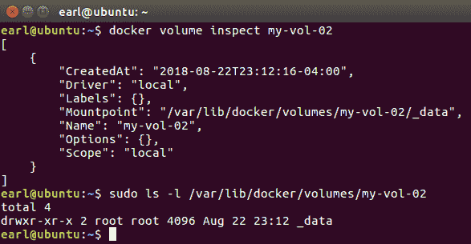
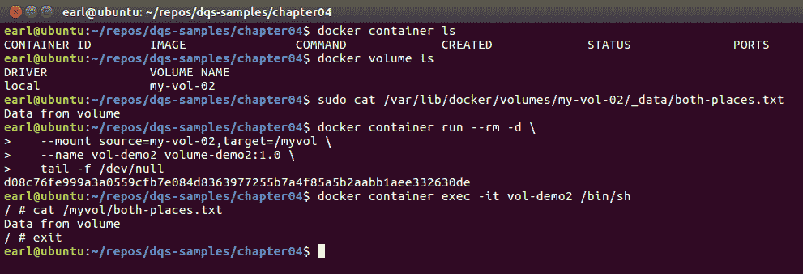
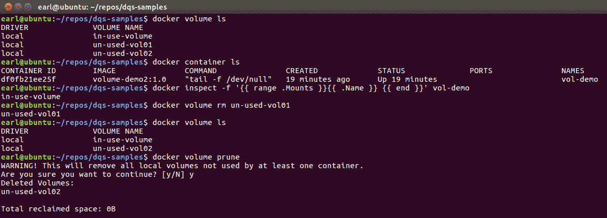

# 第四章：Docker 卷

在本章中，我们将学习 Docker 卷的秘密。我们将学习如何在 Docker 容器内部使用工作站上的文件夹，以及如何创建和使用持久卷，允许多个容器共享数据。我们将学习如何清理未使用的卷。最后，我们将学习如何创建数据卷容器，成为其他容器的卷的来源。

每年大约有 675 个集装箱在海上丢失。1992 年，一个装满玩具的 40 英尺集装箱实际上掉进了太平洋，10 个月后，其中一些玩具漂到了阿拉斯加海岸 - [`www.clevelandcontainers.co.uk/blog/16-fun-facts-about-containers`](https://www.clevelandcontainers.co.uk/blog/16-fun-facts-about-containers)

在本章中，我们将涵盖以下主题：

+   什么是 Docker 卷？

+   创建 Docker 卷

+   删除 Docker 卷的两种方法

+   使用数据卷容器在容器之间共享数据

# 技术要求

您将从 Docker 的公共存储库中拉取 Docker 镜像，因此需要基本的互联网访问权限来执行本章中的示例。

本章的代码文件可以在 GitHub 上找到：

[`github.com/PacktPublishing/Docker-Quick-Start-Guide/tree/master/Chapter04`](https://github.com/PacktPublishing/Docker-Quick-Start-Guide/tree/master/Chapter04)

查看以下视频以查看代码的运行情况：[`bit.ly/2QqK78a`](http://bit.ly/2QqK78a)

# 什么是 Docker 卷？

正如我们在第三章中学到的，Docker 使用一种称为**联合文件系统**的特殊文件系统。这是 Docker 分层镜像模型的关键，也允许许多使用 Docker 变得如此令人向往的功能。然而，联合文件系统无法提供数据的持久存储。回想一下，Docker 镜像的层是只读的。当你从 Docker 镜像运行一个容器时，Docker 守护进程会创建一个新的读写层，其中包含代表容器的所有实时数据。当容器对其文件系统进行更改时，这些更改会进入该读写层。因此，当容器消失时，带着读写层一起消失，容器对该层内数据所做的任何更改都将被删除并永远消失。这等同于非持久存储。然而，请记住，一般来说这是一件好事。事实上，是一件很好的事情。大多数情况下，这正是我们希望发生的。容器是临时的，它们的状态数据也是如此。然而，持久数据有很多用例，比如购物网站的客户订单数据。如果一个容器崩溃或需要重新堆叠，如果所有订单数据都消失了，那将是一个相当糟糕的设计。

这就是 Docker 卷的作用。Docker 卷是一个完全独立于联合文件系统之外的存储位置。因此，它不受镜像的只读层或容器的读写层所施加的相同规则的约束。Docker 卷是一个存储位置，默认情况下位于运行使用该卷的容器的主机上。当容器消失时，无论是出于设计还是因为灾难性事件，Docker 卷都会留下并可供其他容器使用。Docker 卷可以同时被多个容器使用。

描述 Docker 卷最简单的方式是：Docker 卷是一个存在于 Docker 主机上并在运行的 Docker 容器内部挂载和访问的文件夹。这种可访问性是双向的，允许从容器内部修改该文件夹的内容，或者在文件夹所在的 Docker 主机上进行修改。

现在，这个描述有点泛化。使用不同的卷驱动程序，作为卷被挂载的文件夹的实际位置可能不在 Docker 主机上。使用卷驱动程序，您可以在远程主机或云提供商上创建您的卷。例如，您可以使用 NFS 驱动程序允许在远程 NFS 服务器上创建 Docker 卷。

与 Docker 镜像和 Docker 容器一样，卷命令代表它们自己的管理类别。正如您所期望的那样，卷的顶级管理命令如下：

```
# Docker volume managment command
docker volume
```

卷管理组中可用的子命令包括以下内容：

```
# Docker volume management subcommands
docker volume create # Create a volume
docker volume inspect # Display information on one or more volumes
docker volume ls # List volumes
docker volume rm # Remove one or more volumes
docker volume prune          # Remove all unused local volumes
```

有几种不同的方法可以创建 Docker 卷，所以让我们继续通过创建一些来调查 Docker 卷。

# 参考

查看以下链接以获取更多信息：

+   使用 Docker 卷的 Docker 参考：[`docs.docker.com/storage/volumes/`](https://docs.docker.com/storage/volumes/)

+   Docker 卷插件信息：[`docs.docker.com/engine/extend/plugins_volume/`](https://docs.docker.com/engine/extend/plugins_volume/)

+   Docker 引擎卷插件：[`docs.docker.com/engine/extend/legacy_plugins/#volume-plugins`](https://docs.docker.com/engine/extend/legacy_plugins/#volume-plugins)

# 创建 Docker 卷

有几种方法可以创建 Docker 卷。一种方法是使用`volume create`命令。该命令的语法如下：

```
# Syntax for the volume create command
Usage:  docker volume create [OPTIONS] [VOLUME]
```

除了可选的卷名称参数外，`create`命令还允许使用以下选项：

```
# The options available to the volume create command:
-d, --driver string         # Specify volume driver name (default "local")
--label list                # Set metadata for a volume
-o, --opt map               # Set driver specific options (default map[])
```

让我们从最简单的例子开始：

```
# Using the volume create command with no optional parameters
docker volume create
```

执行上述命令将创建一个新的 Docker 卷并分配一个随机名称。该卷将使用内置的本地驱动程序（默认情况下）。使用`volume ls`命令，您可以看到 Docker 守护程序分配给我们新卷的随机名称。它看起来会像这样：


再上一层，让我们创建另一个卷，这次使用命令提供一个可选的卷名称。命令看起来会像这样：

```
# Create a volume with a fancy name
docker volume create my-vol-02
```

这次，卷已创建，并被命名为`my-vol-02`，如所请求的：


这个卷仍然使用默认的本地驱动程序。使用本地驱动程序只意味着这个卷所代表的文件夹的实际位置可以在 Docker 主机上本地找到。我们可以使用卷检查子命令来查看该文件夹实际上可以找到的位置：



正如您在前面的屏幕截图中所看到的，该卷的挂载点位于 Docker 主机的文件系统上，路径为`/var/lib/docker/volumes/my-vol-02/_data`。请注意，文件夹路径由 root 所有，这意味着您需要提升的权限才能从主机访问该位置。还要注意，这个示例是在 Linux 主机上运行的。

如果您使用的是 OS X，您需要记住，您的 Docker 安装实际上是在使用一个几乎无缝的虚拟机。其中一个无缝显示的领域是使用 Docker 卷。在 OS X 主机上创建 Docker 卷时创建的挂载点存储在虚拟机的文件系统中，而不是在您的 OS X 文件系统中。当您使用 docker volume inspect 命令并查看卷的挂载点路径时，它不是您的 OS X 文件系统上的路径，而是隐藏虚拟机文件系统上的路径。

有一种方法可以查看隐藏虚拟机的文件系统（和其他功能）。通过一个命令，通常称为魔术屏幕命令，您可以访问正在运行的 Docker VM。该命令如下：

```
# The Magic Screen command
screen ~/Library/Containers/com.docker.docker/Data
/com.docker.driver.amd64-linux/tty
# or if you are using Mac OS High Sierra
screen ~/Library/Containers/com.docker.docker/Data/vms/0/tty
```

使用*Ctrl* + *AK*来终止屏幕会话。

您可以使用*Ctrl* + *A Ctrl* + *D*分离，然后使用`screen -r`重新连接，但不要分离然后启动新的屏幕会话。在 VM 上运行多个屏幕会给您 tty 垃圾。

这是一个在 OS X 主机上创建的卷的挂载点访问示例。这是设置：

```
# Start by creating a new volume
docker volume create my-osx-volume
# Now find the Mountpoint
docker volume inspect my-osx-volume -f "{{json .Mountpoint}}"
# Try to view the contents of the Mountpoint's folder
sudo ls -l /var/lib/docker/volumes/my-osx-volume
# "No such file or directory" because the directory does not exist on the OS X host
```

这就是设置的样子：


现在，这是如何使用魔术屏幕命令来实现我们想要的，即访问卷的挂载点：

```
# Now issue the Magic Screen command and hit <enter> to get a prompt
screen ~/Library/Containers/com.docker.docker/Data/vms/0/tty
# You are now root in the VM, and can issue the following command
ls -l /var/lib/docker/volumes/my-osx**-volume** # The directory exists and you will see the actual Mountpoint sub folder "_data"
# Now hit control-a followed by lower case k to kill the screen session
<CTRL-a>k 
```

然后...


现在是一个很好的时机指出，我们创建了这些卷，而从未创建或使用 Docker 容器。这表明 Docker 卷是在正常容器联合文件系统之外的领域。

我们在第三章中看到，*创建 Docker 镜像*，我们还可以使用容器运行命令上的参数或在 Dockerfile 中添加`VOLUME`指令来创建卷。并且，正如您所期望的那样，您可以使用 Docker `volume create`命令预先创建的卷通过使用容器运行参数，即`--mount`参数，将卷挂载到容器中，例如，如下所示：

```
# mount a pre-created volume with --mount parameter
docker container run --rm -d \
--mount source=my-vol-02,target=/myvol \
--name vol-demo2 \
volume-demo2:1.0 tail -f /dev/null
```

这个例子将运行一个新的容器，它将挂载现有的名为`my-vol-02`的卷。它将在容器中的`/myvol`处挂载该卷。请注意，前面的例子也可以在不预先创建`my-vol-02:volume`的情况下运行，使用`--mount`参数运行容器的行为将在启动容器的过程中创建卷。请注意，当挂载卷时，图像挂载点文件夹中定义的任何内容都将添加到卷中。但是，如果图像挂载点文件夹中存在文件，则它也存在于主机的挂载点，并且主机文件的内容将最终成为文件中的内容。使用此 Dockerfile 中的图像，看起来是这样的：

```
# VOLUME instruction Dockerfile for Docker Quick Start
FROM alpine
RUN mkdir /myvol
RUN echo "Data from image" > /myvol/both-places.txt
CMD ["sh"]
```

请注意`Data from image`行。现在，使用一个包含与`both-places.txt`匹配名称的文件的预先创建的卷，但文件中包含`Data from volume`内容，我们将基于该图像运行一个容器。发生了什么：



正如您所看到的，尽管 Dockerfile 创建了一个带有`Data from image`内容的文件，但当我们从该图像运行一个容器并挂载一个具有相同文件的卷时，卷中的内容（`Data from volume`）占优势，并且是在运行容器中找到的内容。

请记住，无法通过 Dockerfile 中的`VOLUME`指令挂载预先创建的卷。不存在名为 volume 的 Dockerfile `VOLUME`指令。原因是 Dockerfile 无法指定卷从主机挂载的位置。允许这样做会有几个原因。首先，由于 Dockerfile 创建了一个镜像，从该镜像运行的每个容器都将尝试挂载相同的主机位置。这可能会很快变得非常糟糕。其次，由于容器镜像可以在不同的主机操作系统上运行，很可能一个操作系统的主机路径定义在另一个操作系统上甚至无法工作。再次，很糟糕。第三，定义卷主机路径将打开各种安全漏洞。糟糕，糟糕，糟糕！因此，使用 Dockerfile 构建的图像运行具有`VOLUME`指令的容器将始终在主机上创建一个新的，具有唯一名称的挂载点。在 Dockerfile 中使用`VOLUME`指令的用途有些有限，例如当容器将运行始终需要读取或写入预期在文件系统中特定位置的数据的应用程序，但不应该是联合文件系统的一部分。

还可以在主机上的文件与容器中的文件之间创建一对一的映射。要实现这一点，需要在容器运行命令中添加一个`-v`参数。您需要提供要从主机共享的文件的路径和文件名，以及容器中文件的完全限定路径。容器运行命令可能如下所示：

```
# Map a single file from the host to a container
echo "important data" > /tmp/data-file.txt
docker container run --rm -d \
 -v /tmp/data-file.txt:/myvol/data-file.txt \
 --name vol-demo \
 volume-demo2:1.0 tail -f /dev/null
# Prove it
docker exec vol-demo cat /myvol/data-file.txt
```

可能如下所示：


有几种不同的方法可以在容器运行命令中定义卷。为了说明这一点，看看以下运行命令，每个都将完成相同的事情：

```
# Using --mount with source and target
docker container run --rm -d \
 --mount source=my-volume,target=/myvol,readonly \
 --name vol-demo1 \
 volume-demo:latest tail -f /dev/null
 # Using --mount with source and destination
docker container run --rm -d \
 --mount source=my-volume,destination=/myvol,readonly \
 --name vol-demo2 \
 volume-demo:latest tail -f /dev/null
 # Using -v 
docker container run --rm -d \
 -v my-volume:/myvol:ro \
 --name vol-demo3 \
 volume-demo:latest tail -f /dev/null
```

前面三个容器运行命令都将创建一个已挂载相同卷的容器，以只读模式。可以使用以下命令进行验证：

```
# Check which container have mounted a volume by name
docker ps -a --filter volume=in-use-volume
```


# 参考资料

查看以下链接获取更多信息：

+   Docker `volume create`参考：[`docs.docker.com/engine/reference/commandline/volume_create/`](https://docs.docker.com/engine/reference/commandline/volume_create/)

+   Docker 存储参考文档：[`docs.docker.com/storage/`](https://docs.docker.com/storage/)

# 删除卷

我们已经看到并使用了卷列表命令`volume ls`和检查命令`volume inspect`，我认为您应该对这些命令的功能有很好的理解。卷管理组中还有另外两个命令，都用于卷的移除。第一个是`volume rm`命令，您可以使用它按名称移除一个或多个卷。然后，还有`volume prune`命令；使用清理命令，您可以移除所有未使用的卷。在使用此命令时要特别小心。以下是删除和清理命令的语法：

```
# Remove volumes command syntax
Usage: docker volume rm [OPTIONS] VOLUME [VOLUME...]
# Prune volumes command syntax
Usage: docker volume prune [OPTIONS]
```

以下是使用删除和清理命令的一些示例：



由于`in-use-volume`卷被挂载在`vol-demo`容器中，它没有被清理命令移除。您可以在卷列表命令上使用过滤器，查看哪些卷与容器不相关，因此将在清理命令中被移除。以下是过滤后的 ls 命令：

```
# Using a filter on the volume ls command
docker volume ls --filter dangling=true
```

# 参考资料

查看以下链接以获取更多信息：

+   Docker 的卷删除命令的维基文档：[`docs.docker.com/engine/reference/commandline/volume_rm/`](https://docs.docker.com/engine/reference/commandline/volume_rm/)

+   Docker 的卷清理命令的维基文档：[`docs.docker.com/engine/reference/commandline/volume_prune`](https://docs.docker.com/engine/reference/commandline/volume_prune)/

+   有关清理 Docker 对象的信息：[`docs.docker.com/config/pruning/`](https://docs.docker.com/config/pruning/)

# 使用数据卷容器在容器之间共享数据

Docker 卷的另一个功能允许您将一个 Docker 容器中挂载的卷与其他容器共享。这被称为**数据卷容器**。使用数据卷容器基本上是一个两步过程。在第一步中，您运行一个容器，该容器创建或挂载 Docker 卷（或两者），在第二步中，当运行其他容器时，您使用特殊的卷参数`--volumes-from`来配置它们挂载在第一个容器中的所有卷。以下是一个例子：

```
# Step 1
docker container run \
 --rm -d \
 -v data-vol-01:/data/vol1 -v data-vol-02:/data/vol2 \
 --name data-container \
 vol-demo2:1.0 tail -f /dev/null
# Step 2
docker container run \
 --rm -d \
 --volumes-from data-container \
 --name app-container \
 vol-demo2:1.0 tail -f /dev/null
# Prove it
docker container exec app-container ls -l /data
# Prove it more
docker container inspect -f '{{ range .Mounts }}{{ .Name }} {{ end }}' app-container
```

执行时的样子如下：


在这个例子中，第一个容器运行命令正在创建卷，但它们也可以很容易地在之前的容器运行命令中预先创建，或者来自`volume create`命令。

# 参考资料

这是一篇关于数据卷容器的优秀文章，包括如何使用它们进行数据备份和恢复：[`www.tricksofthetrades.net/2016/03/14/docker-data-volumes/`](https://www.tricksofthetrades.net/2016/03/14/docker-data-volumes/)。

# 摘要

在本章中，我们深入探讨了 Docker 卷。我们了解了 Docker 卷的实际含义，以及创建它们的几种方法。我们学习了使用`volume create`命令、容器运行命令和 Dockerfile 的`VOLUME`指令创建 Docker 卷的区别。我们还看了一些删除卷的方法，以及如何使用数据容器与其他容器共享卷。总的来说，你现在应该对自己的 Docker 卷技能感到非常自信。到目前为止，我们已经建立了扎实的 Docker 知识基础。

在第五章中，*Docker Swarm*，我们将通过学习 Docker Swarm 来扩展基础知识。这将是真正开始变得令人兴奋的地方。如果你准备好学习更多，请翻页！
