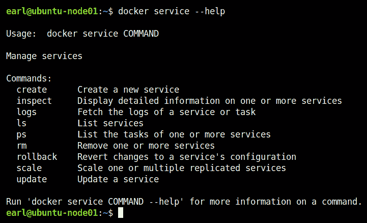
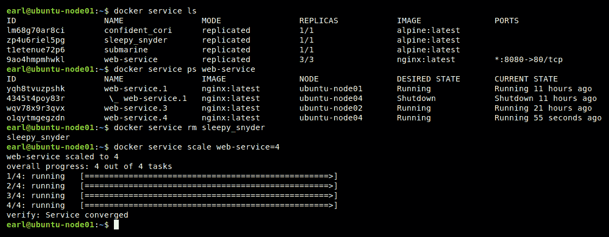
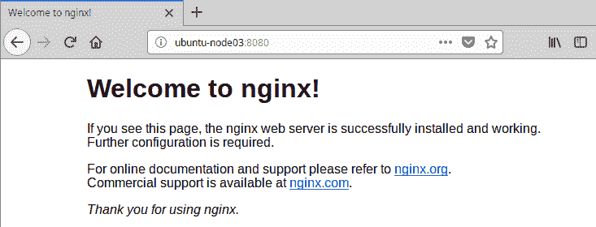

# Docker Swarm

在本章中，我们将学习什么是 Docker swarm，以及如何设置 Docker swarm 集群。我们将了解所有的集群管理命令，然后我们将更多地了解集群管理者和集群工作者。接下来，我们将发现集群服务。最后，我们将发现在集群中任何节点上运行的容器应用程序是多么容易访问。

目前全球有超过 17,000,000 个集装箱，其中 5 或 6,000,000 个正在船舶、卡车和火车上运输。总共，它们每年大约进行 200,000,000 次旅行。- [`www.billiebox.co.uk/facts-about-shipping-containers`](https://www.billiebox.co.uk/facts-about-shipping-containers)

在本章中，我们将涵盖以下主题：

+   什么是 Docker swarm？

+   建立 Docker swarm 集群

+   管理者和工作者

+   集群服务

+   访问集群中的容器应用程序

# 技术要求

您将从 Docker 的公共存储库中拉取 Docker 镜像，因此需要基本的互联网访问权限来执行本章中的示例。您将设置一个多节点的集群，因此需要多个节点来完成本章的示例。您可以使用物理服务器、EC2 实例、vSphere 或 Workstation 上的虚拟机，甚至是 Virtual Box 上的虚拟机。我在 Vmware Workstation 上使用了 6 个虚拟机作为我的节点。每个虚拟机配置为 1GB 内存、1 个 CPU 和 20GB 硬盘。所使用的客户操作系统是 Xubuntu 18.04，因为它体积小且具有完整的 Ubuntu 功能集。Xubuntu 可以从[`xubuntu.org/download/`](https://xubuntu.org/download/)下载。任何现代的 Linux 操作系统都可以作为节点的选择。

本章的代码文件可以在 GitHub 上找到：

[`github.com/PacktPublishing/Docker-Quick-Start-Guide/tree/master/Chapter05`](https://github.com/PacktPublishing/Docker-Quick-Start-Guide/tree/master/Chapter05)

查看以下视频以查看代码的运行情况：[`bit.ly/2KENJOD`](http://bit.ly/2KENJOD)

# 什么是 Docker swarm？

你可能没有注意到，但到目前为止，我们在示例中使用的所有 Docker 工作站部署或节点都是以单引擎模式运行的。这是什么意思？这告诉我们，Docker 安装是直接管理的，作为一个独立的 Docker 环境。虽然这是有效的，但它不太高效，也不具有良好的扩展性。当然，Docker 了解到这些限制，并为这个问题提供了一个强大的解决方案。它被称为 Docker 蜂群。Docker 蜂群是将 Docker 节点连接在一起，并有效地管理这些节点和在其上运行的 docker 化应用程序的一种方式。简而言之，Docker 蜂群是一组 Docker 节点连接并作为集群或蜂群进行管理。Docker 蜂群内置在 Docker 引擎中，因此无需额外安装即可使用。当 Docker 节点是蜂群的一部分时，它运行在蜂群模式下。如果有任何疑问，您可以使用`docker system info`命令轻松检查运行 Docker 的系统是否是蜂群的一部分或者是以单引擎模式运行：


提供蜂群模式的功能是 Docker SwarmKit 的一部分，这是一个用于在规模上编排分布式系统的工具，即 Docker 蜂群集群。一旦 Docker 节点加入蜂群，它就成为蜂群节点，成为管理节点或工作节点。我们很快会谈到管理节点和工作节点之间的区别。现在，知道加入新蜂群的第一个 Docker 节点成为第一个管理节点，也被称为领导者。当第一个节点加入蜂群并成为领导者时，会发生很多技术上的魔法（实际上，它创建并初始化了蜂群，然后加入了蜂群）。以下是发生的一些巫术（没有特定顺序）：

+   创建了基于 Swarm-ETCD 的配置数据库或集群存储，并进行了加密

+   为所有节点间通信设置了双向 TLS（mTLS）认证和加密

+   启用了容器编排，负责管理容器在哪些节点上运行

+   集群存储被配置为自动复制到所有管理节点

+   该节点被分配了一个加密 ID

+   启用了基于 Raft 的分布式共识管理系统

+   节点成为管理节点并被选举为蜂群领导者

+   蜂群管理器被配置为高可用

+   创建了一个公钥基础设施系统

+   节点成为证书颁发机构，允许其向加入集群的任何节点颁发客户端证书

+   证书颁发机构上配置了默认的 90 天证书轮换策略

+   节点获得其客户端证书，其中包括其名称、ID、集群 ID 和节点在集群中的角色

+   为添加新的 swarm 管理者创建一个新的加密加入令牌

+   为添加新的 swarm 工作节点创建一个新的加密加入令牌

该列表代表了通过将第一个节点加入到 swarm 中获得的许多强大功能。伴随着强大的功能而来的是巨大的责任，这意味着您确实需要准备好做大量工作来创建您的 Docker swarm，正如您可能想象的那样。因此，让我们继续下一节，我们将讨论在设置 swarm 集群时如何启用所有这些功能。

# 参考资料

查看以下链接获取更多信息：

+   SwarmKit 的存储库：[`github.com/docker/swarmkit`](https://github.com/docker/swarmkit)

+   Raft 一致性算法：[`raft.github.io/`](https://raft.github.io/)

# 如何设置 Docker swarm 集群

您刚刚了解了创建 Docker swarm 集群时启用和设置的所有令人难以置信的功能。现在我将向您展示设置 Docker swarm 集群所需的所有步骤。准备好了吗？以下是它们：

```
# Set up your Docker swarm cluster
docker swarm init
```

什么？等等？剩下的在哪里？没有。没有遗漏任何内容。在上一节描述的所有设置和功能都可以通过一个简单的命令实现。通过单个的`swarm init`命令，集群被创建，节点从单实例节点转变为 swarm 模式节点，节点被分配为管理者角色并被选举为集群的领导者，集群存储被创建，节点成为集群的证书颁发机构并为自己分配一个包含加密 ID 的新证书，为管理者创建一个新的加密加入令牌，为工作节点创建另一个令牌，依此类推。这就是简化的复杂性。

swarm 命令组成了另一个 Docker 管理组。以下是 swarm 管理命令：


我们将在片刻后审查每个命令的目的，但在此之前，我想让您了解一些重要的网络配置。我们将在第六章 *Docker Networking*中更多地讨论 Docker 网络，但现在请注意，您可能需要在 Docker 节点上打开一些协议和端口的访问权限，以使 Docker swarm 正常运行。以下是来自 Docker 的*Getting started with swarm mode*维基的信息：


您可能需要为 REST API 打开的另外两个端口如下：

+   TCP 2375 用于 Docker REST API（纯文本）

+   TCP 2376 用于 Docker REST API（ssl）

好了，让我们继续审查 swarm 命令。

# docker swarm init

您已经看到了 init 命令的用途，即创建 swarm 集群，将第一个 Docker 节点添加到其中，然后设置和启用我们刚刚介绍的所有 swarm 功能。init 命令可以简单地使用它而不带任何参数，但有许多可用的可选参数可用于微调初始化过程。您可以通过使用`--help`获得所有可选参数的完整列表，但现在让我们考虑一些可用的参数：

+   `--autolock`：使用此参数启用管理器自动锁定。

+   `--cert-expiry duration`：使用此参数更改节点证书的默认有效期（90 天）。

+   `--external-ca external-ca`：使用此参数指定一个或多个证书签名端点，即外部 CA。

# docker swarm join-token

当您在第一个节点上运行`swarm init`命令初始化 swarm 时，执行的功能之一是创建唯一的加密加入令牌，一个加入额外的管理节点，一个加入工作节点。使用`join-token`命令，您可以获取这两个加入令牌。实际上，使用`join-token`命令将为您提供指定角色的完整加入命令。角色参数是必需的。以下是命令的示例：

```
# Get the join token for adding managers
docker swarm join-token manager
# Get the join token for adding workers
docker swarm join-token worker
```

以下是它的样子：


```
# Rotate the worker join token
docker swarm join-token --rotate worker
```

请注意，这不会使已使用旧的、现在无效的加入令牌的现有工作节点失效。它们仍然是 swarm 的一部分，并且不受加入令牌更改的影响。只有您希望加入 swarm 的新节点需要使用新令牌。

# docker swarm join

您已经在前面的 *docker swarm join-token* 部分看到了 join 命令的使用。join 命令与加密的 join token 结合使用，用于将 Docker 节点添加到 swarm 中。除了第一个节点之外，所有节点都将使用 join 命令加入到 swarm 中（第一个节点当然使用 "init" 命令）。join 命令有一些参数，其中最重要的是 `--token` 参数。这是必需的 join token，可通过 `join-token` 命令获取。以下是一个示例：

```
# Join this node to an existing swarm
docker swarm join --token SWMTKN-1-3ovu7fbnqfqlw66csvvfw5xgljl26mdv0dudcdssjdcltk2sen-a830tv7e8bajxu1k5dc0045zn 192.168.159.156:2377
```

您会注意到，此命令不需要角色。这是因为 token 本身与其创建的角色相关联。当您执行 join 时，输出会提供一个信息消息，告诉您节点加入的角色是管理节点还是工作节点。如果您无意中使用了管理节点 token 加入工作节点，或反之，您可以使用 `leave` 命令将节点从 swarm 中移除，然后使用实际所需角色的 token，重新将节点加入到 swarm。

# docker swarm ca

当您想要查看 swarm 的当前证书或需要旋转当前的 swarm 证书时，可以使用 `swarm ca` 命令。要旋转证书，您需要包括 `--rotate` 参数：

```
# View the current swarm certificate
docker swarm ca
# Rotate the swarm certificate
docker swarm ca --rotate
```

`swarm ca` 命令只能在 swarm 管理节点上成功执行。您可能使用旋转 swarm 证书功能的一个原因是，如果您正在从内部根 CA 切换到外部 CA，或者反之。另一个可能需要旋转 swarm 证书的原因是，如果一个或多个管理节点受到了威胁。在这种情况下，旋转 swarm 证书将阻止所有其他管理节点能够使用旧证书与旋转证书的管理节点或彼此进行通信。旋转证书时，命令将保持活动状态，直到所有 swarm 节点（管理节点和工作节点）都已更新。以下是在一个非常小的集群上旋转证书的示例：


由于命令将保持活动状态，直到所有节点都更新了 TLS 证书和 CA 证书，如果集群中有离线的节点，可能会出现问题。当这是一个潜在的问题时，您可以包括`--detach`参数，命令将启动证书旋转并立即返回会话控制。请注意，当您使用`--detach`可选参数时，您将不会得到有关证书旋转进度、成功或失败的任何状态。您可以使用 node ls 命令查询集群中证书的状态以检查进度。以下是您可以使用的完整命令：

```
# Query the state of the certificate rotation in a swarm cluster
docker node ls --format '{{.ID}} {{.Hostname}} {{.Status}} {{.TLSStatus}}'
```

`ca rotate`命令将继续尝试完成，无论是在前台还是在后台（如果分离）。如果在旋转启动时节点离线，然后重新上线，证书旋转将完成。这里有一个示例，`node04`在执行旋转命令时处于离线状态，然后过了一会儿，它重新上线；检查状态发现它成功旋转了：


另一个重要的要点要记住的是，旋转证书将立即使当前的加入令牌无效。

# docker swarm unlock

您可能还记得关于`docker swarm init`命令的讨论，其中一个可选参数是`--autolock`。使用此参数将在集群中启用自动锁定功能。这是什么意思？嗯，当一个集群配置为使用自动锁定时，任何时候管理节点的 docker 守护程序离线，然后重新上线（即重新启动），都需要输入解锁密钥才能允许节点重新加入集群。为什么要使用自动锁定功能来锁定您的集群？自动锁定功能有助于保护集群的相互 TLS 加密密钥，以及用于集群的 raft 日志的加密和解密密钥。这是一个旨在补充 Docker Secrets 的额外安全功能。当锁定的集群的管理节点上的 docker 守护程序重新启动时，您必须输入解锁密钥。以下是使用解锁密钥的样子：


顺便说一句，对于其余的群集，尚未解锁的管理节点将报告为已关闭，即使 Docker 守护程序正在运行。Swarm 自动锁定功能可以使用`swarm update`命令在现有的 Swarm 集群上启用或禁用，我们很快将看一下。解锁密钥是在 Swarm 初始化期间生成的，并将在那时在命令行上呈现。如果您丢失了解锁密钥，可以使用`swarm unlock-key`命令在未锁定的管理节点上检索它。

# docker swarm unlock-key

`swarm unlock-key`命令很像`swarm ca`命令。解锁密钥命令可用于检索当前的 Swarm 解锁密钥，或者可以用于将解锁密钥更改为新的：

```
# Retrieve the current unlock key
docker swarm unlock-key
# Rotate to a new unlock key
docker swarm unlock-key --rotate
```

根据 Swarm 集群的大小，解锁密钥轮换可能需要一段时间才能更新所有管理节点。

当您轮换解锁密钥时，最好在更新密钥之前将当前（旧）密钥随手放在一边，以防万一管理节点在获取更新的密钥之前离线。这样，您仍然可以使用旧密钥解锁节点。一旦节点解锁并接收到轮换（新）解锁密钥，旧密钥就可以丢弃了。

正如您可能期望的那样，`swarm unlock-key`命令只在启用了自动锁定功能的集群的管理节点上使用时才有用。如果您的集群未启用自动锁定功能，可以使用`swarm update`命令启用它。

# docker swarm update

在第一个管理节点上通过`docker swarm init`命令初始化集群时，将启用或配置几个 Swarm 集群功能。在集群初始化后，可能会有时候您想要更改哪些功能已启用、已禁用或已配置。要实现这一点，您需要使用`swarm update`命令。例如，您可能想要为 Swarm 集群启用自动锁定功能。或者，您可能想要更改证书有效期。这些都是您可以使用`swarm update`命令执行的更改类型。这样做可能看起来像这样：

```
# Enable autolock on your swarm cluster
docker swarm update --autolock=true
# Adjust certificate expiry to 30 days
docker swarm update --cert-expiry 720h
```

以下是`swarm update`命令可能影响的设置列表：


# docker swarm leave

这基本上是你所期望的。您可以使用`leave`命令从 swarm 中移除 docker 节点。以下是需要使用`leave`命令来纠正用户错误的示例：


Node03 原本是一个管理节点。我不小心将该节点添加为工作者。意识到我的错误后，我使用`swarm leave`命令将节点从 swarm 中移除，将其放回单实例模式。然后，使用*manager*加入令牌，我将节点重新添加到 swarm 作为管理者。哦！危机已解除。

# 参考资料

查看以下链接获取更多信息：

+   使用 swarm 模式教程入门：[`docs.docker.com/engine/swarm/swarm-tutorial/`](https://docs.docker.com/engine/swarm/swarm-tutorial/)

+   `docker swarm init`命令的 wiki 文档：[`docs.docker.com/engine/reference/commandline/swarm_init/`](https://docs.docker.com/engine/reference/commandline/swarm_init/)

+   `docker swarm ca`命令的 wiki 文档：[`docs.docker.com/engine/reference/commandline/swarm_ca/`](https://docs.docker.com/engine/reference/commandline/swarm_ca/)

+   `docker swarm join-token`命令的 wiki 文档：[`docs.docker.com/engine/reference/commandline/swarm_join-token/`](https://docs.docker.com/engine/reference/commandline/swarm_join-token/)

+   `docker swarm join`命令的 wiki 文档：[`docs.docker.com/engine/reference/commandline/swarm_join/`](https://docs.docker.com/engine/reference/commandline/swarm_join/)

+   `docker swarm unlock`命令的 wiki 文档：[`docs.docker.com/engine/reference/commandline/swarm_unlock/`](https://docs.docker.com/engine/reference/commandline/swarm_unlock/)

+   `docker swarm unlock-key`命令的 wiki 文档：[`docs.docker.com/engine/reference/commandline/swarm_unlock-key/`](https://docs.docker.com/engine/reference/commandline/swarm_unlock-key/)

+   `docker swarm update`命令的 wiki 文档：[`docs.docker.com/engine/reference/commandline/swarm_update/`](https://docs.docker.com/engine/reference/commandline/swarm_update/)

+   `docker swarm leave`命令的 wiki 文档：[`docs.docker.com/engine/reference/commandline/swarm_leave/`](https://docs.docker.com/engine/reference/commandline/swarm_leave/)

+   了解更多关于 Docker Secrets 的信息：[`docs.docker.com/engine/swarm/secrets/`](https://docs.docker.com/engine/swarm/secrets/)

# 管理者和工作者

我们在前面的章节中已经讨论了集群管理节点，但让我们更仔细地看看管理节点的工作。管理节点确切地做了你所期望的事情。它们管理和维护集群的状态。它们调度集群服务，我们将在本章的*集群服务*部分中讨论，但现在，把集群服务想象成运行的容器。管理节点还提供集群的 API 端点，允许通过 REST 进行编程访问。管理节点还将流量引导到正在运行的服务，以便任何容器都可以通过任何管理节点访问，而无需知道实际运行容器的节点。作为维护集群状态的一部分，管理节点将处理系统中节点的丢失，在管理节点丢失时选举新的领导节点，并在容器或节点宕机时保持所需数量的服务容器运行。

集群中管理节点的最佳实践是三个、五个或七个。你会注意到所有这些选项都代表管理节点的奇数数量。这是为了在领导节点丢失时，raft 一致性算法可以更容易地为集群选择新的领导者。你可以运行一个只有一个管理节点的集群，这实际上比有两个管理节点更好。但是，对于一个更高可用的集群，建议至少有三个管理节点。对于更大的集群，有五个或七个管理节点是不错的选择，但不建议超过七个。一旦在同一集群中有超过七个管理节点，你实际上会遇到性能下降的问题。

对于管理节点来说，另一个重要考虑因素是它们之间的网络性能。管理节点需要低延迟的网络连接以实现最佳性能。例如，如果你在 AWS 上运行你的集群，你可能不希望管理节点分布在不同的地区。如果这样做，你可能会遇到集群的问题。如果你将管理节点放在同一地区的不同可用区内，你不应该遇到任何与网络性能相关的问题。

工作节点除了运行容器之外什么也不做。当领导节点宕机时，它们没有发言权。它们不处理 API 调用。它们不指挥流量。它们除了运行容器之外什么也不做。事实上，你不能只有一个工作节点的 swarm。另一方面，你可以只有一个管理节点的 swarm，在这种情况下，管理节点也将充当工作节点，并在其管理职责之外运行容器。

默认情况下，所有管理节点实际上也是工作节点。这意味着它们可以并且将运行容器。如果您希望您的管理节点不运行工作负载，您需要更改节点的可用性设置。将其更改为排水将小心地停止标记为排水的管理节点上的任何运行容器，并在其他（非排水）节点上启动这些容器。在排水模式下，不会在节点上启动新的容器工作负载，例如如下所示：

```
# Set node03's availability to drain
docker node update --availability drain ubuntu-node03
```

也许有时候您想要或需要改变 swarm 中 docker 节点的角色。您可以将工作节点提升为管理节点，或者将管理节点降级为工作节点。以下是这些活动的一些示例：

```
# Promote worker nodes 04 and 05 to manager status
docker node promote ubuntu-node04 ubuntu-node05
# Demote manager nodes 01 and 02 to worker status
docker node demote ubuntu-node01 ubuntu-node02
```

# 参考

请查看有关节点如何工作的官方文档[https://docs.docker.com/engine/swarm/how-swarm-mode-works/nodes/]。

# Swarm 服务

好了。现在你已经了解了如何设置 Docker swarm 集群，以及它的节点如何从单引擎模式转换为 swarm 模式。你也知道这样做的意义是为了让你摆脱直接管理单个运行的容器。因此，你可能开始想知道，如果我现在不直接管理我的容器，我该如何管理它们？你来对地方了！这就是 swarm 服务发挥作用的地方。swarm 服务允许您根据容器应用程序的并发运行副本数量来定义所需的状态。让我们快速看一下在 swarm 服务的管理组中有哪些可用的命令，然后我们将讨论这些命令：



您可能想要做的第一件事情是创建一个新的服务，因此我们将从`service create`命令开始讨论我们的 swarm 服务。以下是`service create`命令的语法和基本示例：

```
# Syntax for the service create command
# Usage: docker service create [OPTIONS] IMAGE [COMMAND] [ARG...]
# Create a service
docker service create --replicas 1 --name submarine alpine ping google.com
```

好的。让我们分解一下这里显示的`service create`命令示例。首先，你有管理组服务，然后是`create`命令。然后，我们开始进入参数；第一个是`--replicas`。这定义了应同时运行的容器副本数量。接下来是`--name`参数。这个很明显，是我们要创建的服务的名称，在这种情况下是`submarine`。我们将能够在其他服务命令中使用所述名称。在名称参数之后，我们有完全合格的 Docker 镜像名称。在这种情况下，它只是`alpine`。它可以是诸如`alpine:3.8`或`alpine:latest`之类的东西，或者更合格的东西，比如`tenstartups/alpine:latest`。在用于服务的图像名称之后是运行容器时要使用的命令和传递给该命令的参数——分别是`ping`和`google.com`。因此，前面的`service create`命令示例将从`alpine`镜像启动一个单独的容器，该容器将使用`ping`命令和 google.com 参数运行，并将服务命名为`submarine`。看起来是这样的：


你现在知道了创建 docker 服务的基础知识。但在你过于兴奋之前，`service create`命令还有很多内容要涵盖。事实上，这个命令有很多选项，列出它们将占据本书两页的篇幅。所以，我希望你现在使用`--help`功能并输入以下命令：

```
# Get help with the service create command
docker service create --help
```

我知道，对吧？有很多可选参数可以使用。别担心。我不会丢下你不管的。我会给你一些指导，帮助你建立创建服务的坚实基础，然后你可以扩展并尝试一些你在`--help`中看到的其他参数。

只是让你知道，到目前为止我们使用的两个参数，`--replicas`和`--name`，都是可选的。如果你不提供要使用的副本数量，服务将以默认值 1 创建。此外，如果你不为服务提供名称，将会编造一个奇特的名称并赋予服务。这与我们在第二章中使用`docker container run`命令时看到的默认命名类型相同，*学习 Docker 命令*。通常最好为每个发出的`service create`命令提供这两个选项。

另外，要知道，一般来说，在前面的示例中提供的镜像的命令和命令参数也是可选的。在这种特定情况下，它们是必需的，因为单独从 alpine 镜像运行的容器，如果没有提供其他命令或参数，将会立即退出。在示例中，这将显示为无法收敛服务，Docker 将永远尝试重新启动服务。换句话说，如果使用的镜像内置了命令和参数（比如在 Dockerfile 的`CMD`或`ENTRYPOINT`指令中），则可以省略命令及其参数。

现在让我们继续讨论一些创建参数。你应该还记得第二章中提到的`--publish`参数，你可以在`docker container run`命令上使用，它定义了在 docker 主机上暴露的端口以及主机端口映射到的容器中的端口。它看起来像这样：

```
# Create a nginx web-server that redirects host traffic from port 8080 to port 80 in the container docker container run --detach --name web-server1 --publish 8080:80 nginx
```

好吧，你需要为一个集群服务使用相同的功能，在他们的智慧中，Docker 使`container run`命令和`service create`命令使用相同的参数：`--publish`。你可以使用我们之前看到的相同的缩写格式，`--publish 8080:80`，或者你可以使用更详细的格式：`--publish published=8080`，`target=80`。这仍然意味着将主机流量从端口`8080`重定向到容器中的端口 80。让我们尝试另一个例子，这次使用`--publish`参数。我们将再次运行`nginx`镜像：

```
# Create a nginx web-server service using the publish parameter
docker service create --name web-service --replicas 3 --publish published=8080,target=80 nginx
```

这个例子将创建一个新的服务，运行三个容器副本，使用`nginx`镜像，在容器上暴露端口`80`，在主机上暴露端口`8080`。看一下：


现在，您已经接近成功了。让我们快速介绍另外三个参数，然后您就可以准备好应对世界（至少是集群服务的世界）。首先是 `--restart-window`。此参数用于告诉 Docker 守护程序在测试容器是否健康之前等待多长时间启动其应用程序。默认值为五秒。如果您在容器中创建了一个需要超过五秒才能启动并报告为健康的应用程序，您将需要在 `service create` 中包含 `--restart-window` 参数。接下来是 `--restart-max-attempts`。此参数告诉 Docker 守护程序在放弃之前尝试启动未报告为健康的容器副本的次数。默认值是*永不放弃*。*永不投降*！最后，让我们谈谈 `--mode` 参数。集群服务的默认模式是*replicated*。这意味着 Docker 守护程序将继续为您的服务创建容器，直到同时运行的容器数量等于您在 `--replicas` 参数中提供的值（如果您没有提供该参数，则为 1）。例如，使用 `--replicas 3` 参数，您将在集群中获得三个运行中的容器。还有另一种模式，称为**global**。如果您在创建服务时提供 `--mode global` 参数，Docker 守护程序将在集群中的每个节点上精确地创建一个容器。如果您有一个六节点的集群，您将得到六个运行中的容器，每个节点一个。对于一个 12 节点的集群，您将得到 12 个容器，依此类推。当您有为每个主机提供功能的服务时，例如监控应用程序或日志转发器，这是一个非常方便的选项。

让我们回顾一些其他您需要了解和使用的服务命令。一旦您创建了一些服务，您可能想要列出这些服务。这可以通过 `service list` 命令来实现。如下所示：

```
# List services in the swarm
# Usage: docker service ls [OPTIONS]
docker service list
```

一旦您查看了运行中服务的列表，您可能想要了解一个或多个服务的更多详细信息。为了实现这一点，您将使用 `service ps` 命令。看一下：

```
# List the tasks associated with a service
# Usage: docker service ps [OPTIONS] SERVICE [SERVICE...]
docker service ps
```

一旦一个服务已经没有用处，您可能想要终止它。执行此操作的命令是 `service remove` 命令。如下所示：

```
# Remove one or more services from the swarm
# Usage: docker service rm SERVICE [SERVICE...]
docker service remove sleepy_snyder
```

如果您想要删除在集群中运行的所有服务，您可以组合其中一些命令并执行类似以下的命令：

```
# Remove ALL the services from the swarm
docker service remove $(docker service list -q)
```

最后，如果您意识到当前配置的副本数量未设置为所需数量，您可以使用`service scale`命令进行调整。以下是您可以这样做的方法：

```
# Adjust the configured number of replicas for a service
# Usage: docker service scale SERVICE=REPLICAS [SERVICE=REPLICAS...]
docker service scale web-service=4
```



这应该足够让您忙一段时间了。在我们继续第六章之前，*Docker 网络*，让我们在本章中再涵盖一个主题：访问在集群中运行的容器应用程序。

# 参考

阅读有关 Docker 服务创建参考的更多信息[`docs.docker.com/engine/reference/commandline/service_create/`](https://docs.docker.com/engine/reference/commandline/service_create/)。

# 在集群中访问容器应用程序

所以，现在您有一个运行着奇数个管理节点和若干个工作节点的集群。您已经部署了一些集群服务来运行您喜爱的容器化应用程序。接下来呢？嗯，您可能想要访问在您的集群中运行的一个或多个应用程序。也许您已经部署了一个 web 服务器应用程序。能够访问该 web 服务器共享的网页将是很好的，对吧？让我们快速看一下，看看这是多么容易。

集群管理器为我们处理的功能之一是将流量引导到我们的服务。在之前的示例中，我们设置了一个在集群中运行三个副本的 web 服务。我目前使用的集群恰好有三个管理节点和三个工作节点。所有六个节点都有资格运行工作负载，因此当服务启动时，六个节点中的三个将最终运行一个容器。如果我们使用`service ps`命令查看服务的任务的详细信息，您可以看到六个节点中哪些正在运行 web 服务容器：


在这个例子中，您可以看到 web 服务容器正在节点 01、02 和 04 上运行。美妙的是，您不需要知道哪些节点正在运行您的服务容器。您可以通过集群中的任何节点访问该服务。当然，您期望能够访问节点 01、02 或 04 上的容器，但是看看这个：



拥有在集群中的任何节点上访问服务的能力会带来一个不幸的副作用。你能想到可能是什么吗？我不会让你悬念太久。副作用是你只能将（主机）端口分配给集群中的一个服务。在我们的例子中，我们正在为我们的 web 服务使用端口`8080`。这意味着我们不能将端口`8080`用于我们想要在这个集群中运行的任何其他服务的主机端口：


# 参考资料

查看以下链接以获取更多信息：

+   维基文档中有关在集群上部署服务的非常详细的概述：[`docs.docker.com/v17.09/engine/swarm/services/`](https://docs.docker.com/v17.09/engine/swarm/services/)

+   服务的工作原理：[`docs.docker.com/engine/swarm/how-swarm-mode-works/services/`](https://docs.docker.com/engine/swarm/how-swarm-mode-works/services/)

+   Docker 的入门培训：[`docs.docker.com/v17.09/engine/swarm/swarm-tutorial/`](https://docs.docker.com/v17.09/engine/swarm/swarm-tutorial/)

# 总结

在本章中，我们最终开始整合一些要点，并实现一些有趣的事情。我们了解了通过启用集群模式和创建集群集群可以获得多少功能。而且，我们发现了使用一个`swarm init`命令设置一切有多么容易。然后，我们学会了如何扩展和管理我们的集群集群，最后，我们学会了如何在我们的新集群集群中将我们的容器作为服务运行。很有趣，对吧？！

现在，让我们把事情提升到下一个级别。在第六章中，*Docker 网络*，我们将学习关于 Docker 网络的知识。如果你准备好了解更多好东西，就翻页吧。
