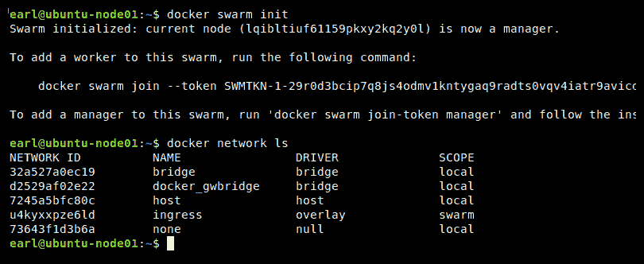
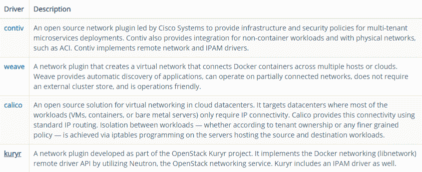
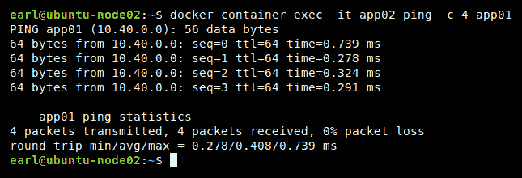
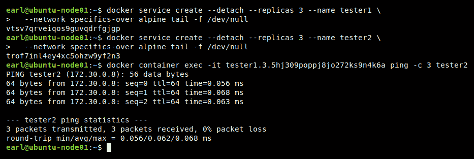

# 第六章：Docker 网络

在本章中，我们将学习关于 Docker 网络的知识。我们将深入研究 Docker 网络，学习容器如何被隔离，它们如何相互通信，以及它们如何与外部世界通信。我们将探索 Docker 在开箱即用安装中提供的本地网络驱动程序。然后，我们将通过部署 Weave 驱动程序的示例来研究远程网络驱动程序的使用。之后，我们将学习如何创建 Docker 网络。我们将通过查看我们的 Docker 网络所获得的免费服务来结束讨论。

“大约 97%的集装箱都是在中国制造的。在装运时，生产集装箱比在世界各地重新定位集装箱要容易得多。” - [`www.billiebox.co.uk/`](https://www.billiebox.co.uk/)

在本章中，我们将涵盖以下主题：

+   什么是 Docker 网络？

+   内置（也称为**本地**）Docker 网络的全部内容

+   第三方（也称为**远程**）Docker 网络如何？

+   如何创建 Docker 网络

+   免费的服务发现和负载平衡功能

+   选择适合您需求的正确 Docker 网络驱动程序

# 技术要求

您将从 Docker 的公共存储库中拉取 Docker 镜像，并从 Weave 安装网络驱动程序，因此在执行本章示例时需要基本的互联网访问。此外，我们将使用`jq 软件`包，因此如果您尚未安装，请参阅如何执行此操作的说明-可以在第二章的*容器检查命令*部分找到，*学习 Docker 命令*。

本章的代码文件可以在 GitHub 上找到：

[`github.com/PacktPublishing/Docker-Quick-Start-Guide/tree/master/Chapter06`](https://github.com/PacktPublishing/Docker-Quick-Start-Guide/tree/master/Chapter06)

查看以下视频以查看代码的实际操作：[`bit.ly/2FJ2iBK`](http://bit.ly/2FJ2iBK)

# 什么是 Docker 网络？

正如你已经知道的，网络是一个允许计算机和其他硬件设备进行通信的连接系统。Docker 网络也是一样的。它是一个连接系统，允许 Docker 容器在同一台 Docker 主机上相互通信，或者与容器、计算机和容器主机之外的硬件进行通信，包括在其他 Docker 主机上运行的容器。

如果你熟悉宠物与牛群的云计算类比，你就明白了能够在规模上管理资源的必要性。Docker 网络允许你做到这一点。它们抽象了大部分网络的复杂性，为你的容器化应用程序提供了易于理解、易于文档化和易于使用的网络。Docker 网络基于一个由 Docker 创建的标准，称为**容器网络模型**（**CNM**）。还有一个由 CoreOS 创建的竞争性网络标准，称为**容器网络接口**（**CNI**）。CNI 标准已被一些项目采用，尤其是 Kubernetes，可以提出支持其使用的论点。然而，在本章中，我们将把注意力集中在 Docker 的 CNM 标准上。

CNM 已经被 libnetwork 项目实现，你可以通过本节参考中的链接了解更多关于该项目的信息。用 Go 编写的 CNM 实现由三个构造组成：沙盒、端点和网络。沙盒是一个网络命名空间。每个容器都有自己的沙盒。它保存了容器的网络堆栈配置。这包括其路由表、接口和 IP 和 MAC 地址的 DNS 设置。沙盒还包含容器的网络端点。接下来，端点是连接沙盒到网络的东西。端点本质上是网络接口，比如**eth0**。一个容器的沙盒可能有多个端点，但每个端点只能连接到一个网络。最后，网络是一组连接的端点，允许连接之间进行通信。每个网络都有一个名称、地址空间、ID 和网络类型。

Libnetwork 是一个可插拔的架构，允许网络驱动程序实现我们刚刚描述的组件的具体内容。每种网络类型都有自己的网络驱动程序。Docker 提供了内置驱动程序。这些默认或本地驱动程序包括桥接驱动程序和覆盖驱动程序。除了内置驱动程序，libnetwork 还支持第三方创建的驱动程序。这些驱动程序被称为远程驱动程序。一些远程驱动程序的例子包括 Calico、Contiv 和 Weave。

现在你已经了解了 Docker 网络是什么，阅读了这些细节之后，你可能会想，他说的“简单”在哪里？坚持住。现在我们将开始讨论你如何轻松地创建和使用 Docker 网络。与 Docker 卷一样，网络命令代表它们自己的管理类别。正如你所期望的，网络的顶级管理命令如下：

```
# Docker network managment command
docker network 
```

网络管理组中可用的子命令包括以下内容：

```
# Docker network management subcommands
docker network connect # Connect a container to a network
docker network create            # Create a network
docker network disconnect        # Disconnect a container from a network
docker network inspect # Display network details
docker network ls # List networks
docker network rm # Remove one or more networks
docker network prune # Remove all unused networks
```

现在让我们来看看内置或本地网络驱动程序。

# 参考

查看以下链接以获取更多信息：

+   宠物与牛的对话幻灯片：[`www.slideshare.net/randybias/architectures-for-open-and-scalable-clouds`](https://www.slideshare.net/randybias/architectures-for-open-and-scalable-clouds)

+   Libnetwork 项目：[`github.com/docker/libnetwork`](https://github.com/docker/libnetwork)

+   Libnetwork 设计：[`github.com/docker/libnetwork/blob/master/docs/design.md`](https://github.com/docker/libnetwork/blob/master/docs/design.md)

+   Calico 网络驱动程序：[`www.projectcalico.org/`](https://www.projectcalico.org/)

+   Contiv 网络驱动程序：[`contiv.github.io/`](http://contiv.github.io/)

+   Weave 网络驱动程序：[`www.weave.works/docs/net/latest/overview/`](https://www.weave.works/docs/net/latest/overview/)

# 内置（本地）Docker 网络

Docker 的开箱即用安装包括一些内置网络驱动程序。这些也被称为本地驱动程序。最常用的两个驱动程序是桥接网络驱动程序和覆盖网络驱动程序。其他内置驱动程序包括 none、host 和 MACVLAN。此外，没有创建网络的情况下，你的新安装将会有一些预先创建并准备好使用的网络。使用`network ls`命令，我们可以轻松地查看新安装中可用的预先创建的网络列表：


在这个列表中，您会注意到每个网络都有其独特的 ID、名称、用于创建它（并控制它）的驱动程序以及网络范围。不要将本地范围与驱动程序的类别混淆，驱动程序的类别也是本地。本地类别用于区分驱动程序的来源，而不是具有远程类别的第三方驱动程序。本地范围值表示网络的通信限制仅限于本地 Docker 主机内。为了澄清，如果两个 Docker 主机 H1 和 H2 都包含具有本地范围的网络，即使它们使用相同的驱动程序并且网络具有相同的名称，H1 上的容器也永远无法直接与 H2 上的容器通信。另一个范围值是 swarm，我们稍后会更多地谈论它。

在所有 Docker 部署中找到的预创建网络是特殊的，因为它们无法被移除。不需要将容器附加到其中任何一个，但是尝试使用 `docker network rm` 命令移除它们将始终导致错误。

有三个内置的网络驱动程序，其范围为本地：桥接、主机和无。主机网络驱动程序利用 Docker 主机的网络堆栈，基本上绕过了 Docker 的网络。主机网络上的所有容器都能够通过主机的接口相互通信。使用主机网络驱动程序的一个重要限制是每个端口只能被单个容器使用。也就是说，例如，您不能运行两个绑定到端口 `80` 的 nginx 容器。正如您可能已经猜到的那样，因为主机驱动程序利用了其所在主机的网络，每个 Docker 主机只能有一个使用主机驱动程序的网络：


接下来是空或无网络。使用空网络驱动程序创建一个网络，当容器连接到它时，会提供一个完整的网络堆栈，但不会在容器内配置任何接口。这使得容器完全隔离。这个驱动程序主要是为了向后兼容而提供的，就像主机驱动程序一样，Docker 主机上只能创建一个空类型的网络：


第三个具有本地范围的网络驱动程序是桥接驱动程序。桥接网络是最常见的类型。连接到同一桥接网络的任何容器都能够彼此通信。Docker 主机可以使用桥接驱动程序创建多个网络。但是，连接到一个桥接网络的容器无法与不同桥接网络上的容器通信，即使这些网络位于同一个 Docker 主机上。请注意，内置桥接网络和任何用户创建的桥接网络之间存在轻微的功能差异。最佳实践是创建自己的桥接网络并利用它们，而不是使用内置的桥接网络。以下是使用桥接网络运行容器的示例：


除了创建具有本地范围的网络的驱动程序之外，还有内置网络驱动程序创建具有集群范围的网络。这些网络将跨越集群中的所有主机，并允许连接到它们的容器进行通信，尽管它们在不同的 Docker 主机上运行。您可能已经猜到，使用具有集群范围的网络需要 Docker 集群模式。实际上，当您将 Docker 主机初始化为集群模式时，将为您创建一个具有集群范围的特殊新网络。这个集群范围网络被命名为*ingress*，并使用内置的覆盖驱动程序创建。这个网络对于集群模式的负载平衡功能至关重要，该功能在第五章的*访问集群中的容器应用*部分中使用了*Docker Swarm*。在`swarm init`中还创建了一个名为 docker_gwbridge 的新桥接网络。这个网络被集群用于向外通信，有点像默认网关。以下是在新的 Docker 集群中找到的默认内置网络： 



使用覆盖驱动程序允许您创建跨 Docker 主机的网络。这些是第 2 层网络。在创建覆盖网络时，幕后会铺设大量网络管道。集群中的每个主机都会获得一个带有网络堆栈的网络沙盒。在该沙盒中，会创建一个名为 br0 的桥接。然后，会创建一个 VXLAN 隧道端点并将其附加到桥接 br0 上。一旦所有集群主机都创建了隧道端点，就会创建一个连接所有端点的 VXLAN 隧道。实际上，这个隧道就是我们看到的覆盖网络。当容器连接到覆盖网络时，它们会从覆盖子网中分配一个 IP 地址，并且该网络上的容器之间的所有通信都通过覆盖网络进行。当然，在幕后，通信流量通过 VXLAN 端点传递，穿过 Docker 主机网络，并且通过连接主机与其他 Docker 主机网络的任何路由器。但是，您永远不必担心所有幕后的事情。只需创建一个覆盖网络，将您的容器连接到它，您就大功告成了。

我们将讨论的下一个本地网络驱动程序称为 MACVLAN。该驱动程序创建的网络允许每个容器都有自己的 IP 和 MAC 地址，并连接到非 Docker 网络。这意味着除了使用桥接和覆盖网络进行容器间通信外，使用 MACVLAN 网络还可以连接到 VLAN、虚拟机和其他物理服务器。换句话说，MACVLAN 驱动程序允许您将容器连接到现有网络和 VLAN。必须在每个要运行需要连接到现有网络的容器的 Docker 主机上创建 MACVLAN 网络。而且，您需要为要连接的每个 VLAN 创建一个不同的 MACVLAN 网络。虽然使用 MACVLAN 网络听起来是一个好方法，但使用它有两个重要的挑战。首先，您必须非常小心地分配给 MACVLAN 网络的子网范围。容器将从您的范围中分配 IP，而不考虑其他地方使用的 IP。如果您有一个分配 IP 的 DHCP 系统与您给 MACVLAN 驱动程序的范围重叠，很容易导致重复的 IP 情况。第二个挑战是 MACVLAN 网络需要将您的网络卡配置为混杂模式。这在企业网络中通常是不被赞成的，但在云提供商网络中几乎是被禁止的，例如 AWS 和 Azure，因此 MACVLAN 驱动程序的使用情况非常有限。

本节涵盖了大量关于本地或内置网络驱动程序的信息。不要绝望！它们比这些丰富的信息所表明的要容易得多。我们将在*创建 Docker 网络*部分很快讨论创建和使用信息，但接下来，让我们快速讨论一下远程（也称为第三方）网络驱动程序。

# 参考资料

查看以下链接以获取更多信息：

+   优秀的、深入的 Docker 网络文章：[`success.docker.com/article/networking`](https://success.docker.com/article/networking)

+   使用覆盖网络进行网络连接：[`docs.docker.com/network/network-tutorial-overlay/`](https://docs.docker.com/network/network-tutorial-overlay/)

+   使用 MACVLAN 网络：[`docs.docker.com/v17.12/network/macvlan/`](https://docs.docker.com/v17.12/network/macvlan/)

# 第三方（远程）网络驱动程序

如前所述，在*什么是 Docker 网络*？部分中，除了 Docker 提供的内置或本地网络驱动程序外，CNM 还支持社区和供应商创建的网络驱动程序。其中一些第三方驱动程序的例子包括 Contiv、Weave、Kuryr 和 Calico。使用这些第三方驱动程序的好处之一是它们完全支持在云托管环境中部署，例如 AWS。为了使用这些驱动程序，它们需要在每个 Docker 主机的单独安装步骤中安装。每个第三方网络驱动程序都带来了自己的一套功能。以下是 Docker 在参考架构文档中分享的这些驱动程序的摘要描述：



尽管这些第三方驱动程序各自具有独特的安装、设置和执行方法，但一般步骤是相似的。首先，您下载驱动程序，然后处理任何配置设置，最后运行驱动程序。这些远程驱动程序通常不需要群集模式，并且可以在有或没有群集模式的情况下使用。例如，让我们深入了解如何使用织物驱动程序。要安装织物网络驱动程序，请在每个 Docker 主机上发出以下命令：

```
# Install the weave network driver plug-in
sudo curl -L git.io/weave -o /usr/local/bin/weave
sudo chmod a+x /usr/local/bin/weave
# Disable checking for new versions
export CHECKPOINT_DISABLE=1
# Start up the weave network
weave launch [for 2nd, 3rd, etc. optional hostname or IP of 1st Docker host running weave]
# Set up the environment to use weave
eval $(weave env)
```

上述步骤需要在将用于在织物网络上相互通信的容器的每个 Docker 主机上完成。启动命令可以提供第一个 Docker 主机的主机名或 IP 地址，该主机已设置并已运行织物网络，以便与其对等，以便它们的容器可以通信。例如，如果您已经在`node01`上设置了织物网络，当您在`node02`上启动织物时，您将使用以下命令：

```
# Start up weave on the 2nd node
weave launch node01
```

或者，您可以使用连接命令连接新的（Docker 主机）对等体，从已配置的第一个主机执行。要添加`node02`（在安装和运行织物后），请使用以下命令：

```
# Peer host node02 with the weave network by connecting from node01
weave connect node02
```

您可以在主机上不启用群集模式的情况下使用织物网络驱动程序。一旦织物被安装和启动，并且对等体（其他 Docker 主机）已连接，您的容器将自动利用织物网络，并能够相互通信，无论它们是在同一台 Docker 主机上还是在不同的主机上。

织物网络显示在您的网络列表中，就像您的其他任何网络一样：


让我们测试一下我们闪亮的新网络。首先确保你已经按照之前描述的步骤在所有你想要连接的主机上安装了 weave 驱动。确保你要么使用`node01`作为参数启动命令，要么从`node01`开始为你配置的每个额外节点使用 connect 命令。在这个例子中，我的实验服务器名为 ubuntu-node01 和 ubuntu-`node02`。让我们从`node02`开始：

请注意，在`ubuntu-node01`上：

```
# Install and setup the weave driver
sudo curl -L git.io/weave -o /usr/local/bin/weave
sudo chmod a+x /usr/local/bin/weave
export CHECKPOINT_DISABLE=1
weave launch
eval $(weave env)
```

并且，请注意，在`ubuntu-node02`上：

```
# Install and setup the weave driver
sudo curl -L git.io/weave -o /usr/local/bin/weave
sudo chmod a+x /usr/local/bin/weave
export CHECKPOINT_DISABLE=1
weave launch
eval $(weave env)
```

现在，回到`ubuntu-node01`，请注意以下内容：

```
# Bring node02 in as a peer on node01's weave network
weave connect ubuntu-node02
```


现在，让我们在每个节点上启动一个容器。确保给它们命名以便易于识别，从`ubuntu-node01`开始：

```
# Run a container detached on node01
docker container run -d --name app01 alpine tail -f /dev/null
```


现在，在`ubuntu-node02`上启动一个容器：

```
# Run a container detached on node02
docker container run -d --name app02 alpine tail -f /dev/null
```


很好。现在，我们在两个节点上都有容器在运行。让我们看看它们是否可以通信。因为我们在`node02`上，我们首先检查那里：

```
# From inside the app02 container running on node02,
# let's ping the app01 container running on node01
docker container exec -it app02 ping -c 4 app01
```



是的！成功了。让我们试试反过来：

```
# Similarly, from inside the app01 container running on node01,
# let's ping the app02 container running on node02
docker container exec -it app01 ping -c 4 app02
```


太棒了！我们有双向通信。你注意到了什么其他的吗？我们的应用容器有名称解析（我们不仅仅需要通过 IP 来 ping）。非常好，对吧？

# 参考资料

查看这些链接以获取更多信息：

+   安装和使用 weave 网络驱动：[`www.weave.works/docs/net/latest/overview/`](https://www.weave.works/docs/net/latest/overview/)

+   Weaveworks weave github 仓库：[`github.com/weaveworks/weave`](https://github.com/weaveworks/weave)

# 创建 Docker 网络

好的，现在你已经对本地和远程网络驱动有了很多了解，你已经看到了在安装 Docker 和/或初始化 swarm 模式（或安装远程驱动）时，有几个驱动是为你创建的。但是，如果你想使用其中一些驱动创建自己的网络怎么办？这其实非常简单。让我们来看看。`network create`命令的内置帮助如下：

```
# Docker network create command syntax
# Usage: docker network create [OPTIONS] NETWORK
```

检查这个，我们看到这个命令基本上有两个部分需要处理，OPTIONS 后面跟着我们想要创建的网络的 NETWORK 名称。我们有哪些选项？嗯，有相当多，但让我们挑选一些让你快速上手的。

可能最重要的选项是`--driver`选项。这是我们告诉 Docker 在创建此网络时要使用哪个可插拔网络驱动程序的方式。正如您所见，驱动程序的选择决定了网络的特性。您提供给驱动程序选项的值将类似于从`docker network ls`命令的输出中显示的 DRIVER 列中显示的值。一些可能的值是 bridge、overlay 和 macvlan。请记住，您不能创建额外的主机或空网络，因为它们限制为每个 Docker 主机一个。到目前为止，这可能是什么样子？以下是使用大部分默认选项创建新覆盖网络的示例：

```
# Create a new overlay network, with all default options
docker network create -d overlay defaults-over
```

这很好。您可以运行新服务并将它们附加到您的新网络。但是我们可能还想控制网络中的其他内容吗？嗯，IP 空间怎么样？是的，Docker 提供了控制网络 IP 设置的选项。这是使用`--subnet`、`--gateway`和`--ip-range`可选参数来完成的。所以，让我们看看如何使用这些选项创建一个新网络。如果您还没有安装 jq，请参阅第二章，*学习 Docker 命令*，了解如何安装它：

```
# Create a new overlay network with specific IP settings
docker network create -d overlay \
--subnet=172.30.0.0/24 \
--ip-range=172.30.0.0/28 \
--gateway=172.30.0.254 \
specifics-over
# Initial validation
docker network inspect specifics-over --format '{{json .IPAM.Config}}' | jq
```

在我的实验室中执行上述代码看起来是这样的：


通过查看这个例子，我们看到我们使用特定的 IP 参数为子网、IP 范围和网关创建了一个新的覆盖网络。然后，我们验证了网络是否使用了请求的选项进行创建。接下来，我们使用我们的新网络创建了一个服务。然后，我们找到了属于该服务的容器的容器 ID，并用它来检查容器的网络设置。我们可以看到，容器是使用我们配置网络的 IP 范围中的 IP 地址（在这种情况下是`172.30.0.7`）运行的。看起来我们成功了！

如前所述，在创建 Docker 网络时还有许多其他选项可用，我将把它作为一个练习留给您，让您使用`docker network create --help`命令来发现它们，并尝试一些选项以查看它们的功能。

# 参考资料

您可以在[`docs.docker.com/engine/reference/commandline/network_create/`](https://docs.docker.com/engine/reference/commandline/network_create/)找到`network create`命令的文档。

# 免费网络功能

有两个网络功能或服务是您在 Docker 群集网络中免费获得的。第一个是服务发现，第二个是负载均衡。当您创建 Docker 服务时，您会自动获得这些功能。我们在本章和第五章《Docker Swarm》中体验了这些功能，但并没有真正以名称的方式提到它们。所以，在这里我们来具体提一下。

首先是服务发现。当您创建一个服务时，它会得到一个唯一的名称。该名称会在群集 DNS 中注册。而且，每个服务都使用群集 DNS 进行名称解析。这里有一个例子。我们将利用之前在创建 Docker 网络部分创建的`specifics-over`叠加网络。我们将创建两个服务（`tester1`和`tester2`）并连接到该网络，然后我们将连接到`tester1`服务中的一个容器，并通过名称 ping`tester2`服务。看一下：

```
# Create service tester1
docker service create --detach --replicas 3 --name tester1 \
 --network specifics-over alpine tail -f /dev/null
# Create service tester2
docker service create --detach --replicas 3 --name tester2 \
 --network specifics-over alpine tail -f /dev/null
# From a container in the tester1 service ping the tester2 service by name
docker container exec -it tester1.3.5hj309poppj8jo272ks9n4k6a ping -c 3 tester2
```

以下是执行前述命令时的样子：



请注意，我输入了服务名称的第一部分（`tester1`）并使用命令行补全，通过按下*Tab*键来填写 exec 命令的容器名称。但是，正如您所看到的，我能够在`tester1`容器内通过名称引用`tester2`服务。

免费！

我们得到的第二个免费功能是负载均衡。这个强大的功能非常容易理解。它允许将发送到服务的流量发送到群集中的任何主机，而不管该主机是否正在运行服务的副本。

想象一下这样的情景：您有一个六节点的群集集群，以及一个只部署了一个副本的服务。您可以通过群集中的任何主机发送流量到该服务，并知道无论容器实际在哪个主机上运行，流量都会到达服务的一个容器。事实上，您可以使用负载均衡器将流量发送到群集中的所有主机，比如采用轮询模式，每次将流量发送到负载均衡器时，该流量都会无误地传递到应用程序容器。

相当方便，对吧？再次强调，这是免费的！

# 参考资料

想要尝试服务发现吗？那就查看[`training.play-with-docker.com/swarm-service-discovery/`](https://training.play-with-docker.com/swarm-service-discovery/)。

你可以在[`docs.docker.com/engine/swarm/key-concepts/#load-balancing`](https://docs.docker.com/engine/swarm/key-concepts/#load-balancing)阅读有关 swarm 服务负载平衡的信息。

# 我应该使用哪个 Docker 网络驱动程序？

对于这个问题的简短答案就是适合工作的正确驱动程序。这意味着没有单一的网络驱动程序适合每种情况。如果你在笔记本电脑上工作，swarm 处于非活动状态，并且只需要容器之间能够通信，那么简单的桥接模式驱动程序是理想的。

如果你有多个节点，只需要容器对容器的流量，那么覆盖驱动程序是正确的选择。如果你需要容器对 VM 或容器对物理服务器的通信（并且可以容忍混杂模式），那么 MACVLAN 驱动程序是最佳选择。或者，如果你有更复杂的需求，许多远程驱动程序可能正是你需要的。

我发现对于大多数多主机场景，覆盖驱动程序可以胜任，所以我建议你启用 swarm 模式，并在升级到其他多主机选项之前尝试覆盖驱动程序。

# 总结

你现在对 Docker 网络有什么感觉？Docker 已经将复杂的技术网络变得易于理解和使用。大部分疯狂、困难的设置都可以通过一个`swarm init`命令来处理。让我们回顾一下：你了解了 Docker 创建的网络设计，称为容器网络模型或 CNM。然后，你了解了 libnetwork 项目如何将该模型转化为可插拔架构。之后，你发现 Docker 创建了一组强大的驱动程序，可以插入 libnetwork 架构，以满足大部分容器通信需求的各种网络选项。由于架构是可插拔的，其他人已经创建了更多的网络驱动程序，解决了 Docker 驱动程序无法处理的任何边缘情况。Docker 网络真的已经成熟了。

我希望你已经做好准备，因为在第七章中，*Docker Stacks*，我们将深入探讨 Docker 堆栈。这是你迄今为止学到的所有信息真正汇聚成一种辉煌的交响乐。深呼吸，翻开下一页吧！
