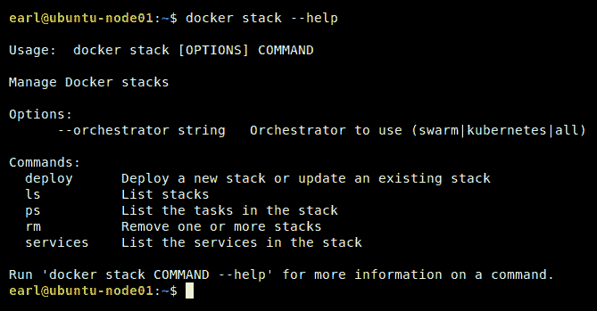
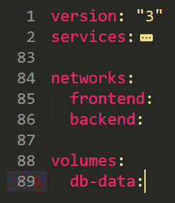
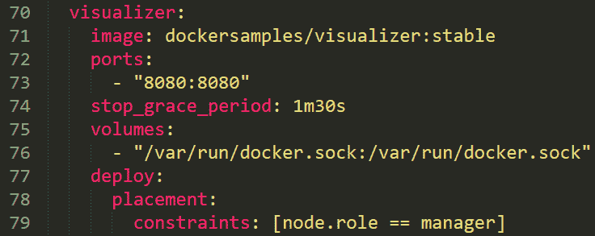
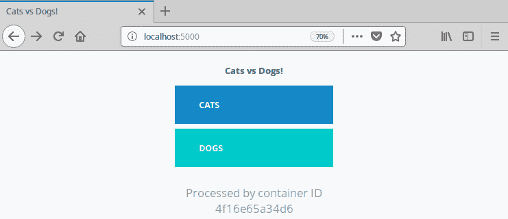

# 第七章：Docker 堆栈

在本章中，我们将汇集前六章所学，并用它来定义、部署和管理多容器应用程序。我们将通过使用 Docker 堆栈来实现这一点。我们将学习如何使用 Docker 堆栈和定义多容器应用程序所需的 YAML 文件。我们将利用我们对 Docker 服务、Docker 卷、Docker 集群和 Docker 网络的了解来创建功能齐全的基于 Docker 的多服务应用程序。

最大的货船长 400 米，可以携带 15,000 至 18,000 个集装箱！

在本章中，我们将涵盖以下主题：

+   使用 Docker 堆栈

+   部署多服务 Docker 应用程序

+   创建和使用 compose（堆栈）YAML 文件

+   扩展已部署的多服务 Docker 应用程序

# 技术要求

您将从 Docker 的公共存储库中拉取 Docker 镜像，并从 Weave 安装网络驱动程序，因此执行本章示例需要基本的互联网访问。此外，我们将使用 jq 软件包，因此如果您尚未安装，请参阅如何安装的说明；可以在第二章的*容器检查命令*部分找到。

本章的代码文件可以在 GitHub 上找到：

[`github.com/PacktPublishing/Docker-Quick-Start-Guide/tree/master/Chapter07`](https://github.com/PacktPublishing/Docker-Quick-Start-Guide/tree/master/Chapter07)

查看以下视频以查看代码的实际操作：[`bit.ly/2E2qc9U`](http://bit.ly/2E2qc9U)

# 了解 Docker 堆栈的使用

到目前为止，我们主要关注的是从单个 Docker 镜像中运行 Docker 容器，简化 Docker 模型，想象一个世界，每个应用程序只需要一个服务，因此只需要一个 Docker 镜像来运行。然而，正如你所知，这是一个相当不现实的模型。现实世界的应用程序由多个服务组成，并且这些服务是使用多个 Docker 镜像部署的。要运行所有必要的容器，并将它们保持在所需数量的副本，处理计划和非计划的停机时间，扩展需求以及所有其他服务管理需求是一个非常艰巨和复杂的任务。最近，这种情况是使用一个名为 Docker Compose 的工具来处理的。Docker Compose（正如你在第一章中学到的，*设置 Docker 开发环境*）是一个额外的工具，你可以在 Docker 环境中安装，我们已经在工作站的环境中完成了安装。虽然 Docker Compose 的许多功能与 Docker 堆栈中的功能类似，但我们将在本章中专注于 Docker 堆栈。我们这样做是因为 Docker Compose 用于管理容器，而 Docker 世界已经向服务作为通用单元的演变。Docker 堆栈管理服务，因此我认为 Docker 堆栈是 Docker Compose 的演变（它是一个名为 Fig 的项目的演变）。我们之所以没有在第一章中安装 Docker 堆栈，*设置 Docker 开发环境*，是因为堆栈已经作为标准 Docker 安装的一部分包含在内。

好的，所以 Docker 堆栈是新的改进版 Docker Compose，并且已包含在我们的安装中。我敢打赌你在想，太好了。但这意味着什么？Docker 堆栈的用例是什么？好问题！Docker 堆栈是利用我们在前几章中学到的所有功能的方式，比如 Docker 命令、Docker 镜像、Docker 服务、Docker 卷、Docker 集群和 Docker 网络，将所有这些功能包装在一个易于使用、易于理解的声明性文档文件中，这将代表我们实例化和维护一个复杂的多镜像应用程序。

大部分工作，仍然是简单的部分，将在创建用于 Docker 堆栈命令的 compose 文件中进行。当 Docker 创建、启动和管理所有多服务（多容器）应用程序所需的所有服务时，所有真正的艰苦工作都将由 Docker 完成。所有这些都由您的一条命令处理。就像镜像一样，容器和 swarm 堆栈是另一个 Docker 管理组。让我们来看看堆栈管理命令：

那么，我们在这里有什么？对于这个管理组所代表的所有功能，它有一组非常简单的命令。主要命令是`deploy`命令。它是强大的！通过此命令（和一个 compose 文件），您将启动您的应用程序，拉取任何不在本地环境中的镜像，运行镜像，根据需要创建卷，根据需要创建网络，为每个镜像部署定义的副本数量，将它们分布在您的 swarm 中以实现高可用性和负载平衡，并且更多。这个命令有点像《指环王》中的一环。除了部署应用程序，当您需要执行诸如扩展应用程序之类的操作时，您将使用相同的命令来更新正在运行的应用程序。

管理组中的下一个命令是列出堆栈的命令。顾名思义，ls 命令允许您获取当前部署到您的 swarm 的所有堆栈的列表。当您需要关于正在 swarm 中运行的特定堆栈的更详细信息时，您将使用`ps`命令列出特定堆栈的所有任务。当到达结束生命周期部署的堆栈时，您将使用强大的 rm 命令。最后，作为管理命令的补充，我们有 services 命令，它允许我们获取堆栈的一部分的服务列表。堆栈谜题的另一个重要部分是`--orchestrator`选项。通过此选项，我们可以指示 Docker 使用 Docker swarm 或 Kubernetes 进行堆栈编排。当然，要使用 Kubernetes，必须已安装，并且要使用 swarm——如果未指定该选项，则必须启用 swarm 模式。

在本章的其余部分，我们将深入研究使用示例应用程序的 Docker stacks。Docker 提供了几个这样的示例，但我们要检查的是投票应用程序示例。我将提供应用程序的 Docker 存储库的链接，以及我空间中项目的分支的链接，以防 Docker 应用程序发生重大变化或项目消失。让我们来看一下示例投票应用程序的堆栈文件。

# 参考资料

查看以下链接以获取更多信息：

+   Docker Compose 概述：[`docs.docker.com/compose/overview/`](https://docs.docker.com/compose/overview/)

+   Docker stack 命令参考：[`docs.docker.com/engine/reference/commandline/stack/`](https://docs.docker.com/engine/reference/commandline/stack/)

+   Docker 样本：[`github.com/dockersamples`](https://github.com/dockersamples)

+   Docker 投票应用示例：[`github.com/dockersamples/example-voting-app`](https://github.com/dockersamples/example-voting-app)

+   我的投票应用的分支：[`github.com/EarlWaud/example-voting-app`](https://github.com/EarlWaud/example-voting-app)

# 如何创建和使用 Compose YAML 文件用于 Stacks

堆栈文件是一个 YAML 文件，基本上与 Docker Compose 文件相同。两者都是定义 Docker 基础应用程序的 YAML 文件。从技术上讲，堆栈文件是一个需要特定版本（或更高版本）的 Compose 规范的 Compose 文件。Docker stacks 仅支持版本 3.0 规范及以上。如果您有一个使用 Docker compose YAML 文件的现有项目，并且这些文件使用的是版本 2 或更旧的规范，那么您需要将 YAML 文件更新到版本 3 规范，以便能够在 Docker stacks 中使用它们。值得注意的是，相同的 YAML 文件可以用于 Docker stacks 或 Docker compose（前提是使用了版本 3 规范或更高版本）。但是，有一些指令将被其中一个工具忽略。例如，Docker stacks 会忽略构建指令。这是因为堆栈和 compose 之间最重要的区别之一是，所有使用的 Docker 映像必须预先创建以供堆栈使用，而 Docker 映像可以作为建立基于 compose 的应用程序的一部分而创建。另一个重要的区别是，堆栈文件能够定义 Docker 服务作为应用程序的一部分。

现在是克隆投票应用程序项目和可视化器镜像存储库的好时机。

[PRE0]

严格来说，您不需要克隆这两个存储库，因为您真正需要的只是投票应用程序的堆栈组合文件。这是因为所有的镜像已经被创建并且可以从 hub.docker.com 公开获取，并且当您部署堆栈时，这些镜像将作为部署的一部分被获取。因此，这是获取堆栈 YAML 文件的命令：

[PRE1]

当然，如果您想以任何方式自定义应用程序，将项目本地化可以让您构建自己的 Docker 镜像版本，然后使用您的自定义镜像部署应用程序的自定义版本。

一旦您在系统上拥有项目（或至少有`docker-stack.yml`文件），您就可以开始使用 Docker 堆栈命令进行操作。现在，让我们继续使用`docker-stack.yml`文件来部署我们的应用程序。您需要设置好 Docker 节点并启用 swarm 模式才能使其工作，所以如果您还没有这样做，请按照第五章中描述的设置您的 swarm，*Docker Swarm*。然后，使用以下命令来部署您的示例投票应用程序：

[PRE2]

这是它可能看起来的样子：

让我快速解释一下这个命令：我们正在使用`deploy`命令与`docker-stack.yml`组合文件，并将我们的堆栈命名为`voteapp`。这个命令将处理我们新应用程序的所有配置、部署和管理。根据`docker-stack.yml`文件中定义的内容，需要一些时间来使一切都正常运行，所以在这段时间里，让我们开始深入了解我们的堆栈组合文件。

到目前为止，您知道我们正在使用`docker-stack.yml`文件。因此，当我们解释堆栈组合文件的各个部分时，您可以在您喜欢的编辑器中打开该文件，并跟随我们的讲解。我们开始吧！

我们要看的第一件事是顶层键。在这种情况下，它们如下所示：

+   版本

+   服务

+   网络

+   卷

如前所述，版本必须至少为 3 才能与 Docker 堆栈一起使用。查看`docker-stack.yml`文件中的第 1 行（版本键始终在第 1 行），我们看到以下内容：

完美！我们有一个符合版本 3 规范的组合文件。在一分钟内跳过（折叠的）服务密钥部分，让我们看一下网络密钥，然后是卷密钥。在网络密钥部分，我们指示 Docker 创建两个网络，一个名为 frontend，一个名为 backend。实际上，在我们的情况下，网络将被命名为`voteapp_frontend`和`voteapp_backend`。这是因为我们将我们的堆栈命名为`voteapp`，Docker 将在部署堆栈的一部分时将堆栈的名称前置到各个组件的名称之前。通过在堆栈文件的网络密钥中包含我们所需网络的名称，Docker 将在部署堆栈时创建我们的网络。我们可以为每个网络提供特定的细节（正如我们在第六章中学到的，*Docker 网络*），但如果我们不提供任何细节，那么将使用某些默认值。我们的堆栈可能已经足够长时间来部署我们的网络了，所以让我们使用网络列表命令来看看我们现在有哪些网络：

它们在这里：`voteapp_frontend`和`voteapp_backend`。您可能想知道`voteapp_default`网络是什么。当您部署一个堆栈时，您将始终获得一个默认的 Swarm 网络，如果它们在堆栈组合文件中没有为它们定义任何其他网络连接，那么所有容器都将连接到它。这非常酷，对吧？！您不必执行任何 docker 网络创建命令，您的所需网络已经在应用程序中创建并准备好使用。

卷密钥部分基本上与网络密钥部分做了相同的事情，只是它是为卷而不是网络。当您部署堆栈时，您的定义卷将自动创建。如果在堆栈文件中没有提供额外的配置，卷将以默认设置创建。在我们的示例中，我们要求 Docker 创建一个名为`db-data`的卷。正如您可能已经猜到的那样，实际创建的卷的名称实际上是`voteapp_db-data`，因为 Docker 将我们堆栈的名称前置到卷名称之前。在我们的情况下，它看起来像这样：

因此，部署我们的堆栈创建了我们期望的网络和我们期望的卷。所有这些都是通过我们堆栈组合文件中易于创建、易于阅读和理解的内容实现的。好的，现在我们对堆栈组合文件中的四个顶级键部分中的三个有了很好的理解。现在，让我们返回到服务键部分。如果我们展开这个键部分，我们将看到我们希望作为应用程序的一部分部署的每个服务的定义。在`docker-stack.yml`文件的情况下，我们定义了六个服务。这些是 redis、db、vote、result、worker 和 visualizer。在堆栈组合文件中，它们看起来像这样：

让我们扩展第一个 redis，并仔细看一下为我们的应用程序定义的 redis 服务：

如果您回忆一下来自第五章的 Docker 服务的讨论，*Docker Swarm*，那么这里显示的许多键对您来说应该是很熟悉的。现在让我们来检查 redis 服务中的键。首先，我们有`image`键。图像键是服务定义所必需的。这个键告诉 docker 要拉取和运行这个服务的 Docker 镜像是`redis:alpine`。正如您现在应该理解的那样，这意味着我们正在使用来自 hub.docker.com 的官方 redis 镜像，请求标记为`alpine`的版本。接下来使用的键是`ports`。它定义了容器将从主机暴露的端口以及主机的端口。在这种情况下，要映射到容器的暴露端口（`6379`）的主机端口由 Docker 分配。您可以使用`docker container ls`命令找到分配的端口。在我的情况下，redis 服务将主机的端口`30000`映射到容器的端口`6379`。接下来使用的键是`networks`。我们已经看到部署堆栈将为我们创建网络。这个指令告诉 Docker 应该将 redis 副本容器连接到哪些网络；在这种情况下是`frontend`网络。如果我们检查 redis 副本容器，检查网络部分，我们将看到这是准确的。您可以使用这样的命令查看您的部署（请注意，容器名称在您的系统上可能略有不同）：

[PRE3]

在我们的示例中，您应该看到容器连接到两个网络：入口网络和我们的`voteapp_frontend`网络。

我们 redis 服务定义中的下一个键是 deploy 键。这是在 compose 文件规范的 3 版本中添加的一个键类别。它定义了基于此服务中的镜像运行容器的具体信息：在这种情况下，是 redis 镜像。这实质上是编排指令。`replicas`标签告诉 docker 在应用程序完全部署时应该运行多少副本或容器。在我们的示例中，我们声明我们只需要一个 redis 容器的实例运行。`update_config`键提供了两个子键，`parallelism`和`delay`，告诉 Docker 应该以多少容器`replicas`并行启动，并且在启动每个`parallel`容器`replicas`之间等待多长时间。当然，对于一个副本，parallelism 和 delay 的细节几乎没有用处。如果`replicas`的值更大，比如`10`，我们的 update_config 键将导致两个副本同时启动，并且在启动之间等待 10 秒。最后的 deploy 键是`restart_policy`，它定义了在部署的堆栈中新副本将被创建的条件。在这种情况下，如果一个 redis 容器失败，将启动一个新的 redis 容器来替代它。让我们来看看我们应用程序中的下一个服务，`db`服务：

db 服务与 redis 服务将有几个相同的键，但值不同。首先，我们有 image 键。这次我们指定要使用带有版本 9.4 标签的官方 postgres 镜像。我们的下一个键是 volumes 键。我们指定我们正在使用名为 db-data 的卷，并且在 DB 容器中，卷应该挂载在`/var/lib/postgresql/data`。让我们来看看我们环境中的卷信息：

使用 volume inspect 命令，我们可以获取卷的挂载点，然后比较容器内文件夹的内容与主机上挂载点的内容：

哇！正如预期的那样，它们匹配。在 Mac 上，情况并非如此简单。有关如何在 OS X 上处理此问题的详细信息，请参阅 Docker Volumes 第四章，有关 Docker 卷的详细信息。接下来是网络密钥，在这里我们指示 Docker 将后端网络连接到我们的 db 容器。接下来是部署密钥。在这里，我们看到一个名为`placement`的新子密钥。这是一个指令，告诉 Docker 我们只希望 db 容器在管理节点上运行，也就是说，在具有`manager`角色的节点上。

您可能已经注意到，部署密钥的一些子密钥存在于 redis 服务中，但在我们的 db 服务中不存在，最显著的是`replicas`密钥。默认情况下，如果您没有指定要维护的副本数量，Docker 将默认为一个副本。总的来说，db 服务配置的描述与 redis 服务几乎相同。您将看到所有服务的配置之间的相似性。这是因为 Docker 已经非常容易地定义了我们服务的期望状态，以及我们的应用程序。为了验证这一点，让我们来看一下堆栈组合文件中的下一个服务，即`vote`服务：

您应该开始熟悉这些密钥及其值。在投票服务中，我们看到定义的镜像不是官方容器镜像之一，而是在名为`dockersamples`的公共存储库中。在该存储库中，我们使用了名为`examplevotingapp_vote`的图像，版本标签为`before`。我们的端口密钥告诉 Docker 和我们，我们要在 swarm 主机上打开端口`5000`，并且将该端口上的流量映射到正在运行的投票服务容器中的端口 80。事实证明，投票服务是我们应用程序的`face`，我们将通过端口`5000`访问它。由于它是一个服务，我们可以通过在 swarm 中的*任何*主机上的端口`5000`访问它，即使特定主机没有运行其中一个副本。

看着下一个关键点，我们看到我们正在将`frontend`网络连接到我们的投票服务容器。在那里没有什么新的，然而，因为我们下一个关键点是我们以前没有见过的：`depends_on`关键点。这个关键点告诉 Docker 我们的投票服务需要 redis 服务才能运行。对于我们的`deploy`命令来说，这意味着被依赖的服务需要在启动这个服务之前启动。具体来说，redis 服务需要在投票服务之前启动。这里的一个关键区别是我说的是启动。这并不意味着在启动这个服务之前必须运行依赖的服务；依赖的服务只需要在之前启动。再次强调，具体来说，redis 服务在启动投票服务之前不必处于运行状态，它只需要在投票服务之前启动。在投票服务的部署关键点中，我们还没有看到任何新的东西，唯一的区别是我们要求投票服务有两个副本。你开始理解堆栈组合文件中服务定义的简单性和强大性了吗？

在我们的堆栈组合文件中定义的下一个服务是结果服务。然而，由于在该服务定义中没有我们之前没有见过的关键点，我将跳过对结果服务的讨论，转而讨论工作人员服务，我们将看到一些新东西。以下是工作人员服务的定义：

你知道图像密钥及其含义。你也知道网络密钥及其含义。你知道部署密钥，但是我们在这里有一些新的子密钥，所以让我们谈谈它们，从`mode`密钥开始。你可能还记得我们在第五章中讨论服务时，*Docker Swarm*，有一个`--mode`参数，可以有两个值：`global`或`replicated`。这个密钥与我们在第五章中看到的参数完全相同，*Docker Swarm*。默认值是 replicated，所以如果你不指定 mode 密钥，你将得到 replicated 行为，即确切地有定义的副本数量（或者如果没有指定副本数量，则为一个副本）。使用 global 的其他值选项将忽略 replicas 密钥，并在集群中的每个主机上部署一个容器。

我们在这个堆栈组合文件中以前没有见过的下一个密钥是`labels`密钥。这个密钥的位置很重要，因为它可以作为自己的上层密钥出现，也可以作为 deploy 密钥的子密钥出现。有什么区别？当你将`labels`密钥作为 deploy 密钥的子密钥使用时，标签将仅设置在服务上。当你将`labels`密钥作为自己的上层密钥使用时，标签将被添加到作为服务的一部分部署的每个副本或容器中。在我们的例子中，`APP=VOTING`标签将被应用到服务，因为`labels`密钥是 deploy 密钥的子密钥。再次，在我们的环境中看看这个：

[PRE4]

在我的系统上看起来是这样的：

在工作容器上执行 inspect 命令以查看其标签，将显示`APP=VOTING`标签不存在。如果你想在你的系统上确认这一点，命令将如下（使用不同的容器名称）：

[PRE5]

在我的系统上看起来是这样的：

重启策略键的两个新子键是`max_attempts`和`window`键。你可能能猜到它们的目的；`max_attempts`键告诉 Docker 在放弃之前尝试启动工作容器的次数，最多三次。`window`键告诉 Docker 在之前多久等待重新尝试启动工作容器，如果之前启动失败。相当简单，对吧？同样，这些定义很容易设置，易于理解，并且对于编排我们应用程序的服务非常强大。

好的。我们还有一个服务定义需要审查新内容，那就是可视化服务。在我们的堆栈组合文件中，它看起来是这样的：

唯一真正新的键是`stop_grace_period`键。这个键告诉 Docker 在它告诉一个容器停止之后等待多长时间才会强制停止容器。如果没有使用`stop_grace_period`键，默认时间段是 10 秒。当你需要更新一个堆栈，本质上是重新堆叠，一个服务的容器将被告知优雅地关闭。Docker 将等待在`stop_grace_period`键中指定的时间量，或者如果没有提供键，则等待 10 秒。如果容器在那段时间内关闭，容器将被移除，并且一个新的容器将被启动来取代它。如果容器在那段时间内没有关闭，它将被强制停止，杀死它，然后移除它，然后启动一个新的容器来取代它。这个键的重要性在于它允许运行需要更长时间才能优雅停止的进程的容器有必要的时间来实际优雅停止。

我想指出这项服务的最后一个方面，那就是关于列出的有点奇怪的卷。这不是一个典型的卷，并且在卷键定义中没有条目。`/var/run/docker.sock:/var/run/docker.sock`卷是一种访问主机的 Docker 守护程序正在侦听的 Unix 套接字的方式。在这种情况下，它允许容器与其主机通信。可视化器容器正在收集关于哪些容器在哪些主机上运行的信息，并且能够以图形方式呈现这些数据。你会注意到它将 8080 主机端口映射到 8080 容器端口，所以我们可以通过浏览到任何我们的 swarm 节点上的 8080 端口来查看它共享的数据。这是我（当前）三节点 swarm 上的样子：

# 堆栈其余命令

现在，让我们通过我们部署了`voteapp`堆栈的 swarm 的视角快速看一下我们的其他与堆栈相关的命令。首先，我们有列出堆栈的命令：`docker stack ls`。试一下看起来像这样：

[PRE6]

这是示例环境中的样子：

这表明我们当前部署了一个名为 voteapp 的堆栈，它由六个服务组成，并且正在使用 swarm 模式进行编排。知道部署堆栈的名称可以让我们使用其他堆栈命令来收集更多关于它的信息。接下来是列出堆栈任务的命令。让我们在示例环境中尝试一下这个命令：

[PRE7]

这是我当前环境中的结果；你的应该看起来非常相似：

现在，让我们来看看堆栈服务命令。这个命令将为我们提供一个关于作为堆栈应用程序一部分部署的服务的简要摘要。命令看起来像这样：

[PRE8]

这是我们在示例环境中看到的：

这个命令提供了一些非常有用的信息。我们可以快速看到我们服务的名称，所需副本的数量，以及每个服务的实际副本数量。我们可以看到用于部署每个服务的镜像，并且我们可以看到每个服务使用的端口映射。在这里，我们可以看到可视化服务正在使用端口`8080`，就像我们之前提到的那样。我们还可以看到我们的投票服务暴露在我们集群主机的端口`5000`上。让我们通过浏览到端口`5000`（在集群中的任何节点上）来看看我们在我们的 voteapp 中展示了什么：

你是狗派还是猫派？你可以通过在你自己的 voteapp 中投票来表达自己！投票然后使用堆栈服务命令中的数据来查看投票结果，浏览到端口`5001`：

是的，我是一个狗派。还有一个最终的堆栈命令：删除命令。我们可以通过发出`rm`命令来快速轻松地关闭使用堆栈部署的应用程序。看起来是这样的：

[PRE9]

现在你看到它了，现在你看不到了：

你应该注意到这里没有任何“你确定吗？”的提示，所以在按下*Enter*键之前一定要非常确定和非常小心。让我们通过快速查看作为 Docker 堆栈部署的应用程序的扩展或重新堆叠的最佳实践来结束对 Docker 堆栈的讨论。

# 扩展堆栈应用程序的最佳实践

与大多数 Docker 相关的事物一样，有几种不同的方法可以实现应用程序的期望状态。当您使用 Docker 堆栈时，应始终使用与部署应用程序相同的方法来更新应用程序。在堆栈 compose 文件中进行任何期望的状态更改，然后运行与部署堆栈时使用的完全相同的命令。这允许您使用标准源代码控制功能来正确处理您的 compose 文件，例如跟踪和审查更改。而且，它允许 Docker 正确地为您的应用程序进行编排。如果您需要在应用程序中缩放服务，您应该在堆栈 compose 文件中更新 replicas 键，然后再次运行部署命令。在我们的示例中，我们的投票服务有两个副本。如果投票需求激增，我们可以通过将 replica 值从 2 更改为 16 来轻松扩展我们的应用程序，方法是编辑`docker-stack.yml`文件，然后发出与最初用于部署应用程序相同的命令：

[PRE10]

现在，当我们检查服务时，我们可以看到我们正在扩展我们的应用程序：

就是这样，一个易于使用、易于理解且非常强大的 Docker 应用程序编排！

# 参考资料

查看以下链接获取更多信息：

+   Compose 文件参考：[`docs.docker.com/compose/compose-file/`](https://docs.docker.com/compose/compose-file/)

+   一些 Compose 文件示例：[`github.com/play-with-docker/stacks`](https://github.com/play-with-docker/stacks)

+   Docker hub 上的示例镜像：[`hub.docker.com/u/dockersamples/`](https://hub.docker.com/u/dockersamples/)

+   在 Docker hub 上找到的官方 redis 镜像标签：[`hub.docker.com/r/library/redis/tags/`](https://hub.docker.com/r/library/redis/tags/)

+   关于使用 Docker 守护程序套接字的精彩文章：[`medium.com/lucjuggery/about-var-run-docker-sock-3bfd276e12fd`](https://medium.com/lucjuggery/about-var-run-docker-sock-3bfd276e12fd)

+   堆栈部署命令参考：[`docs.docker.com/engine/reference/commandline/stack_deploy/`](https://docs.docker.com/engine/reference/commandline/stack_deploy/)

+   堆栈 ps 命令参考：[`docs.docker.com/engine/reference/commandline/stack_ps/`](https://docs.docker.com/engine/reference/commandline/stack_ps/)

+   堆栈服务命令参考：[`docs.docker.com/engine/reference/commandline/stack_services/`](https://docs.docker.com/engine/reference/commandline/stack_services/)

# 摘要

现在你对 Docker 堆栈有了很多了解。你可以使用 compose 文件轻松创建应用程序定义，然后使用 stack deploy 命令部署这些应用程序。你可以使用 ls、ps 和 services 命令探索已部署堆栈的细节。你可以通过对 compose 文件进行简单修改并执行与部署应用程序相同的命令来扩展你的应用程序。最后，你可以使用 stack rm 命令移除已经到达生命周期终点的应用程序。伴随着强大的能力而来的是巨大的责任，所以在使用移除命令时要非常小心。现在你已经有足够的信息来创建和编排世界级的企业级应用程序了，所以开始忙碌起来吧！然而，如果你想学习如何将 Docker 与 Jenkins 一起使用，你会很高兴地知道这就是第八章《Docker 和 Jenkins》的主题，所以翻开书页开始阅读吧！
