# Docker 和 Jenkins

在本章中，我们将学习如何利用 Jenkins 来构建我们的 Docker 镜像并部署我们的 Docker 容器。接下来，我们将学习如何将我们的 Jenkins 服务器部署为 Docker 容器。然后，我们将学习如何在 Docker 化的 Jenkins 服务器中构建 Docker 镜像。这通常被称为 Docker 中的 Docker。最后，我们将看到如何利用 Docker 容器作为 Jenkins 构建代理，允许每个构建在一个原始的、短暂的 Docker 容器中运行。当然，我们将展示如何在我们的 Docker 化的 Jenkins 构建代理中构建 Docker 镜像、测试应用程序，并将经过测试的镜像推送到 Docker 注册表中。这将为您提供设置 CI/CD 系统所需的所有工具。

如果世界上所有的集装箱都被排成一排，它们将绕地球超过两次。- [`www.bigboxcontainers.co.za/`](https://www.bigboxcontainers.co.za/)

在本章中，我们将涵盖以下主题：

+   使用 Jenkins 构建 Docker 镜像

+   设置 Docker 化的 Jenkins 服务器

+   在 Docker 化的 Jenkins 服务器中构建 Docker 镜像

+   使用 Docker 容器作为您的 Jenkins 构建节点

+   在 Docker 化的构建节点中构建、测试和推送 Docker 镜像

# 技术要求

您将从 Docker 的公共仓库中拉取 Docker 镜像，并安装 Jenkins 服务器软件，因此执行本章示例需要基本的互联网访问。还要注意，这些示例的系统要求比前几章中介绍的要高。本章示例中使用的服务器具有 8GB 的内存、2 个 CPU 和 20GB 的硬盘。

本章的代码文件可以在 GitHub 上找到：

[`github.com/PacktPublishing/Docker-Quick-Start-Guide/tree/master/Chapter08`](https://github.com/PacktPublishing/Docker-Quick-Start-Guide/tree/master/Chapter08)

查看以下视频以查看代码的实际操作：[`bit.ly/2AyRz7k`](http://bit.ly/2AyRz7k)

# 使用 Jenkins 构建 Docker 镜像

您可能已经知道 Jenkins 是一个广泛使用的持续集成/持续交付（CI/CD）系统工具。几乎每家公司，无论大小，都在某种程度上使用它。它非常有效，高度可配置，特别是可以与之一起使用的各种插件。因此，将其用于创建 Docker 镜像是非常自然的。使用 Jenkins 与 Docker 的第一步相当容易完成。如果您今天正在使用现有的 Jenkins 服务器，要使用它来构建 Docker 镜像，您只需要在 Jenkins 服务器上安装 Docker。您可以使用我们在第一章“设置 Docker 开发环境”中看到和使用的完全相同的安装技术。根据运行 Jenkins 服务器的系统的操作系统，您可以按照第一章中学到的安装步骤，设置 Docker 开发环境；完成后，您可以使用 Jenkins 构建 Docker 镜像。

如果您还没有运行的 Jenkins 服务器，您可以按照以下“参考”部分中的*安装 Jenkins*网页链接中找到的指南进行操作，并在您正在使用的任何操作系统上安装 Jenkins。例如，我们将使用该页面的信息在 Ubuntu 系统上设置 Jenkins 服务器。首先打开一个终端窗口。现在获取 Jenkins 软件包的 apt-key。接下来，您将向 apt 源列表中添加 Debian Jenkins 源。然后，您将更新系统上的软件包，最后，您将使用 apt-get 安装 Jenkins。命令看起来像下面这样：

```
# If Java has not yet been installed, install it now
sudo apt install openjdk-8-jre-headless

# Install Jenkins on an Ubuntu system
wget -q -O - https://pkg.jenkins.io/debian/jenkins.io.key | sudo apt-key add -
sudo sh -c 'echo deb http://pkg.jenkins.io/debian-stable binary/ > /etc/apt/sources.list.d/jenkins.list'
sudo apt-get update
sudo apt-get install jenkins
```

在我的系统上运行这些命令看起来像下面这样：

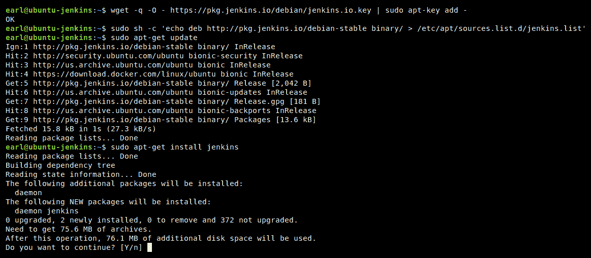

安装完成后，您将要打开浏览器，并浏览到系统上的端口`8080`，完成 Jenkins 系统的设置和配置。这将包括输入管理员密码，然后决定在 Jenkins 服务器的初始部署中安装哪些插件。我建议使用 Jenkins 建议的设置，因为这是一个很好的起点：

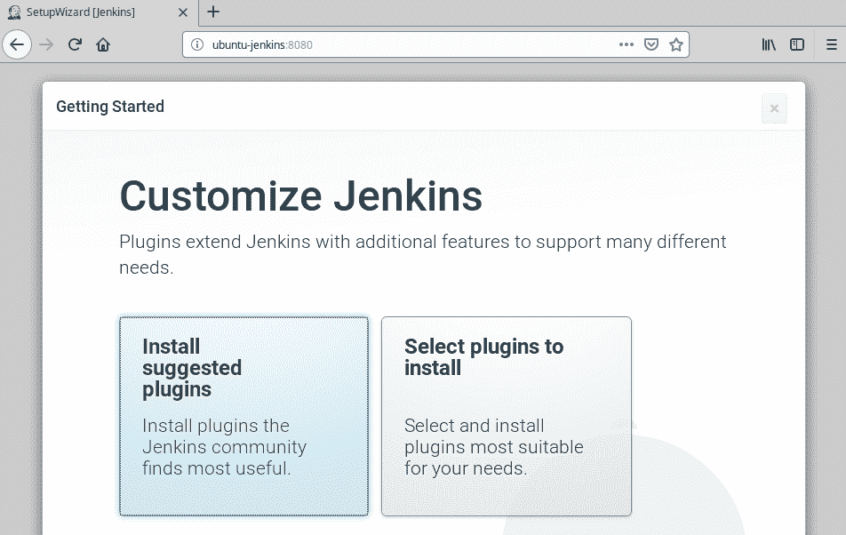

既然你有了一个 Jenkins 服务器，你可以开始创建工作来执行确认它是否按预期工作。让我们从一个微不足道的 Hello world!工作开始，以确认 Jenkins 正在工作。登录到你的 Jenkins 服务器，点击“新建项目”链接。在新项目页面中，输入我们的工作名称。我使用`hello-test`。选择我们要创建的工作类型为 pipeline。接下来，点击页面左下角附近的“确定”按钮。这将带你到我们新工作的配置屏幕。这个将会非常简单。我们将创建一个 pipeline 脚本，所以向下滚动直到看到 Pipeline 脚本输入框，并输入以下脚本（注意 pipeline 脚本是用 groovy 编写的，它使用 Java（和 C）形式的注释）：

```
// Our hello world pipeline script, named "hello-test"
node {
  stage('Say Hello') {
      echo 'Hello Docker Quick Start Guide Readers!'
   }
}
```

现在就这样吧，点击“保存”按钮保存我们 Jenkins 工作的更新配置。一旦配置保存了，让我们通过点击“立即构建”链接来测试工作。如果一切都按预期运行，我们应该看到工作成功完成。它会看起来像下面这样：

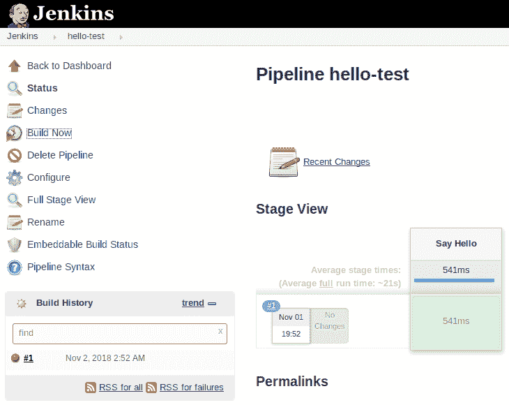

现在让我们创建另一个工作。点击链接返回仪表板，然后再次点击“新建项目”链接。这次，让我们把工作命名为`hello-docker-test`。同样，选择 pipeline 作为你想要创建的工作类型，然后点击“确定”按钮。再次向下滚动到 Pipeline 脚本输入框，并输入以下内容：

```
// Our Docker hello world pipeline script, named "hello-docker-test"
node {
   stage('Hello via Alpine') {
      docker.image('alpine:latest').inside {
         sh 'echo Hello DQS Readers - from inside an alpine container!'
      }
   }
}
```

点击“保存”按钮保存新工作的配置，然后点击“立即构建”链接启动 Jenkins 工作。以下是这次可能看起来的样子：

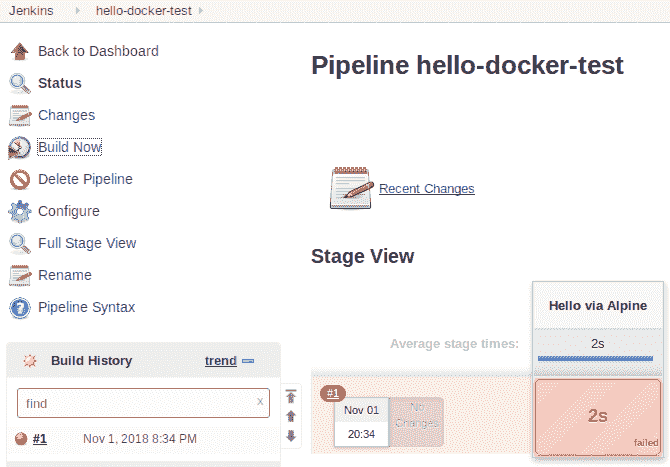

这次发生了什么？这次没有成功完成。显然失败了，因为我们的 Jenkins 服务器上还没有安装 Docker。所以让我们继续按照第一章“设置 Docker 开发环境”中找到的指令，安装 Docker，并将其安装在我们的 Jenkins 服务器上。一旦安装好了，还有一个额外的步骤你会想要做，那就是将 Jenkins 用户添加到 Docker 组中。命令如下：

```
# Add the jenkins user to the docker group
sudo usermod -aG docker jenkins
# Then restart the jenkins service
sudo service jenkins restart
```

这与我们用来将我们的 Docker 服务器的当前用户添加到 docker 组的命令非常相似，因此在 Docker 命令中不需要使用`sudo`。好的，现在让我们回到我们的 Jenkins 服务器 UI 和我们的`hello-docker-test`作业，再次点击“立即构建”按钮。

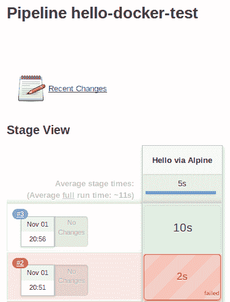

恭喜！您有一个全新的 Jenkins 服务器，已正确配置为构建（测试、推送和部署）Docker 映像。干得好。尽管这是一个伟大的成就，但工作量还是有点大。您难道不希望有更简单的方法来设置新的 Jenkins 服务器吗？所以，您知道您已经有一组运行 Docker 的服务器？您认为您可以使用该环境以更简单的方式建立起您的 Jenkins 服务器吗？当然可以！让我们来看看。

# 参考资料

以下是安装 Jenkins 的网页：[`jenkins.io/doc/book/installing/`](https://jenkins.io/doc/book/installing/)。

# 设置 Docker 化的 Jenkins 服务器

您刚刚看到了设置新的 Jenkins 服务器有多少工作。虽然这并不是一个艰巨的工作，但至少有五个步骤您必须完成，然后才能选择您的插件并登录开始工作。并且在游戏节目*猜猜这首歌*的精神下，我可以在三个步骤内部署一个 Jenkins 服务器，前两个步骤只是为了让我们的 Jenkins 数据在托管 Jenkins 服务器的 Docker 容器的生命周期之外持久存在。假设您已经按照第一章“设置 Docker 开发环境”的说明设置并运行了 Docker 主机，我们希望创建一个位置，让 Jenkins 服务器存储其数据。我们将创建一个文件夹并分配所有权。它将如下所示：

```
# Setup volume location to store Jenkins configuration
mkdir $HOME/jenkins_home
chown 1000 $HOME/jenkins_home
```

所有者`1000`是将在 Docker 容器内用于 jenkins 用户的用户 ID。

第三步是部署我们的容器。在我向您展示命令之前，让我稍微谈一下要使用哪个容器映像。我包含了一个链接，可以在 Docker hub 上搜索 Jenkins 映像。如果您使用该链接或自行搜索，您会发现有很多选择。最初，您可能会考虑使用官方的 Jenkins 映像。然而，如果您浏览该存储库，您会发现我觉得有点奇怪的是，官方映像已经被弃用。它已经停止更新到 LTS 2.60.x 版本：


它建议使用在 jenkins/jenkins:lts Jenkins 镜像库中找到的镜像，目前的版本是 2.149.x。这是我们将在下面的示例中使用的镜像。以下是我们将使用的命令来部署我们的 Jenkins 服务器容器：

```
# Deploy a Jenkins server that is configured to build Docker images
docker container run -d -p 8080:8080 -p 50000:50000 \
-v $HOME/jenkins_home:/var/jenkins_home \
--name jenkins --rm jenkins/jenkins:lts
```

仔细看这个命令，我们可以看到我们正在将容器作为守护进程（非交互式）启动。我们看到我们在主机上打开了两个端口，它们映射到容器上的相同端口号，具体是`8080`和`50000`。接下来，我们看到我们正在使用一个卷，并且它映射到我们之前创建的文件夹。这是 Jenkins 将存储其数据的地方，比如我们创建的作业和它们执行的状态。然后您会注意到我们给容器命名为`jenkins`。之后，我们告诉 Docker 在退出时删除容器，使用`--rm`标志。最后，我们告诉 Docker 我们要运行哪个镜像。

当您运行此容器时，请给它一两分钟来启动，并浏览到 Docker 主机上的端口`8080`，您将看到与在部署 Jenkins 作为独立应用程序时看到的密码提示相同。然后会出现创建第一个用户的屏幕和默认插件配置屏幕。试试看吧。

由于我们为 Jenkins 数据创建了一个卷（写入`/var/jenkins_home`），我们的 Jenkins 配置数据被保存到主机上，并且将超出容器本身的生命周期。当然，您可以使用存储驱动程序，并将这些数据保存在比 Docker 主机更持久的地方，但您明白我的意思，对吧？

唯一的问题是，官方的 Jenkins 镜像和`jenkins/jenkins`镜像都不支持创建将构建 Docker 镜像的作业。而且由于本书都是关于 Docker 的，我们需要做的不仅仅是使用上述镜像运行我们的 Jenkins 服务器。别担心，我有个计划……继续阅读。

# 参考资料

+   Docker hub 搜索 Jenkins 镜像：[`hub.docker.com/search/?isAutomated=0&isOfficial=0&page=1&pullCount=0&q=jenkins&starCount=0`](https://hub.docker.com/search/?isAutomated=0&isOfficial=0&page=1&pullCount=0&q=jenkins&starCount=0)

+   官方的 Jenkins 镜像库：[`hub.docker.com/_/jenkins/`](https://hub.docker.com/_/jenkins/)

+   Jenkins/jenkins 镜像库：[`hub.docker.com/r/jenkins/jenkins/`](https://hub.docker.com/r/jenkins/jenkins/)

# 在 Docker 化的 Jenkins 服务器内构建 Docker 镜像

好了。现在你知道如何将 Jenkins 部署为 Docker 容器，但我们真的希望能够使用 Jenkins 来构建 Docker 镜像，就像我们在独立部署 Jenkins 时所做的那样。为了做到这一点，我们可以部署相同的 Jenkins 镜像，并在其中安装 Docker，可能可以让它工作，但我们不需要那么麻烦。我们不是第一个走上这条路的先驱。已经创建了几个 Docker 镜像，可以做我们想做的事情。其中一个镜像是`h1kkan/jenkins-docker:lts`。您可以通过以下*参考*部分中的链接阅读有关它的信息，但现在只需知道它是一个已设置为 Jenkins 服务器的镜像，并且其中已经安装了 Docker。实际上，它还预先安装了 Ansible 和 AWSCLI，因此您可以使用它来构建 Docker 镜像以外的其他操作。

首先，我们将在 Docker 主机上创建一个位置，以挂载 Docker 卷来存储和保留 Jenkins 配置。如果您正在使用与上一节相同的 Docker 主机，您应该已经创建了文件夹并将其分配给 ID`1000`。如果没有，以下是您可以使用的命令：

```
# Setup volume location to store Jenkins configuration
mkdir $HOME/jenkins_home
chown 1000 $HOME/jenkins_home
```

另外，如果您还没有这样做，您可以使用`docker container stop jenkins`命令来停止（并删除）我们在上一节中创建的 Jenkins 容器，以为我们的新的、改进的 Jenkins 服务器腾出空间。当您准备创建新的容器时，您可以使用以下命令：

```
# Deploy a Jenkins server that is configured to build Docker images
docker container run -d -p 8080:8080 -p 50000:50000 \
-v $HOME/jenkins_home:/var/jenkins_home \
-v /var/run/docker.sock:/var/run/docker.sock \
--name jenkins --rm h1kkan/jenkins-docker:lts

# Start the Docker service in the Jenkins docker container
docker container exec -it -u root jenkins service docker start
```

您可能已经注意到了这个代码块中的一些不同之处。第一个是使用了第二个卷。这是一种众所周知的技巧，允许容器向其主机发出 Docker 命令。这本质上允许了所谓的 Docker-in-Docker。下一个不同之处是额外的 Docker 命令，它将在运行的容器内启动 Docker 服务。因为每个容器都会启动一个单一进程，所以同时运行 Jenkins 服务器进程和 Docker 守护程序需要这一额外步骤。

一旦在 Jenkins 容器内启动了 Docker 服务，您就可以创建使用和构建 Docker 镜像的新 Jenkins 作业。您可以通过在新的 Jenkins 服务器中重新创建上面的第二个示例`hello-docker-test`来自行测试。由于我们使用的是挂载在主机上的 Docker 卷`$HOME/jenkins_home`来存储我们的 Jenkins 数据，这应该是您需要创建此作业的最后一次。

这一切都运作得很好，但您可能还记得第七章*Docker Stacks*中我们有一个比使用`docker container run`命令更好的部署应用程序的方法，即使用 Docker 堆栈。那么，您想看到我们的示例重新构想为 Docker 堆栈吗？我也是！好的，那么，让我们来做吧。

首先，使用容器停止命令停止当前的 Jenkins 容器。它将保留我们的 Jenkins 服务器数据的`jenkins_home`文件夹，但如果由于某种原因您跳到本章的这一部分并且还没有创建它，以下是要使用的命令：

```
# Setup volume location to store Jenkins configuration
mkdir $HOME/jenkins_home
chown 1000 $HOME/jenkins_home
```

再次强调，如果您对先前的示例中的这两个命令进行了操作，并且您正在使用相同的 Docker 主机，您就不必再次执行这些操作，因为该文件夹已经存在并且具有正确的所有权。

接下来，您需要为我们的 Jenkins 堆栈创建一个 compose 文件。我把我的命名为`jenkins-stack.yml`，并输入以下 YML 代码：

```
# jenkins-stack.yml
version: "3"
services:
  jenkins:
    image: h1kkan/jenkins-docker:lts
    ports:
       - 8080:8080
       - 50000:50000
    volumes:
       - $HOME/jenkins_home:/var/jenkins_home
       - /var/run/docker.sock:/var/run/docker.sock
    deploy:
       replicas: 1
       restart_policy:
         condition: on-failure
    placement:
      constraints: [node.role == manager]

  registry:
    image: registry
    ports:
       - 5000:5000
 deploy:
    replicas: 1
    restart_policy:
      condition: on-failure
```

您将注意到我们正在创建两个服务；一个是我们的 Jenkins 服务器，另一个是 Docker 注册表。我们将在即将到来的示例中使用注册表服务，所以现在把它放在心里。查看 Jenkins 服务描述时，我们没有看到在第七章*Docker Stacks*中学到的任何内容。您将注意到我们的两个端口映射和上一个示例中使用的两个卷。我们将把单个 Jenkins 副本限制在我们的管理节点上。

记住，要使用 Docker 堆栈，我们必须在集群模式下运行，因此，如果您还没有这样做，请使用我们在第五章学到的`docker swarm init`命令创建您的集群，*Docker Swarm*。

请注意，如果您的集群有多个管理节点，您需要进一步将 Jenkins 副本限制在只有您的`jenkins_home`卷挂载点的单个管理节点上。这可以通过角色和标签的组合来实现。或者，您可以使用存储驱动程序并挂载一个可以在集群管理节点之间共享的卷。为了简单起见，我们假设我们的示例中有一个单独的管理节点。

现在使用堆栈部署命令来设置 Jenkins 应用程序。以下是要使用的命令的示例：

```
# Deploy our Jenkins application via a Docker stack
docker stack deploy -c jenkins-stack.yml jenkins
```

一旦堆栈部署并且服务正在运行，您可以浏览到您集群中的任何节点，端口为 8080，并访问您的 Jenkins 服务器。更重要的是，如果您正在重用我们之前示例中的`jenkins_home`文件夹，您将不必提供管理员密码，创建新用户和选择插件，因为所有与这些任务相关的数据都存储在`jenkins_home`文件夹中，并且现在由基于堆栈的 Jenkins 服务重用。另一个有趣的事实是，当您在堆栈应用程序中使用此镜像时，您无需启动 Docker 服务。奖励！

好了，现在我们有一个甜蜜的基于堆栈的 Jenkins 服务，可以使用和构建 Docker 镜像。一切看起来都很好。但有一件事可以让这更好。通过更好，我指的是更加 Docker 化：而不是使用普通的 Jenkins 代理进行我们的构建作业，如果我们想要为每次执行 Jenkins 作业都启动一个新的原始 Docker 容器呢？这将确保每个构建都是在一个干净、一致的环境中从头构建的。此外，这真的可以提升 Docker 的内在水平，所以我非常喜欢。如果您想看看如何做到这一点，请继续阅读。

# 参考资料

+   H1kkan/jenkins-docker 仓库：[`hub.docker.com/r/h1kkan/jenkins-docker/`](https://hub.docker.com/r/h1kkan/jenkins-docker/)

# 使用 Docker 容器作为 Jenkins 构建节点

要将 Docker 容器用于 Jenkins 构建代理，您需要对 Jenkins 配置进行一些操作：

+   构建一个新的 Docker 镜像，可以作为 Jenkins 构建代理，并能够构建 Docker 镜像（当然）

+   将新镜像推送到 Docker 注册表

+   关闭默认的 Jenkins 构建代理

+   安装 Jenkins 的 Docker 插件

+   配置一个新的云以启用 Docker 化的构建代理

# 构建 Docker 镜像

让我们开始吧。我们要做的第一件事是构建我们专门的 Docker 镜像，用于我们的 Jenkins 代理。为此，我们将使用第三章“创建 Docker 镜像”中学到的技能来创建 Docker 镜像。首先在您的开发系统上创建一个新文件夹，然后将工作目录更改为该文件夹。我把我的命名为`jenkins-agent`：

```
# Make a new folder to use for the build context of your new Docker image, and cd into it
mkdir jenkins-agent
cd jenkins-agent
```

现在创建一个新文件，命名为`Dockerfile`，使用您喜欢的编辑器，输入以下代码，然后保存：

```
# jenkins-agent Dockerfile
FROM h1kkan/jenkins-docker:lts-alpine
USER root
ARG user=jenkins

ENV HOME /home/${user}
ARG VERSION=3.26
ARG AGENT_WORKDIR=/home/${user}/agent

RUN apk add --update --no-cache curl bash git openssh-client openssl procps \
 && curl --create-dirs -sSLo /usr/share/jenkins/slave.jar https://repo.jenkins-ci.org/public/org/jenkins-ci/main/remoting/${VERSION}/remoting-${VERSION}.jar \
 && chmod 755 /usr/share/jenkins \
 && chmod 644 /usr/share/jenkins/slave.jar \
 && apk del curl

ENV AGENT_WORKDIR=${AGENT_WORKDIR}
RUN mkdir -p /home/${user}/.jenkins && mkdir -p ${AGENT_WORKDIR}
USER ${user}

VOLUME /home/${user}/.jenkins
VOLUME ${AGENT_WORKDIR}
WORKDIR /home/${user}
```

我们的新 Dockerfile 正在做什么：在我们的`FROM`指令中，我们使用了与上面的 Docker-in-Docker 示例中相同的 Docker 镜像，以便我们有一个基础镜像，可以让我们构建 Docker 镜像。接下来，我们使用`USER`命令将当前用户设置为 root。然后，我们创建一个名为用户的`ARG`并将其设置为`jenkins`的值。之后，我们设置了一个名为`HOME`的环境变量，该变量具有 Jenkins 用户的主目录的值。然后，我们设置了另外两个`ARGs`，一个用于版本，一个用于 Jenkins 代理的工作目录。接下来是魔术发生的地方。我们使用`RUN`命令来设置并获取 Jenkins 的`slave.jar`文件。这是作为 Jenkins 代理所需的部分。我们还在文件夹和文件上设置了一些权限，然后通过删除 curl 来进行一些清理。之后，我们设置了另一个环境变量，这个环境变量是`AGENT_WORKDIR`。接下来，我们在容器中创建了一些文件夹。然后，我们再次使用`USER`指令，这次将当前用户设置为我们的 Jenkins 用户。最后，我们通过创建一些`VOLUME`实例来完成 Dockerfile，并将当前工作目录设置为我们的 Jenkins 用户的主目录。哦！这似乎很多，但实际上并不那么糟糕，您只需将上述代码复制粘贴到您的 Dockerfile 中并保存即可。

现在我们的 Dockerfile 准备好使用了，现在是创建一个 git 仓库并将代码保存到其中的好时机。一旦您确认您的项目已经正确地使用 git 设置好，我们就可以构建我们的新 Docker 镜像。以下是您将用于此目的的命令：

```
# Build our new Jenkins agent image
docker image build -t jenkins-agent:latest .
```

它应该成功构建并创建一个本地缓存的镜像，标记为`jenkins-agent:latest`。

# 将新镜像推送到 Docker 注册表。

接下来，我们需要将我们的新镜像推送到 Docker 注册表。当然，我们可以将其推送到 hub.docker.com 中的我们的仓库，但由于我们恰好部署了一个 Docker 注册表的应用程序堆栈，为什么不利用它来存储我们的 Jenkins 代理镜像呢？首先，我们需要使用注册表为我们的新镜像打标签。基于您的 Docker Swarm 的域名，您的标签命令将与我的不同，但对于我的示例，以下是我的标签命令的样子：

```
# Tag the image with our swarm service registry
docker image tag jenkins-agent:latest ubuntu-node01:5000/jenkins-agent:latest
```

现在镜像已经在本地标记，我们可以使用以下命令将其推送到注册表；同样，基于您的 Swarm 的域名，您的命令将有所不同：

```
# Push the Jenkins agent image to the registry
docker image push ubuntu-node01:5000/jenkins-agent:latest
```

所有这些命令可能会使用比`latest`标签更好的版本方案，但您应该能够自行解决这个问题。随着我们的镜像构建、标记和推送到 Docker 注册表，我们准备好更新 Jenkins 配置以使用它。

# 关闭默认的 Jenkins 构建代理

现在我们准备更新 Jenkins 配置以支持我们的 Docker 化构建代理。我们要做的第一个配置更改是关闭默认的构建代理。要做到这一点，登录到您的 Jenkins 服务器，然后单击“管理 Jenkins”菜单链接。这将带您进入各种配置组，例如系统、插件和 CLI 设置。现在，我们需要进入“配置系统”管理组：


一旦您进入“配置系统”管理组，您将更改“执行器数量”的值为`0`。它应该看起来像下面这样：

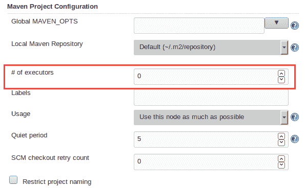

当您将“执行器数量”更改为`0`后，您可以点击屏幕左下角的保存按钮保存设置。在这一点上，由于没有配置 Jenkins 代理来运行作业，您的 Jenkins 服务器将无法运行任何作业。因此，让我们快速进行下一步，即安装 Docker 插件。

# 安装 Jenkins 的 Docker 插件

现在我们需要为 Jenkins 安装 Docker 插件。您可以像安装其他插件一样完成此操作。单击“管理 Jenkins”菜单链接，然后从配置组列表中，单击“管理插件”组的链接：


一旦您进入“管理插件”配置组，选择“可用插件”选项卡，然后在筛选框中输入`docker`以缩小可用插件的列表，以便找到与 Docker 相关的插件：


即使有一个经过筛选的列表，仍然有很多插件可供选择。找到并勾选 Docker 插件。它看起来像下面这样：


勾选 Docker 插件复选框，向下滚动并单击“无需重新启动安装”按钮。这将为您下载并安装插件，然后在 Jenkins 重新启动时启用它。在安装屏幕上，您可以选择在插件安装完成后立即执行重新启动的选项。要执行此操作，请勾选“安装完成后重新启动 Jenkins 并且没有作业正在运行”复选框：

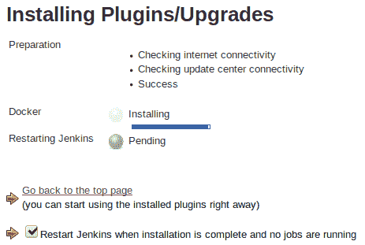

由于我们几分钟前将执行器数量设置为`0`，现在不会有任何作业正在运行，因此一旦安装插件，Jenkins 将重新启动。Jenkins 一旦恢复在线，插件将被安装。我们需要重新登录 Jenkins 并设置我们的云。

# 创建一个新的云，以启用我们的 Docker 化构建代理

现在，我们将告诉 Jenkins 使用我们的自定义 Docker 镜像来作为 Jenkins 构建代理运行容器。再次，单击“管理 Jenkins”菜单链接。从配置组列表中，您将再次单击“配置系统”组的链接。您将在配置选项的底部附近找到云配置。单击“添加新云”下拉菜单，并选择`Docker`：


屏幕将更新，您将看到两个新的配置组：Docker Cloud 详细信息...和 Docker 代理模板...：


让我们先处理 Docker Cloud 的细节。现在点击该按钮。您可以将名称值保留为`docker`的默认值。在 Docker 主机 URI 字段中，输入`unix:///var/run/docker.sock`。您可以通过单击问号帮助图标并将其复制粘贴到输入字段中来找到此值。接下来，单击“测试连接”按钮，您应该会看到一个版本行显示出来，类似于您将在以下屏幕截图中看到的内容。记下 API 版本号，因为您将需要它进行高级设置。单击“高级”按钮，并在 Docker API 版本字段中输入 API 版本号。您需要勾选“已启用”复选框以启用此功能，所以一定要这样做。最后，您可能需要更改系统可以同时运行的容器数量。默认值为 100。例如，我将该值减少到`10`。完成后，您的配置应该看起来类似于以下内容：

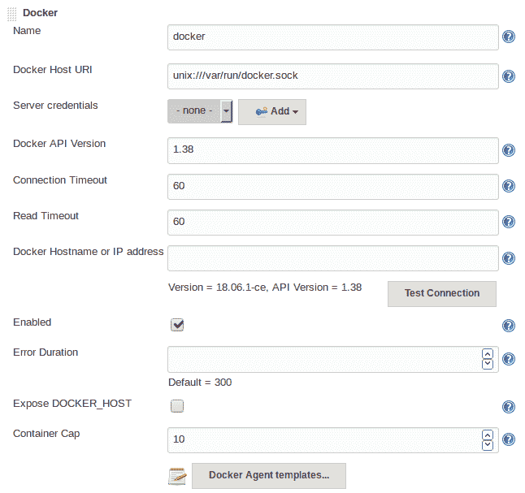

接下来，点击 Docker 代理模板...按钮，然后点击出现的添加 Docker 模板按钮，以便配置 Jenkins 代理设置。在这里，您将要点击代理的已启用复选框，以启用我们的新代理模板。您可以给一个名称，用作由 Jenkins 作为构建代理运行的容器的前缀，或者您可以将名称留空，将使用`docker`前缀。接下来，输入您要用于构建代理容器的镜像的存储库和名称标签。我们创建了我们的自定义镜像，标记了它，并将其推送到我们的 Jenkins 堆栈应用程序存储库，使用`ubuntu-node01:5000/jenkins-agent:latest`镜像名称，因此将该值输入到 Docker 镜像字段中。将实例容量值设置为`1`，将远程文件系统根值设置为`/home/jenkins/agent`。确保使用值设置为`尽可能多地使用此节点`，并使用`连接方法`的`附加 Docker 容器`值。将用户设置为`root`。将拉取策略值更改为`拉取一次并更新最新`：

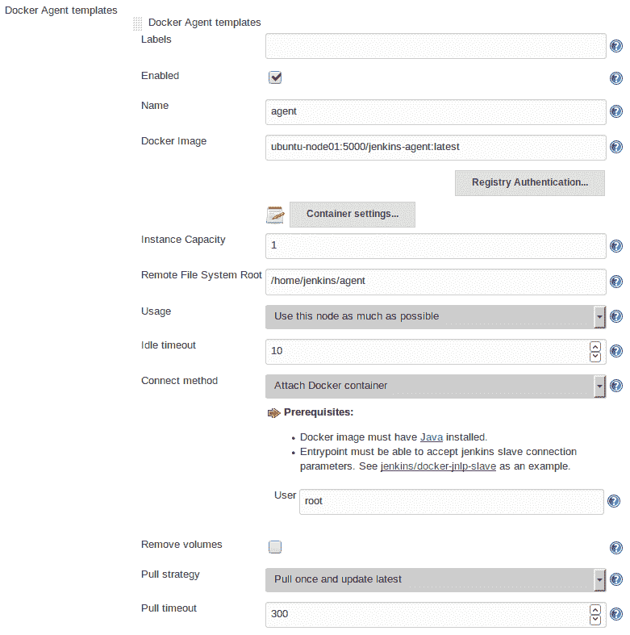

最后，我们需要配置一些容器设置..., 所以点击展开该部分。我们需要在这里输入的值是容器运行时要使用的命令。Docker 命令字段中需要的值是 `java -jar /usr/share/jenkins/slave.jar`。卷字段中需要的值是 `/var/run/docker.sock:/var/run/docker.sock`：

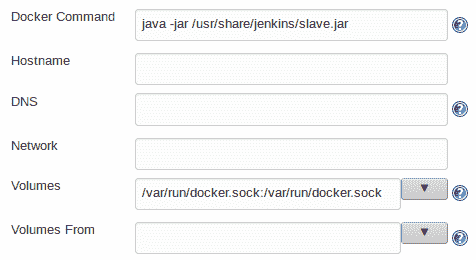

最后，勾选分配伪 TTY 的复选框：

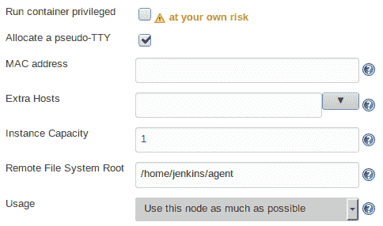

滚动到配置屏幕底部，然后单击保存按钮以保存所有云设置。这是一些严肃的配置功夫 - 做得好！但是，以防万一您想要所有输入值的快速参考，这里是我们示例中用于配置 Docker 云的所有自定义（或非默认）值：

| **字段名称** | **使用的值** |
| --- | --- |
| Docker 主机 URI | `unix:///var/run/docker.sock` |
| Docker API 版本 | `1.38`（与连接测试中显示的版本匹配） |
| Docker 云已启用 | 已勾选 |
| 容器容量 | `10` |
| Docker 代理已启用 | 已勾选 |
| Docker 代理模板名称 | `agent` |
| Docker 镜像 | `ubuntu-node01:5000/jenkins-agent:latest` |
| 实例容量 | `1` |
| 远程文件系统根 | `/home/jenkins/agent` |
| 用途 | `尽可能多地使用此节点` |
| 连接方法 | `附加 Docker 容器` |
| 用户 | `root` |
| 拉取策略 | `拉取一次并更新最新` |
| Docker 命令 | `java -jar /usr/share/jenkins/slave.jar` |
| 卷 | `/var/run/docker.sock:/var/run/docker.sock` |
| 分配伪 TTY | 已选中 |

现在一切都配置好了，让我们测试一下我们新定义的 Jenkins 代理。

# 测试我们的新构建代理

返回 Jenkins 仪表板，点击“计划构建”按钮，为我们的`hello-docker-test`作业。这将为我们的作业启动一个新的构建，然后将创建一个新的 Docker 化构建代理。它使用我们设置的配置来执行`docker container run`命令，以运行一个基于我们指定的镜像的新容器。最初，执行器将处于离线状态，因为容器正在启动：


注意，执行器名称具有我们指定的代理前缀。一旦容器运行起来，Jenkins 作业将在其中启动，基本上使用`docker container exec`命令。当 Jenkins 作业启动时，正常的作业进度图形将显示，并且执行器将不再显示为离线状态。状态然后会看起来像这样：

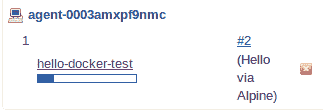

如果您点击正在执行的作业的进度条，您可以查看作业的控制台输出，不久后，作业将显示已完成：成功状态，如下所示：

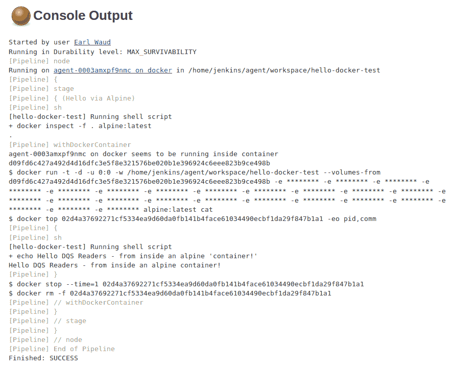

工作完成得很好！让我们检查最后一个例子 Jenkins 作业，展示一个具有更多阶段的流水线脚本，代表了一个真实世界的 Docker 作业的例子。你准备好了吗？继续阅读。

# 在 Docker 化构建节点内构建、测试和推送 Docker 镜像

在 Docker 和 Jenkins 的这一章结束之前，让我们走一遍为真实世界的 Docker 化节点应用程序创建模板的步骤。以下是我们将要做的：

准备我们的应用程序：

+   在 GitHub 上创建一个新的存储库

+   克隆存储库到我们的开发工作站

+   创建我们的应用程序文件

+   将我们的应用程序文件上传到 GitHub

创建并测试将构建我们的 Docker 化节点应用程序的 Jenkins 作业：

+   创建一个利用 GitHub 存储库的新 Jenkins 作业

+   测试我们的 Jenkins 作业，将拉取存储库，构建应用程序，测试它，并发布镜像

+   庆祝我们的成功！

让我们开始准备我们的应用程序。

我们要做的第一件事是在 GitHub 上创建我们的应用程序存储库。浏览并登录[github.com](http://www.github.com)，转到你的存储库页面，然后点击创建新存储库按钮。输入新存储库的名称。在我们的示例中，我使用了`dqs-example-app`。输入一个合适的描述。你可以将你的存储库设置为公开或私有。在这个示例中，我将其设置为公开，以简化后续不需要身份验证即可拉取存储库的过程。勾选初始化存储库复选框，这样你就可以立即在你的工作站上克隆空的存储库。你可以选择创建`.gitignore`文件时要使用的项目类型。我选择了`Node`。当你输入并选择了所有这些内容后，它会看起来像下面这样：


点击创建存储库按钮来创建你的新应用程序存储库。现在它在 GitHub 上创建好了，你会想要将它克隆到你的工作站上。使用克隆或下载按钮，然后使用复制按钮来复制存储库的 URL 以进行克隆步骤：


现在，回到你的工作站，在你保存本地存储库的位置，克隆这个新的（大部分是）空的存储库。然后切换到新存储库的文件夹中。对我来说，看起来像下面这样：


现在我们要创建应用程序的脚手架。这将包括创建一个`Dockerfile`，一个`Jenkinsfile`，`main.js`和`test.js`文件，以及`package.json`文件。使用你喜欢的编辑器在你的应用程序文件夹中创建这些文件。以下是这些文件的内容：

以下是`Dockerfile`文件的内容：

```
FROM node:10-alpine
COPY . .
RUN npm install
EXPOSE 8000
CMD npm start
```

以下是`Jenkinsfile`文件的内容：

```
node {
   def app
   stage('Clone repository') {
      /* Clone the repository to our workspace */
      checkout scm
   }
   stage('Build image') {
      /* Builds the image; synonymous to docker image build on the command line */
      /* Use a registry name if pushing into docker hub or your company registry, like this */
      /* app = docker.build("earlwaud/jenkins-example-app") */
      app = docker.build("jenkins-example-app")
   }
   stage('Test image') {
      /* Execute the defined tests */
      app.inside {
         sh 'npm test'
      }
   }
   stage('Push image') {
      /* Now, push the image into the registry */
      /* This would probably be docker hub or your company registry, like this */
      /* docker.withRegistry('https://registry.hub.docker.com', 'docker-hub-credentials') */

      /* For this example, We are using our jenkins-stack service registry */
      docker.withRegistry('https://ubuntu-node01:5000') {
         app.push("latest")
      }
   }
}
```

以下是`main.js`文件的内容：

```
// load the http module
var http = require('http');

// configure our HTTP server
var server = http.createServer(function (request, response) {
   response.writeHead(200, {"Content-Type": "text/plain"});
   response.end("Hello Docker Quick Start\n");
});

// listen on localhost:8000
server.listen(8000);
console.log("Server listening at http://127.0.0.1:8000/");
```

以下是`package.json`文件的内容：

```
{
   "name": "dqs-example-app",
   "version": "1.0.0",
   "description": "A Docker Quick Start Example HTTP server",
   "main": "main.js",
   "scripts": {
      "test": "node test.js",
      "start": "node main.js"
   },
   "repository": {
      "type": "git",
      "url": "https://github.com/earlwaud/dqs-example-app/"
   },
   "keywords": [
      "node",
      "docker",
      "dockerfile",
      "jenkinsfile"
   ],
   "author": "earlwaud@hotmail.com",
   "license": "ISC",
   "devDependencies": { "test": ">=0.6.0" }
}
```

最后，以下是`test.js`文件的内容：

```
var assert = require('assert')

function test() {
   assert.equal(1 + 1, 2);
}

if (module == require.main) require('test').run(test);
```

当你完成所有操作后，你的存储库文件夹应该看起来像下面这样：

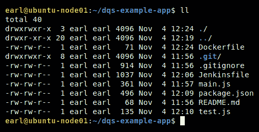

现在，让我们将我们的工作推送到 GitHub 存储库。你将使用标准的 git 命令来添加文件，提交文件，然后将文件推送到存储库。以下是我使用的命令：

```
# Initial commit of our application files to the new repo
git add Dockerfile Jenkinsfile main.js package.json test.js
git commit -m "Initial commit"
git push origin master
```

对我来说，情况是这样的：

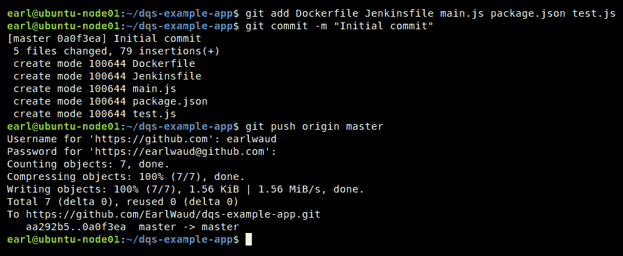

现在，我们的应用程序的初始版本已经创建并推送到我们的 GitHub 仓库，我们准备创建 Jenkins 作业来拉取我们的仓库代码，构建我们的应用程序镜像，对其进行测试，然后发布我们应用程序的 Docker 镜像。首先，通过登录到 Jenkins 服务器并单击“新项目”链接来创建一个新的 Jenkins 作业。接下来，在“输入项目名称”输入框中输入要用于作业的名称。我正在使用`dqs-example-app`。选择“流水线”作为我们正在创建的作业类型，然后单击“确定”按钮。

您可以并且可能应该为我们正在创建的构建作业提供有意义的描述。只需将其输入到配置屏幕顶部的“描述：”输入框中。对于我们的示例，我输入了略显简洁的描述“使用来自 SCM 的管道脚本构建 dqs-example-app”。您可能可以做得更好。

我们将设置 Jenkins 作业，每五分钟轮询 GitHub 仓库，以查找主分支的更改。有更好的选项，可以在仓库更改时触发构建作业，而不是定期轮询，但为了简单起见，我们将只使用轮询方法。因此，请滚动到作业配置的“构建触发器”部分，并选中“轮询 SCM”。然后在计划中输入值`H/5 * * * *`：


接下来，我们要设置我们的流水线。与以前的示例不同，这次我们将选择“来自 SCM 的管道脚本”选项。我们将为我们的 SCM 选择`Git`，然后输入 GitHub 上我们应用程序仓库的存储库 URL。对于此示例，该 URL 为`https://github.com/EarlWaud/dqs-example-app.git`。确保“要构建的分支”值设置为`*/master`，这是默认值。您的流水线定义应该看起来很像以下内容：

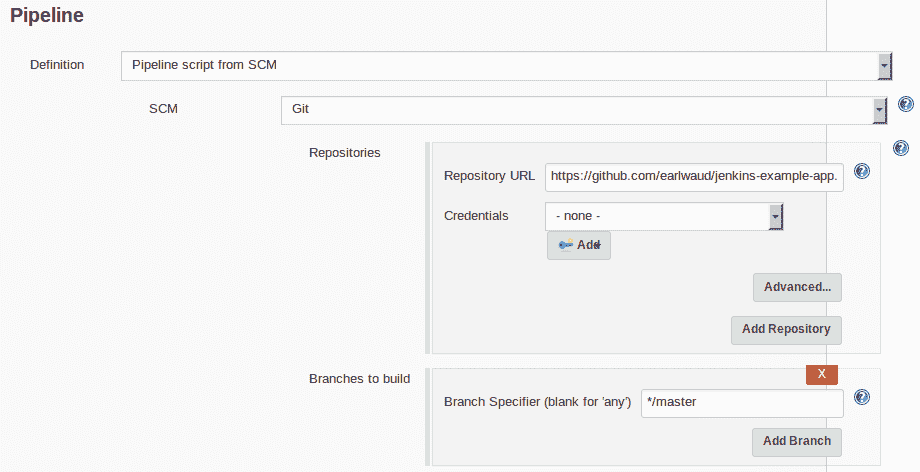

流水线的另一个关键设置是脚本路径。这是 Jenkins 脚本文件的（路径和）文件名。在我们的情况下，这实际上只是`Jenkinsfile`，因为我们给文件的名称是`Jenkinsfile`，它位于我们仓库的根目录。这是我们示例的输入样子：


这是目前所需的所有配置。其他一切都已经在我们的源文件中设置好了，它们将从我们的应用程序存储库中拉取。配置所需做的就是点击保存按钮。回到作业页面，我们已经准备好执行我们的第一个构建。在我们的示例中，新创建的作业屏幕看起来像这样：


现在，只需等待。在五分钟或更短的时间内，作业的第一个构建将自动启动，因为我们已经设置了每五分钟轮询存储库。当作业完成后，我们将查看控制台日志，但首先让我们看一下作业完成后的 Jenkins 作业视图（当然是成功的）：


以下是控制台日志输出的编辑视图，供参考（完整的日志输出可以在源代码包中找到）：

```
Started by an SCM change
Started by user Earl Waud
Obtained Jenkinsfile from git https://github.com/EarlWaud/dqs-example-app.git
[Pipeline] node
Running on agent-00042y2g983xq on docker in /home/jenkins/agent/workspace/dqs-example-app
[Pipeline] { (Clone repository)
Cloning repository https://github.com/EarlWaud/dqs-example-app.git
> git init /home/jenkins/agent/workspace/dqs-example-app # timeout=10
[Pipeline] { (Build image)
+ docker build -t jenkins-example-app .
Successfully built b228cd7c0013
Successfully tagged jenkins-example-app:latest
[Pipeline] { (Test image)
+ docker inspect -f . jenkins-example-app
+ npm test
> node test.js
Passed:1 Failed:0 Errors:0
[Pipeline] { (Push image)
+ docker tag jenkins-example-app ubuntu-node01:5000/jenkins-example-app:latest
+ docker push ubuntu-node01:5000/jenkins-example-app:latest
Finished: SUCCESS
```

现在剩下的就是庆祝我们的成功：


说真的，这是创建自己的 Docker 应用程序并使用 Jenkins 构建、测试和发布它们的一个很好的基础。把它看作一个模板，你可以重复使用并构建。现在你已经准备好以任何你想要的方式在 Jenkins 中使用 Docker 了。

# 摘要

好了，我们到了本章的结尾。我希望你阅读本章的乐趣和我写作时一样多。我们有机会运用我们在之前章节学到的许多技能。不仅如此，本章还包含一些非常有用的 Jenkins 知识。以至于你可以认真考虑跳过任何计划中的 Jenkins 培训或书籍阅读，因为你几乎可以在这里找到关于使用 Jenkins 的一切知识。

让我们回顾一下：首先，我们学习了如何设置独立的 Jenkins 服务器。我们很快过渡到将 Jenkins 服务器部署为 Docker 容器。这就是你阅读这本书的目的，对吧？然后我们学会了如何在 Docker 化的 Jenkins 服务器中构建 Docker 镜像。接下来，我们找出了如何用超酷的 Docker 容器替换无聊的 Jenkins 代理，这些容器可以构建我们的 Docker 镜像。你可能会考虑这个以及 Docker 中的 Docker 中的 Docker。你看过电影《盗梦空间》吗？嗯，你刚刚经历了它。最后，在本章的总结中，我们创建了一个示例的 Docker 化应用程序和构建、测试和发布该应用程序镜像的 Jenkins 作业。这是一个示例，你可以将其用作未来创建的真实应用程序的模板和基础。

现在，我们来到了书的结尾。我再说一遍……我希望你阅读这本书和我写这本书一样开心。我也希望你从中学到的和我写这本书一样多。在这些章节中，我们涵盖了大量关于 Docker 的信息。在第一章中，*设置 Docker 化的开发环境*，我们成功搭建了 Docker 工作站，无论你喜欢的操作系统类型是什么。在第二章中，*学习 Docker 命令*，我们学到了几乎所有关于 Docker 命令集的知识。在第三章中，*创建 Docker 镜像*，我们深入研究了`Dockerfile`指令集，并学会了如何创建几乎任何你想构建的 Docker 镜像。第四章，*Docker 卷*，向我们展示了 Docker 卷的强大和实用性。在第五章中，*Docker Swarm*，我们开始运用前几章的几个教训，练习了几乎神奇的 Docker swarm 的功能。然后，在第六章中，*Docker 网络*，我们继续学习 Docker 知识，这次学习了 Docker 如何为我们简化了复杂的网络主题。在第七章中，*Docker 堆栈*，我们看到了更多 Docker 的魔力和力量，当我们了解了 Docker 堆栈。最后，在第八章中，*Docker 和 Jenkins*，我们将所有学到的知识应用起来，利用 Docker 和 Jenkins 为我们准备好创建真实世界的应用程序。

我所能做的就是说声谢谢，并祝愿你在 Docker 之旅中取得成功。
