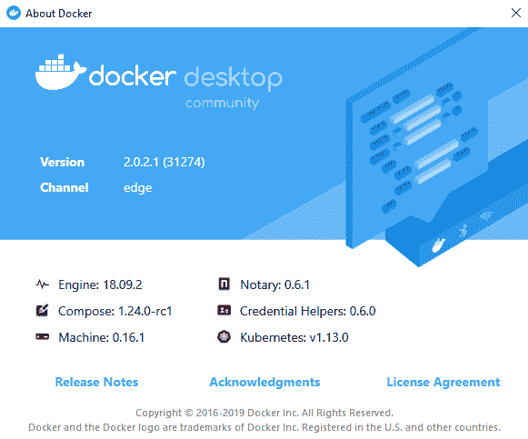

# 第一章：在 Windows 上使用 Docker 入门

Docker 是一个应用平台。这是一种在隔离的轻量级单元中运行应用程序的新方法，称为**容器**。容器是运行应用程序的一种非常高效的方式 - 比**虚拟机**（**VMs**）或裸机服务器要高效得多。容器在几秒钟内启动，并且不会增加应用程序的内存和计算需求。Docker 对其可以运行的应用程序类型完全不可知。您可以在一个容器中运行全新的.NET Core 应用程序，在另一个容器中运行 10 年前的 ASP.NET 2.0 WebForms 应用程序，这两个容器可以在同一台服务器上。

容器是隔离的单元，但它们可以与其他组件集成。您的 WebForms 容器可以访问托管在.NET Core 容器中的 REST API。您的.NET Core 容器可以访问在容器中运行的 SQL Server 数据库，或者在单独的机器上运行的 SQL Server 实例。您甚至可以设置一个混合 Linux 和 Windows 机器的集群，所有这些机器都运行 Docker，并且 Windows 容器可以透明地与 Linux 容器通信。

无论大小，公司都在转向 Docker 以利用这种灵活性和效率。Docker，Inc. - Docker 平台背后的公司 - 的案例研究显示，通过转向 Docker，您可以减少 50%的硬件需求，并将发布时间缩短 90%，同时仍然保持应用程序的高可用性。这种显著的减少同样适用于本地数据中心和云。

效率并不是唯一的收获。当您将应用程序打包到 Docker 中运行时，您会获得可移植性。您可以在笔记本电脑上的 Docker 容器中运行应用程序，并且它将在数据中心的服务器和任何云中的 VM 上表现完全相同。这意味着您的部署过程简单且无风险，因为您正在部署您已经测试过的完全相同的构件，并且您还可以自由选择硬件供应商和云提供商。

另一个重要的动机是安全性。容器在应用程序之间提供了安全隔离，因此您可以放心，如果一个应用程序受到攻击，攻击者无法继续攻击同一主机上的其他应用程序。平台还有更广泛的安全性好处。Docker 可以扫描打包应用程序的内容，并提醒您应用程序堆栈中的安全漏洞。您还可以对容器映像进行数字签名，并配置 Docker 仅从您信任的映像作者运行容器。

Docker 是由开源组件构建的，并作为**Docker 社区版**（**Docker CE**）和**Docker 企业版**提供。Docker CE 是免费使用的，并且每月发布。Docker 企业版是付费订阅；它具有扩展功能和支持，并且每季度发布。Docker CE 和 Docker 企业版都可在 Windows 上使用，并且两个版本使用相同的基础平台，因此您可以以相同的方式在 Docker CE 和 Docker 企业版上运行应用程序容器。

本章让您快速上手 Docker 容器。它涵盖了：

+   Docker 和 Windows 容器

+   理解关键的 Docker 概念

+   在 Windows 上运行 Docker

+   通过本书了解 Docker

# 技术要求

您可以使用 GitHub 存储库[`github.com/sixeyed/docker-on-windows/tree/second-edition/ch01`](https://github.com/sixeyed/docker-on-windows/tree/second-edition/ch01)中的代码示例来跟随本书。您将在本章中学习如何安装 Docker - 唯一的先决条件是 Windows 10 并安装了 1809 微软更新，或者 Windows Server 2019。

# Docker 和 Windows 容器

Docker 最初是在 Linux 上开发的，利用了核心 Linux 功能，但使得在应用工作负载中使用容器变得简单高效。微软看到了潜力，并与 Docker 工程团队密切合作，将相同的功能带到了 Windows 上。

Windows Server 2016 是第一个可以运行 Docker 容器的 Windows 版本；Windows Server 2019 通过显著改进的功能和性能继续创新 Windows 容器。您可以在 Windows 10 上运行相同的 Docker 容器进行开发和测试，就像在生产环境中在 Windows Server 上运行一样。目前，您只能在 Windows 上运行 Windows 应用程序容器，但微软正在增加对在 Windows 上运行 Linux 应用程序容器的支持。

首先，您需要知道的是容器与 Windows UI 之间没有集成。容器仅用于服务器端应用工作负载，如网站、API、数据库、消息队列、消息处理程序和控制台应用程序。您不能使用 Docker 来运行客户端应用程序，比如.NET WinForms 或 WPF 应用程序，但您可以使用 Docker 来打包和分发应用程序，这将为您所有的应用程序提供一致的构建和发布流程。

在 Windows Server 2019 和 Windows 10 上运行容器的方式也有所不同。使用 Docker 的用户体验是相同的，但容器托管的方式不同。在 Windows Server 上，服务应用程序的进程实际上在服务器上运行，并且容器和主机之间没有层。在容器中，您可能会看到`w3wp.exe`运行以提供网站服务，但该进程实际上在服务器上运行 - 如果您运行了 10 个 Web 容器，您将在服务器的任务管理器中看到 10 个`w3wp.exe`实例。

Windows 10 与 Windows Server 2019 没有相同的操作系统内核，因此为了为容器提供 Windows Server 内核，Windows 10 在一个非常轻量的虚拟机中运行每个容器。这些被称为**Hyper-V 容器**，如果您在 Windows 10 上的容器中运行 Web 应用程序，您将看不到`w3wp.exe`在主机上运行 - 它实际上在 Hyper-V 容器中的专用 Windows Server 内核中运行。

这是默认行为，但在最新版本的 Windows 和 Docker 中，您可以在 Windows 10 上运行 Windows Server 容器，因此您可以跳过为每个容器运行 VM 的额外开销。

了解 Windows Server 容器和 Hyper-V 容器之间的区别是很重要的。您可以为两者使用相同的 Docker 工件和相同的 Docker 命令，因此流程是相同的，但使用 Hyper-V 容器会有轻微的性能损失。在本章的后面，我将向您展示在 Windows 上运行 Docker 的选项，您可以选择最适合您的方法。

# Windows 版本

Windows Server 容器中的应用程序直接在主机上运行进程，并且服务器上的 Windows 版本需要与容器内的 Windows 版本匹配。本书中的所有示例都基于使用 Windows Server 2019 的容器，这意味着您需要一台 Windows Server 2019 机器来运行它们，或者使用安装了 1809 更新的 Windows 10（`winver`命令将告诉您您的更新版本）。

您可以将为不同版本的 Windows 构建的容器作为 Hyper-V 容器运行。这样可以实现向后兼容性，因此您可以在运行 Windows Server 2019 的计算机上运行为 Windows Server 2016 构建的容器。

# Windows 许可

Windows 容器与运行 Windows 的服务器或虚拟机没有相同的许可要求。Windows 的许可是在主机级别而不是容器级别。如果在一台服务器上运行了 100 个 Windows 容器，您只需要为服务器购买一个许可证。如果您目前使用虚拟机来隔离应用程序工作负载，那么可以节省相当多的费用。去除虚拟机层并直接在服务器上运行应用程序容器可以消除所有虚拟机的许可要求，并减少所有这些机器的管理开销。

Hyper-V 容器有单独的许可。在 Windows 10 上，您可以运行多个容器，但不能用于生产部署。在 Windows Server 上，您还可以以 Hyper-V 模式运行容器以增加隔离性。这在多租户场景中很有用，其中您需要预期和减轻敌对工作负载。Hyper-V 容器是单独许可的，在高容量环境中，您需要 Windows Server 数据中心许可证才能运行 Hyper-V 容器而不需要单独的许可证。

微软和 Docker 公司合作，为 Windows Server 2016 和 Windows Server 2019 提供免费的 Docker Enterprise。Windows Server 许可证的价格包括 Docker Enterprise Engine，这使您可以获得在容器中运行应用程序的支持。如果您在容器或 Docker 服务方面遇到问题，可以向微软提出，并且他们可以将问题升级给 Docker 的工程师。

# 理解关键的 Docker 概念

Docker 是一个非常强大但非常简单的应用程序平台。你可以在短短几天内开始在 Docker 中运行你现有的应用程序，并在另外几天内准备好投入生产。本书将带你通过许多.NET Framework 和.NET Core 应用程序在 Docker 中运行的示例。你将学习如何在 Docker 中构建、部署和运行应用程序，并进入高级主题，如解决方案设计、安全性、管理、仪表板和持续集成和持续交付（CI/CD）。

首先，你需要了解核心的 Docker 概念：镜像、注册表、容器和编排器 - 以及了解 Docker 的实际运行方式。

# Docker 引擎和 Docker 命令行

Docker 作为后台 Windows 服务运行。这个服务管理每个正在运行的容器 - 它被称为 Docker 引擎。引擎为消费者提供了一个 REST API，用于处理容器和其他 Docker 资源。这个 API 的主要消费者是 Docker 命令行工具（CLI），这是我在本书中大部分代码示例中使用的工具。

Docker REST API 是公开的，有一些由 API 驱动的替代管理工具，包括像 Portainer（开源）和 Docker Universal Control Plane（UCP）（商业产品）这样的 Web UI。Docker CLI 非常简单易用 - 你可以使用像`docker container run`这样的命令来在容器中运行应用程序，使用`docker container rm`来删除容器。

你还可以配置 Docker API 以实现远程访问，并配置你的 Docker CLI 以连接到远程服务。这意味着你可以使用笔记本电脑上的 Docker 命令管理在云中运行的 Docker 主机。允许远程访问的设置也可以包括加密，因此你的连接是安全的 - 在本章中，我将向你展示一种简单的配置方法。

一旦你运行了 Docker，你将开始从镜像中运行容器。

# Docker 镜像

Docker 镜像是一个完整的应用程序包。它包含一个应用程序及其所有的依赖项：语言运行时、应用程序主机和底层操作系统。从逻辑上讲，镜像是一个单一的文件，它是一个可移植的单元 - 你可以通过将你的镜像推送到 Docker 注册表来分享你的应用程序。任何有权限的人都可以拉取镜像并在容器中运行你的应用程序；它对他们来说的行为方式与对你来说完全一样。

这里有一个具体的例子。一个 ASP.NET WebForms 应用程序将在 Windows Server 上的**Internet Information Services**（**IIS**）上运行。为了将应用程序打包到 Docker 中，您构建一个基于 Windows Server Core 的镜像，添加 IIS，然后添加 ASP.NET，复制您的应用程序，并在 IIS 中配置它作为一个网站。您可以在一个称为**Dockerfile**的简单脚本中描述所有这些步骤，并且您可以使用 PowerShell 或批处理文件来执行每个步骤。

通过运行`docker image build`来构建镜像。输入是 Dockerfile 和需要打包到镜像中的任何资源（如 Web 应用程序内容）。输出是一个 Docker 镜像。在这种情况下，镜像的逻辑大小约为 5GB，但其中 4GB 将是您用作基础的 Windows Server Core 镜像，并且该镜像可以作为基础共享给许多其他镜像。（我将在第四章中更详细地介绍镜像层和缓存，*使用 Docker 注册表共享镜像*。）

Docker 镜像就像是您的应用程序一个版本的文件系统快照。镜像是静态的，并且您可以使用镜像注册表来分发它们。

# 镜像注册表

注册表是 Docker 镜像的存储服务器。注册表可以是公共的或私有的，有免费的公共注册表和商业注册表服务器，可以对镜像进行细粒度的访问控制。镜像以唯一的名称存储在注册表中。任何有权限的人都可以通过运行`docker image push`来上传镜像，并通过运行`docker image pull`来下载镜像。

最受欢迎的注册表是**Docker Hub**，这是由 Docker 托管的公共注册表，但其他公司也托管自己的注册表来分发他们自己的软件：

+   Docker Hub 是默认的注册表，它已经变得非常受欢迎，用于开源项目、商业软件以及团队开发的私有项目。在 Docker Hub 上存储了数十万个镜像，每年提供数十亿次的拉取请求。您可以将 Docker Hub 镜像配置为公共或私有。它适用于内部产品，您可以限制对镜像的访问。您可以设置 Docker Hub 自动从存储在 GitHub 中的 Dockerfile 构建镜像-目前，这仅支持基于 Linux 的镜像，但 Windows 支持应该很快就会到来。

+   **Microsoft 容器注册表**（**MCR**）是微软托管其自己的 Windows Server Core 和 Nano Server 的 Docker 图像的地方，以及预先配置了.NET Framework 的图像。微软的 Docker 图像可以免费下载和使用。它们只能在 Windows 机器上运行，这是 Windows 许可证适用的地方。

在典型的工作流程中，您可能会在 CI 管道的一部分构建图像，并在所有测试通过时将它们推送到注册表。您可以使用 Docker Hub，也可以运行自己的私有注册表。然后，该图像可供其他用户在容器中运行您的应用程序。

# Docker 容器

容器是从图像创建的应用程序实例。图像包含整个应用程序堆栈，并且还指定了启动应用程序的进程，因此 Docker 知道在运行容器时该做什么。您可以从同一图像运行多个容器，并且可以以不同的方式运行容器。（我将在下一章中描述它们。）

您可以使用`docker container run`启动应用程序，指定图像的名称和配置选项。分发内置到 Docker 平台中，因此如果您在尝试运行容器的主机上没有图像的副本，Docker 将首先拉取图像。然后它启动指定的进程，您的应用程序就在容器中运行了。

容器不需要固定的 CPU 或内存分配，应用程序的进程可以使用主机的计算能力。您可以在一台普通硬件上运行数十个容器，除非所有应用程序都尝试同时使用大量 CPU，它们将愉快地并发运行。您还可以启动具有资源限制的容器，以限制它们可以访问多少 CPU 和内存。

Docker 提供容器运行时，以及图像打包和分发。在小型环境和开发中，您将在单个 Docker 主机上管理单个容器，这可以是您的笔记本电脑或测试服务器。当您转移到生产环境时，您将需要高可用性和扩展选项，这需要像 Docker Swarm 这样的编排器。

# Docker Swarm

Docker 有能力在单台机器上运行，也可以作为运行 Docker 的一组机器中的一个节点。这个集群被称为**Swarm**，你不需要安装任何额外的东西来在 swarm 模式下运行。你在一组机器上安装 Docker - 在第一台机器上，你运行`docker swarm init`来初始化 swarm，在其他机器上，你运行`docker swarm join`来加入 swarm。

我将在第七章中深入介绍 swarm 模式，*使用 Docker Swarm 编排分布式解决方案*，但在你继续深入之前，重要的是要知道 Docker 平台具有高可用性、安全性、规模和弹性。希望你的 Docker 之旅最终会让你受益于所有这些特性。

在 swarm 模式下，Docker 使用完全相同的构件，因此你可以在一个 20 节点的 swarm 中运行 50 个容器的应用，其功能与在笔记本上的单个容器中运行时相同。在 swarm 中，你的应用性能更高，更容忍故障，并且你将能够对新版本执行自动滚动更新。

在 swarm 中，节点使用安全加密进行所有通信，为每个节点使用受信任的证书。你也可以将应用程序秘密作为加密数据存储在 swarm 中，因此数据库连接字符串和 API 密钥可以被安全保存，并且 swarm 只会将它们传递给需要它们的容器。

Docker 是一个成熟的平台。它在 2016 年才新加入 Windows Server，但在 Linux 上发布了四年后才进入 Windows。Docker 是用 Go 语言编写的，这是一种跨平台语言，只有少部分代码是特定于 Windows 的。当你在 Windows 上运行 Docker 时，你正在运行一个经过多年成功生产使用的应用平台。

# 关于 Kubernetes 的说明

Docker Swarm 是一个非常流行的容器编排器，但并不是唯一的选择。Kubernetes 是另一个选择，它已经取得了巨大的增长，大多数公共云现在都提供托管的 Kubernetes 服务。在撰写本书时，Kubernetes 是一个仅限于 Linux 的编排器，Windows 支持仍处于测试阶段。在你的容器之旅中，你可能会听到很多关于 Kubernetes 的内容，因此了解它与 Docker Swarm 的比较是值得的。

首先，相似之处 - 它们都是容器编排器，这意味着它们都是负责在生产环境中以规模运行容器的机器集群。它们都可以运行 Docker 容器，并且您可以在 Docker Swarm 和 Kubernetes 中使用相同的 Docker 镜像。它们都是基于开源项目构建的，并符合**Open Container Initiative**（**OCI**）的标准，因此不必担心供应商锁定问题。您可以从 Docker Swarm 开始，然后转移到 Kubernetes，反之亦然，而无需更改您的应用程序。

现在，不同之处。Docker Swarm 非常简单；您只需几行标记就可以描述要在 swarm 中以容器运行的分布式应用程序。要在 Kubernetes 上运行相同的应用程序，您的应用程序描述将是四倍甚至更多的标记。Kubernetes 比 swarm 具有更多的抽象和配置选项，因此有一些您可以在 Kubernetes 中做但在 swarm 中做不了的事情。这种灵活性的代价是复杂性，而且学习 Kubernetes 的学习曲线比学习 swarm 要陡峭得多。

Kubernetes 很快将支持 Windows，但在一段时间内不太可能在 Linux 服务器和 Windows 服务器之间提供完全的功能兼容性。在那之前，使用 Docker Swarm 是可以的 - Docker 有数百家企业客户在 Docker Swarm 上运行他们的生产集群。如果您发现 Kubernetes 具有一些额外的功能，那么一旦您对 swarm 有了很好的理解，学习 Kubernetes 将会更容易。

# 在 Windows 上运行 Docker

在 Windows 10 上安装 Docker 很容易，使用*Docker Desktop* - 这是一个设置所有先决条件、部署最新版本的 Docker Community Engine 并为您提供一些有用选项来管理镜像存储库和远程集群的 Windows 软件包。

在生产环境中，您应该理想地使用 Windows Server 2019 Core，即没有 UI 的安装版本。这样可以减少攻击面和服务器所需的 Windows 更新数量。如果将所有应用程序迁移到 Docker，您将不需要安装任何其他 Windows 功能；您只需将 Docker Engine 作为 Windows 服务运行。

我将介绍这两种安装选项，并向您展示第三种选项，即在 Azure 中使用 VM，如果您想尝试 Docker 但无法访问 Windows 10 或 Windows Server 2019，则这种选项非常有用。

有一个名为 Play with Docker 的在线 Docker 游乐场，网址是[`dockr.ly/play-with-docker`](https://dockr.ly/play-with-docker)。Windows 支持预计很快就会到来，这是一个很好的尝试 Docker 的方式，而不需要进行任何投资 - 你只需浏览该网站并开始使用。

# Docker Desktop

Docker Desktop 可以从 Docker Hub 获取 - 你可以通过导航到[`dockr.ly/docker-for-windows`](https://dockr.ly/docker-for-windows)找到它。你可以在**稳定通道**和**Edge 通道**之间进行选择。两个通道都提供社区 Docker Engine，但 Edge 通道遵循每月发布周期，并且你将获得实验性功能。稳定通道跟踪 Docker Engine 的发布周期，每季度更新一次。

如果你想使用最新功能进行开发，应该使用 Edge 通道。在测试和生产中，你将使用 Docker Enterprise，因此需要小心，不要使用开发中尚未在 Enterprise 中可用的功能。Docker 最近宣布了**Docker Desktop Enterprise**，让开发人员可以在本地运行与其组织在生产中运行的完全相同的引擎。

你需要下载并运行安装程序。安装程序将验证你的设置是否可以运行 Docker，并配置支持 Docker 所需的 Windows 功能。当 Docker 运行时，你会在通知栏看到一个鲸鱼图标，你可以右键单击以获取选项：


在做任何其他操作之前，你需要选择切换到 Windows 容器...。Windows 上的 Docker Desktop 可以通过在你的机器上运行 Linux VM 中的 Docker 来运行 Linux 容器。这对于测试 Linux 应用程序以查看它们在容器中的运行方式非常有用，但本书关注的是 Windows 容器 - 所以切换过去，Docker 将在未来记住这个设置。

在 Windows 上运行 Docker 时，你可以打开命令提示符或 PowerShell 会话并开始使用容器。首先，通过运行`docker version`来验证一切是否按预期工作。你应该看到类似于这段代码片段的输出：

```
> docker version

Client: Docker Engine - Community
 Version:           18.09.2
 API version:       1.39
 Go version:        go1.10.8
 Git commit:        6247962
 Built:             Sun Feb 10 04:12:31 2019
 OS/Arch:           windows/amd64
 Experimental:      false

Server: Docker Engine - Community
 Engine:
  Version:          18.09.2
  API version:      1.39 (minimum version 1.24)
  Go version:       go1.10.6
  Git commit:       6247962
  Built:            Sun Feb 10 04:28:48 2019
  OS/Arch:          windows/amd64
  Experimental:     true
```

输出会告诉你命令行客户端和 Docker Engine 的版本。操作系统字段应该都是*Windows*；如果不是，那么你可能仍然处于 Linux 模式，需要切换到 Windows 容器。

现在使用 Docker CLI 运行一个简单的容器：

```
docker container run dockeronwindows/ch01-whale:2e
```

这使用了 Docker Hub 上的公共镜像 - 本书的示例镜像之一，Docker 在您第一次使用时会拉取。如果您没有其他镜像，这将需要几分钟，因为它还会下载我镜像所使用的 Microsoft Nano Server 镜像。当容器运行时，它会显示一些 ASCII 艺术然后退出。再次运行相同的命令，您会发现它执行得更快，因为镜像现在已经在本地缓存中。

Docker Desktop 在启动时会检查更新，并在准备好时提示您下载新版本。只需在发布新版本时安装新版本，即可使您的 Docker 工具保持最新。您可以通过从任务栏菜单中选择 **关于 Docker Desktop** 来检查您已安装的当前版本：



这就是您需要的所有设置。Docker Desktop 还包含了我将在本书中稍后使用的 Docker Compose 工具，因此您已准备好跟着代码示例进行操作。

# Docker 引擎

Docker Desktop 在 Windows 10 上使用容器进行开发非常方便。对于没有 UI 的生产环境中，您可以安装 Docker 引擎以作为后台 Windows 服务运行，使用 PowerShell 模块进行安装。

在新安装的 Windows Server 2019 Core 上，使用 `sconfig` 工具安装所有最新的 Windows 更新，然后运行这些 PowerShell 命令来安装 Docker 引擎和 Docker CLI：

```
Install-Module -Name DockerMsftProvider -Repository PSGallery -Force
Install-Package -Name docker -ProviderName DockerMsftProvider
```

这将配置服务器所需的 Windows 功能，安装 Docker，并设置其作为 Windows 服务运行。根据安装了多少 Windows 更新，您可能需要重新启动服务器：

```
Restart-Computer -Force
```

当服务器在线时，请确认 Docker 是否正在运行 `docker version`，然后从本章的示例镜像中运行一个容器：

```
docker container run dockeronwindows/ch01-whale:2e
```

当发布新版本的 Docker Engine 时，您可以通过重复 `Install` 命令并添加 `-Update` 标志来更新服务器：

```
Install-Package -Name docker -ProviderName DockerMsftProvider -Update 
```

我在一些环境中使用这个配置 - 在轻量级虚拟机中运行 Windows Server 2019 Core，只安装了 Docker。您可以通过远程桌面连接在服务器上使用 Docker，或者您可以配置 Docker 引擎以允许远程连接，这样您就可以使用笔记本电脑上的 `docker` 命令管理服务器上的 Docker 容器。这是一个更高级的设置，但它确实为您提供了安全的远程访问。

最好设置 Docker 引擎，以便使用 TLS 对客户端进行安全通信，这与 HTTPS 使用的加密技术相同。只有具有正确 TLS 证书的客户端才能连接到服务。您可以通过在 VM 内运行以下 PowerShell 命令来设置这一点，提供 VM 的外部 IP 地址：

```
$ipAddress = '<vm-ip-address>'

mkdir -p C:\certs\client

docker container run --rm `
 --env SERVER_NAME=$(hostname) `
 --env IP_ADDRESSES=127.0.0.1,$ipAddress `
 --volume 'C:\ProgramData\docker:C:\ProgramData\docker' `
 --volume 'C:\certs\client:C:\Users\ContainerAdministrator\.docker' `
 dockeronwindows/ch01-dockertls:2e

Restart-Service docker
```

不要太担心这个命令在做什么。在接下来的几章中，您将对所有这些 Docker 选项有一个很好的理解。我正在使用一个基于 Stefan Scherer 的 Docker 镜像，他是微软 MVP 和 Docker Captain。该镜像有一个脚本，用 TLS 证书保护 Docker 引擎。您可以在 Stefan 的博客上阅读更多详细信息[`stefanscherer.github.io`](https://stefanscherer.github.io)。

当这个命令完成时，它将配置 Docker 引擎 API，只允许安全的远程连接，并且还将创建客户端需要使用的证书。从 VM 上的`C:\certs\client`目录中复制这些证书到您想要使用 Docker 客户端的机器上。

在客户端机器上，您可以设置环境变量，指向 Docker 客户端使用远程 Docker 服务。这些命令将建立与 VM 的远程连接（假设您在客户端上使用了相同的证书文件路径），如下所示：

```
$ipAddress = '<vm-ip-address>'

$env:DOCKER_HOST='tcp://$($ipAddress):2376'
$env:DOCKER_TLS_VERIFY='1'
$env:DOCKER_CERT_PATH='C:\certs\client'
```

您可以使用这种方法安全地连接到任何远程 Docker 引擎。如果您没有 Windows 10 或 Windows Server 2019 的访问权限，您可以在云上创建一个 VM，并使用相同的命令连接到它。

# Azure VM 中的 Docker

微软让在 Azure 中运行 Docker 变得很容易。他们提供了一个带有 Docker 安装和配置的 VM 映像，并且已经拉取了基本的 Windows 映像，这样您就可以快速开始使用。

用于测试和探索，我总是在 Azure 中使用 DevTest 实验室。这是一个非生产环境的很棒的功能。默认情况下，在 DevTest 实验室中创建的任何虚拟机每天晚上都会被关闭，这样你就不会因为使用了几个小时并忘记关闭的虚拟机而产生大量的 Azure 账单。

您可以通过 Azure 门户创建一个 DevTest 实验室，然后从 Microsoft 的 VM 映像**Windows Server 2019 Datacenter with Containers**创建一个 VM。作为 Azure 门户的替代方案，您可以使用`az`命令行来管理 DevTest 实验室。我已经将`az`打包到一个 Docker 镜像中，您可以在 Windows 容器中运行它：

```
docker container run -it dockeronwindows/ch01-az:2e
```

这将运行一个交互式的 Docker 容器，其中包含打包好并准备好使用的`az`命令。运行`az login`，然后你需要打开浏览器并对 Azure CLI 进行身份验证。然后，你可以在容器中运行以下命令来创建一个 VM：

```
az lab vm create `
 --lab-name docker-on-win --resource-group docker-on-win `
 --name dow-vm-01 `
 --image "Windows Server 2019 Datacenter with Containers" `
 --image-type gallery --size Standard_DS2_v2 `
 --admin-username "elton" --admin-password "S3crett20!9"
```

该 VM 使用带有 UI 的完整 Windows Server 2019 安装，因此你可以使用远程桌面连接到该机器，打开 PowerShell 会话，并立即开始使用 Docker。与其他选项一样，你可以使用`docker version`检查 Docker 是否正在运行，然后从本章的示例镜像中运行一个容器：

```
docker container run dockeronwindows/ch01-whale:2e
```

如果 Azure VM 是你首选的选项，你可以按照上一节的步骤来保护远程访问的 Docker API。这样你就可以在笔记本电脑上运行 Docker 命令行来管理云上的容器。Azure VM 使用 PowerShell 部署 Docker，因此你可以使用上一节中的`InstallPackage ... -Update`命令来更新 VM 上的 Docker Engine。

所有这些选项 - Windows 10、Windows Server 2019 和 Azure VM - 都可以运行相同的 Docker 镜像，并产生相同的结果。Docker 镜像中的示例应用程序`dockeronwindows/ch01-whale:2e`在每个环境中的行为都是相同的。

# 通过本书学习 Docker

本书中的每个代码清单都附有我 GitHub 存储库中的完整代码示例，网址为[`github.com/sixeyed/docker-on-windows`](https://github.com/sixeyed/docker-on-windows)。书中有一个名为`second-edition`的分支。源代码树按章节组织，每个章节都有一个用于每个代码示例的文件夹。在本章中，我使用了三个示例来创建 Docker 镜像，你可以在`ch01\ch01-whale`、`ch01\ch01-az`和`ch01\ch01-dockertls`中找到它们。

本书中的代码清单可能会被压缩，但完整的代码始终可以在 GitHub 存储库中找到。

我在学习新技术时更喜欢跟着代码示例走，但如果你想使用演示应用程序的工作版本，每个示例也可以作为公共 Docker 镜像在 Docker Hub 上找到。无论何时看到`docker container run`命令，该镜像已经存在于 Docker Hub 上，因此如果愿意，你可以使用我的镜像而不是构建自己的。`dockeronwindows`组织中的所有镜像，比如本章的`dockeronwindows/ch01-whale:2e`，都是从 GitHub 存储库中相关的 Dockerfile 构建的。

我的开发环境分为 Windows 10 和 Windows Server 2019，我在 Windows 10 上使用 Docker Desktop，在 Windows Server 2019 上运行 Docker Enterprise Engine。我的测试环境基于 Windows Server 2019 Core，我也在那里运行 Docker Enterprise Engine。我已在所有这些环境中验证了本书中的所有代码示例。

我正在使用 Docker 的 18.09 版本，这是我写作时的最新版本。Docker 一直向后兼容，所以如果你在 Windows 10 或 Windows Server 2019 上使用的版本晚于 18.09，那么示例 Dockerfiles 和镜像应该以相同的方式工作。

我的目标是让这本书成为关于 Windows 上 Docker 的权威之作，所以我涵盖了从容器的基础知识，到使用 Docker 现代化.NET 应用程序以及容器的安全性影响，再到 CI/CD 和生产管理的所有内容。这本书以指导如何在自己的项目中继续使用 Docker 结束。

如果你想讨论这本书或者你自己的 Docker 之旅，欢迎在 Twitter 上@EltonStoneman 找我。

# 总结

在本章中，我介绍了 Docker，这是一个可以在轻量级计算单元容器中运行新旧应用程序的应用平台。公司正在转向 Docker 以提高效率、安全性和可移植性。我涵盖了以下主题：

+   Docker 在 Windows 上的工作原理以及容器的许可。

+   Docker 的关键概念：镜像、注册表、容器和编排器。

+   在 Windows 10、Windows Server 2019 或 Azure 上运行 Docker 的选项。

如果你打算在本书的其余部分跟着代码示例一起工作，那么你现在应该有一个可用的 Docker 环境了。在第二章中，*将应用程序打包并作为 Docker 容器运行*，我将继续讨论如何将更复杂的应用程序打包为 Docker 镜像，并展示如何使用 Docker 卷在容器中管理状态。
