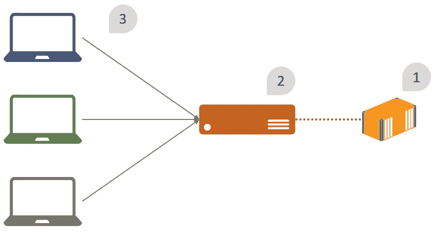
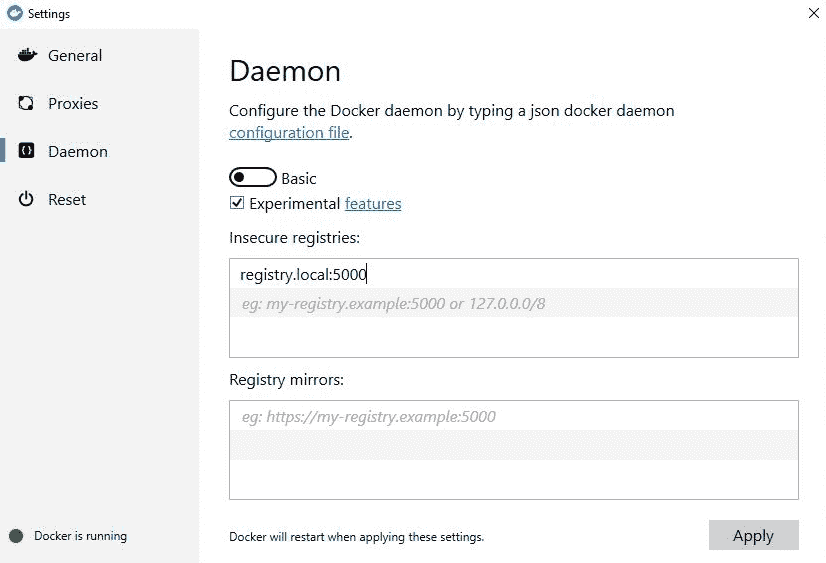
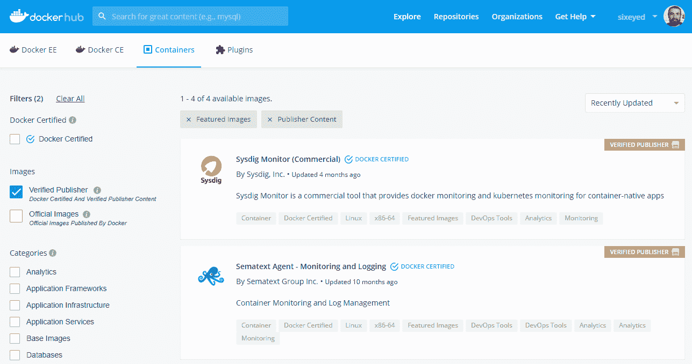

# 第四章：使用 Docker 注册表共享镜像

发布应用程序是 Docker 平台的一个重要部分。Docker 引擎可以从中央位置下载镜像以从中运行容器，并且还可以上传本地构建的镜像到中央位置。这些共享的镜像存储被称为**注册表**，在本章中，我们将更仔细地看一下镜像注册表的工作原理以及可用于您的注册表的类型。

主要的镜像注册表是 Docker Hub，这是一个免费的在线服务，也是 Docker 服务默认的工作位置。Docker Hub 是一个很好的地方，社区可以分享构建的用于打包开源软件并且可以自由重新分发的镜像。Docker Hub 取得了巨大的成功。在撰写本书时，上面有数十万个可用的镜像，每年下载量达数十亿次。

公共注册表可能不适合您自己的应用程序。Docker Hub 还提供商业计划，以便您可以托管私有镜像（类似于 GitHub 允许您托管公共和私有源代码仓库的方式），还有其他商业注册表添加了诸如安全扫描之类的功能。您还可以通过使用免费提供的开源注册表实现在您的环境中运行自己的注册表服务器。

在本章中，我将向您展示如何使用这些注册表，并且我将介绍标记镜像的细节 - 这是您可以对 Docker 镜像进行版本控制的方法 - 以及如何使用来自不同注册表的镜像。我们将涵盖：

+   理解注册表和仓库

+   运行本地镜像注册表

+   使用本地注册表推送和拉取镜像

+   使用商业注册表

# 理解注册表和仓库

您可以使用`docker image pull`命令从注册表下载镜像。运行该命令时，Docker 引擎连接到注册表，进行身份验证 - 如果需要的话 - 并下载镜像。拉取过程会下载所有镜像层并将它们存储在本地镜像缓存中。容器只能从本地镜像缓存中可用的镜像运行，因此除非它们是本地构建的，否则需要先拉取。

在 Windows 上开始使用 Docker 时，您运行的最早的命令之一可能是一些简单的命令，就像来自第二章的这个例子，*将应用程序打包并作为 Docker 容器运行*。

[PRE0]

这将起作用，即使您在本地缓存中没有该镜像，因为 Docker 可以从默认注册表 Docker Hub 中拉取它。如果您尝试从本地没有存储的镜像运行容器，Docker 将在创建容器之前自动拉取它。

在这个例子中，我没有给 Docker 太多信息——只是镜像名称，`dockeronwindows/ch02-powershell-env:2e`。这个细节足以让 Docker 在注册表中找到正确的镜像，因为 Docker 会用默认值填充一些缺失的细节。仓库的名称是`dockeronwindows/ch02-powershell-env`，仓库是一个可以包含多个 Docker 镜像版本的存储单元。

# 检查镜像仓库名称

仓库有一个固定的命名方案：`{registry-domain}/{account-id}/{repository-name}:{tag}`。所有部分都是必需的，但 Docker 会假设一些值的默认值。所以`dockeronwindows/ch02-powershell-env:2e`实际上是完整仓库名称的简写形式，即`docker.io/dockeronwindows/ch02-powershell-env:2e`：

+   `registry-domain`是存储镜像的注册表的域名或 IP 地址。Docker Hub 是默认的注册表，所以在使用来自 Hub 的镜像时，可以省略注册表域。如果不指定注册表，Docker 将使用`docker.io`作为注册表。

+   `account-id`是在注册表上拥有镜像的帐户或组织的名称。在 Docker Hub 上，帐户名称是强制的。我的帐户 ID 是`sixeyed`，伴随本书的图像的组织帐户 ID 是`dockeronwindows`。在其他注册表上，可能不需要帐户 ID。

+   `repository-name`是您想要为镜像指定的名称，以在注册表上的您的所有仓库中唯一标识应用程序。

+   `tag`是用来区分仓库中不同镜像变体的方式。

您可以使用标签对应用程序进行版本控制或识别变体。如果在构建或拉取镜像时未指定标签，Docker 将使用默认标签`latest`。当您开始使用 Docker 时，您将使用 Docker Hub 和`latest`标签，这是 Docker 提供的默认值，以隐藏一些复杂性，直到您准备深入挖掘。随着您继续使用 Docker，您将使用标签来清楚地区分应用程序包的不同版本。

一个很好的例子是微软的.NET Core 基础图像，它位于 Docker Hub 的`microsoft/dotnet`存储库中。 .NET Core 是一个在 Linux 和 Windows 上运行的跨平台应用程序堆栈。您只能在基于 Linux 的 Docker 主机上运行 Linux 容器，并且只能在基于 Windows 的 Docker 主机上运行 Windows 容器，因此 Microsoft 在标签名称中包含了操作系统。

在撰写本文时，Microsoft 在`microsoft/dotnet`存储库中提供了数十个版本的.NET Core 图像可供使用，并使用不同的标签进行标识。以下只是一些标签：

+   `2.2-runtime-bionic`是基于 Ubuntu 18.04 版本的 Linux 图像，其中安装了.NET Core 2.2 运行时

+   `2.2-runtime-nanoserver-1809`是一个 Nano Server 1809 版本的图像，其中安装了.NET Core 2.2 运行时

+   `2.2-sdk-bionic`是基于 Debian 的 Linux 图像，其中安装了.NET Core 2.2 运行时和 SDK

+   `2.2-sdk-nanoserver-1809`是一个 Nano Server 图像，其中安装了.NET Core 2.2 运行时和 SDK

这些标签清楚地表明了每个图像包含的内容，但它们在根本上都是相似的 - 它们都是`microsoft/dotnet`的变体。

Docker 还支持多架构图像，其中单个图像标签用作许多变体的总称。可以基于 Linux 和 Windows 操作系统，或英特尔和**高级 RISC 机器**（**ARM**）处理器的图像变体。它们都使用相同的图像名称，当您运行`docker image pull`时，Docker 会为您的主机操作系统和 CPU 架构拉取匹配的图像。 .NET Core 图像可以做到这一点 - `docker image pull microsoft/dotnet:2.2-sdk`将在 Linux 机器上下载 Linux 图像，在 Windows 机器上下载 Windows 图像。

如果您将跨平台应用程序发布到 Docker Hub，并且希望尽可能地让消费者使用它，您应该将其发布为多架构图像。在您自己的开发中，最好是明确地在 Dockerfiles 中指定确切的`FROM`图像，否则您的应用程序将在不同的操作系统上构建不同。

# 构建、标记和版本化图像

当您首次构建图像时，您会对图像进行标记，但您也可以使用`docker image tag`命令显式地向图像添加标签。这在对成熟应用程序进行版本控制时非常有用，因此用户可以选择要使用的版本级别。如果您运行以下命令，您将构建一个具有五个标签的图像，其中包含应用程序版本的不同精度级别：

[PRE1]

最初的 `docker image build` 命令没有指定标记，因此新图像将默认为 `myapp:latest`。每个后续的 `docker image tag` 命令都会向同一图像添加一个新标记。标记不会复制图像，因此没有数据重复 - 您只有一个图像，可以用多个标记引用。通过添加所有这些标记，您为消费者提供了选择使用哪个图像，或者以其为基础构建自己的图像。

此示例应用程序使用语义化版本。最终标记可以是触发构建的源代码提交的 ID；这可能在内部使用，但不公开。`5.1.6` 是补丁版本，`5.1` 是次要版本号，`5` 是主要版本号。

用户可以明确使用 `myapp:5.1.6`，这是最具体的版本号，知道该标记不会在该级别更改，图像将始终相同。下一个发布将具有标记 `5.1.7`，但那将是一个具有不同应用程序版本的不同图像。

`myapp:5.1` 将随着每个补丁版本的发布而更改 - 下一个构建，`5.1` 将是 `5.1.7` 的标记别名 - 但用户可以放心，不会有任何破坏性的更改。`myapp:5` 将随着每个次要版本的发布而更改 - 下个月，它可能是 `myapp:5.2` 的别名。用户可以选择主要版本，如果他们总是想要版本 5 的最新发布，或者他们可以使用最新版本，可以接受可能的破坏性更改。

作为图像的生产者，您可以决定如何支持图像标记中的版本控制。作为消费者，您应该更加具体 - 尤其是对于您用作自己构建的 `FROM` 图像。如果您正在打包 .NET Core 应用程序，如果您的 Dockerfile 像这样开始：

[PRE2]

在撰写本文时，此图像已安装了 .NET Core SDK 的 2.2.103 版本。如果您的应用程序针对 2.2 版本，那就没问题；图像将构建，您的应用程序将在容器中正确运行。但是，当 .NET Core 2.3 或 3.0 发布时，新图像将应用通用的 `:sdk` 标记，这可能不支持针对 2.2 应用程序的目标。在该发布之后使用完全相同的 Dockerfile 时，它将使用不同的基础图像 - 您的图像构建可能会失败，或者它可能仅在应用程序运行时失败，如果 .NET Core 更新中存在破坏性更改。

相反，您应该考虑使用应用程序框架的次要版本的标签，并明确说明操作系统和 CPU 架构（如果是多架构图片）：

[PRE3]

这样，您将受益于图像的任何补丁版本，但您将始终使用.NET Core 的 2.2 版本，因此您的应用程序将始终在基础图像中具有匹配的主机平台。

您可以标记您本地缓存中的任何图像，而不仅仅是您自己构建的图像。如果您想要重新标记一个公共图像并将其添加到本地私有注册表中的批准基础图像集中，这将非常有用。

# 将图像推送到注册表

构建和标记图像是本地操作。`docker image build`和`docker image tag`的最终结果是对您运行命令的 Docker Engine 上的图像缓存的更改。需要使用`docker image push`命令将图像明确共享到注册表中。

Docker Hub 可供使用，无需进行身份验证即可拉取公共图像，但是要上传图像（或拉取私有图像），您需要注册一个账户。您可以在[`hub.docker.com/`](https://hub.docker.com/)免费注册，这是您可以在 Docker Hub 和其他 Docker 服务上使用的 Docker ID 的地方。您的 Docker ID 是您用来验证访问 Docker Hub 的 Docker 服务的方式。这是通过`docker login`命令完成的：

[PRE4]

要将图片推送到 Docker Hub，仓库名称必须包含您的 Docker ID 作为账户 ID。您可以使用任何账户 ID 在本地标记一个图片，比如`microsoft/my-app`，但是您不能将其推送到注册表上的 Microsoft 组织。您登录的 Docker ID 需要有权限将图片推送到注册表上的账户。

当我发布图片以配合这本书时，我会使用`dockeronwindows`作为仓库中的账户名来构建它们。这是 Docker Hub 上的一个组织，而我的用户账户`sixeyed`有权限将图片推送到该组织。当我以`sixeyed`登录时，我可以将图片推送到属于`sixeyed`或`dockeronwindows`的仓库：

[PRE5]

Docker CLI 的输出显示了图像如何分成层，并告诉您每个层的上传状态：

[PRE6]

该图像使用 Windows Server Core 作为基本图像。该图像不是公开可再分发的 - 它在 Docker Hub 上列出，并且可以从 Microsoft 容器注册表免费下载，但未经许可不得存储在其他公共图像注册表上。这就是为什么我们可以看到标有*跳过外部层*的行 - Docker 不会将包含 Windows OS 的层推送到 Docker Hub。

您无法发布到另一个用户的帐户，但可以使用您自己的帐户名称标记另一个用户的图像。这是一组完全有效的命令，如果我想要下载特定版本的 Windows Server Core 图像，给它一个更友好的名称，并在我的帐户下使用该新名称在 Hub 上提供它，我可以运行这些命令：

[PRE7]

Microsoft 在不同的时间使用了不同的标记方案来标记他们的图像。Windows Server 2016 图像使用完整的 Windows 版本号，如`10.0.14393.2608`。Windows Server 2019 图像使用发布名称，后跟图像中包含的最新 Windows 更新的 KB 标识符，如`1809_KB4480116`。

对于用户来说，将图像推送到注册表并不比这更复杂，尽管在幕后，Docker 运行一些智能逻辑。图像分层也适用于注册表，就像适用于 Docker 主机上的本地图像缓存一样。当您将基于 Windows Server Core 的图像推送到 Hub 时，Docker 不会上传 4GB 的基本图像 - 它知道基本层已经存在于 MCR 上，并且只会上传目标注册表上缺少的层。

将公共图像标记并推送到公共 Hub 的最后一个示例是有效的，但不太可能发生 - 您更有可能将图像标记并推送到您自己的私有注册表。

# 运行本地图像注册表

Docker 平台是可移植的，因为它是用 Go 语言编写的，这是一种跨平台语言。Go 应用程序可以编译成本地二进制文件，因此 Docker 可以在 Linux 或 Windows 上运行，而无需用户安装 Go。在 Docker Hub 上有一个包含用 Go 编写的注册表服务器的官方图像，因此您可以通过从该图像运行 Docker 容器来托管自己的图像注册表。

`registry`是由 Docker 团队维护的官方存储库，但在撰写本文时，它只有适用于 Linux 的图像。很可能很快就会发布注册表的 Windows 版本，但在本章中，我将向您介绍如何构建自己的注册表图像，因为它展示了一些常见的 Docker 使用模式。

*官方存储库*就像其他公共镜像一样在 Docker Hub 上可用，但它们经过 Docker, Inc.的策划，并由 Docker 自己或应用程序所有者维护。您可以依赖它们包含正确打包和最新软件。大多数官方镜像都有 Linux 变体，但 Windows 官方镜像的数量正在增加。

# 构建注册表镜像

Docker 的注册服务器是一个完全功能的镜像注册表，但它只是 API 服务器 - 它没有像 Docker Hub 那样的 Web UI。它是一个开源应用程序，托管在 GitHub 的`docker/distribution`存储库中。要在本地构建该应用程序，您首先需要安装 Go SDK。如果您已经这样做了，可以运行一个简单的命令来编译该应用程序：

[PRE8]

但是，如果您不是经常使用 Go 开发人员，您不希望在本地机器上安装和维护 Go 工具的开销，只是为了在需要更新时构建注册服务器。最好将 Go 工具打包到一个 Docker 镜像中，并设置该镜像，以便在运行容器时为您构建注册服务器。您可以使用我在第三章中演示的相同的多阶段构建方法，*开发 Docker 化的.NET Framework 和.NET Core 应用程序*。

多阶段模式有很多优势。首先，这意味着您的应用程序镜像可以尽可能地保持轻量级 - 您不需要将构建工具与运行时一起打包。其次，这意味着您的构建代理被封装在一个 Docker 镜像中，因此您不需要在构建服务器上安装这些工具。第三，这意味着开发人员可以使用与构建服务器相同的构建过程，因此您避免了开发人员机器和构建服务器安装了不同的工具集的情况，这可能导致构建问题。

`dockeronwindows/ch04-registry:2e`的 Dockerfile 使用官方的 Go 镜像，在 Docker Hub 上有一个 Windows Server Core 变体。构建阶段使用该镜像来编译注册表应用程序：

[PRE9]

我使用`ARG`指令来指定要构建的源代码版本——GitHub 存储库为每个发布的版本都有标签，我默认使用版本 2.6.2。然后我使用`git`来克隆源代码并切换到标记版本的代码，并使用`go build`来编译应用程序。Git 客户端和 Go 工具都在基本的`golang`映像中。输出将是`registry.exe`，这是一个本地的 Windows 可执行文件，不需要安装 Go 就可以运行。

Dockerfile 的最后阶段使用 Nano Server 作为基础，可以很好地运行 Go 应用程序。以下是整个应用程序阶段：

[PRE10]

这个阶段没有什么复杂的。它从设置图像开始：

1.  `REGISTRY_STORAGE_FILESYSTEM_ROOTDIRECTORY`是注册表使用的环境变量，作为存储数据的基本路径。

1.  通过使用环境变量中捕获的路径创建了一个`VOLUME`，用于注册表数据。

1.  暴露端口`5000`，这是 Docker 注册表的常规端口。

Dockerfile 的其余部分设置了容器的入口点，并从构建阶段复制了编译的二进制文件和默认配置文件。

Windows Server 2016 中的 Docker 容器有一个不同的卷实现——容器内的目标目录实际上是一个符号链接，而不是一个普通目录。这导致了 Go、Java 和其他语言的问题。通过使用映射驱动器，可以实现一种解决方法，但现在不再需要。如果您看到任何使用 G:驱动器的 Dockerfile，它们是基于 Windows Server 2016 的，可以通过使用 C:驱动器简化为 Windows Server 2019。

构建注册表映像与构建任何其他映像相同，但当您使用它来运行自己的注册表时，有一些重要因素需要考虑。

# 运行注册表容器

运行自己的注册表可以让您在团队成员之间共享图像，并使用快速本地网络而不是互联网连接存储所有应用程序构建的输出。您通常会在可以广泛访问的服务器上运行注册表容器，配置如下：

注册表在服务器上的容器（1）上运行。客户端机器（3）连接到服务器，以便它们可以使用本地网络上的注册表来推送和拉取私有图像。

为了使注册表容器可访问，您需要将容器的端口`5000`发布到主机上的端口`5000`。注册表用户可以使用主机服务器的 IP 地址或主机名访问容器，这将是您在镜像名称中使用的注册表域。您还需要挂载一个卷从主机存储图像数据在一个已知的位置。当您用新版本替换容器时，它仍然可以使用主机的域名，并且仍然具有之前容器存储的所有图像层。

在我的主机服务器上，我配置了一个作为磁盘`E:`的 RAID 阵列，我用它来存储我的注册表数据，以便我可以运行我的注册表容器挂载该卷作为数据路径：

[PRE11]

在我的网络中，我将在具有 IP 地址`192.168.2.146`的物理机器上运行容器。我可以使用`192.168.2.146:5000`作为注册表域来标记图像，但这并不是很灵活。最好使用主机的域名，这样我可以在需要时将其指向不同的物理服务器，而无需重新标记所有图像。

对于主机名，您可以使用您网络的**域名系统**（**DNS**）服务，或者如果您运行公共服务器，可以使用**规范名称**（**CNAME**）。或者，您可以在客户机上的 hosts 文件中添加一个条目，并使用自定义域名。这是我用来为`registry.local`添加指向我的 Docker 服务器的主机名条目的 PowerShell 命令：

[PRE12]

现在我的服务器正在运行一个具有可靠存储的容器中的注册表服务器，并且我的客户端已设置好以使用友好的域名访问注册表主机。我可以开始从自己的注册表推送和拉取私有镜像，这仅对我的网络上的用户可用。

# 使用本地注册表推送和拉取镜像

只有当镜像标签与注册表域匹配时，才能将镜像推送到注册表。标记和推送的过程与 Docker Hub 相同，但您需要明确包含本地注册表域在新标记中。这些命令从 Docker Hub 拉取我的注册表服务器镜像，并添加一个新标记，使其适合推送到本地注册表：

[PRE13]

`docker image tag`命令首先指定源标记，然后指定目标标记。您可以更改新目标标记的镜像名称的每个部分。我使用了以下内容：

+   `registry.local:5000`是注册表域。原始镜像名称隐含的域为`docker.io`。

+   `infrastructure`是帐户名称。原始帐户名称是`dockeronwindows`。

+   `registry`是存储库名称。原始名称是`ch04-registry`。

+   `v2.6.2`是图像标记。原始标记是`2e`。

如果您想知道为什么本书的所有图像都有`2e`标记，那是因为我用它来标识它们与本书的第二版一起使用。我没有在第一版中为图像使用标记，因此它们都具有隐含的`latest`标记。它们仍然存在于 Docker Hub 上，但通过将新版本标记为`2e`，我可以将图像发布到相同的存储库，而不会破坏第一版读者的代码示例。

我可以尝试将新标记的映像推送到本地注册表，但 Docker 还不允许我使用注册表：

[PRE14]

Docker 平台默认是安全的，相同的原则也适用于映像注册表。Docker 引擎期望使用 HTTPS 与注册表通信，以便流量被加密。我的简单注册表安装使用明文 HTTP，因此我收到了一个错误，说 Docker 尝试使用加密传输进行注册表，但只有未加密传输可用。

设置 Docker 使用本地注册表有两个选项。第一个是扩展注册表服务器以保护通信-如果您提供 SSL 证书，注册表服务器映像可以在 HTTPS 上运行。这是我在生产环境中会做的事情，但是为了开始，我可以使用另一个选项并在 Docker 配置中做一个例外。如果在允许的不安全注册表列表中明确命名，Docker 引擎将允许使用 HTTP 注册表。

您可以使用公司的 SSL 证书或自签名证书在 HTTPS 下运行注册表映像，这意味着您无需配置 Docker 引擎以允许不安全的注册表。GitHub 上的 Docker 实验室存储库`docker/labs`中有一个 Windows 注册表演练，解释了如何做到这一点。

# 配置 Docker 以允许不安全的注册表

Docker 引擎可以使用 JSON 配置文件来更改设置，包括引擎允许的不安全注册表列表。该列表中的任何注册表域都可以使用 HTTP 而不是 HTTPS，因此这不是您应该为托管在公共网络上的注册表执行的操作。

Docker 的配置文件位于`％programdata％\docker\config\daemon.json`（**daemon**是 Linux 术语，表示后台服务，因此这是 Docker 引擎配置文件的名称）。您可以手动编辑它，将本地注册表添加为安全选项，然后重新启动 Docker Windows 服务。此配置允许 Docker 使用 HTTP 访问本地注册表：

[PRE15]

如果您在 Windows 10 上使用 Docker Desktop，则 UI 具有一个很好的配置窗口，可以为您处理这些问题。只需右键单击状态栏中的 Docker 标志，选择“设置”，导航到“守护程序”页面，并将条目添加到不安全的注册表列表中：

将本地注册表域添加到我的不安全列表后，我可以使用它来推送和拉取镜像：

[PRE16]

任何具有对我的 Docker 服务器的网络访问权限的用户都可以使用存储在本地注册表中的镜像，使用`docker image pull`或`docker container run`命令。您还可以通过在`FROM`指令中指定名称与注册表域、存储库名称和标签，将本地镜像用作其他 Dockerfile 中的基本镜像：

[PRE17]

没有办法覆盖默认注册表，因此当未指定域时，无法将本地注册表设置为默认值 - 默认值始终为 Docker Hub。如果要为镜像使用不同的注册表，注册表域必须始终在镜像名称中指定。任何不带注册表地址的镜像名称都将被假定为指向`docker.io`的镜像。

# 将 Windows 镜像层存储在本地注册表中

不允许公开重新分发 Microsoft 镜像的基本层，但允许将它们存储在私有注册表中。这对于 Windows Server Core 镜像特别有用。该镜像的压缩大小为 2GB，Microsoft 每个月在 Docker Hub 上发布一个新版本的镜像，带有最新的安全补丁。

更新通常只会向镜像添加一个新层，但该层可能是 300MB 的下载。如果有许多用户使用 Windows 镜像，他们都需要下载这些层，这需要大量的带宽和时间。如果运行本地注册表服务器，可以从 Docker Hub 一次拉取这些层，并将它们推送到本地注册表。然后，其他用户从本地注册表中拉取，从快速本地网络而不是从互联网上下载。

您需要在 Docker 配置文件中为特定注册表启用此功能，使用`allow-nondistributable-artifacts`字段：

[PRE18]

这个设置在 Docker for Windows UI 中没有直接暴露，但你可以在设置屏幕的高级模式中设置它：

现在，我可以将 Windows *foreign layers*推送到我的本地注册表。我可以使用自己的注册表域标记最新的 Nano Server 图像，并将图像推送到那里：

[PRE19]

当您将 Windows 基础镜像层存储在自己的注册表中时，层 ID 将与 MCR 上的原始层 ID 不同。这对 Docker 的图像缓存产生影响。您可以使用完整标签`registry.local:5000/microsoft/nanoserver:1809`在干净的机器上拉取自己的 Nano Server 图像。然后，如果您拉取官方的 Microsoft 图像，层将再次被下载。它们具有相同的内容但不同的 ID，因此 Docker 不会将它们识别为缓存命中。

如果您要存储 Windows 的基础图像的自己的版本，请确保您是一致的，并且只在您的 Dockerfile 中使用这些图像。这也适用于从 Windows 图像构建的图像-因此，如果您想要使用.NET，您需要使用您的 Windows 图像作为基础构建自己的 SDK 图像。这会增加一些额外的开销，但许多大型组织更喜欢这种方法，因为它可以让他们对基础图像有更好的控制。

# 使用商业注册表

运行自己的注册表不是拥有安全的私有图像存储库的唯一方法-您可以使用几种第三方提供的选择。在实践中，它们都以相同的方式工作-您需要使用注册表域标记您的图像，并与注册表服务器进行身份验证。有几种可用的选项，最全面的选项来自 Docker，Inc.，他们为不同的服务级别提供了不同的产品。

# Docker Hub

Docker Hub 是最广泛使用的公共容器注册表，在撰写本文时，平均每月超过 10 亿次图像拉取。您可以在 Hub 上托管无限数量的公共存储库，并支付订阅费以托管多个私有存储库。

Docker Hub 具有自动构建系统，因此您可以将镜像存储库链接到 GitHub 或 Bitbucket 中的源代码存储库，Docker 的服务器将根据存储库中的 Dockerfile 构建镜像，每当您推送更改时 - 这是一个简单而有效的托管**持续集成**（**CI**）解决方案，特别是如果您使用可移植的多阶段 Dockerfile。

Hub 订阅适用于较小的项目或多个用户共同开发同一应用程序的团队。它具有授权框架，用户可以创建一个组织，该组织成为存储库中的帐户名，而不是个人用户的帐户名。可以授予多个用户对组织存储库的访问权限，这允许多个用户推送镜像。

Docker Hub 也是用于商业软件分发的注册表。它就像是面向服务器端应用程序的应用商店。如果您的公司生产商业软件，Docker Hub 可能是分发的一个不错选择。您可以以完全相同的方式构建和推送镜像，但您的源代码可以保持私有 - 只有打包的应用程序是公开可用的。

您可以在 Docker 上注册为已验证的发布者，以确定有一个商业实体在维护这些镜像。Docker Hub 允许您筛选已验证的发布者，因此这是一个让您的应用程序获得可见性的好方法：

Docker Hub 还有一个认证流程，适用于托管在 Docker Hub 上的镜像。Docker 认证适用于软件镜像和硬件堆栈。如果您的镜像经过认证，它将保证在任何经过认证的硬件上都可以在 Docker Enterprise 上运行。Docker 在认证过程中测试所有这些组合，这种端到端的保证对大型企业非常有吸引力。

# Docker Trusted Registry

**Docker Trusted Registry**（**DTR**）是 Docker Enterprise 套件的一部分，这是 Docker 公司提供的企业级**容器即服务**（**CaaS**）平台。它旨在为在其自己的数据中心或任何云中运行 Docker 主机集群的企业提供服务。Docker Enterprise 配备了一个名为**Universal Control Plane**（**UCP**）的全面管理套件，该套件提供了一个界面，用于管理 Docker 集群中的所有资源 - 主机服务器、镜像、容器、网络、卷以及其他所有内容。Docker Enterprise 还提供了 DTR，这是一个安全、可扩展的镜像注册表。

DTR 通过 HTTPS 运行，并且是一个集群化服务，因此您可以在集群中部署多个注册表服务器以实现可伸缩性和故障转移。您可以使用本地存储或云存储来存储 DTR，因此如果在 Azure 中运行，则可以将图像持久保存在具有实际无限容量的 Azure 存储中。与 Docker Hub 一样，您可以为共享存储库创建组织，但是使用 DTR，您可以通过创建自己的用户帐户或插入到**轻量级目录访问协议**（**LDAP**）服务（如 Active Directory）来管理身份验证。然后，您可以为细粒度权限配置基于角色的访问控制。

DTR 还提供安全扫描功能，该功能扫描图像内部的二进制文件，以检查已知的漏洞。您可以配置扫描以在推送图像时运行，或构建一个计划。计划扫描可以在发现旧图像的依赖项中发现新漏洞时向您发出警报。DTR UI 允许您深入了解漏洞的详细信息，并查看确切的文件和确切的利用方式。

Docker Enterprise 还有一个主要的安全功能，**内容信任**，这仅在 Docker Enterprise 中可用。Docker 内容信任允许用户对图像进行数字签名，以捕获批准工作流程 - 因此 QA 和安全团队可以通过他们的测试套件运行图像版本并对其进行签名，以确认他们批准了用于生产的发布候选版本。这些签名存储在 DTR 中。UCP 可以配置为仅运行由某些团队签名的图像，因此您可以对集群将运行的软件进行严格控制，并提供证明谁构建和批准软件的审计跟踪。

Docker Enterprise 具有丰富的功能套件，可以通过友好的 Web UI 以及通常的 Docker 命令行访问。安全性，可靠性和可扩展性是功能集中的主要因素，这使其成为企业用户寻找管理图像，容器和 Docker 主机的标准方式的不错选择。我将在第八章中介绍 UCP，*管理和监控 Docker 化解决方案*，以及在第九章中介绍 DTR，*了解 Docker 的安全风险和好处*。

如果您想在无需设置要求的沙箱环境中尝试 Docker Enterprise，请浏览[`trial.docker.com`](http://trial.docker.com)以获取一个可用于 12 小时的托管试用版。

# 其他注册表

Docker 现在非常受欢迎，许多第三方服务已经将图像注册表添加到其现有的服务中。在云端，您可以使用来自亚马逊网络服务（AWS）的 EC2 容器注册表（ECR），微软的 Azure 容器注册表，以及谷歌云平台上的容器注册表。所有这些服务都与标准的 Docker 命令行和各自平台的其他产品集成，因此如果您在某个云服务提供商中有大量投资，它们可能是很好的选择。

还有一些独立的注册表服务，包括 JFrog 的 Artifactory 和 Quay.io，这些都是托管服务。使用托管注册表可以减少运行自己的注册表服务器的管理开销，如果您已经在使用来自提供商的服务，并且该提供商还提供注册表，则评估该选项是有意义的。

所有的注册表提供商都有不同的功能集和服务水平 - 您应该比较它们的服务，并且最重要的是，检查 Windows 支持的水平。大多数现有的平台最初是为了支持 Linux 图像和 Linux 客户端而构建的，对于 Windows 可能没有功能平衡。

# 总结

在本章中，您已经了解了图像注册表的功能以及如何使用 Docker 与之配合工作。我介绍了仓库名称和图像标记，以识别应用程序版本或平台变化，以及如何运行和使用本地注册表服务器 - 通过在容器中运行一个。

在 Docker 的旅程中，您很可能会很早就开始使用私有注册表。当您开始将现有应用程序 Docker 化并尝试新的软件堆栈时，通过快速的本地网络推送和拉取图像可能会很有用 - 或者如果本地存储空间有问题，可以使用云服务。随着您对 Docker 的使用越来越多，并逐步实施生产，您可能会计划升级到具有丰富安全功能的受支持的注册表 DTR。

现在您已经很好地了解了如何共享图像并使用其他人共享的图像，您可以考虑使用容器优先的解决方案设计，将经过验证和可信赖的软件组件引入我们自己的应用程序中。
