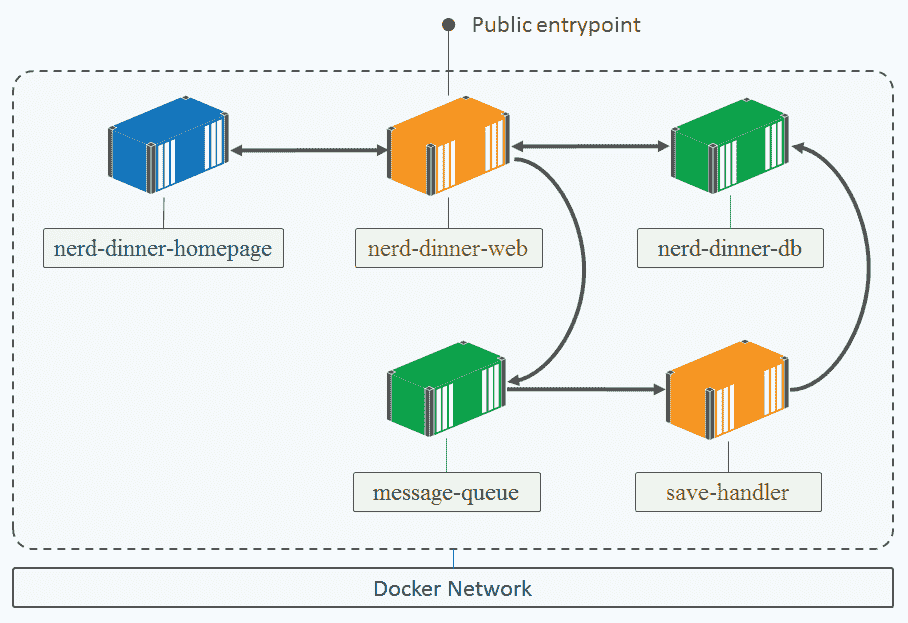
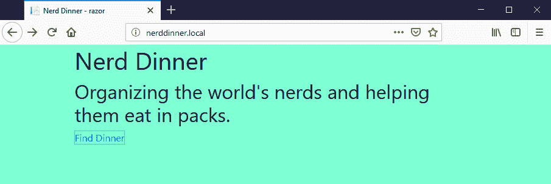
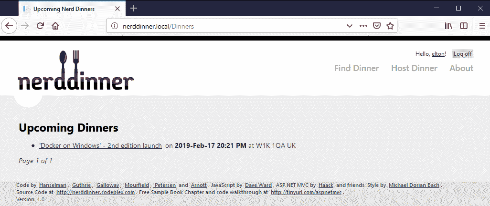
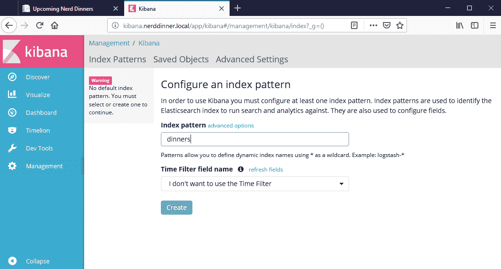
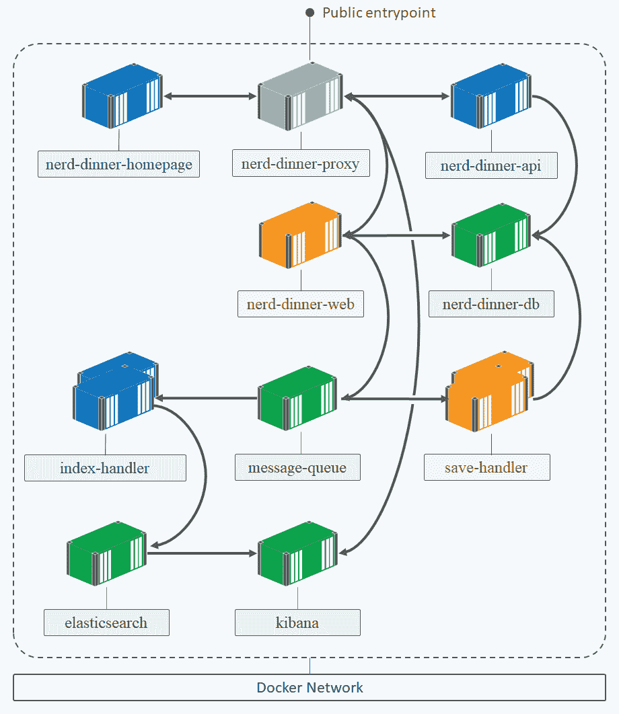

# 采用容器优先解决方案设计

将 Docker 作为应用程序平台带来明显的运营优势。容器比虚拟机更轻，但仍提供隔离，因此您可以在更少的硬件上运行更多的工作负载。所有这些工作负载在 Docker 中具有相同的形状，因此运维团队可以以相同的方式管理.NET、Java、Go 和 Node.js 应用程序。Docker 平台在应用程序架构方面也有好处。在本章中，我将探讨容器优先解决方案设计如何帮助您向应用程序添加功能，具有高质量和低风险。

在本章中，我将回到 NerdDinner，从我在第三章中离开的地方继续。NerdDinner 是一个传统的.NET 应用程序，是一个单片设计，组件之间耦合紧密，所有通信都是同步的。没有单元测试、集成测试或端到端测试。NerdDinner 就像其他数百万个.NET 应用程序一样——它可能具有用户需要的功能，但修改起来困难且危险。将这样的应用程序移至 Docker 可以让您采取不同的方法来修改或添加功能。

Docker 平台的两个方面将改变您对解决方案设计的思考方式。首先，网络、服务发现和负载平衡意味着您可以将应用程序分布到多个组件中，每个组件都在容器中运行，可以独立移动、扩展和升级。其次，Docker Hub 和其他注册表上可用的生产级软件范围不断扩大，这意味着您可以为许多通用服务使用现成的软件，并以与自己的组件相同的方式管理它们。这使您有自由设计更好的解决方案，而不受基础设施或技术限制。

在本章中，我将向您展示如何通过采用容器优先设计来现代化传统的.NET 应用程序：

+   NerdDinner 的设计目标

+   在 Docker 中运行消息队列

+   开始多容器解决方案

+   现代化遗留应用程序

+   在容器中添加新功能

+   从单体到分布式解决方案

# 技术要求

要跟着示例进行操作，您需要在 Windows 10 上运行 Docker，并更新到 18.09 版，或者在 Windows Server 2019 上运行。本章的代码可在[`github.com/sixeyed/docker-on-windows/tree/second-edition/ch05`](https://github.com/sixeyed/docker-on-windows/tree/second-edition/ch05)上找到。

# NerdDinner 的设计目标

在第三章中，*开发 Docker 化的.NET Framework 和.NET Core 应用程序*，我将 NerdDinner 首页提取到一个单独的组件中，这样可以快速交付 UI 更改。现在我要做一些更根本的改变，分解传统的应用程序并现代化架构。

我将首先查看 Web 应用程序中的性能问题。NerdDinner 中的数据层使用**Entity Framework**（**EF**），所有数据库访问都是同步的。网站的大量流量将创建大量打开的连接到 SQL Server 并运行大量查询。随着负载的增加，性能将恶化，直到查询超时或连接池被耗尽，网站将向用户显示错误。

改进的一种方式是使所有数据访问方法都是`async`，但这是一种侵入性的改变——所有控制器操作也需要变成`async`，而且没有自动化的测试套件来验证这样一系列的改变。另外，我可以添加一个用于数据检索的缓存，这样`GET`请求将命中缓存而不是数据库。这也是一个复杂的改变，我需要让缓存数据保持足够长的时间，以便缓存命中的可能性较大，同时在数据更改时保持缓存同步。同样，缺乏测试意味着这样的复杂改变很难验证，因此这也是一种风险的方法。

如果我实施这些复杂的改变，很难估计好处。如果所有数据访问都转移到异步方法，这会使网站运行更快，并使其能够处理更多的流量吗？如果我可以集成一个高效的缓存，使读取数据从数据库中移开，这会提高整体性能吗？这些好处很难量化，直到你实际进行了改变，当你可能会发现改进并不能证明投资的价值。

采用以容器为先的方法，可以以不同的方式来看待设计。如果您确定了一个功能，它会进行昂贵的数据库调用，但不需要同步运行，您可以将数据库代码移动到一个单独的组件中。然后，您可以在组件之间使用异步消息传递，从主 Web 应用程序发布事件到消息队列，并在新组件中对事件消息进行操作。使用 Docker，这些组件中的每一个都将在一个或多个容器中运行：



如果我只专注于一个功能，那么我可以快速实现变化。这种设计没有其他方法的缺点，并且有许多好处：

+   这是一个有针对性的变化，只有一个控制器动作在主应用程序中发生了变化

+   新的消息处理程序组件小而高度内聚，因此很容易进行测试

+   Web 层和数据层是解耦的，因此它们可以独立扩展

+   我正在将工作从 Web 应用程序中移出，这样我们就可以确保性能得到改善

还有其他优点。新组件完全独立于原始应用程序；它只需要监听事件消息并对其进行操作。您可以使用.NET、.NET Core 或任何其他技术堆栈来处理消息；您不需要受限于单一堆栈。您还可以通过添加监听这些事件的新处理程序，以后添加其他功能。

# Docker 化 NerdDinner 的配置

NerdDinner 使用`Web.config`进行配置 - 既用于应用程序配置值（在发布之间保持不变）又用于在不同环境之间变化的环境配置值。配置文件被嵌入到发布包中，这使得更改变得尴尬。在第三章中，*开发 Docker 化的.NET Framework 和.NET Core 应用程序*，我将`Web.config`中的`appSettings`和`connectionStrings`部分拆分成单独的文件；这样做可以让我运行一个包含不同配置文件的容器，通过附加包含不同配置文件的卷。

不过，有不同类型的配置，而挂载卷对开发人员来说是一个相当沉重的选项。对于您希望在不更改代码的情况下切换的功能设置来说是很好的——像`UnobtrusiveJavaScriptEnabled`这样的设置应该放在配置文件中。但是对于每个环境和每个开发人员都会更改的设置——比如`BingMapsKey`——应该有一种更简单的设置方式。

理想情况下，您希望有多层配置，可以从文件中读取，但也可以使用环境变量覆盖值。这就是.NET Core 中配置系统的工作方式，因为.NET Core 中的配置包实际上是.NET Standard 库，它们也可以用于经典的.NET Framework 项目。

为了迎接即将到来的更大变化，我已经更新了本章的代码，使用.NET Core 配置模型来设置所有环境配置，如下所示。之前的文件`appSettings.config`和`connectionStrings.config`已经迁移到新的 JSON 配置样式`appsettings.json`中：

```
{
  "Homepage": {
    "Url": "http://nerd-dinner-hompage"
  },
  "ConnectionStrings": {
    "UsersContext": "Data Source=nerd-dinner-db...",
    "NerdDinnerContext": "Data Source=nerd-dinner-db..."
  },
  "Apis": {    
    "IpInfoDb": {
      "Key": ""
    },
    "BingMaps": {
      "Key": ""
    }      
  }
}
```

JSON 格式更易于阅读，因为它包含嵌套对象，您可以将类似的设置分组在一起，我已经在`Apis`对象中这样做了。我可以通过访问当前配置对象的`Apis:BingMaps:Key`键在我的代码中获取 Bing Maps API 密钥。我仍然将配置文件存储在一个单独的目录中，所以我可以使用卷来覆盖整个文件，但我也设置了配置来使用环境变量。这意味着如果设置了一个名为`Apis:BingMaps:Key`的环境变量，那么该变量的值将覆盖 JSON 文件中的值。在我的代码中，我只需引用配置键，而在运行时，.NET Core 会从环境变量或配置文件中获取它。

这种方法让我可以在 JSON 文件中为数据库连接字符串使用默认值，这样当开发人员启动数据库和 Web 容器时，应用程序就可以使用，而无需指定任何环境变量。不过，该应用程序并非 100%功能完善，因为 Bing Maps 和 IP 地理位置服务需要 API 密钥。这些是有速率限制的服务，因此您可能需要为每个开发人员和每个环境设置不同的密钥，这可以在 Web 容器中使用环境变量来设置。

为了使环境值更安全，Docker 允许您从文件中加载它们，而不是在`docker container run`命令中以纯文本指定它们。将值隔离在文件中意味着文件本身可以被保护，只有管理员和 Docker 服务帐户才能访问它。环境文件是一个简单的文本格式，每个环境变量写成键值对的一行。对于 web 容器，我的环境文件包含了秘密 API 密钥：

```
Apis:BingMaps:Key=[your-key-here]
Apis:IpInfoDb:Key=[your-key-here]
```

要运行容器并将文件内容加载为环境变量，您可以使用`--env-file`选项。

环境值仍然不安全。如果有人获得了对您的应用程序的访问权限，他们可以打印出所有的环境变量并获取您的 API 密钥。我正在使用 JSON 文件以及环境变量的方法意味着我可以在生产中使用相同的应用程序镜像，使用 Docker secrets 进行配置 - 这是安全的。

我已经将这些更改打包到了 NerdDinner Docker 镜像的新版本中，您可以在`dockeronwindows/ch05-nerd-dinner-web:2e`找到。与第三章中的其他示例一样，《开发 Docker 化的.NET Framework 和.NET Core 应用程序》，Dockerfile 使用引导脚本作为入口点，将环境变量提升到机器级别，以便 ASP.NET 应用程序可以读取它们。

NerdDinner 网站的新版本在 Docker 中运行的命令是：

```
docker container run -d -P `
 --name nerd-dinner-web `
 --env-file api-keys.env `
 dockeronwindows/ch05-nerd-dinner-web:2e
```

应用程序需要其他组件才能正确启动。我有一个 PowerShell 脚本，它以正确的顺序和选项启动容器，但到本章结束时，这个脚本将变得笨拙。在下一章中，当我研究 Docker Compose 时，我会解决这个问题。

# 拆分创建晚餐功能

在`DinnerController`类中，`Create`操作是一个相对昂贵的数据库操作，不需要是同步的。这个特性很适合拆分成一个单独的组件。我可以从 web 应用程序发布消息，而不是在用户等待时将其保存到数据库中 - 如果网站负载很高，消息可能会在队列中等待几秒甚至几分钟才能被处理，但对用户的响应几乎是即时的。

有两件工作需要做，将该功能拆分为一个新组件。Web 应用程序需要在创建晚餐时向队列发布消息，消息处理程序需要在队列上监听并在接收到消息时保存晚餐。在 NerdDinner 中，还有更多的工作要做，因为现有的代码库既是物理单体，也是逻辑单体——只有一个包含所有内容的 Visual Studio 项目，所有的模型定义以及 UI 代码。

在本章的源代码中，我添加了一个名为`NerdDinner.Model`的新的.NET 程序集项目到解决方案中，并将 EF 类移动到该项目中，以便它们可以在 Web 应用程序和消息处理程序之间共享。模型项目针对完整的.NET Framework 而不是.NET Core，所以我可以直接使用现有的代码，而不需要为了这个功能更改而引入 EF 的升级。这个选择也限制了消息处理程序也必须是一个完整的.NET Framework 应用程序。

还有一个共享的程序集项目来隔离`NerdDinner.Messaging`中的消息队列代码。我将使用 NATS 消息系统，这是一个高性能的开源消息队列。NuGet 上有一个针对.NET Standard 的 NATS 客户端包，所以它可以在.NET Framework 和.NET Core 中使用，我的消息项目也有相同的客户端包。这意味着我可以灵活地编写不使用 EF 模型的其他消息处理程序，可以使用.NET Core。

在模型项目中，`Dinner`类的原始定义被大量的 EF 和 MVC 代码污染，以捕获验证和存储行为，比如`Description`属性的以下定义：

```
[Required(ErrorMessage = "Description is required")]
[StringLength(256, ErrorMessage = "Description may not be longer than 256 characters")]
[DataType(DataType.MultilineText)]
public string Description { get; set; }
```

这个类应该是一个简单的 POCO 定义，但是这些属性意味着模型定义不具有可移植性，因为任何消费者也需要引用 EF 和 MVC。为了避免这种情况，在消息项目中，我定义了一个简单的`Dinner`实体，没有任何这些属性，这个类是我用来在消息中发送晚餐信息的。我可以使用`AutoMapper` NuGet 包在`Dinner`类定义之间进行转换，因为属性基本上是相同的。

这是你会在许多旧项目中找到的挑战类型 - 没有明确的关注点分离，因此分解功能并不简单。您可以采取这种方法，将共享组件隔离到新的库项目中。这样重构代码库，而不会从根本上改变其逻辑，这将有助于现代化应用程序。

`DinnersController`类的`Create`方法中的主要代码现在将晚餐模型映射到干净的`Dinner`实体，并发布事件，而不是写入数据库：

```
if (ModelState.IsValid)
{
  dinner.HostedBy = User.Identity.Name;
  var eventMessage = new DinnerCreatedEvent
  {
    Dinner = Mapper.Map<entities.Dinner>(dinner),
    CreatedAt = DateTime.UtcNow
  };
  MessageQueue.Publish(eventMessage);
  return RedirectToAction("Index");
}
```

这是一种“发出即忘记”的消息模式。Web 应用程序是生产者，发布事件消息。生产者不等待响应，也不知道哪些组件 - 如果有的话 - 将消耗消息并对其进行操作。它松散耦合且快速，并且将传递消息的责任放在消息队列上，这正是应该的地方。

监听此事件消息的是一个新的.NET Framework 控制台项目，位于`NerdDinner.MessageHandlers.CreateDinner`中。控制台应用程序的`Main`方法使用共享的消息项目打开与消息队列的连接，并订阅这些创建晚餐事件消息。当接收到消息时，处理程序将消息中的`Dinner`实体映射回晚餐模型，并使用从`DinnersController`类中原始实现中取出的代码将模型保存到数据库中（并进行了一些整理）：

```
var dinner = Mapper.Map<models.Dinner>(eventMessage.Dinner);
using (var db = new NerdDinnerContext())
{
  dinner.RSVPs = new List<RSVP>
  {
    new RSVP
    {
      AttendeeName = dinner.HostedBy
    }
  };
  db.Dinners.Add(dinner);
  db.SaveChanges();
}
```

现在，消息处理程序可以打包到自己的 Docker 镜像中，并在网站容器旁边的容器中运行。

# 在 Docker 中打包.NET 控制台应用程序

控制台应用程序很容易构建为 Docker 的良好组件。应用程序的编译可执行文件将是 Docker 启动和监视的主要进程，因此您只需要利用控制台进行日志记录，并且可以使用文件和环境变量进行配置。

对于我的消息处理程序，我正在使用一个稍有不同模式的 Dockerfile。我有一个单独的镜像用于构建阶段，我用它来编译整个解决方案 - 包括 Web 项目和我添加的新项目。一旦您看到所有新组件，我将在本章后面详细介绍构建者镜像。

构建者编译解决方案，控制台应用程序的 Dockerfile 引用`dockeronwindows/ch05-nerd-dinner-builder:2e`镜像以复制编译的二进制文件。整个 Dockerfile 非常简单：

```
# escape=` FROM mcr.microsoft.com/windows/servercore:ltsc2019 CMD ["NerdDinner.MessageHandlers.SaveDinner.exe"]

WORKDIR C:\save-handler
COPY --from=dockeronwindows/ch05-nerd-dinner-builder:2e `
     C:\src\NerdDinner.MessageHandlers.SaveDinner\obj\Release\ . 
```

`COPY`指令中的`from`参数指定文件的来源。它可以是多阶段构建中的另一个阶段，或者—就像在这个例子中—本地机器或注册表中的现有镜像。

新的消息处理程序需要访问消息队列和数据库，每个连接字符串都在项目的`appsettings.json`文件中。控制台应用程序使用与 NerdDinner web 应用程序相同的`Config`类，该类从 JSON 文件加载默认值，并可以从环境变量中覆盖它们。

在 Dockerfile 中，`CMD`指令中的入口点是控制台可执行文件，因此只要控制台应用程序在运行，容器就会保持运行。消息队列的监听器在单独的线程上异步运行到主应用程序。当收到消息时，处理程序代码将触发，因此不需要轮询队列，应用程序运行非常高效。

使用`ManualResetEvent`对象可以简单地使控制台应用程序无限期地保持运行。在`Main`方法中，我等待一个永远不会发生的重置事件，因此程序会继续运行：

```
class Program
{
  private static ManualResetEvent _ResetEvent = new ManualResetEvent(false);

  static void Main(string[] args)
  {
    // set up message listener
    _ResetEvent.WaitOne();
  }
}
```

这是保持.NET Framework 或.NET Core 控制台应用程序保持活动状态的一种简单有效的方法。当我启动一个消息处理程序容器时，它将在后台保持运行并监听消息，直到容器停止。

# 在 Docker 中运行消息队列

现在 Web 应用程序发布消息，处理程序监听这些消息，因此我需要的最后一个组件是一个消息队列来连接这两者。队列需要与解决方案的其余部分具有相同的可用性水平，因此它们是在 Docker 容器中运行的良好候选项。在部署在许多服务器上的分布式解决方案中，队列可以跨多个容器进行集群，以提高性能和冗余性。

您选择的消息传递技术取决于您需要的功能，但在.NET 客户端库中有很多选择。**Microsoft Message Queue**（**MSMQ**）是本机 Windows 队列，**RabbitMQ**是一个流行的开源队列，支持持久化消息，**NATS**是一个开源的内存队列，性能非常高。

NATS 消息传递的高吞吐量和低延迟使其成为在容器之间通信的良好选择，并且在 Docker Hub 上有一个官方的 NATS 镜像。NATS 是一个跨平台的 Go 应用程序，Docker 镜像有 Linux、Windows Server Core 和 Nano Server 的变体。

在撰写本文时，NATS 团队仅在 Docker Hub 上发布了 Windows Server 2016 的镜像。很快将有 Windows Server 2019 镜像，但我已经为本章构建了自己的镜像。查看`dockeronwindows/ch05-nats:2e`的 Dockerfile，您将看到如何轻松地在自己的镜像中使用官方镜像的内容。

您可以像运行其他容器一样运行 NATS 消息队列。Docker 镜像公开了端口`4222`，这是客户端用来连接队列的端口，但除非您想要在 Docker 容器外部发送消息到 NATS，否则您不需要发布该端口。同一网络中的容器始终可以访问彼此的端口，它们只需要被发布以使它们在 Docker 外部可用。NerdDinner Web 应用程序和消息处理程序正在使用服务器名称`message-queue`来连接 NATS，因此需要使用该容器名称：

```
docker container run --detach `
 --name message-queue `
 dockeronwindows/ch05-nats:2e
```

NATS 服务器应用程序将消息记录到控制台，以便 Docker 收集日志条目。当容器正在运行时，您可以使用`docker container logs`来验证队列是否正在监听：

```
> docker container logs message-queue
[7996] 2019/02/09 15:40:05.857320 [INF] Starting nats-server version 1.4.1
[7996] 2019/02/09 15:40:05.858318 [INF] Git commit [3e64f0b]
[7996] 2019/02/09 15:40:05.859317 [INF] Starting http monitor on 0.0.0.0:8222
[7996] 2019/02/09 15:40:05.859317 [INF] Listening for client connections on 0.0.0.0:4222
[7996] 2019/02/09 15:40:05.859317 [INF] Server is ready
[7996] 2019/02/09 15:40:05.948151 [INF] Listening for route connections on 0.0.0.0:6222
```

消息队列是一个基础架构级组件，不依赖于其他组件。它可以在其他容器之前启动，并且在应用程序容器停止或升级时保持运行。

# 启动多容器解决方案

随着您对 Docker 的更多使用，您的解决方案将分布在更多的容器中 - 无论是运行自己从单体中拆分出来的自定义代码，还是来自 Docker Hub 或第三方注册表的可靠的第三方软件。

NerdDinner 现在跨越了五个容器运行 - SQL Server，原始 Web 应用程序，新的主页，NATS 消息队列和消息处理程序。容器之间存在依赖关系，它们需要以正确的顺序启动并使用正确的名称创建，以便组件可以使用 Docker 的服务发现找到它们。

在下一章中，我将使用 Docker Compose 来声明性地映射这些依赖关系。目前，我有一个名为`ch05-run-nerd-dinner_part-1.ps1`的 PowerShell 脚本，它明确地使用正确的配置启动容器：

```
docker container run -d `
  --name message-queue `
 dockeronwindows/ch05-nats:2e;

docker container run -d -p 1433  `
  --name nerd-dinner-db `
  -v C:\databases\nd:C:\data  `
 dockeronwindows/ch03-nerd-dinner-db:2e; docker container run -d `
  --name nerd-dinner-save-handler  `
 dockeronwindows/ch05-nerd-dinner-save-handler:2e; docker container run -d `
  --name nerd-dinner-homepage `
 dockeronwindows/ch03-nerd-dinner-homepage:2e; docker container run -d -p 80  `
  --name nerd-dinner-web `
  --env-file api-keys.env `
 dockeronwindows/ch05-nerd-dinner-web:2e;
```

在这个脚本中，我正在使用第三章中的 SQL 数据库和主页图像，*开发 Docker 化的.NET Framework 和.NET Core 应用程序*——这些组件没有改变，所以它们可以与新组件一起运行。如果您想要自己运行具有完整功能的应用程序，您需要在文件`api-keys.env`中填写自己的 API 密钥。您需要注册 Bing Maps API 和 IP 信息数据库。您可以在没有这些密钥的情况下运行应用程序，但不是所有功能都会正常工作。

当我使用自己设置的 API 密钥运行脚本并检查 Web 容器以获取端口时，我可以浏览应用程序。现在，NerdDinner 是一个功能齐全的版本。我可以登录并完成创建晚餐表单，包括地图集成：


当我提交表单时，Web 应用程序会向队列发布事件消息。这是一个非常廉价的操作，所以 Web 应用程序几乎立即返回给用户。控制台应用程序在监听消息，它运行在不同的容器中——可能在不同的主机上。它接收消息并处理它。处理程序将活动记录到控制台，以便管理员用户可以使用`docker container logs`来监视它：

```
> docker container logs nerd-dinner-save-handler

Connecting to message queue url: nats://message-queue:4222
Listening on subject: events.dinner.created, queue: save-dinner-handler
Received message, subject: events.dinner.created
Saving new dinner, created at: 2/10/2019 8:22:16 PM; event ID: a6340c95-3629-4c0c-9a11-8a0bce8e6d91
Dinner saved. Dinner ID: 1; event ID: a6340c95-3629-4c0c-9a11-8a0bce8e6d91
```

创建晚餐功能的功能是相同的——用户输入的数据保存到 SQL Server——用户体验也是相同的，但是这个功能的可扩展性得到了极大的改善。为容器设计让我可以将持久性代码提取到一个新的组件中，知道该组件可以部署在与现有解决方案相同的基础设施上，并且如果应用程序部署在集群上，它将继承现有的可扩展性和故障转移级别。

我可以依赖 Docker 平台并依赖一个新的核心组件：消息队列。队列技术本身是企业级软件，能够每秒处理数十万条消息。NATS 是免费的开源软件，可以直接在 Docker Hub 上使用，作为一个容器运行并连接到 Docker 网络中的其他容器。

到目前为止，我已经使用了以容器为先的设计和 Docker 的强大功能来现代化 NerdDinner 的一部分。针对单个功能意味着我可以在仅测试已更改的功能后，自信地发布这个新版本。如果我想要为创建晚餐功能添加审计，我只需更新消息处理程序，而不需要对 Web 应用进行完整的回归测试，因为该组件不会被更新。

以容器为先的设计也为我提供了一个基础，可以用来现代化传统应用程序的架构并添加新功能。

# 现代化传统应用程序

将后端功能拆分是开始分解传统单体应用的好方法。将消息队列添加到部署中，使其成为一种模式，您可以重复使用任何受益于异步的功能。还有其他分解单体应用的模式。如果我们暴露一个 REST API 并将前端移动到模块化 UI，并使用反向代理在不同组件之间进行路由，我们就可以真正开始现代化 NerdDinner。我们可以用 Docker 做到这一切。

# 添加 REST API 以公开数据

传统应用程序通常最终成为无法在应用程序外部访问的数据存储。如果这些数据可以访问，它们对其他应用程序或业务合作伙伴将非常有价值。NerdDinner 是一个很好的例子——它是在单页面应用程序时代之前设计和构建的，其中 UI 逻辑与业务逻辑分离，并通过 REST API 公开。NerdDinner 保留其数据；除非通过 NerdDinner UI，否则无法查看晚餐列表。

在 Docker 容器中运行一个简单的 REST API 可以轻松解锁传统数据。它不需要复杂的交付：您可以首先识别传统应用程序中有用于其他业务部门或外部消费者的单个数据集。然后，将该数据集的加载逻辑简单提取到一个单独的功能中，并将其部署为只读 API。当有需求时，您可以逐步向 API 添加更多功能，无需在第一个发布中实现整个服务目录。

NerdDinner 的主要数据集是晚餐列表，我已经构建了一个 ASP.NET Core REST API 来在只读的`GET`请求中公开所有的晚餐。这一章的代码在`NerdDinner.DinnerApi`项目中，它是一个非常简单的实现。因为我已经将核心实体定义从主`NerdDinner`项目中拆分出来，所以我可以从 API 中公开现有的契约，并在项目内使用任何我喜欢的数据访问技术。

我选择使用 Dapper，它是一个为.NET Standard 构建的快速直观的对象关系映射器，因此它可以与.NET Framework 和.NET Core 应用程序一起使用。Dapper 使用基于约定的映射；你提供一个 SQL 语句和一个目标类类型，它执行数据库查询并将结果映射到对象。从现有表中加载晚餐数据并将其映射到共享的`Dinner`对象的代码非常简单。

```
protected  override  string  GetAllSqlQuery  =>  "SELECT *, Location.Lat as Latitude... FROM Dinners"; public  override  IEnumerable<Dinner> GetAll()
{ _logger.LogDebug("GetAll - executing SQL query: '{0}'", GetAllSqlQuery); using (IDbConnection  dbConnection  =  Connection)
  { dbConnection.Open(); return  dbConnection.Query<Dinner, Coordinates, Dinner>( GetAllSqlQuery, 
      (dinner,coordinates) => { dinner.Coordinates  =  coordinates; return  dinner;
      }, splitOn: "LocationId");
   }
}
```

在 API 控制器类中调用了`GetAll`方法，其余的代码是通常的 ASP.NET Core 设置。

Dapper 通常比这个例子更容易使用，但当你需要时它可以让你进行一些手动映射，这就是我在这里所做的。NerdDinner 使用 SQL Server 位置数据类型来存储晚餐的举办地点。这映射到.NET 的`DbGeography`类型，但这种类型在.NET Standard 中不存在。如果你浏览`第五章`中的代码，你会看到我在几个地方映射了`DbGeography`和我的自定义`Coordinates`类型，如果你遇到类似的问题，你就需要这样做。

我已经修改了原始的 NerdDinner web 应用程序，使其在`DinnersController`类中获取晚餐列表时使用这个新的 API。我通过配置设置`DinnerApi:Enabled`使用了一个功能标志，这样应用程序可以使用 API 作为数据源，或直接从数据库查询。这让我可以分阶段地推出这个功能：

```
if (bool.Parse(Config.Current["DinnerApi:Enabled"]))
{
  var  client  =  new  RestClient(Config.Current["DinnerApi:Url"]);
  var  request  =  new  RestRequest("dinners");
  var  response  =  client.Execute<List<Dinner>>(request);
  var  dinners  =  response.Data.Where(d  =>  d.EventDate  >=  DateTime.Now).OrderBy(d  =>  d.EventDate);
  return  View(dinners.ToPagedList(pageIndex, PageSize)); } else {
  var  dinners  =  db.Dinners.Where(d  =>  d.EventDate  >=  DateTime.Now).OrderBy(d  =>  d.EventDate);
  return  View(dinners.ToPagedList(pageIndex, PageSize)); }
```

新的 API 被打包到名为`dockeronwindows/ch05-nerd-dinner-api`的 Docker 镜像中。这个 Dockerfile 非常简单；它只是从名为`microsoft/dotnet:2.1-aspnetcore-runtime-nanoserver-1809`的官方 ASP.NET Core 基础镜像开始，并复制编译后的 API 代码进去。

我可以在 Docker 容器中运行 API 作为内部组件，由 NerdDinner web 容器使用，但不对外公开，或者我可以在 API 容器上发布一个端口，并使其在 Docker 网络之外可用。对于公共 REST API 来说，使用自定义端口是不寻常的，消费者期望在端口`80`上访问 HTTP 和端口`443`上访问 HTTPS。我可以向我的解决方案添加一个组件，让我可以为所有服务使用标准端口集，并将传入的请求路由到不同的容器中——这就是所谓的**反向代理**。

# 使用反向代理在容器之间路由 HTTP 请求

反向代理是一个非常有用的技术，无论您是在考虑构建新的微服务架构还是现代化传统的单体架构。反向代理只是一个 HTTP 服务器，它接收来自外部世界的所有传入网络流量，从另一个 HTTP 服务器获取内容，并将其返回给客户端。在 Docker 中，反向代理在一个带有发布端口的容器中运行，并代理来自其他没有发布端口的容器的流量。

这是 UI 和 API 容器的架构，反向代理已经就位：


所有传入流量的路由规则都在代理容器中。它将被配置为从`nerd-dinner-homepage`容器加载主页位置`/`的请求；以路径`/api`开头的请求将从`nerd-dinner-api`容器加载，而其他任何请求将从`nerd-dinner-web`容器中的原始应用加载。

重要的是要意识到代理不会将客户端重定向到其他服务。代理是客户端连接的唯一端点。代理代表客户端向实际服务发出 HTTP 请求，使用容器的主机名。

反向代理不仅可以路由请求。所有流量都通过反向代理，因此它可以是应用 SSL 终止和 HTTP 缓存的层。您甚至可以在反向代理中构建安全性，将其用于身份验证和作为 Web 应用程序防火墙，保护您免受常见攻击，如 SQL 注入。这对于传统应用程序尤其有吸引力。您可以在代理层中进行性能和安全改进，将原始应用程序作为容器中的内部组件，除非通过代理，否则无法访问。

反向代理有许多技术选项。Nginx 和 HAProxy 是 Linux 世界中受欢迎的选项，它们也可以在 Windows 容器中使用。您甚至可以将 IIS 实现为反向代理，将其运行在一个单独的容器中，并使用 URL 重写模块设置所有路由规则。这些选项功能强大，但需要相当多的配置才能运行起来。我将使用一个名为 Traefik 的反向代理，它是专为在云原生应用程序中运行的容器而构建的，并且它从 Docker 中获取所需的配置。

# 使用 Traefik 代理来自 Docker 容器的流量

Traefik 是一个快速、强大且易于使用的反向代理。您可以在一个容器中运行它，并发布 HTTP（或 HTTPS）端口，并配置容器以侦听来自 Docker Engine API 的事件：

```
docker container run -d -P  `
  --volume \\.\pipe\docker_engine:\\.\pipe\docker_engine `
 sixeyed/traefik:v1.7.8-windowsservercore-ltsc2019 `
  --docker --docker.endpoint=npipe:////./pipe/docker_engine
```

Traefik 是 Docker Hub 上的官方镜像，但与 NATS 一样，唯一可用的 Windows 镜像是基于 Windows Server 2016 的。我在这里使用自己的镜像，基于 Windows Server 2019。Dockerfile 在我的 GitHub 上的`sixeyed/dockerfiles-windows`存储库中，但在使用我的镜像之前，您应该检查 Docker Hub，看看官方 Traefik 镜像是否有 2019 变体。

您之前见过`volume`选项-它用于将主机上的文件系统目录挂载到容器中。在这里，我使用它来挂载一个名为`docker_engine`的 Windows**命名管道**。管道是客户端-服务器通信的一种网络方法。Docker CLI 和 Docker API 支持 TCP/IP 和命名管道上的连接。像这样挂载一个管道让容器可以查询 Docker API，而无需知道容器运行的主机的 IP 地址。

Traefik 通过命名管道连接订阅来自 Docker API 的事件流，使用`docker.endpoint`选项中的连接详细信息。当容器被创建或移除时，Traefik 将从 Docker 那里收到通知，并使用这些事件中的数据来构建自己的路由映射。

当您运行 Traefik 时，您可以使用标签创建应用程序容器，告诉 Traefik 应该将哪些请求路由到哪些容器。标签只是在创建容器时可以应用的键值对。它们会在来自 Docker 的事件流中显示。Traefik 使用带有前缀`traefik.frontend`的标签来构建其路由规则。这就是我如何通过 Traefik 运行具有路由的 API 容器：

```
docker container run -d `
  --name nerd-dinner-api `
  -l "traefik.frontend.rule=Host:api.nerddinner.local"  `  dockeronwindows/ch05-nerd-dinner-api:2e;
```

Docker 创建名为`nerd-dinner-api`的容器，然后发布一个包含新容器详细信息的事件。Traefik 接收到该事件后，会在其路由映射中添加一条规则。任何进入 Traefik 的带有 HTTP `Host` 头部`api.nerddinner.local`的请求都将从 API 容器中进行代理。API 容器不会发布任何端口 - 反向代理是唯一可公开访问的组件。

Traefik 具有非常丰富的路由规则集，可以使用 HTTP 请求的不同部分 - 主机、路径、标头和查询字符串。您可以使用 Traefik 的规则将任何内容从通配符字符串映射到非常具体的 URL。Traefik 还可以执行更多操作，如负载平衡和 SSL 终止。文档可以在[`traefik.io`](https://traefik.io)找到。

使用类似的规则，我可以部署 NerdDinner 的新版本，并让所有前端容器都由 Traefik 进行代理。脚本`ch05-run-nerd-dinner_part-2.ps1`是一个升级版本，首先删除现有的 web 容器：

```
docker container rm -f nerd-dinner-homepage docker container rm -f nerd-dinner-web
```

标签和环境变量在容器创建时被应用，并在容器的生命周期内持续存在。您无法更改现有容器上的这些值；您需要将其删除并创建一个新的容器。我想要为 Traefik 运行 NerdDinner 网站和主页容器，并为其添加标签，因此我需要替换现有的容器。脚本的其余部分启动 Traefik，用新配置替换 web 容器，并启动 API 容器：

```
docker container run -d -p 80:80  `
  -v \\.\pipe\docker_engine:\\.\pipe\docker_engine `
 sixeyed/traefik:v1.7.8-windowsservercore-ltsc2019 `
  --api --docker --docker.endpoint=npipe:////./pipe/docker_engine  docker container run -d `
  --name nerd-dinner-homepage ` -l "traefik.frontend.rule=Path:/,/css/site.css"  `   -l "traefik.frontend.priority=10"  `
 dockeronwindows/ch03-nerd-dinner-homepage:2e;

docker container run -d `
  --name nerd-dinner-web `
  --env-file api-keys.env `
  -l "traefik.frontend.rule=PathPrefix:/"  `
  -l "traefik.frontend.priority=1"  `   -e "DinnerApi:Enabled=true"  `
 dockeronwindows/ch05-nerd-dinner-web:2e; docker container run -d `
  --name nerd-dinner-api ` -l "traefik.frontend.rule=PathPrefix:/api"  `
  -l "traefik.frontend.priority=5"  `
 dockeronwindows/ch05-nerd-dinner-api:2e;
```

现在当我加载 NerdDinner 网站时，我将浏览到端口`80`上的 Traefik 容器。我正在使用`Host`头路由规则，所以我会在浏览器中输入`http://nerddinner.local`。这是一个本地开发环境，所以我已经将这些值添加到了我的`hosts`文件中（在测试和生产环境中，将有一个真正的 DNS 系统解析主机名）：

```
127.0.0.1  nerddinner.local
127.0.0.1  api.nerddinner.local
```

对于路径`/`的主页请求是从主页容器代理的，并且我还为 CSS 文件指定了一个路由路径，这样我就可以看到包含样式的新主页：



这个响应是由主页容器生成的，但是由 Traefik 代理。我可以浏览到`api.nerddinner.local`，并从新的 REST API 容器中以 JSON 格式看到所有晚宴的信息：


原始的 NerdDinner 应用程序仍然以相同的方式工作，但是当我浏览到`/Dinners`时，显示的晚宴列表是从 API 中获取的，而不是直接从数据库中获取的：



制定代理的路由规则是将单体应用程序分解为多个前端容器的较难部分之一。微服务应用程序在这方面往往更容易，因为它们被设计为在不同的域路径上运行的不同关注点。当您开始将 UI 功能路由到它们自己的容器时，您需要对 Traefik 的规则和正则表达式有很好的理解。

容器优先设计使我能够在不完全重写的情况下现代化 NerdDinner 的架构。我正在使用企业级开源软件和 Docker 来支持以下三种分解单体的模式：

+   通过在消息队列上发布和订阅事件使功能异步化

+   使用简单的现代技术栈通过 REST API 公开数据

+   将前端功能拆分到多个容器中，并通过反向代理在它们之间进行路由

现在，我可以更加灵活地提供功能改进，因为我不总是需要对整个应用程序进行回归测试。我还有一些从关键用户活动中发布的事件，这是迈向事件驱动架构的一步。这让我可以在不更改任何现有代码的情况下添加全新的功能。

# 在容器中添加新功能

将单体架构分解为小组件并现代化架构具有有益的副作用。我采取的方法已经为一个功能引入了事件发布。我可以在此基础上构建新功能，再次采用以容器为先的方法。

在 NerdDinner 中，有一个单一的数据存储，即存储在 SQL Server 中的事务性数据库。这对于为网站提供服务是可以的，但在涉及用户界面功能（如报告）时有限。没有用户友好的方式来搜索数据，构建仪表板或启用自助式报告。

解决这个问题的理想方案是添加一个次要数据存储，即报告数据库，使用提供自助式分析的技术。如果没有 Docker，这将是一个重大项目，需要重新设计或额外的基础设施或两者兼而有之。有了 Docker，我可以让现有应用程序保持不变，并在现有服务器上运行容器中添加新功能。

Elasticsearch 是另一个企业级开源项目，可以作为 Docker Hub 上的官方镜像使用。Elasticsearch 是一个完整的搜索文档数据存储，作为报告数据库运行良好，还有伴随产品 Kibana，提供用户友好的 Web 前端。

我可以通过在与其他容器相同的网络中在容器中运行 Elasticsearch 和 Kibana，为 NerdDinner 中创建的晚餐添加自助式分析。当前解决方案已经发布了晚餐详情的事件，因此要将晚餐添加到报告数据库中，我需要构建一个新的消息处理程序，订阅现有事件并将详情保存在 Elasticsearch 中。

当新的报告功能准备就绪时，可以将其部署到生产环境，而无需对正在运行的应用程序进行任何更改。零停机部署是容器优先设计的另一个好处。功能被构建为以解耦单元运行，因此可以启动或升级单个容器而不影响其他容器。

对于下一个功能，我将添加一个与解决方案的其余部分独立的新消息处理程序。如果我需要替换保存晚餐处理程序的实现，我也可以使用消息队列在替换处理程序时缓冲事件，实现零停机。

# 使用 Elasticsearch 与 Docker 和.NET。

Elasticsearch 是一种非常有用的技术，值得稍微详细地了解一下。它是一个 Java 应用程序，但在 Docker 中运行时，你可以将其视为一个黑盒子，并以与所有其他 Docker 工作负载相同的方式进行管理——你不需要安装 Java 或配置 JDK。Elasticsearch 提供了一个 REST API 用于写入、读取和搜索数据，并且所有主要语言都有 API 的客户端包装器可用。

Elasticsearch 中的数据以 JSON 文档的形式存储，每个文档都可以完全索引，这样你就可以在任何字段中搜索任何值。它是一个可以在许多节点上运行的集群技术，用于扩展和弹性。在 Docker 中，你可以在单独的容器中运行每个节点，并将它们分布在服务器群中，以获得规模和弹性，但同时也能获得 Docker 的部署和管理的便利性。

与任何有状态的工作负载一样，Elasticsearch 也需要考虑存储方面的问题——在开发中，你可以将数据保存在容器内，这样当容器被替换时，你就可以从一个新的数据库开始。在测试环境中，你可以使用一个 Docker 卷挂载到主机上的驱动器文件夹，以便在容器外保持持久存储。在生产环境中，你可以使用一个带有驱动程序的卷，用于本地存储阵列或云存储服务。

Docker Hub 上有一个官方的 Elasticsearch 镜像，但目前只有 Linux 变体。我在 Docker Hub 上有自己的镜像，将 Elasticsearch 打包成了一个 Windows Server 2019 的 Docker 镜像。在 Docker 中运行 Elasticsearch 与启动任何容器是一样的。这个命令暴露了端口`9200`，这是 REST API 的默认端口。

```
 docker container run -d -p 9200 `
 --name elasticsearch ` --env ES_JAVA_OPTS='-Xms512m -Xmx512m' `
 sixeyed/elasticsearch:5.6.11-windowsservercore-ltsc2019
```

Elasticsearch 是一个占用内存很多的应用程序，默认情况下在启动时会分配 2GB 的系统内存。在开发环境中，我不需要那么多的内存来运行数据库。我可以通过设置`ES_JAVA_OPTS`环境变量来配置这个。在这个命令中，我将 Elasticsearch 限制在 512MB 的内存中。

Elasticsearch 是一个跨平台的应用程序，就像 NATS 一样。Windows 没有官方的 Elasticsearch 镜像，但你可以在 GitHub 的`sixeyed/dockerfiles-windows`仓库中查看我的 Dockerfile。你会看到我使用了基于 Windows Server Core 2019 的官方 OpenJDK Java 镜像来构建我的 Elasticsearch 镜像。

有一个名为**NEST**的 Elasticsearch NuGet 包，它是用于读写数据的 API 客户端，面向.NET Framework 和.NET Core。我在一个新的.NET Core 控制台项目`NerdDinner.MessageHandlers.IndexDinner`中使用这个包。新的控制台应用程序监听来自 NATS 的 dinner-created 事件消息，并将 dinner 详情作为文档写入 Elasticsearch。

连接到消息队列并订阅消息的代码与现有消息处理程序相同。我有一个新的`Dinner`类，它代表 Elasticsearch 文档，因此消息处理程序代码将`Dinner`实体映射到 dinner 文档并将其保存在 Elasticsearch 中：

```
var eventMessage = MessageHelper.FromData<DinnerCreatedEvent>(e.Message.Data);
var dinner = Mapper.Map<documents.Dinner>(eventMessage.Dinner);
var  node  =  new  Uri(Config.Current["Elasticsearch:Url"]);
var client = new ElasticClient(node);
client.Index(dinner, idx => idx.Index("dinners"));
```

Elasticsearch 将在一个容器中运行，新的文档消息处理程序将在一个容器中运行，都在与 NerdDinner 解决方案的其余部分相同的 Docker 网络中。我可以在现有解决方案运行时启动新的容器，因为 Web 应用程序或 SQL Server 消息处理程序没有任何更改。使用 Docker 添加这个新功能是零停机部署。

Elasticsearch 消息处理程序不依赖于 EF 或任何旧代码，就像新的 REST API 一样。我利用了这一点，在.NET Core 中编写这些应用程序，这使我可以在 Linux 或 Windows 主机上的 Docker 容器中运行它们。我的 Visual Studio 解决方案现在有.NET Framework、.NET Standard 和.NET Core 项目。代码库的部分代码在.NET Framework 和.NET Core 应用程序项目之间共享。我可以为每个应用程序的 Dockerfile 使用多阶段构建，但在较大的项目中可能会引发问题。

大型.NET 代码库往往采用多解决方案方法，其中一个主解决方案包含 CI 服务器中使用的所有项目，并且应用程序的每个区域都有不同的`.sln`文件，每个文件都有一部分项目。这样可以让不同的团队在不必加载数百万行代码到 Visual Studio 的情况下处理他们的代码库的一部分。这节省了很多开发人员的时间，但也引入了一个风险，即对共享组件的更改可能会破坏另一个团队的构建。

如果您将所有组件都迁移到多阶段构建，那么当您迁移到 Docker 时，仍可能遇到这个问题。在这种情况下，您可以使用另一种方法，在其中在单个 Dockerfile 中构建所有代码，就像 Visual Studio 的旧主解决方案一样。

# 在 Docker 中构建混合.NET Framework 和.NET Core 解决方案

到目前为止，您所看到的多阶段构建都使用了 Docker Hub 上的`microsoft/dotnet-framework:4.7.2-sdk`图像或`microsoft/dotnet:2.2-sdk`图像。这些图像提供了相关的.NET 运行时，以及用于还原包、编译源代码和发布应用程序的 SDK 组件。

.NET Framework 4.7.2 图像还包含.NET Core 2.1 SDK，因此如果您使用这些版本（或更早版本），则可以在同一个 Dockerfile 中构建.NET Framework 和.NET Core 应用程序。

在本书的第一版中，没有官方图像同时包含.NET Framework 和.NET Core SDK，因此我向您展示了如何使用非常复杂的 Dockerfile 自己构建图像，并进行了大量的 Chocolatey 安装。我还写道，“*我期望 MSBuild 和.NET Core 的后续版本将具有集成工具，因此管理多个工具链的复杂性将消失，”*我很高兴地说，现在我们就在这个阶段，微软正在为我们管理这些工具链。

# 编译混合 NerdDinner 解决方案

在本章中，我采用了一种不同的方法来构建 NerdDinner，这种方法与 CI 流程很好地契合，如果您正在混合使用.NET Core 和.NET Framework 项目（我在第十章中使用 Docker 进行 CI 和 CD，*使用 Docker 打造持续部署流水线*）。我将在一个图像中编译整个解决方案，并将该图像用作应用程序 Dockerfile 中二进制文件的来源。

以下图表显示了 SDK 和构建器图像如何用于打包本章的应用程序图像：


构建解决方案所需的所有工具都在 Microsoft 的 SDK 中，因此`dockeronwindows/ch05-nerd-dinner-builder:2e`的 Dockerfile 很简单。它从 SDK 开始，复制解决方案的源树，并还原依赖项：

```
# escape=` FROM microsoft/dotnet-framework:4.7.2-sdk-windowsservercore-ltsc2019 AS builder WORKDIR C:\src COPY src . RUN nuget restore
```

这会为 NerdDinner 解决方案文件运行`nuget restore`。这将为所有项目还原所有.NET Framework、.NET Standard 和.NET Core 引用。最后一条指令构建每个应用程序项目，指定项目文件和它们各自的单独输出路径：

```
RUN msbuild ...\NerdDinner.csproj /p:OutputPath=c:\nerd-dinner-web; ` msbuild ...\NerdDinner.MessageHandlers.SaveDinner.csproj /p:OutputPath=c:\save-handler; `
    dotnet publish -o C:\index-handler ...\NerdDinner.MessageHandlers.IndexDinner.csproj; `
    dotnet publish -o C:\dinner-api ...\NerdDinner.DinnerApi.csproj
```

你可以只运行`msbuild`来处理整个解决方案文件，但这只会生成已编译的二进制文件，而不是完全发布的目录。这种方法意味着每个应用程序都已经准备好进行打包发布，并且输出位于构建图像中的已知位置。这也意味着整个应用程序是从相同的源代码集编译的，因此您将发现应用程序之间的依赖关系中的任何破坏问题。

这种方法的缺点是它没有充分利用 Docker 缓存。整个源树被复制到映像中作为第一步。每当有代码更改时，构建将更新软件包，即使软件包引用没有更改。您可以以不同的方式编写此构建器，首先复制`.sln`、`.csproj`和`package.config`文件进行还原阶段，然后复制其余源进行构建阶段。

这将为您提供软件包缓存和更快的构建速度，但代价是更脆弱的 Dockerfile - 每次添加或删除项目时都需要编辑初始文件列表。

您可以选择最适合您流程的方法。在比这更复杂的解决方案中，开发人员可能会从 Visual Studio 构建和运行应用程序，然后只构建 Docker 映像以在提交代码之前运行测试。在这种情况下，较慢的 Docker 映像构建不是问题（我在第十一章中讨论了在开发过程中在 Docker 中运行应用程序的选项，*调试和检测应用程序容器*）。

关于构建此映像的方式有一个不同之处。Dockerfile 复制了`src`文件夹，该文件夹比 Dockerfile 所在的文件夹高一级。为了确保`src`文件夹包含在 Docker 上下文中，我需要从`ch05`文件夹运行`build image`命令，并使用`--file`选项指定 Dockerfile 的路径：

```
docker image build `
 --tag dockeronwindows/ch05-nerd-dinner-builder `
 --file ch05-nerd-dinner-builder\Dockerfile .
```

构建映像会编译和打包所有项目，因此我可以将该映像用作应用程序 Dockerfiles 中发布输出的源。我只需要构建构建器一次，然后就可以用它来构建所有其他映像。

# 在 Docker 中打包.NET Core 控制台应用程序

在第三章中，《开发 Docker 化的.NET Framework 和.NET Core 应用程序》，我将替换 NerdDinner 首页的 ASP.NET Core Web 应用程序构建为 REST API 和 Elasticsearch 消息处理程序作为.NET Core 应用程序。这些可以打包为 Docker 镜像，使用 Docker Hub 上`microsoft/dotnet`镜像的变体。

REST API 的 Dockerfile `dockeronwindows/ch05-nerd-dinner-api:2e`非常简单：它只是设置容器环境，然后从构建图像中复制发布的应用程序：

```
# escape=` FROM microsoft/dotnet:2.1-aspnetcore-runtime-nanoserver-1809 EXPOSE 80 WORKDIR /dinner-api ENTRYPOINT ["dotnet", "NerdDinner.DinnerApi.dll"] COPY --from=dockeronwindows/ch05-nerd-dinner-builder:2e C:\dinner-api .
```

消息处理程序的 Dockerfile `dockeronwindows/ch05-nerd-dinner-index-handler:2e`更简单——这是一个.NET Core 控制台应用程序，因此不需要暴露端口：

```
# escape=` FROM microsoft/dotnet:2.1-runtime-nanoserver-1809 CMD ["dotnet", "NerdDinner.MessageHandlers.IndexDinner.dll"] WORKDIR /index-handler COPY --from=dockeronwindows/ch05-nerd-dinner-builder:2e C:\index-handler .
```

内容与用于 SQL Server 消息处理程序的.NET Framework 控制台应用程序非常相似。不同之处在于`FROM`图像；在这里，我使用.NET Core 运行时图像和`CMD`指令，这里运行控制台应用程序 DLL 的是`dotnet`命令。两个消息处理程序都使用构建图像作为复制编译应用程序的来源，然后设置它们需要的环境变量和启动命令。

.NET Core 应用程序都捆绑了`appsettings.json`中的默认配置值，可以使用环境变量在容器运行时进行覆盖。这些配置包括消息队列和 Elasticsearch API 的 URL，以及 SQL Server 数据库的连接字符串。启动命令运行.NET Core 应用程序。ASP.NET Core 应用程序会一直在前台运行，直到应用程序停止。消息处理程序的.NET Core 控制台应用程序会使用`ManualResetEvent`对象在前台保持活动状态。两者都会将日志条目写入控制台，因此它们与 Docker 集成良好。

当索引处理程序应用程序运行时，它将监听来自 NATS 的消息，主题为 dinner-created。当从 Web 应用程序发布事件时，NATS 将向每个订阅者发送副本，因此 SQL Server 保存处理程序和 Elasticsearch 索引处理程序都将获得事件的副本。事件消息包含足够的细节，以便两个处理程序运行。如果将来的功能需要更多细节，那么 Web 应用程序可以发布带有附加信息的事件的新版本，但现有的消息处理程序将不需要更改。

运行另一个带有 Kibana 的容器将完成此功能，并为 NerdDinner 添加自助式分析。

# 使用 Kibana 提供分析

Kibana 是 Elasticsearch 的开源 Web 前端，为您提供了用于分析的可视化和搜索特定数据的能力。它由 Elasticsearch 背后的公司制作，并且被广泛使用，因为它提供了一个用户友好的方式来浏览大量的数据。您可以交互式地探索数据，而高级用户可以构建全面的仪表板与他人分享。

Kibana 的最新版本是一个 Node.js 应用程序，因此像 Elasticsearch 和 NATS 一样，它是一个跨平台应用程序。Docker Hub 上有一个官方的 Linux 和变体镜像，我已经基于 Windows Server 2019 打包了自己的镜像。Kibana 镜像使用了与消息处理器中使用的相同的基于约定的方法构建：它期望连接到默认 API 端口`9200`上名为`elasticsearch`的容器。

在本章的源代码目录中，有第二个 PowerShell 脚本，用于部署此功能的容器。名为`ch05-run-nerd-dinner_part-3.ps1`的脚本启动了额外的 Elasticsearch、Kibana 和索引处理器容器，并假定其他组件已经从 part-1 和 part-2 脚本中运行：

```
 docker container run -d `
  --name elasticsearch `
  --env ES_JAVA_OPTS='-Xms512m -Xmx512m'  `
 sixeyed/elasticsearch:5.6.11-windowsservercore-ltsc2019; docker container run -d `
  --name kibana `
  -l "traefik.frontend.rule=Host:kibana.nerddinner.local"  `
 sixeyed/kibana:5.6.11-windowsservercore-ltsc2019; docker container run -d `
  --name nerd-dinner-index-handler `
 dockeronwindows/ch05-nerd-dinner-index-handler:2e; 
```

Kibana 容器带有 Traefik 的前端规则。默认情况下，Kibana 监听端口`5601`，但在我的设置中，我将能够在端口`80`上使用`kibana.nerddinner.local`域名访问它，我已经将其添加到我的`hosts`文件中，Traefik 将代理 UI。

整个堆栈现在正在运行。当我添加一个新的晚餐时，我将看到来自消息处理器容器的日志，显示数据现在正在保存到 Elasticsearch，以及 SQL Server：

```
> docker container logs nerd-dinner-save-handler
Connecting to message queue url: nats://message-queue:4222
Listening on subject: events.dinner.created, queue: save-dinner-handler
Received message, subject: events.dinner.created
Saving new dinner, created at: 2/11/2019 10:18:32 PM; event ID: 9919cd1e-2b0b-41c7-8019-b2243e81a412
Dinner saved. Dinner ID: 2; event ID: 9919cd1e-2b0b-41c7-8019-b2243e81a412

> docker container logs nerd-dinner-index-handler
Connecting to message queue url: nats://message-queue:4222
Listening on subject: events.dinner.created, queue: index-dinner-handler
Received message, subject: events.dinner.created
Indexing new dinner, created at: 2/11/2019 10:18:32 PM; event ID: 9919cd1e-2b0b-41c7-8019-b2243e81a412
```

Kibana 由 Traefik 代理，所以我只需要浏览到`kibana.nerddinner.local`。启动屏幕唯一需要的配置是文档集合的名称，Elasticsearch 称之为索引。在这种情况下，索引被称为**dinners**。我已经使用消息处理器添加了一个文档，以便 Kibana 可以访问 Elasticsearch 元数据以确定文档中的字段：



现在创建的每个晚餐都将保存在原始的事务性数据库 SQL Server 中，也会保存在新的报告数据库 Elasticsearch 中。用户可以对聚合数据创建可视化，寻找热门时间或地点的模式，并且可以搜索特定的晚餐详情并检索特定文档：

Elasticsearch 和 Kibana 是非常强大的软件系统。 Docker 使它们对一大批新用户可用。我不会在本书中进一步详细介绍它们，但它们是受欢迎的组件，有很多在线资源，如果您想了解更多，可以搜索。

# 从单体架构到分布式解决方案

NerdDinner 已经从传统的单体架构发展为一个易于扩展、易于扩展的解决方案，运行在现代应用程序平台上，使用现代设计模式。这是一个快速且低风险的演变，由 Docker 平台和以容器为先的设计推动。

该项目开始将 NerdDinner 迁移到 Docker，运行一个容器用于 Web 应用程序，另一个用于 SQL Server 数据库。现在我有十个组件在容器中运行。其中五个运行我的自定义代码：

+   原始的 ASP.NET NerdDinner Web 应用程序

+   新的 ASP.NET Core Web 首页

+   新的.NET Framework save-dinner 消息处理程序

+   新的.NET Core index-dinner 消息处理程序

+   新的 ASP.NET Core 晚餐 API

有四种企业级开源技术：

+   Traefik 反向代理

+   NATS 消息队列

+   Elasticsearch 文档数据库

+   Kibana 分析 UI

最后是 SQL Server Express，在生产中免费使用。每个组件都在轻量级的 Docker 容器中运行，并且每个组件都能够独立部署，以便它们可以遵循自己的发布节奏：



Docker 的一个巨大好处是其庞大的打包软件库，可供您添加到解决方案中。 Docker Hub 上的官方镜像已经经过社区多年的尝试和信任。 Docker Hub 上的认证镜像提供了商业软件，保证在 Docker Enterprise 上能够正确运行。

越来越多的软件包以易于消费的 Docker 镜像形式提供给 Windows，使您有能力在不需要大量开发的情况下为您的应用程序添加功能。

NerdDinner 堆栈中的新自定义组件是消息处理程序和 REST API，所有这些都是包含大约 100 行代码的简单应用程序。save-dinner 处理程序使用了 Web 应用程序的原始代码，并使用了我重构为自己的项目以实现重用的 EF 模型。index dinner 处理程序和 REST API 使用了.NET Core 中的全新代码，这使得它在运行时更高效和可移植，但在构建时，所有项目都在一个单一的 Visual Studio 解决方案中。

以容器为先的方法是将功能分解为离散的组件，并设计这些组件以在容器中运行，无论是作为你自己编写的小型自定义应用程序，还是作为 Docker Hub 上的现成镜像。这种以功能为驱动的方法意味着你专注于对项目利益相关者有价值的领域：

+   对于业务来说，这是因为它为他们提供了新的功能或更频繁的发布

+   对于运维来说，因为它使应用程序更具弹性和更易于维护

+   对开发团队来说，因为它解决了技术债务并允许更大的架构自由

# 管理构建和部署依赖。

在当前的演进中，NerdDinner 有一个结构良好、逻辑清晰的架构，但实际上它有很多依赖。以容器为先的设计方法给了我技术栈的自由，但这可能会导致许多新技术。如果你在这个阶段加入项目并希望在 Docker 之外本地运行应用程序，你需要以下内容：

+   Visual Studio 2017

+   .NET Core 2.1 运行时和 SDK

+   IIS 和 ASP.NET 4.7.2

+   SQL Server

+   Traefik、NATS、Elasticsearch 和 Kibana

如果你加入了这个项目并且在 Windows 10 上安装了 Docker Desktop，你就不需要这些依赖。当你克隆了源代码后，你可以使用 Docker 构建和运行整个应用程序堆栈。你甚至可以使用 Docker 和轻量级编辑器（如 VS Code）开发和调试解决方案，甚至不需要依赖 Visual Studio。

这也使得持续集成非常容易：你的构建服务器只需要安装 Docker 来构建和打包解决方案。你可以使用一次性构建服务器，在排队构建时启动一个虚拟机，然后在队列为空时销毁虚拟机。你不需要复杂的虚拟机初始化脚本，只需要一个脚本化的 Docker 安装。你也可以使用云中的托管 CI 服务，因为它们现在都支持 Docker。

在解决方案中仍然存在运行时依赖关系，我目前正在使用一个脚本来管理所有容器的启动选项和正确的顺序。这是一种脆弱和有限的方法——脚本没有逻辑来处理任何故障或允许部分启动，其中一些容器已经在运行。在一个真正的项目中你不会这样做；我只是使用这个脚本让我们可以专注于构建和运行容器。在下一章中，我会向你展示正确的方法，使用 Docker Compose 来定义和运行整个解决方案。

# 总结

在这一章中，我讨论了基于容器的解决方案设计，利用 Docker 平台在设计时轻松而安全地为你的应用程序添加功能。我描述了一种面向特性的方法，用于现代化现有软件项目，最大限度地提高投资回报，并清晰地展示其进展情况。

基于容器的功能优先方法让你可以使用来自 Docker Hub 的生产级软件来为你的解决方案增加功能，使用官方和认证的高质量精心策划的镜像。你可以添加这些现成的组件，并专注于构建小型定制组件来完成功能。你的应用程序将逐渐演变为松散耦合，以便每个单独的元素都可以拥有最合适的发布周期。

在这一章中，开发速度已经超过了运维，所以我们目前拥有一个良好架构的解决方案，但部署起来很脆弱。在下一章中，我会介绍 Docker Compose，它提供了一种清晰和统一的方式来描述和管理多容器解决方案。
