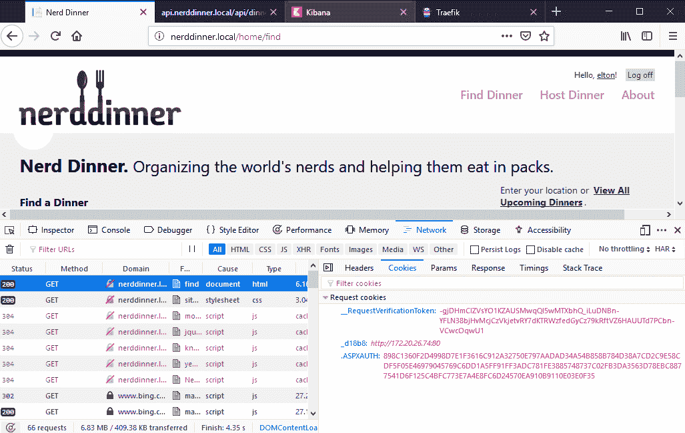
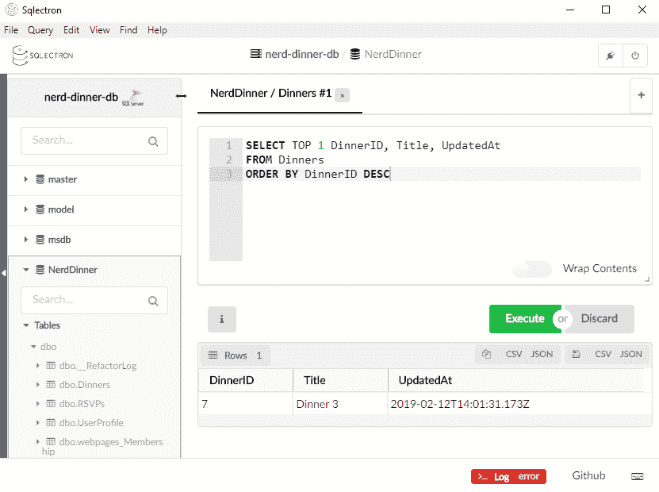

# 第六章：使用 Docker Compose 组织分布式解决方案

软件的交付是 Docker 平台的一个重要组成部分。Docker Hub 上的官方存储库使得使用经过验证的组件设计分布式解决方案变得容易。在上一章中，我向你展示了如何将这些组件集成到你自己的解决方案中，采用了以容器为先的设计方法。最终结果是一个具有多个运动部件的分布式解决方案。在本章中，你将学习如何将所有这些运动部件组织成一个单元，使用 Docker Compose。

Docker Compose 是 Docker，Inc.的另一个开源产品，它扩展了 Docker 生态系统。Docker 命令行界面（CLI）和 Docker API 在单个资源上工作，比如镜像和容器。Docker Compose 在更高的级别上工作，涉及服务和应用程序。一个应用程序是一个由一个或多个服务组成的单个单元，在运行时作为容器部署。你可以使用 Docker Compose 来定义应用程序的所有资源-服务、网络、卷和其他 Docker 对象-以及它们之间的依赖关系。

Docker Compose 有两个部分。设计时元素使用 YAML 规范在标记文件中捕获应用程序定义，而在运行时，Docker Compose 可以从 YAML 文件管理应用程序。我们将在本章中涵盖这两个部分：

+   使用 Docker Compose 定义应用程序

+   使用 Docker Compose 管理应用程序

+   配置应用程序环境

Docker Compose 是作为 Docker Desktop 在 Windows 上的一部分安装的。如果你使用 PowerShell 安装程序在 Windows Server 上安装 Docker，那就不会得到 Docker Compose。你可以从 GitHub 的发布页面`docker/compose`上下载它。

# 技术要求

你需要在 Windows 10 上运行 Docker，更新到 18.09 版，或者在 Windows Server 2019 上运行，以便跟随示例。本章的代码可在[`github.com/sixeyed/docker-on-windows/tree/second-edition/ch06`](https://github.com/sixeyed/docker-on-windows/tree/second-edition/ch06)上找到。

# 使用 Docker Compose 定义应用程序

Docker Compose 文件格式非常简单。YAML 是一种人类可读的标记语言，Compose 文件规范捕获了您的应用程序配置，使用与 Docker CLI 相同的选项名称。在 Compose 文件中，您定义组成应用程序的服务、网络和卷。网络和卷是您在 Docker 引擎中使用的相同概念。服务是容器的抽象。

容器是组件的单个实例，可以是从 Web 应用到消息处理程序的任何内容。服务可以是同一组件的多个实例，在不同的容器中运行，都使用相同的 Docker 镜像和相同的运行时选项。您可以在用于 Web 应用程序的服务中有三个容器，在用于消息处理程序的服务中有两个容器：

*服务*就像是从图像运行容器的模板，具有已知配置。使用服务，您可以扩展应用程序的组件——从相同图像运行多个容器，并将它们配置和管理为单个单元。服务不在独立的 Docker 引擎中使用，但它们在 Docker Compose 中使用，并且在运行 Docker Swarm 模式的 Docker 引擎集群中也使用（我将在下一章第七章中介绍，*使用 Docker Swarm 编排分布式解决方案*）。

Docker 为服务提供了与容器相同的可发现性。消费者通过名称访问服务，Docker 可以在服务中的多个容器之间负载均衡请求。服务中的实例数量对消费者是透明的；他们总是引用服务名称，并且流量始终由 Docker 定向到单个容器。

在本章中，我将使用 Docker Compose 来组织我在上一章中构建的分布式解决方案，用可靠且适用于生产的 Docker Compose 文件替换脆弱的`docker container run` PowerShell 脚本。

# 捕获服务定义

服务可以在 Compose 文件中以任何顺序定义。为了更容易阅读，我更喜欢从最简单的服务开始，这些服务没有依赖关系——**基础设施组件**，如消息队列、反向代理和数据库。

Docker Compose 文件通常被称为`docker-compose.yml`，并且以 API 版本的明确声明开头；最新版本是 3.7。应用程序资源在顶层定义 - 这是一个模板 Compose 文件，包含了服务、网络和卷的部分：

[PRE0]

Docker Compose 规范在 Docker 网站[`docs.docker.com/compose/compose-file/`](https://docs.docker.com/compose/compose-file/)上有文档。这列出了所有支持的版本的完整规范，以及版本之间的更改。

所有资源都需要一个唯一的名称，名称是资源引用其他资源的方式。服务可能依赖于网络、卷和其他服务，所有这些都通过名称来捕获。每个资源的配置都在自己的部分中，可用的属性与 Docker CLI 中相应的`create`命令大致相同，比如`docker network create`和`docker volume create`。

在本章中，我将为分布式 NerdDinner 应用程序构建一个 Compose 文件，并向您展示如何使用 Docker Compose 来管理应用程序。我将首先从常见服务开始我的 Compose 文件。

# 定义基础设施服务

我拥有的最简单的服务是消息队列**NATS**，它没有任何依赖关系。每个服务都需要一个名称和一个镜像名称来启动容器。可选地，您可以包括您在`docker container run`中使用的参数。对于 NATS 消息队列，我添加了一个网络名称，这意味着为此服务创建的任何容器都将连接到`nd-net`网络：

[PRE1]

在这个服务定义中，我拥有启动消息队列容器所需的所有参数：

+   `message-queue`是服务的名称。这将成为其他服务访问 NATS 的 DNS 条目。

+   `image`是启动容器的完整镜像名称。在这种情况下，它是我从 Docker Hub 的官方 NATS 镜像中获取的我的 Windows Server 2019 变体，但您也可以通过在镜像名称中包含注册表域来使用来自私有注册表的镜像。

+   `networks`是连接容器启动时要连接到的网络列表。此服务连接到一个名为`nd-net`的网络。这将是此应用程序中所有服务使用的 Docker 网络。稍后在 Docker Compose 文件中，我将明确捕获网络的详细信息。

我没有为 NATS 服务发布任何端口。消息队列仅在其他容器内部使用。在 Docker 网络中，容器可以访问其他容器上的端口，而无需将它们发布到主机上。这使得消息队列安全，因为它只能通过相同网络中的其他容器通过 Docker 平台访问。没有外部服务器，也没有在服务器上运行的应用程序可以访问消息队列。

# Elasticsearch

下一个基础设施服务是 Elasticsearch，它也不依赖于其他服务。它将被消息处理程序使用，该处理程序还使用 NATS 消息队列，因此我需要将所有这些服务加入到相同的 Docker 网络中。对于 Elasticsearch，我还希望限制其使用的内存量，并使用卷来存储数据，以便它存储在容器之外：

[PRE2]

在这里，`elasticsearch`是服务的名称，`sixeyed/elasticsearch`是镜像的名称，这是我在 Docker Hub 上的公共镜像。我将服务连接到相同的`nd-net`网络，并且还挂载一个卷到容器中的已知位置。当 Elasticsearch 将数据写入容器上的`C:\data`时，实际上会存储在一个卷中。

就像网络一样，卷在 Docker Compose 文件中是一流资源。对于 Elasticsearch，我正在将一个名为`es-data`的卷映射到容器中的数据位置。我将稍后在 Compose 文件中指定`es-data`卷应该如何创建。

# Traefik

接下来是反向代理 Traefik。代理从标签中构建其路由规则，当容器创建时，它需要连接到 Docker API：

[PRE3]

Traefik 容器发布到主机上的端口`80`，连接到应用程序网络，并使用卷用于 Docker API 命名管道。这些是我在使用`docker container run`启动 Traefik 时使用的相同选项；通常，您可以将运行命令复制到 Docker Compose 文件中。

端口发布在 Docker Compose 中与在运行容器时相同。您指定要发布的容器端口和应该发布到哪个主机端口，因此 Docker 会将传入的主机流量路由到容器。`ports`部分允许多个映射，并且如果有特定要求，您可以选择指定 TCP 或 UDP 协议。

我还发布了端口`8080`，并在 Traefik 配置中使用了`--api`标志。这使我可以访问 Traefik 的仪表板，我可以在那里查看 Traefik 配置的所有路由规则。这在非生产环境中很有用，可以检查代理规则是否正确，但在生产环境中，这不是您希望公开的东西。

Docker Compose 还支持扩展定义，我正在使用`volume`规范。我将卷的类型、源和目标拆分成不同的行，而不是使用单行来定义卷挂载。这是可选的，但它使文件更容易阅读。

# Kibana

**Kibana**是第一个依赖于其他服务的服务——它需要 Elasticsearch 运行，以便它可以连接到数据库。Docker Compose 不会对创建容器的顺序做出任何保证，因此如果服务之间存在启动依赖关系，您需要在服务定义中捕获该依赖关系：

[PRE4]

`depends_on`属性显示了如何捕获服务之间的依赖关系。在这种情况下，Kibana 依赖于 Elasticsearch，因此 Docker 将确保在启动`kibana`服务之前，`elasticsearch`服务已经启动并运行。

像这样捕获依赖关系对于在单台机器上运行分布式应用程序是可以的，但它不具有可扩展性。当您在集群中运行时，您希望编排器来管理分发工作负载。如果您有显式依赖关系，它无法有效地执行此操作，因为它需要确保所有运行依赖服务的容器在启动消费容器之前都是健康的。在我们看 Docker Swarm 时，我们将看到更好的管理依赖关系的方法。

Kibana 将由 Traefik 代理，但 Kibana 之前不需要运行 Traefik。当 Traefik 启动时，它会从 Docker API 获取正在运行的容器列表，以构建其初始路由映射。然后，它订阅来自 Docker 的事件流，以在创建或删除容器时更新路由规则。因此，Traefik 可以在 web 容器之前或之后启动。

`kibana`服务的容器也连接到应用程序网络。在另一种配置中，我可以有单独的后端和前端网络。所有基础设施服务都将连接到后端网络，而面向公众的服务将连接到后端和前端网络。这两个都是 Docker 网络，但将它们分开可以让我灵活地配置网络。

# 配置应用程序服务

到目前为止，我指定的基础设施服务并不需要太多的应用程序级配置。我已经使用网络、卷和端口配置了容器与 Docker 平台之间的集成点，但应用程序使用了内置到每个 Docker 镜像中的配置。

Kibana 镜像按照惯例使用主机名`elasticsearch`连接到 Elasticsearch，这是我在 Docker Compose 文件中使用的服务名称，以支持该惯例。Docker 平台将任何对`elasticsearch`主机名的请求路由到该服务，如果有多个运行该服务的容器，则在容器之间进行负载均衡，因此 Kibana 将能够在预期的域名找到 Elasticsearch。

我的自定义应用程序需要指定配置设置，我可以在 Compose 文件中使用环境变量来包含这些设置。在 Compose 文件中为服务定义环境变量会为运行该服务的每个容器设置这些环境变量。

index-dinner 消息处理程序服务订阅 NATS 消息队列并在 Elasticsearch 中插入文档，因此它需要连接到相同的 Docker 网络，并且还依赖于这些服务。我可以在 Compose 文件中捕获这些依赖关系，并指定应用程序的配置。

[PRE5]

在这里，我使用`environment`部分来指定两个环境变量——每个都有一个键值对——来配置消息队列和 Elasticsearch 的 URL。这实际上是默认值内置到消息处理程序镜像中的，所以我不需要在 Compose 文件中包含它们，但明确设置它们可能会有用。

您可以将 Compose 文件视为分布式解决方案的完整部署指南。如果您明确指定环境值，可以清楚地了解可用的配置选项，但这会使您的 Compose 文件变得不太可管理。

将配置变量存储为明文对于简单的应用程序设置来说是可以的，但对于敏感值，最好使用单独的环境文件，这是我在上一章中使用的方法。这也受到 Compose 文件格式的支持。对于数据库服务，我可以使用一个环境文件来指定管理员密码，使用`env-file`属性：

[PRE6]

当数据库服务启动时，Docker 将从名为`db-credentials.env`的文件中设置环境变量。我使用了相对路径，所以该文件需要与 Compose 文件在同一位置。与之前一样，该文件的内容是每个环境变量一行的键值对。在这个文件中，我包括了应用程序的连接字符串，以及数据库的密码，所以凭据都在一个地方：

[PRE7]

敏感数据仍然是明文的，但通过将其隔离到一个单独的文件中，我可以做两件事：

+   首先，我可以保护文件以限制访问。

+   其次，我可以利用服务配置与应用程序定义的分离，并在不同环境中使用相同的 Docker Compose 文件，替换不同的环境文件。

环境变量即使你保护文件访问也不安全。当你检查一个容器时，你可以查看环境变量的值，所以任何有 Docker API 访问权限的人都可以读取这些数据。对于诸如密码和 API 密钥之类的敏感数据，你应该在 Docker Swarm 中使用 Docker secrets，这将在下一章中介绍。

对于 save-dinner 消息处理程序，我可以利用相同的环境文件来获取数据库凭据。处理程序依赖于消息队列和数据库服务，但在这个定义中没有新的属性：

[PRE8]

接下来是我的前端服务，它们由 Traefik 代理——REST API、新的主页和传统的 NerdDinner 网页应用。REST API 使用相同的凭据文件来配置 SQL Server 连接，并包括 Traefik 路由规则：

[PRE9]

主页包括 Traefik 路由规则，还有一个高优先级值，以确保在 NerdDinner 网页应用使用的更一般的规则之前评估此规则：

[PRE10]

最后一个服务是网站本身。在这里，我正在使用环境变量和环境文件的组合。通常在各个环境中保持一致的变量值可以明确地说明配置，我正在为功能标志做到这一点。敏感数据可以从单独的文件中读取，本例中包含数据库凭据和 API 密钥：

[PRE11]

网站容器不需要对外公开，因此不需要发布端口。应用程序需要访问其他服务，因此连接到同一个网络。

所有服务现在都已配置好，所以我只需要指定网络和卷资源，以完成 Compose 文件。

# 指定应用程序资源

Docker Compose 将网络和卷的定义与服务的定义分开，这允许在环境之间灵活性。我将在本章后面介绍这种灵活性，但为了完成 NerdDinner Compose 文件，我将从最简单的方法开始，使用默认值。

我的 Compose 文件中的所有服务都使用一个名为`nd-net`的网络，需要在 Compose 文件中指定。Docker 网络是隔离应用程序的好方法。您可以有几个解决方案都使用 Elasticsearch，但具有不同的 SLA 和存储要求。如果每个应用程序都有一个单独的网络，您可以在不同的 Docker 网络中运行单独配置的 Elasticsearch 服务，但所有都命名为`elasticsearch`。这保持了预期的约定，但通过网络进行隔离，因此服务只能看到其自己网络中的 Elasticsearch 实例。

Docker Compose 可以在运行时创建网络，或者您可以定义资源以使用主机上已经存在的外部网络。这个 NerdDinner 网络的规范使用了 Docker 在安装时创建的默认`nat`网络，因此这个设置将适用于所有标准的 Docker 主机：

[PRE12]

卷也需要指定。我的两个有状态服务，Elasticsearch 和 SQL Server，都使用命名卷进行数据存储：分别是`es-data`和`nd-data`。与其他网络一样，卷可以被指定为外部，因此 Docker Compose 将使用现有卷。Docker 不会创建任何默认卷，因此如果我使用外部卷，我需要在每个主机上运行应用程序之前创建它。相反，我将指定卷而不带任何选项，这样 Docker Compose 将为我创建它们：

[PRE13]

这些卷将在主机上存储数据，而不是在容器的可写层中。它们不是主机挂载的卷，因此尽管数据存储在本地磁盘上，但我没有指定位置。每个卷将在 Docker 数据目录`C:\ProgramData\Docker`中写入其数据。我将在本章后面看一下如何管理这些卷。

我的 Compose 文件已经指定了服务、网络和卷，所以它已经准备就绪。完整文件在本章的源代码`ch06\ch06-docker-compose`中。

# 使用 Docker Compose 管理应用程序

Docker Compose 提供了与 Docker CLI 类似的界面。`docker-compose`命令使用一些相同的命令名称和参数来支持其功能，这是完整 Docker CLI 功能的子集。当您通过 Compose CLI 运行命令时，它会向 Docker 引擎发送请求，以对 Compose 文件中的资源进行操作。

Docker Compose 文件是应用程序的期望状态。当您运行`docker-compose`命令时，它会将 Compose 文件与 Docker 中已经存在的对象进行比较，并进行任何必要的更改以达到期望的状态。这可能包括停止容器、启动容器或创建卷。

Compose 将 Compose 文件中的所有资源视为单个应用程序，并为了消除在同一主机上运行的应用程序的歧义，运行时会向为应用程序创建的所有资源添加项目名称。当您通过 Compose 运行应用程序，然后查看在主机上运行的容器时，您不会看到一个名称完全匹配服务名称的容器。Compose 会向容器名称添加项目名称和索引，以支持服务中的多个容器，但这不会影响 Docker 的 DNS 系统，因此容器仍然通过服务名称相互访问。

# 运行应用程序

我在`ch06-docker-compose`目录中有 NerdDinner 的第一个 Compose 文件，该目录还包含环境变量文件。从该目录，我可以使用单个`docker-compose`命令启动整个应用程序：

[PRE14]

让我们看一下前面命令的描述：

+   `up`命令用于启动应用程序，创建网络、卷和运行容器。

+   `-d`选项在后台运行所有容器，与`docker container run`中的`--detach`选项相同。

您可以看到 Docker Compose 遵守服务的`depends_on`设置。任何作为其他服务依赖项的服务都会首先创建。没有任何依赖项的服务将以随机顺序创建。在这种情况下，`message-queue`服务首先创建，因为许多其他服务依赖于它，而`nerd-dinner-web`和`nerd-dinner-save-handler`服务是最后创建的，因为它们有最多的依赖项。

输出中的名称是各个容器的名称，命名格式为`{project}_{service}_{index}`。每个服务只有一个运行的容器，这是默认的，所以索引都是`1`。项目名称是我运行`compose`命令的目录名称的经过清理的版本。

当您运行`docker-compose up`命令并完成后，您可以使用 Docker Compose 或标准的 Docker CLI 来管理容器。这些容器只是普通的 Docker 容器，compose 使用一些额外的元数据来将它们作为一个整体单元进行管理。列出容器会显示由`compose`创建的所有服务容器：

[PRE15]

运行 Traefik 的容器将端口`80`发布到本地计算机，并且我的 hosts 文件中有本地 NerdDinner 域的条目。NerdDinner 应用程序及其新首页、REST API 和 Kibana 分析将按预期运行，因为所有配置都包含在 Compose 文件中，并且所有组件都由 Docker Compose 启动。

这是 Compose 文件格式中最强大的功能之一。该文件包含了运行应用程序的完整规范，任何人都可以使用它来运行您的应用程序。在这种情况下，所有组件都使用 Docker Hub 上的公共 Docker 镜像，因此任何人都可以从这个 Compose 文件启动应用程序。您只需要 Docker 和 Docker Compose 来运行 NerdDinner，它现在是一个包含.NET Framework、.NET Core、Java、Go 和 Node.js 组件的分布式应用程序。

# 扩展应用程序服务

Docker Compose 让您轻松地扩展服务，向正在运行的服务添加或删除容器。当一个服务使用多个容器运行时，它仍然可以被网络中的其他服务访问。消费者使用服务名称进行发现，Docker 中的 DNS 服务器会在所有服务的容器之间平衡请求。

然而，添加更多的容器并不会自动为您的服务提供规模和弹性；这取决于运行服务的应用程序。只是向 SQL 数据库服务添加另一个容器并不会自动给您提供 SQL Server 故障转移集群，因为 SQL Server 需要显式配置故障转移。如果您添加另一个容器，您将只有两个具有单独数据存储的不同数据库实例。

Web 应用程序通常在设计时支持横向扩展时可以很好地扩展。无状态应用程序可以在任意数量的容器中运行，因为任何容器都可以处理任何请求。但是，如果您的应用程序在本地维护会话状态，则来自同一用户的请求需要由同一服务处理，这将阻止您在许多容器之间进行负载平衡，除非您使用粘性会话。

将端口发布到主机的服务，如果它们在单个 Docker 引擎上运行，则无法扩展。端口只能有一个操作系统进程在其上监听，对于 Docker 也是如此——您不能将相同的主机端口映射到多个容器端口。在具有多个主机的 Docker Swarm 上，您可以扩展具有发布端口的服务，Docker 将在不同的主机上运行每个容器。

在 NerdDinner 中，消息处理程序是真正无状态的组件。它们从包含它们所需的所有信息的队列中接收消息，然后对其进行处理。NATS 支持在同一消息队列上对订阅者进行分组，这意味着我可以运行几个包含 save-dinner 处理程序的容器，并且 NATS 将确保只有一个处理程序获得每条消息的副本，因此我不会有重复的消息处理。消息处理程序中的代码已经利用了这一点。

扩展消息处理程序是我在高峰时期可以做的事情，以增加消息处理的吞吐量。我可以使用`up`命令和`--scale`选项来做到这一点，指定服务名称和所需的实例数量：

[PRE16]

Docker Compose 将运行应用程序的状态与 Compose 文件中的配置和命令中指定的覆盖进行比较。在这种情况下，除了 save-dinner 处理程序之外，所有服务都保持不变，因此它们被列为`up-to-date`。save-handler 具有新的服务级别，因此 Docker Compose 创建了两个更多的容器。

有三个 save-message 处理程序实例运行时，它们以循环方式共享传入消息负载。这是增加规模的好方法。处理程序同时处理消息并写入 SQL 数据库，这增加了保存的吞吐量并减少了处理消息所需的时间。但对于写入 SQL Server 的进程数量仍然有严格的限制，因此数据库不会成为此功能的瓶颈。

我可以通过 web 应用程序创建多个晚餐，当事件消息被发布时，消息处理程序将共享负载。我可以在日志中看到不同的处理程序处理不同的消息，并且没有重复处理事件：

[PRE17]

我正在单个 Docker 引擎上运行，所以无法扩展 Traefik 服务，因为只能发布一个容器到端口`80`。但我可以扩展 Traefik 代理的前端容器，这是测试我的应用程序在扩展到多个实例时是否正常工作的好方法。我将再添加两个原始 NerdDinner web 应用程序的实例：

[PRE18]

仔细看这个输出——发生了一些正确的事情，但并不是我想要的。Compose 已经创建了两个新的 NerdDinner web 容器，以满足我指定的规模为 3，但它也停止并移除了两个 save-handler 容器。

这是因为 Compose 隐式地使用我的`docker-compose.yml`文件作为应用程序定义，该文件使用每个服务的单个实例。然后它从 web 服务的命令中添加了规模值，并构建了一个期望的状态，即每个服务应该有一个正在运行的容器，除了 web 服务应该有三个。它发现 web 服务只有一个容器，所以创建了另外两个。它发现 save-handler 有三个容器，所以移除了两个。

混合 Compose 文件定义和命令的更改是不推荐的，正是因为这种情况。Compose 文件本身应该是应用程序的期望状态。但在这种情况下，您无法在 Compose 文件中指定规模选项（在旧版本中可以，但从规范的 v3 开始不行），因此您需要显式地为所有服务添加规模级别：

[PRE19]

现在我有三个 save-handler 容器，它们正在共享消息队列的工作，还有三个 web 容器。Traefik 将在这三个 web 容器之间负载均衡请求。我可以从 Traefik 仪表板上检查该配置，我已经发布在端口`8080`上：

Traefik 在左侧以蓝色框显示前端路由规则，以绿色框显示它们映射到的后端服务。对于`nerddinner.local`有一个路径前缀为`/`的前端路由规则，它将所有流量发送到`nerd-dinner-web`后端（除了首页，它有不同的规则）。后端显示有三个列出的服务器，它们是我用 Docker Compose 扩展的三个容器。`172.20.*.*`服务器地址是 Docker 网络上的内部 IP 地址，容器可以用来通信。

我可以浏览 NerdDinner 应用程序，并且它可以正确运行，Traefik 会在后端容器之间负载均衡请求。但是，一旦我尝试登录，我会发现 NerdDinner 并不是设计为扩展到多个实例：

该错误消息告诉我，NerdDinner 希望一个用户的所有请求都由 web 应用程序的同一实例处理。Traefik 支持粘性会话，正是为了解决这种情况，因此要解决这个问题，我只需要在 Compose 文件中的 web 服务定义中添加一个新的标签。这将为 NerdDinner 后端启用粘性会话：

[PRE20]

现在我可以再次部署，确保包括我的规模参数：

[PRE21]

Compose 重新创建 web 服务容器，删除旧容器，并使用新配置启动新容器。现在，Traefik 正在使用粘性会话，因此我的浏览器会话中的每个请求都将发送到相同的容器。Traefik 使用自定义 cookie 来实现这一点，该 cookie 指定请求应路由到的容器 IP 地址：

在这种情况下，cookie 被称为`_d18b8`，它会将所有我的请求定向到具有 IP 地址`172.20.26.74`的容器。

在规模运行时发现问题以前只会发生在测试环境，甚至在生产环境中。在 Docker 中运行所有内容意味着我可以在我的开发笔记本上测试应用程序的功能，以便在发布之前发现这些问题。使用现代技术，如 Traefik，也意味着有很好的方法来解决这些问题，而无需更改我的传统应用程序。

# 停止和启动应用程序服务

Docker Compose 中有几个管理容器生命周期的命令。重要的是要理解选项之间的区别，以免意外删除资源。

`up`和`down`命令是启动和停止整个应用程序的粗糙工具。`up`命令创建 Compose 文件中指定的任何不存在的资源，并为所有服务创建和启动容器。`down`命令则相反-它停止任何正在运行的容器并删除应用程序资源。如果是由 Docker Compose 创建的容器和网络，则会被删除，但卷不会被删除-因此您拥有的任何应用程序数据都将被保留。

`stop`命令只是停止所有正在运行的容器，而不会删除它们或其他资源。停止容器会以优雅的方式结束运行的进程。可以使用`start`再次启动已停止的应用程序容器，它会在现有容器中运行入口点程序。

停止的容器保留其所有配置和数据，但它们不使用任何计算资源。启动和停止容器是在多个项目上工作时切换上下文的非常有效的方式。如果我在 NerdDinner 上开发，当另一个工作作为优先级而来时，我可以停止整个 NerdDinner 应用程序来释放我的开发环境：

[PRE22]

现在我没有运行的容器，我可以切换到另一个项目。当工作完成时，我可以通过运行`docker-compose start`再次启动 NerdDinner。

您还可以通过指定名称来停止单个服务，如果您想测试应用程序如何处理故障，这将非常有用。我可以通过停止 Elasticsearch 服务来检查索引晚餐处理程序在无法访问 Elasticsearch 时的行为：

[PRE23]

所有这些命令都是通过将 Compose 文件与在 Docker 中运行的服务进行比较来处理的。你需要访问 Docker Compose 文件才能运行任何 Docker Compose 命令。这是在单个主机上使用 Docker Compose 运行应用程序的最大缺点之一。另一种选择是使用相同的 Compose 文件，但将其部署为 Docker Swarm 的堆栈，我将在下一章中介绍。

`stop`和`start`命令使用 Compose 文件，但它们作用于当前存在的容器，而不仅仅是 Compose 文件中的定义。因此，如果你扩展了一个服务，然后停止整个应用程序，然后再次启动它——你仍然会拥有你扩展的所有容器。只有`up`命令使用 Compose 文件将应用程序重置为所需的状态。

# 升级应用程序服务

如果你从同一个 Compose 文件重复运行`docker compose up`，在第一次运行之后不会进行任何更改。Docker Compose 会将 Compose 文件中的配置与运行时的活动容器进行比较，并且不会更改资源，除非定义已经改变。这意味着你可以使用 Docker Compose 来管理应用程序的升级。

我的 Compose 文件目前正在使用我在第三章中构建的数据库服务的镜像，*开发 Docker 化的.NET Framework 和.NET Core 应用程序*，标记为`dockeronwindows/ch03-nerd-dinner-db:2e`。对于本章，我已经在数据库架构中添加了审计字段，并构建了一个新版本的数据库镜像，标记为`dockeronwindows/ch06-nerd-dinner-db:2e`。

我在同一个`ch06-docker-compose`目录中有第二个 Compose 文件，名为`docker-compose-db-upgrade.yml`。升级文件不是完整的应用程序定义；它只包含数据库服务定义的一个部分，使用新的镜像标签：

[PRE24]

Docker Compose 支持覆盖文件。你可以运行`docker-compose`命令并将多个 Compose 文件作为参数传递。Compose 将按照命令中指定的顺序从左到右将所有文件合并在一起。覆盖文件可以用于向应用程序定义添加新的部分，或者可以替换现有的值。

当应用程序正在运行时，我可以再次执行`docker compose up`，同时指定原始 Compose 文件和`db-upgrade`覆盖文件：

[PRE25]

该命令使用`db-upgrade`文件作为主`docker-compose.yml`文件的覆盖。Docker Compose 将它们合并在一起，因此最终的服务定义包含原始文件中的所有值，除了来自覆盖的镜像规范。新的服务定义与 Docker 中正在运行的内容不匹配，因此 Compose 重新创建数据库服务。

Docker Compose 通过移除旧容器并启动新容器来重新创建服务，使用新的镜像规范。不依赖于数据库的服务保持不变，日志条目为`up-to-date`，任何依赖于数据库的服务在新的数据库容器运行后也会被重新创建。

我的数据库容器使用了我在第三章中描述的模式，使用卷存储数据和一个脚本，可以在容器被替换时升级数据库模式。在 Compose 文件中，我使用了一个名为`db-data`的卷的默认定义，因此 Docker Compose 为我创建了它。就像 Compose 创建的容器一样，卷是标准的 Docker 资源，可以使用 Docker CLI 进行管理。`docker volume ls`列出主机上的所有卷：

[PRE26]

我有两个卷用于我的 NerdDinner 部署。它们都使用本地驱动程序，这意味着数据存储在本地磁盘上。我可以检查 SQL Server 卷，看看数据在主机上的物理存储位置（在`Mountpoint`属性中），然后检查内容以查看数据库文件：

[PRE27]

卷存储在容器之外，因此当 Docker Compose 移除旧容器数据库时，所有数据都得到保留。新的数据库镜像捆绑了一个 Dacpac，并配置为对现有数据文件进行模式升级，方式与第三章中的 SQL Server 数据库相同，*开发 Docker 化的.NET Framework 和.NET Core 应用*。

新容器启动后，我可以检查日志，看到新容器从卷中附加了数据库文件，然后修改了 Dinners 表以添加新的审计列：

[PRE28]

新的审计列在更新行时添加了时间戳，因此现在当我通过 Web UI 创建晚餐时，我可以看到数据库中上次更新行的时间。在我的开发环境中，我还没有为客户端连接发布 SQL Server 端口，但我可以运行`docker container inspect`来获取容器的本地 IP 地址。然后我可以直接连接我的 SQL 客户端到容器并运行查询以查看新的审计时间戳：

Docker Compose 寻找资源及其定义之间的任何差异，而不仅仅是 Docker 镜像的名称。如果更改环境变量、端口映射、卷设置或任何其他配置，Docker Compose 将删除或创建资源，以将运行的应用程序带到所需的状态。

修改 Compose 文件以运行应用程序时需要小心。如果从文件中删除正在运行的服务的定义，Docker Compose 将不会识别现有的服务容器是应用程序的一部分，因此它们不会包含在差异检查中。您可能会遇到孤立的服务容器。

# 监视应用程序容器

将分布式应用程序视为单个单元可以更容易地监视和跟踪问题。Docker Compose 提供了自己的`top`和`logs`命令，这些命令可以在应用程序服务的所有容器上运行，并显示收集的结果。

要检查所有组件的内存和 CPU 使用情况，请运行`docker-compose top`：

[PRE29]

容器按名称按字母顺序列出，每个容器中的进程没有特定的顺序列出。无法更改排序方式，因此无法首先显示最密集的进程所在的最努力工作的容器，但结果是以纯文本形式呈现的，因此可以在 PowerShell 中对其进行操作。

要查看所有容器的日志条目，请运行`docker-compose logs`：

[PRE30]

在屏幕上，容器名称以颜色编码，因此您可以轻松区分来自不同组件的条目。通过 Docker Compose 阅读日志的一个优势是，它显示所有容器的输出，即使组件显示错误并且容器已停止。这些错误消息对于在上下文中查看很有用-您可能会看到一个组件在另一个组件记录其已启动之前抛出连接错误，这可能突出了 Compose 文件中缺少的依赖关系。

Docker Compose 显示所有服务容器的所有日志条目，因此输出可能很多。您可以使用`--tail`选项限制输出，将输出限制为每个容器的指定数量的最近日志条目。

这些命令在开发或在单个服务器上运行少量容器的低规模项目中非常有用。对于在 Docker Swarm 上运行的跨多个主机的大型项目，它不具备可扩展性。对于这些项目，您需要以容器为中心的管理和监控，我将在第八章中进行演示，*管理和监控 Docker 化解决方案*。

# 管理应用程序图像

Docker Compose 可以管理 Docker 图像，以及容器。在 Compose 文件中，您可以包括属性，告诉 Docker Compose 如何构建您的图像。您可以指定要发送到 Docker 服务的构建上下文的位置，这是所有应用程序内容的根文件夹，以及 Dockerfile 的位置。

上下文路径是相对于 Compose 文件的位置，而 Dockerfile 路径是相对于上下文的。这对于复杂的源树非常有用，比如本书的演示源，其中每个图像的上下文位于不同的文件夹中。在`ch06-docker-compose-build`文件夹中，我有一个完整的 Compose 文件，其中包含了应用程序规范，包括指定的构建属性。

这是我为我的图像指定构建细节的方式：

[PRE31]

当您运行`docker-compose build`时，任何具有指定`build`属性的服务将被构建并标记为`image`属性中的名称。构建过程使用正常的 Docker API，因此仍然使用图像层缓存，只重新构建更改的层。向 Compose 文件添加构建细节是构建所有应用程序图像的一种非常有效的方式，也是捕获图像构建方式的中心位置。

Docker Compose 的另一个有用功能是能够管理整个图像组。本章的 Compose 文件使用的图像都是在 Docker Hub 上公开可用的，因此您可以使用`docker-compose up`运行完整的应用程序，但第一次运行时，所有图像都将被下载，这将需要一些时间。您可以在使用`docker-compose pull`之前预加载图像，这将拉取所有图像：

[PRE32]

同样，您可以使用`docker-compose push`将图像上传到远程存储库。对于这两个命令，Docker Compose 使用最近`docker login`命令的经过身份验证的用户。如果您的 Compose 文件包含您无权推送的图像，这些推送将失败。对于您有写入权限的任何存储库，无论是在 Docker Hub 还是私有注册表中，这些图像都将被推送。

# 配置应用程序环境

当您在 Docker Compose 中定义应用程序时，您有一个描述应用程序所有组件和它们之间集成点的单个工件。这通常被称为**应用程序清单**，它是列出应用程序所有部分的文档。就像 Dockerfile 明确定义了安装和配置软件的步骤一样，Docker Compose 文件明确定义了部署整个解决方案的步骤。

Docker Compose 还允许您捕获可以部署到不同环境的应用程序定义，因此您的 Compose 文件可以在整个部署流程中使用。通常，环境之间存在差异，无论是在基础设施设置还是应用程序设置方面。Docker Compose 为您提供了两种选项来管理这些环境差异——使用外部资源或使用覆盖文件。

基础设施通常在生产和非生产环境之间有所不同，这影响了 Docker 应用程序中的卷和网络。在开发笔记本电脑上，您的数据库卷可能映射到本地磁盘上的已知位置，您会定期清理它。在生产环境中，您可以为共享存储硬件设备使用卷插件。同样，对于网络，生产环境可能需要明确指定子网范围，而这在开发中并不是一个问题。

Docker Compose 允许您将资源指定为 Compose 文件之外的资源，因此应用程序将使用已经存在的资源。这些资源需要事先创建，但这意味着每个环境可以被不同配置，但仍然使用相同的 Compose 文件。

Compose 还支持另一种方法，即在不同的 Compose 文件中明确捕获每个环境的资源配置，并在运行应用程序时使用多个 Compose 文件。我将演示这两种选项。与其他设计决策一样，Docker 不会强加特定的实践，您可以使用最适合您流程的任何方法。

# 指定外部资源

Compose 文件中的卷和网络定义遵循与服务定义相同的模式——每个资源都有名称，并且可以使用与相关的`docker ... create`命令中可用的相同选项进行配置。Compose 文件中有一个额外的选项，可以指向现有资源。

为了使用现有卷来存储我的 SQL Server 和 Elasticsearch 数据，我需要指定`external`属性，以及可选的资源名称。在`ch06-docker-compose-external`目录中，我的 Docker Compose 文件具有这些卷定义：

[PRE33]

声明外部资源后，我不能只使用`docker-compose up`来运行应用程序。Compose 不会创建定义为外部的卷；它们需要在应用程序启动之前存在。而且这些卷是服务所必需的，因此 Docker Compose 也不会创建任何容器。相反，您会看到一个错误消息：

[PRE34]

错误消息告诉您需要运行的命令来创建缺失的资源。这将使用默认配置创建基本卷，这将允许 Docker Compose 启动应用程序：

[PRE35]

Docker 允许您使用不同的配置选项创建卷，因此您可以指定显式的挂载点，例如 RAID 阵列或 NFS 共享。Windows 目前不支持本地驱动器的选项，但您可以使用映射驱动器作为解决方法。还有其他类型存储的驱动程序——使用云服务的卷插件，例如 Azure 存储，以及企业存储单元，例如 HPE 3PAR。

可以使用相同的方法来指定网络作为外部资源。在我的 Compose 文件中，我最初使用默认的`nat`网络，但在这个 Compose 文件中，我为应用程序指定了一个自定义的外部网络：

[PRE36]

Windows 上的 Docker 有几个网络选项。默认和最简单的是网络地址转换，使用`nat`网络。这个驱动器将容器与物理网络隔离，每个容器在 Docker 管理的子网中都有自己的 IP 地址。在主机上，您可以通过它们的 IP 地址访问容器，但在主机外部，您只能通过发布的端口访问容器。

您可以使用`nat`驱动程序创建其他网络，或者您还可以使用其他驱动程序进行不同的网络配置：

+   `transparent`驱动器，为每个容器提供物理路由器提供的 IP 地址

+   `l2bridge`驱动器，用于在物理网络上指定静态容器 IP 地址

+   `overlay`驱动器，用于在 Docker Swarm 中运行分布式应用程序

对于我在单个服务器上使用 Traefik 的设置，`nat`是最佳选项，因此我将为我的应用程序创建一个自定义网络：

[PRE37]

当容器启动时，我可以使用我在`hosts`文件中设置的`nerddinner.local`域来访问 Traefik。

使用外部资源可以让您拥有一个单一的 Docker Compose 文件，该文件用于每个环境，网络和卷资源的实际实现在不同环境之间有所不同。开发人员可以使用基本的存储和网络选项，在生产环境中，运维团队可以部署更复杂的基础设施。

# 使用 Docker Compose 覆盖

资源并不是环境之间唯一变化的东西。您还将有不同的配置设置，不同的发布端口，不同的容器健康检查设置等。对于每个环境拥有完全不同的 Docker Compose 文件可能很诱人，但这是您应该努力避免的事情。

拥有多个 Compose 文件意味着额外的开销来保持它们同步 - 更重要的是，如果它们不保持同步，环境漂移的风险。使用 Docker Compose 覆盖可以解决这个问题，并且意味着每个环境的要求都是明确说明的。

Docker Compose 默认寻找名为`docker-compose.yml`和`docker-compose.override.yml`的文件，如果两者都找到，它将使用覆盖文件来添加或替换主 Docker Compose 文件中的定义的部分。当您运行 Docker Compose CLI 时，可以传递其他文件以组合整个应用程序规范。这使您可以将核心解决方案定义保存在一个文件中，并在其他文件中具有明确的环境相关覆盖。

在`ch06-docker-compose-override`文件夹中，我采取了这种方法。核心的`docker-compose.yml`文件包含了描述解决方案结构和运行开发环境的环境配置的服务定义。在同一个文件夹中有三个覆盖文件：

+   `docker-compose.test.yml`添加了用于测试环境的配置设置。

+   `docker-compose.production.yml`添加了用于生产环境的配置设置。

+   `docker-compose.build.yml`添加了用于构建图像的配置设置。

标准的`docker-compose.yml`文件可以单独使用，它会正常工作。这很重要，以确保部署过程不会给开发人员带来困难。在主文件中指定开发设置意味着开发人员只需运行`docker-compose up -d`，因为他们不需要了解任何关于覆盖的信息就可以开始工作。

这是`docker-compose.yml`中的反向代理配置，并且设置为发布随机端口并启动 Traefik 仪表板：

[PRE38]

这对于可能正在为其他应用程序使用端口`80`的开发人员以及希望深入了解仪表板以查看 Traefik 的路由规则的开发人员非常有用。`test`覆盖文件将端口定义更改为在主机服务器上使用`80`和`8080`，但仪表板仍然暴露，因此命令部分保持不变：

[PRE39]

`production`覆盖更改了启动命令，删除了命令中的`--api`标志，因此仪表板不会运行，它只发布端口`80`：

[PRE40]

服务配置的其余部分，要使用的图像，Docker Engine 命名管道的卷挂载和要连接的网络在每个环境中都是相同的，因此覆盖文件不需要指定它们。

另一个例子是新的主页，其中包含了 Traefik 标签中的 URL 的域名。这是特定于环境的，在开发 Docker Compose 文件中，它被设置为使用`nerddinner.local`：

[PRE41]

在`test`覆盖文件中，域是`nerd-dinner.test`：

[PRE42]

在生产中，是`nerd-dinner.com`：

[PRE43]

在每个环境中，其余配置都是相同的，因此覆盖文件只指定新标签。

Docker Compose 在添加覆盖时不会合并列表的内容；新列表完全替换旧列表。这就是为什么每个文件中都有`traefik.frontend.priority`标签，因此您不能只在覆盖文件中的标签中有前端规则值，因为优先级值不会从主文件中的标签中合并过来。

在覆盖文件中捕获了测试环境中的其他差异：

+   SQL Server 和 Elasticsearch 端口被发布，以帮助故障排除。

+   数据库的卷从服务器上的`E:`驱动器上的路径挂载，这是服务器上的 RAID 阵列。

+   Traefik 规则都使用`nerd-dinner.test`域。

+   应用程序网络被指定为外部，以允许管理员创建他们自己的网络配置。

这些在生产覆盖文件中又有所不同：

+   SQL Server 和 Elasticsearch 端口不被发布，以保持它们作为私有组件。

+   数据库的卷被指定为外部，因此管理员可以配置他们自己的存储。

+   Traefik 规则都使用`nerd-dinner.com`域。

+   应用程序网络被指定为外部，允许管理员创建他们自己的网络配置。

部署到任何环境都可以简单地运行`docker-compose up`，指定要使用的覆盖文件：

[PRE44]

这种方法是保持 Docker Compose 文件简单的好方法，并在单独的文件中捕获所有可变环境设置。甚至可以组合几个 Docker Compose 文件。如果有多个共享许多共同点的测试环境，可以在基本 Compose 文件中定义应用程序设置，在一个覆盖文件中共享测试配置，并在另一个覆盖文件中定义每个特定的测试环境。

# 总结

在本章中，我介绍了 Docker Compose，这是用于组织分布式 Docker 解决方案的工具。使用 Compose，您可以明确定义解决方案的所有组件、组件的配置以及它们之间的关系，格式简单、清晰。

Compose 文件让您将所有应用程序容器作为单个单元进行管理。您在本章中学习了如何使用`docker-compose`命令行来启动和关闭应用程序，创建所有资源并启动或停止容器。您还了解到，您可以使用 Docker Compose 来扩展组件或发布升级到您的解决方案。

Docker Compose 是定义复杂解决方案的强大工具。Compose 文件有效地取代了冗长的部署文档，并完全描述了应用程序的每个部分。通过外部资源和 Compose 覆盖，甚至可以捕获环境之间的差异，并构建一组 YAML 文件，用于驱动整个部署流水线。

Docker Compose 的局限性在于它是一个客户端工具。`docker-compose`命令需要访问 Compose 文件来执行任何命令。资源被逻辑地分组成一个单一的应用程序，但这只发生在 Compose 文件中。Docker 引擎只看到一组资源；它不认为它们是同一个应用程序的一部分。Docker Compose 也仅限于单节点 Docker 部署。

在下一章中，我将继续讲解集群化的 Docker 部署，多个节点在 Docker Swarm 中运行。在生产环境中，这为您提供了高可用性和可扩展性。Docker Swarm 是容器解决方案的强大编排器，非常易于使用。它还支持 Compose 文件格式，因此您可以使用现有的 Compose 文件部署应用程序，但 Docker 将逻辑架构存储在 Swarm 中，无需 Compose 文件即可管理应用程序。
