# 第八章：管理和监控 Docker 化解决方案

基于 Docker 构建的应用程序本质上是可移植的，部署过程对于每个环境都是相同的。当您将应用程序从系统测试和用户测试推广到生产环境时，您每次都会使用相同的构件。您在生产环境中使用的 Docker 镜像与在测试环境中签署的完全相同版本的镜像，任何环境差异都可以在 compose-file 覆盖、Docker 配置对象和 secrets 中捕获。

在后面的章节中，我将介绍 Docker 的持续部署工作原理，因此您的整个部署过程可以自动化。但是当您采用 Docker 时，您将会转移到一个新的应用平台，而通往生产环境的道路不仅仅是部署过程。容器化应用程序的运行方式与部署在虚拟机或裸机服务器上的应用程序有根本的不同。在本章中，我将讨论管理和监控在 Docker 中运行的应用程序。

今天您用来管理 Windows 应用程序的一些工具在应用程序迁移到 Docker 后仍然可以使用，我将从一些示例开始。但是在容器中运行的应用程序有不同的管理需求和机会，本章的主要重点将是特定于 Docker 的管理产品。

在本章中，我将使用简单的 Docker 化应用程序来向您展示如何管理容器，包括：

+   将**Internet Information Services** (**IIS**)管理器连接到运行在容器中的 IIS 服务

+   连接 Windows Server Manager 到容器，查看事件日志和功能

+   使用开源项目查看和管理 Docker 集群

+   使用**Universal Control Plane** (**UCP**)与**Docker Enterprise**

# 技术要求

您需要在 Windows 10 更新 18.09 或 Windows Server 2019 上运行 Docker，以便跟随示例。本章的代码可在[`github.com/sixeyed/docker-on-windows/tree/second-edition/ch08`](https://github.com/sixeyed/docker-on-windows/tree/second-edition/ch08)找到。

# 使用 Windows 工具管理容器

许多 Windows 中的管理工具都能够管理远程机器上运行的服务。IIS 管理器、服务器管理器和**SQL Server Management Studio** (**SSMS**)都可以连接到网络上的远程服务器进行检查和管理。

Docker 容器不同于远程机器，但它们可以被设置为允许从这些工具进行远程访问。通常情况下，您需要显式地为工具设置访问权限，通过公开管理端口、启用 Windows 功能和运行 PowerShell cmdlets。这些都可以在您的应用程序的 Dockerfile 中完成，我将为每个工具的设置步骤进行介绍。

能够使用熟悉的工具可能是有帮助的，但你应该对它们的使用有所限制；记住，容器是可以被丢弃的。如果您使用 IIS Manager 连接到 Web 应用程序容器并调整应用程序池设置，当您使用新的容器映像更新应用程序时，这些调整将会丢失。您可以使用图形工具检查运行中的容器并诊断问题，但您应该在 Dockerfile 中进行更改并重新部署。

# IIS Manager

IIS Web 管理控制台是一个完美的例子。在 Windows 基础映像中，默认情况下不允许远程访问，但您可以使用一个简单的 PowerShell 脚本进行配置。首先，需要安装 Web 管理功能：

[PRE0]

然后，您需要使用注册表设置启用远程访问，并启动 Web 管理 Windows 服务：

[PRE1]

您还需要在 Dockerfile 中添加一个`EXPOSE`指令，以允许流量进入预期端口`8172`的管理服务。这将允许您连接，但 IIS 管理控制台需要远程机器的用户凭据。为了支持这一点，而不必将容器连接到**Active Directory**（**AD**），您可以在设置脚本中创建用户和密码：

[PRE2]

这里存在安全问题。您需要在镜像中创建一个管理帐户，公开一个端口，并运行一个额外的服务，所有这些都会增加应用程序的攻击面。与其在 Dockerfile 中运行设置脚本，不如附加到一个容器并交互式地运行脚本，如果您需要远程访问。

我已经在一个镜像中设置了一个简单的 Web 服务器，并在`dockeronwindows/ch08-iis-with-management:2e`的 Dockerfile 中打包了一个脚本以启用远程管理。我将从这个镜像中运行一个容器，发布 HTTP 和 IIS 管理端口：

[PRE3]

当容器运行时，我将在容器内执行`EnableIisRemoteManagement.ps1`脚本，该脚本设置了 IIS 管理服务的远程访问：

[PRE4]

安装脚本最后运行`ipconfig`，所以我可以看到容器的内部 IP 地址（我也可以从`docker container inspect`中看到这一点）。

现在我可以在 Windows 主机上运行 IIS 管理器，选择“开始页面|连接到服务器”，并输入容器的 IP 地址。当 IIS 要求我进行身份验证时，我使用了在安装脚本中创建的`iisadmin`用户的凭据：

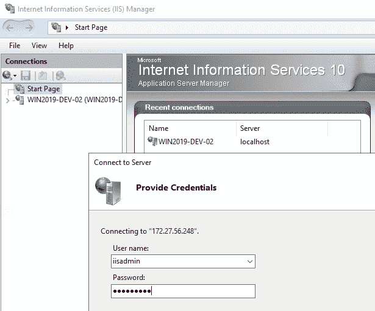

在这里，我可以像连接到远程服务器一样浏览应用程序池和网站层次结构：

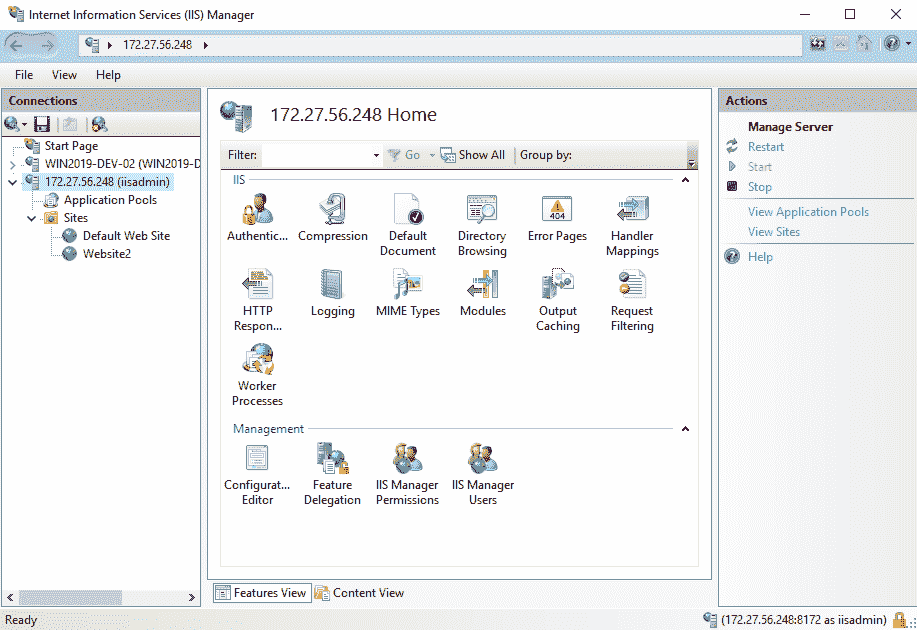

这是检查在 IIS 上运行的 IIS 或 ASP.NET 应用程序配置的良好方法。您可以检查虚拟目录设置、应用程序池和应用程序配置，但这应该仅用于调查目的。

如果我发现应用程序中的某些内容配置不正确，我需要回到 Dockerfile 中进行修复，而不是对正在运行的容器进行更改。当您将现有应用程序迁移到 Docker 时，这种技术可能非常有用。如果您在 Dockerfile 中安装了带有 Web 应用程序的 MSI，您将无法看到 MSI 实际执行的操作，但您可以连接到 IIS 管理器并查看结果。

# SQL Server 管理工作室（SSMS）

SSMS 更为直接，因为它使用标准的 SQL 客户端端口`1433`。您不需要公开任何额外的端口或启动任何额外的服务；来自 Microsoft 和本书的 SQL Server 镜像已经设置好了一切。您可以使用在运行容器时使用的`sa`凭据使用 SQL Server 身份验证进行连接。

此命令运行 SQL Server 2019 Express Edition 容器，将端口`1433`发布到主机，并指定`sa`凭据：

[PRE5]

这将发布标准的 SQL Server 端口`1433`，因此您有三种选项可以连接到容器内部的 SQL Server。

+   在主机上，使用`localhost`作为服务器名称。

+   在主机上，使用容器的 IP 地址作为服务器名称。

+   在远程计算机上，使用 Docker 主机的计算机名称或 AP 地址。

我已经获取了容器的 IP 地址，所以在 Docker 主机上的 SSMS 中，我只需指定 SQL 凭据：

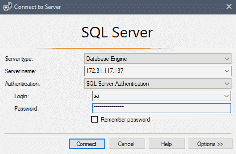

您可以像任何 SQL Server 一样管理这个 SQL 实例——创建数据库，分配用户权限，还原 Dacpacs，并运行 SQL 脚本。请记住，您所做的任何更改都不会影响镜像，如果您希望这些更改对新容器可用，您需要构建自己的镜像。

这种方法允许您通过 SSMS 构建数据库，如果这是您的首选，并在容器中运行而无需安装和运行 SQL Server。您可以完善架构，添加服务帐户和种子数据，然后将数据库导出为脚本。

我为一个简单的示例数据库做了这个，将架构和数据导出到一个名为`init-db.sql`的单个文件中。`dockeronwindows/ch08-mssql-with-schema:2e`的 Dockerfile 将 SQL 脚本打包到一个新的镜像中，并使用一个引导 PowerShell 脚本在创建容器时部署数据库：

[PRE6]

这里的 SQL Server 镜像中有一个`HEALTHCHECK`，这是一个好的做法——它让 Docker 检查数据库是否正常运行。在这种情况下，如果架构尚未创建，测试将失败，因此在架构部署成功完成之前，容器将不会报告为健康状态。

我可以以通常的方式从这个镜像运行一个容器：

[PRE7]

通过发布端口`1433`，数据库容器可以在主机上的随机端口上使用，因此我可以使用 SQL 客户端连接到数据库，并从脚本中查看架构和数据。

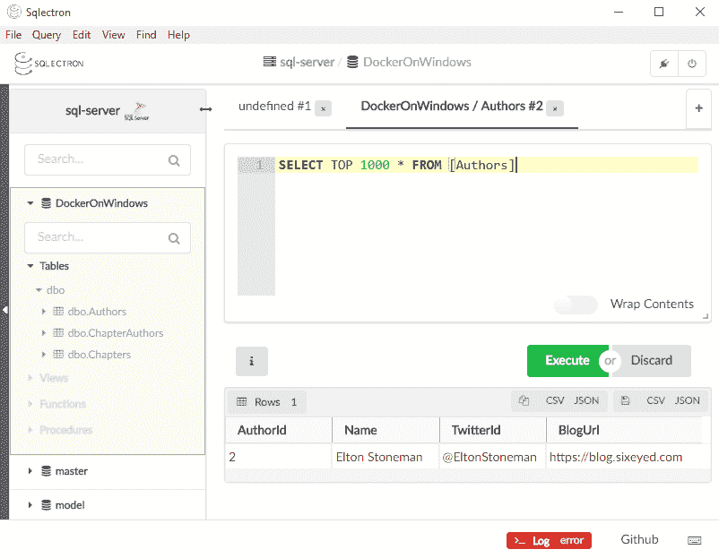

这代表了一个应用数据库的新部署，在这种情况下，我使用了 SQL Server 的开发版来制定我的架构，但是实际数据库使用了 SQL Server Express，所有这些都在 Docker 中运行，没有本地 SQL Server 实例。

如果您认为使用 SQL Server 身份验证是一个倒退的步骤，您需要记住 Docker 可以实现不同的运行时模型。您不会有一个运行多个数据库的单个 SQL Server 实例；如果凭据泄露，它们都可能成为目标。每个 SQL 工作负载将在一个专用容器中，具有自己的一组凭据，因此您实际上每个数据库都有一个 SQL 实例，并且您可能每个服务都有一个数据库。

通过在 Docker 中运行，可以增加安全性。除非您需要远程连接到 SQL Server，否则无需从 SQL 容器发布端口。需要数据库访问的任何应用程序都将作为容器在与 SQL 容器相同的 Docker 网络中运行，并且可以访问端口 `1433` 而无需将其发布到主机。这意味着 SQL 仅对在相同 Docker 网络中运行的其他容器可访问，在生产环境中，您可以使用 Docker 机密来获取连接详细信息。

如果您需要在 AD 帐户中使用 Windows 身份验证，您仍然可以在 Docker 中执行。容器在启动时可以加入域，因此您可以使用服务帐户来代替 SQL Server 身份验证。

# 事件日志

您可以将本地计算机上的事件查看器连接到远程服务器，但目前 Windows Server Core 或 Nano Server 映像上未启用远程事件日志服务。这意味着您无法使用事件查看器 UI 连接到容器并读取事件日志条目，但您可以使用服务器管理器 UI 进行操作，我将在下一节中介绍。

如果您只想读取事件日志，可以针对正在运行的容器执行 PowerShell cmdlet 以获取日志条目。此命令从我的数据库容器中读取 SQL Server 应用程序的两个最新事件日志条目：

[PRE8]

如果您遇到无法以其他方式诊断的容器问题，读取事件日志可能会很有用。但是，当您有数十个或数百个容器运行时，这种方法并不适用。最好将感兴趣的事件日志中继到控制台，以便 Docker 平台收集它们，并且您可以使用 `docker container logs` 或可以访问 Docker API 的管理工具来读取它们。

中继事件日志很容易做到，采用了与 第三章 *开发 Docker 化的 .NET Framework 和 .NET Core 应用程序* 中中继 IIS 日志类似的方法。对于写入事件日志的任何应用程序，您可以使用启动脚本作为入口点，该脚本运行应用程序，然后进入读取循环，从事件日志中获取条目并将其写入控制台。

这对于作为 Windows 服务运行的应用程序非常有用，这也是 Microsoft 在 SQL Server Windows 映像中使用的方法。Dockerfile 使用 PowerShell 脚本作为 `CMD`，该脚本以循环结束，调用相同的 `Get-EventLog` cmdlet 将日志中继到控制台：

[PRE9]

该脚本每 2 秒读取一次事件日志，获取自上次读取以来的任何条目，并将它们写入控制台。该脚本在 Docker 启动的进程中运行，因此日志条目被捕获并可以通过 Docker API 公开。

这并不是一个完美的方法——它使用了定时循环，只选择了日志中的一些数据，并且意味着在容器的事件日志和 Docker 中存储数据。如果您的应用程序已经写入事件日志，并且您希望将其 Docker 化而不需要重新构建应用程序，则这是有效的。在这种情况下，您需要确保您有一种机制来保持应用程序进程运行，比如 Windows 服务，并且在 Dockerfile 中进行健康检查，因为 Docker 只监视事件日志循环。

# 服务器管理器

服务器管理器是一个很好的工具，可以远程管理和监控服务器，并且它与基于 Windows Server Core 的容器配合良好。您需要采用类似的方法来管理 IIS 控制台，配置容器中具有管理员访问权限的用户，然后从主机连接。

就像 IIS 一样，您可以向镜像添加一个启用访问的脚本，这样您可以在需要时运行它。这比在镜像中始终启用远程访问更安全。该脚本只需要添加一个用户，配置服务器以允许管理员帐户进行远程访问，并确保**Windows 远程管理**（**WinRM**）服务正在运行：

[PRE10]

我有一个示例镜像展示了这种方法，`dockeronwindows/ch08-iis-with-server-manager:2e`。它基于 IIS，并打包了一个脚本来启用服务器管理器的远程访问。Dockerfile 还公开了 WinRM 使用的端口`5985`和`5986`。我可以启动一个在后台运行 IIS 的容器，然后启用远程访问：

[PRE11]

您可以使用容器的 IP 地址连接到服务器管理器，但容器没有加入域。服务器管理器将尝试通过安全通道进行身份验证并失败，因此您将收到 WinRM 身份验证错误。要添加一个未加入域的服务器，您需要将其添加为受信任的主机。受信任的主机列表需要使用容器的主机名，而不是 IP 地址，所以首先我会获取容器的主机名：

[PRE12]

我将在我的服务器的`hosts`文件中添加一个条目，位于`C:\Windows\system32\drivers\etc\hosts`：

[PRE13]

现在，我可以将容器添加到受信任的列表中。此命令需要在主机上运行，而不是在容器中运行。您正在将容器的主机名添加到本地计算机的受信任服务器列表中。我在我的 Windows Server 2019 主机上运行此命令：

[PRE14]

我正在运行 Windows Server 2019，但您也可以在 Windows 10 上使用服务器管理器。安装**远程服务器管理工具**（**RSAT**），您可以在 Windows 10 上以相同的方式使用服务器管理器。

在服务器管理器中，导航到所有服务器 | 添加服务器，并打开 DNS 选项卡。在这里，您可以输入容器的主机名，服务器管理器将解析 IP 地址：

选择服务器详细信息，然后单击“确定” - 现在服务器管理器将尝试连接到容器。您将在“所有服务器”选项卡中看到更新的状态，其中显示服务器已上线，但访问被拒绝。现在，您可以右键单击服务器列表中的容器，然后单击“以...身份管理”以提供本地管理员帐户的凭据。您需要将主机名指定为用户名的域部分。脚本中创建的本地用户名为`serveradmin`，但我需要使用`9c097d80c08b\serveradmin`进行身份验证：

现在连接成功了，您将在服务器管理器中看到来自容器的数据，包括事件日志条目、Windows 服务以及所有安装的角色和功能：

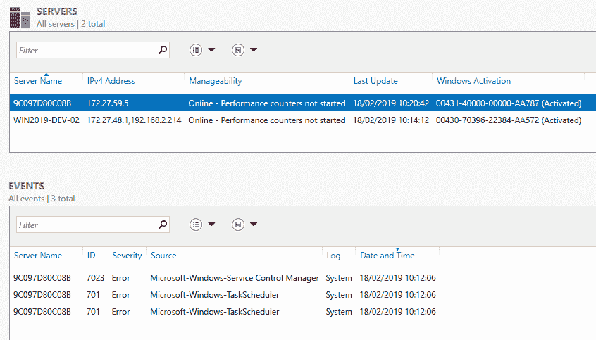

您甚至可以从远程服务器管理器 UI 向容器添加功能-但这不是一个好的做法。像其他 UI 管理工具一样，最好用它们进行探索和调查，而不是在 Dockerfile 中进行任何更改。

# 使用 Docker 工具管理容器

您已经看到可以使用现有的 Windows 工具来管理容器，但是这些工具可以做的事情并不总是适用于 Docker 世界。一个容器将运行一个单独的 Web 应用程序，因此 IIS Manager 的层次结构导航并不是很有用。在服务器管理器中检查事件日志可能是有用的，但将条目中继到控制台更有用，这样它们可以从 Docker API 中显示出来。

您的应用程序镜像还需要明确设置，以便访问远程管理工具，公开端口，添加用户和运行其他 Windows 服务。所有这些都增加了正在运行的容器的攻击面。您应该将这些现有工具视为在开发和测试环境中调试有用，但它们并不适合生产环境。

Docker 平台为在容器中运行的任何类型的应用程序提供了一致的 API，这为一种新类型的管理员界面提供了机会。在本章的其余部分，我将研究那些了解 Docker 并提供替代管理界面的管理工具。我将从一些开源工具开始，然后转向 Docker 企业中商业**容器即服务**（**CaaS**）平台。

# Docker 可视化工具

**可视化工具**是一个非常简单的 Web UI，显示 Docker 集群中节点和容器的基本信息。它是 GitHub 上`dockersamples/docker-swarm-visualizer`存储库中的开源项目。它是一个 Node.js 应用程序，并且它打包在 Linux 和 Windows 的 Docker 镜像中。

我在 Azure 中为本章部署了一个混合 Docker Swarm，其中包括一个 Linux 管理节点，两个 Linux 工作节点和两个 Windows 工作节点。我可以在管理节点上将可视化工具作为 Linux 容器运行，通过部署绑定到 Docker Engine API 的服务：

[PRE15]

该约束条件确保容器仅在管理节点上运行，由于我的管理节点运行在 Linux 上，我可以使用`mount`选项让容器与 Docker API 进行通信。在 Linux 中，您可以将套接字视为文件系统挂载，因此容器可以使用 API 套接字，而无需将其公开到**传输控制协议**（**TCP**）上。

您还可以在全 Windows 集群中运行可视化工具。Docker 目前支持 Windows 命名管道作为单个服务器上的卷，但在 Docker Swarm 中不支持；但是，您可以像我在第七章中使用 Traefik 一样，通过 TCP 挂载 API。

可视化工具为您提供了对集群中容器的只读视图。UI 显示主机和容器的状态，并为您提供了一种快速检查集群中工作负载分布的方式。这是我在 Azure 中部署 NerdDinner 堆栈的 Docker 企业集群的外观：

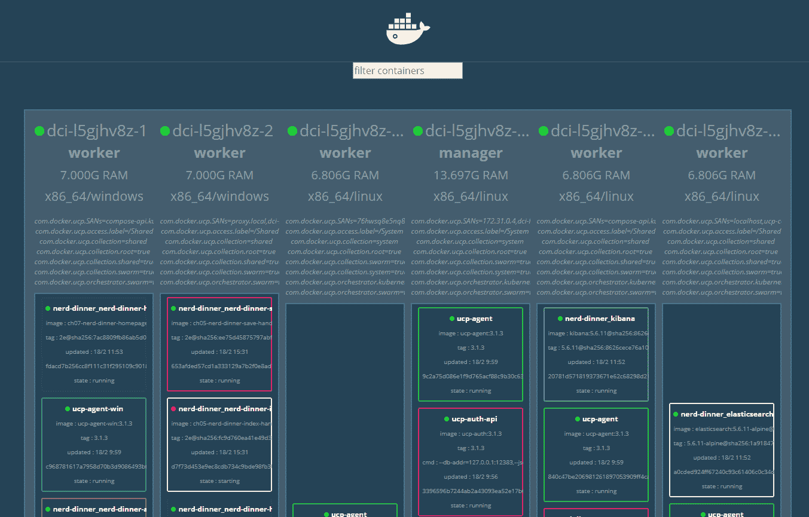

我一眼就能看到我的节点和容器是否健康，我可以看到 Docker 已经尽可能均匀地分布了容器。可视化器使用 Docker 服务中的 API，该 API 使用 RESTful 接口公开所有 Docker 资源。

Docker API 还提供了写访问权限，因此您可以创建和更新资源。一个名为**Portainer**的开源项目使用这些 API 提供管理功能。

# Portainer

Portainer 是 Docker 的轻量级管理 UI。它作为一个容器运行，可以管理单个 Docker 主机和以集群模式运行的集群。它是一个托管在 GitHub 上的开源项目，位于`portainer/portainer`存储库中。Portainer 是用 Go 语言编写的，因此它是跨平台的，您可以将其作为 Linux 或 Windows 容器运行。

Portainer 有两个部分：您需要在每个节点上运行一个代理，然后运行管理 UI。所有这些都在容器中运行，因此您可以使用 Docker Compose 文件，例如本章源代码中的`ch08-portainer`中的文件。Compose 文件定义了一个全局服务，即 Portainer 代理，在集群中的每个节点上都在容器中运行。然后是 Portainer UI：

[PRE16]

Docker Hub 上的`portainer/portainer`镜像是一个多架构镜像，这意味着您可以在 Linux 和 Windows 上使用相同的镜像标签，Docker 将使用与主机操作系统匹配的镜像。您无法在 Windows 上挂载 Docker 套接字，但 Portainer 文档会向您展示如何在 Windows 上访问 Docker API。

当您首次浏览到 Portainer 时，您需要指定管理员密码。然后，服务将连接到 Docker API 并显示有关所有资源的详细信息。在集群模式下，我可以看到集群中节点的数量，堆栈的数量，正在运行的服务和容器的数量，以及集群中的镜像、卷和网络。

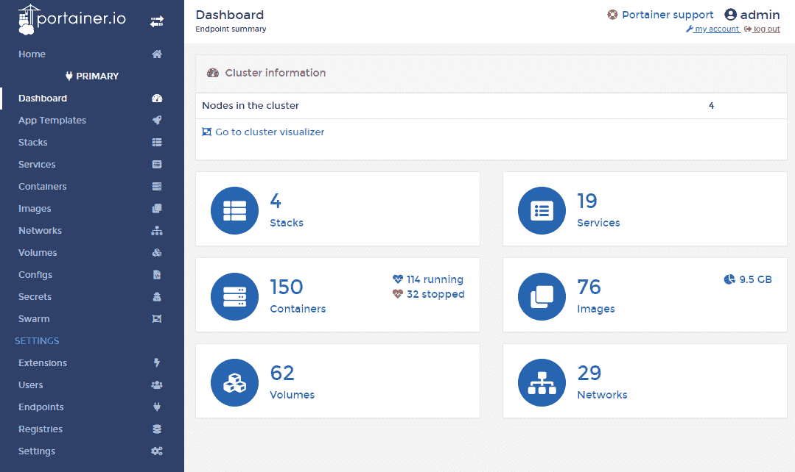

集群可视化器链接显示了一个非常类似于 Docker Swarm 可视化器的 UI，显示了每个节点上运行的容器：

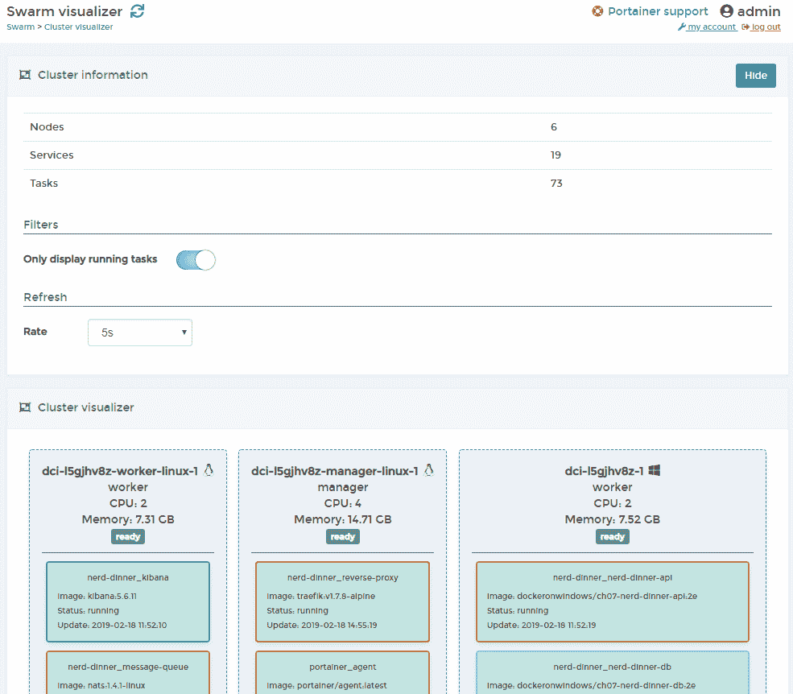

服务视图向我展示了所有正在运行的服务，从这里，我可以深入了解服务的详细信息，并且有一个快速链接来更新服务的规模：

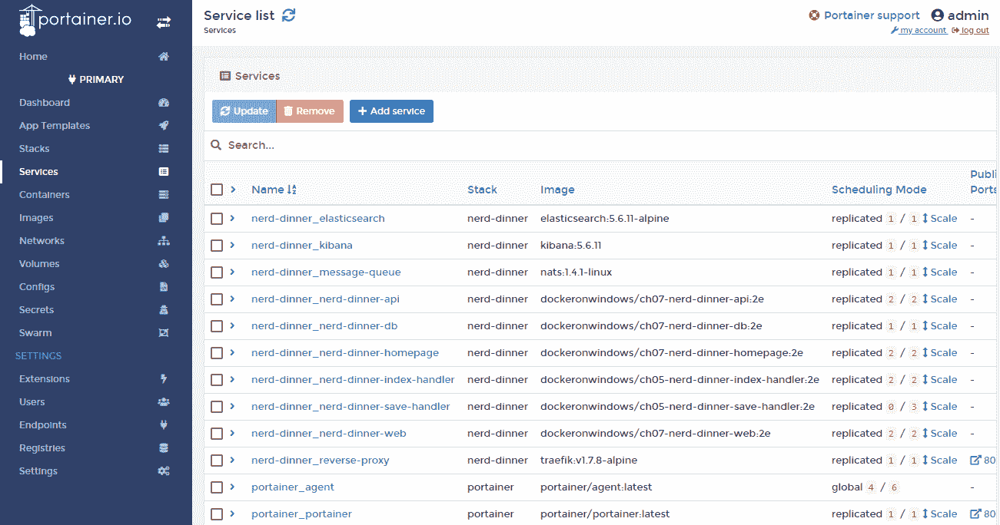

Portainer 随着新的 Docker 功能不断发展，您可以从 Portainer 部署堆栈和服务并对其进行管理。您可以深入了解服务日志，连接到容器的控制台会话，并从内置 UI 中部署 Docker Compose 模板的常见应用程序。

您可以在 Portainer 中创建多个用户和团队，并对资源应用访问控制。您可以创建仅限于某些团队访问的服务。认证由 Portainer 通过本地用户数据库或连接到现有的轻量级目录访问协议（LDAP）提供者进行管理。

Portainer 是一个很棒的工具，也是一个活跃的开源项目，但在采用它作为管理工具之前，您应该评估最新版本。Portainer 最初是一个 Linux 工具，仍然有一些 Windows 功能不完全支持的地方。在撰写本文时，代理容器需要在 Windows 节点上进行特殊配置，这意味着您无法将其部署为跨整个群集的全局服务，并且没有它，您无法在 Portainer 中看到 Windows 容器。

在生产环境中，您可能需要运行具有支持的软件。Portainer 是开源的，但也提供了商业支持选项。对于企业部署或具有严格安全流程的环境，Docker Enterprise 提供了完整的功能集。

# 使用 Docker Enterprise 的 CaaS

Docker Enterprise 是 Docker，Inc.的商业版本。它是一个完整的 CaaS 平台，充分利用 Docker 提供单一的管理界面，用于管理任意数量的运行在任意数量主机上的容器。

Docker Enterprise 是一个在数据中心或云中运行的生产级产品。集群功能支持多个编排器，包括 Kubernetes 和 Docker Swarm。在生产中，您可以拥有一个包含 100 个节点的集群，使用与您的开发笔记本相同的应用程序平台作为单节点集群运行。

Docker Enterprise 有两个部分。其中一个是**Docker Trusted Registry**（**DTR**），它类似于运行您自己的私有 Docker Hub 实例，包括图像签名和安全扫描。当我在 Docker 的安全性方面进行讨论时，我将在第九章中涵盖 DTR，*理解 Docker 的安全风险和好处*。管理组件称为**Universal Control Plane**（**UCP**），它是一种新型的管理界面。

# 理解 Universal Control Plane

UCP 是一个基于 Web 的界面，用于管理节点、图像、服务、容器、秘密和所有其他 Docker 资源。UCP 本身是一个分布式应用程序，运行在 swarm 中连接的服务中的容器中。UCP 为您提供了一个统一的地方来以相同的方式管理所有 Docker 应用程序。它提供了基于角色的访问控制，以便您可以对谁可以做什么进行细粒度的控制。

Docker Enterprise 运行 Kubernetes 和 Docker Swarm。Kubernetes 将在未来的版本中支持 Windows 节点，因此您将能够在单个 Docker Enterprise 集群上将 Windows 容器部署到 Docker Swarm 或 Kubernetes。您可以使用 Docker Compose 文件将堆栈部署到 UCP，将目标设置为 Docker Swarm 或 Kubernetes，UCP 将创建所有资源。

UCP 为您提供了完整的管理功能：您可以创建、扩展和删除服务，检查并连接到运行服务的任务，并管理运行 swarm 的节点。您需要的所有其他资源，如 Docker 网络、配置、秘密和卷，都以相同的方式在 UCP 中进行管理。

您可以在 UCP 和 DTR 的 Linux 节点上运行混合 Docker Enterprise 集群，并在 Windows 节点上运行用户工作负载。作为 Docker 的订阅服务，您可以得到 Docker 团队的支持，他们将为您设置集群并处理任何问题，涵盖所有的 Windows 和 Linux 节点。

# 导航 UCP UI

您可以从主页登录到 UCP。您可以使用 Docker Enterprise 内置的身份验证，手动管理 UCP 中的用户，或者连接到任何 LDAP 身份验证存储。这意味着您可以设置 Docker Enterprise 来使用您组织的 AD，并让用户使用他们的 Windows 帐户登录。

UCP 主页是一个仪表板，显示了集群的关键性能指标，节点数、服务数，以及在那一刻运行的 Swarm 和 Kubernetes 服务，以及集群的整体计算利用率：

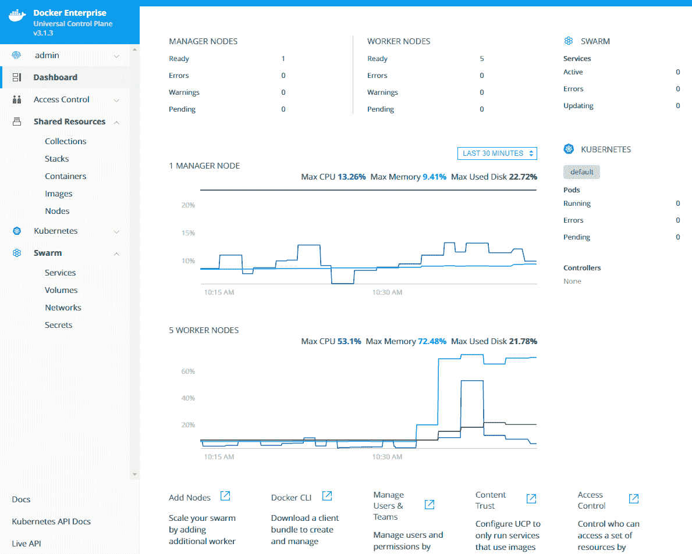

从仪表板，您可以导航到资源视图，按资源类型分组访问：服务、容器、镜像、节点、网络、卷和秘密。对于大多数资源类型，您可以列出现有资源、检查它们、删除它们，并创建新的资源。

UCP 是一个多编排器容器平台，因此您可以在同一集群中在 Kubernetes 中运行一些应用程序，而在 Docker Swarm 中运行其他应用程序。导航栏中的共享资源部分显示了编排器之间共享的资源，包括镜像、容器和堆栈。这是支持异构交付的一个很好的方法，或者在受控环境中评估不同的编排器。

UCP 为所有资源提供了基于角色的访问控制（RBAC）。您可以将权限标签应用于任何资源，并根据该标签来保护访问。团队可以被分配到标签的权限，从无访问权限到完全控制权限不等，这样可以确保团队成员对拥有这些标签的所有资源的访问权限。

# 管理节点

节点视图显示了集群中的所有节点，列出了操作系统和 CPU 架构、节点状态和节点管理器状态：

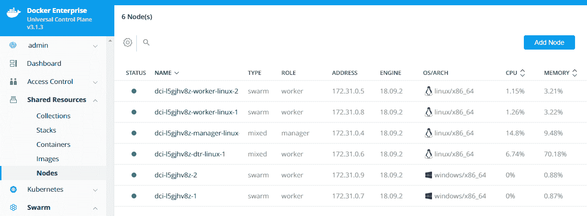

我的集群中有六个节点：

+   用于混合工作负载的两个 Linux 节点：这些节点可以运行 Kubernetes 或 Docker Swarm 服务

+   仅配置为 Docker Swarm 服务的两个 Linux 节点

+   两个仅用于 Docker Swarm 的 Windows 节点

这些节点正在运行所有 UCP 和 DTR 容器。Docker Enterprise 可以配置免除管理节点运行用户工作负载，也可以对运行 DTR 进行同样的配置。这是一个很好的方法，可以为 Docker Enterprise 服务划定计算资源的边界，以确保您的应用工作负载不会使管理组件资源匮乏。

在节点管理中，您可以以图形方式查看和管理您可以访问的集群服务器。您可以将节点放入排水模式，从而可以运行 Windows 更新或升级节点上的 Docker。您可以将工作节点提升为管理节点，将管理节点降级为工作节点，并查看加入新节点到集群所需的令牌。

深入了解每个节点，您可以查看服务器的总 CPU、内存和磁盘使用情况，并显示使用情况的图表，您可以将其聚合为 30 分钟到 24 小时的时间段：

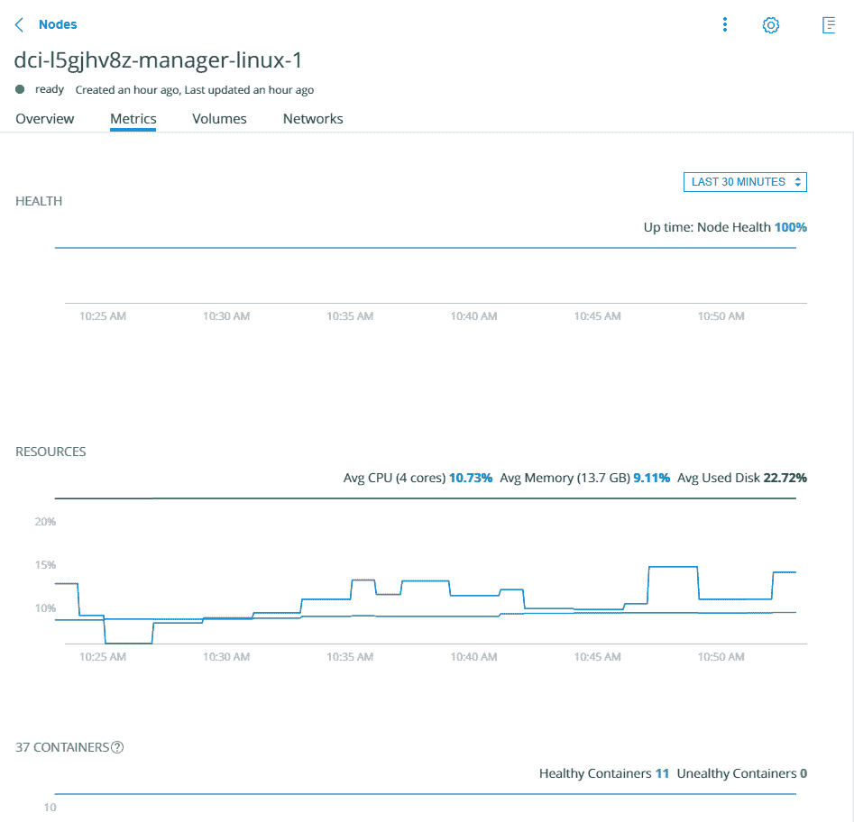

在指标选项卡中，列出了节点上的所有容器，显示它们的当前状态以及容器正在运行的镜像。从容器列表中，您可以导航到容器视图，我将很快介绍。

# 卷

**卷**存在于节点级别而不是集群级别，但您可以在 UCP 中管理它们跨所有集群节点。您在集群中管理卷的方式取决于您使用的卷的类型。本地卷适用于诸如将日志和指标写入磁盘然后将其集中转发的全局服务等场景。

作为集群服务运行的持久数据存储也可以使用本地存储。您可以在每个节点上创建一个本地卷，但在具有高容量 RAID 阵列的服务器上添加标签。创建数据服务时，您可以使用约束将其限制为 RAID 节点，因此其他节点永远不会在其上安排任务，并且任务运行的地方将数据写入 RAID 阵列上的卷。

对于本地数据中心和云中，您可以使用卷插件与共享存储。使用共享存储，即使容器移动到不同的集群节点，服务也可以继续访问数据。服务任务将读取和写入数据到持久保存在共享存储设备上的卷中。Docker Store 上有许多卷插件可用，包括用于云服务的 AWS 和 Azure，来自 HPE 和 Nimble 的物理基础设施，以及 vSphere 等虚拟化平台。

Docker Enterprise 使用 Cloudstor 插件提供集群范围的存储，如果您使用 Docker Certified Infrastructure 部署，那么这将为您配置。在撰写本文时，该插件仅受 Linux 节点支持，因此 Windows 节点受限于运行本地卷。在 Docker Swarm 中仍然有许多有状态的应用程序架构可以很好地工作，但您需要仔细配置它们。

存储是容器生态系统中受到很多关注的领域。正在出现的技术可以创建集群范围的存储选项，而无需特定的基础设施。随着这些技术的成熟，您将能够通过汇集集群上的磁盘来运行具有高可用性和可扩展性的有状态服务。

卷有有限数量的选项，因此创建它们是指定驱动程序并应用任何驱动程序选项的情况：

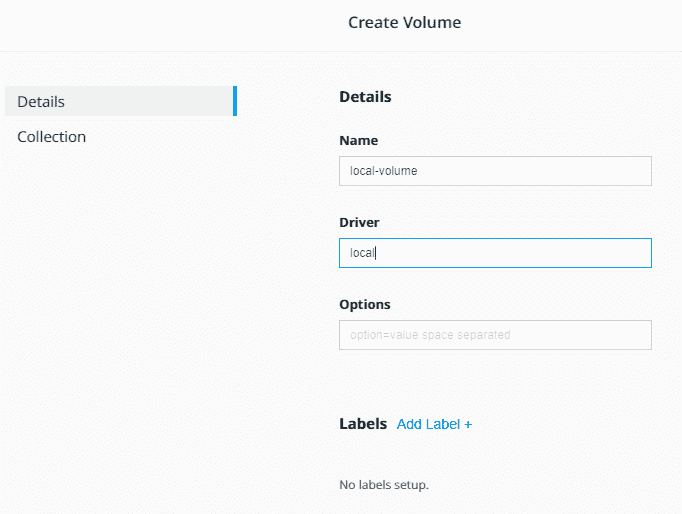

权限可以应用于卷，如其他资源一样，通过指定资源所属的集合。集合是 UCP 如何强制基于角色的访问控制以限制访问的方式。

本地卷在每个节点上创建，因此需要命名卷的容器可以在任何节点上运行并仍然找到卷。在 UCP 创建的混合 Swarm 中，本地卷在每个节点上创建，并显示挂载卷数据的服务器的物理位置：

UCP 为您提供了集群中所有资源的单一视图，包括每个节点上的卷和可用于运行容器的图像。

# 图像

UCP 不是图像注册表。DTR 是 Docker Enterprise 中的企业私有注册表，但您可以使用 UCP 管理在每个节点上的 Docker 缓存中的图像。在图像视图中，UCP 会显示已在集群节点上拉取的图像，并允许您拉取图像，这些图像会下载到每个节点上：

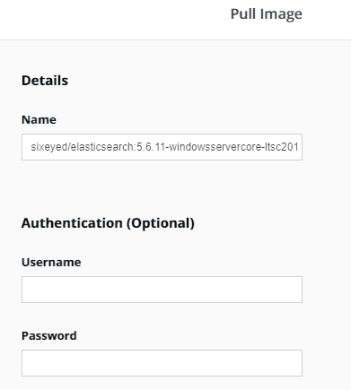

Docker 图像经过压缩以进行分发，当您拉取图像时，Docker 引擎会解压缩图层。有特定于操作系统的优化，可以在拉取完成后立即启动容器，这就是为什么您无法在 Linux 主机上拉取 Windows 图像，反之亦然。UCP 将尝试在每个主机上拉取图像，但如果由于操作系统不匹配而导致某些主机失败，它将继续进行剩余节点。如果存在不匹配，您将看到错误：

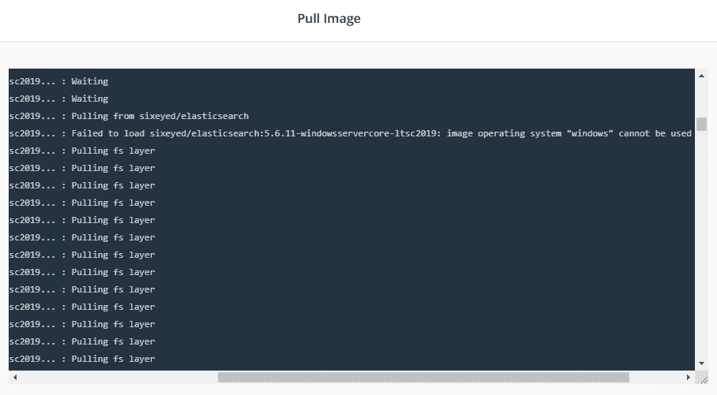

在图像视图中，您可以深入了解图像的详细信息，包括图层的历史记录，健康检查，任何环境变量和暴露的端口。基本详细信息还会显示图像的操作系统平台，虚拟大小和创建日期：

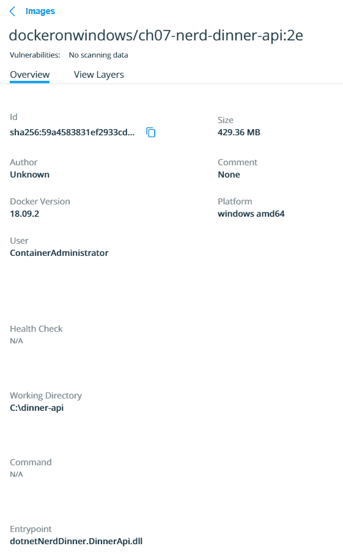

在 UCP 中，您还可以从集群中删除图像。您可能有一个保留集群上当前和先前图像版本的策略，以允许回滚。其他图像可以安全地从 Docker Enterprise 节点中删除，将所有先前的图像版本留在 DTR 中，以便在需要时拉取。

# 网络

网络管理很简单，UCP 呈现与其他资源类型相同的界面。网络列表显示了集群中的网络，这些网络可以添加到应用了 RBAC 的集合中，因此您只能看到您被允许看到的网络。

有几个网络的低级选项，允许您指定 IPv6 和自定义 MTU 数据包大小。Swarm 模式支持加密网络，在节点之间的流量被透明加密，可以通过 UCP 启用。在 Docker Enterprise 集群中，您将使用覆盖驱动程序允许服务在集群节点之间的虚拟网络中进行通信：

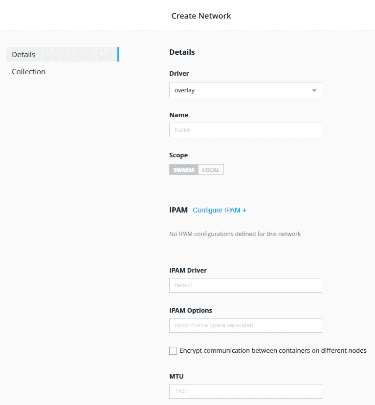

Docker 支持一种特殊类型的 Swarm 网络，称为**入口网络**。入口网络具有用于外部请求的负载平衡和服务发现。这使得端口发布非常灵活。在一个 10 节点的集群上，您可以在具有三个副本的服务上发布端口`80`。如果一个节点收到端口`80`的传入请求，但它没有运行服务任务，Docker 会智能地将其重定向到运行任务的节点。

入口网络是 Docker Swarm 集群中 Linux 和 Windows 节点的强大功能。我在第七章中更详细地介绍了它们，*使用 Docker Swarm 编排分布式解决方案*。

网络也可以通过 UCP 删除，但只有在没有附加的容器时才能删除。如果您定义了使用网络的服务，那么如果您尝试删除它，您将收到警告。

# 部署堆栈

使用 UCP 部署应用程序有两种方式，类似于使用`docker service create`部署单个服务和使用`docker stack deploy`部署完整的 compose 文件。堆栈是最容易部署的，可以让您使用在预生产环境中验证过的 compose 文件。

在本章的源代码中，文件夹`ch08-docker-stack`包含了在 Docker Enterprise 上运行 NerdDinner 的部署清单，使用了 swarm 模式。`core docker-compose.yml`文件与第七章中提到的相同，*使用 Docker Swarm 编排分布式解决方案*，但在覆盖文件中有一些更改以部署到我的生产集群。我正在利用我在 Docker Enterprise 中拥有的混合集群，并且我正在为所有开源基础设施组件使用 Linux 容器。

要使服务使用 Linux 容器而不是 Windows，只有两个更改：镜像名称和部署约束，以确保容器被安排在 Linux 节点上运行。以下是文件`docker-compose.hybrid-swarm.yml`中 NATS 消息队列的覆盖：

[PRE17]

我使用了与第七章相同的方法，*使用 Docker Swarm 编排分布式解决方案*，使用`docker-compose config`将覆盖文件连接在一起并将它们导出到`docker-swarm.yml`中。我可以将我的 Docker CLI 连接到集群并使用`docker stack deploy`部署应用程序，或者我可以使用 UCP UI。从堆栈视图中，在共享资源下，我可以点击创建堆栈，并选择编排器并上传一个 compose YML 文件：

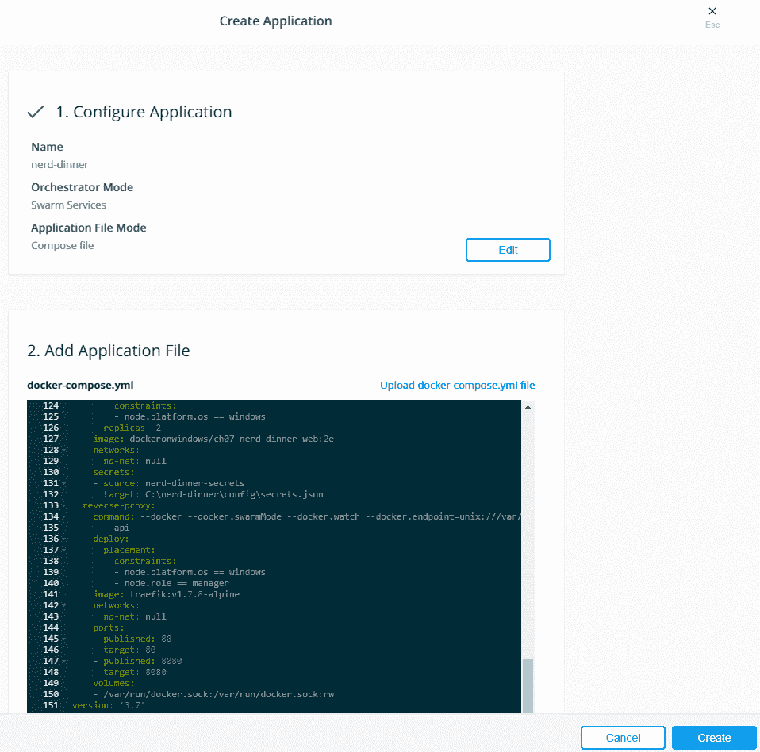

UCP 验证内容并突出显示任何问题。有效的组合文件将部署为堆栈，并且您将在 UCP 中看到所有资源：网络、卷和服务。几分钟后，我的应用程序的所有图像都被拉到集群节点上，并且 UCP 为每个服务安排了副本。服务列表显示所有组件都以所需的规模运行：

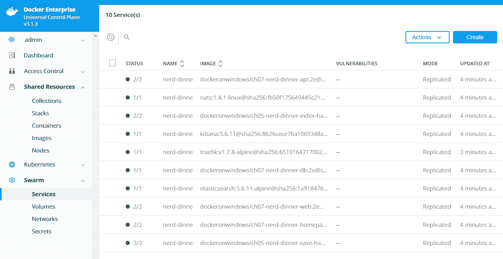

我的现代化 NerdDinner 应用程序现在在一个六节点的 Docker Enterprise 集群中运行了 15 个容器。我在受支持的生产环境中实现了高可用性和扩展性，并且将四个开源组件从我的自定义镜像切换到了官方的 Docker 镜像，而不需要对我的应用程序镜像进行任何更改。

堆栈是首选的部署模型，因为它们继续使用已知的 compose 文件格式，并自动化所有资源。但堆栈并不适用于每种解决方案，特别是当您将传统应用程序迁移到容器时。在堆栈部署中，无法保证服务创建的顺序；Docker Compose 使用的 `depends_on` 选项不适用。这是一种有意设计的决策，基于服务应该具有弹性的想法，但并非所有服务都是如此。

现代应用程序应该设计成可以容忍故障。如果 web 组件无法连接到数据库，它应该使用基于策略的重试机制来重复连接，而不是无法启动。传统的应用程序通常期望它们的依赖可用，并没有优雅的重试机制。NerdDinner 就是这样，所以如果我从 compose 文件部署一个堆栈，web 应用可能会在数据库服务创建之前启动，然后失败。

在这种情况下，容器应该退出，这样 Docker 就知道应用程序没有在运行。然后它将安排一个新的容器运行，并在启动时，依赖项应该是可用的。如果不是，新容器将结束，Docker 将安排一个替代品，并且这将一直持续下去，直到应用程序正常工作。如果您的传统应用程序没有任何依赖检查，您可以将这种逻辑构建到 Docker 镜像中，使用 Dockerfile 中的启动检查和健康检查。

在某些情况下，这可能是不可能的，或者可能是新容器的重复启动会导致您的传统应用程序出现问题。您仍然可以手动创建服务，而不是部署堆栈。UCP 也支持这种工作流程，这样可以手动确保所有依赖项在启动每个服务之前都在运行。

这是管理应用程序的命令式方法，你真的应该尽量避免使用。更好的方法是将应用程序清单封装在一组简单的 Docker Compose 文件中，这样可以在源代码控制中进行管理，但对于一些传统的应用程序可能会很难做到这一点。

# 创建服务

`docker service create`命令有数十个选项。UCP 在引导式 UI 中支持所有这些选项，您可以从服务视图中启动。首先，您需要指定基本细节，比如用于服务的镜像名称；服务名称，其他服务将通过该名称发现此服务；以及命令参数，如果您想要覆盖镜像中的默认启动命令。

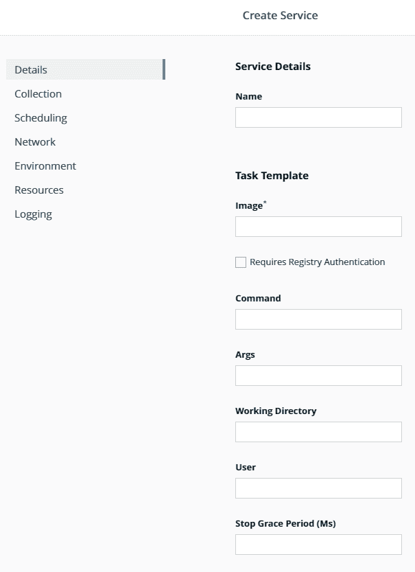

我不会覆盖所有细节；它们与`docker service create`命令中的选项相对应，但是值得关注的是调度选项卡。这是您设置服务模式为复制或全局，添加所需副本数量以及滚动更新配置的地方。

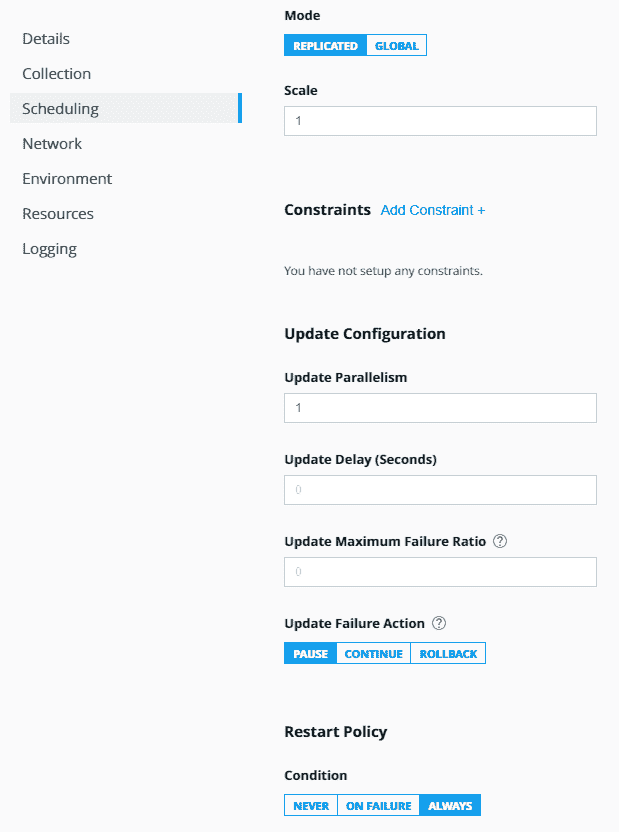

重启策略默认为始终。这与副本计数一起工作，因此如果任何任务失败或停止，它们将被重新启动以维持服务水平。您可以配置自动部署的更新设置，还可以添加调度约束。约束与节点标签一起工作，限制可以用于运行服务任务的节点。您可以使用此功能将任务限制为高容量节点或具有严格访问控制的节点。

在其他部分，您可以配置服务与集群中其他资源的集成方式，包括网络和卷、配置和秘密，还可以指定计算保留和限制。这使您可以将服务限制在有限的 CPU 和内存量上，并且还可以指定每个容器应具有的 CPU 和内存的最小份额。

当您部署服务时，UCP 会负责将镜像拉取到需要的任何节点上，并启动所需数量的容器。对于全局服务，每个节点将有一个容器，对于复制服务，将有指定数量的任务。

# 监控服务

UCP 允许您以相同的方式部署任何类型的应用程序，可以使用堆栈组合文件或创建服务。该应用程序可以使用多个服务，任何技术组合都可以——NerdDinner 堆栈的部分现在正在我的混合集群中的 Linux 上运行。我已经部署了 Java、Go 和 Node.js 组件作为 Linux 容器，以及.NET Framework 和.NET Core 组件作为 Windows 容器在同一个集群上运行。

所有这些不同的技术平台都可以通过 UCP 以相同的方式进行管理，这就是使其成为对于拥有大型应用程序资产的公司如此宝贵的平台。服务视图显示了所有服务的基本信息，例如总体状态、任务数量以及上次报告错误的时间。对于任何服务，您都可以深入到详细视图，显示有关服务的所有信息。

这是核心 NerdDinner ASP.NET Web 应用程序的概述选项卡：

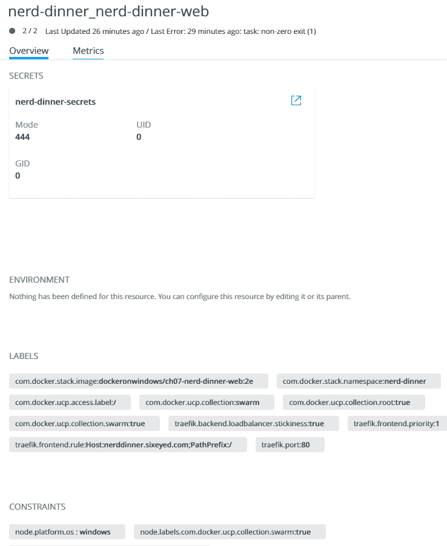

我已经滚动了这个视图，这样我就可以看到服务可用的秘密，以及环境变量（在这种情况下没有），标签，其中包括 Traefik 路由设置和约束，包括平台约束，以确保其在 Windows 节点上运行。指标视图向我显示了 CPU 和内存使用情况的图表，以及所有正在运行的容器的列表。

您可以使用服务视图来检查服务的总体状态并进行更改-您可以添加环境变量，更改网络或卷，并更改调度约束。对服务定义所做的任何更改都将通过重新启动服务来实施，因此您需要了解应用程序的影响。无状态应用程序和优雅处理瞬态故障的应用程序可以在运行时进行修改，但可能会有应用程序停机时间-这取决于您的解决方案架构。

您可以调整服务的规模，而无需重新启动现有任务。只需在调度选项卡中指定新的规模级别，UCP 将创建或删除容器以满足服务水平：

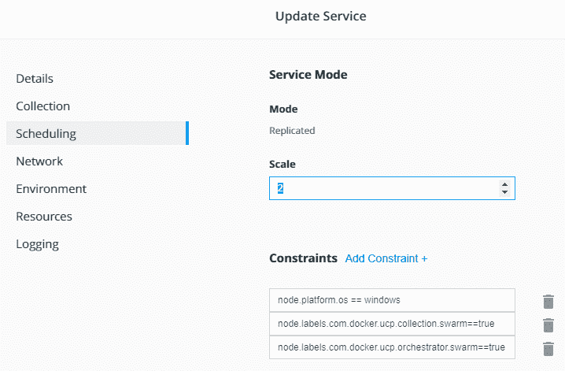

当您增加规模时，现有的容器将被保留，新的容器将被添加，因此这不会影响您的应用程序的可用性（除非应用程序将状态保留在单独的容器中）。

从服务视图或容器列表中，在共享资源下，您可以选择一个任务来深入了解容器视图，这就是一致的管理体验，使得管理 Docker 化应用程序变得如此简单。显示了运行容器的每个细节，包括配置和容器内的实际进程列表。这是我的 Traefik 代理的容器，它只运行了`traefik`进程：

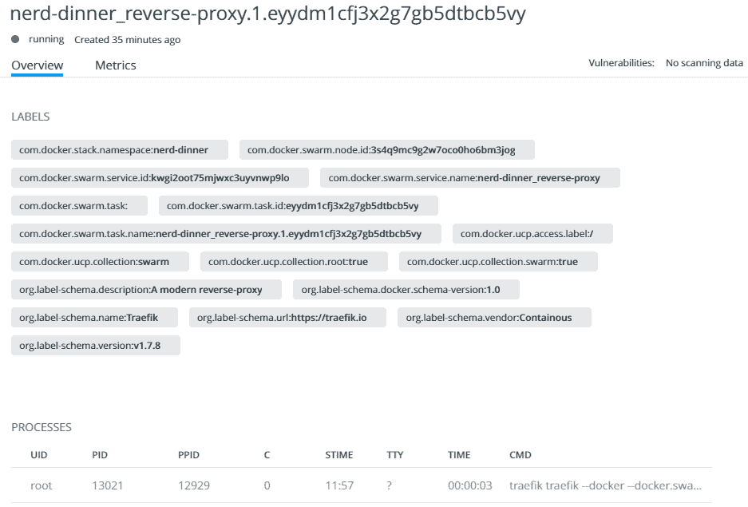

您可以阅读容器的日志，其中显示了容器标准输出流的所有输出。这些是 Elasticsearch 的日志，它是一个 Java 应用程序，因此这些日志是以`log4j`格式的：

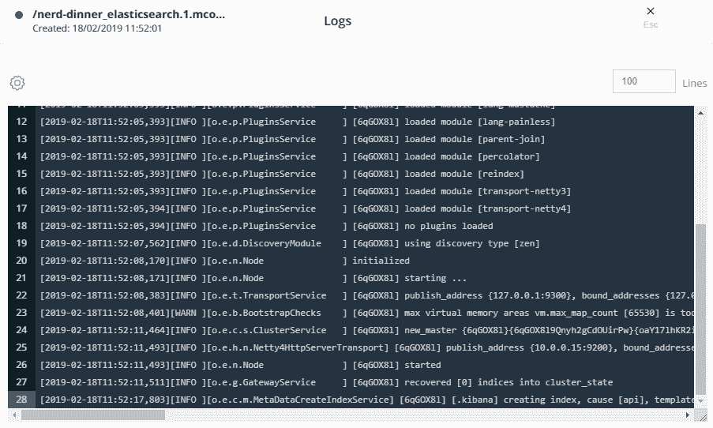

您可以以相同的方式查看集群中任何容器的日志，无论是在最小的 Linux 容器中运行的新 Go 应用程序，还是在 Windows 容器中运行的传统 ASP.NET 应用程序。这就是为什么构建 Docker 镜像以便将应用程序的日志条目中继到控制台是如此重要的原因。

甚至可以连接到容器中运行的命令行 shell，如果需要排除问题。这相当于在 Docker CLI 中运行`docker container exec -it powershell`，但都是从 UCP 界面进行的，因此您不需要连接到集群上的特定节点。您可以运行容器镜像中安装的任何 shell，在 Kibana Linux 镜像中，我可以使用`bash`：

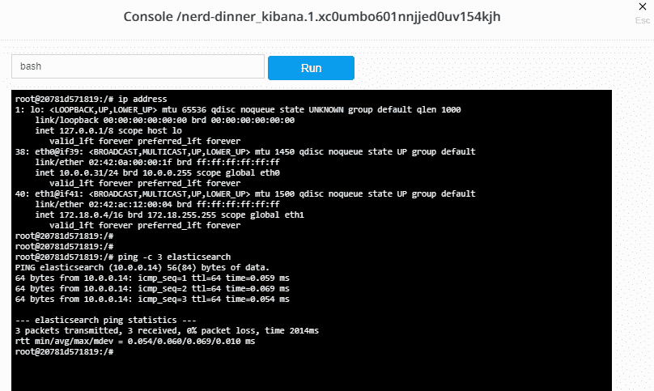

UCP 为您提供了一个界面，让您可以从集群的整体健康状态，通过所有运行服务的状态，到特定节点上运行的个别容器。您可以轻松监视应用程序的健康状况，检查应用程序日志，并连接到容器进行调试 - 这一切都在同一个管理界面中。您还可以下载一个**客户端捆绑包**，这是一组脚本和证书，您可以使用它们来从远程 Docker **命令行界面**（**CLI**）客户端安全地管理集群。

客户端捆绑脚本将您的本地 Docker CLI 指向在集群管理器上运行的 Docker API，并为安全通信设置客户端证书。证书标识了 UCP 中的特定用户，无论他们是在 UCP 中创建的还是外部 LDAP 用户。因此，用户可以登录到 UCP UI 或使用`docker`命令来管理资源，对于这两种选项，他们将具有 UCP RBAC 策略定义的相同访问权限。

# RBAC

UCP 中的授权为您提供对所有 Docker 资源的细粒度访问控制。UCP 中的 RBAC 是通过为主体创建对资源集的访问授权来定义的。授权的主体可以是单个用户、一组用户或包含许多团队的组织。资源集可以是单个资源，例如 Docker Swarm 服务，也可以是一组资源，例如集群中的所有 Windows 节点。授权定义了访问级别，从无访问权限到完全控制。

这是一种非常灵活的安全方法，因为它允许您在公司的任何级别强制执行安全规则。我可以采用应用程序优先的方法，其中我有一个名为`nerd-dinner`的资源集合，代表 NerdDinner 应用程序，这个集合是其他代表部署环境的集合的父级：生产、UAT 和系统测试。集合层次结构在此图表的右侧：

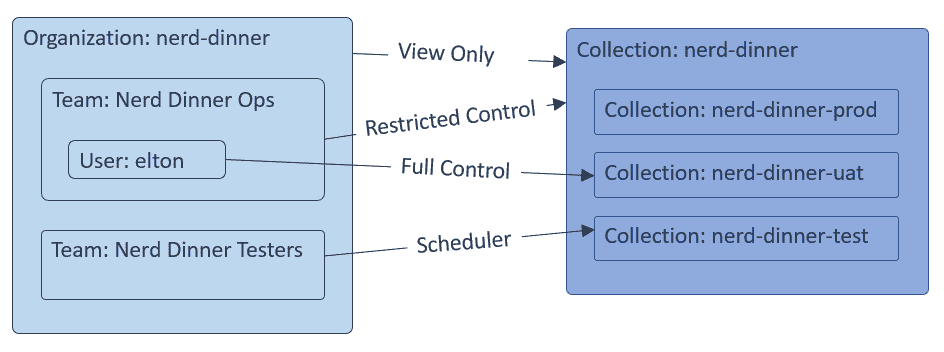

集合是资源的组合 - 因此，我会将每个环境部署为一个堆栈，其中所有资源都属于相关的集合。组织是用户的最终分组，在这里我在左侧显示了一个**nerd-dinner**组织，这是所有在 NerdDinner 上工作的人的分组。在组织中，有两个团队：**Nerd Dinner Ops**是应用程序管理员，**Nerd Dinner Testers**是测试人员。在图表中只显示了一个用户**elton**，他是**Nerd Dinner Ops**团队的成员。

这种结构让我可以创建授权，以便在不同级别为不同资源提供访问权限：

+   **nerd-dinner**组织对**nerd-dinner**集合具有**仅查看**权限，这意味着组织中任何团队的任何用户都可以列出并查看任何环境中任何资源的详细信息。

+   **Nerd Dinner Ops**团队还对**nerd-dinner**集合具有**受限控制**，这意味着他们可以在任何环境中运行和管理资源。

+   **Nerd Dinner Ops**团队中的用户**elton**还对**nerd-dinner-uat**集合拥有**完全控制**，这为 UAT 环境中的资源提供了完全的管理员控制。

+   **Nerd Dinner Testers**团队对**nerd-dinner-test**集合具有**调度程序**访问权限，这意味着团队成员可以管理测试环境中的节点。

Docker Swarm 集合的默认角色是**仅查看**，**受限控制**，**完全控制**和**调度器**。您可以创建自己的角色，并为特定类型的资源设置特定权限。

您可以在 UCP 中创建授权以创建将主体与一组资源链接起来的角色，从而赋予它们已知的权限。我已在我的 Docker Enterprise 集群中部署了安全访问图表，并且我可以看到我的授权以及默认的系统授权：

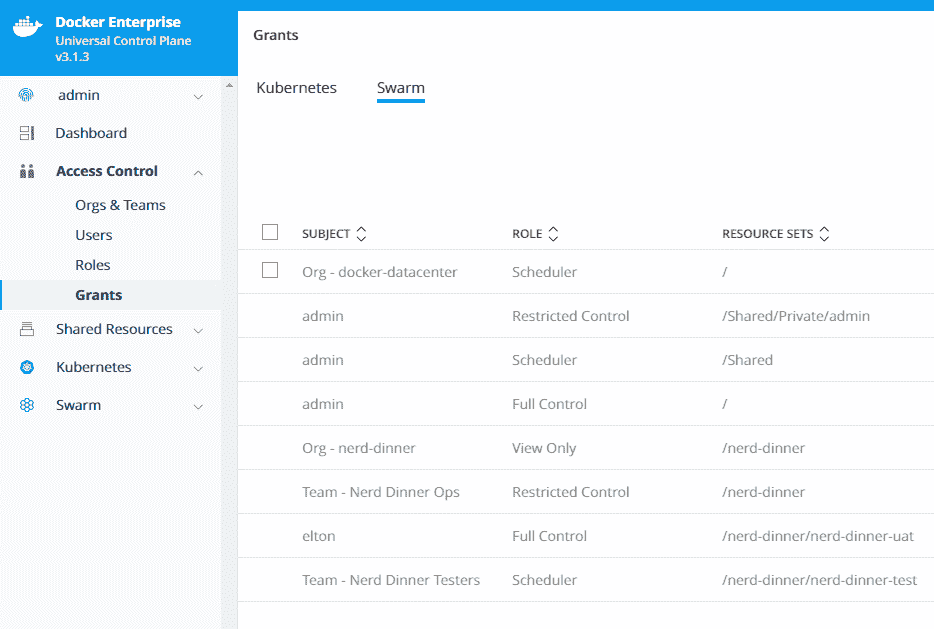

您可以独立于要保护的资源创建授权和集合。然后，在创建资源时，通过添加标签指定集合，标签的键为`com.docker.ucp.access.label`，值为集合名称。您可以在 Docker 的创建命令中以命令方式执行此操作，在 Docker Compose 文件中以声明方式执行此操作，并通过 UCP UI 执行此操作。在这里，我指定了反向代理服务属于`nerd-dinner-prod`集合：

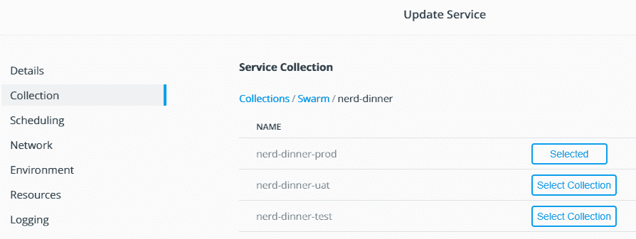

如果我以 Nerd Dinner Testers 团队成员的身份登录 UCP，我只会看到一个服务。测试用户无权查看默认集合中的服务，只有代理服务明确放入了`nerd-dinner-prod`集合中：

作为这个用户，我只有查看权限，所以如果我尝试以任何方式修改服务，比如重新启动它，我会收到错误提示：

团队可以对不同的资源集拥有多个权限，用户可以属于多个团队，因此 UCP 中的授权系统足够灵活，适用于许多不同的安全模型。您可以采用 DevOps 方法，为特定项目构建集合，所有团队成员都可以完全控制项目资源，或者您可以有一个专门的管理员团队，完全控制一切。或者您可以拥有单独的开发团队，团队成员对他们工作的应用程序有受限控制。

RBAC 是 UCP 的一个重要功能，它补充了 Docker 更广泛的安全故事，我将在第九章中介绍，*理解 Docker 的安全风险和好处*。

# 总结

本章重点介绍了运行 Docker 化解决方案的操作方面。我向您展示了如何将现有的 Windows 管理工具与 Docker 容器结合使用，以及这对于调查和调试是如何有用的。主要重点是使用 Docker Enterprise 中的 UCP 来管理各种工作负载的新方法。

您学会了如何使用现有的 Windows 管理工具，比如 IIS 管理器和服务器管理器，来管理 Docker 容器，您也了解了这种方法的局限性。在开始使用 Docker 时，坚持使用您已知的工具可能是有用的，但专门的容器管理工具是更好的选择。

我介绍了两种开源选项来管理容器：简单的可视化工具和更高级的 Portainer。它们都作为容器运行，并连接到 Docker API，它们是在 Linux 和 Windows Docker 镜像中打包的跨平台应用程序。

最后，我向您介绍了 Docker Enterprise 中用于管理生产工作负载的主要功能。我演示了 UCP 作为一个单一的管理界面，用于管理在同一集群中以多种技术堆栈在 Linux 和 Windows 容器上运行的各种容器化应用程序，并展示了 RBAC 如何让您安全地访问所有 Docker 资源。

下一章将重点介绍安全性。在容器中运行的应用程序可能提供了新的攻击途径。您需要意识到风险，但安全性是 Docker 平台的核心。Docker 让您可以轻松地建立端到端的安全性方案，其中平台在运行时强制执行策略——这是在没有 Docker 的情况下很难做到的。
