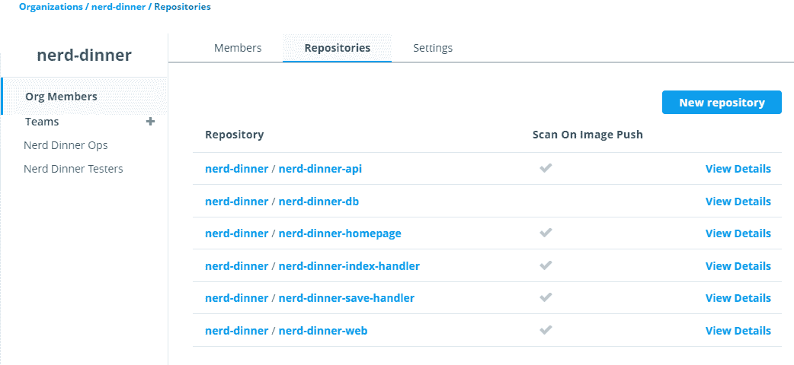
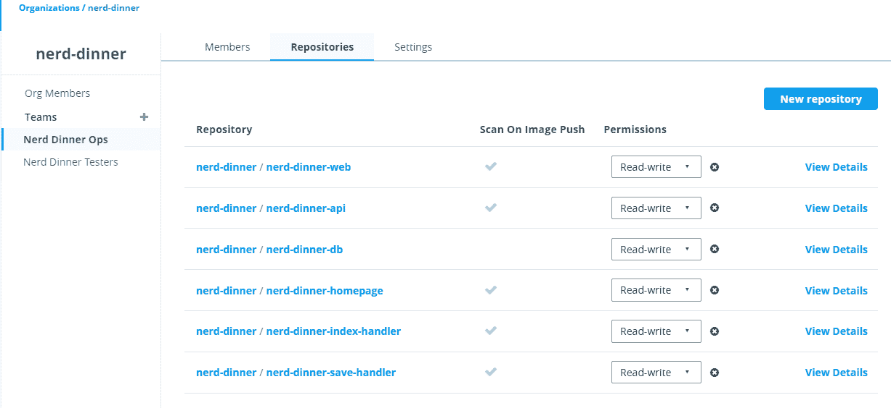
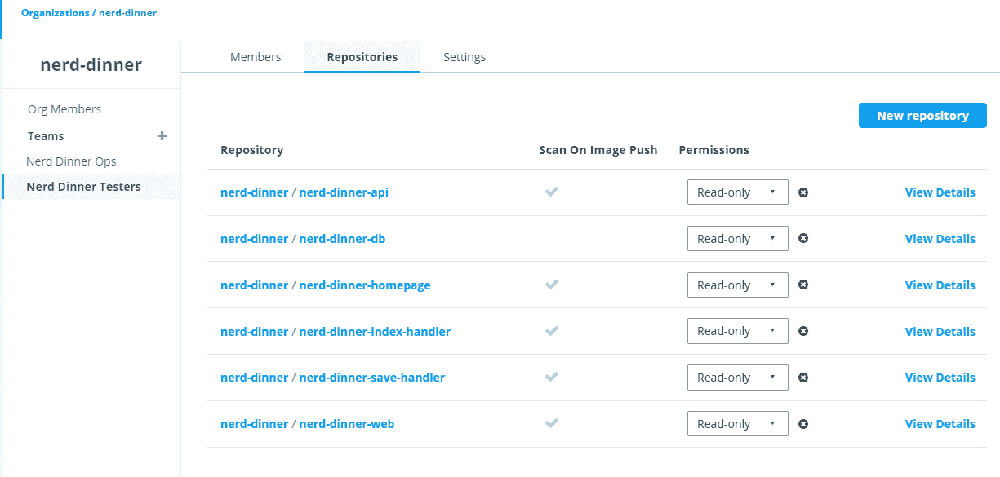
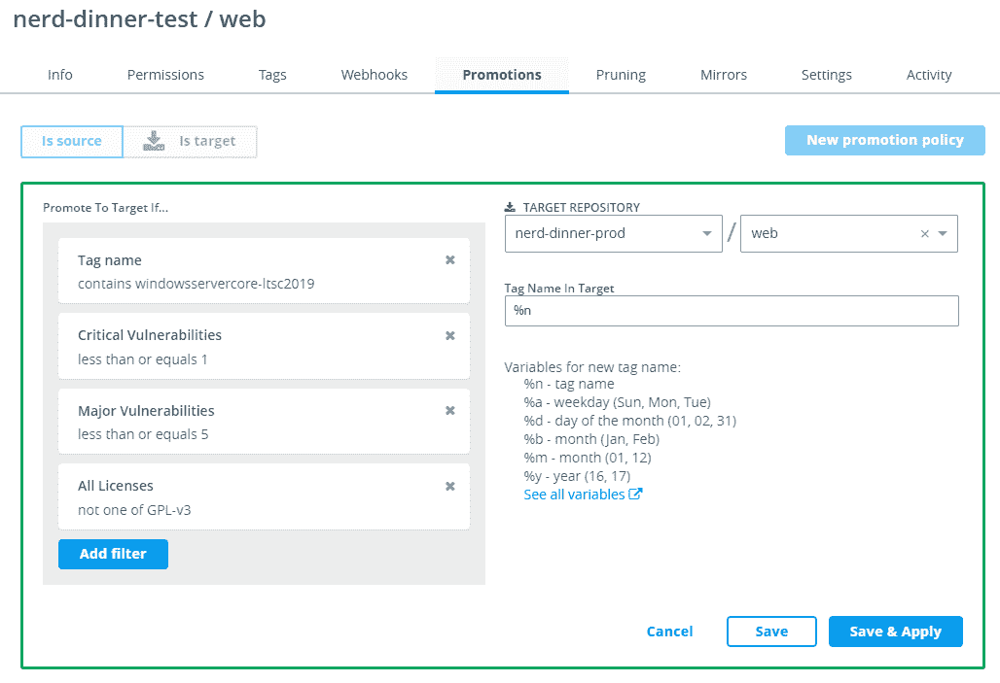
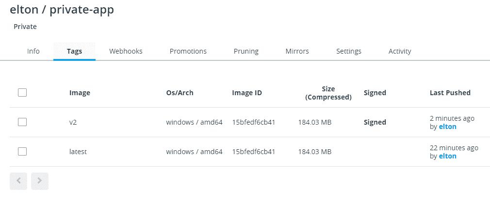
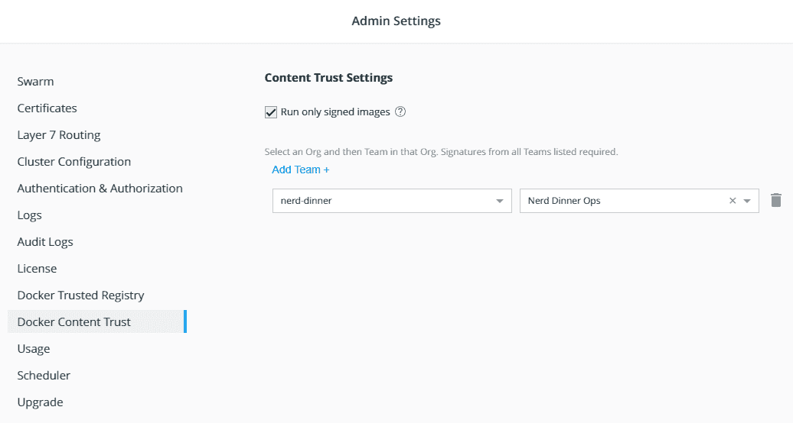
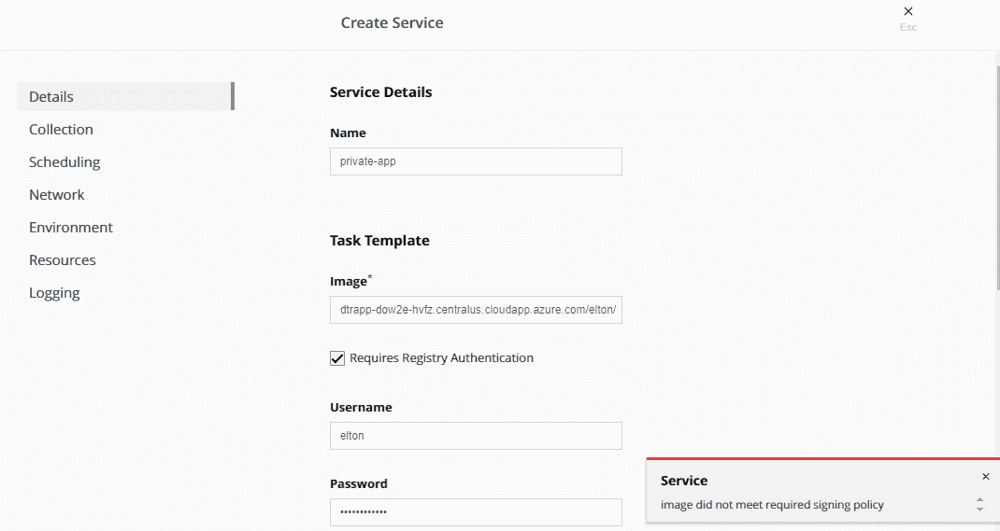

# 第九章：了解 Docker 的安全风险和好处

Docker 是一种新型的应用平台，它在建设过程中始终专注于安全性。您可以将现有应用程序打包为 Docker 镜像，在 Docker 容器中运行，并在不更改任何代码的情况下获得显著的安全性好处。

在基于 Windows Server Core 2019 的 Windows 容器上运行的.NET 2.0 WebForms 应用程序将在不进行任何代码更改的情况下愉快地在.NET 4.7 下运行：这是一个立即应用了 16 年安全补丁的升级！仍然有大量运行在不受支持的 Server 2003 上或即将不受支持的 Server 2008 上的 Windows 应用程序。转移到 Docker 是将这些应用程序引入现代技术栈的绝佳方式。

Docker 的安全涵盖了广泛的主题，我将在本章中进行介绍。我将解释容器和镜像的安全方面，**Docker Trusted Registry**（**DTR**）中的扩展功能，以及在 swarm 模式下的 Docker 的安全配置。

在本章中，我将深入研究 Docker 的内部，以展示安全性是如何实现的。我将涵盖：

+   了解容器安全性

+   使用安全的 Docker 镜像保护应用程序

+   使用 DTR 保护软件供应链

+   了解 swarm 模式下的安全性

# 了解容器安全性

Windows Server 容器中运行的应用程序进程实际上是在主机上运行的。如果在容器中运行多个 ASP.NET 应用程序，您将在主机机器的任务列表中看到多个`w3wp.exe`进程。在容器之间共享操作系统内核是 Docker 容器如此高效的原因——容器不加载自己的内核，因此启动和关闭时间非常快，对运行时资源的开销也很小。

在容器内运行的软件可能存在安全漏洞，安全人员关心的一个重要问题是：Docker 容器之间的隔离有多安全？如果 Docker 容器中的应用程序受到攻击，这意味着主机进程受到了攻击。攻击者能否利用该进程来攻击其他进程，潜在地劫持主机或在主机上运行的其他容器？

如果操作系统内核存在攻击者可以利用的漏洞，那么可能会打破容器并危害其他容器和主机。Docker 平台建立在深度安全原则之上，因此即使可能存在这种情况，平台也提供了多种方法来减轻风险。

Docker 平台在 Linux 和 Windows 之间几乎具有功能上的平等，但 Windows 方面还存在一些差距，正在积极解决中。但 Docker 在 Linux 上有更长的生产部署历史，许多指导和工具，如 Docker Bench 和 CIS Docker Benchmark，都是针对 Linux 的。了解 Linux 方面是有用的，但许多实际要点不适用于 Windows 容器。

# 容器进程

所有 Windows 进程都由用户帐户启动和拥有。用户帐户的权限决定了进程是否可以访问文件和其他资源，以及它们是否可用于修改或仅用于查看。在 Windows Server Core 的 Docker 基础映像中，有一个名为**容器管理员**的默认用户帐户。您在容器中从该映像启动的任何进程都将使用该用户帐户-您可以运行`whoami`工具，它只会输出当前用户名：

[PRE0]

您可以通过启动 PowerShell 来运行交互式容器，并找到容器管理员帐户的用户 ID（SID）：

[PRE1]

您会发现容器用户的 SID 始终相同，即`S-1-5-93-2-1`，因为该帐户是 Windows 映像的一部分。由于这个原因，它在每个容器中都具有相同的属性。容器进程实际上是在主机上运行的，但主机上没有**容器管理员**用户。实际上，如果您查看主机上的容器进程，您会看到用户名的空白条目。我将在后台容器中启动一个长时间运行的`ping`进程，并检查容器内的**进程 ID**（PID）：

[PRE2]

这是在 Windows Server 2019 上运行的 Docker 中的 Windows Server 容器，因此`ping`进程直接在主机上运行，容器内的 PID 将与主机上的 PID 匹配。在服务器上，我可以检查相同 PID 的详细信息，本例中为`7704`：

[PRE3]

由于容器用户在主机上没有映射任何用户，所以没有用户名。实际上，主机进程是在匿名用户下运行的，并且它在主机上没有权限，它只有在一个容器的沙盒环境中配置的权限。如果发现了允许攻击者打破容器的 Windows Server 漏洞，他们将以无法访问主机资源的主机进程运行。

可能会有更严重的漏洞允许主机上的匿名用户假定更广泛的权限，但这将是核心 Windows 权限堆栈中的一个重大安全漏洞，这通常会得到微软的非常快速的响应。匿名主机用户方法是限制任何未知漏洞影响的良好缓解措施。

# 容器用户帐户和 ACLs

在 Windows Server Core 容器中，默认用户帐户是容器管理员。该帐户在容器中是管理员组，因此可以完全访问整个文件系统和容器中的所有资源。在 Dockerfile 中指定的`CMD`或`ENTRYPOINT`指令中指定的进程将在容器管理员帐户下运行。

如果应用程序存在漏洞，这可能会有问题。应用程序可能会受到损害，虽然攻击者打破容器的机会很小，但攻击者仍然可以在应用程序容器内造成很大的破坏。管理访问权限意味着攻击者可以从互联网下载恶意软件并在容器中运行，或者将容器中的状态复制到外部位置。

您可以通过以最低特权用户帐户运行容器进程来减轻这种情况。Nano Server 映像使用了这种方法 - 它们设置了一个容器管理员用户，但容器进程的默认帐户是一个没有管理员权限的用户。您可以通过在 Nano Server 容器中回显用户名来查看这一点：

[PRE4]

Nano Server 镜像没有`whoami`命令，甚至没有安装 PowerShell。它只设置了运行新应用程序所需的最低限度。这是容器安全性的另一个方面。如果`whoami`命令中存在漏洞，那么您的容器应用程序可能会受到威胁，因此 Microsoft 根本不打包该命令。这是有道理的，因为您不会在生产应用程序中使用它。在 Windows Server Core 中仍然存在它，以保持向后兼容性。

`ContainerUser`帐户在容器内没有管理员访问权限。如果需要管理员权限来设置应用程序，可以在 Dockerfile 中使用`USER ContainerAdministrator`命令切换到管理员帐户。但是，如果您的应用程序不需要管理员访问权限，应该在 Dockerfile 的末尾切换回`USER ContainerUser`，以便容器启动命令以最低特权帐户运行。

来自 Microsoft 的**Internet Information Services**（**IIS**）和 ASP.NET 镜像是运行最低特权用户的其他示例。外部进程是运行在`IIS_IUSRS`组中的本地帐户下的 IIS Windows 服务。该组对 IIS 根路径`C:\inetpub\wwwroot`具有读取访问权限，但没有写入访问权限。攻击者可能会破坏 Web 应用程序，但他们将无法写入文件，因此下载恶意软件的能力已经消失。

在某些情况下，Web 应用程序需要写入访问权限以保存状态，但可以在 Dockerfile 中以非常细的级别授予。例如，开源**内容管理系统**（**CMS**）Umbraco 可以打包为 Docker 镜像，但 IIS 用户组需要对内容文件夹进行写入权限。您可以使用`RUN`指令设置 ACL 权限，而不是更改 Dockerfile 以将服务作为管理帐户运行。

[PRE5]

我不会在这里详细介绍 Umbraco，但它在容器中运行得非常好。您可以在我的 GitHub 存储库[`github.com/sixeyed/dockerfiles-windows`](https://github.com/sixeyed/dockerfiles-windows)中找到 Umbraco 和许多其他开源软件的示例 Dockerfile。

应该使用最低特权用户帐户来运行进程，并尽可能狭隘地设置 ACL。这限制了任何攻击者在容器内部获得进程访问权限的范围，但仍然存在来自容器外部的攻击向量需要考虑。

# 使用资源约束运行容器

您可以运行没有约束的 Docker 容器，容器进程将使用主机资源的尽可能多。这是默认设置，但可能是一个简单的攻击向量。恶意用户可能会在容器中对应用程序产生过多的负载，尝试占用 100%的 CPU 和内存，使主机上的其他容器陷入饥饿状态。如果您运行着为多个应用程序工作负载提供服务的数百个容器，这一点尤为重要。

Docker 有机制来防止单个容器使用过多的资源。您可以启动带有显式约束的容器，以限制它们可以使用的资源，确保没有单个容器占用大部分主机的计算能力。您可以将容器限制为显式数量的 CPU 核心和内存。

我有一个简单的.NET 控制台应用程序和一个 Dockerfile，可以将其打包到`ch09-resource-check`文件夹中。该应用程序被设计为占用计算资源，我可以在容器中运行它，以展示 Docker 如何限制恶意应用程序的影响。我可以使用该应用程序成功分配 600MB 的内存，如下所示：

[PRE6]

控制台应用程序在容器中分配了 600MB 的内存，实际上是在 Windows Server 容器中从服务器中分配了 600MB 的内存。我在没有任何约束的情况下运行了容器，因此该应用程序可以使用服务器拥有的所有内存。如果我使用`docker container run`命令中的`--memory`限制将容器限制为 500MB 的内存，那么该应用程序将无法分配 600MB：

[PRE7]

示例应用程序也可以占用 CPU。它计算 Pi 的小数点位数，这是一个计算成本高昂的操作。在不受限制的容器中，计算 Pi 到 20000 位小数只需要在我的四核开发笔记本上不到一秒钟：

[PRE8]

我可以通过在`run`命令中指定`--cpu`限制来使用 CPU 限制，并且 Docker 将限制可用于此容器的计算资源，为其他任务保留更多的 CPU。相同的计算时间超过了两倍：

[PRE9]

生产 Docker Swarm 部署可以使用部署部分的资源限制来应用相同的内存和 CPU 约束。这个例子将新的 NerdDinner REST API 限制为可用 CPU 的 25%和 250MB 的内存：

[PRE10]

验证资源限制是否生效可能是具有挑战性的。获取 CPU 计数和内存容量的底层 Windows API 使用操作系统内核，在容器中将是主机的内核。内核报告完整的硬件规格，因此限制似乎不会在容器内生效，但它们是强制执行的。您可以使用 WMI 来检查限制，但输出将不如预期：

[PRE11]

在这里，容器报告有四个 CPU 和 16 GB 的 RAM，尽管它被限制为一个 CPU 和 1 GB 的 RAM。实际上已经施加了限制，但它们在 WMI 调用的上层操作。如果容器内运行的进程尝试分配超过 1 GB 的 RAM，那么它将失败。

请记住，只有 Windows Server 容器才能访问主机的所有计算能力，容器进程实际上是在主机上运行的。Hyper-V 容器每个都有一个轻量级的虚拟机，进程在其中运行，该虚拟机有自己的 CPU 和内存分配。您可以使用相同的 Docker 命令应用容器限制，并且这些限制适用于容器的虚拟机。

# 使用受限制的功能运行容器

Docker 平台有两个有用的功能，可以限制容器内应用程序的操作。目前，它们只适用于 Linux 容器，但如果您需要处理混合工作负载，并且对 Windows 的支持可能会在未来版本中推出，那么了解它们是值得的。

Linux 容器可以使用 `read-only` 标志运行，这将创建一个具有只读文件系统的容器。此选项可与任何镜像一起使用，并将启动一个具有与通常相同入口进程的容器。不同之处在于容器没有可写文件系统层，因此无法添加或更改文件 - 容器无法修改镜像的内容。

这是一个有用的安全功能。Web 应用程序可能存在漏洞，允许攻击者在服务器上执行代码，但只读容器严重限制了攻击者的操作。他们无法更改应用程序配置文件，更改访问权限，下载新的恶意软件或替换应用程序二进制文件。

只读容器可以与 Docker 卷结合使用，以便应用程序可以写入已知位置以记录日志或缓存数据。如果您有一个写入文件系统的应用程序，那么您可以在只读容器中运行它而不改变功能。您需要意识到，如果您将日志写入卷中的文件，并且攻击者已经访问了文件系统，他们可以读取历史日志，而如果日志写入标准输出并被 Docker 平台消耗，则无法这样做。

当您运行 Linux 容器时，您还可以明确添加或删除容器可用的系统功能。例如，您可以启动一个没有`chown`功能的容器，因此容器内部的任何进程都无法更改文件访问权限。同样，您可以限制绑定到网络端口或写入内核日志的访问。

`只读`，`cap-add`和`cap-drop`选项对 Windows 容器没有影响，但是在未来的 Docker on Windows 版本中可能会提供支持。

Docker 的一个很棒的地方是，开源组件内置在受支持的 Docker Enterprise 版本中。您可以在 GitHub 的`moby/moby`存储库中提出功能请求和跟踪错误，这是 Docker 社区版的源代码。当功能在 Docker CE 中实现后，它们将在随后的 Docker Enterprise 版本中可用。

# Windows 容器和 Active Directory

大型组织使用**Active Directory**（**AD**）来管理他们 Windows 网络中的所有用户，组和机器。应用服务器可以加入域，从而可以访问 AD 进行身份验证和授权。这通常是.NET 内部 Web 应用程序部署的方式。该应用程序使用 Windows 身份验证为用户提供单一登录，而 IIS 应用程序池则以访问 SQL Server 的服务帐户运行。

运行 Docker 的服务器可以加入域，但是机器上的容器不能。您可以在容器中运行传统的 ASP.NET 应用程序，但是在默认部署中，您会发现 Windows 身份验证对用户不起作用，应用程序本身也无法连接到数据库。

这是一个部署问题，您可以使用**组管理服务帐户**（**gMSA**）为 Windows 容器提供对 AD 的访问权限，这是一种无需密码即可使用的 AD 帐户类型。Active Directory 很快就会变成一个复杂的话题，所以我在这里只是给出一个概述，让您知道您可以在容器内部使用 AD 服务：

+   域管理员在 Active Directory 中创建 gMSA。这需要一个域控制器在运行 Windows Server 2012 或更高版本。

+   为 gMSA 授予对 Docker 服务器的访问权限。

+   使用`CredentialSpec` PowerShell 模块为 gMSA 生成 JSON 格式的凭据规范。

+   使用`security-opt`标志运行容器，指定 JSON 凭据规范的路径。

+   容器中的应用程序实际上是加入域的，并且可以使用已分配给 gMSA 的权限来使用 AD。

从容器内部访问 AD 服务在 Windows Server 2019 中要容易得多。以前，您在 Docker Swarm 中运行时必须使用特定名称的 gMSA，这使得在运行时应用凭据规范变得困难。现在，您可以为 gMSA 使用任何名称，并且一个 gMSA 可以用于多个容器。Docker Swarm 通过使用`credential_spec`值在 compose 文件中支持凭据规范。

在 Microsoft 的 GitHub 容器文档中有一个完整的创建和使用 gMSA 和凭据规范的演练：[`github.com/MicrosoftDocs/Virtualization-Documentation/tree/live/windows-server-container-tools/ServiceAccounts`](https://github.com/MicrosoftDocs/Virtualization-Documentation/tree/live/windows-server-container-tools/ServiceAccounts)。

# Hyper-V 容器中的隔离

Windows 上的 Docker 具有一个大的安全功能，Linux 上的 Docker 没有：使用 Hyper-V 容器进行扩展隔离。运行在 Windows Server 2019 上的容器使用主机的操作系统内核。当您运行容器时，可以在主机的任务管理器上看到容器内部的进程。

在 Windows 10 上，默认行为是不同的。通过 Windows 1809 更新，您可以通过在 docker 容器运行命令中添加`--isolation=process`标志在 Windows 10 上以进程隔离的方式运行 Windows Server 容器。您需要在命令中或 Docker 配置文件中指定隔离级别，因为在 Windows 10 上默认值是`hyperv`。

具有自己内核的容器称为**Hyper-V**容器。它们是使用轻量级虚拟机实现的，提供服务器内核，但这不是完整的虚拟机，也没有典型的虚拟机开销。Hyper-V 容器使用普通的 Docker 镜像，并且它们以与所有容器相同的方式在普通的 Docker 引擎中运行。它们不会显示在 Hyper-V 管理工具中，因为它们不是完整的虚拟机。

Hyper-V 容器也可以在 Windows Server 上使用`isolation`选项运行。此命令将 IIS 镜像作为 Hyper-V 容器运行，将端口`80`发布到主机上的随机端口：

[PRE12]

容器的行为方式相同。外部用户可以浏览主机上的`80`端口，流量由容器处理。在主机上，您可以运行`docker container inspect`来查看 IP 地址并直接进入容器。Docker 网络、卷和集群模式等功能对 Hyper-V 容器也适用。

Hyper-V 容器的扩展隔离提供了额外的安全性。没有共享内核，因此即使内核漏洞允许容器应用程序访问主机，主机也只是在自己的内核中运行的薄型 VM 层。在该内核上没有其他进程或容器运行，因此攻击者无法危害其他工作负载。

由于有单独的内核，Hyper-V 容器有额外的开销。它们通常启动时间较慢，并且默认情况下会施加内存和 CPU 限制，限制容器在内核级别无法超过的资源。在某些情况下，这种权衡是值得的。在多租户情况下，您对每个工作负载都假定零信任，扩展隔离可以是一种有用的防御。

Hyper-V 容器的许可证不同。普通的 Windows Server 容器在主机级别获得许可，因此您需要为每台服务器获得许可，然后可以运行任意数量的容器。每个 Hyper-V 容器都有自己的内核，并且有限制您可以在每个主机上运行的容器数量的许可级别。

# 使用安全的 Docker 镜像保护应用程序

我已经涵盖了许多关于运行时保护容器的方面，但 Docker 平台在任何容器运行之前就提供了深度安全性。您可以通过保护打包应用程序的镜像来开始保护您的应用程序。

# 构建最小化镜像

攻击者不太可能破坏您的应用程序并访问容器，但如果发生这种情况，您应该构建您的映像以减轻损害。构建最小映像至关重要。理想的 Docker 映像应该只包含应用程序和运行所需的依赖项。

这对于 Windows 应用程序比 Linux 应用程序更难实现。 Linux 应用程序的 Docker 映像可以使用最小的发行版作为基础，在其上只打包应用程序二进制文件。该映像的攻击面非常小。即使攻击者访问了容器，他们会发现自己处于一个功能非常有限的操作系统中。

相比之下，使用 Windows Server Core 的 Docker 映像具有完整功能的操作系统作为基础。最小的替代方案是 Nano Server，它具有大大减少的 Windows API，甚至没有安装 PowerShell，这消除了可以被利用的大量功能集。理论上，您可以在 Dockerfile 中删除功能，禁用 Windows 服务，甚至删除 Windows 二进制文件，以限制最终映像的功能。但是，您需要进行大量测试，以确保您的应用程序在定制的 Windows 版本中能够正确运行。

Docker 对专家和社区领袖的认可是 Captain 计划。 Docker Captains 就像 Microsoft MVPs，Stefan Scherer 既是 Captain 又是 MVP。 Stefan 通过创建带有空文件系统并添加最小一组 Windows 二进制文件的镜像来减小 Windows 镜像大小，做了一些有前途的工作。

您无法轻松限制基本 Windows 映像的功能，但可以限制您在其上添加的内容。在可能的情况下，您应该只添加您的应用程序内容和最小的应用程序运行时，以便攻击者无法修改应用程序。一些编程语言对此的支持要比其他语言好，例如：

+   Go 应用程序可以编译为本机二进制文件，因此您只需要在 Docker 映像中打包可执行文件，而不是完整的 Go 运行时。

+   .NET Core 应用程序可以发布为程序集，因此您只需要打包.NET Core 运行时来执行它们，而不是完整的.NET Core SDK。

+   .NET Framework 应用程序需要在容器映像中安装匹配的.NET Framework，但您仍然可以最小化打包的应用程序内容。您应该以发布模式编译应用程序，并确保不打包调试文件。

+   Node.js 使用 V8 作为解释器和编译器，因此，要在 Docker 中运行应用程序，镜像需要安装完整的 Node.js 运行时，并且需要打包应用程序的完整源代码。

您将受到应用程序堆栈支持的限制，但最小镜像是目标。如果您的应用程序将在 Nano Server 上运行，那么与 Windows Server Core 相比，Nano Server 肯定更可取。完整的.NET 应用程序无法在 Nano Server 上运行，但.NET Standard 正在迅速发展，因此将应用程序移植到.NET Core 可能是一个可行的选择，然后可以在 Nano Server 上运行。

当您在 Docker 中运行应用程序时，您使用的单元是容器，并且使用 Docker 进行管理和监控。底层操作系统不会影响您与容器的交互方式，因此拥有最小的操作系统不会限制您对应用程序的操作。

# Docker 安全扫描

最小的 Docker 镜像仍然可能包含已知漏洞的软件。Docker 镜像使用标准的开放格式，这意味着可以可靠地构建工具来导航和检查镜像层。一个工具是 Docker 安全扫描，它检查 Docker 镜像中的软件是否存在漏洞。

Docker 安全扫描检查镜像中的所有二进制文件，包括应用程序依赖项、应用程序框架甚至操作系统。每个二进制文件都会根据多个**通用漏洞和利用**（**CVE**）数据库进行检查，寻找已知的漏洞。如果发现任何问题，Docker 会报告详细信息。

Docker 安全扫描可用于 Docker Hub 的官方存储库以及 Docker Trusted Registry 的私有存储库。这些系统的 Web 界面显示了每次扫描的输出。像 Alpine Linux 这样的最小镜像可能完全没有漏洞：

官方 NATS 镜像有一个 Nano Server 2016 变体，您可以看到该镜像中存在漏洞：

在存在漏洞的地方，您可以深入了解到底有哪些二进制文件被标记，并且链接到 CVE 数据库，描述了漏洞。在`nats:nanoserver`镜像的情况下，Nano Server 基础镜像中打包的 zlib 和 SQLite 版本存在漏洞。

这些扫描结果来自 Docker Hub 上的官方镜像。Docker Enterprise 还在 DTR 中提供安全扫描，您可以按需运行手动扫描，或配置任何推送到存储库的操作来触发扫描。我已经为 NerdDinner web 应用程序创建了一个存储库，该存储库配置为在每次推送图像时进行扫描：

对该存储库的访问基于第八章中相同的安全设置，即*管理和监控 Docker 化解决方案*，使用**nerd-dinner**组织和**Nerd Dinner Ops**团队。DTR 使用与 UCP 相同的授权，因此您可以在 Docker Enterprise 中构建组织和团队一次，并将它们用于保护图像和运行时资源。用户**elton**属于**Nerd Dinner Ops**团队，对**nerd-dinner-web**存储库具有读写访问权限，这意味着可以推送和拉取图像。

当我向这个存储库推送图像时，Docker Trusted Registry 将开始进行安全扫描，从而识别图像每个层中的所有二进制文件，并检查它们是否存在 CVE 数据库中已知的漏洞。NerdDinner web 应用程序基于 Microsoft 的 ASP.NET 镜像，在撰写本文时，该镜像中的组件存在已知漏洞：

`System.Net.Http`中的问题只能在 ASP.NET Core 应用程序中被利用，所以我可以自信地说它们在我的.NET Framework 应用程序中不是问题。然而，`Microsoft.AspNet.Mvc`的跨站脚本（XSS）问题确实适用，我想要更多地了解有关利用的信息，并在我的 CI 流程中添加测试来确认攻击者无法通过我的应用程序利用它。

这些漏洞不是我在 Dockerfile 中添加的库中的漏洞——它们在基础镜像中，并且实际上是 ASP.NET 和 ASP.NET Core 的一部分。这与在容器中运行无关。如果您在任何版本的 Windows 上运行任何版本的 ASP.NET MVC 从 2.0 到 5.1，那么您的生产系统中就存在这个 XSS 漏洞，但您可能不知道。

当您在图像中发现漏洞时，您可以准确地看到它们的位置，并决定如何加以减轻。如果您有一个可以自信地用来验证您的应用程序是否仍然可以正常工作的自动化测试套件，您可以尝试完全删除二进制文件。或者，您可能会决定从您的应用程序中没有漏洞代码的路径，并保持图像不变，并添加测试以确保没有办法利用漏洞。

无论您如何管理它，知道应用程序堆栈中存在漏洞非常有用。Docker 安全扫描可以在每次推送时工作，因此如果新版本引入漏洞，您将立即得到反馈。它还链接到 UCP，因此您可以从管理界面上看到正在运行的容器的图像中是否存在漏洞。

# 管理 Windows 更新

管理应用程序堆栈更新的过程也适用于 Docker 镜像的 Windows 更新。您不会连接到正在运行的容器来更新其使用的 Node.js 版本，也不会运行 Windows 更新。

微软通常会发布一组综合的安全补丁和其他热修复程序，通常每月一次作为 Windows 更新。同时，他们还会在 Docker Hub 和 Microsoft 容器注册表上发布新版本的 Windows Server Core 和 Nano Server 基础镜像以及任何依赖镜像。镜像标签中的版本号与 Windows 发布的热修复号匹配。

在 Dockerfile 的`FROM`指令中明确声明要使用的 Windows 版本，并使用安装的任何依赖项的特定版本是一个很好的做法。这使得您的 Dockerfile 是确定性的-在将来任何时候构建它，您将得到相同的镜像，其中包含所有相同的二进制文件。

指定 Windows 版本还清楚地表明了如何管理 Docker 化应用程序的 Windows 更新。.NET Framework 应用程序的 Dockerfile 可能是这样开始的：

[PRE13]

这将镜像固定为带有更新`KB4471332`的 Windows Server 2019。这是一个可搜索的知识库 ID，告诉您这是 Windows 2018 年 12 月的更新。随着新的 Windows 基础镜像的发布，您可以通过更改`FROM`指令中的标签并重新构建镜像来更新应用程序，例如使用发布`KB4480116`，这是 2019 年 1 月的更新：

[PRE14]

我将在第十章中介绍自动构建和部署，*使用 Docker 打造持续部署流水线*。通过一个良好的 CI/CD 流水线，您可以使用新的 Windows 版本重新构建您的镜像，并运行所有测试以确认更新不会影响任何功能。然后，您可以通过使用`docker stack deploy`或`docker service update`在没有停机时间的情况下将更新推出到所有正在运行的应用程序，指定应用程序镜像的新版本。整个过程可以自动化，因此 IT 管理员在*补丁星期二*时的痛苦会随着 Docker 的出现而消失。

# 使用 DTR 保护软件供应链

DTR 是 Docker 扩展 EE 提供的第二部分。（我在第八章中介绍了**Universal Control Plane**（**UCP**），*管理和监控 Docker 化解决方案*。）DTR 是一个私有的 Docker 注册表，为 Docker 平台的整体安全性故事增添了一个重要组成部分：一个安全的软件供应链。

您可以使用 DTR 对 Docker 镜像进行数字签名，并且 DTR 允许您配置谁可以推送和拉取镜像，安全地存储用户对镜像应用的所有数字签名。它还与 UCP 一起工作，以强制执行**内容信任**。通过 Docker 内容信任，您可以设置集群，使其仅运行由特定用户或团队签名的镜像中的容器。

这是一个强大的功能，符合许多受监管行业的审计要求。公司可能需要证明生产中运行的软件实际上是从 SCM 中的代码构建的。没有软件供应链，这是非常难以做到的；您必须依赖手动流程和文件记录。使用 Docker，您可以在平台上强制执行它，并通过自动化流程满足审计要求。

# 仓库和用户

DTR 使用与 UCP 相同的身份验证模型，因此您可以使用您的**Active Directory**（**AD**）帐户登录，或者您可以使用在 UCP 中创建的帐户。DTR 使用与 UCP 相同的组织、团队和用户的授权模型，但权限是分开的。用户可以对 DTR 中的镜像仓库和从这些镜像中运行的服务具有完全不同的访问权限。

DTR 授权模型的某些部分与 Docker Hub 相似。用户可以拥有公共或私人存储库，这些存储库以他们的用户名为前缀。管理员可以创建组织，组织存储库可以对用户和团队进行细粒度的访问控制。

我在第四章中介绍了镜像注册表和存储库，*使用 Docker 注册表共享镜像*。存储库的完整名称包含注册表主机、所有者和存储库名称。我在 Azure 中使用 Docker Certified Infrastructure 搭建了一个 Docker Enterprise 集群。我创建了一个名为`elton`的用户，他拥有一个私人存储库：

要将镜像推送到名为`private-app`的存储库，需要使用完整的 DTR 域标记它的存储库名称为用户`elton`。我的 DTR 实例正在运行在`dtrapp-dow2e-hvfz.centralus.cloudapp.azure.com`，所以我需要使用的完整镜像名称是`dtrapp-dow2e-hvfz.centralus.cloudapp.azure.com/elton/private-app`：

[PRE15]

这是一个私人存储库，所以只能被用户`elton`访问。DTR 呈现与任何其他 Docker 注册表相同的 API，因此我需要使用`docker login`命令登录，指定 DTR 域作为注册表地址：

[PRE16]

如果我将存储库设为公开，任何有权访问 DTR 的人都可以拉取镜像，但这是一个用户拥有的存储库，所以只有`elton`账户有推送权限。

这与 Docker Hub 相同，任何人都可以从我的`sixeyed`用户存储库中拉取镜像，但只有我可以推送它们。对于需要多个用户访问推送镜像的共享项目，您可以使用组织。

# 组织和团队

组织用于共享存储库的所有权。组织及其拥有的存储库与拥有存储库权限的用户是分开的。特定用户可能具有管理员访问权限，而其他用户可能具有只读访问权限，特定团队可能具有读写访问权限。

DTR 的用户和组织模型与 Docker Hub 的付费订阅层中的模型相同。如果您不需要完整的 Docker Enterprise 生产套件，但需要具有共享访问权限的私人存储库，您可以使用 Docker Hub。

我在 nerd-dinner 组织下为 NerdDinner 堆栈的更多组件创建了存储库：

我可以向个别用户或团队授予对存储库的访问权限。**Nerd Dinner Ops**团队是我在 UCP 中创建的管理员用户组。这些用户可以直接推送图像，因此他们对所有存储库具有读写权限：

Nerd Dinner 测试团队只需要对存储库具有读取权限，因此他们可以在本地拉取图像进行测试，但无法将图像推送到注册表：

在 DTR 中组织存储库取决于您。您可以将所有应用程序存储库放在一个组织下，并为可能在许多项目中使用的共享组件（如 NATS 和 Elasticsearch）创建一个单独的组织。这意味着共享组件可以由专门的团队管理，他们可以批准更新并确保所有项目都使用相同的版本。项目团队成员具有读取权限，因此他们可以随时拉取最新的共享图像并运行其完整的应用程序堆栈，但他们只能将更新推送到其项目存储库。

DTR 具有无、读取、读写和管理员的权限级别。它们可以应用于团队或个别用户的存储库级别。DTR 和 UCP 的一致身份验证但分离授权模型意味着开发人员可以在 DTR 中具有完全访问权限以拉取和推送图像，但在 UCP 中可能只有读取权限以查看运行中的容器。

在成熟的工作流程中，您不会让个人用户推送图像 - 一切都将自动化。您的初始推送将来自构建图像的 CI 系统，然后您将为图像添加来源层，从推广政策开始。

# DTR 中的图像推广政策

许多公司在其注册表中使用多个存储库来存储应用程序生命周期不同阶段的图像。最简单的例子是`nerd-dinner-test/web`存储库，用于正在经历各种测试阶段的图像，以及`nerd-dinner-prod/web`存储库，用于已获得生产批准的图像。

DTR 提供了图像推广政策，可以根据您指定的标准自动将图像从一个存储库复制到另一个存储库。这为安全软件供应链增加了重要的链接。CI 流程可以从每次构建中将图像推送到测试存储库，然后 DTR 可以检查图像并将其推广到生产存储库。

您可以根据扫描中发现的漏洞数量、镜像标签的内容以及镜像中使用的开源组件的软件许可证来配置推广规则。我已经为从`nerd-dinner-test/web`到`nerd-dinner-prod/web`的镜像配置了一些合理的推广策略：

当我将符合所有标准的镜像推送到测试仓库时，它会被 DTR 自动推广到生产仓库：

配置生产仓库，使得没有最终用户可以直接推送到其中，意味着镜像只能通过 DTR 的推广等自动化流程到达那里。

Docker Trusted Registry 为您提供了构建安全交付流水线所需的所有组件，但它并不强制执行任何特定的流程或技术。来自 DTR 的事件可以触发 webhooks，这意味着您可以将您的注册表与几乎任何 CI 系统集成。触发 webhook 的一个事件是镜像推广，您可以使用它来触发新镜像的自动签名。

# 镜像签名和内容信任

DTR 利用 UCP 管理的客户端证书对镜像进行数字签名，可以追踪到已知用户帐户。用户从 UCP 下载客户端捆绑包，其中包含其客户端证书的公钥和私钥，该证书由 Docker CLI 使用。

您可以使用相同的方法处理其他系统的用户帐户，因此您可以为您的 CI 服务创建一个帐户，并设置仓库，以便只有 CI 帐户可以访问推送。这样，您可以将镜像签名集成到您的安全交付流水线中，从 CI 流程应用签名，并使用它来强制执行内容信任。

您可以通过环境变量打开 Docker 内容信任，并且当您将镜像推送到注册表时，Docker 将使用来自您客户端捆绑包的密钥对其进行签名。内容信任仅适用于特定的镜像标签，而不适用于默认的`latest`标签，因为签名存储在标签上。

我可以给我的私有镜像添加`v2`标签，在 PowerShell 会话中启用内容信任，并将标记的镜像推送到 DTR：

[PRE17]

推送图像的行为会添加数字签名，在这种情况下使用`elton`帐户的证书并为存储库创建新的密钥对。DTR 记录每个图像标签的签名，在 UI 中我可以看到`v2`图像标签已签名：

用户可以推送图像以添加自己的签名。这使得批准流水线成为可能，授权用户拉取图像，运行他们需要的任何测试，然后再次推送以确认他们的批准。

DTR 使用 Notary 来管理访问密钥和签名。与 SwarmKit 和 LinuxKit 一样，Notary 是 Docker 集成到商业产品中的开源项目，添加功能并提供支持。要查看图像签名和内容信任的实际操作，请查看我的 Pluralsight 课程*Getting Started with Docker Datacenter*。

UCP 与 DTR 集成以验证图像签名。在管理设置中，您可以配置 UCP，使其可以运行已由组织中已知团队签名的图像的容器：

我已经配置了 Docker 内容信任，以便 UCP 只运行已由 Nerd Dinners Ops 团队成员签名的容器。这明确捕获了发布批准工作流程，并且平台强制执行它。甚至管理员也不能运行未经所需团队用户签名的图像的容器——UCP 将抛出错误，指出图像未满足签名策略：

构建安全的软件供应链是关于建立一个自动化流水线，您可以保证图像已由已知用户帐户推送，它们满足特定的质量标准，并且已由已知用户帐户签名。DTR 提供了所有集成这一点到 CI 流水线中的功能，使用诸如 Jenkins 或 Azure DevOps 之类的工具。您可以使用任何自动化服务器或服务，只要它可以运行 shell 命令并响应 webhook——这几乎是每个系统。

有一个 Docker 参考架构详细介绍了安全供应链，以 GitLab 作为示例 CI 服务器，并向您展示如何将安全交付流水线与 Docker Hub 或 DTR 集成。您可以在[`success.docker.com/article/secure-supply-chain`](https://success.docker.com/article/secure-supply-chain)找到它。

# 黄金图像

镜像和注册表的最后一个安全考虑是用于应用程序镜像的基础镜像的来源。在生产中运行 Docker 的公司通常限制开发人员可以使用的基础镜像集，该集已获得基础设施或安全利益相关者的批准。可供使用的这组黄金镜像可能仅在文档中记录，但使用私有注册表更容易强制执行。

在 Windows 环境中，黄金镜像可能仅限于两个选项：Windows Server Core 的一个版本和 Nano Server 的一个版本。运维团队可以从 Microsoft 的基础镜像构建自定义镜像，而不是允许用户使用公共 Microsoft 镜像。自定义镜像可能会添加安全或性能调整，或设置一些适用于所有应用程序的默认值，例如打包公司的证书颁发机构证书。

使用 DTR，您可以为所有基础镜像创建一个组织，运维团队对存储库具有读写访问权限，而所有其他用户只有读取权限。检查镜像是否使用有效的基础镜像只意味着检查 Dockerfile 是否使用了来自 base-images 组织的镜像，这是在 CI/CD 过程中轻松自动化的测试。

黄金镜像为您的组织增加了管理开销，但随着您将越来越多的应用程序迁移到 Docker，这种开销变得更加值得。拥有自己的 ASP.NET 镜像，并使用公司的默认配置部署，使安全团队可以轻松审计基础镜像。您还拥有自己的发布节奏和注册表域，因此您不需要在 Dockerfile 中使用古怪的镜像名称。

# 了解集群模式中的安全性

Docker 的深度安全性方法涵盖了整个软件生命周期，从构建时的镜像签名和扫描到运行时的容器隔离和管理。我将以概述在集群模式中实施的安全功能结束本章。

分布式软件提供了许多有吸引力的攻击向量。组件之间的通信可能会被拦截和修改。恶意代理可以加入网络并访问数据或运行工作负载。分布式数据存储可能会受到损害。建立在开源 SwarmKit 项目之上的 Docker 集群模式在平台级别解决了这些向量，因此您的应用程序默认在安全基础上运行。

# 节点和加入令牌

您可以通过运行`docker swarm init`切换到集群模式。此命令的输出会给您一个令牌，您可以使用它让其他节点加入集群。工作节点和管理节点有单独的令牌。节点没有令牌无法加入集群，因此您需要像保护其他秘密一样保护令牌。

加入令牌由前缀、格式版本、根密钥的哈希和密码学强随机字符串组成。

Docker 使用固定的`SWMTKN`前缀用于令牌，因此您可以运行自动检查，以查看令牌是否在源代码或其他公共位置上被意外共享。如果令牌受到损害，恶意节点可能会加入集群，如果它们可以访问您的网络。集群模式可以使用特定网络进行节点流量，因此您应该使用一个不公开可访问的网络。

加入令牌可以通过`join-token rotate`命令进行旋转，可以针对工作节点令牌或管理节点令牌进行操作：

[PRE18]

令牌旋转是集群的完全托管操作。所有现有节点都会更新，并且任何错误情况，如节点离线或在旋转过程中加入，都会得到优雅处理。

# 加密和秘密

集群节点之间的通信使用**传输层安全性**（**TLS**）进行加密。当您创建集群时，集群管理器会将自身配置为认证机构，并在节点加入时为每个节点生成证书。集群中的节点之间的通信使用相互 TLS 进行加密。

相互 TLS 意味着节点可以安全地通信并相互信任，因为每个节点都有一个受信任的证书来标识自己。节点被分配一个在证书中使用的随机 ID，因此集群不依赖于主机名等属性，这些属性可能会被伪造。

节点之间的可信通信是集群模式中 Docker Secrets 的基础。秘密存储在管理节点的 Raft 日志中并进行加密，只有当工作节点要运行使用该秘密的容器时，才会将秘密发送给工作节点。秘密在传输过程中始终使用相互 TLS 进行加密。在工作节点上，秘密以明文形式在临时 RAM 驱动器上可用，并作为卷挂载到容器中。数据永远不会以明文形式持久保存。

Windows 没有本地的 RAM 驱动器，因此目前的秘密实现将秘密数据存储在工作节点的磁盘上，并建议使用 BitLocker 来保护系统驱动器。秘密文件在主机上受 ACLs 保护。

在容器内部，对秘密文件的访问受到限制，只能由特定用户帐户访问。在 Linux 中可以指定具有访问权限的帐户，但在 Windows 中，目前有一个固定的列表。我在第七章的 ASP.NET Web 应用程序中使用了秘密，*使用 Docker Swarm 编排分布式解决方案*，您可以在那里看到我配置了 IIS 应用程序池以使用具有访问权限的帐户。

当容器停止、暂停或删除时，容器可用的秘密将从主机中删除。在 Windows 上，秘密目前被持久化到磁盘，如果主机被强制关闭，那么在主机重新启动时秘密将被删除。

# 节点标签和外部访问

一旦节点被添加到集群中，它就成为容器工作负载的候选对象。许多生产部署使用约束条件来确保应用程序在正确类型的节点上运行，并且 Docker 将尝试将请求的约束与节点上的标签进行匹配。

在受监管的环境中，您可能需要确保应用程序仅在已满足所需审核级别的服务器上运行，例如用于信用卡处理的 PCI 合规性。您可以使用标签识别符合条件的节点，并使用约束条件确保应用程序仅在这些节点上运行。集群模式有助于确保这些约束得到适当执行。

集群模式中有两种类型的标签：引擎标签和节点标签。引擎标签由 Docker 服务配置中的机器设置，因此，如果工作节点受到攻击者的攻击，攻击者可以添加标签，使他们拥有的机器看起来合规。节点标签由集群设置，因此只能由具有对集群管理器访问权限的用户创建。节点标签意味着您不必依赖于各个节点提出的声明，因此，如果它们受到攻击，影响可以得到限制。

节点标签在隔离对应用程序的访问方面也很有用。您可能有仅在内部网络上可访问的 Docker 主机，也可能有访问公共互联网的主机。使用标签，您可以明确记录它作为一个区别，并根据标签运行具有约束的容器。您可以在容器中拥有一个仅在内部可用的内容管理系统，但一个公开可用的 Web 代理。

# 与容器安全技术的集成

Docker Swarm 是一个安全的容器平台，因为它使用开源组件和开放标准，所以与第三方工具集成得很好。当应用程序在容器中运行时，它们都暴露相同的 API——您可以使用 Docker 来检查容器中运行的进程，查看日志条目，浏览文件系统，甚至运行新命令。容器安全生态系统正在发展强大的工具，利用这一点在运行时增加更多的安全性。

如果您正在寻找 Windows 容器的扩展安全性，有两个主要供应商可供评估：Twistlock 和 Aqua Security。两者都有包括镜像扫描和秘密管理、运行时保护在内的全面产品套件，这是为您的应用程序增加安全性的最创新方式。

当您将运行时安全产品部署到集群时，它会监视容器并构建该应用程序的典型行为文件，包括 CPU 和内存使用情况，以及进出的网络流量。然后，它会寻找该应用程序实例中的异常情况，即容器开始表现出与预期模型不同的方式。这是识别应用程序是否被入侵的强大方式，因为攻击者通常会开始运行新进程或移动异常数量的数据。

以 Aqua Security 为例，它为 Windows 上的 Docker 提供了全套保护，扫描镜像并为容器提供运行时安全控制。这包括阻止从不符合安全标准的镜像中运行的容器——标记为 CVE 严重程度或平均分数、黑名单和白名单软件包、恶意软件、敏感数据和自定义合规性检查。

Aqua 还强制执行容器的不可变性，将运行的容器与其原始图像进行比较，并防止更改，比如安装新的可执行文件。这是防止恶意代码注入或尝试绕过图像管道控制的强大方式。如果您从一个包含许多实际上不需要的组件的大型基础图像构建图像，Aqua 可以对攻击面进行分析，并列出实际需要的功能和能力。

这些功能适用于遗留应用程序中的容器，就像新的云原生应用程序一样。能够为应用程序部署的每一层添加深度安全，并实时监视可疑妥协，使安全方面成为迁移到容器的最有力的原因之一。

# 总结

本章讨论了 Docker 和 Windows 容器的安全考虑。您了解到 Docker 平台是为深度安全而构建的，并且容器的运行时安全只是故事的一部分。安全扫描、图像签名、内容信任和安全的分布式通信可以结合起来，为您提供一个安全的软件供应链。

你研究了在 Docker 中运行应用程序的实际安全方面，并了解了 Windows 容器中的进程是如何在一个上下文中运行的，这使得攻击者很难逃离容器并侵入其他进程。容器进程将使用它们所需的所有计算资源，但我还演示了如何限制 CPU 和内存使用，这可以防止恶意容器耗尽主机的计算资源。

在 docker 化的应用程序中，您有更多的空间来实施深度安全。我解释了为什么最小化的镜像有助于保持应用程序的安全，以及您如何使用 Docker 安全扫描来在您的应用程序使用的任何依赖关系中发现漏洞时收到警报。您可以通过数字签名图像并配置 Docker，以便它只运行已获得批准用户签名的图像中的容器，来强制执行良好的实践。

最后，我看了一下 Docker Swarm 中的安全实现。Swarm 模式拥有所有编排层中最深入的安全性，并为您提供了一个稳固的基础，让您可以安全地运行应用程序。使用 secrets 来存储敏感的应用程序数据，使用节点标签来识别主机的合规性，使您可以轻松地运行一个安全的解决方案，而开放的 API 使得集成第三方安全增强，如 Aqua 变得很容易。

在下一章中，我们将使用分布式应用程序，并着眼于构建 CI/CD 的流水线。Docker 引擎可以配置为提供对 API 的远程访问，因此很容易将 Docker 部署与任何构建系统集成。CI 服务器甚至可以在 Docker 容器内运行，您可以使用 Docker 作为构建代理，因此对于 CI/CD，您不需要任何复杂的配置。
