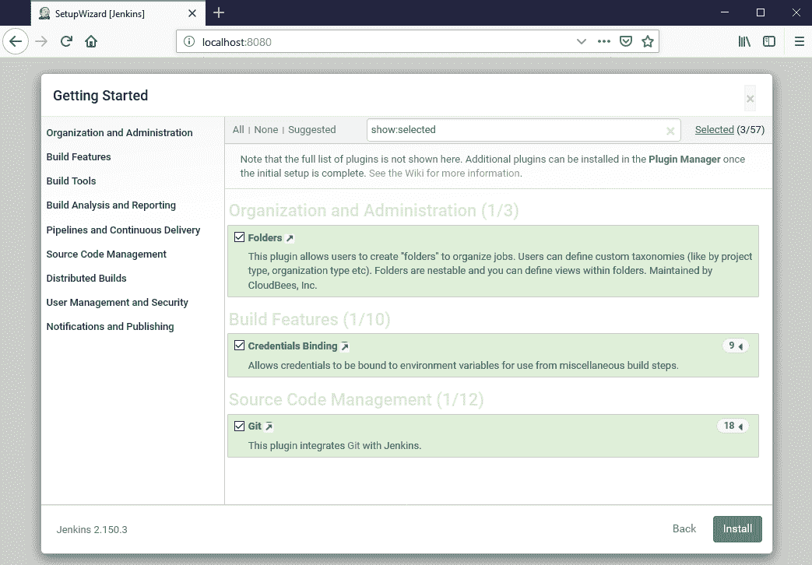
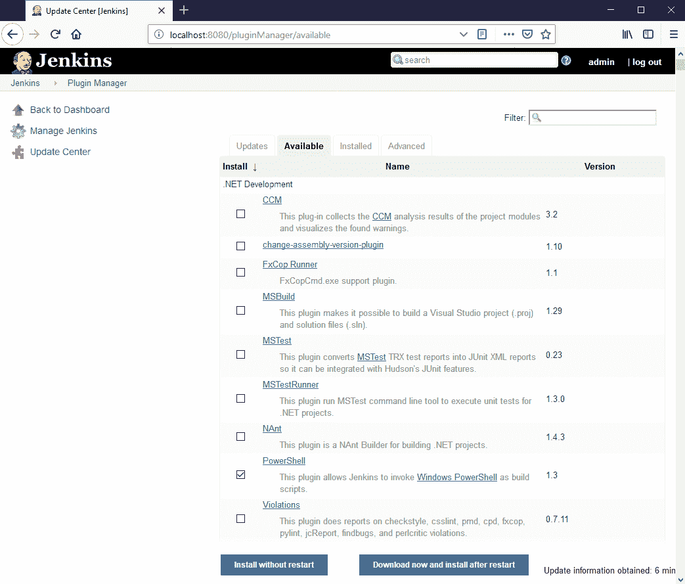
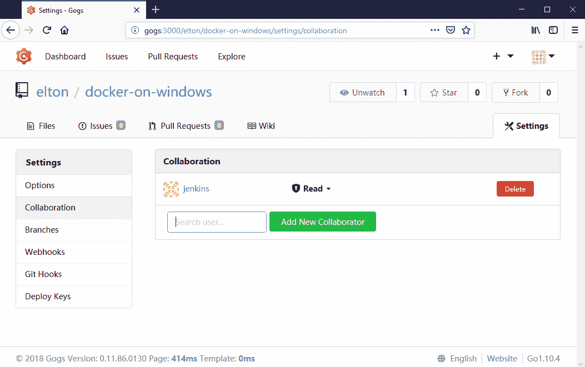
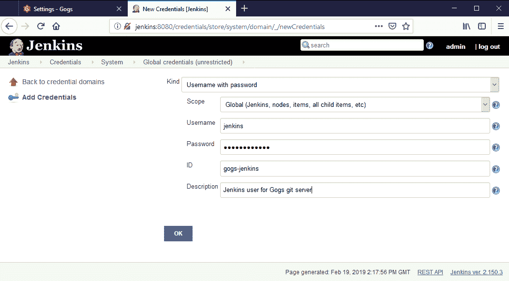
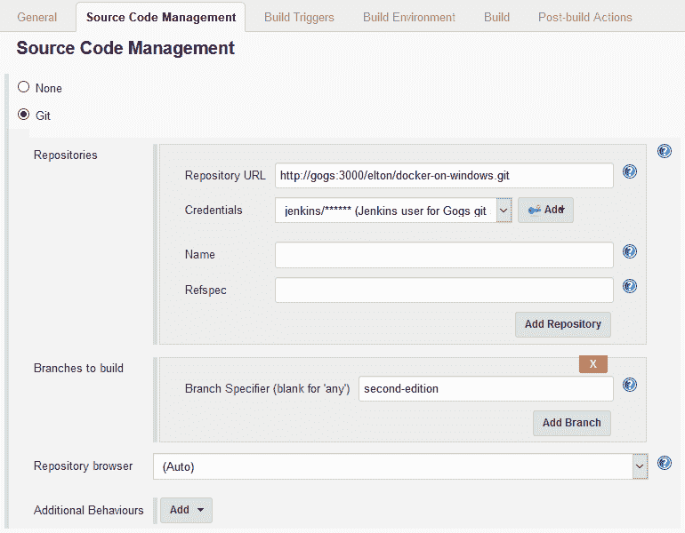
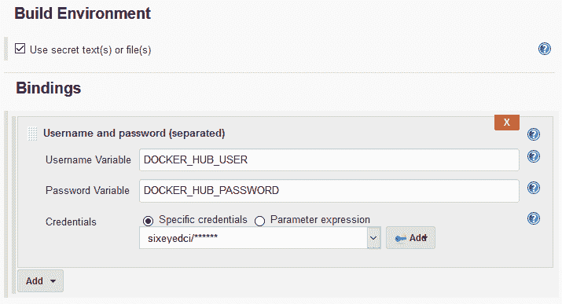

# 第十章：使用 Docker 推动持续部署管道

Docker 支持构建和运行可以轻松分发和管理的组件。该平台还适用于开发环境，其中源代码控制、构建服务器、构建代理和测试代理都可以从标准镜像中运行在 Docker 容器中。

在开发中使用 Docker 可以让您在单一硬件集中 consoli 许多项目，同时保持隔离。您可以在 Docker Swarm 中运行具有高可用性的 Git 服务器和镜像注册表的服务，这些服务由许多项目共享。每个项目可以配置有自己的管道和自己的构建设置的专用构建服务器，在轻量级 Docker 容器中运行。

在这种环境中设置新项目只是在源代码控制存储库中创建新存储库和新命名空间，并运行新容器进行构建过程。所有这些步骤都可以自动化，因此项目入职变成了一个只需几分钟并使用现有硬件的简单过程。

在本章中，我将带您完成使用 Docker 设置**持续集成和持续交付**（**CI/CD**）管道。我将涵盖：

+   使用 Docker 设计 CI/CD

+   在 Docker 中运行共享开发服务

+   在 Docker 中使用 Jenkins 配置 CI/CD

+   使用 Jenkins 部署到远程 Docker Swarm

# 技术要求

您需要在 Windows 10 更新 18.09 或 Windows Server 2019 上运行 Docker，以便按照示例进行操作。本章的代码可在[`github.com/sixeyed/docker-on-windows/tree/second-edition/ch10`](https://github.com/sixeyed/docker-on-windows/tree/second-edition/ch10)上找到。

# 使用 Docker 设计 CI/CD

该管道将支持完整的持续集成。当开发人员将代码推送到共享源代码存储库时，将触发生成发布候选版本的构建。发布候选版本将被标记为存储在本地注册表中的 Docker 镜像。CI 工作流从构建的图像中部署解决方案作为容器，并运行端到端测试包。

我的示例管道具有手动质量门。如果测试通过，图像版本将在 Docker Hub 上公开可用，并且管道可以在远程 Docker Swarm 上运行的公共环境中启动滚动升级。在完整的 CI/CD 环境中，您还可以在管道中自动部署到生产环境。

流水线的各个阶段都将由运行在 Docker 容器中的软件驱动：

+   源代码控制：Gogs，一个用 Go 编写的简单的开源 Git 服务器

+   构建服务器：Jenkins，一个基于 Java 的自动化工具，使用插件支持许多工作流

+   构建代理：将.NET SDK 打包成一个 Docker 镜像，以在容器中编译代码

+   测试代理：NUnit 打包成一个 Docker 镜像，用于对部署的代码进行端到端测试

Gogs 和 Jenkins 可以在 Docker Swarm 上或在单独的 Docker Engine 上运行长时间运行的容器。构建和测试代理是由 Jenkins 运行的任务容器，用于执行流水线步骤，然后它们将退出。发布候选将部署为一组容器，在测试完成时将被删除。

设置这个的唯一要求是让容器访问 Docker API——在本地和远程环境中都是如此。在本地服务器上，我将使用来自 Windows 的命名管道。对于远程 Docker Swarm，我将使用一个安全的 TCP 连接。我在第一章中介绍了如何保护 Docker API，*在 Windows 上使用 Docker 入门*，使用`dockeronwindows/ch01-dockertls`镜像生成 TLS 证书。您需要配置本地访问权限，以便 Jenkins 容器可以在开发中创建容器，并配置远程访问权限，以便 Jenkins 可以在公共环境中启动滚动升级。

这个流水线的工作流是当开发人员将代码推送到运行 Gogs 的 Git 服务器时开始的，Gogs 运行在一个 Docker 容器中。Jenkins 被配置为轮询 Gogs 存储库，如果有任何更改，它将开始构建。解决方案中的所有自定义组件都使用多阶段的 Dockerfile，这些文件存储在项目的 Git 存储库中。Jenkins 对每个 Dockerfile 运行`docker image build`命令，在同一 Docker 主机上构建镜像，Jenkins 本身也在一个容器中运行。

构建完成后，Jenkins 将解决方案部署到本地，作为同一 Docker 主机上的容器。然后，它运行端到端测试，这些测试打包在一个 Docker 镜像中，并作为一个容器在与被测试的应用程序相同的 Docker 网络中运行。如果所有测试都通过了，那么最终的流水线步骤将把这些图像作为发布候选推送到本地注册表中，而注册表也在一个 Docker 容器中运行。

当您在 Docker 中运行开发工具时，您将获得与在 Docker 中运行生产工作负载时相同的好处。整个工具链变得可移植，您可以在任何地方以最小的计算要求运行它。

# 在 Docker 中运行共享开发服务

诸如源代码控制和镜像注册表之类的服务是很适合在多个项目之间共享的候选项。它们对于高可用性和可靠存储有类似的要求，因此可以部署在具有足够容量的集群上，以满足许多项目的需求。CI 服务器可以作为共享服务运行，也可以作为每个团队或项目的单独实例运行。

我在第四章中介绍了在 Docker 容器中运行私有注册表，*使用 Docker 注册表共享镜像*。在这里，我们将看看如何在 Docker 中运行 Git 服务器和 CI 服务器。

# 将 Git 服务器打包到 Windows Docker 镜像中

Gogs 是一个流行的开源 Git 服务器。它是用 Go 语言编写的，跨平台，可以将其打包为基于最小 Nano Server 安装或 Windows Server Core 的 Docker 镜像。Gogs 是一个简单的 Git 服务器；它通过 HTTP 和 HTTPS 提供远程存储库访问，并且具有 Web UI。Gogs 团队在 Docker Hub 上提供了 Linux 的镜像，但您需要构建自己的镜像以在 Windows 容器中运行。

将 Gogs 打包到 Docker 镜像中非常简单。这是在 Dockerfile 中编写安装说明的情况，我已经为`dockeronwindows/ch10-gogs:2e`镜像完成了这个过程。该镜像使用多阶段构建，从 Windows Server Core 开始，下载 Gogs 发布并展开 ZIP 文件。

```
#escape=` FROM mcr.microsoft.com/windows/servercore:ltsc2019 as installer SHELL ["powershell", "-Command", "$ErrorActionPreference = 'Stop';"] ARG GOGS_VERSION="0.11.86" RUN Write-Host "Downloading: $($env:GOGS_VERSION)"; `
 Invoke-WebRequest -Uri "https://cdn.gogs.io/$($env:GOGS_VERSION)...zip" -OutFile 'gogs.zip'; RUN  Expand-Archive gogs.zip -DestinationPath C:\;
```

这里没有什么新东西，但有几点值得关注。Gogs 团队提供了一个 CDN 来发布他们的版本，并且 URL 使用相同的格式，所以我已经将版本号参数化为可下载。`ARG`指令使用默认的 Gogs 版本`0.11.86`，但我可以通过指定构建参数来安装不同的版本，而无需更改 Dockerfile。

为了清楚地表明正在安装的版本，我在下载 ZIP 文件之前写出了版本号。下载在单独的`RUN`指令中进行，因此下载的文件被存储在 Docker 缓存中的自己的层中。如果我需要编辑 Dockerfile 中的后续步骤，我可以再次构建镜像，并从缓存中获取已下载的文件，因此不需要重复下载。

最终镜像可以基于 Nano Server，因为 Gogs 是一个跨平台技术，但它依赖于难以在 Nano Server 中设置的 Git 工具。使用 Chocolatey 很容易安装依赖项，但在 Nano Server 中无法使用。我正在使用`sixeyed/chocolatey`作为基础应用程序镜像，这是 Docker Hub 上的一个公共镜像，在 Windows Server Core 上安装了 Chocolatey，然后我为 Gogs 设置了环境：

```
FROM sixeyed/chocolatey:windowsservercore-ltsc2019 ARG GOGS_VERSION="0.11.86" ARG GOGS_PATH="C:\gogs"

ENV GOGS_VERSION=${GOGS_VERSION} `GOGS_PATH=${GOGS_PATH} EXPOSE 3000 VOLUME C:\data C:\logs C:\repositories CMD ["gogs", "web"]
```

我正在捕获 Gogs 版本和安装路径作为`ARG`指令，以便它们可以在构建时指定。构建参数不会存储在最终镜像中，所以我将它们复制到`ENV`指令中的环境变量中。Gogs 默认使用端口`3000`，我为所有数据、日志和存储库目录创建卷。

Gogs 是一个 Git 服务器，但它的发布版本中不包括 Git，这就是为什么我使用了安装了 Chocolatey 的镜像。我使用`choco`命令行来安装`git`：

```
RUN choco install -y git
```

最后，我从安装程序阶段复制了扩展的`Gogs`目录，并从本地的`app.ini`文件中捆绑了一组默认配置：

```
WORKDIR ${GOGS_PATH} COPY app.ini ./custom/conf/app.ini COPY --from=installer ${GOGS_PATH} .
```

构建这个镜像给我一个可以在 Windows 容器中运行的 Git 服务器。

使用比所需更大的基础镜像以及包括 Chocolatey 等安装工具的应用程序镜像并不是最佳实践。如果我的 Gogs 容器受到攻击，攻击者将可以访问`choco`命令以及 PowerShell 的所有功能。在这种情况下，容器不会在公共网络上，因此风险得到了缓解。

# 在 Docker 中运行 Gogs Git 服务器

您可以像运行任何其他容器一样运行 Gogs：将其设置为分离状态，发布 HTTP 端口，并使用主机挂载将卷存储在容器之外已知位置：

```
> mkdir C:\gogs\data; mkdir C:\gogs\repos

> docker container run -d -p 3000:3000 `
    --name gogs `
    -v C:\gogs\data:C:\data `
    -v C:\gogs\repos:C:\gogs\repositories `
    dockeronwindows/ch10-gogs:2e
```

Gogs 镜像内置了默认配置设置，但当您第一次运行应用程序时，您需要完成安装向导。我可以浏览到`http://localhost:3000`，保留默认值，并点击安装 Gogs 按钮：


现在，我可以注册用户并登录，这将带我到 Gogs 仪表板：


Gogs 支持问题跟踪和拉取请求，除了通常的 Git 功能，因此它非常类似于 GitHub 的精简本地版本。我继续创建了一个名为`docker-on-windows`的存储本书源代码的存储库。为了使用它，我需要将 Gogs 服务器添加为我的本地 Git 存储库的远程。

我使用`gogs`作为容器名称，所以其他容器可以通过该名称访问 Git 服务器。我还在我的主机文件中添加了一个与本地机器指向相同名称的条目，这样我就可以在我的机器和容器内使用相同的`gogs`名称（这在`C:\Windows\System32\drivers\etc\hosts`中）：

```
#ch10 
127.0.0.1  gogs
```

我倾向于经常这样做，将本地机器或容器 IP 地址添加到我的主机文件中。我设置了一个 PowerShell 别名，使这一过程更加简单，它可以获取容器 IP 地址并将该行添加到主机文件中。我在[`blog.sixeyed.com/your-must-have-powershell-aliases-for-docker`](https://blog.sixeyed.com/your-must-have-powershell-aliases-for-docker)上发表了这一点以及我使用的其他别名。

现在，我可以像将源代码推送到 GitHub 或 GitLab 等其他远程 Git 服务器一样，从我的本地机器推送源代码到 Gogs。它在本地容器中运行，但对于我笔记本上的 Git 客户端来说是透明的。

```
> git remote add gogs http://gogs:3000/docker-on-windows.git

> git push gogs second-edition
Enumerating objects: 2736, done.
Counting objects: 100% (2736/2736), done.
Delta compression using up to 2 threads
Compressing objects: 100% (2058/2058), done.
Writing objects: 100% (2736/2736), 5.22 MiB | 5.42 MiB/s, done.
Total 2736 (delta 808), reused 2089 (delta 487)
remote: Resolving deltas: 100% (808/808), done.
To http://gogs:3000/elton/docker-on-windows.git
 * [new branch]      second-edition -> second-edition
```

Gogs 在 Docker 容器中是稳定且轻量的。我的实例在空闲时通常使用 50MB 的内存和少于 1%的 CPU。

运行本地 Git 服务器是一个好主意，即使你使用托管服务如 GitHub 或 GitLab。托管服务会出现故障，尽管很少，但可能会对生产力产生重大影响。拥有一个本地次要运行成本很低的服务器可以保护你免受下一次故障发生时的影响。

下一步是在 Docker 中运行一个 CI 服务器，该服务器可以从 Gogs 获取代码并构建应用程序。

# 将 CI 服务器打包成 Windows Docker 镜像

Jenkins 是一个流行的自动化服务器，用于 CI/CD。它支持具有多种触发类型的自定义作业工作流程，包括计划、SCM 轮询和手动启动。它是一个 Java 应用程序，可以很容易地在 Docker 中打包，尽管完全自动化 Jenkins 设置并不那么简单。

在本章的源代码中，我有一个用于`dockersamples/ch10-jenkins-base:2e`映像的 Dockerfile。这个 Dockerfile 使用 Windows Server Core 在安装阶段下载 Jenkins web 存档文件，打包了一个干净的 Jenkins 安装。我使用一个参数来捕获 Jenkins 版本，安装程序还会下载下载的 SHA256 哈希并检查下载的文件是否已损坏：

```
WORKDIR C:\jenkins  RUN Write-Host "Downloading Jenkins version: $env:JENKINS_VERSION"; `
 Invoke-WebRequest  "http://.../jenkins.war.sha256" -OutFile 'jenkins.war.sha256'; `
   Invoke-WebRequest "http://../jenkins.war" -OutFile 'jenkins.war' RUN $env:JENKINS_SHA256=$(Get-Content -Raw jenkins.war.sha256).Split(' ')[0]; `
    if ((Get-FileHash jenkins.war -Algorithm sha256).Hash.ToLower() -ne $env:JENKINS_SHA256) {exit 1}
```

检查下载文件的哈希值是一个重要的安全任务，以确保您下载的文件与发布者提供的文件相同。这是人们通常在手动安装软件时忽略的一步，但在 Dockerfile 中很容易自动化，并且可以为您提供更安全的部署。

Dockerfile 的最后阶段使用官方的 OpenJDK 映像作为基础，设置环境，并从安装程序阶段复制下载的文件：

```
FROM openjdk:8-windowsservercore-1809 ARG JENKINS_VERSION="2.150.3" ENV JENKINS_VERSION=${JENKINS_VERSION} ` JENKINS_HOME="C:\data" VOLUME ${JENKINS_HOME} EXPOSE 8080 50000 WORKDIR C:\jenkins ENTRYPOINT java -jar C:\jenkins\jenkins.war COPY --from=installer C:\jenkins .
```

干净的 Jenkins 安装没有太多有用的功能；几乎所有功能都是在设置 Jenkins 之后安装的插件提供的。其中一些插件还会安装它们所需的依赖项，但其他一些则不会。对于我的 CI/CD 流水线，我需要在 Jenkins 中安装 Git 客户端，以便它可以连接到在 Docker 中运行的 Git 服务器，并且我还希望安装 Docker CLI，以便我可以在构建中使用 Docker 命令。

我可以在 Jenkins 的 Dockerfile 中安装这些依赖项，但这将使其变得庞大且难以管理。相反，我将从其他 Docker 映像中获取这些工具。我使用的是`sixeyed/git`和`sixeyed/docker-cli`，这些都是 Docker Hub 上的公共映像。我将这些与 Jenkins 基础映像一起使用，构建我的最终 Jenkins 映像。

`dockeronwindows/ch10-jenkins:2e`的 Dockerfile 从基础开始，并从 Git 和 Docker CLI 映像中复制二进制文件：

```
# escape=` FROM dockeronwindows/ch10-jenkins-base:2e  WORKDIR C:\git COPY --from=sixeyed/git:2.17.1-windowsservercore-ltsc2019 C:\git . WORKDIR C:\docker COPY --from=sixeyed/docker-cli:18.09.0-windowsservercore-ltsc2019 ["C:\\Program Files\\Docker", "."]
```

最后一行只是将所有新的工具位置添加到系统路径中，以便 Jenkins 可以找到它们：

```
RUN $env:PATH = 'C:\docker;' + 'C:\git\cmd;C:\git\mingw64\bin;C:\git\usr\bin;' + $env:PATH; `   [Environment]::SetEnvironmentVariable('PATH', $env:PATH, [EnvironmentVariableTarget]::Machine)
```

使用公共 Docker 映像来获取依赖项，可以让我得到一个包含所有所需组件的最终 Jenkins 映像，但使用一组可重用的源映像编写一个可管理的 Dockerfile。现在，我可以在容器中运行 Jenkins，并通过安装插件完成设置。

# 在 Docker 中运行 Jenkins 自动化服务器

Jenkins 使用端口`8080`用于 Web UI，因此您可以使用以下命令从本章的映像中运行它，该命令映射端口并挂载本地文件夹到 Jenkins 根目录：

```
mkdir C:\jenkins

docker run -d -p 8080:8080 `
 -v C:\jenkins:C:\data `
 --name jenkins `
 dockeronwindows/ch10-jenkins:2e
```

Jenkins 为每个新部署生成一个随机的管理员密码。我可以在浏览网站之前从容器日志中获取该密码：

```
> docker container logs jenkins
...
*******************************************************
Jenkins initial setup is required. An admin user has been created and a password generated.
Please use the following password to proceed to installation:

6467e40d9c9b4d21916c9bdb2b05bba3

This may also be found at: C:\data\secrets\initialAdminPassword
*******************************************************
```

现在，我将浏览本地主机上的端口`8080`，输入生成的密码，并添加我需要的 Jenkins 插件。作为最简单的示例，我选择了自定义插件安装，并选择了文件夹、凭据绑定和 Git 插件，这样我就可以获得大部分所需的功能：



我需要一个插件来在构建作业中运行 PowerShell 脚本。这不是一个推荐的插件，因此它不会显示在初始设置列表中。一旦 Jenkins 启动，我转到“管理 Jenkins | 管理插件”，然后从“可用”列表中选择 PowerShell 并单击“无需重启安装”：



完成后，我拥有了运行 CI/CD 流水线所需的所有基础设施服务。但是，它们运行在已经定制过的容器中。Gogs 和 Jenkins 容器中的应用程序经历了手动设置阶段，并且与它们运行的镜像不处于相同的状态。如果我替换容器，我将丢失我所做的额外设置。我可以通过从容器创建镜像来解决这个问题。

# 从运行的容器中提交镜像

您应该从 Dockerfile 构建您的镜像。这是一个可重复的过程，可以存储在源代码控制中进行版本控制、比较和授权。但是有一些应用程序在部署后需要额外的设置步骤，并且这些步骤需要手动执行。

Jenkins 是一个很好的例子。您可以使用 Jenkins 自动安装插件，但这需要额外的下载和一些 Jenkins API 的脚本编写。插件依赖关系并不总是在安装时解决，因此手动设置插件并验证部署可能更安全。完成后，您可以通过提交容器来保持最终设置，从容器的当前状态生成新的 Docker 镜像。

在 Windows 上，您需要停止容器才能提交它们，然后运行`docker container commit`，并提供容器的名称和要创建的新镜像标签：

```
> docker container stop jenkins
jenkins

> docker container commit jenkins dockeronwindows/ch10-jenkins:2e-final
sha256:96dd3caa601c3040927459bd56b46f8811f7c68e5830a1d76c28660fa726960d
```

对于我的设置，我已经提交了 Jenkins 和 Gogs，并且有一个 Docker Compose 文件来配置它们，以及注册表容器。这些是基础设施组件，但这仍然是一个分布式解决方案。Jenkins 容器将访问 Gogs 和注册表容器。所有服务都具有相同的 SLA，因此在 Compose 文件中定义它们可以让我捕获并一起启动所有服务。

# 在 Docker 中使用 Jenkins 配置 CI/CD

我将配置我的 Jenkins 构建作业来轮询 Git 存储库，并使用 Git 推送作为新构建的触发器。

Jenkins 将通过 Gogs 的存储库 URL 连接到 Git，并且构建、测试和部署解决方案的所有操作都将作为 Docker 容器运行。Gogs 服务器和 Docker 引擎具有不同的身份验证模型，但 Jenkins 支持许多凭据类型。我可以配置构建作业以安全地访问源存储库和主机上的 Docker。

# 设置 Jenkins 凭据

Gogs 与外部身份提供者集成，还具有自己的基本用户名/密码身份验证功能，我在我的设置中使用了它。这在 HTTP 上不安全，因此在真实环境中，我将使用 SSH 或 HTTPS 进行 Git，可以通过在镜像中打包 SSL 证书，或者在 Gogs 前面使用代理服务器来实现。

在 Gogs 管理界面的“用户”部分，我创建了一个`jenkins`用户，并为其赋予了对`docker-on-windows`Git 存储库的读取权限，这将用于我的示例 CI/CD 作业：



Jenkins 将作为`jenkins`用户进行身份验证，从 Gogs 拉取源代码存储库。我已将用户名和密码添加到 Jenkins 作为全局凭据，以便任何作业都可以使用：



Jenkins 在输入密码后不显示密码，并记录使用凭据的所有作业的审计跟踪，因此这是一种安全的身份验证方式。我的 Jenkins 容器正在运行，它使用一个卷将 Windows 主机的 Docker 命名管道挂载，以便它可以在不进行身份验证的情况下与 Docker 引擎一起工作。

作为替代方案，我可以通过 TCP 连接到远程 Docker API。要使用 Docker 进行身份验证，我将使用在保护 Docker 引擎时生成的**传输层安全性**（**TLS**）证书。有三个证书——**证书颁发机构**（**CA**），客户端证书和客户端密钥。它们需要作为文件路径传递给 Docker CLI，并且 Jenkins 支持使用可以保存为秘密文件的凭据来存储证书 PEM 文件。

# 配置 Jenkins CI 作业

在本章中，示例解决方案位于`ch10-nerd-dinner`文件夹中。这是现代化的 NerdDinner 应用程序，在前几章中已经发展过了。每个组件都有一个 Dockerfile。这使用了多阶段构建，并且有一组 Docker Compose 文件用于构建和运行应用程序。

这里的文件夹结构值得一看，以了解分布式应用程序通常是如何排列的——`src`文件夹包含所有应用程序和数据库源代码，`docker`文件夹包含所有 Dockerfile，`compose`文件夹包含所有 Compose 文件。

我在 Jenkins 中创建了一个自由风格的作业来运行构建，并配置了 Git 进行源代码管理。配置 Git 很简单，我使用的是在笔记本电脑上 Git 存储库中使用的相同存储库 URL，并且我已经选择了 Gogs 凭据，以便 Jenkins 可以访问它们：



Jenkins 正在 Docker 容器中运行，Gogs 也在同一 Docker 网络的容器中运行。我正在使用主机名`gogs`，这是容器名称，以便 Jenkins 可以访问 Git 服务器。在我的笔记本电脑上，我已经在 hosts 文件中添加了`gogs`作为条目，这样我就可以在开发和 CI 服务器上使用相同的存储库 URL。

Jenkins 支持多种类型的构建触发器。在这种情况下，我将定期轮询 Git 服务器。我使用`H/5 * * * *`作为调度频率，这意味着 Jenkins 将每五分钟检查存储库。如果自上次构建以来有任何新的提交，Jenkins 将运行作业。

这就是我需要的所有作业配置，所有构建步骤现在将使用 Docker 容器运行。

# 在 Jenkins 中使用 Docker 构建解决方案

构建步骤使用 PowerShell 运行简单的脚本，因此不依赖于更复杂的 Jenkins 插件。有一些特定于 Docker 的插件，可以包装多个任务，比如构建镜像并将其推送到注册表，但我可以使用基本的 PowerShell 步骤和 Docker CLI 来完成我需要的一切。第一步构建所有的镜像：

```
cd .\ch10\ch10-nerd-dinner

docker image build -t dockeronwindows/ch10-nerd-dinner-db:2e `
                   -f .\docker\nerd-dinner-db\Dockerfile .
docker image build -t dockeronwindows/ch10-nerd-dinner-index-handler:2e `
                   -f .\docker\nerd-dinner-index-handler\Dockerfile .
docker image build -t dockeronwindows/ch10-nerd-dinner-save-handler:2e `
                   -f .\docker\nerd-dinner-save-handler\Dockerfile .
...
```

使用`docker-compose build`和覆盖文件会更好，但是 Docker Compose CLI 存在一个未解决的问题，这意味着它在容器内部无法正确使用命名管道。当这个问题在未来的 Compose 版本中得到解决时，构建步骤将更简单。

Docker Compose 是开源的，您可以在 GitHub 上查看此问题的状态：[`github.com/docker/compose/issues/5934`](https://github.com/docker/compose/issues/5934)。

Docker 使用多阶段 Dockerfile 构建镜像，构建的每个步骤在临时 Docker 容器中执行。Jenkins 本身运行在一个容器中，并且它的镜像中有 Docker CLI。我不需要在构建服务器上安装 Visual Studio，甚至不需要安装.NET Framework 或.NET Core SDK。所有的先决条件都在 Docker 镜像中，所以 Jenkins 构建只需要源代码和 Docker。

# 运行和验证解决方案

Jenkins 中的下一个构建步骤将在本地部署解决方案，运行在 Docker 容器中，并验证构建是否正常工作。这一步是另一个 PowerShell 脚本，它首先通过`docker container run`命令部署应用程序：

```
docker container run -d `
  --label ci ` --name nerd-dinner-db `
 dockeronwindows/ch10-nerd-dinner-db:2e; docker container run -d `
  --label ci `
  -l "traefik.frontend.rule=Host:nerd-dinner-test;PathPrefix:/"  `
  -l "traefik.frontend.priority=1"  `
  -e "HomePage:Enabled=false"  `
  -e "DinnerApi:Enabled=false"  `
 dockeronwindows/ch10-nerd-dinner-web:2e; ... 
```

在构建中使用 Docker CLI 而不是 Compose 的一个优势是，我可以按特定顺序创建容器，这样可以给慢启动的应用程序（如 NerdDinner 网站）更多的时间准备好，然后再进行测试。我还给所有的容器添加了一个标签`ci`，以便稍后清理所有的测试容器，而不会删除其他容器。

完成这一步后，所有的容器应该都在运行。在运行可能需要很长时间的端到端测试套件之前，我在构建中有另一个 PowerShell 步骤，运行一个简单的验证测试，以确保应用程序有响应。

```
Invoke-WebRequest  -UseBasicParsing http://nerd-dinner-test
```

请记住，这些命令是在 Jenkins 容器内运行的，这意味着它可以通过名称访问其他容器。我不需要发布特定的端口或检查容器以获取它们的 IP 地址。脚本使用名称`nerd-dinner-test`启动 Traefik 容器，并且所有前端容器在其 Traefik 规则中使用相同的主机名。Jenkins 作业可以访问该 URL，如果构建成功，应用程序将做出响应。

此时，应用程序已经从最新的源代码构建，并且在容器中全部运行。我已经验证了主页是可访问的，这证明了网站正在运行。构建步骤都是控制台命令，因此输出将被写入 Jenkins 作业日志中。对于每个构建，您将看到所有输出，包括以下内容：

+   Docker 执行 Dockerfile 命令

+   NuGet 和 MSBuild 步骤编译应用程序

+   Docker 启动应用程序容器

+   PowerShell 向应用程序发出 Web 请求

`Invoke-WebRequest`命令是一个简单的构建验证测试。如果构建或部署失败，它会产生错误，但是，如果成功，这仍不意味着应用程序正常工作。为了增强对构建的信心，我在下一个构建步骤中运行端到端集成测试。

# 在 Docker 中运行端到端测试

在本章中，我还添加了 NerdDinner 解决方案的另一个组件，即使用模拟浏览器与 Web 应用程序进行交互的测试项目。浏览器向端点发送 HTTP 请求，实际上将是一个容器，并断言响应包含正确的内容。

`NerdDinner.EndToEndTests`项目使用 SpecFlow 来定义功能测试，说明解决方案的预期行为。使用 Selenium 执行 SpecFlow 测试，Selenium 自动化浏览器测试，以及 SimpleBrowser，提供无头浏览器。这些都是可以从控制台运行的 Web 测试，因此不需要 UI 组件，并且可以在 Docker 容器中执行。

如果这听起来像是要添加到您的测试基础设施中的大量技术，实际上这是一种非常巧妙的方式，可以对应用程序进行完整的集成测试，这些测试已经在使用人类语言的简单场景中指定了：

```
Feature: Nerd Dinner Homepage
    As a Nerd Dinner user
    I want to see a modern responsive homepage
    So that I'm encouraged to engage with the app

Scenario: Visit homepage
    Given I navigate to the app at "http://nerd-dinner-test"
    When I see the homepage 
    Then the heading should contain "Nerd Dinner 2.0!"
```

我有一个 Dockerfile 来将测试项目构建成`dockeronwindows/ch10-nerd-dinner-e2e-tests:2e`镜像。它使用多阶段构建来编译测试项目，然后打包测试程序集。构建的最后阶段使用了 Docker Hub 上安装了 NUnit 控制台运行器的镜像，因此它能够通过控制台运行端到端测试。Dockerfile 设置了一个`CMD`指令，在容器启动时运行所有测试：

```
FROM sixeyed/nunit:3.9.0-windowsservercore-ltsc2019 WORKDIR /e2e-tests CMD nunit3-console NerdDinner.EndToEndTests.dll COPY --from=builder C:\e2e-tests .
```

我可以从这个镜像中运行一个容器，它将启动测试套件，连接到`http://nerd-dinner-test`，并断言响应中包含预期的标题文本。这个简单的测试实际上验证了我的新主页容器和反向代理容器都在运行，它们可以在 Docker 网络上相互访问，并且代理规则已经正确设置。

我的测试中只有一个场景，但因为整个堆栈都在容器中运行，所以很容易编写一套执行应用程序关键功能的高价值测试。我可以构建一个包含已知测试数据的自定义数据库镜像，并编写简单的场景来验证用户登录、列出晚餐和创建晚餐的工作流。我甚至可以在测试断言中查询 SQL Server 容器，以确保新数据已插入。

Jenkins 构建的下一步是运行这些端到端测试。同样，这是一个简单的 PowerShell 脚本，它构建端到端 Docker 镜像，然后运行一个容器。测试容器将在与应用程序相同的 Docker 网络中执行，因此无头浏览器可以使用 URL 中的容器名称访问 Web 应用程序：

```
cd .\ch10\ch10-nerd-dinner docker image build ` -t dockeronwindows/ch10-nerd-dinner-e2e-tests:2e ` -f .\docker\nerd-dinner-e2e-tests\Dockerfile . $e2eId  = docker container run -d dockeronwindows/ch10-nerd-dinner-e2e-tests:2e
```

NUnit 生成一个包含测试结果的 XML 文件，将其添加到 Jenkins 工作空间中会很有用，这样在所有容器被移除后可以在 Jenkins UI 中查看。PowerShell 步骤使用`docker container cp`将该文件从容器复制到 Jenkins 工作空间的当前目录中，使用从运行命令中存储的容器 ID：

```
docker container cp "$($e2eId):C:\e2e-tests\TestResult.xml" .
```

在这一步中还有一些额外的 PowerShell 来从该文件中读取 XML 并确定测试是否通过（您可以在本章的源文件夹中的`ci\04_test.ps1`文件中找到完整的脚本）。当完成时，NUnit 的输出将被回显到 Jenkins 日志中：

```
[ch10-nerd-dinner] $ powershell.exe ...
30bc931ca3941b3357e3b991ccbb4eaf71af03d6c83d95ca6ca06faeb8e46a33
* E2E test results:
type          : Assembly
id            : 0-1002
name          : NerdDinner.EndToEndTests.dll
fullname      : NerdDinner.EndToEndTests.dll
runstate      : Runnable
testcasecount : 1
result        : Passed
start-time    : 2019-02-19 20:48:09Z
end-time      : 2019-02-19 20:48:10Z
duration      : 1.305796
total         : 1
passed        : 1
failed        : 0
warnings      : 0
inconclusive  : 0
skipped       : 0
asserts       : 2

* Overall: Passed
```

当测试完成时，数据库容器和所有其他应用程序容器将在测试步骤的最后部分被移除。这使用`docker container ls`命令列出所有具有`ci`标签的容器的 ID - 这些是由此作业创建的容器 - 然后强制性地将它们删除：

```
docker rm -f $(docker container ls --filter "label=ci" -q)
```

现在，我有一组经过测试并已知良好的应用程序图像。这些图像仅存在于构建服务器上，因此下一步是将它们推送到本地注册表。

# 在 Jenkins 中标记和推送 Docker 图像

在构建过程中如何将图像推送到您的注册表是您的选择。您可以从为每个图像打上构建编号的标签并将所有图像版本推送到注册表作为 CI 构建的一部分开始。使用高效的 Dockerfile 的项目在构建之间将具有最小的差异，因此您可以从缓存层中受益，并且您在注册表中使用的存储量不应过多。

如果您有大型项目，开发变动很多，发布周期较短，存储需求可能会失控。您可以转向定期推送，每天为图像打上标签并将最新构建推送到注册表。或者，如果您有一个具有手动质量门的流水线，最终发布阶段可以推送到注册表，因此您存储的唯一图像是有效的发布候选者。

对于我的示例 CI 作业，一旦测试通过，我将在每次成功构建后将其推送到本地注册表，使用 Jenkins 构建编号作为图像标签。标记和推送图像的构建步骤是另一个使用 Jenkins 的`BUILD_TAG`环境变量进行标记的 PowerShell 脚本。

```
$images = 'ch10-nerd-dinner-db:2e', 'ch10-nerd-dinner-index-handler:2e',  'ch10-nerd-dinner-save-handler:2e', ...  foreach ($image  in  $images) {
   $sourceTag  =  "dockeronwindows/$image"
   $targetTag  =  "registry:5000/dockeronwindows/$image-$($env:BUILD_TAG)"

  docker image tag $sourceTag  $targetTag
  docker image push $targetTag }
```

这个脚本使用一个简单的循环来为所有构建的图像应用一个新的标签。新标签包括我的本地注册表域，`registry:5000`，并将 Jenkins 构建标签作为后缀，以便我可以轻松地识别图像来自哪个构建。然后，它将所有图像推送到本地注册表 - 再次强调，这是在与 Jenkins 容器相同的 Docker 网络中运行的容器中，因此可以通过容器名称`registry`访问。

我的注册表只配置为使用 HTTP，而不是 HTTPS，因此需要在 Docker Engine 配置中显式添加为不安全的注册表。我在第四章中介绍了这一点，*与 Docker 注册表共享镜像*。Jenkins 容器正在使用主机上的 Docker Engine，因此它使用相同的配置，并且可以将镜像推送到在另一个容器中运行的注册表。

在完成了几次构建之后，我可以从开发笔记本上对注册表 API 进行 REST 调用，查询`dockeronwindows/nerd-dinner-index-handler`存储库的标签。API 将为我提供我的消息处理程序应用程序镜像的所有标签列表，以便我可以验证它们是否已由 Jenkins 使用正确的标签推送：

```
> Invoke-RestMethod http://registry:5000/v2/dockeronwindows/ch10-nerd-dinner-index-handler/tags/list |
>> Select tags

tags
----
{2e-jenkins-docker-on-windows-ch10-nerd-dinner-20, 2e-jenkins-docker-on-windows-ch10-nerd-dinner-21,2e-jenkins-docker-on-windows-ch10-nerd-dinner-22}
```

Jenkins 构建标签为我提供了创建镜像的作业的完整路径。我也可以使用 Jenkins 提供的`GIT_COMMIT`环境变量来为镜像打标签，标签中包含提交 ID。这样标签会更短，但 Jenkins 构建标签包括递增的构建编号，因此我可以通过对标签进行排序来找到最新版本。Jenkins web UI 显示每个构建的 Git 提交 ID，因此很容易从作业编号追溯到确切的源代码修订版。

构建的 CI 部分现在已经完成。对于每次对 Git 服务器的新推送，Jenkins 将编译、部署和测试应用程序，然后将良好的镜像推送到本地注册表。接下来是将解决方案部署到公共环境。

# 使用 Jenkins 部署到远程 Docker Swarm

我的示例应用程序的工作流程使用手动质量门和分离本地和外部工件的关注点。在每次源代码推送时，解决方案会在本地部署并运行测试。如果测试通过，镜像将保存到本地注册表。最终部署阶段是将这些镜像推送到外部注册表，并将应用程序部署到公共环境。这模拟了一个项目方法，其中构建在内部进行，然后批准的发布被推送到外部。

在这个示例中，我将使用 Docker Hub 上的公共存储库，并部署到在 Azure 中运行的多节点 Docker Enterprise 集群。我将继续使用 PowerShell 脚本并运行基本的`docker`命令。原则上，将镜像推送到其他注册表（如 DTR）并部署到本地 Docker Swarm 集群的操作是完全相同的。

我为部署步骤创建了一个新的 Jenkins 作业，该作业被参数化为接受要部署的版本号。版本号是 CI 构建的作业编号，因此我可以随时部署已知版本。在新作业中，我需要一些额外的凭据。我已经添加了用于 Docker Swarm 管理器的 TLS 证书的秘密文件，这将允许我连接到在 Azure 中运行的 Docker Swarm 的管理节点。

作为发布步骤的一部分，我还将推送图像到 Docker Hub，因此我在 Jenkins 中添加了一个用户名和密码凭据，我可以使用它来登录到 Docker Hub。为了在作业步骤中进行身份验证，我在部署作业中添加了凭据的绑定，这将用户名和密码暴露为环境变量：



然后，我设置了命令配置，并在 PowerShell 构建步骤中使用`docker login`，指定了环境变量中的凭据：

```
docker login --username $env:DOCKER_HUB_USER --password "$env:DOCKER_HUB_PASSWORD"
```

注册表登录是使用 Docker CLI 执行的，但登录的上下文实际上存储在 Docker Engine 中。当我在 Jenkins 容器中运行此步骤时，运行该容器的主机使用 Jenkins 凭据登录到 Docker Hub。如果您遵循类似的流程，您需要确保作业在每次运行后注销，或者构建服务器运行的引擎是安全的，否则用户可能会访问该机器并以 Jenkins 帐户身份推送图像。

现在，对于构建的每个图像，我从本地注册表中拉取它们，为 Docker Hub 打标签，然后将它们推送到 Hub。初始拉取是为了以防我想部署以前的构建。自从构建以来，本地服务器缓存可能已被清除，因此这可以确保来自本地注册表的正确图像存在。对于 Docker Hub，我使用更简单的标记格式，只需应用版本号。

此脚本使用 PowerShell 循环来拉取和推送所有图像：

```
$images  =  'ch10-nerd-dinner-db:2e',  'ch10-nerd-dinner-index-handler:2e',  'ch10-nerd-dinner-save-handler:2e',  ...  foreach ($image  in  $images) { 
 $sourceTag  =  "registry:5000/dockeronwindows/$image...$($env:VERSION_NUMBER)"
  $targetTag  =  "dockeronwindows/$image-$($env:VERSION_NUMBER)"

 docker image pull $sourceTag docker image tag $sourceTag  $targetTag
 docker image push $targetTag }
```

当此步骤完成时，图像将在 Docker Hub 上公开可用。现在，部署作业中的最后一步是使用这些公共图像在远程 Docker Swarm 上运行最新的应用程序版本。我需要生成一个包含图像标记中最新版本号的 Compose 文件，并且我可以使用`docker-compose config`与覆盖文件来实现：

```
cd .\ch10\ch10-nerd-dinner\compose

docker-compose `
  -f .\docker-compose.yml `
  -f .\docker-compose.hybrid-swarm.yml `
  -f .\docker-compose.latest.yml `
  config > docker-stack.yml
```

`docker-compose.latest.yml`文件是添加的最后一个文件，并且使用`VERSION_NUMBER`环境变量，该变量由 Jenkins 填充以创建图像标签：

```
 services: nerd-dinner-db:
     image: dockeronwindows/ch10-nerd-dinner-db:2e-${VERSION_NUMBER}

   nerd-dinner-save-handler:
     image: dockeronwindows/ch10-nerd-dinner-save-handler:2e-${VERSION_NUMBER} ...
```

`config`命令不受影响，无法使用 Docker Compose 在使用命名管道的容器内部署容器的问题。`docker-compose config`只是连接和解析文件，它不与 Docker Engine 通信。

现在，我有一个 Docker Compose 文件，其中包含我混合使用最新版本的应用程序镜像从 Docker Hub 的 Linux 和 Windows Docker Swarm 的所有设置。最后一步使用`docker stack deploy`来实际在远程 swarm 上运行堆栈：

```
$config = '--host', 'tcp://dow2e-swarm.westeurope.cloudapp.azure.com:2376', '--tlsverify', `
 '--tlscacert', $env:DOCKER_CA,'--tlscert', $env:DOCKER_CERT, '--tlskey', $env:DOCKER_KEY

& docker $config `
  stack deploy -c docker-stack.yml nerd-dinner
```

这个最后的命令使用安全的 TCP 连接到远程 swarm 管理器上的 Docker API。`$config`对象设置了 Docker CLI 需要的所有参数，以便建立连接：

+   `host`是管理节点的公共完全限定域名

+   `tlsverify`指定这是一个安全连接，并且 CLI 应该提供客户端证书

+   `tlscacert`是 swarm 的证书颁发机构

+   `tlscert`是用户的客户端证书

+   `tlskey`是用户客户端证书的密钥

当作业运行时，所有证书都作为 Jenkins 秘密文件呈现。当 Docker CLI 需要时，这些文件在工作空间中可用；因此，这是一个无缝的安全连接。

当工作完成时，更新后的服务将已部署。Docker 会将堆栈定义与正在运行的服务进行比较，就像 Docker Compose 对容器进行比较一样，因此只有在定义发生更改时才会更新服务。部署工作完成后，我可以浏览到公共 DNS 条目（这是我的 Docker Swarm 集群的 CNAME），并查看应用程序：


我的工作流程使用了两个作业，因此我可以手动控制对远程环境的发布，这可能是一个 QA 站点，也可能是生产环境。这可以自动化为完整的 CD 设置，并且您可以轻松地在 Jenkins 作业上构建更多功能-显示测试输出和覆盖率，将构建加入管道，并将作业分解为可重用的部分。

# 总结

本章介绍了在 Jenkins 中配置的 Docker 中的 CI/CD，以及一个示例部署工作流程。我演示的过程的每个部分都在 Docker 容器中运行：Git 服务器、Jenkins 本身、构建代理、测试代理和本地注册表。

你看到了使用 Docker 运行自己的开发基础设施是很简单的，这为你提供了一个托管服务的替代方案。对于你自己的部署工作流程来说，使用这些服务也是很简单的，无论是完整的 CI/CD 还是带有门控手动步骤的单独工作流程。

你看到了如何在 Docker 中配置和运行 Gogs Git 服务器和 Jenkins 自动化服务器来支持工作流程。我在 NerdDinner 代码的最新版本中为所有镜像使用了多阶段构建，这意味着我可以拥有一个非常简单的 Jenkins 设置，而无需部署任何工具链或 SDK。

我的 CI 流水线是由开发人员推送 Git 更改触发的。构建作业拉取源代码，编译应用程序组件，将它们构建成 Docker 镜像，并在 Docker 中运行应用程序的本地部署。然后在另一个容器中运行端到端测试，如果测试通过，就会给所有镜像打标签并推送到本地注册表。

我演示了一个用户启动的作业，指定要部署的构建版本的手动部署步骤。这个作业将构建的镜像推送到公共 Docker Hub，并通过在 Azure 上运行的 Docker Swarm 上部署堆栈来更新公共环境。

在本章中，我使用的技术没有任何硬性依赖。我用 Gogs、Jenkins 和开源注册表实现的流程可以很容易地使用托管服务（如 GitHub、AppVeyor 和 Docker Hub）来实现。这个流程的所有步骤都使用简单的 PowerShell 脚本，并且可以在支持 Docker 的任何堆栈上运行。

在下一章中，我将回到开发人员的体验，看看在容器中运行、调试和故障排除应用程序的实际操作。
