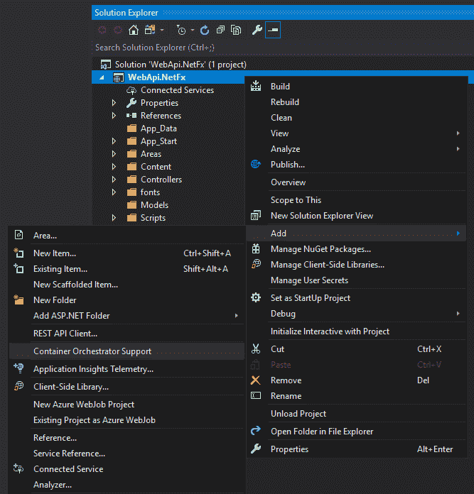
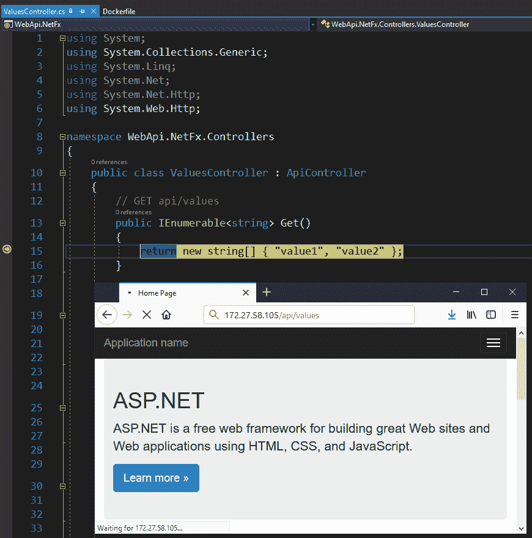
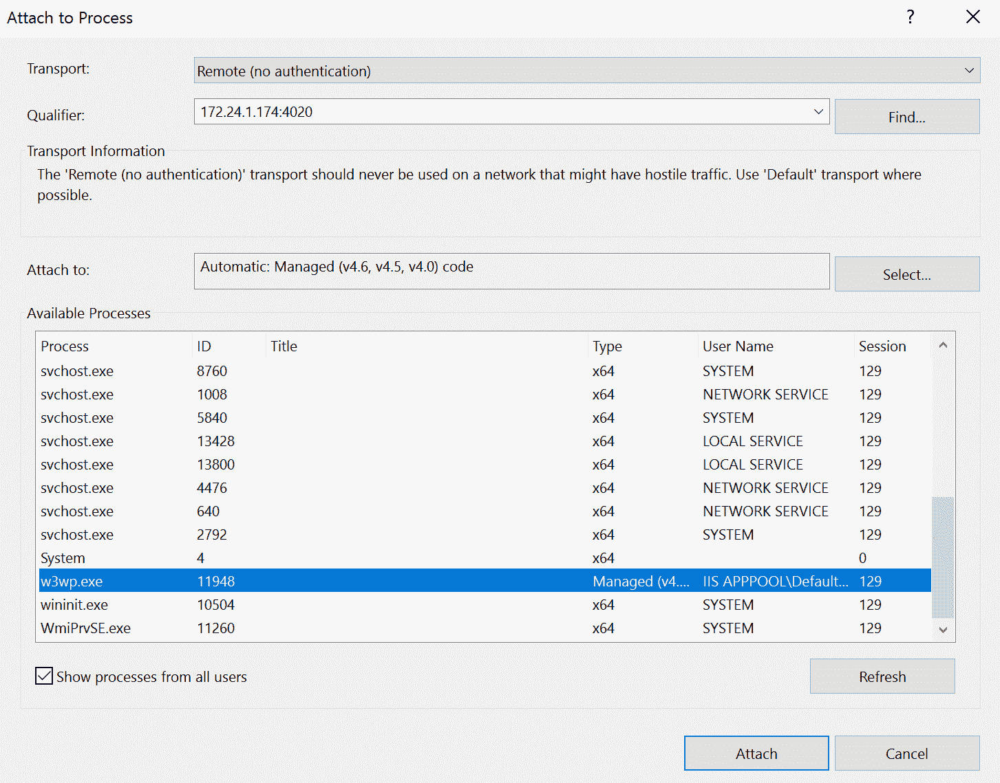
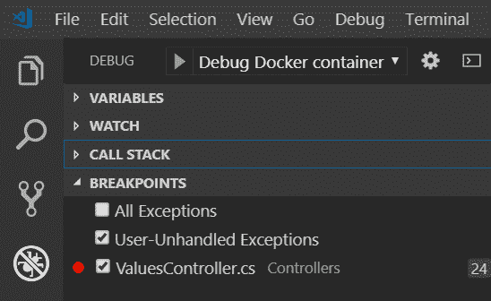
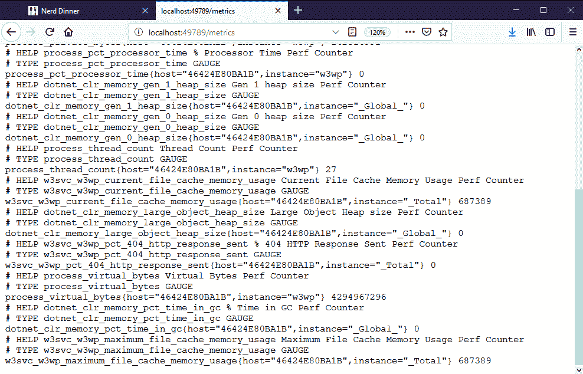
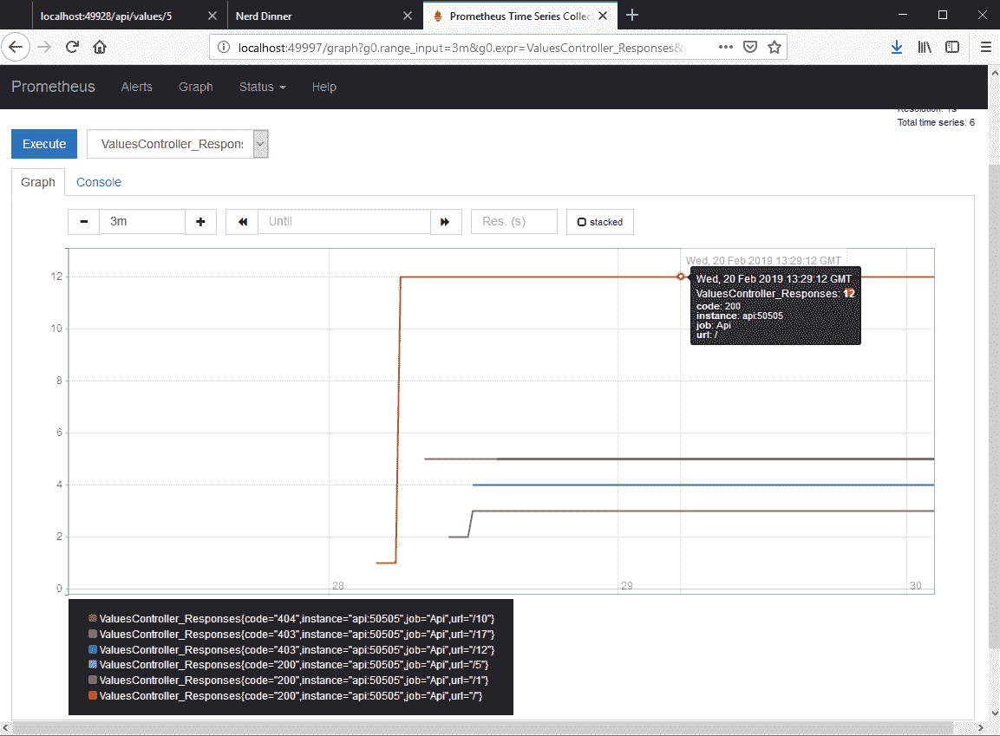
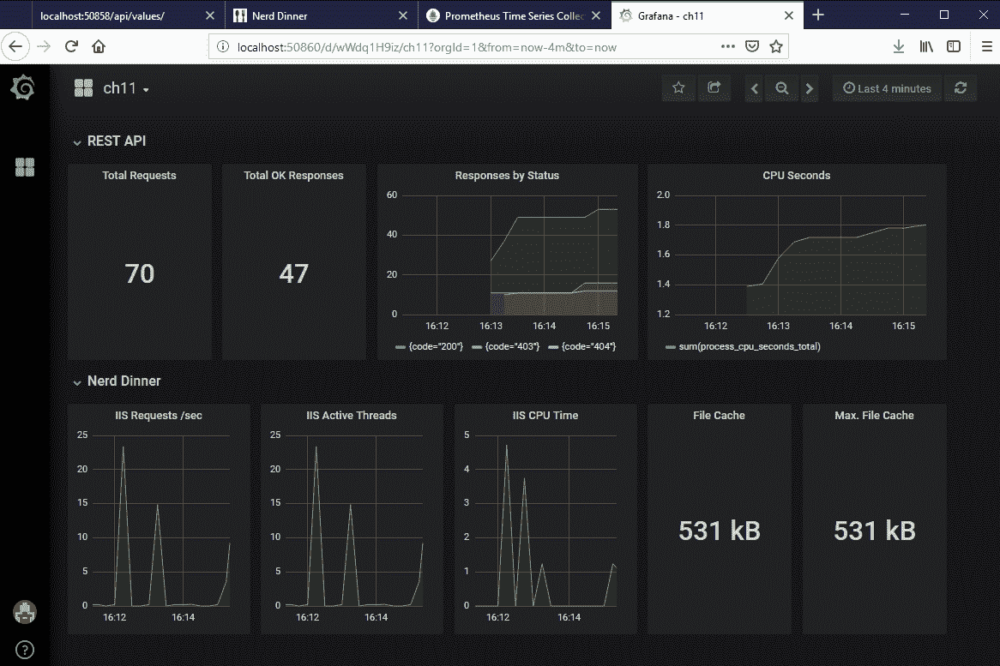

# 第十一章：调试和为应用程序容器添加仪器

Docker 可以消除典型开发人员工作流程中的许多摩擦，并显著减少在诸如依赖管理和环境配置等开销任务上花费的时间。当开发人员使用与最终产品相同的应用程序平台运行他们正在处理的更改时，部署错误的机会就会大大减少，升级路径也是直接且易于理解的。

在开发过程中在容器中运行应用程序会为您的开发环境增加另一层。您将使用不同类型的资产，如 Dockerfiles 和 Docker Compose 文件，如果您的集成开发环境支持这些类型，那么这种体验会得到改善。此外，在 IDE 和应用程序之间有一个新的运行时，因此调试体验会有所不同。您可能需要改变您的工作流程以充分利用平台的优势。

在本章中，我将介绍使用 Docker 的开发过程，涵盖 IDE 集成和调试，以及如何为您的 Docker 化应用程序添加仪器。您将了解：

+   在集成开发环境中使用 Docker

+   Docker 化应用程序中的仪器

+   Docker 中的故障修复工作流程

# 技术要求

您需要在 Windows 10 更新 18.09 或 Windows Server 2019 上运行 Docker，以便跟随示例。本章的代码可在[`github.com/sixeyed/docker-on-windows/tree/second-edition/ch11`](https://github.com/sixeyed/docker-on-windows/tree/second-edition/ch11)上找到。

# 在集成开发环境中使用 Docker

在上一章中，我演示了一个容器化的“外部循环”，即编译和打包的 CI 过程，当开发人员推送更改时，它会从中央源代码控制中触发。集成开发环境（IDE）开始支持容器化工作流程的“内部循环”，这是开发人员在将更改推送到中央源代码控制之前编写、运行和调试应用程序的过程。

Visual Studio 2017 原生支持 Docker 工件，包括 Dockerfile 的智能感知和代码完成。ASP.NET 项目在容器中运行时也有运行时支持，包括.NET Framework 和.NET Core。在 Visual Studio 2017 中，您可以按下*F5*键，您的 Web 应用程序将在 Windows 上的 Docker 桌面中运行的容器中启动。应用程序使用与您在所有其他环境中使用的相同的基本映像和 Docker 运行时。

Visual Studio 2015 有一个插件，提供对 Docker 工件的支持，Visual Studio Code 有一个非常有用的 Docker 扩展。Visual Studio 2015 和 Visual Studio Code 不提供在 Windows 容器中运行.NET 应用程序的集成*F5*调试体验，但您可以手动配置，我将在本章中演示。

在容器内调试时存在一个折衷之处-这意味着在内部循环和外部循环之间创建了一个断开。您的开发过程使用与 CI 过程不同的一组 Docker 工件，以使调试器可用于容器，并将应用程序程序集映射到源代码。好处是您可以在开发中以相同的开发人员构建和调试体验在容器中运行。缺点是您的开发 Docker 映像与您将推广到测试的映像不完全相同。

缓解这种情况的一个好方法是在快速迭代功能时，使用本地 Docker 工件进行开发。然后，在推送更改之前，您可以使用 CI Docker 工件进行最终构建和端到端测试。

# 在 Visual Studio 2017 中的 Docker

Visual Studio 2017 是所有.NET IDE 中对 Docker 支持最完整的。您可以在 Visual Studio 2017 中打开一个 ASP.NET Framework Web API 项目，右键单击该项目，然后选择添加|容器编排器支持：

只有一个编排器选项可供选择，即 Docker Compose。然后，Visual Studio 会生成一组 Docker 工件。在`Web`项目中，它创建一个看起来像这样的 Dockerfile：

[PRE0]

Dockerfile 语法有完整的智能感知支持，因此您可以将鼠标悬停在指令上并查看有关它们的信息，并使用*Ctrl* +空格键打开所有 Dockerfile 指令的提示。

生成的 Dockerfile 使用`microsoft/aspnet`基础镜像，其中包含已完全安装和配置的 ASP.NET 4.7.2。在撰写本文时，Dockerfile 使用了旧版本的 Windows 基础镜像，因此您需要手动更新为使用最新的 Windows Server 2019 基础镜像，即`mcr.microsoft.com/dotnet/framework/aspnet:4.7.2-windowsservercore-ltsc2019`。

Dockerfile 看起来很奇怪，因为它使用构建参数来指定源文件夹的位置，然后将该文件夹的内容复制到容器镜像内的 web 根目录`C:\inetpub\wwwroot`。

在解决方案根目录中，Visual Studio 创建了一组 Docker Compose 文件。有多个文件，Visual Studio 会使用它们与 Docker Compose 的`build`和`up`命令来打包和运行应用程序。当您按下*F5*键运行应用程序时，这些文件在后台运行，但值得看看 Visual Studio 如何使用它们；它向您展示了如何将此级别的支持添加到不同的 IDE 中。

# 在 Visual Studio 2017 中使用 Docker Compose 进行调试

生成的 Docker Compose 文件显示在顶级解决方案对象下：

有一个基本的`docker-compose.yml`文件，其中将 Web 应用程序定义为一个服务，并包含 Dockerfile 的构建细节：

[PRE1]

还有一个`docker-compose.override.yml`文件，它添加了端口和网络配置，以便可以在本地运行：

[PRE2]

这里没有关于构建应用程序的内容，因为编译是在 Visual Studio 中完成而不是在 Docker 中。构建的应用程序二进制文件存储在您的开发计算机上，并复制到容器中。当您按下*F5*时，容器会启动，Visual Studio 会在容器的 IP 地址上启动浏览器。您可以在 Visual Studio 中的代码中添加断点，当您从浏览器导航到该代码时，将会进入 Visual Studio 中的调试器：

这是一个无缝的体验，但不清楚发生了什么——Visual Studio 调试器在您的计算机上如何连接到容器内的二进制文件？幸运的是，Visual Studio 会将所有发出的 Docker 命令记录到输出窗口，因此您可以追踪它是如何工作的。

在构建输出窗口中，您会看到类似以下的内容：

[PRE3]

您可以看到首先进行构建，然后使用`docker-compose up`启动容器。我们已经看到的`docker-compose.yml`和`docker-compose.override.yml`文件与一个名为`docker-compose.vs.debug.g.yml`的文件一起使用。Visual Studio 在构建时生成该文件，您需要显示解决方案中的所有文件才能看到它。它包含额外的 Docker Compose 设置：

[PRE4]

这里发生了很多事情：

+   Docker 镜像使用`dev`标签来区分它与发布版本的构建

+   源位置的构建参数指定一个空目录

+   一个卷用于从主机上的项目文件夹中挂载容器中的 Web 根目录

+   第二个卷用于从主机中挂载 Visual Studio 远程调试器到容器中

+   入口点启动`ServiceMonitor`来运行 IIS，然后启动`msvsmon`，这是远程调试器

在调试模式下，源代码环境变量的参数是一个空目录。Visual Studio 使用一个空的`wwwroot`目录构建 Docker 镜像，然后将主机中的源代码文件夹挂载到容器中的 Web 根目录，以在运行时填充该文件夹。

当容器运行时，Visual Studio 会在容器内运行一些命令来设置权限，从而使远程调试工具能够工作。在 Docker 的输出窗口中，您会看到类似以下的内容：

[PRE5]

这是 Visual Studio 获取使用 Docker Compose 启动的容器的 ID，然后运行`appcmd`来设置 IIS 应用程序池以使用管理员帐户，并设置 Web 服务器以允许匿名身份验证。

当您停止调试时，Visual Studio 2017 会使容器在后台运行。如果对程序进行更改并重新构建，则仍然使用同一个容器，因此没有启动延迟。通过将项目位置挂载到容器中，重新构建时会反映出内容或二进制文件的任何更改。通过从主机挂载远程调试器，您的镜像不会包含任何开发工具；它们保留在主机上。

这是内部循环过程，您可以获得快速反馈。每当您更改并重新构建应用程序时，您都会在容器中看到这些更改。但是，调试模式下的 Docker 镜像对于外部循环 CI 过程是不可用的；应用程序不会被复制到镜像中；只有在将应用程序从本地源挂载到容器中时才能工作。

为了支持外部循环，还有一个用于发布模式的 Docker Compose 覆盖文件，以及第二个隐藏的覆盖文件，`docker-compose.vs.release.g.yml`。

[PRE6]

这里的区别在于没有将本地源位置映射到容器中的 Web 根目录。在发布模式下编译时，源参数的值是包含 Web 应用程序的发布位置。Visual Studio 通过将发布的应用程序打包到容器中来构建发布映像。

在发布模式下，您仍然可以在 Docker 容器中运行应用程序，并且仍然可以调试应用程序。但是，您会失去快速反馈循环，因为要更改应用程序，Visual Studio 需要重新构建 Docker 映像并启动新的容器。

这是一个公平的妥协，而 Visual Studio 2017 中的 Docker 工具为您提供了无缝的开发体验，以及 CI 构建的基础。Visual Studio 2017 没有使用多阶段构建，因此项目编译仍然发生在主机而不是容器内。这使得生成的 Docker 工件不够便携，因此您需要不仅仅是 Docker 来在服务器上构建此应用程序。

# Visual Studio 2015 中的 Docker

Visual Studio 2015 在市场上有一个名为**Visual Studio Tools for Docker**的插件。这为 Dockerfile 提供了语法高亮显示，但它并没有将 Visual Studio 与.NET Framework 应用程序的 Docker 集成。在 Visual Studio 2015 中，您可以为.NET Core 项目添加 Docker 支持，但是您需要手动编写自己的 Dockerfile 和 Docker Compose 文件以支持完整的.NET 应用程序。

此外，没有集成的调试功能用于在 Windows 容器中运行的应用程序。您仍然可以调试在容器中运行的代码，但是您需要手动配置设置。我将演示如何使用与 Visual Studio 2017 相同的方法以及一些相同的妥协来做到这一点。

在 Visual Studio 2017 中，您可以将包含远程调试器的文件夹从主机挂载到容器中。当您运行项目时，Visual Studio 会启动一个容器，并从主机执行`msvsmon.exe`，这是远程调试器代理。您不需要在图像中安装任何内容来提供调试体验。

Visual Studio 2015 中的远程调试器并不是很便携。你可以从主机中将调试器挂载到容器中，但当你尝试启动代理时，你会看到有关缺少文件的错误。相反，你需要将远程调试器安装到你的镜像中。

我在一个名为`ch11-webapi-vs2015`的文件夹中设置了这个。在这个镜像的 Dockerfile 中，我使用了一个构建时参数来有条件地安装调试器，如果`configuration`的值设置为`debug`。这意味着我可以在本地构建时安装调试器，但当我为部署构建时，镜像就不会有调试器了：

[PRE7]

当以调试模式运行时，我使用与 Visual Studio 2017 相同的方法将主机上的源目录挂载到容器中，但我创建了一个自定义网站，而不是使用默认的网站：

[PRE8]

`COPY`指令中的`:-`语法指定了一个默认值，如果未提供`source`参数。默认值是从发布的 web 应用程序复制，除非在`build`命令中指定了它。我有一个核心的`docker-compose.yml`文件，其中包含基本的服务定义，还有一个`docker-compose.debug.yml`文件，它挂载主机源位置，映射调试器端口，并指定`configuration`变量。

[PRE9]

在 compose 文件中指定的标签将一个键值对附加到容器。该值在容器内部不可见，不像环境变量，但对主机上的外部进程可见。在这种情况下，它被 Visual Studio 用来识别容器的操作系统。

要以调试模式启动应用程序，我使用两个 Compose 文件来启动应用程序：

[PRE10]

现在，容器正在使用**Internet Information Services** (**IIS**)在容器内部运行我的 web 应用程序，并且 Visual Studio 远程调试器代理也在运行。我可以连接到 Visual Studio 2015 中的远程进程，并使用容器的 IP 地址：

Visual Studio 中的调试器连接到容器中运行的代理，并且我可以添加断点和查看变量，就像调试本地进程一样。在这种方法中，容器使用主机挂载来获取 web 应用的内容。我可以停止调试器，进行更改，重新构建应用程序，并在同一个容器中看到更改，而无需启动新的容器。

这种方法与 Visual Studio 2017 中集成的 Docker 支持具有相同的优缺点。我正在容器中运行我的应用程序进行本地调试，因此我可以获得 Visual Studio 调试器的所有功能，并且我的应用程序在其他环境中使用的平台上运行。但我不会使用相同的映像，因为 Dockerfile 具有条件分支，因此它会为调试和发布模式生成不同的输出。

在 Docker 构件中手动构建调试器支持有一个优势。您可以构建具有条件的 Dockerfile，以便默认的`docker image build`命令生成无需任何额外构件即可用于生产的图像。但是，这个例子仍然没有使用多阶段构建，因此 Dockerfile 不具备可移植性，应用程序在打包之前需要进行编译。

在开发中，您可以以调试模式构建图像一次，运行容器，然后在需要时附加调试器。您的集成测试构建并运行生产图像，因此只有内部循环具有额外的调试器组件。

# Visual Studio Code 中的 Docker

Visual Studio Code 是一个新的跨平台 IDE，用于跨平台开发。C#扩展安装了一个可以附加到.NET Core 应用程序的调试器，但不支持调试完整的.NET Framework 应用程序。

Docker 扩展添加了一些非常有用的功能，包括将 Dockerfiles 和 Docker Compose 文件添加到已知平台的现有项目中，例如 Go 和.NET Core。您可以将 Dockerfile 添加到.NET Core 项目中，并选择在 Windows 或 Linux 容器之间进行选择作为基础-点击* F1 *，键入`docker`，然后选择将 Docker 文件添加到工作区：

！

以下是.NET Core Web API 项目的生成的 Dockerfile：

[PRE11]

这是使用旧版本的.NET Core 基础映像，因此第一步是将`FROM`行中的`nanoserver-1803`标签替换为`nanoserver-1809`。该扩展程序生成了一个多阶段的 Dockerfile，使用 SDK 映像进行构建和发布阶段，以及 ASP.NET Core 运行时用于最终映像。VS Code 在 Dockerfile 中生成了比实际需要更多的阶段，但这是一个设计选择。

VS Code 还会生成一个`.dockerignore`文件。这是一个有用的功能，可以加快 Docker 镜像的构建速度。在忽略文件中，您列出任何在 Dockerfile 中未使用的文件或目录路径，并且这些文件将被排除在构建上下文之外。排除所有`bin`、`obj`和`packages`文件夹意味着当您构建图像时，Docker CLI 向 Docker Engine 发送的有效负载要小得多，这可以加快构建速度。

您可以使用 F1 | docker tasks 来构建图像并运行容器，但是没有功能以生成 Docker Compose 文件的方式，就像 Visual Studio 2017 那样。

Visual Studio Code 具有非常灵活的系统，可以运行和调试您的项目，因此您可以添加自己的配置，为在 Windows 容器中运行的应用程序提供调试支持。您可以编辑`launch.json`文件，以添加新的配置以在 Docker 中进行调试。

在`ch11-webapi-vscode`文件夹中，我有一个示例.NET Core 项目，可以在 Docker 中运行该应用程序并附加调试器。它使用与 Visual Studio 2017 相同的方法。.NET Core 的调试器称为`vsdbg`，并且与 Visual Studio Code 中的 C#扩展一起安装，因此我使用`docker-compose.debug.yml`文件将`vsdbg`文件夹从主机挂载到容器中，以及使用源位置：

[PRE12]

此设置使用特定版本的 C#扩展。在我的情况下是 1.17.1，但您可能有不同的版本。检查您的用户目录中`.vscode`文件夹中`vsdbg.exe`的位置。

当您通过使用调试覆盖文件在 Docker Compose 中运行应用程序时，它会启动.NET Core 应用程序，并使来自主机的调试器可用于在容器中运行。这是在 Visual Studio Code 的`launch.json`文件中配置的调试体验。`Debug Docker container`配置指定要调试的应用程序类型和要附加的进程的名称：

[PRE13]

此配置还将容器中的应用程序根映射到主机上的源代码位置，因此调试器可以将正确的源文件与调试文件关联起来。此外，调试器配置指定了如何通过在命名容器上运行`docker container exec`命令来启动调试器：

[PRE14]

要调试我的应用程序，我需要使用 Docker Compose 和覆盖文件在调试配置中构建和运行它：

[PRE15]

然后，我可以使用调试操作并选择调试 Docker 容器来激活调试器：

Visual Studio Code 在容器内启动.NET Core 调试器`vsdbg`，并将其附加到正在运行的`dotnet`进程。您将看到.NET Core 应用程序的输出被重定向到 Visual Studio Code 中的 DEBUG CONSOLE 窗口中：

在撰写本文时，Visual Studio Code 尚未完全与在 Windows Docker 容器内运行的调试器集成。您可以在代码中设置断点，调试器将暂停进程，但控制权不会传递到 Visual Studio Code。这是在 Nano Server 容器中运行 Omnisharp 调试器的已知问题-在 GitHub 上进行跟踪：[`github.com/OmniSharp/omnisharp-vscode/issues/1001`](https://github.com/OmniSharp/omnisharp-vscode/issues/1001)。

在容器中运行应用程序并能够从您的常规 IDE 进行调试是一个巨大的好处。这意味着您的应用程序在相同的平台上运行，并且具有与在所有其他环境中使用的相同部署配置，但您可以像在本地运行一样进入代码。

IDE 中的 Docker 支持正在迅速改善，因此本章中详细介绍的所有手动步骤将很快内置到产品和扩展中。JetBrains Rider 是一个很好的例子，它是一个与 Docker 很好配合的第三方.NET IDE。它与 Docker API 集成，并可以将自己的调试器附加到正在运行的容器中。

# Docker 化应用程序中的仪器

调试应用程序是在逻辑不按预期工作时所做的事情，您正在尝试跟踪出现问题的原因。您不会在生产环境中进行调试，因此您需要您的应用程序记录其行为，以帮助您跟踪发生的任何问题。

仪器经常被忽视，但它应该是您开发的一个关键组成部分。这是了解应用程序在生产环境中的健康状况和活动的最佳方式。在 Docker 中运行应用程序为集中日志记录和仪器提供了新的机会，这样您可以获得对应用程序不同部分的一致视图，即使它们使用不同的语言和平台。

向您的容器添加仪表化可以是一个简单的过程。Windows Server Core 容器已经在 Windows 性能计数器中收集了大量的指标。使用.NET 或 IIS 构建的 Docker 镜像也将具有来自这些堆栈的所有额外性能计数器。您可以通过将性能计数器值暴露给指标服务器来为容器添加仪表化。

# 使用 Prometheus 进行仪表化

围绕 Docker 的生态系统非常庞大和活跃，充分利用了平台的开放标准和可扩展性。随着生态系统的成熟，一些技术已经成为几乎所有 Docker 化应用程序中强有力的候选项。

Prometheus 是一个开源的监控解决方案。它是一个灵活的组件，您可以以不同的方式使用，但典型的实现方式是在 Docker 容器中运行一个 Prometheus 服务器，并配置其读取您在其他 Docker 容器中提供的仪表化端点。

您可以配置 Prometheus 来轮询所有容器端点，并将结果存储在时间序列数据库中。您可以通过简单地添加一个 REST API 来向您的应用程序添加一个 Prometheus 端点，该 API 会响应来自 Prometheus 服务器的`GET`请求，并返回您感兴趣的指标列表。

对于.NET Framework 和.NET Core 项目，有一个 NuGet 包可以为您完成这项工作，即向您的应用程序添加一个 Prometheus 端点。它默认公开了一组有用的指标，包括关键的.NET 统计数据和 Windows 性能计数器的值。您可以直接向您的应用程序添加 Prometheus 支持，或者您可以在应用程序旁边运行一个 Prometheus 导出器。

您采取的方法将取决于您想要为其添加仪表化的应用程序类型。如果是要将传统的.NET Framework 应用程序移植到 Docker 中，您可以通过在 Docker 镜像中打包一个 Prometheus 导出器来添加基本的仪表化，这样就可以在不需要更改代码的情况下获得有关应用程序的指标。对于新应用程序，您可以编写代码将特定的应用程序指标暴露给 Prometheus。

# 将.NET 应用程序指标暴露给 Prometheus

`prometheus-net` NuGet 包提供了一组默认的指标收集器和一个`MetricServer`类，该类提供了 Prometheus 连接的仪表端点。该包非常适合为任何应用程序添加 Prometheus 支持。这些指标由自托管的 HTTP 端点提供，您可以为您的应用程序提供自定义指标。

在`dockeronwindows/ch11-api-with-metrics`镜像中，我已经将 Prometheus 支持添加到了一个 Web API 项目中。配置和启动指标端点的代码在`PrometheusServer`类中。

[PRE16]

这将启动一个新的`MetricServer`实例，监听端口`50505`，并运行`NuGet`包提供的默认一组.NET 统计和性能计数器收集器。这些是按需收集器，这意味着它们在 Prometheus 服务器调用端点时提供指标。

`MetricServer`类还将返回您在应用程序中设置的任何自定义指标。Prometheus 支持不同类型的指标。最简单的是计数器，它只是一个递增的计数器—Prometheus 查询您的应用程序的指标值，应用程序返回每个计数器的单个数字。在`ValuesController`类中，我设置了一些计数器来记录对 API 的请求和响应：

[PRE17]

当请求进入控制器时，控制器动作方法通过在计数器对象上调用`Inc()`方法来增加 URL 的请求计数，并增加响应代码的状态计数：

[PRE18]

Prometheus 还有各种其他类型的指标，您可以使用它们来记录有关应用程序的关键信息—计数器只增加，但是仪表可以增加和减少，因此它们对于记录快照非常有用。Prometheus 记录每个指标值及其时间戳和您提供的一组任意标签。在这种情况下，我将添加`URL`和`HTTP`方法到请求计数，以及 URL 和状态代码到响应计数。我可以使用这些在 Prometheus 中聚合或过滤指标。

我在 Web API 控制器中设置的计数器为我提供了一组自定义指标，显示了哪些端点正在使用以及响应的状态。这些由服务器组件在`NuGet`包中公开，以及用于记录系统性能的默认指标。在此应用的 Dockerfile 中，还有两行额外的代码用于 Prometheus 端点：

[PRE19]

第一行只是暴露了我用于度量端点的自定义端口。第二行设置了该端点所需的权限。在这种情况下，度量端点托管在 ASP.NET 应用程序内部，因此 IIS 用户帐户需要权限来监听自定义端口并访问系统性能计数器。

您可以按照通常的方式构建 Dockerfile 并从镜像运行容器，即通过使用 `-P` 发布所有端口：

[PRE20]

为了检查度量是否被记录和暴露，我可以运行一些 PowerShell 命令来抓取容器的端口，然后对 API 端点进行一些调用并检查度量：

[PRE21]

您将看到按名称和标签分组的度量的纯文本列表。每个度量还包含 Prometheus 的元数据，包括度量名称、类型和友好描述：

[PRE22]

完整的输出要大得多。在这个片段中，我展示了线程总数、分配的内存和 CPU 使用率，这些都来自容器内部的标准 Windows 和 .NET 性能计数器。我还展示了自定义的 HTTP 请求和响应计数器。

此应用程序中的自定义计数器显示了 URL 和响应代码。在这种情况下，我可以看到对值控制器的根 URL 的 10 个请求，以及带有 OK 状态码 `200` 的十个响应。在本章后面，我将向您展示如何使用 Grafana 可视化这些统计信息。

将 `NuGet` 包添加到项目并运行 `MetricServer` 是源代码的简单扩展。它让我记录任何有用的度量，但这意味着改变应用程序，因此只适用于正在积极开发的应用程序。

在某些情况下，您可能希望添加监视而不更改要检测的应用程序。在这种情况下，您可以在应用程序旁边运行一个**导出器**。导出器从应用程序进程中提取度量并将其暴露给 Prometheus。在 Windows 容器中，您可以从标准性能计数器中获取大量有用的信息。

# 在现有应用程序旁边添加 Prometheus 导出器

在 Docker 化解决方案中，Prometheus 将定期调用从容器中暴露的度量端点，并存储结果。对于现有应用程序，您无需添加度量端点 - 您可以在当前应用程序旁边运行一个控制台应用程序，并在该控制台应用程序中托管度量端点。

我在第十章中为 NerdDinner Web 应用程序添加了一个 Prometheus 端点，*使用 Docker 支持持续部署流水线*，而没有更改任何代码。在`dockeronwindows/ch11-nerd-dinner-web-with-metrics`镜像中，我添加了一个导出 ASP.NET 性能计数器并提供指标端点的控制台应用程序。ASP.NET 导出程序应用程序来自 Docker Hub 上的公共镜像。NerdDinner 的完整 Dockerfile 复制了导出程序的二进制文件，并为容器设置了启动命令：

[PRE23]

`aspnet-exporter.exe`控制台应用程序实现了一个自定义的指标收集器，它读取系统上运行的命名进程的性能计数器值。它使用与 NuGet 包中默认收集器相同的一组计数器，但它针对不同的进程。导出程序读取 IIS `w3wp.exe`进程的性能计数器，并配置为导出关键的 IIS 指标。

导出程序的源代码都在 GitHub 的`dockersamples/aspnet-monitoring`存储库中。

控制台导出程序是一个轻量级组件。它在容器启动时启动，并在容器运行时保持运行。只有在调用指标端点时才使用计算资源，因此在 Prometheus 计划运行时影响最小。我按照通常的方式运行 NerdDinner（这里，我只运行 ASP.NET 组件，而不是完整的解决方案）：

[PRE24]

我可以按照通常的方式获取容器端口并浏览 NerdDinner。然后，我还可以浏览导出程序端口上的指标端点，该端点发布 IIS 性能计数器：

在这种情况下，没有来自应用程序的自定义计数器，所有指标都来自标准的 Windows 和.NET 性能计数器。导出程序应用程序可以读取运行的`w3wp`进程的这些性能计数器值，因此应用程序无需更改即可向 Prometheus 提供基本信息。

这些是运行时指标，告诉您 IIS 在容器内的工作情况。您可以看到活动线程的数量，内存使用情况以及 IIS 文件缓存的大小。还有关于 IIS 响应的 HTTP 状态代码百分比的指标，因此您可以看到是否有大量的 404 或 500 错误。

要记录自定义应用程序度量，您需要为您的代码添加仪器，并明确记录您感兴趣的数据点。您需要为此付出努力，但结果是一个已经仪器化的应用程序，在其中您可以看到关键性能度量，除了.NET 运行时度量。

为 Docker 化的应用程序添加仪器意味着为 Prometheus 提供度量端点以进行查询。Prometheus 服务器本身在 Docker 容器中运行，并且您可以配置它以监视您想要监视的服务。

# 在 Windows Docker 容器中运行 Prometheus 服务器

Prometheus 是一个用 Go 编写的跨平台应用程序，因此它可以在 Windows 容器或 Linux 容器中运行。与其他开源项目一样，团队在 Docker Hub 上发布了一个 Linux 镜像，但你需要构建自己的 Windows 镜像。我正在使用一个现有的镜像，该镜像将 Prometheus 打包到了来自 GitHub 上相同的`dockersamples/aspnet-monitoring`示例中的 Windows Server 2019 容器中，我用于 ASP.NET 导出器。

Prometheus 的 Dockerfile 并没有做任何在本书中已经看到过很多次的事情——它下载发布文件，提取它，并设置运行时环境。Prometheus 服务器有多个功能：它运行定期作业来轮询度量端点，将数据存储在时间序列数据库中，并提供一个 REST API 来查询数据库和一个简单的 Web UI 来浏览数据。

我需要为调度器添加自己的配置，我可以通过运行一个容器并挂载一个卷来完成，或者在集群模式下使用 Docker 配置对象。我的度量端点的配置相当静态，因此最好将一组默认配置捆绑到我的自己的 Prometheus 镜像中。我已经在`dockeronwindows/ch11-prometheus:2e`中做到了这一点，它有一个非常简单的 Dockerfile：

[PRE25]

我已经有从我的仪器化 API 和 NerdDinner web 镜像运行的容器，这些容器公开了供 Prometheus 消费的度量端点。为了在 Prometheus 中监视它们，我需要在`prometheus.yml`配置文件中指定度量位置。Prometheus 将按可配置的时间表轮询这些端点。它称之为**抓取**，我已经在`scrape_configs`部分中添加了我的容器名称和端口：

[PRE26]

要监视的每个应用程序都被指定为一个作业，每个端点都被列为一个目标。Prometheus 将在同一 Docker 网络上的容器中运行，因此我可以通过容器名称引用目标。

这个设置是为单个 Docker 引擎设计的，但您可以使用相同的方法使用 Prometheus 监视跨多个副本运行的服务，只需使用不同的配置设置。我在我的 Pluralsight 课程*使用 Docker 监视容器化应用程序健康状况*中详细介绍了 Windows 和 Linux 容器。 

现在，我可以在容器中启动 Prometheus 服务器：

[PRE27]

Prometheus 轮询所有配置的指标端点并存储数据。您可以将 Prometheus 用作丰富 UI 组件（如 Grafana）的后端，将所有运行时 KPI 构建到单个仪表板中。对于基本监控，Prometheus 服务器在端口`9090`上有一个简单的 Web UI。

我可以转到 Prometheus 容器的发布端口，对其从我的应用程序容器中抓取的数据运行一些查询。Prometheus UI 可以呈现原始数据，或者随时间聚合的图表。这是由 REST API 应用程序发送的 HTTP 响应：

您可以看到每个不同标签值的单独行，因此我可以看到不同 URL 的不同响应代码。这些是随着容器的寿命而增加的计数器，因此图表将始终上升。Prometheus 具有丰富的功能集，因此您还可以绘制随时间变化的变化率，聚合指标并选择数据的投影。

来自 Prometheus `NuGet`软件包的其他计数器是快照，例如性能计数器统计信息。我可以从 NerdDinner 容器中看到 IIS 处理的每秒请求的数量：

在 Prometheus 中，指标名称非常重要。如果我想比较.NET 控制台和 ASP.NET 应用程序的内存使用情况，那么如果它们具有相同的指标名称，比如`process_working_set`，我可以查询两组值。每个指标的标签标识提供数据的服务，因此您可以对所有服务进行聚合或对特定服务进行筛选。您还应该将每个容器的标识符作为指标标签包括在内。导出器应用程序将服务器主机名添加为标签。实际上，这是容器 ID，因此在大规模运行时，您可以对整个服务进行聚合或查看单个容器。

在第八章中，《管理和监控 Docker 化解决方案》，我演示了 Docker Enterprise 中的**Universal Control Plane**（**UCP**），这是**Containers-as-a-Service**（**CaaS**）平台。启动和管理 Docker 容器的标准 API 使该工具能够提供集中的管理和管理体验。Docker 平台的开放性使开源工具可以采用相同的方法进行丰富的、集中的监控。

Prometheus 就是一个很好的例子。它作为一个轻量级服务器运行，非常适合在容器中运行。您可以通过向应用程序添加指标端点或在现有应用程序旁边运行指标导出器来为应用程序添加对 Prometheus 的支持。Docker 引擎本身可以配置为导出 Prometheus 指标，因此您可以收集有关容器和节点健康状况的低级指标。

这些指标是您需要的全部内容，可以为您提供关于应用程序健康状况的丰富仪表板。

# 在 Grafana 中构建应用程序仪表板

Grafana 是用于可视化数据的 Web UI。它可以从许多数据源中读取，包括时间序列数据库（如 Prometheus）和关系数据库（如 SQL Server）。您可以在 Grafana 中构建仪表板，显示整个应用程序资产的健康状况，包括业务 KPI、应用程序和运行时指标以及基础设施健康状况。

通常，您会将 Grafana 添加到容器化应用程序中，以呈现来自 Prometheus 的数据。您也可以在容器中运行 Grafana，并且可以打包您的 Docker 镜像，以便内置仪表板、用户帐户和数据库连接。我已经为本章的最后部分做了这样的处理，在`dockeronwindows/ch11-grafana:2e`镜像中。Grafana 团队没有在 Docker Hub 上发布 Windows 镜像，因此我的 Dockerfile 从示例镜像开始，并添加了我设置的所有配置。

[PRE28]

Grafana 有两种自动部署方法。第一种只是使用已知位置的文件，我用它来设置 Prometheus 数据源、仪表板和仪表板提供程序，它只是将 Grafana 指向仪表板目录。第二种使用 REST API 进行身份验证和授权，我的`init.ps1`脚本使用它来创建一个只读用户，该用户可以访问仪表板。

使用 Grafana 创建自己的仪表板很简单。您可以为特定类型的可视化创建面板——支持数字、图形、热图、交通灯和表格。然后，您将面板连接到数据源并指定查询。通常，您会使用 Prometheus UI 来微调查询，然后将其添加到 Grafana 中。为了节省时间，我的镜像带有一个现成的仪表板。

我将使用`ch11`文件夹中的 Docker Compose 文件启动监控解决方案，然后浏览 API 和网站以生成一些流量。现在，我可以浏览 Grafana，并使用用户名`viewer`和密码`readonly`登录，然后我会看到仪表板：

这只是一个示例仪表板，但它让您了解可以呈现多少信息。我为 REST API 设置了一行，显示了 HTTP 请求和响应的细分，以及 CPU 使用情况的整体视图。我还为 NerdDinner 设置了一行，显示了来自 IIS 的性能指标和缓存使用的头条统计数据。

您可以轻松地向所有应用程序添加工具，并构建详细的仪表板，以便深入了解解决方案中发生的情况。而且，您可以在每个环境中具有完全相同的监视设施，因此在开发和测试中，您可以看到与生产中使用的相同指标。这在追踪性能问题方面非常有用。开发人员可以为性能问题添加新的指标和可视化，解决问题，当更改生效时，它将包括可以在生产中跟踪的新指标。

我将在本章中讨论的最后一件事是如何修复 Docker 中的错误，以及容器化如何使这变得更加容易。

# Docker 中的错误修复工作流程

在修复生产缺陷时最大的困难之一是在开发环境中复制它们。这是确认您有错误并深入查找问题的起点。这也可能是问题中最耗时的部分。

大型.NET 项目往往发布不频繁，因为发布过程复杂，并且需要大量手动测试来验证新功能并检查任何回归。一年可能只有三到四次发布，并且开发人员可能发现自己不得不在发布过程的不同部分支持应用程序的多个版本。

在这种情况下，您可能在生产中有 1.0 版本，在用户验收测试（UAT）中有 1.1 版本，在系统测试中有 1.2 版本。开发团队可能需要跟踪和修复任何这些版本中提出的错误，而他们目前正在处理 1.3 版本，甚至是 2.0 的重大升级。

# 在 Docker 之前修复错误

我经常处于这种境地，不得不从我正在工作的重构后的 2.0 代码库切换回即将发布的 1.1 代码库。上下文切换是昂贵的，但是设置开发环境以重新创建 1.1 UAT 环境的过程更加昂贵。

发布过程可能会创建一个带版本号的 MSI，但通常你不能在开发环境中直接运行它。安装程序可能会打包特定环境的配置。它可能已经以发布模式编译并且没有 PDB 文件，因此没有附加调试器的选项，它可能具有我在开发中没有的先决条件，比如证书、加密密钥或其他软件组件。

相反，我需要重新编译源代码中的 1.1 版本。希望发布过程提供了足够的信息，让我找到用于构建发布的确切源代码，然后在本地克隆它（也许 Git 提交 ID 或 TFS 变更集记录在构建的程序集中）。然后，当我尝试在我的本地开发环境中重新创建另一个环境时，真正的问题开始了。

工作流程看起来有点像这样，在我的设置和 1.1 环境之间存在许多差异：

+   在本地编译源代码。我将在 Visual Studio 中构建应用程序，但发布版本使用的是 MSBuild 脚本，它做了很多额外的事情。

+   在本地运行应用程序。我将在 Windows 10 上使用 IIS Express，但发布使用的是部署到 Windows Server 2012 上的 IIS 8 的 MSI。

+   我的本地 SQL Server 数据库设置为我正在使用的 2.0 架构。发布中有从 1.0 升级到 1.1 的升级脚本，但没有从 2.0 降级到 1.1 的脚本，因此我需要手动修复本地架构。

+   对于我无法在本地运行的任何依赖项，例如第三方 API，我有存根。发布使用真实的应用程序组件。

即使我可以获得版本 1.1 的确切源代码，我的开发环境与 UAT 环境存在巨大差异。这是我能做的最好的，可能需要数小时的努力。为了减少这段时间，我可以采取捷径，比如利用我对应用程序的了解来运行版本 1.1 与 2.0 数据库架构，但采取捷径意味着我的本地环境与目标环境更不相似。

在这一点上，我可以以调试模式运行应用程序并尝试复制问题。如果错误是由 UAT 中的数据问题或环境问题引起的，那么我将无法复制它，可能需要花费整整一天的时间才能找出这一点。如果我怀疑问题与 UAT 的设置有关，我无法在我的环境中验证这一点；我需要与运维团队合作，查看 UAT 配置。

但希望我可以通过按照错误报告中的步骤重现问题。当我弄清楚手动步骤后，我可以编写一个失败的测试来复制问题，并且在更改代码并且测试运行成功时，我可以确信我已经解决了问题。我的环境与 UAT 之间存在差异，因此可能是我的分析不正确，修复无法修复 UAT，但直到下一个发布之前我才能发现这一点。

如何将该修复发布到 UAT 环境是另一个问题。理想情况下，完整的 CI 和打包过程已经为 1.1 分支设置好，因此我只需推送我的更改，然后就会出现一个准备部署的新 MSI。在最坏的情况下，CI 仅从主分支运行，因此我需要在修复分支上设置一个新的作业，并尝试配置该作业与上次 1.1 发布时相同。

如果在 1.1 和 2.0 之间的任何工具链部分发生了变化，那么这将使整个过程的每一步都变得更加困难，从配置本地环境，运行应用程序，分析问题到推送修复。

# 使用 Docker 修复错误

使用 Docker 的过程要简单得多。要在本地复制 UAT 环境，我只需要从在 UAT 中运行的相同镜像中运行容器。将有一个描述整个解决方案的 Docker Compose 或堆栈文件进行版本控制，因此通过部署版本 1.1，我可以获得与 UAT 完全相同的环境，而无需从源代码构建。

我应该能够在这一点上复制问题并确认它是编码问题还是与数据或环境有关的问题。如果是配置问题，那么我应该看到与 UAT 相同的问题，并且我可以使用更新的 Compose 文件测试修复。如果是编码问题，那么我需要深入了解代码。

在这一点上，我可以从版本 1.1 标签中克隆源代码并以调试模式构建 Docker 镜像，但除非我相当确定这是应用程序中的问题，否则我不会花时间这样做。如果我在 Dockerfile 中使用多阶段构建，并且所有版本都在其中固定，那么本地构建将产生与在 UAT 中运行的相同镜像，但会有额外的用于调试的工件。

现在，我可以找到问题，编写测试并修复错误。当新的集成测试通过时，它是针对我将在 UAT 中部署的相同 Docker 化解决方案执行的，因此我可以非常确信该错误已经被修复。

如果 1.1 分支没有配置 CI，那么设置它应该很简单，因为构建任务只需要运行`docker image build`或`docker-compose build`命令。如果我想要快速反馈，我甚至可以将本地构建的镜像推送到注册表，并部署一个新的 UAT 环境来验证修复，同时配置 CI 设置。新环境将只是测试集群上的不同堆栈，因此我不需要为部署再委托更多的基础设施。

Docker 的工作流程更加清洁和快速，但更重要的是，风险要小得多。当您在本地复制问题时，您使用的是与 UAT 环境上完全相同的应用程序组件在完全相同的平台上运行。当您测试您的修复时，您知道它将在 UAT 中起作用，因为您将部署相同的新构件。

将您投入 Docker 化应用程序的时间将通过节省支持应用程序多个版本的时间而多次偿还。

# 总结

本章讨论了在容器中运行的应用程序的故障排除，以及调试和仪器化。Docker 是一个新的应用程序平台，但是容器中的应用程序作为主机上的进程运行，因此它们仍然是远程调试和集中监控的合适目标。

Visual Studio 的所有当前版本都支持 Docker。Visual Studio 2017 具有最完整的支持，涵盖 Linux 和 Windows 容器。Visual Studio 2015 和 Visual Studio Code 目前具有提供 Linux 容器调试的扩展。您可以轻松添加对 Windows 容器的支持，但完整的调试体验仍在不断发展。

在本章中，我还介绍了 Prometheus，这是一个轻量级的仪器和监控组件，您可以在 Windows Docker 容器中运行。Prometheus 存储它从其他容器中运行的应用程序提取的指标。容器的标准化性质使得配置诸如这样的监控解决方案非常简单。我使用 Prometheus 数据来驱动 Grafana 中的仪表板，该仪表板在容器中运行，这是呈现应用程序健康状况的综合视图的简单而强大的方式。

下一章是本书的最后一章。我将以分享一些在您自己的领域中开始使用 Docker 的方法结束，包括我在现有项目中在 Windows 上使用 Docker 的案例研究。
