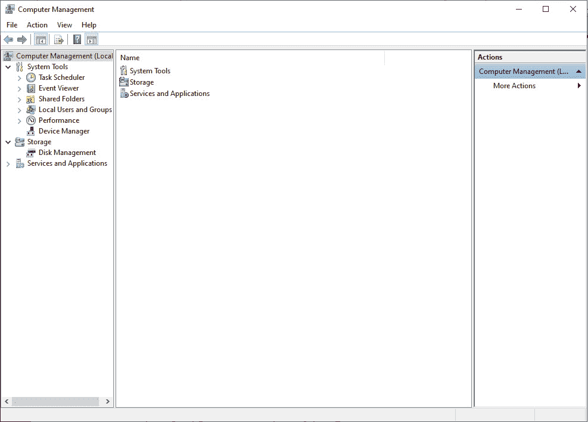
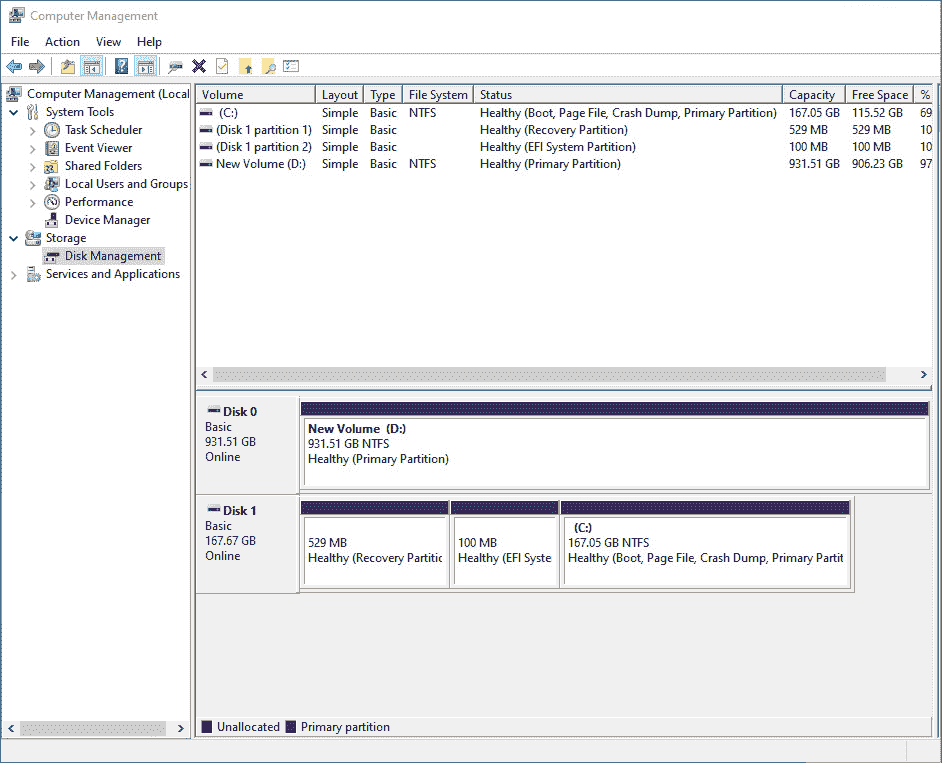
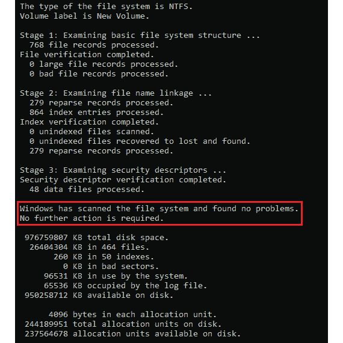
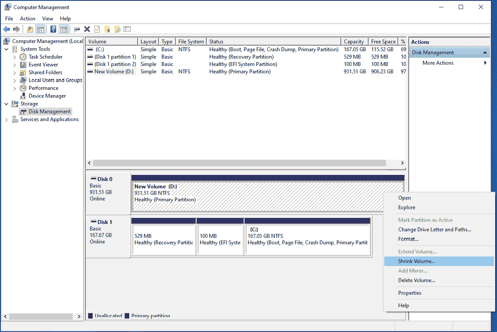
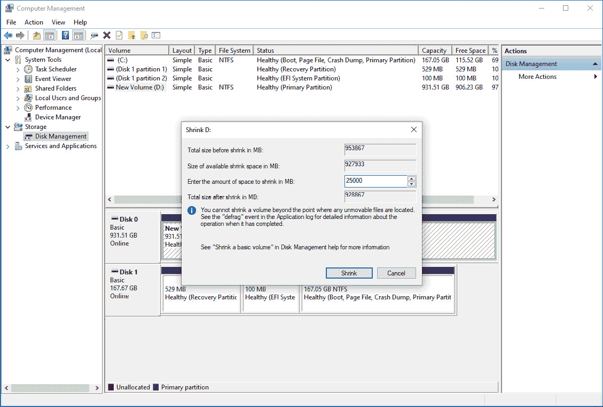
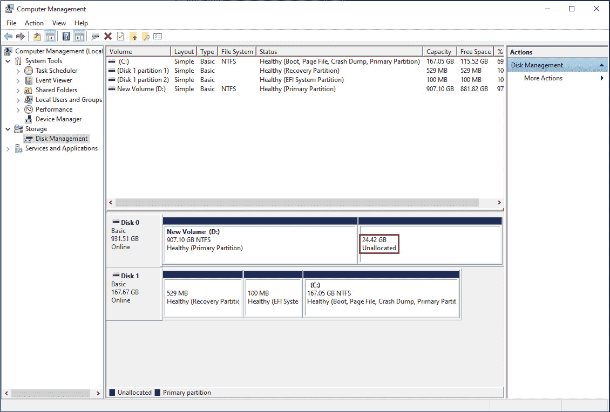

# 前言

# 关于本书

Docker 容器是高度可扩展软件系统的未来，并且可以轻松创建、运行和部署应用程序。

如果您希望利用它们而不被技术细节所压倒，那么请将*The Docker Workshop*添加到您的阅读列表中！

通过本书，您将能够快速掌握容器和 Docker 的知识，并通过互动活动使用它们。

这个研讨会从 Docker 容器的概述开始，让您了解它们的工作原理。您将运行第三方 Docker 镜像，并使用 Dockerfiles 和多阶段 Dockerfiles 创建自己的镜像。接下来，您将为 Docker 镜像创建环境，并通过持续集成加快部署过程。在前进的过程中，您将涉足有趣的主题，并学习如何使用 Docker Swarm 实现生产就绪环境。为了进一步保护 Docker 镜像，并确保生产环境以最大容量运行，您将应用最佳实践。随后，您将学会成功将 Docker 容器从开发转移到测试，然后进入生产。在此过程中，您将学习如何解决问题，清理资源瓶颈，并优化服务的性能。

通过本 Docker 书籍，您将精通 Docker 基础知识，并能够在实际用例中使用 Docker 容器。

## 受众

如果您是开发人员或 Docker 初学者，希望在实践中了解 Docker 容器，那么这本书是理想的指南。在开始阅读本 Docker 容器书籍之前，需要具备运行命令行和了解 IntelliJ、Atom 或 VSCode 编辑器的知识。

## 关于章节

*第一章*，*运行我的第一个 Docker 容器*，从 Docker 的基本介绍开始，讨论了背景架构、生态系统和基本 Docker 命令。

*第二章*，*使用 Dockerfiles 入门*，向您介绍了 Dockerfile、其背景以及如何使用 Dockerfile 创建和运行您的第一个 Docker 容器。

*第三章*，*管理您的 Docker 镜像*，提供了有关 Docker 镜像、镜像存储库和发布您自己的镜像的更多细节。

*第四章*，*多阶段 Dockerfiles*，向您展示如何进一步扩展您的 Dockerfile，在项目中使用多阶段 Dockerfile。

*第五章*，*使用 Docker Compose 组合环境*，介绍了 Docker Compose 以及如何使用 docker-compose 文件生成整个工作环境。

*第六章*，*介绍 Docker 网络*，解释了为什么在 Docker 中需要以不同的方式处理网络，以及如何实现服务和主机系统之间的通信。

*第七章*，*Docker 存储*，详细介绍了在您的 Docker 容器和环境中利用存储的方法。

*第八章*，*CI/CD 流水线*，描述了使用 Jenkins 创建持续集成/持续部署流水线。

*第九章*，*Docker Swarm*，介绍了使用 Swarm 编排您的 Docker 服务。

*第十章*，*Kubernetes*，将您的编排提升到下一个级别，向您介绍了 Kubernetes 以及如何在基本集群中部署您的容器镜像。

*第十一章*，*Docker 安全*，指导您如何使您的 Docker 镜像和容器尽可能安全，提供了在使用容器时减少风险的方法。

*第十二章*，*最佳实践*，提供了关于如何确保您的容器尽可能高效运行的信息。

*第十三章*，*监控 Docker 指标*，涵盖了正在运行的 Docker 容器的指标收集以及如何实现 Prometheus 来帮助监控这些指标。

*第十四章*，*收集容器日志*，教你如何使用 Splunk 从正在运行的 Docker 容器中收集日志，这将允许你聚合、搜索和显示日志详细信息。

*第十五章*，*使用插件扩展 Docker*，介绍了通过创建自己的插件来进一步扩展 Docker 的方法，以便与您的 Docker 应用程序一起使用。

注意

此外，本书的免费互动版本还附带了一个额外的章节，*Docker 的未来展望*。您可以在以下网址找到它：https://courses.packtpub.com/。

## 约定

文本中的代码单词、数据库表名、文件夹名、文件名、文件扩展名、路径名、虚拟 URL 和用户输入显示如下：

“在当前工作目录中创建一个名为`docker-compose.yml`的文件。”

代码块、终端命令或创建 YAML 文件的文本设置如下：

[PRE0]

新的重要单词显示为：“Docker 提供了一个在线存储库来存储您的镜像，称为**Docker Hub**。”

屏幕上显示的文字（例如菜单或对话框中的文字）会在文本中以这种方式出现：“在左侧边栏上，点击`设置`，然后点击`用户`。”

代码片段的关键部分如下所示：

[PRE1]

长代码片段被截断，并且在截断的代码顶部放置了 GitHub 上代码文件的相应名称。完整代码的永久链接放置在代码片段下方。它应该如下所示：

Dockerfile

[PRE2]

此示例的完整代码可以在[`packt.live/2E9OErr`](https://packt.live/2E9OErr)找到。

## 设置您的环境

在我们详细探讨本书之前，我们需要设置特定的软件和工具。在接下来的部分中，我们将看到如何做到这一点。

### 硬件要求

您至少需要一台支持虚拟化的双核 CPU，4GB 内存和 20GB 的可用磁盘空间。

### 操作系统要求

推荐的操作系统是 Ubuntu 20.04 LTS。如果您使用 Mac 或 Windows，您应该能够运行本书中的命令，但不能保证它们都能正常工作。我们建议您在系统上安装虚拟化环境，例如 VirtualBox 或 VMware。我们还在本节末尾提供了有关如何在 Windows 系统上设置双引导以使用 Ubuntu 的说明。

## 安装和设置

本节列出了 Docker 和 Git 的安装说明，因为它们是本次研讨会的主要要求。任何其他使用的软件的安装说明将在涵盖它的特定章节中提供。由于我们推荐使用 Ubuntu，我们将使用 APT 软件包管理器在 Ubuntu 中安装大部分所需的软件。

### 更新您的软件包列表

在 Ubuntu 上使用 APT 安装任何软件包之前，请确保您的软件包是最新的。使用以下命令：

[PRE3]

此外，您可以使用以下命令选择升级计算机上的任何可升级软件包：

[PRE4]

### 安装 Git

本研讨会的代码包可以在我们的 GitHub 存储库上找到。您可以使用 Git 克隆存储库以获取所有代码文件。

使用以下命令在 Ubuntu 上安装 Git：

[PRE5]

### Docker

Docker 是本研讨会使用的默认容器化引擎。随着您阅读本书的章节，您将更多地了解该应用程序。

使用以下命令在 Ubuntu 上安装 Docker：

[PRE6]

安装完成后，您需要确保 Docker 守护程序已启动并在系统上运行。使用以下命令执行此操作，确保您以`sudo`命令作为提升的用户运行此命令：

[PRE7]

确保 Docker 守护程序在下次启动系统时启动。运行以下命令，以确保 Docker 在您安装它的系统上每次停止或重新启动时启动：

[PRE8]

使用`docker`命令和`--version`选项验证您安装的 Docker 版本。运行以下命令：

[PRE9]

您应该看到类似以下的输出：

[PRE10]

如果您不是以 root 用户身份执行命令，很有可能无法运行所需的大部分命令。如果运行以下示例命令，可能会遇到连接到 Docker 守护程序的访问问题：

[PRE11]

如果您以没有提升权限的用户身份运行该命令，可能会看到以下错误：

[PRE12]

要解决此问题，请将当前用户添加到安装应用程序时创建的 Docker 组中。使用以下命令在您的系统上执行此操作：

[PRE13]

要激活这些更改，您需要注销系统，然后重新登录，或执行以下命令为当前用户创建一个新会话：

[PRE14]

再次运行`docker ps`命令，以确保您的更改成功：

[PRE15]

如果一切正常，您应该看到类似以下的输出，显示您的系统上没有运行 Docker 容器：

[PRE16]

## 为 Windows 用户双引导 Ubuntu

在本节中，您将找到有关在运行 Windows 的情况下如何双引导 Ubuntu 的说明。

注意

在安装任何操作系统之前，强烈建议您备份系统状态和所有数据。

### 调整分区大小

如果您的计算机上安装了 Windows，那么您的硬盘很可能已完全被使用，即所有可用空间都已分区并格式化。您需要在硬盘上有一些未分配的空间，因此请调整具有大量可用空间的分区的大小，以为 Ubuntu 分区腾出空间。

1.  打开“计算机管理”实用程序。按下*Win* + *R*，输入`compmgmt.msc`：

图 1.0：Windows 上的计算机管理实用程序

1.  在左侧窗格中，转到`存储 > 磁盘管理`选项，如下截图所示：

图 0.2：磁盘管理

您将在屏幕下半部分看到所有分区的摘要。您还可以看到与所有分区关联的驱动器号以及有关 Windows 引导驱动器的信息。如果您有一个有大量空闲空间（20 GB +）且既不是引导驱动器（`C：`）也不是恢复分区，也不是**可扩展固件接口**（**EFI**）系统分区的分区，则这将是理想的选择。如果没有这样的分区，那么您可以调整`C：`驱动器的大小。

1.  在本示例中，您将选择`D：`驱动器。右键单击任何分区并打开`属性`以检查可用的空闲空间：

图 0.3：检查 D：驱动器的属性

现在，在调整分区大小之前，您需要确保文件系统或任何硬件故障没有错误。在 Windows 上使用**chkdsk**实用程序进行此操作。

1.  按下*Win* + *R*打开命令提示符，然后输入`cmd.exe`。现在运行以下命令：

[PRE17]

用要使用的驱动器号替换它。您应该看到类似以下的响应：

图 0.4：扫描驱动器以查找任何文件系统错误

请注意，在*图 0.4*中，Windows 报告它已扫描文件系统并未发现问题。如果您的情况遇到任何问题，您应该先解决这些问题，以防止数据丢失。

1.  现在，返回到`计算机管理`窗口，右键单击所需的驱动器，然后单击`收缩卷`，如下截图所示：

图 0.5：打开收缩卷对话框

1.  在提示窗口中，输入要收缩的空间量。在此示例中，您正在通过收缩`D：`驱动器来清除大约 25 GB 的磁盘空间：

图 0.6：通过收缩现有卷清除 25 GB

收缩驱动器后，您应该能够在驱动器上看到未分配的空间：

图 0.7：缩小卷后的未分配空间

现在，您已经准备好安装 Ubuntu 了。但首先，您需要下载它并创建一个可启动的 USB，这是最方便的安装介质之一。

### 创建可启动的 Ubuntu USB 驱动器

您需要一个至少容量为 4GB 的闪存驱动器来创建一个可启动的 USB 驱动器。请注意，其中的所有数据将被删除：

1.  从[`releases.ubuntu.com/20.04/`](https://releases.ubuntu.com/20.04/)下载 Ubuntu 桌面版的 ISO 镜像。

1.  接下来，将 ISO 镜像刻录到 USB 闪存盘并创建一个可启动的 USB 驱动器。有许多可用的工具，您可以使用其中任何一个。在本例中，您将使用免费开源的 Rufus。您可以从[`www.fosshub.com/Rufus.html`](https://www.fosshub.com/Rufus.html)获取它。

1.  安装好 Rufus 后，插入您的 USB 闪存盘并打开 Rufus。确保选择了正确的“设备”选项，如*图 0.8*所示。

1.  按“启动选择”下的“选择”按钮，然后打开您下载的 Ubuntu 20.04 镜像。

1.  “分区方案”的选择将取决于您的 BIOS 和磁盘驱动器的配置。对于大多数现代系统来说，`GPT`将是最佳选择，而`MBR`将兼容较旧的系统：

图 0.8：Rufus 配置

1.  您可以将所有其他选项保留为默认值，然后按“开始”。完成后，关闭 Rufus。现在您已经有一个可启动的 USB 驱动器可以安装 Ubuntu 了。

### 安装 Ubuntu

现在，使用可启动的 USB 驱动器来安装 Ubuntu：

1.  要安装 Ubuntu，使用刚刚创建的可启动安装介质进行引导。在大多数情况下，您只需在启动计算机时插入 USB 驱动器即可。如果您没有自动引导到 Ubuntu 设置界面，请进入 BIOS 设置，并确保您的 USB 设备处于最高的启动优先级，并且安全启动已关闭。通常，在 POST 检查期间，BIOS 设置的输入说明通常显示在启动画面（启动计算机时显示您的 PC 制造商标志的屏幕）上。您也可能在启动时有进入启动菜单的选项。通常情况下，您必须在 PC 启动时按住*Delete*、*F1*、*F2*、*F12*或其他一些键。这取决于您主板的 BIOS。

你应该看到一个带有“尝试 Ubuntu”或“安装 Ubuntu”选项的屏幕。如果你没有看到这个屏幕，而是看到一个以“最小的 BASH 类似行编辑支持…”开头的消息的 shell，那么很可能在下载 ISO 文件或创建可启动的 USB 驱动器时可能发生了一些数据损坏。通过计算你下载文件的`MD5`、`SHA1`或`SHA256`哈希值来检查下载的 ISO 文件的完整性，并将其与你可以在 Ubuntu 下载页面上找到的文件`MD5SUMS`、`SHA1SUMS`或`SHA256SUMS`中的值进行比较。然后，重复上一节中的步骤来重新格式化和重新创建可启动的 USB 驱动器。

如果你已经在 BIOS 中将最高启动优先级设置为正确的 USB 设备，但仍然无法使用 USB 设备启动（你的系统可能会忽略它并启动到 Windows），那么你很可能正在处理以下一个或两个问题：

- USB 驱动器没有正确配置为可识别的可启动设备，或者 GRUB 引导加载程序没有正确设置。验证你下载的镜像的完整性并重新创建可启动的 USB 驱动器应该在大多数情况下解决这个问题。

- 你选择了错误的“分区方案”选项来配置你的系统。尝试另一个选项并重新创建 USB 驱动器。

1.  一旦你使用 USB 驱动器启动你的机器，选择“安装 Ubuntu”。

1.  选择你想要的语言，然后点击“继续”。

1.  在下一个屏幕上，选择适当的键盘布局，并继续到下一个屏幕。

1.  在下一个屏幕上，选择“正常安装”选项。

勾选“在安装 Ubuntu 时下载更新”和“安装用于图形和 Wi-Fi 硬件以及其他媒体格式的第三方软件”选项。

然后，继续到下一个屏幕。

1.  在下一个屏幕上，选择“在 Windows 引导管理器旁边安装 Ubuntu”，然后点击“立即安装”。你会看到一个提示，描述 Ubuntu 将对你的系统进行的更改，比如将要创建的新分区。确认更改并继续到下一个屏幕。

1.  在下一个屏幕上，选择你的地区并点击“继续”。

1.  在下一个屏幕上，设置你的名字（可选）、用户名、计算机名和密码，然后点击“继续”。

安装现在应该开始了。这将需要一些时间，具体取决于您的系统配置。安装完成后，您将收到提示重新启动计算机。拔掉您的 USB 驱动器，然后点击“立即重启”。

如果您忘记拔掉 USB 驱动器，可能会重新启动 Ubuntu 安装。在这种情况下，只需退出设置。如果已启动 Ubuntu 的实时实例，请重新启动您的机器。这次记得拔掉 USB 驱动器。

如果重新启动后，您直接进入 Windows，没有选择操作系统的选项，可能的问题是 Ubuntu 安装的 GRUB 引导加载程序没有优先于 Windows 引导加载程序。在某些系统中，硬盘上引导加载程序的优先级/优先级是在 BIOS 中设置的。您需要在 BIOS 设置菜单中找到适当的设置。它可能被命名为类似于“UEFI 硬盘驱动器优先级”的东西。确保将`GRUB`/`Ubuntu`设置为最高优先级。

安装任何操作系统后，确保所有硬件组件都按预期工作是个好主意。

## 其他要求

**Docker Hub 账户**：您可以在[`hub.docker.com/`](https://hub.docker.com/)免费创建 Docker 账户。

## 访问代码文件

您可以在我们的 GitHub 仓库中找到这个研讨会的完整代码文件，网址为[`packt.live/2RC99QI`](https://packt.live/2RC99QI)。

安装 Git 后，您可以使用以下命令克隆存储库：

[PRE18]

如果您在安装过程中遇到任何问题或有任何疑问，请发送电子邮件至`workshops@packt.com`。
