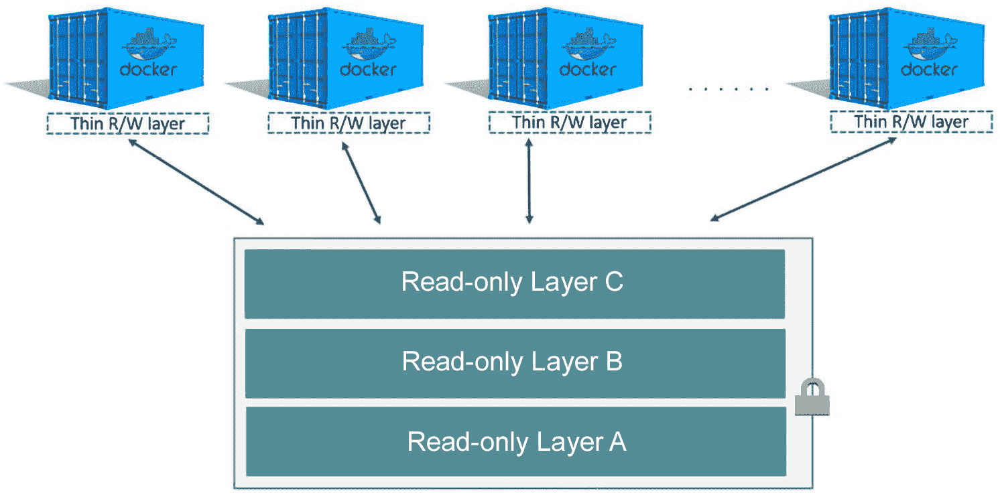
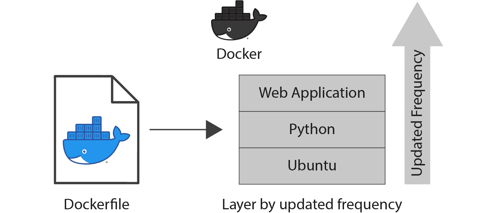
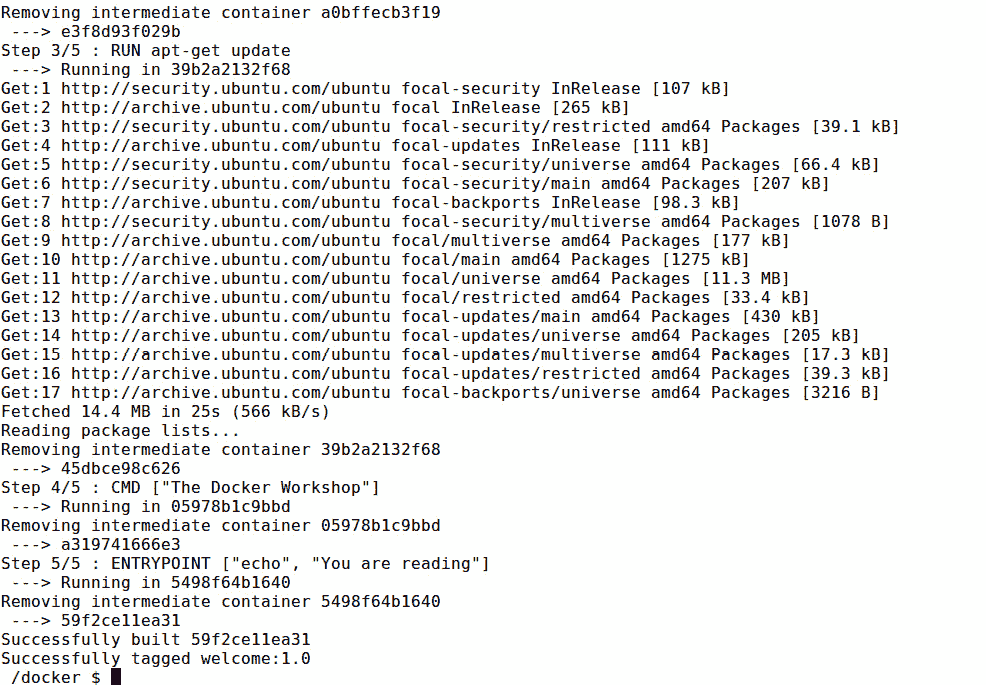
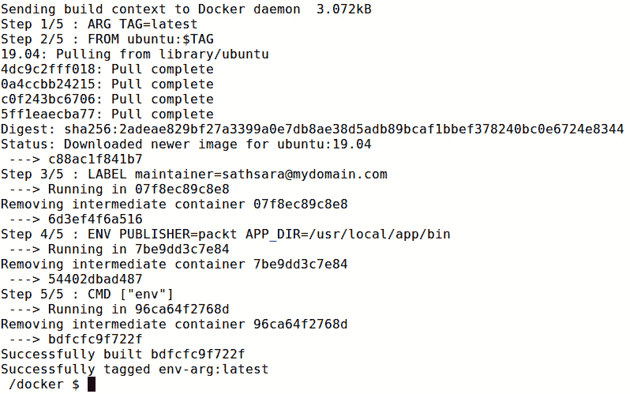

# 第二章：使用 Dockerfile 入门

概述

在本章中，您将学习`Dockerfile`及其指令的形式和功能，包括`FROM`、`LABEL`和`CMD`，您将使用这些指令来 dockerize 一个应用程序。本章将为您提供关于 Docker 镜像的分层文件系统和在 Docker 构建过程中使用缓存的知识。在本章结束时，您将能够使用常见指令编写`Dockerfile`并使用`Dockerfile`构建自定义 Docker 镜像。

# 介绍

在上一章中，我们学习了如何通过从 Docker Hub 拉取预构建的 Docker 镜像来运行我们的第一个 Docker 容器。虽然从 Docker Hub 获取预构建的 Docker 镜像很有用，但我们必须知道如何创建自定义 Docker 镜像。这对于通过安装新软件包和自定义预构建 Docker 镜像的设置来在 Docker 上运行我们的应用程序非常重要。在本章中，我们将学习如何创建自定义 Docker 镜像并基于它运行 Docker 容器。

这将使用一个名为`Dockerfile`的文本文件完成。该文件包含 Docker 可以执行以创建 Docker 镜像的命令。使用`docker build`（或`docker image build`）命令从`Dockerfile`创建 Docker 镜像。

注意

从 Docker 1.13 开始，Docker CLI 的语法已重构为 Docker COMMAND SUBCOMMAND 的形式。例如，`docker build`命令被替换为`docker image build`命令。此重构是为了清理 Docker CLI 语法并获得更一致的命令分组。目前，两种语法都受支持，但预计将来会弃用旧语法。

Docker 镜像由多个层组成，每个层代表`Dockerfile`中提供的命令。这些只读层叠加在一起，以创建最终的 Docker 镜像。Docker 镜像可以存储在 Docker 注册表（如 Docker Hub）中，这是一个可以存储和分发 Docker 镜像的地方。

Docker **容器**是 Docker 镜像的运行实例。可以使用`docker run`（或`docker container run`）命令从单个 Docker 镜像创建一个或多个 Docker 容器。一旦从 Docker 镜像创建了 Docker 容器，将在 Docker 镜像的只读层之上添加一个新的可写层。然后可以使用 docker ps（或 docker container list）命令列出 Docker 容器：



图 2.1：图像层和容器层

如前图所示，Docker 镜像可以由一个或多个只读层组成。这些只读层是在`Dockerfile`中的每个命令在 Docker 镜像构建过程中生成的。一旦从镜像创建了 Docker 容器，新的可写层（称为**容器层**）将被添加到镜像层之上，并将承载在运行容器上所做的所有更改。

在本章中，我们将编写我们的第一个`Dockerfile`，从`Dockerfile`构建 Docker 镜像，并从我们的自定义 Docker 镜像运行 Docker 容器。然而，在执行任何这些任务之前，我们必须首先定义一个`Dockerfile`。

# 什么是 Dockerfile？

`Dockerfile`是一个文本文件，包含了创建 Docker 镜像的指令。这些命令称为**指令**。`Dockerfile`是我们根据需求创建自定义 Docker 镜像的机制。

`Dockerfile`的格式如下：

```
# This is a comment
DIRECTIVE argument
```

`Dockerfile`可以包含多行注释和指令。这些行将由**Docker 引擎**按顺序执行，同时构建 Docker 镜像。与编程语言一样，`Dockerfile`也可以包含注释。

所有以#符号开头的语句将被视为注释。目前，`Dockerfiles`只支持单行注释。如果您希望编写多行注释，您需要在每行开头添加#符号。

然而，与大多数编程语言不同，`Dockerfile`中的指令不区分大小写。即使`DIRECTIVE`不区分大小写，最好将所有指令都以大写形式编写，以便与参数区分开来。

在下一节中，我们将讨论在`Dockerfiles`中可以使用的常见指令，以创建自定义 Docker 镜像。

注意

如果您使用的是 18.04 之后的 ubuntu 版本，将会提示输入时区。请使用`ARG DEBIAN_FRONTEND=non_interactive`来抑制提示

# Dockerfile 中的常见指令

如前一节所讨论的，指令是用于创建 Docker 镜像的命令。在本节中，我们将讨论以下五个`Dockerfile`指令：

1.  `FROM`指令

1.  `LABEL`指令

1.  `RUN`指令

1.  `CMD`指令

1.  `ENTRYPOINT`指令

## `FROM`指令

`Dockerfile`通常以`FROM`指令开头。这用于指定我们自定义 Docker 镜像的父镜像。父镜像是我们自定义 Docker 镜像的起点。我们所做的所有自定义将应用在父镜像之上。父镜像可以是来自 Docker Hub 的镜像，如 Ubuntu、CentOS、Nginx 和 MySQL。`FROM`指令接受有效的镜像名称和标签作为参数。如果未指定标签，将使用`latest`标签。

`FROM`指令的格式如下：

```
FROM <image>:<tag> 
```

在以下`FROM`指令中，我们使用带有`20.04`标签的`ubuntu`父镜像：

```
FROM ubuntu:20.04
```

此外，如果需要从头开始构建 Docker 镜像，我们可以使用基础镜像。基础镜像，即 scratch 镜像，是一个空镜像，主要用于构建其他父镜像。

在以下`FROM`指令中，我们使用`scratch`镜像从头开始构建我们的自定义 Docker 镜像：

```
FROM scratch
```

现在，让我们在下一节中了解`LABEL`指令是什么。

## `LABEL`指令

`LABEL`是一个键值对，可用于向 Docker 镜像添加元数据。这些标签可用于适当地组织 Docker 镜像。例如，可以添加`Dockerfile`的作者姓名或`Dockerfile`的版本。

`LABEL`指令的格式如下：

```
LABEL <key>=<value>
```

`Dockerfile`可以有多个标签，遵循前面的键值对格式：

```
LABEL maintainer=sathsara@mydomain.com
LABEL version=1.0
LABEL environment=dev
```

或者这些标签可以在单行上用空格分隔包含：

```
LABEL maintainer=sathsara@mydomain.com version=1.0 environment=dev
```

现有的 Docker 镜像标签可以使用`docker image inspect`命令查看。

运行`docker image inspect <image>:<tag>`命令时，输出应该如下所示：

```
...
...
"Labels": {
    "environment": "dev",
    "maintainer": "sathsara@mydomain.com",
    "version": "1.0"
}
...
...
```

如此所示，docker image inspect 命令将输出使用`LABEL`指令在`Dockerfile`中配置的键值对。

在下一节中，我们将学习如何使用`RUN`指令在构建镜像时执行命令。

## `RUN`指令

`RUN`指令用于在图像构建时执行命令。这将在现有层的顶部创建一个新层，执行指定的命令，并将结果提交到新创建的层。`RUN`指令可用于安装所需的软件包，更新软件包，创建用户和组等。

`RUN`指令的格式如下：

```
RUN <command>
```

`<command>`指定您希望作为图像构建过程的一部分执行的 shell 命令。一个`Dockerfile`可以有多个`RUN`指令，遵循上述格式。

在以下示例中，我们在父镜像的基础上运行了两个命令。`apt-get update`用于更新软件包存储库，`apt-get install nginx -y`用于安装 Nginx 软件包：

```
RUN apt-get update
RUN apt-get install nginx -y
```

或者，您可以通过使用`&&`符号将多个 shell 命令添加到单个`RUN`指令中。在以下示例中，我们使用了相同的两个命令，但这次是在单个`RUN`指令中，用`&&`符号分隔：

```
RUN apt-get update && apt-get install nginx -y
```

现在，让我们继续下一节，我们将学习`CMD`指令。

## CMD 指令

Docker 容器通常预期运行一个进程。`CMD`指令用于提供默认的初始化命令，当从 Docker 镜像创建容器时将执行该命令。`Dockerfile`只能执行一个`CMD`指令。如果`Dockerfile`中有多个`CMD`指令，Docker 将只执行最后一个。

`CMD`指令的格式如下：

```
CMD ["executable","param1","param2","param3", ...]
```

例如，使用以下命令将"`Hello World`"作为 Docker 容器的输出：

```
CMD ["echo","Hello World"]
```

当我们使用`docker container run <image>`命令（用 Docker 镜像的名称替换`<image>`）运行 Docker 容器时，上述`CMD`指令将产生以下输出：

```
$ docker container run <image>
Hello World
```

然而，如果我们使用`docker container run <image>`命令行参数，这些参数将覆盖我们定义的`CMD`指令。例如，如果我们执行以下命令（用 Docker 镜像的名称替换`<image>`），则会忽略使用`CMD`指令定义的默认的"`Hello World`"输出。相反，容器将输出"`Hello Docker !!!`"：

```
$ docker container run <image> echo "Hello Docker !!!"
```

正如我们讨论过的，`RUN`和`CMD`指令都可以用来执行 shell 命令。这两个指令之间的主要区别在于，`RUN`指令提供的命令将在镜像构建过程中执行，而`CMD`指令提供的命令将在从构建的镜像启动容器时执行。

`RUN`和`CMD`指令之间的另一个显着区别是，在`Dockerfile`中可以有多个`RUN`指令，但只能有一个`CMD`指令（如果有多个`CMD`指令，则除最后一个之外的所有其他指令都将被忽略）。

例如，我们可以使用`RUN`指令在 Docker 镜像构建过程中安装软件包，并使用`CMD`指令在从构建的镜像启动容器时启动软件包。

在下一节中，我们将学习`ENTRYPOINT`指令，它提供了与`CMD`指令相同的功能，除了覆盖。

## ENTRYPOINT 指令

与`CMD`指令类似，`ENTRYPOINT`指令也用于提供默认的初始化命令，该命令将在从 Docker 镜像创建容器时执行。`CMD`指令和`ENTRYPOINT`指令之间的区别在于，与`CMD`指令不同，我们不能使用`docker container run`命令发送的命令行参数来覆盖`ENTRYPOINT`命令。

注意

`--entrypoint`标志可以与`docker container run`命令一起发送，以覆盖镜像的默认`ENTRYPOINT`。

`ENTRYPOINT`指令的格式如下：

```
ENTRYPOINT ["executable","param1","param2","param3", ...]
```

与`CMD`指令类似，`ENTRYPOINT`指令也允许我们提供默认的可执行文件和参数。我们可以在`ENTRYPOINT`指令中使用`CMD`指令来为可执行文件提供额外的参数。

在以下示例中，我们使用`ENTRYPOINT`指令将`"echo"`作为默认命令，将`"Hello"`作为默认参数。我们还使用`CMD`指令提供了`"World"`作为额外的参数：

```
ENTRYPOINT ["echo","Hello"]
CMD ["World"]
```

`echo`命令的输出将根据我们如何执行`docker container run`命令而有所不同。

如果我们启动 Docker 镜像而没有任何命令行参数，它将输出消息`Hello World`：

```
$ docker container run <image>
Hello World
```

但是，如果我们使用额外的命令行参数（例如`Docker`）启动 Docker 镜像，输出消息将是`Hello Docker`：

```
$ docker container run <image> "Docker"
Hello Docker
```

在进一步讨论`Dockerfile`指令之前，让我们从下一个练习开始创建我们的第一个`Dockerfile`。

## 练习 2.01：创建我们的第一个 Dockerfile

在这个练习中，您将创建一个 Docker 镜像，可以打印您传递给 Docker 镜像的参数，前面加上文本`You are reading`。例如，如果您传递`hello world`，它将输出`You are reading hello world`。如果没有提供参数，则将使用`The Docker Workshop`作为标准值：

1.  使用`mkdir`命令创建一个名为`custom-docker-image`的新目录。该目录将是您的 Docker 镜像的**上下文**。`上下文`是包含成功构建镜像所需的所有文件的目录：

```
$ mkdir custom-docker-image
```

1.  使用`cd`命令导航到新创建的`custom-docker-image`目录，因为我们将在此目录中创建构建过程中所需的所有文件（包括`Dockerfile`）：

```
$ cd custom-docker-image
```

1.  在`custom-docker-image`目录中，使用`touch`命令创建一个名为`Dockerfile`的文件：

```
$ touch Dockerfile
```

1.  现在，使用您喜欢的文本编辑器打开`Dockerfile`：

```
$ vim Dockerfile
```

1.  将以下内容添加到`Dockerfile`中，保存并退出`Dockerfile`：

```
# This is my first Docker image
FROM ubuntu 
LABEL maintainer=sathsara@mydomain.com 
RUN apt-get update
CMD ["The Docker Workshop"]
ENTRYPOINT ["echo", "You are reading"]
```

Docker 镜像将基于 Ubuntu 父镜像。然后，您可以使用`LABEL`指令提供`Dockerfile`作者的电子邮件地址。接下来的一行执行`apt-get update`命令，将 Debian 的软件包列表更新到最新可用版本。最后，您将使用`ENTRYPOINT`和`CMD`指令来定义容器的默认可执行文件和参数。

我们已经提供了`echo`作为默认可执行文件，`You are reading`作为默认参数，不能使用命令行参数进行覆盖。此外，我们还提供了`The Docker Workshop`作为一个额外的参数，可以使用`docker container run`命令的命令行参数进行覆盖。

在这个练习中，我们使用了在前几节中学到的常见指令创建了我们的第一个`Dockerfile`。该过程的下一步是从`Dockerfile`构建 Docker 镜像。只有在从`Dockerfile`构建 Docker 镜像之后，才能运行 Docker 容器。在下一节中，我们将看看如何从`Dockerfile`构建 Docker 镜像。

# 构建 Docker 镜像

在上一节中，我们学习了如何创建`Dockerfile`。该过程的下一步是使用`Dockerfile`构建**Docker 镜像**。

**Docker 镜像**是用于构建 Docker 容器的模板。这类似于如何可以使用房屋平面图从相同的设计中创建多个房屋。如果您熟悉**面向对象编程**的概念，Docker 镜像和 Docker 容器的关系与**类**和**对象**的关系相同。面向对象编程中的类可用于创建多个对象。

Docker 镜像是一个二进制文件，由`Dockerfile`中提供的多个层组成。这些层堆叠在彼此之上，每个层依赖于前一个层。每个层都是基于其下一层的更改而生成的。Docker 镜像的所有层都是只读的。一旦我们从 Docker 镜像创建一个 Docker 容器，将在其他只读层之上创建一个新的可写层，其中包含对容器文件系统所做的所有修改：



图 2.2：Docker 镜像层

如前图所示，docker image build 命令将从`Dockerfile`创建一个 Docker 镜像。Docker 镜像的层将映射到`Dockerfile`中提供的指令。

这个图像构建过程是由 Docker CLI 发起并由 Docker 守护程序执行的。要生成 Docker 镜像，Docker 守护程序需要访问`Dockerfile`，源代码（例如`index.html`）和其他文件（例如属性文件），这些文件在`Dockerfile`中被引用。这些文件通常存储在一个被称为构建上下文的目录中。在执行 docker image build 命令时将指定此上下文。整个上下文将在图像构建过程中发送到 Docker 守护程序。

`docker image build`命令采用以下格式：

```
$ docker image build <context>
```

我们可以从包含`Dockerfile`和其他文件的文件夹中执行 docker image build 命令，如下例所示。请注意，命令末尾的点（`.`）用于表示当前目录：

```
$ docker image build.
```

让我们看看以下示例`Dockerfile`的 Docker 镜像构建过程：

```
FROM ubuntu:latest
LABEL maintainer=sathsara@mydomain.com
CMD ["echo","Hello World"]
```

这个`Dockerfile`使用最新的`ubuntu`镜像作为父镜像。然后，使用`LABEL`指令将`sathsara@mydomain.com`指定为维护者。最后，使用`CMD`指令将 echo`"Hello World"`用作图像的输出。

执行上述`Dockerfile`的 docker 镜像构建命令后，我们可以在构建过程中的控制台上看到类似以下的输出：

```
Sending build context to Docker daemon 2.048kB
Step 1/3 : FROM ubuntu:latest
latest: Pulling from library/ubuntu
2746a4a261c9: Pull complete 
4c1d20cdee96: Pull complete 
0d3160e1d0de: Pull complete 
c8e37668deea: Pull complete
Digest: sha256:250cc6f3f3ffc5cdaa9d8f4946ac79821aafb4d3afc93928
        f0de9336eba21aa4
Status: Downloaded newer image for ubuntu:latest
 ---> 549b9b86cb8d
Step 2/3 : LABEL maintainer=sathsara@mydomain.com
 ---> Running in a4a11e5e7c27
Removing intermediate container a4a11e5e7c27
 ---> e3add5272e35
Step 3/3 : CMD ["echo","Hello World"]
 ---> Running in aad8a56fcdc5
Removing intermediate container aad8a56fcdc5
 ---> dc3d4fd77861
Successfully built dc3d4fd77861
```

输出的第一行是`Sending build context to Docker daemon`，这表明构建开始时将构建上下文发送到 Docker 守护程序。上下文中的所有文件将被递归地发送到 Docker 守护程序（除非明确要求忽略某些文件）。

接下来，有`Step 1/3`和`Step 2/3`的步骤，对应于`Dockerfile`中的指令。作为第一步，Docker 守护程序将下载父镜像。在上述输出中，从 library/ubuntu 拉取表示这一点。对于`Dockerfile`的每一行，都会创建一个新的中间容器来执行指令，一旦这一步完成，这个中间容器将被移除。`Running in a4a11e5e7c27`和`Removing intermediate container a4a11e5e7c27`这两行用于表示这一点。最后，当构建完成且没有错误时，将打印出`Successfully built dc3d4fd77861`这一行。这行打印出了新构建的 Docker 镜像的 ID。

现在，我们可以使用`docker image list`命令列出可用的 Docker 镜像：

```
$ docker image list
```

此列表包含了本地构建的 Docker 镜像和从远程 Docker 仓库拉取的 Docker 镜像：

```
REPOSITORY   TAG       IMAGE ID        CREATED          SIZE
<none>       <none>    dc3d4fd77861    3 minutes ago    64.2MB
ubuntu       latest    549b9b86cb8d    5 days ago       64.2MB
```

如上述输出所示，我们可以看到两个 Docker 镜像。第一个 Docker 镜像的 IMAGE ID 是`dc3d4fd77861`，是在构建过程中本地构建的 Docker 镜像。我们可以看到，这个`IMAGE ID`与`docker image build`命令的最后一行中的 ID 是相同的。下一个镜像是我们用作自定义镜像的父镜像的 ubuntu 镜像。

现在，让我们再次使用`docker image build`命令构建 Docker 镜像：

```
$ docker image build
Sending build context to Docker daemon  2.048kB
Step 1/3 : FROM ubuntu:latest
 ---> 549b9b86cb8d
Step 2/3 : LABEL maintainer=sathsara@mydomain.com
 ---> Using cache
 ---> e3add5272e35
Step 3/3 : CMD ["echo","Hello World"]
 ---> Using cache
 ---> dc3d4fd77861
Successfully built dc3d4fd77861
```

这次，镜像构建过程是瞬时的。这是因为缓存。由于我们没有改变`Dockerfile`的任何内容，Docker 守护程序利用了缓存，并重用了本地镜像缓存中的现有层来加速构建过程。我们可以在上述输出中看到，这次使用了缓存，有`Using cache`行可用。

Docker 守护程序将在启动构建过程之前执行验证步骤，以确保提供的`Dockerfile`在语法上是正确的。在语法无效的情况下，构建过程将失败，并显示来自 Docker 守护程序的错误消息：

```
$ docker image build
Sending build context to Docker daemon  2.048kB
Error response from daemon: Dockerfile parse error line 5: 
unknown instruction: INVALID
```

现在，让我们使用`docker image list`命令重新查看本地可用的 Docker 镜像：

```
$ docker image list
```

该命令应返回以下输出：

```
REPOSITORY    TAG       IMAGE ID         CREATED          SIZE
<none>        <none>    dc3d4fd77861     3 minutes ago    64.2MB
ubuntu        latest    549b9b86cb8d     5 days ago       64.2MB
```

请注意，我们的自定义 Docker 镜像没有名称。这是因为我们在构建过程中没有指定任何存储库或标签。我们可以使用 docker image tag 命令为现有镜像打标签。

让我们用`IMAGE ID dc3d4fd77861`作为`my-tagged-image:v1.0`来为我们的镜像打标签：

```
$ docker image tag dc3d4fd77861 my-tagged-image:v1.0
```

现在，如果我们再次列出我们的镜像，我们可以看到`REPOSITORY`和`TAG`列下的 Docker 镜像名称和标签：

```
REPOSITORY        TAG       IMAGE ID        CREATED         SIZE
my-tagged-image   v1.0      dc3d4fd77861    20 minutes ago  64.2MB
ubuntu            latest    549b9b86cb8d    5 days ago      64.2MB
```

我们还可以通过指定`-t`标志在构建过程中为镜像打标签：

```
$ docker image build -t my-tagged-image:v2.0 .
```

上述命令将打印以下输出：

```
Sending build context to Docker daemon  2.048kB
Step 1/3 : FROM ubuntu:latest
 ---> 549b9b86cb8d
Step 2/3 : LABEL maintainer=sathsara@mydomain.com
 ---> Using cache
 ---> e3add5272e35
Step 3/3 : CMD ["echo","Hello World"]
 ---> Using cache
 ---> dc3d4fd77861
Successfully built dc3d4fd77861
Successfully tagged my-tagged-image:v2.0
```

这一次，除了`成功构建 dc3d4fd77861`行之外，我们还可以看到`成功标记 my-tagged-image:v2.0`行，这表明我们的 Docker 镜像已经打了标签。

在本节中，我们学习了如何从`Dockerfile`构建 Docker 镜像。我们讨论了`Dockerfile`和 Docker 镜像之间的区别。然后，我们讨论了 Docker 镜像由多个层组成。我们还体验了缓存如何加速构建过程。最后，我们为 Docker 镜像打了标签。

在下一个练习中，我们将从*练习 2.01：创建我们的第一个 Dockerfile*中创建的`Dockerfile`构建 Docker 镜像。

## 练习 2.02：创建我们的第一个 Docker 镜像

在这个练习中，您将从*练习 2.01：创建我们的第一个 Dockerfile*中创建的`Dockerfile`构建 Docker 镜像，并从新构建的镜像运行 Docker 容器。首先，您将在不传递任何参数的情况下运行 Docker 镜像，期望输出为“您正在阅读 Docker Workshop”。接下来，您将以`Docker Beginner's Guide`作为参数运行 Docker 镜像，并期望输出为“您正在阅读 Docker Beginner's Guide”：

1.  首先，请确保您在*练习 2.01：创建我们的第一个 Dockerfile*中创建的`custom-docker-image`目录中。确认该目录包含在*练习 2.01：创建我们的第一个 Dockerfile*中创建的以下`Dockerfile`：

```
# This is my first Docker image
FROM ubuntu 
LABEL maintainer=sathsara@mydomain.com 
RUN apt-get update
CMD ["The Docker Workshop"]
ENTRYPOINT ["echo", "You are reading"]
```

1.  使用`docker image build`命令构建 Docker 镜像。此命令具有可选的`-t`标志，用于指定镜像的标签。将您的镜像标记为`welcome:1.0`：

```
$ docker image build -t welcome:1.0 .
```

注意

不要忘记在前述命令的末尾加上点(`.`)，用于将当前目录作为构建上下文。

可以从以下输出中看到，在构建过程中执行了`Dockerfile`中提到的所有五个步骤。输出的最后两行表明成功构建并打了标签的镜像：



图 2.3：构建 welcome:1.0 Docker 镜像

1.  再次构建此镜像，而不更改`Dockerfile`内容：

```
$ docker image build -t welcome:2.0 .
```

请注意，由于使用了缓存，此构建过程比以前的过程快得多：


图 2.4：使用缓存构建 welcome:1.0 Docker 镜像

1.  使用`docker image list`命令列出计算机上所有可用的 Docker 镜像：

```
$ docker image list
```

这些镜像可以在您的计算机上使用，无论是从 Docker 注册表中拉取还是在您的计算机上构建：

```
REPOSITORY   TAG      IMAGE ID        CREATED          SIZE
welcome      1.0      98f571a42e5c    23 minutes ago   91.9MB
welcome      2.0      98f571a42e5c    23 minutes ago   91.9MB
ubuntu       latest   549b9b86cb8d    2 weeks ago      64.2MB
```

从前述输出中可以看出，有三个 Docker 镜像可用。`ubuntu`镜像是从 Docker Hub 拉取的，`welcome`镜像的`1.0`和`2.0`版本是在您的计算机上构建的。

1.  执行`docker container run`命令，从您在`步骤 1`中构建的 Docker 镜像（`welcome:1.0`）启动一个新容器：

```
$ docker container run welcome:1.0
```

输出应如下所示：

```
You are reading The Docker Workshop
```

您将收到预期的输出`You are reading The Docker Workshop`。`You are reading`是由`ENTRYPOINT`指令提供的参数引起的，`The Docker Workshop`来自`CMD`指令提供的参数。

1.  最后，再次执行`docker container run`命令，这次使用命令行参数：

```
$ docker container run welcome:1.0 "Docker Beginner's Guide"
```

由于命令行参数`Docker 初学者指南`和`ENTRYPOINT`指令中提供的`You are reading`参数，您将获得输出`You are reading Docker 初学者指南`：

```
You are reading Docker Beginner's Guide
```

在这个练习中，我们学习了如何使用`Dockerfile`构建自定义 Docker 镜像，并从镜像运行 Docker 容器。在下一节中，我们将学习可以在`Dockerfile`中使用的其他 Docker 指令。

# 其他 Dockerfile 指令

在 Dockerfile 中的常见指令部分，我们讨论了可用于`Dockerfile`的常见指令。在该部分中，我们讨论了`FROM`、`LABEL`、`RUN`、`CMD`和`ENTRYPOINT`指令以及如何使用它们创建一个简单的`Dockerfile`。

在本节中，我们将讨论更高级的`Dockerfile`指令。这些指令可以用于创建更高级的 Docker 镜像。例如，我们可以使用`VOLUME`指令将主机机器的文件系统绑定到 Docker 容器。这将允许我们持久化 Docker 容器生成和使用的数据。另一个例子是`HEALTHCHECK`指令，它允许我们定义健康检查以评估 Docker 容器的健康状态。在本节中，我们将研究以下指令：

1.  `ENV`指令

1.  `ARG`指令

1.  `WORKDIR`指令

1.  `COPY`指令

1.  `ADD`指令

1.  `USER`指令

1.  `VOLUME`指令

1.  `EXPOSE`指令

1.  `HEALTHCHECK`指令

1.  `ONBUILD`指令

## ENV 指令

`Dockerfile`中的 ENV 指令用于设置环境变量。**环境变量**被应用程序和进程用来获取有关进程运行环境的信息。一个例子是`PATH`环境变量，它列出了要搜索可执行文件的目录。

环境变量按以下格式定义为键值对：

```
ENV <key> <value>
```

PATH 环境变量设置为以下值：

```
$PATH:/usr/local/myapp/bin/
```

因此，可以使用`ENV`指令设置如下：

```
ENV PATH $PATH:/usr/local/myapp/bin/
```

我们可以在同一行中用空格分隔设置多个环境变量。但是，在这种形式中，`key`和`value`应该由等号（`=`）分隔：

```
ENV <key>=<value> <key>=<value> ...
```

在下面的示例中，配置了两个环境变量。`PATH`环境变量配置为`$PATH:/usr/local/myapp/bin/`的值，`VERSION`环境变量配置为`1.0.0`的值：

```
ENV PATH=$PATH:/usr/local/myapp/bin/ VERSION=1.0.0
```

一旦使用`Dockerfile`中的`ENV`指令设置了环境变量，该变量就会在所有后续的 Docker 镜像层中可用。甚至在从此 Docker 镜像启动的 Docker 容器中也可用。

在下一节中，我们将研究`ARG`指令。

## ARG 指令

`ARG`指令用于定义用户可以在构建时传递的变量。`ARG`是唯一可以在`Dockerfile`中的`FROM`指令之前出现的指令。

用户可以在构建 Docker 镜像时使用`--build-arg <varname>=<value>`传递值，如下所示：

```
$ docker image build -t <image>:<tag> --build-arg <varname>=<value> .
```

`ARG`指令的格式如下：

```
ARG <varname>
```

`Dockerfile`中可以有多个`ARG`指令，如下所示：

```
ARG USER
ARG VERSION
```

`ARG`指令也可以定义一个可选的默认值。如果在构建时没有传递值，将使用此默认值：

```
ARG USER=TestUser
ARG VERSION=1.0.0
```

与`ENV`变量不同，`ARG`变量无法从正在运行的容器中访问。它们仅在构建过程中可用。

在下一个练习中，我们将利用迄今为止所学到的知识，在`Dockerfile`中使用`ENV`和`ARG`指令。 

## 练习 2.03：在 Dockerfile 中使用 ENV 和 ARG 指令

您的经理要求您创建一个`Dockerfile`，该文件将使用 ubuntu 作为父镜像，但您应该能够在构建时更改 ubuntu 版本。您还需要指定发布者的名称和 Docker 镜像的应用程序目录作为环境变量。您将使用`Dockerfile`中的`ENV`和`ARG`指令来执行此练习：

1.  使用`mkdir`命令创建一个名为`env-arg-exercise`的新目录：

```
mkdir env-arg-exercise
```

1.  使用`cd`命令导航到新创建的`env-arg-exercise`目录：

```
cd env-arg-exercise
```

1.  在`env-arg-exercise`目录中，创建一个名为`Dockerfile`的文件：

```
touch Dockerfile
```

1.  现在，使用您喜欢的文本编辑器打开`Dockerfile`：

```
vim Dockerfile
```

1.  将以下内容添加到`Dockerfile`中。然后，保存并退出`Dockerfile`：

```
# ENV and ARG example
ARG TAG=latest
FROM ubuntu:$TAG
LABEL maintainer=sathsara@mydomain.com 
ENV PUBLISHER=packt APP_DIR=/usr/local/app/bin
CMD ["env"]
```

此`Dockerfile`首先定义了一个名为`TAG`的参数，其默认值为最新版本。接下来是`FROM`指令，它将使用带有`TAG`变量值的 ubuntu 父镜像与`build`命令一起发送（或者如果没有使用`build`命令发送值，则使用默认值）。然后，`LABEL`指令设置了维护者的值。接下来是`ENV`指令，它使用值`packt`定义了`PUBLISHER`的环境变量，并使用值`/usr/local/app/bin`定义了`APP_DIR`的环境变量。最后，使用`CMD`指令执行`env`命令，该命令将打印所有环境变量。

1.  现在，构建 Docker 镜像：

```
$ docker image build -t env-arg --build-arg TAG=19.04 .
```

注意使用`env-arg --build-arg TAG=19.04`标志将`TAG`参数发送到构建过程中。输出应如下所示：



图 2.5：构建 env-arg Docker 镜像

请注意，在构建过程中使用了 ubuntu 镜像的`19.04`标签作为父镜像。这是因为您在构建过程中使用了`--build-arg`标志，并设置了值为`TAG=19.04`。

1.  现在，执行`docker container run`命令，从您在上一步中构建的 Docker 镜像启动一个新的容器：

```
$ docker container run env-arg
```

从输出中我们可以看到，`PUBLISHER`环境变量的值为`packt`，`APP_DIR`环境变量的值为`/usr/local/app/bin`：


图 2.6：运行 env-arg Docker 容器

在这个练习中，我们使用`ENV`指令为 Docker 镜像定义了环境变量。我们还体验了如何在 Docker 镜像构建时使用`ARG`指令传递值。在下一节中，我们将介绍`WORKDIR`指令，它可以用来定义 Docker 容器的当前工作目录。

## 工作目录指令

`WORKDIR`指令用于指定 Docker 容器的当前工作目录。任何后续的`ADD`、`CMD`、`COPY`、`ENTRYPOINT`和`RUN`指令都将在此目录中执行。`WORKDIR`指令的格式如下：

```
WORKDIR /path/to/workdir
```

如果指定的目录不存在，Docker 将创建此目录并将其设置为当前工作目录，这意味着该指令隐式执行`mkdir`和`cd`命令。

`Dockerfile`中可以有多个`WORKDIR`指令。如果在后续的`WORKDIR`指令中提供了相对路径，那么它将相对于前一个`WORKDIR`指令设置的工作目录。

```
WORKDIR /one
WORKDIR two
WORKDIR three
RUN pwd
```

在前面的例子中，我们在`Dockerfile`的末尾使用`pwd`命令来打印当前工作目录。`pwd`命令的输出将是`/one/two/three`。

在下一节中，我们将讨论`COPY`指令，该指令用于将文件从本地文件系统复制到 Docker 镜像文件系统。

## 复制指令

在 Docker 镜像构建过程中，我们可能需要将文件从本地文件系统复制到 Docker 镜像文件系统。这些文件可以是源代码文件（例如 JavaScript 文件）、配置文件（例如属性文件）或者构件（例如 JAR 文件）。在构建过程中，可以使用`COPY`指令将文件和文件夹从本地文件系统复制到 Docker 镜像。该指令有两个参数。第一个是本地文件系统的源路径，第二个是镜像文件系统上的目标路径：

```
COPY <source> <destination>
```

在下面的例子中，我们使用`COPY`指令将`index.html`文件从本地文件系统复制到 Docker 镜像的`/var/www/html/`目录中：

```
COPY index.html /var/www/html/index.html
```

通配符也可以用来指定匹配给定模式的所有文件。以下示例将把当前目录中所有扩展名为`.html`的文件复制到 Docker 镜像的`/var/www/html/`目录中：

```
COPY *.html /var/www/html/
```

除了复制文件外，`--chown`标志还可以与`COPY`指令一起使用，以指定文件的用户和组所有权：

```
COPY --chown=myuser:mygroup *.html /var/www/html/
```

在上面的例子中，除了将所有 HTML 文件从当前目录复制到`/var/www/html/`目录外，`--chown`标志还用于设置文件所有权，用户为`myuser`，组为`mygroup`：

注意

`--chown`标志仅在 Docker 版本 17.09 及以上版本中受支持。对于低于 17.09 版本的 Docker，您需要在`COPY`命令之后运行`chown`命令来更改文件所有权。

在下一节中，我们将看一下`ADD`指令。

## ADD 指令

`ADD`指令也类似于`COPY`指令，格式如下：

```
ADD <source> <destination>
```

但是，除了`COPY`指令提供的功能外，`ADD`指令还允许我们将 URL 用作`<source>`参数：

```
ADD http://sample.com/test.txt /tmp/test.txt
```

在上面的例子中，`ADD`指令将从`http://sample.com`下载`test.txt`文件，并将文件复制到 Docker 镜像文件系统的`/tmp`目录中。

`ADD`指令的另一个特性是自动提取压缩文件。如果我们将一个压缩文件（gzip、bzip2、tar 等）添加到`<source>`参数中，`ADD`指令将会提取存档并将内容复制到镜像文件系统中。

假设我们有一个名为`html.tar.gz`的压缩文件，其中包含`index.html`和`contact.html`文件。以下命令将提取`html.tar.gz`文件，并将`index.html`和`contact.html`文件复制到`/var/www/html`目录：

```
ADD html.tar.gz /var/www/html
```

由于`COPY`和`ADD`指令提供几乎相同的功能，建议始终使用`COPY`指令，除非您需要`ADD`指令提供的附加功能（从 URL 添加或提取压缩文件）。这是因为`ADD`指令提供了额外的功能，如果使用不正确，可能会表现出不可预测的行为（例如，在想要提取文件时复制文件，或者在想要复制文件时提取文件）。

在下一个练习中，我们将使用`WORKDIR`，`COPY`和`ADD`指令将文件复制到 Docker 镜像中。

## 练习 2.04：在 Dockerfile 中使用 WORKDIR，COPY 和 ADD 指令

在这个练习中，您将部署自定义的 HTML 文件到 Apache Web 服务器。您将使用 Ubuntu 作为基础镜像，并在其上安装 Apache。然后，您将将自定义的 index.html 文件复制到 Docker 镜像，并从 https://www.docker.com 网站下载 Docker 标志，以与自定义的 index.html 文件一起使用：

1.  使用`mkdir`命令创建一个名为`workdir-copy-add-exercise`的新目录：

```
mkdir workdir-copy-add-exercise
```

1.  导航到新创建的`workdir-copy-add-exercise`目录：

```
cd workdir-copy-add-exercise
```

1.  在`workdir-copy-add-exercise`目录中，创建一个名为`index.html`的文件。此文件将在构建时复制到 Docker 镜像中：

```
touch index.html 
```

1.  现在，使用您喜欢的文本编辑器打开`index.html`：

```
vim index.html 
```

1.  将以下内容添加到`index.html`文件中，保存并退出`index.html`：

```
<html>
  <body>
    <h1>Welcome to The Docker Workshop</h1>
    
  </body>
</html>
```

此 HTML 文件将在页面的标题中输出“欢迎来到 Docker 工作坊”，并作为图像输出`logo.png`（我们将在 Docker 镜像构建过程中下载）。您已经定义了`logo.png`图像的高度为`350`，宽度为`500`。

1.  在`workdir-copy-add-exercise`目录中，创建一个名为`Dockerfile`的文件：

```
touch Dockerfile
```

1.  现在，使用您喜欢的文本编辑器打开`Dockerfile`：

```
vim Dockerfile
```

1.  将以下内容添加到`Dockerfile`中，保存并退出`Dockerfile`：

```
# WORKDIR, COPY and ADD example
FROM ubuntu:latest 
RUN apt-get update && apt-get install apache2 -y 
WORKDIR /var/www/html/
COPY index.html .
ADD https://www.docker.com/sites/default/files/d8/2019-07/  Moby-logo.png ./logo.png
CMD ["ls"]
```

这个`Dockerfile`首先将 ubuntu 镜像定义为父镜像。下一行是`RUN`指令，它将执行`apt-get update`来更新软件包列表，以及`apt-get install apache2 -y`来安装 Apache HTTP 服务器。然后，您将设置`/var/www/html/`为工作目录。接下来，将我们在*步骤 3*中创建的`index.html`文件复制到 Docker 镜像中。然后，使用`ADD`指令从[`www.docker.com/sites/default/files/d8/2019-07/Moby-logo.png`](https://www.docker.com/sites/default/files/d8/2019-07/Moby-logo.png)下载 Docker 标志到 Docker 镜像中。最后一步是使用`ls`命令打印`/var/www/html/`目录的内容。

1.  现在，使用标签`workdir-copy-add`构建 Docker 镜像：

```
$ docker image build -t workdir-copy-add .
```

您会注意到，由于我们没有明确为镜像打标签，因此该镜像已成功构建并标记为`latest`：


图 2.7：使用 WORKDIR、COPY 和 ADD 指令构建 Docker 镜像

1.  执行`docker container run`命令，从您在上一步中构建的 Docker 镜像启动一个新的容器：

```
$ docker container run workdir-copy-add
```

从输出中可以看到，`index.html`和`logo.png`文件都在`/var/www/html/`目录中可用：

```
index.html
logo.png
```

在这个练习中，我们观察了`WORKDIR`、`ADD`和`COPY`指令在 Docker 中的工作方式。在下一节中，我们将讨论`USER`指令。

## USER 指令

Docker 将使用 root 用户作为 Docker 容器的默认用户。我们可以使用`USER`指令来改变这种默认行为，并指定一个非 root 用户作为 Docker 容器的默认用户。这是通过以非特权用户身份运行 Docker 容器来提高安全性的好方法。在`Dockerfile`中使用`USER`指令指定的用户名将用于运行所有后续的`RUN`、`CMD`和`ENTRYPOINT`指令。

`USER`指令采用以下格式：

```
USER <user>
```

除了用户名之外，我们还可以指定可选的组名来运行 Docker 容器：

```
USER <user>:<group>
```

我们需要确保`<user>`和`<group>`的值是有效的用户和组名。否则，Docker 守护程序在尝试运行容器时会抛出错误：

```
docker: Error response from daemon: unable to find user my_user: 
        no matching entries in passwd file.
```

现在，让我们在下一个练习中尝试使用`USER`指令。

## 练习 2.05：在 Dockerfile 中使用 USER 指令

您的经理要求您创建一个 Docker 镜像来运行 Apache Web 服务器。由于安全原因，他特别要求您在运行 Docker 容器时使用非 root 用户。在这个练习中，您将使用`Dockerfile`中的`USER`指令来设置默认用户。您将安装 Apache Web 服务器并将用户更改为`www-data`。最后，您将执行`whoami`命令来验证当前用户的用户名：

注意

`www-data`用户是 Ubuntu 上 Apache Web 服务器的默认用户。

1.  为这个练习创建一个名为`user-exercise`的新目录：

```
mkdir user-exercise
```

1.  导航到新创建的`user-exercise`目录：

```
cd user-exercise
```

1.  在`user-exercise`目录中，创建一个名为`Dockerfile`的文件：

```
touch Dockerfile
```

1.  现在，用你喜欢的文本编辑器打开`Dockerfile`：

```
vim Dockerfile
```

1.  将以下内容添加到`Dockerfile`中，保存并退出`Dockerfile`：

```
# USER example
FROM ubuntu
RUN apt-get update && apt-get install apache2 -y 
USER www-data
CMD ["whoami"]
```

这个`Dockerfile`首先将 Ubuntu 镜像定义为父镜像。下一行是`RUN`指令，它将执行`apt-get update`来更新软件包列表，以及`apt-get install apache2 -y`来安装 Apache HTTP 服务器。接下来，您使用`USER`指令将当前用户更改为`www-data`用户。最后，您有`CMD`指令，它执行`whoami`命令，将打印当前用户的用户名。

1.  构建 Docker 镜像：

```
$ docker image build -t user .
```

输出应该如下：


图 2.8：构建用户 Docker 镜像

1.  现在，执行`docker container` run 命令来从我们在上一步中构建的 Docker 镜像启动一个新的容器：

```
$ docker container run user
```

如您从以下输出中所见，`www-data`是与 Docker 容器关联的当前用户：

```
www-data
```

在这个练习中，我们在`Dockerfile`中实现了`USER`指令，将`www-data`用户设置为 Docker 镜像的默认用户。

在下一节中，我们将讨论`VOLUME`指令。

## VOLUME 指令

在 Docker 中，Docker 容器生成和使用的数据（例如文件、可执行文件）将存储在容器文件系统中。当我们删除容器时，所有数据都将丢失。为了解决这个问题，Docker 提出了卷的概念。卷用于持久化数据并在容器之间共享数据。我们可以在`Dockerfile`中使用`VOLUME`指令来创建 Docker 卷。一旦在 Docker 容器中创建了`VOLUME`，底层主机将创建一个映射目录。Docker 容器的卷挂载的所有文件更改将被复制到主机机器的映射目录中。

`VOLUME`指令通常以 JSON 数组作为参数：

```
VOLUME ["/path/to/volume"]
```

或者，我们可以指定一个包含多个路径的普通字符串：

```
VOLUME /path/to/volume1 /path/to/volume2
```

我们可以使用`docker container inspect <container>`命令查看容器中可用的卷。docker 容器 inspect 命令的输出 JSON 将打印类似以下内容的卷信息：

```
"Mounts": [
    {
        "Type": "volume",
        "Name": "77db32d66407a554bd0dbdf3950671b658b6233c509ea
ed9f5c2a589fea268fe",
        "Source": "/var/lib/docker/volumes/77db32d66407a554bd0
dbdf3950671b658b6233c509eaed9f5c2a589fea268fe/_data",
        "Destination": "/path/to/volume",
        "Driver": "local",
        "Mode": "",
        "RW": true,
        "Propagation": ""
    }
],
```

根据前面的输出，Docker 为卷指定了一个唯一的名称。此外，输出中还提到了卷的源路径和目标路径。

此外，我们可以执行`docker volume inspect <volume>`命令来显示有关卷的详细信息：

```
[
    {
        "CreatedAt": "2019-12-28T12:52:52+05:30",
        "Driver": "local",
        "Labels": null,
        "Mountpoint": "/var/lib/docker/volumes/77db32d66407a554
bd0dbdf3950671b658b6233c509eaed9f5c2a589fea268fe/_data",
        "Name": "77db32d66407a554bd0dbdf3950671b658b6233c509eae
d9f5c2a589fea268fe",
        "Options": null,
        "Scope": "local"
    }
]
```

这也类似于先前的输出，具有相同的唯一名称和卷的挂载路径。

在下一个练习中，我们将学习如何在`Dockerfile`中使用`VOLUME`指令。

## 练习 2.06：在 Dockerfile 中使用 VOLUME 指令

在这个练习中，您将设置一个 Docker 容器来运行 Apache Web 服务器。但是，您不希望在 Docker 容器失败时丢失 Apache 日志文件。作为解决方案，您决定通过将 Apache 日志路径挂载到底层 Docker 主机来持久保存日志文件。

1.  创建一个名为`volume-exercise`的新目录：

```
mkdir volume-exercise
```

1.  转到新创建的`volume-exercise`目录：

```
cd volume-exercise
```

1.  在`volume-exercise`目录中，创建一个名为`Dockerfile`的文件：

```
touch Dockerfile
```

1.  现在，使用您喜欢的文本编辑器打开`Dockerfile`：

```
vim Dockerfile
```

1.  将以下内容添加到`Dockerfile`中，保存并退出`Dockerfile`：

```
# VOLUME example
FROM ubuntu
RUN apt-get update && apt-get install apache2 -y
VOLUME ["/var/log/apache2"]
```

这个`Dockerfile`首先定义了 Ubuntu 镜像作为父镜像。接下来，您将执行`apt-get update`命令来更新软件包列表，以及`apt-get install apache2 -y`命令来安装 Apache Web 服务器。最后，使用`VOLUME`指令来设置一个挂载点到`/var/log/apache2`目录。

1.  现在，构建 Docker 镜像：

```
$ docker image build -t volume .
```

输出应该如下：


图 2.9：构建卷 Docker 镜像

1.  执行 docker 容器运行命令，从您在上一步构建的 Docker 镜像中启动一个新的容器。请注意，您正在使用`--interactive`和`--tty`标志来打开一个交互式的 bash 会话，以便您可以从 Docker 容器的 bash shell 中执行命令。您还使用了`--name`标志来将容器名称定义为`volume-container`：

```
$ docker container run --interactive --tty --name volume-container volume /bin/bash
```

您的 bash shell 将会被打开如下：

```
root@bc61d46de960: /#
```

1.  从 Docker 容器命令行，切换到`/var/log/apache2/`目录：

```
# cd /var/log/apache2/
```

这将产生以下输出：

```
root@bc61d46de960: /var/log/apache2#
```

1.  现在，列出目录中可用的文件：

```
# ls -l
```

输出应该如下：


图 2.10：列出/var/log/apache2 目录的文件

这些是 Apache 在运行过程中创建的日志文件。一旦您检查了该卷的主机挂载，相同的文件应该也是可用的。

1.  现在，退出容器以检查主机文件系统：

```
# exit
```

1.  检查`volume-container`以查看挂载信息：

```
$ docker container inspect volume-container
```

在"`Mounts`"键下，您可以看到与挂载相关的信息：


图 2.11：检查 Docker 容器

1.  使用`docker volume inspect <volume_name>`命令来检查卷。`<volume_name>`可以通过前面输出的`Name`字段来识别：

```
$ docker volume inspect 354d188e0761d82e1e7d9f3d5c6ee644782b7150f51cead8f140556e5d334bd5
```

您应该会得到类似以下的输出：


图 2.12：检查 Docker 卷

我们可以看到容器被挂载到`"/var/lib/docker/volumes/354d188e0761d82e1e7d9f3d5c6ee644782b 7150f51cead8f140556e5d334bd5/_data"`的主机路径上，这在前面的输出中被定义为`Mountpoint`字段。

1.  列出主机文件路径中可用的文件。主机文件路径可以通过前面输出的`"Mountpoint"`字段来识别：

```
$ sudo ls -l /var/lib/docker/volumes/354d188e0761d82e1e7d9f3d5c6ee644782b7150f51cead8f14 0556e5d334bd5/_data
```

在下面的输出中，您可以看到容器中`/var/log/apache2`目录中的日志文件被挂载到主机上：


图 2.13：列出挂载点目录中的文件

在这个练习中，我们观察了如何使用`VOLUME`指令将 Apache Web 服务器的日志路径挂载到主机文件系统上。在下一节中，我们将学习`EXPOSE`指令。

## EXPOSE 指令

`EXPOSE`指令用于通知 Docker 容器在运行时监听指定端口。我们可以使用`EXPOSE`指令通过 TCP 或 UDP 协议公开端口。`EXPOSE`指令的格式如下：

```
EXPOSE <port>
```

然而，使用`EXPOSE`指令公开的端口只能从其他 Docker 容器内部访问。要将这些端口公开到 Docker 容器外部，我们可以使用`docker container run`命令的`-p`标志来发布端口：

```
docker container run -p <host_port>:<container_port> <image>
```

举个例子，假设我们有两个容器。一个是 NodeJS Web 应用容器，应该通过端口`80`从外部访问。第二个是 MySQL 容器，应该通过端口`3306`从 Node 应用容器访问。在这种情况下，我们必须使用`EXPOSE`指令公开 NodeJS 应用的端口`80`，并在运行容器时使用`docker container run`命令和`-p`标志来将其公开到外部。然而，对于 MySQL 容器，我们在运行容器时只能使用`EXPOSE`指令，而不使用`-p`标志，因为`3306`端口只能从 Node 应用容器访问。

因此，总结来说，以下陈述定义了这个指令：

+   如果我们同时指定`EXPOSE`指令和`-p`标志，公开的端口将可以从其他容器以及外部访问。

+   如果我们不使用`-p`标志来指定`EXPOSE`，那么公开的端口只能从其他容器访问，而无法从外部访问。

在下一节中，您将学习`HEALTHCHECK`指令。

## HEALTHCHECK 指令

在 Docker 中使用健康检查来检查容器是否正常运行。例如，我们可以使用健康检查来确保应用程序在 Docker 容器内部运行。除非指定了健康检查，否则 Docker 无法判断容器是否健康。如果在生产环境中运行 Docker 容器，这一点非常重要。`HEALTHCHECK`指令的格式如下：

```
HEALTHCHECK [OPTIONS] CMD command
```

`Dockerfile`中只能有一个`HEALTHCHECK`指令。如果有多个`HEALTHCHECK`指令，只有最后一个会生效。

例如，我们可以使用以下指令来确保容器可以在`http://localhost/`端点接收流量：

```
HEALTHCHECK CMD curl -f http://localhost/ || exit 1
```

在上一个命令的最后，退出代码用于指定容器的健康状态。`0`和`1`是此字段的有效值。0 用于表示健康的容器，`1`用于表示不健康的容器。

除了命令，我们可以在`HEALTHCHECK`指令中指定一些其他参数，如下所示：

+   `--interval`：指定每次健康检查之间的时间间隔（默认为 30 秒）。

+   `--timeout`：如果在此期间未收到成功响应，则健康检查被视为失败（默认为 30 秒）。

+   `--start-period`：在运行第一次健康检查之前等待的持续时间。这用于为容器提供启动时间（默认为 0 秒）。

+   `--retries`：如果健康检查连续失败给定次数的重试（默认为 3 次），则容器将被视为不健康。

在下面的示例中，我们通过使用`HEALTHCHECK`指令提供我们的自定义值来覆盖了默认值：

```
HEALTHCHECK --interval=1m --timeout=2s --start-period=2m --retries=3 \    CMD curl -f http://localhost/ || exit 1
```

我们可以使用`docker container list`命令来检查容器的健康状态。这将在`STATUS`列下列出健康状态：

```
CONTAINER ID  IMAGE     COMMAND                  CREATED
  STATUS                        PORTS                NAMES
d4e627acf6ec  sample    "apache2ctl -D FOREG…"   About a minute ago
  Up About a minute (healthy)   0.0.0.0:80->80/tcp   upbeat_banach
```

一旦我们启动容器，健康状态将是健康：启动中。成功执行`HEALTHCHECK`命令后，状态将变为`健康`。

在下一个练习中，我们将使用`EXPOSE`和`HEALTHCHECK`指令来创建一个带有 Apache web 服务器的 Docker 容器，并为其定义健康检查。

## 练习 2.07：在 Dockerfile 中使用 EXPOSE 和 HEALTHCHECK 指令

你的经理要求你将 Apache web 服务器 docker 化，以便从 Web 浏览器访问 Apache 首页。此外，他要求你配置健康检查以确定 Apache web 服务器的健康状态。在这个练习中，你将使用`EXPOSE`和`HEALTHCHECK`指令来实现这个目标：

1.  创建一个名为`expose-healthcheck`的新目录：

```
mkdir expose-healthcheck
```

1.  导航到新创建的`expose-healthcheck`目录：

```
cd expose-healthcheck
```

1.  在`expose-healthcheck`目录中，创建一个名为`Dockerfile`的文件：

```
touch Dockerfile
```

1.  现在，用你喜欢的文本编辑器打开`Dockerfile`：

```
vim Dockerfile
```

1.  将以下内容添加到`Dockerfile`中，保存并退出`Dockerfile`：

```
# EXPOSE & HEALTHCHECK example
FROM ubuntu
RUN apt-get update && apt-get install apache2 curl -y 
HEALTHCHECK CMD curl -f http://localhost/ || exit 1
EXPOSE 80
ENTRYPOINT ["apache2ctl", "-D", "FOREGROUND"]
```

这个`Dockerfile`首先将 ubuntu 镜像定义为父镜像。接下来，我们执行`apt-get update`命令来更新软件包列表，以及`apt-get install apache2 curl -y`命令来安装 Apache web 服务器和 curl 工具。`Curl`是执行`HEALTHCHECK`命令所需的。接下来，我们使用 curl 将`HEALTHCHECK`指令定义为`http://localhost/`端点。然后，我们暴露了 Apache web 服务器的端口`80`，以便我们可以从网络浏览器访问首页。最后，我们使用`ENTRYPOINT`指令启动了 Apache web 服务器。

1.  现在，构建 Docker 镜像：

```
$ docker image build -t expose-healthcheck.
```

您应该会得到以下输出：


图 2.14：构建 expose-healthcheck Docker 镜像

1.  执行`docker container run`命令，从前一步构建的 Docker 镜像启动一个新的容器。请注意，您使用了`-p`标志将主机的端口`80`重定向到容器的端口`80`。此外，您使用了`--name`标志将容器名称指定为`expose-healthcheck-container`，并使用了`-d`标志以分离模式运行容器（这将在后台运行容器）：

```
$ docker container run -p 80:80 --name expose-healthcheck-container -d expose-healthcheck
```

1.  使用`docker container list`命令列出正在运行的容器：

```
$ docker container list
```

在下面的输出中，您可以看到`expose-healthcheck-container`的`STATUS`为健康：


图 2.15：运行容器列表

1.  现在，您应该能够查看 Apache 首页。从您喜欢的网络浏览器转到`http://127.0.0.1`端点：

图 2.16：Apache 首页

1.  现在清理容器。首先，使用`docker container stop`命令停止 Docker 容器：

```
$ docker container stop expose-healthcheck-container
```

1.  最后，使用`docker container rm`命令删除 Docker 容器：

```
$ docker container rm expose-healthcheck-container
```

在这个练习中，您利用了`EXPOSE`指令将 Apache web 服务器暴露为 Docker 容器，并使用了`HEALTHCHECK`指令来定义一个健康检查，以验证 Docker 容器的健康状态。

在下一节中，我们将学习`ONBUILD`指令。

## ONBUILD 指令

`ONBUILD`指令用于在`Dockerfile`中创建可重用的 Docker 镜像，该镜像将用作另一个 Docker 镜像的基础。例如，我们可以创建一个包含所有先决条件的 Docker 镜像，如依赖和配置，以便运行一个应用程序。然后，我们可以使用这个“先决条件”镜像作为父镜像来运行应用程序。

在创建先决条件镜像时，我们可以使用`ONBUILD`指令，该指令将包括应仅在此镜像作为另一个`Dockerfile`中的父镜像时执行的指令。`ONBUILD`指令在构建包含`ONBUILD`指令的`Dockerfile`时不会被执行，而只有在构建子镜像时才会执行。

`ONBUILD`指令采用以下格式：

```
ONBUILD <instruction>
```

举个例子，假设我们的自定义基础镜像的`Dockerfile`中有以下`ONBUILD`指令：

```
ONBUILD ENTRYPOINT ["echo","Running ONBUILD directive"]
```

如果我们从自定义基础镜像创建一个 Docker 容器，那么`"Running ONBUILD directive"`值将不会被打印出来。然而，如果我们将我们的自定义基础镜像用作新的子 Docker 镜像的基础，那么`"Running ONBUILD directive"`值将被打印出来。

我们可以使用`docker image inspect`命令来列出父镜像的 OnBuild 触发器：

```
$ docker image inspect <parent-image>
```

该命令将返回类似以下的输出：

```
...
"OnBuild": [
    "CMD [\"echo\",\"Running ONBUILD directive\"]"
]
...
```

在下一个练习中，我们将使用`ONBUILD`指令来定义一个 Docker 镜像来部署 HTML 文件。

## 练习 2.08：在 Dockerfile 中使用 ONBUILD 指令

你的经理要求你创建一个能够运行软件开发团队提供的任何 HTML 文件的 Docker 镜像。在这个练习中，你将构建一个带有 Apache Web 服务器的父镜像，并使用`ONBUILD`指令来复制 HTML 文件。软件开发团队可以使用这个 Docker 镜像作为父镜像来部署和测试他们创建的任何 HTML 文件。

1.  创建一个名为`onbuild-parent`的新目录：

```
mkdir onbuild-parent
```

1.  导航到新创建的`onbuild-parent`目录：

```
cd onbuild-parent
```

1.  在`onbuild-parent`目录中，创建一个名为`Dockerfile`的文件：

```
touch Dockerfile
```

1.  现在，用你喜欢的文本编辑器打开`Dockerfile`：

```
vim Dockerfile
```

1.  将以下内容添加到`Dockerfile`中，保存并退出`Dockerfile`：

```
# ONBUILD example
FROM ubuntu
RUN apt-get update && apt-get install apache2 -y 
ONBUILD COPY *.html /var/www/html
EXPOSE 80
ENTRYPOINT ["apache2ctl", "-D", "FOREGROUND"]
```

这个`Dockerfile`首先将 ubuntu 镜像定义为父镜像。然后执行`apt-get update`命令来更新软件包列表，以及`apt-get install apache2 -y`命令来安装 Apache Web 服务器。`ONBUILD`指令用于提供一个触发器，将所有 HTML 文件复制到`/var/www/html`目录。`EXPOSE`指令用于暴露容器的端口`80`，`ENTRYPOINT`用于使用`apache2ctl`命令启动 Apache Web 服务器。

1.  现在，构建 Docker 镜像：

```
$ docker image build -t onbuild-parent .
```

输出应该如下所示：


图 2.17：构建 onbuild-parent Docker 镜像

1.  执行`docker container run`命令以从上一步构建的 Docker 镜像启动新容器：

```
$ docker container run -p 80:80 --name onbuild-parent-container -d onbuild-parent
```

在上述命令中，您已经以分离模式启动了 Docker 容器，同时暴露了容器的端口`80`。

1.  现在，您应该能够查看 Apache 首页。在您喜欢的网络浏览器中转到`http://127.0.0.1`端点。请注意，默认的 Apache 首页是可见的：

图 2.18：Apache 首页

1.  现在，清理容器。使用`docker container stop`命令停止 Docker 容器：

```
$ docker container stop onbuild-parent-container
```

1.  使用`docker container rm`命令删除 Docker 容器：

```
$ docker container rm onbuild-parent-container
```

1.  现在，使用`onbuild-parent-container`作为父镜像创建另一个 Docker 镜像，以部署自定义 HTML 首页。首先，将目录更改回到上一个目录：

```
cd ..
```

1.  为这个练习创建一个名为`onbuild-child`的新目录：

```
mkdir onbuild-child
```

1.  导航到新创建的`onbuild-child`目录：

```
cd onbuild-child
```

1.  在`onbuild-child`目录中，创建一个名为`index.html`的文件。这个文件将在构建时由`ONBUILD`命令复制到 Docker 镜像中：

```
touch index.html 
```

1.  现在，使用您喜欢的文本编辑器打开`index.html`文件：

```
vim index.html 
```

1.  将以下内容添加到`index.html`文件中，保存并退出`index.html`文件：

```
<html>
  <body>
    <h1>Learning Docker ONBUILD directive</h1>
  </body>
</html>
```

这是一个简单的 HTML 文件，将在页面的标题中输出`Learning Docker ONBUILD`指令。

1.  在`onbuild-child`目录中，创建一个名为`Dockerfile`的文件：

```
touch Dockerfile
```

1.  现在，使用您喜欢的文本编辑器打开`Dockerfile`：

```
vim Dockerfile
```

1.  将以下内容添加到`Dockerfile`中，保存并退出`Dockerfile`：

```
# ONBUILD example
FROM onbuild-parent
```

这个`Dockerfile`只有一个指令。它将使用`FROM`指令来利用您之前创建的`onbuild-parent` Docker 镜像作为父镜像。

1.  现在，构建 Docker 镜像：

```
$ docker image build -t onbuild-child .
```


图 2.19：构建 onbuild-child Docker 镜像

1.  执行`docker container run`命令，从上一步构建的 Docker 镜像启动一个新的容器：

```
$ docker container run -p 80:80 --name onbuild-child-container -d onbuild-child
```

在这个命令中，您已经从`onbuild-child` Docker 镜像启动了 Docker 容器，同时暴露了容器的端口`80`。

1.  您应该能够查看 Apache 首页。在您喜欢的网络浏览器中转到`http://127.0.0.1`端点：

图 2.20：Apache web 服务器的自定义首页

1.  现在，清理容器。首先使用`docker container stop`命令停止 Docker 容器：

```
$ docker container stop onbuild-child-container
```

1.  最后，使用`docker container rm`命令删除 Docker 容器：

```
$ docker container rm onbuild-child-container
```

在这个练习中，我们观察到如何使用`ONBUILD`指令创建一个可重用的 Docker 镜像，能够运行提供给它的任何 HTML 文件。我们创建了名为`onbuild-parent`的可重用 Docker 镜像，其中包含 Apache web 服务器，并暴露了端口`80`。这个`Dockerfile`包含`ONBUILD`指令，用于将 HTML 文件复制到 Docker 镜像的上下文中。然后，我们使用`onbuild-parent`作为基础镜像创建了第二个 Docker 镜像，名为`onbuild-child`，它提供了一个简单的 HTML 文件，用于部署到 Apache web 服务器。

现在，让我们通过在下面的活动中使用 Apache web 服务器来测试我们在本章中学到的知识，将给定的 PHP 应用程序进行 docker 化。

## 活动 2.01：在 Docker 容器上运行 PHP 应用程序

假设您想要部署一个 PHP 欢迎页面，根据日期和时间来问候访客，使用以下逻辑。您的任务是使用安装在 Ubuntu 基础镜像上的 Apache web 服务器，对这里给出的 PHP 应用程序进行 docker 化。

```
<?php
$hourOfDay = date('H');
if($hourOfDay < 12) {
    $message = "Good Morning";
} elseif($hourOfDay > 11 && $hourOfDay < 18) {
    $message = "Good Afternoon";
} elseif($hourOfDay > 17){
    $message = "Good Evening";
}
echo $message;
?>
```

这是一个简单的 PHP 文件，根据以下逻辑来问候用户：


图 2.21：PHP 应用程序的逻辑

执行以下步骤来完成这个活动：

1.  创建一个文件夹来存储活动文件。

1.  创建一个`welcome.php`文件，其中包含之前提供的代码。

1.  创建一个`Dockerfile`，并在 Ubuntu 基础镜像上使用 PHP 和 Apache2 设置应用程序。

1.  构建并运行 Docker 镜像。

1.  完成后，停止并删除 Docker 容器。

注意

这项活动的解决方案可以通过此链接找到。

# 摘要

在本章中，我们讨论了如何使用`Dockerfile`来创建我们自己的自定义 Docker 镜像。首先，我们讨论了什么是`Dockerfile`以及`Dockerfile`的语法。然后，我们讨论了一些常见的 Docker 指令，包括`FROM`、`LABEL`、`RUN`、`CMD`和`ENTRYPOINT`指令。然后，我们使用我们学到的常见指令创建了我们的第一个`Dockerfile`。

在接下来的部分，我们专注于构建 Docker 镜像。我们深入讨论了关于 Docker 镜像的多个方面，包括 Docker 镜像的分层文件系统，Docker 构建中的上下文，以及在 Docker 构建过程中缓存的使用。然后，我们讨论了更高级的`Dockerfile`指令，包括`ENV`、`ARG`、`WORKDIR`、`COPY`、`ADD`、`USER`、`VOLUME`、`EXPOSE`、`HEALTHCHECK`和`ONBUILD`指令。

在下一章中，我们将讨论 Docker 注册表是什么，看看私有和公共 Docker 注册表，并学习如何将 Docker 镜像发布到 Docker 注册表。
