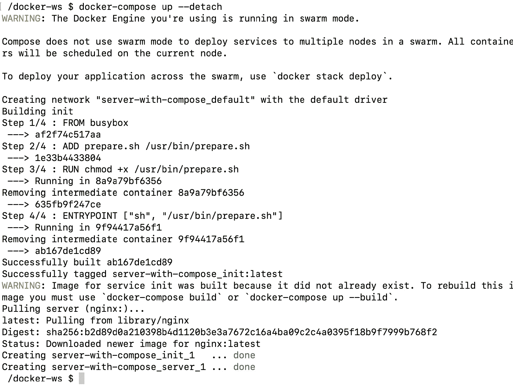
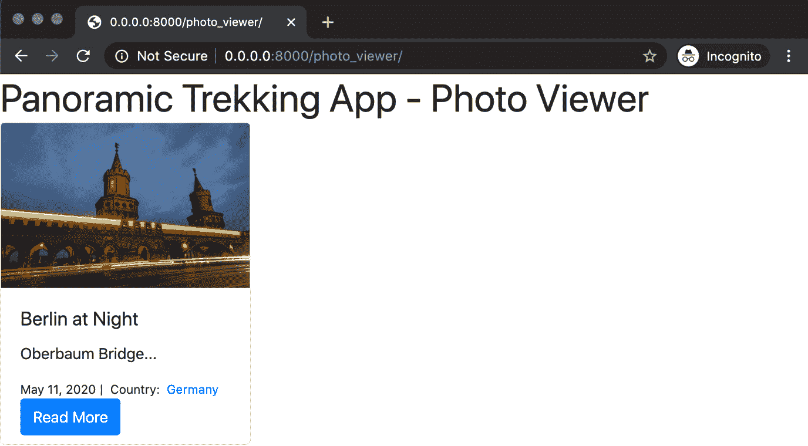

# 第五章：使用 Docker Compose 组合环境

概述

本章涵盖了使用 Docker Compose 创建和管理多容器应用程序。您将学习如何创建 Docker Compose 文件来定义复杂的容器化应用程序，以及如何运行 Docker Compose CLI 来管理多容器应用程序的生命周期。本章将使您能够使用不同的方法配置 Docker Compose 应用程序，并设计依赖于其他应用程序的应用程序。

# 介绍

在前几章中，我们讨论了如何使用 Docker 容器和`Dockerfiles`来创建容器化应用程序。随着应用程序变得更加复杂，容器及其配置的管理变得更加复杂。

例如，想象一下，您正在开发一个具有前端、后端、支付和订购微服务的在线商店。每个微服务在构建、打包和配置之前都是用最合适的编程语言实现的。因此，在 Docker 生态系统中，复杂应用程序被设计为在单独的容器中运行。不同的容器需要多个`Dockerfiles`来定义 Docker 镜像。

它们还需要复杂的命令来配置、运行和排除应用程序故障。所有这些都可以通过**Docker Compose**来实现，这是一个用于定义和管理多个容器中的应用程序的工具。诸如 YAML 文件之类的复杂应用程序可以在 Docker Compose 中用单个命令进行配置和运行。它适用于各种环境，包括开发、测试、**持续集成**（**CI**）流水线和生产环境。

Docker Compose 的基本特性可以分为三类：

+   **隔离**：Docker Compose 允许您在完全隔离的环境中运行多个复杂应用程序实例。虽然这似乎是一个微不足道的功能，但它使得在开发人员机器、CI 服务器或共享主机上运行多个相同应用程序堆栈的副本成为可能。因此，资源共享增加了利用率，同时减少了操作复杂性。

+   **有状态数据管理**：Docker Compose 管理容器的卷，以便它们不会丢失之前运行的数据。这个特性使得更容易创建和操作那些在磁盘上存储状态的应用程序，比如数据库。

+   **迭代设计**：Docker Compose 与明确定义的配置一起工作，该配置由多个容器组成。配置中的容器可以通过新容器进行扩展。例如，想象一下你的应用程序中有两个容器。如果添加第三个容器并运行 Docker Compose 命令，前两个容器将不会被重新启动或重新创建。Docker Compose 只会创建并加入新添加的第三个容器。

这些特性使得 Compose 成为在各种平台上创建和管理多个容器应用程序的重要工具。在本章中，您将看到 Docker Compose 如何帮助您管理复杂应用程序的完整生命周期。

您将首先深入了解 Compose CLI 和文件解剖。之后，您将学习如何使用多种技术配置应用程序以及如何定义服务依赖关系。由于 Docker Compose 是 Docker 环境中的重要工具，因此技术和实践经验对您的工具箱至关重要。

# Docker Compose CLI

Docker Compose 与**Docker Engine**一起工作，用于创建和管理多容器应用程序。为了与 Docker Engine 交互，Compose 使用名为`docker-compose`的 CLI 工具。在 Mac 和 Windows 系统上，`docker-compose`已经是 Docker Desktop 的一部分。然而，在 Linux 系统上，您需要在安装 Docker Engine 后安装`docker-compose` CLI 工具。它被打包成一个单独的可执行文件，您可以使用以下命令在 Linux 系统上安装它。

## 在 Linux 中安装 Docker Compose CLI

1.  使用以下命令将二进制文件下载到`/usr/local/bin`中：

[PRE0]

1.  使用以下命令使下载的二进制文件可执行：

[PRE1]

1.  在所有操作系统的终端上使用以下命令测试 CLI 和安装：

[PRE2]

如果安装正确，您将看到 CLI 及其依赖项的版本如下。例如，在以下输出中，`docker-compose` CLI 的版本为`1.25.1-rc1`，其依赖项`docker-py`、`CPython`和`OpenSSL`也列出了它们的版本：

图 5.1：docker-compose 版本输出

到目前为止，我们已经学会了如何在 Linux 中安装 Docker Compose CLI。现在我们将研究管理多容器应用程序的完整生命周期的命令和子命令。

## Docker Compose CLI 命令

`docker-compose`命令能够管理多容器应用程序的完整生命周期。通过子命令，可以启动、停止和重新创建服务。此外，还可以检查正在运行的堆栈的状态并获取日志。在本章中，您将通过实践掌握这些基本命令。同样，可以使用以下命令列出所有功能的预览：

[PRE3]

命令的输出应该如下所示：

图 5.2：docker-compose 命令

有三个基本的`docker-compose`命令用于管理应用程序的生命周期。生命周期和命令可以如下所示：

图 5.3：docker-compose 生命周期

+   `docker-compose up`：此命令创建并启动配置中定义的容器。可以构建容器镜像或使用来自注册表的预构建镜像。此外，可以使用`-d`或`--detach`标志在`detached`模式下在后台运行容器。对于长时间运行的容器（例如 Web 服务器），使用`detached`模式非常方便，我们不希望在短期内停止它们。可以使用`docker-compose up --help`命令检查其他选项和标志。

+   `docker-compose ps`：此命令列出容器及其状态信息。对于故障排除和容器健康检查非常有帮助。例如，如果创建了一个具有后端和前端的双容器应用程序，可以使用`docker-compose ps`命令检查每个容器的状态。这有助于找出您的后端或前端是停机、不响应其健康检查，还是由于错误配置而无法启动。

+   `docker-compose down`：此命令停止并删除所有资源，包括容器、网络、镜像和卷。

## Docker Compose 文件

多容器应用程序是使用`docker-compose` CLI 运行和定义的。按照惯例，这些文件的默认名称是`docker-compose.yaml`。Docker Compose 是一个强大的工具；然而，它的强大取决于配置。因此，知道如何创建`docker-compose.yaml`文件是必不可少的，并且需要特别注意。

注意

Docker Compose 默认使用`docker-compose.yaml`和`docker-compose.yml`文件扩展名。

`docker-compose.yaml` 文件由四个主要部分组成，如 *图 5.4* 所示：

图 5.4：docker-compose 文件结构

+   `version`：此部分定义了 `docker-compose` 文件的语法版本，目前最新的语法版本是 `3`。

+   `services`：此部分描述了将在需要时构建并由 `docker-compose` 启动的 Docker 容器。

+   `networks`：此部分描述了服务将使用的网络。

+   `volumes`：此部分描述了将挂载到服务中的数据卷。

对于 `services` 部分，有两个关键选项可以创建容器。第一个选项是构建容器，第二个选项是使用来自注册表的 Docker 镜像。当您在本地创建和测试容器时，建议构建镜像。另一方面，对于生产和 CI/CD 系统，使用来自注册表的 Docker 镜像更快速、更简便。

假设您想要使用名为 `Dockerfile-server` 的 `Dockerfile` 构建服务器容器。然后，您需要将文件放在具有以下文件夹结构的 `server` 文件夹中：

图 5.5：文件夹结构

`tree` 命令的输出显示了一个包含 `Dockerfile-server` 的 `server` 文件夹。

当在根目录的 `docker-compose.yaml` 文件中定义了以下内容时，`server` 容器将在运行服务之前构建：

[PRE4]

同样，如果您想要使用来自 Docker 注册表的镜像，可以仅定义一个带有 `image` 字段的服务：

[PRE5]

Docker Compose 默认创建一个网络，每个容器都连接到此网络。此外，容器可以使用主机名连接到其他容器。例如，假设您在 `webapp` 文件夹中有以下 `docker-compose.yaml` 文件：

[PRE6]

当您使用此配置启动 `docker-compose` 时，它首先创建了名为 `webapp_default` 的网络。随后，`docker-compose` 创建了 `server` 和 `db` 容器，并分别以 `server` 和 `db` 的名称加入了 `webapp_default` 网络。

此外，`server`容器可以使用其`container`端口和主机名连接到数据库，如下所示：`postgres://db:5432`。同样，数据库可以通过主机端口`8032`从主机机器访问，如下所示：`postgres://localhost:8032`。网络结构如下图所示：

图 5.6：网络结构

在`docker-compose.yaml`文件中，您可以定义自定义网络，而不是使用默认网络。`network`配置使您能够基于自定义网络驱动程序创建复杂的网络技术。Docker 容器的网络技术在*第六章*，*Docker 网络简介*中有全面介绍。在接下来的章节中将介绍如何使用自定义网络驱动程序扩展 Docker 引擎。

Docker Compose 还作为`docker-compose.yaml`文件的一部分创建和管理卷。卷在容器之间提供持久性，并由 Docker 引擎管理。所有服务容器都可以重用卷。换句话说，数据可以在容器之间共享，用于同步、数据准备和备份操作。在*第七章*，*Docker 存储*中，将详细介绍 Docker 的卷。

使用以下`docker-compose.yaml`文件，`docker-compose`将使用 Docker 引擎中的默认卷插件创建名为`data`的卷。此卷将被挂载到`database`容器的`/database`路径和`backup`容器的`/backup`路径。此 YAML 文件及其内容创建了一个服务堆栈，运行数据库并在没有停机时间的情况下持续备份：

[PRE7]

注意

Docker Compose 文件的官方参考文档可在[`docs.docker.com/compose/compose-file/`](https://docs.docker.com/compose/compose-file/)找到。

在以下练习中，将使用 Docker Compose 创建一个具有网络和卷使用的多容器应用程序。

注意

请使用`touch`命令创建文件，并使用`vim`命令在文件上使用 vim 编辑器。

## 练习 5.01：使用 Docker Compose 入门

容器中的 Web 服务器在启动之前需要进行操作任务，例如配置、文件下载或依赖项安装。使用`docker-compose`，可以将这些操作定义为多容器应用程序，并使用单个命令运行它们。在这个练习中，您将创建一个准备容器来生成静态文件，例如`index.html`文件。然后，服务器容器将提供静态文件，并且可以通过网络配置从主机机器访问。您还将使用各种`docker-compose`命令来管理应用程序的生命周期。

要完成练习，请执行以下步骤：

1.  创建一个名为`server-with-compose`的文件夹，并使用`cd`命令进入其中：

[PRE8]

1.  创建一个名为`init`的文件夹，并使用`cd`命令进入其中：

[PRE9]

1.  创建一个包含以下内容的 Bash 脚本文件，并将其保存为`prepare.sh`：

[PRE10]

该脚本使用`echo`命令生成一个示例 HTML 页面。

1.  创建一个名为`Dockerfile`的文件，并包含以下内容：

[PRE11]

此`Dockerfile`基于`busybox`，这是一个用于节省空间的容器的微型操作系统，并将`prepare.sh`脚本添加到文件系统中。此外，它使文件可执行，并将其设置为`ENTRYPOINT`命令。`ENTRYPOINT`命令，在我们的情况下，`prepare.sh`脚本在 Docker 容器启动时被初始化。

1.  使用`cd ..`命令将目录更改为父文件夹，并创建一个名为`docker-compose.yaml`的文件，包含以下内容：

[PRE12]

此`docker-compose`文件创建一个名为`static`的卷，以及两个名为`init`和`server`的服务。该卷被挂载到两个容器上。此外，服务器已发布端口`8080`，连接到容器端口`80`。

1.  使用以下命令以`detach`模式启动应用程序，以继续使用终端：

[PRE13]

以下图片显示了执行上述命令时发生的情况：

图 5.7：启动应用程序

前面的命令以`分离`模式创建并启动容器。它首先创建`server-with-compose_default`网络和`server-with-compose_static`卷。然后，使用*步骤 4*中的`Dockerfile`构建`init`容器，为服务器下载`nginx` Docker 镜像，并启动容器。最后，它打印容器的名称并使它们在后台运行。

注意

您可以忽略关于 Swarm 模式的警告，因为我们希望将所有容器部署到同一节点。

1.  使用`docker-compose ps`命令检查应用程序的状态:

图 5.8：应用程序状态

此输出列出了两个容器。`init`容器成功退出，代码为`0`，而`server`容器处于`运行中`状态，其端口可用。这是预期的输出，因为`init`容器旨在准备`index.html`文件并完成其操作，而`server`容器应始终处于运行状态。

1.  在浏览器中打开`http://localhost:8080`。以下图显示了输出:

图 5.9：服务器输出

*图 5.9*显示了由`init`容器创建的`index.html`页面。换句话说，它显示了`docker-compose`创建了卷，将其挂载到容器，并成功启动了它们。

1.  如果不需要应用程序运行，使用以下命令停止并移除所有资源:

[PRE14]

该命令将返回以下输出:

图 5.10：停止应用程序

在这个练习中，使用`docker-compose`创建和配置了一个多容器应用程序。网络和卷选项存储在`docker-compose.yaml`文件中。此外，还展示了用于创建应用程序、检查状态和移除应用程序的 CLI 命令。

在接下来的部分中，将介绍 Docker Compose 环境中应用程序的配置选项。

# 服务配置

云原生应用程序应该将它们的配置存储在环境变量中。环境变量易于在不更改源代码的情况下在不同平台之间更改。环境变量是存储在基于 Linux 的系统中并被应用程序使用的动态值。换句话说，这些变量可以通过更改它们的值来配置应用程序。

例如，假设您的应用程序使用`LOG_LEVEL`环境变量来配置日志记录内容。如果您将`LOG_LEVEL`环境变量从`INFO`更改为`DEBUG`并重新启动应用程序，您将看到更多日志并能更轻松地解决问题。此外，您可以使用不同的环境变量集部署相同的应用程序到暂存、测试和生产环境。同样，在 Docker Compose 中配置服务的方法是为容器设置环境变量。

在 Docker Compose 中定义环境变量有三种方法，优先级如下：

1.  使用 Compose 文件

1.  使用 shell 环境变量

1.  使用环境文件

如果环境变量不经常更改但容器需要使用它们，最好将它们存储在`docker-compose.yaml`文件中。如果有敏感的环境变量，比如密码，建议在调用`docker-compose` CLI 之前通过 shell 环境变量传递它们。但是，如果变量的数量很大并且在测试、暂存或生产系统之间变化很大，最好将它们收集在`.env`文件中，并将它们传递到`docker-compose.yaml`文件中。

在`docker-compose.yaml`文件的`services`部分，可以为每个服务定义环境变量。例如，以下是在 Docker Compose 文件中为`server`服务设置的`LOG_LEVEL`和`METRICS_PORT`环境变量：

[PRE15]

当在`docker-compose.yaml`文件中未为环境变量设置值时，可以通过运行`docker-compose`命令从 shell 中获取值。例如，`server`服务的`HOSTNAME`环境变量将直接从 shell 中设置：

[PRE16]

当运行`docker-compose`命令的 shell 没有`HOSTNAME`环境变量的值时，容器将以空环境变量启动。

此外，可以将环境变量存储在`.env`文件中，并在`docker-compose.yaml`文件中进行配置。一个名为`database.env`的示例文件可以按键值列表的方式进行结构化，如下所示：

[PRE17]

在`docker-compose.yaml`文件中，环境变量文件字段配置在相应的服务下，如下所示：

[PRE18]

当 Docker Compose 创建`server`服务时，它将把`database.env`文件中列出的所有环境变量设置到容器中。

在接下来的练习中，您将使用 Docker Compose 中的所有三种配置方法来配置一个应用程序。

## 练习 5.02：使用 Docker Compose 配置服务

Docker Compose 中的服务是通过环境变量进行配置的。在这个练习中，您将创建一个由不同设置变量方法配置的 Docker Compose 应用程序。在一个名为`print.env`的文件中，您将定义两个环境变量。此外，您将在`docker-compose.yaml`文件中创建和配置一个环境变量，并在终端上即时传递一个环境变量。您将看到来自不同来源的四个环境变量如何汇聚在您的容器中。

要完成练习，请执行以下步骤：

1.  创建一个名为`server-with-configuration`的文件夹，并使用`cd`命令进入其中：

[PRE19]

1.  创建一个名为`print.env`的`.env`文件，并包含以下内容：

[PRE20]

在这个文件中，使用它们的值定义了两个环境变量`ENV_FROM_ENV_FILE_1`和`ENV_FROM_ENV_FILE_2`。

1.  创建一个名为`docker-compose.yaml`的文件，并包含以下内容：

[PRE21]

在这个文件中，定义了一个单容器应用程序，容器运行`env`命令来打印环境变量。它还使用名为`print.env`的环境文件，以及两个额外的环境变量`ENV_FROM_COMPOSE_FILE`和`ENV_FROM_SHELL`。

1.  使用以下命令将`ENV_FROM_SHELL`导出到 shell 中：

[PRE22]

1.  使用`docker-compose up`命令启动应用程序。输出应该如下所示：

图 5.11：启动应用程序

输出是在`docker-compose`文件中定义的`print`容器的结果。该容器有一个要运行的命令`env`，它会打印出可用的环境变量。如预期的那样，有两个环境变量`ENV_FROM_ENV_FILE_1`和`ENV_FROM_ENV_FILE_2`，对应的值分别为`HELLO`和`WORLD`。此外，在*步骤 3*中在`docker-compose.yaml`文件中定义的环境变量以`ENV_FROM_COMPOSE_FILE`的名称和值`HELLO`可用。最后，在*步骤 4*中导出的环境变量以`ENV_FROM_SHELL`的名称和值`WORLD`可用。

在这个练习中，创建了一个 Docker Compose 应用程序，并使用不同的方法进行配置。使用 Docker Compose 文件、环境定义文件和导出的值可以将相同的应用程序部署到不同的平台上。

由于 Docker Compose 管理多容器应用程序，因此需要定义它们之间的相互依赖关系。Docker Compose 应用程序中容器的相互依赖关系将在以下部分中介绍。

# 服务依赖

Docker Compose 运行和管理在`docker-compose.yaml`文件中定义的多容器应用程序。尽管容器被设计为独立的微服务，但创建相互依赖的服务是非常常见的。例如，假设您有一个包含数据库和后端组件的两层应用程序，比如一个 PostgreSQL 数据库和一个 Java 后端。Java 后端组件需要 PostgreSQL 处于运行状态，因为它需要连接到数据库来运行业务逻辑。因此，您可能需要定义多容器应用程序的服务之间的依赖关系。通过 Docker Compose，可以控制服务的启动和关闭的顺序。

假设您有一个包含三个容器的应用程序，其`docker-compose.yaml`文件如下：

[PRE23]

在这个文件中，`main`容器依赖于`pre`容器，而`pre`容器依赖于`init`容器。Docker Compose 按照`init`、`pre`和`main`的顺序启动容器，如*图 5.12*所示。此外，容器将按相反的顺序停止：`main`、`pre`，然后是`init`。

图 5.12：服务启动顺序

在接下来的练习中，容器的顺序将用于填充文件的内容，然后使用 Web 服务器提供它。

## 练习 5.03：使用 Docker Compose 进行服务依赖

在 Docker Compose 中，服务可以配置为依赖于其他服务。在这个练习中，您将创建一个包含四个容器的应用程序。前三个容器将依次运行，以创建一个静态文件，由第四个容器提供服务。

要完成这个练习，执行以下步骤：

1.  创建一个名为`server-with-dependency`的文件夹，并使用`cd`命令进入其中：

[PRE24]

1.  创建一个名为`docker-compose.yaml`的文件，并包含以下内容：

[PRE25]

这个文件包括四个服务和一个卷。卷的名称是`static`，它被挂载到所有服务上。前三个服务对静态卷采取单独的操作。`clean`容器删除`index.html`文件，然后`init`容器开始填充`index.html`。随后，`pre`容器向`index.html`文件写入额外的一行。最后，`server`容器提供`static`文件夹中的内容。

1.  使用`docker-compose up`命令启动应用程序。输出应该如下所示：

图 5.13：启动应用程序

输出显示，Docker Compose 按照`clean`，`init`，然后`pre`的顺序创建容器。

1.  在浏览器中打开`http://localhost:8080`：

图 5.14：服务器输出

服务器的输出显示，`clean`，`init`和`pre`容器按照预期的顺序工作。

1.  返回到*步骤 3*中的终端，并使用*Ctrl* + *C*优雅地关闭应用程序。您将看到一些 HTTP 请求日志，最后是`Stopping server-with-dependency_server_1`行：

图 5.15：停止应用程序

在这个练习中，使用 Docker Compose 创建了一个具有相互依赖服务的应用程序。展示了 Docker Compose 如何按照定义的顺序启动和管理容器。这是 Docker Compose 的一个重要特性，您可以使用它来创建复杂的多容器应用程序。

现在，让我们通过实施以下活动来测试我们在本章中迄今为止所学到的知识。在下一个活动中，您将学习如何使用 Docker Compose 安装 WordPress。

## 活动 5.01：使用 Docker Compose 安装 WordPress

您被指派设计并部署一个博客及其数据库作为 Docker 中的微服务。您将使用**WordPress**，因为它是最流行的**内容管理系统**（**CMS**），被超过三分之一的互联网上的所有网站使用。此外，开发和测试团队需要在不同平台上多次安装 WordPress 和数据库，并进行隔离。因此，您需要将其设计为 Docker Compose 应用程序，并使用`docker-compose` CLI 进行管理。

执行以下步骤以完成此活动：

1.  首先创建一个用于您的`docker-compose.yaml`文件的目录。

1.  使用 MySQL 在`docker-compose.yaml`文件中创建一个数据库服务和一个卷。确保设置`MYSQL_ROOT_PASSWORD`、`MYSQL_DATABASE`、`MYSQL_USER`和`MYSQL_PASSWORD`环境变量。

1.  在`docker-compose.yaml`文件中创建一个 WordPress 的服务。确保 WordPress 容器在数据库之后启动。对于 WordPress 的配置，不要忘记根据*步骤 2*设置`WORDPRESS_DB_HOST`、`WORDPRESS_DB_USER`、`WORDPRESS_DB_PASSWORD`和`WORDPRESS_DB_NAME`环境变量。此外，您需要发布其端口以便能够从浏览器访问它。

1.  以`detached`模式启动 Docker Compose 应用程序。成功部署后，您将有两个运行的容器：

图 5.16：WordPress 和数据库容器

然后您将能够在浏览器中访问 WordPress 的设置屏幕：

图 5.17：WordPress 设置屏幕

注意

此活动的解决方案可以通过此链接找到。

在下一个活动中，您将通过创建一个包含三个容器的 Docker 应用程序，并使用`docker-compose` CLI 进行管理，获得安装全景徒步应用的实际经验。

## 活动 5.02：使用 Docker Compose 安装全景徒步应用

您的任务是使用 Docker Compose 创建 Panoramic Trekking App 的部署。您将利用 Panoramic Trekking App 的三层架构，并创建一个包含数据库、Web 后端和`nginx`容器的三个容器 Docker 应用程序。因此，您将将其设计为 Docker Compose 应用程序，并使用`docker-compose` CLI 进行管理。

执行以下步骤完成此活动：

1.  为您的`docker-compose.yaml`文件创建一个目录。

1.  使用 PostgreSQL 为数据库创建一个服务，并在`docker-compose.yaml`文件中定义一个卷。确保将`POSTGRES_PASSWORD`环境变量设置为`docker`。此外，您需要在`docker-compose.yaml`中创建一个`db_data`卷，并将其挂载到`/var/lib/postgresql/data/`以存储数据库文件。

1.  在`docker-compose.yaml`文件中为 Panoramic Trekking App 创建一个服务。确保您使用的是`packtworkshops/the-docker-workshop:chapter5-pta-web` Docker 镜像，该镜像已经预先构建并准备好从注册表中使用。此外，由于应用程序依赖于数据库，您应该配置容器在数据库之后启动。为了存储静态文件，在`docker-compose.yaml`中创建一个`static_data`卷，并将其挂载到`/service/static/`。

最后，为`nginx`创建一个服务，并确保您正在使用注册表中的`packtworkshops/the-docker-workshop:chapter5-pta-nginx` Docker 镜像。确保`nginx`容器在 Panoramic Trekking App 容器之后启动。您还需要将相同的`static_data`卷挂载到`/service/static/`位置。不要忘记将`nginx`端口`80`发布到`8000`，以便从浏览器访问。

1.  以“分离”模式启动 Docker Compose 应用程序。成功部署后，将有三个容器在运行：

图 5.18：应用程序、数据库和 nginx 容器

1.  在浏览器中转到 Panoramic Trekking App 的管理部分，地址为`http://0.0.0.0:8000/admin`：

图 5.19：管理员设置登录

您可以使用用户名`admin`和密码`changeme`登录，并添加新的照片和国家：

图 5.20：管理员设置视图

1.  在浏览器中访问全景徒步应用程序的地址`http://0.0.0.0:8000/photo_viewer`：

图 5.21：应用程序视图

注意

此活动的解决方案可通过此链接找到。

# 摘要

本章重点介绍了使用 Docker Compose 设计、创建和管理多容器应用程序。随着微服务架构的兴起，容器化应用程序的复杂性也增加。因此，如果没有适当的工具，创建、管理和排除多容器应用程序将变得困难。Docker Compose 是 Docker 工具箱中的官方工具，用于此目的。

在本章中，主要重点是全面学习`docker-compose`。为此，本章从`docker-compose` CLI 的功能及其命令和标志开始。然后介绍了`docker-compose.yaml`文件的结构。Docker Compose 的强大之处实际上来自于`docker-compose.yaml`文件中定义的配置能力。因此，学习如何使用这些文件来管理多容器应用是至关重要的。

接下来，演示了 Docker Compose 中服务的配置。您已经学会了如何为不同环境配置服务并适应未来的变化。然后我们转向了服务依赖关系，以学习如何创建更复杂的容器化应用程序。

本章中的每个练习都旨在展示 Docker 的能力，包括不同的 CLI 命令和 YAML 文件部分。必须亲自体验 CLI 和创建用于测试和生产环境中的多容器应用所需的文件。

在下一章中，您将学习 Docker 中的网络。容器化和可扩展应用程序中的网络是基础设施的关键部分之一，因为它将分布式部分粘合在一起。这就是为什么 Docker 中的网络由可插拔驱动程序和选项组成，以增强容器化应用程序的开发和管理体验。
