# 第八章：CI/CD 流水线

概述

在进入生产之前，本章介绍了**持续集成和持续交付**（**CI/CD**）这一最关键的步骤。这是开发和生产之间的中间阶段。本章将演示 Docker 是 CI 和 CD 的强大技术，以及它如何轻松地与其他广泛使用的平台集成。在本章结束时，您将能够配置 GitHub、Jenkins 和 SonarQube，并将它们整合以自动发布您的图像以供生产使用。

# 介绍

在之前的章节中，您学习了如何编写`docker-compose`文件，并探索了服务的网络和存储。在本章中，您将学习如何集成应用程序的各种微服务并将其作为一个整体进行测试。

**CI/CD**代表**持续集成和持续交付**。有时，**CD**也用于**持续部署**。这里的部署意味着通过自动化流水线工作流从特定 URL 公开访问应用程序，而交付意味着使应用程序准备部署。在本章中，我们将重点讨论 CI/CD 的概念。

本章讨论了 Docker 如何在 CI/CD 流水线中进行逐步练习。您还将学习如何安装和运行 Jenkins 作为 Docker 容器。Jenkins 是一个开源的自动化服务器。您可以使用它来构建、测试、部署，并通过自动化软件开发的部分来促进 CI/CD。安装 Jenkins 只需一个 Docker 命令。在 Docker 上安装 Jenkins 比将其安装为应用程序更加强大，并且不会与特定操作系统紧密耦合。

注意

如果您没有 GitHub 和 Docker Hub 的帐户，请创建它们。您可以在以下链接免费创建：[www.github.com](http://www.github.com) 和 [`hub.docker.com`](http://hub.docker.com)。

# 什么是 CI/CD？

CI/CD 是一种帮助应用程序开发团队更频繁和可靠地向用户提供代码更改的方法。CI/CD 将自动化引入到代码部署的各个阶段中。

当多个开发人员共同协作并为同一应用程序做出贡献（每个人负责特定的微服务或修复特定的错误）时，他们使用代码版本控制提供程序使用开发人员上传和推送的最新代码版本来汇总应用程序。GitHub、Bitbucket 和 Assembla 是版本控制系统的示例。开发人员和测试人员将应用程序代码和 Docker 文件推送到自动化软件以构建、测试和部署 CI/CD 流水线。Jenkins、Circle CI 和 GitLab CI/CD 是此类自动化平台的示例。

通过测试后，将构建 Docker 镜像并发布到您的存储库。这些存储库可以是 Docker Hub、您公司的 Docker Trusted Register（DTR）或 Amazon Elastic Container Registry（ECR）。

在本章中，就像*图 8.1*一样，我们将使用 GitHub 存储库进行代码版本控制。然后，我们将使用 Jenkins 来构建和发布框架，并使用 Docker Hub 作为注册表。


图 8.1：CI/CD 流水线

在生产阶段之前，您必须构建 Docker 镜像，因为在生产中使用的`docker-stack.yml`文件中没有`build`关键字。然后将在集成和自动化的目标环境中将镜像部署到生产环境。在生产中，运维（或 DevOps）人员配置编排器从注册表中拉取镜像。Kubernetes、Docker Swarm 和 Google Kubernetes Engine 是可以用来从注册表中拉取镜像的生产编排器和管理服务的示例。

总之，我们有三个主要步骤：

1.  将代码上传到 GitHub。

1.  在 Jenkins 中创建一个项目，并输入 GitHub 和 Docker Hub 凭据。Jenkins 将自动构建镜像并将其推送到您的 Docker Hub 账户。当您将代码推送到 GitHub 时，Jenkins 会自动检测、测试和构建镜像。如果没有生成错误，Jenkins 会将镜像推送到注册表。

1.  验证镜像是否在您的 Docker Hub 账户上。

在下一个练习中，您将安装 Jenkins 作为一个容器，用于构建镜像。Jenkins 是市场上最受欢迎的测试平台之一。Jenkins 有几种项目类型。在本章中，我们将使用 Freestyle 项目类型。

注意

请使用`touch`命令创建文件，使用`vim`命令在 vim 编辑器中处理文件。

## 练习 8.01：将 Jenkins 安装为一个容器

在这个练习中，您将安装 Jenkins，完成其设置，并安装初步插件。您将安装 Git 和 GitHub 插件，这些插件将在本章中使用。执行以下步骤成功地将 Jenkins 安装为一个容器：

1.  运行以下命令拉取 Jenkins 镜像：

```
$docker run -d -p 8080:8080 -v /var/run/docker.sock:/var/run/docker.sock jenkinsci/blueocean
```

这将导致类似以下的输出：


图 8.2：docker run 命令的输出

注意

Docker Hub 上有许多 Jenkins 镜像。随意拉取其中任何一个，并玩转端口和共享卷，但要注意弃用的镜像，因为 Jenkins 官方镜像现在已弃用为`Jenkins/Jenkins:lts`镜像。因此，请仔细阅读镜像的文档。但是，如果一个镜像不起作用，不要担心。这可能不是你的错。寻找另一个镜像，并严格按照文档的说明操作。

1.  打开浏览器，并连接到`http://localhost:8080`上的 Jenkins 服务。

如果它给出一个错误消息，说明它无法连接到 Docker 守护程序，请使用以下命令将 Jenkins 添加到`docker`组：

```
$ sudo groupadd docker
$ sudo usermod –aG docker jenkins
```

注意

如果您的计算机操作系统是 Windows，本地主机名可能无法解析。在 Windows PowerShell 中运行`ipconfig`命令。在输出的第二部分中，`ipconfig`显示`switch`网络的信息。复制 IPv4 地址，并在练习中使用它，而不是本地主机名。

您还可以从`控制面板` > `网络和共享中心`获取 IP 地址，然后点击您的以太网或 Wi-Fi 连接的`详细信息`。

安装完成后，Jenkins 将要求输入`管理员密码`来解锁它：


图 8.3：开始使用 Jenkins

Jenkins 会为您生成一个密码，用于解锁应用程序。在下一步中，您将看到如何获取这个密码。

1.  运行`docker container ls`命令以获取当前正在运行的容器列表：

```
$ docker container ls
```

您将获得从`jekinsci/blueocean`镜像创建的容器的详细信息：

```
CONTAINER ID IMAGE              COMMAND               CREATED
  STATUS              PORTS
9ed51541b036 jekinsci/blueocean "/sbin/tini../usr/.." 5 minutes ago
  Up 5 minutes        0.0.0.0:8080->8080/tcp, 5000/tcp
```

1.  复制容器 ID 并运行`docker logs`命令：

```
$ docker logs 9ed51541b036
```

在日志文件的末尾，您将找到六行星号。密码将在它们之间。复制并粘贴到浏览器中：


图 8.4：docker logs 命令的输出

1.  选择“安装建议的插件”。然后，单击“跳过并继续作为管理员”。单击“保存并完成”：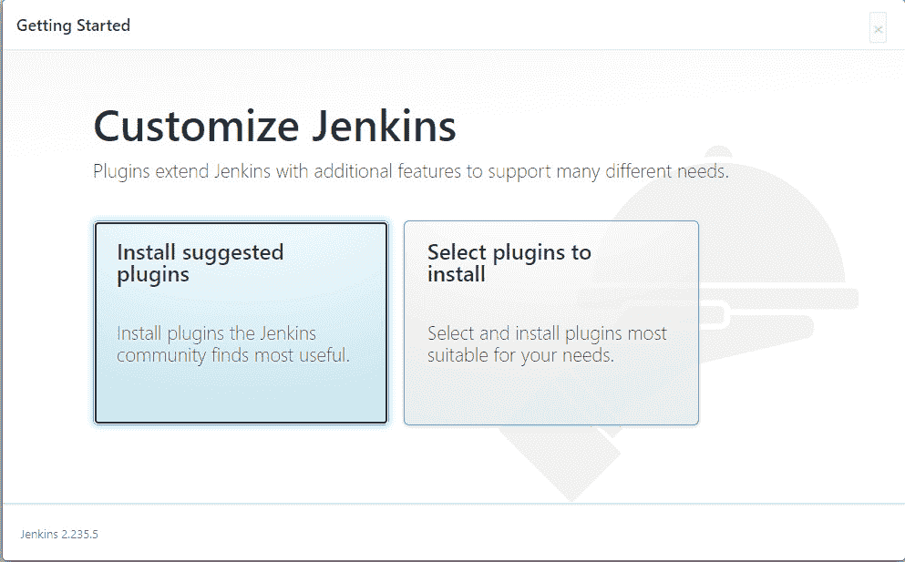

图 8.5：安装插件以自定义 Jenkins

在建议的插件中，有 Git 和 GitHub 插件，Jenkins 将自动为您安装这些插件。您将需要这些插件来完成所有即将进行的练习。

注意

在*练习 8.04*，*集成 Jenkins 和 Docker Hub*中，您将需要安装更多插件，以便 Jenkins 可以将镜像推送到 Docker Hub 注册表。稍后将详细讨论这一点，以及如何逐步管理 Jenkins 插件的实验。

1.  安装完成后，它将显示“Jenkins 已准备就绪！”。单击“开始使用 Jenkins”：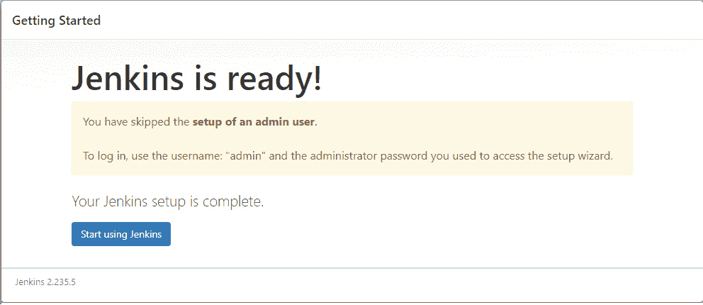

图 8.6：设置 Jenkins

1.  单击“创建作业”以构建软件项目：

图 8.7：Jenkins 的欢迎页面

前面的截图验证了您已成功在系统上安装了 Jenkins。

在接下来的章节中，我们将遵循本章的 CI/CD 流水线。第一步是将代码上传到 GitHub，然后将 Jenkins 与 GitHub 集成，以便 Jenkins 可以自动拉取代码并构建镜像。最后一步将是将 Jenkins 与注册表集成，以便将该镜像推送到注册表而无需任何手动干预。

# 集成 GitHub 和 Jenkins

安装 Jenkins 后，我们将创建我们的第一个作业并将其与 GitHub 集成。在本节中，就像*图 8.8*中一样，我们将专注于 GitHub 和 Jenkins。Docker Hub 稍后将进行讨论。


图 8.8：集成 GitHub 和 Jenkins

我们将使用一个简单的 Python 应用程序来统计网站点击次数。每次刷新页面，计数器都会增加，从而增加网站点击次数。

注意

`Getting Started`应用程序的代码文件可以在以下链接找到：[`github.com/efoda/hit_counter`](https://github.com/efoda/hit_counter)。

该应用程序由四个文件组成：

+   `app.py`：这是 Python 应用程序代码。它使用`Redis`来跟踪网站点击次数的计数。

+   `requirments.txt`：该文件包含应用程序正常工作所需的依赖项。

+   `Dockerfile`：这将使用所需的库和依赖项构建图像。

+   `docker-compose.yml`：当两个或更多容器一起工作时，拥有 YAML 文件是必不可少的。

在这个简单的应用程序中，我们还有两个服务，`Web`和`Redis`，如*图 8.9*所示：

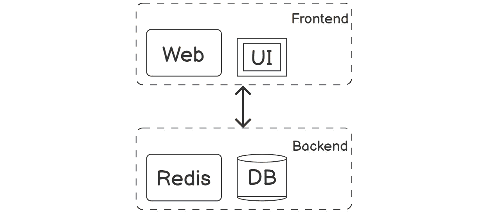

图 8.9：hit_counter 应用程序架构

如果您不知道如何将此应用程序上传到您的 GitHub 帐户，请不要担心。下一个练习将指导您完成此过程。

## 练习 8.02：将代码上传到 GitHub

您可以使用 GitHub 保存您的代码和项目。在这个练习中，您将学习如何下载和上传代码到 GitHub。您可以通过在 GitHub 网站上 fork 代码或从命令提示符推送代码来实现。在这个练习中，您将从命令提示符中执行。

执行以下步骤将代码上传到 GitHub：

1.  在 GitHub 网站上，创建一个名为`hit_counter`的新空存储库。打开终端并输入以下命令来克隆代码：

```
$ git clone https://github.com/efoda/hit_counter
```

这将产生类似以下的输出：

```
Cloning into 'hit counter'...
remote: Enumerating objects: 38, done.
remote: Counting objects: 100% (38/38), done
remote: Compressing objects: 100% (35/35), done
remote: Total 38 (delta 16), reused 0 (delta 0), pack-reused 0
Receiving object: 100% (38/38), 8.98 KiB | 2.25 MiB/s, done.
Resolving deltas: 100% (16/16), done
```

1.  通过列出目录来验证代码是否已下载到本地计算机。然后，打开应用程序目录：

```
$ cd hit_counter
~/hit_counter$ ls
```

您会发现应用程序文件已下载到您的本地计算机：

```
app.py docker-compose.yml Dockerfile README.md requirements.txt
```

1.  初始化并配置 Git：

```
$ git init
```

您应该会得到类似以下的输出：

```
Reinitialized existing Git repository in 
/home/docker/hit_counter/.git/
```

1.  输入您的用户名和电子邮件：

```
$ git config user.email "<you@example.com>"
$ git config user.name "<Your Name>"
```

1.  指定 Git 帐户的名称，`origin`和`destination`：

```
$ git remote add origin https://github.com/efoda/hit_counter.git
fatal: remote origin already exists.
$ git remote add destination https://github.com/<your Github Username>/hit_counter.git
```

1.  添加当前路径中的所有内容：

```
$ git add .
```

您还可以通过输入以下命令添加特定文件而不是所有文件：

```
$ git add <filename>.<extension>
```

1.  指定一个`commit`消息：

```
$ git commit -m "first commit"
```

这将产生类似以下的输出：

```
On branch master
Your branch is up to date with 'origin/master'.
nothing to commit, working tree clean
```

1.  将代码推送到您的 GitHub 帐户：

```
$ git push -u destination master
```

它会要求您输入用户名和密码。一旦您登录，文件将被上传到您的 GitHub 存储库：


图 8.10：将代码推送到 GitHub

1.  检查您的 GitHub 帐户。您会发现文件已经上传到那里。

现在我们已经完成了 CI/CD 管道的第一步，并且已经将代码上传到 GitHub，我们将把 GitHub 与 Jenkins 集成。

注意

从这一点开始，将 GitHub 用户名`efoda`替换为您的用户名。

## 练习 8.03：集成 GitHub 和 Jenkins

在*练习 8.01*，*将 Jenkins 安装为容器*中，您安装了 Jenkins 作为一个容器。在这个练习中，您将在 Jenkins 中创建一个作业，并将其配置为 GitHub。您将检查 Jenkins 的`输出控制台`，以验证它是否成功构建了镜像。然后，您将修改 GitHub 上的`Dockerfile`，并确保 Jenkins 已经检测到`Dockerfile`中的更改并自动重新构建了镜像：

1.  回到浏览器中的 Jenkins。点击`创建作业`：

图 8.11：在 Jenkins 中创建作业

1.  在`输入项目名称`文本框中填写项目名称。点击`自由风格项目`，然后点击`确定`：

图 8.12：选择自由风格项目

您将看到六个选项卡：`常规`，`源代码管理`，`构建触发器`，`构建环境`，`构建`和`后构建操作`，就像*图 8.13*中那样。

1.  在`常规`选项卡中，选择`丢弃旧构建`选项，以防止旧构建占用磁盘空间。Jenkins 也会为您做好清理工作：

图 8.13：选择丢弃旧构建选项

1.  在`源代码管理`选项卡中，选择`Git`。在`存储库 URL`中，输入`https://github.com/<your GitHub username>/hit_counter`，就像*图 8.14*中那样。如果您没有 Git，请检查您的插件并下载 Git 插件。我们将在*练习 8.04*，*集成 Jenkins 和 Docker Hub*中讨论管理插件的问题：

图 8.14：输入 GitHub 存储库 URL

1.  在`构建触发器`选项卡中，选择`轮询 SCM`。这是您指定 Jenkins 执行测试的频率的地方。如果您输入`H/5`，并在每个星号之间加上四个星号和空格，这意味着您希望 Jenkins 每分钟执行一次测试，就像*图 8.16*中那样。如果您输入`H * * * *`，这意味着轮询将每小时进行一次。如果您输入`H/15 * * * *`，则每 15 分钟进行一次轮询。点击文本框外部。如果您输入的代码正确，Jenkins 将显示下次执行作业的时间。否则，它将显示红色的错误。

图 8.15：构建触发器

1.  点击“构建”选项卡。点击“添加构建步骤”。选择“执行 shell”，如*图 8.17*所示：

图 8.16：选择执行 shell

1.  将显示一个文本框。写入以下命令：

```
docker build -t hit_counter .
```

然后点击“保存”，如*图 8.17*所示：

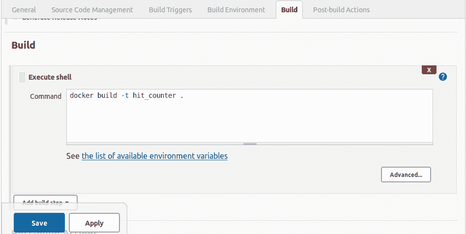

图 8.17：在“执行 shell 命令”框中输入 docker 构建命令

应该出现类似以下截图的屏幕：


图 8.18：成功创建 hit_count 项目

1.  在 Jenkins 中进一步操作之前，请检查您主机上当前拥有的镜像。在终端中运行`docker images`命令列出镜像：

```
$docker images
```

如果在本章之前清理了实验室，您将只有`jenkinsci/blueocean`镜像：

```
REPOSITORY           TAG     IMAGE ID      CREATED
       SIZE
jenkinsci/blueocean  latest  e287a467e019  Less than a second ago
       562MB
```

1.  返回到 Jenkins。从左侧菜单中点击“立即构建”。

注意

如果连接到 Docker 守护程序时出现权限被拒绝错误，请执行以下步骤：

1\. 如果尚不存在，请将 Jenkins 用户添加到 docker 主机：

`$ sudo useradd jenkins`

2\. 将 Jenkins 用户添加到 docker 组中：

`$ sudo usermod -aG docker jenkins`

3\. 从`/etc/group`获取 docker 组 ID，即`998`：

`$ sudo cat /etc/group | grep docker`

4\. 使用`docker exec`命令在运行中的 Jenkins 容器中创建一个 bash shell：

`$ docker container ls`

`$ docker exec -it -u root <CONTAINER NAME | CONTAINER ID> /bin/bash`

5\. 编辑 Jenkins 容器内的`/etc/group`文件：

`# vi /etc/group`

6\. 用从主机获取的 ID 替换 docker 组 ID，并将 Jenkins 用户添加到 docker 组中：

`docker:x:998:jenkins`

7\. 保存`/etc/group`文件并关闭编辑器：

`:wq`

8\. 退出 Jenkins 容器：

`# exit`

9\. 停止 Jenkins 容器：

`$ docker container ls`

`$ docker container stop <CONTAINER NAME | CONTAINER ID>`

注意

10\. 重新启动 Jenkins 容器：

`$ docker container ls`

`$ docker container start <CONTAINER NAME | CONTAINER ID>`

现在，作业将成功构建。

1.  点击“返回仪表板”。将出现以下屏幕。在左下角，您将看到“构建队列”和“构建执行器状态”字段。您可以看到一个构建已经开始，并且旁边有`#1`，如*图 8.19*所示：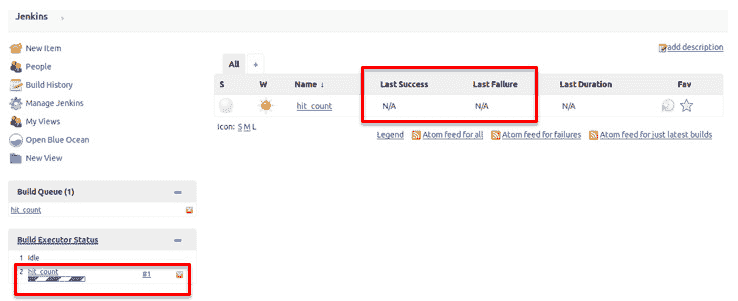

图 8.19：检查构建队列

构建尚未成功或失败。构建完成后，其状态将显示在屏幕上。过一段时间，您会发现已经进行了两次构建。

1.  单击`最后成功`字段下的`#2`旁边的小箭头。将出现一个下拉菜单，如下图所示。选择`控制台输出`以检查 Jenkins 自动为我们执行的操作，如*图 8.20*所示：

图 8.20：选择控制台输出

在`控制台输出`中，您会发现 Jenkins 执行了您在项目配置期间在`构建`步骤中输入的`docker build`命令：

向下滚动到`控制台输出`的底部，以查看执行结果。您将看到镜像已成功构建。您还会找到镜像 ID 和标签：

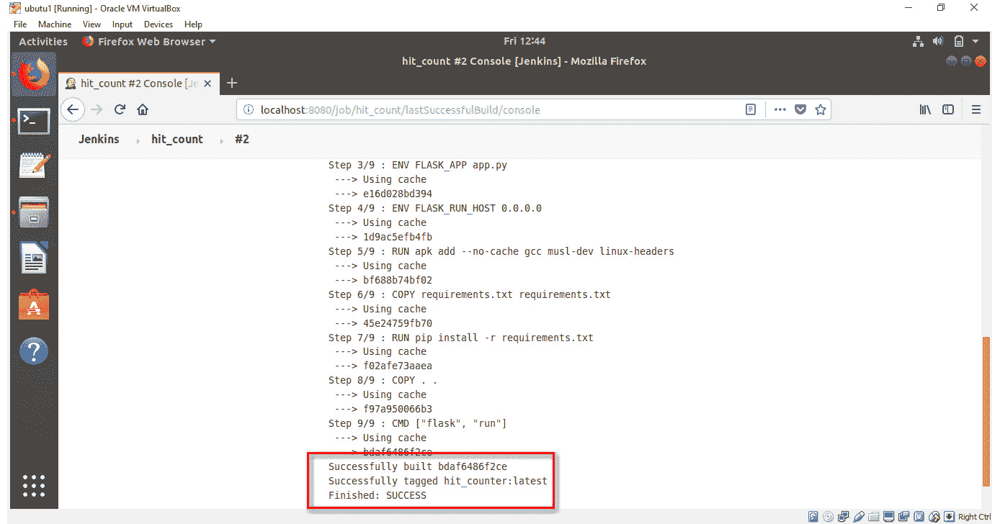

图 8.21：验证镜像是否成功构建

1.  从终端验证镜像 ID 和标签。重新运行`docker images`命令。

```
$docker images
```

您会发现已为您创建了`hit_counter`镜像。您还会发现`python:3.7-alpine`镜像，因为这是`Dockerfile`中的基础镜像，Jenkins 已自动拉取它：

```
REPOSITORY           TAG           IMAGE ID
  CREATED                      SIZE
jenkinsci/blueocean  latest        e287a467e019
  Less than a second ago       562MB
hit_counter          latest        bdaf6486f2ce
  3 minutes ago                227MB
python               3.7-alpine    6a5ca85ed89b
  2 weeks ago                  72.5MB
```

通过这一步，您可以确认 Jenkins 能够成功地从 GitHub 拉取文件。

1.  现在，您将在 GitHub 代码中进行所需的更改。但首先，请验证您尚未提交任何更改到代码。返回 Jenkins，向上滚动并在顶部的左侧菜单中单击`返回项目`。然后单击`最近的更改`，如*图 8.22*所示：

图 8.22：选择最近的更改

Jenkins 将显示所有构建中都没有更改，如下图所示：


图 8.23：验证代码中的更改

1.  前往 GitHub，并编辑`Dockerfile`，将基础镜像的标签从`3.7-alpine`更改为仅`alpine`。

您也可以像以前一样从终端通过任何文本编辑器编辑文件来执行相同操作。然后运行`git add`和`git push`命令：

```
$ git add Dockerfile
$ git commit -m "editing the Dockerfile"
$ git push -u destination master
```

1.  向下滚动并将更改提交到 GitHub。

1.  返回 Jenkins。删除`hit_counter`和`python:3.7-alpine`镜像，以确保 Jenkins 不使用先前的本地镜像：

```
$ docker rmi hit_counter python:3.7-alpine
```

1.  再次点击`立即构建`以立即开始构建作业。刷新`最近更改`页面。它将显示一个消息，说明发生了变化。

如果您点击发生的更改，它会将您转到 GitHub，显示旧代码和新代码之间的差异。

1.  点击浏览器返回到 Jenkins。再次检查`控制台输出`，以查看 Jenkins 使用的基础镜像：

在底部，您会发现 Jenkins 成功构建了镜像。

1.  转到终端并再次检查镜像：

```
$ docker images
```

您会发现`hit_counter`和`python:alpine`在列表上：

```
REPOSITORY             TAG           IMAGE ID
  CREATED                      SIZE
jenkinsci/blueocean    latest        e287a467e019
  Less than a second ago       562MB
hit_counter            latest        6288f76c1f15
  3 minutes ago                234MB
<none>                 <none>        786bdbef6ea2
  10 minutes ago               934MB
python                 alpine        8ecf5a48c789
  2 weeks ago                  78.9MB
```

1.  清理您的实验室，以便进行下一个练习，删除除`jenkinsci/blueocean`之外的所有列出的镜像：

```
$ docker image rm hit_counter python:alpine 786
```

在这个练习中，您学会了如何将 Jenkins 与 GitHub 集成。Jenkins 能够自动从 GitHub 拉取代码并构建镜像。

在接下来的部分，您将学习如何将这个镜像推送到您的注册表，而无需手动干预，以完成您的 CI/CD 流水线。

# 集成 Jenkins 和 Docker Hub

在本节中，就像*图 8.31*中一样，我们将专注于我们的 CI/CD 流水线的最后一步，即将 Jenkins 与 Docker Hub 集成。正如我们之前提到的，市面上有很多注册表。我们将使用 Docker Hub，因为它是免费且易于使用的。在您的工作场所，您的公司可能会有一个私有的本地注册表。您需要向运维或 IT 管理员申请一个账户，并授予您一些权限，以便您能够访问注册表并将您的镜像推送到其中。


图 8.24：集成 Jenkins 和 Docker Hub

在接下来的练习中，您将学习如何将 Jenkins 与 Docker Hub 集成，以及如何推送 Jenkins 在上一个练习中构建的镜像。

## 练习 8.04：集成 Jenkins 和 Docker Hub

在这个练习中，您将把 Jenkins 与 Docker Hub 集成，并将该镜像推送到您的存储库。首先，您将安装`Docker`、`docker-build-step`和“Cloudbees Docker 构建和发布”插件，以便 Jenkins 可以连接到 Docker Hub。然后，您将学习如何在 Jenkins 中输入您的 Docker Hub 凭据，以便 Jenkins 可以自动访问您的 Docker Hub 帐户并将您的镜像推送到其中。最后，您将在 Docker Hub 中检查您的镜像，以验证流水线是否正确执行。在本练习结束时，您将通过检查您的 Docker Hub 帐户来验证镜像是否成功推送到存储库：

1.  点击左侧菜单中的“管理 Jenkins”以安装插件：

图 8.25：点击“管理 Jenkins”

1.  点击“插件管理”。会出现四个选项卡。点击“可用”选项卡，然后选择`Docker`、`docker-build-step`和“Cloudbees Docker 构建和发布”插件：

图 8.26：安装 Docker、docker-build-step 和 Cloudbees Docker 构建和发布插件

1.  点击“无需重启安装”。安装完成后，勾选“安装完成且没有作业运行时重新启动 Jenkins”。

1.  Jenkins 将花费较长时间来重新启动，具体取决于您的磁盘空间、内存和互联网连接速度。等待直到完成，并显示仪表板。点击项目的名称，即`hit_count`：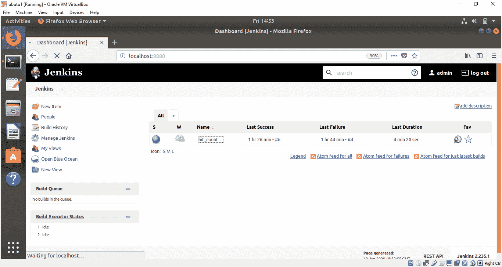

图 8.27：Jenkins 仪表板显示 hit_count 项目

1.  点击左侧菜单中的“配置”以修改项目配置：

图 8.28：左侧菜单中的配置选项

1.  只修改“构建”选项卡中的详细信息。点击它，然后选择“添加构建步骤”。会出现比之前更大的菜单。如果你在菜单中看到“Docker 构建和发布”，那么说明你的插件安装成功了。点击“Docker 构建和发布”：

图 8.29：从菜单中选择 Docker 构建和发布

1.  在“注册表凭据”中，点击“添加”。然后从下拉菜单中选择`Jenkins`。

1.  将出现一个弹出框。输入您的 Docker Hub 用户名和密码。然后，单击“添加”：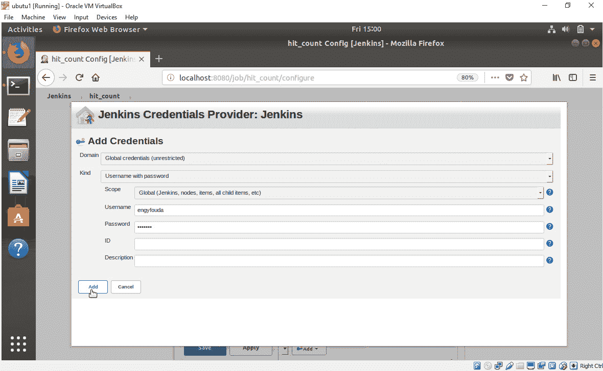

图 8.30：添加 Jenkins 凭据

1.  现在，在“注册表凭据”中，单击第一个下拉菜单，并选择您在上一步中输入的凭据。然后，在“存储库名称”字段中输入“<您的 Docker Hub 用户名>/<图像名称>”。通过单击右上角的红色`X`删除您在*练习 8.02*“将代码上传到 GitHub”中输入的“执行 Shell”选项。现在，您将只有一个构建步骤，即“Docker 构建和发布”步骤。单击“保存”以保存新配置：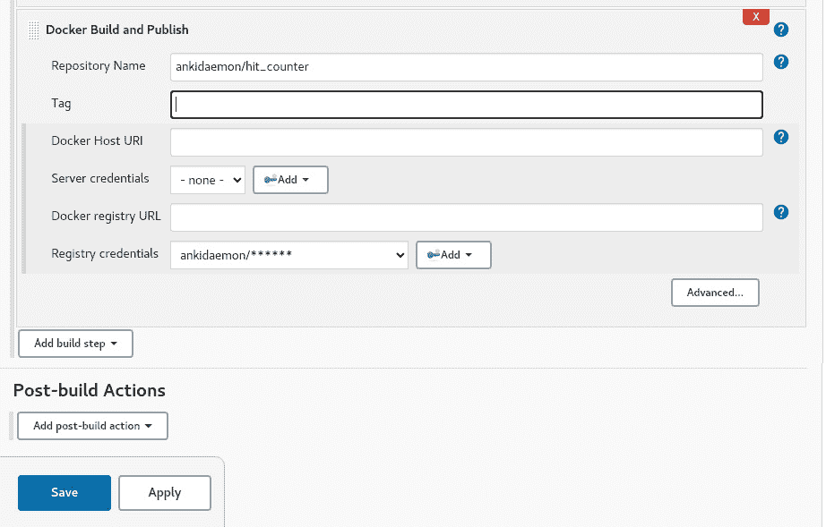

图 8.31：Docker 构建和发布步骤

1.  再次在左侧菜单中单击“立即构建”，并在“构建历史”选项中，跟踪图像构建的进度。它将与您在上一步中指定的“存储库名称”相同。Jenkins 将自动添加`docker build`步骤，因为您从插件中选择了它。如果图像成功通过构建，Jenkins 将使用您的 Docker 凭据并自动连接到 Docker Hub 或您在“存储库名称”中指定的任何注册表。最后，Jenkins 将自动将新图像推送到您的注册表，这在本练习中是您的 Docker Hub 注册表。

1.  作为进一步检查，当图像正在构建并在完成之前，转到终端并使用`docker images`命令列出您拥有的图像：

```
$ docker images
```

因为您在上一练习结束时清理了实验室，所以您应该只会找到`jenkinsci/blueocean`图像：

```
REPOSITORY              TAG        IMAGE ID
  CREATED                       SIZE
jenkinsci/blueocean     latest     e287a467e019
  Less than a second ago        562MB
```

此外，检查您的 Docker Hub 帐户，以验证是否构建了`hit_counter`图像。您将找不到`hit_counter`图像：

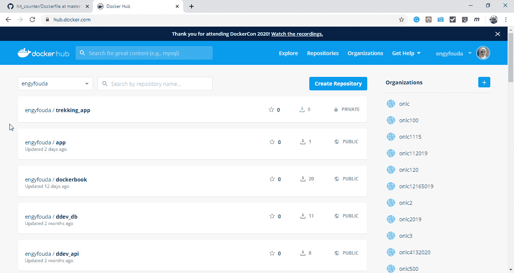

图 8.32：检查您的 Docker Hub

1.  如果作业成功构建，您将在图像名称旁边找到一个蓝色的球。如果是红色的球，这意味着出现了错误。现在，单击图像名称旁边的箭头，并选择“控制台输出”：

图 8.33：选择控制台输出

如下图所示，您将发现 Jenkins 成功构建了图像并将其推送到您的 Docker Hub：

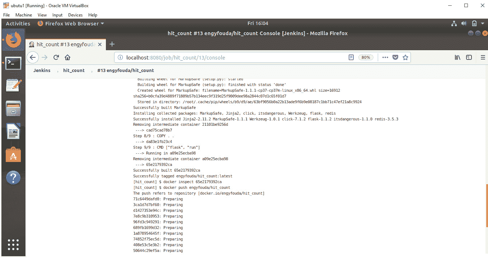

图 8.34：在控制台输出中，验证 Jenkins 是否已构建并推送了镜像

1.  返回终端并重新运行`docker images`命令以列出镜像：

```
$ docker images
```

您将在`<your Docker Hub Username>/hit_count`中找到一张图片：

```
REPOSITORY             TAG             IMAGE ID
  CREATED                      SIZE
jenkinsci/blueocean    latest          e287a467e019
  Less than a second ago       562MB
engyfouda/hit_count    latest          65e2179392ca
  5 minutes ago                227MB
<none>                 <none>          cf4adcf1ac88
  10 minutes ago               1.22MB
python                 3.7alpine       6a5ca85ed89b
  2 weeks ago                  72.5MB
```

1.  在浏览器中刷新 Docker Hub 页面。您会在顶部找到您的镜像；Jenkins 会自动为您推送它：

图 8.35：验证 Jenkins 是否已自动将镜像推送到您的 Docker Hub

在这个练习中，我们完成了 CI/CD 管道的最后阶段，并将 Jenkins 与 Docker Hub 集成。Jenkins 将构建的镜像推送到 Docker Hub。您还通过检查 Docker Hub 账户来验证镜像是否被正确推送。

在下一个活动中，我们将应用相同的方法来安装额外的插件，将 Jenkins 与 SonarQube 集成。SonarQube 是另一个强大的工具，可以分析代码并生成关于其质量的报告，并在大量编程语言中检测错误、代码异味和安全漏洞。

## 活动 8.01：利用 Jenkins 和 SonarQube

通常，在提交代码给测试人员之前，您会被要求评估代码的质量。您可以利用 Jenkins 进一步检查代码，通过添加 SonarQube 插件生成关于调试错误、代码异味和安全漏洞的报告。

在这个活动中，我们将利用 Jenkins 和 SonarQube 插件来进行我们的`hit_count` Python 示例。

**步骤**：

1.  在容器中安装和运行 SonarQube，就像你在*练习 8.01*，*将 Jenkins 安装为容器*中所做的那样。使用默认端口`9000`。

1.  在 Jenkins 中安装 SonarQube 插件。使用`admin/admin`登录 SonarQube 并生成身份验证令牌。不要忘记复制令牌并将其保存在文本文件中。在这一步之后，您将无法检索到令牌。如果您丢失了令牌，请删除 SonarQube 容器，像*步骤 1*中重新构建它，并重新执行这些步骤。

1.  重新启动 Jenkins。

1.  在 Jenkins 中，将 SonarQube 的身份验证令牌添加到`全局凭据`域中作为秘密文本。

1.  通过调整`全局系统配置`和`配置系统`选项来将 Jenkins 与 SonarQube 集成。

1.  通过启用`准备 SonarQube 扫描仪`环境来修改`构建环境`选项卡中的字段。

1.  修改`构建`步骤并添加`分析属性`。

1.  在浏览器中，转到 SonarQube 窗口，并检查其报告。

输出应该如下所示：

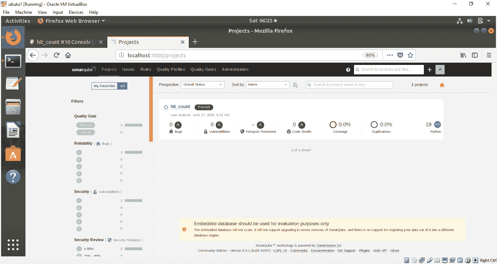

图 8.36：预期的 SonarQube 输出

注意

此活动的解决方案可以通过此链接找到。

在下一个活动中，您将集成 Jenkins 和 SonarQube 与我们的全景徒步应用程序。

## 活动 8.02：在全景徒步应用中利用 Jenkins 和 SonarQube

全景徒步应用程序也有前端和后端，就像`hit_counter`应用程序一样。在这个活动中，您将在 Jenkins 中创建一个新项目，该项目链接到 GitHub 上的全景徒步应用程序。然后，您将运行 SonarQube 以获取关于其错误和安全漏洞的详细报告，如果徒步应用程序有任何问题的话。

按照以下步骤完成活动：

1.  在 Jenkins 中创建一个名为`trekking`的新项目。

1.  将其选择为`FREESTYLE`项目。

1.  在“常规”选项卡中，选择“丢弃旧构建”。

1.  在“源代码管理”中，选择`GIT`。然后输入 URL`http://github.com/efoda/trekking_app`。

1.  在“构建触发器”中，选择“轮询 SCM”，并将其设置为每 15 分钟进行分析和测试。

1.  在“构建”选项卡中，输入“分析属性”代码。

1.  保存并单击“立即构建”。

1.  在浏览器的`SonarQube`选项卡中检查报告。

输出应该如下所示在 SonarQube 中：

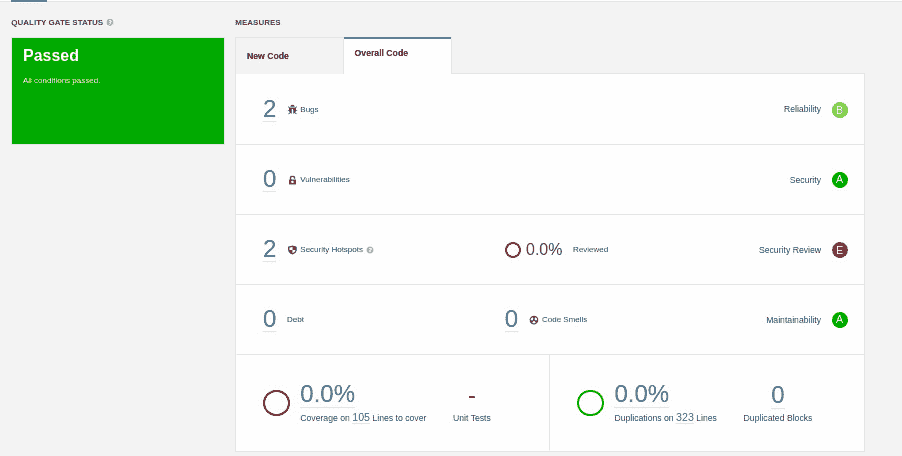

图 8.37：活动 8.02 的预期输出

注意

此活动的解决方案可以通过此链接找到。

# 摘要

本章提供了集成代码使用 CI/CD 流水线的实际经验。CI 帮助开发人员将代码集成到共享和易于访问的存储库中。CD 帮助开发人员将存储在存储库中的代码交付到生产环境。CI/CD 方法还有助于使产品与最新技术保持同步，并为新功能和错误修复提供快速交付的最新版本给客户。

一旦本章定义的 CI/CD 流水线的三个阶段成功完成，您只需要专注于在 GitHub 上编辑您的代码。Jenkins 将成为您的自动助手，并且将自动处理其余的阶段，并使图像可用于生产。

在下一章中，您将学习关于 Docker 集群模式以及如何执行服务发现、集群、扩展和滚动更新。
