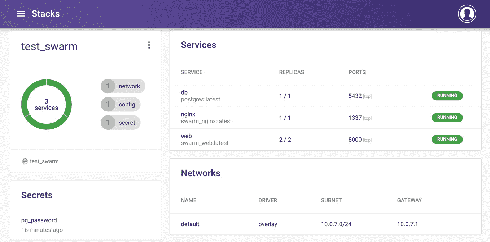
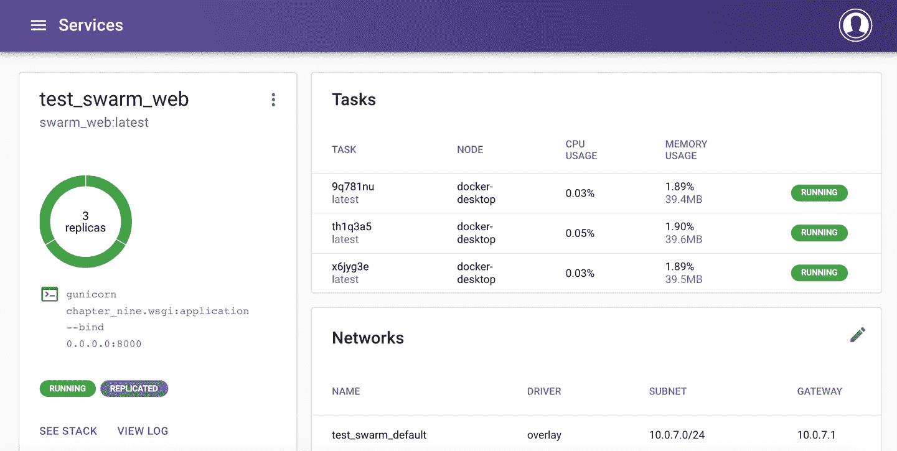
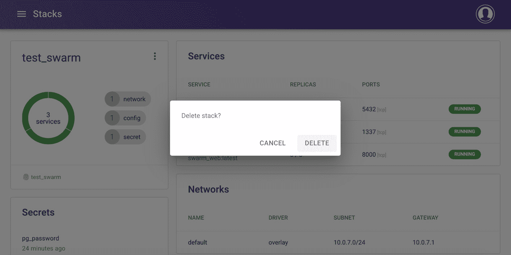

# 第九章：9\. Docker Swarm

概述

在本章中，您将使用命令行与 Docker Swarm 一起工作，管理运行节点，部署服务，并在需要时对服务进行滚动更新。您将学习如何排查 Swarm 节点并使用现有的 Docker Compose 文件部署整个堆栈，以及如何使用 Swarm 来管理服务配置和秘密。本章的最后部分将为您提供使用 Swarmpit 的知识，这是一个用于运行和管理 Docker Swarm 服务和集群的基于 Web 的界面。

# 介绍

到目前为止，在本书中，我们已经通过直接命令（如`docker run`）从命令行运行了我们的 Docker 容器并控制了它们的运行方式。我们的下一步是使用 Docker Compose 自动化事务，它允许整个容器环境一起工作。Docker Swarm 是管理我们的 Docker 环境的下一步。**Docker Swarm**允许您编排容器的扩展和协作，以为最终用户提供更可靠的服务。

Docker Swarm 允许您设置多个运行 Docker Engine 的服务器，并将它们组织为一个集群。然后，Docker Swarm 可以运行命令来协调整个集群中的容器，而不仅仅是一个服务器。Swarm 将配置您的集群，以确保您的服务在整个集群中平衡，确保您的服务更加可靠。它还会根据集群的负载决定将哪个服务分配给哪个服务器。Docker Swarm 在管理容器运行方式方面是一个进步，并且默认情况下由 Docker 提供。

Docker Swarm 允许您为服务配置冗余和故障转移，同时根据负载增加或减少容器的数量。您可以对服务进行滚动更新，以减少停机的可能性，这意味着可以将容器应用的新版本应用到集群中，而这些更改不会导致客户停机。它将允许您通过 Swarm 编排容器工作负载，而不是手动逐个管理容器。

当涉及管理您的环境时，Swarm 还引入了一些新术语和概念，定义如下列表：

+   **Swarm**：多个 Docker 主机以集群模式运行，充当管理者和工作者。拥有多个节点和工作者并非 Docker Swarm 的必要部分。您可以将您的服务作为单节点集群运行，在本章中我们将使用这种方式，即使生产集群可能有多个节点可用，以确保您的服务尽可能具有容错性。

+   **任务**：经理将任务分配给节点内部运行。任务包括一个 Docker 容器和将在容器内运行的命令。

+   **服务**：这定义了要在管理者或工作者上执行的任务。服务和独立容器之间的区别在于，您可以修改服务的配置而无需重新启动服务。

+   **节点**：运行 Docker Engine 并参与集群的个体系统是一个节点。通过虚拟化，一个物理计算机可以同时运行多个节点。

注意

我们将只在我们的系统上使用一个节点。

+   经理：经理将任务分配给工作节点。经理进行编排和集群管理。它还在集群上托管服务。

+   **领导节点**：集群中的管理节点选举一个单一的主领导节点来负责整个集群的编排任务。

+   **工作节点**：工作节点执行经理节点分配的任务。

现在您熟悉了关键术语，让我们在下一节中探讨 Docker Swarm 的工作原理。

# Docker Swarm 的工作原理？

集群管理节点处理集群管理，主要目标是维护集群和运行在其上的服务的一致状态。这包括确保集群始终运行，并在需要时运行和调度服务。

由于同时运行多个管理者，这意味着在生产环境中有容错能力。也就是说，如果一个管理者关闭，集群仍将有另一个管理者来协调集群上的服务。工作节点的唯一目的是运行 Docker 容器。它们需要至少一个管理者才能运行，但如果需要，工作节点可以晋升为管理者。

服务允许您将应用程序镜像部署到 Docker swarm。这些是要运行的容器和在运行容器内执行的命令。在创建服务时提供了服务选项，您可以在其中指定应用程序可以发布的端口、CPU 和内存限制、滚动更新策略以及可以运行的镜像副本数量。

服务的期望状态已经设置，并且管理节点的责任是监视服务。如果服务不处于期望的状态，它将纠正任何问题。如果一个任务失败，编排器会简单地移除与失败任务相关的容器并替换它。

现在您已经了解了 Docker Swarm 的工作原理，接下来的部分将带您开始使用基本命令，并通过一个实际操作来进一步演示其操作。

# 使用 Docker Swarm

本章的前一部分已经向您展示了 Swarm 使用了与您在本书中已经学到的类似概念。您将看到，使用 Swarm 会将您已经非常熟悉的 Docker 命令扩展到允许您创建集群、管理服务和配置节点。Docker Swarm 大大简化了运行服务的工作，因为 Swarm 会确定最佳放置服务的位置，负责安排容器的调度，并决定最适合放置服务的节点。例如，如果一个节点上已经运行了三个服务，而第二个节点上只有一个服务，Swarm 会知道应该均匀地分配服务到您的系统中。

默认情况下，Docker Swarm 是禁用的，因此要在 swarm 模式下运行 Docker，您需要加入现有集群或创建一个新的 swarm。要创建一个新的 swarm 并在系统中激活它，您可以使用此处显示的`swarm init`命令：

```
docker swarm init
```

这将在您当前工作的节点上创建一个新的单节点 swarm 集群。您的系统将成为您刚刚创建的 swarm 的管理节点。当您运行`init`命令时，还将提供有关允许其他节点加入您的 swarm 所需的命令的详细信息。

要加入集群的节点需要一个秘密令牌，工作节点的令牌与管理节点的不同。管理令牌需要得到强有力的保护，以免使您的集群集群变得脆弱。一旦您获得了节点需要加入的集群的令牌、IP 地址和端口，您可以运行类似于下面显示的命令，使用`--token`选项：

```
docker swarm join --token <swarm_token> <ip_address>:<port>
```

如果出于某种原因您需要更改令牌（可能是出于安全原因），您可以运行`join-token --rotate`选项来生成新的令牌，如下所示：

```
docker swarm join-token --rotate
```

从集群管理节点，以下`node ls`命令将允许您查看集群中可用的节点，并提供有关节点状态的详细信息，无论它是管理节点还是工作节点，以及节点是否存在任何问题：

```
docker node ls
```

一旦您的集群可用并准备好开始托管服务，您可以使用`service create`命令创建一个服务，提供服务的名称、容器镜像以及服务正确运行所需的命令，例如，如果您需要暴露端口或挂载卷：

```
docker service create --name <service> <image> <command>
```

然后可以对服务配置进行更改，或者您可以使用`update`命令更改服务的运行方式，如下所示：

```
docker service update <service> <changes>
```

最后，如果您需要删除或停止服务运行，您只需使用`service remove`命令：

```
docker service remove <service>
```

我们在这里提供了关于 Docker Swarm 的许多理论，希望它为您提供了清晰的了解，以及您如何使用 Swarm 来启动您的服务并在需求高时进行扩展以提供稳定的服务。以下练习将会将我们迄今为止学到的知识，并向您展示如何在您的项目中实施它。

注意

请使用`touch`命令创建文件，并使用`vim`命令在文件上使用 vim 编辑器。

## 练习 9.01：使用 Docker Swarm 运行服务

此练习旨在帮助您熟悉使用 Docker Swarm 命令来管理您的服务和容器。在这个练习中，您将激活一个集群，设置一个新的服务，测试扩展服务，然后使用 Docker Swarm 从集群中删除服务：

1.  虽然 Swarm 默认包含在 Docker 安装中，但您仍然需要在系统上激活它。使用`docker swarm init`命令将您的本地系统置于 Docker Swarm 模式：

```
docker swarm init
```

您的输出可能与此处看到的有些不同，但如您所见，一旦创建了 swarm，输出将提供有关如何使用`docker swarm join`命令向集群添加额外节点的详细信息：

```
Swarm initialized: current node (j2qxrpf0a1yhvcax6n2ajux69) is 
now a manager.
To add a worker to this swarm, run the following command:
    docker swarm join --token SWMTKN-1-2w0fk5g2e18118zygvmvdxartd43n0ky6cmywy0ucxj8j7net1-5v1xvrt7
1ag6ss7trl480e1k7 192.168.65.3:2377
To add a manager to this swarm, run 'docker swarm join-token 
manager' and follow the instructions.
```

1.  现在使用`node ls`命令列出您在集群中拥有的节点：

```
docker node ls
```

您应该有一个您当前正在使用的节点，并且其状态应为`Ready`：

```
ID         HOSTNAME          STATUS    AVAILABILITY
  MANAGER STATUS
j2qx.. *   docker-desktop    Ready     Active
  Leader 
```

为了清晰起见，我们已经从输出中删除了`Engine Version`列。

1.  从您的节点上，使用`docker info`命令检查您的 swarm 的状态，提供有关 Swarm 集群以及节点与其交互方式的进一步详细信息。如果您需要以后排除故障，它还会为您提供额外的信息：

```
docker info
```

如您从输出中所见，您将获得有关您的 Docker Swarm 集群的所有具体细节，包括`NodeID`和`ClusterID`。如果您在系统上没有正确设置 Swarm，您将只看到`Swarm: inactive`的输出：

```
…
Swarm: active
  NodeID: j2qxrpf0a1yhvcax6n2ajux69
  Is Manager: true
  ClusterID: pyejfsj9avjn595voauu9pqjv
  Managers: 1
  Nodes: 1
  Default Address Pool: 10.0.0.0/8  
  SubnetSize: 24
  Data Path Port: 4789
  Orchestration:
   Task History Retention Limit: 5
  Raft:
   Snapshot Interval: 10000
   Number of Old Snapshots to Retain: 0
   Heartbeat Tick: 1
   Election Tick: 10
  Dispatcher:
   Heartbeat Period: 5 seconds
  CA Configuration:
   Expiry Duration: 3 months
   Force Rotate: 0
```

1.  在新创建的 swarm 上启动您的第一个服务。使用`docker service create`命令和`--replicas`选项创建一个名为`web`的服务，以设置两个容器实例运行：

```
docker service create --replicas 2 -p 80:80 --name web nginx
```

您将看到成功创建了两个实例：

```
uws28u6yny7ltvutq38166alf
overall progress: 2 out of 2 tasks 
1/2: running   [==========================================>] 
2/2: running   [==========================================>] 
verify: Service converged
```

1.  类似于`docker ps`命令，您可以使用`docker service ls`命令查看集群上正在运行的服务的列表。执行`docker service ls`命令以查看在*步骤 4*中创建的`web`服务的详细信息：

```
docker service ls
```

该命令将返回`web`服务的详细信息：

```
ID              NAME  MODE          REPLICAS   IMAGE
  PORTS
uws28u6yny7l    web   replicated    2/2        nginx:latest
  *:80->80/tcp
```

1.  要查看当前在您的 swarm 上运行的容器，请使用`docker service ps`命令并提供您的服务名称`web`：

```
docker service ps web
```

如您所见，您现在有一个正在运行我们服务的容器列表：

```
ID     NAME    IMAGE    NODE               DESIRED
  CURRENT STATE
viyz   web.1   nginx    docker-desktop     Running
  Running about a minute ago
mr4u   web.2   nginx    docker-desktop     Running
  Running about a minute ago
```

1.  该服务将仅运行默认的`Welcome to nginx!`页面。使用节点 IP 地址查看页面。在这种情况下，它将是您的本地主机 IP，`0.0.0.0`：

图 9.1：来自 Docker Swarm 的 nginx 服务

1.  使用 Docker Swarm 轻松扩展运行服务的容器数量。只需提供`scale`选项和您想要运行的总容器数量，swarm 将为您完成工作。执行此处显示的命令，将您正在运行的 web 容器扩展到`3`：

```
docker service scale web=3
```

以下输出显示`web`服务现在扩展到`3`个容器：

```
web scaled to 3
overall progress: 3 out of 3 tasks 
1/3: running   [==========================================>]
2/3: running   [==========================================>]
3/3: running   [==========================================>]
verify: Service converged
```

1.  如本练习的*步骤 5*中所述，运行`service ls`命令：

```
docker service ls
```

现在你应该看到你的集群上运行了三个`web`服务：

```
ID              NAME    MODE          REPLICAS   IMAGE
    PORTS
uws28u6yny7l    web     replicated    3/3        nginx:latest
    *:80->80/tcp
```

1.  以下更改更适合于具有多个节点的集群，但你可以运行它来看看会发生什么。运行以下`node update`命令将可用性设置为`drain`，并使用你的节点 ID 号或名称。这将删除在该节点上运行的所有容器，因为它在你的集群上不再可用。你将得到节点 ID 作为输出：

```
docker node update --availability drain j2qxrpf0a1yhvcax6n2ajux69
```

1.  如果你运行`docker service ps web`命令，你会看到每个`web`服务在尝试启动新的`web`服务时关闭。由于你只有一个正在运行的节点，服务将处于等待状态，并显示`no suitable node`错误。运行`docker service ps web`命令：

```
docker service ps web
```

输出已经减少，只显示第二、第三、第五和第六列，但你可以看到服务无法启动。`CURRENT STATE`列同时具有`Pending`和`Shutdown`状态：

```
NAME         IMAGE            CURRENT STATE
  ERROR
web.1        nginx:latest     Pending 2 minutes ago
  "no suitable node (1 node…"
\_ web.1     nginx:latest     Shutdown 2 minutes ago
web.2        nginx:latest     Pending 2 minutes ago
  "no suitable node (1 node…"
\_ web.2     nginx:latest     Shutdown 2 minutes ago
web.3        nginx:latest     Pending 2 minutes ago
  "no suitable node (1 node…"
\_ web.3     nginx:latest     Shutdown 2 minutes ago
```

1.  运行`docker node ls`命令：

```
docker node ls
```

这表明你的节点已准备就绪，但处于`AVAILABILITY`状态为`Drain`：

```
ID         HOSTNAME          STATUS    AVAILABILITY
  MANAGER STATUS
j2qx.. *   docker-desktop    Ready     Drain
  Leader 
```

1.  停止服务运行。使用`service rm`命令，后跟服务名称（在本例中为`web`）来停止服务运行：

```
docker service rm web
```

唯一显示的输出将是你要移除的服务的名称：

```
web
```

1.  你不想让你的节点处于`Drain`状态，因为你希望在练习的其余部分继续使用它。要使节点退出`Drain`状态并准备开始管理 Swarm，使用以下命令将可用性设置为`active`，并使用你的节点 ID：

```
docker node update --availability active j2qxrpf0a1yhvcax6n2ajux69
```

该命令将返回节点的哈希值，对于每个用户来说都是不同的。

1.  运行`node ls`命令：

```
docker node ls
```

现在它将显示我们节点的可用性为`Active`，并准备好再次运行你的服务：

```
ID         HOSTNAME          STATUS    AVAILABILITY
  MANAGER STATUS
j2qx.. *   docker-desktop    Ready     Active
  Leader 
```

1.  使用`docker node inspect`命令和`--format`选项，并搜索`ManagerStatus.Reachability`状态，以确保你的节点是可访问的：

```
docker node inspect j2qxrpf0a1yhvcax6n2ajux69 --format "{{ .ManagerStatus.Reachability }}"
```

如果节点可用并且可以联系，你应该看到一个`reachable`的结果：

```
reachable
```

1.  搜索`Status.State`以确保节点已准备就绪：

```
docker node inspect j2qxrpf0a1yhvcax6n2ajux69 --format "{{ .Status.State }}"
```

这应该产生`ready`：

```
ready
```

这个练习应该让你对 Docker Swarm 如何简化你的工作有一个很好的了解，特别是当你开始考虑将你的工作部署到生产环境时。我们使用了 Docker Hub NGINX 镜像，但我们可以轻松地使用我们创建的任何服务作为 Docker 镜像，这些镜像对我们的 Swarm 节点可用。

下一节将快速讨论一些操作，如果您发现自己在 Swarm 节点出现问题时需要采取的措施。

# 排除 Swarm 节点问题

在本章中，我们将只使用单节点 swarm 来托管我们的服务。Docker Swarm 多年来一直提供生产级环境。然而，这并不意味着您的环境永远不会出现问题，特别是当您开始在多节点 swarm 中托管服务时。如果您需要排除集群上运行的任何节点的问题，您可以采取一些步骤来确保您正在纠正它们可能存在的任何问题：

+   重新启动：通常最简单的选择是重新启动节点系统，以查看是否解决了您可能遇到的问题。

+   降级节点：如果节点是您集群中的管理节点，请尝试使用`node demote`命令降级节点：

```
docker node demote <node_id>
```

如果此节点是领导者，它将允许其他管理节点之一成为 swarm 的领导者，并希望解决您可能遇到的任何问题。

+   从集群中删除节点：使用`node rm`命令，您可以从集群中删除节点：

```
docker node rm <node_id>
```

如果节点与 swarm 的其余部分没有正确通信，这也可能是一个问题，您可能需要使用`--force`选项从集群中删除节点：

```
docker node rm --force <node_id>
```

+   重新加入集群：如果前面的操作正确执行，您可以使用`swarm join`命令成功将节点重新加入集群。记得使用加入 swarm 时使用的令牌：

```
docker node swarm join --token <token> <swarm_ip>:<port>
```

注意

如果您的服务在 Docker Swarm 上仍然存在问题，并且您已经纠正了所有与 Swarm 节点相关的问题，Swarm 只是使用 Docker 在您的环境中运行和部署服务。任何问题可能归结为对您尝试在 Swarm 上运行的容器映像的基本故障排除，而不是 Swarm 环境本身。

一组管理节点被称为**仲裁**，大多数管理节点需要就提议更新 swarm 达成一致意见，例如添加新节点或缩减容器数量。正如我们在前一节中看到的，您可以通过运行`docker node ls`命令来监视 swarm 管理节点或节点的健康状况，然后使用管理节点的 ID 来使用`docker node inspect`命令，如下所示：

```
docker node inspect <node_id>
```

注意

关于您的 Swarm 节点的最后一点是要记住将服务部署到已创建为 Docker 镜像的节点上。容器镜像本身需要从中央 Docker 注册表下载，该注册表可供所有节点从中下载，而不仅仅是在 Swarm 节点上构建。

虽然我们已经快速讨论了解决 Swarm 节点故障的方法，但这不应该是在 Swarm 上运行服务的主要方面。本章的下一部分将进一步向前迈进，向您展示如何使用新的或现有的`docker-compose.yml`文件来自动部署您的服务到 Docker Swarm 中。

# 使用 Docker Compose 部署 Swarm 部署

使用 Docker Swarm 部署完整环境很容易；如果您一直在使用 Docker Compose 运行容器，您会发现大部分工作已经完成。这意味着您不需要像我们在本章的前一部分中那样手动逐个启动 Swarm 中的服务。

如果您已经有一个可用的`docker-compose.yml`文件来启动您的服务和应用程序，那么它很可能会在没有问题的情况下简单地工作。Swarm 将使用`stack deploy`命令在 Swarm 节点上部署所有您的服务。您只需要提供`compose`文件并为堆栈分配一个名称：

```
docker stack deploy --compose-file <compose_file> <swarm_name>
```

堆栈创建快速而无缝，但在后台会发生很多事情，以确保所有服务都正常运行，包括在所有服务之间设置网络，并按需要的顺序启动每个服务。使用在创建时提供的`swarm_name`运行`stack ps`命令将向您显示部署中所有服务是否正在运行：

```
docker stack ps <swarm_name>
```

一旦您完成了在您的 swarm 上使用服务，或者您需要清理部署的所有内容，您只需使用`stack rm`命令，提供您在创建堆栈部署时提供的`swarm_name`。这将自动停止和清理在您的 swarm 中运行的所有服务，并准备好让您重新分配给其他服务：

```
docker stack rm <swarm_name>
```

现在，既然我们知道了用于部署、运行和管理我们的 Swarm 堆栈的命令，我们可以看看如何为我们的服务执行滚动更新。

# Swarm 服务滚动更新

Swarm 还具有对正在运行的服务执行滚动更新的能力。这意味着如果您对 Swarm 上运行的应用程序有新的更新，您可以创建一个新的 Docker 镜像并更新您的服务，Swarm 将确保新镜像在成功运行之前将旧版本的容器镜像关闭。

在 Swarm 中对正在运行的服务执行滚动更新只是运行`service update`命令的简单问题。在以下命令中，您可以看到新的容器镜像名称和要更新的服务。Swarm 将处理其余部分。

```
docker service update --image <image_name:tag> <service_name>
```

您很快就有机会使用我们在这里解释过的所有命令。在以下示例中，您将使用 Django 和 PostgreSQL 创建一个小型测试应用程序。您将要设置的 Web 应用程序非常基本，因此没有必要事先了解 Django Web 框架。只需跟着做，我们将在练习中逐步解释发生的事情。

## 练习 9.02：从 Docker Compose 部署您的 Swarm

在以下练习中，您将使用`docker-compose.yml`创建一个使用 PostgreSQL 数据库和 Django Web 框架的基本 Web 应用程序。然后，您将使用此`compose`文件将服务部署到 Swarm 中，而无需手动运行服务。

1.  首先，创建一个目录来运行您的应用程序。将目录命名为`swarm`，并使用`cd`命令进入该目录。

```
mkdir swarm; cd swarm
```

1.  在新目录中为您的 Django 应用程序创建一个`Dockerfile`，并使用文本编辑器输入以下代码块中的详细信息。`Dockerfile`将使用默认的`Python3`镜像，设置与 Django 相关的环境变量，安装相关应用程序，并将代码复制到容器镜像的当前目录中。

```
FROM python:3
ENV PYTHONUNBUFFERED 1
RUN mkdir /application
WORKDIR /application
COPY requirements.txt /application/
RUN pip install -r requirements.txt
COPY . /application/
```

1.  创建`requirements.txt`文件，您的`Dockerfile`在上一步中使用它来安装运行所需的所有相关应用程序。使用文本编辑器添加以下两行以安装 Django 应用程序与 PostgreSQL 数据库通信所需的`Django`和`Psycopg2`版本。

```
1 Django>=2.0,<3.0
2 psycopg2>=2.7,<3.0
```

1.  使用文本编辑器创建一个`docker-compose.yml`文件。根据以下代码添加第一个数据库服务。`db`服务将使用 Docker Hub 上的最新`postgres`镜像，公开端口`5432`，并设置`POSTGRES_PASSWORD`环境变量。

```
1 version: '3.3'
2
3 services:
4   db:
5     image: postgres
6     ports:
7       - 5432:5432
8     environment:
9       - POSTGRES_PASSWORD=docker
```

1.  `docker-compose.yml`文件的后半部分构建和部署您的 web 应用程序。在*第 10 行*中构建您的`Dockerfile`，将端口`8000`暴露出来，以便从 Web 浏览器访问，并将数据库密码设置为与您的`db`服务匹配。您还会注意到*第 13 行*中的 Python 命令，它将启动 Django 应用程序的开发 Web 服务器：

```
10   web:
11     build: .
12     image: swarm_web:latest
13     command: python manage.py runserver 0.0.0.0:8000
14     volumes:
15       - .:/application
16     ports:
17       - 8000:8000
18     environment:
19       - PGPASSWORD=docker
20     depends_on:
21       - db
```

1.  运行以下命令来拉取和构建`docker-compose.yml`中的`db`和`web`服务。然后该命令将运行`django-admin startproject`，这将创建您的基本 Django 项目，名为`chapter_nine`：

```
docker-compose run web django-admin startproject chapter_nine .
```

该命令应返回以下输出，其中您可以看到正在拉取和构建的容器：

```
…
Status: Downloaded newer image for postgres:latest
Creating swarm_db_1 ... done
Building web
…
Successfully built 41ff06e17fe2
Successfully tagged swarm_web:latest
```

1.  在上一步中运行的`startproject`命令应该在您的 swarm 目录中创建了一些额外的文件和目录。运行`ls`命令列出 swarm 目录中的所有文件和目录：

```
ls -l
```

您之前创建了`Dockerfile`、`docker-compose.yml`文件和`requirements.txt`文件，但现在容器的构建已经添加了`chapter_nine` Django 目录和`manage.py`文件：

```
-rw-r--r--  1 user  staff  175  3 Mar 13:45 Dockerfile
drwxr-xr-x  6 user  staff  192  3 Mar 13:48 chapter_nine
-rw-r--r--  1 user  staff  304  3 Mar 13:46 docker-compose.yml
-rwxr-xr-x  1 user  staff  634  3 Mar 13:48 manage.py
-rw-r--r--  1 user  staff   36  3 Mar 13:46 requirements.txt
```

1.  要使您的基本应用程序运行，您需要对 Django 项目设置进行一些微小的更改。用文本编辑器打开`chapter_nine/settings.py`文件，并找到以`DATABASES`开头的条目。这控制 Django 如何连接到您的数据库，默认情况下，Django 设置为使用 SQLite 数据库。`DATABASES`条目应如下所示：

```
76 DATABASES = {
77     'default': {
78         'ENGINE': 'django.db.backends.sqlite3',
79         'NAME': os.path.join(BASE_DIR, 'db.sqlite3'),
80     }
81 }
```

您有一个要部署到 Swarm 的 PostgreSQL 数据库作为我们安装的一部分，因此使用以下八行编辑`DATABASES`设置，以便 Django 将访问此 PostgreSQL 数据库：

settings.py

```
76 DATABASES = {
77     'default': {
78         'ENGINE': 'django.db.backends.postgresql',
79         'NAME': 'postgres',
80         'USER': 'postgres',
81         'PASSWORD': 'docker',
82         'HOST': 'db',
83         'PORT': 5432,
84     }
85 }
```

此步骤的完整代码可在[`packt.live/2DWP9ov`](https://packt.live/2DWP9ov)找到。

1.  在我们的`settings.py`文件的*第 28 行*，我们还需要添加我们将用作`ALLOWED_HOSTS`配置的 IP 地址。我们将配置我们的应用程序可以从 IP 地址`0.0.0.0`访问。对设置文件进行相关更改，使其在*第 28 行*看起来像下面的代码：

```
 27 
 28 ALLOWED_HOSTS = ["0.0.0.0"]
```

1.  现在测试一下，看看您的基本项目是否按预期工作。从命令行，使用`stack deploy`命令将您的服务部署到 Swarm。在以下命令中，使用`--compose-file`选项指定要使用的`docker-compose.yml`文件，并命名堆栈为`test_swarm`：

```
docker stack deploy --compose-file docker-compose.yml test_swarm
```

该命令应该设置 swarm 网络、数据库和 web 服务：

```
Creating network test_swarm_default
Creating service test_swarm_db
Creating service test_swarm_web
```

1.  运行`docker service ls`命令，您应该能够看到`test_swarm_db`和`test_swarm_web`服务的状态：

```
docker service ls
```

如下输出所示，它们都显示了`REPLICAS`值为`1/1`：

```
ID     NAME            MODE        REPLICAS  IMAGE
  PORTS
dsr.   test_swarm_db   replicated  1/1       postgres
kq3\.   test_swarm_web  replicated  1/1       swarm_web:latest
  *:8000.
```

1.  如果您的工作成功，可以通过打开 Web 浏览器并转到`http://0.0.0.0:8000`来进行测试。如果一切正常，您应该在 Web 浏览器上看到以下 Django 测试页面显示：

图 9.2：使用 Docker Compose 文件将服务部署到 Swarm

1.  要查看当前在您的系统上运行的堆栈，请使用`stack ls`命令：

```
docker stack ls
```

您应该看到以下输出，显示了两个以`test_swarm`名称运行的服务：

```
NAME                SERVICES            ORCHESTRATOR
test_swarm          2                   Swarm
```

1.  使用您的 swarm 名称运行`stack ps`命令，查看正在运行的服务并检查是否存在任何问题：

```
docker stack ps test_swarm
```

`ID`、`DESIRED STATE`和`ERROR`列未包含在以下精简输出中。还可以看到`test_swarm_web.1`和`test_swarm_db.1`服务正在运行：

```
NAME                IMAGE               NODE
  CURRENT STATE
test_swarm_web.1    swarm_web:latest    docker-desktop
  Running
test_swarm_db.1     postgres:latest     docker-desktop
  Running
```

1.  就像您可以使用`deploy`命令一次启动所有服务一样，您也可以一次停止所有服务。使用`stack rm`命令加上您的 swarm 名称来停止所有正在运行的服务并移除堆栈：

```
docker stack rm test_swarm
```

请注意，以下输出中所有服务都已停止：

```
Removing service test_swarm_db
Removing service test_swarm_web
Removing network test_swarm_default
```

1.  作为本练习的一部分，您仍然希望在 swarm 上执行一些额外的工作，但首先对`compose`文件进行一些微小的更改。使用文本编辑器打开`docker-compose.yml`文件，并向您的 web 服务添加以下行，以便在部署到 swarm 时创建两个副本 web 服务：

```
22     deploy:
23       replicas: 2
```

完整的`docker-compose.yml`文件应该如下所示：

```
version: '3.3'
services:
  db:
    image: postgres
    ports:
      - 5432:5432
    environment:
      - POSTGRES_PASSWORD=docker
  web:
    build: .
    image: swarm_web:latest
    command: python manage.py runserver 0.0.0.0:8000
    volumes:
      - .:/application
    ports:
      - 8000:8000
    environment:
      - PGPASSWORD=docker
    deploy:
      replicas: 2
    depends_on:
      - db
```

1.  使用相同的命令再次部署 swarm，就像在*步骤 8*中所做的那样。即使`test_swarm`堆栈仍在运行，它也会注意并对服务进行相关更改：

```
docker stack deploy --compose-file docker-compose.yml test_swarm
```

1.  运行以下`docker ps`命令：

```
docker ps | awk '{print $1 "\t" $2 }'
```

这里显示的输出中只打印了前两列。现在您可以看到有两个`swarm_web`服务正在运行：

```
CONTAINER         ID
2f6eb92414e6      swarm_web:latest
e9241c352e12      swarm_web:latest
d5e6ece8a9bf      postgres:latest
```

1.  要在不停止服务的情况下将`swarm_web`服务的新版本部署到您的 swarm 中，首先构建我们 Web 服务的新 Docker 镜像。不要对图像进行任何更改，但是这次使用`patch1`标签标记图像以演示在服务运行时的更改：

```
docker build . -t swarm_web:patch1
```

1.  要执行滚动更新，请使用`service update`命令，提供要更新到的图像的详细信息和服务名称。运行以下命令，该命令使用您刚刚创建的带有`patch1`标签的图像，在`test_swarm_web`服务上：

```
docker service update --image swarm_web:patch1 test_swarm_web
```

Swarm 将管理更新，以确保在将更新应用于其余图像之前，其中一个服务始终在运行：

```
image swarm_web:patch1 could not be accessed on a registry 
to record its digest. Each node will access 
swarm_web:patch1 independently, possibly leading to different 
nodes running different versions of the image.
test_swarm_web
overall progress: 2 out of 2 tasks 
1/2: running   [=========================================>]
2/2: running   [=========================================>]
verify: Service converged
```

注意

您会注意到输出显示图像在存储库中不可用。由于我们只有一个运行我们的 swarm 的节点，因此更新将使用在节点上构建的图像。在现实世界的情况下，我们需要将此图像推送到所有我们的节点都可以访问的中央存储库，以便它们可以拉取它。

1.  运行此处给出的`docker ps`命令，将其输出传输到`awk`命令，以仅打印`CONTAINER`和`ID`的前两列：

```
docker ps | awk '{print $1 "\t" $2 }'
```

该命令将返回以下输出：

```
CONTAINER         ID
ef4107b35e09      swarm_web:patch1
d3b03d8219dd      swarm_web:patch1
d5e6ece8a9bf      postgres:latest
```

1.  如果您想要控制滚动更新的方式怎么办？运行以下命令对`test_swarm_web`服务执行新的滚动更新。撤消对使用`latest`标签部署图像所做的更改，但是这次确保在执行更新时有`30`秒的延迟，这将给您的 Web 服务额外的时间在第二次更新运行之前启动：

```
docker service update --update-delay 30s --image swarm_web:latest test_swarm_web
```

1.  再次运行`docker ps`命令：

```
docker ps | awk '{print $1 "\t" $2 }'
```

请注意，在执行滚动更新后，容器现在再次运行`swarm_web:latest`图像：

```
CONTAINER         ID
414e62f6eb92      swarm_web:latest
352e12e9241c      swarm_web:latest
d5e6ece8a9bf      postgres:latest
```

到目前为止，您应该看到使用 swarm 的好处，特别是当我们开始使用 Docker Compose 扩展我们的应用程序时。在这个练习中，我们演示了如何使用 Docker Compose 轻松部署和管理一组服务到您的 swarm，并使用滚动更新升级服务。

本章的下一部分将进一步扩展您的知识，以展示您如何使用 Swarm 来管理您环境中使用的配置和秘密值。

# 使用 Docker Swarm 管理秘密和配置

到目前为止，在本章中，我们已经观察到 Docker Swarm 在编排我们的服务和应用方面的熟练程度。它还提供了功能，允许我们在环境中定义配置，然后使用这些值。但是，我们为什么需要这个功能呢？

首先，我们一直以来存储诸如 secrets 之类的细节并不是非常安全，特别是当我们在`docker-compose.yml`文件中以明文输入它们，或者将它们作为构建的 Docker 镜像的一部分包含在其中。对于我们的 secrets，Swarm 允许我们存储加密值，然后由我们的服务使用。

其次，通过使用这些功能，我们可以开始摆脱在`Dockerfile`中设置配置的方式。这意味着我们可以创建和构建我们的应用作为一个容器镜像。然后，我们可以在任何环境中运行我们的应用，无论是笔记本上的开发系统还是测试环境。我们还可以在生产环境中运行应用，为其分配一个单独的配置或 secrets 值在该环境中使用。

创建一个 Swarm `config`很简单，特别是如果你已经有一个现有的文件可以使用。以下代码展示了我们如何使用`config create`命令创建一个新的`config`，并提供我们的`config_name`和`configuration_file`的名称：

```
docker config create <config_name> <configuration_file> 
```

这个命令创建了一个作为 Swarm 一部分存储的`config`，并且可以在集群中的所有节点上使用。要查看系统和 Swarm 上可用的配置，可以使用`config`命令的`ls`选项运行：

```
docker config ls
```

您还可以使用`config inspect`命令查看配置的详细信息。确保使用`--pretty`选项，因为输出以长 JSON 格式呈现，如果没有该选项，几乎无法阅读：

```
docker config inspect --pretty <config_name>
```

在 Swarm 中使用 secrets 提供了一种安全的方式来创建和存储环境中的敏感信息，比如用户名和密码，以加密的方式存储，然后可以被我们的服务使用。

要创建一个只包含单个值的 secret，比如用户名或密码，我们可以简单地从命令行创建 secret，将 secret 值传递到`secret create`命令中。以下示例命令提供了如何做到这一点的示例。记得在创建时给 secret 命名：

```
echo "<secret_password>" | docker secret create <secret_name> –
```

您可以从文件中创建一个秘密。例如，假设您想将证书文件设置为一个秘密。以下命令显示如何使用`secret create`命令来创建秘密，提供秘密的名称和您需要从中创建秘密的文件的名称：

```
docker secret create <secret_name> <secret_file> 
```

创建后，您的秘密将在您的集群上运行的所有节点上都可用。就像您能够查看您的`config`一样，您可以使用`secret ls`命令来查看集群中所有可用秘密的列表：

```
docker secret ls
```

我们可以看到，Swarm 为我们提供了灵活的选项，在我们的编排中实现配置和秘密，而不需要将其设置为我们的 Docker 镜像的一部分。

以下练习将演示如何在当前的 Docker Swarm 环境中同时使用配置和秘密。

## 练习 9.03：在您的集群中实现配置和秘密

在这个练习中，您将进一步扩展您的 Docker Swarm 环境。您将向您的环境添加一个服务，该服务将帮助 NGINX 通过代理路由请求，然后进入您的 Web 服务。您将使用传统方法设置这一点，然后使用`config`和`secret`函数作为您的环境的一部分来观察它们在 Swarm 中的操作，并帮助用户更有效地部署和配置服务：

1.  目前，Web 服务正在使用 Django 开发 Web 服务器通过`runserver`命令来处理 Web 请求。NGINX 将无法将流量请求路由到这个开发服务器，而是需要将`gunicorn`应用程序安装到我们的 Django Web 服务上，以便通过 NGINX 路由流量。首先打开您的`requirements.txt`文件，使用文本编辑器添加应用程序，如下所示的第三行：

```
Django>=2.0,<3.0
psycopg2>=2.7,<3.0
gunicorn==19.9.0
```

注意

Gunicorn 是**Green Unicorn**的缩写，用作 Python 应用程序的**Web 服务网关接口**（**WSGI**）。Gunicorn 被广泛用于生产环境，因为它被认为是最稳定的 WSGI 应用程序之一。

1.  要将 Gunicorn 作为您的 Web 应用程序的一部分运行，请调整您的`docker-compose.yml`文件。使用文本编辑器打开`docker-compose.yml`文件，并将*第 13 行*更改为运行`gunicorn`应用程序，而不是 Django 的`manage.py runserver`命令。以下`gunicorn`命令通过其 WSGI 服务运行`chapter_nine` Django 项目，并绑定到 IP 地址和端口`0.0.0.0:8000`：

```
12     image: swarm_web:latest
13     command: gunicorn chapter_nine.wsgi:application          --bind 0.0.0.0:8000
14     volumes:
```

1.  重新构建您的 web 服务，以确保 Gunicorn 应用程序已安装在容器上并可运行。运行`docker-compose build`命令：

```
docker-compose build
```

1.  Gunicorn 也可以在没有 NGINX 代理的情况下运行，因此通过再次运行`stack deploy`命令来测试您所做的更改。如果您已经部署了服务，不用担心，您仍然可以再次运行此命令。它将简单地对您的 swarm 进行相关更改，并匹配您的`docker-compose.yml`中的更改：

```
docker stack deploy --compose-file docker-compose.yml test_swarm
```

该命令将返回以下输出：

```
Ignoring unsupported options: build
Creating network test_swarm_default
Creating service test_swarm_web
Creating service test_swarm_db
```

1.  为确保更改已生效，请确保打开您的 web 浏览器，并验证 Django 测试页面仍然由您的 web 服务提供，然后再进行下一步。根据您的更改，页面应该仍然显示在`http://0.0.0.0:8000`。

1.  要启动 NGINX 的实现，请再次打开`docker-compose.yml`文件，并将*第 16 行和第 17 行*更改为从原始`ports`命令中暴露端口`8000`：

```
10   web:
11     build: .
12     image: swarm_web:latest
13     command: gunicorn chapter_nine.wsgi:application          --bind 0.0.0.0:8000
14     volumes:
15       - .:/application
16     ports:
17       - 8000:8000
18     environment:
19       - PGPASSWORD=docker
20     deploy:
21       replicas: 2
22     depends_on:
23       - db
```

1.  保持`docker-compose.yml`文件打开，将您的`nginx`服务添加到`compose`文件的末尾。现在，这里的所有信息对您来说应该都很熟悉。*第 25 行*提供了一个新的 NGINX 目录的位置，您将很快创建的`Dockerfile`，以及服务部署时要使用的镜像的名称。*第 27 行*和*第 28 行*将端口`1337`映射到端口`80`，*第 29 行*和*第 30 行*显示 NGINX 需要依赖`web`服务才能运行：

```
24   nginx:
25     build: ./nginx
26     image: swarm_nginx:latest
27     ports:
28       - 1337:80
29     depends_on:
30       - web
```

1.  现在，为服务设置 NGINX `Dockerfile`和配置。首先创建一个名为`nginx`的目录，如下命令所示：

```
mkdir nginx
```

1.  在`nginx`目录中创建一个新的`Dockerfile`，用文本编辑器打开文件，并添加这里显示的细节。`Dockerfile`是从 Docker Hub 上可用的最新`nginx`镜像创建的。它删除了*第 3 行*中的默认配置`nginx`文件，然后添加了一个您需要很快设置的新配置：

```
FROM nginx
RUN rm /etc/nginx/conf.d/default.conf
COPY nginx.conf /etc/nginx/conf.d
```

1.  创建`nginx.conf`文件，`Dockerfile`将使用它来创建您的新镜像。在`nginx`目录中创建一个名为`nginx.conf`的新文件，并使用文本编辑器添加以下配置细节：

```
upstream chapter_nine {
    server web:8000;
}
server {
    listen 80;
    location / {
        proxy_pass http://chapter_nine;
        proxy_set_header X-Forwarded-For             $proxy_add_x_forwarded_for;
        proxy_set_header Host $host;
        proxy_redirect off;
    }
}
```

如果您对 NGINX 配置不熟悉，上述细节只是在寻找对 web 服务的请求，并将请求路由到`chapter_nine` Django 应用程序。

1.  现在所有细节都已就绪，请为在您的`docker-compose.yml`文件中设置的 NGINX 服务构建新的映像。运行以下命令构建映像：

```
docker-compose build
```

1.  再次运行`stack deploy`命令：

```
docker stack deploy --compose-file docker-compose.yml test_swarm
```

这次，您会注意到您的输出显示`test_swarm_nginx`服务已被创建并应该正在运行：

```
Creating network test_swarm_default
Creating service test_swarm_db
Creating service test_swarm_web
Creating service test_swarm_nginx
```

1.  使用`stack ps`命令验证所有服务是否作为 swarm 的一部分运行：

```
docker stack ps test_swarm
```

结果输出已减少，仅显示了八列中的四列。您可以看到`test_swarm_nginx`服务现在正在运行：

```
NAME                  IMAGE                 NODE
  DESIRED STATE
test_swarm_nginx.1    swarm_nginx:latest    docker-desktop
  Running
test_swarm_web.1      swarm_web:latest      docker-desktop
  Running
test_swarm_db.1       postgres:latest       docker-desktop
  Running
test_swarm_web.2      swarm_web:latest      docker-desktop
  Running
```

1.  为了证明请求正在通过 NGINX 代理路由，请使用端口`1337`而不是端口`8000`。确保仍然可以从您的 Web 浏览器中使用新的 URL `http://0.0.0.0:1337`提供网页。

1.  这是对在 Swarm 上运行的服务的一个很好的补充，但它没有使用正确的配置管理功能。您之前在此练习中已经创建了一个 NGINX 配置。使用`config create`命令和新配置的名称以及要创建配置的文件来创建一个 Swarm 配置。运行以下命令从您的`nginx/nginx.conf`文件创建新配置：

```
docker config create nginx_config nginx/nginx.conf 
```

该命令的输出将为您提供创建的配置 ID：

```
u125x6f6lhv1x6u0aemlt5w2i
```

1.  Swarm 还提供了一种列出作为 Swarm 一部分创建的所有配置的方法，使用`config ls`命令。确保在上一步中已创建新的`nginx_config`文件，并运行以下命令：

```
docker config ls
```

`nginx_config`已在以下输出中创建：

```
ID           NAME           CREATED           UPDATED
u125x6f6…    nginx_config   19 seconds ago    19 seconds ago
```

1.  使用`docker config inspect`命令查看您创建的配置的完整细节。运行以下命令并使用`--pretty`选项，以确保配置输出以可读形式显示：

```
docker config inspect --pretty nginx_config
```

输出应该看起来类似于您在这里看到的内容，显示了您刚刚创建的 NGINX 配置的细节：

```
ID:             u125x6f6lhv1x6u0aemlt5w2i
Name:           nginx_config
Created at:          2020-03-04 19:55:52.168746807 +0000 utc
Updated at:          2020-03-04 19:55:52.168746807 +0000 utc
Data:
upstream chapter_nine {
    server web:8000;
}
server {
    listen 80;
    location / {
        proxy_pass http://chapter_nine;
        proxy_set_header X-Forwarded-For             $proxy_add_x_forwarded_for;
        proxy_set_header Host $host;
        proxy_redirect off;
    }
}
```

1.  由于您现在已经在 Swarm 中设置了配置，请确保配置不再内置到容器映像中。相反，它将在部署 Swarm 时提供。打开`nginx`目录中的`Dockerfile`并删除`Dockerfile`的第四行。现在它应该看起来类似于这里给出的细节：

```
FROM nginx:1.17.4-alpine
RUN rm /etc/nginx/conf.d/default.conf
```

注意

请记住，我们在这里所做的更改将确保我们不需要在配置更改时每次构建新的 NGINX 镜像。这意味着我们可以使用相同的镜像并将其部署到开发 Swarm 或生产 Swarm。我们所要做的就是更改配置以适应环境。但是，我们确实需要创建可以使用我们在 Swarm 中创建和存储的配置的镜像。

1.  在这个练习的上一步中，对`nginx`的`Dockerfile`进行了更改，现在重新构建镜像以确保其是最新的：

```
docker-compose build
```

1.  用文本编辑器打开`docker-compose.yml`文件，更新`compose`文件，以便我们的`nginx`服务现在将使用新创建的 Swarm`config`。在`nginx`服务的底部，添加配置细节，使用你之前创建的`nginx_cof`配置的源名称。确保将其添加到运行的`nginx`服务中，以便容器可以使用它。然后，为文件设置一个单独的配置。即使你在之前的步骤中手动创建了它，当部署时你的 Swarm 也需要知道它。将以下内容添加到你的`docker-compose.yml`中：

```
25   nginx:
26     build: ./nginx
27     image: swarm_nginx:latest
28     ports:
29       - 1337:80
30     depends_on:
31       - web
32     configs:
33       - source: nginx_conf
34         target: /etc/nginx/conf.d/nginx.conf
35 
36 configs:
37   nginx_conf:
38     file: nginx/nginx.conf
```

1.  再次部署你的 Swarm：

```
docker stack deploy --compose-file docker-compose.yml test_swarm
```

在下面的输出中，你现在应该看到一个额外的行，显示`Creating config test_swarm_nginx_conf`：

```
Creating network test_swarm_default
Creating config test_swarm_nginx_conf
Creating service test_swarm_db
Creating service test_swarm_web
Creating service test_swarm_nginx
```

1.  还有更多你可以做来利用 Swarm，一个尚未使用的额外功能是秘密功能。就像你在这个练习中之前创建配置一样，你可以使用类似的命令创建一个`secret`。这里显示的命令首先使用`echo`来输出你想要作为秘密值的密码，然后使用`secret create`命令，它使用这个输出来创建名为`pg_password`的秘密。运行以下命令来命名你的新秘密`pg_password`：

```
echo "docker" | docker secret create pg_password –
```

该命令将输出创建的秘密的 ID：

```
4i1cwxst1j9qoh2e6uq5fjb8c
```

1.  使用`secret ls`命令查看你的 Swarm 中的秘密。现在运行这个命令：

```
docker secret ls
```

你可以看到你的秘密已成功创建，名称为`pg_password`：

```
ID                          NAME           CREATED
  UPDATED
4i1cwxst1j9qoh2e6uq5fjb8c   pg_password    51 seconds ago
  51 seconds ago
```

1.  现在，对您的`docker-compose.yml`文件进行相关更改。以前，您只需输入您想要为您的`postgres`用户设置的密码。如下面的代码所示，在这里，您将把环境变量指向您之前创建的秘密，作为`/run/secrets/pg_password`。这意味着它将搜索您的 Swarm 中可用的秘密，并分配存储在`pg_password`中的秘密。您还需要在`db`服务中引用秘密以允许其访问。使用文本编辑器打开文件，并对文件进行以下更改：

```
4   db:
5     image: postgres
6     ports:
7       - 5432:5432
8     environment:
9       - POSTGRES_PASSWORD=/run/secrets/pg_password
10    secrets:
11      - pg_password
```

1.  `web`服务使用相同的秘密来访问 PostgreSQL 数据库。进入`docker-compose.yml`的`web`服务部分，并将*第 21 行*更改为以下内容，因为它现在将使用您创建的秘密：

```
20    environment:
21       - PGPASSWORD=/run/secrets/pg_password
22    deploy:
```

1.  最后，就像您对配置所做的那样，在`docker-compose.yml`的末尾定义秘密。在您的`compose`文件的末尾添加以下行：

```
41 secrets:
42  pg_password:
43    external: true
```

1.  在部署更改之前，您已经对`compose`文件进行了许多更改，因此您的`docker-compose.yml`文件应该与下面的代码块中显示的内容类似。您有三个服务正在运行，使用`db`、`web`和`nginx`服务设置，现在我们有一个`config`实例和一个`secret`实例：

docker-compose.yml

```
version: '3.3'
services:
  db:
    image: postgres
    ports:
      - 5432:5432
    environment:
      - POSTGRES_PASSWORD=/run/secrets/pg_password
    secrets:
      - pg_password
  web:
    build: .
    image: swarm_web:latest
```

命令：gunicorn chapter_nine.wsgi:application --bind 0.0.0.0:8000

```
    volumes:
      - .:/application
    ports:
      - 8000:8000
```

此步骤的完整代码可以在[`packt.live/3miUJD8`](https://packt.live/3miUJD8)找到。

注意

我们的服务有一些更改，如果在将更改部署到 Swarm 时出现任何问题，删除服务然后重新部署以确保所有更改正确生效可能是值得的。

这是本练习中 Swarm 部署的最终运行：

```
docker stack deploy --compose-file docker-compose.yml test_swarm
```

1.  运行部署，并确保服务成功运行和部署：

```
Creating network test_swarm_default
Creating config test_swarm_nginx_conf
Creating service test_swarm_db
Creating service test_swarm_web
Creating service test_swarm_nginx
```

在这个练习中，您已经练习使用 Swarm 来部署一整套服务，使用您的`docker-compose.yml`文件，并让它们在几分钟内运行。本章的这一部分还演示了 Swarm 的一些额外功能，使用`config`和`secret`实例来帮助我们减少将服务移动到不同环境所需的工作量。现在您知道如何从命令行管理 Swarm，您可以在下一节中进一步探索 Swarm 集群管理，使用 Swarmpit 的 Web 界面。

# 使用 Swarmpit 管理 Swarm

命令行为用户提供了一种高效和有用的方式来控制他们的 Swarm。如果您的服务和节点随着需求增加而增加，这可能会让一些用户感到困惑。帮助管理和监控您的 Swarm 的一种方法是使用诸如 Swarmpit 提供的 Web 界面，以帮助您管理不同的环境。

正如您很快将看到的，Swarmpit 提供了一个易于使用的 Web 界面，允许您管理 Docker Swarm 实例的大多数方面，包括堆栈、秘密、服务、卷网络和配置。

注意

本章仅涉及 Swarmpit 的使用，但如果您想了解更多关于该应用程序的信息，以下网站应该为您提供更多详细信息：[`swarmpit.io`](https://swarmpit.io)。

Swarmpit 是一个简单易用的安装 Docker 镜像，当在您的系统上运行时，它会在您的环境中创建其服务群来运行管理和 Web 界面。安装完成后，Web 界面可以从`http://0.0.0.0:888`访问。

要在您的系统上运行安装程序以启动 Swarm，请执行以下`docker run`命令。通过这样做，您可以将容器命名为`swampit-installer`，并挂载容器卷到`/var/run/docker.sock`，以便它可以管理我们系统上的其他容器，使用`swarmpit/install:1.8`镜像：

```
docker run -it --rm   --name swarmpit-installer   --volume /var/run/docker.sock:/var/run/docker.sock   swarmpit/install:1.8
```

安装程序将设置一个带有数据库、代理、Web 应用程序和网络的 Swarm，并引导您设置一个管理用户，以便首次登录到界面。一旦您登录到 Web 应用程序，界面就直观且易于导航。

以下练习将向您展示如何在运行系统上安装和运行 Swarmpit，并开始管理已安装的服务。

## 练习 9.04：安装 Swarmpit 并管理您的堆栈

在这个练习中，您将安装和运行 Swarmpit，简要探索 Web 界面，并开始从 Web 浏览器管理您的服务：

1.  这并不是完全必要的，但如果您已经停止了`test_swarm`堆栈的运行，请再次启动它。这将为您提供一些额外的服务，以便从 Swarmpit 进行监视：

```
docker stack deploy --compose-file docker-compose.yml test_swarm
```

注意

如果您担心系统上会同时运行太多服务，请随时跳过此`test_swarm`堆栈的重启。该练习可以在安装过程中创建的 Swarmpit 堆栈上执行。

1.  运行以下`docker run`命令：

```
docker run -it --rm   --name swarmpit-installer   --volume /var/run/docker.sock:/var/run/docker.sock   swarmpit/install:1.8
```

它从`swarmpit`存储库中提取`install:1.8`镜像，然后通过设置环境详细信息的过程，允许用户对堆栈名称、端口、管理员用户名和密码进行更改。然后创建运行应用程序所需的相关服务：

```
_____      ____ _ _ __ _ __ ___  _ __ (_) |_ 
/ __\ \ /\ / / _` | '__| '_ ` _ \| '_ \| | __|
\__ \\ V  V / (_| | |  | | | | | | |_) | | |_ 
|___/ \_/\_/ \__,_|_|  |_| |_| |_| .__/|_|\__|
                                 |_|          
Welcome to Swarmpit
Version: 1.8
Branch: 1.8
…
Application setup
Enter stack name [swarmpit]: 
Enter application port [888]: 
Enter database volume driver [local]: 
Enter admin username [admin]: 
Enter admin password (min 8 characters long): ******
DONE.
Application deployment
Creating network swarmpit_net
Creating service swarmpit_influxdb
Creating service swarmpit_agent
Creating service swarmpit_app
Creating service swarmpit_db
DONE.
```

1.  在命令行上运行`stack ls`命令，确保您已经将 Swarmpit swarm 部署到您的节点上：

```
docker stack ls
```

以下输出确认了 Swarmpit 已部署到我们的节点上：

```
NAME               SERVICES         ORCHESTRATOR
swarmpit           4                Swarm
test_swarm         3                Swarm
```

1.  使用`service ls`命令验证 Swarmpit 所需的服务是否正在运行：

```
docker service ls | grep swarmpit
```

为了清晰起见，这里显示的输出仅显示了前四列。输出还显示每个服务的`REPLICAS`值为`1/1`：

```
ID              NAME                 MODE          REPLICAS
vi2qbwq5y9c6    swarmpit_agent       global        1/1
4tpomyfw93wy    swarmpit_app         replicated    1/1
nuxi5egfa3my    swarmpit_db          replicated    1/1
do77ey8wz49a    swarmpit_influxdb    replicated    1/1
```

现在是时候登录到 Swarmpit web 界面了。打开您的网络浏览器，使用`http://0.0.0.0:888`打开 Swarmpit 登录页面，并输入您在安装过程中设置的管理员用户名和密码：


图 9.3：Swarmpit 登录屏幕

1.  一旦您登录，您将看到 Swarmpit 欢迎屏幕，显示您在节点上运行的所有服务的仪表板，以及节点上正在使用的资源的详细信息。屏幕左侧提供了一个菜单，您可以监视和管理 Swarm 堆栈的所有不同方面，包括堆栈本身、`Services`、`Tasks`、`Networks`、`Nodes`、`Volumes`、`Secrets`、`Configs`和`Users`。单击左侧菜单中的`Stacks`选项，然后选择`test_swarm`堆栈：

图 9.4：Swarmpit 欢迎仪表板

1.  您将看到类似于以下内容的屏幕。为了清晰起见，屏幕的大小已经缩小，但正如您所看到的，它提供了堆栈的所有交互组件的详细信息，包括可用的服务以及正在使用的秘密和配置。如果您点击堆栈名称旁边的菜单，如图所示，您可以编辑堆栈。现在点击`Edit Stack`：

图 9.5：使用 Swarmpit 管理您的 swarm

1.  编辑堆栈会弹出一个页面，您可以直接对堆栈进行更改，就像对`docker-compose.yml`进行更改一样。移动到文件底部，找到 Web 服务的副本条目，并将其从`2`更改为`3`：

图 9.6：使用 Swarmpit 编辑您的 Swarm

1.  单击屏幕底部的“部署”按钮。这将在环境中部署对`test_swarm`堆栈的更改，并将您返回到`test_swarm`堆栈屏幕，在那里您现在应该看到正在运行的 Web 服务的`3/3`副本：

图 9.7：在 Swarmpit 中增加 Web 服务的数量

1.  请注意，Swarmpit 中的大多数选项都是相互关联的。在`test_swarm`堆栈页面上，如果您从“服务”面板中单击 Web 服务，您将打开`test_swarm_web`服务的“服务”页面。如果单击菜单，您应该会看到以下页面：

图 9.8：使用 Swarmpit 管理服务

1.  从菜单中选择“回滚服务”，您将看到`test_swarm_web`服务的副本数量回滚到两个副本。

1.  最后，返回到“堆栈”菜单，再次选择`test_swarm`。打开`test_swarm`堆栈后，您可以通过单击屏幕顶部的垃圾桶图标来删除堆栈。确认您要删除堆栈，这将再次关闭`test_swarm`，它将不再在您的节点上运行：

图 9.9：在 Swarmpit 中删除 Web 服务

注意

注意，Swarmpit 将允许您删除`swarmpit`堆栈。您会看到一个错误，但当您尝试重新加载页面时，所有服务都将被停止运行，因此页面将不会再次出现。

尽管这只是对 Swarmpit 的简要介绍，但借助本章的先前知识，界面将允许您直观地部署和更改您的服务和堆栈。几乎您可以从命令行执行的任何操作，也可以从 Swarmpit Web 界面执行。这就是本练习的结束，也是本章的结束。本章下一节的活动旨在帮助您进一步扩展您的知识。

## 活动 9.01：将全景徒步应用程序部署到单节点 Docker Swarm

您需要使用 Docker Swarm 在全景徒步应用程序中部署 Web 和数据库服务。您将收集配置以创建一个应用程序的组合文件，并使用`docker-compose.yml`文件将它们部署到单节点 Swarm 中。

完成此活动所需的步骤如下：

1.  收集所有应用程序并构建 Swarm 服务所需的 Docker 镜像。

1.  创建一个`docker-compose.yml`文件，以便将服务部署到 Docker Swarm。

1.  创建部署后服务所需的任何支持镜像。

1.  将您的服务部署到 Swarm 并验证所有服务能够成功运行。

您的运行服务应该类似于此处显示的输出：

```
ID       NAME                MODE         REPLICAS
  IMAGE
k6kh…    activity_swarm_db   replicated   1/1
  postgres:latest
copa…    activity_swarm_web  replicated   1/1
  activity_web:latest  
```

注意

此活动的解决方案可通过此链接找到。

继续进行下一个活动，因为这将有助于巩固您在本章中已经学到的一些信息。

## 活动 9.02：在 Swarm 运行时执行应用程序更新

在这项活动中，您需要对全景徒步应用程序进行微小更改，以便您可以构建一个新的镜像并将该镜像部署到正在运行的 Swarm 中。在这项活动中，您将执行滚动更新以将这些更改部署到您的 Swarm 集群。

完成此活动所需的步骤如下：

1.  如果您没有来自*活动 9.01：将全景徒步应用程序部署到单节点 Docker Swarm*的 Swarm 仍在运行，请重新部署 Swarm。

1.  对全景徒步应用程序中的代码进行微小更改——一些可以测试的小改动，以验证您已在环境中进行了更改。您正在进行的更改并不重要，因此可以是诸如配置更改之类的基本内容。这项活动的重点是执行滚动更新服务。

1.  构建一个新的镜像，部署到正在运行的环境中。

1.  对环境进行更新，并验证更改是否成功。

注意

此活动的解决方案可通过此链接找到。

# 摘要

本章在将我们的 Docker 环境从手动启动单个镜像服务转移到更适合生产并且完整的环境中进行了大量工作，使用了 Docker Swarm。我们从深入讨论 Docker Swarm 开始，介绍了如何通过命令行管理服务和节点，提供了一系列命令及其用法，并将它们作为运行测试 Django Web 应用程序的新环境的一部分进行了实施。

然后，我们进一步扩展了这个应用程序，使用了 NGINX 代理，并利用了 Swarm 功能来存储配置和秘密数据，这样它们就不再需要作为我们 Docker 镜像的一部分，而是可以包含在我们部署的 Swarm 中。然后，我们向您展示了如何使用 Web 浏览器使用 Swarmpit 来管理您的 Swarm，提供了我们之前在命令行上所做工作的概述，并且在 Web 浏览器中进行了许多这些更改。当使用 Docker 时，Swarm 并不是编排环境的唯一方式。

在下一章中，我们将介绍 Kubernetes，这是另一个用于管理 Docker 环境和应用程序的编排工具。在这里，您将看到如何将 Kubernetes 作为项目的一部分，以帮助减少管理服务的时间并改善应用程序的更新。
