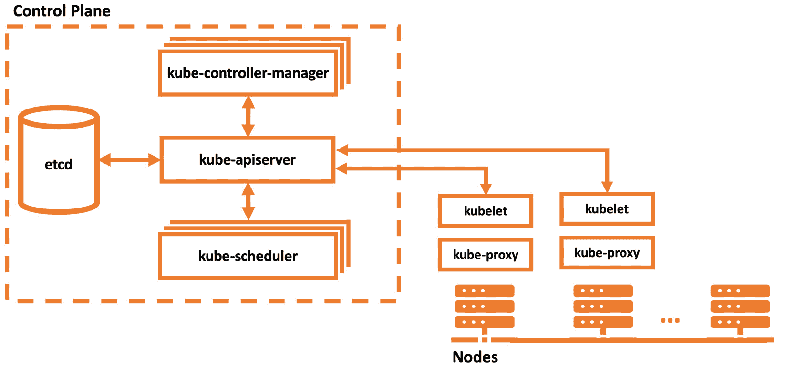
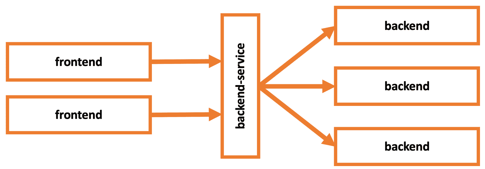
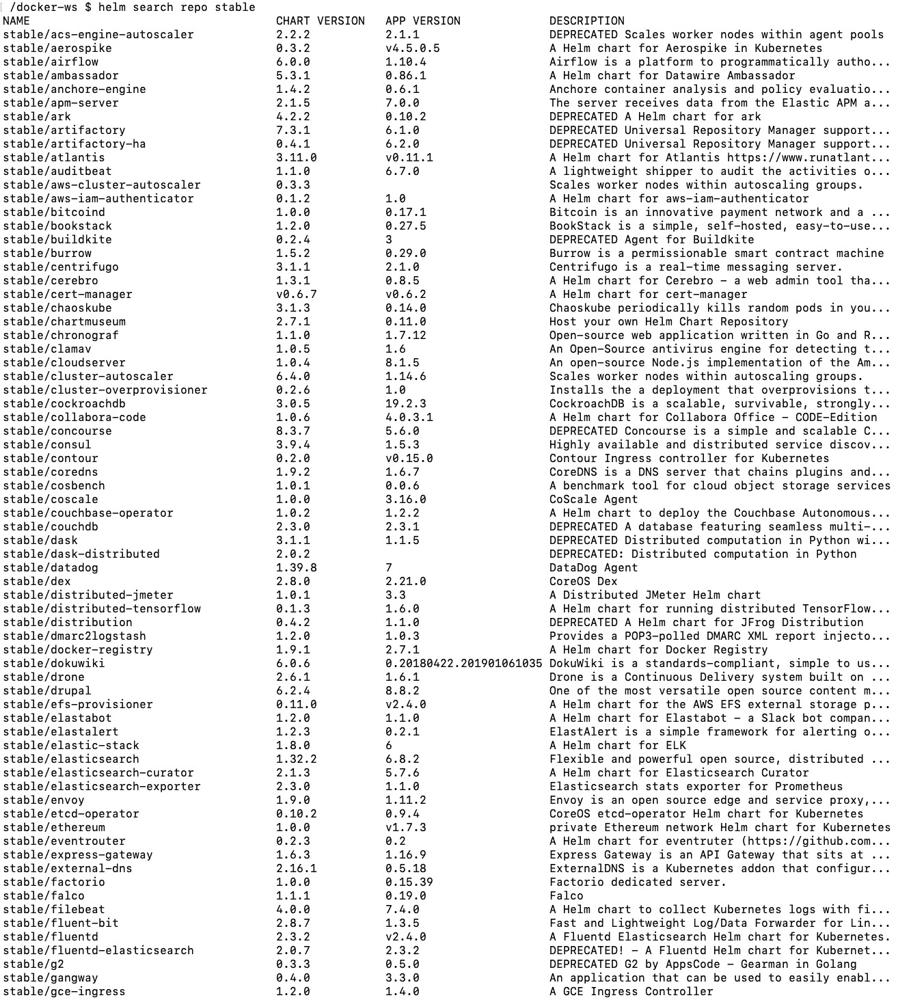
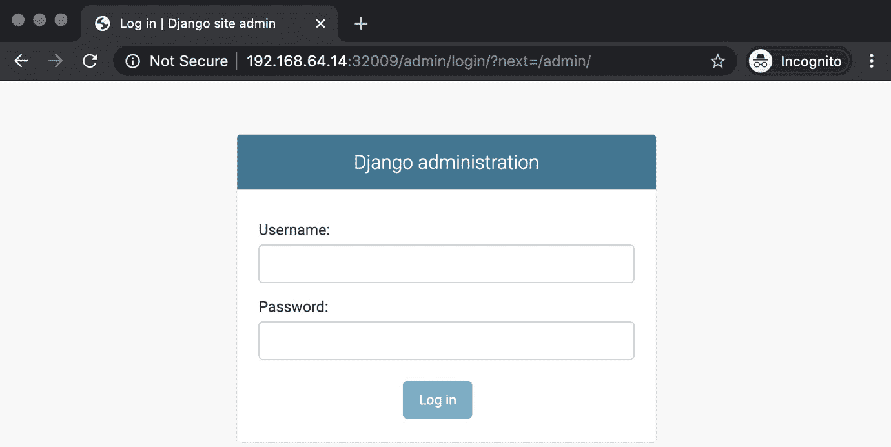
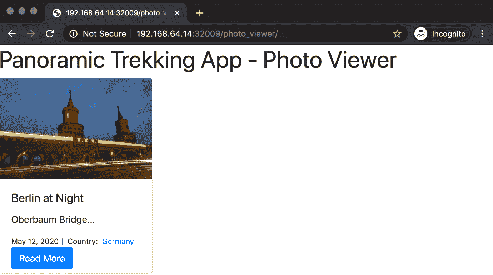

# 第十章：10. Kubernetes

概述

在本章中，我们将学习 Kubernetes，这是市场上最流行的容器管理系统。从基础知识、架构和资源开始，您将创建 Kubernetes 集群并在其中部署真实应用程序。

在本章结束时，您将能够识别 Kubernetes 设计的基础知识及其与 Docker 的关系。您将创建和配置本地 Kubernetes 集群，使用客户端工具使用 Kubernetes API，并使用基本的 Kubernetes 资源来运行容器化应用程序。

# 介绍

在之前的章节中，您使用 Docker Compose 和 Docker Swarm 运行了多个 Docker 容器。在各种容器中运行的微服务帮助开发人员创建可扩展和可靠的应用程序。

然而，当多个应用程序分布在数据中心的多台服务器上，甚至分布在全球多个数据中心时，管理这些应用程序变得更加复杂。与分布式应用程序复杂性相关的问题有很多，包括但不限于网络、存储和容器管理。

例如，应该配置在相同节点上运行的容器以及不同节点上运行的容器之间的网络。同样，应该使用中央控制器管理包含应用程序的容器的卷（可以进行扩展或缩减）。幸运的是，分布式容器的管理有一个被广泛接受和采用的解决方案：Kubernetes。

Kubernetes 是一个用于运行可扩展、可靠和强大的容器化应用程序的开源容器编排系统。可以在从 Raspberry Pi 到数据中心的各种平台上运行 Kubernetes。Kubernetes 使得可以运行具有挂载卷、插入密钥和配置网络接口的容器。此外，它专注于容器的生命周期，以提供高可用性和可扩展性。凭借其全面的方法，Kubernetes 是目前市场上领先的容器管理系统。

Kubernetes 在希腊语中意为**船长**。与 Docker 对船只和容器的类比一样，Kubernetes 将自己定位为航海大师。Kubernetes 的理念源于在过去十多年中管理 Google 服务（如 Gmail 或 Google Drive）的容器。从 2014 年至今，Kubernetes 一直是一个由**Cloud Native Computing Foundation**（**CNCF**）管理的开源项目。

Kubernetes 的主要优势之一来自于其社区和维护者。它是 GitHub 上最活跃的存储库之一，有近 88,000 次提交来自 2400 多名贡献者。此外，该存储库拥有超过 62,000 个星标，这意味着超过 62,000 人对该存储库有信心。


图 10.1：Kubernetes GitHub 存储库

在本章中，您将探索 Kubernetes 的设计和架构，然后了解其 API 和访问，并使用 Kubernetes 资源来创建容器化应用程序。由于 Kubernetes 是领先的容器编排工具，亲身体验它将有助于您进入容器化应用程序的世界。

# Kubernetes 设计

Kubernetes 专注于容器的生命周期，包括配置、调度、健康检查和扩展。通过 Kubernetes，可以安装各种类型的应用程序，包括数据库、内容管理系统、队列管理器、负载均衡器和 Web 服务器。

举例来说，想象一下你正在一家名为**InstantPizza**的新在线食品外卖连锁店工作。你可以在 Kubernetes 中部署你的移动应用的后端，并使其能够根据客户需求和使用情况进行扩展。同样，你可以在 Kubernetes 中实现消息队列，以便餐厅和顾客之间进行通信。为了存储过去的订单和收据，你可以在 Kubernetes 中部署一个带有存储的数据库。此外，你可以使用负载均衡器来为你的应用实现**Blue/Green**或**A/B 部署**。

在本节中，讨论了 Kubernetes 的设计和架构，以说明它如何实现可伸缩性和可靠性。

注意

Blue/green 部署专注于安装同一应用的两个相同版本（分别称为蓝色和绿色），并立即从蓝色切换到绿色，以减少停机时间和风险。

A/B 部署侧重于安装应用程序的两个版本（即 A 和 B），用户流量在版本之间分配，用于测试和实验。

Kubernetes 的设计集中在一个或多个服务器上运行，即集群。另一方面，Kubernetes 由许多组件组成，这些组件应分布在单个集群上，以便拥有可靠和可扩展的应用程序。

Kubernetes 组件分为两组，即**控制平面**和**节点**。尽管 Kubernetes 景观的组成元素有不同的命名约定，例如控制平面的主要组件而不是主控组件，但分组的主要思想并未改变。控制平面组件负责运行 Kubernetes API，包括数据库、控制器和调度器。Kubernetes 控制平面中有四个主要组件：

+   `kube-apiserver`: 这是连接集群中所有组件的中央 API 服务器。

+   `etcd`: 这是 Kubernetes 资源的数据库，`kube-apiserver` 将集群的状态存储在 `etcd` 上。

+   `kube-scheduler`: 这是将容器化应用程序分配给节点的调度器。

+   `kube-controller-manager`: 这是在集群中创建和管理 Kubernetes 资源的控制器。

在具有节点角色的服务器上，有两个 Kubernetes 组件：

+   `kubelet`: 这是运行在节点上的 Kubernetes 客户端，用于在 Kubernetes API 和容器运行时（如 Docker）之间创建桥接。

+   `kube-proxy`: 这是在每个节点上运行的网络代理，允许集群中的工作负载进行网络通信。

控制平面和节点组件以及它们的交互如下图所示：



图 10.2: Kubernetes 架构

Kubernetes 设计用于在可扩展的云系统上运行。然而，有许多工具可以在本地运行 Kubernetes 集群。`minikube` 是官方支持的 CLI 工具，用于创建和管理本地 Kubernetes 集群。其命令侧重于集群的生命周期事件和故障排除，如下所示：

+   `minikube start`: 启动本地 Kubernetes 集群

+   `minikube stop`: 停止正在运行的本地 Kubernetes 集群

+   `minikube delete`: 删除本地 Kubernetes 集群

+   `minikube service`: 获取本地集群中指定服务的 URL(s)

+   `minikube ssh`：登录或在具有 SSH 的机器上运行命令

在下一个练习中，您将创建一个本地 Kubernetes 集群，以检查本章讨论的组件。为了创建一个本地集群，您将使用`minikube`作为官方的本地 Kubernetes 解决方案，并运行其命令来探索 Kubernetes 组件。

注意

`minikube`在虚拟机上运行集群，您需要根据您的操作系统安装虚拟机监控程序，如 KVM、VirtualBox、VMware Fusion、Hyperkit 或基于 Hyper-V。您可以在[`kubernetes.io/docs/tasks/tools/install-minikube/#install-a-hypervisor`](https://kubernetes.io/docs/tasks/tools/install-minikube/#install-a-hypervisor)上查看官方文档以获取更多信息。

注意

请使用`touch`命令创建文件，并使用`vim`命令在 vim 编辑器中处理文件。

## 练习 10.01：启动本地 Kubernetes 集群

Kubernetes 最初设计为在具有多个服务器的集群上运行。这是一个容器编排器的预期特性，用于在云中运行可扩展的应用程序。然而，有很多时候您需要在本地运行 Kubernetes 集群，比如用于开发或测试。在这个练习中，您将安装一个本地 Kubernetes 提供程序，然后创建一个 Kubernetes 集群。在集群中，您将检查本节讨论的组件。

要完成这个练习，请执行以下步骤：

1.  下载适用于您操作系统的最新版本的`minikube`可执行文件，并通过在终端中运行以下命令将二进制文件设置为本地系统可执行：

```
# Linux
curl -Lo minikube https://storage.googleapis.com/minikube/releases/latest/minikube-linux-amd64
# MacOS
curl -Lo minikube https://storage.googleapis.com/minikube/releases/latest/minikube-darwin-amd64 
chmod +x minikube 
sudo mv minikube /usr/local/bin
```

上述命令下载了 Linux 或 Mac 的二进制文件，并使其在终端中可用：


图 10.3：安装 minikube

1.  使用以下命令在终端中启动 Kubernetes 集群：

```
minikube start
```

前面的单个命令执行多个步骤，成功创建一个集群。您可以按如下方式检查每个阶段及其输出：


图 10.4：启动一个新的 Kubernetes 集群

输出以打印版本和环境开始。然后，拉取并启动 Kubernetes 组件的镜像。最后，经过几分钟后，您将拥有一个本地运行的 Kubernetes 集群。

1.  使用以下命令连接到由`minikube`启动的集群节点：

```
minikube ssh
```

使用`ssh`命令，您可以继续在集群中运行的节点上工作：


图 10.5：集群节点

1.  使用以下命令检查每个控制平面组件：

```
docker ps --filter „name=kube-apiserver" --filter „name=etcd" --filter „name=kube-scheduler" --filter „name=kube-controller-manager" | grep -v „pause"
```

此命令检查 Docker 容器并使用控制平面组件名称进行过滤。以下输出不包含暂停容器，该容器负责 Kubernetes 中容器组的网络设置，以便进行分析：


图 10.6：控制平面组件

输出显示，四个控制平面组件在`minikube`节点的 Docker 容器中运行。

1.  使用以下命令检查第一个节点组件`kube-proxy`：

```
docker ps --filter "name=kube-proxy"  | grep -v "pause"
```

与*步骤 4*类似，此命令列出了一个在 Docker 容器中运行的`kube-proxy`组件：


图 10.7：minikube 中的 kube-proxy

可以看到在 Docker 容器中运行的`kube-proxy`组件已经运行了 21 分钟。

1.  使用以下命令检查第二个节点组件`kubelet`：

```
pgrep -l kubelet
```

此命令列出了在`minikube`中运行的进程及其 ID：

```
2554 kubelet
```

由于`kubelet`在容器运行时和 API 服务器之间进行通信，因此它被配置为直接在机器上运行，而不是在 Docker 容器内部运行。

1.  使用以下命令断开与*步骤 3*中连接的`minikube`节点的连接：

```
exit
```

你应该已经返回到你的终端并获得类似以下的输出：

```
logout
```

在这个练习中，您已经安装了一个 Kubernetes 集群并检查了架构组件。在下一节中，将介绍 Kubernetes API 和访问方法，以连接和使用本节中创建的集群。

# Kubernetes API 和访问

**Kubernetes API**是 Kubernetes 系统的基本构建模块。它是集群中所有组件之间的通信中心。外部通信，如用户命令，也是通过对 Kubernetes API 的 REST API 调用来执行的。Kubernetes API 是基于 HTTP 的资源接口。换句话说，API 服务器旨在使用资源来创建和管理 Kubernetes 资源。在本节中，您将连接到 API，在接下来的部分中，您将开始使用 Kubernetes 资源，包括但不限于 Pods、Deployments、Statefulsets 和 Services。

Kubernetes 有一个官方的命令行工具用于客户端访问，名为`kubectl`。如果您想访问 Kubernetes 集群，您需要安装`kubectl`工具并配置它以连接到您的集群。然后，您可以安全地使用该工具来管理运行在集群中的应用程序的生命周期。`kubectl`能够执行基本的创建、读取、更新和删除操作，以及故障排除和日志检索。

例如，您可以使用`kubectl`安装一个容器化应用程序，将其扩展到更多副本，检查日志，最后如果不再需要，可以删除它。此外，`kubectl`还具有用于检查集群和服务器状态的集群管理命令。因此，`kubectl`是访问 Kubernetes 集群和管理应用程序的重要命令行工具。

`kubectl`是控制 Kubernetes 集群的关键，具有丰富的命令集。基本的和与部署相关的命令可以列举如下：

+   `kubectl create`：此命令使用`-f`标志从文件名创建资源或标准终端输入。在首次创建资源时很有帮助。

+   `kubectl apply`：此命令创建或更新 Kubernetes 资源的配置，类似于`create`命令。如果在第一次创建后更改资源配置，则这是一个必要的命令。

+   `kubectl get`：此命令显示集群中一个或多个资源及其名称、标签和其他信息。

+   `kubectl edit`：此命令直接在终端中使用诸如`vi`之类的编辑器编辑 Kubernetes 资源。

+   `kubectl delete`：此命令删除 Kubernetes 资源并传递文件名、资源名称和标签标志。

+   `kubectl scale`：此命令更改 Kubernetes 集群资源的数量。

类似地，所需的集群管理和配置命令列举如下：

+   `kubectl cluster-info`：此命令显示集群的摘要及其 API 和 DNS 服务。

+   `kubectl api-resources`：此命令列出服务器支持的 API 资源。如果您使用支持不同 API 资源集的不同 Kubernetes 安装，这将特别有帮助。

+   `kubectl version`：此命令打印客户端和服务器版本信息。如果您使用不同版本的多个 Kubernetes 集群，这是一个有用的命令，可以捕捉版本不匹配。

+   `kubectl config`：此命令配置 `kubectl` 将不同的集群连接到彼此。`kubectl` 是一个设计用于通过更改其配置与多个集群一起工作的 CLI 工具。

在下面的练习中，您将安装和配置 `kubectl` 来连接到本地 Kubernetes 集群，并开始使用其丰富的命令集来探索 Kubernetes API。

## 练习 10.02：使用 kubectl 访问 Kubernetes 集群

Kubernetes 集群安装在云系统中，并可以从各种位置访问。要安全可靠地访问集群，您需要一个可靠的客户端工具，即 Kubernetes 的官方客户端工具 `kubectl`。在这个练习中，您将安装、配置和使用 `kubectl` 来探索其与 Kubernetes API 的能力。

要完成此练习，请执行以下步骤：

1.  下载适用于您操作系统的 `kubectl` 可执行文件的最新版本，并通过在终端中运行以下命令将其设置为本地系统的可执行文件：

```
# Linux
curl -LO https://storage.googleapis.com/kubernetes-release/release/'curl -s https://storage.googleapis.com/kubernetes-release/release/stable.txt'/bin/linux/amd64/kubectl
# MacOS
curl -LO "https://storage.googleapis.com/kubernetes-release/release/$(curl -s https://storage.googleapis.com/kubernetes-release/release/stable.txt)/bin/darwin/amd64/kubectl"
chmod +x kubectl 
sudo mv kubectl /usr/local/bin
```

上述命令下载了适用于 Linux 或 Mac 的二进制文件，并使其在终端中准备就绪：


图 10.8：minikube 的安装

1.  在您的终端中，运行以下命令来配置 `kubectl` 连接到 `minikube` 集群并将其用于进一步访问：

```
kubectl config use-context minikube
```

`use-context` 命令配置 `kubectl` 上下文以使用 `minikube` 集群。在接下来的步骤中，所有命令将与在 `minikube` 内运行的 Kubernetes 集群通信：

```
Switched to context "minikube".
```

1.  使用以下命令检查集群和客户端版本：

```
kubectl version --short
```

该命令返回可读的客户端和服务器版本信息：

```
Client Version: v1.17.2
Server Version: v1.17.0
```

1.  使用以下命令检查有关集群的更多信息：

```
kubectl cluster-info
```

此命令显示 Kubernetes 组件的摘要，包括主节点和 DNS：

```
Kubernetes master is running at https://192.168.64.5:8443
KubeDNS is running at https://192.168.64.5:8445/api/v1/
namespaces/kube-system/Services/kube-dns:dns/proxy
To further debug and diagnose cluster problems, use 
'kubectl cluster-info dump'.
```

1.  使用以下命令获取集群中节点的列表：

```
kubectl get nodes
```

由于集群是一个 `minikube` 本地集群，只有一个名为 `minikube` 的节点具有 `master` 角色：

```
NAME        STATUS        ROLES        AGE        VERSION
Minikube    Ready         master       41h        v1.17.0
```

1.  使用以下命令列出 Kubernetes API 中支持的资源：

```
kubectl api-resources --output="name"
```

此命令列出 Kubernetes API 服务器支持的 `api-resources` 的 `name` 字段。长列表显示了 Kubernetes 如何创建不同的抽象来运行容器化应用程序：


图 10.9：Kubernetes 资源列表

输出列出了我们连接到的 Kubernetes 集群中可用的 API 资源。正如您所看到的，有数十种资源可供使用，每种资源都可以帮助您创建云原生、可扩展和可靠的应用程序。

在这个练习中，您已连接到 Kubernetes 集群并检查了客户端工具的功能。`kubectl` 是访问和管理在 Kubernetes 中运行的应用程序最关键的工具。通过本练习的结束，您将学会如何安装、配置和连接到 Kubernetes 集群。此外，您还将检查其版本、节点的状态和可用的 API 资源。有效地使用 `kubectl` 是开发人员在与 Kubernetes 交互时日常生活中的重要任务。

在接下来的部分中，将介绍主要的 Kubernetes 资源（在上一个练习的最后一步中看到）。

# Kubernetes 资源

Kubernetes 提供了丰富的抽象，用于定义云原生应用程序中的容器。所有这些抽象都被设计为 Kubernetes API 中的资源，并由控制平面管理。换句话说，应用程序在控制平面中被定义为一组资源。同时，节点组件尝试实现资源中指定的状态。如果将 Kubernetes 资源分配给节点，节点组件将专注于附加所需的卷和网络接口，以保持应用程序的正常运行。

假设您将在 Kubernetes 上部署 InstantPizza 预订系统的后端。后端由数据库和用于处理 REST 操作的 Web 服务器组成。您需要在 Kubernetes 中定义一些资源：

+   一个**StatefulSet**资源用于数据库

+   一个**Service**资源用于从其他组件（如 Web 服务器）连接到数据库

+   一个**Deployment**资源，以可扩展的方式部署 Web 服务器

+   一个**Service**资源，以使外部连接到 Web 服务器

当这些资源在控制平面通过 `kubectl` 定义时，节点组件将在集群中创建所需的容器、网络和存储。

在 Kubernetes API 中，每个资源都有独特的特征和模式。在本节中，您将了解基本的 Kubernetes 资源，包括 Pods、Deployments、StatefulSet 和 Services。此外，您还将了解更复杂的 Kubernetes 资源，如 Ingresses、Horizontal Pod Autoscaling 和 Kubernetes 中的 RBAC 授权。

## Pods

Pod 是 Kubernetes 中容器化应用程序的基本构建块。它由一个或多个容器组成，这些容器可以共享网络、存储和内存。Kubernetes 将 Pod 中的所有容器调度到同一个节点上。此外，Pod 中的容器一起进行扩展或缩减。容器、Pod 和节点之间的关系可以概括如下：


图 10.10：容器、Pod 和节点

从上图可以看出，一个 Pod 可以包含多个容器。所有这些容器共享共同的网络、存储和内存资源。

Pod 的定义很简单，有四个主要部分：

```
apiVersion: v1
kind: Pod
metadata:
  name: server
spec:
  containers:
  - name: main
    image: nginx
```

所有 Kubernetes 资源都需要这四个部分：

+   `apiVersion`定义了对象的资源的版本化模式。

+   `kind`代表 REST 资源名称。

+   `metadata`保存了资源的信息，如名称、标签和注释。

+   `spec`是资源特定部分，其中包含资源特定信息。

当在 Kubernetes API 中创建前面的 server Pod 时，API 首先会检查定义是否符合`apiVersion=v1`和`kind=Pod`的模式。然后，调度程序将 Pod 分配给一个节点。随后，节点中的`kubelet`将为`main`容器创建`nginx`容器。

Pods 是 Kubernetes 对容器的第一个抽象，它们是更复杂资源的构建块。在接下来的部分中，我们将使用资源，如 Deployments 和 Statefulsets 来封装 Pods，以创建更复杂的应用程序。

## Deployments

部署是 Kubernetes 资源，专注于可伸缩性和高可用性。部署封装了 Pod 以扩展、缩小和部署新版本。换句话说，您可以将三个副本的 Web 服务器 Pod 定义为部署。控制平面中的部署控制器将保证副本的数量。此外，当您将部署更新到新版本时，控制器将逐渐更新应用程序实例。

部署和 Pod 的定义类似，尽管在部署的模式中添加了标签和副本：

```
apiVersion: apps/v1
kind: Deployment
metadata:
  name: server
spec:
  replicas: 10
  selector:
    matchLabels:
      app: server
  template:
    metadata:
      labels:
        app: server
    spec:
      containers:
      - name: main
        image: nginx
        ports:
        - containerPort: 80 
```

部署`server`具有带有标签`app:server`的 Pod 规范的 10 个副本。此外，每个服务器实例的主容器的端口`80`都被发布。部署控制器将创建或删除实例以匹配定义的 Pod 的 10 个副本。换句话说，如果具有两个运行实例的服务器部署的节点下线，控制器将在剩余节点上创建两个额外的 Pod。Kubernetes 的这种自动化使我们能够轻松创建可伸缩和高可用的应用程序。

在接下来的部分中，将介绍用于有状态应用程序（如数据库和消息队列）的 Kubernetes 资源。

## StatefulSets

Kubernetes 支持在磁盘卷上存储其状态的有状态应用程序的运行，使用**StatefulSet**资源。StatefulSets 使得在 Kubernetes 中运行数据库应用程序或数据分析工具具有与临时应用程序相同的可靠性和高可用性。

StatefulSets 的定义类似于**部署**的定义，具有**卷挂载**和**声明添加**：

```
apiVersion: apps/v1
kind: StatefulSet
metadata:
  name: database
spec:
  selector:
    matchLabels:
      app: mysql
  serviceName: mysql
  replicas: 1
  template:
    metadata:
      labels:
        app: mysql
    spec:
      containers:
      - name: mysql
        image: mysql:5.7
        env:
        - name: MYSQL_ROOT_PASSWORD
          value: "root"
        ports:
        - name: mysql
          containerPort: 3306
        volumeMounts:
        - name: data
          mountPath: /var/lib/mysql
        subPath: mysql
  volumeClaimTemplates:
  - metadata:
      name: data
    spec:
      accessModes: ["ReadWriteOnce"]
      resources:
        requests:
          storage: 2Gi
```

数据库资源定义了一个具有**2GB**磁盘卷的**MySQL**数据库。当在 Kubernetes API 中创建服务器`StatefulSet`资源时，`cloud-controller-manager`将创建一个卷并在预定的节点上准备好。在创建卷时，它使用`volumeClaimTemplates`下的规范。然后，节点将根据`spec`中的`volumeMounts`部分在容器中挂载卷。

在此资源定义中，还有一个设置`MYSQL_ROOT_PASSWORD`环境变量的示例。StatefulSets 是 Kubernetes 中至关重要的资源，因为它们使得可以在相同的集群中运行有状态应用程序和临时工作负载。

在下面的资源中，将介绍 Pod 之间连接的 Kubernetes 解决方案。

## 服务

Kubernetes 集群托管在各个节点上运行的多个应用程序，大多数情况下，这些应用程序需要相互通信。假设您有一个包含三个实例的后端部署和一个包含两个实例的前端应用程序部署。有五个 Pod 在集群中运行，并分布在各自的 IP 地址上。由于前端实例需要连接到后端，前端实例需要知道后端实例的 IP 地址，如*图 10.11*所示：


图 10.11：前端和后端实例

然而，这并不是一种可持续的方法，随着集群的扩展或缩减以及可能发生的大量潜在故障。Kubernetes 提出了**服务**资源，用于定义具有标签的一组 Pod，并使用服务的名称访问它们。例如，前端应用程序可以通过使用`backend-service`的地址连接到后端实例，如*图 10.12*所示：



图 10.12：通过后端服务连接的前端和后端实例

服务资源的定义相当简单，如下所示：

```
apiVersion: v1
kind: Service
metadata:
  name: my-db
spec:
  selector:
    app: mysql
  ports:
    - protocol: TCP
      port: 3306
      targetPort: 3306
```

创建`my-db`服务后，集群中的所有其他 Pod 都将能够通过地址`my-db`连接到标有`app:mysql`标签的 Pod 的`3306`端口。在下面的资源中，将介绍使用 Kubernetes Ingress 资源对集群中服务进行外部访问的方法。

## Ingress

Kubernetes 集群旨在为集群内外的应用程序提供服务。Ingress 资源被定义为将服务暴露给外部世界，并具有额外的功能，如外部 URL 和负载平衡。虽然 Ingress 资源是原生的 Kubernetes 对象，但它们需要在集群中运行 Ingress 控制器。换句话说，Ingress 控制器不是`kube-controller-manager`的一部分，您需要在集群中安装一个 Ingress 控制器。市场上有多种实现可用。但是，Kubernetes 目前正式支持和维护`GCE`和`nginx`控制器。

注意

官方文档中提供了其他 Ingress 控制器的列表，链接如下：[`kubernetes.io/docs/concepts/Services-networking/Ingress-controllers`](https://kubernetes.io/docs/concepts/Services-networking/Ingress-controllers)。

具有主机 URL 为`my-db.docker-workshop.io`，连接到`my-db`服务上的端口`3306`的 Ingress 资源如下所示：

```
apiVersion: networking.k8s.io/v1beta1
kind: Ingress
metadata:
  name: my-db
spec:
  rules:
  - host: my-db.docker-workshop.io
    http:
      paths:
      - path: /
        backend:
          serviceName: my-db
          servicePort: 3306
```

Ingress 资源对于向外界打开服务至关重要。然而，它们的配置可能比看起来更复杂。根据您集群中运行的 Ingress 控制器，Ingress 资源可能需要单独的注释。

在接下来的资源中，将介绍使用水平 Pod 自动缩放器来自动缩放 Pod 的功能。

## 水平 Pod 自动缩放

Kubernetes 集群提供了可扩展和可靠的容器化应用环境。然而，手动跟踪应用程序的使用情况并在需要时进行扩展或缩减是繁琐且不可行的。因此，Kubernetes 提供了水平 Pod 自动缩放器，根据 CPU 利用率自动缩放 Pod 的数量。

水平 Pod 自动缩放器是 Kubernetes 资源，具有用于缩放和目标指标的目标资源。

```
apiVersion: Autoscaling/v1
kind: HorizontalPodAutoscaler
metadata:
  name: server-scaler
spec:
  scaleTargetRef:
    apiVersion: apps/v1
    kind: Deployment
    name: server
  minReplicas: 1
  maxReplicas: 10
  targetCPUUtilizationPercentage: 50
```

当创建`server-scaler`资源时，Kubernetes 控制平面将尝试通过扩展或缩减名为`server`的部署来实现`50%`的目标 CPU 利用率。此外，最小和最大副本数设置为`1`和`10`。这确保了当部署未被使用时不会缩减到`0`，也不会扩展得太高以至于消耗集群中的所有资源。水平 Pod 自动缩放器资源是 Kubernetes 中创建可扩展和可靠应用程序的重要部分，这些应用程序是自动管理的。

在接下来的部分，您将了解 Kubernetes 中的授权。

## RBAC 授权

Kubernetes 集群旨在安全地连接和更改资源。然而，当应用程序在生产环境中运行时，限制用户的操作范围至关重要。

假设您已经赋予项目组中的每个人广泛的权限。在这种情况下，将无法保护集群中运行的应用免受删除或配置错误的影响。Kubernetes 提供了**基于角色的访问控制**（**RBAC**）来管理用户的访问和能力，基于赋予他们的角色。换句话说，Kubernetes 可以限制用户在特定 Kubernetes 资源上执行特定任务的能力。

让我们从`Role`资源开始定义能力：

```
kind: Role
apiVersion: rbac.authorization.k8s.io/v1
metadata:
  namespace: critical-project
  name: Pod-reader
rules:
  - apiGroups: [""]
    resources: ["Pods"]
    verbs: ["get", "watch", "list"]
```

在前面片段中定义的`Pod-reader`角色只允许在`critical-project`命名空间中`get`、`watch`和`list` Pod 资源。当用户只有`Pod-reader`角色时，他们将无法删除或修改`critical-project`命名空间中的资源。让我们看看如何使用`RoleBinding`资源将角色分配给用户：

```
kind: RoleBinding
apiVersion: rbac.authorization.k8s.io/v1
metadata:
  name: read-Pods
  namespace: critical-project
subjects:
  - kind: User
    name: new-intern
roleRef:
  kind: Role
  name: Pod-reader
  apiGroup: rbac.authorization.k8s.io
```

`RoleBinding`资源将`Role`资源与主体结合起来。在`read-Pods RoleBinding`中，用户`new-intern`被分配到`Pod-reader`角色。当在 Kubernetes API 中创建`read-Pods`资源时，`new-intern`用户将无法修改或删除`critical-project`命名空间中的 Pods。

在接下来的练习中，您将使用`kubectl`和本地 Kubernetes 集群来实践 Kubernetes 资源。

## 练习 10.03：Kubernetes 资源实践

由于云原生容器化应用的复杂性，需要多个 Kubernetes 资源。在这个练习中，您将使用一个**Statefulset**、一个**Deployment**和两个**Service**资源在 Kubernetes 上创建一个流行的 WordPress 应用的实例。此外，您将使用`kubectl`和`minikube`检查 Pods 的状态并连接到 Service。

要完成这个练习，请执行以下步骤：

1.  在一个名为`database.yaml`的文件中创建一个`StatefulSet`定义，内容如下：

```
apiVersion: apps/v1
kind: StatefulSet
metadata:
  name: database
spec:
  selector:
    matchLabels:
      app: mysql
  serviceName: mysql
  replicas: 1
  template:
    metadata:
      labels:
        app: mysql
    spec:
      containers:
      - name: mysql
        image: mysql:5.7
        env:
        - name: MYSQL_ROOT_PASSWORD
          value: "root"
        ports:
        - name: mysql
          containerPort: 3306
        volumeMounts:
        - name: data
          mountPath: /var/lib/mysql
          subPath: mysql
  volumeClaimTemplates:
  - metadata:
      name: data
    spec:
      accessModes: ["ReadWriteOnce"]
      resources:
        requests:
          storage: 2Gi
```

这个`StatefulSet`资源定义了一个数据库，将在接下来的步骤中被 WordPress 使用。只有一个名为`mysql`的容器，使用`mysql:5.7`的 Docker 镜像。容器规范中定义了一个根密码的环境变量和一个端口。此外，在前述定义中声明了一个卷并将其附加到`/var/lib/mysql`。

1.  通过在终端中运行以下命令将`StatefulSet`部署到集群中：

```
kubectl apply -f database.yaml
```

这个命令将应用`database.yaml`文件中的定义，因为它带有`-f`标志：

```
StatefulSet.apps/database created
```

1.  在本地计算机上创建一个`database-service.yaml`文件，包含以下内容：

```
apiVersion: v1
kind: Service
metadata:
  name: database-service
spec:
  selector:
    app: mysql
  ports:
    - protocol: TCP
      port: 3306
      targetPort: 3306
```

这个 Service 资源定义了数据库实例上的 Service 抽象。WordPress 实例将使用指定的 Service 连接到数据库。

1.  使用以下命令部署 Service 资源：

```
kubectl apply -f database-service.yaml
```

这个命令部署了在`database-service.yaml`文件中定义的资源：

```
Service/database-service created
```

1.  创建一个名为`wordpress.yaml`的文件，并包含以下内容：

```
apiVersion: apps/v1 
kind: Deployment
metadata:
  name: wordpress
  labels:
    app: wordpress
spec:
  replicas: 3
  selector:
    matchLabels:
      app: wordpress
  template:
    metadata:
      labels:
        app: wordpress
    spec:
      containers:
      - image: wordpress:4.8-apache
        name: wordpress
        env:
        - name: WORDPRESS_DB_HOST
          value: database-Service
        - name: WORDPRESS_DB_PASSWORD
          value: root
        ports:
        - containerPort: 80
          name: wordpress
```

这个`Deployment`资源定义了一个三个副本的 WordPress 安装。有一个容器定义了`wordpress:4.8-apache`镜像，并且`database-service`作为环境变量传递给应用程序。通过这个环境变量的帮助，WordPress 连接到*步骤 3*中部署的数据库。此外，定义了一个容器端口，端口号为`80`，以便我们可以在接下来的步骤中从浏览器中访问应用程序。

1.  使用以下命令部署 WordPress Deployment：

```
kubectl apply -f wordpress.yaml
```

这个命令部署了在`wordpress.yaml`文件中定义的资源：

```
Deployment.apps/wordpress created
```

1.  在本地计算机上创建一个`wordpress-service.yaml`文件，包含以下内容：

```
apiVersion: v1
kind: Service
metadata:
  name: wordpress-service
spec:
  type: LoadBalancer
  selector:
    app: wordpress
  ports:
    - protocol: TCP
      port: 80
      targetPort: 80
```

这个 Service 资源定义了 WordPress 实例上的 Service 抽象。该 Service 将用于通过端口`80`从外部世界连接到 WordPress。

1.  使用以下命令部署`Service`资源：

```
kubectl apply -f wordpress-service.yaml
```

这个命令部署了在`wordpress-service.yaml`文件中定义的资源：

```
Service/wordpress-service created
```

1.  使用以下命令检查所有运行中的 Pod 的状态：

```
kubectl get pods
```

这个命令列出了所有 Pod 及其状态，有一个数据库和三个 WordPress Pod 处于`Running`状态：


图 10.13：Pod 列表

1.  通过运行以下命令获取`wordpress-service`的 URL：

```
minikube service wordpress-service --url
```

这个命令列出了可以从主机机器访问的 Service 的 URL：

```
http://192.168.64.5:32765
```

在浏览器中打开 URL 以访问 WordPress 的设置屏幕：


图 10.14：WordPress 设置屏幕

设置屏幕显示 WordPress 实例正在运行，并且可以通过它们的服务访问。此外，它显示`StatefulSet`数据库也正在运行，并且可以通过 WordPress 实例的服务访问。

在这个练习中，您已经使用不同的 Kubernetes 资源来定义和安装 Kubernetes 中的复杂应用程序。首先，您部署了一个`Statefulset`资源来在集群中安装 MySQL。然后，您部署了一个`Service`资源来在集群内部访问数据库。随后，您部署了一个`Deployment`资源来安装 WordPress 应用程序。类似地，您创建了另一个`Service`来在集群外部访问 WordPress 应用程序。您使用不同的 Kubernetes 资源创建了独立可伸缩和可靠的微服务，并将它们连接起来。此外，您已经学会了如何检查`Pods`的状态。在接下来的部分，您将了解 Kubernetes 软件包管理器：Helm。

# Kubernetes 软件包管理器：Helm

由于云原生微服务架构的特性，Kubernetes 应用程序由多个容器、卷和网络资源组成。微服务架构将大型应用程序分成较小的块，因此会产生大量的 Kubernetes 资源和大量的配置值。

Helm 是官方的 Kubernetes 软件包管理器，它将应用程序的资源收集为模板，并填充提供的值。这里的主要优势在于积累的社区知识，可以按照最佳实践安装应用程序。即使您是第一次使用，也可以使用最流行的方法安装应用程序。此外，使用 Helm 图表增强了开发人员的体验。

例如，在 Kubernetes 中安装和管理复杂的应用程序就变得类似于在 Apple Store 或 Google Play Store 中下载应用程序，只需要更少的命令和配置。在 Helm 术语中，一个单个应用程序的资源集合被称为**chart**。当您使用 Helm 软件包管理器时，可以使用图表来部署从简单的 pod 到带有 HTTP 服务器、数据库、缓存等的完整 Web 应用程序堆栈。将应用程序封装为图表使得部署复杂的应用程序变得更容易。

此外，Helm 还有一个图表存储库，其中包含流行和稳定的应用程序，这些应用程序被打包为图表，并由 Helm 社区维护。稳定的 Helm 图表存储库拥有各种各样的应用程序，包括 MySQL、PostgreSQL、CouchDB 和 InfluxDB 等数据库；Jenkins、Concourse 和 Drone 等 CI/CD 工具；以及 Grafana、Prometheus、Datadog 和 Fluentd 等监控工具。图表存储库不仅使安装应用程序变得更加容易，还确保您使用 Kubernetes 社区中最新、广受认可的方法部署应用程序。

Helm 是一个客户端工具，其最新版本为 Helm 3。您只需要在本地系统上安装它，为图表存储库进行配置，然后就可以开始部署应用程序。Helm 是一个功能强大的软件包管理器，具有详尽的命令集，包括以下内容：

+   `helm repo`：此命令向本地 Helm 安装添加、列出、移除、更新和索引图表存储库。

+   `helm search`：此命令使用用户提供的关键字或图表名称在各种存储库中搜索 Helm 图表。

+   `helm install`：此命令在 Kubernetes 集群上安装 Helm 图表。还可以使用值文件或命令行参数设置变量。

+   `helm list`或`helm ls`：这些命令列出了从集群中安装的图表。

+   `helm uninstall`：此命令从 Kubernetes 中移除已安装的图表。

+   `helm upgrade`：此命令使用新值或新的图表版本在集群上升级已安装的图表。

在接下来的练习中，您将安装 Helm，连接到图表存储库，并在集群上安装应用程序。

## 练习 10.04：安装 MySQL Helm 图表

Helm 图表由官方客户端工具`helm`安装和管理。您需要在本地安装`helm`客户端工具，以从图表存储库检索图表，然后在集群上安装应用程序。在此练习中，您将开始使用 Helm，并从其稳定的 Helm 图表中安装**MySQL**。

要完成此练习，请执行以下步骤：

1.  在终端中运行以下命令以下载带有安装脚本的`helm`可执行文件的最新版本：

```
curl https://raw.githubusercontent.com/helm/helm/master/scripts/get-helm-3 | bash
```

该脚本将下载适用于您的操作系统的`helm`二进制文件，并使其在终端中可用。


图 10.15：安装 Helm

1.  通过在终端中运行以下命令，将图表存储库添加到`helm`中：

```
helm repo add stable https://kubernetes-charts.storage.googleapis.com/
```

此命令将图表存储库的 URL 添加到本地安装的`helm`实例中：

```
"stable" has been added to your repositories
```

1.  使用以下命令列出*步骤 2*中`stable`存储库中的图表：

```
helm search repo stable
```

此命令将列出存储库中所有可用的图表：



图 10.16：图表存储库列表

1.  使用以下命令安装 MySQL 图表：

```
helm install database stable/mysql
```

此命令将从`stable`存储库中安装 MySQL Helm 图表，并打印如何连接到数据库的信息：


图 10.17：MySQL 安装

如果您想要使用`mysql`客户端在集群内部或外部连接到 MySQL 安装，输出中的信息是有价值的。

1.  使用以下命令检查安装的状态：

```
helm ls
```

我们可以看到有一个名为`mysql-chart-1.6.2`的安装，状态为`deployed`：


图 10.18：Helm 安装状态

您还可以使用`helm ls`命令来检查应用程序和图表版本，例如`5.7.28`和`mysql-1.6.2`。

1.  使用以下命令检查与*步骤 4*中安装相关的 Kubernetes 资源：

```
kubectl get all -l release=database
```

此命令列出所有具有标签`release = database`的资源：


图 10.19：Kubernetes 资源列表

由于安装生产级别的 MySQL 实例并不简单，并且由多个资源组成，因此列出了各种资源。多亏了 Helm，我们不需要配置每个资源并连接它们。此外，使用标签`release = database`进行列出有助于在 Helm 安装的某些部分失败时提供故障排除概述。 

在这个练习中，您已经安装和配置了 Kubernetes 包管理器 Helm，并使用它安装了应用程序。如果您计划在生产环境中使用 Kubernetes 并需要管理复杂的应用程序，Helm 是一个必不可少的工具。

在接下来的活动中，您将配置并部署全景徒步应用程序到 Kubernetes 集群。

## 活动 10.01：在 Kubernetes 上安装全景徒步应用程序

您被指派在 Kubernetes 上创建全景徒步应用程序的部署。您将利用全景徒步应用程序的三层架构和最先进的 Kubernetes 资源。您将使用 Helm 安装数据库，并使用 Statefulset 和`nginx`安装后端。因此，您将将其设计为 Kubernetes 应用程序，并使用`kubectl`和`helm`进行管理。

执行以下步骤完成练习：

1.  使用 PostgreSQL Helm 图表安装数据库。确保`POSTGRES_PASSWORD`环境变量设置为`kubernetes`。

1.  为全景徒步应用程序的后端和`nginx`创建一个具有两个容器的 Statefulset。确保使用 Docker 镜像`packtworkshops/the-docker-workshop:chapter10-pta-web`和`packtworkshops/the-docker-workshop:chapter10-pta-nginx`。为了存储静态文件，您需要创建一个`volumeClaimTemplate`部分，并将其挂载到两个容器的`/Service/static/`路径。最后，不要忘记发布`nginx`容器的端口`80`。

1.  为全景徒步应用程序创建一个 Kubernetes 服务，以连接到*步骤 2*中创建的 Statefulset。确保服务的`type`是`LoadBalancer`。

1.  成功部署后，获取*步骤 3*中创建的 Kubernetes 服务的 IP，并在浏览器中连接到`$SERVICE_IP/admin`地址：

图 10.20：管理员登录

1.  使用用户名`admin`和密码`changeme`登录，并添加新的照片和国家：

图 10.21：管理员设置

1.  全景徒步应用程序将在浏览器中的地址`$SERVICE_IP/photo_viewer`上可用：

图 10.22：应用程序视图

注意

此活动的解决方案可以通过此链接找到。

# 摘要

本章重点介绍了使用 Kubernetes 设计、创建和管理容器化应用程序。Kubernetes 是市场上新兴的容器编排器，具有很高的采用率和活跃的社区。在本章中，您已经了解了其架构和设计，接着是 Kubernetes API 及其访问方法，并深入了解了创建复杂的云原生应用程序所需的关键 Kubernetes 资源。

本章中的每个练习都旨在说明 Kubernetes 的设计方法和其能力。通过 Kubernetes 资源及其官方客户端工具`kubectl`，可以配置、部署和管理容器化应用程序。

在接下来的章节中，您将了解 Docker 世界中的安全性。您将学习容器运行时、容器镜像和 Linux 环境的安全概念，以及如何在 Docker 中安全运行容器。
