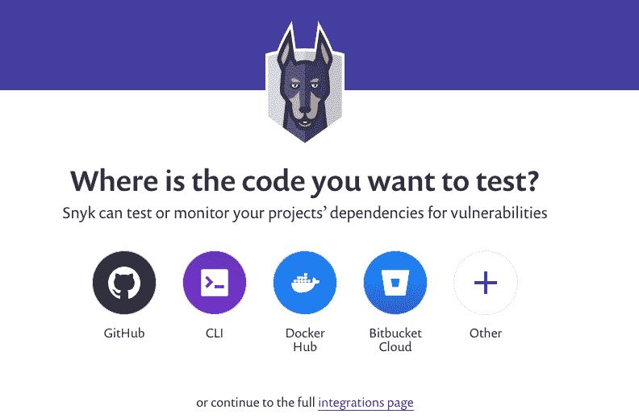
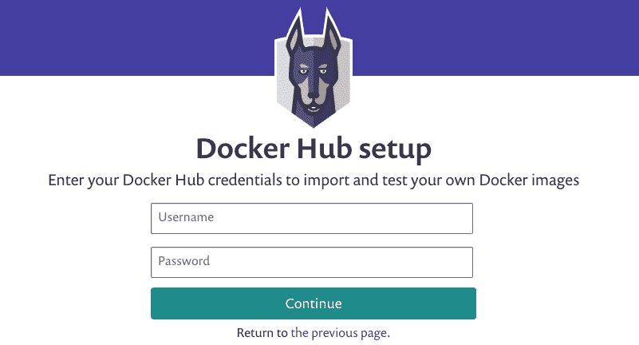
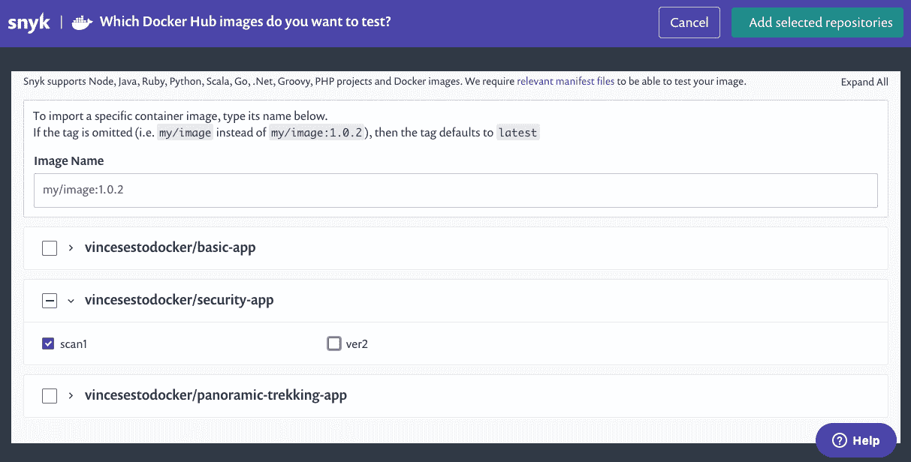

# 11. Docker 安全性

概述

在本章中，我们将为您提供所需的信息，以确保您的容器是安全的，并且不会对使用其上运行的应用程序的人员构成安全风险。您将使用特权和非特权容器，并了解为什么不应该以 root 用户身份运行容器。本章将帮助您验证镜像是否来自可信的来源，使用签名密钥。您还将为 Docker 镜像设置安全扫描，确保您的镜像可以安全使用和分发。您将使用 AppArmor 进一步保护您的容器，并使用 Linux 的安全计算模式（`seccomp`）来创建和使用`seccomp`配置文件与您的 Docker 镜像。

# 介绍

本章试图解决一个可以专门写一本书的主题。我们试图在教育您如何使用 Docker 来处理安全性方面走一部分路。之前的章节已经为您提供了使用 Docker 构建应用程序的坚实基础，本章希望利用这些信息为它们提供安全稳定的容器来运行。

Docker 和微服务架构使我们能够从更安全和健壮的环境开始管理我们的服务，但这并不意味着我们需要完全忘记安全性。本章详细介绍了在创建和维护跨环境服务时需要考虑的一些方面，以及您可以开始在工作系统中实施这些程序的方式。

Docker 安全性不应该与您的常规 IT 安全流程分开，因为概念是相同的。Docker 有不同的处理这些概念的方法，但总的来说，开始使用 Docker 安全性的好地方包括以下内容：

+   **访问控制**：确保运行的容器无法被攻击者访问，并且权限也受到限制。

+   **更新和修补操作系统**：我们需要确保我们使用的镜像来自可信的来源。我们还需要能够扫描我们的镜像，以确保引入的任何应用程序也不会引入额外的漏洞。

+   **数据敏感性**：所有敏感信息都应该保持不可访问。这可能是密码、个人信息，或者任何您不希望被任何人获取的数据。

在本章中，我们将涵盖许多信息，包括前述的内容以及更多。我们将首先考虑在运行时您的 Docker 容器可能具有的不同访问权限，以及您如何开始限制它们可以执行的操作。然后，我们将更仔细地研究如何保护镜像，使用签名密钥，以及如何验证它们来自可信任的来源。我们还将练习扫描您的镜像以确保它们可以安全使用的已知漏洞。本章的最后两节将重点介绍使用 AppArmor 和`seccomp`安全配置文件来进一步限制正在运行的容器的功能和访问权限。

注意

在 Docker 镜像中使用密码和秘钥时，编排方法如 Swarm 和 Kubernetes 提供了安全的存储秘钥的方式，无需将它们存储为明文配置供所有人访问。如果您没有使用这些编排方法，我们也将在下一章提供一些关于如何在镜像中使用秘钥的想法。

# 容器中的特权和 root 用户访问权限

提高容器安全性的一个重要方法是减少攻击者在获得访问权限后可以做的事情。攻击者在容器上可以运行的命令类型受限于运行容器进程的用户的访问权限级别。因此，如果运行容器的用户没有 root 或提升的特权，这将限制攻击者可以做的事情。另一个需要记住的事情是，如果容器被攻破并以 root 用户身份运行，这也可能允许攻击者逃离容器并访问运行 Docker 的主机系统。

容器上运行的大多数进程都是不需要 root 访问权限的应用程序，这与在服务器上运行进程是一样的，您也不会将它们作为 root 运行。在容器上运行的应用程序应该只能访问它们所需的内容。提供 root 访问权限的原因，特别是在基础镜像中，是因为应用程序需要安装在容器上，但这应该只是一个临时措施，您的完整镜像应该以另一个用户身份运行。

为了做到这一点，在创建我们的镜像时，我们可以设置一个 Dockerfile 并创建一个将在容器上运行进程的用户。下面这行与在 Linux 命令行上设置用户相同，我们首先设置组，然后将用户分配到这个组中：

```
RUN addgroup --gid <GID> <UID> && adduser <UID> -h <home_directory> --disabled-password --uid <UID> --ingroup <UID> <user_name>
```

在上述命令中，我们还使用`adduser`选项来设置`home`目录并禁用登录密码。

注意

`addgroup`和`adduser`是特定于基于 Alpine 的镜像的命令，这些镜像是基于 Linux 的镜像，但使用不同的软件包和实用程序来自基于 Debian 的镜像。Alpine 镜像使用这些软件包的原因是它们选择更轻量级的实用程序和应用程序。如果您使用的是基于 Ubuntu/Debian 或 Red Hat 的镜像，您需要改用`useradd`和`groupadd`命令，并使用这些命令的相关选项。

正如您将在即将进行的练习中看到的，我们将切换到我们专门创建的用户以创建我们将要运行的进程。您可以自行决定组和用户的名称，但许多用户更喜欢使用四位或五位数字作为这将不会向潜在攻击者突出显示该用户的任何更多特权，并且通常是创建用户和组的标准做法。在我们的 Dockerfile 中，在创建进程之前，我们包括`USER`指令，并包括我们先前创建的用户的用户 ID：

```
USER <UID>
```

在本章的这一部分，我们将介绍一个新的镜像，并展示如果容器上的进程由 root 用户运行可能会出现的问题。我们还将向您展示容器中的 root 用户与底层主机上的 root 用户是相同的。然后，我们将更改我们的镜像，以展示删除容器上运行的进程的 root 访问权限的好处。

注意

请使用`touch`命令创建文件，并使用`vim`命令在文件上使用 vim 编辑器进行操作。

## 练习 11.01：以 root 用户身份运行容器

当我们以 root 用户身份运行容器进程时，可能会出现许多问题。本练习将演示特定的安全问题，例如更改访问权限、终止进程、对 DNS 进行更改，以及您的镜像和底层操作系统可能会变得脆弱。您将注意到，作为 root 用户，攻击者还可以使用诸如`nmap`之类的工具来扫描网络以查找开放的端口和网络目标。

您还将纠正这些问题，从而限制攻击者在运行容器上的操作：

1.  使用您喜欢的文本编辑器创建一个名为`Dockerfile_original`的新 Dockerfile，并将以下代码输入文件。在此步骤中，所有命令都是以 root 用户身份运行的：

```
1 FROM alpine
2
3 RUN apk update
4 RUN apk add wget curl nmap libcap
5
6 RUN echo "#!/sh\n" > test_memory.sh
7 RUN echo "cat /proc/meminfo; mpstat; pmap -x 1"     >> test_memory.sh
8 RUN chmod 755 test_memory.sh
9
10 CMD ["sh", "test_memory.sh"]
```

这将创建一个基本的应用程序，将运行一个名为`test_memory.sh`的小脚本，该脚本使用`meminfo`，`mpstat`和`pmap`命令来提供有关容器内存状态的详细信息。您还会注意到在*第 4 行*上，我们正在安装一些额外的应用程序，以使用`nmap`查看网络进程，并使用`libcap`库查看用户容器的功能。

1.  构建`security-app`镜像并在同一步骤中运行该镜像：

```
docker build -t security-app . ; docker run –rm security-app
```

输出已经大大减少，您应该看到镜像构建，然后运行内存报告：

```
MemTotal:        2036900 kB
MemFree:         1243248 kB
MemAvailable:    1576432 kB
Buffers:          73240 kB
…
```

1.  使用`whoami`命令查看容器上的运行用户：

```
docker run --rm security-app whoami
```

不应该让人感到惊讶的是运行用户是 root 用户：

```
root
```

1.  使用`capsh –print`命令查看用户在容器上能够运行的进程。作为 root 用户，您应该拥有大量的功能：

```
docker run --rm -it security-app capsh –print
```

您会注意到用户可以访问更改文件所有权（`cap_chown`），杀死进程（`cap_kill`）和对 DNS 进行更改（`cap_net_bind_service`）等功能。这些都是可以在运行环境中引起许多问题的高级进程，不应该对容器可用：

```
Current: = cap_chown,cap_dac_override,cap_fowner,cap_fsetid,
cap_kill,cap_setgid,cap_setuid,cap_setpcap,cap_net_bind_service,
cap_net_raw,cap_sys_chroot,cap_mknod,cap_audit_write,
cap_setfcap+eip
groups=0(root),1(bin),2(daemon),3(sys),4(adm),6(disk),10(wheel),
11(floppy),20(dialout),26(tape),27(video)
```

1.  作为 root 用户，攻击者还可以使用我们之前安装的`nmap`等工具来扫描网络以查找开放的端口和网络目标。通过传递`nmap`命令再次运行您的容器镜像，查找`localhost`下已打开的`443`端口：

```
docker run --rm -it security-app sh -c 'nmap -sS -p 443 localhost'
```

命令的输出如下：

```
Starting Nmap 7.70 ( https://nmap.org ) at 2019-11-13 02:40 UTC
Nmap scan report for localhost (127.0.0.1)
Host is up (0.000062s latency).
Other addresses for localhost (not scanned): ::1
PORT    STATE  SERVICE
443/tcp closed https
Nmap done: 1 IP address (1 host up) scanned in 0.27 seconds
```

注意

前面的`nmap`扫描没有找到任何开放的网络，但这是一个不应该能够由任何用户运行的提升命令。我们将在本练习的后面演示非 root 用户无法运行此命令。

1.  如前所述，在容器上作为 root 用户与在底层主机上作为 root 用户是相同的。这可以通过将一个由 root 拥有的文件挂载到容器上来证明。为此，创建一个秘密文件。将您的秘密密码回显到`/tmp/secret.txt`文件中：

```
echo "secret password" > /tmp/secret.txt
```

更改所有权以确保 root 用户拥有它：

```
sudo chown root /tmp/secret.txt
```

1.  使用`docker run`命令将文件挂载到运行的容器上，并检查是否能够访问并查看文件中的数据。容器上的用户可以访问只有主机系统上的 root 用户才能访问的文件：

```
docker run -v /tmp/secret.txt:/tmp/secret.txt security-app sh -c 'cat /tmp/secret.txt'
```

来自 docker run 命令的输出将是“`secret password`”

```
secret password
```

然而，Docker 容器不应该能够暴露这些信息。

1.  要开始对容器进行一些简单的更改，以阻止再次发生这种访问，再次打开 Dockerfile 并添加突出显示的代码（*行 6*，*7*，*8*和*9*），保持先前的代码不变。这些代码将创建一个名为`10001`的组和一个名为`20002`的用户。然后将设置一个带有`home`目录的用户，然后您将进入该目录并开始使用*行 9*中的`USER`指令进行操作：

```
1 FROM alpine
2
3 RUN apk update
4 RUN apk add wget curl nmap libcap
5
6 RUN addgroup --gid 10001 20002 && adduser 20002 -h     /home/security_apps --disabled-password --uid 20002     --ingroup 20002
7 WORKDIR /home/security_apps
8
9 USER 20002
```

1.  对*行 15*进行更改，以确保脚本是从新的`security_app`目录运行的，然后保存 Dockerfile：

```
11 RUN echo "#!/sh\n" > test_memory.sh
12 RUN echo "cat /proc/meminfo; mpstat; pmap -x 1" >>     test_memory.sh
13 RUN chmod 755 test_memory.sh
14
15 CMD ["sh", "/home/security_apps/test_memory.sh"]
```

完整的 Dockerfile 应该如下所示：

```
FROM alpine
RUN apk update
RUN apk add wget curl nmap libcap
RUN addgroup --gid 10001 20002 && adduser 20002 -h   /home/security_apps --disabled-password --uid 20002     --ingroup 20002
WORKDIR /home/security_apps
USER 20002
RUN echo "#!/sh\n" > test_memory.sh
RUN echo "cat /proc/meminfo; mpstat; pmap -x 1" >>   test_memory.sh
RUN chmod 755 test_memory.sh
CMD ["sh", "/home/security_apps/test_memory.sh"]
```

1.  再次构建图像并使用`whoami`命令运行它：

```
docker build -t security-app . ; docker run --rm security-app whoami
```

您将看到一个新用户为`20002`而不是 root 用户：

```
20002
```

1.  以前，您可以从容器中运行`nmap`。验证新用户是否被阻止访问`nmap`命令以扫描网络漏洞：

```
docker run --rm -it security-app sh -c 'nmap -sS -p 443 localhost'
```

通过使用`nmap -sS`命令再次运行您的镜像，您现在应该无法运行该命令，因为容器正在以`20002`用户身份运行，没有足够的权限来运行该命令：

```
You requested a scan type which requires root privileges.
QUITTING!
```

1.  您现在已经大大限制了运行容器的功能，但是由主机 root 用户拥有的文件是否仍然可以被运行的`security-app`容器访问？再次挂载文件，看看是否可以输出文件的信息：

```
docker run -v /tmp/secret.txt:/tmp/secret.txt security-app sh -c 'cat /tmp/secret.txt'
```

您应该在结果中看到`Permission denied`，确保容器不再可以访问`secret.txt`文件：

```
cat: can't open '/tmp/secret.txt': Permission denied
```

正如我们在本练习中所演示的，删除正在运行的容器对 root 用户的访问权限是减少攻击者可以实现的目标的一个良好的第一步。下一节将快速查看运行容器的特权和能力以及如何使用`docker run`命令进行操作。

## 运行时特权和 Linux 能力

在运行容器时，Docker 提供了一个标志，可以覆盖所有安全和用户选项。这是通过使用`––privileged`选项来运行容器来实现的。尽管您已经看到了当容器以 root 用户身份运行时用户可以实现什么，但我们正在以非特权状态运行容器。尽管提供了`––privileged`选项，但应该谨慎使用，如果有人请求以此模式运行您的容器，我们应该谨慎对待。有一些特定情况，例如，如果您需要在树莓派上运行 Docker 并需要访问底层架构，那么您可能希望为用户添加功能。

如果您需要为容器提供额外的特权以运行特定命令和功能，Docker 提供了一种更简单的方法，即使用`––cap–add`和`––cap–drop`选项。这意味着，与使用`––privileged`选项提供完全控制不同，您可以使用`––cap–add`和`––cap–drop`来限制用户可以实现的内容。

在运行容器时，`––cap–add`和`––cap–drop`可以同时使用。例如，您可能希望包括`––cap–add=all`和`––cap–drop=chown`。

以下是一些可用于`––cap``–add`和`––cap–drop`的功能的简短列表：

+   `setcap`：修改正在运行系统的进程功能。

+   `mknod`：使用`mknod`命令在运行系统上创建特殊文件。

+   `chown`：对文件的 UID 和 GID 值执行文件所有权更改。

+   `kill`：绕过发送信号以停止进程的权限。

+   `setgid/setuid`：更改进程的 UID 和 GID 值。

+   `net_bind_service`：将套接字绑定到域端口。

+   `sys_chroot`：更改运行系统上的`root`目录。

+   `setfcap`：设置文件的功能。

+   `sys_module`：在运行系统上加载和卸载内核模块。

+   `sys_admin`：执行一系列管理操作。

+   `sys_time`：对系统时钟进行更改和设置时间。

+   `net_admin`：执行与网络相关的一系列管理操作。

+   `sys_boot`：重新启动系统并在系统上加载新内核以供以后执行。

要添加额外的功能，您只需包括该功能，如果您在执行`docker run`命令时添加或删除功能，您的命令将如下所示：

```
docker run –-cap-add|--cap-drop <capability_name> <image_name>
```

正如您所看到的，语法使用`––cap–add`来添加功能，`––cap–drop`来移除功能。

注意

如果您有兴趣查看在运行容器时可以添加和删除的全部功能列表，请访问[`man7.org/linux/man-pages/man7/capabilities.7.html`](http://man7.org/linux/man-pages/man7/capabilities.7.html)。

我们已经简要介绍了使用特权和功能。在本章的后面，我们将有机会在测试安全配置文件时使用这些功能。不过，现在我们将看看如何使用数字签名来验证我们的 Docker 镜像的真实性。

# 签署和验证 Docker 镜像

就像我们可以确保我们购买和安装在系统上的应用程序来自可信任的来源一样，我们也可以对我们使用的 Docker 镜像进行同样的操作。运行一个不受信任的 Docker 镜像可能会带来巨大的风险，并可能导致系统出现重大问题。这就是为什么我们应该寻求对我们使用的镜像进行特定的验证。不受信任的来源可能会向正在运行的镜像添加代码，这可能会将整个网络暴露给攻击者。

幸运的是，Docker 有一种方式可以对我们的镜像进行数字签名，以确保我们使用的是来自经过验证的供应商或提供者的镜像。这也将确保自签名之初镜像未被更改或损坏，从而确保其真实性。这不应该是我们信任镜像的唯一方式。正如您将在本章后面看到的那样，一旦我们有了镜像，我们可以扫描它以确保避免安装可能存在安全问题的镜像。

Docker 允许我们签署和验证镜像的方式是使用**Docker 内容信任**（**DCT**）。DCT 作为 Docker Hub 的一部分提供，并允许您对从您的注册表发送和接收的所有数据使用数字签名。DCT 与镜像标签相关联，因此并非所有镜像都需要标记，因此并非所有镜像都会有与之相关的 DCT。这意味着任何想要发布镜像的人都可以这样做，但可以确保在需要签署之前镜像是否正常工作。

DCT 并不仅限于 Docker Hub。如果用户在其环境中启用了 DCT，他们只能拉取、运行或构建受信任的镜像，因为 DCT 确保用户只能看到已签名的镜像。DCT 信任是通过使用签名密钥来管理的，这些密钥是在首次运行 DCT 时创建的。当密钥集创建时，它包括三种不同类型的密钥：

+   **离线密钥**：用于创建标记密钥。它们应该被小心存放，并由创建图像的用户拥有。如果这些密钥丢失或被 compromise，可能会给发布者带来很多问题。

+   **存储库或标记密钥**：这些与发布者相关，并与图像存储库相关联。当您签署准备推送到存储库的受信任图像时使用。

+   **服务器管理的密钥**：这些也与图像存储库相关联，并存储在服务器上。

注意

确保您保管好您的离线密钥，因为如果您丢失了离线密钥，它将会导致很多问题，因为 Docker 支持很可能需要介入来重置存储库状态。这还需要所有使用过存储库中签名图像的消费者进行手动干预。

就像我们在前面的章节中看到的那样，Docker 提供了易于使用的命令行选项来生成、加载和使用签名密钥。如果您启用了 DCT，Docker 将使用您的密钥直接对图像进行签名。如果您想进一步控制事情，您可以使用`docker trust key generate`命令来创建您的离线密钥，并为它们分配名称：

```
docker trust key generate <name>
```

您的密钥将存储在您的`home`目录的`.docker/trust`目录中。如果您有一组离线密钥，您可以使用`docker trust key load`命令和您创建它们的名称来使用这些密钥，如下所示：

```
docker trust key load <pem_key_file> –name <name>
```

一旦您拥有您的密钥，或者加载了您的原始密钥，您就可以开始对图像进行签名。您需要使用`docker trust sign`命令包括图像的完整注册表名称和标签：

```
docker trust sign <registry>/<repo>:<tag>
```

一旦您签署了您的图像，或者您有一个需要验证签名的图像，您可以使用`docker trust inspect`命令来显示签名密钥和签发者的详细信息：

```
docker trust inspect –pretty <registry>/<repo>:<tag>
```

在开发过程中使用 DCT 可以防止用户使用来自不受信任和未知来源的容器图像。我们将使用本章前几节中我们一直在开发的安全应用程序来创建和实施 DCT 签名密钥。

## 练习 11.02：签署 Docker 图像并在您的系统上利用 DCT

在接下来的练习中，您将学习如何在您的环境中使用 DCT 并实施使用签名图像的流程。您将首先导出`DOCKER_CONTENT_TRUST`环境变量以在您的系统上启用 DCT。接下来，您将学习如何对图像进行签名和验证签名的图像：

1.  将`DOCKER_CONTENT_TRUST`环境变量导出到您的系统，以在您的系统上启用 DCT。还要确保将变量设置为`1`：

```
export DOCKER_CONTENT_TRUST=1
```

1.  现在启用了 DCT，您将无法拉取或处理任何没有与其关联签名密钥的 Docker 图像。我们可以通过从 Docker Hub 存储库中拉取`security-app`图像来测试：

```
docker pull vincesestodocker/security-app
```

从错误消息中可以看出，我们无法拉取最新的图像，这是个好消息，因为我们最初没有使用签名密钥进行推送：

```
Using default tag: latest
Error: remote trust data does not exist for docker.io/vincesestodocker/security-app: notary.docker.io does 
not have trust data for docker.io/vincesestodocker/security-app
```

1.  将图像推送到您的图像存储库：

```
docker push vincesestodocker/security-app
```

您不应该能够这样做，因为本地图像也没有关联签名密钥：

```
The push refers to repository 
[docker.io/vincesestodocker/security-app]
No tag specified, skipping trust metadata push
```

1.  将新图像标记为`trust1`，准备推送到 Docker Hub：

```
docker tag security-app:latest vincesestodocker/security-app:trust1
```

1.  如前所述，当我们第一次将图像推送到存储库时，签名密钥将自动与图像关联。确保给你的图像打上标签，因为这将阻止 DCT 识别需要签名。再次将图像推送到存储库：

```
docker push vincesestodocker/security-app:trust1
```

在运行上述命令后，将打印以下行：

```
The push refers to repository 
[docker.io/vincesestodocker/security-app]
eff6491f0d45: Layer already exists 
307b7a157b2e: Layer already exists 
03901b4a2ea8: Layer already exists 
ver2: digest: sha256:7fab55c47c91d7e56f093314ff463b7f97968e
e0f80f5ee927430fc39f525f66 size: 949
Signing and pushing trust metadata
You are about to create a new root signing key passphrase. 
This passphrase will be used to protect the most sensitive key 
in your signing system. Please choose a long, complex passphrase 
and be careful to keep the password and the key file itself 
secure and backed up. It is highly recommended that you use a 
password manager to generate the passphrase and keep it safe. 
There will be no way to recover this key. You can find the key 
in your config directory.
Enter passphrase for new root key with ID 66347fd: 
Repeat passphrase for new root key with ID 66347fd: 
Enter passphrase for new repository key with ID cf2042d: 
Repeat passphrase for new repository key with ID cf2042d: 
Finished initializing "docker.io/vincesestodocker/security-app"
Successfully signed docker.io/vincesestodocker/security-app:
trust1
```

以下输出显示，当图像被推送到注册表时，作为该过程的一部分创建了一个新的签名密钥，要求用户在过程中创建新的根密钥和存储库密钥。

1.  现在更加安全了。不过，在您的系统上运行图像呢？现在我们的系统上启用了 DCT，运行容器图像会有任何问题吗？使用`docker run`命令在您的系统上运行`security-app`图像：

```
docker run -it vincesestodocker/security-app sh
```

该命令应返回以下输出：

```
docker: No valid trust data for latest.
See 'docker run --help'.
```

在上面的输出中，我们故意没有使用`trust1`标签。与前几章一样，Docker 将尝试使用`latest`标签运行图像。由于这也没有与之关联的签名密钥，因此无法运行它。

1.  您可以直接从工作系统对图像进行签名，并且可以使用之前创建的密钥对后续标记的图像进行签名。使用`trust2`标签对图像进行标记：

```
docker tag vincesestodocker/security-app:trust1 vincesestodocker/security-app:trust2
```

1.  使用在此练习中创建的签名密钥对新标记的图像进行签名。使用`docker trust sign`命令对图像和图像的层进行签名：

```
docker trust sign vincesestodocker/security-app:trust2
```

该命令将自动将已签名的图像推送到我们的 Docker Hub 存储库：

```
Signing and pushing trust data for local image 
vincesestodocker/security-app:trust2, may overwrite remote 
trust data
The push refers to repository 
[docker.io/vincesestodocker/security-app]
015825f3a965: Layer already exists 
2c32d3f8446b: Layer already exists 
1bbb374ec935: Layer already exists 
bcc0069f86e9: Layer already exists 
e239574b2855: Layer already exists 
f5e66f43d583: Layer already exists 
77cae8ab23bf: Layer already exists 
trust2: digest: sha256:a61f528324d8b63643f94465511132a38ff945083c
3a2302fa5a9774ea366c49 size: 1779
Signing and pushing trust metadataEnter passphrase for 
vincesestodocker key with ID f4b834e: 
Successfully signed docker.io/vincesestodocker/security-app:
trust2
```

1.  使用`docker trust`命令和`inspect`选项查看签名信息：

```
docker trust inspect --pretty vincesestodocker/security-app:trust2
```

输出将为您提供签名者的详细信息，已签名的标记图像以及有关图像的其他信息：

```
Signatures for vincesestodocker/security-app:trust2
SIGNED TAG      DIGEST                     SIGNERS
trust2          d848a63170f405ad3…         vincesestodocker
List of signers and their keys for vincesestodocker/security-app:
trust2
SIGNER              KEYS
vincesestodocker    f4b834e54c71
Administrative keys for vincesestodocker/security-app:trust2
  Repository Key:
    26866c7eba348164f7c9c4f4e53f04d7072fefa9b52d254c573e8b082
    f77c966
  Root Key:
    69bef52a24226ad6f5505fd3159f778d6761ac9ad37483f6bc88b1cb4
    7dda334
```

1.  使用`docker trust revoke`命令来移除相关密钥的签名：

```
docker trust revoke vincesestodocker/security-app:trust2
Enter passphrase for vincesestodocker key with ID f4b834e: 
Successfully deleted signature for vincesestodocker/security-app:
trust2
```

注意

如果您正在使用自己的 Docker 注册表，您可能需要设置一个公证服务器，以允许 DCT 与您的 Docker 注册表一起工作。亚马逊的弹性容器注册表和 Docker 可信注册表等产品已经内置了公证功能。

正如您所看到的，使用 DCT 对 Docker 映像进行签名和验证可以轻松地控制您作为应用程序一部分使用的映像。从可信源使用已签名的映像只是方程式的一部分。在下一节中，我们将使用 Anchore 和 Snyk 来开始扫描我们的映像以查找漏洞。

# Docker 映像安全扫描

安全扫描在不仅确保应用程序的正常运行时间方面发挥着重要作用，而且还确保您不会运行过时、未打补丁或容器映像存在漏洞。应该对团队使用的所有映像以及您的环境中使用的所有映像进行安全扫描。无论您是从头开始创建它们并且信任它们与否，这都是减少环境中潜在风险的重要步骤。本章的这一部分将介绍两种扫描映像的选项，这些选项可以轻松地被您的开发团队采用。

通过对我们的 Docker 映像实施安全扫描，我们希望实现以下目标：

+   我们需要保持一个已知且最新的漏洞数据库，或者使用一个将代表我们保持这个数据库的应用程序。

+   我们将我们的 Docker 映像与漏洞数据库进行扫描，不仅验证底层操作系统是否安全和打了补丁，还验证容器使用的开源应用程序和我们软件实现所使用的语言是否安全。

+   安全扫描完成后，我们需要得到一个完整的报告，报告和警报任何在扫描过程中可能被突出显示的问题。

+   最后，安全扫描可以提供任何发现的问题的修复，并通过更新 Dockerfile 中使用的基础镜像或支持的应用程序来发出警报。

市场上有很多可以为您执行安全扫描的产品，包括付费和开源产品。在本章中，由于篇幅有限，我们选择了两项我们发现易于使用并提供良好功能的服务。首先是 Anchore，这是一个开源的容器分析工具，我们将安装到我们的系统上，并作为本地工具来测试我们的图像。然后我们将看看 Snyk，这是一个在线 SaaS 产品。Snyk 有免费版本可用，这也是我们在本章中将使用的版本，以演示其工作原理。它提供了不错的功能，而无需支付月费。

# 使用 Anchore 安全扫描本地扫描图像

Anchore 容器分析是一个开源的静态分析工具，允许您扫描您的 Docker 图像，并根据用户定义的策略提供通过或失败的结果。Anchore Engine 允许用户拉取图像，并在不运行图像的情况下分析图像的内容，并评估图像是否适合使用。Anchore 使用 PostgreSQL 数据库存储已知漏洞的详细信息。然后，您可以使用命令行界面针对数据库扫描图像。Anchore 还非常容易上手，正如我们将在接下来的练习中看到的那样，它提供了一个易于使用的`docker-compose`文件，以自动安装并尽快让您开始使用。

注意

如果您对 Anchore 想了解更多信息，可以在[`docs.anchore.com/current/`](https://docs.anchore.com/current/)找到大量的文档和信息。

在即将进行的练习中，一旦我们的环境正常运行，您将使用 Anchore 的 API 进行交互。`anchore-cli`命令带有许多易于使用的命令，用于检查系统状态并开始评估我们图像的漏洞。

一旦我们的系统正常运行，我们可以使用`system status`命令来提供所有服务的列表，并确保它们正常运行：

```
anchore-cli system status
```

一旦系统正常运行，您需要做的第一件事情之一就是验证 feeds 列表是否是最新的。这将确保您的数据库已经填充了漏洞 feeds。这可以通过以下`system feeds list`命令来实现：

```
anchore-cli system feeds list
```

默认情况下，`anchore-cli`将使用 Docker Hub 作为您的图像注册表。如果您的图像存储在不同的注册表上，您将需要使用`anchore-cli registry add`命令添加注册表，并指定注册表名称，以及包括 Anchore 可以使用的用户名和密码：

```
anchore-cli registry add <registry> <user> <password>
```

要将图像添加到 Anchore，您可以使用`image add`命令行选项，包括 Docker Hub 位置和图像名称：

```
anchore-cli image add <repository_name>/<image_name>
```

如果您希望扫描图像以查找漏洞，可以使用`image vuln`选项，包括您最初扫描的图像名称。我们还可以使用`os`选项来查找特定于操作系统的漏洞，以及`non-os`来查找与语言相关的漏洞。在以下示例中，我们使用了`all`来包括`os`和`non-os`选项：

```
anchore-cli image vuln <repository_name>/<image_name> all
```

然后，要查看图像的完成评估，并根据图像是否安全可用提供通过或失败，您可以使用`anchore-cli`命令的`evaluate check`选项：

```
anchore-cli evaluate check <repository_name>/<image_name>
```

考虑到所有这些，Anchore 确实提供了一个支持和付费版本，带有易于使用的 Web 界面，但正如您将在以下练习中看到的，需要很少的工作即可让 Anchore 应用程序在您的系统上运行和扫描。

注意

上一个练习在创建和签署容器时使用了 DCT。在以下练习中，用于练习的 Anchore 图像使用了`latest`标签，因此如果您仍在运行 DCT，则需要在进行下一个练习之前停止它：

`export DOCKER_CONTENT_TRUST=0`

## 练习 11.03：开始使用 Anchore 图像扫描

在以下练习中，您将使用`docker-compose`在本地系统上安装 Anchore，并开始分析您在本章中使用的图像：

1.  创建并标记您一直在使用的`security-app`图像的新版本。使用`scan1`标记图像：

```
docker tag security-app:latest vincesestodocker/security-app:scan1 ;
```

将其推送到 Docker Hub 存储库：

```
docker push vincesestodocker/security-app:scan1
```

1.  创建一个名为`aevolume`的新目录，并使用以下命令进入该目录。这是我们将执行工作的地方：

```
mkdir aevolume; cd aevolume
```

1.  Anchore 为您提供了一切您需要开始使用的东西，一个易于使用的`docker-compose.yaml`文件来设置和运行 Anchore API。使用以下命令拉取最新的`anchore-engine` Docker Compose 文件：

```
curl -O https://docs.anchore.com/current/docs/engine/quickstart/docker-compose.yaml
```

1.  查看`docker-compose.yml`文件。虽然文件包含超过 130 行，但文件中没有太复杂的内容。`Compose`文件正在设置 Anchore 的功能，包括 PostgreSQL 数据库、目录和分析器进行查询；一个简单的队列和策略引擎；以及一个 API 来运行命令和查询。

1.  使用`docker-compose pull`命令拉取`docker-compose.yml`文件所需的镜像，确保您在与`Compose`文件相同的目录中：

```
docker-compose pull
```

该命令将开始拉取数据库、目录、分析器、简单队列、策略引擎和 API：

```
Pulling anchore-db           ... done
Pulling engine-catalog       ... done
Pulling engine-analyzer      ... done
Pulling engine-policy-engine ... done
Pulling engine-simpleq       ... done
Pulling engine-api           ... done
```

1.  如果我们的所有镜像现在都可用，如前面的输出所示，除了使用`docker-compose up`命令运行`Compose`文件之外，没有其他事情要做。使用`-d`选项使所有容器作为守护进程在后台运行：

```
docker-compose up -d
```

该命令应该输出以下内容：

```
Creating network "aevolume_default" with the default driver
Creating volume "aevolume_anchore-db-volume" with default driver
Creating volume "aevolume_anchore-scratch" with default driver
Creating aevolume_anchore-db_1 ... done
Creating aevolume_engine-catalog_1 ... done
Creating aevolume_engine-analyzer_1      ... done
Creating aevolume_engine-simpleq_1       ... done
Creating aevolume_engine-api_1           ... done
Creating aevolume_engine-policy-engine_1 ... done
```

1.  运行`docker ps`命令，以查看系统上正在运行的包含 Anchore 的容器，准备开始扫描我们的镜像。表格中的`IMAGE`、`COMMAND`和`CREATED`列已被删除以方便查看：

```
docker-compose ps
```

输出中的所有值应该显示每个 Anchore Engine 容器的`healthy`状态：

```
CONTAINER ID       STATUS         PORTS
    NAMES
d48658f6aa77       (healthy)      8228/tcp
    aevolume_engine-analyzer_1
e4aec4e0b463   (healthy)          8228/tcp
    aevolume_engine-policy-engine_1
afb59721d890   (healthy)          8228->8228/tcp
    aevolume_engine-api_1
d61ff12e2376   (healthy)          8228/tcp
    aevolume_engine-simpleq_1
f5c29716aa40   (healthy)          8228/tcp
    aevolume_engine-catalog_1
398fef820252   (healthy)          5432/tcp
    aevolume_anchore-db_1
```

1.  现在环境已部署到您的系统上，使用`docker-compose exec`命令来运行前面提到的`anchor-cli`命令。使用`pip3`命令将`anchorecli`包安装到您的运行系统上。使用`--version`命令来验证`anchore-cli`是否已成功安装：

```
pip3 install anchorecli; anchore-cli --version
```

该命令返回`anchor-cli`的版本：

```
anchore-cli, version 0.5.0
```

注意

版本可能会因系统而异。

1.  现在您可以运行您的`anchore-cli`命令，但您需要指定 API 的 URL（使用`--url`）以及用户名和密码（使用`--u`和`--p`）。相反，使用以下命令将值导出到您的环境中，这样您就不需要使用额外的命令行选项：

```
export ANCHORE_CLI_URL=http://localhost:8228/v1
export ANCHORE_CLI_USER=admin
export ANCHORE_CLI_PASS=foobar
```

注意

上述变量是 Anchore 提供的`Compose`文件的默认值。如果您决定在部署环境中设置运行环境，您很可能会更改这些值以提高安全性。

1.  现在`anchore-cli`已安装和配置好，使用`anchore-cli system status`命令来验证分析器、队列、策略引擎、目录和 API 是否都正常运行：

```
anchore-cli system status
```

可能会出现一两个服务宕机的情况，这意味着您很可能需要重新启动容器：

```
Service analyzer (anchore-quickstart, http://engine-analyzer:
8228): up
Service simplequeue (anchore-quickstart, http://engine-simpleq:
8228): up
Service policy_engine (anchore-quickstart, http://engine-policy-engine:8228): up
Service catalog (anchore-quickstart, http://engine-catalog:
8228): up
Service apiext (anchore-quickstart, http://engine-api:8228): 
up
Engine DB Version: 0.0.11
Engine Code Version: 0.5.1
```

注意

`Engine DB Version`和`Engine Code Version`可能会因系统而异。

1.  使用`anchore-cli system feeds list`命令查看数据库中的所有漏洞：

```
anchore-cli system feeds list
```

由于提供给数据库的漏洞数量很大，以下输出已经被缩减：

```
Feed                Group          LastSync
    RecordCount
nvdv2               nvdv2:cves     None
    0
vulnerabilities     alpine:3\.      2019-10-24T03:47:28.504381
    1485
vulnerabilities     alpine:3.3     2019-10-24T03:47:36.658242
    457
vulnerabilities     alpine:3.4     2019-10-24T03:47:51.594635
    681
vulnerabilities     alpine:3.5     2019-10-24T03:48:03.442695
    875
vulnerabilities     alpine:3.6     2019-10-24T03:48:19.384824
    1051
vulnerabilities     alpine:3.7     2019-10-24T03:48:36.626534
    1253
vulnerabilities     alpine:3.8     None
    0
vulnerabilities     alpine:3.9     None
    0
vulnerabilities     amzn:2         None
    0
```

在前面的输出中，您会注意到一些漏洞 feed 显示为`None`。这是因为数据库是最近设置的，并且尚未更新所有漏洞。继续显示 feed 列表，就像在上一步中所做的那样，一旦所有条目在`LastSync`列中显示日期，您就可以开始扫描镜像了。

1.  一旦 feed 完全更新，使用`anchore-cli image add`命令添加镜像。记得使用完整路径，包括镜像仓库标签，因为 Anchore 将使用位于 Docker Hub 上的镜像：

```
anchore-cli image add vincesestodocker/security-app:scan1
```

该命令将镜像添加到 Anchore 数据库，准备进行扫描：

```
Image Digest: sha256:7fab55c47c91d7e56f093314ff463b7f97968ee0
f80f5ee927430
fc39f525f66
Parent Digest: sha256:7fab55c47c91d7e56f093314ff463b7f97968ee
0f80f5ee927430fc39f525f66
Analysis Status: not_analyzed
Image Type: docker
Analyzed At: None
Image ID: 8718859775e5d5057dd7a15d8236a1e983a9748b16443c99f8a
40a39a1e7e7e5
Dockerfile Mode: None
Distro: None
Distro Version: None
Size: None
Architecture: None
Layer Count: None
Full Tag: docker.io/vincesestodocker/security-app:scan1
Tag Detected At: 2019-10-24T03:51:18Z 
```

当您添加镜像时，您会注意到我们已经强调输出显示为`not_analyzed`。这将被排队等待分析，对于较小的镜像，这将是一个快速的过程。

1.  监控您的镜像，查看是否已使用`anchore-cli image list`命令进行分析：

```
anchore-cli image list
```

这将提供我们当前添加的所有镜像列表，并显示它们是否已经被分析的状态：

```
Full Tag               Image Digest            Analysis Status
security-app:scan1     sha256:a1bd1f6fec31…    analyzed
```

1.  现在镜像已经添加并分析完成，您可以开始查看镜像，并查看基础镜像和安装的应用程序，包括版本和许可证号。使用`anchore-cli`的`image content os`命令。您还可以使用其他内容类型，包括`file`用于镜像上的所有文件，`npm`用于所有 Node.js 模块，`gem`用于 Ruby gems，`java`用于 Java 存档，以及`python`用于 Python 工件。

```
anchore-cli image content vincesestodocker/security-app:scan1 os
```

该命令将返回以下输出：

```
Package                   Version        License
alpine-baselayout         3.1.2          GPL-2.0-only
alpine-keys               2.1            MIT
apk-tools                 2.10.4         GPL2 
busybox                   1.30.1         GPL-2.0
ca-certificates           20190108       MPL-2.0 GPL-2.0-or-later
ca-certificates-cacert    20190108       MPL-2.0 GPL-2.0-or-later
curl                      7.66.0         MIT
libc-utils                0.7.1          BSD
libcrypto1.1              1.1.1c         OpenSSL
libcurl                   7.66.0         MIT
libssl1.1                 1.1.1c         OpenSSL
libtls-standalone         2.9.1          ISC
musl                      1.1.22         MIT
musl-utils                1.1.22         MIT BSD GPL2+
nghttp2-libs              1.39.2         MIT
scanelf                   1.2.3          GPL-2.0
ssl_client                1.30.1         GPL-2.0
wget                      1.20.3         GPL-3.0-or-later
zlib                      1.2.11         zlib
```

1.  使用`anchore-cli image vuln`命令，并包括您要扫描的图像以检查漏洞。如果没有漏洞存在，您将不会看到任何输出。我们在下面的命令行中使用了`all`来提供关于操作系统和非操作系统漏洞的报告。我们也可以使用`os`来获取特定于操作系统的漏洞，使用`non-os`来获取与语言相关的漏洞：

```
anchore-cli image vuln vincesestodocker/security-app:scan1 all
```

1.  对图像进行评估检查，为我们提供图像扫描的“通过”或“失败”结果。使用`anchore-cli evaluate check`命令来查看图像是否安全可用：

```
anchore-cli evaluate check vincesestodocker/security-app:scan1
From the output of the above command, it looks like our image 
is safe with a pass result.Image Digest: sha256:7fab55c47c91d7e56f093314ff463b7f97968ee0f80f5ee927430fc
39f525f66
Full Tag: docker.io/vincesestodocker/security-app:scan1
Status: pass
Last Eval: 2019-10-24T03:54:40Z
Policy ID: 2c53a13c-1765-11e8-82ef-23527761d060
```

所有前面的练习都已经很好地确定了我们的图像是否存在漏洞并且是否安全可用。接下来的部分将向您展示 Anchore 的替代方案，尽管它有付费组件，但仍然通过访问免费版本提供了大量的功能。

# 使用 Snyk 进行 SaaS 安全扫描

Snyk 是一个在线 SaaS 应用程序，提供易于使用的界面，允许您扫描 Docker 图像以查找漏洞。虽然 Snyk 是一个付费应用程序，但它提供了一个免费的功能大量的免费版本。它为开源项目提供无限的测试，并允许 GitHub 和 GitLab 集成，提供对开源项目的修复和持续监控。您所能进行的容器漏洞测试受到限制。

下面的练习将通过使用 Web 界面来指导您如何注册帐户，然后添加要扫描安全漏洞的容器。

## 练习 11.04：设置 Snyk 安全扫描

在这个练习中，您将使用您的网络浏览器与 Snyk 合作，开始对我们的`security-app`图像实施安全扫描。

1.  如果您以前没有使用过 Snyk 或没有帐户，请在 Snyk 上创建一个帐户。除非您想将帐户升级到付费版本，否则您不需要提供任何信用卡详细信息，但在这个练习中，您只需要免费选项。因此，请登录 Snyk 或在[`app.snyk.io/signup`](https://app.snyk.io/signup)上创建一个帐户。

1.  您将看到一个网页，如下面的屏幕截图所示。选择您希望创建帐户的方法，并按照提示继续：

图 11.1：使用 Snyk 创建帐户

1.  登录后，您将看到一个类似于*图 11.2*的页面，询问`您想要测试的代码在哪里？`。Snyk 不仅扫描 Docker 图像，还扫描您的代码以查找漏洞。您已经在 Docker Hub 中有了您的`security-app`图像，所以点击`Docker Hub`按钮开始这个过程：

图 11.2：使用 Snyk 开始安全扫描

注意

如果您没有看到上述的网页，您可以转到以下网址添加一个新的存储库。请记住，将以下网址中的`<your_account_name>`更改为您创建 Snyk 帐户时分配给您的帐户名称：

`https://app.snyk.io/org/<your_account_name>/add`。

1.  通过 Docker Hub 进行身份验证，以允许其查看您可用的存储库。当出现以下页面时，输入您的 Docker Hub 详细信息，然后点击`Continue`：

图 11.3：在 Snyk 中与 Docker Hub 进行身份验证

1.  验证后，您将看到 Docker Hub 上所有存储库的列表，包括每个存储库存储的标签。在本练习中，您只需要选择一个图像，并使用本节中创建的`scan1`标签。选择带有`scan1`标签的`security-app`图像。一旦您对选择满意，点击屏幕右上角的`Add selected repositories`按钮：

图 11.4：选择要由 Snyk 扫描的 Docker Hub 存储库

1.  一旦您添加了图像，Snyk 将立即对其进行扫描，根据图像的大小，这应该在几秒钟内完成。点击屏幕顶部的`Projects`选项卡，查看扫描结果，并点击选择您想要查看的存储库和标签：

图 11.5：在 Snyk 中查看您的项目报告

单击存储库名称后，您将看到图像扫描报告，概述图像的详细信息，使用了哪些基本图像，以及在扫描过程中是否发现了任何高、中或低级问题：


图 11.6：Snyk 中的图像扫描报告页面

Snyk 将每天扫描您的镜像，如果发现任何问题，将会通知您。除非发现任何漏洞，否则每周都会给您发送一份报告。如果有漏洞被发现，您将尽快收到通知。

使用 Snyk，您可以使用易于遵循的界面扫描您的镜像中的漏洞。作为一种 SaaS 基于 Web 的应用程序，这也意味着无需管理应用程序和服务器进行安全扫描。这是关于安全扫描我们的镜像的部分的结束，我们现在将转向使用安全配置文件来帮助阻止攻击者利用他们可能能够访问的任何镜像。

# 使用容器安全配置文件

安全配置文件允许您利用 Linux 中现有的安全工具，并在您的 Docker 镜像上实施它们。在接下来的部分中，我们将涵盖 AppArmor 和`seccomp`。这些都是您可以在 Docker 环境中运行时减少进程获取访问权限的方式。它们都很容易使用，您很可能已经在您的镜像中使用它们。我们将分别查看它们，但请注意，AppArmor 和 Linux 的安全计算在功能上有重叠。目前，您需要记住的是，AppArmor 可以阻止应用程序访问它们不应该访问的文件，而 Linux 的安全计算将帮助阻止利用任何 Linux 内核漏洞。

默认情况下，特别是如果您正在运行最新版本的 Docker，您可能已经同时运行了两者。您可以通过运行`docker info`命令并查找`Security Options`来验证这一点。以下是一个显示两个功能都可用的系统的输出：

```
docker info
Security Options:
  apparmor
  seccomp
   Profile: default
```

以下部分将涵盖 Linux 的 AppArmor 和安全计算，并清楚地介绍如何在系统上实施和使用两者。

## 在您的镜像上实施 AppArmor 安全配置文件

AppArmor 代表应用程序装甲，是一个 Linux 安全模块。AppArmor 的目标是保护操作系统免受安全威胁，并作为 Docker 版本 1.13.0 的一部分实施。它允许用户向其运行的容器加载安全配置文件，并可以创建以锁定容器上服务可用的进程。Docker 默认包含的提供了中等保护，同时仍允许访问大量应用程序。

为了帮助用户编写安全配置文件，AppArmor 提供了**complain 模式**，允许几乎任何任务在没有受限制的情况下运行，但任何违规行为都将被记录到审计日志中。它还有一个**unconfined 模式**，与 complain 模式相同，但不会记录任何事件。

注意

有关 AppArmor 的更多详细信息，包括文档，请使用以下链接，它将带您到 GitLab 上 AppArmor 主页：

[`gitlab.com/apparmor/apparmor/wikis/home`](https://gitlab.com/apparmor/apparmor/wikis/home)。

AppArmor 还配备了一套命令，帮助用户管理应用程序，包括将策略编译和加载到内核中。默认配置文件对新用户来说可能有点令人困惑。您需要记住的主要规则是，拒绝规则优先于允许和所有者规则，这意味着如果它们都在同一个应用程序上，则允许规则将被随后的拒绝规则覆盖。文件操作使用`'r'`表示读取，`'w'`表示写入，`'k'`表示锁定，`'l'`表示链接，`'x'`表示执行。

我们可以开始使用 AppArmor，因为它提供了一些易于使用的命令行工具。您将使用的第一个是`aa-status`命令，它提供了系统上所有正在运行的配置文件的状态。这些配置文件位于系统的`/etc/apparmor.d`目录中：

```
aa-status
```

如果我们的系统上安装了配置文件，我们至少应该有`docker-default`配置文件；它可以通过`docker run`命令的`--security-opt`选项应用于我们的 Docker 容器。在下面的示例中，您可以看到我们将`--security-opt`值设置为`apparmor`配置文件，或者您可以使用`unconfined`配置文件，这意味着没有配置文件与该镜像一起运行：

```
docker run --security-opt apparmor=<profile> <image_name>
```

要生成我们的配置文件，我们可以使用`aa-genprof`命令来进一步了解需要设置为配置文件的内容。AppArmor 将在您执行一些示例命令时扫描日志，然后为您在系统上创建一个配置文件，并将其放在默认配置文件目录中：

```
aa-genprof <application>
```

一旦您满意您的配置文件，它们需要加载到您的系统中，然后您才能开始使用它们与您的镜像。您可以使用`apparmor_parser`命令，带有`-r`（如果已经设置，则替换）和`-W`（写入缓存）选项。然后可以将配置文件与正在运行的容器一起使用：

```
apparmor_parser -r -W <path_to_profile>
```

最后，如果您希望从 AppArmor 中删除配置文件，可以使用`apparmor_parser`命令和`-R`选项来执行此操作：

```
apparmor_parser -R <path_to_profile>
```

AppArmor 看起来很复杂，但希望通过以下练习，您应该能够熟悉该应用程序，并对生成自定义配置文件增加额外的信心。

## 练习 11.05：开始使用 AppArmor 安全配置文件

以下练习将向您介绍 AppArmor 安全配置文件，并帮助您在运行的 Docker 容器中实施新规则：

1.  如果您正在运行 Docker Engine 版本 19 或更高版本，则 AppArmor 应已作为应用程序的一部分设置好。运行`docker info`命令来验证它是否正在运行：

```
docker info
…
Security Options:
  apparmor
…
```

1.  在本章中，我们通过创建用户`20002`更改了容器的运行用户。我们将暂停此操作，以演示 AppArmor 在此情况下的工作原理。使用文本编辑器打开`Dockerfile`，这次将*第 9 行*注释掉，就像我们在下面的代码中所做的那样：

```
  8 
  9 #USER 20002
```

1.  再次构建`Dockerfile`并验证镜像一旦再次作为 root 用户运行：

```
docker build -t security-app . ; docker run --rm security-app whoami
```

上述命令将构建`Dockerfile`，然后返回以下输出：

```
root
```

1.  通过在命令行中运行`aa-status`使用 AppArmor`status`命令：

```
aa-status
```

注意

如果您被拒绝运行`aa-status`命令，请使用`sudo`。

这将显示类似于以下内容的输出，并提供加载的配置文件和加载的配置文件类型。您会注意到输出包括在 Linux 系统上运行的所有 AppArmor 配置文件：

```
apparmor module is loaded.
15 profiles are loaded.
15 profiles are in enforce mode.
    /home/vinces/DockerWork/example.sh
    /sbin/dhclient
    /usr/bin/lxc-start
    /usr/lib/NetworkManager/nm-dhcp-client.action
    /usr/lib/NetworkManager/nm-dhcp-helper
    /usr/lib/connman/scripts/dhclient-script
    /usr/lib/lxd/lxd-bridge-proxy
    /usr/lib/snapd/snap-confine
    /usr/lib/snapd/snap-confine//mount-namespace-capture-helper
    /usr/sbin/tcpdump
    docker-default
    lxc-container-default
    lxc-container-default-cgns
    lxc-container-default-with-mounting
    lxc-container-default-with-nesting
0 profiles are in complain mode.
1 processes have profiles defined.
1 processes are in enforce mode.
    /sbin/dhclient (920) 
0 processes are in complain mode.
0 processes are unconfined but have a profile defined.
```

1.  在后台运行`security-app`容器，以帮助我们测试 AppArmor：

```
docker run -dit security-app sh
```

1.  由于我们没有指定要使用的配置文件，AppArmor 使用`docker-default`配置文件。通过再次运行`aa-status`来验证这一点：

```
aa-status
```

您将看到，在输出的底部，现在显示有两个进程处于`强制模式`，一个显示为`docker-default`：

```
apparmor module is loaded.
…
2 processes are in enforce mode.
    /sbin/dhclient (920) 
    docker-default (9768)
0 processes are in complain mode.
0 processes are unconfined but have a profile defined.
```

1.  删除我们当前正在运行的容器，以便在本练习中稍后不会混淆：

```
docker kill $(docker ps -a -q)
```

1.  在不使用 AppArmor 配置文件的情况下启动容器，使用`-–security-opt` Docker 选项指定`apparmor=unconfined`。还使用`–-cap-add SYS_ADMIN`功能，以确保您对运行的容器具有完全访问权限：

```
docker run -dit --security-opt apparmor=unconfined --cap-add SYS_ADMIN security-app sh
```

1.  访问容器并查看您可以运行哪些类型的命令。使用`docker exec`命令和`CONTAINER ID`访问容器，但请注意，您的`CONTAINER ID`值将与以下不同：

```
docker exec -it db04693ddf1f sh
```

1.  通过创建两个目录并使用以下命令将它们挂载为绑定挂载来测试你所拥有的权限：

```
mkdir 1; mkdir 2; mount --bind 1 2
ls -l
```

能够在容器上挂载目录是一种提升的权限，所以如果你能够做到这一点，那么很明显没有配置文件在阻止我们，并且我们可以像这样访问挂载文件系统：

```
total 8
drwxr-xr-x    2 root     root          4096 Nov  4 04:08 1
drwxr-xr-x    2 root     root          4096 Nov  4 04:08 2
```

1.  使用`docker kill`命令退出容器。你应该看到默认的 AppArmor 配置文件是否会限制对这些命令的访问：

```
docker kill $(docker ps -a -q)
```

1.  创建`security-app`镜像的一个新实例。在这个实例中，也使用`--cap-add SYS_ADMIN`能力，以允许加载默认的 AppArmor 配置文件：

```
docker run -dit --cap-add SYS_ADMIN security-app sh
```

当创建一个新的容器时，该命令将返回提供给用户的随机哈希。

1.  通过使用`exec`命令访问新的运行容器来测试更改，并查看是否可以执行绑定挂载，就像之前的步骤一样：

```
docker exec -it <new_container_ID> sh 
mkdir 1; mkdir 2; mount --bind 1 2
```

你应该会看到`Permission denied`：

```
mount: mounting 1 on 2 failed: Permission denied
```

1.  再次退出容器。使用`docker kill`命令删除原始容器：

```
docker kill $(docker ps -a -q)
```

在这个练习的下一部分，你将看到是否可以为我们的 Docker 容器实现自定义配置文件。

1.  使用 AppArmor 工具收集需要跟踪的资源信息。使用`aa-genprof`命令跟踪`nmap`命令的详细信息：

```
aa-genprof nmap
```

注意

如果你没有安装`aa-genprof`命令，使用以下命令安装它，然后再次运行`aa-genprof nmap`命令：

`sudo apt install apparmor-utils`

我们已经减少了命令的输出，但如果成功的话，你应该会看到一个输出，显示正在对`/usr/bin/nmap`命令进行分析：

```
…
Profiling: /usr/bin/nmap
[(S)can system log for AppArmor events] / (F)inish
```

注意

如果你的系统中没有安装`nmap`，运行以下命令：

`sudo apt-get update`

`sudo apt-get install nmap`

1.  在一个单独的终端窗口中运行`nmap`命令，以向`aa-genprof`提供应用程序的详细信息。在`docker run`命令中使用`-u root`选项，以 root 用户身份运行`security-app`容器，这样它就能够运行`nmap`命令：

```
docker run -it -u root security-app sh -c 'nmap -sS -p 443 localhost'
```

1.  返回到你一直在运行`aa-genprof`命令的终端。按下*S*来扫描系统日志以查找事件。扫描完成后，按下*F*来完成生成：

```
Reading log entries from /var/log/syslog.
Updating AppArmor profiles in /etc/apparmor.d.
```

所有配置文件都放在`/etc/apparmor.d/`目录中。如果一切正常，你现在应该在`/etc/apparmor.d/usr.bin.nmap`文件中看到类似以下输出的文件：

```
1 # Last Modified: Mon Nov 18 01:03:31 2019
2 #include <tunables/global>
3 
4 /usr/bin/nmap {
5   #include <abstractions/base>
6 
7   /usr/bin/nmap mr,
8 
9 }
```

1.  使用`apparmor_parser`命令将新文件加载到系统上。使用`-r`选项来替换已存在的配置文件，使用`-W`选项将其写入缓存：

```
apparmor_parser -r -W /etc/apparmor.d/usr.bin.nmap
```

1.  运行`aa-status`命令来验证配置文件现在是否可用，并查看是否有一个新的配置文件指定了`nmap`：

```
aa-status | grep nmap
```

请注意，配置文件的名称与应用程序的名称相同，即`/usr/bin/nmap`，这是在运行容器时需要使用的名称：

```
/usr/bin/nmap
```

1.  现在，测试您的更改。以`-u root`用户运行容器。还使用`--security-opt apparmor=/usr/bin/nmap`选项以使用新创建的配置文件运行容器：

```
docker run -it -u root --security-opt apparmor=/usr/bin/nmap security-app sh -c 'nmap -sS -p 443 localhost'
```

您还应该看到`Permission denied`的结果，以显示我们创建的 AppArmor 配置文件正在限制使用，这正是我们希望看到的：

```
sh: nmap: Permission denied
```

在这个练习中，我们演示了如何在您的系统上开始使用 AppArmor，并向您展示了如何创建您自己的配置文件。在下一节中，我们将继续介绍类似的应用程序，即 Linux 的*seccomp*。

## Linux 容器的 seccomp

Linux 的`seccomp`是从 3.17 版本开始添加到 Linux 内核中的，它提供了一种限制 Linux 进程可以发出的系统调用的方法。这个功能也可以在我们运行的 Docker 镜像中使用，以帮助减少运行容器的进程，确保如果容器被攻击者访问或感染了恶意代码，攻击者可用的命令和进程将受到限制。

`seccomp`使用配置文件来建立可以执行的系统调用的白名单，默认配置文件提供了一个可以执行的系统调用的长列表，并且还禁用了大约 44 个系统调用在您的 Docker 容器上运行。在阅读本书的章节时，您很可能一直在使用默认的`seccomp`配置文件。

Docker 将使用主机系统的`seccomp`配置，可以通过搜索`/boot/config`文件并检查`CONFIG_SECCOMP`选项是否设置为`y`来找到它：

```
cat /boot/config-'uname -r' | grep CONFIG_SECCOMP=
```

在运行我们的容器时，如果我们需要以无`seccomp`配置文件的方式运行容器，我们可以使用`--security-opt`选项，然后指定`seccomp`配置文件未确认。以下示例提供了此语法的示例：

```
docker run --security-opt seccomp=unconfined <image_name>
```

我们也可以创建我们自定义的配置文件。在这些情况下，我们将自定义配置文件的位置指定为`seccomp`的值，如下所示：

```
docker run --security-opt seccomp=new_default.json <image_name>
```

## 练习 11.06：开始使用 seccomp

在这个练习中，您将在当前环境中使用`seccomp`配置文件。您还将创建一个自定义配置文件，以阻止您的 Docker 镜像对文件执行更改所有权命令：

1.  检查您运行的 Linux 系统是否已启用`seccomp`。然后可以确保它也在 Docker 上运行：

```
cat /boot/config-'uname -r' | grep CONFIG_SECCOMP=
```

在引导配置目录中搜索`CONFIG_SECCOMP`，它的值应为`y`：

```
CONFIG_SECCOMP=y
```

1.  使用`docker info`命令确保 Docker 正在使用配置文件：

```
docker info
```

在大多数情况下，您会注意到它正在运行默认配置文件：

```
…
Security Options:
  seccomp
   Profile: default
…
```

我们已经减少了`docker info`命令的输出，但是如果您查找`Security Options`标题，您应该会在系统上看到`seccomp`。如果您希望关闭此功能，您需要将`CONFIG_SECCOMP`的值更改为`n`。

1.  运行`security-app`，看看它是否也在运行时使用了`seccomp`配置文件。还要在`/proc/1/status`文件中搜索单词`Seccomp`：

```
docker run -it security-app grep Seccomp /proc/1/status
```

值为`2`将显示容器一直在使用`Seccomp`配置文件运行：

```
Seccomp:    2
```

1.  可能会有一些情况，您希望在不使用`seccomp`配置文件的情况下运行容器。您可能需要调试容器或运行在其上的应用程序。要在不使用任何`seccomp`配置文件的情况下运行容器，请使用`docker run`命令的`--security-opt`选项，并指定`seccomp`将不受限制。现在对您的`security-app`容器执行此操作，以查看结果：

```
docker run -it --security-opt seccomp=unconfined security-app grep Seccomp /proc/1/status
```

值为`0`将显示我们已成功关闭`Seccomp`：

```
Seccomp:    0
```

1.  创建自定义配置文件也并不是很困难，但可能需要一些额外的故障排除来完全理解语法。首先，测试`security-app`容器，看看我们是否可以在命令行中使用`chown`命令。然后，您的自定义配置文件将尝试阻止此命令的可用性：

```
docker run -it security-app sh
```

1.  当前作为默认值运行的`seccomp`配置文件应该允许我们运行`chown`命令，因此在您可以访问运行的容器时，测试一下是否可以创建新文件并使用`chown`命令更改所有权。最后运行目录的长列表以验证更改是否已生效：

```
/# touch test.txt
/# chown 1001 test.txt
/# ls -l test.txt
```

这些命令应该提供类似以下的输出：

```
-rw-r--r--    1 1001      users        0 Oct 22 02:44 test.txt
```

1.  通过修改默认配置文件来创建您的自定义配置文件。使用`wget`命令从本书的官方 GitHub 帐户下载自定义配置文件到您的系统上。使用以下命令将下载的自定义配置文件重命名为`new_default.json`：

```
wget https://raw.githubusercontent.com/docker/docker/v1.12.3/profiles/seccomp/default.json -O new_default.json
```

1.  使用文本编辑器打开`new_default.json`文件，尽管会有大量的配置列表，但要搜索控制`chown`的特定配置。在撰写本文时，这位于默认`seccomp`配置文件的*第 59 行*：

```
59                 {  
60                         "name": "chown",
61                         "action": "SCMP_ACT_ALLOW",
62                         "args": []
63                 },
```

`SCMP_ACT_ALLOW`操作允许运行命令，但如果从`new_default.json`文件中删除*第 59*至*63 行*，这应该会阻止我们的配置文件允许运行此命令。删除这些行并保存文件以供我们使用。

1.  与此练习中*步骤 4*一样，使用`--security-opt`选项并指定使用我们编辑过的`new_default.json`文件来运行镜像：

```
docker run -it --security-opt seccomp=new_default.json security-app sh
```

1.  执行与此练习中*步骤 6*相同的测试，如果我们的更改起作用，`seccomp`配置文件现在应该阻止我们运行`chown`命令：

```
/# touch test.txt
/# chown 1001 test.txt
chown: test.txt: Operation not permitted
```

只需进行最少量的工作，我们就成功创建了一个策略，以阻止恶意代码或攻击者更改容器中文件的所有权。虽然这只是一个非常基本的例子，但它让您了解了如何开始配置`seccomp`配置文件，以便根据您的需求进行特定的微调。

## 活动 11.01：为全景徒步应用程序设置 seccomp 配置文件

全景徒步应用程序正在顺利进行，但本章表明您需要确保用户在容器上可以执行的操作受到限制。如果容器可以被攻击者访问，您需要设置一些防范措施。在此活动中，您将创建一个`seccomp`配置文件，可用于应用程序中的服务，以阻止用户能够创建新目录，终止运行在容器上的进程，并最后，通过运行`uname`命令了解有关运行容器的更多详细信息。

完成此活动所需的步骤如下：

1.  获取默认的`seccomp`配置文件的副本。

1.  查找配置文件中将禁用`mkdir`、`kill`和`uname`命令的特定控件。

1.  运行全景徒步应用程序的服务，并确保新配置文件应用于容器。

1.  访问容器并验证您是否不再能够执行在`seccomp`配置文件中被阻止的`mkdir`、`kill`和`uname`命令。例如，如果我们在添加了新配置文件的新图像上执行`mkdir`命令，我们应该看到类似以下的输出：

```
$ mkdir test
mkdir: can't create directory 'test': Operation not permitted
```

注意

可以通过此链接找到此活动的解决方案。

## 活动 11.02：扫描全景徒步应用图像以查找漏洞

我们一直在使用其他用户或开发人员提供的全景徒步应用的基本图像。在这个活动中，您需要扫描图像以查找漏洞，并查看它们是否安全可用。

完成此活动需要采取的步骤如下：

1.  决定使用哪种服务来扫描您的图像。

1.  将图像加载到准备好进行扫描的服务中。

1.  扫描图像并查看图像上是否存在任何漏洞。

1.  验证图像是否安全可用。您应该能够在 Anchore 中执行评估检查，并看到类似以下输出的通过状态：

```
Image Digest: sha256:57d8817bac132c2fded9127673dd5bc7c3a976546
36ce35d8f7a05cad37d37b7
Full Tag: docker.io/dockerrepo/postgres-app:sample_tag
Status: pass
Last Eval: 2019-11-23T06:15:32Z
Policy ID: 2c53a13c-1765-11e8-82ef-23527761d060
```

注意

可以通过此链接找到此活动的解决方案。

# 总结

本章主要讨论了安全性，限制在使用 Docker 和我们的容器图像时的风险，以及我们如何在 Docker 安全方面迈出第一步。我们看到了以 root 用户身份运行容器进程的潜在风险，并了解了如何通过进行一些微小的更改来防止这些问题的出现，如果攻击者能够访问正在运行的容器。然后，我们更仔细地研究了如何通过使用图像签名证书来信任我们正在使用的图像，然后在我们的 Docker 图像上实施安全扫描。

在本章结束时，我们开始使用安全配置文件。我们使用了两种最常见的安全配置文件 - AppArmor 和`seccomp` - 在我们的 Docker 图像上实施了两种配置文件，并查看了减少容器特定访问权限的结果。下一章将探讨在运行和创建我们的 Docker 图像时实施最佳实践。
