# 13. 监控 Docker 指标

概述

本章将为您提供设置系统监控环境以开始收集容器和资源指标所需的技能。通过本章结束时，您将能够为您的指标制定监控策略，并确定在开始项目开发之前需要考虑的事项。您还将在系统上实施基本的 Prometheus 配置。本章将通过探索用户界面、PromQL 查询语言、配置选项以及收集 Docker 和应用程序指标来扩展您对 Prometheus 的了解。它还将通过将 Grafana 作为 Prometheus 安装的一部分来增强您的可视化和仪表板功能。

# 介绍

在本书的上一章中，我们花了一些时间研究了我们的容器如何在其主机系统上使用资源。我们这样做是为了确保我们的应用程序和容器尽可能高效地运行，但是当我们开始将我们的应用程序和容器转移到更大的生产环境时，使用诸如`docker stats`之类的命令行工具将变得繁琐。您会注意到，随着您的容器数量的增加，仅使用`stats`命令来理解指标变得困难。正如您将在接下来的页面中看到的，通过一点规划和配置，为我们的容器环境设置监控将使我们能够轻松跟踪我们的容器和系统的运行情况，并确保我们的生产服务的正常运行时间。

随着我们转向更敏捷的开发流程，应用程序的开发需要纳入对应用程序的监控。在项目开始阶段制定清晰的应用程序监控计划将允许开发人员将监控工具纳入其开发流程。这意味着在创建应用程序之前，就有必要清楚地了解我们计划如何收集和监控我们的应用程序。

除了应用程序和服务之外，监控基础设施、编排和在我们环境中运行的容器也很重要，这样我们就可以全面了解我们环境中发生的一切。

在制定指标监控政策时，您需要考虑以下一些事项：

+   **应用程序和服务**：这包括您的代码可能依赖的第三方应用程序，这些应用程序不驻留在您的硬件上。它还将包括您的应用程序正在运行的编排服务。

+   **硬件**：有时候，退一步并确保您注意到所有您的服务所依赖的硬件，包括数据库、API 网关和服务器，是很有必要的。

+   **要监控和警报的服务**：随着您的应用程序增长，您可能不仅想要监控特定的服务或网页；您可能还想确保用户能够执行所有的交易。这可能会增加您的警报和监控系统的复杂性。

+   **仪表板和报告**：仪表板和报告可以为非技术用户提供大量有用的信息。

+   **适合您需求的应用程序**：如果您在一家较大的公司工作，他们很可能会有一个您可以选择的应用程序列表。但这并不意味着一刀切。您决定用来监控您的环境的应用程序应该适合特定目的，并得到项目中所有相关人员的认可。

这就是**Prometheus**发挥作用的地方。在本章中，我们将使用 Prometheus 作为监控解决方案，因为它被广泛采用，是开源的，并且免费使用。市场上还有许多其他免费和企业应用程序可提供类似的监控功能，包括自托管的应用程序，如 Nagios 和 SCOM，以及较新的订阅式服务，包括 New Relic、Sumo Logic 和 Datadog。Prometheus 是为了监控云上的服务而构建的。它提供了领先市场的功能，领先于其他主要竞争对手。

其他一些应用程序还提供日志收集和聚合，但我们已经将这部分分配给了一个单独的应用程序，并将在下一章专门讨论我们的 Docker 环境的日志管理。Prometheus 只专注于指标收集和监控，由于在日志管理方面有合适的免费和开源替代品，它并没有将日志管理纳入其重点范围。

# 使用 Prometheus 监控环境指标

Prometheus 最初是由 SoundCloud 创建和开发的，因为他们需要一种监控高度动态的容器环境的方法，并且当时对当前的工具感到不满意，因为他们觉得它不符合他们的需求。Prometheus 被开发为 SoundCloud 监控他们的容器以及运行其服务的基础托管硬件和编排的一种方式。

它最初是在 2012 年创建的，自那时起，该项目一直是免费和开源的，并且是云原生计算基金会的一部分。它还被全球各地的公司广泛采用，这些公司需要更多地了解他们的云环境的性能。

Prometheus 通过从系统中收集感兴趣的指标并将其存储在本地磁盘上的时间序列数据库中来工作。它通过从服务或应用程序提供的 HTTP 端点进行抓取来实现这一点。

端点可以被写入应用程序中，以提供与应用程序或服务相关的基本网络界面，提供指标，或者可以由导出器提供，导出器将从服务或应用程序中获取数据，然后以 Prometheus 能理解的形式暴露出来。

注意

本章多次提到了 HTTP 端点，这可能会引起混淆。您将在本章后面看到，HTTP 端点是由服务或应用程序提供的非常基本的 HTTP 网页。正如您很快将看到的那样，这个 HTTP 网页提供了服务向 Prometheus 公开的所有指标的列表，并提供了存储在 Prometheus 时间序列数据库中的指标值。

Prometheus 包括多个组件：

+   **Prometheus**：Prometheus 应用程序执行抓取和收集指标，并将其存储在其时间序列数据库中。

+   **Grafana**：Prometheus 二进制文件还包括一个基本的网络界面，帮助您开始查询数据库。在大多数情况下，Grafana 也会被添加到环境中，以允许更具视觉吸引力的界面。它将允许创建和存储仪表板，以便更轻松地进行指标监控。

+   **导出器**：导出器为 Prometheus 提供了收集来自不同应用程序和服务的数据所需的指标端点。在本章中，我们将启用 Docker 守护程序来导出数据，并安装`cAdvisor`来提供有关系统上运行的特定容器的指标。

+   **AlertManager**：虽然本章未涉及，但通常会与 Prometheus 一起安装`AlertManager`，以在服务停机或环境中触发的其他警报时触发警报。

Prometheus 还提供了基于 Web 的表达式浏览器，允许您使用功能性的 PromQL 查询语言查看和聚合您收集的时间序列指标。这意味着您可以在收集数据时查看数据。表达式浏览器功能有限，但可以与 Grafana 集成，以便您创建仪表板、监控服务和`AlertManager`，从而在需要时触发警报并得到通知。

Prometheus 易于安装和配置（您很快就会看到），并且可以收集有关自身的数据，以便您开始测试您的应用程序。

由于 Prometheus 的采用率和受欢迎程度，许多公司为其应用程序和服务创建了出口器。在本章中，我们将为您提供一些出口器的示例。

现在是时候动手了。在接下来的练习中，您将在自己的系统上下载并运行 Prometheus 二进制文件，以开始监控服务。

注意

请使用`touch`命令创建文件，并使用`vim`命令在 vim 编辑器中处理文件。

## 练习 13.01：安装和运行 Prometheus

在本练习中，您将下载并解压 Prometheus 二进制文件，启动应用程序，并探索 Prometheus 的 Web 界面和一些基本配置。您还将练习监控指标，例如发送到 Prometheus 接口的总 HTTP 请求。

注意

截至撰写本书时，Prometheus 的最新版本是 2.15.1。应用程序的最新版本可以在以下网址找到：https://prometheus.io/download/。

1.  找到最新版本的 Prometheus 进行安装。使用`wget`命令将压缩的存档文件下载到您的系统上。您在命令中使用的 URL 可能与此处的 URL 不同，这取决于您使用的操作系统和 Prometheus 的版本：

```
wget https://github.com/prometheus/prometheus/releases/download/v2.15.1/prometheus-2.15.1.<operating-system>-amd64.tar.gz
```

1.  使用`tar`命令解压您在上一步下载的 Prometheus 存档。以下命令使用`zxvf`选项解压文件，然后提取存档和文件，并显示详细输出：

```
tar zxvf prometheus-2.15.1.<operating-system>-amd64.tar.gz
```

1.  存档提供了一个完全创建的 Prometheus 二进制应用程序，可以立即启动。进入应用程序目录，查看目录中包含的一些重要文件：

```
cd prometheus-2.15.1.<operating-system>-amd64
```

1.  使用`ls`命令列出应用程序目录中的文件，以查看我们应用程序中的重要文件：

```
ls
```

注意输出，它应该类似于以下内容，其中`prometheus.yml`文件是我们的配置文件。`prometheus`文件是应用程序二进制文件，`tsdb`和数据目录是我们存储时间序列数据库数据的位置：

```
LICENSE    console_libraries    data    prometheus.yml    tsdb
NOTICE    consoles    prometheus    promtool
```

在前面的目录列表中，请注意`console_libraries`和`consoles`目录包括用于查看我们即将使用的 Prometheus Web 界面的提供的二进制文件。`promtool`目录包括您可以使用的工具来处理 Prometheus，包括一个配置检查工具，以确保您的`prometheus.yml`文件有效。

1.  如果您的二进制文件没有问题，应用程序已准备就绪，您应该能够验证 Prometheus 的版本。使用`--version`选项从命令行运行应用程序：

```
./prometheus --version
```

输出应该如下所示：

```
prometheus, version 2.15.1 (branch: HEAD, revision: 8744510c6391d3ef46d8294a7e1f46e57407ab13)
  build user:       root@4b1e33c71b9d
  build date:       20191225-01:12:19
  go version:       go1.13.5
```

1.  您不会对配置文件进行任何更改，但在开始之前，请确保它包含 Prometheus 的有效信息。运行`cat`命令查看文件的内容：

```
cat prometheus.yml 
```

输出中的行数已经减少。从以下输出中可以看出，全局的`scrap_interval`参数和`evaluation_interval`参数设置为`15`秒：

```
# my global config
global:
  scrape_interval:     15s # Set the scrape interval to every 
15 seconds. Default is every 1 minute.
  evaluation_interval: 15s # Evaluate rules every 15 seconds. 
The default is every 1 minute.
  # scrape_timeout is set to the global default (10s).
…
```

如果您有时间查看`prometheus.yml`配置文件，您会注意到它分为四个主要部分：

`global`：这控制服务器的全局配置。配置包括`scrape_interval`，用于了解它将多久抓取目标，以及`evaluation_interval`，用于控制它将多久评估规则以创建时间序列数据和生成规则。

`alerting`：默认情况下，配置文件还将通过 AlertManager 设置警报。

`rule_files`：这是 Prometheus 将定位为其度量收集加载的附加规则的位置。`rule_files`指向规则存储的位置。

`scrape_configs`：这些是 Prometheus 将监视的资源。我们希望监视的任何其他目标都将添加到配置文件的此部分中。

1.  启动 Prometheus 只是运行二进制文件并使用`--config.file`命令行选项指定要使用的配置文件的简单问题。运行以下命令启动 Prometheus：

```
./prometheus --config.file=prometheus.yml
```

几秒钟后，您应该会看到消息“服务器已准备好接收 Web 请求。”：

```
…
msg="Server is ready to receive web requests."
```

1.  输入 URL `http://localhost:9090`。Prometheus 提供了一个易于使用的 Web 界面。如果应用程序已正确启动，您现在应该能够在系统上打开 Web 浏览器。应该会呈现给您表达式浏览器，类似于以下屏幕截图。虽然表达式浏览器看起来并不那么令人印象深刻，但它在开箱即用时具有一些很好的功能。它分为三个不同的部分。

**主菜单**：屏幕顶部的主菜单，黑色背景，允许您通过“状态”下拉菜单查看额外的配置细节，通过“警报”选项查看警报历史，并通过`Prometheus`和`Graph`选项返回主表达式浏览器屏幕。

**表达式编辑器**：这是顶部的文本框，我们可以在其中输入我们的 PromQL 查询或从下拉列表中选择指标。然后，单击“执行”按钮开始显示数据。

**图形和控制台显示**：一旦确定要查询的数据，它将以表格格式显示在“控制台”选项卡中，并以时间序列图形格式显示在“图形”选项卡中，您可以使用“添加图形”按钮在网页下方添加更多图形：

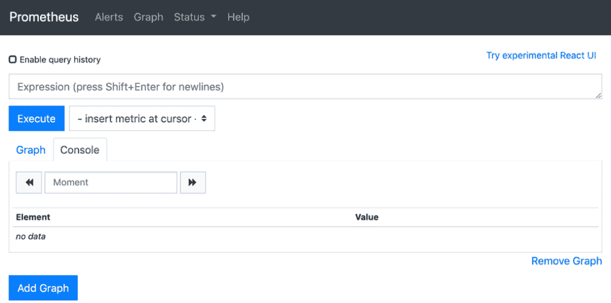

图 13.1：首次加载表达式浏览器

1.  单击“状态”下拉菜单。您将看到以下图像，其中包括有用的信息，包括“运行时和构建信息”以显示正在运行的版本的详细信息，“命令行标志”以运行应用程序，“配置”显示当前运行的`config`文件，以及用于警报规则的“规则”。下拉菜单中的最后两个选项显示“目标”，您当前正在从中获取数据的目标，以及“服务发现”，显示正在监控的自动服务：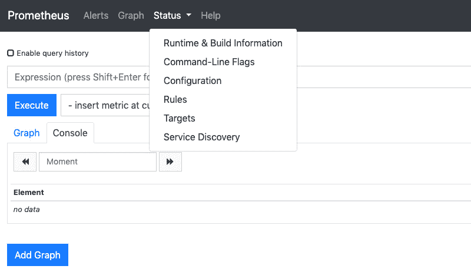

图 13.2：状态下拉菜单

1.  从“状态”菜单中选择“目标”选项，您将能够看到 Prometheus 正在从哪里抓取数据。您也可以通过转到 URL“HTTP：localhost:9090/targets”来获得相同的结果。您应该会看到类似于以下内容的屏幕截图，因为 Prometheus 目前只监视自身：

图 13.3：Prometheus 目标页面

1.  单击目标端点。您将能够看到目标公开的指标。现在您可以看到 Prometheus 如何利用其拉取架构从目标中抓取数据。单击链接或打开浏览器，输入 URL`http://localhost:9090/metrics`以查看 Prometheus 指标端点。您应该会看到类似于以下内容的内容，显示了 Prometheus 正在公开的所有指标点，然后由自身抓取：

```
# HELP go_gc_duration_seconds A summary of the GC invocation 
durations.
# TYPE go_gc_duration_seconds summary
go_gc_duration_seconds{quantile="0"} 9.268e-06
go_gc_duration_seconds{quantile="0.25"} 1.1883e-05
go_gc_duration_seconds{quantile="0.5"} 1.5802e-05
go_gc_duration_seconds{quantile="0.75"} 2.6047e-05
go_gc_duration_seconds{quantile="1"} 0.000478339
go_gc_duration_seconds_sum 0.002706392
…
```

1.  通过单击返回按钮或输入 URL`http://localhost:9090/graph`返回到表达式浏览器。单击“执行”按钮旁边的下拉列表，以查看所有可用的指标点：

图 13.4：从表达式浏览器中获得的 Prometheus 指标

1.  从下拉列表或查询编辑器中，添加`prometheus_http_requests_total`指标以查看发送到 Prometheus 应用程序的所有 HTTP 请求。您的输出可能与以下内容不同。单击“执行”按钮，然后单击“图形”选项卡以查看我们数据的可视化视图：

图 13.5：从表达式浏览器中显示的 Prometheus HTTP 请求图

如果你对我们到目前为止所取得的成就还感到有些困惑，不要担心。在短时间内，我们已经设置了 Prometheus 并开始收集数据。尽管我们只收集了 Prometheus 本身的数据，但我们已经能够演示如何快速轻松地可视化应用程序执行的 HTTP 请求。接下来的部分将向您展示如何通过对 Prometheus 配置进行小的更改，开始从 Docker 和正在运行的容器中捕获数据。

# 使用 Prometheus 监控 Docker 容器

Prometheus 监控是了解应用程序能力的好方法，但它对于帮助我们监控 Docker 和我们系统上运行的容器并没有太多帮助。幸运的是，我们有两种方法可以收集数据，以便更深入地了解我们正在运行的容器。我们可以使用 Docker 守护程序将指标暴露给 Prometheus，并且还可以安装一些额外的应用程序，比如`cAdvisor`，来收集我们系统上运行的容器的更多指标。

通过对 Docker 配置进行一些小的更改，我们能够将指标暴露给 Prometheus，以便它收集运行在我们系统上的 Docker 守护程序的特定数据。这将部分地收集指标，但不会给我们提供实际运行容器的指标。这就是我们需要安装`cAdvisor`的地方，它是由谷歌专门用来收集我们运行容器指标的。

注意

如果我们需要收集更多关于底层硬件、Docker 和我们的容器运行情况的指标，我们还可以使用`node_exporter`来收集更多的指标。我们将不会在本章中涵盖`node_exporter`，但支持文档可以在以下网址找到：

https://github.com/prometheus/node_exporter。

由于 Docker 已经在您的主机系统上运行，设置它以允许 Prometheus 连接其指标只是向`/etc/docker/daemon.json`文件添加一个配置更改。在大多数情况下，该文件很可能是空白的。如果您已经在文件中有详细信息，您只需将以下示例中的*第 2 行*和*第 3 行*添加到您的配置文件中。*第 2 行*启用了这个`experimental`功能，以便暴露给 Prometheus 收集指标，*第 3 行*设置了这些数据点要暴露的 IP 地址和端口：

```
1 {
2        "experimental": true,
3        "metrics-addr": "0.0.0.0:9191"
4 }
```

由于配置更改，您系统上的 Docker 守护程序需要重新启动才能生效。但一旦发生这种情况，您应该可以在`daemon.json`文件中添加的指定 IP 地址和端口处获得可用的指标。在上面的示例中，这将是在`http://0.0.0.0:9191`。

要安装`cAdvisor`，谷歌提供了一个易于使用的 Docker 镜像，可以从谷歌的云注册表中拉取并在您的环境中运行。

要运行`cAdvisor`，您将运行镜像，挂载所有与 Docker 守护程序和运行容器相关的目录。您还需要确保暴露度量标准将可用的端口。默认情况下，`cAdvisor`配置为在端口`8080`上公开度量标准，除非您对`cAdvisor`的基础图像进行更改，否则您将无法更改。

以下`docker run`命令在容器上挂载卷，例如`/var/lib/docker`和`/var/run`，将端口`8080`暴露给主机系统，并最终使用来自 Google 的最新`cadvisor`镜像：

```
docker run \
  --volume=<host_directory>:<container_directory> \
  --publish=8080:8080 \
  --detach=true \
  --name=cadvisor \
  gcr.io/google-containers/cadvisor:latest
```

注意

对`cAdvisor`的基础图像进行更改不是本章将涵盖的内容，但您需要参考`cAdvisor`文档并对`cAdvisor`代码进行特定更改。

`cAdvisor`镜像还将提供一个有用的 Web 界面来查看这些指标。`cAdvisor`不保存任何历史数据，因此您需要使用 Prometheus 收集数据。

一旦 Docker 守护程序和`cAdvisor`有数据可供 Prometheus 收集，我们需要确保我们有一个定期的配置，将数据添加到时间序列数据库中。应用程序目录中的`prometheus.yml`配置文件允许我们执行此操作。您只需在文件的`scrape_configs`部分添加配置。正如您从以下示例中看到的，您需要添加一个`job_name`参数，并提供指标提供位置的详细信息作为`targets`条目：

```
    - job_name: '<scrap_job_name>'
      static_configs:
      - targets: ['<ip_address>:<port>']
```

一旦目标对 Prometheus 可用，您就可以开始搜索数据。现在我们已经提供了如何开始使用 Prometheus 收集 Docker 指标的分解，以下练习将向您展示如何在运行系统上执行此操作。

## 练习 13.02：使用 Prometheus 收集 Docker 指标

在此练习中，您将配置 Prometheus 开始从我们的 Docker 守护程序收集数据。这将使您能够查看 Docker 守护程序本身特别使用了哪些资源。您还将运行`cAdvisor` Docker 镜像，以开始收集运行容器的特定指标：

1.  要开始从 Docker 守护程序收集数据，您首先需要在系统上启用此功能。首先通过文本编辑器打开`/etc/docker/daemon.json`文件，并添加以下详细信息：

```
1 {
2        "experimental": true,
3        "metrics-addr": "0.0.0.0:9191"
4 }
```

您对配置文件所做的更改将会公开 Docker 守护程序的指标，以允许 Prometheus 进行抓取和存储这些值。要启用此更改，请保存 Docker 配置文件并重新启动 Docker 守护程序。

1.  通过打开您的 Web 浏览器并使用您在配置中设置的 URL 和端口号来验证是否已经生效。输入 URL `http://0.0.0.0:9191/metrics`，您应该会看到一系列指标被公开以允许 Prometheus 进行抓取：

```
# HELP builder_builds_failed_total Number of failed image builds
# TYPE builder_builds_failed_total counter
builder_builds_failed_total{reason="build_canceled"} 0
builder_builds_failed_total{reason="build_target_not_reachable
_error"} 0
builder_builds_failed_total{reason="command_not_supported_
error"} 0
builder_builds_failed_total{reason="dockerfile_empty_error"} 0
builder_builds_failed_total{reason="dockerfile_syntax_error"} 0
builder_builds_failed_total{reason="error_processing_commands_
error"} 0
builder_builds_failed_total{reason="missing_onbuild_arguments_
error"} 0
builder_builds_failed_total{reason="unknown_instruction_error"} 0
…
```

1.  现在，您需要让 Prometheus 知道它可以在哪里找到 Docker 正在向其公开的指标。您可以通过应用程序目录中的`prometheus.yml`文件来完成这一点。不过，在这样做之前，您需要停止 Prometheus 服务的运行，以便配置文件的添加生效。打开 Prometheus 正在运行的终端并按下*Ctrl* + *C*。成功执行此操作时，您应该会看到类似以下的输出：

```
level=info ts=2020-04-28T04:49:39.435Z caller=main.go:718 
msg="Notifier manager stopped"
level=info ts=2020-04-28T04:49:39.436Z caller=main.go:730 
msg="See you next time!"
```

1.  使用文本编辑器打开应用程序目录中的`prometheus.yml`配置文件。转到文件的`scrape_configs`部分的末尾，并添加*行 21*至*34*。额外的行将告诉 Prometheus 它现在可以从已在 IP 地址`0.0.0.0`和端口`9191`上公开的 Docker 守护程序获取指标：

prometheus.yml

```
21 scrape_configs:
22   # The job name is added as a label 'job=<job_name>' to any        timeseries scraped from this config.
23   - job_name: 'prometheus'
24
25     # metrics_path defaults to '/metrics'
26     # scheme defaults to 'http'.
27 
28     static_configs:
29     - targets: ['localhost:9090']
30 
31   - job_name: 'docker_daemon'
32     static_configs:
33     - targets: ['0.0.0.0:9191']
34
```

此步骤的完整代码可以在 https://packt.live/33satLe 找到。

1.  保存您对`prometheus.yml`文件所做的更改，并按照以下方式从命令行再次启动 Prometheus 应用程序：

```
./prometheus --config.file=prometheus.yml
```

1.  如果您返回到 Prometheus 的表达式浏览器，您可以再次验证它现在已配置为从 Docker 守护程序收集数据。从`Status`菜单中选择`Targets`，或者使用 URL `http://localhost:9090/targets`，现在应该包括我们在配置文件中指定的`docker_daemon`作业：

图 13.6：带有 docker_daemon 的 Prometheus Targets

1.  通过搜索`engine_daemon_engine_cpus_cpus`来验证您是否正在收集数据。这个值应该与您的主机系统上可用的 CPU 或核心数量相同。将其输入到 Prometheus 表达式浏览器中，然后单击`Execute`按钮：

图 13.7：主机系统上可用的 docker_daemon CPU

1.  Docker 守护程序受限于其可以向 Prometheus 公开的数据量。设置`cAdvisor`镜像以收集有关正在运行的容器的详细信息。在命令行上使用以下`docker run`命令将其作为由 Google 提供的容器运行。`docker run`命令使用存储在 Google 容器注册表中的`cadvisor:latest`镜像，类似于 Docker Hub。无需登录到此注册表；镜像将自动拉到您的系统中：

```
docker run \
  --volume=/:/rootfs:ro \
  --volume=/var/run:/var/run:ro \
  --volume=/sys:/sys:ro \
  --volume=/var/lib/docker/:/var/lib/docker:ro \
  --volume=/dev/disk/:/dev/disk:ro \
  --publish=8080:8080 \
  --detach=true \
  --name=cadvisor \
  gcr.io/google-containers/cadvisor:latest
```

1.  `cAdvisor`带有一个 Web 界面，可以为您提供一些基本功能，但由于它不存储历史数据，您将收集数据并将其存储在 Prometheus 上。现在，打开另一个 Web 浏览器会话，并输入 URL `http://0.0.0.0:8080`，您应该会看到一个类似以下的网页：

图 13.8：cAdvisor 欢迎页面

1.  输入 URL `http://0.0.0.0:8080/metrics`，以查看`cAdvisor`在 Web 界面上显示的所有数据。

注意

当对 Prometheus 配置文件进行更改时，应用程序需要重新启动才能生效。在我们进行的练习中，我们一直通过停止服务来实现相同的结果。

1.  与 Docker 守护程序一样，配置 Prometheus 定期从指标端点抓取数据。停止运行 Prometheus 应用程序，并再次使用文本编辑器打开`prometheus.yml`配置文件。在配置文件底部，添加另一个`cAdvisor`的配置，具体如下：

prometheus.yml

```
35   - job_name: 'cadvisor'
36     scrape_interval: 5s
37     static_configs:
38     - targets: ['0.0.0.0:8080']
```

此步骤的完整代码可在 https://packt.live/33BuFub 找到。

1.  再次保存您的配置更改，并从命令行运行 Prometheus 应用程序，如下所示：

```
./prometheus --config.file=prometheus.yml
```

如果现在查看 Prometheus Web 界面上的`Targets`，您应该会看到类似以下的内容，显示`cAdvisor`也在我们的界面上可用：

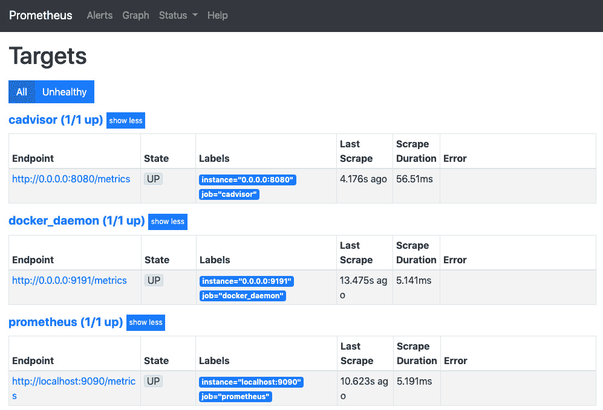

图 13.9：添加了 cAdvisor 的 Prometheus Targets 页面

1.  通过 Prometheus 的`Targets`页面显示`cAdvisor`现在可用并已连接，验证了 Prometheus 现在正在从`cAdvisor`收集指标数据。您还可以从表达式浏览器中测试这一点，以验证它是否按预期工作。通过从顶部菜单中选择`Graphs`或`Prometheus`进入表达式浏览器。页面加载后，将以下 PromQL 查询添加到查询编辑器中，然后单击`Execute`按钮：

```
(time() - process_start_time_seconds{instance="0.0.0.0:8080",job="cadvisor"})
```

注意

我们开始使用一些更高级的 PromQL 查询，可能看起来有点混乱。本章的下一部分致力于让您更好地理解 PromQL 查询语言。

查询正在使用`process_start_time_seconds`指标，特别是针对`cAdvisor`应用程序和`time()`函数来添加总秒数。您应该在表达式浏览器上看到类似以下的结果：


图 13.10：来自表达式浏览器的 cAdvisor 正常运行时间

通过这个练习，我们现在有一个正在运行的 Prometheus 实例，并且正在从 Docker 守护程序收集数据。我们还设置了`cAdvisor`，以便为我们提供有关正在运行的容器实例的更多信息。本章的下一部分将更深入地讨论 PromQL 查询语言，以帮助您更轻松地查询 Prometheus 提供的指标。

# 了解 Prometheus 查询语言

正如我们在本章的前几部分中所看到的，Prometheus 提供了自己的查询语言，称为 PromQL。它允许您搜索、查看和聚合存储在 Prometheus 数据库中的时间序列数据。本节将帮助您进一步了解查询语言。Prometheus 中有四种核心指标类型，我们将从描述每种类型开始。

## 计数器

计数器随时间计算元素；例如，这可以是您网站的访问次数。当服务或应用程序重新启动时，计数只会增加或重置。它们适用于在某个时间点计算特定事件的次数。每次计数器更改时，收集的数据中的数字也会反映出来。

计数器通常以`_total`后缀结尾。但由于计数器的性质，每次服务重新启动时，计数器将被重置为 0。使用我们查询中的`rate()`或`irate()`函数，我们将能够随时间查看我们的指标速率，并忽略计数器被重置为 0 的任何时间。`rate()`和`irate()`函数都使用方括号`[]`指定时间值，例如`[1m]`。

如果您对我们正在收集的数据中的计数器示例感兴趣，请打开`cAdvisor`的数据收集的指标页面，网址为`http://0.0.0.0:8080/metrics`。提供的第一个指标之一是`container_cpu_system_seconds_total`。如果我们浏览指标页面，我们将看到有关指标值和类型的信息如下：

```
# HELP container_cpu_system_seconds_total Cumulative system cpu time 
consumed in seconds.
# TYPE container_cpu_system_seconds_total counter
container_cpu_system_seconds_total{id="/",image="",name=""} 
195.86 1579481501131
…
```

现在，我们将研究 Prometheus 中可用的第二种指标类型，也就是仪表。

## 仪表

仪表旨在处理随时间可能减少的值，并设计用于公开某物的当前状态的任何指标。就像温度计或燃料表一样，您将能够看到当前状态值。仪表在功能上受到限制，因为可能会在时间点之间存在缺失值，因此它们比计数器不太可靠，因此计数器仍然用于数据的时间序列表示。

如果我们再次转到`cAdvisor`的指标页面，您可以看到一些指标显示为仪表。我们看到的第一个指标之一是`container_cpu_load_average_10s`，它作为一个仪表提供，类似于以下值：

```
# HELP container_cpu_load_average_10s Value of container cpu load 
average over the last 10 seconds.
# TYPE container_cpu_load_average_10s gauge
container_cpu_load_average_10s{id="/",image="",name=""} 0 
1579481501131
…
```

下一部分将带您了解直方图，Prometheus 中可用的第三种指标类型。

## 直方图

直方图比仪表和计数器复杂得多，并提供额外信息，如观察的总和。它们用于提供一组数据的分布。直方图使用抽样，可以用于在 Prometheus 服务器上估计分位数。

直方图比仪表和计数器更不常见，似乎没有为`cAdvisor`设置，但我们可以在 Docker 守护程序指标中看到一些可用的直方图。转到 URL `http://0.0.0.0:9191/metrics`，您将能够看到列出的第一个直方图指标是`engine_daemon_container_actions_seconds`。这是 Docker 守护程序处理每个操作所需的秒数：

```
# HELP engine_daemon_container_actions_seconds The number of seconds 
it takes to process each container action
# TYPE engine_daemon_container_actions_seconds histogram
engine_daemon_container_actions_seconds_bucket{action="changes",
le="0.005"} 1
…
```

接下来的部分将介绍第四种可用的指标类型，换句话说，摘要。

## 摘要

摘要是直方图的扩展，是在客户端计算的。它们具有更高的准确性优势，但对客户端来说也可能很昂贵。我们可以在 Docker 守护程序指标中看到摘要的示例，其中`http_request_duration_microseconds`在这里列出：

```
# HELP http_request_duration_microseconds The HTTP request latencies in microseconds.
# TYPE http_request_duration_microseconds summary
http_request_duration_microseconds{handler="prometheus",quantile=
"0.5"} 3861.5
…
```

现在，既然我们已经解释了 PromQL 中可用的指标类型，我们可以进一步看看这些指标如何作为查询的一部分实现。

# 执行 PromQL 查询

在表达式浏览器上运行查询很容易，但您可能并不总是能获得所需的信息。只需添加指标名称，例如`countainer_cpu_system_seconds_total`，我们就可以得到相当多的响应。不过，响应的数量取决于我们系统上的容器数量以及我们主机系统上正在运行的每个文件系统的返回值。为了限制结果中提供的响应数量，我们可以使用花括号`{}`搜索特定文本。

考虑以下示例。以下命令提供了我们希望查看的`"cadvisor"`容器的完整名称：

```
container_cpu_system_seconds_total{ name="cadvisor"}
```

以下示例使用与 GO 兼容的正则表达式。该命令查找以`ca`开头并在后面有更多字符的任何名称：

```
container_cpu_system_seconds_total{ name=~"ca.+"} 
```

以下代码片段正在搜索任何名称值不为空的容器，使用不等于（`!=`）值：

```
container_cpu_system_seconds_total{ name!=""}
```

如果我们将任何这些指标搜索放在表达式浏览器中并创建图表，您会注意到图表会随着时间线性上升。正如我们之前提到的，这是因为指标`container_cpu_system_seconds_total`是一个计数器，它只会随着时间增加或被设置为零。通过使用函数，我们可以计算更有用的时间序列数据。以下示例使用`rate()`函数来计算匹配时间序列数据的每秒速率。我们使用了`[1m]`，表示 1 分钟。数字越大，图表就会更平滑：

```
rate(container_cpu_system_seconds_total{name="cadvisor"}[1m])
```

`rate`函数只能用于计数器指标。如果我们运行了多个容器，我们可以使用`sum()`函数将所有值相加，并使用`(name)`函数按容器名称提供图表，就像我们在这里做的那样：

```
sum(rate(container_cpu_system_seconds_total[1m])) by (name)
```

注意

如果您想查看 PromQL 中所有可用函数的列表，请转到官方 Prometheus 文档提供的以下链接：

https://prometheus.io/docs/prometheus/latest/querying/functions/。

PromQL 还允许我们从查询中执行算术运算。在以下示例中，我们使用`process_start_time_seconds`指标并搜索 Prometheus 实例。我们可以从`time()`函数中减去这个时间，该函数给出了当前的日期和时间的时代时间：

```
(time() - process_start_time_seconds{instance="localhost:9090",job="prometheus"})
```

注意

时代时间是从 1970 年 1 月 1 日起的秒数，用一个数字表示；例如，1578897429 被转换为 2020 年 1 月 13 日上午 6:37（GMT）。

我们希望这个 PromQL 入门能让您更深入地了解在项目中使用查询语言。以下练习将通过具体的使用案例，进一步加强我们学到的内容，特别是监视我们正在运行的 Docker 容器。

## 练习 13.03：使用 PromQL 查询语言

在以下练习中，我们将在您的系统上引入一个新的 Docker 镜像，以帮助您演示使用 Prometheus 时特定于 Docker 的一些可用指标。这个练习将加强您到目前为止对 PromQL 查询语言的学习，通过一个具体的使用案例来收集和显示基本网站的指标数据。

1.  打开一个新的终端并创建一个名为`web-nginx`的新目录：

```
mkdir web-nginx; cd web-nginx
```

1.  在`web-nginx`目录中创建一个新文件，命名为`index.html`。用文本编辑器打开新文件，并添加以下 HTML 代码：

```
<!DOCTYPE html>
<html lang="en">
<head>
</head>
<body>
    <h1>
        Hello Prometheus
    </h1>
</body>
</html>
```

1.  用以下命令运行一个新的 Docker 容器。到目前为止，您应该已经熟悉了语法，但以下命令将拉取最新的`nginx`镜像，命名为`web-nginx`，并暴露端口`80`，以便您可以查看在上一步中创建的挂载的`index.html`文件：

```
docker run --name web-nginx --rm -v ${PWD}/index.html:/usr/share/nginx/html/index.html -p 80:80 -d nginx
```

1.  打开一个网络浏览器，访问`http://0.0.0.0`。你应该看到的唯一的东西是问候语`Hello Prometheus`：

图 13.11：示例网页

1.  如果 Prometheus 没有在您的系统上运行，请打开一个新的终端，并从 Prometheus 应用程序目录中，从命令行启动应用程序：

```
./prometheus --config.file=prometheus.yml
```

注意

在本章的这一部分，我们不会展示所有 PromQL 查询的屏幕截图，因为我们不想浪费太多空间。但是这些查询应该对我们设置的正在运行的容器和系统都是有效的。

1.  现在在 Prometheus 中可用的大部分`cAdvisor`指标将以`container`开头。使用`count()`函数与指标`container_memory_usage_bytes`，以查看当前内存使用量的字节数：

```
count(container_memory_usage_bytes)
```

上述查询提供了系统上正在运行的 28 个结果。

1.  为了限制您正在寻找的信息，可以使用花括号进行搜索，或者如下命令中所示，使用不搜索（`!=`）特定的图像名称。目前，您只有两个正在运行的容器，图像名称为`cAdvisor`和`web-nginx`。通过使用`scalar()`函数，您可以计算系统上随时间运行的容器数量。在输入以下查询后，单击`Execute`按钮：

```
scalar(count(container_memory_usage_bytes{image!=""}) > 0)
```

1.  单击`Graphs`选项卡，现在您应该有一个绘制的查询图。该图应该类似于以下图像，其中您启动了第三个图像`web-nginx`容器，以显示 Prometheus 表达式浏览器如何显示此类型的数据。请记住，您只能在图表中看到一条线，因为这是我们系统上两个容器使用的内存，而没有单独的内存使用值：

图 13.12：来自表达式浏览器的 cAdvisor 指标

1.  使用`container_start_time_seconds`指标获取容器启动的 Unix 时间戳：

```
container_start_time_seconds{name="web-nginx"}
```

您将看到类似于 1578364679 的东西，这是自纪元时间以来的秒数，即 1970 年 1 月 1 日。

1.  使用`time()`函数获取当前时间，然后从该值中减去`container_start_time_seconds`，以显示容器已运行多少秒：

```
(time() - container_start_time_seconds{name="web-nginx"})
```

1.  监视您的应用程序通过 Prometheus 的`prometheus_http_request_duration_seconds_count`指标的 HTTP 请求。使用`rate()`函数绘制每个 HTTP 请求到 Prometheus 的持续时间的图表：

```
rate(prometheus_http_request_duration_seconds_count[1m])
```

注意

使用`web-nginx`容器查看其 HTTP 请求时间和延迟将是很好的，但是该容器尚未设置为向 Prometheus 提供此信息。我们将在本章中很快解决这个问题。

1.  使用算术运算符将`prometheus_http_request_duration_seconds_sum`除以`prometheus_http_request_duration_seconds_count`，这将提供所做请求的 HTTP 延迟：

```
rate(prometheus_http_request_duration_seconds_sum[1m]) / rate(prometheus_http_request_duration_seconds_count[1m])
```

1.  使用 `container_memory_usage_bytes` 指标运行以下命令，以查看系统上每个运行容器使用的内存。在此查询中，我们使用 `sum by (name)` 命令按容器名称添加值：

```
sum by (name) (container_memory_usage_bytes{name!=""})
```

如果您执行上述查询，您将在表达式浏览器中看到图形，显示 `web-nginx` 和 `cAdvisor` 容器使用的内存：

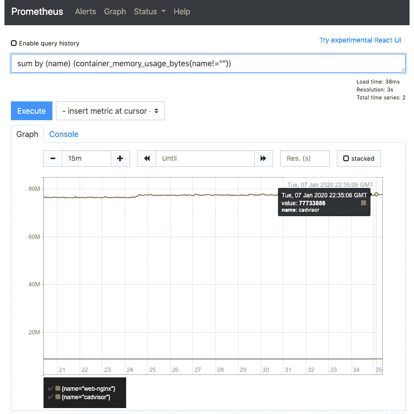

图 13.13：我们系统上运行的两个容器的内存

本节帮助您更加熟悉 `PromQL` 查询语言，并组合您的查询以开始从表达式浏览器查看指标。接下来的部分将提供有关如何开始从在 Docker 中创建的应用程序和服务收集指标的详细信息，使用出口商以一种 Prometheus 友好的方式公开数据。

# 使用 Prometheus 出口商

在本章中，我们已配置应用程序指标以提供数据供 Prometheus 抓取和收集，那么为什么我们需要担心出口商呢？正如您所见，Docker 和 `cAdvisor` 已经很好地公开了数据端点，Prometheus 可以从中收集指标。但这些功能有限。正如我们从我们的新 `web-nginx` 网站中看到的，我们的镜像上运行的网页没有相关的数据暴露出来。我们可以使用出口商来帮助从应用程序或服务中收集指标，然后以 Prometheus 能够理解和收集的方式提供数据。

尽管这可能看起来是 Prometheus 工作方式的一个主要缺陷，但由于 Prometheus 的使用增加以及它是开源的事实，供应商和第三方提供商现在提供出口商来帮助您从应用程序获取指标。

这意味着，通过安装特定库或使用预构建的 Docker 镜像来运行您的应用程序，您可以公开您的指标数据供收集。例如，我们在本章前面创建的 `web-nginx` 应用程序正在 NGINX 上运行。要获取我们的 Web 应用程序的指标，我们可以简单地在运行我们的 Web 应用程序的 NGINX 实例上安装 `ngx_stub_status_prometheus` 库。或者更好的是，我们可以找到某人已经构建好的 Docker 镜像来运行我们的 Web 应用程序。

注意

本章的这一部分重点介绍了 NGINX Exporter，但是大量应用程序的导出器可以在其支持文档或 Prometheus 文档中找到。

在下一个练习中，我们将以我们的`nginx`容器为例，并将导出器与我们的`web-nginx`容器一起使用，以公开可供 Prometheus 收集的指标。

## 练习 13.04：使用应用程序的指标导出器

到目前为止，我们已经使用`nginx`容器提供了一个基本的网页，但我们没有特定的指标可用于我们的网页。在这个练习中，您将使用一个不同的 NGINX 镜像，该镜像带有可以暴露给 Prometheus 的指标导出器。

1.  如果`web-nginx`容器仍在运行，请使用以下命令停止容器：

```
docker kill web-nginx
```

1.  在 Docker Hub 中，您有一个名为`mhowlett/ngx-stud-status-prometheus`的镜像，其中已经安装了`ngx_stub_status_prometheus`库。该库将允许您设置一个 HTTP 端点，以从您的`nginx`容器向 Prometheus 提供指标。将此镜像下载到您的工作环境中：

```
docker pull mhowlett/ngx-stub-status-prometheus
```

1.  在上一个练习中，您使用容器上的默认 NGINX 配置来运行您的 Web 应用程序。要将指标暴露给 Prometheus，您需要创建自己的配置来覆盖默认配置，并将您的指标作为可用的 HTTP 端点提供。在您的工作目录中创建一个名为`nginx.conf`的文件，并添加以下配置细节：

```
daemon off;
events {
}
http {
  server {
    listen 80;
    location / {
      index  index.html;
    }
    location /metrics {
      stub_status_prometheus;
    }
  }
}
```

上述配置将确保您的服务器仍然在端口`80`上可用*第 8 行*。*第 11 行*将确保提供您当前的`index.html`页面，*第 14 行*将设置一个子域`/metrics`，以提供`ngx_stub_status_prometheus`库中可用的详细信息。

1.  提供`index.html`文件的挂载点，以启动`web-nginx`容器并使用以下命令挂载您在上一步中创建的`nginx.conf`配置：

```
docker run --name web-nginx --rm -v ${PWD}/index.html:/usr/html/index.html -v ${PWD}/nginx.conf:/etc/nginx/nginx.conf -p 80:80 -d mhowlett/ngx-stub-status-prometheus
```

1.  您的`web-nginx`应用程序应该再次运行，并且您应该能够从 Web 浏览器中看到它。输入 URL `http://0.0.0.0/metrics`以查看指标端点。您的 Web 浏览器窗口中的结果应该类似于以下信息：

```
# HELP nginx_active_connections_current Current number of 
active connections
# TYPE nginx_active_connections_current gauge
nginx_active_connections_current 2
# HELP nginx_connections_current Number of connections currently 
being processed by nginx
# TYPE nginx_connections_current gauge
nginx_connections_current{state="reading"} 0
nginx_connections_current{state="writing"} 1
nginx_connections_current{state="waiting"} 1
…
```

1.  您仍然需要让 Prometheus 知道它需要从新的端点收集数据。因此，停止 Prometheus 的运行。再次进入应用程序目录，并使用您的文本编辑器，在`prometheus.yml`配置文件的末尾添加以下目标：

prometheus.yml

```
40   - job_name: 'web-nginx'
41     scrape_interval: 5s
42     static_configs:
43     - targets: ['0.0.0.0:80']
```

此步骤的完整代码可在 https://packt.live/3hzbQgj 找到。

1.  保存配置更改，并重新启动 Prometheus 的运行：

```
./prometheus --config.file=prometheus.yml
```

1.  确认 Prometheus 是否配置为从您刚刚创建的新指标端点收集数据。打开您的网络浏览器，输入 URL `http://0.0.0.0:9090/targets`：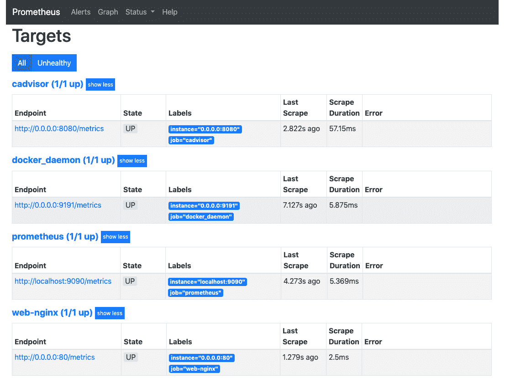

图 13.14：显示 web-nginx 的目标页面

在这个练习中，您学会了向在您的环境中运行的应用程序添加导出器。我们首先扩展了我们之前的`web-nginx`应用程序，以允许它显示多个 HTTP 端点。然后，我们使用了一个包含了`ngx_stub_status_prometheus`库的 Docker 镜像，以便我们能够显示我们的`web-nginx`统计信息。然后，我们配置了 Prometheus 以从提供的端点收集这些详细信息。

在接下来的部分，我们将设置 Grafana，以便我们能够更仔细地查看我们的数据，并为我们正在收集的数据提供用户友好的仪表板。

# 使用 Grafana 扩展 Prometheus

Prometheus web 界面提供了一个功能表达式浏览器，允许我们在有限的安装中搜索和查看我们的时间序列数据库中的数据。它提供了一个图形界面，但不允许我们保存任何搜索或可视化。Prometheus web 界面也有限，因为它不能在仪表板中分组查询。而且，界面提供的可视化并不多。这就是我们可以通过使用 Grafana 等应用程序进一步扩展我们收集的数据的地方。

Grafana 允许我们直接连接到 Prometheus 时间序列数据库，并执行查询并创建视觉上吸引人的仪表板。Grafana 可以作为一个独立的应用程序在服务器上运行。我们可以预先配置 Grafana Docker 镜像，部署到我们的系统上，并配置到我们的 Prometheus 数据库的连接，并设置一个基本的仪表板来监视我们正在运行的容器。

当您第一次登录 Grafana 时，会显示下面的屏幕，Grafana 主页仪表板。您可以通过点击屏幕左上角的 Grafana 图标来返回到这个页面。这是主要的工作区，您可以在这里开始构建仪表板，配置您的环境，并添加用户插件：

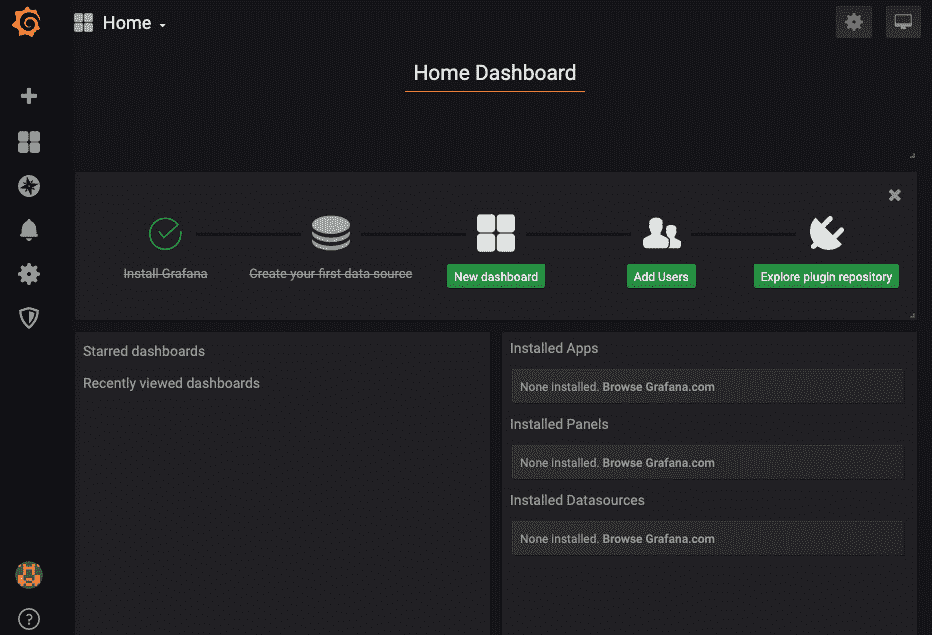

图 13.15：Grafana 主页仪表板

屏幕左侧是一个方便的菜单，可以帮助您进一步配置 Grafana。加号符号将允许您向安装中添加新的仪表板和数据源，而仪表板图标（四个方块）将所有仪表板组织到一个区域进行搜索和查看。在仪表板图标下面是探索按钮，它提供一个表达式浏览器，就像 Prometheus 一样，以便运行 PromQL 查询，而警报图标（铃铛）将带您到窗口，您可以在其中配置在不同事件发生后触发警报。配置图标将带您到屏幕，您可以在其中配置 Grafana 的操作方式，而服务器管理员图标允许您管理谁可以访问您的 Grafana Web 界面以及他们可以拥有什么权限。

在下一个练习中安装 Grafana 时，随意探索界面，但我们将努力尽可能自动化这个过程，以避免对您的工作环境进行任何更改。

## 练习 13.05：在您的系统上安装和运行 Grafana

在这个练习中，您将在您的系统上设置 Grafana，并允许应用程序开始使用您在 Prometheus 数据库中存储的数据。您将使用 Grafana 的 Docker 镜像安装 Grafana，提供界面的简要说明，并开始设置基本的仪表板：

1.  如果 Prometheus 没有运行，请重新启动。另外，请确保您的容器、`cAdvisor`和测试 NGINX 服务器（`web-nginx`）正在运行：

```
./prometheus --config.file=prometheus.yml
```

1.  打开您系统的`/etc/hosts`文件，并将一个域名添加到主机 IP`127.0.0.1`。不幸的是，您将无法使用您一直用来访问 Prometheus 的 localhost IP 地址来自动为 Grafana 配置数据源。诸如`127.0.0.1`、`0.0.0.0`或使用 localhost 的 IP 地址将不被识别为 Grafana 的数据源。根据您的系统，您可能已经添加了许多不同的条目到`hosts`文件中。通常您将会在最前面的 IP 地址列表中有`127.0.0.1`的 IP 地址，它将引用`localhost`域并将`prometheus`修改为这一行，就像我们在以下输出中所做的那样：

```
1 127.0.0.1       localhost prometheus
```

1.  保存`hosts`文件。打开您的网络浏览器并输入 URL`http://prometheus:9090`。Prometheus 表达式浏览器现在应该显示出来。您不再需要提供系统 IP 地址。

1.  要自动配置您的 Grafana 镜像，您需要从主机系统挂载一个`provisioning`目录。创建一个 provisioning 目录，并确保该目录包括额外的目录`dashboards`、`datasources`、`plugins`和`notifiers`，就像以下命令中所示：

```
mkdir -p provisioning/dashboards provisioning/datasources provisioning/plugins provisioning/notifiers
```

1.  在`provisioning/datasources`目录中创建一个名为`automatic_data.yml`的文件。用文本编辑器打开文件并输入以下细节，告诉 Grafana 它将使用哪些数据来提供仪表板和可视化效果。以下细节只是命名数据源，提供数据类型以及数据的位置。在这种情况下，这是您的新 Prometheus 域名：

```
apiVersion: 1
datasources:
- name: Prometheus
  type: prometheus
  url: http://prometheus:9090
  access: direct
```

1.  现在，在`provisioning/dashboards`目录中创建一个名为`automatic_dashboard.yml`的文件。用文本编辑器打开文件并添加以下细节。这只是提供了未来仪表板可以在启动时存储的位置：

```
apiVersion: 1
providers:
- name: 'Prometheus'
  orgId: 1
  folder: ''
  type: file
  disableDeletion: false
  editable: true
  options:
    path: /etc/grafana/provisioning/dashboards
```

您已经做了足够的工作来启动我们的 Grafana Docker 镜像。您正在使用提供的受支持的 Grafana 镜像`grafana/grafana`。

注意

我们目前没有任何代码可以添加为仪表板，但在接下来的步骤中，您将创建一个基本的仪表板，稍后将自动配置。如果您愿意，您也可以搜索互联网上 Grafana 用户创建的现有仪表板，并代替它们进行配置。

1.  运行以下命令以拉取并启动 Grafana 镜像。它使用`-v`选项将您的配置目录挂载到 Docker 镜像上的`/etc/grafana/provisioning`目录。它还使用`-e`选项，使用`GF_SECURITY_ADMIN_PASSWORD`环境变量将管理密码设置为`secret`，这意味着您不需要每次登录到新启动的容器时重置管理密码。最后，您还使用`-p`将您的镜像端口`3000`暴露到我们系统的端口`3000`：

```
docker run --rm -d --name grafana -p 3000:3000 -e "GF_SECURITY_ADMIN_PASSWORD=secret" -v ${PWD}/provisioning:/etc/grafana/provisioning grafana/grafana
```

注意

虽然使用 Grafana Docker 镜像很方便，但每次镜像重新启动时，您将丢失所有更改和仪表板。这就是为什么我们将在演示如何同时使用 Grafana 的同时进行安装配置。 

1.  您已经在端口`3000`上启动了镜像，因此现在应该能够打开 Web 浏览器。在您的 Web 浏览器中输入 URL`http://0.0.0.0:3000`。它应该显示 Grafana 的欢迎页面。要登录到应用程序，请使用具有用户名`admin`和我们指定为`GF_SECURITY_ADMIN_PASSWORD`环境变量的密码的默认管理员帐户：

图 13.16：Grafana 登录屏幕

1.  登录后，您将看到 Grafana 主页仪表板。单击屏幕左侧的加号符号，然后选择“仪表板”以添加新的仪表板：

图 13.17：Grafana 欢迎屏幕

注意

您的 Grafana 界面很可能显示为深色默认主题。我们已将我们的更改为浅色主题以便阅读。要在您自己的 Grafana 应用程序上更改此首选项，您可以单击屏幕左下角的用户图标，选择“首选项”，然后搜索“UI 主题”。

1.  单击“添加新面板”按钮。

1.  要使用`Prometheus`数据添加新查询，请从下拉列表中选择`Prometheus`作为数据源：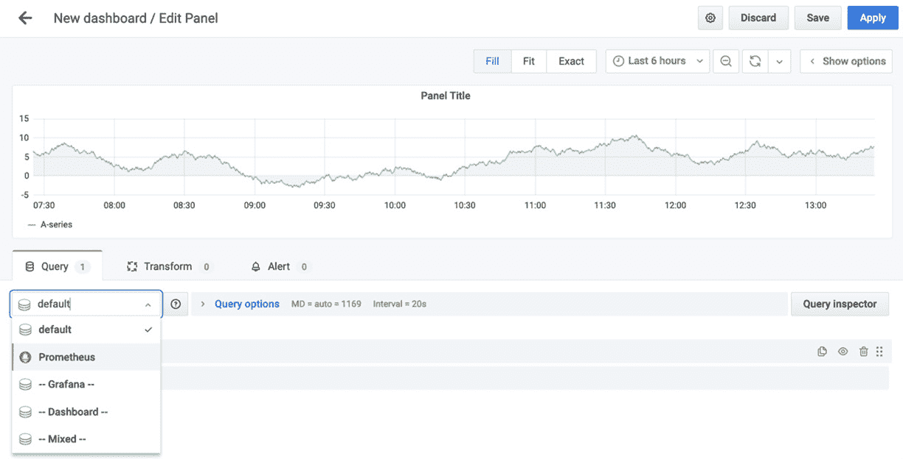

图 13.18：在 Grafana 中创建我们的第一个仪表板

1.  在指标部分，添加 PromQL 查询`sum (rate (container_cpu_usage_seconds_total{image!=""}[1m])) by (name)`。该查询将提供系统上所有正在运行的容器的详细信息。它还将随时间提供每个容器的 CPU 使用情况。根据您拥有的数据量，您可能希望在`查询选项`下拉菜单中将`相对时间`设置为`15m`。

此示例使用`15m`来确保您有足够的数据用于图表，但是此时间范围可以设置为您希望的任何值：


图 13.19：添加仪表板指标

1.  选择`显示选项`按钮以向仪表板面板添加标题。在下图中，面板的标题设置为`CPU Container Usage`：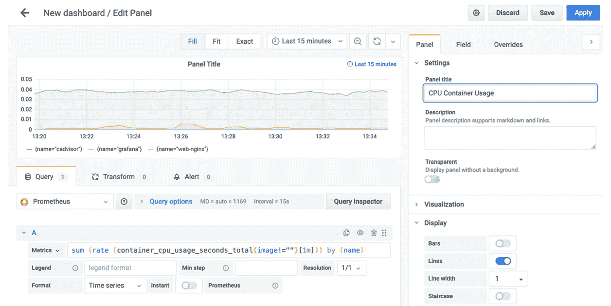

图 13.20：添加仪表板标题

1.  单击屏幕顶部的保存图标。这将为您提供命名仪表板的选项—在这种情况下为`Container Monitoring`。单击`保存`后，您将被带到已完成的仪表板屏幕，类似于这里的屏幕：

图 13.21：仪表板屏幕

1.  在仪表板屏幕顶部，在保存图标的左侧，您将有选项以`JSON`格式导出您的仪表板。如果这样做，您可以使用此`JSON`文件添加到您的配置目录中。当您运行时，它将帮助您将仪表板安装到 Grafana 映像中。选择`导出`并将文件保存到`/tmp`目录，文件名将默认为类似于仪表板名称和时间戳数据的内容。在此示例中，它将`JSON`文件保存为`Container Monitoring-1579130313205.json`。还要确保未打开`用于外部共享的导出`选项，如下图所示：

图 13.22：将您的仪表板导出为 JSON

1.  要将仪表板添加到您的配置文件中，您需要首先停止运行 Grafana 映像。使用以下`docker kill`命令执行此操作：

```
docker kill grafana
```

1.  将您在*步骤 15*中保存的仪表板文件添加到`provisioning/dashboards`目录，并将文件命名为`ContainerMonitoring.json`作为复制的一部分，如下命令所示：

```
cp /tmp/ContainerMonitoring-1579130313205.json provisioning/dashboards/ContainerMonitoring.json
```

1.  重新启动 Grafana 映像，并使用默认管理密码登录应用程序：

```
docker run --rm -d --name grafana -p 3000:3000 -e "GF_SECURITY_ADMIN_PASSWORD=secret" -v ${PWD}/provisioning:/etc/grafana/provisioning grafana/grafana
```

注意

通过这种方式预配仪表板和数据源，这意味着您将无法再从 Grafana Web 界面创建仪表板。从现在开始，当您创建仪表板时，您将被要求将仪表板保存为 JSON 文件，就像我们在导出仪表板时所做的那样。

1.  现在登录主页仪表板。您应该会看到`Container Monitoring`仪表板作为最近访问的仪表板可用，但如果您点击屏幕顶部的主页图标，它也会显示在您的 Grafana 安装的`General`文件夹中可用：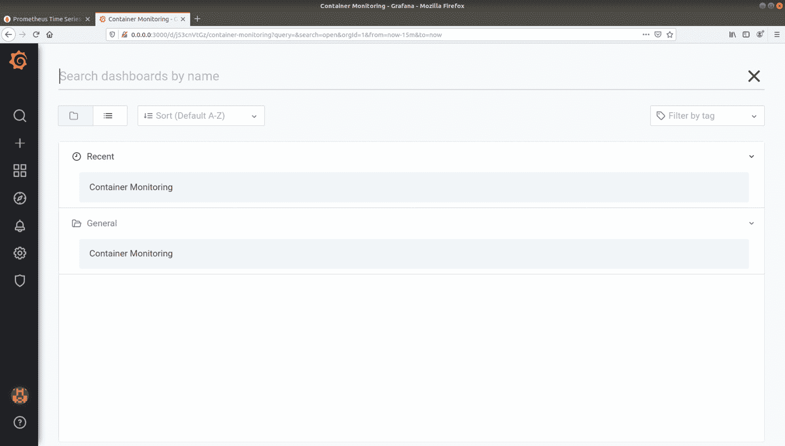

图 13.23：可用和预配的容器监控仪表板

我们现在已经设置了一个完全功能的仪表板，当我们运行 Grafana Docker 镜像时会自动加载。正如你所看到的，Grafana 提供了一个专业的用户界面，帮助我们监视正在运行的容器的资源使用情况。

这就是我们本节的结束，我们向您展示了如何使用 Prometheus 收集指标，以帮助监视您的容器应用程序的运行情况。接下来的活动将使用您在之前章节中学到的知识，进一步扩展您的安装和监控。

## 活动 13.01：创建一个 Grafana 仪表板来监视系统内存

在以前的练习中，您已经设置了一个快速仪表板，以监视我们的 Docker 容器使用的系统 CPU。正如您在上一章中所看到的，监视正在运行的容器使用的系统内存也很重要。在这个活动中，您被要求创建一个 Grafana 仪表板，用于监视正在运行的容器使用的系统内存，并将其添加到我们的`Container Monitoring`仪表板中，确保在启动我们的 Grafana 镜像时可以预配：

您需要完成此活动的步骤如下：

1.  确保您的环境正在被 Prometheus 监视，并且 Grafana 已安装在您的系统上。确保您使用 Grafana 在 Prometheus 上存储的时间序列数据上进行搜索。

1.  创建一个 PromQL 查询，监视正在运行的 Docker 容器使用的容器内存。

1.  保存您的`Container Monitoring`仪表板上的新仪表板面板。

1.  确保新的改进后的`Container Monitoring`仪表板现在在启动 Grafana 容器时可用和预配。

**预期输出**：

当您启动 Grafana 容器时，您应该在仪表板顶部看到新创建的`内存容器使用情况`面板：

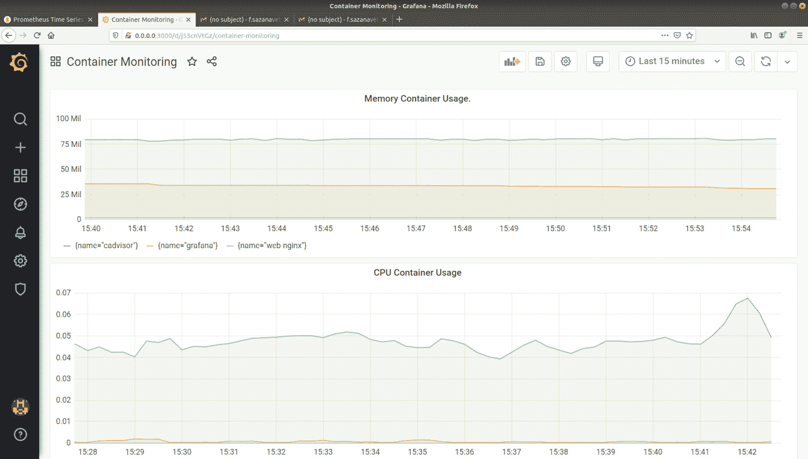

图 13.24：显示内存使用情况的新仪表板面板

注意

此活动的解决方案可以通过此链接找到。

下一个活动将确保您能够舒适地使用导出器，并向 Prometheus 添加新的目标，以开始跟踪全景徒步应用程序中的额外指标。

## 活动 13.02：配置全景徒步应用程序以向 Prometheus 暴露指标

您的指标监控环境开始看起来相当不错，但是全景徒步应用程序中有一些应用可能会提供额外的细节和指标供监控，例如在您的数据库上运行的 PostgreSQL 应用程序。选择全景徒步应用程序中的一个应用程序，将其指标暴露给您的 Prometheus 环境：

您需要完成此活动的步骤如下：

1.  确保 Prometheus 正在您的系统上运行并收集指标。

1.  选择作为全景徒步应用程序一部分运行的服务或应用程序，并研究如何暴露指标以供 Prometheus 收集。

1.  将更改实施到您的应用程序或服务中。

1.  测试您的更改，并验证指标是否可供收集。

1.  配置 Prometheus 上的新目标以收集新的全景徒步应用程序指标。

1.  验证您能够在 Prometheus 上查询您的新指标。

成功完成活动后，您应该在 Prometheus 的`Targets`页面上看到`postgres-web`目标显示：

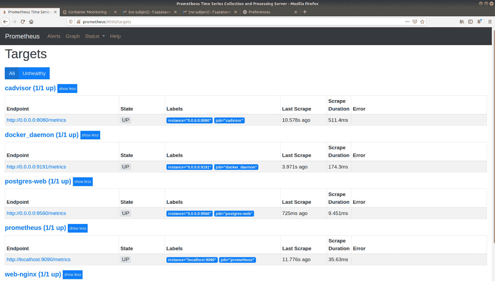

图 13.25：在 Prometheus 上显示的新 postgres-web 目标页面

注意

此活动的解决方案可以通过此链接找到。

# 总结

在本章中，我们深入研究了度量标准和监控我们的容器应用程序和服务。我们从讨论为什么您需要在度量监控上制定清晰的策略以及为什么您需要在项目开始开发之前做出许多决策开始。然后，我们介绍了 Prometheus，并概述了其历史、工作原理以及为什么它在很短的时间内就变得非常流行。然后是重新开始工作的时候，我们将 Prometheus 安装到我们的系统上，熟悉使用 Web 界面，开始从 Docker 收集度量标准（进行了一些小的更改），并使用`cAdvisor`收集正在运行的容器的度量标准。

Prometheus 使用的查询语言有时可能会有点令人困惑，因此我们花了一些时间来探索 PromQL，然后再看看如何使用导出器来收集更多的度量标准。我们在本章结束时将 Grafana 集成到我们的环境中，显示来自 Prometheus 的时间序列数据，并创建有用的仪表板和可视化数据。

我们的下一章将继续监控主题，收集和监控我们正在运行的容器的日志数据。
