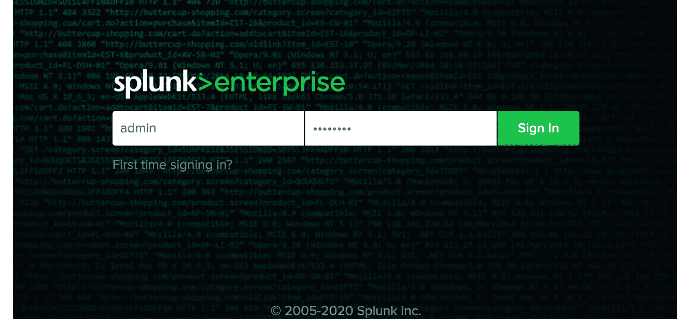
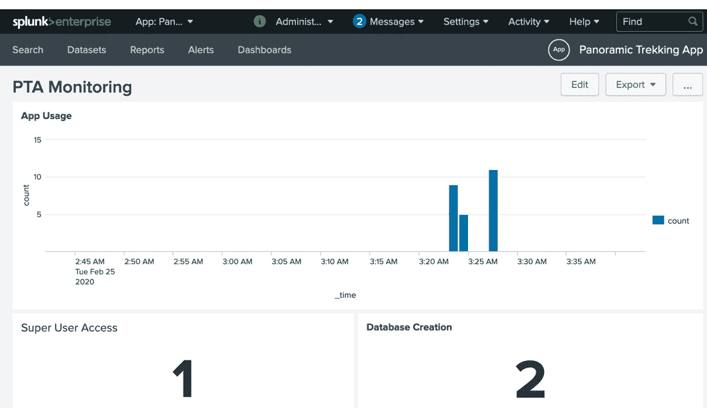

# 第十四章：收集容器日志

概述

在上一章中，我们确保为我们运行的 Docker 容器和服务收集了指标数据。本章将在此基础上，致力于收集和监控 Docker 容器和其中运行的应用程序的日志。它将从讨论为什么我们需要为我们的开发项目建立清晰的日志监控策略开始，并讨论我们需要记住的一些事情。然后，我们将介绍我们日志监控策略中的主要角色 - 即 Splunk - 以收集、可视化和监控我们的日志。我们将安装 Splunk，从我们的系统和运行的容器中转发日志数据，并使用 Splunk 查询语言设置与我们收集的日志数据配合工作的监控仪表板。通过本章的学习，您将具备为您的 Docker 容器项目建立集中式日志监控服务的技能。

# 介绍

每当我们的运行应用程序或服务出现问题时，我们通常首先在应用程序日志中寻找线索，以了解问题的原因。因此，了解如何收集日志并监控项目的日志事件变得非常重要。

随着我们实施基于 Docker 的微服务架构，确保我们能够查看应用程序和容器生成的日志变得更加重要。随着容器和服务数量的增加，尝试单独访问每个运行的容器作为故障排除的手段变得越来越不方便。对于可伸缩的应用程序，根据需求进行伸缩，跨多个容器跟踪日志错误可能变得越来越困难。

确保我们有一个合适的日志监控策略将有助于我们排除应用程序故障，并确保我们的服务以最佳效率运行。这也将帮助我们减少在日志中搜索所花费的时间。

在为您的项目构建日志监控策略时，有一些事情您需要考虑：

+   您的应用程序将使用一个框架来处理日志。有时，这可能会对容器造成负担，因此请确保测试您的容器，以确保它们能够在不出现与此日志框架相关的任何问题的情况下运行。

+   容器是瞬时的，因此每次关闭容器时日志都会丢失。您必须将日志转发到日志服务或将日志存储在数据卷中，以确保您可以解决可能出现的任何问题。

+   Docker 包含一个日志驱动程序，用于将日志事件转发到主机上运行的 Syslog 实例。除非您使用 Docker 的企业版，否则如果您使用特定的日志驱动程序，`log`命令将无法使用（尽管对于 JSON 格式的日志可以使用）。

+   日志聚合应用通常会根据其所摄取的数据量向您收费。而且，如果您在环境中部署了一个服务，您还需要考虑存储需求，特别是您计划保留日志的时间有多长。

+   您需要考虑您的开发环境与生产环境的运行方式。例如，在开发环境中没有必要长时间保留日志，但生产环境可能要求您保留一段时间。

+   您可能不仅需要应用程序数据。您可能需要收集应用程序的日志，应用程序运行的容器以及应用程序和容器都在运行的基础主机和操作系统的日志。

我们可以在日志监控策略中使用许多应用程序，包括 Splunk、Sumo Logic、Nagios Logs、Data Dog 和 Elasticsearch。在本章中，我们决定使用 Splunk 作为我们的日志监控应用程序。它是最古老的应用程序之一，拥有庞大的支持和文档社区。在处理数据和创建可视化方面也是最好的。

在接下来的章节中，您将看到如何轻松地启动、运行和配置应用程序，以便开始监控系统日志和我们的容器应用程序。

# 介绍 Splunk

在 Docker 的普及之前很久，Splunk 于 2003 年成立，旨在帮助公司从不断增长的应用和服务提供的大量数据中发现一些模式和信息。Splunk 是一款软件应用，允许您从应用程序和硬件系统中收集日志和数据。然后，它让您分析和可视化您收集的数据，通常在一个中央位置。

Splunk 允许您以不同的格式输入数据，在许多情况下，Splunk 将能够识别数据所在的格式。然后，您可以使用这些数据来帮助排除应用程序故障，创建监控仪表板，并在特定事件发生时创建警报。

注意

在本章中，我们只会触及 Splunk 的一部分功能，但如果您感兴趣，有许多宝贵的资源可以向您展示如何从数据中获得运营智能，甚至使用 Splunk 创建机器学习和预测智能模型。

Splunk 提供了许多不同的产品来满足您的需求，包括 Splunk Cloud，适用于希望选择云日志监控解决方案的用户和公司。

对于我们的日志监控策略，我们将使用 Splunk Enterprise。它易于安装，并带有大量功能。在使用 Splunk 时，您可能已经知道许可成本是按您发送到 Splunk 的日志数据量收费，然后对其进行索引。Splunk Enterprise 允许您在试用期内每天索引高达 500 MB 的数据。60 天后，您可以选择升级许可证，或者继续使用免费许可证，该许可证将继续允许您每天记录 500 MB 的数据。用户可以申请开发者许可证，该许可证允许用户每天记录 10 GB 的数据。

要开始使用 Splunk，我们首先需要了解其基本架构。这将在下一节中讨论。

## Splunk 安装的基本架构

通过讨论 Splunk 的架构，您将了解每个部分的工作原理，并熟悉我们在本章中将使用的一些术语：

+   **索引器**：对于较大的 Splunk 安装，建议您设置专用和复制的索引器作为环境的一部分。索引器的作用是索引您的数据 - 也就是说，组织您发送到 Splunk 的日志数据。它还添加元数据和额外信息，以帮助加快搜索过程。然后索引器将存储您的日志数据，这些数据已准备好供搜索头使用和查询。

+   **搜索头**：这是主要的 Web 界面，您可以在其中执行搜索查询和管理您的 Splunk 安装。搜索头将与索引器连接，以查询已收集和存储在它们上面的数据。在较大的安装中，您甚至可能有多个搜索头，以允许更多的查询和报告进行。

+   **数据转发器**：通常安装在您希望收集日志的系统上。它是一个小型应用程序，配置为在您的系统上收集日志，然后将数据推送到您的 Splunk 索引器。

在接下来的部分中，我们将使用官方的 Splunk Docker 镜像，在活动容器上同时运行搜索头和索引器。我们将继续在 Splunk 环境中使用 Docker，因为它还提供了索引器和数据转发器作为受支持的 Docker 镜像。这使您可以在继续安装之前测试和沙盒化安装。

注意

请注意，我们使用 Splunk Docker 镜像是为了简单起见。如果需要，它将允许我们移除应用程序。如果您更喜欢这个选项，安装应用程序并在您的系统上运行它是简单而直接的。

Splunk 的另一个重要特性是，它包括由 Splunk 和其他第三方提供者提供的大型应用程序生态系统。这些应用程序通常是为了帮助用户监视将日志转发到 Splunk 的服务而创建的，然后在搜索头上安装第三方应用程序。这将为这些日志提供专门的仪表板和监控工具。例如，您可以将日志从思科设备转发，然后安装思科提供的 Splunk 应用程序，以便在开始索引数据后立即开始监视您的思科设备。您可以创建自己的 Splunk 应用程序，但要使其列为官方提供的应用程序，它需要经过 Splunk 的认证。

注意

有关可用的免费和付费 Splunk 应用程序的完整列表，Splunk 已设置他们的 SplunkBase，允许用户从以下网址搜索并下载可用的应用程序：[`splunkbase.splunk.com/apps/`](https://splunkbase.splunk.com/apps/)。

这是对 Splunk 的快速介绍，应该帮助您了解接下来我们将要做的一些工作。然而，让您熟悉 Splunk 的最佳方法是在您的系统上运行容器，这样您就可以开始使用它了。

# 在 Docker 上安装和运行 Splunk

作为本章的一部分，我们将使用官方的 Splunk Docker 镜像在我们的系统上安装它。尽管直接在主机系统上安装 Splunk 并不是一个困难的过程，但将 Splunk 安装为容器镜像将有助于扩展我们对 Docker 的知识，并进一步提升我们的技能。

我们的 Splunk 安装将在同一个容器上同时运行搜索头和索引器，因为我们将监控的数据量很小。然而，如果您要在多个用户访问数据的生产环境中使用 Splunk，您可能需要考虑安装专用的索引器，以及一个或多个专用的搜索头。

注意

在本章中，我们将使用 Splunk Enterprise 版本 8.0.2。本章中将进行的大部分工作不会太高级，因此应该与将来的 Splunk 版本兼容。

在我们开始使用 Splunk 之前，让我们先了解一下 Splunk 应用程序使用的三个主要目录。虽然我们只会执行基本的配置和更改，但以下细节将有助于理解应用程序中的目录是如何组织的，并且会帮助您进行 Docker 容器设置。

在主要的 Splunk 应用程序目录中，通常安装为`/opt/splunk/`，您将看到这里解释的三个主要目录：

+   **etc 目录**：这是我们 Splunk 安装的所有配置信息所在的地方。我们将创建一个目录，并将 etc 目录挂载为我们运行的容器的一部分，以确保我们对配置所做的任何更改都得以保留，当我们关闭应用程序时不会被销毁。这将包括用户访问、软件设置和保存的搜索、仪表板以及 Splunk 应用程序。

+   **bin 目录**：这是存储所有 Splunk 应用程序和二进制文件的地方。在这一点上，您不需要访问此目录或更改此目录中的文件，但这可能是您需要进一步调查的内容。

+   **var 目录**：Splunk 的索引数据和应用程序日志存储在这个目录中。当我们开始使用 Splunk 时，我们不会费心保留我们存储在 var 目录中的数据。但是当我们解决了部署中的所有问题后，我们将挂载 var 目录以保留我们的索引数据，并确保我们可以继续对其进行搜索，即使我们的 Splunk 容器停止运行。

注意

要下载本章中使用的一些应用程序和内容，您需要在[splunk.com](http://splunk.com)上注册一个帐户以获取访问权限。注册时无需购买任何东西或提供信用卡详细信息，这只是 Splunk 用来跟踪谁在使用他们的应用程序的手段。

要运行我们的 Splunk 容器，我们将从 Docker Hub 拉取官方镜像，然后运行类似以下的命令：

```
docker run --rm -d -p <port:port> -e "SPLUNK_START_ARGS=--accept-license" -e "SPLUNK_PASSWORD=<admin-password>" splunk/splunk:latest
```

正如您从前面的命令中所看到的，我们需要暴露所需的相关端口，以便访问安装的不同部分。您还会注意到，我们需要指定两个环境变量作为运行容器的一部分。第一个是`SPLUNK_START_ARGS`，我们将其设置为`--accept-license`，这是您在安装 Splunk 时通常会接受的许可证。其次，我们需要为`SPLUNK_PASSWORD`环境变量提供一个值。这是管理员帐户使用的密码，也是您首次登录 Splunk 时将使用的帐户。

我们已经提供了大量的理论知识，为本章的下一部分做好准备。现在是时候将这些理论付诸实践，让我们的 Splunk 安装运行起来，这样我们就可以开始从主机系统收集日志。在接下来的练习中，我们将在运行的主机系统上安装 Splunk 数据转发器，以便收集日志并转发到我们的 Splunk 索引器。

注意

请使用`touch`命令创建文件，并使用`vim`命令在文件上使用 vim 编辑器进行操作。

## 练习 14.01：运行 Splunk 容器并开始收集数据

在这个练习中，您将使用 Docker Hub 上提供的官方 Splunk Docker 镜像来运行 Splunk。您将进行一些基本的配置更改，以帮助管理用户访问镜像上的应用程序，然后您将在系统上安装一个转发器，以便开始在 Splunk 安装中消耗日志：

1.  创建一个名为`chapter14`的新目录：

```
mkdir chapter14; cd chapter14/
```

1.  使用`docker pull`命令从 Docker Hub 拉取由 Splunk 创建的最新支持的镜像。仓库简单地列为`splunk/splunk`：

```
docker pull splunk/splunk:latest
```

1.  使用`docker run`命令在您的系统上运行 Splunk 镜像。使用`--rm`选项确保容器在被杀死时完全被移除，使用`-d`选项将容器作为守护进程在系统后台运行，使用`-p`选项在主机上暴露端口`8000`，以便您可以在 Web 浏览器上查看应用程序。最后，使用`-e`选项在启动容器时向系统提供环境变量：

```
docker run --rm -d -p 8000:8000 -e "SPLUNK_START_ARGS=--accept-license" -e "SPLUNK_PASSWORD=changeme" --name splunk splunk/splunk:latest
```

在上述命令中，您正在为 Web 界面暴露端口`8000`，使用一个环境变量接受 Splunk 许可，并将管理密码设置为`changeme`。该命令还以`-d`作为守护进程在后台运行。

1.  Splunk 将需要 1 到 2 分钟来启动。使用`docker logs`命令来查看应用程序的进展情况：

```
docker logs splunk
```

当您看到类似以下内容的行显示`Ansible playbook complete`时，您应该准备好登录了：

```
…
Ansible playbook complete, will begin streaming 
```

1.  输入 URL `http://0.0.0.0:8000` 来访问我们的 Splunk 安装的 Web 界面。您应该会看到类似以下的内容。要登录，请使用`admin`作为用户名，并使用在运行镜像时设置的`SPLUNK_PASSWORD`环境变量作为密码。在这种情况下，您将使用`changeme`：

图 14.1：Splunk Web 登录页面

登录后，您将看到 Splunk 主屏幕，它应该看起来类似于以下内容。主屏幕分为不同的部分，如下所述：


图 14.2：Splunk 欢迎屏幕

主屏幕可以分为以下几个部分：

- **Splunk>**：这是屏幕左上角的图标。如果您简单地点击该图标，它将随时带您回到主屏幕。

- **应用程序菜单**：这在屏幕的左侧，允许您安装和配置 Splunk 应用程序。

- **菜单栏**：它位于屏幕顶部，包含不同的选项，取决于您在帐户中拥有的特权级别。由于您已经以管理员帐户登录，您可以获得完整的选项范围。这使我们能够配置和管理 Splunk 的运行和管理方式。菜单栏中的主要配置选项是“设置”。它提供了一个大的下拉列表，让您控制 Splunk 运行的大部分方面。

- **主工作区**：主工作区填充了页面的其余部分，您可以在这里开始搜索数据，设置仪表板，并开始可视化数据。您可以设置一个主仪表板，这样每次登录或单击“Splunk>`图标时，您也会看到此仪表板。我们将在本章后面设置主仪表板，以向您展示如何操作。

1.  您可以开始对我们的 Splunk 配置进行更改，但如果容器因某种原因停止运行，所有更改都将丢失。相反，创建一个目录，您可以在其中存储所有 Splunk 环境所需的相关配置信息。使用以下命令停止当前正在运行的 Splunk 服务器：

```
docker kill splunk
```

1.  创建一个可以挂载到 Splunk 主机上的目录。为此目的命名为`testSplunk`：

```
mkdir -p ${PWD}/testsplunk
```

1.  再次运行 Splunk 容器，这次使用`-v`选项将您在上一步创建的目录挂载到容器上的`/opt/splunk/etc`目录。暴露额外的端口`9997`，以便稍后将数据转发到我们的 Splunk 安装中。

```
docker run --rm -d -p 8000:8000 -p 9997:9997 -e 'SPLUNK_START_ARGS=--accept-license' -e 'SPLUNK_PASSWORD=changeme' -v ${PWD}/testsplunk:/opt/splunk/etc/ --name splunk splunk/splunk
```

1.  一旦 Splunk 再次启动，以管理员帐户重新登录到 Splunk Web 界面。

1.  向系统添加一个新用户，以确保通过屏幕顶部的“设置”菜单将相关配置详细信息保存在您的挂载目录中。单击“设置”菜单：

图 14.3：Splunk 设置菜单

1.  打开“设置”菜单，移动到底部部分，然后在“用户和身份验证”部分中单击“用户”。您应该看到已在 Splunk 安装中创建的所有用户的列表。目前只有管理员帐户会列在其中。要创建新用户，请单击屏幕顶部的“新用户”按钮。

1.  您将看到一个网页表单，您可以在其中添加新用户帐户的详细信息。填写新用户的详细信息。一旦您对添加的详细信息感到满意，点击屏幕底部的“保存”按钮：

图 14.4：在 Splunk 上创建新用户

1.  为了确保您现在将这些数据保存在您的挂载目录中，请返回到您的终端，查看新用户是否存储在您的挂载目录中。只需使用以下命令列出`testsplunk/users`目录中的目录：

```
ls testsplunk/users/
```

您应该看到已为您在上一步中创建的新帐户设置了一个目录；在这种情况下是`vincesesto`：

```
admin        splunk-system-user        users.ini
users.ini.default        vincesesto
```

1.  现在是时候开始向在您的系统上运行的 Splunk 实例发送数据了。在开始从正在运行的 Docker 容器中收集数据之前，在您的运行系统上安装一个转发器，并从那里开始转发日志。要访问特定于您系统的转发器，请转到以下网址并下载特定于您操作系统的转发器：[`www.splunk.com/en_us/download/universal-forwarder.html`](https://www.splunk.com/en_us/download/universal-forwarder.html)。

1.  按照提示接受许可证，以便您可以使用该应用程序。还要接受安装程序中呈现的默认选项：

图 14.5：Splunk 转发器安装程序

1.  转发器通常会自动启动。通过访问终端并使用`cd`命令切换到系统安装目录，验证转发器是否正在运行。对于 Splunk 转发器，二进制和应用程序文件将位于`/opt/splunkforwarder/bin/`目录中：

```
cd /opt/Splunkforwarder/bin/
```

1.  在`bin`目录中，通过运行`./splunk status`命令来检查转发器的状态，如下所示：

```
./splunk status
```

如果它正在运行，您应该看到类似于以下输出：

```
splunkd is running (PID: 2076).
splunk helpers are running (PIDs: 2078).
```

1.  如果转发器在安装时没有启动，请使用以下命令从`bin`目录运行带有`start`选项的转发器：

```
./splunk start
```

提供的输出将显示 Splunk 守护程序和服务的启动。它还将显示正在系统上运行的服务的进程 ID（PID）：

```
splunkd is running (PID: 2076).
splunk helpers are running (PIDs: 2078).
Splunk> Be an IT superhero. Go home early.
...
Starting splunk server daemon (splunkd)...Done
```

1.  您需要让 Splunk 转发器知道它需要发送数据的位置。在本练习的*步骤 8*中，我们确保运行了具有端口`9997`的 Splunk 容器，以便出于这个特定的原因暴露。使用`./splunk`命令告诉转发器将数据发送到我们运行在 IP 地址`0.0.0.0`端口`9997`上的 Splunk 容器，使用我们 Splunk 实例的管理员用户名和密码：

```
./splunk add forward-server 0.0.0.0:9997 -auth admin:changeme
```

该命令应返回类似以下的输出：

```
Added forwarding to: 0.0.0.0:9997.
```

1.  最后，为了完成 Splunk 转发器的设置，指定一些日志文件转发到我们的 Splunk 容器。使用转发器上的`./splunk`命令监视我们系统的`/var/log`目录中的文件，并将它们发送到 Splunk 容器进行索引，以便我们可以开始查看它们：

```
./splunk add monitor /var/log/
```

1.  几分钟后，如果一切正常，您应该有一些日志事件可以在 Splunk 容器上查看。返回到您的网络浏览器，输入以下 URL 以打开 Splunk 搜索页面：`http://0.0.0.0:8000/en-US/app/search/search`。

注意

以下步骤使用非常基本的 Splunk 搜索查询来搜索安装中的所有数据。如果您之前没有使用过 Splunk 查询语言，不用担心；我们将花费一个完整的部分，*使用 Splunk 查询语言*，更深入地解释查询语言。

1.  通过简单地将星号(`*`)作为搜索查询添加，执行基本搜索，如下截图所示。如果一切正常，您应该开始在搜索页面的结果区域看到日志事件：

图 14.6：Splunk 搜索窗口，显示来自我们的转发器的数据

1.  在本练习的最后部分，您将练习将数据上传到 Splunk 的最简单方法，即直接将文件上传到正在运行的系统中。从[`packt.live/3hFbh4C`](https://packt.live/3hFbh4C)下载名为`weblog.csv`的示例数据文件，并将其放在您的`/tmp`目录中。

1.  返回到您的 Splunk 网络界面，单击`设置`菜单选项。从菜单选项的右侧选择`添加数据`，如下截图所示：

图 14.7：直接导入文件到 Splunk

1.  单击屏幕底部的“从我的计算机上传文件”：

图 14.8：在 Splunk 上上传文件

1.  下一个屏幕将允许您从您的计算机中选择源文件。在此练习中，选择您之前下载的`weblog.csv`文件。当您选择文件后，请点击屏幕顶部的`Next`按钮。

1.  设置`Source Type`以选择或接受 Splunk 查看数据的格式。在这种情况下，它应该已经将您的数据识别为`.csv`文件。点击`Next`按钮。

1.  `Input Settings`页面让您设置主机的名称，但将索引保留为默认值。点击`Review`按钮：

图 14.9：输入设置页面

1.  如果所有条目看起来正确，请点击`Submit`按钮。然后，点击`Start Searching`，您应该看到您的搜索屏幕，以及可供搜索的示例 Web 日志数据。它应该看起来类似于以下内容：

图 14.10：在 Splunk 中搜索导入的文件

在短时间内，我们已经在系统上设置了 Splunk 搜索头和索引器，并安装了 Splunk 转发器将日志发送到索引器和搜索头。我们还手动向我们的索引中添加了日志数据，以便我们可以查看它。

本章的下一部分将重点介绍如何将 Docker 容器日志传输到我们正在运行的新 Splunk 容器中。

# 将容器日志传输到 Splunk

我们的日志监控环境开始成形，但我们需要将我们的 Docker 容器日志传输到应用程序中，以使其值得工作。我们已经设置了 Splunk 转发器，将日志从我们的系统发送到`/var/log`目录。到目前为止，我们已经学会了我们可以简单地挂载我们容器的日志文件，并使用 Splunk 转发器将日志发送到 Splunk 索引器。这是一种方法，但 Docker 提供了一个更简单的选项来将日志发送到 Splunk。

Docker 提供了一个特定于 Splunk 的日志驱动程序，它将通过我们的网络将容器日志发送到我们 Splunk 安装中的 HTTP 事件收集器。我们需要打开一个新端口来暴露事件收集器，因为 Splunk 使用端口`8088`来收集数据。到目前为止，我们已经在 Splunk 安装中暴露了端口`8000`和`9997`。在我们继续本章的其余部分之前，让我们看看 Splunk 上所有可用的端口以及它们在 Splunk 上的功能：

+   `8000`：您一直在使用这个端口进行 web 应用程序，这是用于在浏览器中访问 Splunk 的专用默认 web 端口。

+   `9997`：这个端口是 Splunk 转发器用来将数据转发到索引器的默认端口。我们在本章的前一节中暴露了这个端口，以确保我们能够从正在运行的系统中收集日志。

+   `8089`：Splunk 自带一个 API，默认作为搜索头的一部分运行。端口`8089`是 API 管理器所在的位置，用于与运行在您的实例上的 API 进行接口。

+   `8088`：端口`8088`需要暴露以允许信息被转发到已在您的系统上设置的事件收集器。在即将进行的练习中，我们将使用这个端口开始将 Docker 容器日志发送到 HTTP 事件收集器。

+   `8080`：如果我们有一个更大的 Splunk 安装，有专用的索引器，端口`8080`用于索引器之间的通信，并允许这些索引器之间的复制。

注意

Splunk 的 web 界面默认在端口`8000`上运行，但如果您在同一端口上托管应用程序，可能会与我们的 Panoramic Trekking App 发生冲突。如果这造成任何问题，请随意将 Splunk 容器上的端口暴露为不同的端口，例如端口`8080`，因为您仍然可以访问 web 界面，并且不会对使用该端口的我们的服务造成任何问题。

一旦在 Splunk 上设置了`HTTP 事件收集器`，将日志转发到 Splunk 只是在我们的`docker run`命令中添加正确的选项。以下示例命令使用`--log-driver=splunk`来向正在运行的容器发出信号，以使用 Splunk 日志驱动程序。

然后需要包括进一步的`--log-opt`选项，以确保日志被正确转发。第一个是`splunk-url`，这是您的系统当前托管的 URL。由于我们没有设置 DNS，我们可以简单地使用托管 Splunk 实例的 IP 地址，以及端口`8088`。第二个是`splunk-token`。这是在创建 HTTP 事件收集器时由 Splunk 分配的令牌：

```
docker run --log-driver=splunk \
--log-opt splunk-url=<splunk-url>:8088 \
--log-opt splunk-token=<event-collector-token> \
<docker-image>
```

您可以将 Splunk 日志驱动程序的详细信息添加到您的 Docker 配置文件中。在这里，您需要将以下详细信息添加到`/etc/docker`配置文件中的`daemon.json`文件中。只有当您将 Splunk 作为单独的应用程序而不是系统上的 Docker 实例时，这才能起作用。由于我们已将 Splunk 实例设置为 Docker 容器，因此此选项将不起作用。这是因为 Docker 守护程序将需要重新启动并连接到配置中列出的`splunk-url`。当然，在没有运行 Docker 守护程序的情况下，`splunk-url`将永远不可用。

```
{
  "log-driver": "splunk",
  "log-opts": {
    "splunk-token": "<splunk-token>",
    "splunk-url": "<splunk-url>::8088"
  }
}
```

在接下来的练习中，我们将扩展我们的 Splunk 安装，打开特定于我们的`HTTP 事件收集器`的端口，我们也将创建它。然后，我们将开始将日志从我们的容器发送到 Splunk，准备开始查看它们。

## 练习 14.02：创建 HTTP 事件收集器并开始收集 Docker 日志

在这个练习中，您将为您的 Splunk 安装创建一个`HTTP 事件收集器`，并使用 Docker`log`驱动程序将日志转发到您的事件收集器。您将使用`chentex`存储库提供的`random-logger` Docker 镜像，并可在 Docker Hub 上使用，以在系统中生成一些日志，并进一步演示 Splunk 的使用：

1.  再次启动 Splunk 镜像，这次将端口`8088`暴露给所有我们的 Docker 容器，以将它们的日志推送到其中：

```
docker run --rm -d -p 8000:8000 -p 9997:9997 -p 8088:8088 \
 -e 'SPLUNK_START_ARGS=--accept-license' \
 -e 'SPLUNK_PASSWORD=changeme' \
 -v ${PWD}/testsplunk:/opt/splunk/etc/ \
 --name splunk splunk/splunk:latest
```

1.  等待 Splunk 再次启动，并使用管理员账户重新登录 web 界面。

1.  转到`设置`菜单，选择`数据输入`以创建新的`HTTP 事件收集器`。从选项列表中选择`HTTP 事件收集器`。

1.  单击`HTTP 事件收集器`页面上的`全局设置`按钮。您将看到一个类似以下内容的页面。在此页面上，单击`启用`按钮，旁边是`所有令牌`，并确保未选择`启用 SSL`，因为在这个练习中您将不使用 SSL。这将使您的操作变得更加简单。当您对屏幕上的细节满意时，单击`保存`按钮保存您的配置：

图 14.11：在您的系统上启用 HTTP 事件收集器

1.  当您返回到“HTTP 事件收集器”页面时，请点击屏幕右上角的“新令牌”按钮。您将看到一个类似以下的屏幕。在这里，您将设置新的事件收集器，以便可以收集 Docker 容器日志：

图 14.12：在 Splunk 上命名您的 HTTP 事件收集器

前面的屏幕是您设置新事件收集器名称的地方。输入名称`Docker Logs`，对于其余的条目，通过将它们留空来接受默认值。点击屏幕顶部的“下一步”按钮。

1.  接受“输入设置”和“审阅”页面的默认值，直到您看到一个类似以下的页面，在这个页面上创建了一个新的“HTTP 事件收集器”，并提供了一个可用的令牌。令牌显示为`5c051cdb-b1c6-482f-973f-2a8de0d92ed8`。您的令牌将不同，因为 Splunk 为用户信任的数据源提供了一个唯一的令牌，以便安全地传输数据。使用此令牌允许您的 Docker 容器开始在 Splunk 安装中记录数据：

图 14.13：在 Splunk 上完成 HTTP 事件收集器

1.  使用`hello-world` Docker 镜像，确保您可以将数据发送到 Splunk。在这种情况下，作为您的`docker run`命令的一部分，添加四个额外的命令行选项。指定`--log-driver`为`splunk`。将日志选项指定为我们系统的`splunk-url`，包括端口`8088`，`splunk-token`（您在上一步中创建的），最后，将`splunk-=insecureipverify`状态指定为`true`。这个最后的选项将限制在设置 Splunk 安装时所需的工作，这样您就不需要组织将与我们的 Splunk 服务器一起使用的 SSL 证书：

```
docker run --log-driver=splunk \
--log-opt splunk-url=http://127.0.0.1:8088 \
--log-opt splunk-token=5c051cdb-b1c6-482f-973f-2a8de0d92ed8 \
--log-opt splunk-insecureskipverify=true \
hello-world
```

命令应返回类似以下的输出：

```
Hello from Docker!
This message shows that your installation appears to be 
working correctly.
…
```

1.  返回到 Splunk Web 界面，点击“开始搜索”按钮。如果您已经从上一个屏幕中移开，请转到 Splunk 搜索页面，网址为`http://0.0.0.0:8000/en-US/app/search/search`。在搜索查询框中，输入`source="http:Docker Logs"`，如下截图所示。如果一切顺利，您还应该看到`hello-world`镜像提供的数据条目：

图 14.14：开始使用 Splunk 收集 docker 日志

1.  上一步已经表明，Splunk 安装现在能够收集 Docker 日志数据，但您需要创建一个新的卷来存储您的索引数据，以便在停止 Splunk 运行时不被销毁。回到您的终端并杀死运行中的`splunk`容器：

```
docker kill splunk
```

1.  在创建原始`testsplunk`目录的同一目录中，创建一个新目录，以便我们可以挂载我们的 Splunk 索引数据。在这种情况下，将其命名为`testsplunkindex`：

```
mkdir testsplunkindex
```

1.  从您的工作目录开始，再次启动 Splunk 镜像。挂载您刚刚创建的新目录，以存储您的索引数据：

```
docker run --rm -d -p 8000:8000 -p 9997:9997 -p 8088:8088 \
 -e 'SPLUNK_START_ARGS=--accept-license' \
 -e 'SPLUNK_PASSWORD=changeme' \
 -v ${PWD}/testsplunk:/opt/splunk/etc/ \
 -v ${PWD}/testsplunkindex:/opt/splunk/var/ \
 --name splunk splunk/splunk:latest
```

1.  使用`random-logger` Docker 镜像在您的系统中生成一些日志。在以下命令中，有一个额外的`tag`日志选项。这意味着每个生成并发送到 Splunk 的日志事件也将包含此标签作为元数据，这可以帮助您在 Splunk 中搜索数据时进行搜索。通过使用`{{.Name}}`和`{{.FullID}}`选项，这些细节将被自动添加，就像容器名称和 ID 号在创建容器时将被添加为您的标签一样：

```
docker run --rm -d --log-driver=splunk \
--log-opt splunk-url=http://127.0.0.1:8088 \
--log-opt splunk-token=5c051cdb-b1c6-482f-973f-2a8de0d92ed8 \
--log-opt splunk-insecureskipverify=true \
--log-opt tag="{{.Name}}/{{.FullID}}" \
--name log-generator chentex/random-logger:latest
```

注意

如果您的 Splunk 实例运行不正确，或者您没有正确配置某些内容，`log-generator`容器将无法连接或运行。您将看到类似以下的错误：

`docker: Error response from daemon: failed to initialize logging driver:`

1.  一旦这个运行起来，回到 web 界面上的 Splunk 搜索页面，在这种情况下，包括你在上一步创建的标签。以下查询将确保只有`log-generator`镜像提供的新数据将显示在我们的 Splunk 输出中：

```
source="http:docker logs" AND "log-generator/"
```

您的 Splunk 搜索应该会产生类似以下的结果。在这里，您可以看到由`log-generator`镜像生成的日志。您可以看到它在随机时间记录，并且每个条目现在都带有容器的名称和实例 ID 作为标签：


图 14.15：Splunk 搜索结果

我们的 Splunk 安装进展顺利，因为我们现在已经能够配置应用程序以包括`HTTP 事件收集器`，并开始从`log-generator` Docker 镜像中收集日志。即使我们停止 Splunk 实例，它们仍应可供我们搜索和提取有用信息。

下一节将提供如何使用 Splunk 查询语言的更深入演示。

# 使用 Splunk 查询语言

Splunk 查询语言可能有点难以掌握，但一旦掌握，您会发现它有助于解释、分析和呈现来自 Splunk 环境的数据。熟悉查询语言的最佳方法就是简单地开始使用。

在使用查询语言时需要考虑以下几点：

+   **缩小您的搜索范围**：您想要搜索的数据量越大，您的查询就会花费更长的时间返回结果。如果您知道时间范围或源，比如我们为`docker logs`创建的源，查询将更快地返回结果。

+   **使用简单的搜索词条**：如果您知道日志中会包含什么（例如，`ERROR`或`DEBUG`），这是一个很好的起点，因为它还将帮助限制您接收到的数据量。这也是为什么在前一节中在向 Splunk 实例添加日志时我们使用了标签的另一个原因。

+   **链接搜索词条**：我们可以使用`AND`来组合搜索词条。我们还可以使用`OR`来搜索具有多个搜索词条的日志。

+   **添加通配符以搜索多个词条**：查询语言还可以使用通配符，比如星号。例如，如果您使用了`ERR*`查询，它将搜索不仅是`ERROR`，还有`ERR`和`ERRORS`。

+   提取的字段提供了更多的细节：Splunk 将尽其所能在日志事件中找到和定位字段，特别是如果您的日志采用已知的日志格式，比如 Apache 日志文件格式，或者是识别格式，比如 CSV 或 JSON 日志。如果您为您的应用程序创建日志，如果您将数据呈现为键值对，Splunk 将会出色地提取字段。

+   **添加函数来对数据进行分组和可视化**：向搜索词条添加函数可以帮助您转换和呈现数据。它们通常与管道（`|`）字符一起添加到搜索词条中。下面的练习将使用`stats`、`chart`和`timechart`函数来帮助聚合搜索结果和计算统计数据，比如`average`、`count`和`sum`。例如，如果我们使用了一个搜索词条，比如`ERR*`，然后我们可以将其传输到`stats`命令来计算我们看到错误事件的次数：`ERR* | stats count`

Splunk 在输入查询时还提供了方便的提示。一旦您掌握了基础知识，它将帮助您为数据提供额外的功能。

在接下来的练习中，您将发现，即使 Splunk 找不到您提取的字段，您也可以创建自己的字段，以便分析您的数据。

## 练习 14.03：熟悉 Splunk 查询语言

在这个练习中，您将运行一系列任务，演示查询语言的基本功能，并帮助您更熟悉使用它。这将帮助您检查和可视化您自己的数据：

1.  确保您的 Splunk 容器正在运行，并且`log-generator`容器正在向 Splunk 发送数据。

1.  当您登录 Splunk 时，从主页，点击左侧菜单中的“搜索和报告应用程序”，或者转到 URL`http://0.0.0.0:8000/en-US/app/search/search`来打开搜索页面。

1.  当您到达搜索页面时，您会看到一个文本框，上面写着“在此输入搜索”。从一个简单的术语开始，比如单词`ERROR`，如下截图所示，然后按*Enter*让 Splunk 运行查询：

图 14.16：Splunk 搜索页面

如果您只输入术语`ERR*`，并在术语的末尾加上一个星号（`*`），这也应该会产生类似于前面截图中显示的结果。

1.  使用`AND`链接搜索项，以确保我们的日志事件包含多个值。输入类似于`sourcetype=htt* AND ERR*`的搜索，以搜索所有`HTTP`事件收集器日志，这些日志还显示其日志中的`ERR`值：

图 14.17：链接搜索项

1.  您输入的搜索很可能默认搜索自安装以来的所有数据。查看所有数据可能会导致非常耗时的搜索。通过输入时间范围来缩小范围。单击查询文本框右侧的下拉菜单，以限制搜索运行的数据。将搜索限制为“最近 24 小时”：

图 14.18：限制时间范围内的搜索

1.  查看结果页面左侧的提取字段。您会注意到有两个部分。第一个是“已选择字段”，其中包括特定于您的搜索的数据。第二个是“有趣的字段”。这些数据仍然相关并且是您的数据的一部分，但与您的搜索查询没有特定关联：

图 14.19：提取的字段

1.  要创建要列出的字段，请点击“提取您自己的字段”链接。以下步骤将引导您完成创建与`log-generator`容器提供的数据相关的新字段的过程。

1.  您将被带到一个新页面，其中将呈现您最近正在搜索的`httpevent`源类型的示例数据。首先，您需要选择一个示例事件。选择与此处列出的类似的第一行。点击屏幕顶部的“下一步”按钮，以继续下一步：

```
{"line":"2020-02-19T03:58:12+0000 ERROR something happened in this execution.","source":"stdout","tag":"log-generator/3eae26b23d667bb12295aaccbdf919c9370ffa50da9e401d0940365db6605e3"}
```

1.  然后，您将被要求选择要使用的提取字段的方法。如果您正在处理具有明确分隔符的文件，例如`.SSV`文件，请使用“分隔符”方法。但在这种情况下，您将使用“正则表达式”方法。点击“正则表达式”，然后点击“下一步”按钮：

图 14.20：字段提取方法

1.  现在您应该有一行数据，可以开始选择要提取的字段。由`log-generator`容器提供的所有日志数据都是相同的，因此此行将作为 Splunk 接收的所有事件的模板。如下截图所示，点击`ERROR`，当您有机会输入字段名称时，输入`level`，然后选择“添加提取”按钮。选择`ERROR`后的文本行。在此示例中，它是“此执行中发生了某事”。添加一个字段名称`message`。点击“添加提取”按钮。然后，在选择所有相关字段后，点击“下一步”按钮：

图 14.21：Splunk 中的字段提取

1.  您现在应该能够看到所有已突出显示的新字段的事件。点击“下一步”按钮：

图 14.22：带有新字段的事件

1.  最后，你将看到一个类似以下的屏幕。在`权限`部分，点击`所有应用`按钮，允许此字段提取在整个 Splunk 安装中进行，而不限制在一个应用或所有者中。如果你对提取的名称和其他选项满意，点击屏幕顶部的`完成`按钮：

图 14.23：在 Splunk 中完成字段提取

1.  返回到搜索页面，并在搜索查询中添加`sourcetype=httpevent`。加载完成后，浏览提取的字段。现在你应该有你添加的`level`和`message`字段作为`感兴趣的字段`。如果你点击`level`字段，你将得到接收事件数量的详细信息，类似于下面截图中显示的内容：

图 14.24：在搜索结果中显示字段细分

1.  使用`stats`函数来计算日志中每个错误级别的事件数量。通过使用`sourcetype=httpevent | stats count by level`搜索查询来获取上一步搜索结果的结果，并将`stats`函数的值传递给`count by level`：

图 14.25：使用 stats 函数

1.  `stats`函数提供了一些很好的信息，但如果你想看到数据在一段时间内的呈现，可以使用`timechart`函数。运行`sourcetype=httpevent | timechart span=1m count by level`查询，以在一段时间内给出结果。如果你在过去 15 分钟内进行搜索，上述查询应该给出每分钟的数据细分。点击搜索查询文本框下的`可视化`选项卡。你将看到一个代表我们搜索结果的图表：

图 14.26：从搜索结果创建可视化

你可以在查询中使用 span 选项来按分钟（1m）、小时（5）、天（1d）等对数据进行分组。

1.  在前面的截图中，提到了图表类型（`柱状图`），你可以更改当前显示的类型。点击`柱状图`文本。它将让你从几种不同类型的图表中选择。在这种情况下，使用折线图：

图 14.27：选择图表类型

注意

在接下来的步骤中，你将为数据可视化创建一个仪表板。仪表板是一种向用户显示数据的方式，用户无需了解 Splunk 或涉及的数据的任何特定信息。对于非技术用户来说，这是完美的，因为你只需提供仪表板的 URL，用户就可以加载仪表板以查看他们需要的信息。仪表板也非常适合你需要定期执行的搜索，以限制你需要做的工作量。

1.  当你对图表满意时，点击屏幕顶部的“另存为”按钮，然后选择“仪表板面板”。你将看到一个类似下面截图中所示的表单。创建一个名为“日志容器仪表板”的新仪表板，将其“共享在应用程序”（当前的搜索应用程序）中，并包括你刚创建的特定面板，命名为“错误级别”：

图 14.28：从搜索结果创建仪表板

1.  点击“保存”按钮创建新仪表板。当你点击保存时，你将有机会查看你的仪表板。但如果你需要在以后查看仪表板，前往你创建仪表板的应用程序（在本例中是“搜索与报告”应用程序），然后点击屏幕顶部的“仪表板”菜单。你将看到可用的仪表板。在这里你可以点击相关的仪表板。你会注意到你有另外两个可用的仪表板，这是作为 Splunk 安装的默认部分提供的：

图 14.29：Splunk 中的仪表板

1.  打开你刚创建的“日志容器”仪表板，然后点击屏幕顶部的“编辑”按钮。这样可以让你在不需要返回搜索窗口的情况下向仪表板添加新面板。

1.  当你点击“编辑”按钮时，你将获得额外的选项来更改仪表板的外观和感觉。现在点击“添加面板”按钮。

1.  当你选择“添加面板”时，屏幕右侧将出现一些额外的选择。点击“新建”菜单选项，然后选择“单个数值”。

1.  将面板命名为“总错误”，并将`sourcetype=httpevent AND ERROR | stats count`添加为搜索字符串。您可以添加新仪表板面板的屏幕应该类似于以下内容。它应该提供有关“内容标题”和“搜索字符串”的详细信息：

图 14.30：向您的 Splunk 仪表板添加面板

1.  单击“添加到仪表板”按钮，将新面板添加到仪表板底部作为单个值面板。

1.  在编辑模式下，您可以根据需要移动和调整面板的大小，并添加额外的标题或详细信息。当您对新面板感到满意时，请单击屏幕右上角的“保存”按钮。

希望您的仪表板看起来类似于以下内容：


图 14.31：向您的仪表板添加新面板

最后，您的仪表板面板具有一些额外的功能，您可以通过单击屏幕右上角的省略号按钮找到这些功能。如果您对您的仪表板不满意，您可以从这里删除它。

1.  单击“设置为主页仪表板面板”选项，该选项在省略号按钮下可用。这将带您回到 Splunk 主屏幕，在那里您的“日志容器仪表板”现在可用，并且在登录到 Splunk 时将是您看到的第一件事：

图 14.32：日志容器仪表板

这个练习向您展示了如何执行基本查询，如何使用函数将它们链接在一起，并开始创建可视化效果、仪表板和面板。虽然我们只花了很短的时间来讨论这个主题，但它应该让您更有信心进一步处理 Splunk 查询。

在下一节中，我们将看看 Splunk 应用程序是什么，以及它们如何帮助将您的数据、搜索、报告和仪表板分隔到不同的区域。

# Splunk 应用程序和保存的搜索

Splunk 应用程序是一种让您将数据、搜索、报告和仪表板分隔到不同区域的方式，然后您可以配置谁可以访问什么。Splunk 提供了一个庞大的生态系统，帮助第三方开发人员和公司向公众提供这些应用程序。

我们在本章前面提到过，Splunk 还提供了“SplunkBase”，用于由 Splunk 为用户认证的已批准应用程序，例如用于思科网络设备的应用程序。它不需要是经过批准的应用程序才能在您的系统上使用。Splunk 允许您创建自己的应用程序，如果需要，您可以将它们打包成文件分发给希望使用它们的用户。Splunk 应用程序、仪表板和保存的搜索的整个目的是减少重复的工作量，并在需要时向非技术用户提供信息。

以下练习将为您提供一些关于使用 Splunk 应用程序的实际经验。

## 练习 14.04：熟悉 Splunk 应用程序和保存搜索

在这个练习中，您将从 SplunkBase 安装新的应用程序，并对其进行修改以满足您的需求。这个练习还将向您展示如何保存您的搜索以备将来使用。

1.  确保您的 Splunk 容器正在运行，并且`log-generator`容器正在向 Splunk 发送数据。

1.  当您重新登录 Splunk 时，请单击“应用程序”菜单中“应用程序”旁边的齿轮图标。当您进入“应用程序”页面时，您应该会看到类似以下内容。该页面包含当前安装在系统上的所有 Splunk 应用程序的列表。您会注意到一些应用程序已启用，而一些已禁用。

您还可以选择从 Splunk 应用程序库中浏览更多应用程序，安装来自文件的应用程序，或创建自己的 Splunk 应用程序：


图 14.33：在 Splunk 中使用应用程序页面

1.  单击屏幕顶部的“浏览更多应用程序”按钮。

1.  您将进入一个页面，该页面提供了系统中所有可用的 Splunk 应用程序的列表。其中一些是付费的，但大多数是免费使用和安装的。您还可以按名称、类别和支持级别进行搜索。在屏幕顶部的搜索框中输入“离港板 Viz”，然后单击*Enter*：

图 14.34：离港板 Viz 应用程序

注意

本节以`Departures Board Viz`应用为例，因为它易于使用和安装，只需进行最小的更改。每个应用程序都应该为您提供有关其使用的信息类型以及如何开始使用所需数据的一些详细信息。您会注意到有数百种应用程序可供选择，因此您一定会找到适合您需求的东西。

1.  您需要在 Splunk 注册后才能安装和使用可用的应用程序。单击`Departures Board Viz`应用的“安装”按钮，并按照提示进行登录，如果需要的话：

图 14.35：安装 Departures Board Viz 应用

1.  如果安装成功，您应该会收到提示，要么打开您刚刚安装的应用程序，要么返回到 Splunk 主页。返回主页以查看您所做的更改。

1.  从主页，您现在应该看到已安装了名为`Departures Board Viz`的新应用程序。这只是一个可视化扩展。单击主屏幕上的`Departures Board Vis`按钮以打开该应用程序：

图 14.36：打开 Departures Board Viz 应用

1.  当您打开应用程序时，它将带您到“关于”页面。这只是一个提供应用程序详细信息以及如何与您的数据一起使用的仪表板。单击屏幕顶部的“编辑”按钮以继续：

图 14.37：Departures Board Viz 应用的“关于”页面

1.  单击“编辑搜索”以添加一个新的搜索，显示特定于您的数据。

1.  删除默认搜索字符串，并将`sourcetype=httpevent | stats count by level | sort - count | head 1 | fields level`搜索查询放入文本框中。该查询将浏览您的`log-generator`数据，并提供每个级别的计数。然后，将结果从最高到最低排序（`sort - count`），并提供具有最高值的级别（`head 1 | fields level`）：

图 14.38：添加新的搜索查询

1.  单击“保存”按钮以保存您对可视化所做的更改。您应该看到我们的数据提供的最高错误级别，而不是`Departures Board Viz`默认提供的城市名称。如下截图所示，我们日志中报告的最高错误是`INFO`：

图 14.39：在 Splunk 中编辑应用程序

1.  现在您已经添加了一个 Splunk 应用程序，您将创建一个非常基本的应用程序来进一步修改您的环境。返回到主屏幕，再次点击“应用程序”菜单旁边的齿轮。

1.  在“应用程序”页面上，单击屏幕右侧的“创建应用程序”按钮：

图 14.40：Splunk 应用程序

1.  当您创建自己的应用程序时，您将看到一个类似于此处所示的表单。您将为您的 Splunk 安装创建一个测试应用程序。使用以下截图中提供的信息填写表单，但确保为“名称”和“文件夹名称”添加值。版本也是一个必填字段，需要以`major_version.minor_version.patch_version`的形式。将版本号添加为`1.0.0`。以下示例还选择了`sample_app`选项，而不是`barebones`模板。这意味着该应用程序将填充有示例仪表板和报告，您可以修改这些示例以适应您正在处理的数据。您不会使用任何这些示例仪表板和报告，因此您可以选择任何一个。如果您有预先创建的 Splunk 应用程序可用，则只需要“上传资产”选项，但在我们的实例中，可以将其留空：

图 14.41：创建 Splunk 应用程序

1.  单击“保存”按钮以创建您的新应用程序，然后返回到您的安装的主屏幕。您会注意到现在在主屏幕上列出了一个名为`Test Splunk App`的应用程序。单击您的新应用程序以打开它：

图 14.42：主屏幕上的测试 Splunk 应用程序

1.  该应用程序在“搜索和报告”应用程序中看起来并无不同，但是如果您点击屏幕顶部的“报告或仪表板”选项卡，您会注意到已经有一些示例报告和仪表板。不过，暂时创建一个您以后可以参考的报告。首先确保您在应用程序的“搜索”选项卡中。

1.  在查询栏中输入`sourcetype=httpevent earliest=-7d | timechart span=1d count by level`。您会注意到我们已将值设置为`earliest=-7d`，这样会自动选择过去 7 天的数据，因此您无需指定搜索的时间范围。然后它将创建您的数据的时间图表，按每天的值进行汇总。

1.  点击屏幕顶部的“另存为”按钮，然后从下拉菜单中选择“报告”。然后您将看到以下表单，以便保存您的报告。只需在点击屏幕底部的“保存”按钮之前命名报告并提供描述：

图 14.43：在您的 Splunk 应用程序中创建保存的报告

1.  当您点击“保存”时，您将有选项查看您的新报告。它应该看起来类似于以下内容：

图 14.44：Splunk 中的每日错误级别报告

如果您以后需要再次参考此报告，可以点击您的新 Splunk 应用程序的“报告”选项卡，它将与应用程序首次创建时提供的示例报告一起列出。以下屏幕截图显示了您的应用程序的“报告”选项卡，其中列出了示例报告，但您还有刚刚创建的“每日错误”报告，它已添加到列表的顶部：


图 14.45：报告页面

这就结束了这个练习，我们在其中安装了第三方 Splunk 应用程序并创建了自己的应用程序。这也是本章的结束。不过，在您继续下一章之前，请确保您通过下面提供的活动来重新确认您在本章学到的一切。

## 活动 14.01：为您的 Splunk 安装创建 docker-compose.yml 文件

到目前为止，您一直在使用`docker run`命令简单地在 Docker 容器上运行 Splunk。现在是时候利用您在本书前几节中所学到的知识，创建一个`docker-compose.yml`文件，以便在需要时在您的系统上安装和运行我们的 Splunk 环境。作为这个活动的一部分，添加作为全景徒步应用程序一部分运行的一个容器。还要确保您可以查看所选服务的日志。

执行以下步骤以完成此活动：

1.  决定一旦作为 Docker Compose 文件的一部分运行起来，您希望您的 Splunk 安装看起来如何。这将包括挂载目录和需要作为安装的一部分暴露的端口。

1.  创建您的`docker-compose.yml`文件并运行`Docker Compose`。确保它根据上一步中的要求启动您的 Splunk 安装。

1.  一旦 Splunk 安装运行起来，启动全景徒步应用程序的一个服务，并确保您可以将日志数据发送到您的 Splunk 设置中。

**预期输出：**

这应该会产生一个类似以下的屏幕：


图 14.46：活动 14.01 的预期输出

注意

此活动的解决方案可以通过此链接找到。

下一个活动将允许您为 Splunk 中记录的新数据创建一个 Splunk 应用程序和仪表板。

## 活动 14.02：创建一个 Splunk 应用程序来监视全景徒步应用程序

在上一个活动中，您确保了作为全景徒步应用程序的一部分设置的一个服务正在使用您的 Splunk 环境记录数据。在这个活动中，您需要在您的安装中创建一个新的 Splunk 应用程序，以专门监视您的服务，并创建一个与向 Splunk 记录数据的服务相关的仪表板。

您需要按照以下步骤完成此活动：

1.  确保您的 Splunk 安装正在运行，并且来自全景徒步应用程序的至少一个服务正在向 Splunk 记录数据。

1.  创建一个新的 Splunk 应用程序，并为监视全景徒步应用程序命名一个相关的名称。确保您可以从 Splunk 主屏幕查看它。

1.  创建一个与您正在监视的服务相关的仪表板，并添加一些可视化效果，以帮助您监视您的服务。

**预期输出：**

成功完成此活动后，应显示类似以下的仪表板：



图 14.47：活动 14.02 的预期解决方案

注意

此活动的解决方案可通过此链接找到。

# 总结

本章教会了您如何使用诸如 Splunk 之类的应用程序来帮助您通过将容器日志聚合到一个中心区域来监视和排除故障您的应用程序。我们从讨论在使用 Docker 时日志管理策略的重要性开始了本章，然后通过讨论其架构以及如何运行该应用程序的一些要点来介绍了 Splunk。

我们直接使用 Splunk 运行 Docker 容器映像，并开始将日志从我们的运行系统转发。然后，我们使用 Splunk 日志驱动程序将我们的容器日志直接发送到我们的 Splunk 容器，挂载重要目录以确保我们的数据即使在停止容器运行后也能保存和可用。最后，我们更仔细地研究了 Splunk 查询语言，通过它我们创建了仪表板和保存搜索，并考虑了 Splunk 应用程序生态系统的优势。

下一章将介绍 Docker 插件，并教您如何利用它们来帮助扩展您的容器和运行在其上的服务。
