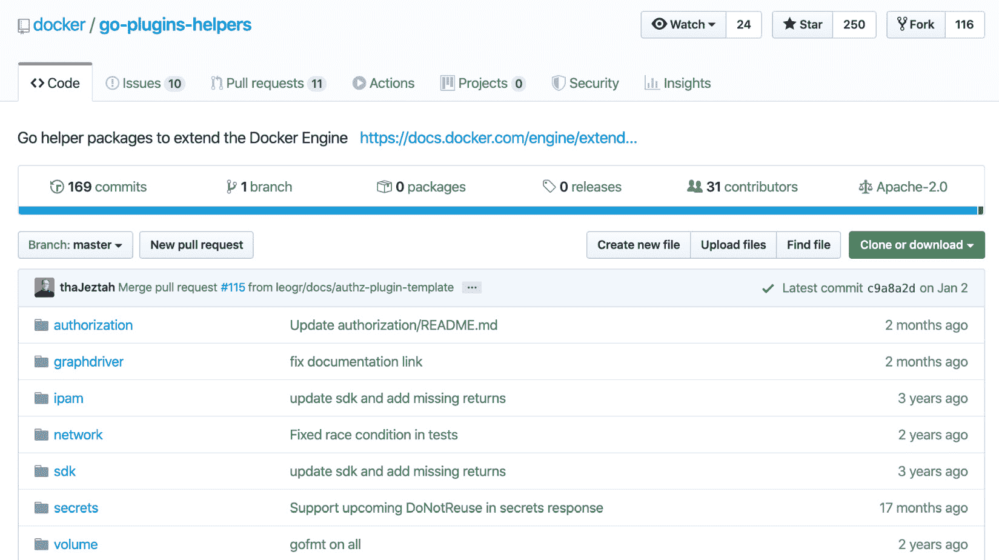
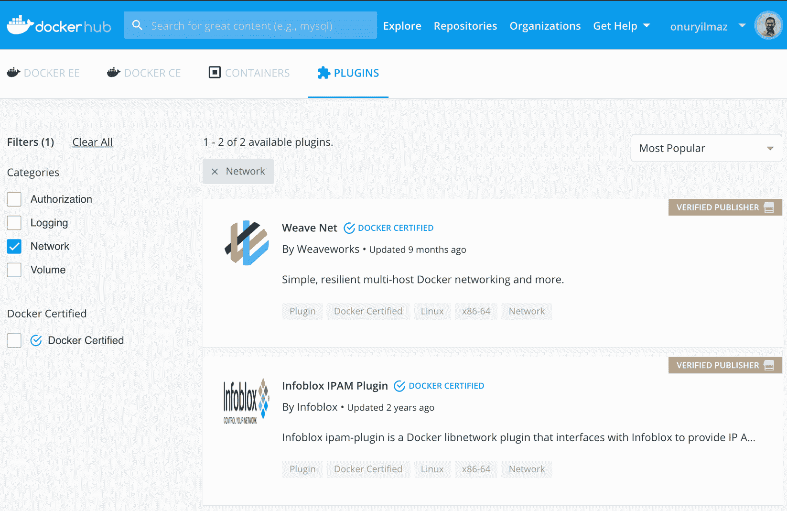
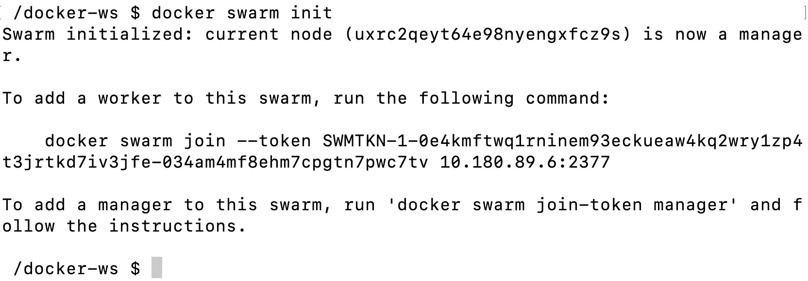
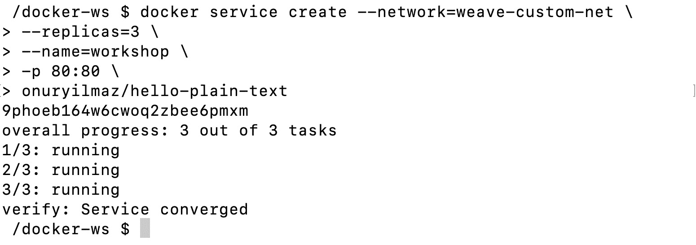
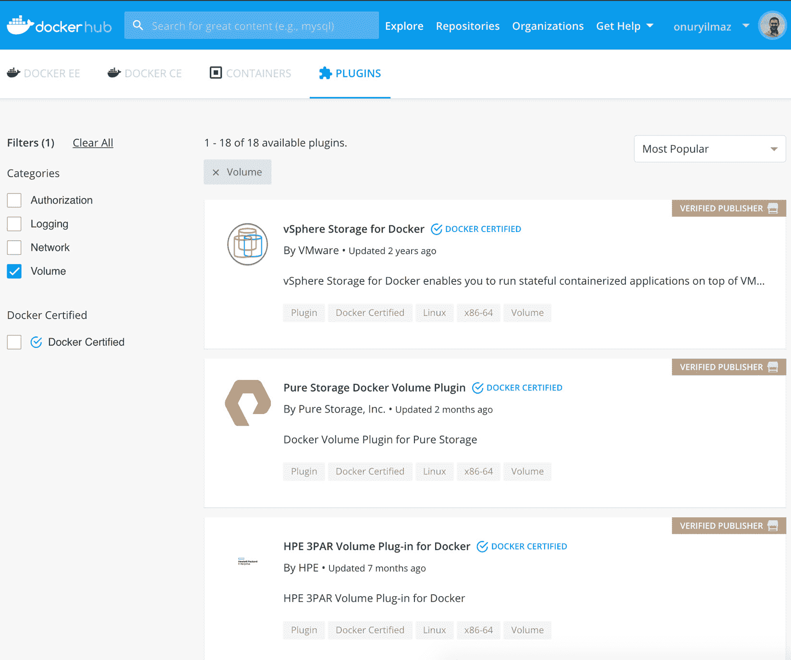
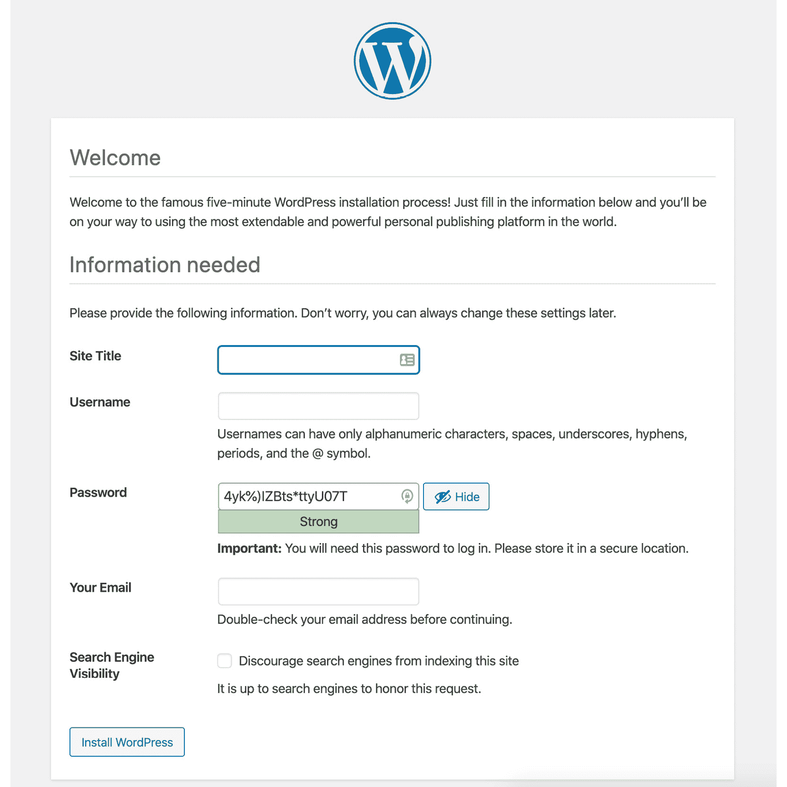

# 15. 通过插件扩展 Docker

概述

在本章中，您将学习如何通过创建和安装插件来扩展 Docker Engine 的功能。您将了解如何在使用 Docker 容器时实现高级和自定义需求。在本章结束时，您将能够识别扩展 Docker 的基础知识。您还将能够安装和配置不同的 Docker 插件。此外，您将使用 Docker 插件 API 来开发自定义插件，并使用各种 Docker 插件来扩展 Docker 中卷、网络和授权的功能。

# 介绍

在之前的章节中，您使用 Docker Compose 和 Docker Swarm 运行了多个 Docker 容器。此外，您监控了容器的指标并收集了日志。Docker 允许您管理容器的完整生命周期，包括网络、卷和进程隔离。如果您想要定制 Docker 的操作以适应您的自定义存储、网络提供程序或身份验证服务器，您需要扩展 Docker 的功能。

例如，如果您有一个自定义的基于云的存储系统，并希望将其挂载到 Docker 容器中，您可以实现一个存储插件。同样，您可以使用授权插件从企业用户管理系统对用户进行身份验证，并允许他们与 Docker 容器一起工作。

在本章中，您将学习如何通过插件扩展 Docker。您将从插件管理和 API 开始，然后学习最先进和最受欢迎的插件类型：授权、网络和卷。接下来的部分将涵盖在 Docker 中安装和操作插件。

# 插件管理

Docker 中的插件是独立于 Docker Engine 运行的外部进程。这意味着 Docker Engine 不依赖于插件，反之亦然。我们只需要告知 Docker Engine 有关插件位置和其功能。Docker 提供以下 CLI 命令来管理插件的生命周期：

+   `docker plugin create`：此命令创建新的插件及其配置。

+   `docker plugin enable/disable`：这些命令启用或禁用插件。

+   `docker plugin install`：此命令安装插件。

+   `docker plugin upgrade`：此命令将现有插件升级到更新版本。

+   `docker plugin rm`：此命令通过从 Docker Engine 中删除其信息来删除插件。

+   `docker plugin ls`：此命令列出已安装的插件。

+   `docker plugin inspect`：此命令显示有关插件的详细信息。

在接下来的部分中，您将学习如何使用插件 API 在 Docker 中实现插件。

# 插件 API

Docker 维护插件 API，以帮助社区编写他们的插件。这意味着只要按照插件 API 的规定实现，任何人都可以开发新的插件。这种方法使 Docker 成为一个开放和可扩展的平台。插件 API 是一种**远程过程调用**（**RPC**）风格的 JSON API，通过 HTTP 工作。Docker 引擎向插件发送 HTTP POST 请求，并使用响应来继续其操作。

Docker 还提供了一个官方的开源 SDK，用于创建新的插件和**辅助包**以扩展 Docker 引擎。辅助包是样板模板，如果您想轻松创建和运行新的插件。目前，由于 Go 是 Docker 引擎本身的主要实现语言，因此只有 Go 中的辅助包。它位于[`github.com/docker/go-plugins-helpers`](https://github.com/docker/go-plugins-helpers)，并为 Docker 支持的每种插件提供辅助程序：



图 15.1：Go 插件助手

您可以检查存储库中列出的每个文件夹，以便轻松创建和运行不同类型的插件。在本章中，您将通过几个实际练习来探索支持的插件类型，即授权、网络和卷插件。这些插件使 Docker 引擎能够通过提供额外的功能来实现自定义业务需求，同时还具有默认的 Docker 功能。

# 授权插件

Docker 授权基于两种模式：**启用所有类型的操作**或**禁用所有类型的操作**。换句话说，如果用户可以访问 Docker 守护程序，他们可以运行任何命令并使用 API 或 Docker 客户端命令。如果需要更细粒度的访问控制方法，则需要在 Docker 中使用授权插件。授权插件增强了 Docker 引擎操作的身份验证和权限。它们使得可以更细粒度地控制谁可以在 Docker 引擎上执行特定操作。

授权插件通过请求上下文批准或拒绝 Docker 守护程序转发的请求。因此，插件应实现以下两种方法：

+   `AuthZReq`：在 Docker 守护程序处理请求之前调用此方法。

+   `AuthZRes`：在从 Docker 守护程序返回响应给客户端之前调用此方法。

在接下来的练习中，您将学习如何配置和安装授权插件。您将安装由 Open Policy Agent 创建和维护的**基于策略的授权**插件（[`www.openpolicyagent.org/`](https://www.openpolicyagent.org/)）。**基于策略的访问**是基于根据一些规则（即**策略**）授予用户访问权限的想法。插件的源代码可在 GitHub 上找到（[`github.com/open-policy-agent/opa-docker-authz`](https://github.com/open-policy-agent/opa-docker-authz)），它与类似以下的策略文件一起使用：

```
package docker.authz 
allow {
    input.Method = "GET"
}
```

策略文件存储在 Docker 守护程序可以读取的主机系统中。例如，这里显示的策略文件只允许`GET`作为请求的方法。它实际上通过禁止任何其他方法（如`POST`、`DELETE`或`UPDATE`）使 Docker 守护程序变为只读。在接下来的练习中，您将使用一个策略文件并配置 Docker 守护程序与授权插件通信并限制一些请求。

注意

在以下练习中，插件和命令在 Linux 环境中效果最佳，考虑到 Docker 守护程序的安装和配置。如果您使用的是自定义或工具箱式的 Docker 安装，您可能希望使用虚拟机来完成本章的练习。

注意

请使用`touch`命令创建文件，并使用`vim`命令在 vim 编辑器中处理文件。

## 练习 15.01：具有授权插件的只读 Docker 守护程序

在这个练习中，您需要创建一个只读的 Docker 守护程序。如果您想限制对生产环境的访问和更改，这是一种常见的方法。为了实现这一点，您将安装并配置一个带有策略文件的插件。

要完成练习，请执行以下步骤：

1.  通过运行以下命令在`/etc/docker/policies/authz.rego`位置创建一个文件：

```
mkdir -p /etc/docker/policies
touch /etc/docker/policies/authz.rego
ls /etc/docker/policies
```

这些命令创建一个位于`/etc/docker/policies`的文件：

```
authz.rego
```

1.  用编辑器打开文件并插入以下数据：

```
package docker.authz 
allow {
    input.Method = "GET"
}
```

您可以使用以下命令将内容写入文件中：

```
cat > /etc/docker/policies/authz.rego << EOF
package docker.authz 
allow {
    input.Method = "GET"
}
EOF
cat /etc/docker/policies/authz.rego
```

注意

`cat`命令用于在终端中使文件内容可编辑。除非您在无头模式下运行 Ubuntu，否则可以跳过使用基于 CLI 的命令来编辑文件内容。

策略文件仅允许 Docker 守护程序中的`GET`方法；换句话说，它使 Docker 守护程序变为只读。

1.  通过在终端中运行以下命令安装插件，并在提示权限时输入*y*：

```
docker plugin install --alias opa-docker-authz:readonly \
openpolicyagent/opa-docker-authz-v2:0.5 \
opa-args="-policy-file /opa/policies/authz.rego"
```

该命令安装位于`openpolicyagent/opa-docker-authz-v2:0.5`的插件，并使用别名`opa-docker-authz:readonly`。此外，来自*步骤 1*的策略文件被传递为`opa-args`：


图 15.2：插件安装

1.  使用以下命令检查已安装的插件：

```
docker plugin ls
```

该命令列出插件：


图 15.3：插件列表

1.  使用以下版本编辑 Docker 守护程序配置位于`/etc/docker/daemon.json`：

```
{
    "authorization-plugins": ["opa-docker-authz:readonly"]
}
```

您可以使用`cat /etc/docker/daemon.json`命令检查文件的内容。

1.  使用以下命令重新加载 Docker 守护程序：

```
sudo kill -HUP $(pidof dockerd)
```

该命令通过使用`pidof`命令获取`dockerd`的进程 ID 来终止`dockerd`的进程。此外，它发送`HUP`信号，这是发送给 Linux 进程以更新其配置的信号。简而言之，您正在使用新的授权插件配置重新加载 Docker 守护程序。运行以下列出命令以检查列出操作是否被允许：

```
docker ps
```

该命令列出正在运行的容器，并显示列出操作是允许的：

```
CONTAINER ID  IMAGE  COMMAND  CREATED  STATUS  PORTS  NAMES
```

1.  运行以下命令以检查是否允许创建新容器：

```
docker run ubuntu
```

该命令创建并运行一个容器；但是，由于该操作不是只读的，因此不被允许：

```
Error response from daemon: authorization denied by plugin 
opa-docker-authz:readonly: request rejected by administrative policy.
See 'docker run –-help'.
```

1.  检查 Docker 守护程序的日志是否有任何与插件相关的行：

```
journalctl -u docker | grep plugin | grep "OPA policy decision"
```

注意

`journalctl`是用于显示来自`systemd`进程的日志的命令行工具。`systemd`进程以二进制格式存储日志。需要`journalctl`来读取日志文本。

以下输出显示*步骤 7*和*步骤 8*中测试的操作通过授权插件，并显示了`"Returning OPA policy decision: true"`和`"Returning OPA policy decision: false"`行。它显示我们的插件已允许第一个操作并拒绝了第二个操作：


图 15.4：插件日志

1.  通过从`/etc/docker/daemon.json`中删除`authorization-plugins`部分并重新加载 Docker 守护程序，停止使用插件，类似于*步骤 6*中所做的操作：

```
cat > /etc/docker/daemon.json << EOF
{}
EOF
cat /etc/docker/daemon.json
sudo kill -HUP $(pidof dockerd)
```

1.  通过以下命令禁用和删除插件：

```
docker plugin disable opa-docker-authz:readonly 
docker plugin rm opa-docker-authz:readonly  
```

这些命令通过返回插件的名称来禁用和删除 Docker 中的插件。

在这个练习中，您已经配置并安装了一个授权插件到 Docker 中。在下一节中，您将学习更多关于 Docker 中的网络插件。

# 网络插件

Docker 通过 Docker 网络插件支持各种网络技术。虽然它支持容器对容器和主机对容器的完整功能的网络，但插件使我们能够将网络扩展到更多的技术。网络插件实现了远程驱动程序作为不同网络拓扑的一部分，比如虚拟可扩展局域网（`vxlan`）和 MAC 虚拟局域网（`macvlan`）。您可以使用 Docker 插件命令安装和启用网络插件。此外，您需要使用`--driver`标志指定网络驱动程序的名称。例如，如果您已经安装并启用了`my-new-network-technology`驱动程序，并且希望您的新网络成为其中的一部分，您需要设置一个`driver`标志：

```
docker network create --driver my-new-network-technology mynet
```

这个命令创建了一个名为`mynet`的网络，而`my-new-network-technology`插件管理所有网络操作。

社区和第三方公司开发了网络插件。然而，目前在 Docker Hub 上只有两个经过认证的网络插件 - Weave Net 和 Infoblox IPAM Plugin。



图 15.5：Docker Hub 中的网络插件

**Infoblox IPAM Plugin**专注于提供 IP 地址管理服务，比如编写 DNS 记录和配置 DHCP 设置。**Weave Net**专注于为 Docker 容器创建弹性网络，具有加密、服务发现和组播网络。

在`go-plugin-helpers`提供的官方 SDK 中，有用于为 Docker 创建网络扩展的 Go 处理程序。`Driver`接口定义如下：

```
// Driver represent the interface a driver must fulfill.
type Driver interface {
     GetCapabilities() (*CapabilitiesResponse, error)
     CreateNetwork(*CreateNetworkRequest) error
     AllocateNetwork(*AllocateNetworkRequest)        (*AllocateNetworkResponse, error)
     DeleteNetwork(*DeleteNetworkRequest) error
     FreeNetwork(*FreeNetworkRequest) error
     CreateEndpoint(*CreateEndpointRequest)        (*CreateEndpointResponse, error)
     DeleteEndpoint(*DeleteEndpointRequest) error
     EndpointInfo(*InfoRequest) (*InfoResponse, error)
     Join(*JoinRequest) (*JoinResponse, error)
     Leave(*LeaveRequest) error
     DiscoverNew(*DiscoveryNotification) error
     DiscoverDelete(*DiscoveryNotification) error
     ProgramExternalConnectivity(*ProgramExternalConnectivityRequest)        error
     RevokeExternalConnectivity(*RevokeExternalConnectivityRequest)        error
}
```

注意

完整的代码可在[`github.com/docker/go-plugins-helpers/blob/master/network/api.go`](https://github.com/docker/go-plugins-helpers/blob/master/network/api.go)找到。

当您检查接口功能时，网络插件应提供网络、端点和外部连接的操作。例如，网络插件应使用`CreateNetwork`、`AllocateneNetwork`、`DeleteNetwork`和`FreeNetwork`函数实现网络生命周期。

同样，端点生命周期应该由`CreateEndpoint`、`DeleteEndpoint`和`EndpointInfo`函数实现。此外，还有一些扩展集成和管理函数需要实现，包括`GetCapabilities`、`Leave`和`Join`。服务还需要它们特定的请求和响应类型以在托管插件环境中工作。

在接下来的练习中，您将使用 Weave Net 插件创建一个新网络，并让容器使用新网络连接。

## 练习 15.02：Docker 网络插件实战

Docker 网络插件接管特定网络实例的网络操作并实现自定义技术。在这个练习中，您将安装和配置一个网络插件来创建一个 Docker 网络。然后，您将创建一个 Docker 镜像的三个副本应用程序，并使用插件连接这三个实例。您可以使用 Weave Net 插件来实现这个目标。

要完成练习，请执行以下步骤：

1.  通过在终端中运行以下命令初始化 Docker swarm（如果之前未启用）：

```
docker swarm init
```

此命令创建一个 Docker swarm 以部署多个应用程序实例：



图 15.6：Swarm 初始化

1.  通过运行以下命令安装**Weave Net**插件：

```
docker plugin install --grant-all-permissions \
store/weaveworks/net-plugin:2.5.2
```

此命令从商店安装插件并授予所有权限：


图 15.7：插件安装

1.  使用以下命令使用驱动程序创建新网络：

```
docker network create  \
--driver=store/weaveworks/net-plugin:2.5.2  \
weave-custom-net
```

使用插件提供的驱动程序创建名为`weave-custom-net`的新网络：


图 15.8：创建网络

成功创建网络后，将打印出随机生成的网络名称，如前面的代码所示。

1.  使用以下命令创建一个三个副本的应用程序：

```
docker service create --network=weave-custom-net \
--replicas=3 \
--name=workshop \
-p 80:80 \
onuryilmaz/hello-plain-text
```

该命令创建了`onuryilmaz/hello-plain-text`镜像的三个副本，并使用`the weave-custom-net`网络连接实例。此外，它使用名称`workshop`并发布到端口`80`：



图 15.9：应用程序创建

1.  通过运行以下命令获取容器的名称：

```
FIRST_CONTAINER=$(docker ps --format "{{.Names}}" |grep "workshop.1")
echo $FIRST_CONTAINER
SECOND_CONTAINER=$(docker ps --format "{{.Names}}" |grep "workshop.2")
echo $SECOND_CONTAINER
THIRD_CONTAINER=$(docker ps --format "{{.Names}}" |grep "workshop.3")
echo $THIRD_CONTAINER
```

这些命令列出了正在运行的 Docker 容器名称，并按`workshop`实例进行过滤。您将需要容器的名称来测试它们之间的连接：


图 15.10：容器名称

1.  运行以下命令将第一个容器连接到第二个容器：

```
docker exec -it $FIRST_CONTAINER sh -c "curl $SECOND_CONTAINER" 
```

该命令使用`curl`命令连接第一个和第二个容器：


图 15.11：容器之间的连接

上述命令在第一个容器内运行，并且`curl`命令到达第二个容器。输出显示了服务器和请求信息。

1.  类似于*步骤 6*，将第一个容器连接到第三个容器：

```
docker exec -it $FIRST_CONTAINER sh -c "curl $THIRD_CONTAINER" 
```

如预期的那样，在*步骤 6*和*步骤 7*中检索到了不同的服务器名称和地址：


图 15.12：容器之间的连接

这表明使用自定义 Weave Net 网络创建的容器正在按预期工作。

1.  您可以使用以下命令删除应用程序和网络：

```
docker service rm workshop
docker network rm weave-custom-net
```

在这个练习中，您已经在 Docker 中安装并使用了一个网络插件。除此之外，您还创建了一个使用自定义网络驱动程序连接的容器化应用程序。在下一节中，您将学习更多关于 Docker 中的卷插件。

# 卷插件

Docker 卷被挂载到容器中，以允许有状态的应用程序在容器中运行。默认情况下，卷是在主机文件系统中创建并由 Docker 管理的。此外，在创建卷时，可以指定卷驱动程序。例如，您可以挂载网络或存储提供程序（如 Google、Azure 或 AWS）的卷。您还可以在 Docker 容器中本地运行数据库，而数据卷在 AWS 存储服务中是持久的。这样，您的数据卷可以在将来与在任何其他位置运行的其他数据库实例一起重用。要使用不同的卷驱动程序，您需要使用卷插件增强 Docker。

Docker 卷插件控制卷的生命周期，包括`Create`、`Mount`、`Unmount`、`Path`和`Remove`等功能。在插件 SDK 中，卷驱动程序接口定义如下：

```
// Driver represent the interface a driver must fulfill.
type Driver interface {
     Create(*CreateRequest) error
     List() (*ListResponse, error)
     Get(*GetRequest) (*GetResponse, error)
     Remove(*RemoveRequest) error
     Path(*PathRequest) (*PathResponse, error)
     Mount(*MountRequest) (*MountResponse, error)
     Unmount(*UnmountRequest) error
     Capabilities() *CapabilitiesResponse
}
```

注意

完整的驱动程序代码可在[`github.com/docker/go-plugins-helpers/blob/master/volume/api.go`](https://github.com/docker/go-plugins-helpers/blob/master/volume/api.go)找到。

驱动程序接口的功能显示，卷驱动程序专注于卷的基本操作，如`Create`、`List`、`Get`和`Remove`操作。插件负责将卷挂载到容器中并从容器中卸载。如果要创建新的卷驱动程序，需要使用相应的请求和响应类型实现此接口。

Docker Hub 和开源社区已经提供了大量的卷插件。例如，目前在 Docker Hub 上已经分类和验证了 18 个卷插件：



图 15.13：Docker Hub 上的卷插件

大多数插件专注于从不同来源提供存储，如云提供商和存储技术。根据您的业务需求和技术堆栈，您可以在 Docker 设置中考虑卷插件。

在接下来的练习中，您将使用 SSH 连接在远程系统中创建卷，并在容器中创建卷。对于通过 SSH 连接创建和使用的卷，您将使用[`github.com/vieux/docker-volume-sshfs`](https://github.com/vieux/docker-volume-sshfs)上提供的`open-source docker-volume-sshfs`插件。

## 练习 15.03：卷插件的实际应用

Docker 卷插件通过从不同提供商和技术提供存储来管理卷的生命周期。在这个练习中，您将安装和配置一个卷插件，以通过 SSH 连接创建卷。在成功创建卷之后，您将在容器中使用它们，并确保文件被持久化。您可以使用`docker-volume-sshfs`插件来实现这个目标。

要完成这个练习，请执行以下步骤：

1.  在终端中运行以下命令安装`docker-volume-sshfs`插件：

```
docker plugin install --grant-all-permissions vieux/sshfs
```

此命令通过授予所有权限来安装插件：


图 15.14：插件安装

1.  使用以下命令创建一个带有 SSH 连接的 Docker 容器，以便为其他容器提供卷：

```
docker run -d -p 2222:22 \
--name volume_provider \
rastasheep/ubuntu-sshd:14.04
```

此命令创建并运行一个名为`volume_provider`的`sshd`容器。端口`2222`被发布，并将在接下来的步骤中用于连接到此容器。

您应该会得到以下输出：

```
87eecaca6a1ea41e682e300d077548a4f902fdda21acc218a51253a883f725d
```

1.  通过运行以下命令创建一个名为`volume-over-ssh`的新卷：

```
docker volume create -d vieux/sshfs \
--name volume-over-ssh \
-o sshcmd=root@localhost:/tmp \
-o password=root \
-o port=2222
```

此命令使用`vieux/sshfs`驱动程序和`sshcmd`、`password`和`port`参数指定的`ssh`连接创建一个新卷：

```
volume-over-ssh
```

1.  通过运行以下命令在*步骤 3*中创建的卷中创建一个新文件并保存：

```
docker run --rm -v volume-over-ssh:/data busybox \
sh -c "touch /data/test.txt && echo 'Hello from Docker Workshop' >> /data/test.txt"
```

此命令通过挂载`volume-over-ssh`来运行一个容器。然后创建一个文件并写入其中。

1.  通过运行以下命令检查*步骤 4*中创建的文件的内容：

```
docker run --rm -v volume-over-ssh:/data busybox \
cat /data/test.txt
```

此命令通过挂载相同的卷来运行一个容器，并从中读取文件：

```
Hello from Docker Workshop
```

1.  （可选）通过运行以下命令删除卷：

```
docker volume rm volume-over-ssh
```

在这个练习中，您已经在 Docker 中安装并使用了卷插件。此外，您已经创建了一个卷，并从多个容器中用于写入和读取。

在接下来的活动中，您将使用网络和卷插件在 Docker 中安装 WordPress。

## 活动 15.01：使用网络和卷插件安装 WordPress

您的任务是在 Docker 中使用网络和卷插件设计和部署博客及其数据库作为微服务。您将使用 WordPress，因为它是最流行的内容管理系统，被超过三分之一的网站使用。存储团队要求您使用 SSH 来进行 WordPress 内容的卷。此外，网络团队希望您在容器之间使用 Weave Net 进行网络连接。使用这些工具，您将使用 Docker 插件创建网络和卷，并将它们用于 WordPress 及其数据库：

1.  使用 Weave Net 插件创建一个名为`wp-network`的 Docker 网络。

1.  使用`vieux/sshfs`驱动程序创建名为`wp-content`的卷。

1.  创建一个名为`mysql`的容器来运行`mysql:5.7`镜像。确保设置`MYSQL_ROOT_PASSWORD`、`MYSQL_DATABASE`、`MYSQL_USER`和`MYSQL_PASSWORD`环境变量。此外，容器应该使用*步骤 1*中的`wp-network`。

1.  创建一个名为`wordpress`的容器，并使用*步骤 2*中挂载在`/var/www/html/wp-content`的卷。对于 WordPress 的配置，不要忘记根据*步骤 3*设置`WORDPRESS_DB_HOST`、`WORDPRESS_DB_USER`、`WORDPRESS_DB_PASSWORD`和`WORDPRESS_DB_NAME`环境变量。此外，您需要将端口`80`发布到端口`8080`，可以从浏览器访问。

您应该运行`wordpress`和`mysql`容器：


图 15.15：WordPress 和数据库容器

此外，您应该能够在浏览器中访问 WordPress 设置屏幕：



图 15.16：WordPress 设置屏幕

注

此活动的解决方案可以通过此链接找到。

# 摘要

本章重点介绍了使用插件扩展 Docker。通过安装和使用 Docker 插件，可以通过自定义存储、网络或授权方法增强 Docker 操作。您首先考虑了 Docker 中的插件管理和插件 API。通过插件 API，您可以通过编写新插件来扩展 Docker，并使 Docker 为您工作。

本章然后涵盖了授权插件以及 Docker 守护程序如何配置以与插件一起工作。如果您在生产或企业环境中使用 Docker，授权插件是控制谁可以访问您的容器的重要工具。然后您探索了网络插件以及它们如何扩展容器之间的通信。

尽管 Docker 已经涵盖了基本的网络功能，但我们看了一下网络插件如何成为新网络功能的入口。这导致了最后一部分，其中介绍了卷插件，以展示如何在 Docker 中启用自定义存储选项。如果您的业务环境或技术堆栈要求您扩展 Docker 的功能，学习插件以及如何使用它们是至关重要的。

本章的结尾也标志着本书的结束。你从第一章开始学习 Docker 的基础知识，运行了你的第一个容器，看看你已经走了多远。在本书的学习过程中，你使用 Dockerfile 创建了自己的镜像，并学会了如何使用 Docker Hub 等公共仓库发布这些镜像，或者将它们存储在你的系统上运行的仓库中。你学会了使用多阶段的 Dockerfile，并使用 docker-compose 来实现你的服务。你甚至掌握了网络和容器存储的细节，以及在项目中实施 CI/CD 流水线和在 Docker 镜像构建中进行测试。

你练习了使用 Docker Swarm 和 Kubernetes 等应用程序编排你的 Docker 环境，然后更深入地了解了 Docker 安全和容器最佳实践。你的旅程继续进行，监控你的服务指标和容器日志，最后使用 Docker 插件来帮助扩展你的容器服务功能。我们涵盖了大量内容，以提高你对 Docker 的技能和知识。希望这将使你的应用经验达到一个新的水平。请参考交互式版本，了解如何在出现问题时进行故障排除和报告。你还将了解 Docker Enterprise 的当前状态以及在 Docker 的使用和开发方面即将迈出的重要步伐。
