# 第三章：收集和查询指标并发送警报

不充分的事实总是会引发危险。

- *斯波克*

到目前为止，我们已经探讨了如何利用一些 Kubernetes 核心功能。我们使用了 HorizontalPodAutoscaler 和 Cluster Autoscaler。前者依赖于度量服务器，而后者不是基于指标，而是基于调度程序无法将 Pod 放置在现有集群容量内。尽管度量服务器确实提供了一些基本指标，但我们迫切需要更多。

我们必须能够监视我们的集群，而度量服务器并不足够。它包含有限数量的指标，它们保存的时间很短，而且它不允许我们执行除了最简单的查询之外的任何操作。如果我们只依赖度量服务器，我不能说我们是盲目的，但我们受到严重的影响。如果我们不增加收集的指标数量以及它们的保留时间，我们只能对我们的 Kubernetes 集群中发生的情况有一瞥。

能够获取和存储指标本身并不是目标。我们还需要能够查询它们以寻找问题的原因。为此，我们需要指标“丰富”的信息，以及强大的查询语言。

最后，能够找到问题的原因没有多大意义，如果不能首先被通知存在问题。这意味着我们需要一个系统，可以让我们定义警报，当达到一定阈值时，会向我们发送通知，或者在适当时将它们发送到系统的其他部分，可以自动执行解决问题的步骤。

如果我们做到了这一点，我们将更接近于拥有不仅自我修复（Kubernetes 已经做到了），而且还会对变化的条件做出反应的自适应系统。我们甚至可以进一步尝试预测未来会发生“坏事”，并在它们出现之前积极解决它们。

总而言之，我们需要一个工具，或一组工具，可以让我们获取和存储“丰富”的指标，可以让我们查询它们，并且在出现问题时通知我们，甚至更好的是，在问题即将发生时通知我们。

在本章中，我们可能无法构建一个自适应系统，但我们可以尝试创建一个基础。但首先，我们需要一个集群，让我们可以“玩”一些新的工具和概念。

# 创建一个集群

我们将继续使用`vfarcic/k8s-specs`（[`github.com/vfarcic/k8s-specs`](https://github.com/vfarcic/k8s-specs)）存储库中的定义。为了安全起见，我们将首先拉取最新版本。

本章中的所有命令都在`03-monitor.sh`（[`gist.github.com/vfarcic/718886797a247f2f9ad4002f17e9ebd9`](https://gist.github.com/vfarcic/718886797a247f2f9ad4002f17e9ebd9)）Gist 中可用。

[PRE0]

给 minikube 和 Docker for Desktop 用户的提示：我们需要将内存增加到 3GB。请记住这一点，以防您只是计划浏览与您的 Kubernetes 版本匹配的 Gist。在本章中，我们将需要一些以前不是要求的东西，尽管您可能已经使用过它们。

我们将开始使用 UI，因此我们将需要 NGINX Ingress Controller 来从集群外部路由流量。我们还需要环境变量`LB_IP`，其中包含我们可以访问工作节点的 IP。我们将用它来配置一些 Ingress 资源。

本章中用于测试示例的 Gists 如下。请按原样使用它们，或者作为创建自己的集群的灵感，或者确认您已有的集群是否符合要求。由于新的要求（Ingress 和`LB_IP`），所有集群设置的 Gists 都是新的。

给 Docker for Desktop 用户的提示：您会注意到 Gist 末尾的`LB_IP=[...]`命令。您需要用您集群的 IP 替换`[...]`。可能找到它最简单的方法是通过`ifconfig`命令。只需记住它不能是`localhost`，而是您笔记本电脑的 IP（例如，`192.168.0.152`）。

Gists 如下。

+   `gke-monitor.sh`：**GKE** 使用 3 个 n1-standard-1 工作节点，**nginx Ingress**，**tiller**，并将集群 IP 存储在环境变量**LB_IP**中（[`gist.github.com/vfarcic/10e14bfbec466347d70d11a78fe7eec4`](https://gist.github.com/vfarcic/10e14bfbec466347d70d11a78fe7eec4)）。

+   `eks-monitor.sh`：**EKS** 使用 3 个 t2.small 工作节点，**nginx Ingress**，**tiller**，**Metrics Server**，并将集群 IP 存储在环境变量**LB_IP**中（[`gist.github.com/vfarcic/211f8dbe204131f8109f417605dbddd5`](https://gist.github.com/vfarcic/211f8dbe204131f8109f417605dbddd5)）。

+   `aks-monitor.sh`：**AKS**带有 3 个 Standard_B2s 工作节点，**nginx Ingress**，**tiller**，并且集群 IP 存储在环境变量**LB_IP**中([`gist.github.com/vfarcic/5fe5c238047db39cb002cdfdadcfbad2`](https://gist.github.com/vfarcic/5fe5c238047db39cb002cdfdadcfbad2))。

+   `docker-monitor.sh`：**Docker for Desktop**，带有**2 个 CPU**，**3GB RAM**，**nginx Ingress**，**tiller**，**Metrics Server**，并且集群 IP 存储在环境变量**LB_IP**中([`gist.github.com/vfarcic/4d9ab04058cf00b9dd0faac11bda8f13`](https://gist.github.com/vfarcic/4d9ab04058cf00b9dd0faac11bda8f13))。

+   `minikube-monitor.sh`：**minikube**带有**2 个 CPU**，**3GB RAM**，**ingress**，**storage-provisioner**，**default-storageclass**，并且启用了**metrics-server**附加组件，**tiller**，并且集群 IP 存储在环境变量**LB_IP**中([`gist.github.com/vfarcic/892c783bf51fc06dd7f31b939bc90248`](https://gist.github.com/vfarcic/892c783bf51fc06dd7f31b939bc90248))。

现在我们有了一个集群，我们需要选择我们将用来实现我们目标的工具。

# 选择存储和查询指标以及警报的工具

**HorizontalPodAutoscaler** (**HPA**)和**Cluster Autoscaler** (**CA**)提供了必要但非常基本的机制来扩展我们的 Pods 和集群。

虽然它们可以很好地进行扩展，但它们并不能解决我们在出现问题时需要接收警报的需求，也不能提供足够的信息来找到问题的原因。我们需要通过额外的工具来扩展我们的设置，这些工具将允许我们存储和查询指标，并在出现问题时接收通知。

如果我们专注于可以安装和管理的工具，那么我们对使用什么工具几乎没有疑问。如果我们看一下*Cloud Native Computing Foundation (CNCF)*项目列表([`www.cncf.io/projects/`](https://www.cncf.io/projects/))，到目前为止只有两个项目已经毕业（2018 年 10 月）。它们分别是*Kubernetes*和*Prometheus*([`prometheus.io/`](https://prometheus.io/))。考虑到我们正在寻找一个可以存储和查询指标的工具，而 Prometheus 满足了这一需求，选择就很明显了。这并不是说没有其他值得考虑的类似工具。有，但它们都是基于服务的。我们以后可能会探索它们，但现在，我们专注于那些可以在我们的集群内运行的工具。因此，我们将把 Prometheus 加入到混合中，并尝试回答一个简单的问题。Prometheus 是什么？

Prometheus 是一个（某种程度上的）数据库，旨在获取（拉取）和存储高维时间序列数据。

时间序列由指标名称和一组键值对标识。数据既存储在内存中，也存储在磁盘上。前者可以快速检索信息，而后者存在是为了容错。

Prometheus 的查询语言使我们能够轻松找到可用于图表和更重要的警报的数据。它并不试图提供“出色”的可视化体验。为此，它与*Grafana*（[`grafana.com/`](https://grafana.com/)）集成。

与大多数其他类似工具不同，我们不会将数据推送到 Prometheus。或者更准确地说，这不是获取指标的常见方式。相反，Prometheus 是一个基于拉取的系统，定期从导出器中获取指标。我们可以使用许多第三方导出器。但是，在我们的情况下，最关键的导出器已经内置到 Kubernetes 中。Prometheus 可以从一个将信息从 Kube API 转换的导出器中拉取数据。通过它，我们可以获取（几乎）我们可能需要的所有信息。或者至少，这就是大部分信息将来自的地方。

最后，如果我们在出现问题时没有得到通知，将在 Prometheus 中存储的指标没有太大用处。即使我们将 Prometheus 与 Grafana 集成，那也只会为我们提供仪表板。我假设你有更重要的事情要做，而不是盯着五颜六色的图表。因此，我们需要一种方式将来自 Prometheus 的警报发送到 Slack，比如说。幸运的是，*Alertmanager*（[`prometheus.io/docs/alerting/alertmanager/`](https://prometheus.io/docs/alerting/alertmanager/)）允许我们做到这一点。这是一个由同一个社区维护的独立应用程序。

我们将通过实际操作来看看所有这些部分是如何组合在一起的。所以，让我们开始安装 Prometheus、Alertmanager 和其他一些应用程序。

# 对 Prometheus 和 Alertmanager 的快速介绍

我们将继续使用 Helm 作为安装机制。Prometheus 的 Helm Chart 是作为官方 Chart 之一进行维护的。您可以在项目的*README*中找到更多信息（[`github.com/helm/charts/tree/master/stable/prometheus`](https://github.com/helm/charts/tree/master/stable/prometheus)）。如果您关注*配置部分*中的变量（[`github.com/helm/charts/tree/master/stable/prometheus#configuration`](https://github.com/helm/charts/tree/master/stable/prometheus#configuration)），您会注意到有很多东西可以调整。我们不会遍历所有变量。您可以查看官方文档。相反，我们将从基本设置开始，并随着我们的需求增加而扩展。

让我们来看看我们将作为起点使用的变量。

[PRE1]

输出如下。

[PRE2]

目前我们所做的一切都是为我们将安装的所有五个应用程序定义`资源`，以及使用一些注释启用 Ingress，这些注释将确保我们不会被重定向到 HTTPS 版本，因为我们没有我们的临时域的证书。我们将在稍后深入研究将要安装的应用程序。目前，我们将定义 Prometheus 和 Alertmanager UI 的地址。

[PRE3]

让我们安装图表。

[PRE4]

我们刚刚执行的命令应该是不言自明的，所以我们将跳转到输出的相关部分。

[PRE5]

我们可以看到，图表安装了一个 DeamonSet 和四个部署。

DeamonSet 是 Node Exporter，它将在集群的每个节点上运行一个 Pod。它提供特定于节点的指标，这些指标将被 Prometheus 拉取。第二个导出器（Kube State Metrics）作为单个副本部署运行。它从 Kube API 获取数据，并将其转换为 Prometheus 友好的格式。这两个将提供我们所需的大部分指标。稍后，我们可能选择使用其他导出器来扩展它们。目前，这两个连同直接从 Kube API 获取的指标应该提供比我们在单个章节中能吸收的更多的指标。

此外，我们有服务器，即 Prometheus 本身。Alertmanager 将警报转发到它们的目的地。最后，还有 Pushgateway，我们可能会在接下来的章节中探索它。

在等待所有这些应用程序变得可操作时，我们可以探索它们之间的流程。

Prometheus 服务器从出口商那里获取数据。在我们的情况下，这些是 Node Exporter 和 Kube State Metrics。这些出口商的工作是从源获取数据并将其转换为 Prometheus 友好的格式。Node Exporter 从节点上挂载的`/proc`和`/sys`卷获取数据，而 Kube State Metrics 从 Kube API 获取数据。指标在 Prometheus 内部存储。

除了能够查询这些数据，我们还可以定义警报。当警报达到阈值时，它将被转发到充当十字路口的 Alertmanager。

根据其内部规则，它可以将这些警报进一步转发到各种目的地，如 Slack、电子邮件和 HipChat（仅举几例）。

图 3-1：数据流向和从 Prometheus 流向的流程（箭头表示方向）

到目前为止，Prometheus 服务器可能已经推出。我们会确认一下以防万一。

[PRE6]

让我们来看看通过`prometheus-server`部署创建的 Pod 内部有什么。

[PRE7]

输出，仅限于相关部分，如下所示。

[PRE8]

除了基于`prom/prometheus`镜像的容器外，我们还从`jimmidyson/configmap-reload`创建了另一个容器。后者的工作是在我们更改存储在 ConfigMap 中的配置时重新加载 Prometheus。

接下来，我们可能想看一下`prometheus-server` ConfigMap，因为它存储了 Prometheus 所需的所有配置。

[PRE9]

输出，仅限于相关部分，如下所示。

[PRE10]

我们可以看到`alerts`仍然是空的。我们很快会改变这一点。

更下面是`prometheus.yml`配置，其中`scrape_configs`占据了大部分空间。我们可以花一个章节的时间来解释当前的配置以及我们可以修改它的方式。我们不会这样做，因为你面前的配置接近疯狂。这是如何使事情变得比应该更复杂的最佳例子。在大多数情况下，您应该保持不变。如果您确实想要玩弄它，请咨询官方文档。

接下来，我们将快速查看 Prometheus 的屏幕。

对于 Windows 用户，Git Bash 可能无法使用`open`命令。如果是这种情况，请用`echo`替换`open`。结果，您将获得应直接在您选择的浏览器中打开的完整地址。

[PRE11]

配置屏幕反映了我们已经在`prometheus-server` ConfigMap 中看到的相同信息，所以我们将继续。

接下来，让我们来看看这些目标。

[PRE12]

该屏幕包含七个目标，每个目标提供不同的指标。Prometheus 定期从这些目标中拉取数据。

本章中的所有输出和截图都来自 AKS。根据您的 Kubernetes 版本，可能会看到一些差异。您可能会注意到，本章包含的截图比其他章节多得多。尽管看起来可能有点多，但我想确保您可以将您的结果与我的进行比较，因为不可避免地会有一些差异，有时可能会让人感到困惑，如果没有参考（我的截图）的话。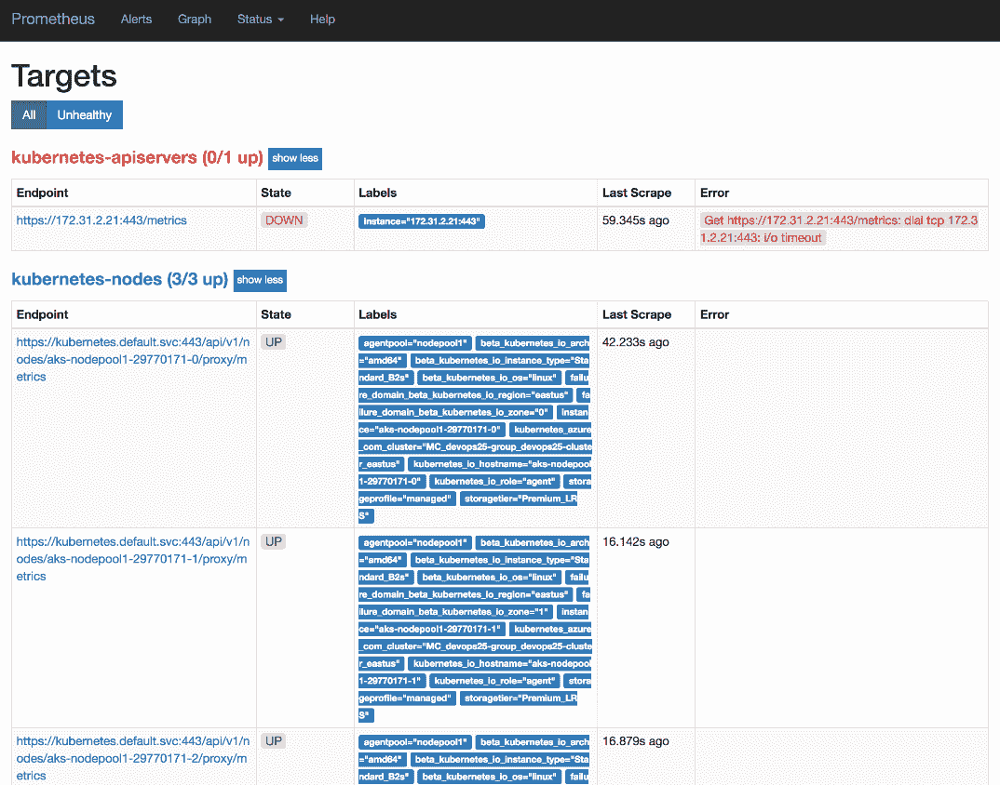图 3-2：Prometheus 的目标屏幕 AKS 用户注意*kubernetes-apiservers*目标可能是红色的，表示 Prometheus 无法连接到它。这没关系，因为我们不会使用它的指标。minikube 用户注意*kubernetes-service-endpoints*目标可能有一些红色的来源。没有理由担心。这些是不可访问的，但这不会影响我们的练习。

我们无法从屏幕上找出每个目标提供什么。我们将尝试以与 Prometheus 拉取它们相同的方式查询导出器。

为了做到这一点，我们需要找出可以访问导出器的服务。

[PRE13]

来自 AKS 的输出如下。

[PRE14]

我们对`prometheus-kube-state-metrics`和`prometheus-node-exporter`感兴趣，因为它们提供了访问本章中将使用的导出器的数据。

接下来，我们将创建一个临时 Pod，通过它我们将访问那些服务后面的导出器提供的数据。

[PRE15]

我们基于`appropriate/curl`创建了一个新的 Pod。该镜像只提供`curl`的单一目的。我们指定`prometheus-node-exporter:9100/metrics`作为命令，这相当于使用该地址运行`curl`。结果，输出了大量指标。它们都以相同的“键/值”格式呈现，可选标签用大括号（`{`和`}`）括起来。在每个指标的顶部，都有一个`HELP`条目，解释了其功能以及`TYPE`（例如，`gauge`）。其中一个指标如下。

[PRE16]

我们可以看到它提供了“内存信息字段 MemTotal_bytes”，类型为`gauge`。在`TYPE`下面是实际的指标，带有键（`node_memory_MemTotal_bytes`）和值`3.878477824e+09`。

大多数 Node Exporter 指标都没有标签。因此，我们将不得不在`prometheus-kube-state-metrics`导出器中寻找一个示例。

[PRE17]

正如您所看到的，Kube 状态指标遵循与节点导出器相同的模式。主要区别在于大多数指标都有标签。一个例子如下。

[PRE18]

该指标表示在`metrics`命名空间内创建`prometheus-server`部署的时间。

我会让你更详细地探索这些指标。我们很快将使用其中的许多。

现在，只需记住，通过来自节点导出器、Kube 状态指标以及来自 Kubernetes 本身的指标的组合，我们可以满足大部分需求。或者更准确地说，这些数据提供了大部分基本和常见用例所需的数据。

接下来，我们将查看警报屏幕。

[PRE19]

屏幕是空的。不要绝望。我们将会多次返回到那个屏幕。随着我们的进展，警报将会增加。现在，只需记住那里是您可以找到警报的地方。

最后，我们将打开图形屏幕。

[PRE20]

那里是您将花费时间调试通过警报发现的问题的地方。

作为我们的第一个任务，我们将尝试检索有关我们节点的信息。我们将使用`kube_node_info`，所以让我们看一下它的描述（帮助）和类型。

[PRE21]

输出，仅限于`HELP`和`TYPE`条目，如下所示。

[PRE22]

您可能会看到您的结果与我的结果之间的差异。这是正常的，因为我们的集群可能具有不同数量的资源，我的带宽可能不同，等等。在某些情况下，我的警报会触发，而您的不会，或者反之。我会尽力解释我的经验并提供伴随它们的截图。您将不得不将其与您在屏幕上看到的内容进行比较。

现在，让我们尝试在 Prometheus 中使用该指标。

请在表达式字段中输入以下查询。

[PRE23]

点击“执行”按钮以检索`kube_node_info`指标的值。

与以往章节不同，这个章节的 Gist（`03-monitor.sh` ([`gist.github.com/vfarcic/718886797a247f2f9ad4002f17e9ebd9`](https://gist.github.com/vfarcic/718886797a247f2f9ad4002f17e9ebd9)）不仅包含命令，还包含 Prometheus 表达式。它们都被注释了（使用`#`）。如果您打算从 Gist 中复制并粘贴表达式，请排除注释。每个表达式顶部都有`# Prometheus expression`的注释，以帮助您识别它。例如，您刚刚执行的表达式在 Gist 中的写法如下。`# Prometheus expression` `# kube_node_info`

如果您检查`kube_node_info`的`HELP`条目，您会看到它提供了`有关集群节点的信息`，并且它是一个`仪表`。**仪表**([`prometheus.io/docs/concepts/metric_types/#gauge`](https://prometheus.io/docs/concepts/metric_types/#gauge))是表示单个数值的度量，可以任意上升或下降。

关于节点的信息是有道理的，因为它们的数量可能随时间增加或减少。

Prometheus 的仪表是表示单个数值的度量，可以任意上升或下降。

如果我们关注输出，您会注意到条目的数量与集群中的工作节点数量相同。在这种情况下，值（`1`）在这种情况下是无用的。另一方面，标签可以提供一些有用的信息。例如，在我的情况下，操作系统（`os_image`）是`Ubuntu 16.04.5 LTS`。通过这个例子，我们可以看到我们不仅可以使用度量来计算值（例如，可用内存），还可以一窥系统的具体情况。

图 3-3：Prometheus 的控制台输出 kube_node_info 度量

让我们看看是否可以通过将该度量与 Prometheus 的一个函数结合来获得更有意义的查询。我们将`count`集群中工作节点的数量。`count`是 Prometheus 的*聚合运算符*之一([`prometheus.io/docs/prometheus/latest/querying/operators/#aggregation-operators`](https://prometheus.io/docs/prometheus/latest/querying/operators/#aggregation-operators))。

请执行接下来的表达式。

[PRE24]

输出应该显示集群中工作节点的总数。在我的情况下（AKS），有`3`个。乍一看，这可能并不是非常有用。您可能认为，即使没有 Prometheus，您也应该知道集群中有多少个节点。但这可能并不正确。其中一个节点可能已经失败，并且没有恢复。如果您在本地运行集群而没有扩展组，这一点尤其正确。或者 Cluster Autoscaler 增加或减少了节点的数量。一切都会随时间而改变，无论是由于故障，人为行为，还是通过自适应的系统。无论波动的原因是什么，当某些情况达到阈值时，我们可能希望得到通知。我们将以节点作为第一个例子。

我们的任务是定义一个警报，如果集群中的节点超过三个或少于一个，将通知我们。我们假设这些是我们的限制，并且我们想知道是由于故障还是集群自动缩放而达到了下限或上限。

我们将看一下 Prometheus Chart 值的新定义。由于定义很大，并且会随着时间增长，所以从现在开始，我们只会关注其中的差异。

[PRE25]

输出如下。

[PRE26]

我们添加了一个新条目`serverFiles.alerts`。如果您查看 Prometheus 的 Helm 文档，您会发现它允许我们定义警报（因此得名）。在其中，我们使用了“标准”Prometheus 语法来定义警报。

请参阅*Alerting Rules documentation* ([`prometheus.io/docs/prometheus/latest/configuration/alerting_rules/`](https://prometheus.io/docs/prometheus/latest/configuration/alerting_rules/)) 以获取有关语法的更多信息。

我们只定义了一个名为`nodes`的规则组。里面有两个`rules`。第一个规则（`TooManyNodes`）会在超过`15`分钟内有超过`3`个节点时通知我们。另一个规则（`TooFewNodes`）则相反，会在`15`分钟内没有节点（`<1`）时通知我们。这两个规则都有`labels`和`annotations`，目前仅用于信息目的。稍后我们会看到它们的真正用途。

让我们升级我们的 Prometheus Chart 并查看新警报的效果。

[PRE27]

新配置被“发现”并重新加载 Prometheus 需要一些时间。过一会儿，我们可以打开 Prometheus 警报屏幕，检查是否有我们的第一个条目。

从现在开始，我不会（太多）评论需要等待一段时间直到下一个配置传播的需要。如果您在屏幕上看到的与您期望的不一致，请稍等片刻并刷新一下。

[PRE28]

您应该会看到两个警报。

由于没有一个评估为`true`，所以这两个警报都是绿色的。根据您选择的 Kubernetes 版本，您可能只有一个节点（例如，Docker for Desktop 和 minikube），或者有三个节点（例如，GKE，EKS，AKS）。由于我们的警报检查了我们是否有少于一个或多于三个节点，无论您使用哪种 Kubernetes 版本，都不满足任何条件。

如果您的集群不是通过本章开头提供的 Gists 之一创建的，那么您的集群可能有超过三个节点，并且警报将触发。如果是这种情况，我建议您修改`mon/prom-values-nodes.yml`文件以调整警报的阈值。图 3-4：Prometheus 的警报屏幕

看到无效的警报很无聊，所以我想向您展示一个触发的警报（变为红色）。为了做到这一点，我们可以向集群添加更多节点（除非您正在使用像 Docker for Desktop 和 minikube 这样的单节点集群）。但是，修改一个警报的表达式会更容易，所以下面我们将这样做。

[PRE29]

输出如下。

[PRE30]

新的定义将`TooManyNodes`警报的条件更改为如果节点数大于零则触发。我们还修改了`for`语句，这样在警报触发之前我们不需要等待`15`分钟。

让我们再次升级 Chart。

[PRE31]

...然后我们将返回到警报屏幕。

[PRE32]

几分钟后（不要忘记刷新屏幕），警报将转为挂起状态，颜色将变为黄色。这意味着警报的条件已经满足（我们确实有超过零个节点），但`for`时间段尚未到期。

等待一分钟（`for`时间段的持续时间）并刷新屏幕。警报状态已切换为触发，并且颜色变为红色。Prometheus 发送了我们的第一个警报。

图 3-5：Prometheus 的警报屏幕，其中一个警报触发

警报发送到了哪里？Prometheus Helm Chart 部署了 Alertmanager，并预先配置了 Prometheus 将其警报发送到那里。让我们来看看它的 UI。

[PRE33]

我们可以看到一个警报已经到达了 Alertmanager。如果我们点击`TooManyNodes`警报旁边的+信息按钮，我们将看到注释（摘要和描述）以及标签（严重程度）。

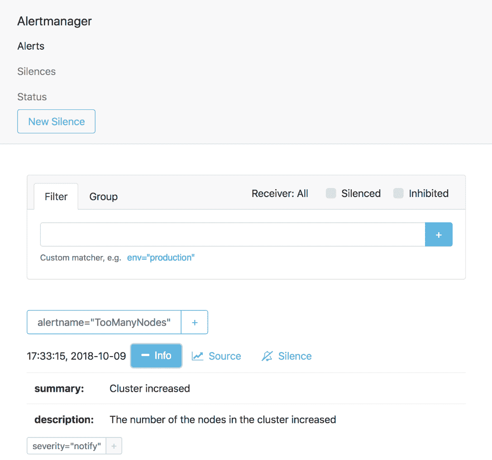图 3-6：Alertmanager UI，其中一个警报已展开

我们可能不会坐在 Alertmanager 前等待问题出现。如果这是我们的目标，我们也可以在 Prometheus 中等待警报。

显示警报确实不是我们拥有 Alertmanager 的原因。它应该接收警报并进一步分发它们。它之所以没有做任何这样的事情，只是因为我们还没有定义它应该用来转发警报的规则。这是我们的下一个任务。

我们将看一下 Prometheus Chart 值的另一个更新。

[PRE34]

输出如下。

[PRE35]

当我们应用该定义时，我们将向 Alertmanager 添加`alertmanager.yml`文件。如果包含了它应该用来分发警报的规则。`route`部分包含了将应用于所有不匹配任何一个`routes`的警报的一般规则。`group_wait`值使 Alertmanager 在同一组的其他警报到达时等待`10`秒。这样，我们将避免接收到相同类型的多个警报。

当一组中的第一个警报被发送时，它将在发送同一组的新警报的下一批之前使用`group_interval`字段（`5m`）的值。

`route`部分中的`receiver`字段定义了警报的默认目的地。这些目的地在下面的`receivers`部分中定义。在我们的情况下，我们默认将警报发送到`slack`接收器。

`repeat_interval`（设置为`3h`）定义了如果 Alertmanager 继续接收警报，警报将在之后的时间段内重新发送。

`routes`部分定义了具体的规则。只有当它们都不匹配时，才会使用上面`route`部分中的规则。`routes`部分继承自上面的属性，因此只有我们在这个部分中定义的规则会改变。我们将继续将匹配的`routes`发送到`slack`，唯一的变化是将`repeat_interval`从`3h`增加到`5d`。

`routes`的关键部分是`match`部分。它定义了用于决定警报是否匹配的过滤器。在我们的情况下，只有那些带有标签`severity: notify`和`frequency: low`的警报才会被视为匹配。

总的来说，带有`severity`标签设置为`notify`和`frequency`设置为`low`的警报将每五天重新发送一次。所有其他警报的频率为三小时。

我们 Alertmanager 配置的最后一部分是`receivers`。我们只有一个名为`slack`的接收器。在`name`下面是`slack_config`。它包含特定于 Slack 的配置。我们可以使用`hipchat_config`，`pagerduty_config`或任何其他受支持的配置。即使我们的目的地不是其中之一，我们也可以始终退回到`webhook_config`并向我们选择的工具的 API 发送自定义请求。

有关所有受支持的`receivers`列表，请参阅*Alertmanager 配置*页面 ([`prometheus.io/docs/alerting/configuration/`](https://prometheus.io/docs/alerting/configuration/))。

在`slack_configs`部分中，我们有包含来自*devops20*频道中一个房间令牌的 Slack 地址的`api_url`。

有关如何为您的 Slack 频道生成传入 Webhook 地址的信息，请访问*传入 Webhooks*页面 ([`api.slack.com/incoming-webhooks`](https://api.slack.com/incoming-webhooks))。

接下来是`send_resolved`标志。当设置为`true`时，Alertmanager 将在警报触发时发送通知，也会在导致问题解决时发送通知。

我们使用`summary`注释作为消息的`title`，并使用`description`注释作为`text`。两者都使用*Go 模板* ([`golang.org/pkg/text/template/`](https://golang.org/pkg/text/template/))。这些是我们在 Prometheus 警报中定义的相同注释。

最后，`title_link`设置为`http://my-prometheus.com/alerts`。这确实不是您的 Prometheus UI 的地址，但由于我事先无法知道您的域名是什么，我放了一个不存在的域名。请随意将`my-prometheus.com`更改为环境变量`$PROM_ADDR`的值。或者保持不变，知道如果您单击该链接，它将不会将您带到您的 Prometheus UI。

现在我们已经探索了 Alertmanager 配置，我们可以继续并升级图表。

[PRE36]

几分钟后，Alertmanager 将被重新配置，下次它从 Prometheus 接收到警报时，它将将其发送到 Slack。我们可以通过访问`devops20.slack.com`工作区来确认。如果您尚未注册，请访问[slack.devops20toolkit.com](http://slack.devops20toolkit.com)。一旦您成为会员，我们可以访问`devops25-tests`频道。

[PRE37]

你应该看到`集群增加`通知。如果你看到其他消息，不要感到困惑。你可能不是唯一一个在运行本书练习的人。

图 3-7：从 Alertmanager 接收到的 Slack 警报消息有时，由于我无法弄清楚的原因，Slack 会收到来自 Alertmanager 的空通知。目前，我因懒惰而忽略了这个问题。

现在我们已经了解了 Prometheus 和 Alertmanager 的基本用法，我们将暂停一下手动操作，并讨论我们可能想要使用的指标类型。

# 我们应该使用哪种指标类型？

如果这是你第一次使用连接到 Kube API 的 Prometheus 指标，可能会感到压力很大。除此之外，还要考虑到配置排除了 Kube API 提供的许多指标，并且我们可以通过额外的导出器进一步扩展范围。

虽然每种情况都是不同的，你可能需要一些特定于你的组织和架构的指标，但是有一些指导方针我们应该遵循。在本节中，我们将讨论关键指标。一旦你通过几个例子理解了它们，你应该能够将它们扩展到你特定的用例中。

每个人都应该利用的四个关键指标是延迟、流量、错误和饱和度。

这四个指标被谷歌的**网站可靠性工程师**（**SREs**）推崇为跟踪系统性能和健康状况的最基本指标。

**延迟**代表服务响应请求所需的时间。重点不仅应该放在持续时间上，还应该区分成功请求的延迟和失败请求的延迟。

**流量**是对服务所承受的需求的衡量。一个例子是每秒的 HTTP 请求次数。

**错误**是由请求失败的速率来衡量的。大多数情况下，这些失败是显式的（例如，HTTP 500 错误），但它们也可以是隐式的（例如，一个 HTTP 200 响应，其中的内容描述了查询没有返回任何结果）。

**饱和度**可以用来描述服务或系统的“充实程度”。一个典型的例子是缺乏 CPU 导致节流，从而降低了应用程序的性能。

随着时间的推移，不同的监控方法被开发出来。例如，我们得到了**USE**方法，该方法规定对于每个资源，我们应该检查**利用率**、**饱和度**和**错误**。另一个是**RED**方法，它将**速率**、**错误**和**持续时间**定义为关键指标。这些和许多其他方法在本质上是相似的，并且与 SRE 对于测量延迟、流量、错误和饱和度的需求没有明显的区别。

我们将逐个讨论 SRE 描述的四种测量类型，并提供一些示例。我们甚至可能会扩展它们，加入一些不一定适合任何四类的指标。首先是延迟。

# 延迟相关问题的警报

我们将使用`go-demo-5`应用程序来测量延迟，所以我们的第一步是安装它。

[PRE38]

我们生成了一个地址，我们将用作 Ingress 入口点，并使用 Helm 部署了应用程序。现在我们应该等待直到它完全部署。

[PRE39]

在继续之前，我们将检查应用程序是否确实通过发送 HTTP 请求正确工作。

[PRE40]

输出应该是熟悉的`hello, world!`消息。

现在，让我们看看是否可以，例如，通过 Ingress 进入系统的请求的持续时间。

[PRE41]

如果您点击“在光标处插入指标”下拉列表，您将能够浏览所有可用的指标。我们正在寻找的是`nginx_ingress_controller_request_duration_seconds_bucket`。正如其名称所示，该指标来自 NGINX Ingress Controller，并提供以秒为单位分组的请求持续时间。

请键入以下表达式，然后单击“执行”按钮。

[PRE42]

在这种情况下，查看原始值可能并不是非常有用，所以请点击“图表”选项卡。

您应该看到图表，每个 Ingress 都有一个。每个图表都在增加，因为所讨论的指标是一个计数器 ([`prometheus.io/docs/concepts/metric_types/#counter`](https://prometheus.io/docs/concepts/metric_types/#counter))。它的值随着每个请求而增加。

Prometheus 计数器是一个累积指标，其值只能增加，或者在重新启动时重置为零。

我们需要计算一段时间内的请求速率。我们将通过结合`sum`和`rate` ([`prometheus.io/docs/prometheus/latest/querying/functions/#rate()`](https://prometheus.io/docs/prometheus/latest/querying/functions/#rate())) 函数来实现这一点。前者应该是不言自明的。

Prometheus 的速率函数计算了范围向量中时间序列的每秒平均增长率。

请输入以下表达式，然后点击“执行”按钮。

[PRE43]

结果图表向我们显示了通过 Ingress 进入系统的所有请求的每秒速率。速率是基于五分钟的间隔计算的。如果您将鼠标悬停在其中一条线上，您将看到额外的信息，如值和 Ingress。`by`语句允许我们按`ingress`对结果进行分组。

尽管如此，单独的结果并不是非常有用，因此让我们重新定义我们的需求。我们应该能够找出有多少请求比 0.25 秒慢。我们无法直接做到这一点。相反，我们可以检索所有那些 0.25 秒或更快的请求。

请输入以下表达式，然后点击“执行”按钮。

[PRE44]

我们真正想要的是找出落入 0.25 秒区间的请求的百分比。为了实现这一点，我们将获取快于或等于 0.25 秒的请求的速率，并将结果除以所有请求的速率。

请输入以下表达式，然后点击“执行”按钮。

[PRE45]

由于我们尚未生成太多流量，您可能在图表中看不到太多内容，除了偶尔与 Prometheus 和 Alertmanager 的交互以及我们发送到`go-demo-5`的单个请求。尽管如此，您可以看到的几行显示了响应时间在 0.25 秒内的请求的百分比。

目前，我们只对`go-demo-5`的请求感兴趣，因此我们将进一步完善表达式，将结果限制为仅限于`go-demo-5`的 Ingress。

请输入以下表达式，然后点击“执行”按钮。

[PRE46]

由于我们只发送了一个请求，图表应该几乎是空的。或者，您可能收到了“未找到数据点”的消息。现在是时候生成一些流量了。

[PRE47]

我们向`go-demo-5`发送了 30 个请求。该应用程序具有延迟响应请求的“隐藏”功能。鉴于我们希望生成具有随机响应时间的流量，我们使用了`DELAY`变量，其随机值最多为 1000 毫秒。现在我们可以重新运行相同的查询，看看是否可以获得一些更有意义的数据。

请等一会儿，直到收集到新请求的数据，然后在 Prometheus 中输入以下表达式，然后点击“执行”按钮。

[PRE48]

这次，我们可以看到新行的出现。在我的情况下（随后的屏幕截图），大约百分之二十五的请求持续时间在 0.25 秒内。换句话说，大约四分之一的请求比预期慢。

图 3-8：带有 0.25 秒持续时间请求百分比的 Prometheus 图表屏幕

过滤特定应用程序（Ingress）的指标在我们知道存在问题并希望进一步挖掘时非常有用。但是，我们仍然需要一个警报，告诉我们存在问题。因此，我们将执行类似的查询，但这次不限制结果为特定应用程序（Ingress）。我们还必须定义一个条件来触发警报，因此我们将将阈值设置为百分之九十五（0.95）。如果没有这样的阈值，每次单个请求变慢时我们都会收到通知。结果，我们会被警报淹没，并很快开始忽视它们。毕竟，如果单个请求变慢，系统并不会有危险，只有当有相当数量的请求变慢时才会有危险。在我们的情况下，这是百分之五的慢请求，或者更准确地说，少于百分之九十五的快速请求。

请键入以下表达式，然后按“执行”按钮。

[PRE49]

我们可以偶尔看到少于百分之九十五的请求在 0.25 秒内。在我的情况下（随后的屏幕截图），我们可以看到 Prometheus、Alertmanager 和`go-demo-5`偶尔变慢。

图 3-9：带有 0.25 秒持续时间请求百分比的 Prometheus 图表屏幕，仅限于高于百分之九十五的结果

唯一缺少的是基于先前表达式定义警报。因此，每当少于百分之九十五的请求持续时间少于 0.25 秒时，我们应该收到通知。

我准备了一组更新后的 Prometheus 图表数值，让我们看看与我们当前使用的图表的差异。

[PRE50]

输出如下。

[PRE51]

我们添加了一个新的警报`AppTooSlow`。如果持续时间为 0.25 秒或更短的请求的百分比小于百分之九十五（`0.95`），它将触发。

我们还将`TooManyNodes`的阈值恢复为其原始值`3`。

接下来，我们将使用新值更新`prometheus`图表，并打开警报屏幕以确认是否确实添加了新警报。

[PRE52]

如果`AppTooSlow`警报仍然不可用，请稍等片刻并刷新屏幕。

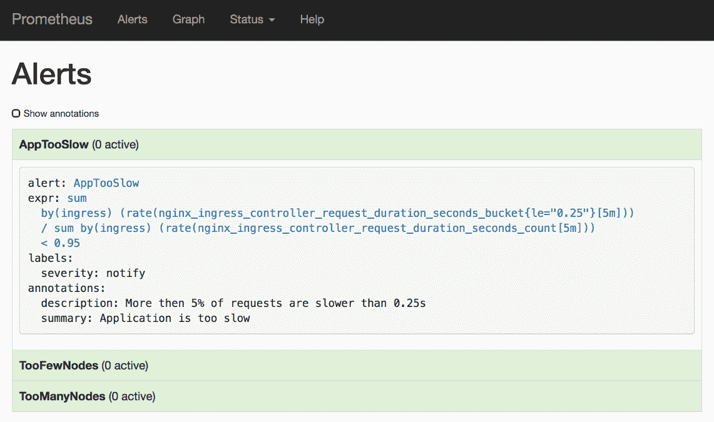图 3-10：Prometheus 警报屏幕

新增的警报可能是绿色的（不会触发）。我们需要生成一些慢请求来看它的作用。

请执行以下命令，发送 30 个具有随机响应时间的请求，最长为 10000 毫秒（10 秒）。

[PRE53]

直到 Prometheus 抓取新的指标并且警报检测到阈值已达到，需要一些时间。过一会儿，我们可以再次打开警报屏幕，检查警报是否确实触发。

[PRE54]

我们可以看到警报的状态是触发。如果这不是您的情况，请再等一会儿并刷新屏幕。在我的情况下（随后的截图），该值为 0.125，意味着只有 12.5％的请求持续时间为 0.25 秒或更短。

如果`prometheus-server`，`prometheus-alertmanager`或其他一些应用程序响应缓慢，`AppTooSlow`内可能会有两个或更多活动警报。图 3-11：带有一个触发警报的 Prometheus 警报屏幕

警报是红色的，意味着 Prometheus 将其发送到 Alertmanager，后者又将其转发到 Slack。让我们确认一下。

[PRE55]

正如您所看到的（随后的截图），我们收到了两个通知。由于我们将`TooManyNodes`警报的阈值恢复为大于三个节点，并且我们的集群节点较少，因此 Prometheus 向 Alertmanager 发送了问题已解决的通知。结果，我们在 Slack 中收到了新的通知。这次，消息的颜色是绿色的。

接着，出现了一个新的红色消息，指示“应用程序太慢”。

图 3-12：Slack 显示触发（红色）和解决（绿色）消息

我们经常不能依赖单一规则来适用于所有应用程序。例如，Prometheus 和 Jenkins 可能是内部应用程序的良好候选者，我们不能期望其响应时间低于 0.25 秒的百分之五。因此，我们可能需要进一步过滤警报。我们可以使用任意数量的标签来实现这一点。为了简单起见，我们将继续利用`ingress`标签，但这次我们将使用正则表达式来排除一些应用程序（Ingress）的警报。

让我们再次打开图表屏幕。

[PRE56]

请键入以下表达式，点击“执行”按钮，然后切换到*图表*选项卡。

[PRE57]

与之前的查询相比，新增的是`ingress!~"prometheus-server|jenkins"`过滤器。`!~`用于选择具有不与`prometheus-server|jenkins`字符串匹配的标签的指标。由于`|`等同于`or`语句，我们可以将该过滤器翻译为“所有不是`prometheus-server`或不是`jenkins`的内容”。我们的集群中没有 Jenkins。我只是想向您展示一种排除多个值的方法。

图 3-13：Prometheus 图表屏幕，显示了持续时间为 0.25 秒的请求百分比，结果不包括 prometheus-server 和 jenkins

我们可以再复杂一点，指定`ingress!~"prometheus.+|jenkins.+`作为过滤器。在这种情况下，它将排除所有名称以`prometheus`和`jenkins`开头的 Ingress。关键在于`.+`的添加，在正则表达式中，它匹配一个或多个任何字符的条目（`+`）。

我们不会详细解释正则表达式的语法。我希望您已经熟悉它。如果您不熟悉，您可能需要搜索一下或访问*正则表达式维基*页面（[`en.wikipedia.org/wiki/Regular_expression`](https://en.wikipedia.org/wiki/Regular_expression)）。

之前的表达式只检索不是`prometheus-server`和`jenkins`的结果。我们可能需要创建另一个表达式，只包括这两个。

请键入以下表达式，然后点击“执行”按钮。

[PRE58]

与之前的表达式相比，唯一的区别是这次我们使用了`=~`运算符。它选择与提供的字符串匹配的标签。此外，桶（`le`）现在设置为`0.5`秒，因为这两个应用程序可能需要更多时间来响应，我们可以接受这一点。

在我的情况下，图表显示`prometheus-server`的请求百分比为百分之百，持续时间在 0.5 秒内（在您的情况下可能不是真的）。

图 3-14：Prometheus 图表屏幕，显示了持续 0.5 秒的请求百分比，以及仅包括 prometheus-server 和 jenkins 的结果

少数延迟示例应该足以让您了解这种类型的指标，所以我们将转向流量。

# 流量相关问题的警报

到目前为止，我们测量了应用程序的延迟，并创建了在达到基于请求持续时间的特定阈值时触发的警报。这些警报不是基于进入的请求数量（流量），而是基于慢请求的百分比。即使只有一个请求进入应用程序，只要持续时间超过阈值，`AppTooSlow`也会触发。为了完整起见，我们需要开始测量流量，或者更准确地说，是发送到每个应用程序和整个系统的请求数。通过这样做，我们可以知道我们的系统是否承受了很大的压力，并决定是否要扩展我们的应用程序，增加更多的工作人员，或者采取其他解决方案来缓解问题。如果请求的数量达到异常数字，清楚地表明我们正在遭受**拒绝服务**（**DoS**）攻击（[`en.wikipedia.org/wiki/Denial-of-service_attack`](https://en.wikipedia.org/wiki/Denial-of-service_attack)），我们甚至可以选择阻止部分传入流量。

我们将开始创建一些流量，以便我们可以用来可视化请求。

[PRE59]

我们向`go-demo-5`应用程序发送了一百个请求，并打开了 Prometheus 的图表屏幕。

我们可以通过`nginx_ingress_controller_requests`获取进入 Ingress 控制器的请求数。由于它是一个计数器，我们可以继续使用`rate`函数结合`sum`。最后，我们可能想要按`ingress`标签对请求的速率进行分组。

请键入下面的表达式，按“执行”按钮，然后切换到*图表*选项卡。

[PRE60]

图表的右侧显示了一个峰值。它显示了通过具有相同名称的 Ingress 发送到`go-demo-5`应用程序的请求。

在我的情况下（随后的屏幕截图），峰值接近每秒一个请求（您的情况将不同）。

图 3-15：Prometheus 的图形屏幕显示请求数量的速率

我们可能更感兴趣的是每个应用程序每秒每个副本的请求数，因此我们的下一个任务是找到一种检索该数据的方法。由于`go-demo-5`是一个部署，我们可以使用`kube_deployment_status_replicas`。

请键入以下表达式，然后按“执行”按钮。

[PRE61]

我们可以看到系统中每个部署的副本数量。在我的情况下，`go-demo-5` 应用程序以红色（后续截图）显示，有三个副本。

图 3-16：Prometheus 的图形屏幕显示部署的副本数量

接下来，我们应该组合这两个表达式，以获得每个副本每秒的请求数。然而，我们面临一个问题。要使两个指标结合，它们需要具有匹配的标签。`go-demo-5`的部署和入口都具有相同的名称，因此我们可以利用这一点，假设我们可以重命名其中一个标签。我们将借助`label_join`（[`prometheus.io/docs/prometheus/latest/querying/functions/#label_join()`](https://prometheus.io/docs/prometheus/latest/querying/functions/#label_join())）函数来实现这一点。

对于 v 中的每个时间序列，`label_join(v instant-vector, dst_label string, separator string, src_label_1 string, src_label_2 string, ...)`使用分隔符连接所有`src_labels`的值，并返回包含连接值的标签`dst_label`的时间序列。

如果之前对`label_join`函数的解释让你感到困惑，你并不孤单。相反，让我们通过一个示例来了解，该示例将通过添加`ingress`标签来转换`kube_deployment_status_replicas`，该标签将包含来自`deployment`标签的值。如果我们成功了，我们将能够将结果与`nginx_ingress_controller_requests`组合，因为两者都具有相同的匹配标签（`ingress`）。

请键入以下表达式，然后按“执行”按钮。

[PRE62]

由于这次我们主要关注标签的值，请通过点击选项卡切换到控制台视图。

从输出中可以看出，每个指标现在都包含一个额外的标签`ingress`，其值与`deployment`相同。

图 3-17：Prometheus 的控制台视图显示部署副本状态和从部署标签创建的新标签 ingress

现在我们可以结合这两个指标。

请键入以下表达式，然后按“执行”按钮。

[PRE63]

切换回*图表*视图。

我们计算了每个应用程序（`ingress`）的请求数量的速率，并将其除以每个应用程序（`ingress`）的副本总数。最终结果是每个应用程序（`ingress`）每个副本的请求数量的速率。

值得注意的是，我们无法检索每个特定副本的请求数量，而是每个副本的平均请求数量。在大多数情况下，这种方法应该有效，因为 Kubernetes 网络通常执行轮询，导致向每个副本发送的请求数量多少相同。

总的来说，现在我们知道我们的副本每秒收到多少请求。

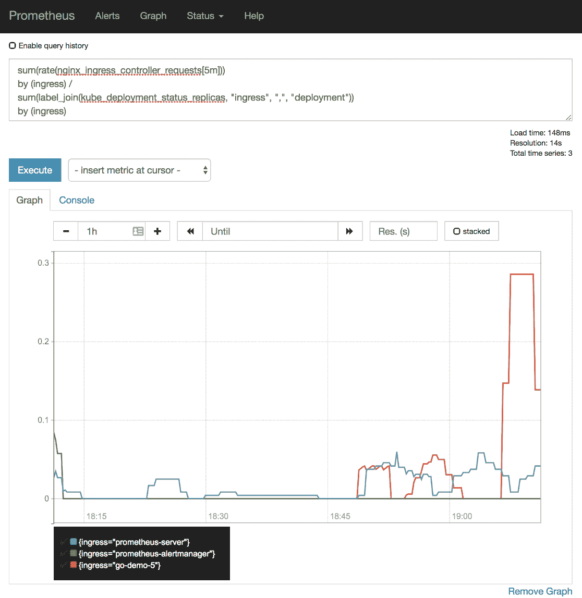图 3-18：普罗米修斯图表屏幕，显示请求数量除以部署副本数量的速率

现在我们已经学会了如何编写一个表达式来检索每秒每个副本的请求数量的速率，我们应该将其转换为警报。

因此，让我们来看看普罗米修斯图表值的旧定义和新定义之间的区别。

[PRE64]

输出如下。

[PRE65]

我们可以看到表达式几乎与我们在普罗米修斯图表屏幕中使用的表达式相同。唯一的区别是我们将阈值设置为`0.1`。因此，该警报应在副本每秒收到的请求数超过五分钟内计算的速率`0.1`时通知我们。你可能已经猜到，每秒`0.1`个请求是一个太低的数字，不能在生产中使用。然而，它将使我们能够轻松触发警报并看到它的作用。

现在，让我们升级我们的图表，并打开普罗米修斯的警报屏幕。

[PRE66]

请刷新屏幕，直到`TooManyRequests`警报出现。

图 3-19：普罗米修斯警报屏幕

接下来，我们将生成一些流量，以便我们可以看到警报是如何生成并通过 Alertmanager 发送到 Slack 的。

[PRE67]

我们发送了两百个请求，并重新打开了普罗米修斯的警报屏幕。现在我们应该刷新屏幕，直到`TooManyRequests`警报变为红色。

普罗米修斯一旦触发了警报，就会被发送到 Alertmanager，然后转发到 Slack。让我们确认一下。

[PRE68]

我们可以看到“请求过多”的通知，从而证明了这个警报的流程是有效的。

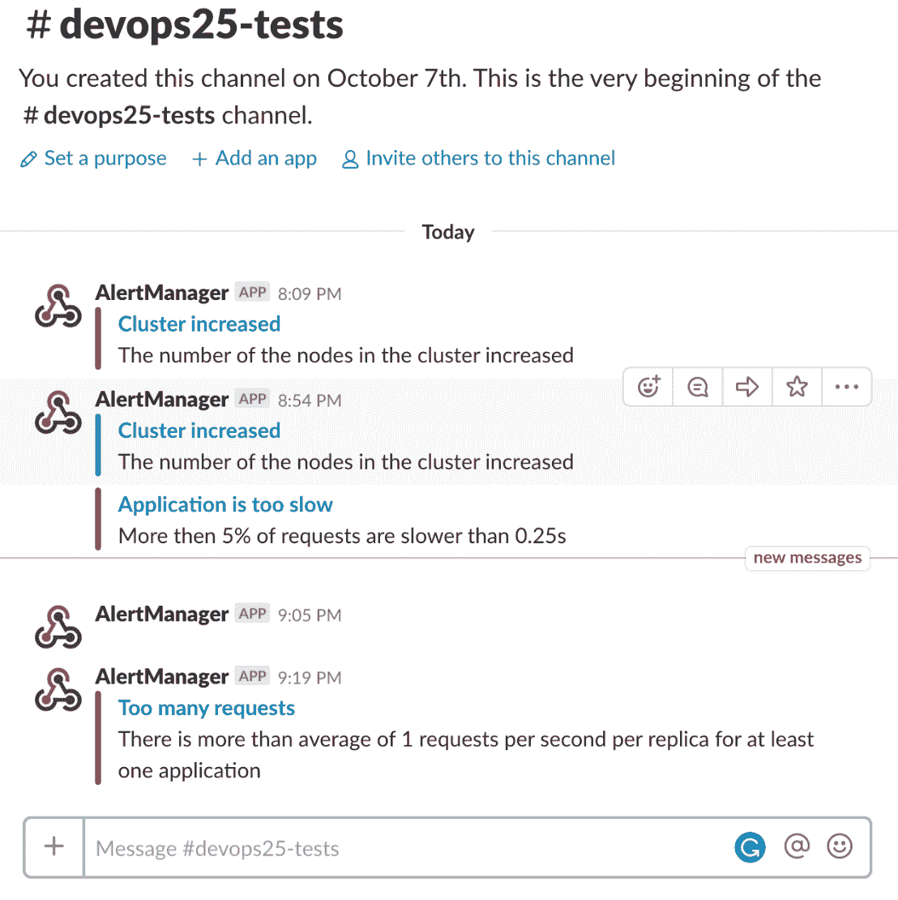图 3-20：Slack 与警报消息

接下来，我们将转向与错误相关的指标。

# 关于错误相关问题的警报

我们应该时刻注意我们的应用程序或系统是否产生错误。然而，我们不能在第一次出现错误时就开始惊慌，因为那样会产生太多通知，我们很可能会忽略它们。

错误经常发生，许多错误是由自动修复的问题或由我们无法控制的情况引起的。如果我们要对每个错误执行操作，我们就需要一支全天候工作的人员团队，专门解决通常不需要解决的问题。举个例子，因为有一个单独的响应代码在 500 范围内而进入“恐慌”模式几乎肯定会产生永久性危机。相反，我们应该监视错误的比率与总请求数量的比较，并且只有在超过一定阈值时才做出反应。毕竟，如果一个错误持续存在，那么错误率肯定会增加。另一方面，如果错误率持续很低，这意味着问题已经被系统自动修复（例如，Kubernetes 重新安排了从失败节点中的 Pod）或者这是一个不重复的孤立案例。

我们的下一个任务是检索请求并根据它们的状态进行区分。如果我们能做到这一点，我们应该能够计算出错误的比率。

我们将从生成一些流量开始。

[PRE69]

我们发送了一百个请求并打开了 Prometheus 的图形屏幕。

让我们看看我们之前使用的`nginx_ingress_controller_requests`指标是否提供了请求的状态。

请键入以下表达式，然后点击执行按钮。

[PRE70]

我们可以看到 Prometheus 最近抓取的所有数据。如果我们更加关注标签，我们会发现，其中包括`status`。我们可以使用它来根据请求的总数计算出错误的百分比（例如，500 范围内的错误）。

我们已经看到我们可以使用`ingress`标签来按应用程序分别计算，假设我们只对那些面向公众的应用程序感兴趣。

图 3-21：通过 Ingress 进入的 Prometheus 控制台视图的请求

`go-demo-5`应用程序有一个特殊的端点`/demo/random-error`，它将生成随机的错误响应。大约每十个对该地址的请求中就会产生一个错误。我们可以用这个来测试我们的表达式。

[PRE71]

我们向`/demo/random-error`端点发送了一百个请求，大约有 10%的请求产生了错误（HTTP 状态码`500`）。

接下来，我们将不得不等待一段时间，让 Prometheus 抓取新的一批指标。之后，我们可以打开图表屏幕，尝试编写一个表达式，以检索我们应用程序的错误率。

[PRE72]

请键入以下表达式，然后按执行按钮。

[PRE73]

我们使用了`5..`正则表达式来计算按`ingress`分组的带有错误的请求的比率，并将结果除以所有请求的比率。结果按`ingress`分组。在我的情况下（随后的截图），结果大约为 4%（`0.04`）。Prometheus 尚未抓取所有指标，我预计在下一次抓取迭代中这个数字会接近 10%。

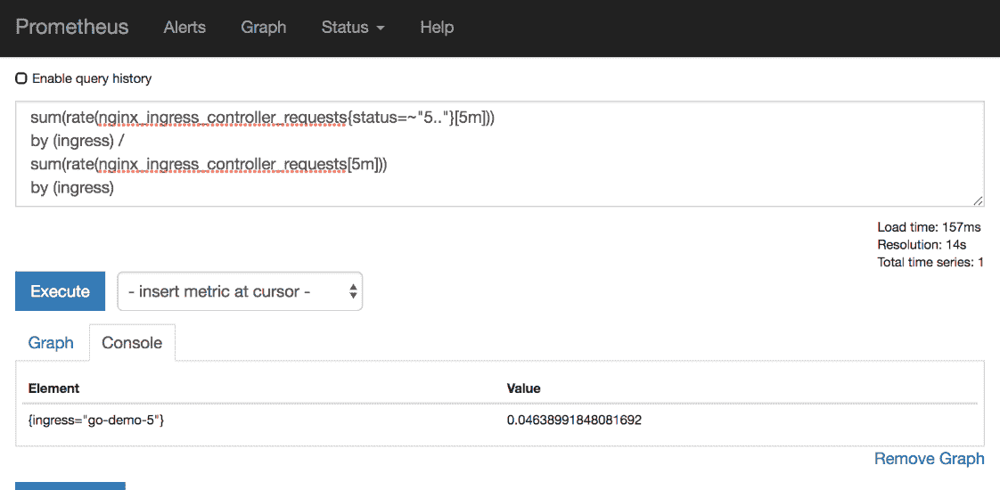图 3-22：带有错误响应请求百分比的 Prometheus 图表屏幕

让我们比较图表值文件的更新版本与我们之前使用的版本。

[PRE74]

输出如下。

[PRE75]

如果错误率超过总请求率的 2.5%，警报将触发。

现在我们可以升级我们的 Prometheus 图表。

[PRE76]

我们可能不需要确认警报是否有效。我们已经看到 Prometheus 将所有警报发送到 Alertmanager，然后从那里转发到 Slack。

接下来，我们将转移到饱和度指标和警报。

# 饱和度相关问题的警报

饱和度衡量了我们的服务和系统的充实程度。如果我们的服务副本处理了太多的请求并被迫排队处理其中一些，我们应该意识到这一点。我们还应该监视我们的 CPU、内存、磁盘和其他资源的使用是否达到了临界限制。

现在，我们将专注于 CPU 使用率。我们将首先打开 Prometheus 的图表屏幕。

[PRE77]

让我们看看是否可以获得节点（`instance`）的 CPU 使用率。我们可以使用`node_cpu_seconds_total`指标来实现。但是，它被分成不同的模式，我们将不得不排除其中的一些模式，以获得“真实”的 CPU 使用率。这些将是`idle`，`iowait`，和任何类型的`guest`周期。

请键入以下表达式，然后按执行按钮。

[PRE78]

切换到*图表*视图。

输出代表了系统中 CPU 的实际使用情况。在我的情况下（以下是屏幕截图），除了临时的峰值，所有节点的 CPU 使用量都低于一百毫秒。

系统远未处于压力之下。

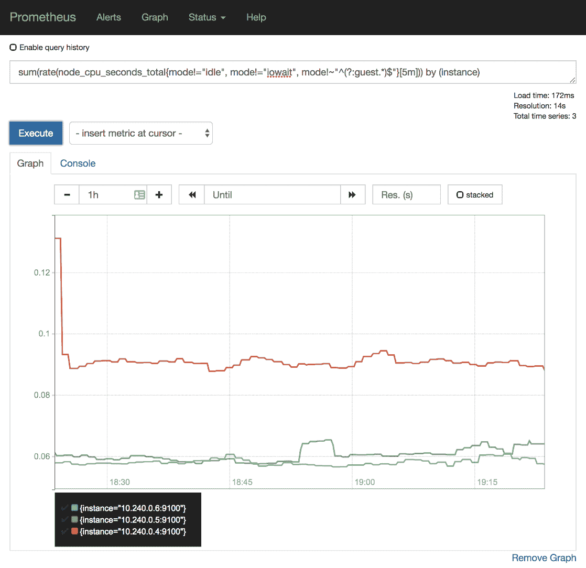图 3-23：Prometheus 的图表屏幕，显示了按节点实例分组的 CPU 使用率

正如您已经注意到的，绝对数字很少有用。我们应该尝试发现使用的 CPU 百分比。我们需要找出我们的节点有多少 CPU。我们可以通过计算指标的数量来做到这一点。每个 CPU 都有自己的数据条目，每种模式都有一个。如果我们将结果限制在单个模式（例如`system`）上，我们应该能够获得 CPU 的总数。

请输入以下表达式，然后点击执行按钮。

[PRE79]

在我的情况下（以下是屏幕截图），总共有六个核心。如果您使用的是 GKE、EKS 或来自 Gists 的 AKS，您的情况可能也是六个。另一方面，如果您在 Docker for Desktop 或 minikube 中运行集群，结果应该是一个节点。

现在我们可以结合这两个查询来获取使用的 CPU 百分比

请输入以下表达式，然后点击执行按钮。

[PRE80]

我们总结了使用的 CPU 速率，并将其除以 CPU 的总数。在我的情况下（以下是屏幕截图），当前仅使用了三到四个百分比的 CPU。

这并不奇怪，因为大部分系统都处于休眠状态。我们的集群现在并没有太多活动。

图 3-24：Prometheus 的图表屏幕，显示了可用 CPU 的百分比

现在我们知道如何获取整个集群使用的 CPU 百分比，我们将把注意力转向应用程序。

我们将尝试发现我们有多少可分配的核心。从应用程序的角度来看，至少当它们在 Kubernetes 中运行时，可分配的 CPU 显示了可以为 Pods 请求多少。可分配的 CPU 始终低于总 CPU。

请输入以下表达式，然后点击执行按钮。

[PRE81]

输出应该低于我们的虚拟机使用的核心数。可分配的核心显示了可以分配给容器的 CPU 数量。更准确地说，可分配的核心是分配给节点的 CPU 数量减去系统级进程保留的数量。在我的情况下（以下是屏幕截图），几乎有两个完整的可分配 CPU。

图 3-25：Prometheus 的图表屏幕，显示集群中每个节点的可分配 CPU

然而，在这种情况下，我们对可分配的 CPU 总量感兴趣，因为我们试图发现我们的 Pods 在整个集群中使用了多少。因此，我们将对可分配的核心求和。

请键入以下表达式，然后按“执行”按钮。

[PRE82]

在我的情况下，可分配的 CPU 总数大约为 5.8 个核心。要获取确切的数字，请将鼠标悬停在图表线上。

现在我们知道了有多少可分配的 CPU，我们应该尝试发现 Pods 请求了多少。

请注意，请求的资源与已使用的资源不同。我们稍后会讨论这种情况。现在，我们想知道我们从系统中请求了多少。

请键入以下表达式，然后按“执行”按钮。

[PRE83]

我们可以看到请求的 CPU 相对较低。在我的情况下，所有请求 CPU 的容器值都低于 0.15（一百五十毫秒）。您的结果可能有所不同。

与可分配的 CPU 一样，我们对请求的 CPU 总和感兴趣。稍后，我们将能够结合这两个结果，并推断集群中还有多少未保留的资源。

请键入以下表达式，然后按“执行”按钮。

[PRE84]

我们对所有 CPU 资源请求求和。结果是，在我的情况下（随后的屏幕截图），所有请求的 CPU 略低于 1.5。

图 3-26：Prometheus 的图表屏幕，显示请求的 CPU 总和

现在，让我们结合这两个表达式，看看请求的 CPU 百分比。

请键入以下表达式，然后按“执行”按钮。

[PRE85]

在我的情况下，输出显示大约四分之一（0.25）的可分配 CPU 被保留。这意味着在我们达到扩展集群的需要之前，我们可以有四倍的 CPU 请求。当然，您已经知道，如果存在的话，集群自动扩展器会在此之前添加节点。但是，知道我们接近达到 CPU 限制是很重要的。集群自动扩展器可能无法正常工作，或者甚至可能根本没有激活。如果有的话，后一种情况对于大多数本地集群来说是真实的。

让我们看看我们是否可以将我们探索的表达式转换为警报。

我们将探讨一组新的图表值与之前使用的值之间的另一个差异。

[PRE86]

输出如下。

[PRE87]

[PRE88]

从差异中我们可以看到，我们将`TooManyRequests`的原始阈值恢复为`1`，并添加了两个名为`NotEnoughCPU`和`TooMuchCPURequested`的新警报。

如果整个集群的 CPU 使用率超过百分之九十并持续超过三十分钟，`NotEnoughCPU`警报将会触发。这样我们就可以避免在 CPU 使用率暂时飙升时设置警报。

`TooMuchCPURequested`也有百分之九十的阈值，如果持续超过三十分钟，将会触发警报。该表达式计算请求的总量与可分配 CPU 的总量之间的比率。

这两个警报都是我们之前执行的 Prometheus 表达式的反映，所以您应该已经熟悉它们的用途。

让我们使用新的值升级 Prometheus 的图表并打开警报屏幕。

[PRE89]

现在剩下的就是等待两个新的警报出现。如果它们还没有出现，请刷新您的屏幕。

现在可能没有必要看新的警报如何起作用。到现在为止，您应该相信这个流程，没有理由认为它们不会触发。

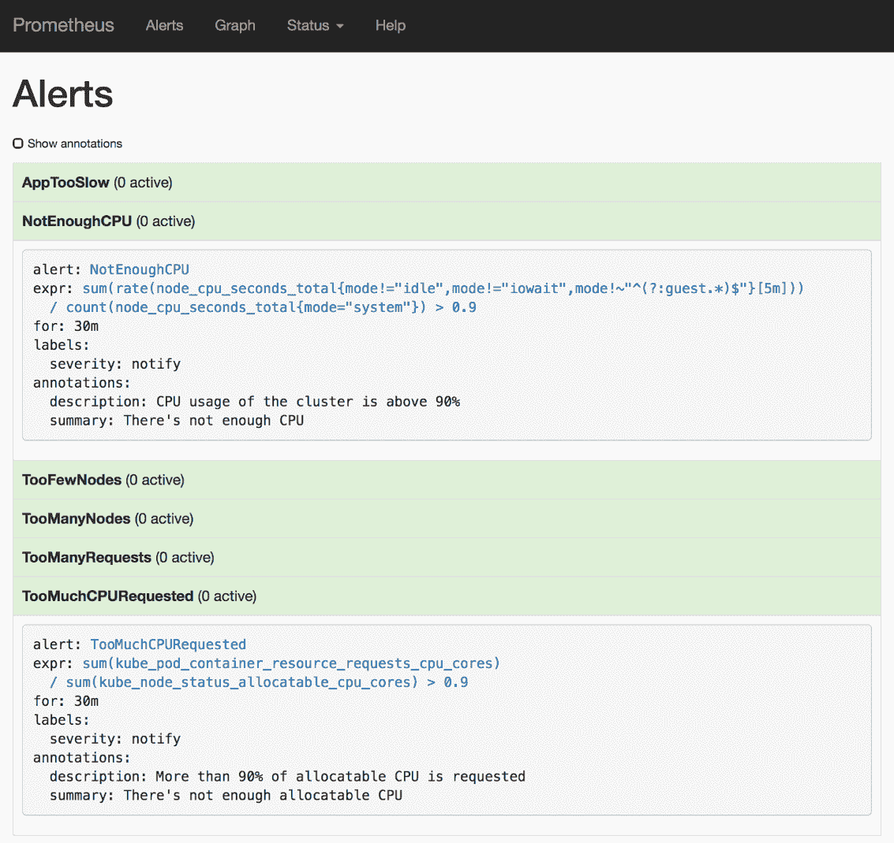图 3-27：Prometheus 的警报屏幕

在“现实世界”场景中，接收到这两个警报中的一个可能会引发不同的反应，这取决于我们使用的 Kubernetes 版本。

如果我们有集群自动缩放器（CA），我们可能不需要`NotEnoughCPU`和`TooMuchCPURequested`警报。节点 CPU 使用率达到百分之九十并不会影响集群的正常运行，只要我们的 CPU 请求设置正确。同样，百分之九十的可分配 CPU 被保留也不是问题。如果 Kubernetes 无法安排新的 Pod，因为所有 CPU 都被保留，它将扩展集群。实际上，接近满负荷的 CPU 使用率或几乎所有可分配的 CPU 被保留是件好事。这意味着我们拥有我们所需的 CPU，并且我们不必为未使用的资源付费。然而，这种逻辑主要适用于云服务提供商，甚至并非所有云服务提供商都适用。今天（2018 年 10 月），集群自动缩放器只在 AWS、GCE 和 Azure 中运行。

所有这些并不意味着我们应该只依赖于集群自动缩放器。它也可能出现故障，就像其他任何东西一样。然而，由于集群自动缩放器是基于观察无法调度的 Pods，如果它无法工作，我们应该通过观察 Pod 状态而不是 CPU 使用率来检测到这一点。不过，当 CPU 使用率过高时接收警报也许并不是一个坏主意，但在这种情况下，我们可能希望将阈值增加到接近百分之百的值。

如果我们的集群是本地的，更准确地说，如果它没有集群自动缩放器，那么我们探讨的警报对于我们的集群扩展流程是否没有自动化或者速度较慢是至关重要的。逻辑很简单。如果我们需要超过几分钟来向集群添加新节点，我们就不能等到 Pods 无法调度。那将为时已晚。相反，我们需要知道在集群变满（饱和）之前我们已经没有可用容量，这样我们就有足够的时间通过向集群添加新节点来做出反应。

然而，拥有一个因为集群自动缩放器不工作而不自动缩放的集群并不是一个足够好的借口。我们有很多其他工具可以用来自动化我们的基础设施。当我们设法到达这样一个地步，我们可以自动向集群添加新节点时，警报的目的地应该改变。我们可能不再希望收到 Slack 通知，而是希望向一个服务发送请求，该服务将执行脚本，从而向集群添加新节点。如果我们的集群是在虚拟机上运行的，我们总是可以通过脚本（或某个工具）添加更多节点。

接收 Slack 通知的唯一真正理由是如果我们的集群是运行在裸机上的。在这种情况下，我们不能指望脚本会神奇地创建新的服务器。对于其他人来说，当 CPU 使用过高或者所有分配的 CPU 都被保留时接收 Slack 通知应该只是一个临时解决方案，直到适当的自动化到位为止。

现在，让我们尝试通过测量内存使用和保留来实现类似的目标。

测量内存消耗与 CPU 类似，但也有一些我们应该考虑的不同之处。但在我们到达那里之前，让我们回到 Prometheus 的图表界面，探索我们的第一个与内存相关的指标。

[PRE90]

就像 CPU 一样，首先我们需要找出每个节点有多少内存。

请键入以下表达式，点击“执行”按钮，然后切换到*图表*选项卡。

[PRE91]

你的结果可能与我的不同。在我的情况下，每个节点大约有 4GB 的 RAM。

知道每个节点有多少 RAM 是没有用的，如果不知道当前有多少 RAM 可用。我们可以通过`node_memory_MemAvailable_bytes`指标获得这些信息。

请在下面输入表达式，然后按“执行”按钮。

[PRE92]

我们可以看到集群中每个节点的可用内存。在我的情况下（如下截图所示），每个节点大约有 3GB 的可用 RAM。

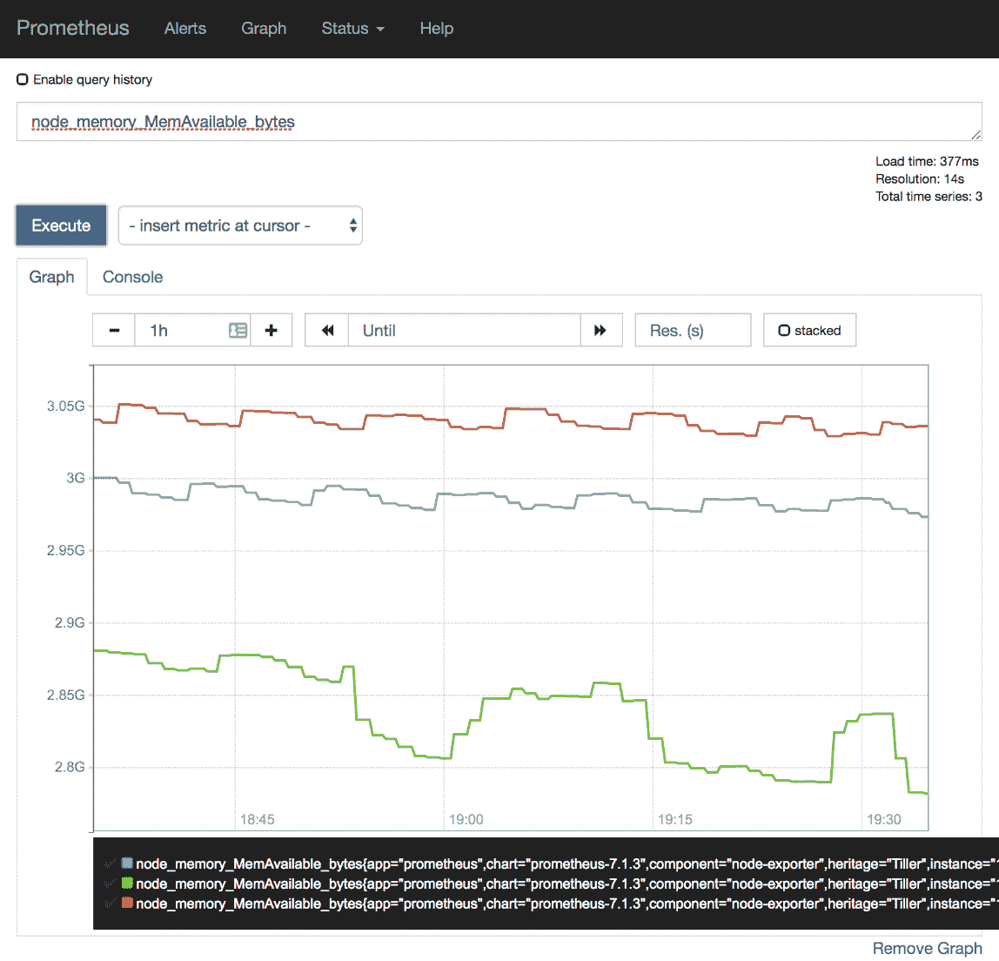图 3-28：Prometheus 的图表屏幕，显示集群中每个节点的可用内存

现在我们知道如何从每个节点获取总内存和可用内存，我们应该结合查询来获得整个集群已使用内存的百分比。

请在下面输入表达式，然后按“执行”按钮。

[PRE93]

由于我们正在寻找已使用内存的百分比，并且我们有可用内存的指标，我们从`1 -`开始表达式，这将颠倒结果。表达式的其余部分是可用和总内存的简单除法。在我的情况下（如下截图所示），每个节点上使用的内存不到 30%。

图 3-29：Prometheus 的图表屏幕，显示可用内存的百分比

就像 CPU 一样，可用和总内存并不能完全反映实际情况。虽然这是有用的信息，也是潜在警报的基础，但我们还需要知道有多少内存可分配，以及有多少内存被 Pod 使用。我们可以通过`kube_node_status_allocatable_memory_bytes`指标获得第一个数字。

请在下面输入表达式，然后按“执行”按钮。

[PRE94]

根据 Kubernetes 的版本和您使用的托管提供商，总内存和可分配内存之间可能存在很小或很大的差异。我在 AKS 中运行集群，可分配内存比总内存少了整整 1GB。前者大约为 3GB RAM，而后者大约为 4GB RAM。这是一个很大的差异。我的 Pod 并没有完整的 4GB 内存，而是少了大约四分之一。其余的大约 1GB RAM 花费在系统级服务上。更糟糕的是，这 1GB RAM 花费在每个节点上，而在我的情况下，这导致总共少了 3GB，因为我的集群有三个节点。鉴于总内存和可分配内存之间的巨大差异，拥有更少但更大的节点是有明显好处的。然而，并不是每个人都需要大节点，如果我们希望节点分布在所有区域，将节点数量减少到少于三个可能不是一个好主意。

现在我们知道如何检索可分配内存量，让我们看看如何获取每个应用程序所请求的内存量。

请键入以下表达式，然后按“执行”按钮。

[PRE95]

我们可以看到 Prometheus（服务器）具有最多的请求内存（500MB），而其他所有的请求内存都远低于这个数值。请记住，我们只看到了具有预留的 Pod，那些没有预留的 Pod 不会出现在该查询的结果中。正如您已经知道的那样，在特殊情况下，例如用于 CI/CD 流程中的短暂 Pod，不定义预留和限制是可以的。

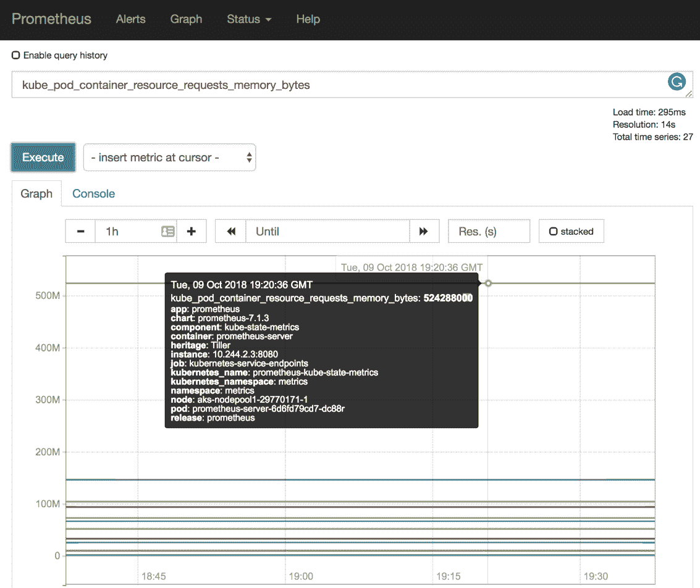图 3-30：Prometheus 的图形屏幕显示了每个 Pod 所请求的内存

前面的表达式返回了每个 Pod 使用的内存量。然而，我们的任务是发现系统中总共有多少请求的内存。

请键入以下表达式，然后按“执行”按钮。

[PRE96]

在我的情况下，所请求的内存总量大约为 1.6GB RAM。

现在剩下的就是将总请求的内存量除以集群中所有可分配的内存量。

请键入以下表达式，然后按“执行”按钮。

[PRE97]

在我的情况下（以下是屏幕截图），请求内存的总量约为集群可分配 RAM 的百分之二十（`0.2`）。我远非处于任何危险之中，也没有必要扩展集群。如果有什么，我有太多未使用的内存，可能想要缩减规模。然而，目前我们只关注扩展规模。稍后我们将探讨可能导致缩减规模的警报。

图 3-31：Prometheus 的图表屏幕，显示集群中请求内存占总可分配内存的百分比

让我们看看旧图表数值和我们即将使用的数值之间的差异。

[PRE98]

输出如下。

[PRE99]

我们添加了两个新的警报（“内存不足”和“请求内存过多”）。定义本身应该很简单，因为我们已经创建了相当多的警报。表达式与我们在 Prometheus 图表屏幕中使用的表达式相同，只是增加了大于百分之九十（`> 0.9`）的阈值。因此，我们将跳过进一步的解释。

我们将使用新值升级我们的 Prometheus 图表，并打开警报屏幕以确认它们。

[PRE100]

如果警报“内存不足”和“请求内存过多”尚不可用，请稍等片刻，然后刷新屏幕。

图 3-32：Prometheus 的警报屏幕

到目前为止，基于内存的警报所采取的操作应该与我们讨论 CPU 时类似。我们可以使用它们来决定是否以及何时扩展我们的集群，无论是通过手动操作还是通过自动化脚本。就像以前一样，如果我们的集群托管在 Cluster Autoscaler（CA）支持的供应商之一，这些警报应该纯粹是信息性的，而在本地或不受支持的云提供商那里，它们不仅仅是简单的通知。它们表明我们即将耗尽容量，至少在涉及内存时是这样。

CPU 和内存的示例都集中在需要知道何时扩展我们的集群。我们可能会创建类似的警报，通知我们 CPU 或内存的使用率过低。这将清楚地告诉我们，我们的集群中有太多节点，我们可能需要移除一些。同样，这假设我们没有集群自动缩放器正在运行。但是，仅考虑 CPU 或内存中的一个来缩减规模太冒险，可能会导致意想不到的结果。

假设只有百分之十二的可分配 CPU 被保留，并且我们的集群中有三个工作节点。由于平均每个节点的保留 CPU 量相对较小，这么低的 CPU 使用率当然不需要那么多节点。因此，我们可以选择缩减规模，并移除一个节点，从而允许其他集群重用它。这样做是一个好主意吗？嗯，这取决于其他资源。如果内存预留的百分比也很低，移除一个节点是一个好主意。另一方面，如果保留的内存超过百分之六十六，移除一个节点将导致资源不足。当我们移除三个节点中的一个时，三个节点中超过百分之六十六的内存预留变成了两个节点中超过百分之一百。

总的来说，如果我们要收到通知，我们的集群需要缩减规模（而且我们没有集群自动缩放器），我们需要将内存和 CPU 以及可能还有其他一些指标作为警报阈值的组合。幸运的是，这些表达式与我们之前使用的非常相似。我们只需要将它们组合成一个单一的警报并更改阈值。

作为提醒，我们之前使用的表达式如下（无需重新运行）。

[PRE101]

现在，让我们将图表的值的另一个更新与我们现在使用的进行比较。

[PRE102]

输出如下。

[PRE103]

我们正在添加一个名为`TooMuchCPUAndMemory`的新警报。它是以前两个警报的组合。只有当 CPU 和内存使用率都低于百分之五十时，它才会触发。这样我们就可以避免发送错误的警报，并且不会因为资源预留（CPU 或内存）之一太低而诱发缩减集群的决定，而另一个可能很高。

在我们进入下一个主题（或指标类型）之前，剩下的就是升级 Prometheus 的图表并确认新的警报确实是可操作的。

[PRE104]

如果警报仍然不存在，请刷新警报屏幕。在我的情况下（以下是屏幕截图），保留内存和 CPU 的总量低于百分之五十，并且警报处于挂起状态。在您的情况下，这可能并不是真的，警报可能还没有达到其阈值。尽管如此，我将继续解释我的情况，在这种情况下，CPU 和内存使用量都低于总可用量的百分之五十。

三十分钟后（`for: 30m`），警报触发了。它等了一会儿（`30m`）以确认内存和 CPU 使用率的下降不是暂时的。鉴于我在 AKS 中运行我的集群，集群自动缩放器会在三十分钟之前删除一个节点。但是，由于它配置为最少三个节点，CA 将不执行该操作。因此，我可能需要重新考虑是否支付三个节点是值得的投资。另一方面，如果我的集群没有集群自动缩放器，并且假设我不想在其他集群可能需要更多资源的情况下浪费资源，我需要删除一个节点（手动或自动）。如果那个移除是自动的，目的地将不是 Slack，而是负责删除节点的工具的 API。

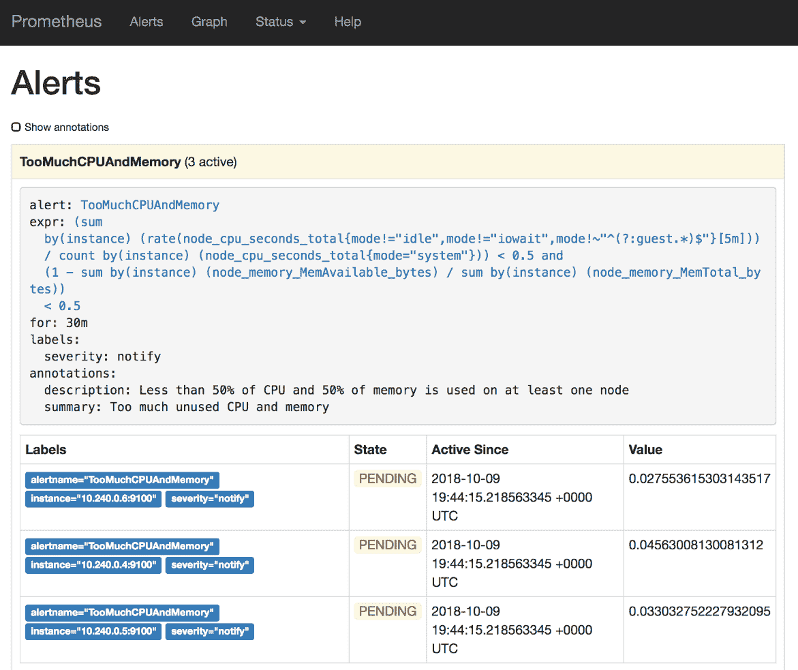图 3-33：Prometheus 的警报屏幕，其中一个警报处于挂起状态

现在我们已经有了一些饱和的例子，我们涵盖了谷歌网站可靠性工程师和几乎任何其他监控方法所推崇的每个指标。但我们还没有完成。还有一些其他指标和警报我想探索。它们可能不属于讨论的任何类别，但它们可能证明非常有用。

# 对无法调度或失败的 Pod 进行警报

知道我们的应用程序是否在快速响应请求方面出现问题，是否受到了比其处理能力更多的请求，是否产生了太多错误，以及是否饱和，如果它们甚至没有运行，这就没有用了。即使我们的警报通过通知我们出现了太多错误或由于副本数量不足而导致响应时间变慢，我们仍然应该被告知，例如，一个或甚至所有副本无法运行。在最好的情况下，这样的通知将提供有关问题原因的额外信息。在更糟糕的情况下，我们可能会发现数据库的一个副本没有运行。这不一定会减慢速度，也不会产生任何错误，但会使我们处于数据无法复制的状态（额外的副本没有运行），如果最后一个剩下的副本也失败，我们可能会面临其状态的完全丢失。

应用程序无法运行的原因有很多。集群中可能没有足够的未保留资源。如果出现这种情况，集群自动缩放器将处理该问题。但是，还有许多其他潜在问题。也许新版本的镜像在注册表中不可用。或者，Pod 可能正在请求无法索赔的持久卷。正如你可能已经猜到的那样，可能导致我们的 Pod 失败、无法调度或处于未知状态的原因几乎是无限的。

我们无法单独解决 Pod 问题的所有原因。但是，如果一个或多个 Pod 的阶段是“失败”、“未知”或“挂起”，我们可以收到通知。随着时间的推移，我们可能会扩展我们的自愈脚本，以解决其中一些状态的特定原因。目前，我们最好的第一步是在 Pod 长时间处于这些阶段之一时收到通知（例如，十五分钟）。如果在 Pod 的状态指示出现问题后立即发出警报，那将是愚蠢的，因为那样会产生太多的误报。只有在等待一段时间后，我们才应该收到警报并选择如何行动，从而给 Kubernetes 时间来解决问题。只有在 Kubernetes 未能解决问题时，我们才应该执行一些反应性操作。

随着时间的推移，我们会注意到我们收到的警报中存在一些模式。当我们发现时，警报应该被转换为自动响应，可以在不需要我们参与的情况下解决选定的问题。我们已经通过 HorizontalPodAutoscaler 和 Cluster Autoscaler 探索了一些低 hanging fruits。目前，我们将专注于接收所有其他情况的警报，而失败和无法调度的 Pod 是其中的一部分。稍后，我们可能会探索如何自动化响应。但是，现在还不是时候，所以我们将继续进行另一个警报，这将导致 Slack 收到通知。

让我们打开 Prometheus 的图形屏幕。

[PRE105]

请键入以下表达式，然后单击“执行”按钮。

[PRE106]

输出显示了集群中每个 Pod 的情况。如果你仔细观察，你会注意到每个 Pod 都有五个结果，分别对应五种可能的阶段。如果你关注`phase`字段，你会发现有一个条目是`Failed`、`Pending`、`Running`、`Succeeded`和`Unknown`。因此，每个 Pod 有五个结果，但只有一个值为`1`，而其他四个的值都设置为`0`。

图 3-34：Prometheus 的控制台视图，显示了 Pod 的阶段

目前，我们主要关注警报，它们在大多数情况下应该是通用的，与特定节点、应用程序、副本或其他类型的资源无关。只有当我们收到有问题的警报时，我们才应该开始深入挖掘并寻找更详细的数据。考虑到这一点，我们将重新编写我们的表达式，以检索每个阶段的 Pod 数量。

请键入以下表达式，然后单击“执行”按钮。

[PRE107]

输出应该显示所有的 Pod 都处于`Running`阶段。在我的情况下，有二十七个正在运行的 Pod，没有一个处于其他任何阶段。

现在，我们实际上不应该关心健康的 Pod。它们正在运行，我们不需要做任何事情。相反，我们应该关注那些有问题的 Pod。因此，我们可能会重新编写先前的表达式，只检索那些处于`Failed`、`Unknown`或`Pending`阶段的总和。

请键入以下表达式，然后单击“执行”按钮。

[PRE108]

如预期的那样，除非您搞砸了什么，输出的值都设置为`0`。

图 3-35：Prometheus 的控制台视图，显示了处于失败、未知或挂起阶段的 Pod 的总数

到目前为止，没有我们需要担心的 Pod。我们将通过创建一个故意失败的 Pod 来改变这种情况，使用一个显然不存在的镜像。

[PRE109]

从输出中可以看出，`pod/problem`已经被`created`。如果我们通过脚本（例如，CI/CD 流水线）创建它，我们可能会认为一切都很好。即使我们跟着使用`kubectl rollout status`，我们只能确保它开始工作，而不能确保它继续工作。

但是，由于我们没有通过 CI/CD 流水线创建该 Pod，而是手动创建的，我们可以列出`default`命名空间中的所有 Pod。

[PRE110]

输出如下。

[PRE111]

我们假设我们只有短期记忆，并且已经忘记了`image`设置为`i-do-not-exist`。问题可能是什么？嗯，第一步是描述 Pod。

[PRE112]

输出，仅限于`Events`部分的消息，如下。

[PRE113]

问题显然通过`Back-off pulling image "i-do-not-exist"`消息表现出来。在更下面，我们可以看到来自容器服务器的消息，说明`它未能拉取图像"i-do-not-exist"`。

当然，我们事先知道这将是结果，但类似的事情可能发生而我们没有注意到存在问题。原因可能是未能拉取镜像，或者其他无数的原因之一。然而，我们不应该坐在终端前，列出和描述 Pod 和其他类型的资源。相反，我们应该收到一个警报，告诉我们 Kubernetes 未能运行一个 Pod，只有在那之后，我们才应该开始查找问题的原因。所以，让我们创建一个新的警报，当 Pod 失败且无法恢复时通知我们。

像以前许多次一样，我们将查看 Prometheus 的图表值的旧定义和新定义之间的差异。

[PRE114]

输出如下。

[PRE115]

我们定义了一个名为`pod`的新警报组。在其中，我们有一个名为`ProblematicPods`的`alert`，如果有一个或多个 Pod 的`Failed`、`Unknown`或`Pending`阶段持续超过一分钟（`1m`）将触发警报。我故意将它设置为非常短的`for`持续时间，以便我们可以轻松测试它。后来，我们将切换到十五分钟的间隔，这将足够让 Kubernetes 在我们收到通知之前解决问题，而不会让我们陷入恐慌模式。

让我们用更新后的值更新 Prometheus 的图表。

[PRE116]

由于我们尚未解决`problem` Pod 的问题，我们很快应该在 Slack 上收到新的通知。让我们确认一下。

[PRE117]

如果您还没有收到通知，请稍等片刻。

我们收到了一条消息，说明“至少有一个 Pod 无法运行”。

图 3-36：Slack 上的警报消息

现在我们收到了一个通知，说其中一个 Pod 出了问题，我们应该去 Prometheus，挖掘数据，直到找到问题的原因，并解决它。但是，由于我们已经知道问题是什么（我们是故意创建的），我们将跳过所有这些，然后移除有问题的 Pod，然后继续下一个主题。

[PRE118]

# 升级旧的 Pod

我们的主要目标应该是通过积极主动的方式防止问题发生。在我们无法预测问题即将出现的情况下，我们必须至少在问题发生后迅速采取反应措施来减轻问题。然而，还有第三种情况，可以宽泛地归类为积极主动。我们应该保持系统清洁和及时更新。

在许多可以保持系统最新的事项中，是确保我们的软件相对较新（已打补丁、已更新等）。一个合理的规则可能是在九十天后尝试更新软件，如果不是更早。这并不意味着我们在集群中运行的所有东西都应该比九十天更新，但这可能是一个很好的起点。此外，我们可能会创建更精细的策略，允许某些类型的应用程序（通常是第三方）在不升级的情况下存活，比如说半年。其他的，特别是我们正在积极开发的软件，可能会更频繁地升级。尽管如此，我们的起点是检测所有在九十天或更长时间内没有升级的应用程序。

就像本章中几乎所有其他练习一样，我们将从打开 Prometheus 的图形屏幕开始，探索可能帮助我们实现目标的指标。

[PRE119]

如果我们检查可用的指标，我们会看到有`kube_pod_start_time`。它的名称清楚地表明了它的目的。它以一个仪表的形式提供了每个 Pod 的启动时间的 Unix 时间戳。让我们看看它的作用。

请键入以下表达式，然后单击“执行”按钮。

[PRE120]

这些值本身没有用，教你如何从这些值计算出人类日期也没有意义。重要的是现在和那些时间戳之间的差异。

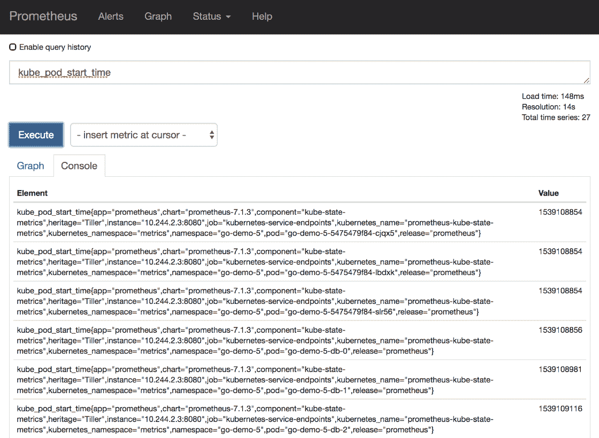图 3-37：Prometheus 控制台视图，显示了 Pod 的启动时间

我们可以使用 Prometheus 的`time()`函数来返回自 1970 年 1 月 1 日 UTC（或 Unix 时间戳）以来的秒数。

请键入以下表达式，然后点击执行按钮。

[PRE121]

就像`kube_pod_start_time`一样，我们得到了一个代表自 1970 年以来的秒数的长数字。除了值之外，唯一显着的区别是只有一个条目，而对于`kube_pod_start_time`，我们得到了集群中每个 Pod 的结果。

现在，让我们尝试结合这两个指标，以尝试检索每个 Pod 的年龄。

请键入以下表达式，然后点击执行按钮。

[PRE122]

这次的结果是表示现在与每个 Pod 创建之间的秒数的更小的数字。在我的情况下（以下是屏幕截图），第一个 Pod（`go-demo-5`的一个副本）已经超过六千秒。那将是大约一百分钟（6096/60），或不到两个小时（100 分钟/60 分钟=1.666 小时）。

图 3-38：Prometheus 控制台视图，显示了 Pod 创建以来经过的时间

由于可能没有 Pod 比我们的目标九十天更老，我们将临时将其降低到一分钟（六十秒）。

请键入以下表达式，然后点击执行按钮。

[PRE123]

在我的情况下，所有的 Pod 都比一分钟大（你的情况可能也是如此）。我们确认它可以工作，所以我们可以将阈值增加到九十天。要达到九十天，我们应该将阈值乘以六十得到分钟，再乘以六十得到小时，再乘以二十四得到天，最后再乘以九十。公式将是`60 * 60 * 24 * 90`。我们可以使用最终值`7776000`，但那会使查询更难解读。我更喜欢使用公式。

请键入以下表达式，然后点击执行按钮。

[PRE124]

毫无疑问，可能没有结果。如果您为本章创建了一个新的集群，如果您花了九十天才到这里，那您可能是地球上最慢的读者。这可能是我迄今为止写过的最长的一章，但仍不值得花九十天的时间来阅读。

现在我们知道要使用哪个表达式，我们可以在我们的设置中添加一个警报。

[PRE125]

输出如下。

[PRE126]

我们可以看到旧值和新值之间的差异在`OldPods`警报中。它包含了我们几分钟前使用的相同表达式。

我们保持了`60`秒的低阈值，以便我们可以看到警报的作用。以后，我们将把该值增加到 90 天。

没有必要指定`for`持续时间。一旦其中一个 Pod 的年龄达到三个月（加减），警报就会触发。

让我们使用更新后的值升级我们的 Prometheus 图表，并打开 Slack 频道，我们应该能看到新消息。

[PRE127]

现在只需等待片刻，直到新消息到达。它应该包含标题*旧的 Pod*和文本说明*至少有一个 Pod 未更新超过 90 天*。

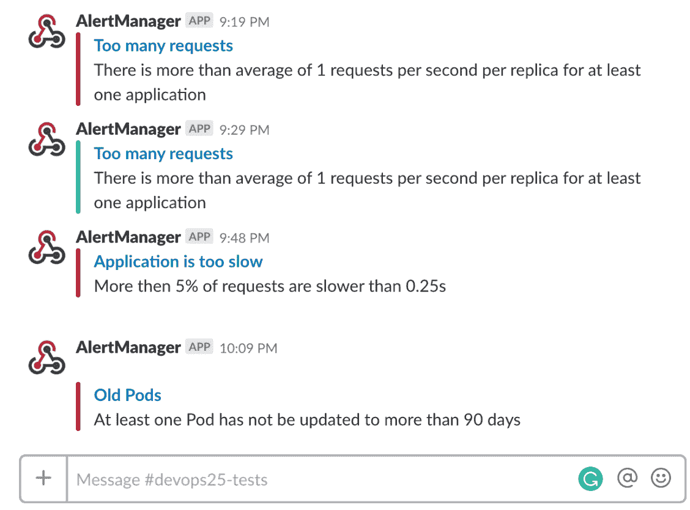图 3-39：Slack 显示多个触发和解决的警报消息

这样一个通用的警报可能不适用于您所有的用例。但是，我相信您可以根据命名空间、名称或类似的内容将其拆分为多个警报。

现在我们有了一个机制，可以在我们的 Pod 过旧并且可能需要升级时接收通知，我们将进入下一个主题，探讨如何检索容器使用的内存和 CPU。

# 测量容器的内存和 CPU 使用

如果您熟悉 Kubernetes，您就会理解定义资源请求和限制的重要性。由于我们已经探讨了`kubectl top pods`命令，您可能已经设置了请求的资源以匹配当前的使用情况，并且可能已经定义了限制高于请求。这种方法可能在第一天有效。但是，随着时间的推移，这些数字将发生变化，我们将无法通过`kubectl top pods`获得全面的图片。我们需要知道容器在峰值负载时使用多少内存和 CPU，以及在压力较小时使用多少。我们应该随时间观察这些指标，并定期进行调整。

即使我们设法猜出容器需要多少内存和 CPU，这些数字也可能会从一个版本到另一个版本发生变化。也许我们引入了一个需要更多内存或 CPU 的功能？

我们需要观察资源使用情况随时间的变化，并确保它不会随着新版本的发布或用户数量的增加（或减少）而改变。现在，我们将专注于前一种情况，并探讨如何查看容器随时间使用了多少内存和 CPU。

像往常一样，我们将首先打开 Prometheus 的图表屏幕。

[PRE128]

我们可以通过`container_memory_usage_bytes`来检索容器的内存使用情况。

请键入下面的表达式，点击执行按钮，然后切换到*图表*屏幕。

[PRE129]

如果你仔细观察顶部的使用情况，你可能会感到困惑。似乎有些容器使用的内存远远超出预期的数量。

事实上，一些`container_memory_usage_bytes`记录包含累积值，我们应该排除它们，以便只检索单个容器的内存使用情况。我们可以通过仅检索在`container_name`字段中具有值的记录来实现这一点。

请键入下面的表达式，然后点击执行按钮。

[PRE130]

现在结果更有意义了。它反映了我们集群内运行的容器的内存使用情况。

稍后我们将基于容器资源设置警报。现在，我们假设我们想要检查特定容器的内存使用情况（例如`prometheus-server`）。由于我们已经知道可用标签之一是`container_name`，检索我们需要的数据应该是直截了当的。

请键入下面的表达式，然后点击执行按钮。

[PRE131]

我们可以看到容器在过去一小时内内存使用情况的波动。通常，我们会对一天或一周这样更长的时间段感兴趣。我们可以通过点击图表上方的-和+按钮，或者直接在它们之间的字段中输入值（例如`1w`）来实现这一点。然而，改变持续时间可能不会有太大帮助，因为我们运行集群的时间不长。除非你阅读速度很慢，否则我们可能无法获得比几个小时更多的数据。

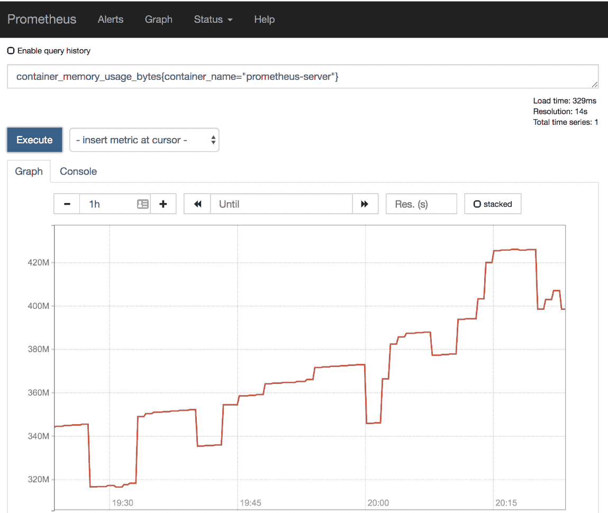图 3-40：限制为 prometheus-server 的 Prometheus 图表屏幕上的容器内存使用情况

同样，我们应该能够检索容器的 CPU 使用情况。在这种情况下，我们正在寻找的指标可能是`container_cpu_usage_seconds_total`。然而，与`container_memory_usage_bytes`不同，它是一个计数器，我们将不得不结合`sum`和`rate`来获得随时间变化的值。

请键入以下表达式，然后按“执行”按钮。

[PRE132]

查询显示了五分钟间隔内的 CPU 秒速总和。我们添加了`by (pod_name)`到混合中，以便我们可以区分不同的 Pod，并查看一个是何时创建的，另一个是何时销毁的。

图 3-41：Prometheus 的图形屏幕，限制为 prometheus-server 的容器 CPU 使用率

如果这是一个“现实世界”的情况，我们下一步将是将实际资源使用与我们在 Prometheus`资源`中定义的进行比较。如果我们定义的与实际情况相比差异很大，我们可能应该更新我们的 Pod 定义（`资源`部分）。

问题在于使用“真实”资源使用情况来定义 Kubernetes 的`资源`将只会暂时提供有效值。随着时间的推移，我们的资源使用情况将会发生变化。负载可能会增加，新功能可能会更加耗费资源，等等。无论原因是什么，需要注意的关键一点是一切都是动态的，对于资源来说没有理由认为会有其他情况。在这种精神下，我们下一个挑战是找出当实际资源使用与我们在容器`资源`中定义的差异太大时如何获得通知。

# 将实际资源使用与定义的请求进行比较

如果我们在 Pod 中定义容器的`资源`而不依赖于实际使用情况，我们只是在猜测容器将使用多少内存和 CPU。我相信你已经知道为什么在软件行业中猜测是一个糟糕的主意，所以我将只关注 Kubernetes 方面。

Kubernetes 将没有指定资源的容器的 Pod 视为**BestEffort Quality of Service**（**QoS**）。因此，如果它的内存或 CPU 不足以为所有的 Pod 提供服务，那么这些 Pod 将被强制删除，为其他 Pod 腾出空间。如果这样的 Pod 是短暂的，例如用作持续交付流程的一次性代理，BestEffort QoS 并不是一个坏主意。但是，当我们的应用是长期运行时，BestEffort QoS 应该是不可接受的。这意味着在大多数情况下，我们必须定义容器的`resources`。

如果容器的`resources`（几乎总是）是必须的，我们需要知道要设置哪些值。我经常看到团队仅仅是猜测。“这是一个数据库，因此它需要大量的 RAM”，“它只是一个 API，不应该需要太多”是我经常听到的一些句子。这些猜测往往是由于无法测量实际使用情况而产生的。当出现问题时，这些团队会简单地将分配的内存和 CPU 加倍。问题解决了！

我从来不明白为什么会有人发明应用程序需要多少内存和 CPU。即使没有任何“花哨”的工具，我们在 Linux 中总是有`top`命令。我们可以知道我们的应用程序使用了多少。随着时间的推移，出现了更好的工具，我们所要做的就是谷歌“如何测量我的应用程序的内存和 CPU”。

当你需要当前数据时，你已经看到了`kubectl top pods`的操作，并且你已经开始熟悉 Prometheus 的强大功能。你没有理由去猜测。

但是，为什么我们关心资源使用情况与请求的资源相比呢？除了可能揭示潜在问题（例如内存泄漏）之外，不准确的资源请求和限制会阻止 Kubernetes 有效地完成其工作。例如，如果我们将内存请求定义为 1GB RAM，那么 Kubernetes 将从可分配的内存中删除这么多。如果一个节点有 2GB 的可分配 RAM，即使每个节点只使用 50MB RAM，也只能运行两个这样的容器。我们的节点将只使用可分配内存的一小部分，如果我们有集群自动缩放器，即使旧节点仍有大量未使用的内存，新节点也会被添加。

即使现在我们知道如何获取实际内存使用情况，每天都通过比较 YAML 文件和 Prometheus 中的结果来开始工作将是浪费时间。相反，我们将创建另一个警报，当请求的内存和 CPU 与实际使用情况相差太大时，它将发送通知给我们。这是我们的下一个任务。

首先，我们将重新打开 Prometheus 的图表屏幕。

[PRE133]

我们已经知道如何通过`container_memory_usage_bytes`获取内存使用情况，所以我们将直接开始检索请求的内存。如果我们可以将这两者结合起来，我们将得到请求的内存和实际内存使用之间的差异。

我们正在寻找的指标是`kube_pod_container_resource_requests_memory_bytes`，所以让我们以`prometheus-server` Pod 为例来试一试。

请键入以下表达式，然后点击“执行”按钮，切换到*图表*选项卡。

[PRE134]

从结果中我们可以看到，我们为`prometheus-server`容器请求了 500MB 的 RAM。

图 3-42：Prometheus 的图表屏幕，容器请求的内存限制为 prometheus-server

问题在于`kube_pod_container_resource_requests_memory_bytes`指标中，除了`pod`标签外，还有`container_memory_usage_bytes`使用`pod_name`。如果我们要将两者结合起来，我们需要将标签`pod`转换为`pod_name`。幸运的是，这不是我们第一次面临这个问题，我们已经知道解决方案是使用`label_join`函数，它将基于一个或多个现有标签创建一个新标签。

请键入以下表达式，然后点击“执行”按钮。

[PRE135]

这一次，我们不仅为指标添加了一个新标签，而且还通过这个新标签（`by (pod)`）对结果进行了分组。

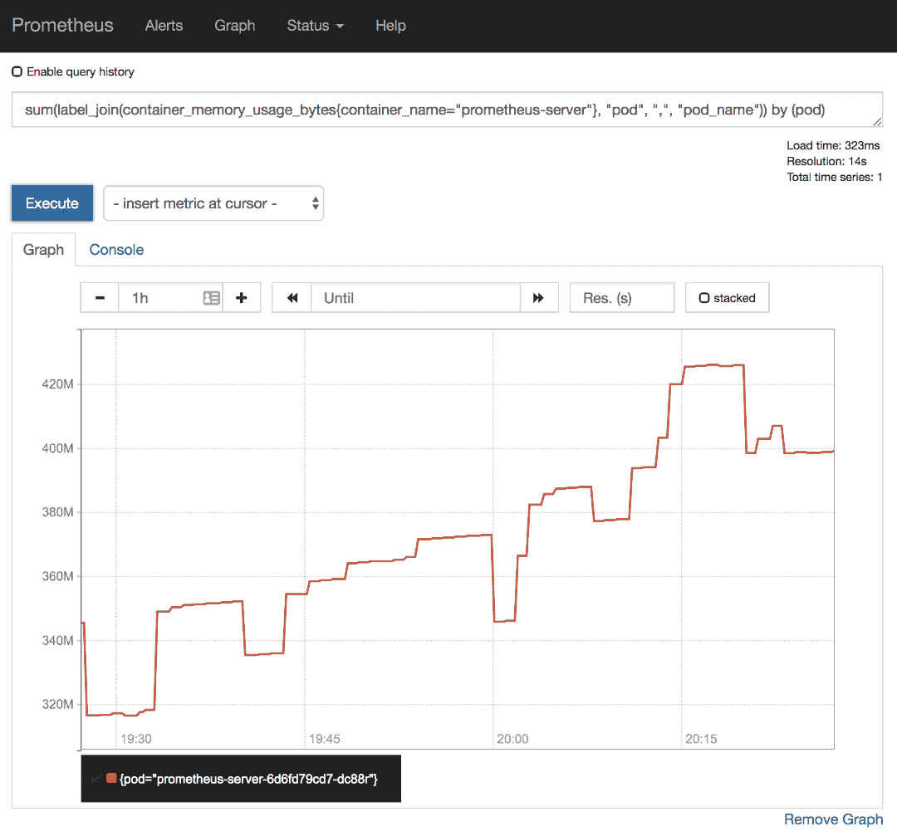图 3-43：Prometheus 的图表屏幕，容器内存使用限制为 prometheus-server，并按从 pod_name 提取的 pod 标签进行分组。

现在我们可以将这两个指标结合起来，找出请求的内存和实际内存使用之间的差异。

请键入以下表达式，然后点击“执行”按钮。

[PRE136]

在我的情况下（以下是屏幕截图），差异逐渐变小。它开始时大约为百分之六十，现在大约为百分之七十五。这样的差异对我们来说不足以采取任何纠正措施。

图 3-44：Prometheus 的图形屏幕，显示基于请求内存的容器内存使用百分比

现在我们已经看到了如何获取单个容器的保留和实际内存使用之间的差异，我们可能应该使表达更加普遍，并获取集群中的所有容器。但是，获取所有可能有点太多了。我们可能不想干扰运行在`kube-system`命名空间中的 Pod。它们可能是预先安装在集群中的，至少目前我们可能希望将它们保持原样。因此，我们将在查询中排除它们。

请键入以下表达式，然后按“执行”按钮。

[PRE137]

结果应该是请求和实际内存之间差异的百分比列表，排除了`kube-system`中的 Pod。

在我的情况下，有相当多的容器使用的内存比我们请求的要多得多。主要问题是`prometheus-alertmanager`，它使用的内存比我们请求的要多三倍以上。这可能由于几个原因。也许我们请求的内存太少，或者它包含的容器没有指定`requests`。无论哪种情况，我们可能应该重新定义请求，不仅针对 Alertmanager，还针对所有使用的内存比请求的多 50%以上的其他 Pod。

图 3-45：Prometheus 的图形屏幕，显示基于请求内存的容器内存使用百分比，排除了来自 kube-system 命名空间的容器

我们即将定义一个新的警报，用于处理请求的内存远高于或远低于实际使用情况的情况。但在这样做之前，我们应该讨论应该使用的条件。一个警报可以在实际内存使用超过请求内存的 150%以上并持续一个小时以上时触发。这将消除由内存使用暂时激增引起的误报（这就是为什么我们也有`limits`）。另一个警报可以处理内存使用量低于请求量 50%以上的情况。但是，在这种警报情况下，我们可能会添加另一个条件。

有些应用程序太小，我们可能永远无法调整它们的请求。我们可以通过添加另一个条件来排除这些情况，该条件将忽略仅保留了 5MB 或更少内存的 Pod。

最后，这个警报可能不需要像之前的那样频繁地触发。我们应该相对快速地知道我们的应用程序是否使用了比我们打算给予的更多内存，因为这可能是内存泄漏、显著增加的流量或其他潜在危险情况的迹象。但是，如果内存使用远低于预期，问题就不那么紧急了。我们应该纠正它，但没有必要紧急采取行动。因此，我们将后一个警报的持续时间设置为六小时。

现在我们已经制定了一些规则，我们可以看一下旧值和新值之间的另一个差异。

[PRE138]

输出如下。

[PRE139]

首先，我们将`OldPods`警报的阈值重新设置为其预期值九十天（`60 * 60 * 24 * 90`）。这样我们就可以阻止它仅用于测试目的触发警报。

接下来，我们定义了一个名为`ReservedMemTooLow`的新警报。如果使用的内存比请求的内存大`1.5`倍，它将触发。警报的挂起状态持续时间设置为`1m`，只是为了我们可以在不等待整个小时的情况下看到结果。稍后，我们将把它恢复为`1h`。

`ReservedMemTooHigh`警报与之前的部分类似，不同之处在于，如果实际内存和请求内存之间的差异小于`0.5`，并且如果这种情况持续超过`6m`（我们稍后将其更改为`6h`），则会触发警报。表达式的第二部分是新的。它要求 Pod 中的所有容器都具有超过 5MB 的请求内存（`5.25e+06`）。通过第二个语句（用`and`分隔），我们可以避免处理太小的应用程序。如果需要的内存小于 5MB，我们应该忽略它，并且可能要祝贺背后的团队使其如此高效。

现在，让我们使用更新后的值升级我们的 Prometheus 图表，并打开图表屏幕。

[PRE140]

我们不会等到警报开始触发。相反，我们将尝试实现类似的目标，但使用 CPU。

可能没有必要解释我们将使用的表达式的过程。我们将直接跳入基于 CPU 的警报，探索旧值和新值之间的差异。

[PRE141]

输出如下。

[PRE142]

前两组差异是为我们之前探讨的`ReservedMemTooLow`和`ReservedMemTooHigh`警报定义更明智的阈值。在更下面，我们可以看到两个新的警报。

如果 CPU 使用量超过请求量的 1.5 倍，将触发`ReservedCPUTooLow`警报。同样，只有当 CPU 使用量少于请求量的一半，并且我们请求的 CPU 毫秒数超过 5 时，才会触发`ReservedCPUTooHigh`警报。因为 5MB RAM 太多而收到通知将是浪费时间。

这两个警报都设置为在短时间内持续存在（`1m`和`6m`），这样我们就可以看到它们的作用，而不必等待太长时间。

现在，让我们使用更新后的值升级我们的 Prometheus 图表。

[PRE143]

我会让你去检查是否有任何警报触发，以及它们是否从 Alertmanager 转发到 Slack。你现在应该知道如何做了。

接下来，我们将转移到本章的最后一个警报。

# 比较实际资源使用与定义的限制

了解容器使用资源与请求相比使用过多或过少的情况有助于我们更精确地定义资源，并最终帮助 Kubernetes 更好地决定在哪里调度我们的 Pods。在大多数情况下，请求和实际资源使用之间存在较大的差异通常不会导致故障。相反，更有可能导致 Pods 的分布不平衡或节点过多。另一方面，限制则是另一回事。

如果我们容器作为 Pods 的资源使用达到指定的`limits`，Kubernetes 可能会杀死这些容器，如果没有足够的内存。它这样做是为了保护系统的完整性。被杀死的 Pod 并不是一个永久性的问题，因为 Kubernetes 几乎会立即重新调度它们，如果有足够的容量。

如果我们使用集群自动缩放，即使容量不足，一旦检测到一些 Pod 处于挂起状态（无法调度），新节点将被添加。因此，如果资源使用超过限制，世界不太可能会结束。

然而，杀死和重新安排 Pod 可能会导致停机时间。显然，可能会发生更糟糕的情况。但我们不会深入讨论。相反，我们将假设我们应该意识到一个 Pod 即将达到其极限，我们可能需要调查发生了什么，并且可能需要采取一些纠正措施。也许最新的发布引入了内存泄漏？或者负载增加超出了我们预期和测试的范围，导致内存使用增加。目前不关注接近极限的内存使用的原因，而是关注是否达到了极限。

首先，我们将返回 Prometheus 的图表屏幕。

[PRE144]

我们已经知道可以通过`container_memory_usage_bytes`指标获取实际内存使用情况。由于我们已经探讨了如何获取请求的内存，我们可以猜测极限是类似的。它们确实是，可以通过`kube_pod_container_resource_limits_memory_bytes`获取。由于其中一个指标与以前相同，另一个非常相似，我们将直接执行完整查询。

请键入以下表达式，按“执行”按钮，然后切换到*图表*选项卡。

[PRE145]

在我的情况下（以下是屏幕截图），我们可以看到相当多的 Pod 使用的内存超过了定义的极限。

幸运的是，我的集群中有多余的容量，Kubernetes 没有迫切需要杀死任何 Pod。此外，问题可能不在于 Pod 使用的超出其极限的情况，而是这些 Pod 中并非所有容器都设置了极限。无论哪种情况，我可能应该更新这些 Pod/容器的定义，并确保它们的极限高于几天甚至几周的平均使用量。

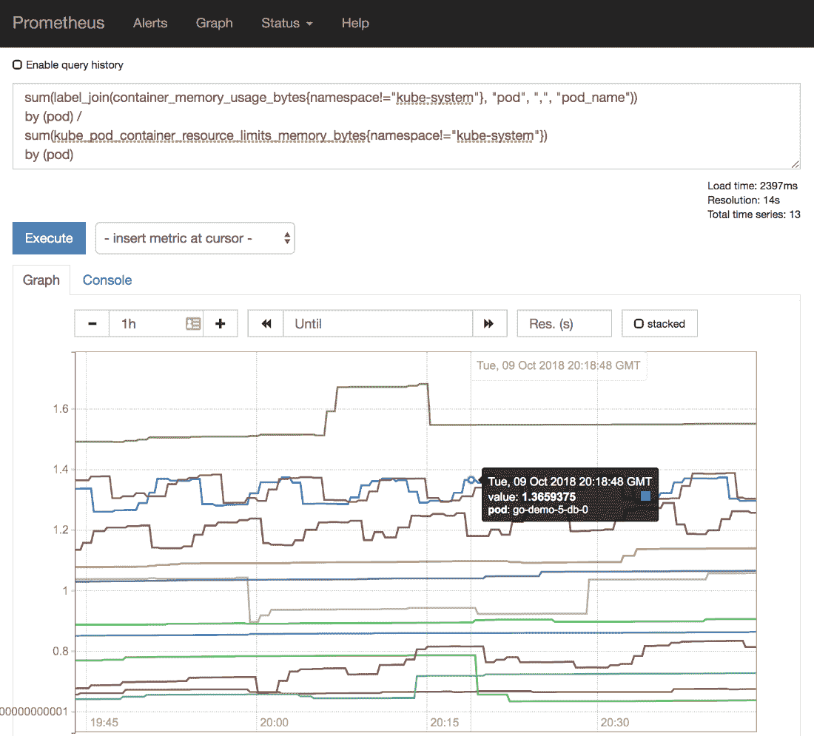图 3-46：基于内存限制的容器内存使用百分比的 Prometheus 图表屏幕，排除了 kube-system 命名空间中的内存使用情况

接下来，我们将详细探讨旧值和新值之间的差异。

[PRE146]

输出如下。

[PRE147]

除了恢复以前使用的警报的合理阈值之外，我们定义了一个名为`MemoryAtTheLimit`的新警报。如果实际使用超过极限的百分之八十（`0.8`）超过一小时（`1h`），它将触发。

接下来是升级我们的 Prometheus 图表。

[PRE148]

最后，我们可以打开 Prometheus 的警报屏幕，并确认新的警报确实被添加到了其中。

[PRE149]

我们不会重复为 CPU 创建类似的警报的步骤。你应该知道如何自己做。

# 现在呢？

我们探索了相当多的 Prometheus 指标、表达式和警报。我们看到了如何将 Prometheus 警报与 Alertmanager 连接，并从那里将它们转发到一个应用程序到另一个应用程序。

到目前为止，我们所做的只是冰山一角。要探索所有我们可能使用的指标和表达式将需要太多的时间（和空间）。尽管如此，我相信现在你知道了一些更有用的指标，而且你将能够用你自己特定的指标来扩展它们。

我敦促你发送给我你发现有用的表达式和警报。你知道在哪里找到我（*DevOps20* ([`slack.devops20toolkit.com/`](http://slack.devops20toolkit.com/)) Slack，`viktor@farcic` 邮件，`@vfarcic` 推特，等等）。

目前，我会让你决定是直接进入下一章，销毁整个集群，还是只移除我们安装的资源。如果你选择后者，请使用接下来的命令。

[PRE150]

在你离开之前，你可能想回顾一下本章的要点。

+   Prometheus 是一个设计用于获取（拉取）和存储高维时间序列数据的数据库（某种程度上）。

+   每个人都应该利用的四个关键指标是延迟、流量、错误和饱和度。
