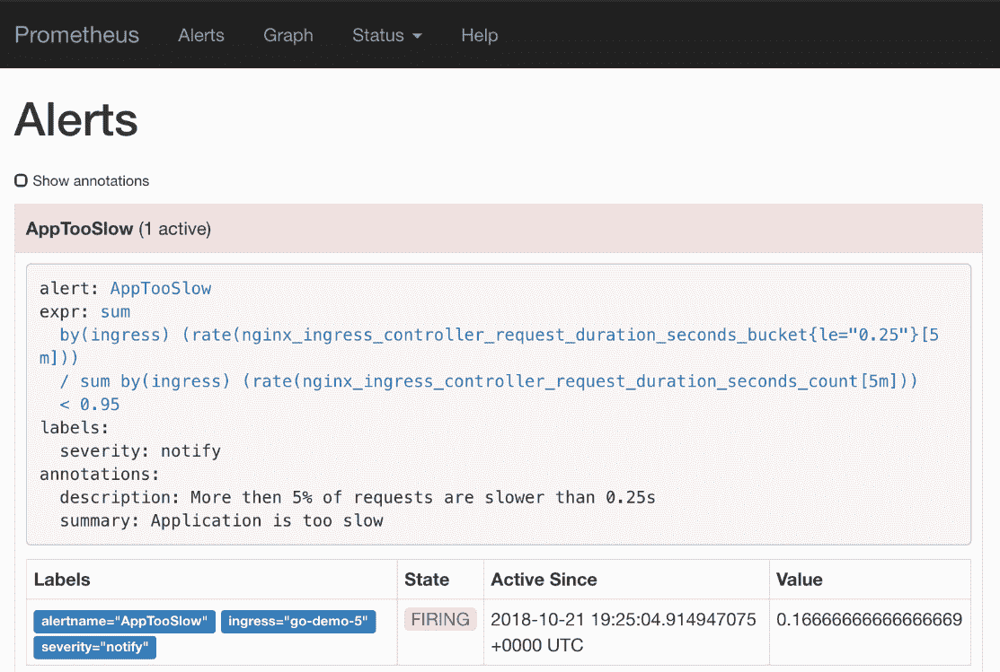
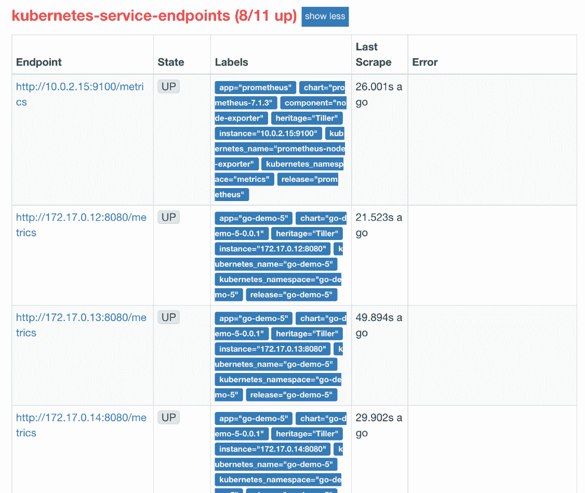
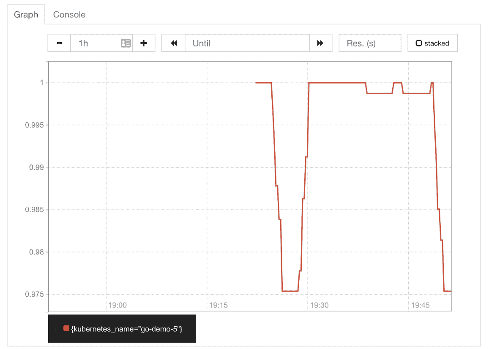

# 第四章：通过指标和警报发现的问题调试

当你排除了不可能的，无论剩下什么，无论多么不可能，都必须是真相。

- *斯波克*

到目前为止，我们已经探讨了如何收集指标以及如何创建警报，以便在出现问题时通知我们。我们还学会了如何查询指标并搜索我们在尝试找到问题原因时可能需要的信息。我们将在此基础上继续，并尝试调试一个模拟的问题。

仅仅说一个应用程序工作不正常是不够的。我们应该更加精确。我们的目标是不仅能够准确定位哪个应用程序出现故障，还能够确定是其中的哪个部分出了问题。我们应该能够指责特定的功能、方法、请求路径等等。我们在检测应用程序的哪个部分导致问题时越精确，我们就越快地找到问题的原因。因此，通过新版本的发布（热修复）、扩展或其他手段修复问题应该更容易更快。

让我们开始吧。在模拟需要解决的问题之前，我们需要一个集群（除非您已经有一个）。

# 创建一个集群

`vfarcic/k8s-specs` ([`github.com/vfarcic/k8s-specs`](https://github.com/vfarcic/k8s-specs)) 仓库将继续是我们用于示例的 Kubernetes 定义的来源。我们将确保通过拉取最新版本使其保持最新。

本章中的所有命令都可以在`04-instrument.sh` ([`gist.github.com/vfarcic/851b37be06bb7652e55529fcb28d2c16`](https://gist.github.com/vfarcic/851b37be06bb7652e55529fcb28d2c16)) Gist 中找到。就像上一章一样，它不仅包含命令，还包括 Prometheus 的表达式。它们都被注释了（用`#`）。如果您打算从 Gist 中复制和粘贴表达式，请排除注释。每个表达式顶部都有`# Prometheus expression`的注释，以帮助您识别它。

```
 1  cd k8s-specs
 2
 3  git pull
```

鉴于我们已经学会了如何安装一个完全可操作的 Prometheus 和其图表中的其他工具，并且我们将继续使用它们，我将其移至 Gists。接下来的内容是我们在上一章中使用的内容的副本，还增加了环境变量 `PROM_ADDR` 和 `AM_ADDR`，以及安装 **Prometheus Chart** 的步骤。请创建一个符合（或超出）下面 Gists 中指定要求的集群，除非您已经有一个满足这些要求的集群。

+   `gke-instrument.sh`：**GKE** 配置有 3 个 n1-standard-1 工作节点，**nginx Ingress**，**tiller**，**Prometheus** 图表，以及环境变量 **LB_IP**，**PROM_ADDR** 和 **AM_ADDR** ([`gist.github.com/675f4b3ee2c55ee718cf132e71e04c6e`](https://gist.github.com/675f4b3ee2c55ee718cf132e71e04c6e))。

+   `eks-instrument.sh`：**EKS** 配置有 3 个 t2.small 工作节点，**nginx Ingress**，**tiller**，**Metrics Server**，**Prometheus** 图表，以及环境变量 **LB_IP**，**PROM_ADDR** 和 **AM_ADDR** ([`gist.github.com/70a14c8f15c7ffa533ea7feb75341545`](https://gist.github.com/70a14c8f15c7ffa533ea7feb75341545))。

+   `aks-instrument.sh`：**AKS** 配置有 3 个 Standard_B2s 工作节点，**nginx Ingress**，**tiller**，**Prometheus** 图表，以及环境变量 **LB_IP**，**PROM_ADDR** 和 **AM_ADDR** ([`gist.github.com/65a0d5834c9e20ebf1b99225fba0d339`](https://gist.github.com/65a0d5834c9e20ebf1b99225fba0d339))。

+   `docker-instrument.sh`：**Docker for Desktop** 配置有 **2 个 CPU**，**3 GB RAM**，**nginx Ingress**，**tiller**，**Metrics Server**，**Prometheus** 图表，以及环境变量 **LB_IP**，**PROM_ADDR** 和 **AM_ADDR** ([`gist.github.com/1dddcae847e97219ab75f936d93451c2`](https://gist.github.com/1dddcae847e97219ab75f936d93451c2))。

+   `minikube-instrument.sh`：**minikube** 配置有 **2 个 CPU**，**3 GB RAM**，启用了 **ingress, storage-provisioner**，**default-storageclass** 和 **metrics-server** 插件，**tiller**，**Prometheus** 图表，以及环境变量 **LB_IP**，**PROM_ADDR** 和 **AM_ADDR** ([`gist.github.com/779fae2ae374cf91a5929070e47bddc8`](https://gist.github.com/779fae2ae374cf91a5929070e47bddc8))。

现在我们已经准备好面对可能需要调试的第一个模拟问题。

# 面对灾难

让我们探索一个灾难场景。坦率地说，这不会是一个真正的灾难，但它将需要我们找到解决问题的方法。

我们将从安装已经熟悉的`go-demo-5`应用程序开始。

```
 1  GD5_ADDR=go-demo-5.$LB_IP.nip.io
 2
 3  helm install \
 4      https://github.com/vfarcic/go-demo-5/releases/download/
    0.0.1/go-demo-5-0.0.1.tgz \
 5      --name go-demo-5 \
 6      --namespace go-demo-5 \
 7      --set ingress.host=$GD5_ADDR
 8
 9  kubectl -n go-demo-5 \
10      rollout status \
11      deployment go-demo-5
```

我们使用`GD5_ADDR`声明了地址，通过该地址我们将能够访问应用程序。我们在安装`go-demo-5`图表时将其用作`ingress.host`变量。为了安全起见，我们等到应用程序部署完成，从部署的角度来看，唯一剩下的就是通过发送 HTTP 请求来确认它正在运行。

```
 1  curl http://$GD5_ADDR/demo/hello
```

输出是开发人员最喜欢的消息`hello, world!`。

接下来，我们将通过发送二十个持续时间长达十秒的慢请求来模拟问题。这将是我们模拟可能需要修复的问题。

```
 1  for i in {1..20}; do
 2      DELAY=$[ $RANDOM % 10000 ]
 3      curl "http://$GD5_ADDR/demo/hello?delay=$DELAY"
 4  done
```

由于我们已经有了 Prometheus 的警报，我们应该在 Slack 上收到通知，说明应用程序太慢了。然而，许多读者可能会在同一个频道进行这些练习，并且可能不清楚消息是来自我们。相反，我们将打开 Prometheus 的警报屏幕以确认存在问题。在“真实”环境中，您不会检查 Prometheus 警报，而是等待在 Slack 上收到通知，或者您选择的其他通知工具。

```
 1  open "http://$PROM_ADDR/alerts"
```

几分钟后（不要忘记刷新屏幕），`AppTooSlow`警报应该触发，让我们知道我们的一个应用程序运行缓慢，我们应该采取措施解决问题。

忠于每章将展示不同 Kubernetes 版本的输出和截图的承诺，这次轮到 minikube 了。

图 4-1：Prometheus 中一个警报处于触发状态

我们假设我们没有故意生成慢请求，所以我们将尝试找出问题所在。哪个应用程序太慢了？我们可以传递什么有用的信息给团队，以便他们尽快解决问题？

第一个逻辑调试步骤是执行与警报使用的相同表达式。请展开`AppTooSlow`警报，并单击表达式的链接。您将被重定向到已经预填充的图形屏幕。单击“执行”按钮，切换到*图形*选项卡。

从图表中我们可以看到，慢请求数量激增。警报被触发是因为不到 95%的响应在 0.25 秒内完成。根据我的图表（随后的截图），零百分比的响应在 0.25 秒内完成，换句话说，所有响应都比那慢。片刻之后，情况略有改善，只有 6%的请求很快。

总的来说，我们面临着太多请求得到缓慢响应的情况，我们应该解决这个问题。主要问题是如何找出缓慢的原因是什么？

图 4-2：百分比请求快速响应的图表

尝试执行不同的表达式。例如，我们可以输出该`ingress`（应用程序）的请求持续时间的速率。

请键入以下表达式，然后点击执行按钮。

```
 1  sum(rate(
 2      nginx_ingress_controller_request_duration_seconds_sum{
 3          ingress="go-demo-5"
 4      }[5m]
 5  )) /
 6  sum(rate(
 7      nginx_ingress_controller_request_duration_seconds_count{
 8          ingress="go-demo-5"
 9      }[5m]
10  ))
```

该图表显示了请求持续时间的历史记录，但它并没有让我们更接近揭示问题的原因，或者更准确地说，是应用程序的哪一部分慢。我们可以尝试使用其他指标，但它们或多或少同样泛泛，并且可能不会让我们有所收获。我们需要更详细的特定于应用程序的指标。我们需要来自`go-demo-5`应用程序内部的数据。

# 使用仪器提供更详细的指标

我们不应该只是说`go-demo-5`应用程序很慢。这不会为我们提供足够的信息，让我们快速检查代码以找出缓慢的确切原因。我们应该能做得更好，并推断出应用程序的哪一部分表现不佳。我们能否找出产生缓慢响应的特定路径？所有方法都一样慢吗，还是问题只限于一个？我们知道哪个函数产生缓慢吗？在这种情况下，我们应该能够回答许多类似的问题。但是，根据当前的指标，我们无法做到。它们太泛泛，通常只能告诉我们特定的 Kubernetes 资源表现不佳。我们收集的指标太广泛，无法回答特定于应用程序的问题。

到目前为止，我们探讨的指标是出口和仪器化的组合。出口负责获取现有的指标并将其转换为 Prometheus 友好格式。一个例子是 Node Exporter（[`github.com/prometheus/node_exporter`](https://github.com/prometheus/node_exporter)），它获取“标准”Linux 指标并将其转换为 Prometheus 的时间序列格式。另一个例子是 kube-state-metrics（[`github.com/kubernetes/kube-state-metrics`](https://github.com/kubernetes/kube-state-metrics)），它监听 Kube API 服务器并生成资源状态的指标。

仪器化指标已经内置到应用程序中。它们是我们应用程序代码的一个组成部分，通常通过`/metrics`端点公开。

将指标添加到应用程序的最简单方法是通过 Prometheus 客户端库之一。在撰写本文时，Go（[`github.com/prometheus/client_golang`](https://github.com/prometheus/client_golang)）、Java 和 Scala（[`github.com/prometheus/client_java`](https://github.com/prometheus/client_java)）、Python（[`github.com/prometheus/client_python`](https://github.com/prometheus/client_python)）和 Ruby（[`github.com/prometheus/client_ruby`](https://github.com/prometheus/client_ruby)）库是官方提供的。

除此之外，社区还支持 Bash ([`github.com/aecolley/client_bash`](https://github.com/aecolley/client_bash))，C++ ([`github.com/jupp0r/prometheus-cpp`](https://github.com/jupp0r/prometheus-cpp))，Common Lisp ([`github.com/deadtrickster/prometheus.cl`](https://github.com/deadtrickster/prometheus.cl))，Elixir ([`github.com/deadtrickster/prometheus.ex`](https://github.com/deadtrickster/prometheus.ex))，Erlang ([`github.com/deadtrickster/prometheus.erl`](https://github.com/deadtrickster/prometheus.erl))，Haskell ([`github.com/fimad/prometheus-haskell`](https://github.com/fimad/prometheus-haskell))，Lua for Nginx ([`github.com/knyar/nginx-lua-prometheus`](https://github.com/knyar/nginx-lua-prometheus))，Lua for Tarantool ([`github.com/tarantool/prometheus`](https://github.com/tarantool/prometheus))，.NET / C# ([`github.com/andrasm/prometheus-net`](https://github.com/andrasm/prometheus-net))，Node.js ([`github.com/siimon/prom-client`](https://github.com/siimon/prom-client))，Perl ([`metacpan.org/pod/Net::Prometheus`](https://metacpan.org/pod/Net::Prometheus))，PHP ([`github.com/Jimdo/prometheus_client_php`](https://github.com/Jimdo/prometheus_client_php))，和 Rust ([`github.com/pingcap/rust-prometheus`](https://github.com/pingcap/rust-prometheus))。即使您使用不同的语言编写代码，也可以通过以文本为基础的输出格式（[`prometheus.io/docs/instrumenting/exposition_formats/`](https://prometheus.io/docs/instrumenting/exposition_formats/)）轻松提供符合 Prometheus 的指标。

收集指标的开销应该可以忽略不计，而且由于 Prometheus 定期获取它们，输出它们的开销也应该很小。即使您选择不使用 Prometheus，或者切换到其他工具，该格式也正在成为标准，您的下一个指标收集工具很可能也会期望相同的数据。

总之，没有理由不将指标集成到您的应用程序中，正如您很快将看到的那样，它们提供了我们无法从外部获得的宝贵信息。

让我们来看一个`go-demo-5`中已经标记的指标的例子。

```
 1  open "https://github.com/vfarcic/go-demo-5/blob/master/main.go"
```

该应用程序是用 Go 语言编写的。如果这不是您选择的语言，不要担心。我们只是快速看一下一些例子，以了解仪表化背后的逻辑，而不是确切的实现。

第一个有趣的部分如下。

```
 1  ...
 2  var (
 3    histogram = prometheus.NewHistogramVec(prometheus.HistogramOpts{
 4      Subsystem: "http_server",
 5      Name:      "resp_time",
 6      Help:      "Request response time",
 7    }, []string{
 8      "service",
 9      "code",
10      "method",
11      "path",
12    })
13  )
14  ...
```

我们定义了一个包含一些选项的 Prometheus 直方图向量的变量。`Sybsystem`和`Name`形成了基本指标`http_server_resp_time`。由于它是一个直方图，最终的指标将通过添加`_bucket`、`_sum`和`_count`后缀来创建。

请参考*histogram* ([`prometheus.io/docs/concepts/metric_types/#histogram`](https://prometheus.io/docs/concepts/metric_types/#histogram)) 文档，了解有关 Prometheus 指标类型的更多信息。

最后一部分是一个字符串数组(`[]string`)，定义了我们想要添加到指标中的所有标签。在我们的情况下，这些标签是`service`、`code`、`method`和`path`。标签可以是我们需要的任何东西，只要它们提供了我们在查询这些指标时可能需要的足够信息。

兴趣点是`recordMetrics`函数。

```
 1  ...
 2  func recordMetrics(start time.Time, req *http.Request, code int) {
 3    duration := time.Since(start)
 4    histogram.With(
 5      prometheus.Labels{
 6        "service": serviceName,
 7        "code":    fmt.Sprintf("%d", code),
 8        "method":  req.Method,
 9        "path":    req.URL.Path,
10      },
11    ).Observe(duration.Seconds())
12  }
13  ...
```

我创建了一个辅助函数，可以从代码的不同位置调用。它接受`start`时间、`Request`和返回的`code`作为参数。函数本身通过将当前时间与`start`时间相减来计算`duration`。`duration`在`Observe`函数中使用，并提供指标的值。还有标签，将帮助我们在以后微调我们的表达式。

最后，我们将看一个示例，其中调用了`recordMetrics`函数。

```
 1  ...
 2  func HelloServer(w http.ResponseWriter, req *http.Request) {
 3    start := time.Now()
 4    defer func() { recordMetrics(start, req, http.StatusOK) }()
 5    ...
 6  }
 7  ...
```

`HelloServer`函数是返回您已经看到多次的`hello, world!`响应的函数。该函数的细节并不重要。在这种情况下，唯一重要的部分是`defer func() { recordMetrics(start, req, http.StatusOK) }()`这一行。在 Go 中，`defer`允许我们在它所在的函数结束时执行某些操作。在我们的情况下，这个操作是调用`recordMetrics`函数，记录请求的持续时间。换句话说，在执行离开`HelloServer`函数之前，它将通过调用`recordMetrics`函数记录持续时间。

我不会深入探讨包含仪表的代码，因为那将意味着您对 Go 背后的复杂性感兴趣，而我试图让这本书与语言无关。我会让您参考您喜欢的语言的文档和示例。相反，我们将看一下`go-demo-5`中的仪表指标的实际应用。

```
 1  kubectl -n metrics \
 2      run -it test \
 3      --image=appropriate/curl \
 4      --restart=Never \
 5      --rm \
 6      -- go-demo-5.go-demo-5:8080/metrics
```

我们创建了一个基于`appropriate/curl`镜像的 Pod，并通过使用地址`go-demo-5.go-demo-5:8080/metrics`向服务发送了一个请求。第一个`go-demo-5`是服务的名称，第二个是它所在的命名空间。结果，我们得到了该应用程序中所有可用的受监控指标的输出。我们不会逐个讨论所有这些指标，而只会讨论由`http_server_resp_time`直方图创建的指标。

输出的相关部分如下。

```
...
# HELP http_server_resp_time Request response time
# TYPE http_server_resp_time histogram
http_server_resp_time_bucket{code="200",method="GET",path="/demo/hello",service="go-demo",le="0.005"} 931
http_server_resp_time_bucket{code="200",method="GET",path="/demo/hello",service="go-demo",le="0.01"} 931
http_server_resp_time_bucket{code="200",method="GET",path="/demo/hello",service="go-demo",le="0.025"} 931
http_server_resp_time_bucket{code="200",method="GET",path="/demo/hello",service="go-demo",le="0.05"} 931
http_server_resp_time_bucket{code="200",method="GET",path="/demo/hello",service="go-demo",le="0.1"} 934
http_server_resp_time_bucket{code="200",method="GET",path="/demo/hello",service="go-demo",le="0.25"} 935
http_server_resp_time_bucket{code="200",method="GET",path="/demo/hello",service="go-demo",le="0.5"} 935
http_server_resp_time_bucket{code="200",method="GET",path="/demo/hello",service="go-demo",le="1"} 936
http_server_resp_time_bucket{code="200",method="GET",path="/demo/hello",service="go-demo",le="2.5"} 936
http_server_resp_time_bucket{code="200",method="GET",path="/demo/hello",service="go-demo",le="5"} 937
http_server_resp_time_bucket{code="200",method="GET",path="/demo/hello",service="go-demo",le="10"} 942
http_server_resp_time_bucket{code="200",method="GET",path="/demo/hello",service="go-demo",le="+Inf"} 942
http_server_resp_time_sum{code="200",method="GET",path="/demo/hello",service="go-demo"} 38.87928942600006
http_server_resp_time_count{code="200",method="GET",path="/demo/hello",service="go-demo"} 942
...
```

我们可以看到，在应用程序代码中使用的 Go 库从`http_server_resp_time`直方图中创建了相当多的指标。我们得到了每个十二个桶的指标（`http_server_resp_time_bucket`），一个持续时间的总和指标（`http_server_resp_time_sum`），以及一个计数指标（`http_server_resp_time_count`）。如果我们发出具有不同标签的请求，我们将得到更多指标。目前，这十四个指标都来自于响应 HTTP 代码`200`的请求，使用`GET`方法，发送到`/demo/hello`路径，并来自`go-demo`服务（应用程序）。如果我们创建具有不同方法（例如`POST`）或不同路径的请求，指标数量将增加。同样，如果我们在其他应用程序中实现相同的受监控指标（但具有不同的`service`标签），我们将拥有具有相同键（`http_server_resp_time`）的指标，这将提供有关多个应用程序的见解。这引发了一个问题，即我们是否应该统一所有应用程序中的指标名称，还是不统一。

我更喜欢在所有应用程序中具有相同名称的相同类型的受监控指标。例如，所有收集响应时间的指标都可以称为`http_server_resp_time`。这简化了在 Prometheus 中查询数据。与其从每个单独的应用程序中了解受监控指标，不如从一个应用程序中了解所有应用程序的知识。另一方面，我赞成让每个团队完全控制他们的应用程序。这包括决定要实现哪些指标以及如何调用它们。

总的来说，这取决于团队的结构和职责。如果一个团队完全负责他们的应用程序，并且调试特定于他们应用程序的问题，那么标准化已经被仪表化指标的名称是没有必要的。另一方面，如果监控是集中的，并且其他团队可能期望从该领域的专家那里获得帮助，那么创建命名约定是必不可少的。否则，我们可能会轻易地得到成千上万个具有不同名称和类型的指标，尽管它们大多提供相同的信息。

在本章的其余部分，我将假设我们同意在所有适用的应用程序中都有`http_server_resp_time`直方图。

现在，让我们看看如何告诉 Prometheus 它应该从`go-demo-5`应用程序中拉取指标。如果我们能告诉 Prometheus 从所有有仪表化指标的应用程序中拉取数据，那将更好。实际上，现在我想起来了，我们在上一章中还没有讨论 Prometheus 是如何发现 Node Exporter 和 Kube State Metrics 的。所以，让我们简要地通过发现过程。

一个很好的起点是 Prometheus 的目标屏幕。

```
 1  open "http://$PROM_ADDR/targets"
```

最有趣的目标组是`kubernetes-service-endpoints`。如果我们仔细看标签，我们会发现每个标签都有`kubernetes_name`，其中三个目标将其设置为`go-demo-5`。Prometheus 不知何故发现我们有该应用程序的三个副本，并且指标可以通过端口`8080`获得。如果我们进一步观察，我们会注意到`prometheus-node-exporter`也在其中，每个节点在集群中都有一个。

对于`prometheus-kube-state-metrics`也是一样的。在该组中可能还有其他应用程序。

图 4-3：kubernetes-service-endpoints Prometheus 的目标

Prometheus 通过 Kubernetes 服务发现了所有目标。它从每个服务中提取了端口，并假定数据可以通过`/metrics`端点获得。因此，我们在集群中拥有的每个应用程序，只要可以通过 Kubernetes 服务访问，就会自动添加到 Prometheus 的目标`kubernetes-service-endpoints`组中。我们无需摆弄 Prometheus 的配置来将`go-demo-5`添加到其中。它只是被发现了。相当不错，不是吗？

在某些情况下，一些指标将无法访问，并且该目标将标记为红色。例如，在 minikube 中的`kube-dns`无法从 Prometheus 访问。这很常见，只要这不是我们确实需要的指标来源之一，就不必惊慌。

接下来，我们将快速查看一下我们可以使用来自`go-demo-5`的仪表化指标编写的一些表达式。

```
 1  open "http://$PROM_ADDR/graph"
```

请键入接下来的表达式，按“执行”按钮，然后切换到*图表*选项卡。

```
 1  http_server_resp_time_count
```

我们可以看到三条线对应于`go-demo-5`的三个副本。这应该不会让人感到惊讶，因为每个副本都是从应用程序的每个副本的仪表化指标中提取的。由于这些指标是只能增加的计数器，图表的线条不断上升。

图 4-4：http_server_resp_time_count 计数器的图表

这并不是很有用。如果我们对请求计数的速率感兴趣，我们会将先前的表达式包含在`rate()`函数中。我们以后会这样做。现在，我们将编写最简单的表达式，以便得到每个请求的平均响应时间。

请键入接下来的表达式，然后按“执行”按钮。

```
 1  http_server_resp_time_sum{
 2      kubernetes_name="go-demo-5"
 3  } /
 4  http_server_resp_time_count{
 5      kubernetes_name="go-demo-5"
 6  }
```

表达式本身应该很容易理解。我们将所有请求的总和除以计数。由于我们已经发现问题出现在`go-demo-5`应用程序中，我们使用`kubernetes_name`标签来限制结果。尽管这是我们集群中当前唯一运行该指标的应用程序，但习惯于这样做是个好主意，因为在将来我们将扩展到其他应用程序时，可能会有其他应用程序。

我们可以看到，平均请求持续时间在一段时间内增加，只是在稍后又接近初始值。这个峰值与我们之前发送的二十个慢请求相吻合。在我的情况下（以下是屏幕截图），峰值接近平均响应时间的 0.1 秒，然后在稍后降至大约 0.02 秒。

图 4-5：累积平均响应时间的图表

请注意，我们刚刚执行的表达式存在严重缺陷。它显示的是累积平均响应时间，而不是显示`rate`。但是，你已经知道了。那只是对仪表度量的一个预演，而不是它的“真正”用法（很快就会出现）。

您可能会注意到，即使是峰值也非常低。它肯定比我们只通过`curl`发送二十个慢请求所期望的要低。原因在于我们不是唯一一个发出这些请求的人。`readinessProbe`和`livenessProbe`也在发送请求，并且非常快。与上一章不同的是，我们只测量通过 Ingress 进入的请求，这一次我们捕获了进入应用程序的所有请求，包括健康检查。

现在我们已经看到了在我们的`go-demo-5`应用程序内部生成的`http_server_resp_time`度量标准的一些示例，我们可以利用这些知识来尝试调试导致我们走向仪表化的模拟问题。

# 使用内部度量标准来调试潜在问题

我们将重新发送慢响应的请求，以便我们回到开始本章的同一点。

```
 1  for i in {1..20}; do
 2      DELAY=$[ $RANDOM % 10000 ]
 3      curl "http://$GD5_ADDR/demo/hello?delay=$DELAY"
 4  done
 5
 6  open "http://$PROM_ADDR/alerts"
```

我们发送了二十个请求，这些请求将产生随机持续时间的响应（最长十秒）。随后，我们打开了 Prometheus 的警报屏幕。

一段时间后，`AppTooSlow`警报应该会触发（记得刷新你的屏幕），我们有一个（模拟的）需要解决的问题。在我们开始惊慌和匆忙行事之前，我们将尝试找出问题的原因。

请点击`AppTooSlow`警报的表达式。

我们被重定向到具有警报预填表达式的图形屏幕。请随意点击表达式按钮，即使它不会提供任何额外的信息，除了应用程序一开始很快，然后因某种莫名其妙的原因变慢。

您将无法从该表达式中收集更多详细信息。您将不知道所有方法是否都很慢，是否只有特定路径响应缓慢，也不会知道任何其他特定于应用程序的细节。简而言之，`nginx_ingress_controller_request_duration_seconds`度量标准太泛化了。它作为通知我们应用程序响应时间增加的一种方式服务得很好，但它并不提供足够关于问题原因的信息。为此，我们将切换到 Prometheus 直接从`go-demo-5`副本中检索的`http_server_resp_time`度量标准。

请键入以下表达式，然后按“执行”按钮。

```
 1  sum(rate(
 2      http_server_resp_time_bucket{
 3          le="0.1",
 4          kubernetes_name="go-demo-5"
 5      }[5m]
 6  )) /
 7  sum(rate(
 8      http_server_resp_time_count{
 9          kubernetes_name="go-demo-5"
10      }[5m]
11  ))
```

如果你还没有切换到*图表*选项卡，请切换到那里。

该表达式与我们以前使用`nginx_ingress_controller_request_duration_seconds_sum`指标时编写的查询非常相似。我们正在将 0.1 秒桶中的请求速率与所有请求的速率进行比较。

在我的案例中（随后的屏幕截图），我们可以看到快速响应的百分比下降了两次。这与我们之前发送的模拟慢请求相吻合。

图 4-6：使用仪器化指标测量的快速请求百分比的图表

到目前为止，使用仪器化指标`http_server_resp_time_count`与`nginx_ingress_controller_request_duration_seconds_sum`相比，并没有提供任何实质性的好处。如果仅此而已，我们可以得出结论，添加仪器化是一种浪费。然而，我们还没有将标签包含在我们的表达式中。

假设我们想按`method`和`path`对请求进行分组。这可能会让我们更好地了解慢速是全局性的，还是仅限于特定类型的请求。如果是后者，我们将知道问题出在哪里，并希望能够快速找到罪魁祸首。

请键入以下表达式，然后按“执行”按钮。

```
 1  sum(rate(
 2      http_server_resp_time_bucket{
 3          le="0.1",
 4          kubernetes_name="go-demo-5"
 5      }[5m]
 6  ))
 7  by (method, path) /
 8  sum(rate(
 9      http_server_resp_time_count{
10          kubernetes_name="go-demo-5"
11      }[5m]
12  ))
13  by (method, path)
```

该表达式几乎与之前的表达式相同。唯一的区别是添加了`by (method, path)`语句。因此，我们得到了按`method`和`path`分组的快速响应百分比。

输出并不代表“真实”的使用情况。通常，我们会看到许多不同的线条，每条线代表被请求的每种方法和路径。但是，由于我们只对`/demo/hello`使用 HTTP GET 进行了请求，我们的图表有点无聊。你得想象还有许多其他线条。

通过研究图表，我们发现除了一条线（我们仍在想象许多条线）之外，其他所有线都接近于百分之百的快速响应。那条急剧下降的线应该是具有`/demo/hello`路径和`GET`方法的那条线。然而，如果这确实是一个真实的情景，我们的图表可能会有太多线条，我们可能无法轻松地加以区分。我们的表达式可能会受益于添加一个阈值。

请键入以下表达式，然后按“执行”按钮。

```
 1  sum(rate(
 2      http_server_resp_time_bucket{
 3          le="0.1",
 4          kubernetes_name="go-demo-5"
 5      }[5m]
 6  ))
 7  by (method, path) /
 8  sum(rate(
 9      http_server_resp_time_count{
10          kubernetes_name="go-demo-5"
11      }[5m]
12  ))
13  by (method, path) < 0.99
```

唯一的添加是 `<0.99` 的阈值。因此，我们的图表排除了所有结果（所有路径和方法），只留下低于百分之九十九（0.99）的结果。我们去除了所有噪音，只关注超过百分之一的所有请求缓慢的情况（或者少于百分之九十九的请求快速）。结果现在很明确。问题出在处理 `/demo/hello` 路径上的 `GET` 请求的函数中。我们通过图表下方提供的标签知道了这一点。

图 4-7：使用仪器测量的快速请求百分比的图表，限制在百分之九十九以下的结果。

现在我们几乎知道问题的确切位置，剩下的就是修复问题，将更改推送到我们的 Git 存储库，并等待我们的持续部署流程升级软件以使用新版本。

在相对较短的时间内，我们设法找到（调试）了问题，或者更准确地说，将问题缩小到代码的特定部分。

或者，也许我们发现问题不在代码中，而是我们的应用程序需要扩展。无论哪种情况，没有仪器测量的指标，我们只会知道应用程序运行缓慢，这可能意味着应用程序的任何部分都在表现不佳。仪器测量为我们提供了更详细的指标，我们用这些指标更准确地缩小范围，并减少我们通常需要找到问题并相应采取行动的时间。

通常，我们会有许多其他仪器测量指标，我们的“调试”过程会更加复杂。我们会执行其他表达式并查看不同的指标。然而，关键是我们应该将通用指标与直接来自我们应用程序的更详细的指标相结合。前一组通常用于检测是否存在问题，而后一种类型在寻找问题的原因时非常有用。这两种类型的指标在监控、警报和调试我们的集群和应用程序时都有其作用。有了仪器测量指标，我们可以获得更多特定于应用程序的细节。这使我们能够缩小问题的位置和原因。我们对问题的确切原因越有信心，我们就越能够做出反应。

# 现在呢？

我不认为我们需要很多其他的仪表化指标示例。它们与我们通过导出器收集的指标没有任何不同。我会让你开始为你的应用程序进行仪表化。从小处开始，看看哪些效果好，改进和扩展。

又一个章节完成了。销毁你的集群，开始下一个新的，或者保留它。如果你选择后者，请执行接下来的命令来移除`go-demo-5`应用程序。

```
 1  helm delete go-demo-5 --purge
 2
 3  kubectl delete ns go-demo-5
```

在你离开之前，记住接下来的要点。它总结了仪表化。

+   仪表化指标被嵌入到应用程序中。它们是我们应用程序代码的一个组成部分，通常通过`/metrics`端点公开。
