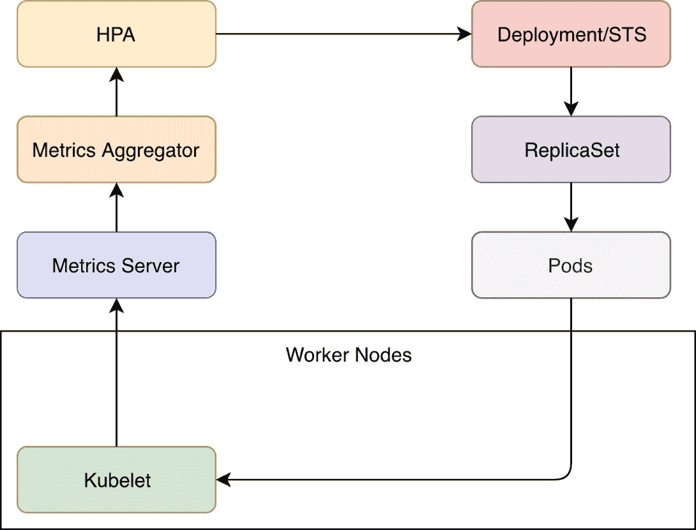
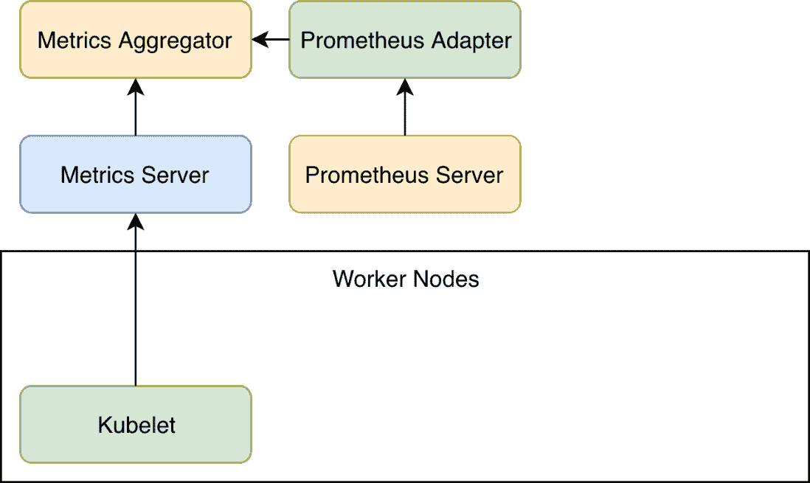
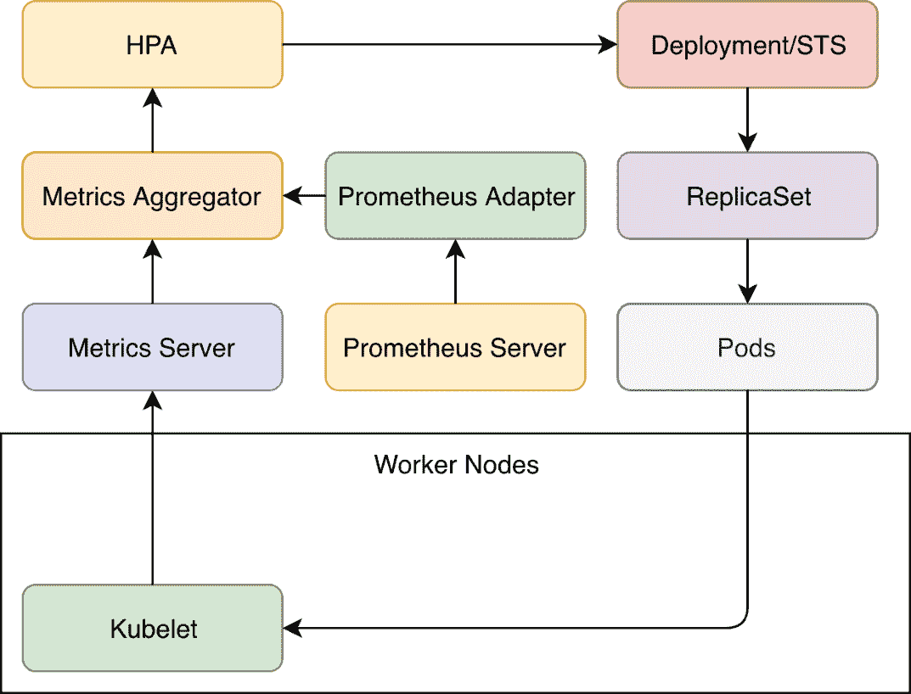

# 使用自定义指标扩展 HorizontalPodAutoscaler

计算机是出色且高效的仆人，但我不愿意在它们的服务下工作。

- *斯波克*

**HorizontalPodAutoscaler**（**HPA**）的采用通常经历三个阶段。

第一阶段是*发现*。第一次我们发现它的功能时，通常会感到非常惊讶。"看这个。它可以自动扩展我们的应用程序。我不再需要担心副本的数量了。"

第二阶段是*使用*。一旦我们开始使用 HPA，我们很快意识到基于内存和 CPU 的应用程序扩展不足够。一些应用程序随着负载的增加而增加其内存和 CPU 使用率，而许多其他应用程序则没有。或者更准确地说，不成比例。对于一些应用程序，HPA 运作良好。对于许多其他应用程序，它根本不起作用，或者不够。迟早，我们需要将 HPA 的阈值扩展到不仅仅是基于内存和 CPU 的阈值。这个阶段的特点是*失望*。"这似乎是个好主意，但我们不能用它来处理我们大多数的应用程序。我们需要退回到基于指标和手动更改副本数量的警报。"

第三阶段是*重新发现*。一旦我们阅读了 HPA v2 文档（在撰写本文时仍处于测试阶段），我们就会发现它允许我们将其扩展到几乎任何类型的指标和表达式。我们可以通过适配器将 HPAs 连接到 Prometheus，或几乎任何其他工具。一旦我们掌握了这一点，我们几乎没有限制条件可以设置为自动扩展我们的应用程序的触发器。唯一的限制是我们将数据转换为 Kubernetes 自定义指标的能力。

我们的下一个目标是扩展 HorizontalPodAutoscaler 定义，以包括基于 Prometheus 中存储的数据的条件。

# 创建一个集群

`vfarcic/k8s-specs`（[`github.com/vfarcic/k8s-specs`](https://github.com/vfarcic/k8s-specs)）存储库将继续作为我们的 Kubernetes 定义的来源。我们将确保通过拉取最新版本使其保持最新。

本章中的所有命令都可以在`05-hpa-custom-metrics.sh`（[`gist.github.com/vfarcic/cc546f81e060e4f5fc5661e4fa003af7`](https://gist.github.com/vfarcic/cc546f81e060e4f5fc5661e4fa003af7)）Gist 中找到。

```
 1  cd k8s-specs
 2
 3  git pull
```

要求与上一章相同。唯一的例外是**EKS**。我们将继续为所有其他 Kubernetes 版本使用与之前相同的 Gists。

对于 EKS 用户的注意事项，尽管我们迄今为止使用的三个 t2.small 节点具有足够的内存和 CPU，但它们可能无法承载我们将创建的所有 Pod。EKS（默认情况下）使用 AWS 网络。t2.small 实例最多可以有三个网络接口，每个接口最多有四个 IPv4 地址。这意味着每个 t2.small 节点上最多可以有十二个 IPv4 地址。鉴于每个 Pod 需要有自己的地址，这意味着每个节点最多可以有十二个 Pod。在本章中，我们可能需要在整个集群中超过三十六个 Pod。我们将添加 Cluster Autoscaler（CA）到集群中，让集群在需要时扩展，而不是创建超过三个节点的集群。我们已经在之前的章节中探讨了 CA，并且设置说明现在已添加到了 Gist `eks-hpa-custom.sh` ([`gist.github.com/vfarcic/868bf70ac2946458f5485edea1f6fc4c)`](https://gist.github.com/vfarcic/868bf70ac2946458f5485edea1f6fc4c))。

请使用以下 Gist 之一创建新的集群。如果您已经有一个要用于练习的集群，请使用 Gist 来验证它是否满足所有要求。

+   `gke-instrument.sh`: **GKE** 配有 3 个 n1-standard-1 工作节点，**nginx Ingress**，**tiller**，**Prometheus** 图表，以及环境变量 **LB_IP**，**PROM_ADDR** 和 **AM_ADDR** ([`gist.github.com/vfarcic/675f4b3ee2c55ee718cf132e71e04c6e`](https://gist.github.com/vfarcic/675f4b3ee2c55ee718cf132e71e04c6e))。

+   `eks-hpa-custom.sh`: **EKS** 配有 3 个 t2.small 工作节点，**nginx Ingress**，**tiller**，**Metrics Server**，**Prometheus** 图表，环境变量 **LB_IP**，**PROM_ADDR** 和 **AM_ADDR**，以及 **Cluster Autoscaler** ([`gist.github.com/vfarcic/868bf70ac2946458f5485edea1f6fc4c`](https://gist.github.com/vfarcic/868bf70ac2946458f5485edea1f6fc4c))。

+   `aks-instrument.sh`: **AKS** 配有 3 个 Standard_B2s 工作节点，**nginx Ingress**，**tiller**，**Prometheus** 图表，以及环境变量 **LB_IP**，**PROM_ADDR** 和 **AM_ADDR** ([`gist.github.com/vfarcic/65a0d5834c9e20ebf1b99225fba0d339`](https://gist.github.com/vfarcic/65a0d5834c9e20ebf1b99225fba0d339))。

+   `docker-instrument.sh`：**Docker for Desktop**，带有**2 个 CPU**，**3GB RAM**，**nginx Ingress**，**tiller**，**Metrics Server**，**Prometheus**图表，和环境变量**LB_IP**，**PROM_ADDR**，和**AM_ADDR**（[`gist.github.com/vfarcic/1dddcae847e97219ab75f936d93451c2`](https://gist.github.com/vfarcic/1dddcae847e97219ab75f936d93451c2)）。

+   `minikube-instrument.sh`：**Minikube**，带有**2 个 CPU**，**3GB RAM**，**ingress**，**storage-provisioner**，**default-storageclass**，和**metrics-server**插件已启用，**tiller**，**Prometheus**图表，和环境变量**LB_IP**，**PROM_ADDR**，和**AM_ADDR**（[`gist.github.com/vfarcic/779fae2ae374cf91a5929070e47bddc8`](https://gist.github.com/vfarcic/779fae2ae374cf91a5929070e47bddc8)）。

现在我们准备扩展我们对 HPA 的使用。但在我们这样做之前，让我们简要地探索（再次）HPA 如何开箱即用。

# 在没有度量适配器的情况下使用 HorizontalPodAutoscaler

如果我们不创建度量适配器，度量聚合器只知道与容器和节点相关的 CPU 和内存使用情况。更复杂的是，这些信息仅限于最近几分钟。由于 HPA 只关心 Pod 和其中的容器，我们只能使用两个指标。当我们创建 HPA 时，如果构成这些 Pod 的容器的内存或 CPU 消耗超过或低于预定义的阈值，它将扩展或缩减我们的 Pods。

Metrics Server 定期从运行在工作节点内的 Kubelet 获取信息（CPU 和内存）。

这些指标被传递给度量聚合器，但在这种情况下，度量聚合器并没有增加任何额外的价值。从那里开始，HPA 定期查询度量聚合器中的数据（通过其 API 端点）。当 HPA 中定义的目标值与实际值存在差异时，HPA 将操纵部署或 StatefulSet 的副本数量。正如我们已经知道的那样，对这些控制器的任何更改都会导致通过创建和操作 ReplicaSets 执行滚动更新，从而创建和删除 Pods，这些 Pods 由运行在调度了 Pod 的节点上的 Kubelet 转换为容器。

图 5-1：开箱即用设置的 HPA（箭头显示数据流向）

从功能上讲，我们刚刚描述的流程运行良好。唯一的问题是指标聚合器中可用的数据。它仅限于内存和 CPU。往往这是不够的。因此，我们不需要改变流程，而是要扩展可用于 HPA 的数据。我们可以通过指标适配器来实现这一点。

# 探索 Prometheus 适配器

鉴于我们希望通过指标 API 扩展可用的指标，并且 Kubernetes 允许我们通过其*自定义指标 API*（[`github.com/kubernetes/metrics/tree/master/pkg/apis/custom_metrics`](https://github.com/kubernetes/metrics/tree/master/pkg/apis/custom_metrics)）来实现这一点，实现我们目标的一个选项可能是创建我们自己的适配器。

根据我们存储指标的应用程序（DB），这可能是一个不错的选择。但是，鉴于重新发明轮子是毫无意义的，我们的第一步应该是寻找解决方案。如果有人已经创建了一个适合我们需求的适配器，那么采用它而不是自己创建一个新的适配器是有意义的。即使我们选择了只提供部分我们寻找的功能的东西，也比从头开始更容易（并向项目做出贡献），而不是从零开始。

鉴于我们的指标存储在 Prometheus 中，我们需要一个指标适配器，它将能够从中获取数据。由于 Prometheus 非常受欢迎并被社区采用，已经有一个项目在等待我们使用。它被称为*用于 Prometheus 的 Kubernetes 自定义指标适配器*。它是使用 Prometheus 作为数据源的 Kubernetes 自定义指标 API 的实现。

鉴于我们已经采用 Helm 进行所有安装，我们将使用它来安装适配器。

```
 1  helm install \
 2      stable/prometheus-adapter \
 3      --name prometheus-adapter \
 4      --version v0.5.0 \
 5      --namespace metrics \
 6      --set image.tag=v0.5.0 \
 7      --set metricsRelistInterval=90s \
 8      --set prometheus.url=http://prometheus-server.metrics.svc \
 9      --set prometheus.port=80
10
11  kubectl -n metrics \
12      rollout status \
13      deployment prometheus-adapter
```

我们从`stable`存储库安装了`prometheus-adapter` Helm Chart。资源被创建在`metrics`命名空间中，`image.tag`设置为`v0.3.0`。

我们将`metricsRelistInterval`从默认值`30s`更改为`90s`。这是适配器用来从 Prometheus 获取指标的间隔。由于我们的 Prometheus 设置每 60 秒从其目标获取指标，我们必须将适配器的间隔设置为高于该值。否则，适配器的频率将高于 Prometheus 的拉取频率，我们将有一些迭代没有新数据。

最后两个参数指定了适配器可以访问 Prometheus API 的 URL 和端口。在我们的情况下，URL 设置为通过 Prometheus 的服务。

请访问*Prometheus Adapter Chart README*（[`github.com/helm/charts/tree/master/stable/prometheus-adapter`](https://github.com/helm/charts/tree/master/stable/prometheus-adapter)）获取有关所有可以设置以自定义安装的值的更多信息。

最后，我们等待`prometheus-adapter`部署完成。

如果一切按预期运行，我们应该能够查询 Kubernetes 的自定义指标 API，并检索通过适配器提供的一些 Prometheus 数据。

```
 1  kubectl get --raw \
 2      "/apis/custom.metrics.k8s.io/v1beta1" \
 3      | jq "."
```

鉴于每个章节都将呈现不同的 Kubernetes 版本的特点，并且 AWS 还没有轮到，所有输出都来自 EKS。根据您使用的平台不同，您的输出可能略有不同。

查询自定义指标的输出的前几个条目如下。

```
{
  "kind": "APIResourceList",
  "apiVersion": "v1",
  "groupVersion": "custom.metrics.k8s.io/v1beta1",
  "resources": [
    {
      "name": "namespaces/memory_max_usage_bytes",
      "singularName": "",
      "namespaced": false,
      "kind": "MetricValueList",
      "verbs": [
        "get"
      ]
    },
    {
      "name": "jobs.batch/kube_deployment_spec_strategy_rollingupdate_max_unavailable",
      "singularName": "",
      "namespaced": true,
      "kind": "MetricValueList",
      "verbs": [
        "get"
      ]
    },
    ...
```

透过适配器可用的自定义指标列表很长，我们可能会被迫认为它包含了 Prometheus 中存储的所有指标。我们将在以后发现这是否属实。现在，我们将专注于可能需要的与`go-demo-5`部署绑定的 HPA 的指标。毕竟，为自动扩展提供指标是适配器的主要功能，如果不是唯一功能的话。

从现在开始，Metrics Aggregator 不仅包含来自度量服务器的数据，还包括来自 Prometheus Adapter 的数据，后者又从 Prometheus 服务器获取度量。我们还需要确认通过适配器获取的数据是否足够，以及 HPA 是否能够使用自定义指标。

图 5-2：使用 Prometheus Adapter 的自定义指标（箭头显示数据流向）

在我们深入了解适配器之前，我们将为`go-demo-5`应用程序定义我们的目标。

我们应该能够根据内存和 CPU 使用率以及通过 Ingress 进入或通过仪表化指标观察到的请求数量来扩展 Pods。我们可以添加许多其他标准，但作为学习经验，这些应该足够了。我们已经知道如何配置 HPA 以根据 CPU 和内存进行扩展，所以我们的任务是通过请求计数器来扩展它。这样，我们将能够设置规则，当应用程序接收到太多请求时增加副本的数量，以及在流量减少时减少副本的数量。

由于我们想要扩展与`go-demo-5`相关的 HPA，我们的下一步是安装应用程序。

```
 1  GD5_ADDR=go-demo-5.$LB_IP.nip.io
 2
 3  helm install \
 4    https://github.com/vfarcic/go-demo-5/releases/download/
    0.0.1/go-demo-5-0.0.1.tgz \
 5      --name go-demo-5 \
 6      --namespace go-demo-5 \
 7      --set ingress.host=$GD5_ADDR
 8
 9  kubectl -n go-demo-5 \
10      rollout status \
11      deployment go-demo-5
```

我们定义了应用程序的地址，安装了图表，并等待部署完成。

EKS 用户注意：如果收到了`error: deployment "go-demo-5" exceeded its progress deadline`的消息，集群可能正在自动扩展以适应所有 Pod 和 PersistentVolumes 的区域。这可能比`progress deadline`需要更长的时间。在这种情况下，请等待片刻并重复`rollout`命令。

接下来，我们将通过其 Ingress 资源向应用程序发送一百个请求，以生成一些流量。

```
 1  for i in {1..100}; do
 2      curl "http://$GD5_ADDR/demo/hello"
 3  done
```

现在我们已经生成了一些流量，我们可以尝试找到一个指标，帮助我们计算通过 Ingress 传递了多少请求。由于我们已经知道（从之前的章节中）`nginx_ingress_controller_requests`提供了通过 Ingress 进入的请求数量，我们应该检查它是否现在作为自定义指标可用。

```
 1  kubectl get --raw \
 2      "/apis/custom.metrics.k8s.io/v1beta1" \
 3      | jq '.resources[]
 4      | select(.name
 5      | contains("nginx_ingress_controller_requests"))'
```

我们向`/apis/custom.metrics.k8s.io/v1beta1`发送了一个请求。但是，正如你已经看到的，单独这样做会返回所有的指标，而我们只对其中一个感兴趣。这就是为什么我们将输出导入到`jq`并使用它的过滤器来检索只包含`nginx_ingress_controller_requests`作为`name`的条目。

如果你收到了空的输出，请等待片刻，直到适配器从 Prometheus 中拉取指标（它每九十秒执行一次），然后重新执行命令。

输出如下。

```
{
  "name": "ingresses.extensions/nginx_ingress_controller_requests",
  "singularName": "",
  "namespaced": true,
  "kind": "MetricValueList",
  "verbs": [
    "get"
  ]
}
{
  "name": "jobs.batch/nginx_ingress_controller_requests",
  "singularName": "",
  "namespaced": true,
  "kind": "MetricValueList",
  "verbs": [
    "get"
  ]
}
{
  "name": "namespaces/nginx_ingress_controller_requests",
  "singularName": "",
  "namespaced": false,
  "kind": "MetricValueList",
  "verbs": [
    "get"
  ]
}
```

我们得到了三个结果。每个的名称由资源类型和指标名称组成。我们将丢弃与`jobs.batch`和`namespaces`相关的内容，并集中在与`ingresses.extensions`相关的指标上，因为它提供了我们需要的信息。我们可以看到它是`namespaced`，这意味着指标在其他方面是由其来源的命名空间分隔的。`kind`和`verbs`（几乎）总是相同的，浏览它们并没有太大的价值。

`ingresses.extensions/nginx_ingress_controller_requests`的主要问题是它提供了 Ingress 资源的请求数量。我们无法将其作为 HPA 标准的当前形式使用。相反，我们应该将请求数量除以副本数量。这将给我们每个副本的平均请求数量，这应该是一个更好的 HPA 阈值。我们将探讨如何在后面使用表达式而不是简单的指标。了解通过 Ingress 进入的请求数量是有用的，但可能还不够。

由于`go-demo-5`已经提供了有仪器的指标，看看我们是否可以检索`http_server_resp_time_count`将会很有帮助。提醒一下，这是我们在第四章中使用的相同指标，*通过指标和警报发现的故障调试*。

```
 1  kubectl get --raw \
 2      "/apis/custom.metrics.k8s.io/v1beta1" \
 3      | jq '.resources[]
 4      | select(.name
 5      | contains("http_server_resp_time_count"))'
```

我们使用`jq`来过滤结果，以便只检索`http_server_resp_time_count`。看到空输出不要感到惊讶。这是正常的，因为 Prometheus Adapter 没有配置为处理来自 Prometheus 的所有指标，而只处理符合其内部规则的指标。因此，现在可能是时候看一下包含其配置的`prometheus-adapter` ConfigMap 了。

```
 1  kubectl -n metrics \
 2      describe cm prometheus-adapter
```

输出太大，无法在书中呈现，所以我们只会讨论第一个规则。它如下所示。

```
...
rules:
- seriesQuery: '{__name__=~"^container_.*",container_name!="POD",namespace!="",pod_name!=""}'
  seriesFilters: []
  resources:
    overrides:
      namespace:
        resource: namespace
      pod_name:
        resource: pod
  name:
    matches: ^container_(.*)_seconds_total$
    as: ""
  metricsQuery: sum(rate(<<.Series>>{<<.LabelMatchers>>,container_name!="POD"}[5m]))
    by (<<.GroupBy>>)
...
```

第一个规则仅检索以`container`开头的指标（`__name__=~"^container_.*"`），标签`container_name`不是`POD`，并且`namespace`和`pod_name`不为空。

每个规则都必须指定一些资源覆盖。在这种情况下，`namespace`标签包含`namespace`资源。类似地，`pod`资源是从标签`pod_name`中检索的。此外，我们可以看到`name`部分使用正则表达式来命名新的指标。最后，`metricsQuery`告诉适配器在检索数据时应执行哪个 Prometheus 查询。

如果这个设置看起来令人困惑，您应该知道您并不是唯一一开始看起来感到困惑的人。就像 Prometheus 服务器配置一样，Prometheus Adapter 一开始很难理解。尽管如此，它们非常强大，可以让我们定义服务发现规则，而不是指定单个指标（对于适配器的情况）或目标（对于 Prometheus 服务器的情况）。很快我们将更详细地介绍适配器规则的设置。目前，重要的一点是默认配置告诉适配器获取与几个规则匹配的所有指标。

到目前为止，我们看到`nginx_ingress_controller_requests`指标可以通过适配器获得，但由于我们需要将请求数除以副本数，因此它没有用处。我们还看到`go-demo-5` Pods 中的`http_server_resp_time_count`指标不可用。总而言之，我们没有所有需要的指标，而适配器当前获取的大多数指标都没有用。它通过无意义的查询浪费时间和资源。

我们的下一个任务是重新配置适配器，以便仅从 Prometheus 中检索我们需要的指标。我们将尝试编写自己的表达式，只获取我们需要的数据。如果我们能做到这一点，我们应该能够创建 HPA。

# 使用自定义指标创建 HorizontalPodAutoscaler

正如您已经看到的，Prometheus Adapter 带有一组默认规则，提供了许多我们不需要的指标，而我们需要的并不是所有的指标。它通过做太多事情而浪费 CPU 和内存，但又不够。我们将探讨如何使用我们自己的规则自定义适配器。我们的下一个目标是使适配器仅检索`nginx_ingress_controller_requests`指标，因为这是我们唯一需要的指标。除此之外，它还应该以两种形式提供该指标。首先，它应该按资源分组检索速率。

第二种形式应该与第一种形式相同，但应该除以托管 Ingress 转发资源的 Pod 的部署的副本数。

这将为我们提供每个副本的平均请求数，并将成为基于自定义指标的第一个 HPA 定义的良好候选。

我已经准备了一个包含可能实现我们当前目标的 Chart 值的文件，让我们来看一下。

```
 1  cat mon/prom-adapter-values-ing.yml
```

输出如下。

```
image:
  tag: v0.5.0
metricsRelistInterval: 90s
prometheus:
  url: http://prometheus-server.metrics.svc
  port: 80
rules:
  default: false
  custom:
  - seriesQuery: 'nginx_ingress_controller_requests'
    resources:
      overrides:
        namespace: {resource: "namespace"}
        ingress: {resource: "ingress"}
    name:
      as: "http_req_per_second"
    metricsQuery: 'sum(rate(<<.Series>>{<<.LabelMatchers>>}[5m])) by (<<.GroupBy>>)'
  - seriesQuery: 'nginx_ingress_controller_requests'
    resources:
      overrides:
        namespace: {resource: "namespace"}
        ingress: {resource: "ingress"}
    name:
      as: "http_req_per_second_per_replica"
    metricsQuery: 'sum(rate(<<.Series>>{<<.LabelMatchers>>}[5m])) by (<<.GroupBy>>) / sum(label_join(kube_deployment_status_replicas, "ingress", ",", "deployment")) by (<<.GroupBy>>)'
```

在定义中的前几个条目与我们先前通过`--set`参数使用的数值相同。我们将跳过这些条目，直接进入`rules`部分。

在`rules`部分，我们将`default`条目设置为`false`。这将摆脱我们先前探索的默认规则，并使我们能够从干净的状态开始。此外，还有两个`custom`规则。

第一个规则基于`seriesQuery`，其值为`nginx_ingress_controller_requests`。`resources`部分内的`overrides`条目帮助适配器找出与该指标相关联的 Kubernetes 资源。我们将`namespace`标签的值设置为`namespace`资源。对于`ingress`也有类似的条目。换句话说，我们将 Prometheus 标签与 Kubernetes 资源`namespace`和`ingress`相关联。

很快你会看到，该指标本身将成为完整查询的一部分，并由 HPA 视为单一指标。由于我们正在创建新内容，我们需要一个名称。因此，我们在`name`部分指定了一个名为`http_req_per_second`的单一`as`条目。这将成为我们 HPA 定义中的参考。

你已经知道`nginx_ingress_controller_requests`本身并不是很有用。当我们在 Prometheus 中使用它时，我们必须将其放入`rate`函数中，我们必须`sum`所有内容，并且我们必须按资源对结果进行分组。我们通过`metricsQuery`条目正在做类似的事情。将其视为我们在 Prometheus 中编写的表达式的等价物。唯一的区别是我们使用了像`<<.Series>>`这样的“特殊”语法。这是适配器的模板机制。我们没有硬编码指标的名称、标签和分组语句，而是使用`<<.Series>>`、`<<.LabelMatchers>>`和`<<.GroupBy>>`子句，这些子句将根据我们在 API 调用中放入的内容填充正确的值。

第二个规则几乎与第一个相同。不同之处在于名称（现在是`http_req_per_second_per_replica`）和`metricsQuery`。后者现在将结果除以相关部署的副本数，就像我们在第三章中练习的那样，*收集和查询指标并发送警报*。

接下来，我们将使用新数值更新图表。

```
 1  helm upgrade prometheus-adapter \
 2      stable/prometheus-adapter \
 3      --version v0.5.0 \
 4      --namespace metrics \
 5      --values mon/prom-adapter-values-ing.yml
 6
 7  kubectl -n metrics \
 8      rollout status \
 9      deployment prometheus-adapter
```

现在部署已成功推出，我们可以再次确认 ConfigMap 中存储的配置确实是正确的。

```
 1  kubectl -n metrics \
 2      describe cm prometheus-adapter
```

输出，限于`Data`部分，如下。

```
...
Data
====
config.yaml:
----
rules:
- metricsQuery: sum(rate(<<.Series>>{<<.LabelMatchers>>}[5m])) by (<<.GroupBy>>)
  name:
    as: http_req_per_second
  resources:
    overrides:
      ingress:
        resource: ingress
      namespace:
        resource: namespace
  seriesQuery: nginx_ingress_controller_requests
- metricsQuery: sum(rate(<<.Series>>{<<.LabelMatchers>>}[5m])) by (<<.GroupBy>>) /
    sum(label_join(kube_deployment_status_replicas, "ingress", ",", "deployment"))
    by (<<.GroupBy>>)
  name:
    as: http_req_per_second_per_replica
  resources:
    overrides:
      ingress:
        resource: ingress
      namespace:
        resource: namespace
  seriesQuery: nginx_ingress_controller_requests
...
```

我们可以看到我们之前探索的默认`rules`现在被我们在 Chart 值文件的`rules.custom`部分中定义的两个规则所替换。

配置看起来正确并不一定意味着适配器现在提供数据作为 Kubernetes 自定义指标。我们也要检查一下。

```
 1  kubectl get --raw \
 2      "/apis/custom.metrics.k8s.io/v1beta1" \
 3      | jq "."
```

输出如下。

```
{
  "kind": "APIResourceList",
  "apiVersion": "v1",
  "groupVersion": "custom.metrics.k8s.io/v1beta1",
  "resources": [
    {
      "name": "namespaces/http_req_per_second_per_replica",
      "singularName": "",
      "namespaced": false,
      "kind": "MetricValueList",
      "verbs": [
        "get"
      ]
    },
    {
      "name": "ingresses.extensions/http_req_per_second_per_replica",
      "singularName": "",
      "namespaced": true,
      "kind": "MetricValueList",
      "verbs": [
        "get"
      ]
    },
    {
      "name": "ingresses.extensions/http_req_per_second",
      "singularName": "",
      "namespaced": true,
      "kind": "MetricValueList",
      "verbs": [
        "get"
      ]
    },
    {
      "name": "namespaces/http_req_per_second",
      "singularName": "",
      "namespaced": false,
      "kind": "MetricValueList",
      "verbs": [
        "get"
      ]
    }
  ]
}
```

我们可以看到有四个可用的指标，其中两个是`http_req_per_second`，另外两个是`http_req_per_second_per_replica`。我们定义的两个指标都可以作为`namespaces`和`ingresses`使用。现在，我们不关心`namespaces`，我们将集中在`ingresses`上。

我假设至少过去了五分钟（或更长时间），自从我们发送了一百个请求。如果没有，你是一个快速的读者，你将不得不等一会儿，然后我们再发送一百个请求。我们即将创建我们的第一个基于自定义指标的 HPA，并且我想确保你在激活之前和之后都能看到它的行为。

现在，让我们来看一个 HPA 定义。

```
 1  cat mon/go-demo-5-hpa-ing.yml
```

输出如下。

```
apiVersion: autoscaling/v2beta1
kind: HorizontalPodAutoscaler
metadata:
  name: go-demo-5
spec:
  scaleTargetRef:
    apiVersion: apps/v1
    kind: Deployment
    name: go-demo-5
  minReplicas: 3
  maxReplicas: 10
  metrics:
  - type: Object
    object:
      metricName: http_req_per_second_per_replica
      target:
        kind: Namespace
        name: go-demo-5
      targetValue: 50m
```

定义的前半部分应该是熟悉的，因为它与我们以前使用的内容没有区别。它将维护`go-demo-5`部署的`3`到`10`个副本。新的内容在`metrics`部分。

过去，我们使用`spec.metrics.type`设置为`Resource`。通过该类型，我们定义了 CPU 和内存目标。然而，这一次，我们的类型是`Object`。它指的是描述单个 Kubernetes 对象的指标，而在我们的情况下，恰好是来自 Prometheus Adapter 的自定义指标。

如果我们浏览*ObjectMetricSource v2beta1 autoscaling* ([`kubernetes.io/docs/reference/generated/kubernetes-api/v1.12/#objectmetricsource-v2beta1-autoscaling`](https://kubernetes.io/docs/reference/generated/kubernetes-api/v1.12/#objectmetricsource-v2beta1-autoscaling)) 文档，我们可以看到`Object`类型的字段与我们以前使用的`Resources`类型不同。我们将`metricName`设置为我们在 Prometheus Adapter 中定义的指标（`http_req_per_second_per_replica`）。

请记住，这不是一个指标，而是我们定义的一个表达式，适配器用来从 Prometheus 获取数据并将其转换为自定义指标。在这种情况下，我们得到了进入 Ingress 资源的请求数，然后除以部署的副本数。

最后，`targetValue`设置为`50m`或每秒 0.05 个请求。我故意将其设置为一个非常低的值，以便我们可以轻松达到目标并观察发生了什么。

让我们`apply`定义。

```
 1  kubectl -n go-demo-5 \
 2      apply -f mon/go-demo-5-hpa-ing.yml
```

接下来，我们将描述新创建的 HPA，并看看是否能观察到一些有趣的东西。

```
 1  kubectl -n go-demo-5 \
 2      describe hpa go-demo-5
```

输出，仅限于相关部分，如下所示。

```
...
Metrics:         ( current / target )
  "http_req_per_second_per_replica" on Namespace/go-demo-5: 0 / 50m
Min replicas:    3
Max replicas:    10
Deployment pods: 3 current / 3 desired
...
```

我们可以看到`Metrics`部分只有一个条目。HPA 正在使用基于`Namespace/go-demo-5`的自定义指标`http_req_per_second_per_replica`。目前，当前值为`0`，`target`设置为`50m`（每秒 0.05 个请求）。如果在您的情况下，`current`值为`unknown`，请等待片刻，然后重新运行命令。

进一步向下，我们可以看到`Deployment Pods`的`current`和`desired`数量均设置为`3`。

总的来说，目标没有达到（有`0`个请求），因此 HPA 无需做任何事情。它保持最小数量的副本。

让我们增加一些流量。

```
 1  for i in {1..100}; do
 2      curl "http://$GD5_ADDR/demo/hello"
 3  done
```

我们向`go-demo-5` Ingress 发送了一百个请求。

让我们再次`describe` HPA，并看看是否有一些变化。

```
 1  kubectl -n go-demo-5 \
 2      describe hpa go-demo-5
```

输出，仅限于相关部分，如下所示。

```
...
Metrics:                                                   ( current / target )
  "http_req_per_second_per_replica" on Ingress/go-demo-5:  138m / 50m
Min replicas:                                              3
Max replicas:                                              10
Deployment pods:                                           3 current / 6 desired
...
Events:
  ... Message
  ... -------
  ... New size: 6; reason: Ingress metric http_req_per_second_per_replica above target
```

我们可以看到指标的`current`值增加了。在我的情况下，它是`138m`（每秒 0.138 个请求）。如果您的输出仍然显示`0`，您必须等待直到 Prometheus 拉取指标，直到适配器获取它们，直到 HPA 刷新其状态。换句话说，请等待片刻，然后重新运行上一个命令。

鉴于`current`值高于`target`，在我的情况下，HPA 将`desired`的`Deployment pods`数量更改为`6`（根据指标值的不同，您的数字可能会有所不同）。因此，HPA 通过更改副本的数量来修改 Deployment，并且我们应该看到额外的 Pod 正在运行。这在`Events`部分中更加明显。应该有一条新消息，说明`New size: 6; reason: Ingress metric http_req_per_second_per_replica above target`。

为了安全起见，我们将列出`go-demo-5` Namespace 中的 Pods，并确认新的 Pod 确实正在运行。

```
 1  kubectl -n go-demo-5 get pods
```

输出如下。

```
NAME           READY STATUS  RESTARTS AGE
go-demo-5-db-0 2/2   Running 0        19m
go-demo-5-db-1 2/2   Running 0        19m
go-demo-5-db-2 2/2   Running 0        10m
go-demo-5-...  1/1   Running 2        19m
go-demo-5-...  1/1   Running 0        16s
go-demo-5-...  1/1   Running 2        19m
go-demo-5-...  1/1   Running 0        16s
go-demo-5-...  1/1   Running 2        19m
go-demo-5-...  1/1   Running 0        16s
```

我们现在可以看到有六个`go-demo-5-*` Pods，其中有三个比其余的年轻得多。

接下来，我们将探讨当流量低于 HPA 的“目标”时会发生什么。我们将通过一段时间不做任何事情来实现这一点。由于我们是唯一向应用程序发送请求的人，我们所要做的就是静静地站在那里五分钟，或者更好的是利用这段时间去取一杯咖啡。

我们需要等待至少五分钟的原因在于 HPA 用于扩展和缩小的频率。默认情况下，只要“当前”值高于“目标”，HPA 就会每三分钟扩展一次。缩小需要五分钟。只有在自上次扩展以来“当前”值低于目标至少三分钟时，HPA 才会缩小。

总的来说，我们需要等待五分钟或更长时间，然后才能看到相反方向的扩展效果。

```
 1  kubectl -n go-demo-5 \
 2      describe hpa go-demo-5
```

输出，仅限相关部分，如下所示。

```
...
Metrics:         ( current / target )
  "http_req_per_second_per_replica" on Ingress/go-demo-5:  0 / 50m
Min replicas:    3
Max replicas:    10
Deployment pods: 3 current / 3 desired
...
Events:
... Age   ... Message
... ----  ... -------
... 10m   ... New size: 6; reason: Ingress metric http_req_per_second_per_replica above target
... 7m10s ... New size: 9; reason: Ingress metric http_req_per_second_per_replica above target
... 2m9s  ... New size: 3; reason: All metrics below target
```

输出中最有趣的部分是事件部分。我们将专注于“年龄”和“消息”字段。请记住，只要当前值高于目标，扩展事件就会每三分钟执行一次，而缩小迭代则是每五分钟一次。

在我的情况下，HPA 在三分钟后再次扩展了部署。副本的数量从六个跳到了九个。由于适配器使用的表达式使用了五分钟的速率，一些请求进入了第二次 HPA 迭代。即使在我们停止发送请求后仍然扩展可能看起来不是一个好主意（确实不是），但在“现实世界”的场景中不应该发生，因为流量比我们生成的要多得多，我们不会将`50m`（每秒 0.2 个请求）作为目标。

在最后一次扩展事件后的五分钟内，“当前”值为`0`，HPA 将部署缩小到最小副本数（`3`）。再也没有流量了，我们又回到了起点。

我们确认了 Prometheus 的指标，通过 Prometheus Adapter 获取，并转换为 Kuberentes 的自定义指标，可以在 HPA 中使用。到目前为止，我们使用了通过出口商（`nginx_ingress_controller_requests`）从 Prometheus 获取的指标。鉴于适配器从 Prometheus 获取指标，它不应该关心它们是如何到达那里的。尽管如此，我们将确认仪表化指标也可以使用。这将为我们提供一个巩固到目前为止学到的知识的机会，同时，也许学到一些新的技巧。

```
 1  cat mon/prom-adapter-values-svc.yml
```

输出还是另一组 Prometheus Adapter 图表值。

```
image:
  tag: v0.5.0
metricsRelistInterval: 90s
prometheus:
  url: http://prometheus-server.metrics.svc
  port: 80
rules:
  default: false
  custom:
  - seriesQuery: 'http_server_resp_time_count{kubernetes_namespace!="",kubernetes_name!=""}'
    resources:
      overrides:
        kubernetes_namespace: {resource: "namespace"}
        kubernetes_name: {resource: "service"}
    name:
      matches: "^(.*)server_resp_time_count"
      as: "${1}req_per_second_per_replica"
    metricsQuery: 'sum(rate(<<.Series>>{<<.LabelMatchers>>}[5m])) by (<<.GroupBy>>) / count(<<.Series>>{<<.LabelMatchers>>}) by (<<.GroupBy>>)'
  - seriesQuery: 'nginx_ingress_controller_requests'
    resources:
      overrides:
        namespace: {resource: "namespace"}
        ingress: {resource: "ingress"}
    name:
      as: "http_req_per_second_per_replica"
    metricsQuery: 'sum(rate(<<.Series>>{<<.LabelMatchers>>}[5m])) by (<<.GroupBy>>) / sum(label_join(kube_deployment_status_replicas, "ingress", ",", "deployment")) by (<<.GroupBy>>)'
```

这一次，我们将合并包含不同指标系列的规则。第一条规则基于`go-demo-5`中源自`http_server_resp_time_count`的仪表指标。我们在第四章中使用过它，*通过指标和警报调试问题*，在其定义中并没有什么特别之处。它遵循与我们之前使用的规则相同的逻辑。第二条规则是我们之前使用过的规则的副本。

有趣的是这些规则的是，有两个完全不同的查询产生了不同的结果。然而，在这两种情况下，名称是相同的（`http_req_per_second_per_replica`）。

“等一下”，你可能会说。这两个名称并不相同。一个被称为`${1}req_per_second_per_replica`，而另一个是`http_req_per_second_per_replica`。虽然这是真的，但最终名称，不包括资源类型，确实是相同的。我想向你展示你可以使用正则表达式来形成一个名称。在第一条规则中，名称由`matches`和`as`条目组成。`matches`条目的`(.*)`部分成为第一个变量（还可以有其他变量），稍后用作`as`值（`${1}`）。由于指标是`http_server_resp_time_count`，它将从`^(.*)server_resp_time_count`中提取`http_`，然后在下一行中，用于替换`${1}`。最终结果是`http_req_per_second_per_replica`，这与第二条规则的名称相同。

现在我们已经确定了两条规则都将提供相同名称的自定义指标，我们可能会认为这将导致冲突。如果两者都被称为相同的话，HPA 将如何知道使用哪个指标？适配器是否必须丢弃一个并保留另一个？答案在“资源”部分。

指标的真正标识符是其名称和其关联的资源的组合。第一条规则生成两个自定义指标，一个用于服务，另一个用于命名空间。第二条规则还为命名空间生成自定义指标，但也为 Ingresses 生成自定义指标。

总共有多少个指标？在我们检查结果之前，我会让你考虑一下答案。为了做到这一点，我们将不得不“升级”图表，以使新值生效。

```
 1  helm upgrade -i prometheus-adapter \
 2      stable/prometheus-adapter \
 3      --version v0.5.0 \
 4      --namespace metrics \
 5      --values mon/prom-adapter-values-svc.yml
 6
 7  kubectl -n metrics \
 8      rollout status \
 9      deployment prometheus-adapter
```

我们用新值升级了图表，并等待部署完成。

现在我们可以回到我们未决问题“我们有多少个自定义指标？”让我们看看…

```
 1  kubectl get --raw \
 2      "/apis/custom.metrics.k8s.io/v1beta1" \
 3      | jq "."
```

输出，仅限于相关部分，如下所示。

```
{
  ...
    {
      "name": "services/http_req_per_second_per_replica",
      ...
    },
    {
      "name": "namespaces/http_req_per_second_per_replica",
      ...
    },
    {
      "name": "ingresses.extensions/http_req_per_second_per_replica",
      ...
```

现在我们有三个自定义度量标准，而不是四个。我已经解释过，唯一的标识符是度量标准的名称与其绑定的 Kubernetes 资源。所有度量标准都被称为 `http_req_per_second_per_replica`。但是，由于两个规则都覆盖了两个资源，并且在两者中都设置了 `namespace`，因此必须丢弃一个。我们不知道哪一个被移除了，哪一个留下了。或者，它们可能已经合并了。这并不重要，因为我们不应该用相同名称的度量标准覆盖相同的资源。对于我在适配器规则中包含 `namespace` 的实际原因，除了向您展示可以有多个覆盖以及它们相同时会发生什么之外，没有其他实际原因。

除了那个愚蠢的原因，你可以在脑海中忽略 `namespaces/http_req_per_second_per_replica` 度量标准。

我们使用了两个不同的 Prometheus 表达式来创建两个不同的自定义度量标准，它们具有相同的名称，但与其他资源相关。一个（基于 `nginx_ingress_controller_requests` 表达式）来自 Ingress 资源，而另一个（基于 `http_server_resp_time_count`）来自 Services。尽管后者起源于 `go-demo-5` Pods，但 Prometheus 是通过 Services 发现它的（正如在前一章中讨论的那样）。

我们不仅可以使用 `/apis/custom.metrics.k8s.io` 端点来发现我们拥有哪些自定义度量标准，还可以检查细节，包括数值。例如，我们可以通过以下命令检索 `services/http_req_per_second_per_replica` 度量标准。

```
 1  kubectl get --raw \
 2      "/apis/custom.metrics.k8s.io/v1beta1/namespaces/go-demo5
    /services/*/http_req_per_second_per_replica" \
 3       | jq .
```

输出如下。

```
{
  "kind": "MetricValueList",
  "apiVersion": "custom.metrics.k8s.io/v1beta1",
  "metadata": {
    "selfLink": "/apis/custom.metrics.k8s.io/v1beta1/namespaces/go-demo-5/services/%2A/http_req_per_second_per_replica"
  },
  "items": [
    {
      "describedObject": {
        "kind": "Service",
        "namespace": "go-demo-5",
        "name": "go-demo-5",
        "apiVersion": "/v1"
      },
      "metricName": "http_req_per_second_per_replica",
      "timestamp": "2018-10-27T23:49:58Z",
      "value": "1130m"
    }
  ]
}
```

`describedObject` 部分向我们展示了项目的细节。现在，我们只有一个具有该度量标准的 Service。

我们可以看到该 Service 位于 `go-demo-5` Namespace 中，它的名称是 `go-demo-5`，并且它正在使用 `v1` API 版本。

在更下面，我们可以看到度量标准的当前值。在我的情况下，它是 `1130m`，或者略高于每秒一个请求。由于没有人向 `go-demo-5` Service 发送请求，考虑到每秒执行一次健康检查，这个值是预期的。

接下来，我们将探讨更新后的 HPA 定义，将使用基于服务的度量标准。

```
 1  cat mon/go-demo-5-hpa-svc.yml
```

输出如下。

```
apiVersion: autoscaling/v2beta1
kind: HorizontalPodAutoscaler
metadata:
  name: go-demo-5
spec:
  scaleTargetRef:
    apiVersion: apps/v1
    kind: Deployment
    name: go-demo-5
  minReplicas: 3
  maxReplicas: 10
  metrics:
  - type: Object
    object:
      metricName: http_req_per_second_per_replica
      target:
        kind: Service
        name: go-demo-5
       targetValue: 1500m
```

与先前的定义相比，唯一的变化在于`target`和`targetValue`字段。请记住，完整的标识符是`metricName`和`target`的组合。因此，这次我们将`kind`更改为`Service`。我们还必须更改`targetValue`，因为我们的应用程序不仅接收来自 Ingress 的外部请求，还接收内部请求。它们可能来自其他可能与`go-demo-5`通信的应用程序，或者像我们的情况一样，来自 Kubernetes 的健康检查。由于它们的频率是一秒，我们将`targetValue`设置为`1500m`，即每秒 1.5 个请求。这样，如果我们不向应用程序发送任何请求，就不会触发扩展。通常，您会设置一个更大的值。但是，目前，我们只是尝试观察在扩展之前和之后它的行为。

接下来，我们将应用对 HPA 的更改，并进行描述。

```
 1  kubectl -n go-demo-5 \
 2      apply -f mon/go-demo-5-hpa-svc.yml
 3
 4  kubectl -n go-demo-5 \
 5      describe hpa go-demo-5
```

后一条命令的输出，仅限于相关部分，如下所示。

```
...
Metrics:                                                  ( current / target )
  "http_req_per_second_per_replica" on Service/go-demo-5: 1100m / 1500m
...
Deployment pods:                                           3 current / 3 desired
...
Events:
  Type    Reason             Age    From                       Message
  ----    ------             ----   ----                       -------
  Normal  SuccessfulRescale  12m    horizontal-pod-autoscaler  New size: 6; reason: Ingress metric http_req_per_second_per_replica above target
  Normal  SuccessfulRescale  9m20s  horizontal-pod-autoscaler  New size: 9; reason: Ingress metric http_req_per_second_per_replica above target
  Normal  SuccessfulRescale  4m20s  horizontal-pod-autoscaler  New size: 3; reason: All metrics below target
```

目前，没有理由让 HPA 扩展部署。当前值低于阈值。在我的情况下，它是`1100m`。

现在我们可以测试基于来自仪器的自定义指标的自动缩放是否按预期工作。通过 Ingress 发送请求可能会很慢，特别是如果我们的集群在云中运行。从我们的笔记本到服务的往返可能太慢了。因此，我们将从集群内部发送请求，通过启动一个 Pod 并从其中执行请求循环。

```
 1  kubectl -n go-demo-5 \
 2      run -it test \
 3      --image=debian \
 4      --restart=Never \
 5      --rm \
 6      -- bash
```

通常，我更喜欢`alpine`镜像，因为它们更小更高效。但是，`for`循环在`alpine`中无法工作（或者我不知道如何编写），所以我们改用`debian`。不过`debian`中没有`curl`，所以我们需要安装它。

```
 1  apt update
 2
 3  apt install -y curl
```

现在我们可以发送请求，这些请求将产生足够的流量，以便 HPA 触发扩展过程。

```
 1  for i in {1..500}; do
 2      curl "http://go-demo-5:8080/demo/hello"
 3  done
 4  
 5  exit
```

我们向`/demo/hello`端点发送了五百个请求，然后退出了容器。由于我们在创建 Pod 时使用了`--rm`参数，它将自动从系统中删除，因此我们不需要执行任何清理操作。

让我们描述一下 HPA 并看看发生了什么。

```
 1  kubectl -n go-demo-5 \
 2      describe hpa go-demo-5
```

输出结果，仅限于相关部分，如下所示。

```
...
Reference:                                                Deployment/go-demo-5
Metrics:                                                  ( current / target )
  "http_req_per_second_per_replica" on Service/go-demo-5: 1794m / 1500m
Min replicas:                                             3
Max replicas:                                             10
Deployment pods:                                          3 current / 4 desired
...
Events:
... Message
... -------
... New size: 6; reason: Ingress metric http_req_per_second_per_replica above target
... New size: 9; reason: Ingress metric http_req_per_second_per_replica above target
... New size: 3; reason: All metrics below target
... New size: 4; reason: Service metric http_req_per_second_per_replica above target
```

HPA 检测到`current`值高于目标值（在我的情况下是`1794m`），并将所需的副本数量从`3`更改为`4`。我们也可以从最后一个事件中观察到这一点。如果在您的情况下，`desired`副本数量仍然是`3`，请等待一段时间进行 HPA 评估的下一次迭代，并重复`describe`命令。

如果我们需要额外确认扩展确实按预期工作，我们可以检索`go-demo-5`命名空间中的 Pods。

```
 1  kubectl -n go-demo-5 get pods
```

输出如下。

```
NAME           READY STATUS  RESTARTS AGE
go-demo-5-db-0 2/2   Running 0        33m
go-demo-5-db-1 2/2   Running 0        32m
go-demo-5-db-2 2/2   Running 0        32m
go-demo-5-...  1/1   Running 2        33m
go-demo-5-...  1/1   Running 0        53s
go-demo-5-...  1/1   Running 2        33m
go-demo-5-...  1/1   Running 2        33m
```

毋庸置疑，当我们停止发送请求后，HPA 很快会缩减`go-demo-5`部署。相反，我们将进入下一个主题。

# 结合 Metric Server 数据和自定义指标

到目前为止，少数 HPA 示例使用单个自定义指标来决定是否扩展部署。您已经从第一章中了解到，基于资源使用情况自动扩展部署和 StatefulSets，我们可以在 HPA 中结合多个指标。然而，该章节中的所有示例都使用了来自 Metrics Server 的数据。我们了解到，在许多情况下，来自 Metrics Server 的内存和 CPU 指标是不够的，因此我们引入了 Prometheus Adapter，它将自定义指标提供给 Metrics Aggregator。我们成功地配置了 HPA 来使用这些自定义指标。然而，通常情况下，我们需要在 HPA 定义中结合这两种类型的指标。虽然内存和 CPU 指标本身是不够的，但它们仍然是必不可少的。我们能否将两者结合起来呢？

让我们再看看另一个 HPA 定义。

```
 1  cat mon/go-demo-5-hpa.yml
```

输出，仅限于相关部分，如下所示。

```
...
  metrics:
  - type: Resource
    resource:
      name: cpu
      targetAverageUtilization: 80
  - type: Resource
    resource:
      name: memory
      targetAverageUtilization: 80
  - type: Object
    object:
      metricName: http_req_per_second_per_replica
      target:
        kind: Service
        name: go-demo-5
      targetValue: 1500m
```

这次，HPA 在`metrics`部分有三个条目。前两个是基于`Resource`类型的“标准”`cpu`和`memory`条目。最后一个条目是我们之前使用过的`Object`类型之一。通过结合这些，我们告诉 HPA 如果满足三个标准中的任何一个，就进行扩展。同样，它也会进行缩减，但为了发生这种情况，所有三个标准都需要低于目标值。

让我们`apply`这个定义。

```
 1  kubectl -n go-demo-5 \
 2      apply -f mon/go-demo-5-hpa.yml
```

接下来，我们将描述 HPA。但在此之前，我们需要等待一段时间，直到更新后的 HPA 经过下一次迭代。

```
 1  kubectl -n go-demo-5 \
 2      describe hpa go-demo-5
```

输出，仅限于相关部分，如下所示。

```
...
Metrics:                                                  ( current / target )
  resource memory on pods  (as a percentage of request):  110% (5768533333m) / 80%
  "http_req_per_second_per_replica" on Service/go-demo-5: 825m / 1500m
  resource cpu on pods  (as a percentage of request):     20% (1m) / 80%
...
Deployment pods:                                          5 current / 5 desired
...
Events:
... Message
... -------
... New size: 6; reason: Ingress metric http_req_per_second_per_replica above target
... New size: 9; reason: Ingress metric http_req_per_second_per_replica above target
... New size: 4; reason: Service metric http_req_per_second_per_replica above target
... New size: 3; reason: All metrics below target
... New size: 5; reason: memory resource utilization (percentage of request) above target
```

我们可以看到基于内存的度量从一开始就超过了阈值。在我的情况下，它是`110%`，而目标是`80%`。因此，HPA 扩展了部署。在我的情况下，它将新大小设置为`5`个副本。

不需要确认新的 Pod 是否正在运行。到现在为止，我们应该相信 HPA 会做正确的事情。相反，我们将简要评论整个流程。

# 完整的 HorizontalPodAutoscaler 事件流

Metrics Server 从运行在工作节点上的 Kubelets 获取内存和 CPU 数据。与此同时，Prometheus Adapter 从 Prometheus Server 获取数据，而你已经知道，Prometheus Server 从不同的来源获取数据。Metrics Server 和 Prometheus Adapter 的数据都合并在 Metrics Aggregator 中。

HPA 定期评估定义为缩放标准的度量。它从 Metrics Aggregator 获取数据，实际上并不在乎它们是来自 Metrics Server、Prometheus Adapter 还是我们可能使用的任何其他工具。

一旦满足缩放标准，HPA 通过改变其副本数量来操作部署和 StatefulSets。

因此，通过创建和更新 ReplicaSets 执行滚动更新，ReplicaSets 又会创建或删除 Pods。

图 5-3：HPA 使用 Metrics Server 和 Prometheus Adapter 提供的度量指标的组合（箭头显示数据流）

# 达到涅磐

现在我们知道如何将几乎任何指标添加到 HPA 中，它们比在第一章中看起来要有用得多，*基于资源使用情况自动扩展部署和有状态集*。最初，HPA 并不是非常实用，因为在许多情况下，内存和 CPU 是不足以决定是否扩展我们的 Pods 的。我们必须学会如何收集指标（我们使用 Prometheus Server 进行了这项工作），以及如何为我们的应用程序提供更详细的可见性。自定义指标是这个难题的缺失部分。如果我们用额外的我们需要的指标（例如，Prometheus Adapter）扩展了“标准”指标（CPU 和内存），我们就获得了一个强大的流程，它将使我们应用程序的副本数量与内部和外部需求保持同步。假设我们的应用程序是可扩展的，我们可以保证它们（几乎）总是能够按需执行。至少在涉及到扩展时，不再需要手动干预。具有“标准”和自定义指标的 HPA 将保证 Pod 的数量满足需求，而集群自动扩展器（在适用时）将确保我们有足够的容量来运行这些 Pods。

我们的系统离自给自足又近了一步。它将自适应于变化的条件，而我们（人类）可以把注意力转向比维持系统满足需求状态所需的更有创意和不那么重复的任务。我们离涅槃又近了一步。

# 现在呢？

请注意，我们使用了`autoscaling/v2beta1`版本的 HorizontalPodAutoscaler。在撰写本文时（2018 年 11 月），只有`v1`是稳定且可用于生产环境的。然而，`v1`非常有限（只能使用 CPU 指标），几乎没有什么用。Kubernetes 社区已经在新的（`v2`）HPA 上工作了一段时间，并且根据我的经验，它运行得相当不错。主要问题不是稳定性，而是 API 可能发生的不向后兼容的变化。不久前，`autoscaling/v2beta2`发布了，它使用了不同的 API。我没有在书中包含它，因为（在撰写本文时）大多数 Kubernetes 集群尚不支持它。如果你正在运行 Kubernetes 1.11+，你可能想切换到`v2beta2`。如果这样做，记住你需要对我们探讨的 HPA 定义进行一些更改。逻辑仍然是一样的，它的行为也是一样的。唯一可见的区别在于 API。

请参考*HorizontalPodAutoscaler v2beta2 autoscaling* ([`kubernetes.io/docs/reference/generated/kubernetes-api/v1.12/#horizontalpodautoscaler-v2beta2-autoscaling`](https://kubernetes.io/docs/reference/generated/kubernetes-api/v1.12/#horizontalpodautoscaler-v2beta2-autoscaling))，了解从`v2beta1`到`v2beta2`的变化，这些变化在 Kubernetes 1.11+中可用。

就是这样。如果集群专门用于本书，请销毁它；如果不是，或者您计划立即跳转到下一章节，请保留它。如果您要保留它，请通过执行以下命令删除`go-demo-5`资源。

```
 1  helm delete go-demo-5 --purge
 2
 3  kubectl delete ns go-demo-5
```

在您离开之前，您可能希望复习本章的要点。

+   HPA 定期评估定义为扩展标准的指标。

+   HPA 从 Metrics Aggregator 获取数据，它并不真的在乎这些数据是来自 Metrics Server、Prometheus Adapter 还是我们可能使用的任何其他工具。
