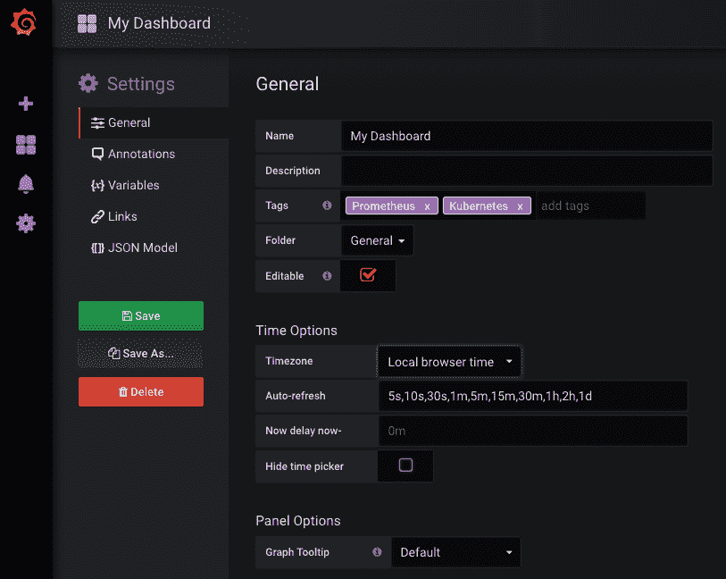
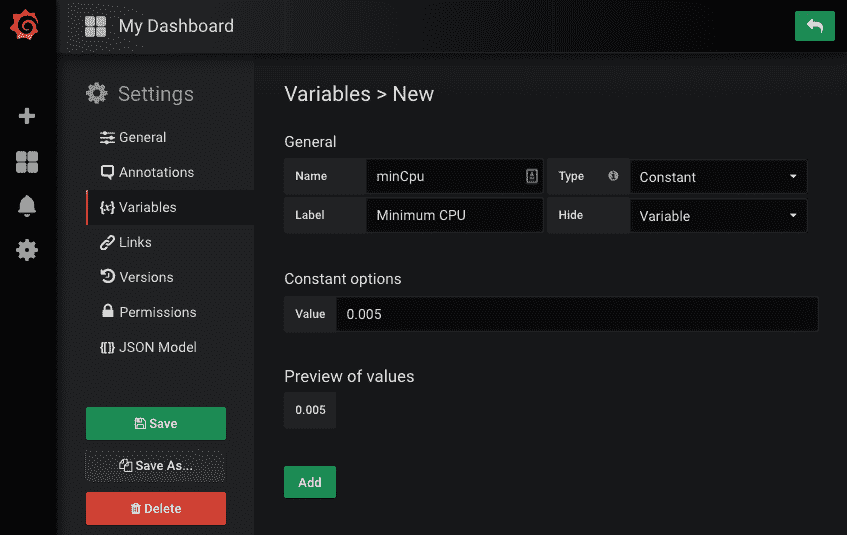
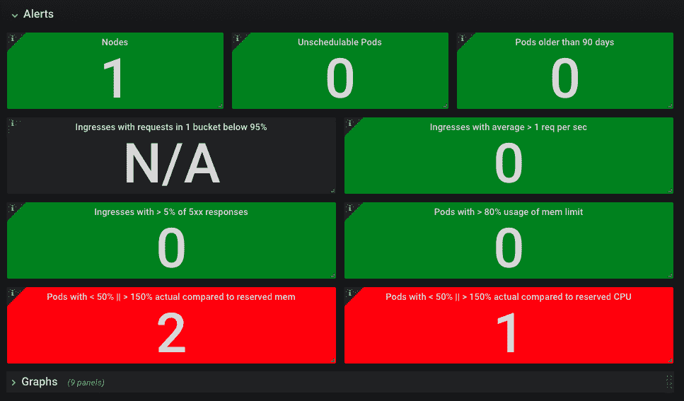

# 第六章：可视化指标和警报

你们人类经常设法获得你们不想要的东西，这是很有趣的。

- *斯波克*

**仪表板是无用的！它们是浪费时间。如果你想看点东西，就去看 Netflix 吧。比任何其他选择都便宜。**

我在许多公开场合重复了这些话。我认为公司夸大了对仪表板的需求。他们花费了大量精力创建了一堆图表，并让很多人负责盯着它们。好像那样会帮助任何人一样。仪表板的主要优势在于它们色彩丰富，充满线条、方框和标签。这些特性总是很容易卖给像 CTO 和部门负责人这样的决策者。当一个软件供应商与有权签发支票的决策者开会时，他知道没有“漂亮的颜色”就没有销售。软件做什么并不重要，重要的是它的外观。这就是为什么每家软件公司都专注于仪表板。

想想看。仪表板有什么好处？我们会盯着图表看，直到柱状图达到红线，表示达到了临界阈值吗？如果是这样，为什么不创建一个在相同条件下触发的警报，而不是浪费时间盯着屏幕等待发生什么。相反，我们可以做一些更有用的事情（比如看 Netflix）。

我们的“恐慌标准”是否比警报所能表达的更复杂？我认为它更复杂。然而，这种复杂性无法通过预定义的图表来反映。当然，意外事件会发生，我们需要深入挖掘数据。然而，“意外”这个词违背了仪表板所提供的内容。它们都是关于预期结果的。否则，我们如何在不知道期望结果的情况下定义一个图表呢？“它可以是任何东西”无法转化为图表。带有图表的仪表板是我们假设可能出错的方式，并将这些假设放在屏幕上，或者更常见的是放在很多屏幕上。

然而，意外只能通过查询指标来探索，不断深入直到找到问题的原因。这是一项调查工作，无法很好地转化为仪表板。我们使用 Prometheus 查询来进行这项工作。

然而，我在这里把一整章都献给了仪表板。

我承认仪表板并不是（完全）无用的。它们有时是有用的。我真正想传达的是它们的用处被夸大了，我们可能需要以不同于许多人习惯的方式构建和使用仪表板。

但是，我有点跳到了结论。我们稍后会讨论仪表板的细节。现在，我们需要创建一个集群，这将使我们能够进行实验，并将这个对话提升到更实际的水平。

# 创建一个集群

`vfarcic/k8s-specs` ([`github.com/vfarcic/k8s-specs`](https://github.com/vfarcic/k8s-specs)) 仓库将继续作为我们的 Kubernetes 定义的来源。我们将确保通过拉取最新版本使其保持最新。

本章中的所有命令都可以在 `06-grafana.sh` ([`gist.github.com/vfarcic/b94b3b220aab815946d34af1655733cb`](https://gist.github.com/vfarcic/b94b3b220aab815946d34af1655733cb)) Gist 中找到。

[PRE0]

要求与上一章相同。为了方便起见，Gists 在这里也是可用的。请随意使用它们来创建一个新的集群，或者验证您计划使用的集群是否符合要求。

+   `gke-instrument.sh`：**GKE** 使用 3 个 n1-standard-1 工作节点，**nginx Ingress**，**tiller**，**Prometheus** 图表，和环境变量 **LB_IP**，**PROM_ADDR**，和 **AM_ADDR** ([`gist.github.com/vfarcic/675f4b3ee2c55ee718cf132e71e04c6e`](https://gist.github.com/vfarcic/675f4b3ee2c55ee718cf132e71e04c6e))。

+   `eks-hpa-custom.sh`：**EKS** 使用 3 个 t2.small 工作节点，**nginx Ingress**，**tiller**，**Metrics Server**，**Prometheus** 图表，环境变量 **LB_IP**，**PROM_ADDR**，和 **AM_ADDR**，以及 **Cluster Autoscaler** ([`gist.github.com/vfarcic/868bf70ac2946458f5485edea1f6fc4c`](https://gist.github.com/vfarcic/868bf70ac2946458f5485edea1f6fc4c))。

+   `aks-instrument.sh`：**AKS** 使用 3 个 Standard_B2s 工作节点，**nginx Ingress**，**tiller**，**Prometheus** 图表，和环境变量 **LB_IP**，**PROM_ADDR**，和 **AM_ADDR** ([`gist.github.com/vfarcic/65a0d5834c9e20ebf1b99225fba0d339`](https://gist.github.com/vfarcic/65a0d5834c9e20ebf1b99225fba0d339))。

+   `docker-instrument.sh`：**Docker for Desktop**，带有**2 个 CPU**，**3GB RAM**，**nginx Ingress**，**tiller**，**Metrics Server**，**Prometheus**图表，以及环境变量**LB_IP**，**PROM_ADDR**和**AM_ADDR** ([`gist.github.com/vfarcic/1dddcae847e97219ab75f936d93451c2`](https://gist.github.com/vfarcic/1dddcae847e97219ab75f936d93451c2))。

+   `minikube-instrument.sh`：**minikube**，带有**2 个 CPU**，**3GB RAM**，启用**ingress**，**storage-provisioner**，**default-storageclass**和**metrics-server**插件，**tiller**，**Prometheus**图表，以及环境变量**LB_IP**，**PROM_ADDR**和**AM_ADDR** ([`gist.github.com/vfarcic/779fae2ae374cf91a5929070e47bddc8`](https://gist.github.com/vfarcic/779fae2ae374cf91a5929070e47bddc8))。

# 我们应该使用哪些工具来创建仪表板？

使用 Prometheus 只需几分钟就会发现它并不是设计用来作为仪表板的。当然，你可以在 Prometheus 中创建图表，但它们并不是永久的，也没有提供很多关于数据呈现的功能。Prometheus 的图表设计用于可视化临时查询。这正是我们大部分时间所需要的。当我们收到来自警报的通知表明有问题时，通常会通过执行警报的查询来开始寻找问题的罪魁祸首，然后根据结果深入数据。也就是说，如果警报没有立即显示问题，那么就没有必要接收通知，因为这类明显的问题通常可以自动修复。

但是，正如我已经提到的，Prometheus 并没有仪表板功能，所以我们需要寻找其他工具。

如今，选择仪表板很容易。*Grafana* ([`grafana.com/`](https://grafana.com/))是该领域无可争议的统治者。其他解决方案太老旧，不值得费心，或者它们不支持 Prometheus。这并不是说 Grafana 是市场上最好的工具。但价格合适（免费），并且可以与许多不同的数据源一起使用。例如，我们可以争论*Kibana* ([`www.elastic.co/products/kibana`](https://www.elastic.co/products/kibana))和 Grafana 一样好，甚至更好。但是，它仅限于来自 ElasticSearch 的数据。而 Grafana 除了可以使用来自 ElasticSearch 的数据外，还支持许多其他数据源。有人可能会说*DataDog* ([`www.datadoghq.com/`](https://www.datadoghq.com/))是一个更好的选择。但是，它遇到了与 Kibana 相同的问题。它与特定的指标来源绑定。

没有灵活性，也没有组合来自其他数据源的选项。更重要的是，这两者都不支持 Prometheus。

我将不再与其他工具进行比较。你可以自己尝试。目前，你需要相信我，Grafana 是一个不错的选择，如果不是最好的选择。如果我们在这一点上不同意，那么你继续阅读本章将毫无意义。

既然我已经强制选择了 Grafana，我们将继续安装它。

# 安装和设置 Grafana

接下来你可能知道发生了什么。我们谷歌搜索“Grafana Helm”，希望社区已经创建了一个我们可以使用的图表。我将为您揭示，Helm 的*稳定*频道中有 Grafana。我们所要做的就是检查数值并选择我们将使用的数值。

[PRE1]

我不会列举我们可以使用的所有数值。我假设到现在为止，你已经是一个 Helm 忍者，可以自己探索它们。相反，我们将使用我已经定义的数值。

[PRE2]

输出如下。

[PRE3]

这些数值没有什么特别之处。我们启用了 Ingress，设置了`persistence`，并定义了`resources`。正如文件名所示，这是一个非常简单的设置，没有任何多余的东西。

现在剩下的就是安装图表。

[PRE4]

现在我们可以在您喜欢的浏览器中打开 Grafana。

[PRE5]

你将看到登录界面。就像许多其他 Helm 图表一样，安装包括`admin`用户和密码存储为一个秘密。

[PRE6]

请返回到 Grafana 登录界面，输入`admin`作为用户名，并将上一个命令的输出粘贴为密码。

Grafana 不收集指标。相反，它使用其他数据源，因此我们的第一个操作是将 Prometheus 设置为数据源。

请点击“添加数据源”图标。

将`Prometheus`作为名称，并选择它作为类型。我们将让 Grafana 通过 Kubernetes 服务`prometheus-server`连接到它。由于两者都在同一个命名空间中，URL 应设置为`http://prometheus-server`。剩下的就是保存并测试。

本章的输出和截图来自 Docker for Desktop。您在这里看到的内容可能与您在屏幕上观察到的内容略有不同。图 6-1：Grafana 的新数据源屏幕本章的截图比通常多。我相信它们将帮助您复制我们将讨论的步骤。

# 导入和自定义预制仪表板

数据源本身是无用的。我们需要以某种方式将它们可视化。我们可以通过创建自己的仪表板来实现这一点，但这可能不是 Grafana 的最佳（也不是最简单）介绍。相反，我们将导入一个现有的社区维护的仪表板。我们只需要选择一个适合我们需求的仪表板。

[PRE7]

随意花一点时间探索可用的仪表板。

我认为*Kubernetes 集群监控*（[`grafana.com/dashboards/3119`](https://grafana.com/dashboards/3119)）仪表板是一个很好的起点。让我们导入它。

请点击左侧菜单中的“+”图标，然后点击“导入”链接，您将看到一个屏幕，允许我们导入 Grafana.com 的仪表板之一，或者粘贴定义它的 JSON。

我们将选择前一种选项。

图 6-2：Grafana 的导入仪表板选项

请在*Grafana.com 仪表板*字段中输入`3119`，然后点击“加载”按钮。您将看到一些字段。在这种情况下，唯一重要的是*prometheus*下拉列表。我们必须使用它来设置数据源。选择 Prometheus，并点击“导入”按钮。

您看到的是一个带有一些基本 Kubernetes 指标的仪表板。

图 6-3：Kubernetes 集群监控仪表板

但是，一些图表可能无法正常工作。这是否意味着我们导入了错误的仪表板？一个简单的答案恰恰相反。在所有可用的仪表板中，这个可能是最有效的。至少，如果我们只计算那些更多或少有用的图表。这样的结果很常见。这些仪表板由社区维护，但其中大多数是为个人使用而制作的。它们被配置为在特定集群中工作并使用特定的指标。您将很难找到许多不经任何更改就能正常工作并且同时显示您真正需要的内容的仪表板。相反，我认为这些仪表板是一个很好的起点。

我只是导入它们以获得一个我可以修改以满足我的特定需求的基础。这就是我们接下来要做的，至少部分地。

目前，我们只关注旨在使其完全运行的更改。我们将使一些当前没有数据的图表运行，并删除对我们无用的图表。

如果我们仔细看一下*总使用量*行，我们会发现*集群文件系统使用情况*是*N/A*。它使用的指标可能有问题。让我们仔细看一下。

在某些集群中（例如，EKS），此仪表板中的硬编码文件系统是正确的。如果是这种情况（如果*集群文件系统使用情况*不是*N/A*），则您无需进行任何更改。但是，我建议您在想象您的集群使用不同文件系统的同时进行练习。这样你就可以学到一些技巧，可以应用到其他仪表板上。

请按下*集群文件系统使用情况*标题旁边的箭头，并单击编辑链接。

图 6-4：Grafana 编辑面板的选项

该图表使用的查询（为了可读性而格式化）如下。

[PRE8]

我们不会深入讨论该查询的细节。你现在应该熟悉 Prometheus 表达式。相反，我们将专注于问题的可能原因。我们可能没有名为`/dev/xvda`的文件系统设备（除非您使用 EKS 或在某些情况下使用 GKE）。如果这是问题，我们可以通过简单地将值更改为我们的设备来修复图表。但是，在我们继续之前，我们可能会探索 Grafana 变量。毕竟，如果我们甚至不知道我们的设备是什么，将一个硬编码值更改为另一个值对我们毫无好处。

我们可以转到 Prometheus 并检索所有设备的列表，或者让 Grafana 为我们执行此操作。我们将选择后者。

仔细观察`kubernetes_io_hostname`。它设置为`^$Node$`。这是使用 Grafana 变量的示例。接下来，我们将探讨它们，试图替换硬编码的设备。

请单击位于屏幕右上角的*返回仪表板*按钮。

单击位于屏幕顶部的*设置*图标。您将看到我们可以更改的整个仪表板范围配置。随意在左侧菜单中探索选项。

由于我们有兴趣创建一个新变量，该变量将动态填充查询的`device`标签，我们接下来要做的是单击*设置*部分中的变量链接，然后点击+新按钮。

请将`device`键入为变量名称，将`IO 设备`键入为标签。我们将从 Prometheus（数据源）检索值，因此我们将将类型保留为查询。

接下来，我们需要指定数据源。选择$datasource。这告诉 Grafana 我们要从我们在导入仪表板时选择的任何数据源中查询数据。

到目前为止，一切可能都是不言自明的。接下来的内容不是。我们需要查阅文档，了解如何编写用作变量值的 Grafana 查询。

[PRE9]

让这成为一个练习。通过文档找出如何编写一个查询，以检索`container_fs_usage_bytes`指标中可用的`device`标签的所有不同值。

Grafana 仅支持四种类型的变量查询，因此我想您不会很难找出我们应该添加到查询字段的表达式是`label_values(container_fs_usage_bytes, device)`。

有了查询，剩下的就是单击添加按钮。

图 6-5：创建新仪表板变量的 Grafana 屏幕

现在我们应该返回*仪表板*并确认新变量是否可用。

您应该在屏幕左上部看到一个带有标签*IO 设备*的新下拉列表。如果您展开它，您将看到我们集群中使用的所有设备。确保选择正确的设备。这可能是`/dev/sda1`或`/dev/xvda1`。

接下来，我们需要更改图表以使用我们刚刚创建的变量。

请点击*Cluster 文件系统使用情况*图表旁边的箭头，并选择编辑。指标（查询）包含两个硬编码的`^/dev/xvda.$`值。将它们更改为`$device`，然后点击屏幕右上角的*返回仪表板*按钮。

就是这样。现在图表通过显示集群文件系统使用情况（`/dev/sda1`）的百分比来正确工作。

然而，下面的*已使用*和*总计*数字仍然是*N/A*。我相信你知道该怎么做来修复它们。编辑这些图形，并用`$device`替换`^/dev/xvda.$`。

该仪表板仍然有两个问题要解决。更准确地说，我们有两个图表对我们没有用。*系统服务 CPU 使用情况*和*系统服务内存使用情况*图表的目的应该可以从它们的标题中推断出来。然而，大多数 Kubernetes 集群不提供对系统级服务的访问（例如 GKE）。即使提供，我们的 Prometheus 也没有配置来获取数据。如果你不相信我，复制其中一个图表的查询并在 Prometheus 中执行它。就目前而言，这些图表只是在浪费空间，所以我们将删除它们。

请点击*系统服务 CPU 使用情况*行标题旁边的*垃圾桶*图标。点击是以删除该行和面板。对*系统服务内存使用情况*行执行相同的操作。

现在我们已经完成了对仪表板的更改。它已经完全可操作，我们应该通过点击屏幕右上角的*保存仪表板*图标或按**CTRL+S**来保存更改。

我们不会详细介绍 Grafana 的所有选项和我们可以做的操作。我相信你可以自己弄清楚。这是一个非常直观的应用程序。相反，我们将尝试创建自己的仪表板。或者，至少，探索一些东西，让你可以继续自己的工作。

# 创建自定义仪表板

如果我们所有的需求都可以由现有的仪表板满足，那将是很好的。但是，这可能并不是事实。每个组织都是“特殊”的，我们的需求必须反映在我们的仪表板中。有时我们可以使用他人制作的仪表板，有时我们需要对其进行更改。在其他情况下，我们需要创建自己的仪表板。这就是我们接下来要探索的内容。

请点击左侧菜单中的+图标，并选择`创建仪表板`。您将被提供选择几种类型的面板。选择`图形`。

在定义我们的第一个图表之前，我们将更改一些仪表板设置。请点击屏幕右上角的*设置*图标。

在*General*部分，输入仪表板的名称。如果你今天没有灵感，你可以称它为`我的仪表板`。将标签设置为`Prometheus`和`Kubernetes`。在输入每个标签后，你需要按下回车键。最后，将时区更改为本地浏览器时间。

图 6-6：Grafana 的仪表板常规设置屏幕

那是无聊的部分。现在让我们转到更有趣的事情。我们将把我们在 Prometheus 中创建的警报之一转换成图表。我们将使用告诉我们实际 CPU 使用量与保留 CPU 的百分比的那个。为此，我们需要一些变量。更准确地说，我们并不真的需要它们，因为我们可以硬编码这些值。但是，如果以后决定更改它们，那将会引起问题。修改变量比更改查询要容易得多。

具体来说，我们需要变量来告诉我们最小的 CPU 是多少，这样我们就可以忽略那些设置为使用非常低保留的应用程序的阈值。此外，我们将定义作为下限和上限的变量。我们的目标是在与实际使用相比时，如果保留的 CPU 太低或太高，我们会收到通知，就像我们在 Prometheus 警报中所做的那样。

请从左侧菜单中选择变量部分，然后点击“添加变量”按钮。

当我们为导入的仪表板创建新的变量时，你已经看到了 Grafana 变量的屏幕。然而，这次我们将使用略有不同的设置。

将名称设置为`minCpu`，并选择常量作为类型。与之前创建的`device`变量不同，这次我们不需要 Grafana 来查询数值。通过使用这种类型，我们将定义一个常量值。请将值设置为`0.005`（五个 CPU 毫秒）。最后，我们不需要在仪表板中看到该变量，因为该值不太可能经常更改。如果将来需要更改它，我们总是可以回到这个屏幕并更新它。因此，将隐藏值更改为变量。

现在只需点击两次“添加”按钮。

图 6-7：Grafana 的仪表板新变量屏幕

我们还需要两个变量。可能没有必要重复相同的说明，所以请使用以下信息来创建它们。

[PRE10]

现在我们可以返回并定义我们的图表。请点击屏幕右上角的*返回仪表板*图标。

你已经知道如何编辑面板。点击*面板标题*旁边的箭头，然后选择编辑。

我们将从*常规*部分开始。请选择它。

接下来，将`%实际 CPU 与保留 CPU`作为标题，以及后面的文本作为描述。

[PRE11]

请注意描述中`$minCpu`变量的使用。当我们回到仪表板时，它将展开为其值。

接下来，请切换到*指标*选项卡。那里才是真正的操作发生的地方。

我们可以定义多个查询，但对于我们的用例，一个应该就足够了。请在*A*右侧的字段中输入以下查询。

为了方便起见，查询可在`grafana-actual-vs-reserved-cpu` ([`gist.github.com/vfarcic/1b027a1e2b2415e1d156687c1cf14012`](https://gist.github.com/vfarcic/1b027a1e2b2415e1d156687c1cf14012)) Gist 中找到。

[PRE12]

该查询几乎与我们在第三章中使用的查询之一几乎相同，*收集和查询指标并发送警报*。唯一的区别是使用了`$minCpu`变量。

输入查询后的几分钟后，我们应该看到图表活跃起来。可能只包括一个 Pod，因为我们的许多应用程序被定义为使用五个 CPU 毫秒（`$minCpu`的值）或更少。

图 6-8：基于图表的 Grafana 面板

接下来，我们将调整图表左侧的单位。请点击*轴*选项卡。

展开*左 Y 单位*，选择无，然后选择百分比（0.0-1.0）。由于我们不使用*右 Y*轴，请取消选中*显示*复选框。

接下来是*图例*部分。请选择它。

勾选*作为表格显示*、*选项在右侧*和*值>当前*复选框。更改将立即应用到图表上，你应该不难推断出每个选项的作用。

只剩下一件事。我们应该定义上限和下限阈值，以清楚地指示结果是否超出预期范围。

请点击*警报*选项卡。

单击“创建警报”按钮，并将“高于”条件更改为“范围之外”。将下两个字段的值设置为`0,5`和`1,5`。这样，当实际 CPU 使用率低于 50％或高于 150％时，与保留值相比，应该会通知我们。

图 6-9：带有警报的 Grafana 图表

我们已经完成了图表，所以请返回到仪表板并享受“漂亮的颜色”。您可能希望拖动图表的右下角以调整其大小。

我们可以看到请求的 CPU 使用率与实际 CPU 使用率之间的差异。我们还有阈值（用红色标记），它将告诉我们使用情况是否超出了设定的边界。

现在出现了一个重要问题。这样的图表有用吗？答案取决于我们打算用它做什么。

如果目标是盯着它，等待其中一个 Pod 开始使用过多或过少的 CPU，我只能说您正在浪费可以用于更有生产力任务的才能。毕竟，我们已经在 Prometheus 中有类似的警报，当满足条件时会向我们发送 Slack 通知。它比我们在图表中拥有的更先进，因为它只会在 CPU 使用率在一定时间内激增时通知我们，从而避免可能在几秒或几分钟后解决的临时问题。我们应该将这些情况视为误报。

该图的另一个用途可能更为被动。我们可以忽略它（关闭 Grafana），只有在上述 Prometheus 警报触发时才回来。这可能更有意义。尽管我们可以在 Prometheus 中运行类似的查询并获得相同的结果，但具有预定义图表可以使我们免于编写这样的查询。您可以将其视为具有相应图形表示的查询注册表。这是更有意义的事情。与盯着仪表板（选择 Netflix）相比，我们可以在需要时回来。虽然在某些情况下这可能是一个合理的策略，但它只在非常简单的情况下起作用。当出现问题时，一个单独的预定义图表解决问题或更准确地说是提供问题原因的明确指示时，图表确实提供了重要价值。然而，往往情况并不那么简单，我们将不得不求助于 Prometheus 来深入挖掘指标。

盯着有图表的仪表板是浪费时间。在收到有关问题的通知后访问仪表板可能更有些意义。但是，除了琐碎的问题，其他问题都需要通过 Prometheus 指标进行更深入的挖掘。

尽管如此，我们刚刚制作的图表可能会证明自己是有用的，所以我们会保留它。在这种情况下，我们可能想要做的是更改 Prometheus 警报的链接（我们目前在 Slack 上收到的警报），以便它直接带我们到图表（而不是仪表板）。我们可以通过单击面板名称旁边的箭头，并选择“查看”选项来获取该链接。

我相信，如果我们将面板类型从图表更改为更少颜色、更少线条、更少坐标轴和没有其他漂亮东西的类型，我们的仪表板可以变得更有用。

# 创建信号量仪表板

如果我声称仪表板为我们带来的价值比我们想象的要低，你可能会问自己这一章开头的同样问题。为什么我们要谈论仪表板？嗯，我已经改变了我的说法，从“仪表板是无用的”变成了“仪表板中有一些价值”。它们可以作为查询的注册表。通过仪表板，我们不需要记住我们需要在 Prometheus 中编写的表达式。在我们深入挖掘指标之前，它们可能是我们寻找问题原因的一个很好的起点。但是，我包括仪表板在解决方案中还有另一个原因。

我喜欢大屏幕。走进一个有大屏幕显示重要内容的房间是非常令人满意的。通常有一个房间，操作员坐在四面墙上都是显示器的环境中。那通常是一个令人印象深刻的景象。然而，许多这样的情况存在问题。一堆显示很多图表的监视器可能并不比漂亮的景象更有意义。最初的几天过后，没有人会盯着图表看。如果这不是真的，你也可以解雇那个人，因为他是在假装工作。

让我再重复一遍。

仪表板并不是为了我们盯着它们而设计的，尤其是当它们在所有人都能看到的大屏幕上时。

因此，如果拥有大屏幕是一个好主意，但图形不是一个好的装饰候选，那么我们应该做什么呢？答案就在于信号量。它们类似于警报，应该清晰地指示系统的状态。如果屏幕上的一切都是绿色的，我们就没有理由做任何事情。其中一个变成红色是一个提示，我们应该做一些事情来纠正问题。因此，我们必须尽量避免误报。如果某事变成红色，而不需要任何行动，我们很可能在将来开始忽视它。当这种情况发生时，我们冒着忽视一个真正问题的风险，认为它只是另一个误报。因此，每次出现警报都应该跟随着一个行动。

这可以是纠正系统的修复措施，也可以是改变导致其中一个信号量变红的条件。无论哪种情况，我们都不应该忽视它。

信号量的主要问题在于它们对 CTO 和其他决策者来说并不那么吸引人。它们既不丰富多彩，也不显示很多框、线和数字。人们经常将有用性与外观上的吸引力混淆。尽管如此，我们并不是在建造应该出售给 CTO 的东西，而是在建造可以帮助我们日常工作的东西。

与图形相比，信号量作为查看系统状态的一种方式要更有用得多，尽管它们看起来不像图形那样丰富多彩和令人愉悦。

让我们创建我们的第一个信号量。

请点击屏幕右上角的*添加面板*图标，并选择 Singlestat。点击*面板标题*旁边的箭头图标，然后选择编辑。

在大多数情况下，创建一个单一的状态（信号量）与创建一个图形并没有太大的不同。显著的区别在于应该产生一个单一值的度量（查询）。我们很快就会到达那里。现在，我们将改变面板的一些一般信息。

请选中“常规”选项卡。

将`Pods with <$cpuReqPercentMin%||>$cpuReqPercentMax% actual compared to reserved CPU`输入为标题，然后输入后面的文本为描述。

[PRE13]

这个单一统计将使用与我们之前制作的图表类似的查询。然而，虽然图表显示当前使用量与保留 CPU 相比，但该面板应该显示有多少个 Pod 的实际 CPU 使用量超出了基于保留 CPU 的边界。这反映在我们刚刚输入的标题和描述中。正如您所看到的，这一次我们依赖更多的变量来表达我们的意图。

现在，让我们把注意力转向查询。请单击“指标”选项卡，并将以下表达式输入到* A *旁边的字段中。

为了您的方便，该查询可在`grafana-single-stat-actual-vs-reserved-cpu` ([`gist.github.com/vfarcic/078674efd3b379c211c4da2c9844f5bd`](https://gist.github.com/vfarcic/078674efd3b379c211c4da2c9844f5bd)) Gist 中找到。

[PRE14]

该查询类似于我们用作 Prometheus 警报的查询之一。更准确地说，它是两个 Prometheus 警报的组合。前半部分返回具有超过`$minCpu`（5 CPU 毫秒）的保留 CPU 和实际 CPU 使用低于`$cpuReqPercentMin`（50%）的 Pod 数量。后半部分与第一部分几乎相同，只是返回 CPU 使用高于`$cpuReqPercentMax`（150%）的 Pod。

由于我们的目标是返回一个单一的统计数据，即 Pod 的数量，在这种情况下，您可能会感到惊讶，我们使用了`sum`而不是`count`。统计 Pod 的数量确实更有意义，但如果没有结果，将返回`N/A`。为了避免这种情况，我们使用了`bool`的技巧。通过将其放在表达式前面，如果有匹配，则返回`1`，如果没有，则返回`0`。这样，如果没有 Pod 符合条件，我们不会得到空结果，而是得到`0`，这更好地表示有问题的 Pod 的数量。

总的来说，我们正在检索所有实际 CPU 低于保留 CPU 的`$cpuReqPercentMin`（50%）的 Pod 的总和，以及所有实际 CPU 高于保留 CPU 的`$cpuReqPercentMax`（150%）的 Pod 的总和。在这两种情况下，只有超过`$minCpu`（五个 CPU 毫秒）的 Pod 被包括在内。查询本身并不是我们可以编写的最简单的查询，但考虑到我们已经花了很多时间处理 Prometheus 查询，我认为我不应该用一些琐碎的东西“侮辱”您。

接下来，请单击“选项”选项卡。这是我们将定义应触发颜色变化的条件的地方。

我们不想要在指定周期内的平均值，而是有问题的 Pods 的当前数量。我们将通过将 Stat 下拉列表的值更改为 Current 来实现这一点。

我们希望这个面板非常显眼，所以我们将将 Stat 字体大小更改为`200%`。我更喜欢更大的字体，但是 Grafana 不允许我们超过这个值。

接下来，我们想要更改面板的背景颜色，请勾选 Coloring Background 复选框。

我们最多可以使用三种颜色，但我相信我们只需要两种。要么一个或多个 Pod 符合条件，要么没有一个符合条件。

一旦查询返回`1`或更高的数字，我们应该立即收到通知。请将`1`键入为 Coloring Thresholds。如果我们有更多，我们将用逗号分隔它们。

最后，由于我们只有两个条件，绿色和红色，我们需要将第二个颜色从橙色更改为红色。请点击 Coloring Colors 中的*red*图标，并将值替换为单词*red*。第三种颜色没有使用，所以我们将保持不变。

图 6-10：Grafana 的单个统计面板

我们已经完成了我们的面板，所以返回*仪表板*。

在继续之前，请点击*保存仪表板*图标，然后点击保存按钮。

到目前为止，我们创建了一个带有图形和单个统计（信号量）的仪表板。前者显示了 CPU 使用率与保留 CPU 随时间的偏差。它有警报（红色区域），告诉我们一个向量是否超出了预定义的边界。单个统计（信号量）显示一个数字，具有绿色或红色的背景，具体取决于该数字是否达到了阈值，而在我们的情况下，阈值设置为`1`。

我们刚刚开始，还需要在此仪表板变得有用之前添加许多其他面板。我会免去您定义其他面板的重复指令。我觉得您已经掌握了 Grafana 的工作原理。至少，您应该具备可以自行扩展的基础知识。

我们将快进。我们将导入我准备好的仪表板并讨论设计选择。

# 更适合大屏幕的仪表板

我们探讨了如何创建一个带有图形和单个统计（信号量）的仪表板。两者都基于类似的查询，显著的区别在于它们显示结果的方式。我们将假设我们开始构建的仪表板的主要目的是在大屏幕上可用，对许多人可见，并不是作为我们在笔记本电脑上持续保持打开的东西。至少，不是持续的。

这样的仪表板的主要目的应该是什么？在我回答这个问题之前，我们将导入我为本章创建的一个仪表板。

请从左侧菜单中单击+按钮，然后选择导入。在*Grafana.com 仪表板*中键入`9132`，然后按加载按钮。选择*Prometheus 数据源*。随时更改任何值以满足您的需求。尽管如此，您可能希望在更熟悉仪表板之后再进行更改。

无论如何，完成后点击导入按钮。

图 6-11：基于信号的 Grafana 仪表板

您可能会看到一个或多个红色的信号。这是正常的，因为我们集群中的一些资源配置不正确。例如，Prometheus 可能请求的内存比它实际需要的要少。这没关系，因为它可以让我们看到仪表板的运行情况。Gists 中使用的定义不应该是生产就绪的，您已经知道您需要调整它们的资源，以及可能还有其他一些东西。

您会注意到我们导入的仪表板只包含信号。至少在第一次看时是这样。尽管它们可能不像图形和其他类型的面板那样吸引人，但它们作为系统健康的指标要更有效得多。我们不需要一直看着那个仪表板。只要它显示在大屏幕上，我们就可以在做其他事情的同时工作。如果其中一个方框变成红色，我们会注意到。这将是一个行动的呼唤。或者更准确地说，如果一个红色的方框持续保持红色，排除了它是一个自行解决的错误警报的可能性，我们将需要采取一些行动。

您可以将此仪表板视为 Prometheus 警报的补充。它并不取代它们，因为我们将在稍后讨论一些微妙但重要的区别。

我不会描述每个面板，因为它们是我们之前创建的 Prometheus 警报的反映。您现在应该对它们很熟悉。如果有疑问，请单击面板左上角的 i 图标。如果描述不够，请进入面板的编辑模式，检查查询和着色选项。

请注意，仪表板可能不是完美的。您可能需要更改一些变量值或着色阈值。例如，*节点* 面板的阈值设置为 `4,5`。从颜色来看，我们可以看到如果节点数跳到四个，它会变成橙色（警告），如果变成五个，就会变成红色（恐慌）。您的值可能会有所不同。理想情况下，我们应该使用变量而不是硬编码的阈值，但目前在 Grafana 中还不可能。变量并非在所有地方都受支持。作为开源项目的支持者，您应该提交 PR。如果您这样做了，请告诉我。

这是否意味着我们所有的仪表板都应该是绿色和红色的框，里面只有一个数字？我确实认为信号灯应该是“默认”显示。当它们是绿色时，就不需要其他任何东西。如果不是这种情况，我们应该增加信号灯的数量，而不是用随机图表来混乱我们的监视器。然而，这就引出了一个问题。当一些框变成红色甚至橙色时，我们该怎么办？

在框下面，您会找到*图表* 行，带有额外的面板。它们默认情况下是不可见的，有其原因。

在正常情况下，看到它们是没有理由的。但是，如果其中一个信号灯发出警报，我们可以展开*图表*，看到有关问题的更多细节。

图 6-12：基于表格和图表的 Grafana 仪表板

*图表* 行内的面板是对*警报* 行内的面板（信号灯）的反映。每个图表显示了与相同位置的单个统计数据相关的更详细的数据（但是不同的行）。这样，我们就不需要浪费时间来弄清哪个图表对应于“红色框”。

相反，我们可以直接跳转到相应的图表。如果右侧第二行的信号灯变成红色，就看右侧第二行的图表。如果多个框变成红色，我们可以快速查看相关的图表，并尝试找到关联（如果有的话）。往往情况下，我们将不得不从 Grafana 切换到 Prometheus，并深入挖掘指标。

像你面前的这个仪表板应该让我们快速启动解决问题。顶部的信号灯提供了警报机制，应该导致下面的图表快速指示出问题的可能原因。从那里开始，如果原因很明显，我们可以转到 Prometheus 并开始调试（如果这个词用得对的话）。

带有信号灯的仪表板应该显示在办公室周围的大屏幕上。它们应该提供问题的指示。相应的图表（和其他面板）提供了对问题的第一印象。Prometheus 作为我们用来挖掘指标直到找到罪魁祸首的调试工具。

我们探讨了一些提供类似功能的东西。但是，Prometheus 警报、信号灯、图表警报和 Grafana 通知之间的区别可能并不清楚？为什么我们没有创建任何 Grafana 通知？我们将在接下来探讨这些问题以及其他一些问题。

# Prometheus 警报 vs. Grafana 通知 vs. 信号灯 vs. 图表警报

标题本身可能会让人感到困惑，所以让我们简要描述一下其中提到的每个元素。

Prometheus 警报和 Grafana 通知具有相同的目的，尽管我们没有探讨后者。我会让你自己学习 Grafana 通知的工作原理。谁知道呢？在接下来的讨论之后，你可能甚至不想花时间去了解它们。

Grafana 通知可以以与 Prometheus 的警报转发方式类似的方式转发给不同的接收者。然而，有一些事情使 Grafana 通知变得不那么吸引人。

如果我们可以通过 Prometheus 警报实现与 Grafana 警报相同的结果，那么前者就具有明显的优势。如果从 Prometheus 触发了警报，那意味着导致触发警报的规则也在 Prometheus 中定义。

因此，评估是在数据源处进行的，我们避免了 Grafana 和 Prometheus 之间不必要的延迟。我们离数据源越近越好。在警报/通知的情况下，更近意味着在 Prometheus 内部。

在 Prometheus 中定义警报的另一个优势是它允许我们做更多的事情。例如，在 Grafana 中没有与 Prometheus 的`for`语句相当的东西。我们无法定义一个只有在条件持续一段时间后才触发的通知。我们需要通过对查询进行非平凡的添加来实现相同的功能。另一方面，Alertmanager 提供了更复杂的方法来过滤警报，对其进行分组，并仅转发符合特定条件的警报。在 Prometheus 和 Alertmanager 中定义警报而不是在 Grafana 中定义通知还有许多其他优点。但我们不会详细讨论所有这些优点。我会留给你去发现所有的区别，除非你已经被说服放弃 Grafana 通知，转而使用 Prometheus 警报和 Alertmanager。

有一个重要的原因你不应该完全忽视 Grafana 通知。你使用的数据源可能没有警报/通知机制，或者它可能是你没有拥有的企业许可证的一部分。由于 Grafana 支持许多不同的数据源，其中 Prometheus 只是其中之一，Grafana 通知允许我们使用任何这些数据源，甚至将它们组合在一起。

基于存储在那里的指标，坚持使用 Prometheus 进行警报/通知。对于其他数据源，Grafana 警报可能是更好的选择，甚至是唯一的选择。

现在我们简要探讨了 Prometheus 警报和 Grafana 通知之间的区别，我们将进入信号量。

信号量（基于单个状态面板的 Grafana 仪表板）不能取代 Prometheus 警报。首先，很难，甚至不可能，创建只有在值达到某个阈值一段时间后才变红的信号量（例如，就像 Prometheus 警报中的`for`语句）。这意味着信号量可能会变红，只是在几分钟后又变回绿色。这并不是一个需要采取行动的原因，因为问题在短时间内会自动解决。如果我们每次在 Grafana 中看到红色就跳起来，我们可能会身体非常健康，但我们不会做太多有用的工作。

信号量是可能存在问题的指示，可能不需要任何干预。虽然应该避免这种错误的积极性，但要完全摆脱它们几乎是不可能的。这意味着我们应该盯着屏幕看，看看红色的方框是否在我们采取行动之前至少持续几分钟。信号量的主要目的不是向个人或团队提供通知，告诉他们应该解决问题。Slack、电子邮件和其他目的地的通知会做到这一点。信号量提供了对系统状态的认识。

最后，我们探讨了在图表上定义的警报。这些是图表中的红线和区域。它们并不是表明出现问题的良好指标。它们并不容易被发现，因此不能引起注意，而且绝对不能取代通知。相反，它们在我们发现存在问题后帮助我们。如果通知或信号量警告我们存在可能需要解决的问题，图表警报将帮助我们确定罪魁祸首。哪个 Pod 处于红色区域？哪个入口收到的请求超出了预期？这些只是我们可以通过图表警报回答的一些问题。

# 现在呢？

Grafana 相对简单易用。如果您知道如何为连接到 Grafana 的数据源（例如 Prometheus）编写查询，那么您已经学会了最具挑战性的部分。其余部分大多是勾选框、选择面板类型和在屏幕上排列事物。主要困难在于避免被创建一堆没有太多价值的花哨仪表板所带走。一个常见的错误是为我们能想象到的一切创建图表。这只会降低那些真正重要的价值。少即是多。

就这样。如果集群专门用于本书，请销毁它；如果不是，或者您打算立即跳到下一章，那就保留它。如果要保留它，请通过执行以下命令删除`grafana`图表。如果我们在接下来的章节中需要它，我会确保它包含在 Gists 中。

[PRE15]

在离开之前，您可能希望复习本章的要点。

+   查看带有图形的仪表板是浪费时间。在收到有关问题的通知后访问仪表板会更有意义一些。但是，除了琐碎的问题，其他问题都需要通过 Prometheus 指标进行更深入的挖掘。

+   仪表板并不是为了我们盯着它们看而设计的，尤其是当它们显示在大屏幕上，所有人都能看到时。

+   信号灯比图表更有用，作为查看系统状态的一种方式，尽管它们看起来没有图表那么丰富多彩和令人愉悦。

+   带有信号灯的仪表板应该显示在办公室周围的大屏幕上。它们应该提供问题的指示。相应的图表（和其他面板）提供了对问题的第一印象。Prometheus 作为我们用来深入挖掘指标直到找到罪魁祸首的调试工具。

+   对于基于存储在那里的指标的警报/通知，坚持使用 Prometheus。对于其他数据源，Grafana 警报可能是更好甚至是唯一的选择。
