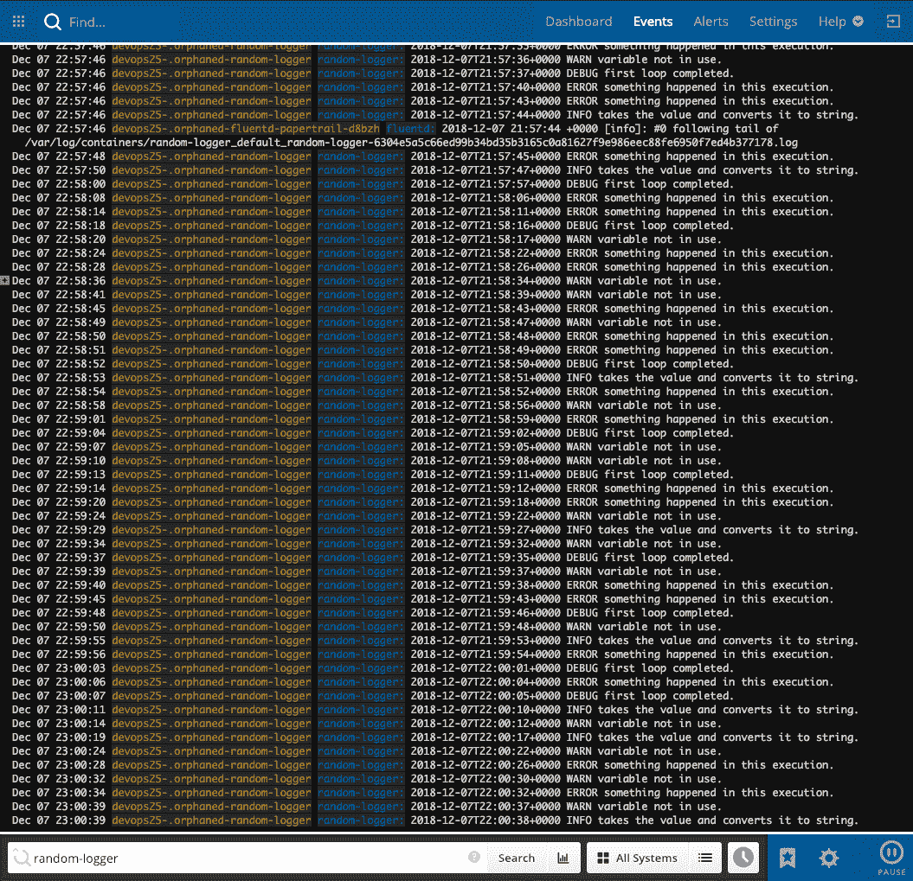
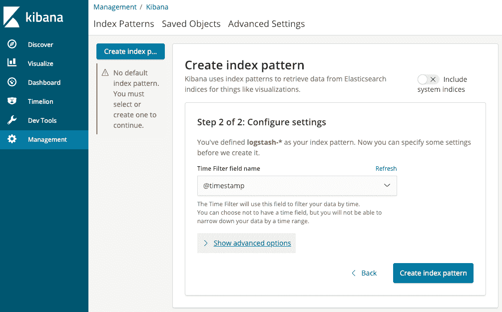

# 第七章：收集和查询日志

在关键时刻，人们有时会看到他们希望看到的东西。

- *Spock*

到目前为止，我们的主要重点是指标。我们以不同的形式和不同的目的使用它们。在某些情况下，我们使用指标来扩展 Pod 和节点。在其他情况下，指标被用来创建警报，以便在出现无法自动修复的问题时通知我们。我们还创建了一些仪表板。

然而，指标通常是不够的。特别是在处理需要手动干预的问题时。当仅仅依靠指标是不够的时，我们通常需要查看日志，希望它们能揭示问题的原因。

日志经常被误解，或者更准确地说，与指标混淆。对许多人来说，日志和指标之间的界限变得模糊。有些人从日志中提取指标。其他人则将指标和日志视为相同的信息来源。这两种方法都是错误的。指标和日志是独立的实体，它们有不同的用途，它们之间有明显的区别。我们将它们分开存储，并且我们使用它们来解决不同类型的问题。我们将暂时搁置这些讨论和其他一些讨论。我们不会基于理论细节进行探讨，而是通过实际示例来探索它们。为此，我们需要一个集群。

# 创建一个集群

你知道该怎么做。我们将进入`vfarcic/k8s-specs` ([`github.com/vfarcic/k8s-specs`](https://github.com/vfarcic/k8s-specs))存储库的目录，我们将拉取最新版本的代码，以防我最近推送了一些东西，然后我们将创建一个新的集群，除非您已经有一个可用。

本章中的所有命令都可以在`07-logging.sh` ([`gist.github.com/vfarcic/74774240545e638b6cf0e01460894f34`](https://gist.github.com/vfarcic/74774240545e638b6cf0e01460894f34)) Gist 中找到。

[PRE0]

这一次，集群的要求发生了变化。我们需要比以前更多的内存。主要问题是 ElasticSearch 非常耗资源。

如果您使用**Docker for Desktop**或**minikube**，您需要将集群的内存增加到**10 GB**。如果这对您的笔记本来说太多，您可以选择阅读*通过 Elasticsearch、Fluentd 和 Kibana 探索集中式日志记录*，而不运行示例，或者您可能需要切换到云提供商（AWS、GCP 或 Azure）之一。

对于 **EKS** 和 **AKS**，我们将需要更大的节点。对于 EKS，我们将使用 **t2.large**，对于 AKS，我们将使用 **Standard_B2ms**。两者都基于 **2 个 CPU** 和 **8 GB RAM**。

**GKE** 的要求与以前相同。

除了新的要求之外，还应该注意到在本章中我们不需要 Prometheus，所以我从 Gists 中删除了它。

请随意使用以下其中一个 Gist 来创建一个新的集群，或者验证您计划使用的集群是否符合要求。

+   `gke-monitor.sh`：**GKE** 有 3 个 n1-standard-1 工作节点，**nginx Ingress**，**tiller**，并且集群 IP 存储在环境变量 **LB_IP** 中（[`gist.github.com/vfarcic/10e14bfbec466347d70d11a78fe7eec4`](https://gist.github.com/vfarcic/10e14bfbec466347d70d11a78fe7eec4)）。

+   `eks-logging.sh`：**EKS** 有 3 个 t2.large 工作节点，**nginx Ingress**，**tiller**，**Metrics Server**，**Cluster Autoscaler**，并且集群 IP 存储在环境变量 **LB_IP** 中（[`gist.github.com/vfarcic/a783351fc9a3637a291346dd4bc346e7`](https://gist.github.com/vfarcic/a783351fc9a3637a291346dd4bc346e7)）。

+   `aks-logging.sh`：**AKS** 有 3 个 Standard_B2ms 工作节点，**nginx Ingress**，和 **tiller**，并且集群 IP 存储在环境变量 **LB_IP** 中（[`gist.github.com/vfarcic/c4a63b92c03a0a1c721cb63b07d2ddfc`](https://gist.github.com/vfarcic/c4a63b92c03a0a1c721cb63b07d2ddfc)）。

+   `docker-logging.sh`：**Docker for Desktop** 有 **2 个 CPU** 和 **10 GB RAM**，**nginx Ingress**，**tiller**，**Metrics Server**，并且集群 IP 存储在环境变量 **LB_IP** 中（[`gist.github.com/vfarcic/17d4f11ec53eed74e4b5e73debb4a590`](https://gist.github.com/vfarcic/17d4f11ec53eed74e4b5e73debb4a590)）。

+   `minikube-logging.sh`：**minikube** 有 **2 个 CPU** 和 **10 GB RAM**，启用了 **ingress**，**storage-provisioner**，**default-storageclass**，和 **metrics-server** 插件，**tiller**，并且集群 IP 存储在环境变量 **LB_IP** 中（[`gist.github.com/vfarcic/9f72c8451e1cca71758c70195c1c9f07`](https://gist.github.com/vfarcic/9f72c8451e1cca71758c70195c1c9f07)）。

现在我们有一个可用的集群，我们将探索如何通过 `kubectl` 使用日志。这将为后续更全面的解决方案提供一个基础。

# 通过 kubectl 探索日志

大多数人在 Kubernetes 中接触日志的第一次是通过 `kubectl`。几乎不可避免地会使用它。

当我们学习如何驯服 Kubernetes 时，我们必须在遇到困难时检查日志。在 Kubernetes 中，“日志”一词是指集群内运行的我们和第三方应用程序产生的输出。然而，这些不包括不同 Kubernetes 资源生成的事件。尽管许多人也称它们为日志，但 Kubernetes 将它们与日志分开，并称其为事件。我相信你已经知道如何从应用程序中检索日志以及如何查看 Kubernetes 事件。尽管如此，我们也会在这里简要探讨它们，因为这将使我们后面的讨论更有关联。我保证会简短地介绍，如果你认为 Kubernetes 中日志和事件的简要概述对你来说太基础，你可以跳过这一部分。

我们将安装已经熟悉的`go-demo-5`应用程序。它应该会产生足够的日志供我们探索。由于它由几个资源组成，我们也必然会创建一些 Kubernetes 事件。

我们出发了。

[PRE1]

我们部署了`go-demo-5`并发送了一个`curl`请求来确认它确实在运行。

本章中的输出和截图来自 minikube，除了专门用于 GKE、EKS 和 AKS 的部分。你在这里看到的内容可能与你在屏幕上观察到的有轻微差异。

要查看由 Kubernetes 生成并限于特定资源的“日志”，我们需要检索事件。

[PRE2]

输出仅限于“事件”部分的消息如下。

[PRE3]

你在面前看到的事件，在某种程度上，是由 Kubernetes 生成的日志，这里是`go-demo-5-db` StatefulSet。

尽管这些事件很有用，但通常还不够。往往我们事先不知道问题出在哪里。如果我们的 Pod 之一表现不佳，问题可能在于该 Pod，但也可能在创建它的 ReplicaSet 中，或者可能在创建 ReplicaSet 的 Deployment 中，或者可能节点从集群中分离了，或者可能是完全不同的原因。

对于除了最小的系统之外的任何系统来说，从一个资源到另一个资源，从一个节点到另一个节点去找到问题的原因绝非实际、可靠和快速。

简而言之，通过描述资源来查看事件并不是解决问题的方法，我们需要找到替代方案。

但在此之前，让我们看看应用程序的日志发生了什么。

我们部署了几个`go-demo-5` API 的副本和几个 MongoDB 的副本。如果我们怀疑其中一个存在问题，我们如何探索它们的日志？我们可以执行像下面这样的`kubectl logs`命令。

[PRE4]

输出显示了`go-demo-5-db-0` Pod 内`db`容器的日志。

虽然先前的输出仅限于单个容器和单个 Pod，但我们可以使用标签从多个 Pod 中检索日志。

[PRE5]

这一次，输出来自所有标签为`app`设置为`go-demo-5`的 Pod。我们扩大了我们的结果，这通常是我们所需要的。如果我们知道`go-demo-5`的 Pod 存在问题，我们需要弄清楚问题是存在于多个 Pod 中还是仅限于一个 Pod。虽然先前的命令允许我们扩大搜索范围，但如果日志中有可疑的内容，我们将不知道其来源。从多个 Pod 中检索日志并不能让我们更接近知道哪些 Pod 的行为不端。

使用标签仍然非常有限。它们绝对不能替代更复杂的查询。我们可能需要根据时间戳、节点、关键字等来过滤结果。虽然我们可以通过额外的`kubectl logs`参数和对`grep`、`sed`和其他 Linux 命令的创造性使用来实现其中一些功能，但这种检索、过滤和输出日志的方法远非最佳。

往往`kubectl logs`命令并不能为我们提供足够的选项来执行除了最简单的日志检索之外的任何操作。

我们需要一些东西来提高我们的调试能力。我们需要一个强大的查询语言，可以让我们过滤日志条目，我们需要足够的关于这些日志来源的信息，我们需要查询速度快，我们需要访问集群中任何部分创建的日志。我们将尝试通过设置集中式日志解决方案来实现这一点，以及其他一些事情。

# 选择集中式日志解决方案

我们需要做的第一件事是找到一个存储日志的地方。考虑到我们希望能够过滤日志条目，将它们存储在文件中应该从一开始就被排除。我们需要的是一种数据库。它更重要的是快速而不是事务性，所以我们很可能在寻找一种内存数据库解决方案。但在我们看选择之前，我们应该讨论一下我们的数据库位置。我们应该在集群内运行它，还是应该使用一个服务？在立即做出决定之前，我们将探讨两种选择，然后再做出选择。

日志服务有两个主要类型。如果我们正在使用云提供商之一的集群，一个明显的选择可能是使用他们提供的日志解决方案。EKS 有 AWS CloudWatch，GKE 有 GCP Stackdriver，AKS 有 Azure Log Analytics。如果您选择使用其中一个云供应商，这可能是很有意义的。如果一切都已经设置好并等待您，为什么要费心设置自己的解决方案或寻找第三方服务呢？我们很快将探索它们。

由于我的使命是为（几乎）任何人提供有效的指导，我们还将探讨一些在托管供应商之外找到的日志服务解决方案。但是，我们应该选择哪一个？市场上有太多的解决方案。例如，我们可以选择*Splunk* ([`www.splunk.com/`](https://www.splunk.com/)) 或 *DataDog* ([`www.datadoghq.com/`](https://www.datadoghq.com/))。两者都是很好的选择，而且都不仅仅是日志解决方案。我们可以使用它们来收集指标（就像使用 Prometheus 一样）。它们提供仪表板（就像 Grafana 一样），还有其他一些功能。稍后，我们将讨论是否应该将日志和指标合并到一个工具中。目前，我们的重点只是日志记录，这也是我们跳过 Splunk、DataDog 和类似综合工具的主要原因，因为它们提供的远远超出我们所需的。这并不意味着你应该放弃它们，而是本章试图保持对日志记录的关注。

有许多日志记录服务可用，包括*Scalyr* ([`www.scalyr.com/pricing`](https://www.scalyr.com/pricing)), [*logdna*](https://logdna.com/) ([`logdna.com/`](https://logdna.com/)), *sumo logic* ([`www.sumologic.com/`](https://www.sumologic.com/)) 等等。我们不会逐一介绍它们，因为这将花费比我认为有用的时间和空间更多。鉴于大多数服务在涉及日志记录时非常相似，我将跳过详细比较，直接介绍*Papertrail* ([`papertrailapp.com/`](https://papertrailapp.com/))，这是我最喜欢的日志记录服务。请记住，我们只会将其用作示例。我假设您至少会检查其他一些服务，并根据自己的需求做出选择。

作为服务的日志记录可能并不适合所有人。有些人可能更喜欢自托管的解决方案，而其他人甚至可能不被允许将数据发送到集群外部。在这些情况下，自托管的日志记录解决方案很可能是唯一的选择。

即使您不受限于自己的集群，也可能有其他原因将其保留在内部，延迟只是其中之一。我们也将探讨自托管的解决方案，因此让我们选择一个。它将是哪一个？

鉴于我们需要一个存储日志的地方，我们可能会研究传统数据库。然而，大多数传统数据库都不符合我们的需求。像 MySQL 这样的事务性数据库需要固定的模式，因此我们可以立即将其排除。NoSQL 更适合，因此我们可能会选择类似 MongoDB 的东西。但是，这将是一个糟糕的选择，因为我们需要能够执行非常快速的自由文本搜索。为此，我们可能需要一个内存数据库。MongoDB 不是其中之一。我们可以使用 Splunk Enterprise，但本书致力于免费（大多数是开源）的解决方案。到目前为止，我们唯一的例外是云提供商，我打算保持这种方式。

我们提到的少数要求（快速、自由文本、内存中、免费解决方案）将我们的潜在候选者限制在很少的几个。*Solr*（[`lucene.apache.org/solr/`](http://lucene.apache.org/solr/)）是其中之一，但它的使用量一直在下降，如今很少被使用（有充分的理由）。从一小群人中脱颖而出的解决方案是*Elasticsearch*（[`www.elastic.co/products/elasticsearch`](https://www.elastic.co/products/elasticsearch)）。如果你对本地解决方案有偏好，可以将我们将要介绍的示例视为一套实践，你应该能够将其应用到其他集中式日志记录解决方案上。

总的来说，我们将探索一个独立的日志服务提供示例（Papertrail），我们将探索云托管供应商提供的解决方案（AWS CloudWatch、GCP Stackdriver 和 Azure Log Analytics），并尝试与一些朋友设置 ElasticSearch。这些示例应该足够让你选择哪种类型的解决方案最适合你的用例。

但是，在我们探索存储日志的工具之前，我们需要弄清楚如何收集它们并将它们发送到最终目的地。

# 探索日志收集和发送

长期以来，有两个主要竞争者争夺“日志收集和发送”王位。它们分别是*Logstash*（[`www.elastic.co/products/logstash`](https://www.elastic.co/products/logstash)）和*Fluentd*（[`www.fluentd.org/`](https://www.fluentd.org/)）。两者都是开源的，都得到了广泛的接受和积极的维护。虽然两者都有各自的优缺点，但 Fluentd 在云原生分布式系统中表现出了优势。它消耗更少的资源，更重要的是，它不受限于单一目的地（Elasticsearch）。虽然 Logstash 可以将日志推送到许多不同的目标，但它主要设计用于与 Elasticsearch 一起工作。因此，其他日志解决方案采用了 Fluentd。

截至目前，无论你采用哪种日志产品，它都很可能支持 Fluentd。这种采用的高潮可以从 Fluentd 进入*Cloud Native Computing Foundation*（[`www.cncf.io/`](https://www.cncf.io/)）项目列表中看出。甚至 Elasticsearch 用户也在采用 Fluentd 而不是 Logstash。以前通常被称为**ELK**（**Elasticsearch**、**Logstash**、**Kibana**）堆栈的东西，现在被称为**EFK**（**Elasticsearch**、**Fluentd**、**Kibana**）。

我们将跟随潮流，采用 Fluentd 作为收集和传送日志的解决方案，无论目的地是 Papertrail、Elasticsearch 还是其他什么。

我们很快将安装 Fluentd。但是，由于 Papertrail 是我们的第一个目标，我们需要创建和设置一个账户。现在，记住我们需要从集群的所有节点收集日志，正如您已经知道的那样，Kubernetes 的 DaemonSet 将确保在我们的每个服务器上运行一个 Fluentd Pod。

# 通过 Papertrail 探索集中式日志记录

我们将探索的第一个集中式日志记录解决方案是*Papertrail* ([`papertrailapp.com/`](https://papertrailapp.com/))。我们将把它作为一种日志即服务解决方案的代表，它可以使我们摆脱安装和更重要的是维护自托管的替代方案。

Papertrail 具有实时跟踪、按时间戳过滤、强大的搜索查询、漂亮的颜色，以及在浏览我们集群内产生的日志时可能（或可能不）必不可少的其他一些功能。

我们需要做的第一件事是注册，或者，如果这不是您第一次尝试 Papertrail，那就登录。

[PRE6]

请按照说明注册或登录，如果您已经在他们的系统中有用户。

您会高兴地发现，Papertrail 提供了一个免费计划，允许存储 50MB 的日志，可搜索一天，以及一整年的可下载存档。这应该足够运行我们即将探索的示例。如果您有一个相对较小的集群，那应该可以无限期地继续下去。即使您的集群更大，每月的日志超过 50MB，他们的价格也是合理的。

可以说，他们的价格如此便宜，以至于我们可以说它提供了比在我们自己的集群内运行替代解决方案更好的投资回报。毕竟，没有什么是免费的。即使基于开源的自托管解决方案也会在维护时间和计算能力方面产生成本。

目前，重要的是我们将使用 Papertrail 运行的示例将完全在他们的免费计划范围内。

如果您有一个小型操作，Papertrail 将运作良好。但是，如果您有许多应用程序和一个更大的集群，您可能会想知道 Papertrail 是否能够满足您的需求。不用担心。他们的一个客户是 GitHub，他们可能比您更大。Papertrail 可以处理（几乎）任何负载。它是否对您是一个好的解决方案还有待发现。继续阅读。

让我们去到起始屏幕，除非您已经在那里。

[PRE7]

如果您被重定向到欢迎屏幕，则表示您未经过身份验证（您的会话可能已过期）。登录并重复上一个命令以返回到起始屏幕。

点击“添加系统”按钮。

如果您阅读了说明，您可能会认为设置相对容易。的确如此。然而，Kubernetes 不作为选项之一。如果您将*from*下拉列表的值更改为*something else...*，您将看到一个相当大的日志来源列表，可以连接到 Papertrail。但是，没有 Kubernetes 的迹象。列表中最接近的是*Docker*。即使那个也不行。不用担心。我已经为您准备好了说明，更准确地说，我从 Papertrail 网站的文档中提取了它们。

请注意屏幕顶部的`Your logs will go to logsN.papertrailapp.com:NNNNN and appear in Events`消息。我们很快就会需要那个地址，所以最好将这些值存储在环境变量中。

[PRE8]

请用主机替换第一个`[...]`。它应该类似于`logsN.papertrailapp.com`，其中`N`是 Papertrail 分配给您的数字。第二个`[...]`应该用前面提到的消息中的端口替换。

现在我们已经将主机和端口存储在环境变量中，我们可以探索我们将用来收集和发送日志到 Papertrail 的机制。

由于我已经声称大多数供应商都采用了 Fluentd 来收集和发送日志到他们的解决方案，因此 Papertrail 也推荐使用它。SolarWinds（Papertrail 的母公司）的人员创建了一个带有定制 Fluentd 的镜像，我们可以使用。反过来，我创建了一个 YAML 文件，其中包含我们运行其镜像所需的所有资源。

[PRE9]

正如您所看到的，YAML 定义了一个带有 ServiceAccount、SolarWind 的 Fluentd 和使用一些环境变量来指定日志应该发送到的主机和端口的 ConfigMap 的 DaemonSet。

在我们应用之前，我们需要更改 YAML 中的`logsN.papertrailapp.com`和`NNNNN`条目。此外，我更喜欢在`logging`命名空间中运行所有与日志相关的资源，所以我们也需要更改那个。

[PRE10]

现在我们在集群中运行 Fluentd，并且它配置为将日志转发到我们的 Papertrail 帐户，我们应该转回到它的 UI。

请在浏览器中切换回 Papertrail 控制台。您应该看到一个绿色框，指出已接收到日志。点击事件链接。

图 7-1：Papertrail 的设置日志屏幕

接下来，我们将生成一些日志，并探索它们在 Papertrail 中的显示方式。

[PRE11]

该 Pod 使用`chentex/random-logger`图像，其目的是单一的。它定期输出随机日志条目。

让我们创建`random-logger`。

[PRE12]

请等待一两分钟积累一些日志条目。

[PRE13]

输出应该类似于接下来的内容。

[PRE14]

正如你所看到的，容器正在输出随机条目，其中一些是`ERROR`，其他的是`DEBUG`，`WARN`和`INFO`。消息也是随机的。毕竟，这不是一个真正的应用程序，而是一个产生日志条目的简单图像，我们可以用来探索我们的日志解决方案。

请返回到 Papertrail UI。您应该注意到我们系统中的所有日志都可用。一些来自 Kubernetes，而其他来自系统级服务。

`go-demo-5`的日志也在那里，与我们刚刚安装的`random-logger`一起。我们将专注于后者。

假设我们通过警报发现了问题，并将范围限定在`random-logger`应用程序上。警报帮助我们检测到问题，并通过挖掘指标将其缩小到单个应用程序。我们仍然需要查看日志以找出原因。根据我们所知道的（或者虚构的），逻辑上的下一步将是仅检索与`random-logger`相关的日志条目。

请在屏幕底部的搜索字段中键入`random-logger`，然后按回车键。

图 7-2：Papertrail 的事件屏幕

从现在开始，我们将只看到包含单词`random-logger`的日志条目。这并不一定意味着只显示来自该应用程序的日志条目。相反，屏幕上显示了该单词的任何提及。我们所做的是指示 Papertrail 在所有日志条目中执行自由文本搜索，并仅检索包含上述单词的日志条目。

尽管跨所有记录的自由文本搜索可能是最常用的查询方式，但我们还有一些其他过滤日志的方法。我们不会逐一介绍所有这些方法。相反，点击搜索字段右侧的“搜索提示”按钮，自行探索语法。如果这些示例不够用，点击“完整语法指南”链接。

图 7-3：Papertrail 的语法和示例屏幕

可能没有必要更详细地探索 Papertrail。它是直观的，易于使用，并且有很好的文档服务。我相信您如果选择使用它，会弄清楚细节。现在，我们将在进入探索替代方案之前删除 DaemonSet 和 ConfigMap。

[PRE15]

接下来，我们将探讨云提供商中可用的日志记录解决方案。随时可以直接跳转到*GCP Stackdriver*、*AWS CloudWatch*或*Azure Log Analytics*。如果您不使用这三个提供商中的任何一个，可以完全跳过它们，直接转到*通过 Elasticsearch、Fluentd 和 Kibana 探索集中式日志记录*子章节。

# 将 GCP Stackdriver 与 GKE 集群结合使用

如果您正在使用 GKE 集群，日志记录已经设置好了，尽管您可能不知道。默认情况下，每个 GKE 集群都默认配备了一个配置为将日志转发到 GCP Stackdriver 的 Fluentd DaemonSet。它正在`kube-system`命名空间中运行。

让我们描述一下 GKE 的 Fluentd DaemonSet，并看看我们可能会找到的一些有用信息。

[PRE16]

输出，仅限相关部分，如下所示。

[PRE17]

我们可以看到，除其他外，DaemonSet 的 Pod 模板具有标签`k8s-app=fluentd-gcp`。我们很快就会需要它。此外，我们可以看到其中一个容器是基于`stackdriver-logging-agent`镜像的。就像 Papertrail 扩展了 Fluentd 一样，Google 也做了同样的事情。

现在我们知道了在我们的集群中运行的特定于 Stackdriver 的 Fluentd 是作为 DaemonSet 运行的，逻辑结论将是已经有一个我们可以用来探索日志的 UI。

UI 确实可用，但在我们看到它实际运行之前，我们将输出 Fluentd 容器的日志，并验证一切是否按预期工作。

[PRE18]

除非您已经启用了 Stackdriver Logging API，否则输出应该至少包含一个类似于以下内容的消息。

[PRE19]

幸运的是，警告已经告诉我们不仅问题是什么，还告诉了我们该怎么做。在您喜欢的浏览器中打开日志条目中的链接，然后单击“启用”按钮。

现在我们已经启用了 Stackdriver Logging API，Fluentd 将能够将日志条目传送到那里。我们所要做的就是等待一两分钟，直到操作传播。

让我们看看 Stackdriver 用户界面。

[PRE20]

请在标签或文本搜索字段中键入`random-logger`，然后从下拉列表中选择 GKE 容器。

输出应显示包含`random-logger`文本的所有日志。

图 7-4：GCP Stackdriver 日志屏幕

我们不会详细介绍如何使用 Stackdriver。这很容易，希望也很直观。所以，我会留给你更详细地探索它。重要的是它与我们在 Papertrail 中体验到的非常相似。大部分差异是表面的。

如果您正在使用 GCP，Stackdriver 已经准备好等待您。因此，使用它可能是有道理的，而不是使用任何其他第三方解决方案。Stackdriver 不仅包含来自集群的日志，还包括所有 GCP 服务的日志（例如负载均衡器）。这可能是两种解决方案之间的重大区别。这是 Stackdriver 的巨大优势。但是，在做出决定之前，请检查定价。

# 将 AWS CloudWatch 与 EKS 集群结合使用

与 GKE 相比，EKS 需要我们设置日志解决方案，而不是在集群中内置日志解决方案。它确实提供了 CloudWatch 服务，但我们需要确保日志从我们的集群中传送到那里。

与以前一样，我们将使用 Fluentd 来收集日志并将其传送到 CloudWatch。更准确地说，我们将使用专门为 CloudWatch 构建的 Fluentd 标签。您可能已经知道，我们还需要一个 IAM 策略，允许 Fluentd 与 CloudWatch 通信。

总的来说，我们即将进行的设置将与我们在 Papertrail 中进行的设置非常相似，只是我们将把日志存储在 CloudWatch 中，并且我们将不得不花一些精力创建 AWS 权限。

在我们继续之前，我假设您仍然拥有`eks-logging.sh`（[`gist.github.com/vfarcic/a783351fc9a3637a291346dd4bc346e7`](https://gist.github.com/vfarcic/a783351fc9a3637a291346dd4bc346e7)）Gist 中使用的环境变量`AWS_ACCESS_KEY_ID`，`AWS_SECRET_ACCESS_KEY`和`AWS_DEFAULT_REGION`。如果没有，请创建它们。

我们开始吧。

我们需要创建一个新的 AWS **身份和访问管理**（**IAM**）([`aws.amazon.com/iam/`](https://aws.amazon.com/iam/))政策。为此，我们需要找出 IAM 角色，而这需要 IAM 配置文件。如果你对此感到困惑，知道你并不是唯一一个会这样的人可能会有所帮助。AWS 权限绝非简单。尽管如此，这并不是本章（也不是本书）的主题，所以我会假设至少有基本的 IAM 工作原理的理解。

如果我们逆向工程 IAM 政策的创建路径，我们首先需要的是配置文件。

[PRE21]

输出应该与接下来的内容类似。

[PRE22]

现在我们知道了配置文件，我们可以使用它来检索角色。

[PRE23]

有了角色，我们终于可以创建政策了。我已经创建了一个我们可以使用的，让我们快速看一下。

[PRE24]

输出如下。

[PRE25]

正如你所看到的，这个政策并没有什么特别之处。它定义了在我们集群内部与`logs`（CloudWatch）交互所需的权限。

所以，让我们继续并创建它。

[PRE26]

最后，为了安全起见，我们将检索`eks-logs`政策并确认它确实被正确创建了。

[PRE27]

输出的`PolicyDocument`部分应该与我们用来创建政策的 JSON 文件相同。

现在我们已经制定了政策，我们可以把注意力转向 Fluentd。

不幸的是，目前（2018 年 12 月），还没有适用于 CloudWatch 的 Fluentd Helm Chart。因此，我们将退而求其次，使用老式的 YAML。我已经准备好了一个，让我们快速看一下。

[PRE28]

我不会详细介绍 YAML。你应该能够通过自己探索来理解它的作用。关键资源是包含配置的`fluentd-cloudwatch` ConfigMap 和具有相同名称的 DaemonSet，它将在集群的每个节点上运行 Fluentd Pod。你可能会在理解 Fluentd 配置方面遇到困难，特别是如果这是你第一次使用它。尽管如此，我们不会深入细节，我会让你自己去探索 Fluentd 的文档。相反，我们将`apply`这个 YAML，希望一切都能如预期般工作。

[PRE29]

在我们进入 Cloudwatch UI 之前，我们将检索 Fluentd Pods 并确认集群中每个节点都有一个。

[PRE30]

在我的情况下，输出显示了三个与我的 EKS 集群中节点数量相匹配的`fluentd-cloudwatch` Pods。

[PRE31]

现在，一切似乎都在我们的集群内正常运行，是时候进入 CloudWatch UI 了。

[PRE32]

请在 Log Stream Name Prefix 字段中输入`random-logger`并按下回车键。结果，只会有一个流可用。点击它。

一旦进入`random-logger`屏幕，你应该能看到该 Pod 生成的所有日志。我会留给你去探索可用的选项（并不多）。

图 7-5：AWS CloudWatch 事件屏幕

一旦你探索完 CloudWatch，我们将继续删除 Fluentd 资源以及策略和日志组。我们还有更多日志解决方案要探索。如果你选择在 Fluentd 中使用 CloudWatch，你应该能够在你的“真实”集群中复制相同的安装步骤。

[PRE33]

# 将 Azure Log Analytics 与 AKS 集群结合使用

就像 GKE（而不像 EKS）一样，AKS 带有集成的日志解决方案。我们所要做的就是启用其中一个 AKS 插件。更准确地说，我们将启用`monitoring`插件。正如其名称所示，该插件不仅满足了收集日志的需求，还处理指标。然而，我们只对日志感兴趣。我相信在指标方面没有什么能比得上 Prometheus，特别是因为它与 HorizontalPodAutoscaler 集成。不过，你也应该探索一下 AKS 的指标，并得出自己的结论。目前，我们只会探索插件的日志部分。

[PRE34]

输出是一个相当庞大的 JSON，包含了关于新启用的`monitoring`插件的所有信息。里面没有什么令人兴奋的东西。

重要的是，我们本可以在创建集群时通过在`az aks create`命令中添加`-a monitoring`参数来启用插件。

如果你好奇我们得到了什么，我们可以列出`kube-system`命名空间中的部署。

[PRE35]

输出如下。

[PRE36]

新增的是`omsagent-rs`部署，它将日志（和指标）发送到 Azure Log Analytics。如果你`describe`它，你会发现它是基于`microsoft/oms`镜像的。这使得它成为我们从 Fluentd 切换到不同日志发送解决方案的第一次，也是唯一一次。我们将使用它，只是因为 Azure 推荐它。

接下来，我们需要等待几分钟，直到日志传播到 Log Analytics。这是你休息片刻的绝佳时机。去冲杯咖啡吧。

让我们打开 Azure 门户并看看 Log Analytics 的运行情况。

[PRE37]

请从左侧菜单中单击“所有服务”项目，在过滤字段中键入“日志分析”，然后单击“日志分析”项目。

图 7-6：Azure 门户所有服务屏幕，带有日志分析过滤器

除非您已经在使用 Log Analytics，否则应该只有一个活动的工作区。如果是这种情况，请单击它。否则，如果有多个工作区，请选择与`az aks enable-addons`输出的*id*条目匹配的工作区。

单击*常规*部分中的菜单项日志。

接下来，我们将尝试将输出条目限制为仅包含`random-logger`的条目。请在“在此处键入查询”字段中输入以下查询。

[PRE38]

单击运行按钮，您将看到所有`random-logger`条目。

默认情况下，表中显示所有字段，其中许多字段要么未被使用，要么没有多大用处。额外的列可能会分散我们吸收日志的注意力，因此我们将更改输出。

指定我们需要哪些列比指定我们不需要哪些列更容易。请展开“列”列表，并单击“选择无”。然后，选择**LogEntry**、**Name**和**TimeGenerated**字段，完成后，收缩**列**列表。

您面前看到的是限定为`random-logger`的日志，并且仅通过我们选择的三列呈现。

图 7-7：带有过滤条目的 Azure 日志分析屏幕

我会让您自己探索日志分析功能。尽管 Azure 门户的用户界面可能不够直观，但我相信您能够熟悉它。如果您选择采用 AKS 与 Log Analytics 集成，您可能需要探索*Log Analytics 查询语言*（[`docs.microsoft.com/en-us/azure/azure-monitor/log-query/query-language`](https://docs.microsoft.com/en-us/azure/azure-monitor/log-query/query-language)）文档，该文档将帮助您编写比我们使用的更复杂的查询。

考虑到在选择最适合您需求的解决方案之前，我们应该探索至少还有一个解决方案，我们将禁用插件。稍后，如果您确实更喜欢 Log Analytics 而不是其他替代方案，您只需再次启用它即可。

[PRE39]

# 通过 Elasticsearch、Fluentd 和 Kibana 探索集中式日志记录

Elasticsearch 可能是最常用的内存数据库。至少，如果我们将范围缩小到自托管数据库。它设计用于许多其他场景，并且可以用于存储（几乎）任何类型的数据。因此，它几乎完美地用于存储可能以许多不同格式出现的日志。鉴于其灵活性，一些人也将其用于指标，并且因此，Elasticsearch 与 Prometheus 竞争。我们暂时将指标放在一边，只关注日志。

**EFK**（**Elasticsearch**，**Fluentd**和**Kibana**）堆栈由三个组件组成。数据存储在 Elasticsearch 中，日志由 Fluentd 收集，转换并推送到数据库，并且 Kibana 用作 UI，通过它我们可以探索存储在 Elasticsearch 中的数据。如果您习惯于 ELK（Logstash 而不是 Fluentd），那么接下来的设置应该很熟悉。

我们将安装的第一个组件是 Elasticsearch。没有它，Fluentd 将没有日志的目的地，Kibana 也将没有数据来源。

正如您可能已经猜到的，我们将继续使用 Helm，幸运的是，*Elasticsearch Chart*（[`github.com/helm/charts/tree/master/stable/elasticsearch`](https://github.com/helm/charts/tree/master/stable/elasticsearch)）已经在稳定通道中可用。我相信您知道如何找到图表并探索您可以使用的所有值。因此，我们将直接跳转到我准备的值。它们是最低限度的，只包含`资源`。

[PRE40]

输出如下。

[PRE41]

正如您所看到的，有三个部分（`client`，`master`和`data`），对应于将要安装的 ElasticSearch 组件。我们所做的就是设置资源请求和限制，然后将其余部分留给图表的默认值。

在我们继续之前，请注意您不应该在生产中使用这些值。您现在应该知道它们在不同情况下有所不同，您应该根据实际使用情况调整资源，您可以从`kubectl top`，Prometheus 和其他工具中获取。

让我们安装 Elasticsearch。

[PRE42]

可能需要一段时间才能创建所有资源。此外，如果您正在使用 GKE，可能需要创建新节点来容纳所请求的资源。请耐心等待。

现在 Elasticsearch 已经推出，我们可以把注意力转向 EFK 堆栈中的第二个组件。我们将安装 Fluentd。就像 Elasticsearch 一样，Fluentd 也可以在 Helm 的稳定通道中找到。

[PRE43]

关于 Fluentd 没有太多可说的。它作为 DaemonSet 运行，并且正如图表的名称所暗示的那样，它已经预先配置好以与 Elasticsearch 一起工作。我甚至都没有打扰向你展示`logging/fluentd-values.yml`值文件的内容，因为它只包含资源。

为了安全起见，我们将检查 Fluentd 的日志，以确认它是否成功连接到 Elasticsearch。

[PRE44]

输出，仅限于消息，如下所示。

[PRE45]

给 Docker for Desktop 用户的一条注释：您可能会看到比上面呈现的少得多的日志条目。由于 Docker for Desktop API 与其他 Kubernetes 版本的差异，会有很多警告。请随意忽略这些警告，因为它们不会影响我们即将探索的示例，并且您不会在生产中使用 Docker for Desktop，而只会用于练习和本地开发。

这很简单也很美丽。唯一剩下的就是安装 EFK 中的 K。

让我们来看看我们将用于 Kibana 图表的值文件。

[PRE46]

输出如下。

[PRE47]

再次强调，这是一组相对简单的值。这一次，我们不仅指定了资源，还指定了 Ingress 主机，以及环境变量`ELASTICSEARCH_URL`，告诉 Kibana 在哪里找到 Elasticsearch。正如你可能已经猜到的，我事先不知道你的主机是什么，所以我们需要在运行时覆盖`hosts`。但在我们这样做之前，我们需要定义它。

[PRE48]

我们继续安装 EFK 堆栈中的最后一个组件。

[PRE49]

现在我们终于可以打开 Kibana 并确认所有三个 EFK 组件确实一起工作，并且它们正在实现我们的集中日志记录目标。

[PRE50]

如果您还没有看到 Kibana，请等待片刻并刷新屏幕。

您应该会看到*欢迎*屏幕。忽略尝试使用他们的示例数据的建议，点击链接自己探索。您将看到允许您添加数据的屏幕。

图 7-8：Kibana 的主屏幕

我们需要做的第一件事是创建一个新的 Elasticsearch 索引，以匹配 Fluentd 创建的索引。我们正在运行的版本已经将数据推送到 Elasticsearch，并且它是通过使用 LogStash 索引模式来简化事情的，因为这是 Kibana 期望看到的。

从左侧菜单中点击管理项目，然后点击索引模式链接。

Fluentd 发送到 Elasticsearch 的所有日志都是以*logstash*前缀和日期为后缀的索引。由于我们希望 Kibana 检索所有日志，所以在索引模式字段中键入`logstash-*`，然后单击“> 下一步”按钮。

接下来，我们需要指定包含时间戳的字段。这是一个简单的选择。从时间过滤器字段名称中选择@timestamp，并单击“创建索引模式”按钮。

图 7-9：Kibana 的创建索引模式屏幕

就是这样。现在我们所要做的就是等待一段时间，直到索引创建完成，并探索从整个集群收集的日志。

请从左侧菜单中点击“发现”项。

您在面前看到的是过去十五分钟内生成的所有日志（可以延长到任何时期）。字段列表位于左侧。

顶部有一个愚蠢（且无用）的图表，日志本身位于屏幕主体中。

图 7-10：Kibana 的发现屏幕

就像 Papertrail 一样，我们不会涉及 Kibana 中的所有可用选项。我相信你可以自己弄清楚它们。我们只会介绍一些基本操作，以防这是您第一次接触 Kibana。

我们的情景与以前相同。我们将尝试找到从`random-logger`应用程序生成的所有日志条目。

请在搜索字段中键入`kubernetes.pod_name: "random-logger"`，然后单击右侧的刷新（或更新）按钮。

往往我们希望自定义默认显示的字段。例如，仅查看日志条目会更有用，而不是完整的源。

点击日志字段旁边的“添加”按钮，它将替换默认的*_source*列。

如果您想看到带有所有字段的条目，请通过单击行左侧的箭头来展开。

图 7-11：Kibana 的带有过滤条目的发现屏幕

我会让你自己去探索 Kibana 的其余部分。但在你这样做之前，有一个警告。不要被所有花哨的选项所迷惑。如果我们只有日志，可能没有必要创建可视化、仪表板、时间轴和其他看起来不错但无用的东西。这些可能对指标有用，但我们现在没有。目前，它们在 Prometheus 中。以后，我们将讨论将指标推送到 Elasticsearch 而不是从 Prometheus 中拉取的选项。

现在，花点时间看看你在 Kibana 中还能做些什么，至少在*Discover*屏幕中。

我们已经完成了 EFK 堆栈，并且鉴于我们尚未做出使用哪种解决方案的决定，我们将从系统中清除它。以后，如果你选择了 EFK，你在你的“真实”集群中创建它应该不会有任何麻烦。

[PRE51]

# 切换到 Elasticsearch 存储指标。

既然我们的集群中已经运行了 Elasticsearch，并且知道它几乎可以处理任何数据类型，一个合乎逻辑的问题可能是我们是否可以用它来存储除日志之外的指标。如果你探索*elastic.co*（[`www.elastic.co/`](https://www.elastic.co/)），你会发现指标确实是他们宣传的东西。如果它可以取代 Prometheus，那么拥有一个既可以处理日志又可以处理指标的单一工具无疑是有益的。除此之外，我们可以放弃 Grafana，保留 Kibana 作为两种数据类型的单一 UI。

然而，我强烈建议不要使用 Elasticsearch 来存储指标。它是一个通用的自由文本非 SQL 数据库。这意味着它几乎可以处理任何数据，但与此同时，它并不擅长处理任何特定格式。另一方面，Prometheus 被设计用于存储时间序列数据，这是暴露指标的首选方式。因此，它在所做的事情上更受限制。但是，它比 Elasticsearch 更擅长处理指标。我相信使用合适的工具比拥有一个可以做太多事情的单一工具更好，如果你也持相同观点，那么 Prometheus 是处理指标的更好选择。

与 Elasticsearch 相比，仅专注于指标的 Prometheus 需要更少的资源（正如您已经注意到的），它更快，而且具有更好的查询语言。这并不奇怪，因为这两个工具都很棒，但只有 Prometheus 被设计为专门处理指标。额外工具的维护成本增加得很值得，因为它提供了更好（更专注）的解决方案。

我是否提到通过 Prometheus 和 Alertmanager 生成的通知比通过 Elasticsearch 生成的更好？

还有一件重要的事情需要注意。Prometheus 与 Kubernetes 的集成要比 Elasticsearch 提供的要好得多。这并不奇怪，因为 Prometheus 基于与 Kubernetes 相同的云原生原则，并且两者都属于*Cloud Native Computing Foundation*（[`www.cncf.io/`](https://www.cncf.io/)）。另一方面，Elasticsearch 来自更传统的背景。

Elasticsearch 很棒，但它做得太多了。它缺乏专注性，使其在存储和查询指标以及基于这些数据发送警报方面不如 Prometheus。

如果用 Elasticsearch 替换 Prometheus 不是一个好主意，那我们是否可以反过来提问？我们可以使用 Prometheus 来处理日志吗？答案是绝对不行。正如前面所述，Prometheus 只专注于指标。如果您采用它，您需要另一个工具来存储日志。这可以是 Elasticsearch、Papertrail 或任何其他符合您需求的解决方案。

那么 Kibana 呢？我们可以放弃它，转而使用 Grafana 吗？答案是可以，但不要这样做。虽然我们可以在 Grafana 中创建一个表，并将其附加到 Elasticsearch 作为数据源，但它显示和过滤日志的能力不如 Kibana。另一方面，相对于 Kibana 来说，Grafana 在显示基于指标的图形方面更加灵活。因此，答案与 Elasticsearch 与 Prometheus 的困境类似。保留 Grafana 用于指标，并在选择将日志存储在 Elasticsearch 中时使用 Kibana。

您是否应该将 Elasticsearch 作为 Grafana 中的另一个数据源？如果您采纳了之前的建议，答案很可能是否定的。将日志呈现为图形并没有太大价值。即使在 Kibana 的*Explore*部分中提供的预定义图表，在我看来也是浪费空间。显示我们总共有多少日志条目，甚至有多少错误条目是没有意义的。我们使用指标来做这些。

日志本身解析起来太昂贵，而且大多数时候它们并不能提供足够的数据作为指标。

我们看到了几种工具的运行情况，但我们还没有讨论我们真正需要从集中式日志记录解决方案中得到什么。我们将在接下来更详细地探讨这个问题。

# 我们应该从集中式日志记录中期待什么？

我们探索了几种可用于集中日志记录的产品。正如你所看到的，它们都非常相似，我们可以假设大多数其他解决方案都遵循相同的原则。我们需要跨集群收集日志。我们使用 Fluentd 来做到这一点，这是最广泛接受的解决方案，无论哪个数据库接收这些日志，你都很可能会使用它（Azure 是一个例外）。

使用 Fluentd 收集的日志条目被传送到一个数据库，我们的情况下是 Papertrail、Elasticsearch 或者由托管供应商提供的解决方案之一。最后，所有解决方案都提供了一个允许我们探索日志的用户界面。

我通常为问题提供一个解决方案，但在这种情况下，有很多候选项可以满足你对集中式日志记录的需求。你应该选择哪一个？是 Papertrail，Elasticsearch-Fluentd-Kibana 堆栈（EFK），AWS CloudWatch，GCP Stackdriver，Azure Log Analytics，还是其他什么？

在可能和实际的情况下，我更喜欢作为服务提供的集中式日志记录解决方案，而不是在我的集群内部运行它。许多事情在其他人确保一切正常时会更容易。如果我们使用 Helm 来安装 EFK，这可能看起来是一个简单的设置。然而，维护远非微不足道。Elasticsearch 需要大量资源。对于较小的集群，仅运行 Elasticsearch 所需的计算量可能高于 Papertrail 或类似解决方案的价格。如果我可以以与在自己的集群内运行替代方案相同的价格获得由他人管理的服务，大多数情况下服务会获胜。但也有一些例外。

我不想将我的业务锁定在一个服务提供商上。更准确地说，我认为核心组件由我控制，而尽可能多的其他部分交给他人是至关重要的。一个很好的例子是虚拟机。我并不真的在乎谁创建它们，只要价格有竞争力，服务可靠。我可以很容易地将我的虚拟机从本地转移到 AWS，然后再从那里转移到，比如说，Azure。我甚至可以回到本地。虚拟机的创建和维护并没有太多的逻辑。或者，至少，不应该有。

我真正关心的是我的应用程序。只要它们在运行，它们是容错的，它们是高可用的，它们的维护成本不高，它们在哪里运行并不重要。但是，我需要确保系统以一种允许我在不花费数月进行重构的情况下从一个提供商切换到另一个提供商的方式完成。这就是为什么 Kubernetes 如此广泛被采用的一个重要原因。它将其下方的所有内容抽象化，从而使我们能够在（几乎）任何 Kubernetes 集群中运行我们的应用程序。我相信同样的方法也可以应用于日志。我们需要明确我们的期望，任何满足我们要求的解决方案都和其他任何解决方案一样好。那么，我们需要从日志解决方案中得到什么？

我们需要将日志集中在一个位置，以便我们可以从系统的任何部分探索日志。我们需要一种查询语言，可以让我们过滤结果。我们需要解决方案快速。

我们探索的所有解决方案都满足这些要求。Papertrail、EFK、AWS CloudWatch、GCP Stackdriver 和 Azure Log Analytics 都满足这些要求。Kibana 可能更漂亮一些，Elasticsearch 的查询语言可能比其他解决方案提供的更丰富一些。漂亮的重要性取决于您的建立。至于 Elasticsearch 的查询语言更强大……这并不重要。大多数时候，我们只需要对日志进行简单的操作。找到所有包含特定关键字的条目。返回该应用程序的所有日志。将结果限制在最近三十分钟内。

在可能和实际的情况下，由 Papertrail、AWS、GCP 或 Azure 等第三方提供的日志即服务比在我们的集群内部托管更好。

通过服务，我们实现了相同的目标，同时摆脱了我们需要担心的一件事。这种说法背后的推理类似于使我相信托管的 Kubernetes 服务（例如 EKS、AKS、GKE）比我们自己维护的 Kubernetes 更好的逻辑。然而，使用第三方即服务解决方案可能有很多原因。法规可能不允许我们走出内部网络。延迟可能太大。决策者固执。无论原因如何，当我们无法使用即服务时，我们必须自己托管该服务。在这种情况下，EFK 可能是最佳解决方案，不包括超出本书范围的企业提供的解决方案。

如果 EFK 很可能是自托管集中日志的最佳解决方案之一，那么当我们可以使用日志作为服务时，我们应该选择哪一个？Papertrail 是一个好选择吗？

如果我们的集群在云提供商之一内运行，很可能已经有一个很好的解决方案。例如，EKS 有 AWS CloudWatch，GKE 有 GCP Stackdriver，AKS 有 Azure Log Analytics。使用其中之一是完全合理的。它已经存在，很可能已经与您运行的集群集成在一起，您只需要说是。当集群与云提供商之一一起运行时，选择其他解决方案的唯一原因可能是价格。

使用云提供商提供的服务，除非它比其他选择更昂贵。如果您的集群在本地，使用像 Papertrail 这样的第三方服务，除非有规则阻止您将日志发送到内部网络之外。如果其他一切都失败了，使用 EFK。

此时，您可能会想知道为什么我建议使用日志服务，而我提出我们的指标应该托管在我们的集群内。这不是矛盾的吗？按照这种逻辑，我们难道不应该也使用指标作为服务吗？

我们的系统不需要与日志存储进行交互。系统需要发送日志，但不需要检索它们。例如，HorizontalPodAutoscaler 无需连接到 Elasticsearch 并使用日志来决定是否扩展 Pod 的数量。如果系统不需要日志来做决定，我们是否也可以对人类说同样的话？我们需要日志来做什么？我们需要日志来调试。我们需要它们来找出问题的原因。我们不需要基于日志的警报。日志不能帮助我们发现问题，但可以帮助我们找到基于指标警报检测到的问题的原因。

等一下！当包含*ERROR*这个词的日志条目数量超过一定阈值时，我们不应该创建警报吗？答案是否定的。我们可以（而且应该）通过指标实现相同的目标。我们已经探讨了如何从出口商和仪器中获取错误。

当我们通过基于指标的通知检测到存在问题时，会发生什么？这是我们应该开始探索日志的时刻吗？大多数情况下，寻找问题原因的第一步并不在于探索日志，而是在于查询指标。应用程序是否宕机？它是否有内存泄漏？网络是否有问题？错误响应的数量是否很高？这些以及无数其他问题都可以通过指标得到答案。有时指标会揭示问题的原因，而在其他情况下，它们会帮助我们将问题范围缩小到系统的特定部分。只有在后一种情况下，日志才变得有用。

只有当指标揭示了罪魁祸首，而不是问题的原因时，我们才应该开始探索日志。

如果我们有全面的指标，并且它们确实揭示了我们解决问题所需的大部分（如果不是全部）信息，我们对日志解决方案的需求就不是很大。我们需要将日志集中起来，这样我们就可以在一个地方找到它们，我们需要能够按应用程序或特定副本进行过滤，我们需要能够将范围缩小到特定的时间范围，我们需要能够搜索特定的关键词。

这就是我们需要的全部。恰巧的是，几乎所有的解决方案都提供了这些功能。因此，选择应该基于简单性和所有权成本。

无论你选择什么，都不要陷入对闪亮功能的印象，而你并不打算使用。我更喜欢简单易用且易管理的解决方案。Papertrail 满足所有要求，而且价格便宜。它是本地和云集群的完美选择。CloudWatch（AWS）、Stackdriver（GCP）和 Log Analytics（Azure）也可以这样说。尽管我对 Papertrail 有点偏爱，但这三个基本上做着同样的工作，并且它们已经是服务的一部分。

如果你不允许将数据存储在集群外，或者对其中一个解决方案有其他障碍，EFK 是一个不错的选择。只是要注意它会吃掉你的资源，而且还会抱怨自己饿了。单单 Elasticsearch 就需要几 GB 的 RAM 作为最低配置，而你可能需要更多。当然，如果你已经在其他用途上使用 Elasticsearch，那就不那么重要了。如果是这种情况，EFK 是一个不需要动脑筋的选择。它已经在那里，所以就用它吧。

# 现在怎么办？

你知道该怎么做。如果你专门为这一章创建了集群，就销毁它。

在你离开之前，你可能想要复习一下本章的要点。

+   对于除了最小系统之外的任何系统来说，从一个资源到另一个资源，从一个节点到另一个节点去找到问题的原因是不切实际、可靠和快速的。

+   很多时候，`kubectl logs`命令并不能提供足够的选项来执行除了最简单的日志检索之外的任何操作。

+   Elasticsearch 很棒，但它做得太多了。它缺乏专注使得它在存储和查询指标以及基于这些数据发送警报方面不如 Prometheus。

+   日志本身解析起来太昂贵，而且大多数时候它们并不能提供足够的数据来充当指标。

+   我们需要将日志集中在一个地方，这样我们就可以从系统的任何部分探索日志。

+   我们需要一种查询语言，可以让我们过滤结果。

+   我们需要解决方案要快。

+   使用云提供商提供的服务，除非它比其他选择更昂贵。如果你的集群在本地，使用像 Papertrail 这样的第三方服务，除非有规定阻止你将日志发送到内部网络之外。如果其他方法都失败了，就使用 EFK。

+   当指标显示出罪魁祸首时，我们应该开始探索日志，而不是问题的原因。
