# 第一章：DevOps 简介

软件交付周期变得越来越短，而另一方面，应用程序的大小却变得越来越大。软件开发人员和 IT 运营商面临着找到解决方案的压力。有一个新的角色，称为**DevOps**，专门支持软件构建和交付。

本章涵盖以下主题：

+   软件交付方法论如何改变？

+   什么是微服务，为什么人们采用这种架构？

+   DevOps 如何支持构建和交付应用程序给用户？

# 软件交付挑战

构建计算机应用程序并将其交付给客户已经被讨论并随着时间的推移而发展。它与**软件开发生命周期**（**SDLC**）有关；有几种类型的流程、方法论和历史。在本节中，我们将描述其演变。

# 瀑布和物理交付

回到 20 世纪 90 年代，软件交付采用了**物理**方法，如软盘或 CD-ROM。因此，SDLC 是一个非常长期的时间表，因为很难（重新）交付给客户。

那时，一个主要的软件开发方法论是**瀑布模型**，它具有如下图所示的需求/设计/实施/验证/维护阶段：

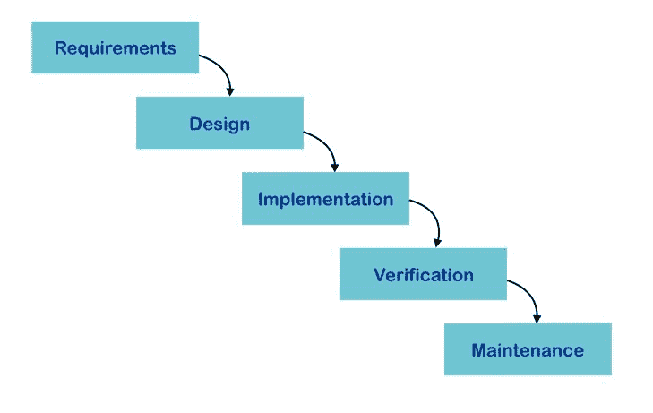

在这种情况下，我们不能回到以前的阶段。例如，在开始或完成**实施**阶段后，不可接受返回到**设计**阶段（例如查找技术可扩展性问题）。这是因为它会影响整体进度和成本。项目倾向于继续并完成发布，然后进入下一个发布周期，包括新设计。

它完全符合物理软件交付，因为它需要与物流管理协调，压制并交付软盘/CD-ROM 给用户。瀑布模型和物理交付过去需要一年到几年的时间。

# 敏捷和电子交付

几年后，互联网被广泛接受，然后软件交付方法也从物理转变为**电子**，如在线下载。因此，许多软件公司（也被称为点 com 公司）试图找出如何缩短 SDLC 流程，以交付能够击败竞争对手的软件。

许多开发人员开始采用增量、迭代或敏捷模型等新方法，以更快地交付给客户。即使发现新的错误，现在也更容易通过电子交付更新并交付给客户。自 Windows 98 以来，微软 Windows 更新也被引入。

在这种情况下，软件开发人员只编写一个小的逻辑或模块，而不是一次性编写整个应用程序。然后，交付给质量保证，然后开发人员继续添加新模块，最终再次交付给质量保证。

当所需的模块或功能准备就绪时，将按照以下图表释放：

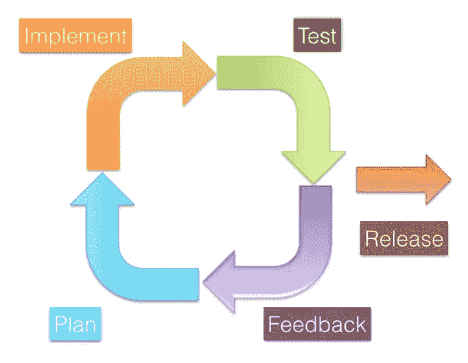

这种模式使得软件开发生命周期和交付变得更快，也更容易在过程中进行调整，因为周期从几周到几个月，足够小以便进行快速调整。

尽管这种模式目前受到大多数人的青睐，但在当时，应用软件交付意味着软件二进制，如可安装并在客户 PC 上运行的 EXE 程序。另一方面，基础设施（如服务器和网络）非常静态并且事先设置。因此，软件开发生命周期并不倾向于将这些基础设施纳入范围之内。

# 云端软件交付

几年后，智能手机（如 iPhone）和无线技术（如 Wi-Fi 和 4G 网络）得到了广泛的接受，软件应用也从二进制转变为在线服务。Web 浏览器是应用软件的界面，不再需要安装。另一方面，基础设施变得动态起来，因为应用需求不断变化，容量也需要增长。

虚拟化技术和软件定义网络（SDN）使服务器机器变得动态。现在，云服务如亚马逊网络服务（AWS）和谷歌云平台（GCP）可以轻松创建和管理动态基础设施。

现在，基础设施是重要组成部分之一，并且在软件开发交付周期的范围内，因为应用程序安装并在服务器端运行，而不是在客户端 PC 上运行。因此，软件和服务交付周期需要花费几天到几周的时间。

# 持续集成

正如之前讨论的，周围的软件交付环境不断变化；然而，交付周期变得越来越短。为了实现更高质量的快速交付，开发人员和质量保证人员开始采用一些自动化技术。其中一种流行的自动化技术是**持续集成**（**CI**）。CI 包含一些工具的组合，如**版本控制系统**（**VCS**）、**构建服务器**和**测试自动化工具**。

VCS 帮助开发人员将程序源代码维护到中央服务器上。它可以防止覆盖或与其他开发人员的代码冲突，同时保留历史记录。因此，它使得源代码保持一致并交付到下一个周期变得更容易。

与 VCS 一样，有一个集中的构建服务器，它连接 VCS 定期检索源代码，或者当开发人员更新代码到 VCS 时自动触发新的构建。如果构建失败，它会及时通知开发人员。因此，当有人将有问题的代码提交到 VCS 时，它有助于开发人员。

测试自动化工具也与构建服务器集成，构建成功后调用单元测试程序，然后将结果通知给开发人员和质量保证人员。它有助于识别当有人编写有错误的代码并存储到 VCS 时。

CI 的整个流程如下图所示：

CI 不仅有助于开发人员和质量保证人员提高质量，还有助于缩短应用程序或模块包的归档周期。在电子交付给客户的时代，CI 已经远远不够了。然而，因为交付给客户意味着部署到服务器。

# 持续交付

CI 加上部署自动化是为服务器应用程序提供服务给客户的理想流程。然而，还有一些技术挑战需要解决。如何将软件交付到服务器？如何优雅地关闭现有应用程序？如何替换和回滚应用程序？如果系统库也需要更改，如何升级或替换？如果需要，如何修改操作系统中的用户和组设置？等等。

由于基础设施包括服务器和网络，一切都取决于诸如 Dev/QA/staging/production 之类的环境。每个环境都有不同的服务器配置和 IP 地址。

**持续交付**（**CD**）是一种可以实现的实践；它是 CI 工具、配置管理工具和编排工具的组合：

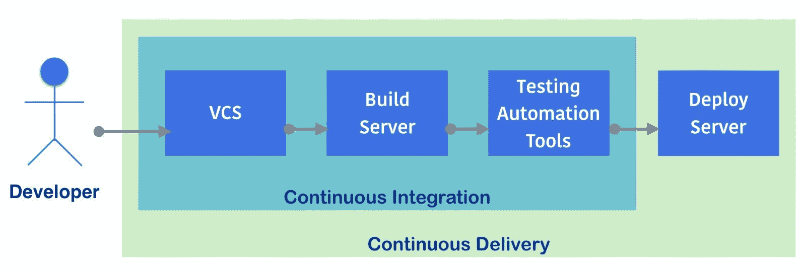

# 配置管理

配置管理工具帮助配置操作系统，包括用户、组和系统库，并管理多个服务器，使其与期望的状态或配置保持一致，如果我们替换服务器。

它不是一种脚本语言，因为脚本语言执行基于脚本逐行执行命令。如果我们执行脚本两次，可能会导致一些错误，例如尝试两次创建相同的用户。另一方面，配置管理关注**状态**，所以如果用户已经创建，配置管理工具就不会做任何事情。但是如果我们意外或有意删除用户，配置管理工具将再次创建用户。

它还支持将应用程序部署或安装到服务器。因为如果您告诉配置管理工具下载您的应用程序，然后设置并运行应用程序，它会尝试这样做。

此外，如果您告诉配置管理工具关闭您的应用程序，然后下载并替换为新的软件包（如果有的话），然后重新启动应用程序，它将保持最新版本。

当然，一些用户只希望在需要时更新应用程序，比如蓝绿部署。配置管理工具也允许您手动触发执行。

蓝绿部署是一种技术，它准备了两套应用程序堆栈，然后只有一个环境（例如：蓝色）提供生产服务。然后当您需要部署新版本的应用程序时，部署到另一侧（例如：绿色），然后进行最终测试。然后如果一切正常，更改负载均衡器或路由器设置，将网络流从蓝色切换到绿色。然后绿色成为生产环境，而蓝色变为休眠状态，等待下一个版本的部署。

# 基础设施即代码

配置管理工具不仅支持操作系统或虚拟机，还支持云基础架构。如果您需要在云上创建和配置网络、存储和虚拟机，就需要进行一些云操作。

但是配置管理工具还可以通过配置文件自动设置云基础架构，如下图所示：

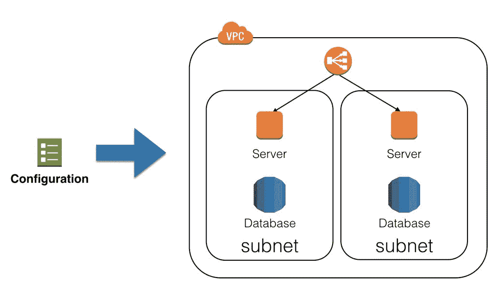

配置管理在维护操作手册（SOP）方面具有一些优势。例如，使用 Git 等版本控制系统维护配置文件，可以追踪环境设置的变化历史。

环境也很容易复制。例如，您需要在云上增加一个额外的环境。如果按照传统方法（即阅读 SOP 文档来操作云），总是存在潜在的人为错误和操作错误。另一方面，我们可以执行配置管理工具，快速自动地在云上创建一个环境。

基础设施即代码可能包含在持续交付过程中，因为基础设施的替换或更新成本比仅仅在服务器上替换应用程序二进制文件要高。

# 编排

编排工具也被归类为配置管理工具之一。然而，当配置和分配云资源时，它更加智能和动态。例如，编排工具管理多个服务器资源和网络，然后当管理员想要增加应用程序实例时，编排工具可以确定一个可用的服务器，然后自动部署和配置应用程序和网络。

尽管编排工具超出了 SDLC 的范围，但在需要扩展应用程序和重构基础设施资源时，它有助于持续交付。

总的来说，SDLC 已经通过多种流程、工具和方法演变，以实现快速交付。最终，软件（服务）交付需要花费几个小时到一天的时间。与此同时，软件架构和设计也在不断演进，以实现大型和丰富的应用程序。

# 微服务的趋势

软件架构和设计也在不断演进，基于目标环境和应用程序规模的大小。

# 模块化编程

当应用程序规模变大时，开发人员尝试将其分成几个模块。每个模块应该是独立和可重用的，并且应该由不同的开发团队维护。然后，当我们开始实施一个应用程序时，应用程序只需初始化并使用这些模块来高效地构建一个更大的应用程序。

以下示例显示了 Nginx（[`www.nginx.com`](https://www.nginx.com)）在 CentOS 7 上使用的库。它表明 Nginx 使用了`OpenSSL`、`POSIX 线程`库、`PCRE`正则表达式库、`zlib`压缩库、`GNU C`库等。因此，Nginx 没有重新实现 SSL 加密、正则表达式等：

[PRE0]

`ldd`命令包含在 CentOS 的`glibc-common`软件包中。

# 软件包管理

Java 语言和一些轻量级编程语言，如 Python、Ruby 和 JavaScript，都有自己的模块或软件包管理工具。例如，Java 使用 Maven（[`maven.apache.org`](http://maven.apache.org)），Python 使用 pip（[`pip.pypa.io`](https://pip.pypa.io)），Ruby 使用 RubyGems（[`rubygems.org`](https://rubygems.org)），JavaScript 使用 npm（[`www.npmjs.com`](https://www.npmjs.com)）。

软件包管理工具允许您将您的模块或软件包注册到集中式或私有存储库，并允许下载必要的软件包。以下截图显示了 AWS SDK 的 Maven 存储库：

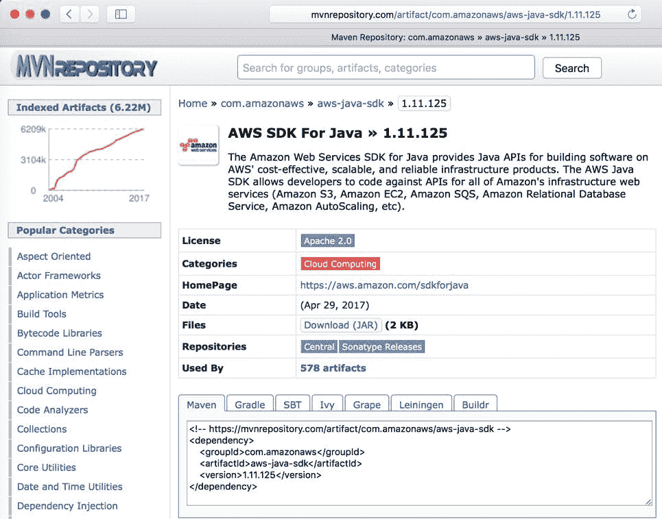

当您向应用程序添加特定的依赖项时，Maven 会下载必要的软件包。以下截图是当您向应用程序添加`aws-java-sdk`依赖项时所得到的结果：

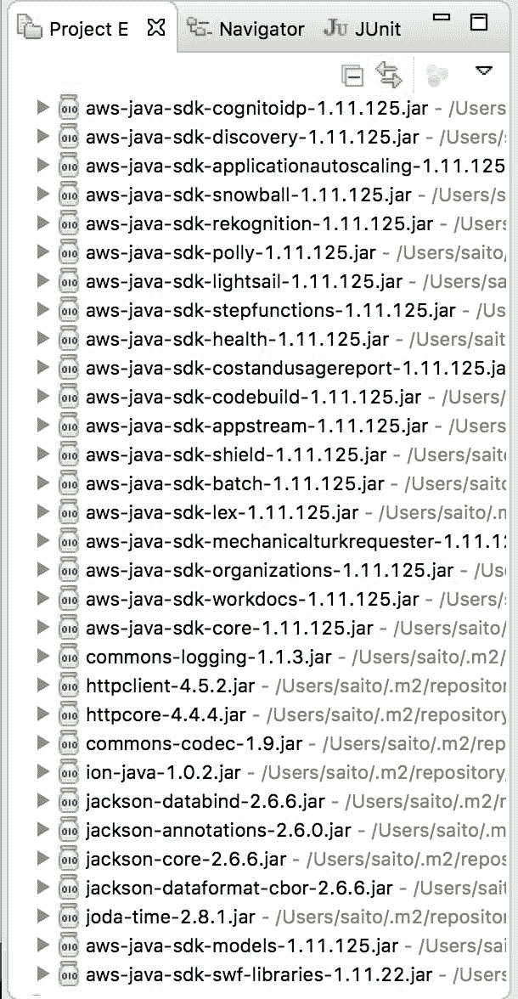

模块化编程有助于提高软件开发速度并减少重复劳动，因此现在是开发软件应用程序的最流行方式。

然而，随着我们不断添加功能和逻辑，应用程序需要越来越多的模块、软件包和框架的组合。这使得应用程序变得更加复杂和庞大，特别是服务器端应用程序。这是因为它通常需要连接到诸如关系型数据库（RDBMS）之类的数据库，以及诸如 LDAP 之类的身份验证服务器，然后通过适当的设计以 HTML 形式将结果返回给用户。

因此，开发人员采用了一些软件设计模式，以便在应用程序中开发一堆模块。

# MVC 设计模式

**模型视图控制器**（**MVC**）是一种流行的应用程序设计模式之一。它定义了三层。**视图**层负责**用户界面**（**UI**）**输入输出**（**I/O**）。**模型**层负责数据查询和持久性，比如加载和存储到数据库。然后，**控制器**层负责业务逻辑，处于**视图**和**模型**之间。

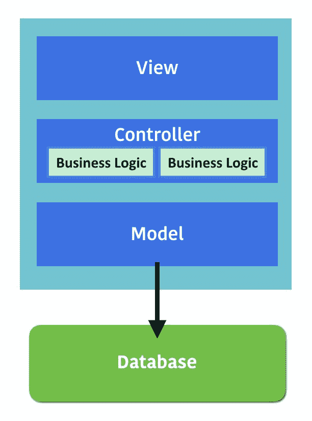

有一些框架可以帮助开发人员更轻松地使用 MVC，比如 Struts ([`struts.apache.org/`](https://struts.apache.org/))，SpringMVC ([`projects.spring.io/spring-framework/`](https://projects.spring.io/spring-framework/))，Ruby on Rails ([`rubyonrails.org/`](http://rubyonrails.org/))和 Django ([`www.djangoproject.com/`](https://www.djangoproject.com/))。MVC 是一种成功的软件设计模式，被用作现代 Web 应用程序和服务的基础之一。

MVC 定义了每一层之间的边界线，允许许多开发人员共同开发同一个应用程序。然而，这也会带来副作用。也就是说，应用程序中的源代码大小不断增加。这是因为数据库代码（**模型**）、展示代码（**视图**）和业务逻辑（**控制器**）都在同一个版本控制系统存储库中。最终会对软件开发周期产生影响，使其变得更慢！这被称为**单片式**，其中包含了构建巨大的 exe/war 程序的大量代码。

# 单片式应用程序

单片式应用程序的定义没有明确的衡量标准，但通常具有超过 50 个模块或包，超过 50 个数据库表，然后需要超过 30 分钟的构建时间。当需要添加或修改一个模块时，会影响大量代码，因此开发人员试图最小化应用程序代码的更改。这种犹豫会导致更糟糕的影响，有时甚至会导致应用程序因为没有人愿意再维护代码而死掉。

因此，开发人员开始将单片式应用程序分割成小的应用程序片段，并通过网络连接起来。

# 远程过程调用

实际上，将应用程序分成小块并通过网络连接已经尝试过了，早在 1990 年代。Sun Microsystems 推出了**Sun RPC**（**远程过程调用**）。它允许您远程使用模块。其中一个流行的 Sun RPC 实现者是**网络文件系统**（**NFS**）。因为它们基于 Sun RPC，NFS 客户端和 NFS 服务器之间的 CPU 操作系统版本是独立的。

编程语言本身也支持 RPC 风格的功能。UNIX 和 C 语言都有`rpcgen`工具。它帮助开发人员生成存根代码，负责网络通信代码，因此开发人员可以使用 C 函数风格，免除了困难的网络层编程。

Java 有**Java 远程方法调用**（**RMI**），它类似于 Sun RPC，但对于 Java，**RMI 编译器**（**rmic**）生成连接远程 Java 进程以调用方法并获取结果的存根代码。下图显示了 Java RMI 的过程流程：

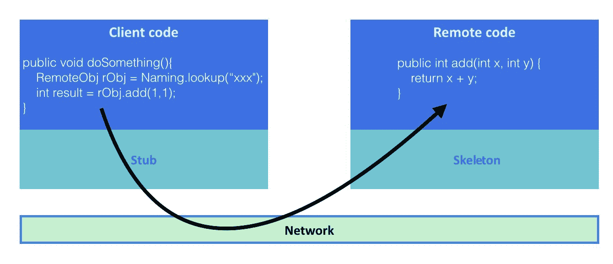

Objective C 也有**分布式对象**，.NET 有**远程调用**，因此大多数现代编程语言都具有开箱即用的远程过程调用功能。

这些远程过程调用设计的好处是将应用程序分成多个进程（程序）。各个程序可以有单独的源代码存储库。尽管在 1990 年代和 2000 年代机器资源（CPU、内存）有限，但它仍然运行良好。

然而，它的设计意图是使用相同的编程语言，并且设计为客户端/服务器模型架构，而不是分布式架构。此外，安全性考虑较少；因此，不建议在公共网络上使用。

在 2000 年代，出现了一个名为**web 服务**的倡议，它使用**SOAP**（HTTP/SSL）作为数据传输，使用 XML 作为数据呈现和服务定义的**Web 服务描述语言**（**WSDL**），然后使用**通用描述、发现和集成**（**UDDI**）作为服务注册表来查找 web 服务应用程序。然而，由于机器资源不丰富，以及 Web 服务编程和可维护性的复杂性，它并未被开发人员广泛接受。

# RESTful 设计

进入 2010 年代，现在机器性能甚至智能手机都有大量的 CPU 资源，加上到处都有几百 Mbps 的网络带宽。因此，开发人员开始利用这些资源，使应用程序代码和系统结构尽可能简单，从而加快软件开发周期。

基于硬件资源，使用 HTTP/SSL 作为 RPC 传输是一个自然的决定，但是根据开发人员对 Web 服务困难的经验，开发人员将其简化如下：

+   通过将 HTTP 和 SSL/TLS 作为标准传输

+   通过使用 HTTP 方法进行**创建/加载/上传/删除**（CLUD）操作，例如`GET`/`POST`/`PUT`/`DELETE`

+   通过使用 URI 作为资源标识符，例如：用户 ID 123 作为`/user/123/`

+   通过使用 JSON 作为标准数据呈现

它被称为**RESTful**设计，并且已被许多开发人员广泛接受，成为分布式应用程序的事实标准。RESTful 应用程序允许任何编程语言，因为它基于 HTTP，因此 RESTful 服务器是 Java，客户端 Python 是非常自然的。

它为开发人员带来了自由和机会，易于进行代码重构，升级库甚至切换到另一种编程语言。它还鼓励开发人员通过多个 RESTful 应用构建分布式模块化设计，这被称为微服务。

如果有多个 RESTful 应用程序，就会关注如何在 VCS 上管理多个源代码以及如何部署多个 RESTful 服务器。然而，持续集成和持续交付自动化使构建和部署多个 RESTful 服务器应用程序变得更加容易。

因此，微服务设计对 Web 应用程序开发人员变得越来越受欢迎。

# 微服务

尽管名称是微服务，但与 20 世纪 90 年代或 2000 年代的应用程序相比，它实际上足够复杂。它使用完整的 HTTP/SSL 服务器并包含整个 MVC 层。微服务设计应关注以下主题：

+   **无状态**：这不会将用户会话存储到系统中，这有助于更容易地扩展。

+   **没有共享数据存储**：微服务应该拥有数据存储，比如数据库。它不应该与其他应用程序共享。这有助于封装后端数据库，使单个微服务内的数据库方案易于重构和更新。

+   **版本控制和兼容性**：微服务可能会更改和更新 API，但应定义一个版本，并且应具有向后兼容性。这有助于解耦其他微服务和应用程序之间的关系。

+   **集成 CI/CD**：微服务应采用 CI 和 CD 流程来消除管理工作。

有一些框架可以帮助构建微服务应用程序，比如 Spring Boot ([`projects.spring.io/spring-boot/)`](https://projects.spring.io/spring-boot/))和 Flask ([`flask.pocoo.org)`](http://flask.pocoo.org))。然而，有许多基于 HTTP 的框架，因此开发人员可以随意尝试和选择任何喜欢的框架甚至编程语言。这就是微服务设计的美妙之处。

下图是单块应用程序设计和微服务设计的比较。它表明微服务（也是 MVC）设计与单块设计相同，包含接口层、业务逻辑层、模型层和数据存储。

但不同的是，应用程序（服务）由多个微服务构成，不同的应用程序可以共享相同的微服务。

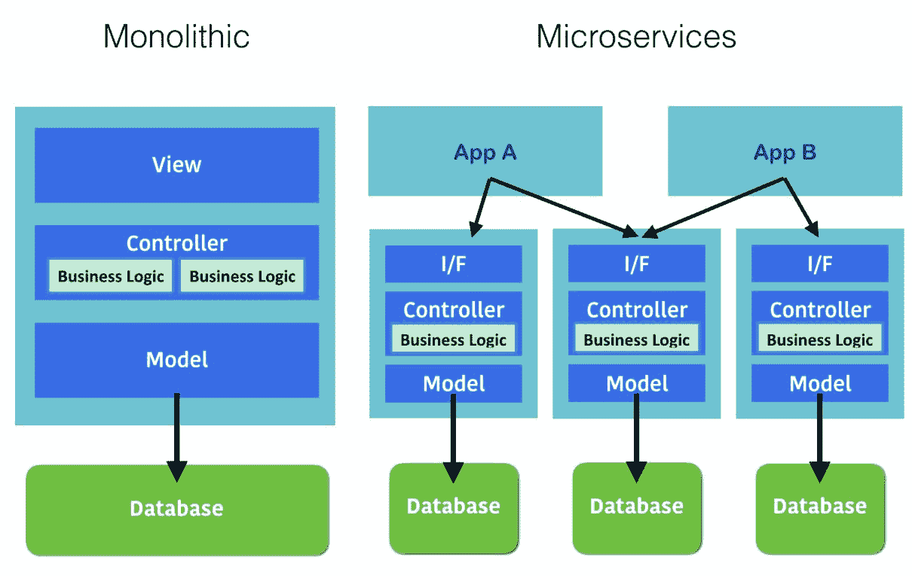

开发人员可以使用快速软件交付方法添加必要的微服务并修改现有的微服务，而不会再影响现有应用程序（服务）。

这是对整个软件开发环境和方法论的突破，现在得到了许多开发人员的广泛接受。

尽管持续集成和持续交付自动化流程有助于开发和部署多个微服务，但资源数量和复杂性，如虚拟机、操作系统、库和磁盘容量以及网络，无法与单块应用程序相比。

因此，有一些工具和角色可以支持云上的大型自动化环境。

# 自动化和工具

如前所述，自动化是实现快速软件交付的最佳实践，并解决了管理许多微服务的复杂性。然而，自动化工具并不是普通的 IT/基础架构应用程序，比如**Active Directory**，**BIND**（DNS）和**Sendmail**（MTA）。为了实现自动化，需要一名工程师具备开发人员的技能集，能够编写代码，特别是脚本语言，以及基础设施操作员的技能集，比如虚拟机、网络和存储。

DevOps 是*开发*和*运维*的缩合词，可以具有使自动化流程成为可能的能力，例如持续集成、基础设施即代码和持续交付。DevOps 使用一些 DevOps 工具来实现这些自动化流程。

# 持续集成工具

其中一种流行的版本控制工具是 Git（[`git-scm.com`](https://git-scm.com)）。开发人员始终使用 Git 来签入和签出代码。有一些托管 Git 服务：GitHub（[`github.com)`](https://github.com)）和 Bitbucket（[`bitbucket.org`](https://bitbucket.org)）。它允许您创建和保存您的 Git 存储库，并与其他用户协作。以下截图是 GitHub 上的示例拉取请求：

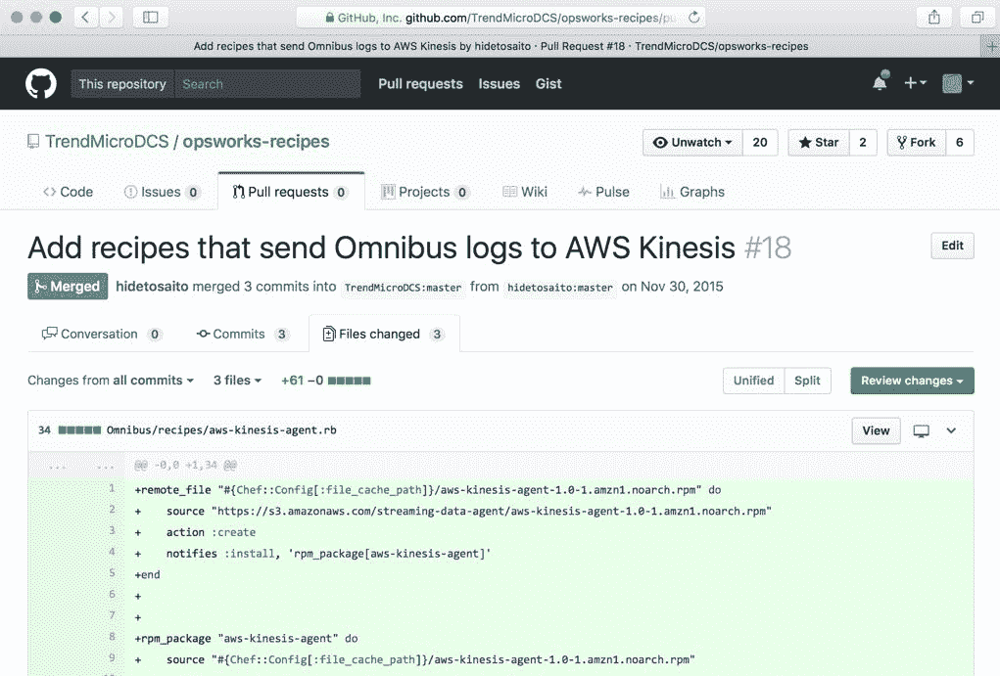

构建服务器有很多变化。Jenkins（[`jenkins.io`](https://jenkins.io)）是一个成熟的应用程序之一，与 TeamCity（[`www.jetbrains.com/teamcity/)`](https://www.jetbrains.com/teamcity/)）相同。除了构建服务器，您还可以使用托管服务，如 Codeship（[`codeship.com)`](https://codeship.com)）和 Travis CI（[`travis-ci.org)`](https://travis-ci.org)）等**软件即服务（SaaS）**。SaaS 具有与其他 SaaS 工具集成的优势。

构建服务器能够调用外部命令，如单元测试程序；因此，构建服务器是 CI 流水线中的关键工具。

以下截图是使用 Codeship 的示例构建；它从 GitHub 检出代码并调用 Maven 进行构建（`mvn compile`）和单元测试（`mvn test`）：

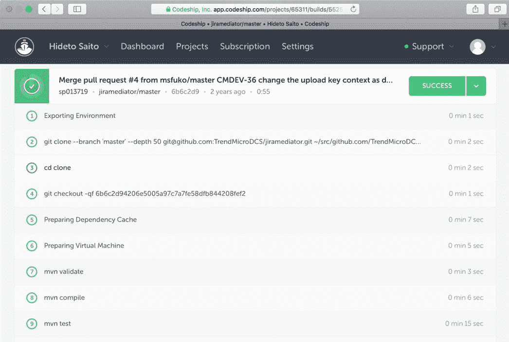

# 持续交付工具

有各种配置管理工具，如 Puppet（[`puppet.com`](https://puppet.com)）、Chef（[`www.chef.io`](https://www.chef.io)）和 Ansible（[`www.ansible.com`](https://www.ansible.com)），它们是最受欢迎的配置管理工具。

AWS OpsWorks（[`aws.amazon.com/opsworks/`](https://aws.amazon.com/opsworks/)）提供了一个托管的 Chef 平台。以下截图是使用 AWS OpsWorks 安装 Amazon CloudWatch 日志代理的 Chef 配方（配置）。它在启动 EC2 实例时自动安装 CloudWatch 日志代理：

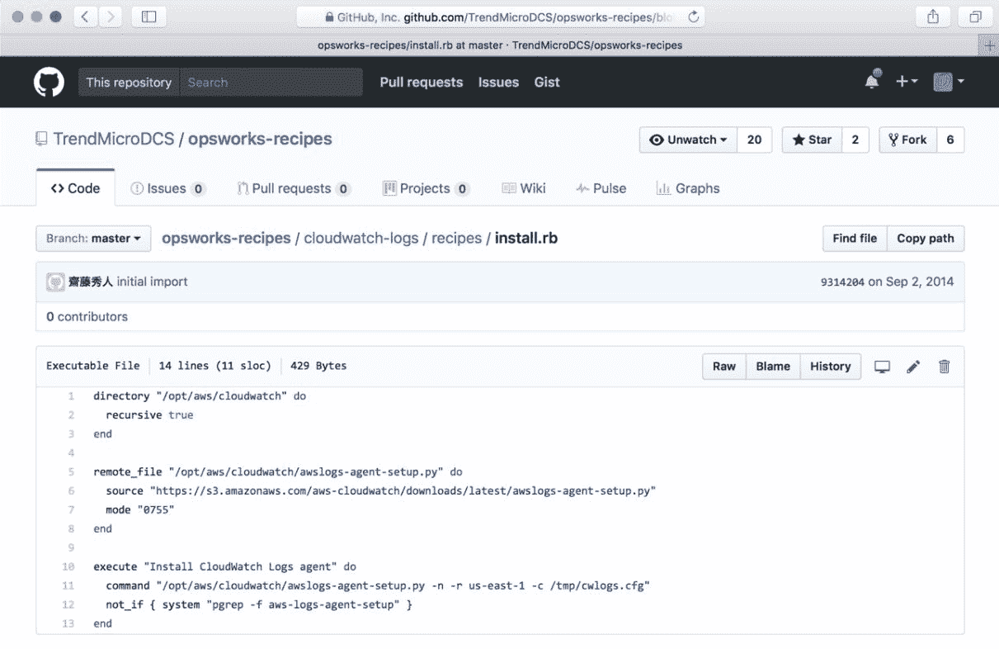

AWS CloudFormation ([`aws.amazon.com/cloudformation/)`](https://aws.amazon.com/cloudformation/)) 帮助实现基础架构即代码。它支持 AWS 操作的自动化，例如执行以下功能：

1.  创建一个 VPC。

1.  在 VPC 上创建一个子网。

1.  在 VPC 上创建一个互联网网关。

1.  创建路由表以将子网与互联网网关关联。

1.  创建一个安全组。

1.  创建一个 VM 实例。

1.  将安全组与 VM 实例关联。

CloudFormation 的配置是通过 JSON 编写的，如下截图所示：

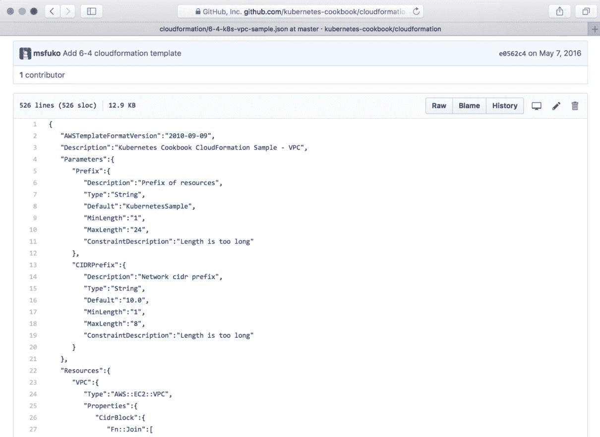

它支持参数化，因此可以使用具有相同配置的 JSON 文件轻松创建具有不同参数（例如 VPC 和 CIDR）的附加环境。此外，它支持更新操作。因此，如果需要更改基础架构的某个部分，无需重新创建。CloudFormation 可以识别配置的增量并代表您执行必要的基础架构操作。

AWS CodeDeploy ([`aws.amazon.com/codedeploy/)`](https://aws.amazon.com/codedeploy/)) 也是一个有用的自动化工具。但专注于软件部署。它允许用户定义。以下是一些操作到 YAML 文件上：

1.  在哪里下载和安装。

1.  如何停止应用程序。

1.  如何安装应用程序。

1.  安装后，如何启动和配置应用程序。

以下截图是 AWS CodeDeploy 配置文件`appspec.yml`的示例：

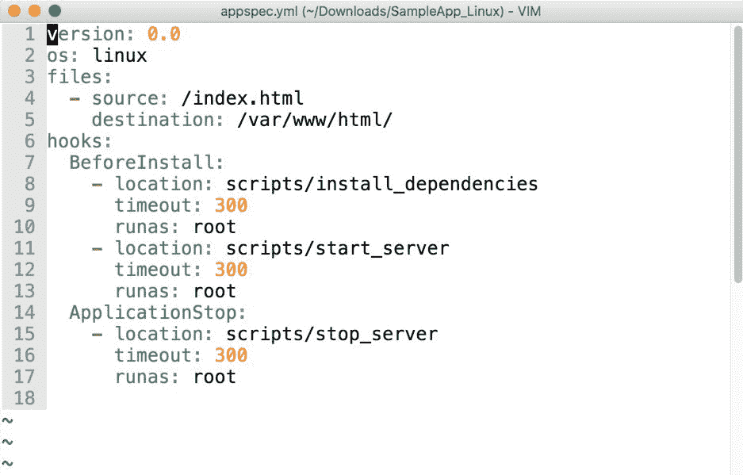

# 监控和日志工具

一旦您开始使用云基础架构管理一些微服务，就会有一些监控工具帮助您管理服务器。

**Amazon** **CloudWatch** 是 AWS 上内置的监控工具。不需要安装代理；它会自动从 AWS 实例中收集一些指标并为 DevOps 可视化。它还支持根据您设置的条件设置警报。以下截图是 EC2 实例的 Amazon CloudWatch 指标：

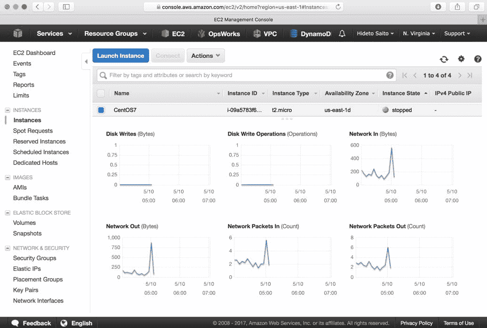

Amazon CloudWatch 还支持收集应用程序日志。它需要在 EC2 实例上安装代理；然而，当您需要开始管理多个微服务实例时，集中式日志管理是有用的。

ELK 是一种流行的组合堆栈，代表 Elasticsearch（[`www.elastic.co/products/elasticsearch`](https://www.elastic.co/products/elasticsearch)）、Logstash（[`www.elastic.co/products/logstash`](https://www.elastic.co/products/logstash)）和 Kibana（[`www.elastic.co/products/kibana`](https://www.elastic.co/products/kibana)）。Logstash 有助于聚合应用程序日志并转换为 JSON 格式，然后发送到 Elasticsearch。

Elasticsearch 是一个分布式 JSON 数据库。Kibana 可以可视化存储在 Elasticsearch 上的数据。以下示例是一个 Kibana，显示了 Nginx 访问日志：

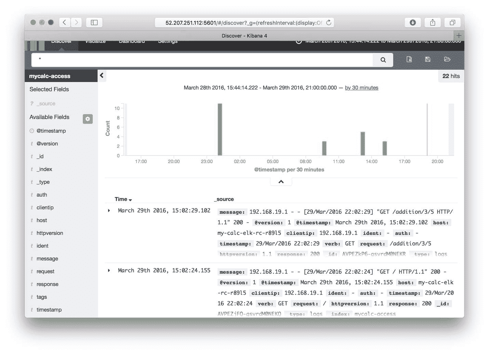

Grafana（[`grafana.com`](https://grafana.com)）是另一个流行的可视化工具。它曾经与时间序列数据库（如 Graphite（[`graphiteapp.org)`](https://graphiteapp.org)）或 InfluxDB（[`www.influxdata.com)`](https://www.influxdata.com)）连接。时间序列数据库旨在存储数据，这些数据是扁平化和非规范化的数字数据，如 CPU 使用率和网络流量。与关系型数据库不同，时间序列数据库对于节省数据空间和更快地查询数字数据历史具有一些优化。大多数 DevOps 监控工具在后端使用时间序列数据库。

以下示例是一个显示**消息队列服务器**统计信息的 Grafana：

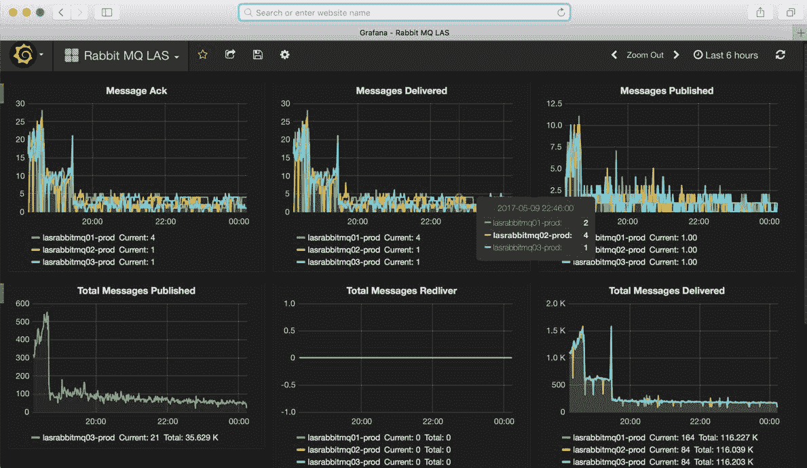

# 沟通工具

一旦您开始像我们之前看到的那样使用多个 DevOps 工具，您需要来回访问多个控制台，以检查 CI 和 CD 流水线是否正常工作。例如，请考虑以下几点：

1.  将源代码合并到 GitHub。

1.  在 Jenkins 上触发新构建。

1.  触发 AWS CodeDeploy 部署应用程序的新版本。

这些事件需要按时间顺序跟踪，如果出现问题，DevOps 需要与开发人员和质量保证讨论处理情况。然而，由于 DevOps 需要逐个捕捉事件然后解释，可能通过电子邮件，因此存在一些过度沟通的需求。这并不高效，同时问题仍在继续。

有一些沟通工具可以帮助集成这些 DevOps 工具，任何人都可以加入以查看事件并相互评论。Slack（[`slack.com`](https://slack.com)）和 HipChat（[`www.hipchat.com`](https://www.hipchat.com)）是最流行的沟通工具。

这些工具支持集成到 SaaS 服务，以便 DevOps 可以在单个聊天室中查看事件。以下截图是与 Jenkins 集成的 Slack 聊天室：

# 公共云

当与云技术一起使用时，CI CD 和自动化工作可以很容易实现。特别是公共云 API 帮助 DevOps 提出许多 CI CD 工具。亚马逊云服务（[`aws.amazon.com)`](https://aws.amazon.com)）和谷歌云平台（[`cloud.google.com)`](https://cloud.google.com)）提供一些 API 给 DevOps 来控制云基础设施。DevOps 可以摆脱容量和资源限制，只需在需要资源时按需付费。

公共云将像软件开发周期和架构设计一样不断增长；它们是最好的朋友，也是实现应用/服务成功的重要关键。

以下截图是亚马逊云服务的网页控制台：

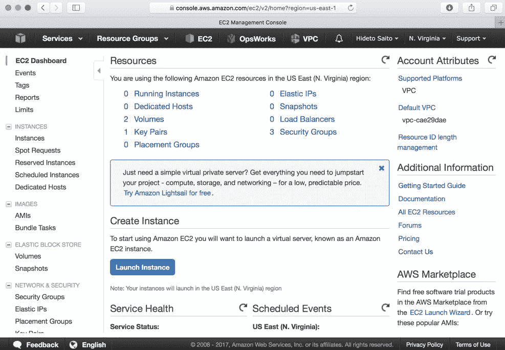

谷歌云平台也有一个网页控制台，如下所示：

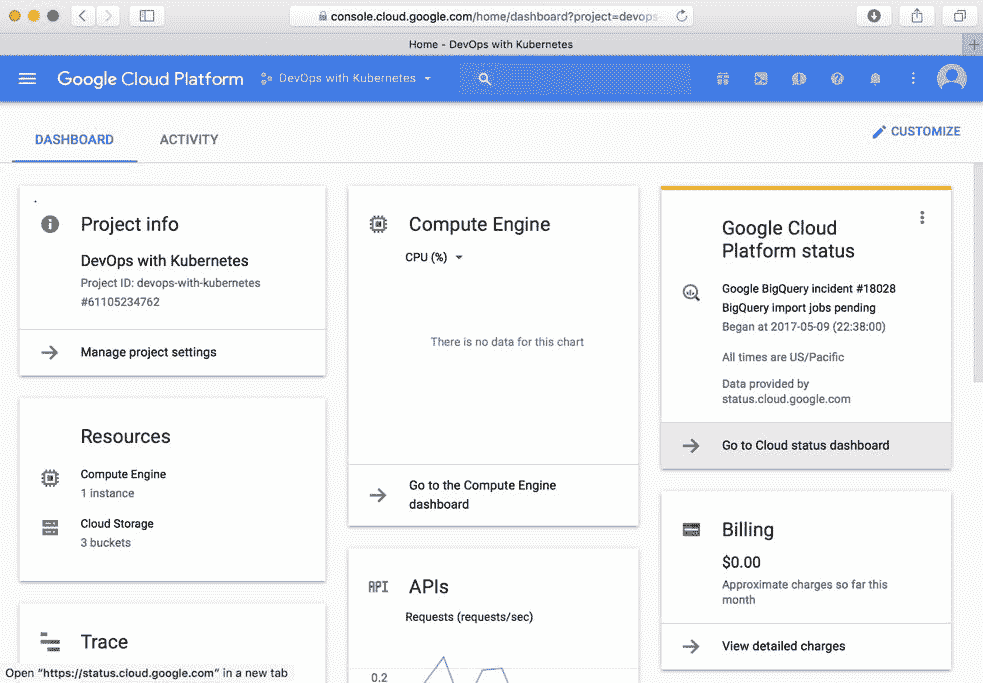

这两种云服务都有一个免费试用期，DevOps 工程师可以使用它来尝试和了解云基础设施的好处。

# 总结

在本章中，我们讨论了软件开发方法论的历史，编程演变和 DevOps 工具。这些方法和工具支持更快的软件交付周期。微服务设计也有助于持续的软件更新。然而，微服务使环境管理变得复杂。

下一章将描述 Docker 容器技术，它有助于以更高效和自动化的方式组合微服务应用程序并进行管理。
