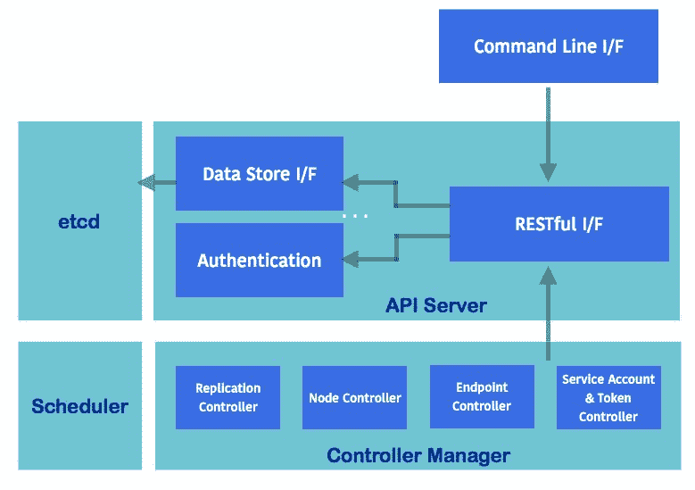
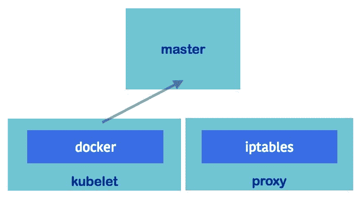
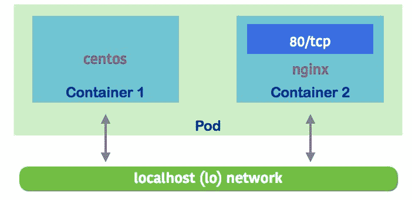
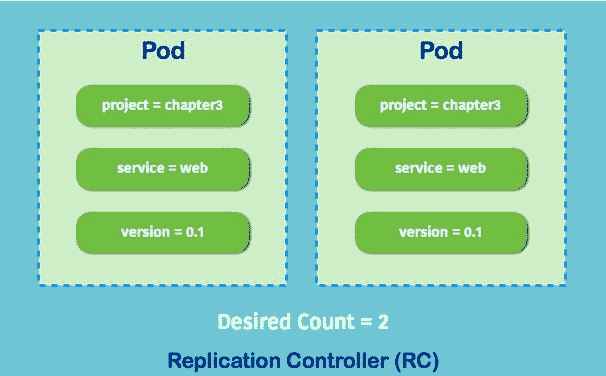
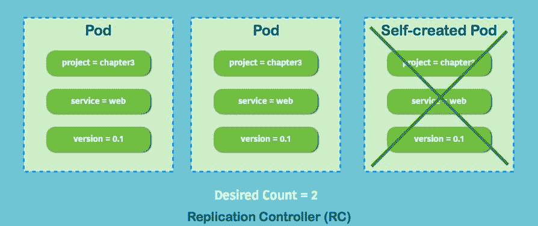
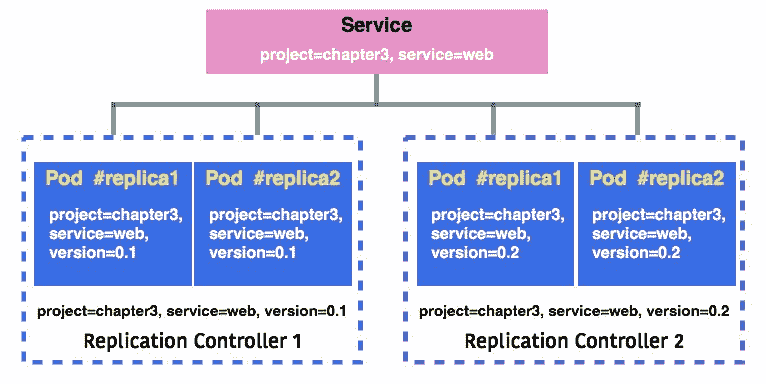
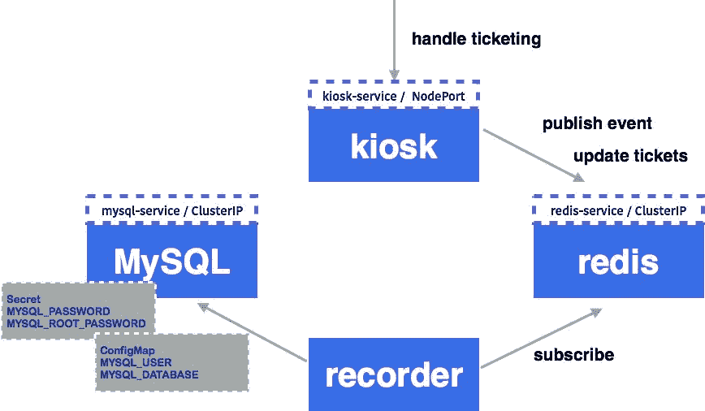

# 第三章：开始使用 Kubernetes

我们已经了解了容器可以为我们带来的好处，但是如果我们需要根据业务需求扩展我们的服务怎么办？有没有一种方法可以在多台机器上构建服务，而不必处理繁琐的网络和存储设置？此外，是否有其他简单的方法来管理和推出我们的微服务，以适应不同的服务周期？这就是 Kubernetes 的作用。在本章中，我们将学习：

+   Kubernetes 概念

+   Kubernetes 组件

+   Kubernetes 资源及其配置文件

+   如何通过 Kubernetes 启动 kiosk 应用程序

# 理解 Kubernetes

Kubernetes 是一个用于管理跨多台主机的应用容器的平台。它为面向容器的应用程序提供了许多管理功能，例如自动扩展、滚动部署、计算资源和卷管理。与容器的本质相同，它被设计为可以在任何地方运行，因此我们可以在裸机上、在我们的数据中心、在公共云上，甚至是混合云上运行它。

Kubernetes 考虑了应用容器的大部分操作需求。重点是：

+   容器部署

+   持久存储

+   容器健康监控

+   计算资源管理

+   自动扩展

+   通过集群联邦实现高可用性

Kubernetes 非常适合微服务。使用 Kubernetes，我们可以创建`Deployment`来部署、滚动或回滚选定的容器（第七章，*持续交付*）。容器被视为临时的。我们可以将卷挂载到容器中，以在单个主机世界中保留数据。在集群世界中，容器可能被调度在任何主机上运行。我们如何使卷挂载作为永久存储无缝工作？Kubernetes 引入了**Volumes**和**Persistent Volumes**来解决这个问题（第四章，*使用存储和资源*）。容器的生命周期可能很短。当它们超出资源限制时，它们可能随时被杀死或停止，我们如何确保我们的服务始终为一定数量的容器提供服务？Kubernetes 中的**ReplicationController**或**ReplicaSet**将确保一定数量的容器组处于运行状态。Kubernetes 甚至支持**liveness probe**来帮助您定义应用程序的健康状况。为了更好地管理资源，我们还可以为 Kubernetes 节点定义最大容量和每组容器（即**pod**）的资源限制。Kubernetes 调度程序将选择满足资源标准的节点来运行容器。我们将在第四章，*使用存储和资源*中学习这一点。Kubernetes 提供了一个可选的水平 pod 自动缩放功能。使用此功能，我们可以按资源或自定义指标水平扩展 pod。对于那些高级读者，Kubernetes 设计了高可用性（**HA**）。我们可以创建多个主节点来防止单点故障。

# Kubernetes 组件

Kubernetes 包括两个主要组件：

+   **主节点**：主节点是 Kubernetes 的核心，它控制和调度集群中的所有活动

+   **节点**：节点是运行我们的容器的工作节点

# Master 组件

Master 包括 API 服务器、控制器管理器、调度程序和 etcd。所有组件都可以在不同的主机上进行集群运行。然而，从学习的角度来看，我们将使所有组件在同一节点上运行。

Master 组件

# API 服务器（kube-apiserver）

API 服务器提供 HTTP/HTTPS 服务器，为 Kubernetes 主节点中的所有组件提供 RESTful API。例如，我们可以获取资源状态，如 pod，POST 来创建新资源，还可以观察资源。API 服务器读取和更新 etcd，这是 Kubernetes 的后端数据存储。

# 控制器管理器（kube-controller-manager）

控制器管理器在集群中控制许多不同的事物。复制控制器管理器确保所有复制控制器在所需的容器数量上运行。节点控制器管理器在节点宕机时做出响应，然后会驱逐 pod。端点控制器用于关联服务和 pod 之间的关系。服务账户和令牌控制器用于控制默认账户和 API 访问令牌。

# etcd

etcd 是一个开源的分布式键值存储（[`coreos.com/etcd`](https://coreos.com/etcd)）。Kubernetes 将所有 RESTful API 对象存储在这里。etcd 负责存储和复制数据。

# 调度器（kube-scheduler）

调度器根据节点的资源容量或节点上资源利用的平衡来决定适合 pod 运行的节点。它还考虑将相同集合中的 pod 分散到不同的节点。

# 节点组件

节点组件需要在每个节点上进行配置和运行，向主节点报告 pod 的运行时状态。

节点组件

# Kubelet

Kubelet 是节点中的一个重要进程，定期向 kube-apiserver 报告节点活动，如 pod 健康、节点健康和活动探测。正如前面的图表所示，它通过容器运行时（如 Docker 或 rkt）运行容器。

# 代理（kube-proxy）

代理处理 pod 负载均衡器（也称为**服务**）和 pod 之间的路由，它还提供了从外部到服务的路由。有两种代理模式，用户空间和 iptables。用户空间模式通过在内核空间和用户空间之间切换来创建大量开销。另一方面，iptables 模式是最新的默认代理模式。它改变 Linux 中的 iptables **NAT**以实现在所有容器之间路由 TCP 和 UDP 数据包。

# Docker

正如第二章中所述，*使用容器进行 DevOps*，Docker 是一个容器实现。Kubernetes 使用 Docker 作为默认的容器引擎。

# Kubernetes 主节点与节点之间的交互

在下图中，客户端使用**kubectl**向 API 服务器发送请求；API 服务器响应请求，从 etcd 中推送和拉取对象信息。调度器确定应该分配给哪个节点执行任务（例如，运行 pod）。**控制器管理器**监视运行的任务，并在发生任何不良状态时做出响应。另一方面，**API 服务器**通过 kubelet 从 pod 中获取日志，并且还是其他主节点组件之间的中心。

与主节点和节点之间的交互

# 开始使用 Kubernetes

在本节中，我们将学习如何在开始时设置一个小型单节点集群。然后我们将学习如何通过其命令行工具--kubectl 与 Kubernetes 进行交互。我们将学习所有重要的 Kubernetes API 对象及其在 YAML 格式中的表达，这是 kubectl 的输入，然后 kubectl 将相应地向 API 服务器发送请求。

# 准备环境

开始的最简单方法是运行 minikube ([`github.com/kubernetes/minikube`](https://github.com/kubernetes/minikube))，这是一个在本地单节点上运行 Kubernetes 的工具。它支持在 Windows、Linux 和 macOS 上运行。在下面的示例中，我们将在 macOS 上运行。Minikube 将启动一个安装了 Kubernetes 的虚拟机。然后我们将能够通过 kubectl 与其交互。

请注意，minikube 不适用于生产环境或任何重负载环境。由于其单节点特性，存在一些限制。我们将在第九章 *在 AWS 上运行 Kubernetes*和第十章 *在 GCP 上运行 Kubernetes*中学习如何运行一个真正的集群。

在安装 minikube 之前，我们必须先安装 Homebrew ([`brew.sh/`](https://brew.sh/))和 VirtualBox ([`www.virtualbox.org/`](https://www.virtualbox.org/))。Homebrew 是 macOS 中一个有用的软件包管理器。我们可以通过`/usr/bin/ruby -e "$(curl -fsSL [`raw.githubusercontent.com/Homebrew/install/master/install)`](https://raw.githubusercontent.com/Homebrew/install/master/install))"`命令轻松安装 Homebrew，并从 Oracle 网站下载 VirtualBox 并点击安装。

然后是启动的时间！我们可以通过`brew cask install minikube`来安装 minikube：

```
// install minikube
# brew cask install minikube
==> Tapping caskroom/cask
==> Linking Binary 'minikube-darwin-amd64' to '/usr/local/bin/minikube'.
...
minikube was successfully installed!
```

安装完 minikube 后，我们现在可以启动集群了：

```
// start the cluster
# minikube start
Starting local Kubernetes v1.6.4 cluster...
Starting VM...
Moving files into cluster...
Setting up certs...
Starting cluster components...
Connecting to cluster...
Setting up kubeconfig...
Kubectl is now configured to use the cluster.
```

这将在本地启动一个 Kubernetes 集群。在撰写时，最新版本是`v.1.6.4` minikube。继续在 VirtualBox 中启动名为 minikube 的 VM。然后将设置`kubeconfig`，这是一个用于定义集群上下文和认证设置的配置文件。

通过`kubeconfig`，我们能够通过`kubectl`命令切换到不同的集群。我们可以使用`kubectl config view`命令来查看`kubeconfig`中的当前设置：

```
apiVersion: v1

# cluster and certificate information
clusters:
- cluster:
 certificate-authority-data: REDACTED
 server: https://35.186.182.157
 name: gke_devops_cluster
- cluster:
 certificate-authority: /Users/chloelee/.minikube/ca.crt
 server: https://192.168.99.100:8443
 name: minikube

# context is the combination of cluster, user and namespace
contexts:
- context:
 cluster: gke_devops_cluster
 user: gke_devops_cluster
 name: gke_devops_cluster
- context:
 cluster: minikube
 user: minikube
 name: minikube
current-context: minikube
kind: Config
preferences: {}

# user information
users:
- name: gke_devops_cluster
user:
 auth-provider:
 config:
 access-token: xxxx
 cmd-args: config config-helper --format=json
 cmd-path: /Users/chloelee/Downloads/google-cloud-sdk/bin/gcloud
 expiry: 2017-06-08T03:51:11Z
 expiry-key: '{.credential.token_expiry}'
 token-key: '{.credential.access_token}'
 name: gcp

# namespace info
- name: minikube
user:
 client-certificate: /Users/chloelee/.minikube/apiserver.crt
 client-key: /Users/chloelee/.minikube/apiserver.key
```

在这里，我们知道我们当前正在使用与集群和用户名称相同的 minikube 上下文。上下文是认证信息和集群连接信息的组合。如果您有多个上下文，可以使用`kubectl config use-context $context`来强制切换上下文。

最后，我们需要在 minikube 中启用`kube-dns`插件。`kube-dns`是 Kuberentes 中的 DNS 服务：

```
// enable kube-dns addon
# minikube addons enable kube-dns
kube-dns was successfully enabled
```

# kubectl

`kubectl`是控制 Kubernetes 集群管理器的命令。最常见的用法是检查集群的版本：

```
// check Kubernetes version
# kubectl version
Client Version: version.Info{Major:"1", Minor:"6", GitVersion:"v1.6.2", GitCommit:"477efc3cbe6a7effca06bd1452fa356e2201e1ee", GitTreeState:"clean", BuildDate:"2017-04-19T20:33:11Z", GoVersion:"go1.7.5", Compiler:"gc", Platform:"darwin/amd64"}
Server Version: version.Info{Major:"1", Minor:"6", GitVersion:"v1.6.4", GitCommit:"d6f433224538d4f9ca2f7ae19b252e6fcb66a3ae", GitTreeState:"clean", BuildDate:"2017-05-30T22:03:41Z", GoVersion:"go1.7.3", Compiler:"gc", Platform:"linux/amd64"} 
```

我们随后知道我们的服务器版本是最新的，在撰写时是最新的版本 1.6.4。 `kubectl`的一般语法是：

```
kubectl [command] [type] [name] [flags] 
```

`command`表示您要执行的操作。如果您只在终端中键入`kubectl help`，它将显示支持的命令。`type`表示资源类型。我们将在下一节中学习主要的资源类型。`name`是我们命名资源的方式。沿途始终保持清晰和信息丰富的命名是一个好习惯。对于`flags`，如果您键入`kubectl options`，它将显示您可以传递的所有标志。

`kubectl`非常方便，我们总是可以添加`--help`来获取特定命令的更详细信息。例如：

```
// show detailed info for logs command 
kubectl logs --help 
Print the logs for a container in a pod or specified resource. If the pod has only one container, the container name is 
optional. 

Aliases: 
logs, log 

Examples: 
  # Return snapshot logs from pod nginx with only one container 
  kubectl logs nginx 

  # Return snapshot logs for the pods defined by label   
  app=nginx 
  kubectl logs -lapp=nginx 

  # Return snapshot of previous terminated ruby container logs   
  from pod web-1 
  kubectl logs -p -c ruby web-1 
... 
```

然后我们得到了`kubectl logs`命令中的完整支持选项。

# Kubernetes 资源

Kubernetes 对象是集群中的条目，存储在 etcd 中。它们代表了集群的期望状态。当我们创建一个对象时，我们通过 kubectl 或 RESTful API 向 API 服务器发送请求。API 服务器将状态存储到 etcd 中，并与其他主要组件交互，以确保对象存在。Kubernetes 使用命名空间在虚拟上隔离对象，根据不同的团队、用途、项目或环境。每个对象都有自己的名称和唯一 ID。Kubernetes 还支持标签和注释，让我们对对象进行标记。标签尤其可以用于将对象分组在一起。

# Kubernetes 对象

对象规范描述了 Kubernetes 对象的期望状态。大多数情况下，我们编写对象规范，并通过 kubectl 将规范发送到 API 服务器。Kubernetes 将尝试实现该期望状态并更新对象状态。

对象规范可以用 YAML（[`www.yaml.org/`](http://www.yaml.org/)）或 JSON（[`www.json.org/`](http://www.json.org/)）编写。在 Kubernetes 世界中，YAML 更常见。在本书的其余部分中，我们将使用 YAML 格式来编写对象规范。以下代码块显示了一个 YAML 格式的规范片段：

```
apiVersion: Kubernetes API version 
kind: object type 
metadata:  
  spec metadata, i.e. namespace, name, labels and annotations 
spec: 
  the spec of Kubernetes object 
```

# 命名空间

Kubernetes 命名空间被视为多个虚拟集群的隔离。不同命名空间中的对象对彼此是不可见的。当不同团队或项目共享同一个集群时，这是非常有用的。大多数资源都在一个命名空间下（也称为命名空间资源）；然而，一些通用资源，如节点或命名空间本身，不属于任何命名空间。Kubernetes 默认有三个命名空间：

+   default

+   kube-system

+   kube-public

如果没有明确地为命名空间资源分配命名空间，它将位于当前上下文下的命名空间中。如果我们从未添加新的命名空间，将使用默认命名空间。

kube-system 命名空间被 Kubernetes 系统创建的对象使用，例如插件，这些插件是实现集群功能的 pod 或服务，例如仪表板。kube-public 命名空间是在 Kubernetes 1.6 中新引入的，它被一个 beta 控制器管理器（BootstrapSigner [`kubernetes.io/docs/admin/bootstrap-tokens`](https://kubernetes.io/docs/admin/bootstrap-tokens)）使用，将签名的集群位置信息放入`kube-public`命名空间，以便认证/未认证用户可以看到这些信息。

在接下来的章节中，所有的命名空间资源都将位于默认命名空间中。命名空间对于资源管理和角色也非常重要。我们将在第八章《集群管理》中介绍更多内容。

# 名称

Kubernetes 中的每个对象都拥有自己的名称。一个资源中的对象名称在同一命名空间内是唯一标识的。Kubernetes 使用对象名称作为资源 URL 到 API 服务器的一部分，因此它必须是小写字母、数字字符、破折号和点的组合，长度不超过 254 个字符。除了对象名称，Kubernetes 还为每个对象分配一个唯一的 ID（UID），以区分类似实体的历史发生。

# 标签和选择器

标签是一组键/值对，用于附加到对象。标签旨在为对象指定有意义的标识信息。常见用法是微服务名称、层级、环境和软件版本。用户可以定义有意义的标签，以便稍后与选择器一起使用。对象规范中的标签语法是：

```
labels: 
  $key1: $value1 
  $key2: $value2 
```

除了标签，标签选择器用于过滤对象集。用逗号分隔，多个要求将由`AND`逻辑运算符连接。有两种过滤方式：

+   基于相等性的要求

+   基于集合的要求

基于相等性的要求支持`=`，`==`和`!=`运算符。例如，如果选择器是`chapter=2,version!=0.1`，结果将是**对象 C**。如果要求是`version=0.1`，结果将是**对象 A**和**对象 B**。如果我们在支持的对象规范中写入要求，将如下所示：

```
selector: 
  $key1: $value1 
```

选择器示例

基于集合的要求支持`in`，`notin`和`exists`（仅针对键）。例如，如果要求是`chapter in (3, 4),version`，那么对象 A 将被返回。如果要求是`version notin (0.2), !author_info`，结果将是**对象 A**和**对象 B**。以下是一个示例，如果我们写入支持基于集合的要求的对象规范：

```
selector: 
  matchLabels:  
    $key1: $value1 
  matchExpressions: 
{key: $key2, operator: In, values: [$value1, $value2]} 
```

`matchLabels`和`matchExpressions`的要求被合并在一起。这意味着过滤后的对象需要在两个要求上都为真。

我们将在本章中学习使用 ReplicationController、Service、ReplicaSet 和 Deployment。

# 注释

注释是一组用户指定的键/值对，用于指定非标识性元数据。使用注释可以像普通标记一样，例如，用户可以向注释中添加时间戳、提交哈希或构建编号。一些 kubectl 命令支持 `--record` 选项，以记录对注释对象进行更改的命令。注释的另一个用例是存储配置，例如 Kubernetes 部署（[`kubernetes.io/docs/concepts/workloads/controllers/deployment`](https://kubernetes.io/docs/concepts/workloads/controllers/deployment)）或关键附加组件 pods（[`coreos.com/kubernetes/docs/latest/deploy-addons.html`](https://coreos.com/kubernetes/docs/latest/deploy-addons.html)）。注释语法如下所示，位于元数据部分：

```
annotations: 
  $key1: $value1 
  $key2: $value2 
```

命名空间、名称、标签和注释位于对象规范的元数据部分。选择器位于支持选择器的资源的规范部分，例如 ReplicationController、service、ReplicaSet 和 Deployment。

# Pods

Pod 是 Kubernetes 中最小的可部署单元。它可以包含一个或多个容器。大多数情况下，我们只需要一个 pod 中的一个容器。在一些特殊情况下，同一个 pod 中包含多个容器，例如 Sidecar 容器（[`blog.kubernetes.io/2015/06/the-distributed-system-toolkit-patterns.html`](http://blog.kubernetes.io/2015/06/the-distributed-system-toolkit-patterns.html)）。同一 pod 中的容器在共享上下文中运行，在同一节点上共享网络命名空间和共享卷。Pod 也被设计为有生命周期的。当 pod 因某些原因死亡时，例如由于缺乏资源而被 Kubernetes 控制器杀死时，它不会自行恢复。相反，Kubernetes 使用控制器为我们创建和管理 pod 的期望状态。

我们可以使用 `kubectl explain <resource>` 命令来获取资源的详细描述。它将显示资源支持的字段：

```
// get detailed info for `pods` 
# kubectl explain pods 
DESCRIPTION: 
Pod is a collection of containers that can run on a host. This resource is created by clients and scheduled onto hosts. 

FIELDS: 
   metadata  <Object> 
     Standard object's metadata. More info: 
     http://releases.k8s.io/HEAD/docs/devel/api- 
     conventions.md#metadata 

   spec  <Object> 
     Specification of the desired behavior of the pod. 
     More info: 
     http://releases.k8s.io/HEAD/docs/devel/api-
     conventions.md#spec-and-status 

   status  <Object> 
     Most recently observed status of the pod. This data 
     may not be up to date. 
     Populated by the system. Read-only. More info: 
     http://releases.k8s.io/HEAD/docs/devel/api-
     conventions.md#spec-and-status 

   apiVersion  <string> 
     APIVersion defines the versioned schema of this 
     representation of an 
     object. Servers should convert recognized schemas to 
     the latest internal 
     value, and may reject unrecognized values. More info: 
     http://releases.k8s.io/HEAD/docs/devel/api-
     conventions.md#resources 

   kind  <string> 
     Kind is a string value representing the REST resource  
     this object represents. Servers may infer this from 
     the endpoint the client submits 
     requests to. Cannot be updated. In CamelCase. More 
         info: 
     http://releases.k8s.io/HEAD/docs/devel/api-
     conventions.md#types-kinds 
```

在以下示例中，我们将展示如何在一个 pod 中创建两个容器，并演示它们如何相互访问。请注意，这既不是一个有意义的经典的 Sidecar 模式示例。这些模式只在非常特定的场景中使用。以下只是一个示例，演示了如何在 pod 中访问其他容器：

```
// an example for creating co-located and co-scheduled container by pod
# cat 3-2-1_pod.yaml
apiVersion: v1
kind: Pod
metadata:
 name: example
spec:
 containers:
 - name: web
 image: nginx
 - name: centos
 image: centos
 command: ["/bin/sh", "-c", "while : ;do curl http://localhost:80/; sleep 10; done"]
```

Pod 中的容器可以通过 localhost 进行访问

此规范将创建两个容器，`web` 和 `centos`。Web 是一个 nginx 容器 ([`hub.docker.com/_/nginx/`](https://hub.docker.com/_/nginx/))。默认情况下，通过暴露容器端口 `80`，因为 centos 与 nginx 共享相同的上下文，当在 [`localhost:80/`](http://localhost:80/) 中进行 curl 时，应该能够访问 nginx。

接下来，使用 `kubectl create` 命令启动 pod，`-f` 选项让 kubectl 知道使用文件中的数据：

```
// create the resource by `kubectl create` - Create a resource by filename or stdin
# kubectl create -f 3-2-1_pod.yaml
pod "example" created  
```

在创建资源时，在 `kubectl` 命令的末尾添加 `--record=true`。Kubernetes 将在创建或更新此资源时添加最新的命令。因此，我们不会忘记哪些资源是由哪个规范创建的。

我们可以使用 `kubectl get <resource>` 命令获取对象的当前状态。在这种情况下，我们使用 `kubectl get pods` 命令。

```
// get the current running pods 
# kubectl get pods
NAME      READY     STATUS              RESTARTS   AGE
example   0/2       ContainerCreating   0          1s
```

在 `kubectl` 命令的末尾添加 `--namespace=$namespace_name` 可以访问不同命名空间中的对象。以下是一个示例，用于检查 `kube-system` 命名空间中的 pod，该命名空间由系统类型的 pod 使用：

`# kubectl get pods --namespace=kube-system`

`NAME READY STATUS RESTARTS AGE`

`kube-addon-manager-minikube 1/1 Running 2 3d`

`kube-dns-196007617-jkk4k 3/3 Running 3 3d`

`kubernetes-dashboard-3szrf 1/1 Running 1 3d`

大多数对象都有它们的简称，在我们使用 `kubectl get <object>` 列出它们的状态时非常方便。例如，pod 可以称为 po，服务可以称为 svc，部署可以称为 deploy。输入 `kubectl get` 了解更多信息。

我们示例 pod 的状态是 `ContainerCreating`。在这个阶段，Kubernetes 已经接受了请求，尝试调度 pod 并拉取镜像。当前没有容器正在运行。等待片刻后，我们可以再次获取状态：

```
// get the current running pods
# kubectl get pods
NAME      READY     STATUS    RESTARTS   AGE
example   2/2       Running   0          3s  
```

我们可以看到当前有两个容器正在运行。正常运行时间为三秒。使用 `kubectl logs <pod_name> -c <container_name>` 可以获取容器的 `stdout`，类似于 `docker logs <container_name>`：

```
// get stdout for centos
# kubectl logs example -c centos
<!DOCTYPE html>
<html>
<head>
<title>Welcome to nginx!</title>
...
```

pod 中的 centos 通过 localhost 与 nginx 共享相同的网络！Kubernetes 会在 pod 中创建一个网络容器。网络容器的功能之一是在 pod 内部的容器之间转发流量。我们将在 第五章 中了解更多，*网络和安全*。

如果我们在 pod 规范中指定了标签，我们可以使用`kubectl get pods -l <requirement>`命令来获取满足要求的 pod。例如，`kubectl get pods -l 'tier in (frontend, backend)'`。另外，如果我们使用`kubectl pods -owide`，它将列出哪个 pod 运行在哪个节点上。

我们可以使用`kubectl describe <resource> <resource_name>`来获取资源的详细信息：

```
// get detailed information for a pod
# kubectl describe pods example
Name:    example
Namespace:  default
Node:    minikube/192.168.99.100
Start Time:  Fri, 09 Jun 2017 07:08:59 -0400
Labels:    <none>
Annotations:  <none>
Status:    Running
IP:    172.17.0.4
Controllers:  <none>
Containers:  
```

此时，我们知道这个 pod 正在哪个节点上运行，在 minikube 中我们只有一个节点，所以不会有任何区别。在真实的集群环境中，知道哪个节点对故障排除很有用。我们没有为它关联任何标签、注释和控制器：

```
web:
 Container ID:    
 docker://a90e56187149155dcda23644c536c20f5e039df0c174444e 0a8c8  7e8666b102b
   Image:    nginx
   Image ID:    docker://sha256:958a7ae9e56979be256796dabd5845c704f784cd422734184999cf91f24c2547
   Port:
   State:    Running
      Started:    Fri, 09 Jun 2017 07:09:00 -0400
   Ready:    True
   Restart Count:  0
   Environment:  <none>
   Mounts:
      /var/run/secrets/kubernetes.io/serviceaccount from 
      default-token-jd1dq (ro)
     centos:
     Container ID:  docker://778965ad71dd5f075f93c90f91fd176a8add4bd35230ae0fa6c73cd1c2158f0b
     Image:    centos
     Image ID:    docker://sha256:3bee3060bfc81c061ce7069df35ce090593bda584d4ef464bc0f38086c11371d
     Port:
     Command:
       /bin/sh
       -c
       while : ;do curl http://localhost:80/; sleep 10; 
       done
      State:    Running
       Started:    Fri, 09 Jun 2017 07:09:01 -0400
      Ready:    True
      Restart Count:  0
      Environment:  <none>
      Mounts:
          /var/run/secrets/kubernetes.io/serviceaccount from default-token-jd1dq (ro)
```

在容器部分，我们将看到这个 pod 中包含了两个容器。它们的状态、镜像和重启计数：

```
Conditions:
 Type    Status
 Initialized   True
 Ready   True
 PodScheduled   True
```

一个 pod 有一个`PodStatus`，其中包括一个表示为`PodConditions`的数组映射。`PodConditions`的可能键是`PodScheduled`、`Ready`、`Initialized`和`Unschedulable`。值可以是 true、false 或 unknown。如果 pod 没有按预期创建，`PodStatus`将为我们提供哪个部分失败的简要视图：

```
Volumes:
 default-token-jd1dq:
 Type:  Secret (a volume populated by a Secret)
 SecretName:  default-token-jd1dq
 Optional:  false
```

Pod 关联了一个 service account，为运行在 pod 中的进程提供身份。它由 API Server 中的 service account 和 token controller 控制。

它将在包含用于 API 访问令牌的 pod 中，为每个容器挂载一个只读卷到`/var/run/secrets/kubernetes.io/serviceaccount`下。Kubernetes 创建了一个默认的 service account。我们可以使用`kubectl get serviceaccounts`命令来列出它们：

```
QoS Class:  BestEffort
Node-Selectors:  <none>
Tolerations:  <none>
```

我们还没有为这个 pod 分配任何选择器。QoS 表示资源服务质量。Toleration 用于限制可以使用节点的 pod 数量。我们将在第八章中学到更多，*集群管理*：

```
Events:
 FirstSeen  LastSeen  Count  From      SubObjectPath    Type     
  Reason    Message
  ---------  --------  -----  ----      -------------    ------ 
  --  ------    -------
  19m    19m    1  default-scheduler        Normal    Scheduled  
  Successfully assigned example to minikube
  19m    19m    1  kubelet, minikube  spec.containers{web}  
  Normal    Pulling    pulling image "nginx"
  19m    19m    1  kubelet, minikube  spec.containers{web}  
  Normal    Pulled    Successfully pulled image "nginx"
  19m    19m    1  kubelet, minikube  spec.containers{web}  
  Normal    Created    Created container with id 
  a90e56187149155dcda23644c536c20f5e039df0c174444e0a8c87e8666b102b
  19m    19m    1  kubelet, minikube  spec.containers{web}   
  Normal    Started    Started container with id  
 a90e56187149155dcda23644c536c20f5e039df0c174444e0a8c87e86 
 66b102b
  19m    19m    1  kubelet, minikube  spec.containers{centos}  
  Normal    Pulling    pulling image "centos"
  19m    19m    1  kubelet, minikube  spec.containers{centos}  
  Normal    Pulled    Successfully pulled image "centos"
  19m    19m    1  kubelet, minikube  spec.containers{centos}  
  Normal    Created    Created container with id 
 778965ad71dd5f075f93c90f91fd176a8add4bd35230ae0fa6c73cd1c 
 2158f0b
  19m    19m    1  kubelet, minikube  spec.containers{centos}  
  Normal    Started    Started container with id 
 778965ad71dd5f075f93c90f91fd176a8add4bd35230ae0fa6c73cd1c 
 2158f0b 
```

通过查看事件，我们可以了解 Kubernetes 在运行节点时的步骤。首先，调度器将任务分配给一个节点，这里它被命名为 minikube。然后 minikube 上的 kubelet 开始拉取第一个镜像并相应地创建一个容器。然后 kubelet 拉取第二个容器并运行。

# ReplicaSet (RS) 和 ReplicationController (RC)

一个 pod 不会自我修复。当一个 pod 遇到故障时，它不会自行恢复。因此，**ReplicaSet**（**RS**）和**ReplicationController**（**RC**）就发挥作用了。ReplicaSet 和 ReplicationController 都将确保集群中始终有指定数量的副本 pod 在运行。如果一个 pod 因任何原因崩溃，ReplicaSet 和 ReplicationController 将请求启动一个新的 Pod。

在最新的 Kubernetes 版本中，ReplicationController 逐渐被 ReplicaSet 取代。它们共享相同的概念，只是使用不同的 pod 选择器要求。ReplicationController 使用基于相等性的选择器要求，而 ReplicaSet 使用基于集合的选择器要求。ReplicaSet 通常不是由用户创建的，而是由 Kubernetes 部署对象创建，而 ReplicationController 是由用户自己创建的。在本节中，我们将通过示例逐步解释 RC 的概念，这样更容易理解。然后我们将在最后介绍 ReplicaSet。

带有期望数量 2 的 ReplicationController

假设我们想创建一个`ReplicationController`对象，期望数量为两个。这意味着我们将始终有两个 pod 在服务中。在编写 ReplicationController 的规范之前，我们必须先决定 pod 模板。Pod 模板类似于 pod 的规范。在 ReplicationController 中，元数据部分中的标签是必需的。ReplicationController 使用 pod 选择器来选择它管理的哪些 pod。标签允许 ReplicationController 区分是否所有与选择器匹配的 pod 都处于正常状态。

在这个例子中，我们将创建两个带有标签`project`，`service`和`version`的 pod，如前图所示：

```
// an example for rc spec
# cat 3-2-2_rc.yaml
apiVersion: v1
kind: ReplicationController
metadata:
 name: nginx
spec:
 replicas: 2
 selector:
 project: chapter3
 service: web
 version: "0.1"
 template:
 metadata:
 name: nginx
 labels:
 project: chapter3
 service: web
 version: "0.1"
 spec:
 containers:
 - name: nginx
 image: nginx
 ports:
 - containerPort: 80
// create RC by above input file
# kubectl create -f 3-2-2_rc.yaml
replicationcontroller "nginx" created  
```

然后我们可以使用`kubectl`来获取当前的 RC 状态：

```
// get current RCs
# kubectl get rc
NAME      DESIRED   CURRENT   READY     AGE
nginx     2         2         2         5s  
```

它显示我们有两个期望的 pod，我们目前有两个 pod 并且两个 pod 已经准备就绪。现在我们有多少个 pod？

```
// get current running pod
# kubectl get pods
NAME          READY     STATUS    RESTARTS   AGE
nginx-r3bg6   1/1       Running   0          11s
nginx-sj2f0   1/1       Running   0          11s  
```

它显示我们有两个正在运行的 pod。如前所述，ReplicationController 管理所有与选择器匹配的 pod。如果我们手动创建一个具有相同标签的 pod，理论上它应该与我们刚刚创建的 RC 的 pod 选择器匹配。让我们试一试：

```
// manually create a pod with same labels
# cat 3-2-2_rc_self_created_pod.yaml
apiVersion: v1
kind: Pod
metadata:
 name: our-nginx
 labels:
 project: chapter3
 service: web
 version: "0.1"
spec:
 containers:
 - name: nginx
 image: nginx
 ports:
 - containerPort: 80
// create a pod with same labels manually
# kubectl create -f 3-2-2_rc_self_created_pod.yaml 
pod "our-nginx" created  
```

让我们看看它是否正在运行：

```
// get pod status
# kubectl get pods
NAME          READY     STATUS        RESTARTS   AGE
nginx-r3bg6   1/1       Running       0          4m
nginx-sj2f0   1/1       Running       0          4m
our-nginx     0/1       Terminating   0          4s  
```

它已经被调度，ReplicationController 捕捉到了它。pod 的数量变成了三个，超过了我们的期望数量。最终该 pod 被杀死：

```
// get pod status
# kubectl get pods
NAME          READY     STATUS    RESTARTS   AGE
nginx-r3bg6   1/1       Running   0          5m
nginx-sj2f0   1/1       Running   0          5m  
```

ReplicationController 确保 pod 处于期望的状态。

如果我们想要按需扩展，我们可以简单地使用 `kubectl edit <resource> <resource_name>` 来更新规范。在这里，我们将将副本数从 `2` 更改为 `5`：

```
// change replica count from 2 to 5, default system editor will pop out. Change `replicas` number
# kubectl edit rc nginx
replicationcontroller "nginx" edited  
```

让我们来检查 RC 信息：

```
// get rc information
# kubectl get rc
NAME      DESIRED   CURRENT   READY     AGE
nginx     5         5         5         5m      
```

我们现在有五个 pods。让我们来看看 RC 是如何工作的：

```
// describe RC resource `nginx`
# kubectl describe rc nginx
Name:    nginx
Namespace:  default
Selector:  project=chapter3,service=web,version=0.1
Labels:    project=chapter3
 service=web
 version=0.1
Annotations:  <none>
Replicas:  5 current / 5 desired
Pods Status:  5 Running / 0 Waiting / 0 Succeeded / 0 Failed
Pod Template:
 Labels:  project=chapter3
 service=web
 version=0.1
 Containers:
 nginx:
 Image:    nginx
 Port:    80/TCP
 Environment:  <none>
 Mounts:    <none>
 Volumes:    <none>
Events:
 FirstSeen  LastSeen  Count  From      SubObjectPath  Type      
  Reason      Message
---------  --------  -----  ----      -------------  --------  ------      -------
34s    34s    1  replication-controller      Normal    SuccessfulCreate  Created pod: nginx-r3bg6 
34s    34s    1  replication-controller      Normal    SuccessfulCreate  Created pod: nginx-sj2f0 
20s    20s    1  replication-controller      Normal    SuccessfulDelete  Deleted pod: our-nginx
15s    15s    1  replication-controller      Normal    SuccessfulCreate  Created pod: nginx-nlx3v
15s    15s    1  replication-controller      Normal    SuccessfulCreate  Created pod: nginx-rqt58
15s    15s    1  replication-controller      Normal    SuccessfulCreate  Created pod: nginx-qb3mr  
```

通过描述命令，我们可以了解 RC 的规范，也可以了解事件。在我们创建 `nginx` RC 时，它按规范启动了两个容器。然后我们通过另一个规范手动创建了另一个 pod，名为 `our-nginx`。RC 检测到该 pod 与其 pod 选择器匹配。然后数量超过了我们期望的数量，所以它将其驱逐。然后我们将副本扩展到了五个。RC 检测到它没有满足我们的期望状态，于是启动了三个 pods 来填补空缺。

如果我们想要删除一个 RC，只需使用 `kubectl` 命令 `kubectl delete <resource> <resource_name>`。由于我们手头上有一个配置文件，我们也可以使用 `kubectl delete -f <configuration_file>` 来删除文件中列出的资源：

```
// delete a rc
# kubectl delete rc nginx
replicationcontroller "nginx" deleted
// get pod status
# kubectl get pods
NAME          READY     STATUS        RESTARTS   AGE
nginx-r3bg6   0/1       Terminating   0          29m  
```

相同的概念也适用于 ReplicaSet。以下是 `3-2-2.rc.yaml` 的 RS 版本。两个主要的区别是：

+   在撰写时，`apiVersion` 是 `extensions/v1beta1`

+   选择器要求更改为基于集合的要求，使用 `matchLabels` 和 `matchExpressions` 语法。

按照前面示例的相同步骤，RC 和 RS 之间应该完全相同。这只是一个例子；然而，我们不应该自己创建 RS，而应该始终由 Kubernetes `deployment` 对象管理。我们将在下一节中学到更多：

```
// RS version of 3-2-2_rc.yaml 
# cat 3-2-2_rs.yaml
apiVersion: extensions/v1beta1
kind: ReplicaSet
metadata:
 name: nginx
spec:
 replicas: 2
 selector:
 matchLabels:
 project: chapter3
 matchExpressions:
 - {key: version, operator: In, values: ["0.1", "0.2"]}
   template:
     metadata:
       name: nginx
        labels:
         project: chapter3
         service: web
         version: "0.1"
     spec:
       containers:
        - name: nginx
          image: nginx
          ports:
         - containerPort: 80
```

# 部署

在 Kubernetes 1.2 版本之后，部署是管理和部署我们的软件的最佳原语。它支持优雅地部署、滚动更新和回滚 pods 和 ReplicaSets。我们通过声明性地定义我们对软件的期望更新，然后部署将逐渐为我们完成。

在部署之前，ReplicationController 和 kubectl rolling-update 是实现软件滚动更新的主要方式，这更加命令式和较慢。现在部署成为了管理我们应用的主要高级对象。

让我们来看看它是如何工作的。在这一部分，我们将体验到部署是如何创建的，如何执行滚动更新和回滚。第七章，*持续交付*有更多关于如何将部署集成到我们的持续交付流水线中的实际示例信息。

首先，我们可以使用`kubectl run`命令为我们创建一个`deployment`：

```
// using kubectl run to launch the Pods
# kubectl run nginx --image=nginx:1.12.0 --replicas=2 --port=80
deployment "nginx" created

// check the deployment status
# kubectl get deployments
NAME      DESIRED   CURRENT   UP-TO-DATE   AVAILABLE   AGE
nginx     2         2         2            2           4h  
```

在 Kubernetes 1.2 之前，`kubectl run`命令将创建 pod。

部署时部署了两个 pod：

```
// check if pods match our desired count
# kubectl get pods
NAME                     READY     STATUS        RESTARTS   AGE
nginx-2371676037-2brn5   1/1       Running       0          4h
nginx-2371676037-gjfhp   1/1       Running       0          4h  
```

部署、ReplicaSets 和 pod 之间的关系

如果我们删除一个 pod，替换的 pod 将立即被调度和启动。这是因为部署在幕后创建了一个 ReplicaSet，它将确保副本的数量与我们的期望数量匹配。一般来说，部署管理 ReplicaSets，ReplicaSets 管理 pod。请注意，我们不应该手动操作部署管理的 ReplicaSets，就像如果它们由 ReplicaSets 管理，直接更改 pod 也是没有意义的：

```
// list replica sets
# kubectl get rs
NAME               DESIRED   CURRENT   READY     AGE
nginx-2371676037   2         2         2         4h      
```

我们还可以通过`kubectl`命令为部署公开端口：

```
// expose port 80 to service port 80
# kubectl expose deployment nginx --port=80 --target-port=80
service "nginx" exposed

// list services
# kubectl get services
NAME         CLUSTER-IP   EXTERNAL-IP   PORT(S)   AGE
kubernetes   10.0.0.1     <none>        443/TCP   3d
nginx        10.0.0.94    <none>        80/TCP    5s  
```

部署也可以通过 spec 创建。之前由 kubectl 启动的部署和服务可以转换为以下 spec：

```
// create deployments by spec
# cat 3-2-3_deployments.yaml
apiVersion: apps/v1beta1
kind: Deployment
metadata:
 name: nginx
spec:
 replicas: 2
 template:
 metadata:
 labels:
 run: nginx
 spec:
 containers:
 - name: nginx
 image: nginx:1.12.0
 ports:
 - containerPort: 80
---
kind: Service
apiVersion: v1
metadata:
 name: nginx
 labels:
 run: nginx
spec:
 selector:
 run: nginx
 ports:
 - protocol: TCP
 port: 80
 targetPort: 80
 name: http

// create deployments and service
# kubectl create -f 3-2-3_deployments.yaml
deployment "nginx" created
service "nginx" created  
```

为执行滚动更新，我们将不得不添加滚动更新策略。有三个参数用于控制该过程：

| **参数** | **描述** | **默认值** |
| --- | --- | --- |
| `minReadySeconds` | 热身时间。新创建的 pod 被认为可用的时间。默认情况下，Kubernetes 假定应用程序一旦成功启动就可用。 | 0 |
| `maxSurge` | 在执行滚动更新过程时可以增加的 pod 数量。 | 25% |
| `maxUnavailable` | 在执行滚动更新过程时可以不可用的 pod 数量。 | 25% |

`minReadySeconds`是一个重要的设置。如果我们的应用程序在 pod 启动时不能立即使用，那么没有适当的等待，pod 将滚动得太快。尽管所有新的 pod 都已经启动，但应用程序可能仍在热身；有可能会发生服务中断。在下面的示例中，我们将把配置添加到`Deployment.spec`部分：

```
// add to Deployments.spec, save as 3-2-3_deployments_rollingupdate.yaml
minReadySeconds: 3 
strategy:
 type: RollingUpdate
 rollingUpdate:
 maxSurge: 1
 maxUnavailable: 1  
```

这表示我们允许一个 pod 每次不可用，并且在滚动 pod 时可以启动一个额外的 pod。在进行下一个操作之前的热身时间将为三秒。我们可以使用`kubectl edit deployments nginx`（直接编辑）或`kubectl replace -f 3-2-3_deployments_rollingupdate.yaml`来更新策略。

假设我们想要模拟新软件的升级，从 nginx 1.12.0 到 1.13.1。我们仍然可以使用前面的两个命令来更改镜像版本，或者使用`kubectl set image deployment nginx nginx=nginx:1.13.1`来触发更新。如果我们使用`kubectl describe`来检查发生了什么，我们将看到部署已经通过删除/创建 pod 来触发了 ReplicaSets 的滚动更新：

```
// check detailed rs information
# kubectl describe rs nginx-2371676037 
Name:    nginx-2371676037 
Namespace:  default
Selector:  pod-template-hash=2371676037   ,run=nginx
Labels:    pod-template-hash=2371676037 
 run=nginx
Annotations:  deployment.kubernetes.io/desired-replicas=2
 deployment.kubernetes.io/max-replicas=3
 deployment.kubernetes.io/revision=4
 deployment.kubernetes.io/revision-history=2
Replicas:  2 current / 2 desired
Pods Status:  2 Running / 0 Waiting / 0 Succeeded / 0 Failed
Pod Template:
 Labels:  pod-template-hash=2371676037 
 run=nginx
Containers:
nginx:
Image:    nginx:1.13.1
Port:    80/TCP
...
Events:
FirstSeen  LastSeen  Count  From      SubObjectPath  Type    Reason      Message
---------  --------  -----  ----      -------------  --------  ------      -------
3m    3m    1  replicaset-controller      Normal    SuccessfulCreate  Created pod: nginx-2371676037-f2ndj
3m    3m    1  replicaset-controller      Normal    SuccessfulCreate  Created pod: nginx-2371676037-9lc8j
3m    3m    1  replicaset-controller      Normal    SuccessfulDelete  Deleted pod: nginx-2371676037-f2ndj
3m    3m    1  replicaset-controller      Normal    SuccessfulDelete  Deleted pod: nginx-2371676037-9lc8j
```

部署的示例

上图显示了部署的示例。在某个时间点，我们有两个（期望数量）和一个（`maxSurge`）pod。在启动每个新的 pod 后，Kubernetes 将等待三个（`minReadySeconds`）秒，然后执行下一个操作。

如果我们使用命令`kubectl set image deployment nginx nginx=nginx:1.12.0 to previous version 1.12.0`，部署将为我们执行回滚。

# 服务

Kubernetes 中的服务是将流量路由到一组逻辑 pod 的抽象层。有了服务，我们就不需要追踪每个 pod 的 IP 地址。服务通常使用标签选择器来选择它需要路由到的 pod（在某些情况下，服务是有意地创建而不带选择器）。服务抽象是强大的。它实现了解耦，并使微服务之间的通信成为可能。目前，Kubernetes 服务支持 TCP 和 UDP。

服务不关心我们如何创建 pod。就像 ReplicationController 一样，它只关心 pod 是否匹配其标签选择器，因此 pod 可以属于不同的 ReplicationControllers。以下是一个示例：

服务通过标签选择器映射 pod

在图中，所有的 pod 都匹配服务选择器，因此服务将负责将流量分发到所有的 pod，而无需显式分配。

**服务类型**

服务有四种类型：ClusterIP、NodePort、LoadBalancer 和 ExternalName。

LoadBalancer 包括 NodePort 和 ClusterIP 的功能

**ClusterIP**

ClusterIP 是默认的服务类型。它在集群内部 IP 上公开服务。集群中的 pod 可以通过 IP 地址、环境变量或 DNS 访问服务。在下面的示例中，我们将学习如何使用本地服务环境变量和 DNS 来访问集群中服务后面的 pod。

在启动服务之前，我们想要创建图中显示的两组 RC：

```
// create RC 1 with nginx 1.12.0 version
# cat 3-2-3_rc1.yaml
apiVersion: v1
kind: ReplicationController
metadata:
 name: nginx-1.12
spec:
 replicas: 2
 selector:
 project: chapter3
 service: web
 version: "0.1"
template:
 metadata:
 name: nginx
 labels:
 project: chapter3
 service: web
 version: "0.1"
 spec:
 containers:
 - name: nginx
 image: nginx:1.12.0
 ports:
 - containerPort: 80
// create RC 2 with nginx 1.13.1 version
# cat 3-2-3_rc2.yaml
apiVersion: v1
kind: ReplicationController
metadata:
 name: nginx-1.13
spec:
 replicas: 2
 selector:
 project: chapter3
 service: web
 version: "0.2"
 template:
 metadata:
 name: nginx
 labels:
 project: chapter3
 service: web
 version: "0.2"
spec:
 containers:
- name: nginx
 image: nginx:1.13.1
 ports:
 - containerPort: 80  
```

然后我们可以制定我们的 pod 选择器，以定位项目和服务标签：

```
// simple nginx service 
# cat 3-2-3_service.yaml
kind: Service
apiVersion: v1
metadata:
 name: nginx-service
spec:
 selector:
 project: chapter3
 service: web
 ports:
 - protocol: TCP
 port: 80
 targetPort: 80
 name: http

// create the RCs 
# kubectl create -f 3-2-3_rc1.yaml
replicationcontroller "nginx-1.12" created 
# kubectl create -f 3-2-3_rc2.yaml
replicationcontroller "nginx-1.13" created

// create the service
# kubectl create -f 3-2-3_service.yaml
service "nginx-service" created  
```

由于`service`对象可能创建一个 DNS 标签，因此服务名称必须遵循字符 a-z、0-9 或-（连字符）的组合。标签开头或结尾的连字符是不允许的。

然后我们可以使用`kubectl describe service <service_name>`来检查服务信息：

```
// check nginx-service information
# kubectl describe service nginx-service
Name:      nginx-service
Namespace:    default
Labels:      <none>
Annotations:    <none>
Selector:    project=chapter3,service=web
Type:      ClusterIP
IP:      10.0.0.188
Port:      http  80/TCP
Endpoints:    172.17.0.5:80,172.17.0.6:80,172.17.0.7:80 + 1 more...
Session Affinity:  None
Events:      <none>
```

一个服务可以公开多个端口。只需在服务规范中扩展`.spec.ports`列表。

我们可以看到这是一个 ClusterIP 类型的服务，分配的内部 IP 是 10.0.0.188。端点显示我们在服务后面有四个 IP。可以通过`kubectl describe pods <pod_name>`命令找到 pod IP。Kubernetes 为匹配的 pod 创建了一个`endpoints`对象以及一个`service`对象来路由流量。 

当使用选择器创建服务时，Kubernetes 将创建相应的端点条目并进行更新，这将告诉目标服务路由到哪里：

```
// list current endpoints. Nginx-service endpoints are created and pointing to the ip of our 4 nginx pods.
# kubectl get endpoints
NAME            ENDPOINTS                                               AGE
kubernetes      10.0.2.15:8443                                          2d
nginx-service   172.17.0.5:80,172.17.0.6:80,172.17.0.7:80 + 1 more...   10s  
```

ClusterIP 可以在集群内定义，尽管大多数情况下我们不会显式使用 IP 地址来访问集群。使用`.spec.clusterIP`可以完成工作。

默认情况下，Kubernetes 将为每个服务公开七个环境变量。在大多数情况下，前两个将用于使用`kube-dns`插件来为我们进行服务发现：

+   `${SVCNAME}_SERVICE_HOST`

+   `${SVCNAME}_SERVICE_PORT`

+   `${SVCNAME}_PORT`

+   `${SVCNAME}_PORT_${PORT}_${PROTOCAL}`

+   `${SVCNAME}_PORT_${PORT}_${PROTOCAL}_PROTO`

+   `${SVCNAME}_PORT_${PORT}_${PROTOCAL}_PORT`

+   `${SVCNAME}_PORT_${PORT}_${PROTOCAL}_ADDR`

在下面的示例中，我们将在另一个 pod 中使用`${SVCNAME}_SERVICE_HOST`来检查是否可以访问我们的 nginx pods：

通过环境变量和 DNS 名称访问 ClusterIP 的示意图

然后我们将创建一个名为`clusterip-chk`的 pod，通过`nginx-service`访问 nginx 容器：

```
// access nginx service via ${NGINX_SERVICE_SERVICE_HOST}
# cat 3-2-3_clusterip_chk.yaml
apiVersion: v1
kind: Pod
metadata:
 name: clusterip-chk
spec:
 containers:
 - name: centos
 image: centos
 command: ["/bin/sh", "-c", "while : ;do curl    
http://${NGINX_SERVICE_SERVICE_HOST}:80/; sleep 10; done"]  
```

我们可以通过`kubectl logs`命令来检查`cluserip-chk` pod 的`stdout`：

```
// check stdout, see if we can access nginx pod successfully
# kubectl logs -f clusterip-chk
% Total    % Received % Xferd  Average Speed   Time    Time     Time  Current
                                     Dload  Upload   Total   Spent    Left  Speed
100   612  100   612    0     0   156k      0 --:--:-- --:--:-- --:--:--  199k
 ...
<title>Welcome to nginx!</title>
    ...  
```

这种抽象级别解耦了 pod 之间的通信。Pod 是有寿命的。有了 RC 和 service，我们可以构建健壮的服务，而不必担心一个 pod 可能影响所有微服务。

启用`kube-dns`插件后，同一集群和相同命名空间中的 pod 可以通过服务的 DNS 记录访问服务。Kube-dns 通过监视 Kubernetes API 来为新创建的服务创建 DNS 记录。集群 IP 的 DNS 格式是`$servicename.$namespace`，端口是`_$portname_$protocal.$servicename.$namespace`。`clusterip_chk` pod 的规范将与环境变量相似。只需在我们之前的例子中将 URL 更改为[`http://nginx-service.default:_http_tcp.nginx-service.default/`](http://nginx-service.default:_http_tcp.nginx-service.default/)，它们应该完全相同地工作！

**NodePort**

如果服务设置为 NodePort，Kubernetes 将在每个节点上分配一个特定范围内的端口。任何发送到该端口的节点的流量将被路由到服务端口。端口号可以由用户指定。如果未指定，Kubernetes 将在 30000 到 32767 范围内随机选择一个端口而不发生冲突。另一方面，如果指定了，用户应该自行负责管理冲突。NodePort 包括 ClusterIP 的功能。Kubernetes 为服务分配一个内部 IP。在下面的例子中，我们将看到如何创建一个 NodePort 服务并利用它：

```
// write a nodeport type service
# cat 3-2-3_nodeport.yaml
kind: Service
apiVersion: v1
metadata:
 name: nginx-nodeport
spec:
 type: NodePort
 selector:
 project: chapter3
 service: web
 ports:
 - protocol: TCP
 port: 80
 targetPort: 80

// create a nodeport service
# kubectl create -f 3-2-3_nodeport.yaml
service "nginx-nodeport" created  
```

然后你应该能够通过`http://${NODE_IP}:80`访问服务。Node 可以是任何节点。`kube-proxy`会监视服务和端点的任何更新，并相应地更新 iptables 规则（如果使用默认的 iptables 代理模式）。

如果你正在使用 minikube，你可以通过`minikube service [-n NAMESPACE] [--url] NAME`命令访问服务。在这个例子中，是`minikube service nginx-nodeport`。

**LoadBalancer**

这种类型只能在云提供商支持的情况下使用，比如谷歌云平台（第十章，*GCP 上的 Kubernetes*）和亚马逊网络服务（第九章，*AWS 上的 Kubernetes*）。通过创建 LoadBalancer 服务，Kubernetes 将由云提供商为服务提供负载均衡器。

**ExternalName（kube-dns 版本>=1.7）**

有时我们会在云中利用不同的服务。Kubernetes 足够灵活，可以是混合的。ExternalName 是创建外部端点的**CNAME**的桥梁之一，将其引入集群中。

**没有选择器的服务**

服务使用选择器来匹配 pod 以指导流量。然而，有时您需要实现代理来成为 Kubernetes 集群和另一个命名空间、另一个集群或外部资源之间的桥梁。在下面的示例中，我们将演示如何在您的集群中为[`www.google.com`](http://www.google.com)实现代理。这只是一个示例，代理的源可能是云中数据库或其他资源的终点：

无选择器的服务如何工作的示例

配置文件与之前的类似，只是没有选择器部分：

```
// create a service without selectors
# cat 3-2-3_service_wo_selector_srv.yaml
kind: Service
apiVersion: v1
metadata:
 name: google-proxy
spec:
 ports:
 - protocol: TCP
 port: 80
 targetPort: 80

// create service without selectors
# kubectl create -f 3-2-3_service_wo_selector_srv.yaml
service "google-proxy" created  
```

由于没有选择器，将不会创建任何 Kubernetes 终点。Kubernetes 不知道将流量路由到何处，因为没有选择器可以匹配 pod。我们必须自己创建。

在`Endpoints`对象中，源地址不能是 DNS 名称，因此我们将使用`nslookup`从域中查找当前的 Google IP，并将其添加到`Endpoints.subsets.addresses.ip`中：

```
// get an IP from google.com
# nslookup www.google.com
Server:    192.168.1.1
Address:  192.168.1.1#53

Non-authoritative answer:
Name:  google.com
Address: 172.217.0.238

// create endpoints for the ip from google.com
# cat 3-2-3_service_wo_selector_endpoints.yaml
kind: Endpoints
apiVersion: v1
metadata:
 name: google-proxy
subsets:
 - addresses:
 - ip: 172.217.0.238
 ports:
 - port: 80

// create Endpoints
# kubectl create -f 3-2-3_service_wo_selector_endpoints.yaml
endpoints "google-proxy" created  
```

让我们在集群中创建另一个 pod 来访问我们的 Google 代理：

```
// pod for accessing google proxy
# cat 3-2-3_proxy-chk.yaml
apiVersion: v1
kind: Pod
metadata:
 name: proxy-chk
spec:
 containers:
 - name: centos
 image: centos
 command: ["/bin/sh", "-c", "while : ;do curl -L http://${GOOGLE_PROXY_SERVICE_HOST}:80/; sleep 10; done"]

// create the pod
# kubectl create -f 3-2-3_proxy-chk.yaml
pod "proxy-chk" created  
```

让我们检查一下 pod 的`stdout`：

```
// get logs from proxy-chk
# kubectl logs proxy-chk
% Total    % Received % Xferd  Average Speed   Time    Time     Time  Current
                                     Dload  Upload   Total   Spent    Left  Speed
100   219  100   219    0     0   2596      0 --:--:-- --:--:-- --:--:--  2607
100   258  100   258    0     0   1931      0 --:--:-- --:--:-- --:--:--  1931
<!doctype html><html itemscope="" itemtype="http://schema.org/WebPage" lang="en-CA">
 ...  
```

万岁！我们现在可以确认代理起作用了。对服务的流量将被路由到我们指定的终点。如果不起作用，请确保您为外部资源的网络添加了适当的入站规则。

终点不支持 DNS 作为源。或者，我们可以使用 ExternalName，它也没有选择器。它需要 kube-dns 版本>= 1.7。

在某些用例中，用户对服务既不需要负载平衡也不需要代理功能。在这种情况下，我们可以将`CluterIP = "None"`设置为所谓的无头服务。有关更多信息，请参阅[`kubernetes.io/docs/concepts/services-networking/service/#headless-services`](https://kubernetes.io/docs/concepts/services-networking/service/#headless-services)。

# 卷

容器是短暂的，它的磁盘也是如此。我们要么使用`docker commit [CONTAINER]`命令，要么将数据卷挂载到容器中（第二章，*使用容器进行 DevOps*）。在 Kubernetes 的世界中，卷管理变得至关重要，因为 pod 可能在任何节点上运行。此外，确保同一 pod 中的容器可以共享相同的文件变得非常困难。这是 Kubernetes 中的一个重要主题。第四章，*存储和资源处理*介绍了卷管理。

# 秘密

秘密，正如其名称，是以键值格式存储敏感信息以提供给 pod 的对象，这可能是密码、访问密钥或令牌。秘密不会落地到磁盘上；相反，它存储在每个节点的`tmpfs`文件系统中。模式上的 Kubelet 将创建一个`tmpfs`文件系统来存储秘密。由于存储管理的考虑，秘密并不设计用于存储大量数据。一个秘密的当前大小限制为 1MB。

我们可以通过启动 kubectl 创建秘密命令或通过 spec 来基于文件、目录或指定的文字值创建秘密。有三种类型的秘密格式：通用（或不透明，如果编码）、docker 注册表和 TLS。

通用/不透明是我们将在应用程序中使用的文本。Docker 注册表用于存储私有 docker 注册表的凭据。TLS 秘密用于存储集群管理的 CA 证书包。

docker-registry 类型的秘密也被称为**imagePullSecrets**，它用于在拉取镜像时通过 kubelet 传递私有 docker 注册表的密码。这非常方便，这样我们就不需要为每个提供的节点执行`docker login`。命令是`kubectl create secret docker-registry` `<registry_name>` `--docker-server``=<docker_server> --docker-username=<docker_username>` `-``-docker-password=<docker_password> --docker-email=<docker_email>`

我们将从一个通用类型的示例开始，以展示它是如何工作的：

```
// create a secret by command line
# kubectl create secret generic mypassword --from-file=./mypassword.txt
secret "mypassword" created  
```

基于目录和文字值创建秘密的选项与文件的选项非常相似。如果在`--from-file`后指定目录，那么目录中的文件将被迭代，文件名将成为秘密密钥（如果是合法的秘密名称），其他非常规文件将被忽略，如子目录、符号链接、设备、管道。另一方面，`--from-literal=<key>=<value>`是一个选项，如果你想直接从命令中指定纯文本，例如，`--from-literal=username=root`。

在这里，我们从文件`mypassword.txt`创建一个名为`mypassword`的秘密。默认情况下，秘密的键是文件名，这相当于`--from-file=mypassword=./mypassword.txt`选项。我们也可以追加多个`--from-file`。使用`kubectl get secret` `<secret_name>` `-o yaml`命令可以查看秘密的详细信息：

```
// get the detailed info of the secret
# kubectl get secret mypassword -o yaml
apiVersion: v1
data:
 mypassword: bXlwYXNzd29yZA==
kind: Secret
metadata:
 creationTimestamp: 2017-06-13T08:09:35Z
 name: mypassword
 namespace: default
 resourceVersion: "256749"
 selfLink: /api/v1/namespaces/default/secrets/mypassword
 uid: a33576b0-500f-11e7-9c45-080027cafd37
type: Opaque  
```

我们可以看到秘密的类型变为`Opaque`，因为文本已被 kubectl 加密。它是 base64 编码的。我们可以使用一个简单的 bash 命令来解码它：

```
# echo "bXlwYXNzd29yZA==" | base64 --decode
mypassword  
```

Pod 检索秘密有两种方式。第一种是通过文件，第二种是通过环境变量。第一种方法是通过卷实现的。语法是在容器规范中添加`containers.volumeMounts`，并在卷部分添加秘密配置。

**通过文件检索秘密**

让我们先看看如何从 Pod 内的文件中读取秘密：

```
// example for how a Pod retrieve secret 
# cat 3-2-3_pod_vol_secret.yaml 
apiVersion: v1 
kind: Pod 
metadata: 
  name: secret-access 
spec: 
  containers: 
  - name: centos 
    image: centos 
    command: ["/bin/sh", "-c", "cat /secret/password-example; done"] 
    volumeMounts: 
      - name: secret-vol 
        mountPath: /secret 
        readOnly: true 
  volumes: 
    - name: secret-vol 
      secret: 
        secretName: mypassword 
        # items are optional 
        items: 
        - key: mypassword  
          path: password-example 

// create the pod 
# kubectl create -f 3-2-3_pod_vol_secret.yaml 
pod "secret-access" created 
```

秘密文件将被挂载在`/<mount_point>/<secret_name>`中，而不指定`items``key`和`path`，或者在 Pod 中的`/<mount_point>/<path>`中。在这种情况下，它位于`/secret/password-example`下。如果我们描述 Pod，我们可以发现这个 Pod 中有两个挂载点。第一个是只读卷，存储我们的秘密，第二个存储与 API 服务器通信的凭据，这是由 Kubernetes 创建和管理的。我们将在第五章中学到更多内容，*网络和安全*。

```
# kubectl describe pod secret-access
...
Mounts:
 /secret from secret-vol (ro)
 /var/run/secrets/kubernetes.io/serviceaccount from default-token-jd1dq (ro)
...  
```

我们可以使用`kubectl delete secret` `<secret_name>`命令删除秘密。

描述完 Pod 后，我们可以找到`FailedMount`事件，因为卷不再存在：

```
# kubectl describe pod secret-access
...
FailedMount  MountVolume.SetUp failed for volume "kubernetes.io/secret/28889b1d-5015-11e7-9c45-080027cafd37-secret-vol" (spec.Name: "secret-vol") pod "28889b1d-5015-11e7-9c45-080027cafd37" (UID: "28889b1d-5015-11e7-9c45-080027cafd37") with: secrets "mypassword" not found
...  
```

同样的想法，如果 Pod 在创建秘密之前生成，那么 Pod 也会遇到失败。

现在我们将学习如何通过命令行创建秘密。接下来我们将简要介绍其规范格式：

```
// secret example # cat 3-2-3_secret.yaml 
apiVersion: v1 
kind: Secret 
metadata:  
  name: mypassword 
type: Opaque 
data:  
  mypassword: bXlwYXNzd29yZA==
```

由于规范是纯文本，我们需要通过自己的`echo -n <password>` `| base64`来对秘密进行编码。请注意，这里的类型变为`Opaque`。按照这样做，它应该与我们通过命令行创建的那个相同。

**通过环境变量检索秘密**

或者，我们可以使用环境变量来检索秘密，这样更灵活，适用于短期凭据，比如密码。这样，应用程序可以使用环境变量来检索数据库密码，而无需处理文件和卷：

秘密应该始终在需要它的 Pod 之前创建。否则，Pod 将无法成功启动。

```
// example to use environment variable to retrieve the secret
# cat 3-2-3_pod_ev_secret.yaml
apiVersion: v1
kind: Pod
metadata:
 name: secret-access-ev
spec:
 containers:
 - name: centos
 image: centos
 command: ["/bin/sh", "-c", "while : ;do echo $MY_PASSWORD; sleep 10; done"]
 env:
 - name: MY_PASSWORD
 valueFrom:
 secretKeyRef:
 name: mypassword
 key: mypassword

// create the pod 
# kubectl create -f 3-2-3_pod_ev_secret.yaml
pod "secret-access-ev" created 
```

声明位于`spec.containers[].env[]`下。在这种情况下，我们需要秘密名称和密钥名称。两者都是`mypassword`。示例应该与通过文件检索的示例相同。

# ConfigMap

ConfigMap 是一种能够将配置留在 Docker 镜像之外的方法。它将配置数据作为键值对注入到 pod 中。它的属性与 secret 类似，更具体地说，secret 用于存储敏感数据，如密码，而 ConfigMap 用于存储不敏感的配置数据。

与 secret 相同，ConfigMap 可以基于文件、目录或指定的文字值。与 secret 相似的语法/命令，ConfigMap 使用`kubectl create configmap`而不是：

```
// create configmap
# kubectl create configmap example --from-file=config/app.properties --from-file=config/database.properties
configmap "example" created  
```

由于两个`config`文件位于同一个名为`config`的文件夹中，我们可以传递一个`config`文件夹，而不是逐个指定文件。在这种情况下，创建等效命令是`kubectl create configmap example --from-file=config`。

如果我们描述 ConfigMap，它将显示当前信息：

```
// check out detailed information for configmap
# kubectl describe configmap example
Name:    example
Namespace:  default
Labels:    <none>
Annotations:  <none>

Data
====
app.properties:
----
name=DevOps-with-Kubernetes
port=4420

database.properties:
----
endpoint=k8s.us-east-1.rds.amazonaws.com
port=1521  
```

我们可以使用`kubectl edit configmap` `<configmap_name>`来更新创建后的配置。

我们还可以使用`literal`作为输入。前面示例的等效命令将是`kubectl create configmap example --from-literal=app.properties.name=name=DevOps-with-Kubernetes`，当我们在应用程序中有许多配置时，这并不总是很实用。

让我们看看如何在 pod 内利用它。在 pod 内使用 ConfigMap 也有两种方式：通过卷或环境变量。

# 通过卷使用 ConfigMap

与 secret 部分中的先前示例类似，我们使用`configmap`语法挂载卷，并在容器模板中添加`volumeMounts`。在`centos`中，该命令将循环执行`cat ${MOUNTPOINT}/$CONFIG_FILENAME`。

```
cat 3-2-3_pod_vol_configmap.yaml
apiVersion: v1
kind: Pod
metadata:
 name: configmap-vol
spec:
 containers:
 - name: configmap
 image: centos
 command: ["/bin/sh", "-c", "while : ;do cat /src/app/config/database.properties; sleep 10; done"]
 volumeMounts:
 - name: config-volume
 mountPath: /src/app/config
 volumes:
 - name: config-volume
 configMap:
 name: example

// create configmap
# kubectl create -f 3-2-3_pod_vol_configmap.yaml
pod "configmap-vol" created

// check out the logs
# kubectl logs -f configmap-vol
endpoint=k8s.us-east-1.rds.amazonaws.com
port=1521  
```

然后我们可以使用这种方法将我们的非敏感配置注入到 pod 中。

# 通过环境变量使用 ConfigMap

要在 pod 内使用 ConfigMap，您必须在`env`部分中使用`configMapKeyRef`作为值来源。它将将整个 ConfigMap 对填充到环境变量中：

```
# cat 3-2-3_pod_ev_configmap.yaml
apiVersion: v1
kind: Pod
metadata:
 name: config-ev
spec:
 containers:
 - name: centos
 image: centos
 command: ["/bin/sh", "-c", "while : ;do echo $DATABASE_ENDPOINT; sleep 10;    
   done"]
 env:
 - name: MY_PASSWORD
 valueFrom:
 secretKeyRef:
 name: mypassword
 key: mypassword

// create configmap
# kubectl create -f 3-2-3_pod_ev_configmap.yaml
pod "configmap-ev" created

// check out the logs
# kubectl logs configmap-ev
endpoint=k8s.us-east-1.rds.amazonaws.com port=1521  
```

Kubernetes 系统本身也利用 ConfigMap 来进行一些认证。例如，kube-dns 使用它来放置客户端 CA 文件。您可以通过在描述 ConfigMaps 时添加`--namespace=kube-system`来检查系统 ConfigMap。

# 多容器编排

在这一部分，我们将重新审视我们的售票服务：一个作为前端的售票机网络服务，提供接口来获取/放置票务。有一个作为缓存的 Redis，用来管理我们有多少张票。Redis 还充当发布者/订阅者通道。一旦一张票被售出，售票机将向其发布一个事件。订阅者被称为记录器，它将写入一个时间戳并将其记录到 MySQL 数据库中。请参考第二章中的最后一节，*使用容器进行 DevOps*，了解详细的 Dockerfile 和 Docker compose 实现。我们将使用`Deployment`、`Service`、`Secret`、`Volume`和`ConfigMap`对象在 Kubernetes 中实现这个例子。源代码可以在[`github.com/DevOps-with-Kubernetes/examples/tree/master/chapter3/3-3_kiosk`](https://github.com/DevOps-with-Kubernetes/examples/tree/master/chapter3/3-3_kiosk)找到。

Kubernetes 世界中售票机的一个例子

我们将需要四种类型的 pod。使用 Deployment 来管理/部署 pod 是最好的选择。它将通过部署策略功能减少我们在未来进行部署时的痛苦。由于售票机、Redis 和 MySQL 将被其他组件访问，我们将为它们的 pod 关联服务。MySQL 充当数据存储，为了简单起见，我们将为其挂载一个本地卷。请注意，Kubernetes 提供了一堆选择。请查看第四章中的详细信息和示例，*使用存储和资源*。像 MySQL 的 root 和用户密码这样的敏感信息，我们希望它们存储在秘钥中。其他不敏感的配置，比如数据库名称或数据库用户名，我们将留给 ConfigMap。

我们将首先启动 MySQL，因为记录器依赖于它。在创建 MySQL 之前，我们必须先创建相应的`secret`和`ConfigMap`。要创建`secret`，我们需要生成 base64 加密的数据：

```
// generate base64 secret for MYSQL_PASSWORD and MYSQL_ROOT_PASSWORD
# echo -n "pass" | base64
cGFzcw==
# echo -n "mysqlpass" | base64
bXlzcWxwYXNz
```

然后我们可以创建秘钥：

```
# cat secret.yaml
apiVersion: v1
kind: Secret
metadata:
 name: mysql-user
type: Opaque
data:
 password: cGFzcw==

---
# MYSQL_ROOT_PASSWORD
apiVersion: v1
kind: Secret
metadata:
 name: mysql-root
type: Opaque
data:
 password: bXlzcWxwYXNz

// create mysql secret
# kubectl create -f secret.yaml --record
secret "mysql-user" created
secret "mysql-root" created
```

然后我们来到我们的 ConfigMap。在这里，我们将数据库用户和数据库名称作为示例放入：

```
# cat config.yaml
kind: ConfigMap
apiVersion: v1
metadata:
 name: mysql-config
data:
 user: user
 database: db

// create ConfigMap
# kubectl create -f config.yaml --record
configmap "mysql-config" created  
```

然后是启动 MySQL 及其服务的时候：

```
// MySQL Deployment
# cat mysql.yaml
apiVersion: apps/v1beta1
kind: Deployment
metadata:
 name: lmysql
spec:
 replicas: 1
 template:
 metadata:
 labels:
 tier: database
 version: "5.7"
 spec:
 containers:
 - name: lmysql
 image: mysql:5.7
 volumeMounts:
 - mountPath: /var/lib/mysql
 name: mysql-vol
 ports:
 - containerPort: 3306
 env:
 - name: MYSQL_ROOT_PASSWORD
 valueFrom:
 secretKeyRef:
 name: mysql-root
 key: password
 - name: MYSQL_DATABASE
 valueFrom:
 configMapKeyRef:
 name: mysql-config
 key: database
 - name: MYSQL_USER
 valueFrom:
 configMapKeyRef:
 name: mysql-config
 key: user
 - name: MYSQL_PASSWORD
 valueFrom:
 secretKeyRef:
 name: mysql-user
 key: password
 volumes:
 - name: mysql-vol
 hostPath:
 path: /mysql/data
---
kind: Service
apiVersion: v1
metadata:
 name: lmysql-service
spec:
 selector:
 tier: database
 ports:
 - protocol: TCP
 port: 3306
 targetPort: 3306
 name: tcp3306  
```

我们可以通过添加三个破折号作为分隔，将多个规范放入一个文件中。在这里，我们将`hostPath /mysql/data`挂载到具有路径`/var/lib/mysql`的 pod 中。在环境部分，我们通过`secretKeyRef`和`configMapKeyRef`利用秘钥和 ConfigMap 的语法。

创建 MySQL 后，Redis 将是下一个很好的候选，因为它是其他的依赖，但它不需要先决条件：

```
// create Redis deployment
# cat redis.yaml
apiVersion: apps/v1beta1
kind: Deployment
metadata:
 name: lcredis
spec:
 replicas: 1
 template:
 metadata:
 labels:
 tier: cache
 version: "3.0"
 spec:
 containers:
 - name: lcredis
 image: redis:3.0
 ports:
 - containerPort: 6379
minReadySeconds: 1
strategy:
 type: RollingUpdate
 rollingUpdate:
 maxSurge: 1
 maxUnavailable: 1
---
kind: Service
apiVersion: v1
metadata:
 name: lcredis-service
spec:
 selector:
 tier: cache
 ports:
 - protocol: TCP
 port: 6379
 targetPort: 6379
 name: tcp6379

// create redis deployements and service
# kubectl create -f redis.yaml
deployment "lcredis" created
service "lcredis-service" created  
```

然后现在是启动 kiosk 的好时机：

```
# cat kiosk-example.yaml
apiVersion: apps/v1beta1
kind: Deployment
metadata:
 name: kiosk-example
spec:
 replicas: 5
 template:
 metadata:
 labels:
 tier: frontend
 version: "3"
 annotations:
 maintainer: cywu
 spec:
 containers:
 - name: kiosk-example
 image: devopswithkubernetes/kiosk-example
 ports:
 - containerPort: 5000
 env:
 - name: REDIS_HOST
 value: lcredis-service.default
 minReadySeconds: 5
 strategy:
 type: RollingUpdate
 rollingUpdate:
 maxSurge: 1
 maxUnavailable: 1
---
kind: Service
apiVersion: v1
metadata:
 name: kiosk-service
spec:
 type: NodePort
 selector:
 tier: frontend
 ports:
 - protocol: TCP
 port: 80
 targetPort: 5000
 name: tcp5000

// launch the spec
# kubectl create -f kiosk-example.yaml
deployment "kiosk-example" created
service "kiosk-service" created    
```

在这里，我们将`lcredis-service.default`暴露给 kiosk pod 的环境变量，这是 kube-dns 为`Service`对象（在本章中称为 service）创建的 DNS 名称。因此，kiosk 可以通过环境变量访问 Redis 主机。

最后，我们将创建录音机。录音机不向其他人公开任何接口，因此不需要`Service`对象：

```
# cat recorder-example.yaml
apiVersion: apps/v1beta1
kind: Deployment
metadata:
 name: recorder-example
spec:
 replicas: 3
 template:
 metadata:
 labels:
 tier: backend
 version: "3"
 annotations:
 maintainer: cywu
 spec:
 containers:
 - name: recorder-example
 image: devopswithkubernetes/recorder-example
 env:
 - name: REDIS_HOST
 value: lcredis-service.default
 - name: MYSQL_HOST
 value: lmysql-service.default
 - name: MYSQL_USER
 value: root
 - name: MYSQL_ROOT_PASSWORD
 valueFrom:
 secretKeyRef:
 name: mysql-root
 key: password
minReadySeconds: 3
strategy:
 type: RollingUpdate
 rollingUpdate:
 maxSurge: 1
 maxUnavailable: 1
// create recorder deployment
# kubectl create -f recorder-example.yaml
deployment "recorder-example" created  
```

录音机需要访问 Redis 和 MySQL。它使用通过秘密注入的根凭据。Redis 和 MySQL 的两个端点通过服务 DNS 名称`<service_name>.<namespace>`访问。

然后我们可以检查`deployment`对象：

```
// check deployment details
# kubectl get deployments
NAME               DESIRED   CURRENT   UP-TO-DATE   AVAILABLE   AGE
kiosk-example      5         5         5            5           1h
lcredis            1         1         1            1           1h
lmysql             1         1         1            1           1h
recorder-example   3         3         3            3           1h  
```

不出所料，我们有四个`deployment`对象，每个对象都有不同的期望 pod 数量。

由于我们将 kiosk 公开为 NodePort，我们应该能够访问其服务端点，并查看它是否正常工作。假设我们有一个节点，IP 是`192.168.99.100`，Kubernetes 分配的 NodePort 是 30520。

如果您正在使用 minikube，`minikube service [-n NAMESPACE] [--url] NAME`可以帮助您通过默认浏览器访问服务 NodePort：

`//打开 kiosk 控制台`

`# minikube service kiosk-service`

在默认浏览器中打开 kubernetes 服务默认/kiosk-service...

然后我们可以知道 IP 和端口。

然后我们可以通过`POST`和`GET /tickets`创建和获取票据：

```
// post ticket
# curl -XPOST -F 'value=100' http://192.168.99.100:30520/tickets
SUCCESS

// get ticket
# curl -XGET http://192.168.99.100:30520/tickets
100  
```

# 总结

在本章中，我们学习了 Kubernetes 的基本概念。我们了解到 Kubernetes 主节点有 kube-apiserver 来处理请求，控制器管理器是 Kubernetes 的控制中心，例如，它确保我们期望的容器数量得到满足，控制关联 pod 和服务的端点，并控制 API 访问令牌。我们还有 Kubernetes 节点，它们是承载容器的工作节点，接收来自主节点的信息，并根据配置路由流量。

然后，我们使用 minikube 演示了基本的 Kubernetes 对象，包括 pod、ReplicaSets、ReplicationControllers、deployments、services、secrets 和 ConfigMap。最后，我们演示了如何将我们学到的所有概念结合到 kiosk 应用程序部署中。

正如我们之前提到的，容器内的数据在容器消失时也会消失。因此，在容器世界中，卷是非常重要的，用来持久保存数据。在下一章中，我们将学习卷是如何工作的，以及它的选项，如何使用持久卷等等。
