# 第四章：处理存储和资源

在第三章 *开始使用 Kubernetes*中，我们介绍了 Kubernetes 的基本功能。一旦您开始通过 Kubernetes 部署一些容器，您需要考虑应用程序的数据生命周期和 CPU/内存资源管理。

在本章中，我们将讨论以下主题：

+   容器如何处理卷

+   介绍 Kubernetes 卷功能

+   Kubernetes 持久卷的最佳实践和陷阱

+   Kubernetes 资源管理

# Kubernetes 卷管理

Kubernetes 和 Docker 默认使用本地主机磁盘。Docker 应用程序可以将任何数据存储和加载到磁盘上，例如日志数据、临时文件和应用程序数据。只要主机有足够的空间，应用程序有必要的权限，数据将存在于容器存在的时间内。换句话说，当容器关闭时，应用程序退出、崩溃并重新分配容器到另一个主机时，数据将丢失。

# 容器卷的生命周期

为了理解 Kubernetes 卷管理，您需要了解 Docker 卷的生命周期。以下示例是当容器重新启动时 Docker 的行为：

```
//run CentOS Container
$ docker run -it centos

# ls
anaconda-post.log  dev  home  lib64       media  opt   root  sbin  sys  usr
bin                etc  lib   lost+found  mnt    proc  run   srv   tmp  var

//create one file (/I_WAS_HERE) at root directory
# touch /I_WAS_HERE
# ls /
I_WAS_HERE         bin  etc   lib    lost+found  mnt  proc  run   srv  tmp  var
anaconda-post.log  dev  home  lib64  media       opt  root  sbin  sys  usr 

//Exit container
# exit
exit 

//re-run CentOS Container
# docker run -it centos 

//previous file (/I_WAS_HERE) was disappeared
# ls /
anaconda-post.log  dev  home  lib64       media  opt   root  sbin  sys  usr
bin                etc  lib   lost+found  mnt    proc  run   srv   tmp  var  
```

在 Kubernetes 中，还需要关心 pod 的重新启动。在资源短缺的情况下，Kubernetes 可能会停止一个容器，然后在同一个或另一个 Kubernetes 节点上重新启动一个容器。

以下示例显示了当资源短缺时 Kubernetes 的行为。当收到内存不足错误时，一个 pod 被杀死并重新启动：

```

//there are 2 pod on the same Node
$ kubectl get pods
NAME                          READY     STATUS    RESTARTS   AGE
Besteffort                    1/1       Running   0          1h
guaranteed                    1/1       Running   0          1h 

//when application consumes a lot of memory, one Pod has been killed
$ kubectl get pods
NAME                          READY     STATUS    RESTARTS   AGE
Besteffort                    0/1       Error     0          1h
guaranteed                    1/1       Running   0          1h 

//clashed Pod is restarting
$ kubectl get pods
NAME                          READY     STATUS             RESTARTS   AGE
Besteffort                    0/1       CrashLoopBackOff   0          1h
guaranteed                    1/1       Running            0          1h

//few moment later, Pod has been restarted 
$ kubectl get pods
NAME                          READY     STATUS    RESTARTS   AGE
Besteffort                    1/1       Running   1          1h
guaranteed                    1/1       Running   0          1h

```

# 在一个 pod 内部在容器之间共享卷

第三章 *开始使用 Kubernetes*描述了同一个 Kubernetes pod 中的多个容器可以共享相同的 pod IP 地址、网络端口和 IPC，因此，应用程序可以通过本地网络相互通信；但是，文件系统是分隔的。

以下图表显示了**Tomcat**和**nginx**在同一个 pod 中。这些应用程序可以通过本地主机相互通信。但是，它们无法访问彼此的`config`文件：

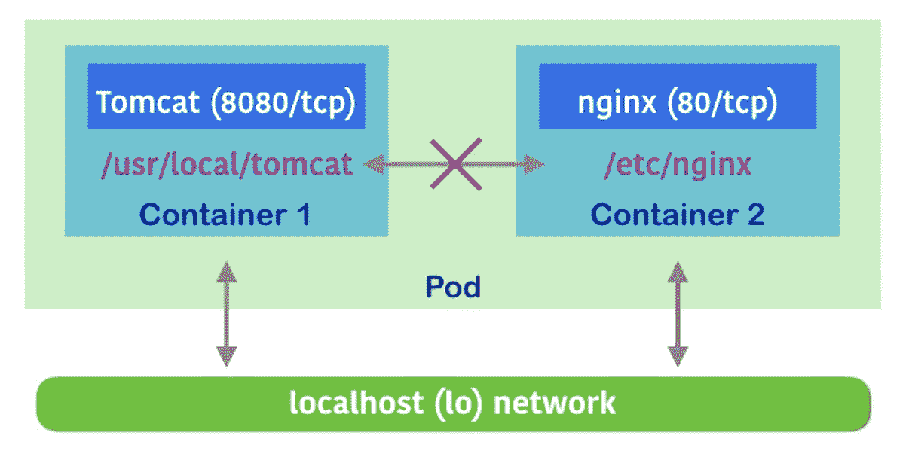

一些应用程序不会影响这些场景和行为，但有些应用程序可能有一些使用案例，需要它们使用共享目录或文件。因此，开发人员和 Kubernetes 管理员需要了解不同类型的无状态和有状态应用程序。

# 无状态和有状态的应用程序

就无状态应用程序而言，在这种情况下使用临时卷。容器上的应用程序不需要保留数据。虽然无状态应用程序可能会在容器存在时将数据写入文件系统，但在应用程序的生命周期中并不重要。

例如，`tomcat`容器运行一些 Web 应用程序。它还在`/usr/local/tomcat/logs/`下写入应用程序日志，但如果丢失`log`文件，它不会受到影响。

但是，如果您开始分析应用程序日志呢？需要出于审计目的保留吗？在这种情况下，Tomcat 仍然可以是无状态的，但可以将`/usr/local/tomcat/logs`卷与 Logstash 等另一个容器共享（[`www.elastic.co/products/logstash`](https://www.elastic.co/products/logstash)）。然后 Logstash 将日志发送到所选的分析存储，如 Elasticsearch（[`www.elastic.co/products/elasticsearch`](https://www.elastic.co/products/elasticsearch)）。

在这种情况下，`tomcat`容器和`logstash`容器*必须在同一个 Kubernetes pod 中*，并共享`/usr/local/tomcat/logs`卷，如下所示：

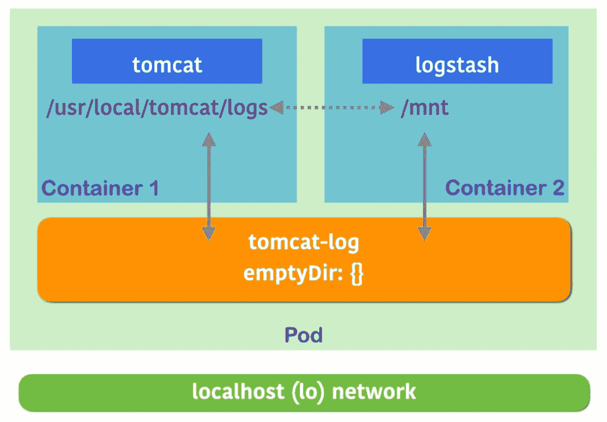

上图显示了 Tomcat 和 Logstash 如何使用 Kubernetes 的`emptyDir`卷共享`log`文件（[`kubernetes.io/docs/concepts/storage/volumes/#emptydir)`](https://kubernetes.io/docs/concepts/storage/volumes/)。

Tomcat 和 Logstash 没有通过 localhost 使用网络，而是通过 Kubernetes 的`emptyDir`卷在 Tomcat 容器的`/usr/local/tomcat/logs`和 Logstash 容器的`/mnt`之间共享文件系统：

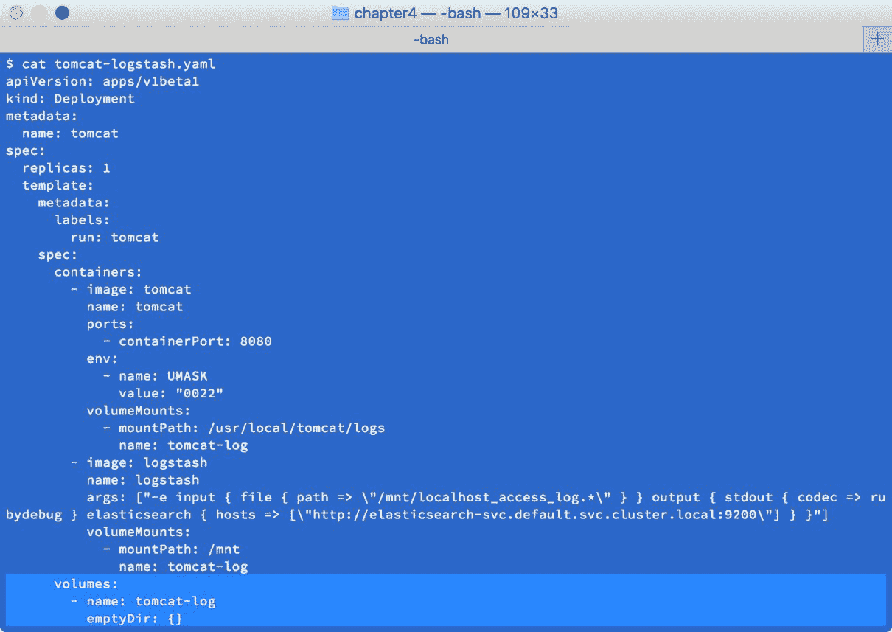

让我们创建`tomcat`和`logstash` pod，然后看看 Logstash 是否能在`/mnt`下看到 Tomcat 应用程序日志：


在这种情况下，最终目的地的 Elasticsearch 必须是有状态的。有状态意味着使用持久卷。即使容器重新启动，Elasticsearch 容器也必须保留数据。此外，您不需要在同一个 pod 中配置 Elasticsearch 容器和 Tomcat/Logstash。因为 Elasticsearch 应该是一个集中的日志数据存储，它可以与 Tomcat/Logstash pod 分开，并独立扩展。

一旦确定您的应用程序需要持久卷，就有一些不同类型的卷和不同的管理持久卷的方法。

# Kubernetes 持久卷和动态配置

Kubernetes 支持各种持久卷。例如，公共云存储，如 AWS EBS 和 Google 持久磁盘。它还支持网络（分布式）文件系统，如 NFS，GlusterFS 和 Ceph。此外，它还可以支持诸如 iSCSI 和光纤通道之类的块设备。根据环境和基础架构，Kubernetes 管理员可以选择最匹配的持久卷类型。

以下示例使用 GCP 持久磁盘作为持久卷。第一步是创建一个 GCP 持久磁盘，并将其命名为`gce-pd-1`。

如果使用 AWS EBS 或 Google 持久磁盘，则 Kubernetes 节点必须位于 AWS 或 Google 云平台中。

然后在`Deployment`定义中指定名称`gce-pd-1`：

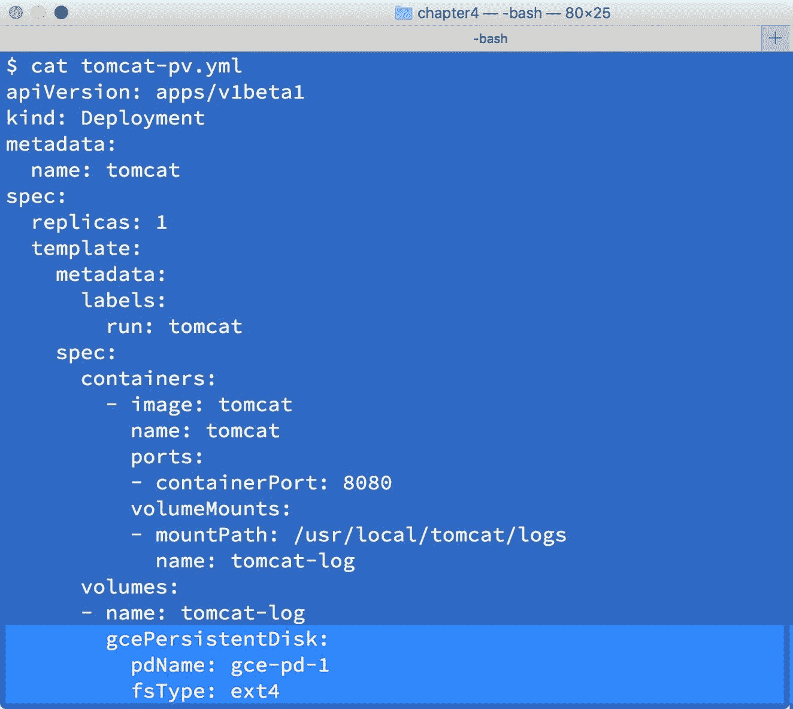

它将从 GCE 持久磁盘挂载到`/usr/local/tomcat/logs`，可以持久保存 Tomcat 应用程序日志。

# 持久卷索赔抽象层

将持久卷直接指定到配置文件中，这将与特定基础架构紧密耦合。在先前的示例中，这是谷歌云平台，也是磁盘名称（`gce-pd-1`）。从容器管理的角度来看，pod 定义不应该锁定到特定环境，因为基础架构可能会根据环境而不同。理想的 pod 定义应该是灵活的，或者抽象出实际的基础架构，只指定卷名称和挂载点。

因此，Kubernetes 提供了一个抽象层，将 pod 与持久卷关联起来，称为**持久卷索赔**（**PVC**）。它允许我们与基础架构解耦。Kubernetes 管理员只需预先分配必要大小的持久卷。然后 Kubernetes 将在持久卷和 PVC 之间进行绑定：

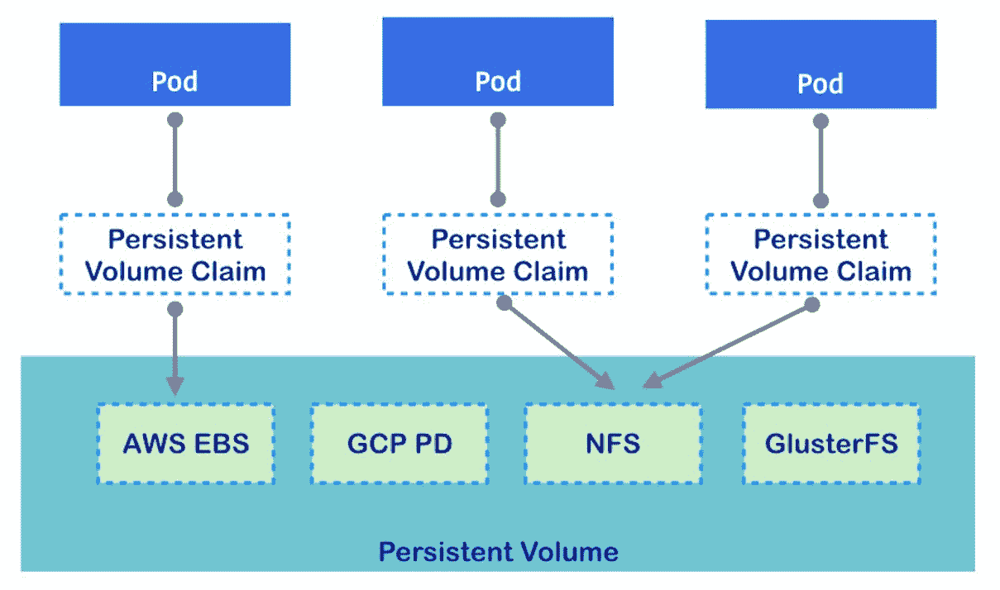

以下示例是使用 PVC 的 pod 的定义；让我们首先重用之前的例子（`gce-pd-1`）在 Kubernetes 中注册：


然后，创建一个与持久卷（`pv-1`）关联的 PVC。

请注意，将其设置为`storageClassName: ""`意味着它应明确使用静态配置。一些 Kubernetes 环境，如**Google 容器引擎**（**GKE**），已经设置了动态配置。如果我们不指定`storageClassName: ""`，Kubernetes 将忽略现有的`PersistentVolume`，并在创建`PersistentVolumeClaim`时分配新的`PersistentVolume`。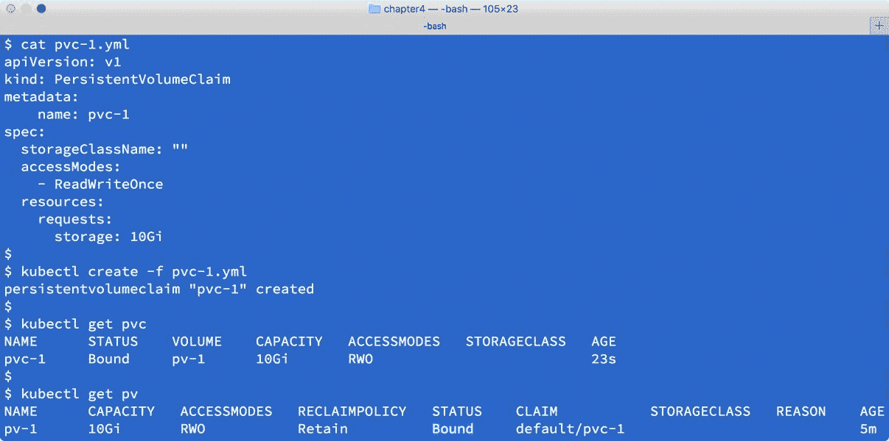

现在，`tomcat`设置已经与特定卷“`pvc-1`”解耦：

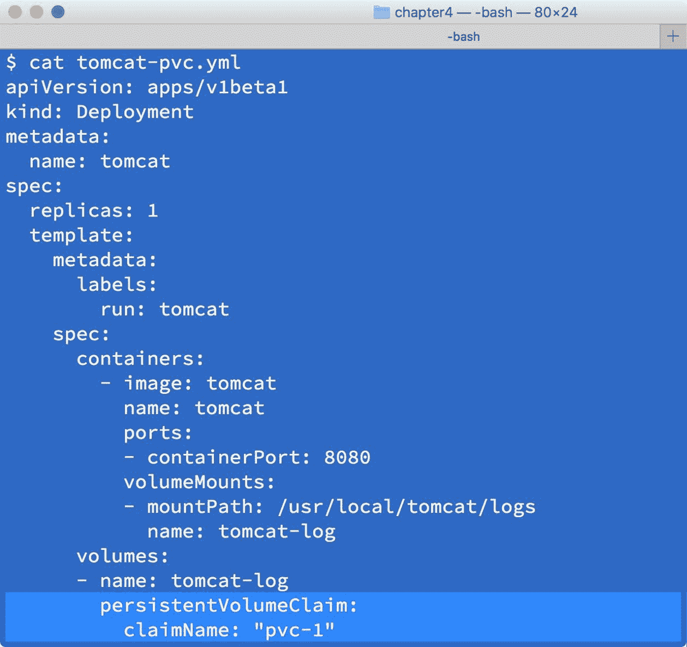

# 动态配置和 StorageClass

PVC 为持久卷管理提供了一定程度的灵活性。然而，预先分配一些持久卷池可能不够成本效益，特别是在公共云中。

Kubernetes 还通过支持持久卷的动态配置来帮助这种情况。Kubernetes 管理员定义了持久卷的*provisioner*，称为`StorageClass`。然后，持久卷索赔要求`StorageClass`动态分配持久卷，然后将其与 PVC 关联起来：


在下面的例子中，AWS EBS 被用作`StorageClass`，然后，在创建 PVC 时，`StorageClass`动态创建 EBS 并将其注册到 Kubernetes 持久卷，然后附加到 PVC：


一旦`StorageClass`成功创建，就可以创建一个不带 PV 的 PVC，但要指定`StorageClass`的名称。在这个例子中，这将是"`aws-sc`"，如下面的截图所示：

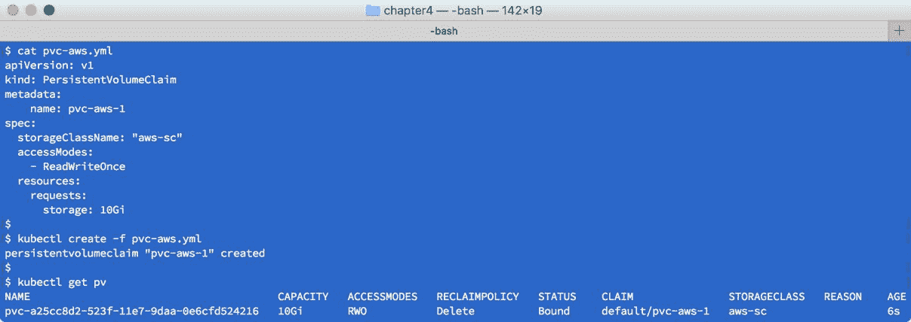

然后，PVC 要求`StorageClass`在 AWS 上自动创建持久卷，如下所示：

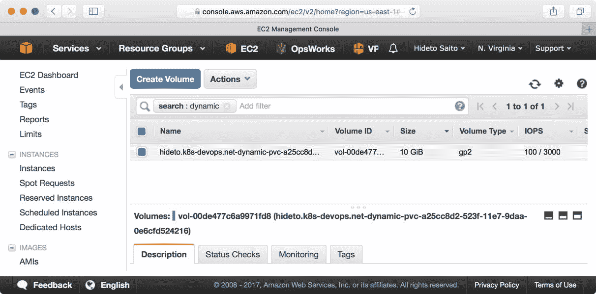

请注意，诸如 kops（[`github.com/kubernetes/kops`](https://github.com/kubernetes/kops)）和 Google 容器引擎（[`cloud.google.com/container-engine/`](https://cloud.google.com/container-engine/)）等 Kubernetes 配置工具默认会创建`StorageClass`。例如，kops 在 AWS 环境上设置了默认的 AWS EBS `StorageClass`。Google 容器引擎在 GKE 上设置了 Google Cloud 持久磁盘。有关更多信息，请参阅第九章，*在 AWS 上使用 Kubernetes*和第十章，*在 GCP 上使用 Kubernetes*：

```
//default Storage Class on AWS
$ kubectl get sc
NAME            TYPE
default         kubernetes.io/aws-ebs
gp2 (default)   kubernetes.io/aws-ebs

//default Storage Class on GKE
$ kubectl get sc
NAME                 TYPE
standard (default)   kubernetes.io/gce-pd   
```

# 临时和持久设置的问题案例

您可能会将您的应用程序确定为无状态，因为`datastore`功能由另一个 pod 或系统处理。然而，有时应用程序实际上存储了您不知道的重要文件。例如，Grafana（[`grafana.com/grafana`](https://grafana.com/grafana)），它连接时间序列数据源，如 Graphite（[`graphiteapp.org`](https://graphiteapp.org)）和 InfluxDB（[`www.influxdata.com/time-series-database/`](https://www.influxdata.com/time-series-database/)），因此人们可以确定 Grafana 是否是一个无状态应用程序。

然而，Grafana 本身也使用数据库来存储用户、组织和仪表板元数据。默认情况下，Grafana 使用 SQLite3 组件，并将数据库存储为`/var/lib/grafana/grafana.db`。因此，当容器重新启动时，Grafana 设置将被全部重置。

以下示例演示了 Grafana 在临时卷上的行为：

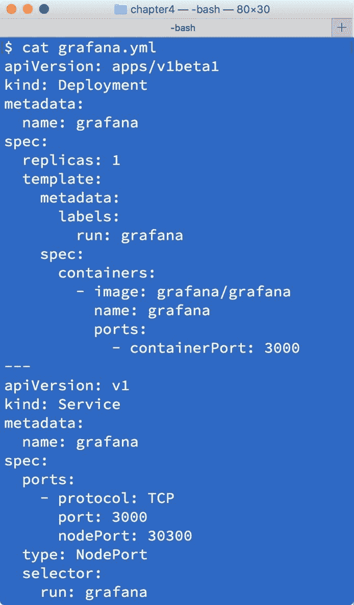

让我们创建一个名为`kubernetes org`的 Grafana `organizations`，如下所示：


然后，看一下`Grafana`目录，有一个数据库文件（`/var/lib/grafana/grafana.db`）的时间戳，在创建 Grafana `organization`之后已经更新：


当 pod 被删除时，ReplicaSet 将启动一个新的 pod，并检查 Grafana `organization`是否存在：


看起来`sessions`目录已经消失，`grafana.db`也被 Docker 镜像重新创建。然后，如果您访问 Web 控制台，Grafana `organization`也会消失：


仅使用持久卷来处理 Grafana 呢？但是使用带有持久卷的 ReplicaSet，它无法正确地复制（扩展）。因为所有的 pod 都试图挂载相同的持久卷。在大多数情况下，只有第一个 pod 可以挂载持久卷，然后另一个 pod 会尝试挂载，如果无法挂载，它将放弃。如果持久卷只能支持 RWO（只能有一个 pod 写入），就会发生这种情况。

在以下示例中，Grafana 使用持久卷挂载`/var/lib/grafana`；但是，它无法扩展，因为 Google 持久磁盘是 RWO：


即使持久卷具有 RWX（多个 pod 可以同时挂载以读写），比如 NFS，如果多个 pod 尝试绑定相同的卷，它也不会抱怨。但是，我们仍然需要考虑多个应用程序实例是否可以使用相同的文件夹/文件。例如，如果将 Grafana 复制到两个或更多的 pod 中，它将与尝试写入相同的`/var/lib/grafana/grafana.db`的多个 Grafana 实例发生冲突，然后数据可能会损坏，如下面的截图所示：


在这种情况下，Grafana 必须使用后端数据库，如 MySQL 或 PostgreSQL，而不是 SQLite3。这样可以使多个 Grafana 实例正确读写 Grafana 元数据。


因为关系型数据库基本上支持通过网络连接多个应用程序实例，因此，这种情况非常适合多个 pod 使用。请注意，Grafana 支持使用关系型数据库作为后端元数据存储；但是，并非所有应用程序都支持关系型数据库。

对于使用 MySQL/PostgreSQL 的 Grafana 配置，请访问在线文档：

[`docs.grafana.org/installation/configuration/#database`](http://docs.grafana.org/installation/configuration/#database)。

因此，Kubernetes 管理员需要仔细监视应用程序在卷上的行为。并且要了解，在某些情况下，仅使用持久卷可能无法帮助，因为在扩展 pod 时可能会出现问题。

如果多个 pod 需要访问集中式卷，则考虑使用先前显示的数据库（如果适用）。另一方面，如果多个 pod 需要单独的卷，则考虑使用 StatefulSet。

# 使用 StatefulSet 复制具有持久卷的 pod

StatefulSet 在 Kubernetes 1.5 中引入；它由 Pod 和持久卷之间的绑定组成。当扩展增加或减少 Pod 时，Pod 和持久卷会一起创建或删除。

此外，Pod 的创建过程是串行的。例如，当请求 Kubernetes 扩展两个额外的 StatefulSet 时，Kubernetes 首先创建**持久卷索赔 1**和**Pod 1**，然后创建**持久卷索赔 2**和**Pod 2**，但不是同时进行。如果应用程序在应用程序引导期间注册到注册表，这将有助于管理员：


即使一个 Pod 死掉，StatefulSet 也会保留 Pod 的位置（Pod 名称、IP 地址和相关的 Kubernetes 元数据），并且持久卷也会保留。然后，它会尝试重新创建一个容器，重新分配给同一个 Pod 并挂载相同的持久卷。

使用 Kubernetes 调度程序有助于保持 Pod/持久卷的数量和应用程序保持在线：


具有持久卷的 StatefulSet 需要动态配置和`StorageClass`，因为 StatefulSet 可以进行扩展。当添加更多的 Pod 时，Kubernetes 需要知道如何配置持久卷。

# 持久卷示例

在本章中，介绍了一些持久卷示例。根据环境和场景，Kubernetes 管理员需要正确配置 Kubernetes。

以下是使用不同角色节点构建 Elasticsearch 集群以配置不同类型的持久卷的一些示例。它们将帮助您决定如何配置和管理持久卷。

# Elasticsearch 集群场景

Elasticsearch 能够通过使用多个节点来设置集群。截至 Elasticsearch 版本 2.4，有几种不同类型的节点，如主节点、数据节点和协调节点（[`www.elastic.co/guide/en/elasticsearch/reference/2.4/modules-node.html`](https://www.elastic.co/guide/en/elasticsearch/reference/2.4/modules-node.html)）。每个节点在集群中有不同的角色和责任，因此相应的 Kubernetes 配置和持久卷应该与适当的设置保持一致。

以下图表显示了 Elasticsearch 节点的组件和角色。主节点是集群中唯一管理所有 Elasticsearch 节点注册和配置的节点。它还可以有一个备用节点（有资格成为主节点的节点），可以随时充当主节点：


数据节点在 Elasticsearch 中保存和操作数据存储。协调节点处理来自其他应用程序的 HTTP 请求，然后进行负载均衡/分发到数据节点。

# Elasticsearch 主节点

主节点是集群中唯一的节点。此外，其他节点需要指向主节点进行注册。因此，主节点应该使用 Kubernetes StatefulSet 来分配一个稳定的 DNS 名称，例如`es-master-1`。因此，我们必须使用 Kubernetes 服务以无头模式分配 DNS，直接将 DNS 名称分配给 pod IP 地址。

另一方面，如果不需要持久卷，因为主节点不需要持久化应用程序的数据。

# Elasticsearch 有资格成为主节点的节点

有资格成为主节点的节点是主节点的备用节点，因此不需要创建另一个`Kubernetes`对象。这意味着扩展主 StatefulSet 分配`es-master-2`、`es-master-3`和`es-master-N`就足够了。当主节点不响应时，在有资格成为主节点的节点中进行主节点选举，选择并提升一个节点为主节点。

# Elasticsearch 数据节点

Elasticsearch 数据节点负责存储数据。此外，如果需要更大的数据容量和/或更多的查询请求，我们需要进行横向扩展。因此，我们可以使用带有持久卷的 StatefulSet 来稳定 pod 和持久卷。另一方面，不需要有 DNS 名称，因此也不需要为 Elasticsearch 数据节点设置 Kubernetes 服务。

# Elasticsearch 协调节点

协调节点是 Elasticsearch 中的负载均衡器角色。因此，我们需要进行横向扩展以处理来自外部来源的 HTTP 流量，并且不需要持久化数据。因此，我们可以使用带有 Kubernetes 服务的 Kubernetes ReplicaSet 来将 HTTP 暴露给外部服务。

以下示例显示了我们在 Kubernetes 中创建所有上述 Elasticsearch 节点时使用的命令：


此外，以下截图是我们在创建上述实例后获得的结果：

！[](../images/00072.jpeg)

在这种情况下，外部服务（Kubernetes 节点：`30020`）是外部应用程序的入口点。为了测试目的，让我们安装`elasticsearch-head`（[`github.com/mobz/elasticsearch-head`](https://github.com/mobz/elasticsearch-head)）来可视化集群信息。

将 Elasticsearch 协调节点连接到安装`elasticsearch-head`插件：

！[](../images/00074.jpeg)

然后，访问任何 Kubernetes 节点，URL 为`http://<kubernetes-node>:30200/_plugin/head`。以下 UI 包含集群节点信息：

！[](../images/00075.jpeg)

星形图标表示 Elasticsearch 主节点，三个黑色子弹是数据节点，白色圆形子弹是协调节点。

在这种配置中，如果一个数据节点宕机，不会发生任何服务影响，如下面的片段所示：

```
//simulate to occur one data node down 
$ kubectl delete pod es-data-0
pod "es-data-0" deleted
```

！[](../images/00076.jpeg)

几分钟后，新的 pod 挂载相同的 PVC，保留了`es-data-0`的数据。然后 Elasticsearch 数据节点再次注册到主节点，之后集群健康状态恢复为绿色（正常），如下面的截图所示：

！[](../images/00077.jpeg)

由于 StatefulSet 和持久卷，应用程序数据不会丢失在`es-data-0`上。如果需要更多的磁盘空间，增加数据节点的数量。如果需要支持更多的流量，增加协调节点的数量。如果需要备份主节点，增加主节点的数量以使一些主节点有资格。

总的来说，StatefulSet 的持久卷组合非常强大，可以使应用程序灵活和可扩展。

# Kubernetes 资源管理

第三章，*开始使用 Kubernetes*提到 Kubernetes 有一个调度程序来管理 Kubernetes 节点，然后确定在哪里部署一个 pod。当节点有足够的资源，如 CPU 和内存时，Kubernetes 管理员可以随意部署应用程序。然而，一旦达到资源限制，Kubernetes 调度程序根据其配置行为不同。因此，Kubernetes 管理员必须了解如何配置和利用机器资源。

# 资源服务质量

Kubernetes 有**资源 QoS**（**服务质量**）的概念，它可以帮助管理员通过不同的优先级分配和管理 pod。根据 pod 的设置，Kubernetes 将每个 pod 分类为：

+   Guaranteed pod

+   Burstable pod

+   BestEffort pod

优先级将是 Guaranteed > Burstable > BestEffort，这意味着如果 BestEffort pod 和 Guaranteed pod 存在于同一节点中，那么当其中一个 pod 消耗内存并导致节点资源短缺时，将终止其中一个 BestEffort pod 以保存 Guaranteed pod。

为了配置资源 QoS，您必须在 pod 定义中设置资源请求和/或资源限制。以下示例是 nginx 的资源请求和资源限制的定义：

```
$ cat burstable.yml  
apiVersion: v1 
kind: Pod 
metadata: 
  name: burstable-pod 
spec: 
  containers: 
  - name: nginx 
    image: nginx 
    resources: 
      requests: 
        cpu: 0.1 
        memory: 10Mi 
      limits: 
        cpu: 0.5 
        memory: 300Mi 
```

此示例指示以下内容：

| **资源定义类型** | **资源名称** | **值** | **含义** |
| --- | --- | --- | --- |
| `requests` | `cpu` | `0.1` | 至少 10%的 1 个 CPU 核心 |
|  | `memory` | `10Mi` | 至少 10 兆字节的内存 |
| `limits` | `cpu` | `0.5` | 最大 50%的 1 个 CPU 核心 |
|  | `memory` | `300Mi` | 最大 300 兆字节的内存 |

对于 CPU 资源，可接受的值表达式为核心（0.1、0.2……1.0、2.0）或毫核（100m、200m……1000m、2000m）。1000m 相当于 1 个核心。例如，如果 Kubernetes 节点有 2 个核心 CPU（或 1 个带超线程的核心），则总共有 2.0 个核心或 2000 毫核，如下所示：

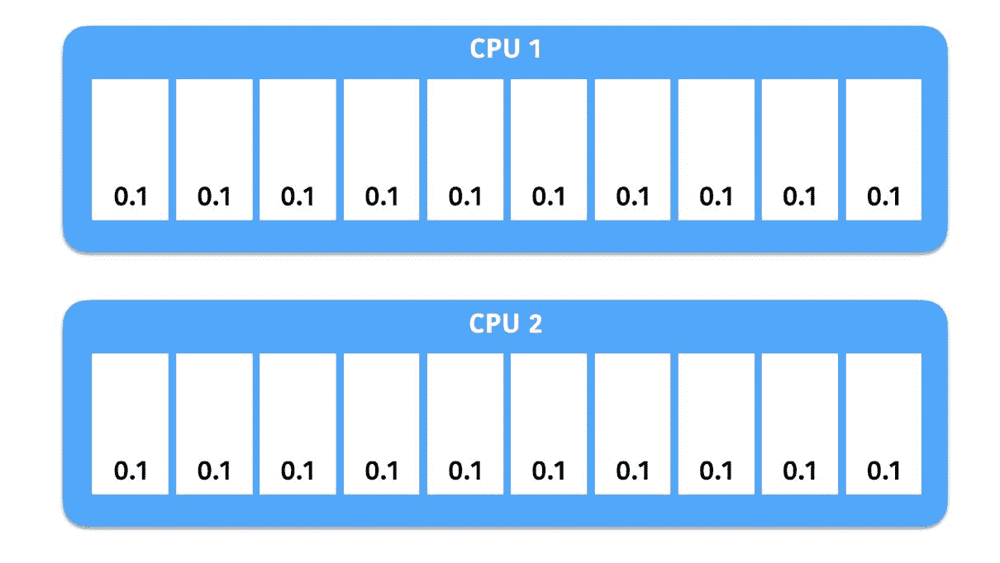

如果运行 nginx 示例（`requests.cpu: 0.1`），它至少占用 0.1 个核心，如下图所示：


只要 CPU 有足够的空间，它可以占用最多 0.5 个核心（`limits.cpu: 0.5`），如下图所示：


您还可以使用`kubectl describe nodes`命令查看配置，如下所示：


请注意，它显示的百分比取决于前面示例中 Kubernetes 节点的规格；如您所见，该节点有 1 个核心和 600 MB 内存。

另一方面，如果超出了内存限制，Kubernetes 调度程序将确定该 pod 内存不足，然后它将终止一个 pod（`OOMKilled`）：

```

//Pod is reaching to the memory limit
$ kubectl get pods
NAME            READY     STATUS    RESTARTS   AGE
burstable-pod   1/1       Running   0          10m

//got OOMKilled
$ kubectl get pods
NAME            READY     STATUS      RESTARTS   AGE
burstable-pod   0/1       OOMKilled   0          10m

//restarting Pod
$ kubectl get pods
NAME            READY     STATUS      RESTARTS   AGE
burstable-pod   0/1       CrashLoopBackOff   0   11m 

//restarted
$ kubectl get pods
NAME            READY     STATUS    RESTARTS   AGE
burstable-pod   1/1       Running   1          12m  
```

# 配置 BestEffort pod

BestEffort pod 在资源 QoS 配置中具有最低的优先级。因此，在资源短缺的情况下，该 pod 将是第一个被终止的。使用 BestEffort 的用例可能是无状态和可恢复的应用程序，例如：

+   Worker process

+   代理或缓存节点

在资源短缺的情况下，该 pod 应该将 CPU 和内存资源让给其他优先级更高的 pod。为了将 pod 配置为 BestEffort pod，您需要将资源限制设置为 0，或者不指定资源限制。例如：

```
//no resource setting
$ cat besteffort-implicit.yml 
apiVersion: v1
kind: Pod
metadata:
 name: besteffort
spec:
 containers:
 - name: nginx
 image: nginx

//resource limit setting as 0
$ cat besteffort-explicit.yml 
apiVersion: v1
kind: Pod
metadata:
 name: besteffort
spec:
 containers:
 - name: nginx
 image: nginx
 resources:
 limits:
      cpu: 0
      memory: 0
```

请注意，资源设置是由`namespace default`设置继承的。因此，如果您打算使用隐式设置将 pod 配置为 BestEffort pod，如果命名空间具有以下默认资源设置，则可能不会配置为 BestEffort：


在这种情况下，如果您使用隐式设置部署到默认命名空间，它将应用默认的 CPU 请求，如`request.cpu: 0.1`，然后它将变成 Burstable。另一方面，如果您部署到`blank-namespace`，应用`request.cpu: 0`，然后它将变成 BestEffort。

# 配置为 Guaranteed pod

Guaranteed 是资源 QoS 中的最高优先级。在资源短缺的情况下，Kubernetes 调度程序将尽力保留 Guaranteed pod 到最后。

因此，Guaranteed pod 的使用将是诸如任务关键节点之类的节点：

+   带有持久卷的后端数据库

+   主节点（例如 Elasticsearch 主节点和 HDFS 名称节点）

为了将其配置为 Guaranteed pod，明确设置资源限制和资源请求为相同的值，或者只设置资源限制。然而，再次强调，如果命名空间具有默认资源设置，可能会导致不同的结果：

```
$ cat guaranteed.yml 
apiVersion: v1
kind: Pod
metadata:
 name: guaranteed-pod
spec:
 containers:
   - name: nginx
     image: nginx
     resources:
      limits:
       cpu: 0.3
       memory: 350Mi
      requests:
       cpu: 0.3
       memory: 350Mi

$ kubectl get pods
NAME             READY     STATUS    RESTARTS   AGE
guaranteed-pod   1/1       Running   0          52s

$ kubectl describe pod guaranteed-pod | grep -i qos
QoS Class:  Guaranteed
```

因为 Guaranteed pod 必须设置资源限制，如果您对应用程序的必要 CPU/内存资源不是 100%确定，特别是最大内存使用量；您应该使用 Burstable 设置一段时间来监视应用程序的行为。否则，即使节点有足够的内存，Kubernetes 调度程序也可能终止 pod（`OOMKilled`）。

# 配置为 Burstable pod

Burstable pod 的优先级高于 BestEffort，但低于 Guaranteed。与 Guaranteed pod 不同，资源限制设置不是强制性的；因此，在节点资源可用时，pod 可以尽可能地消耗 CPU 和内存。因此，它适用于任何类型的应用程序。

如果您已经知道应用程序的最小内存大小，您应该指定请求资源，这有助于 Kubernetes 调度程序分配到正确的节点。例如，有两个节点，每个节点都有 1GB 内存。节点 1 已经分配了 600MB 内存，节点 2 分配了 200MB 内存给其他 pod。

如果我们创建一个请求内存资源为 500 MB 的 pod，那么 Kubernetes 调度器会将此 pod 分配给节点 2。但是，如果 pod 没有资源请求，结果将在节点 1 或节点 2 之间变化。因为 Kubernetes 不知道这个 pod 将消耗多少内存：

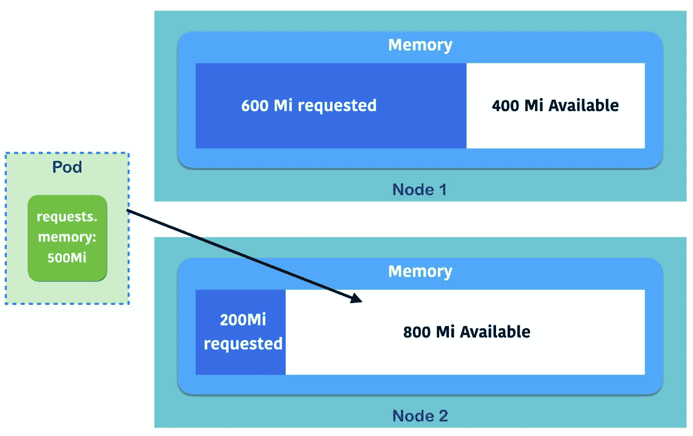

还有一个重要的资源 QoS 行为需要讨论。资源 QoS 单位的粒度是 pod 级别，而不是容器级别。这意味着，如果您配置了一个具有两个容器的 pod，您打算将容器 A 设置为保证的（请求/限制值相同），容器 B 是可突发的（仅设置请求）。不幸的是，Kubernetes 会将此 pod 配置为可突发，因为 Kubernetes 不知道容器 B 的限制是多少。

以下示例表明未能配置为保证的 pod，最终配置为可突发的：

```
// supposed nginx is Guaranteed, tomcat as Burstable...
$ cat guaranteed-fail.yml 
apiVersion: v1
kind: Pod
metadata:
 name: burstable-pod
spec:
  containers:
  - name: nginx
    image: nginx
    resources:
     limits:
       cpu: 0.3
       memory: 350Mi
     requests:
       cpu: 0.3
       memory: 350Mi
  - name: tomcat
    image: tomcat
    resources:
      requests:
       cpu: 0.2
       memory: 100Mi

$ kubectl create -f guaranteed-fail.yml 
pod "guaranteed-fail" created

//at the result, Pod is configured as Burstable
$ kubectl describe pod guaranteed-fail | grep -i qos
QoS Class:  Burstable
```

即使改为仅配置资源限制，但如果容器 A 只有 CPU 限制，容器 B 只有内存限制，那么结果也会再次变为可突发，因为 Kubernetes 只知道限制之一：

```
//nginx set only cpu limit, tomcat set only memory limit
$ cat guaranteed-fail2.yml 
apiVersion: v1
kind: Pod
metadata:
 name: guaranteed-fail2
spec:
 containers:
  - name: nginx
    image: nginx
    resources:
      limits:
       cpu: 0.3
  - name: tomcat
    image: tomcat
    resources:
      requests:
       memory: 100Mi

$ kubectl create -f guaranteed-fail2.yml 
pod "guaranteed-fail2" created

//result is Burstable again
$ kubectl describe pod |grep -i qos
QoS Class:  Burstable
```

因此，如果您打算将 pod 配置为保证的，必须将所有容器设置为保证的。

# 监控资源使用

当您开始配置资源请求和/或限制时，由于资源不足，您的 pod 可能无法被 Kubernetes 调度器部署。为了了解可分配资源和可用资源，请使用 `kubectl describe nodes` 命令查看状态。

以下示例显示一个节点有 600 MB 内存和一个核心 CPU。因此，可分配资源如下：

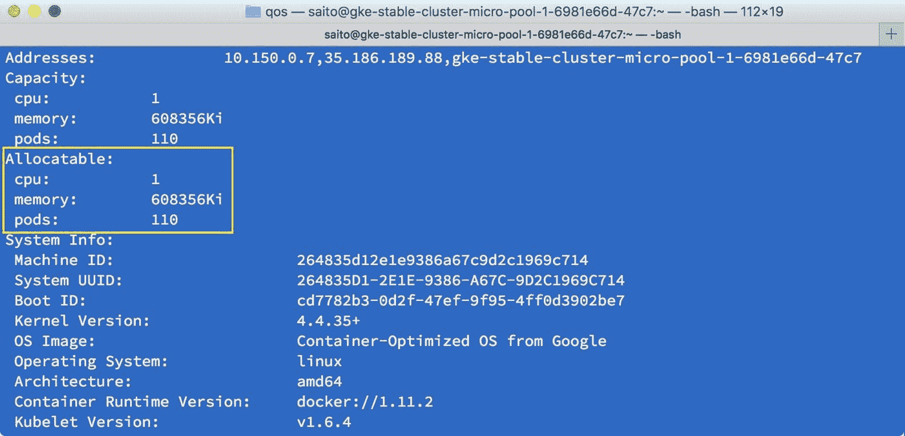

然而，这个节点已经运行了一些可突发的 pod（使用资源请求）如下：


可用内存约为 20 MB。因此，如果您提交了请求超过 20 MB 的可突发的 pod，它将永远不会被调度，如下面的截图所示：

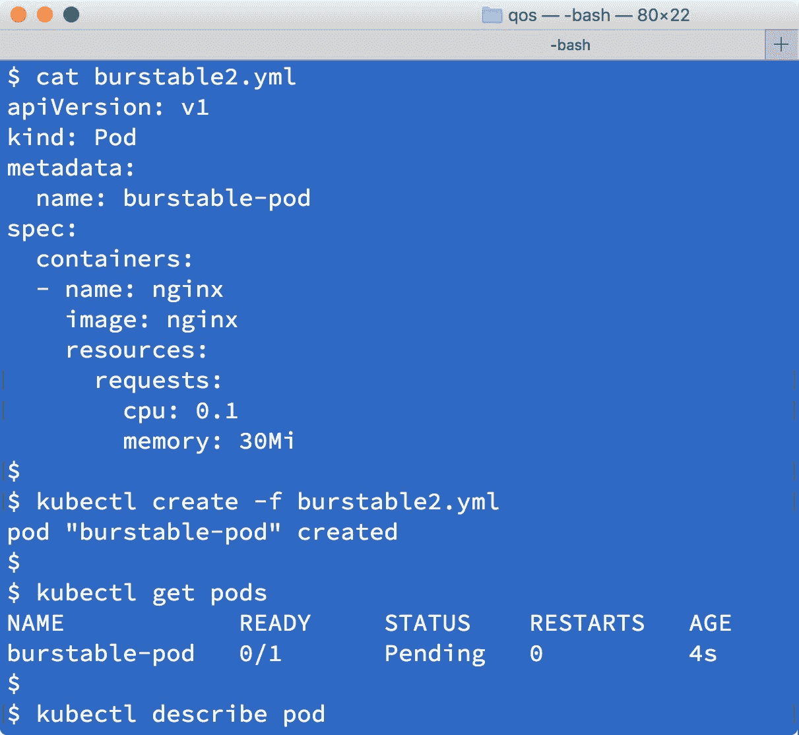

错误事件可以通过 `kubectl describe pod` 命令捕获：

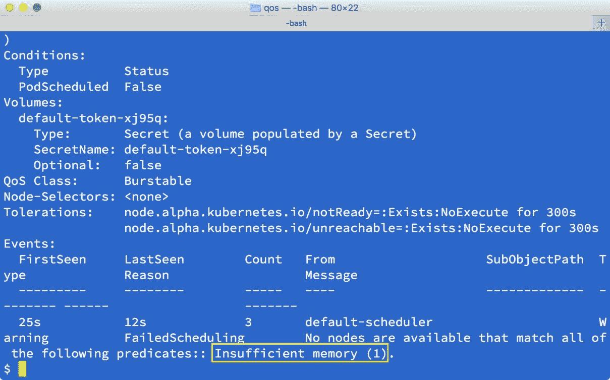

在这种情况下，您需要添加更多的 Kubernetes 节点来支持更多的资源。

# 总结

在本章中，我们已经涵盖了使用临时卷或持久卷的无状态和有状态应用程序。当应用程序重新启动或 pod 扩展时，两者都存在缺陷。此外，Kubernetes 上的持久卷管理已经得到增强，使其更容易，正如您可以从 StatefulSet 和动态配置等工具中看到的那样。

此外，资源 QoS 帮助 Kubernetes 调度器根据优先级基于请求和限制将 pod 分配给正确的节点。

下一章将介绍 Kubernetes 网络和安全性，这将使 pod 和服务的配置更加简单，并使它们更具可扩展性和安全性。
