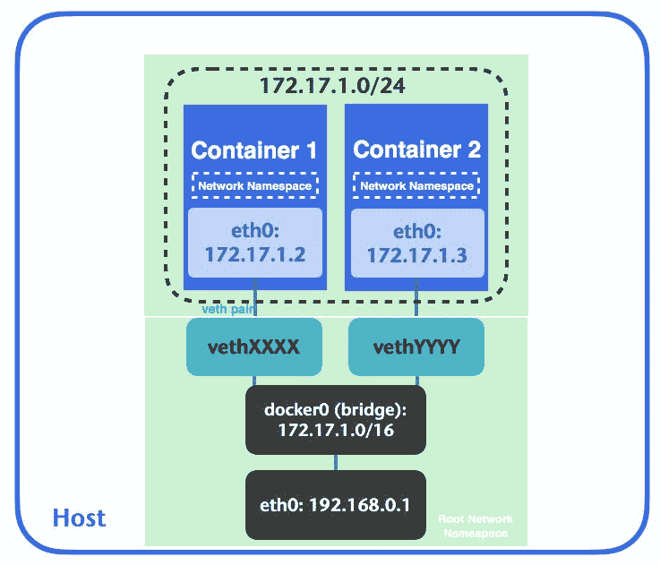
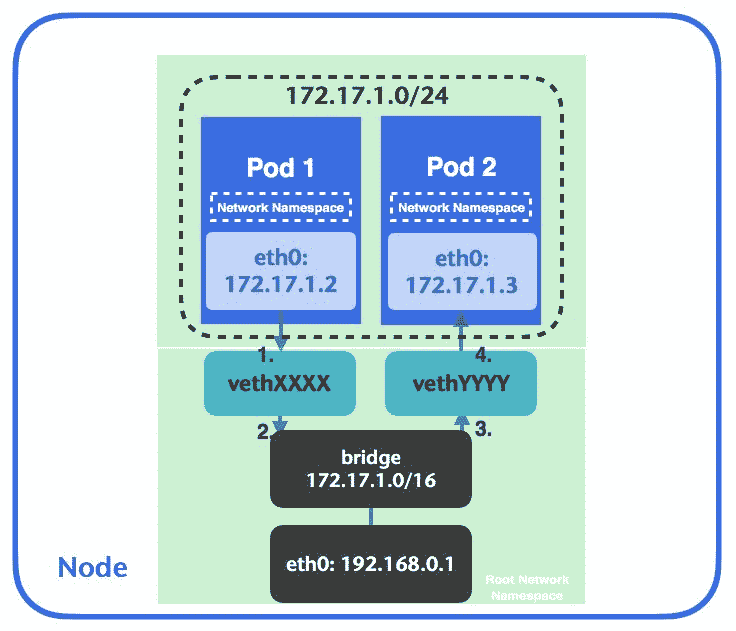
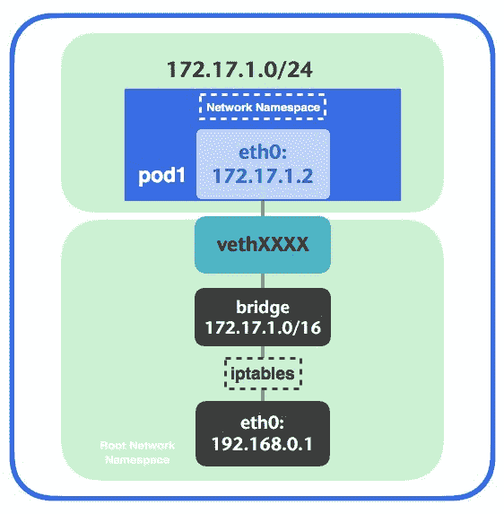
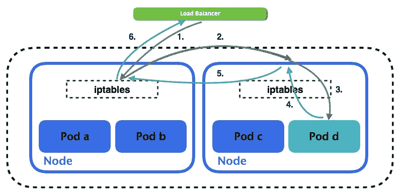
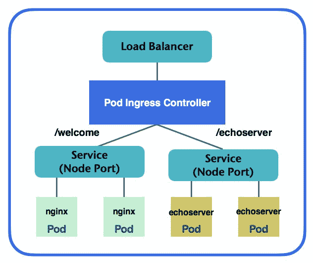

# 第五章：网络和安全

我们已经学会了如何在 Kubernetes 中部署具有不同资源的容器，在第三章 *开始使用 Kubernetes*中，以及如何使用卷来持久化数据，动态配置和不同的存储类。接下来，我们将学习 Kubernetes 如何路由流量，使所有这些成为可能。网络在软件世界中始终扮演着重要角色。我们将描述从单个主机上的容器到多个主机，最终到 Kubernetes 的网络。

+   Docker 网络

+   Kubernetes 网络

+   入口

+   网络策略

# Kubernetes 网络

在 Kubernetes 中，您有很多选择来实现网络。Kubernetes 本身并不关心您如何实现它，但您必须满足其三个基本要求：

+   所有容器应该彼此可访问，无需 NAT，无论它们在哪个节点上

+   所有节点应该与所有容器通信

+   IP 容器应该以其他人看待它的方式看待自己

在进一步讨论之前，我们首先会回顾默认容器网络是如何工作的。这是使所有这些成为可能的网络支柱。

# Docker 网络

在深入研究 Kubernetes 网络之前，让我们回顾一下 Docker 网络。在第二章 *使用容器进行 DevOps*中，我们学习了容器网络的三种模式，桥接，无和主机。

桥接是默认的网络模型。Docker 创建并附加虚拟以太网设备（也称为 veth），并为每个容器分配网络命名空间。

**网络命名空间**是 Linux 中的一个功能，它在逻辑上是网络堆栈的另一个副本。它有自己的路由表、arp 表和网络设备。这是容器网络的基本概念。

Veth 总是成对出现，一个在网络命名空间中，另一个在桥接中。当流量进入主机网络时，它将被路由到桥接中。数据包将被分派到它的 veth，并进入容器内部的命名空间，如下图所示：



让我们仔细看看。在以下示例中，我们将使用 minikube 节点作为 docker 主机。首先，我们必须使用`minikube ssh`来 ssh 进入节点，因为我们还没有使用 Kubernetes。进入 minikube 节点后，让我们启动一个容器与我们进行交互：

```
// launch a busybox container with `top` command, also, expose container port 8080 to host port 8000.
# docker run -d -p 8000:8080 --name=busybox busybox top
737e4d87ba86633f39b4e541f15cd077d688a1c8bfb83156d38566fc5c81f469 
```

让我们看看容器内部的出站流量实现。`docker exec <container_name or container_id>`可以在运行中的容器中运行命令。让我们使用`ip link list`列出所有接口：

```
// show all the network interfaces in busybox container
// docker exec <container_name> <command>
# docker exec busybox ip link list
1: lo: <LOOPBACK,UP,LOWER_UP> mtu 65536 qdisc noqueue qlen 1
 link/loopback 00:00:00:00:00:00 brd 00:00:00:00:00:00
2: sit0@NONE: <NOARP> mtu 1480 qdisc noop qlen 1
 link/sit 0.0.0.0 brd 0.0.0.0
53**: **eth0@if54**: <BROADCAST,MULTICAST,UP,LOWER_UP,M-DOWN> 
    mtu 1500 qdisc noqueue
 link/ether 02:42:ac:11:00:07 brd ff:ff:ff:ff:ff:ff  
```

我们可以看到`busybox`容器内有三个接口。其中一个是 ID 为`53`的接口，名称为`eth0@if54`。`if`后面的数字是配对中的另一个接口 ID。在这种情况下，配对 ID 是`54`。如果我们在主机上运行相同的命令，我们可以看到主机中的 veth 指向容器内的`eth0`。

```
// show all the network interfaces from the host
# ip link list
1: lo: <LOOPBACK,UP,LOWER_UP> mtu 65536 qdisc noqueue  
   state UNKNOWN mode DEFAULT group default qlen 1
 link/loopback 00:00:00:00:00:00 brd 00:00:00:00:00:00
2: eth0: <BROADCAST,MULTICAST,UP,LOWER_UP> mtu 1500 qdisc 
   pfifo_fast state UP mode DEFAULT group default qlen  
   1000
 link/ether 08:00:27:ca:fd:37 brd ff:ff:ff:ff:ff:ff
...
54**: **vethfeec36a@if53**: <BROADCAST,MULTICAST,UP,LOWER_UP> 
    mtu 1500 qdisc noqueue master docker0 state UP mode  
    DEFAULT group default
 link/ether ce:25:25:9e:6c:07 brd ff:ff:ff:ff:ff:ff link-netnsid 5  
```

主机上有一个名为`vethfeec36a@if53`的 veth**。**它与容器网络命名空间中的`eth0@if54`配对。veth 54 连接到`docker0`桥接口，并最终通过 eth0 访问互联网。如果我们查看 iptables 规则，我们可以找到 Docker 为出站流量创建的伪装规则（也称为 SNAT），这将使容器可以访问互联网：

```
// list iptables nat rules. Showing only POSTROUTING rules which allows packets to be altered before they leave the host.
# sudo iptables -t nat -nL POSTROUTING
Chain POSTROUTING (policy ACCEPT)
target     prot opt source               destination
...
MASQUERADE  all  --  172.17.0.0/16        0.0.0.0/0
...  
```

另一方面，对于入站流量，Docker 在预路由上创建自定义过滤器链，并动态创建`DOCKER`过滤器链中的转发规则。如果我们暴露一个容器端口`8080`并将其映射到主机端口`8000`，我们可以看到我们正在监听任何 IP 地址（`0.0.0.0/0`）的端口`8000`，然后将其路由到容器端口`8080`：

```
// list iptables nat rules
# sudo iptables -t nat -nL
Chain PREROUTING (policy ACCEPT)
target     prot opt source               destination
...
DOCKER     all  --  0.0.0.0/0            0.0.0.0/0            ADDRTYPE match dst-type LOCAL
...
Chain OUTPUT (policy ACCEPT)
target     prot opt source               destination
DOCKER     all  --  0.0.0.0/0           !127.0.0.0/8          ADDRTYPE match dst-type LOCAL
...
Chain DOCKER (2 references)
target     prot opt source               destination
RETURN     all  --  0.0.0.0/0            0.0.0.0/0
...
DNAT       tcp  --  0.0.0.0/0            0.0.0.0/0            tcp dpt:8000 to:172.17.0.7:8080
...  
```

现在我们知道数据包如何进出容器。让我们看看 pod 中的容器如何相互通信。

# 容器间通信

Kubernetes 中的 Pod 具有自己的真实 IP 地址。Pod 中的容器共享网络命名空间，因此它们将彼此视为*localhost*。这是默认情况下由**网络容器**实现的，它充当桥接口以为 pod 中的每个容器分发流量。让我们看看以下示例中的工作原理。让我们使用第三章中的第一个示例，*开始使用 Kubernetes*，其中包括一个 pod 中的两个容器，`nginx`和`centos`：

```
#cat 5-1-1_pod.yaml
apiVersion: v1
kind: Pod
metadata:
 name: example
spec:
 containers:
 - name: web
 image: nginx
 - name: centos
 image: centos
 command: ["/bin/sh", "-c", "while : ;do curl http://localhost:80/; sleep 10; done"]

// create the Pod
#kubectl create -f 5-1-1_pod.yaml
pod "example" created  
```

然后，我们将描述 pod 并查看其容器 ID：

```
# kubectl describe pods example
Name:       example
Node:       minikube/192.168.99.100
...
Containers:
 web:
 Container ID: docker:// **d9bd923572ab186870284535044e7f3132d5cac11ecb18576078b9c7bae86c73
 Image:        nginx
...
centos:
 Container ID: docker: **//f4c019d289d4b958cd17ecbe9fe22a5ce5952cb380c8ca4f9299e10bf5e94a0f
 Image:        centos
...  
```

在这个例子中，`web` 的容器 ID 是 `d9bd923572ab`，`centos` 的容器 ID 是 `f4c019d289d4`。如果我们使用 `docker ps` 进入节点 `minikube/192.168.99.100`，我们可以检查 Kubernetes 实际启动了多少个容器，因为我们在 minikube 中，它启动了许多其他集群容器。通过 `CREATED` 列可以查看最新的启动时间，我们会发现有三个刚刚启动的容器：

```
# docker ps
CONTAINER ID        IMAGE                                      COMMAND                  CREATED             STATUS              PORTS                                      NAMES
f4c019d289d4        36540f359ca3                               "/bin/sh -c 'while : "   2 minutes ago        Up 2 minutes k8s_centos_example_default_9843fc27-677b-11e7-9a8c-080027cafd37_1
d9bd923572ab        e4e6d42c70b3                               "nginx -g 'daemon off"   2 minutes ago        Up 2 minutes k8s_web_example_default_9843fc27-677b-11e7-9a8c-080027cafd37_1
4ddd3221cc47        gcr.io/google_containers/pause-amd64:3.0   "/pause"                 2 minutes ago        Up 2 minutes  
```

还有一个额外的容器 `4ddd3221cc47` 被启动了。在深入了解它是哪个容器之前，让我们先检查一下我们的 `web` 容器的网络模式。我们会发现我们示例中的 pod 中的容器是在映射容器模式下运行的：

```
# docker inspect d9bd923572ab | grep NetworkMode
"NetworkMode": "container:4ddd3221cc4792207ce0a2b3bac5d758a5c7ae321634436fa3e6dd627a31ca76",  
```

`4ddd3221cc47` 容器在这种情况下被称为网络容器，它持有网络命名空间，让 `web` 和 `centos` 容器加入。在同一网络命名空间中的容器共享相同的 IP 地址和网络配置。这是 Kubernetes 中实现容器间通信的默认方式，这也是对第一个要求的映射。

# Pod 间的通信

无论它们位于哪个节点，Pod IP 地址都可以从其他 Pod 中访问。这符合第二个要求。我们将在接下来的部分描述同一节点内和跨节点的 Pod 通信。

# 同一节点内的 Pod 通信

同一节点内的 Pod 间通信默认通过桥接完成。假设我们有两个拥有自己网络命名空间的 pod。当 pod1 想要与 pod2 通信时，数据包通过 pod1 的命名空间传递到相应的 veth 对 **vethXXXX**，最终到达桥接设备。桥接设备然后广播目标 IP 以帮助数据包找到它的路径，**vethYYYY** 响应。数据包然后到达 pod2：



然而，Kubernetes 主要是关于集群。当 pod 在不同的节点上时，流量是如何路由的呢？

# 节点间的 Pod 通信

根据第二个要求，所有节点必须与所有容器通信。Kubernetes 将实现委托给**容器网络接口**（**CNI**）。用户可以选择不同的实现，如 L2、L3 或覆盖。覆盖网络是常见的解决方案之一，被称为**数据包封装**。它在离开源之前包装消息，然后传递并在目的地解包消息。这导致覆盖增加了网络延迟和复杂性。只要所有容器可以跨节点相互访问，您可以自由使用任何技术，如 L2 邻接或 L3 网关。有关 CNI 的更多信息，请参阅其规范（[`github.com/containernetworking/cni/blob/master/SPEC.md`](https://github.com/containernetworking/cni/blob/master/SPEC.md)）：


假设我们有一个从 pod1 到 pod4 的数据包。数据包从容器接口离开并到达 veth 对，然后通过桥接和节点的网络接口。网络实现在第 4 步发挥作用。只要数据包能够路由到目标节点，您可以自由使用任何选项。在下面的示例中，我们将使用`--network-plugin=cni`选项启动 minikube。启用 CNI 后，参数将通过节点中的 kubelet 传递。Kubelet 具有默认的网络插件，但在启动时可以探测任何支持的插件。在启动 minikube 之前，如果已经启动，您可以首先使用`minikube stop`，或者在进一步操作之前使用`minikube delete`彻底删除整个集群。尽管 minikube 是一个单节点环境，可能无法完全代表我们将遇到的生产场景，但这只是让您对所有这些工作原理有一个基本的了解。我们将在第九章的*在 AWS 上的 Kubernetes*和第十章的*在 GCP 上的 Kubernetes*中学习网络选项的部署。

```
// start minikube with cni option
# minikube start --network-plugin=cni
...
Kubectl is now configured to use the cluster.  
```

当我们指定`network-plugin`选项时，它将在启动时使用`--network-plugin-dir`中指定的目录中的插件。在 CNI 插件中，默认的插件目录是`/opt/cni/net.d`。集群启动后，让我们登录到节点并通过`minikube ssh`查看内部设置：

```
# minikube ssh
$ ifconfig 
...
mybridge  Link encap:Ethernet  HWaddr 0A:58:0A:01:00:01
 inet addr:10.1.0.1  Bcast:0.0.0.0  
          Mask:255.255.0.0
...  
```

我们会发现节点中有一个新的桥接，如果我们再次通过`5-1-1_pod.yml`创建示例 pod，我们会发现 pod 的 IP 地址变成了`10.1.0.x`，它连接到了`mybridge`而不是`docker0`。

```
# kubectl create -f 5-1-1_pod.yaml
pod "example" created
# kubectl describe po example
Name:       example
Namespace:  default
Node:       minikube/192.168.99.100
Start Time: Sun, 23 Jul 2017 14:24:24 -0400
Labels:           <none>
Annotations:      <none>
Status:           Running
IP:         10.1.0.4  
```

为什么会这样？因为我们指定了要使用 CNI 作为网络插件，而不使用`docker0`（也称为**容器网络模型**或**libnetwork**）。CNI 创建一个虚拟接口，将其连接到底层网络，并最终设置 IP 地址和路由，并将其映射到 pod 的命名空间。让我们来看一下位于`/etc/cni/net.d/`的配置：

```
# cat /etc/cni/net.d/k8s.conf
{
 "name": "rkt.kubernetes.io",
 "type": "bridge",
 "bridge": "mybridge",
 "mtu": 1460,
 "addIf": "true",
 "isGateway": true,
 "ipMasq": true,
 "ipam": {
 "type": "host-local",
 "subnet": "10.1.0.0/16",
 "gateway": "10.1.0.1",
 "routes": [
      {
       "dst": "0.0.0.0/0"
      }
 ]
 }
}
```

在这个例子中，我们使用桥接 CNI 插件来重用用于 pod 容器的 L2 桥接。如果数据包来自`10.1.0.0/16`，目的地是任何地方，它将通过这个网关。就像我们之前看到的图表一样，我们可以有另一个启用了 CNI 的节点，使用`10.1.2.0/16`子网，这样 ARP 数据包就可以传输到目标 pod 所在节点的物理接口上。然后实现节点之间的 pod 到 pod 通信。

让我们来检查 iptables 中的规则：

```
// check the rules in iptables 
# sudo iptables -t nat -nL
... 
Chain POSTROUTING (policy ACCEPT)
target     prot opt source               destination
KUBE-POSTROUTING  all  --  0.0.0.0/0            0.0.0.0/0            /* kubernetes postrouting rules */
MASQUERADE  all  --  172.17.0.0/16        0.0.0.0/0
CNI-25df152800e33f7b16fc085a  all  --  10.1.0.0/16          0.0.0.0/0            /* name: "rkt.kubernetes.io" id: "328287949eb4d4483a3a8035d65cc326417ae7384270844e59c2f4e963d87e18" */
CNI-f1931fed74271104c4d10006  all  --  10.1.0.0/16          0.0.0.0/0            /* name: "rkt.kubernetes.io" id: "08c562ff4d67496fdae1c08facb2766ca30533552b8bd0682630f203b18f8c0a" */  
```

所有相关规则都已切换到`10.1.0.0/16` CIDR。

# pod 到 service 的通信

Kubernetes 是动态的。Pod 不断地被创建和删除。Kubernetes 服务是一个抽象，通过标签选择器定义一组 pod。我们通常使用服务来访问 pod，而不是明确指定一个 pod。当我们创建一个服务时，将创建一个`endpoint`对象，描述了该服务中标签选择器选择的一组 pod IP。

在某些情况下，创建服务时不会创建`endpoint`对象。例如，没有选择器的服务不会创建相应的`endpoint`对象。有关更多信息，请参阅第三章中没有选择器的服务部分，*开始使用 Kubernetes*。

那么，流量是如何从一个 pod 到 service 后面的 pod 的呢？默认情况下，Kubernetes 使用 iptables 通过`kube-proxy`执行这个魔术。这在下图中有解释。



让我们重用第三章中的`3-2-3_rc1.yaml`和`3-2-3_nodeport.yaml`的例子，*开始使用 Kubernetes*，来观察默认行为：

```
// create two pods with nginx and one service to observe default networking. Users are free to use any other kind of solution.
# kubectl create -f 3-2-3_rc1.yaml
replicationcontroller "nginx-1.12" created
# kubectl create -f 3-2-3_nodeport.yaml
service "nginx-nodeport" created  
```

让我们观察 iptables 规则，看看它是如何工作的。如下所示，我们的服务 IP 是`10.0.0.167`，下面的两个 pod IP 地址分别是`10.1.0.4`和`10.1.0.5`。

```
// kubectl describe svc nginx-nodeport
Name:             nginx-nodeport
Namespace:        default
Selector:         project=chapter3,service=web
Type:             NodePort
IP:               10.0.0.167
Port:             <unset>     80/TCP
NodePort:         <unset>     32261/TCP
Endpoints:        10.1.0.4:80,10.1.0.5:80
...  
```

让我们通过`minikube ssh`进入 minikube 节点并检查其 iptables 规则：

```
# sudo iptables -t nat -nL
...
Chain KUBE-SERVICES (2 references)
target     prot opt source               destination
KUBE-SVC-37ROJ3MK6RKFMQ2B  tcp  --  0.0.0.0/0            **10.0.0.167**           /* default/nginx-nodeport: cluster IP */ tcp dpt:80
KUBE-NODEPORTS  all  --  0.0.0.0/0            0.0.0.0/0            /* kubernetes service nodeports; NOTE: this must be the last rule in this chain */ ADDRTYPE match dst-type LOCAL

Chain **KUBE-SVC-37ROJ3MK6RKFMQ2B** (2 references)
target     prot opt source               destination
KUBE-SEP-SVVBOHTYP7PAP3J5**  all  --  0.0.0.0/0            0.0.0.0/0            /* default/nginx-nodeport: */ statistic mode random probability 0.50000000000
KUBE-SEP-AYS7I6ZPYFC6YNNF**  all  --  0.0.0.0/0            0.0.0.0/0            /* default/nginx-nodeport: */
Chain **KUBE-SEP-SVVBOHTYP7PAP3J5** (1 references)
target     prot opt source               destination
KUBE-MARK-MASQ  all  --  10.1.0.4             0.0.0.0/0            /* default/nginx-nodeport: */
DNAT       tcp  --  0.0.0.0/0            0.0.0.0/0            /* default/nginx-nodeport: */ tcp to:10.1.0.4:80
Chain KUBE-SEP-AYS7I6ZPYFC6YNNF (1 references)
target     prot opt source               destination
KUBE-MARK-MASQ  all  --  10.1.0.5             0.0.0.0/0            /* default/nginx-nodeport: */
DNAT       tcp  --  0.0.0.0/0            0.0.0.0/0            /* default/nginx-nodeport: */ tcp to:10.1.0.5:80
...  
```

这里的关键点是服务将集群 IP 暴露给来自目标`KUBE-SVC-37ROJ3MK6RKFMQ2B`的外部流量，该目标链接到两个自定义链`KUBE-SEP-SVVBOHTYP7PAP3J5`和`KUBE-SEP-AYS7I6ZPYFC6YNNF`，统计模式为随机概率 0.5。这意味着，iptables 将生成一个随机数，并根据概率分布 0.5 调整目标。这两个自定义链的`DNAT`目标设置为相应的 pod IP。`DNAT`目标负责更改数据包的目标 IP 地址。默认情况下，当流量进入时，启用 conntrack 来跟踪连接的目标和源。所有这些都导致了一种路由行为。当流量到达服务时，iptables 将随机选择一个 pod 进行路由，并将目标 IP 从服务 IP 修改为真实的 pod IP，并取消 DNAT 以返回全部路由。

# 外部到服务的通信

为了能够为 Kubernetes 提供外部流量是至关重要的。Kubernetes 提供了两个 API 对象来实现这一点：

+   **服务**: 外部网络负载均衡器或 NodePort（L4）

+   **入口:** HTTP(S)负载均衡器（L7）

对于入口，我们将在下一节中学到更多。我们先专注于 L4。根据我们对节点间 pod 到 pod 通信的了解，数据包在服务和 pod 之间进出的方式。下图显示了它的工作原理。假设我们有两个服务，一个服务 A 有三个 pod（pod a，pod b 和 pod c），另一个服务 B 只有一个 pod（pod d）。当流量从负载均衡器进入时，数据包将被分发到其中一个节点。大多数云负载均衡器本身并不知道 pod 或容器。它只知道节点。如果节点通过了健康检查，那么它将成为目的地的候选者。假设我们想要访问服务 B，它目前只在一个节点上运行一个 pod。然而，负载均衡器将数据包发送到另一个没有我们想要的任何 pod 运行的节点。流量路由将如下所示：



数据包路由的过程将是：

1.  负载均衡器将选择一个节点来转发数据包。在 GCE 中，它根据源 IP 和端口、目标 IP 和端口以及协议的哈希选择实例。在 AWS 中，它基于循环算法。

1.  在这里，路由目的地将被更改为 pod d（DNAT），并将其转发到另一个节点，类似于节点间的 pod 到 pod 通信。

1.  然后，服务到 Pod 的通信。数据包到达 Pod d，响应相应地。

1.  Pod 到服务的通信也受 iptables 控制。

1.  数据包将被转发到原始节点。

1.  源和目的地将被解除 DNAT 并发送回负载均衡器和客户端。

在 Kubernetes 1.7 中，服务中有一个名为**externalTrafficPolicy**的新属性。您可以将其值设置为 local，然后在流量进入节点后，Kubernetes 将路由该节点上的 Pod（如果有）。

# Ingress

Kubernetes 中的 Pod 和服务都有自己的 IP；然而，通常不是您提供给外部互联网的接口。虽然有配置了节点 IP 的服务，但节点 IP 中的端口不能在服务之间重复。决定将哪个端口与哪个服务管理起来是很麻烦的。此外，节点来去匆匆，将静态节点 IP 提供给外部服务并不明智。

Ingress 定义了一组规则，允许入站连接访问 Kubernetes 集群服务。它将流量带入集群的 L7 层，在每个 VM 上分配和转发一个端口到服务端口。这在下图中显示。我们定义一组规则，并将它们作为源类型 ingress 发布到 API 服务器。当流量进来时，ingress 控制器将根据 ingress 规则履行和路由 ingress。如下图所示，ingress 用于通过不同的 URL 将外部流量路由到 kubernetes 端点：



现在，我们将通过一个示例来看看这是如何工作的。在这个例子中，我们将创建两个名为`nginx`和`echoserver`的服务，并配置 ingress 路径`/welcome`和`/echoserver`。我们可以在 minikube 中运行这个。旧版本的 minikube 默认不启用 ingress；我们需要先启用它：

```
// start over our minikube local
# minikube delete && minikube start

// enable ingress in minikube
# minikube addons enable ingress
ingress was successfully enabled 

// check current setting for addons in minikube
# minikube addons list
- registry: disabled
- registry-creds: disabled
- addon-manager: enabled
- dashboard: enabled
- default-storageclass: enabled
- kube-dns: enabled
- heapster: disabled
- ingress: **enabled
```

在 minikube 中启用 ingress 将创建一个 nginx ingress 控制器和一个`ConfigMap`来存储 nginx 配置（参考[`github.com/kubernetes/ingress/blob/master/controllers/nginx/README.md`](https://github.com/kubernetes/ingress/blob/master/controllers/nginx/README.md)），以及一个 RC 和一个服务作为默认的 HTTP 后端，用于处理未映射的请求。我们可以通过在`kubectl`命令中添加`--namespace=kube-system`来观察它们。接下来，让我们创建我们的后端资源。这是我们的 nginx `Deployment`和`Service`：

```
# cat 5-2-1_nginx.yaml
apiVersion: apps/v1beta1
kind: Deployment
metadata:
 name: nginx
spec:
 replicas: 2
 template:
 metadata:
 labels:
 project: chapter5
 service: nginx
 spec:
 containers:
 - name: nginx
 image: nginx
 ports:
 - containerPort: 80
---
kind: Service
apiVersion: v1
metadata:
 name: nginx
spec:
 type: NodePort
  selector:
 project: chapter5
 service: nginx
 ports:
 - protocol: TCP
 port: 80
 targetPort: 80
// create nginx RS and service
# kubectl create -f 5-2-1_nginx.yaml
deployment "nginx" created
service "nginx" created
```

然后，我们将创建另一个带有 RS 的服务：

```
// another backend named echoserver
# cat 5-2-1_echoserver.yaml
apiVersion: apps/v1beta1
kind: Deployment
metadata:
 name: echoserver
spec:
 replicas: 1
 template:
 metadata:
 name: echoserver
 labels:
 project: chapter5
 service: echoserver
 spec:
 containers:
 - name: echoserver
 image: gcr.io/google_containers/echoserver:1.4
 ports:
 - containerPort: 8080
---

kind: Service
apiVersion: v1
metadata:
 name: echoserver
spec:
 type: NodePort
 selector:
 project: chapter5
 service: echoserver
 ports:
 - protocol: TCP
 port: 8080
 targetPort: 8080

// create RS and SVC by above configuration file
# kubectl create -f 5-2-1_echoserver.yaml
deployment "echoserver" created
service "echoserver" created  
```

接下来，我们将创建 ingress 资源。有一个名为`ingress.kubernetes.io/rewrite-target`的注释。如果服务请求来自根 URL，则需要此注释。如果没有重写注释，我们将得到 404 作为响应。有关 nginx ingress 控制器中更多支持的注释，请参阅[`github.com/kubernetes/ingress/blob/master/controllers/nginx/configuration.md#annotations`](https://github.com/kubernetes/ingress/blob/master/controllers/nginx/configuration.md#annotations)。

```
# cat 5-2-1_ingress.yaml
apiVersion: extensions/v1beta1
kind: Ingress
metadata:
 name: ingress-example
 annotations:
 ingress.kubernetes.io/rewrite-target: /
spec:
 rules:
 - host: devops.k8s
 http:
 paths:
 - path: /welcome
 backend:
 serviceName: nginx
 servicePort: 80
 - path: /echoserver
 backend:
 serviceName: echoserver
 servicePort: 8080

// create ingress
# kubectl create -f 5-2-1_ingress.yaml
ingress "ingress-example" created
```

在一些云提供商中，支持服务负载均衡器控制器。它可以通过配置文件中的`status.loadBalancer.ingress`语法与 ingress 集成。有关更多信息，请参阅[`github.com/kubernetes/contrib/tree/master/service-loadbalancer`](https://github.com/kubernetes/contrib/tree/master/service-loadbalancer)。

由于我们的主机设置为`devops.k8s`，只有在从该主机名访问时才会返回。您可以在 DNS 服务器中配置 DNS 记录，或者在本地修改 hosts 文件。为简单起见，我们将在主机文件中添加一行，格式为`ip hostname`：

```
// normally host file located in /etc/hosts in linux
# sudo sh -c "echo `minikube ip` devops.k8s >> /etc/hosts"  
```

然后我们应该能够直接通过 URL 访问我们的服务：

```
# curl http://devops.k8s/welcome
...
<title>Welcome to nginx!</title>
...
// check echoserver 
# curl http://devops.k8s/echoserver
CLIENT VALUES:
client_address=172.17.0.4
command=GET
real path=/
query=nil
request_version=1.1
request_uri=http://devops.k8s:8080/  
```

Pod ingress 控制器根据 URL 路径分发流量。路由路径类似于外部到服务的通信。数据包在节点和 Pod 之间跳转。Kubernetes 是可插拔的。正在进行许多第三方实现。我们在这里只是浅尝辄止，而 iptables 只是一个默认和常见的实现。网络在每个发布版本中都有很大的发展。在撰写本文时，Kubernetes 刚刚发布了 1.7 版本。

# 网络策略

网络策略作为 pod 的软件防火墙。默认情况下，每个 pod 都可以在没有任何限制的情况下相互通信。网络策略是您可以应用于 pod 的隔离之一。它通过命名空间选择器和 pod 选择器定义了谁可以访问哪个端口的哪个 pod。命名空间中的网络策略是累加的，一旦 pod 启用了策略，它就会拒绝任何其他入口（也称为默认拒绝所有）。

目前，有多个网络提供商支持网络策略，例如 Calico ([`www.projectcalico.org/calico-network-policy-comes-to-kubernetes/`](https://www.projectcalico.org/calico-network-policy-comes-to-kubernetes/))、Romana ([`github.com/romana/romana`](https://github.com/romana/romana)))、Weave Net ([`www.weave.works/docs/net/latest/kube-addon/#npc)`](https://www.weave.works/docs/net/latest/kube-addon/#npc))、Contiv ([`contiv.github.io/documents/networking/policies.html)`](http://contiv.github.io/documents/networking/policies.html))和 Trireme ([`github.com/aporeto-inc/trireme-kubernetes`](https://github.com/aporeto-inc/trireme-kubernetes))。用户可以自由选择任何选项。为了简单起见，我们将使用 Calico 与 minikube。为此，我们将不得不使用`--network-plugin=cni`选项启动 minikube。在这一点上，Kubernetes 中的网络策略仍然是相当新的。我们正在运行 Kubernetes 版本 v.1.7.0，使用 v.1.0.7 minikube ISO 来通过自托管解决方案部署 Calico ([`docs.projectcalico.org/v1.5/getting-started/kubernetes/installation/hosted/`](http://docs.projectcalico.org/v1.5/getting-started/kubernetes/installation/hosted/))。首先，我们需要下载一个`calico.yaml` ([`github.com/projectcalico/calico/blob/master/v2.4/getting-started/kubernetes/installation/hosted/calico.yaml`](https://github.com/projectcalico/calico/blob/master/v2.4/getting-started/kubernetes/installation/hosted/calico.yaml)))文件来创建 Calico 节点和策略控制器。需要配置`etcd_endpoints`。要找出 etcd 的 IP，我们需要访问 localkube 资源。

```
// find out etcd ip
# minikube ssh -- "sudo /usr/local/bin/localkube --host-ip"
2017-07-27 04:10:58.941493 I | proto: duplicate proto type registered: google.protobuf.Any
2017-07-27 04:10:58.941822 I | proto: duplicate proto type registered: google.protobuf.Duration
2017-07-27 04:10:58.942028 I | proto: duplicate proto type registered: google.protobuf.Timestamp
localkube host ip:  10.0.2.15  
```

etcd 的默认端口是`2379`。在这种情况下，我们将在`calico.yaml`中修改`etcd_endpoint`，从`http://127.0.0.1:2379`改为`http://10.0.2.15:2379`：

```
// launch calico
# kubectl apply -f calico.yaml
configmap "calico-config" created
secret "calico-etcd-secrets" created
daemonset "calico-node" created
deployment "calico-policy-controller" created
job "configure-calico" created

// list the pods in kube-system
# kubectl get pods --namespace=kube-system
NAME                                        READY     STATUS    RESTARTS   AGE
calico-node-ss243                           2/2       Running   0          1m
calico-policy-controller-2249040168-r2270   1/1       Running   0          1m  
```

让我们重用`5-2-1_nginx.yaml`作为示例：

```
# kubectl create -f 5-2-1_nginx.yaml
replicaset "nginx" created
service "nginx" created
// list the services
# kubectl get svc
NAME         CLUSTER-IP   EXTERNAL-IP   PORT(S)        AGE
kubernetes   10.0.0.1     <none>        443/TCP        47m
nginx        10.0.0.42    <nodes>       80:31071/TCP   5m
```

我们将发现我们的 nginx 服务的 IP 是`10.0.0.42`。让我们启动一个简单的 bash 并使用`wget`来看看我们是否可以访问我们的 nginx：

```
# kubectl run busybox -i -t --image=busybox /bin/sh
If you don't see a command prompt, try pressing enter.
/ # wget --spider 10.0.0.42 
Connecting to 10.0.0.42 (10.0.0.42:80)  
```

`--spider`参数用于检查 URL 是否存在。在这种情况下，busybox 可以成功访问 nginx。接下来，让我们将`NetworkPolicy`应用到我们的 nginx pod 中：

```
// declare a network policy
# cat 5-3-1_networkpolicy.yaml
kind: NetworkPolicy
apiVersion: networking.k8s.io/v1
metadata:
 name: nginx-networkpolicy
spec:
 podSelector:
 matchLabels:
 service: nginx
 ingress:
 - from:
 - podSelector:
 matchLabels:
 project: chapter5  
```

我们可以在这里看到一些重要的语法。`podSelector`用于选择 pod，应该与目标 pod 的标签匹配。另一个是`ingress[].from[].podSelector`，用于定义谁可以访问这些 pod。在这种情况下，所有具有`project=chapter5`标签的 pod 都有资格访问具有`server=nginx`标签的 pod。如果我们回到我们的 busybox pod，现在我们无法再联系 nginx，因为 nginx pod 现在已经有了 NetworkPolicy。默认情况下，它是拒绝所有的，所以 busybox 将无法与 nginx 通信。

```
// in busybox pod, or you could use `kubectl attach <pod_name> -c busybox -i -t` to re-attach to the pod 
# wget --spider --timeout=1 10.0.0.42
Connecting to 10.0.0.42 (10.0.0.42:80)
wget: download timed out  
```

我们可以使用`kubectl edit deployment busybox`将标签`project=chaper5`添加到 busybox pod 中。

如果忘记如何操作，请参考第三章中的标签和选择器部分，*开始使用 Kubernetes*。

之后，我们可以再次联系 nginx pod：

```
// inside busybox pod
/ # wget --spider 10.0.0.42 
Connecting to 10.0.0.42 (10.0.0.42:80)  
```

通过前面的例子，我们了解了如何应用网络策略。我们还可以通过调整选择器来应用一些默认策略，拒绝所有或允许所有。例如，拒绝所有的行为可以通过以下方式实现：

```
# cat 5-3-1_np_denyall.yaml
apiVersion: networking.k8s.io/v1
kind: NetworkPolicy
metadata:
 name: default-deny
spec:
 podSelector:  
```

这样，所有不匹配标签的 pod 将拒绝所有其他流量。或者，我们可以创建一个`NetworkPolicy`，其入口列表来自任何地方。然后，运行在这个命名空间中的 pod 可以被任何其他人访问。

```
# cat 5-3-1_np_allowall.yaml
apiVersion: networking.k8s.io/v1
kind: NetworkPolicy
metadata:
 name: allow-all
spec:
 podSelector:
 ingress:
 - {}  
```

# 总结

在这一章中，我们学习了容器之间如何进行通信是至关重要的，并介绍了 pod 与 pod 之间的通信工作原理。Service 是一个抽象概念，可以将流量路由到任何匹配标签选择器的 pod 下面。我们学习了 service 如何通过 iptables 魔术与 pod 配合工作。我们了解了数据包如何从外部路由到 pod 以及 DNAT、un-DAT 技巧。我们还学习了新的 API 对象，比如*ingress*，它允许我们使用 URL 路径来路由到后端的不同服务。最后，还介绍了另一个对象`NetworkPolicy`。它提供了第二层安全性，充当软件防火墙规则。通过网络策略，我们可以使某些 pod 只与某些 pod 通信。例如，只有数据检索服务可以与数据库容器通信。所有这些都使 Kubernetes 更加灵活、安全和强大。

到目前为止，我们已经学习了 Kubernetes 的基本概念。接下来，我们将通过监控集群指标和分析 Kubernetes 的应用程序和系统日志，更清楚地了解集群内部发生了什么。监控和日志工具对于每个 DevOps 来说都是必不可少的，它们在 Kubernetes 等动态集群中也扮演着极其重要的角色。因此，我们将深入了解集群的活动，如调度、部署、扩展和服务发现。下一章将帮助您更好地了解在现实世界中操作 Kubernetes 的行为。
