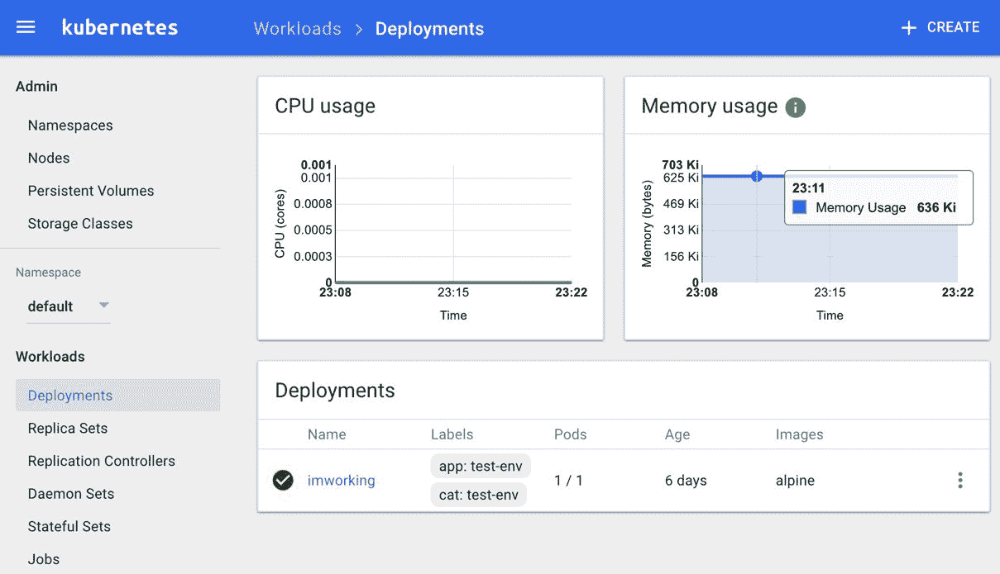
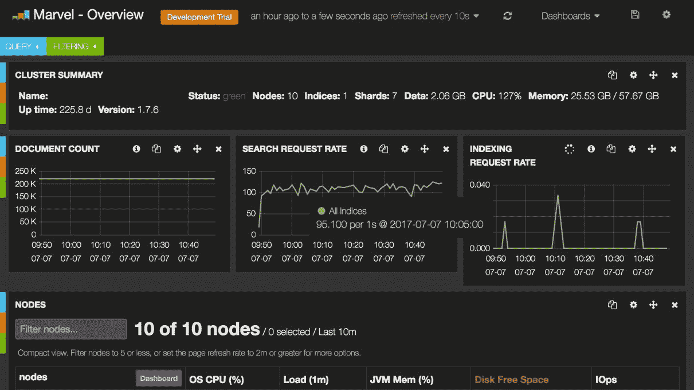
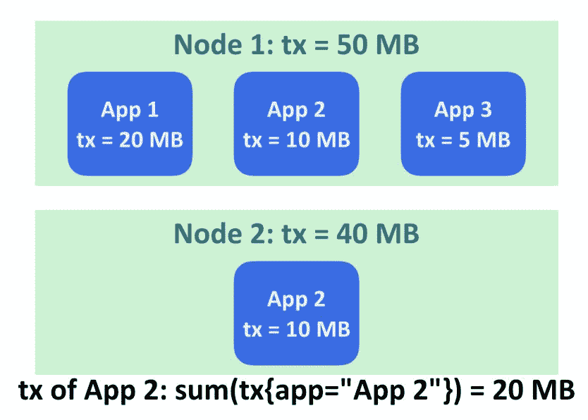
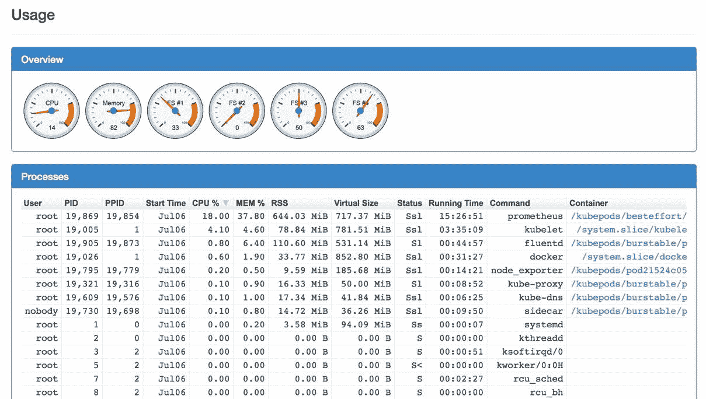
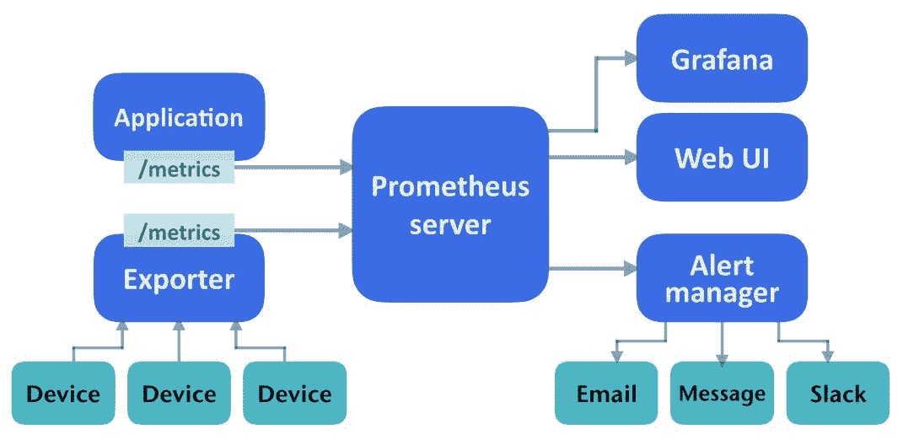
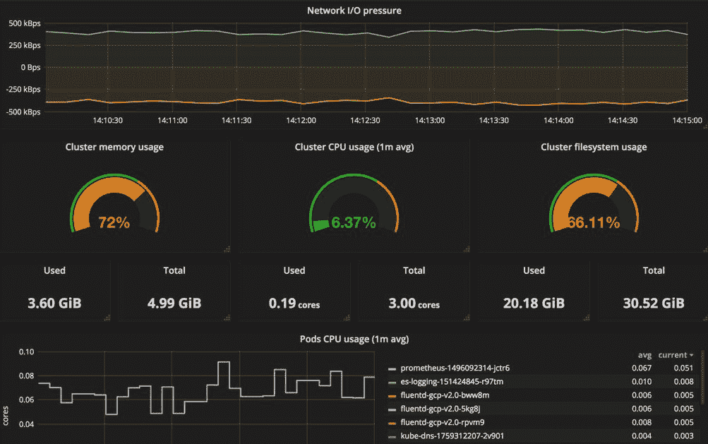
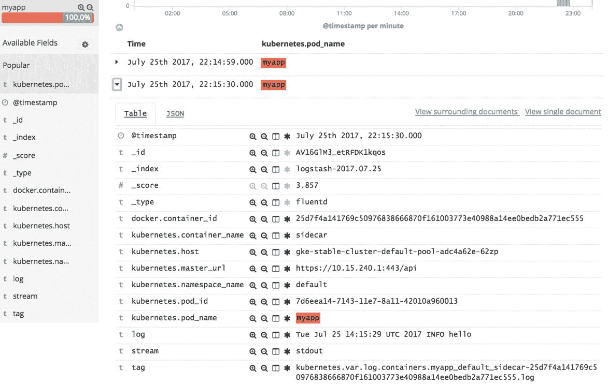
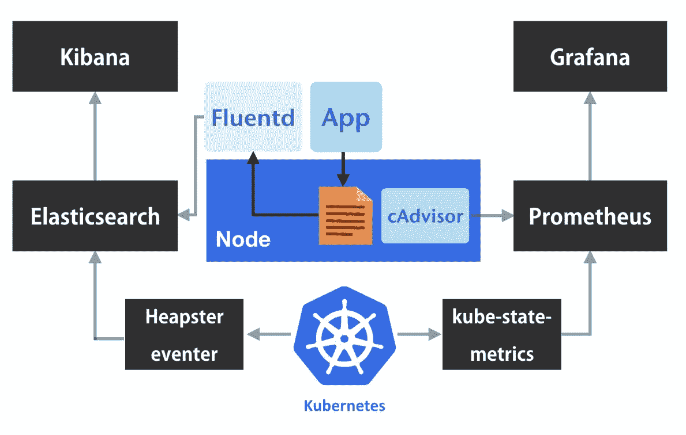

# 第六章：监控和日志记录

监控和日志记录是站点可靠性的重要组成部分。我们已经学会了如何利用各种控制器来管理我们的应用程序，以及如何利用服务和 Ingress 一起为我们的 Web 应用程序提供服务。接下来，在本章中，我们将学习如何通过以下主题跟踪我们的应用程序：

+   获取容器的状态快照

+   Kubernetes 中的监控

+   通过 Prometheus 汇总 Kubernetes 的指标

+   Kubernetes 中日志记录的概念

+   使用 Fluentd 和 Elasticsearch 进行日志记录

# 检查一个容器

每当我们的应用程序表现异常时，我们肯定会想知道发生了什么，通过各种手段，比如检查日志、资源使用情况、进程监视器，甚至直接进入运行的主机来排查问题。在 Kubernetes 中，我们有`kubectl get`和`kubectl describe`可以查询部署状态，这将帮助我们确定应用程序是否已崩溃或按预期工作。

此外，如果我们想要了解应用程序的输出发生了什么，我们还有`kubectl logs`，它将容器的`stdout`重定向到我们的终端。对于 CPU 和内存使用统计，我们还可以使用类似 top 的命令`kubectl top`。`kubectl top node`提供了节点资源使用情况的概览，`kubectl top pod <POD_NAME>`显示了每个 pod 的使用情况：

[PRE0]

要使用`kubectl top`，您需要在集群中部署 Heapster。我们将在本章后面讨论这个问题。

如果我们遗留了一些日志在容器内而没有发送到任何地方怎么办？我们知道有一个`docker exec`在运行的容器内执行命令，但我们不太可能每次都能访问节点。幸运的是，`kubectl`允许我们使用`kubectl exec`命令做同样的事情。它的用法类似于 Docker。例如，我们可以像这样在 pod 中的容器内运行一个 shell：

[PRE1]

这与通过 SSH 登录主机几乎相同，并且它使我们能够使用我们熟悉的工具进行故障排除，就像我们在非容器世界中所做的那样。

# Kubernetes 仪表板

除了命令行实用程序之外，还有一个仪表板，它在一个体面的 Web-UI 上汇总了我们刚刚讨论的几乎所有信息：

实际上，它是 Kubernetes 集群的通用图形用户界面，因为它还允许我们创建、编辑和删除资源。部署它非常容易；我们所需要做的就是应用一个模板：

[PRE2]

此模板适用于启用了**RBAC**（基于角色的访问控制）的 Kubernetes 集群。如果您需要其他部署选项，请查看仪表板的项目存储库（[`github.com/kubernetes/dashboard`](https://github.com/kubernetes/dashboard)）。关于 RBAC，我们将在第八章中讨论，*集群管理*。许多托管的 Kubernetes 服务（例如 Google 容器引擎）在集群中预先部署了仪表板，因此我们不需要自行安装。要确定仪表板是否存在于我们的集群中，请使用`kubectl cluster-info`。

如果已安装，我们将看到 kubernetes-dashboard 正在运行...。使用默认模板部署的仪表板服务或由云提供商提供的服务通常是 ClusterIP。为了访问它，我们需要在我们的终端和 Kubernetes 的 API 服务器之间建立代理，使用`kubectl proxy`。一旦代理启动，我们就能够在`http://localhost:8001/ui`上访问仪表板。端口`8001`是`kubectl proxy`的默认端口。

与`kubectl top`一样，您需要在集群中部署 Heapster 才能查看 CPU 和内存统计信息。

# Kubernetes 中的监控

由于我们现在知道如何在 Kubernetes 中检查我们的应用程序，所以我们应该有一种机制来不断地这样做，以便在第一次发生任何事件时检测到。换句话说，我们需要一个监控系统。监控系统从各种来源收集指标，存储和分析接收到的数据，然后响应异常。在应用程序监控的经典设置中，我们至少会从基础设施的三个不同层面收集指标，以确保我们服务的可用性和质量。

# 应用程序

我们在这个层面关心的数据涉及应用程序的内部状态，这可以帮助我们确定服务内部发生了什么。例如，以下截图来自 Elasticsearch Marvel（[`www.elastic.co/guide/en/marvel/current/introduction.html`](https://www.elastic.co/guide/en/marvel/current/introduction.html)），从版本 5 开始称为**监控**，这是 Elasticsearch 集群的监控解决方案。它汇集了关于我们集群的信息，特别是 Elasticsearch 特定的指标：

此外，我们将利用性能分析工具与跟踪工具来对我们的程序进行仪器化，这增加了我们检查服务的细粒度维度。特别是在当今，一个应用可能以分布式方式由数十个服务组成。如果不使用跟踪工具，比如 OpenTracing（[`opentracing.io`](http://opentracing.io)）的实现，要识别性能问题可能会非常困难。

# 主机

在主机级别收集任务通常是由监控框架提供的代理完成的。代理提取并发送有关主机的全面指标，如负载、磁盘、连接或进程状态等，以帮助确定主机的健康状况。

# 外部资源

除了上述两个组件之外，我们还需要检查依赖组件的状态。例如，假设我们有一个消耗队列并执行相应任务的应用；我们还应该关注一些指标，比如队列长度和消耗速率。如果消耗速率低而队列长度不断增长，我们的应用可能遇到了问题。

这些原则也适用于 Kubernetes 上的容器，因为在主机上运行容器几乎与运行进程相同。然而，由于 Kubernetes 上的容器和传统主机上利用资源的方式之间存在微妙的区别，当采用监控策略时，我们仍需要考虑这些差异。例如，Kubernetes 上的应用的容器可能分布在多个主机上，并且也不总是在同一主机上。如果我们仍在采用以主机为中心的监控方法，要对一个应用进行一致的记录将会非常困难。因此，我们不应该仅观察主机级别的资源使用情况，而应该在我们的监控堆栈中增加一个容器层。此外，由于 Kubernetes 实际上是我们应用的基础设施，我们绝对应该考虑它。

# 容器

正如前面提到的，容器级别收集的指标和主机级别得到的指标基本上是相同的，特别是系统资源的使用情况。尽管看起来有些多余，但这正是帮助我们解决监控移动容器困难的关键。这个想法非常简单：我们需要将逻辑信息附加到指标上，比如 pod 标签或它们的控制器名称。这样，来自不同主机上的容器的指标可以被有意义地分组。考虑下面的图表；假设我们想知道**App 2**上传输的字节数（**tx**），我们可以对**App 2**标签上的**tx**指标求和，得到**20 MB**：

另一个区别是，CPU 限制的指标仅在容器级别上报告。如果在某个应用程序遇到性能问题，但主机上的 CPU 资源是空闲的，我们可以检查是否受到了相关指标的限制。

# Kubernetes

Kubernetes 负责管理、调度和编排我们的应用程序。因此，一旦应用程序崩溃，Kubernetes 肯定是我们想要查看的第一个地方。特别是在部署新版本后发生崩溃时，相关对象的状态将立即在 Kubernetes 上反映出来。

总之，应该监控的组件如下图所示：

# 获取 Kubernetes 的监控要点

对于监控堆栈的每一层，我们总是可以找到相应的收集器。例如，在应用程序级别，我们可以手动转储指标；在主机级别，我们会在每个主机上安装一个指标收集器；至于 Kubernetes，有用于导出我们感兴趣的指标的 API，至少我们手头上有`kubectl`。

当涉及到容器级别的收集器时，我们有哪些选择？也许在我们的应用程序镜像中安装主机指标收集器可以胜任，但我们很快就会意识到，这可能会使我们的容器在大小和资源利用方面变得过于笨重。幸运的是，已经有了针对这种需求的解决方案，即 cAdvisor（[`github.com/google/cadvisor`](https://github.com/google/cadvisor)），这是容器级别的指标收集器的答案。简而言之，cAdvisor 汇总了机器上每个运行容器的资源使用情况和性能统计。请注意，cAdvisor 的部署是每个主机一个，而不是每个容器一个，这对于容器化应用程序来说更为合理。在 Kubernetes 中，我们甚至不需要关心部署 cAdvisor，因为它已经嵌入到 kubelet 中。

cAdvisor 可以通过每个节点的端口`4194`访问。在 Kubernetes 1.7 之前，cAdvisor 收集的数据也可以通过 kubelet 端口（`10250`/`10255`）进行收集。要访问 cAdvisor，我们可以通过实例端口`4194`或通过`kubectl proxy`在`http://localhost:8001/api/v1/nodes/<nodename>:4194/proxy/`访问，或直接访问`http://<node-ip>:4194/`。

以下截图是来自 cAdvisor Web UI。一旦连接，您将看到类似的页面。要查看 cAdvisor 抓取的指标，请访问端点`/metrics`。

>

监控管道中的另一个重要组件是 Heapster（[`github.com/kubernetes/heapster`](https://github.com/kubernetes/heapster)）。它从每个节点检索监控统计信息，特别是处理节点上的 kubelet，并在之后写入外部接收器。它还通过 REST API 公开聚合指标。Heapster 的功能听起来与 cAdvisor 有些多余，但在实践中它们在监控管道中扮演不同的角色。Heapster 收集集群范围的统计信息；cAdvisor 是一个主机范围的组件。也就是说，Heapster 赋予 Kubernetes 集群基本的监控能力。以下图表说明了它如何与集群中的其他组件交互：

事实上，如果您的监控框架提供了类似的工具，也可以从 kubelet 中抓取指标，那么安装 Heapster 就不是必需的。然而，由于它是 Kubernetes 生态系统中的默认监控组件，许多工具都依赖于它，例如前面提到的 `kubectl top` 和 Kubernetes 仪表板。

在部署 Heapster 之前，请检查您正在使用的监控工具是否作为此文档中的 Heapster sink 支持：[`github.com/kubernetes/heapster/blob/master/docs/sink-configuration.md`](https://github.com/kubernetes/heapster/blob/master/docs/sink-configuration.md)。

如果没有，我们可以使用独立的设置，并通过应用此模板使仪表板和 `kubectl top` 工作：

[PRE3]

如果启用了 RBAC，请记得应用此模板：

[PRE4]

安装完 Heapster 后，`kubectl top` 命令和 Kubernetes 仪表板应该正确显示资源使用情况。

虽然 cAdvisor 和 Heapster 关注物理指标，但我们也希望在监控仪表板上显示对象的逻辑状态。kube-state-metrics ([`github.com/kubernetes/kube-state-metrics`](https://github.com/kubernetes/kube-state-metrics)) 是完成我们监控堆栈的重要组成部分。它监视 Kubernetes 主节点，并将我们从 `kubectl get` 或 `kubectl describe` 中看到的对象状态转换为 Prometheus 格式的指标 ([`prometheus.io/docs/instrumenting/exposition_formats/`](https://prometheus.io/docs/instrumenting/exposition_formats/))。只要监控系统支持这种格式，我们就可以将状态抓取到指标存储中，并在诸如无法解释的重启计数等事件上收到警报。要安装 kube-state-metrics，首先在项目存储库的 `kubernetes` 文件夹中下载模板([`github.com/kubernetes/kube-state-metrics/tree/master/kubernetes`](https://github.com/kubernetes/kube-state-metrics/tree/master/kubernetes))，然后应用它们：

[PRE5]

之后，我们可以在其服务端点的指标中查看集群内的状态：

`http://kube-state-metrics.kube-system:8080/metrics`

# 实际监控

到目前为止，我们已经学到了很多关于在 Kubernetes 中制造一个无懈可击的监控系统的原则，现在是时候实施一个实用的系统了。因为绝大多数 Kubernetes 组件都在 Prometheus 格式的传统路径上公开了他们的仪表盘指标，所以只要工具理解这种格式，我们就可以自由地使用我们熟悉的任何监控工具。在本节中，我们将使用一个开源项目 Prometheus（[`prometheus.io`](https://prometheus.io)）来设置一个示例，它是一个独立于平台的监控工具。它在 Kubernetes 生态系统中的流行不仅在于其强大性，还在于它得到了**Cloud Native Computing Foundation**（[`www.cncf.io/`](https://www.cncf.io/)）的支持，后者也赞助了 Kubernetes 项目。

# 遇见 Prometheus

Prometheus 框架包括几个组件，如下图所示：

与所有其他监控框架一样，Prometheus 依赖于从系统组件中抓取统计数据的代理，这些代理位于图表左侧的出口处。除此之外，Prometheus 采用了拉取模型来收集指标，这意味着它不是被动地接收指标，而是主动地从出口处拉取数据。如果一个应用程序公开了指标的出口，Prometheus 也能够抓取这些数据。默认的存储后端是嵌入式 LevelDB，可以切换到其他远程存储，比如 InfluxDB 或 Graphite。Prometheus 还负责根据预先配置的规则发送警报给**Alert manager**。**Alert manager**负责发送警报任务。它将接收到的警报分组并将它们分发给实际发送消息的工具，比如电子邮件、Slack、PagerDuty 等等。除了警报，我们还希望可视化收集到的指标，以便快速了解我们的系统情况，这时 Grafana 就派上用场了。

# 部署 Prometheus

我们为本章准备的模板可以在这里找到：

[`github.com/DevOps-with-Kubernetes/examples/tree/master/chapter6`](https://github.com/DevOps-with-Kubernetes/examples/tree/master/chapter6)

在 6-1_prometheus 下是本节的清单，包括 Prometheus 部署、导出器和相关资源。它们将在专用命名空间`monitoring`中安装，除了需要在`kube-system`命名空间中工作的组件。请仔细查看它们，现在让我们按以下顺序创建资源。

[PRE6]

资源的使用限制在提供的设置中相对较低。如果您希望以更正式的方式使用它们，建议根据实际要求调整参数。在 Prometheus 服务器启动后，我们可以通过`kubectl port-forward`连接到端口`9090`的 Web-UI。如果相应地修改其服务（`prometheus/prom-svc.yml`），我们可以使用 NodePort 或 Ingress 连接到 UI。当进入 UI 时，我们将看到 Prometheus 的表达式浏览器，在那里我们可以构建查询和可视化指标。在默认设置下，Prometheus 将从自身收集指标。所有有效的抓取目标都可以在路径`/targets`下找到。要与 Prometheus 交流，我们必须对其语言**PromQL**有一些了解。

# 使用 PromQL

PromQL 有三种数据类型：即时向量、范围向量和标量。即时向量是经过采样的数据时间序列；范围向量是一组包含在一定时间范围内的时间序列；标量是一个数值浮点值。存储在 Prometheus 中的指标通过指标名称和标签进行识别，我们可以通过表达式浏览器旁边的下拉列表找到任何收集的指标名称。如果我们使用指标名称，比如`http_requests_total`，我们会得到很多结果，因为即时向量匹配名称但具有不同的标签。同样，我们也可以使用`{}`语法仅查询特定的标签集。例如，查询`{code="400",method="get"}`表示我们想要任何具有标签`code`，`method`分别等于`400`和`get`的指标。在查询中结合名称和标签也是有效的，比如`http_requests_total{code="400",method="get"}`。PromQL 赋予了我们检查应用程序或系统的侦探能力，只要相关指标被收集。

除了刚才提到的基本查询之外，PromQL 还有很多其他内容，比如使用正则表达式和逻辑运算符查询标签，使用函数连接和聚合指标，甚至在不同指标之间执行操作。例如，以下表达式给出了`kube-system`命名空间中`kube-dns`部署消耗的总内存：

[PRE7]

更详细的文档可以在 Prometheus 的官方网站找到（[`prometheus.io/docs/querying/basics/`](https://prometheus.io/docs/querying/basics/)），它肯定会帮助您释放 Prometheus 的力量。

# 在 Kubernetes 中发现目标

由于 Prometheus 只从它知道的端点中提取指标，我们必须明确告诉它我们想要从哪里收集数据。在路径`/config`下是列出当前配置的目标以进行提取的页面。默认情况下，会有一个任务来收集有关 Prometheus 本身的当前指标，它位于传统的抓取路径`/metrics`中。如果连接到端点，我们会看到一个非常长的文本页面：

[PRE8]

这只是我们已经多次提到的 Prometheus 指标格式。下次当我们看到这样的页面时，我们会知道这是一个指标端点。

抓取 Prometheus 的默认作业被配置为静态目标。然而，考虑到 Kubernetes 中的容器是动态创建和销毁的事实，要找出容器的确切地址，更不用说在 Prometheus 上设置它，真的很麻烦。在某些情况下，我们可以利用服务 DNS 作为静态指标目标，但这仍然不能解决所有情况。幸运的是，Prometheus 通过其发现 Kubernetes 内部服务的能力帮助我们克服了这个问题。

更具体地说，它能够查询 Kubernetes 有关正在运行的服务的信息，并根据情况将其添加或删除到目标配置中。目前支持四种发现机制：

+   **节点**发现模式为每个节点创建一个目标，默认情况下目标端口将是 kubelet 的端口。

+   **服务**发现模式为每个`service`对象创建一个目标，并且服务中定义的所有端口都将成为抓取目标。

+   **pod**发现模式的工作方式与服务发现角色类似，也就是说，它为每个 pod 创建目标，并且对于每个 pod，它会公开所有定义的容器端口。如果在 pod 的模板中没有定义端口，它仍然会只创建一个带有其地址的抓取目标。

+   **端点**模式发现了由服务创建的`endpoint`对象。例如，如果一个服务由三个具有两个端口的 pod 支持，那么我们将有六个抓取目标。此外，对于一个 pod，不仅会发现暴露给服务的端口，还会发现其他声明的容器端口。

以下图表说明了四种发现机制：左侧是 Kubernetes 中的资源，右侧是 Prometheus 中创建的目标：

一般来说，并非所有暴露的端口都作为指标端点提供服务，因此我们当然不希望 Prometheus 抓取集群中的所有内容，而只收集标记的资源。为了实现这一点，Prometheus 利用资源清单上的注释来区分哪些目标应该被抓取。注释格式如下：

+   **在 pod 上**：如果一个 pod 是由 pod 控制器创建的，请记住在 pod 规范中设置 Prometheus 注释，而不是在 pod 控制器中：

+   `prometheus.io/scrape`：`true`表示应该拉取此 pod。

+   `prometheus.io/path`：将此注释设置为公开指标的路径；只有在目标 pod 使用除`/metrics`之外的路径时才需要设置。

+   `prometheus.io/port`：如果定义的端口与实际指标端口不同，请使用此注释进行覆盖。

+   **在服务上**：由于端点大多数情况下不是手动创建的，端点发现使用从服务继承的注释。也就是说，服务上的注释同时影响服务和端点发现模式。因此，我们将使用`prometheus.io/scrape: 'true'`来表示由服务创建的端点应该被抓取，并使用`prometheus.io/probe: 'true'`来标记具有指标的服务。此外，`prometheus.io/scheme`指定了使用`http`还是`https`。除此之外，路径和端口注释在这里也起作用。

以下模板片段指示了 Prometheus 的端点发现角色，但选择在`9100/prom`上创建目标的服务发现角色。

[PRE9]

我们的示例存储库中的模板`prom-config-k8s.yml`包含了为 Prometheus 发现 Kubernetes 资源的配置。使用以下命令应用它：

[PRE10]

因为它是一个 ConfigMap，需要几秒钟才能变得一致。之后，通过向进程发送`SIGHUP`来重新加载 Prometheus：

[PRE11]

提供的模板基于 Prometheus 官方存储库中的示例；您可以在这里找到更多用法：

[`github.com/prometheus/prometheus/blob/master/documentation/examples/prometheus-kubernetes.yml`](https://github.com/prometheus/prometheus/blob/master/documentation/examples/prometheus-kubernetes.yml)

此外，文档页面详细描述了 Prometheus 配置的工作原理：

[`prometheus.io/docs/operating/configuration/`](https://prometheus.io/docs/operating/configuration/)

# 从 Kubernetes 中收集数据

现在，实施之前在 Prometheus 中讨论的五个监控层的步骤已经非常清晰：安装导出器，使用适当的标签对其进行注释，然后在自动发现的端点上收集它们。

Prometheus 中的主机层监控是由节点导出器（[`github.com/prometheus/node_exporter`](https://github.com/prometheus/node_exporter)）完成的。它的 Kubernetes 清单可以在本章的示例中找到，其中包含一个带有抓取注释的 DaemonSet。使用以下命令安装它：

[PRE12]

其相应的配置将由 pod 发现角色创建。

容器层收集器应该是 cAdvisor，并且已经安装在 kubelet 中。因此，发现它并使用节点模式是我们需要做的唯一的事情。

Kubernetes 监控是由 kube-state-metrics 完成的，之前也有介绍。更好的是，它带有 Prometheus 注释，这意味着我们无需进行任何额外的配置。

到目前为止，我们已经基于 Prometheus 建立了一个强大的监控堆栈。关于应用程序和外部资源的监控，Prometheus 生态系统中有大量的导出器来支持监控系统内部的各种组件。例如，如果我们需要我们的 MySQL 数据库的统计数据，我们可以安装 MySQL Server Exporter（[`github.com/prometheus/mysqld_exporter`](https://github.com/prometheus/mysqld_exporter)），它提供了全面和有用的指标。

除了已经描述的那些指标之外，还有一些来自 Kubernetes 组件的其他有用的指标，在各种方面起着重要作用：

+   **Kubernetes API 服务器**：API 服务器在`/metrics`上公开其状态，并且此目标默认启用。

+   **kube-controller-manager**：这个组件在端口`10252`上公开指标，但在一些托管的 Kubernetes 服务上是不可见的，比如**Google Container Engine**（**GKE**）。如果您在自托管的集群上，应用"`kubernetes/self/kube-controller-manager-metrics-svc.yml`"会为 Prometheus 创建端点。

+   **kube-scheduler**：它使用端口`10251`，在 GKE 集群上也是不可见的。"`kubernetes/self/kube-scheduler-metrics-svc.yml`"是创建一个指向 Prometheus 的目标的模板。

+   **kube-dns**：kube-dns pod 中有两个容器，`dnsmasq`和`sky-dns`，它们的指标端口分别是`10054`和`10055`。相应的模板是`kubernetes/self/ kube-dns-metrics-svc.yml`。

+   **etcd**：etcd 集群也在端口`4001`上有一个 Prometheus 指标端点。如果您的 etcd 集群是自托管的并由 Kubernetes 管理，您可以将"`kubernetes/self/etcd-server.yml`"作为参考。

+   **Nginx ingress controller**：nginx 控制器在端口`10254`发布指标。但是这些指标只包含有限的信息。要获取诸如按主机或路径计算的连接计数等数据，您需要在控制器中激活`vts`模块以增强收集的指标。

# 使用 Grafana 查看指标

表达式浏览器有一个内置的图形面板，使我们能够看到可视化的指标，但它并不是设计用来作为日常例行工作的可视化仪表板。Grafana 是 Prometheus 的最佳选择。我们已经在第四章中讨论了如何设置 Grafana，*与存储和资源一起工作*，我们还为本章提供了模板；这两个选项都能胜任工作。

要在 Grafana 中查看 Prometheus 指标，我们首先必须添加一个数据源。连接到我们的 Prometheus 服务器需要以下配置：

+   类型："Prometheus"

+   网址：`http://prometheus-svc.monitoring:9090`

+   访问：代理

一旦连接上，我们就可以导入一个仪表板来看到实际的情况。在 Grafana 的共享页面（[`grafana.com/dashboards?dataSource=prometheus`](https://grafana.com/dashboards?dataSource=prometheus)）上有丰富的现成仪表板。以下截图来自仪表板`#1621`：

因为图形是由 Prometheus 的数据绘制的，只要我们掌握 PromQL，我们就能绘制任何我们关心的数据。

# 记录事件

使用系统状态的定量时间序列进行监控，能够迅速查明系统中哪些组件出现故障，但仍然不足以诊断出症候的根本原因。因此，一个收集、持久化和搜索日志的日志系统对于通过将事件与检测到的异常相关联来揭示出出现问题的原因是非常有帮助的。

一般来说，日志系统中有两个主要组件：日志代理和日志后端。前者是一个程序的抽象层。它收集、转换和分发日志到日志后端。日志后端存储接收到的所有日志。与监控一样，为 Kubernetes 构建日志系统最具挑战性的部分是确定如何从容器中收集日志到集中的日志后端。通常有三种方式将日志发送到程序：

+   将所有内容转储到`stdout`/`stderr`

+   编写`log`文件

+   将日志发送到日志代理或直接发送到日志后端；只要我们了解日志流在 Kubernetes 中的流动方式，Kubernetes 中的程序也可以以相同的方式发出日志

# 聚合日志的模式

对于直接向日志代理或后端记录日志的程序，它们是否在 Kubernetes 内部并不重要，因为它们在技术上并不通过 Kubernetes 输出日志。至于其他情况，我们将使用以下两种模式来集中日志。

# 每个节点使用一个日志代理收集日志

我们知道通过`kubectl logs`检索到的消息是从容器的`stdout`/`stderr`重定向的流，但显然使用`kubectl logs`收集日志并不是一个好主意。实际上，`kubectl logs`从 kubelet 获取日志，kubelet 将日志聚合到主机路径`/var/log/containers/`中，从容器引擎下方获取。

因此，在每个节点上设置日志代理并配置它们尾随和转发路径下的`log`文件，这正是我们需要的，以便汇聚运行容器的标准流，如下图所示：

在实践中，我们还会配置一个日志代理来从系统和 Kubernetes 的组件下的`/var/log`中尾随日志，比如在主节点和节点上的：

+   `kube-proxy.log`

+   `kube-apiserver.log`

+   `kube-scheduler.log`

+   `kube-controller-manager.log`

+   `etcd.log`

除了`stdout`/`stderr`之外，如果应用程序的日志以文件形式存储在容器中，并通过`hostPath`卷持久化，节点日志代理可以将它们传递给节点。然而，对于每个导出的`log`文件，我们必须在日志代理中自定义它们对应的配置，以便它们可以被正确分发。此外，我们还需要适当命名`log`文件，以防止任何冲突，并自行处理日志轮换，这使得它成为一种不可扩展和不可管理的日志记录机制。

# 运行一个旁路容器来转发日志

有时修改我们的应用程序以将日志写入标准流而不是`log`文件是困难的，我们也不想面对使用`hostPath`卷带来的麻烦。在这种情况下，我们可以运行一个旁路容器来处理一个 pod 内的日志。换句话说，每个应用程序 pod 都将有两个共享相同`emptyDir`卷的容器，以便旁路容器可以跟踪应用程序容器的日志并将它们发送到他们的 pod 外部，如下图所示：

虽然我们不再需要担心管理`log`文件，但是配置每个 pod 的日志代理并将 Kubernetes 的元数据附加到日志条目中仍然需要额外的工作。另一个选择是利用旁路容器将日志输出到标准流，而不是运行一个专用的日志代理，就像下面的 pod 一样；应用容器不断地将消息写入`/var/log/myapp.log`，而旁路容器则在共享卷中跟踪`myapp.log`。

[PRE13]

现在我们可以使用`kubectl logs`查看已写入的日志：

[PRE14]

# 摄取 Kubernetes 事件

我们在`kubectl describe`的输出中看到的事件消息包含有价值的信息，并补充了 kube-state-metrics 收集的指标，这使我们能够了解我们的 pod 或节点发生了什么。因此，它应该是我们日志记录基本要素的一部分，连同系统和应用程序日志。为了实现这一点，我们需要一些东西来监视 Kubernetes API 服务器，并将事件聚合到日志输出中。而 eventer 正是我们需要的事件处理程序。

Eventer 是 Heapster 的一部分，目前支持 Elasticsearch、InfluxDB、Riemann 和 Google Cloud Logging 作为其输出。Eventer 也可以直接输出到`stdout`，以防我们使用的日志系统不受支持。

部署 eventer 类似于部署 Heapster，除了容器启动命令，因为它们打包在同一个镜像中。每种 sink 类型的标志和选项可以在这里找到：([`github.com/kubernetes/heapster/blob/master/docs/sink-configuration.md`](https://github.com/kubernetes/heapster/blob/master/docs/sink-configuration.md))。

我们为本章提供的示例模板还包括 eventer，并且它已配置为与 Elasticsearch 一起工作。我们将在下一节中进行描述。

# 使用 Fluentd 和 Elasticsearch 进行日志记录

到目前为止，我们已经讨论了我们在现实世界中可能遇到的日志记录的各种条件，现在是时候动手制作一个日志系统，应用我们所学到的知识了。

日志系统和监控系统的架构在某些方面基本相同--收集器、存储和用户界面。我们将要设置的相应组件是 Fluentd/eventer、Elasticsearch 和 Kibana。此部分的模板可以在`6-3_efk`下找到，并且它们将部署到前一部分的命名空间`monitoring`中。

Elasticsearch 是一个强大的文本搜索和分析引擎，这使它成为持久化、处理和分析我们集群中运行的所有日志的理想选择。本章的 Elasticsearch 模板使用了一个非常简单的设置来演示这个概念。如果您想要为生产使用部署 Elasticsearch 集群，建议使用 StatefulSet 控制器，并根据我们在第四章中讨论的适当配置来调整 Elasticsearch。让我们使用以下模板部署 Elasticsearch ([`github.com/DevOps-with-Kubernetes/examples/tree/master/chapter6/6-3_efk/`](https://github.com/DevOps-with-Kubernetes/examples/tree/master/chapter6/6-3_efk/))：

[PRE15]

如果从`es-logging-svc:9200`收到响应，则 Elasticsearch 已准备就绪。

下一步是设置节点日志代理。由于我们会在每个节点上运行它，因此我们肯定希望它在节点资源使用方面尽可能轻量化，因此选择了 Fluentd（[www.fluentd.org](http://www.fluentd.org)）。Fluentd 具有较低的内存占用，这使其成为我们需求的一个有竞争力的日志代理。此外，由于容器化环境中的日志记录要求非常专注，因此有一个类似的项目，Fluent Bit（`fluentbit.io`），旨在通过修剪不会用于其目标场景的功能来最小化资源使用。在我们的示例中，我们将使用 Fluentd 镜像用于 Kubernetes（[`github.com/fluent/fluentd-kubernetes-daemonset`](https://github.com/fluent/fluentd-kubernetes-daemonset)）来执行我们之前提到的第一个日志模式。

该图像已配置为转发容器日志到`/var/log/containers`下，以及某些系统组件的日志到`/var/log`下。如果需要，我们绝对可以进一步定制其日志配置。这里提供了两个模板：`fluentd-sa.yml`是 Fluentd DaemonSet 的 RBAC 配置，`fluentd-ds.yml`是：

[PRE16]

另一个必不可少的日志记录组件是 eventer。这里我们为不同条件准备了两个模板。如果您使用的是已部署 Heapster 的托管 Kubernetes 服务，则在这种情况下使用独立 eventer 的模板`eventer-only.yml`。否则，考虑在同一个 pod 中运行 Heapster 和 eventer 的模板：

[PRE17]

要查看发送到 Elasticsearch 的日志，我们可以调用 Elasticsearch 的搜索 API，但有一个更好的选择，即 Kibana，这是一个允许我们与 Elasticsearch 交互的 Web 界面。Kibana 的模板是`elasticsearch/kibana-logging.yml`，位于[`github.com/DevOps-with-Kubernetes/examples/tree/master/chapter6/6-3_efk/`](https://github.com/DevOps-with-Kubernetes/examples/tree/master/chapter6/6-3_efk/)下。

[PRE18]

在我们的示例中，Kibana 正在监听端口`5601`。在将服务暴露到集群外并使用任何浏览器连接后，您可以开始从 Kubernetes 搜索日志。由 eventer 发送的日志的索引名称是`heapster-*`，而由 Fluentd 转发的日志的索引名称是`logstash-*`。以下截图显示了 Elasticsearch 中日志条目的外观。

该条目来自我们之前的示例`myapp`，我们可以发现该条目已经在 Kubernetes 上附带了方便的元数据标记。

# 从日志中提取指标

我们在 Kubernetes 上构建的围绕我们应用程序的监控和日志系统如下图所示：

监控部分和日志部分看起来像是两条独立的轨道，但日志的价值远不止一堆短文本。它们是结构化数据，并像往常一样带有时间戳；因此，将日志转换为时间序列数据的想法是有前途的。然而，尽管 Prometheus 非常擅长处理时间序列数据，但它无法在没有任何转换的情况下摄取文本。

来自 HTTPD 的访问日志条目如下：

`10.1.8.10 - - [07/Jul/2017:16:47:12 0000] "GET /ping HTTP/1.1" 200 68`。

它包括请求的 IP 地址、时间、方法、处理程序等。如果我们根据它们的含义划分日志段，计数部分就可以被视为一个指标样本，如下所示：`"10.1.8.10": 1, "GET": 1, "/ping": 1, "200": 1`。

诸如 mtail（[`github.com/google/mtail`](https://github.com/google/mtail)）和 Grok Exporter（[`github.com/fstab/grok_exporter`](https://github.com/fstab/grok_exporter)）之类的工具会计算日志条目并将这些数字组织成指标，以便我们可以在 Prometheus 中进一步处理它们。

# 摘要

在本章的开始，我们描述了如何通过内置函数（如`kubectl`）快速获取运行容器的状态。然后，我们扩展了对监控的概念和原则的讨论，包括为什么需要进行监控，要监控什么以及如何进行监控。随后，我们以 Prometheus 为核心构建了一个监控系统，并设置了导出器来收集来自 Kubernetes 的指标。还介绍了 Prometheus 的基础知识，以便我们可以利用指标更好地了解我们的集群以及其中运行的应用程序。在日志部分，我们提到了日志记录的常见模式以及在 Kubernetes 中如何处理它们，并部署了一个 EFK 堆栈来汇聚日志。本章中构建的系统有助于我们服务的可靠性。接下来，我们将继续在 Kubernetes 中建立一个持续交付产品的流水线。
