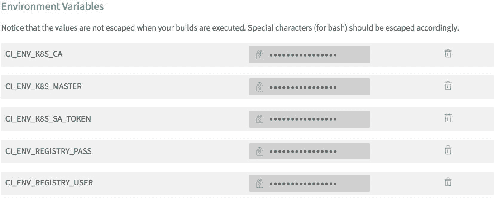
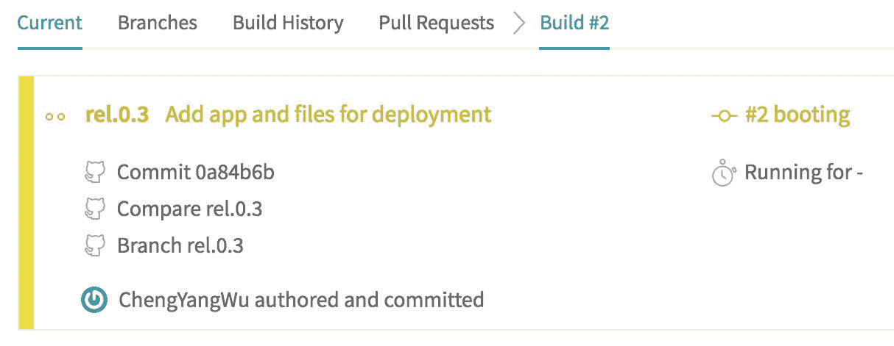
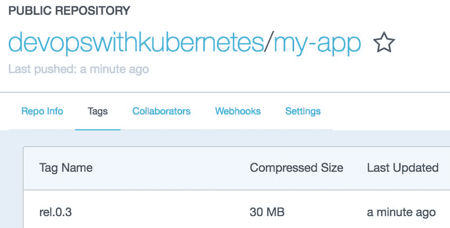
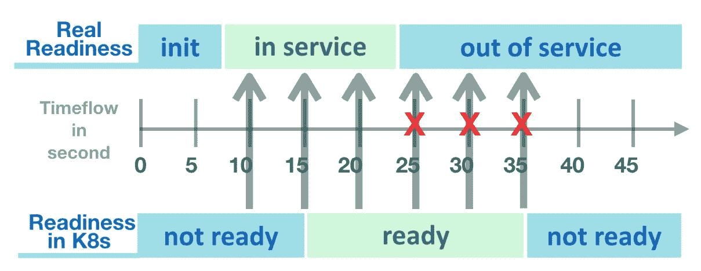
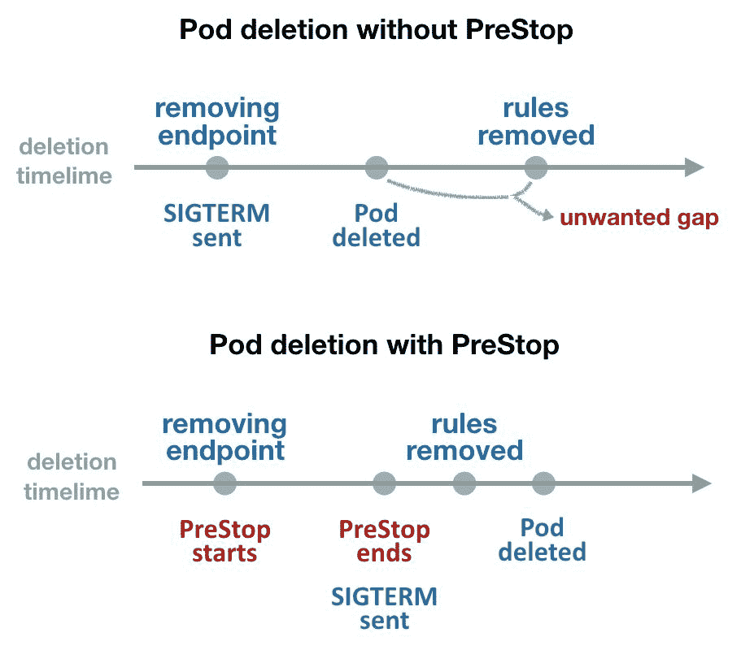

# 第七章：持续交付

到目前为止，我们讨论的主题使我们能够在 Kubernetes 中运行我们的服务。通过监控系统，我们对我们的服务更有信心。我们接下来想要实现的下一件事是如何在 Kubernetes 中持续交付我们的最新功能和改进我们的服务，并且我们将在本章的以下主题中学习它：

+   更新 Kubernetes 资源

+   建立交付流水线

+   改进部署过程的技术

# 更新资源

持续交付的属性就像我们在第一章中描述的那样，是一组操作，包括**持续集成**（**CI**）和随后的部署任务。CI 流程包括版本控制系统、构建和不同级别的自动化测试等元素。实现 CI 功能的工具通常位于应用程序层，可以独立于基础架构，但是在实现部署时，由于部署任务与我们的应用程序运行的平台紧密相关，理解和处理基础架构是不可避免的。在软件运行在物理或虚拟机上的环境中，我们会利用配置管理工具、编排器和脚本来部署我们的软件。然而，如果我们在像 Heroku 这样的应用平台上运行我们的服务，甚至是在无服务器模式下，设计部署流水线将是完全不同的故事。总之，部署任务的目标是确保我们的软件在正确的位置正常工作。在 Kubernetes 中，这涉及如何正确更新资源，特别是 Pod。

# 触发更新

在第三章中，*开始使用 Kubernetes*，我们已经讨论了部署中 Pod 的滚动更新机制。让我们回顾一下在更新过程触发后会发生什么：

1.  部署根据更新后的清单创建一个新的`ReplicaSet`，其中包含`0`个 Pod。

1.  新的`ReplicaSet`逐渐扩展，同时先前的`ReplicaSet`不断缩小。

1.  所有旧的 Pod 被替换后，该过程结束。

Kubernetes 会自动完成这样的机制，使我们免于监督更新过程。要触发它，我们只需要通知 Kubernetes 更新 Deployment 的 pod 规范，也就是修改 Kubernetes 中一个资源的清单。假设我们有一个 Deployment `my-app`（请参阅本节示例目录下的`ex-deployment.yml`），我们可以使用`kubectl`的子命令修改清单如下：

+   `kubectl patch`：根据输入的 JSON 参数部分地修补对象的清单。如果我们想将`my-app`的镜像从`alpine:3.5`更新到`alpine:3.6`，可以这样做：

[PRE0]

+   `kubectl set`：更改对象的某些属性。这是直接更改某些属性的快捷方式，其中支持的属性之一是 Deployment 的镜像：

[PRE1]

+   `kubectl edit`：打开编辑器并转储当前的清单，以便我们可以进行交互式编辑。修改后的清单在保存后立即生效。

+   `kubectl replace`：用另一个提交的模板文件替换一个清单。如果资源尚未创建或包含无法更改的属性，则会产生错误。例如，在我们的示例模板`ex-deployment.yml`中有两个资源，即 Deployment `my-app`及其 Service `my-app-svc`。让我们用一个新的规范文件替换它们：

[PRE2]

替换后，即使结果符合预期，我们会看到错误代码为`1`，也就是说，更新的是 Deployment 而不是 Service。特别是在为 CI/CD 流程编写自动化脚本时，应该注意这种行为。

+   `kubectl apply`：无论如何都应用清单文件。换句话说，如果资源存在于 Kubernetes 中，则会被更新，否则会被创建。当使用`kubectl apply`创建资源时，其功能大致相当于`kubectl create --save-config`。应用的规范文件将相应地保存到注释字段`kubectl.kubernetes.io/last-applied-configuration`中，我们可以使用子命令`edit-last-applied`、`set-last-applied`和`view-last-applied`来操作它。例如，我们可以查看之前提交的模板，无论`ex-deployment.yml`的实际内容如何。

[PRE3]

保存的清单信息将与我们发送的完全相同，不同于通过`kubectl get -o yaml/json`检索的清单，后者包含对象的实时状态，以及规范。

尽管在本节中我们只关注操作部署，但这里的命令也适用于更新所有其他 Kubernetes 资源，如 Service、Role 等。

对 `ConfigMap` 和 secret 的更改通常需要几秒钟才能传播到 pods。

与 Kubernetes 的 API 服务器进行交互的推荐方式是使用 `kubectl`。如果您处于受限制的环境中，还可以使用 REST API 来操作 Kubernetes 的资源。例如，我们之前使用的 `kubectl patch` 命令将变为如下所示：

[PRE4]

这里的变量 `$KUBEAPI` 是 API 服务器的端点。有关更多信息，请参阅 API 参考：[`kubernetes.io/docs/api-reference/v1.7/`](https://kubernetes.io/docs/api-reference/v1.7/)。

# 管理部署

一旦触发了滚动更新过程，Kubernetes 将在幕后默默完成所有任务。让我们进行一些实际的实验。同样，即使我们使用了之前提到的命令修改了一些内容，滚动更新过程也不会被触发，除非相关的 pod 规范发生了变化。我们准备的示例是一个简单的脚本，它会响应任何请求并显示其主机名和其运行的 Alpine 版本。我们首先创建 Deployment，并在另一个终端中不断检查其响应：

[PRE5]

现在我们将其图像更改为另一个版本，看看响应是什么：

[PRE6]

来自版本 3.5 和 3.6 的消息在更新过程结束之前交错显示。为了立即确定来自 Kubernetes 的更新进程状态，而不是轮询服务端点，有 `kubectl rollout` 用于管理滚动更新过程，包括检查正在进行的更新的进度。让我们看看使用子命令 `status` 进行的滚动更新的操作：

[PRE7]

此时，终端 #2 的输出应该全部来自版本 3.6。子命令 `history` 允许我们审查 `deployment` 的先前更改：

[PRE8]

然而，`CHANGE-CAUSE` 字段没有显示任何有用的信息，帮助我们了解修订的详细信息。为了利用它，在导致更改的每个命令之后添加一个标志 `--record`，就像我们之前介绍的那样。当然，`kubectl create` 也支持记录标志。

让我们对部署进行一些更改，比如修改`my-app`的 pod 的环境变量`DEMO`。由于这会导致 pod 规范的更改，部署将立即开始。这种行为允许我们触发更新而无需构建新的镜像。为了简单起见，我们使用`patch`来修改变量：

[PRE9]

`REVISION 3`的`CHANGE-CAUSE`清楚地记录了提交的命令。尽管如此，只有命令会被记录下来，这意味着任何通过`edit`/`apply`/`replace`进行的修改都不会被明确标记。如果我们想获取以前版本的清单，只要我们的更改是通过`apply`进行的，我们就可以检索保存的配置。

出于各种原因，有时我们希望回滚我们的应用，即使部署在一定程度上是成功的。可以通过子命令`undo`来实现：

[PRE10]

整个过程基本上与更新是相同的，即应用先前的清单，然后执行滚动更新。此外，我们可以利用标志`--to-revision=<REVISION#>`回滚到特定版本，但只有保留的修订版本才能回滚。Kubernetes 根据部署对象中的`revisionHistoryLimit`参数确定要保留多少修订版本。

更新的进度由`kubectl rollout pause`和`kubectl rollout resume`控制。正如它们的名称所示，它们应该成对使用。部署的暂停不仅意味着停止正在进行的部署，还意味着冻结任何滚动更新，即使规范被修改，除非它被恢复。

# 更新 DaemonSet 和 StatefulSet

Kubernetes 支持各种方式来编排不同类型的工作负载的 pod。除了部署外，还有`DaemonSet`和`StatefulSet`用于长时间运行的非批处理工作负载。由于它们生成的 pod 比部署有更多的约束，我们应该了解处理它们的更新时的注意事项

# DaemonSet

`DaemonSet`是一个专为系统守护程序设计的控制器，正如其名称所示。因此，`DaemonSet`在每个节点上启动和维护一个 Pod，也就是说，`DaemonSet`的总 Pod 数量符合集群中节点的数量。由于这种限制，更新`DaemonSet`不像更新 Deployment 那样直接。例如，Deployment 有一个`maxSurge`参数（`.spec.strategy.rollingUpdate.maxSurge`），用于控制更新期间可以创建多少超出所需数量的冗余 Pod。但是我们不能对`DaemonSet`的 Pod 采用相同的策略，因为`DaemonSet`通常占用主机的资源，如端口。如果在一个节点上同时有两个或更多的系统 Pod，可能会导致错误。因此，更新的形式是在主机上终止旧的 Pod 后创建一个新的 Pod。

Kubernetes 为`DaemonSet`实现了两种更新策略，即`OnDelete`和`rollingUpdate`。一个示例演示了如何编写`DaemonSet`的模板，位于`7-1_updates/ex-daemonset.yml`。更新策略设置在路径`.spec.updateStrategy.type`处，默认情况下在 Kubernetes 1.7 中为`OnDelete`，在 Kubernetes 1.8 中变为`rollingUpdate`：

+   `OnDelete`：只有在手动删除 Pod 后才会更新。

+   `rollingUpdate`：它实际上的工作方式类似于`OnDelete`，但是 Kubernetes 会自动执行 Pod 的删除。有一个可选参数`.spec.updateStrategy.rollingUpdate.maxUnavailable`，类似于 Deployment 中的参数。其默认值为`1`，这意味着 Kubernetes 会逐个节点替换一个 Pod。

滚动更新过程的触发与 Deployment 的相同。此外，我们还可以利用`kubectl rollout`来管理`DaemonSet`的滚动更新。但是不支持`pause`和`resume`。

`DaemonSet`的滚动更新仅适用于 Kubernetes 1.6 及以上版本。

# StatefulSet

`StatefulSet`和`DaemonSet`的更新方式基本相同——它们在更新期间不会创建冗余的 Pod，它们的更新策略也表现出类似的行为。在`7-1_updates/ex-statefulset.yml`中还有一个模板文件供练习。更新策略的选项设置在路径`.spec.updateStrategy.type`处：

+   `OnDelete`：只有在手动删除 Pod 后才会更新。

+   `rollingUpdate`：像每次滚动更新一样，Kubernetes 以受控的方式删除和创建 Pod。但是 Kubernetes 知道在`StatefulSet`中顺序很重要，所以它会按照相反的顺序替换 Pod。假设我们在`StatefulSet`中有三个 Pod，它们分别是`my-ss-0`、`my-ss-1`、`my-ss-2`。然后更新顺序从`my-ss-2`开始到`my-ss-0`。删除过程不遵守 Pod 管理策略，也就是说，即使我们将 Pod 管理策略设置为`Parallel`，更新仍然会逐个执行。

类型`rollingUpdate`的唯一参数是分区（`.spec.updateStrategy.rollingUpdate.partition`）。如果指定了分区，任何序数小于分区号的 Pod 将保持其当前版本，不会被更新。例如，在具有 3 个 Pod 的`StatefulSet`中将其设置为 1，只有 pod-1 和 pod-2 会在发布后进行更新。该参数允许我们在一定程度上控制进度，特别适用于等待数据同步、使用金丝雀进行测试发布，或者我们只是想分阶段进行更新。

Pod 管理策略和滚动更新是 Kubernetes 1.7 及更高版本中实现的两个功能。

# 构建交付流水线

为容器化应用程序实施持续交付流水线非常简单。让我们回顾一下到目前为止我们对 Docker 和 Kubernetes 的学习，并将它们组织成 CD 流水线。假设我们已经完成了我们的代码、Dockerfile 和相应的 Kubernetes 模板。要将它们部署到我们的集群，我们需要经历以下步骤：

1.  `docker build`：生成一个可执行的不可变构件。

1.  `docker run`：验证构建是否通过了一些简单的测试。

1.  `docker tag`：如果构建成功，为其打上有意义的版本标签。

1.  `docker push`：将构建移动到构件存储库以进行分发。

1.  `kubectl apply`：将构建部署到所需的环境中。

1.  `kubectl rollout status`：跟踪部署任务的进展。

这就是一个简单但可行的交付流水线。

# 选择工具

为了使流水线持续交付构建，我们至少需要三种工具，即版本控制系统、构建服务器和用于存储容器构件的存储库。在本节中，我们将基于前几章介绍的 SaaS 工具设置一个参考 CD 流水线。它们是*GitHub* ([`github.com`](https://github.com))、*Travis CI* ([`travis-ci.org`](https://travis-ci.org))和*Docker Hub* ([`hub.docker.com`](https://hub.docker.com))，它们都对开源项目免费。我们在这里使用的每个工具都有许多替代方案，比如 GitLab 用于 VCS，或者托管 Jenkins 用于 CI。以下图表是基于前面三个服务的 CD 流程：

>

工作流程始于将代码提交到 GitHub 上的存储库，提交将调用 Travis CI 上的构建作业。我们的 Docker 镜像是在这个阶段构建的。同时，我们经常在 CI 服务器上运行不同级别的测试，以确保构建的质量稳固。此外，由于使用 Docker Compose 或 Kubernetes 运行应用程序堆栈比以往任何时候都更容易，我们能够在构建作业中运行涉及许多组件的测试。随后，经过验证的镜像被打上标识并推送到公共 Docker Registry 服务 Docker Hub。

我们的流水线中没有专门用于部署任务的块。相反，我们依赖 Travis CI 来部署我们的构建。事实上，部署任务仅仅是在镜像推送后，在某些构建上应用 Kubernetes 模板。最后，在 Kubernetes 的滚动更新过程结束后，交付就完成了。

# 解释的步骤

我们的示例`my-app`是一个不断回显`OK`的 Web 服务，代码以及部署文件都提交在我们在 GitHub 上的存储库中：([`github.com/DevOps-with-Kubernetes/my-app`](https://github.com/DevOps-with-Kubernetes/my-app))。

在配置 Travis CI 上的构建之前，让我们首先在 Docker Hub 上创建一个镜像存储库以备后用。登录 Docker Hub 后，点击右上角的 Create Repository，然后按照屏幕上的步骤创建一个。用于推送和拉取的`my-app`镜像注册表位于`devopswithkubernetes/my-app` ([`hub.docker.com/r/devopswithkubernetes/my-app/`](https://hub.docker.com/r/devopswithkubernetes/my-app/))。

将 Travis CI 与 GitHub 存储库连接起来非常简单，我们只需要授权 Travis CI 访问我们的 GitHub 存储库，并在个人资料页面启用 Travis CI 构建存储库即可([`travis-ci.org/profile`](https://travis-ci.org/profile))。

Travis CI 中作业的定义是在同一存储库下放置的`.travis.yml`文件中配置的。它是一个 YAML 格式的模板，由一系列告诉 Travis CI 在构建期间应该做什么的 shell 脚本块组成。我们的`.travis.yml`文件块的解释如下：([`github.com/DevOps-with-Kubernetes/my-app/blob/master/.travis.yml`](https://github.com/DevOps-with-Kubernetes/my-app/blob/master/.travis.yml))

# env

这个部分定义了在整个构建过程中可见的环境变量：

[PRE11]

在这里，我们设置了一些可能会更改的变量，比如命名空间和构建图像的 Docker 注册表路径。此外，还有关于构建的元数据从 Travis CI 以环境变量的形式传递，这些都在这里记录着：[`docs.travis-ci.com/user/environment-variables/#Default-Environment- Variables`](https://docs.travis-ci.com/user/environment-variables/#Default-Environment-Variables)。例如，`TRAVIS_BUILD_NUMBER`代表当前构建的编号，我们将其用作标识符来区分不同构建中的图像。

另一个环境变量的来源是在 Travis CI 上手动配置的。因为在那里配置的变量会被公开隐藏，所以我们在那里存储了一些敏感数据，比如 Docker Hub 和 Kubernetes 的凭据：

每个 CI 工具都有自己处理密钥的最佳实践。例如，一些 CI 工具也允许我们在 CI 服务器中保存变量，但它们仍然会在构建日志中打印出来，所以在这种情况下我们不太可能在 CI 服务器中保存密钥。

# 脚本

这个部分是我们运行构建和测试的地方：

[PRE12]

因为我们使用 Docker，所以构建只需要一行脚本。我们的测试也很简单——使用构建的图像启动一个容器，并对其进行一些请求以确定其正确性和完整性。当然，在这个阶段我们可以做任何事情，比如添加单元测试、进行多阶段构建，或者运行自动化集成测试来改进最终的构件。

# 成功后

只有前一个阶段没有任何错误结束时，才会执行这个块。一旦到了这里，我们就可以发布我们的图像了：

[PRE13]

我们的镜像标签在 Travis CI 上简单地使用构建编号，但使用提交的哈希或版本号来标记镜像也很常见。然而，强烈不建议使用默认标签`latest`，因为这可能导致版本混淆，比如运行两个不同的镜像，但它们有相同的名称。最后的条件块是在特定分支标签上发布镜像，实际上并不需要，因为我们只是想保持在一个单独的轨道上构建和发布。在推送镜像之前，请记得对 Docker Hub 进行身份验证。

Kubernetes 决定是否应该拉取镜像的`imagePullPolicy`：[`kubernetes.io/docs/concepts/containers/images/#updating-images`](https://kubernetes.io/docs/concepts/containers/images/#updating-images)。

因为我们将项目部署到实际机器上只在发布时，构建可能会在那一刻停止并返回。让我们看看这个构建的日志：[`travis-ci.org/DevOps-with-Kubernetes/my-app/builds/268053332`](https://travis-ci.org/DevOps-with-Kubernetes/my-app/builds/268053332)。日志保留了 Travis CI 执行的脚本和脚本每一行的输出：

正如我们所看到的，我们的构建是成功的，所以镜像随后在这里发布：

[`hub.docker.com/r/devopswithkubernetes/my-app/tags/`](https://hub.docker.com/r/devopswithkubernetes/my-app/tags/)。

构建引用标签`b1`，我们现在可以在 CI 服务器外运行它：

[PRE14]

# 部署

尽管我们可以实现端到端的完全自动化流水线，但由于业务原因，我们经常会遇到需要暂停部署构建的情况。因此，我们告诉 Travis CI 只有在发布新版本时才运行部署脚本。

在 Travis CI 中从我们的 Kubernetes 集群中操作资源，我们需要授予 Travis CI 足够的权限。我们的示例使用了一个名为`cd-agent`的服务账户，在 RBAC 模式下代表我们创建和更新部署。后面的章节将对 RBAC 进行更多描述。创建账户和权限的模板在这里：[`github.com/DevOps-with-Kubernetes/examples/tree/master/chapter7/7-2_service-account-for-ci-tool`](https://github.com/DevOps-with-Kubernetes/examples/tree/master/chapter7/7-2_service-account-for-ci-tool)。该账户是在`cd`命名空间下创建的，并被授权在各个命名空间中创建和修改大多数类型的资源。

在这里，我们使用一个能够读取和修改跨命名空间的大多数资源，包括整个集群的密钥的服务账户。由于安全问题，始终鼓励限制服务账户对实际使用的资源的权限，否则可能存在潜在的漏洞。

因为 Travis CI 位于我们的集群之外，我们必须从 Kubernetes 导出凭据，以便我们可以配置我们的 CI 任务来使用它们。在这里，我们提供了一个简单的脚本来帮助导出这些凭据。脚本位于：[`github.com/DevOps-with-Kubernetes/examples/blob/master/chapter7/get-sa-token.sh`](https://github.com/DevOps-with-Kubernetes/examples/blob/master/chapter7/get-sa-token.sh)。

[PRE15]

导出的 API 端点、`ca.crt` 和 `sa.token` 的对应变量分别是 `CI_ENV_K8S_MASTER`、`CI_ENV_K8S_CA` 和 `CI_ENV_K8S_SA_TOKEN`。客户端证书（`ca.crt`）被编码为 base64 以实现可移植性，并且将在我们的部署脚本中解码。

部署脚本（[`github.com/DevOps-with-Kubernetes/my-app/blob/master/deployment/deploy.sh`](https://github.com/DevOps-with-Kubernetes/my-app/blob/master/deployment/deploy.sh)）首先下载 `kubectl`，并根据环境变量配置 `kubectl`。之后，当前构建的镜像路径被填入部署模板中，并且模板被应用。最后，在部署完成后，我们的部署就完成了。

让我们看看整个流程是如何运作的。

一旦我们在 GitHub 上发布一个版本：

[`github.com/DevOps-with-Kubernetes/my-app/releases/tag/rel.0.3`](https://github.com/DevOps-with-Kubernetes/my-app/releases/tag/rel.0.3)

Travis CI 在那之后开始构建我们的任务：

一段时间后，构建的镜像被推送到 Docker Hub 上：

在这一点上，Travis CI 应该开始运行部署任务，让我们查看构建日志以了解我们部署的状态：

[`travis-ci.org/DevOps-with-Kubernetes/my-app/builds/268107714`](https://travis-ci.org/DevOps-with-Kubernetes/my-app/builds/268107714)

正如我们所看到的，我们的应用已经成功部署，应该开始用 `OK` 欢迎每个人：

[PRE16]

我们在本节中构建和演示的流水线是在 Kubernetes 中持续交付代码的经典流程。然而，由于工作风格和文化因团队而异，为您的团队设计一个量身定制的持续交付流水线将带来效率提升的回报。

# 深入了解 pod

尽管在 pod 的生命周期中，出生和死亡仅仅是一瞬间，但它们是服务最脆弱的时刻。在现实世界中，常见的情况，如将请求路由到未准备就绪的盒子，或者残酷地切断所有正在进行的连接到终止的机器，都是我们要避免的。因此，即使 Kubernetes 为我们处理了大部分事情，我们也应该知道如何正确配置它，以便在部署时更加自信。

# 启动一个 pod

默认情况下，Kubernetes 在 pod 启动后立即将其状态转换为 Running。如果 pod 在服务后面，端点控制器会立即向 Kubernetes 注册一个端点。稍后，kube-proxy 观察端点的变化，并相应地向 iptables 添加规则。外部世界的请求现在会发送到 pod。Kubernetes 使得 pod 的注册速度非常快，因此有可能在应用程序准备就绪之前就已经发送请求到 pod，尤其是在处理庞大软件时。另一方面，如果 pod 在运行时失败，我们应该有一种自动的方式立即将其移除。

Deployment 和其他控制器的`minReadySeconds`字段不会推迟 pod 的就绪状态。相反，它会延迟 pod 的可用性，在部署过程中具有意义：只有当所有 pod 都可用时，部署才算成功。

# 活跃性和就绪性探针

探针是对容器健康状况的指示器。它通过定期对容器执行诊断操作来判断健康状况，通过 kubelet 进行：

+   **活跃性探针**：指示容器是否存活。如果容器在此探针上失败，kubelet 会将其杀死，并根据 pod 的`restartPolicy`可能重新启动它。

+   **就绪性探针**：指示容器是否准备好接收流量。如果服务后面的 pod 尚未准备就绪，其端点将在 pod 准备就绪之前不会被创建。

`retartPolicy`指示 Kubernetes 在失败或终止时如何处理 pod。它有三种模式：`Always`，`OnFailure`或`Never`。默认设置为`Always`。

可以配置三种类型的操作处理程序来针对容器执行：

+   `exec`：在容器内执行定义的命令。如果退出代码为`0`，则被视为成功。

+   `tcpSocket`：通过 TCP 测试给定端口，如果端口打开则成功。

+   `httpGet`：对目标容器的 IP 地址执行`HTTP GET`。要发送的请求中的标头是可定制的。如果状态码满足：`400 > CODE >= 200`，则此检查被视为健康。

此外，有五个参数来定义探针的行为：

+   `initialDelaySeconds`：第一次探测之前 kubelet 应等待多长时间。

+   `successThreshold`：当连续多次探测成功通过此阈值时，容器被视为健康。

+   `failureThreshold`：与前面相同，但定义了负面。

+   `timeoutSeconds`：单个探测操作的时间限制。

+   `periodSeconds`：探测操作之间的间隔。

以下代码片段演示了就绪探针的用法，完整模板在这里：[`github.com/DevOps-with-Kubernetes/examples/blob/master/chapter7/7-3_on_pods/probe.yml`](https://github.com/DevOps-with-Kubernetes/examples/blob/master/chapter7/7-3_on_pods/probe.yml)

[PRE17]

探针的行为如下图所示：

上方时间线是 pod 的真实就绪情况，下方的另一条线是 Kubernetes 视图中的就绪情况。第一次探测在 pod 创建后 10 秒执行，经过 2 次探测成功后，pod 被视为就绪。几秒钟后，由于未知原因，pod 停止服务，并在接下来的三次失败后变得不可用。尝试部署上述示例并观察其输出：

[PRE18]

在我们的示例文件中，还有另一个名为`tester`的 pod，它不断地向我们的服务发出请求，而我们服务中的日志条目`/from-tester`是由该测试人员引起的。从测试人员的活动日志中，我们可以观察到从`tester`发出的流量在我们的服务变得不可用后停止了：

[PRE19]

由于我们没有在服务中配置活动探针，除非我们手动杀死它，否则不健康的容器不会重新启动。因此，通常情况下，我们会同时使用这两种探针，以使治疗过程自动化。

# 初始化容器

尽管`initialDelaySeconds`允许我们在接收流量之前阻塞 Pod 一段时间，但仍然有限。想象一下，如果我们的应用程序正在提供一个从其他地方获取的文件，那么就绪时间可能会根据文件大小而有很大的不同。因此，在这里初始化容器非常有用。

初始化容器是一个或多个在应用容器之前启动并按顺序完成的容器。如果任何容器失败，它将受到 Pod 的`restartPolicy`的影响，并重新开始，直到所有容器以代码`0`退出。

定义初始化容器类似于常规容器：

[PRE20]

它们只在以下方面有所不同：

+   初始化容器没有就绪探针，因为它们会运行到完成

+   初始化容器中定义的端口不会被 Pod 前面的服务捕获

+   资源的请求/限制是通过`max(sum(regular containers), max(init containers))`计算的，这意味着如果一个初始化容器设置了比其他初始化容器以及所有常规容器的资源限制之和更高的资源限制，Kubernetes 会根据初始化容器的资源限制来调度 Pod

初始化容器的用处不仅仅是阻塞应用容器。例如，我们可以利用它们通过在初始化容器和应用容器之间共享`emptyDir`卷来配置一个镜像，而不是构建另一个仅在基础镜像上运行`awk`/`sed`的镜像，挂载并在初始化容器中使用秘密而不是在应用容器中使用。

# 终止一个 Pod

关闭事件的顺序类似于启动 Pod 时的事件。在接收到删除调用后，Kubernetes 向要删除的 Pod 发送`SIGTERM`，Pod 的状态变为 Terminating。与此同时，如果 Pod 支持服务，Kubernetes 会删除该 Pod 的端点以停止进一步的请求。偶尔会有一些 Pod 根本不会退出。这可能是因为 Pod 不遵守`SIGTERM`，或者仅仅是因为它们的任务尚未完成。在这种情况下，Kubernetes 会在终止期间之后强制发送`SIGKILL`来强制杀死这些 Pod。终止期限的长度在 Pod 规范的`.spec.terminationGracePeriodSeconds`下设置。尽管 Kubernetes 已经有机制来回收这些 Pod，我们仍然应该确保我们的 Pod 能够正确关闭。

此外，就像启动一个 pod 一样，这里我们还需要注意一个可能影响我们服务的情况，即在 pod 中为请求提供服务的进程在相应的 iptables 规则完全删除之前关闭。

# 处理 SIGTERM

优雅终止不是一个新的想法，在编程中是一个常见的做法，特别是对于业务关键任务而言尤为重要。

实现主要包括三个步骤：

1.  添加一个处理程序来捕获终止信号。

1.  在处理程序中执行所有必需的操作，比如返回资源、释放分布式锁或关闭连接。

1.  程序关闭。我们之前的示例演示了这个想法：在`graceful_exit_handler`处理程序中关闭`SIGTERM`上的控制器线程。代码可以在这里找到([`github.com/DevOps-with-Kubernetes/my-app/blob/master/app.py`](https://github.com/DevOps-with-Kubernetes/my-app/blob/master/app.py))。

事实上，导致优雅退出失败的常见陷阱并不在程序方面：

# SIGTERM 不会转发到容器进程

在第二章 *使用容器进行 DevOps*中，我们已经学习到在编写 Dockerfile 时调用我们的程序有两种形式，即 shell 形式和 exec 形式，而在 Linux 容器上运行 shell 形式命令的默认 shell 是`/bin/sh`。让我们看看以下示例([`github.com/DevOps-with-Kubernetes/examples/tree/master/chapter7/7-3_on_pods/graceful_docker`](https://github.com/DevOps-with-Kubernetes/examples/tree/master/chapter7/7-3_on_pods/graceful_docker))：

[PRE21]

我们知道发送到容器的信号将被容器内的`PID 1`进程捕获，所以让我们构建并运行它。

[PRE22]

我们的容器还在那里。让我们看看容器内发生了什么：

[PRE23]

`PID 1`进程本身就是 shell，并且显然不会将我们的信号转发给子进程。在这个例子中，我们使用 Alpine 作为基础镜像，它使用`ash`作为默认 shell。如果我们用`/bin/sh`执行任何命令，实际上是链接到`ash`的。同样，Debian 家族的默认 shell 是`dash`，它也不会转发信号。仍然有一个转发信号的 shell，比如`bash`。为了利用`bash`，我们可以安装额外的 shell，或者将基础镜像切换到使用`bash`的发行版。但这两种方法都相当繁琐。

此外，仍然有解决信号问题的选项，而不使用`bash`。其中一个是以 shell 形式在`exec`中运行我们的程序：

[PRE24]

我们的进程将替换 shell 进程，从而成为`PID 1`进程。另一个选择，也是推荐的选择，是以 EXEC 形式编写`Dockerfile`：

[PRE25]

让我们再试一次以 EXEC 形式的示例：

[PRE26]

EXEC 形式运行得很好。正如我们所看到的，容器中的进程是我们预期的，我们的处理程序现在正确地接收到`SIGTERM`。

# SIGTERM 不会调用终止处理程序

在某些情况下，进程的终止处理程序不会被`SIGTERM`触发。例如，向 nginx 发送`SIGTERM`实际上会导致快速关闭。要优雅地关闭 nginx 控制器，我们必须使用`nginx -s quit`发送`SIGQUIT`。

nginx 信号上支持的所有操作的完整列表在这里列出：[`nginx.org/en/docs/control.html`](http://nginx.org/en/docs/control.html)。

现在又出现了另一个问题——在删除 pod 时，我们如何向容器发送除`SIGTERM`之外的信号？我们可以修改程序的行为来捕获 SIGTERM，但对于像 nginx 这样的流行工具，我们无能为力。对于这种情况，生命周期钩子能够解决问题。

# 容器生命周期钩子

生命周期钩子是针对容器执行的事件感知操作。它们的工作方式类似于单个 Kubernetes 探测操作，但它们只会在容器的生命周期内的每个事件中至少触发一次。目前，支持两个事件：

+   `PostStart`：在容器创建后立即执行。由于此钩子和容器的入口点是异步触发的，因此不能保证在容器启动之前执行该钩子。因此，我们不太可能使用它来初始化容器的资源。

+   `PreStop`：在向容器发送`SIGTERM`之前立即执行。与`PostStart`钩子的一个区别是，`PreStop`钩子是同步调用，换句话说，只有在`PreStop`钩子退出后才会发送`SIGTERM`。

因此，我们的 nginx 关闭问题可以通过`PreStop`钩子轻松解决：

[PRE27]

此外，钩子的一个重要属性是它们可以以某种方式影响 pod 的状态：除非其`PostStart`钩子成功退出，否则 pod 不会运行；在删除时，pod 立即设置为终止，但除非`PreStop`钩子成功退出，否则不会发送`SIGTERM`。因此，对于我们之前提到的情况，容器在删除之前退出，我们可以通过`PreStop`钩子来解决。以下图示了如何使用钩子来消除不需要的间隙：

实现只是添加一个休眠几秒钟的钩子：

[PRE28]

# 放置 pod

大多数情况下，我们并不真的关心我们的 pod 运行在哪个节点上，因为调度 pod 是 Kubernetes 的一个基本特性。然而，当调度 pod 时，Kubernetes 并不知道节点的地理位置、可用区域或机器类型等因素。此外，有时我们希望在一个隔离的实例组中部署运行测试构建的 pod。因此，为了完成调度，Kubernetes 提供了不同级别的亲和性，允许我们积极地将 pod 分配给特定的节点。

pod 的节点选择器是手动放置 pod 的最简单方式。它类似于服务的 pod 选择器。pod 只会放置在具有匹配标签的节点上。该字段设置在`.spec.nodeSelector`中。例如，以下 pod `spec`的片段将 pod 调度到具有标签`purpose=sandbox,disk=ssd`的节点上。

[PRE29]

检查节点上的标签与我们在 Kubernetes 中检查其他资源的方式相同：

[PRE30]

正如我们所看到的，我们的节点上已经有了标签。这些标签是默认设置的，默认标签如下：

+   `kubernetes.io/hostname`

+   `failure-domain.beta.kubernetes.io/zone`

+   `failure-domain.beta.kubernetes.io/region`

+   `beta.kubernetes.io/instance-type`

+   `beta.kubernetes.io/os`

+   `beta.kubernetes.io/arch`

如果我们想要标记一个节点以使我们的示例 pod 被调度，我们可以更新节点的清单，或者使用快捷命令`kubectl label`：

[PRE31]

除了将 pod 放置到节点上，节点也可以拒绝 pod，即*污点和容忍*，我们将在下一章学习它。

# 摘要

在本章中，我们不仅讨论了构建持续交付流水线的话题，还讨论了加强每个部署任务的技术。pod 的滚动更新是一个强大的工具，可以以受控的方式进行更新。要触发滚动更新，我们需要更新 pod 的规范。虽然更新由 Kubernetes 管理，但我们仍然可以使用`kubectl rollout`来控制它。

随后，我们通过`GitHub/DockerHub/Travis-CI`创建了一个可扩展的持续交付流水线。接下来，我们将学习更多关于 pod 的生命周期，以防止任何可能的故障，包括使用就绪和存活探针来保护 pod，使用 Init 容器初始化 pod，通过以 exec 形式编写`Dockerfile`来正确处理`SIGTERM`，利用生命周期钩子来延迟 pod 的就绪以及终止，以便在正确的时间删除 iptables 规则，并使用节点选择器将 pod 分配给特定的节点。

在下一章中，我们将学习如何在 Kubernetes 中使用逻辑边界来分割我们的集群，以更稳定和安全地共享资源。
