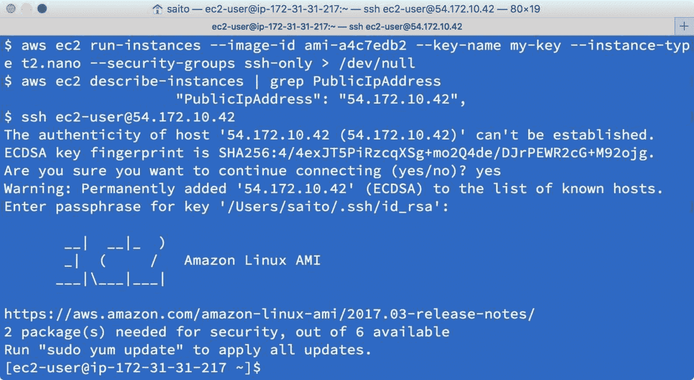
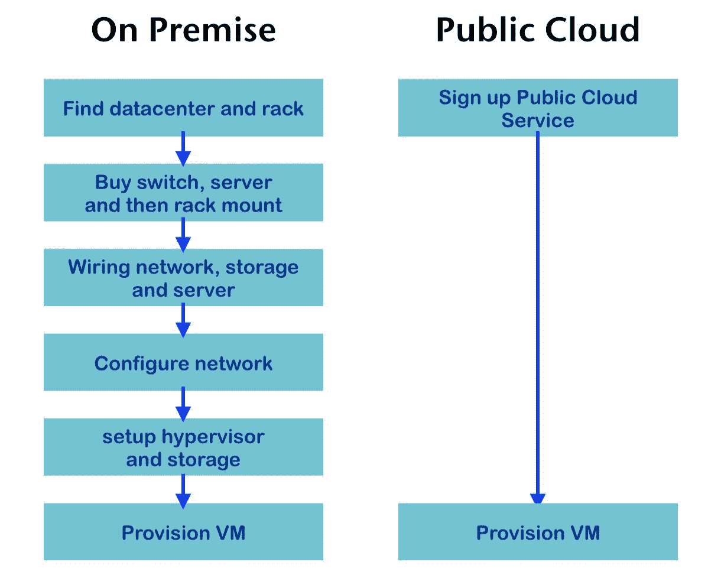
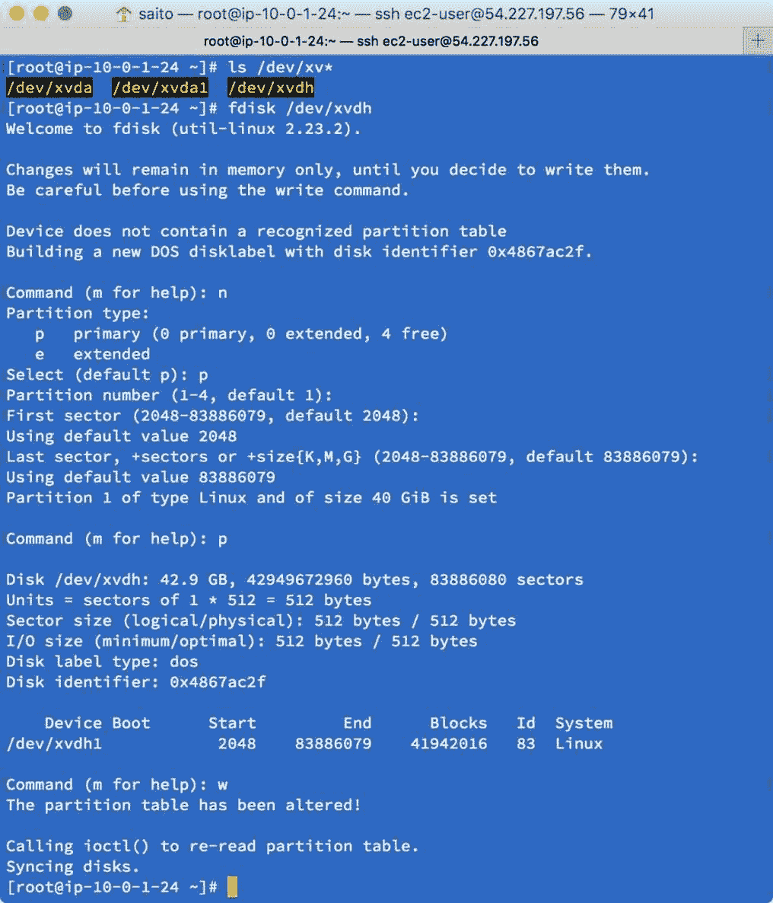
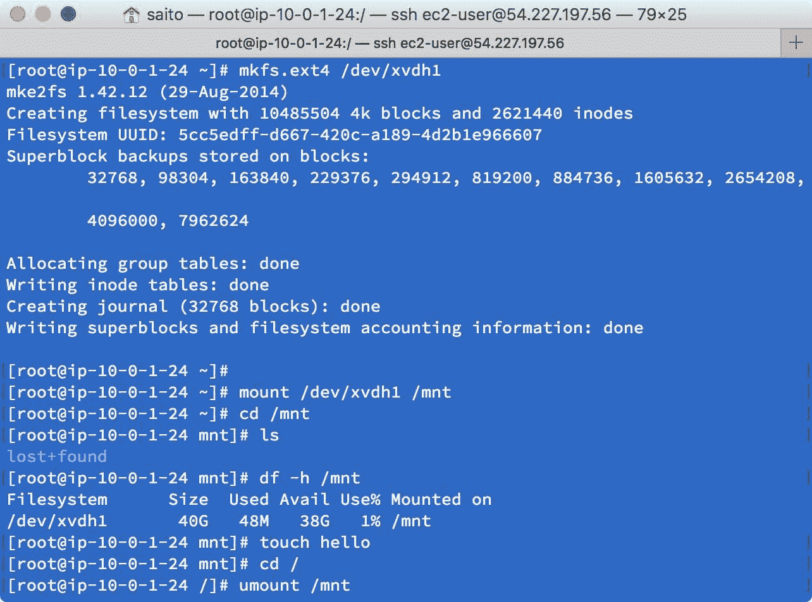
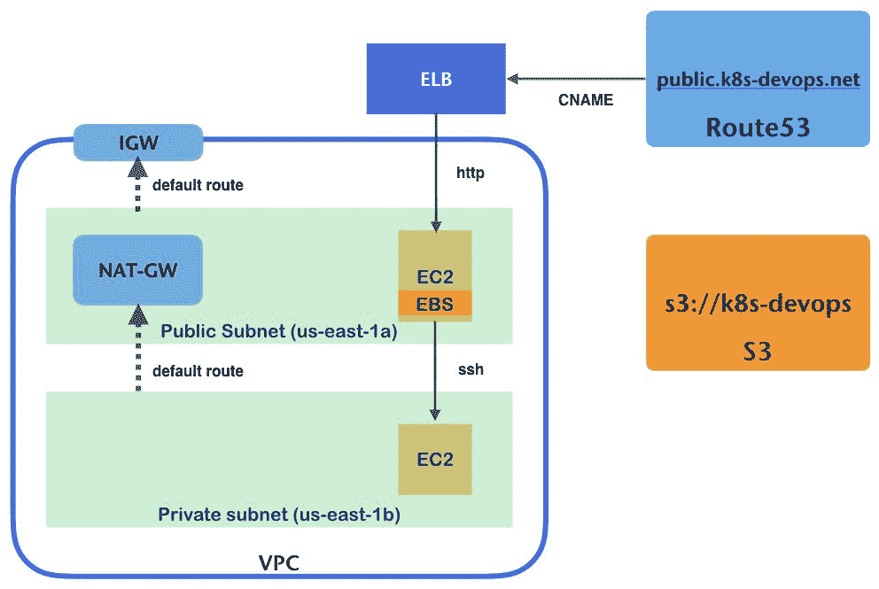
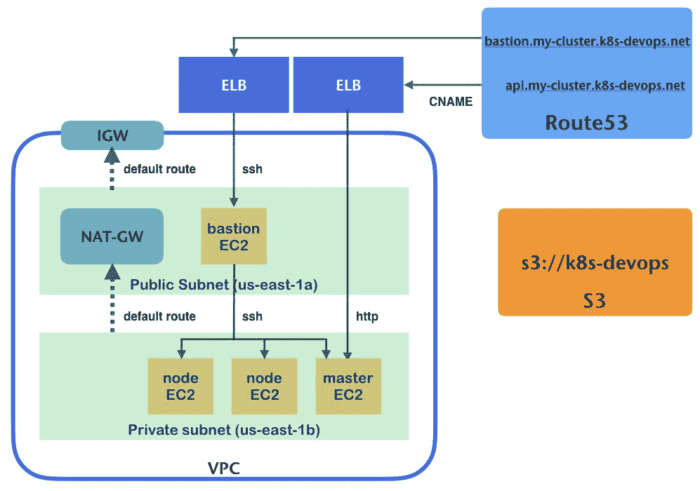
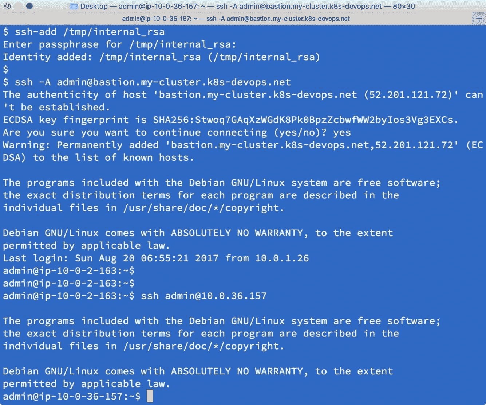
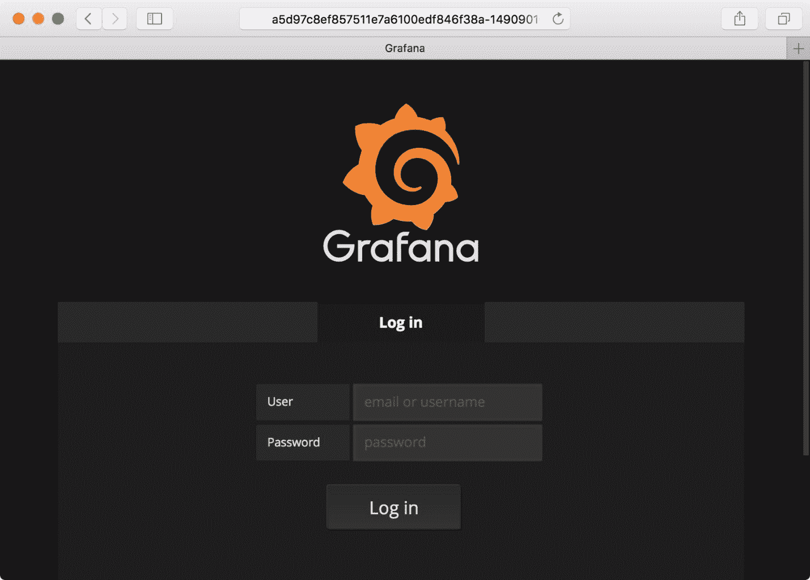
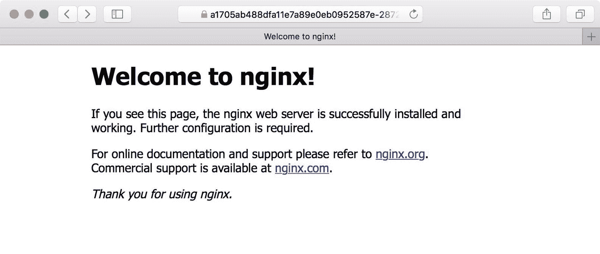
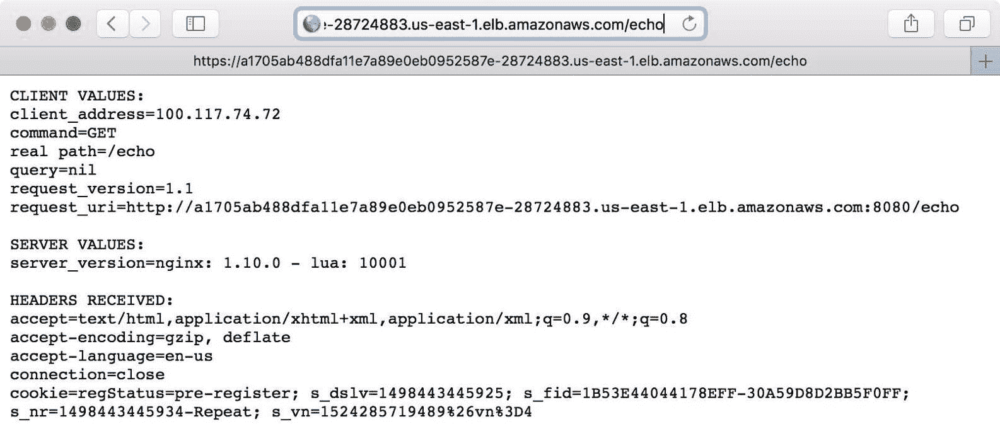

# 第九章：在 AWS 上的 Kubernetes

在公共云上使用 Kubernetes 对您的应用程序来说是灵活和可扩展的。AWS 是公共云行业中受欢迎的服务之一。在本章中，您将了解 AWS 是什么，以及如何在 AWS 上设置 Kubernetes，以及以下主题：

+   了解公共云

+   使用和理解 AWS 组件

+   kops 进行 Kubernetes 设置和管理

+   Kubernetes 云提供商

# AWS 简介

当您在公共网络上运行应用程序时，您需要像网络、虚拟机和存储这样的基础设施。显然，公司会借用或建立自己的数据中心来准备这些基础设施，然后雇佣数据中心工程师和运营商来监视和管理这些资源。

然而，购买和维护这些资产需要大量的资本支出；您还需要为数据中心工程师/运营商支付运营费用。您还需要一段时间来完全设置这些基础设施，比如购买服务器，安装到数据中心机架上，连接网络，然后进行操作系统的初始配置/安装等。

因此，快速分配具有适当资源容量的基础设施是决定您业务成功的重要因素之一。

为了使基础设施管理更加简单和快速，数据中心有许多技术可以帮助。例如，对于虚拟化、软件定义网络（SDN）、存储区域网络（SAN）等。但是将这些技术结合起来会有一些敏感的兼容性问题，并且很难稳定；因此需要雇佣这个行业的专家，最终使运营成本更高。

# 公共云

有一些公司提供了在线基础设施服务。AWS 是一个著名的提供在线基础设施的服务，被称为云或公共云。早在 2006 年，AWS 正式推出了虚拟机服务，称为弹性计算云（EC2），在线对象存储服务，称为简单存储服务（S3），以及在线消息队列服务，称为简单队列服务（SQS）。

这些服务足够简单，但从数据中心管理的角度来看，它们减轻了基础设施的预分配并减少了读取时间，因为它们采用按使用量付费的定价模型（按小时或年度向 AWS 支付）。因此，AWS 变得如此受欢迎，以至于许多公司已经从自己的数据中心转向了公共云。

与公共云相反，你自己的数据中心被称为**本地**。

# API 和基础设施即代码

使用公共云而不是本地数据中心的独特好处之一是公共云提供了一个 API 来控制基础设施。AWS 提供了命令行工具（**AWS CLI**）来控制 AWS 基础设施。例如，注册 AWS（[`aws.amazon.com/free/`](https://aws.amazon.com/free/)）后，安装 AWS CLI（[`docs.aws.amazon.com/cli/latest/userguide/installing.html`](http://docs.aws.amazon.com/cli/latest/userguide/installing.html)），然后如果你想启动一个虚拟机（EC2 实例），可以使用 AWS CLI 如下：



如你所见，注册 AWS 后，只需几分钟就可以访问你的虚拟机。另一方面，如果你从零开始设置自己的本地数据中心会怎样呢？以下图表是对比使用本地数据中心和使用公共云的高层次比较：



如你所见，公共云太简单和快速了；这就是为什么公共云不仅对新兴的使用方便，而且对永久的使用也很方便。

# AWS 组件

AWS 有一些组件来配置网络和存储。了解公共云的工作原理以及如何配置 Kubernetes 是很重要的。

# VPC 和子网

在 AWS 上，首先你需要创建自己的网络；这被称为**虚拟私有云**（**VPC**）并使用 SDN 技术。AWS 允许你在 AWS 上创建一个或多个 VPC。每个 VPC 可以根据需要连接在一起。当你创建一个 VPC 时，只需定义一个网络 CIDR 块和 AWS 区域。例如，在`us-east-1`上的 CIDR `10.0.0.0/16`。无论你是否有访问公共网络，你都可以定义任何网络地址范围（在/16 到/28 的掩码范围内）。VPC 的创建非常快速，一旦创建了 VPC，然后你需要在 VPC 内创建一个或多个子网。

在下面的例子中，通过 AWS 命令行创建了一个 VPC：

```
//specify CIDR block as 10.0.0.0/16
//the result, it returns VPC ID as "vpc-66eda61f"
$ aws ec2 create-vpc --cidr-block 10.0.0.0/16
{
 "Vpc": {
 "VpcId": "vpc-66eda61f", 
   "InstanceTenancy": "default", 
   "Tags": [], 
   "State": "pending", 
   "DhcpOptionsId": "dopt-3d901958", 
   "CidrBlock": "10.0.0.0/16"
  }
}
```

子网是一个逻辑网络块。它必须属于一个 VPC，并且另外属于一个可用区域。例如，VPC `vpc-66eda61f`和`us-east-1b`。然后网络 CIDR 必须在 VPC 的 CIDR 内。例如，如果 VPC CIDR 是`10.0.0.0/16`（`10.0.0.0` - `10.0.255.255`），那么一个子网 CIDR 可以是`10.0.1.0/24`（`10.0.1.0` - `10.0.1.255`）。

在下面的示例中，创建了两个子网（`us-east-1a`和`us-east-1b`）到`vpc-66eda61f`：

```
//1^(st) subnet 10.0."1".0/24 on us-east-1"a" availability zone
$ aws ec2 create-subnet --vpc-id vpc-66eda61f --cidr-block 10.0.1.0/24 --availability-zone us-east-1a
{
 "Subnet": {
    "VpcId": "vpc-66eda61f", 
    "CidrBlock": "10.0.1.0/24", 
    "State": "pending", 
    "AvailabilityZone": "us-east-1a", 
    "SubnetId": "subnet-d83a4b82", 
    "AvailableIpAddressCount": 251
  }
} 

//2^(nd) subnet 10.0."2".0/24 on us-east-1"b"
$ aws ec2 create-subnet --vpc-id vpc-66eda61f --cidr-block 10.0.2.0/24 --availability-zone us-east-1b
{
   "Subnet": {
    "VpcId": "vpc-66eda61f", 
    "CidrBlock": "10.0.2.0/24", 
    "State": "pending", 
    "AvailabilityZone": "us-east-1b", 
    "SubnetId": "subnet-62758c06", 
    "AvailableIpAddressCount": 251
   }
}
```

让我们将第一个子网设置为面向公众的子网，将第二个子网设置为私有子网。这意味着面向公众的子网可以从互联网访问，从而允许它拥有公共 IP 地址。另一方面，私有子网不能拥有公共 IP 地址。为此，您需要设置网关和路由表。

为了使公共网络和私有网络具有高可用性，建议至少创建四个子网（两个公共和两个私有位于不同的可用区域）。

但为了简化易于理解的示例，这些示例创建了一个公共子网和一个私有子网。

# 互联网网关和 NAT-GW

在大多数情况下，您的 VPC 需要与公共互联网连接。在这种情况下，您需要创建一个**IGW**（**互联网网关**）并附加到您的 VPC。

在下面的示例中，创建了一个 IGW 并附加到`vpc-66eda61f`：

```
//create IGW, it returns IGW id as igw-c3a695a5
$ aws ec2 create-internet-gateway 
{
   "InternetGateway": {
      "Tags": [], 
      "InternetGatewayId": "igw-c3a695a5", 
      "Attachments": []
   }
}

//attach igw-c3a695a5 to vpc-66eda61f
$ aws ec2 attach-internet-gateway --vpc-id vpc-66eda61f --internet-gateway-id igw-c3a695a5  
```

一旦附加了 IGW，然后为指向 IGW 的子网设置一个路由表（默认网关）。如果默认网关指向 IGW，则该子网可以拥有公共 IP 地址并从/到互联网访问。因此，如果默认网关不指向 IGW，则被确定为私有子网，这意味着没有公共访问。

在下面的示例中，创建了一个指向 IGW 并设置为第一个子网的路由表：

```
//create route table within vpc-66eda61f
//it returns route table id as rtb-fb41a280
$ aws ec2 create-route-table --vpc-id vpc-66eda61f
{
 "RouteTable": {
 "Associations": [], 
 "RouteTableId": "rtb-fb41a280", 
 "VpcId": "vpc-66eda61f", 
 "PropagatingVgws": [], 
 "Tags": [], 
 "Routes": [
 {
 "GatewayId": "local", 
 "DestinationCidrBlock": "10.0.0.0/16", 
 "State": "active", 
 "Origin": "CreateRouteTable"
 }
 ]
 }
}

//then set default route (0.0.0.0/0) as igw-c3a695a5
$ aws ec2 create-route --route-table-id rtb-fb41a280 --gateway-id igw-c3a695a5 --destination-cidr-block 0.0.0.0/0
{
 "Return": true
}

//finally, update 1^(st) subnet (subnet-d83a4b82) to use this route table
$ aws ec2 associate-route-table --route-table-id rtb-fb41a280 --subnet-id subnet-d83a4b82
{
 "AssociationId": "rtbassoc-bf832dc5"
}

//because 1^(st) subnet is public, assign public IP when launch EC2
$ aws ec2 modify-subnet-attribute --subnet-id subnet-d83a4b82 --map-public-ip-on-launch  
```

另一方面，尽管第二个子网是一个私有子网，但不需要公共 IP 地址，但是私有子网有时需要访问互联网。例如，下载一些软件包和访问 AWS 服务。在这种情况下，我们仍然有一个连接到互联网的选项。它被称为**网络地址转换网关**（**NAT-GW**）。

NAT-GW 允许私有子网通过 NAT-GW 访问公共互联网。因此，NAT-GW 必须位于公共子网上，并且私有子网的路由表将 NAT-GW 指定为默认网关。请注意，为了在公共网络上访问 NAT-GW，需要将**弹性 IP**（**EIP**）附加到 NAT-GW。

在以下示例中，创建了一个 NAT-GW：

```
//allocate EIP, it returns allocation id as eipalloc-56683465
$ aws ec2 allocate-address 
{
 "PublicIp": "34.233.6.60", 
 "Domain": "vpc", 
 "AllocationId": "eipalloc-56683465"
}

//create NAT-GW on 1^(st) public subnet (subnet-d83a4b82
//also assign EIP eipalloc-56683465
$ aws ec2 create-nat-gateway --subnet-id subnet-d83a4b82 --allocation-id eipalloc-56683465
{
 "NatGateway": {
 "NatGatewayAddresses": [
 {
 "AllocationId": "eipalloc-56683465"
 }
 ], 
 "VpcId": "vpc-66eda61f", 
 "State": "pending", 
 "NatGatewayId": "nat-084ff8ba1edd54bf4", 
 "SubnetId": "subnet-d83a4b82", 
 "CreateTime": "2017-08-13T21:07:34.000Z"
 }
}  
```

与 IGW 不同，AWS 会对弹性 IP 和 NAT-GW 收取额外的每小时费用。因此，如果希望节省成本，只有在访问互联网时才启动 NAT-GW。

创建 NAT-GW 需要几分钟，一旦 NAT-GW 创建完成，更新指向 NAT-GW 的私有子网路由表，然后任何 EC2 实例都能访问互联网，但由于私有子网上没有公共 IP 地址，因此无法从公共互联网访问私有子网的 EC2 实例。

在以下示例中，更新第二个子网的路由表，将 NAT-GW 指定为默认网关：

```
//as same as public route, need to create a route table first
$ aws ec2 create-route-table --vpc-id vpc-66eda61f
{
 "RouteTable": {
 "Associations": [], 
 "RouteTableId": "rtb-cc4cafb7", 
 "VpcId": "vpc-66eda61f", 
 "PropagatingVgws": [], 
 "Tags": [], 
 "Routes": [
 {
 "GatewayId": "local", 
 "DestinationCidrBlock": "10.0.0.0/16", 
 "State": "active", 
 "Origin": "CreateRouteTable"
 }
 ]
 }
}

//then assign default gateway as NAT-GW
$ aws ec2 create-route --route-table-id rtb-cc4cafb7 --nat-gateway-id nat-084ff8ba1edd54bf4 --destination-cidr-block 0.0.0.0/0
{
 "Return": true
}

//finally update 2^(nd) subnet that use this routing table
$ aws ec2 associate-route-table --route-table-id rtb-cc4cafb7 --subnet-id subnet-62758c06
{
 "AssociationId": "rtbassoc-2760ce5d"
}
```

总的来说，已经配置了两个子网，一个是公共子网，一个是私有子网。每个子网都有一个默认路由，使用 IGW 和 NAT-GW，如下所示。请注意，ID 会有所不同，因为 AWS 会分配唯一标识符：

| **子网类型** | **CIDR 块** | **子网 ID** | **路由表 ID** | **默认网关** | **EC2 启动时分配公共 IP** |
| --- | --- | --- | --- | --- | --- |
| 公共 | 10.0.1.0/24 | `subnet-d83a4b82` | `rtb-fb41a280` | `igw-c3a695a5` (IGW) | 是 |
| 私有 | 10.0.2.0/24 | `subnet-62758c06` | `rtb-cc4cafb7` | `nat-084ff8ba1edd54bf4` (NAT-GW) | 否（默认） |

从技术上讲，您仍然可以为私有子网的 EC2 实例分配公共 IP，但是没有通往互联网的默认网关（IGW）。因此，公共 IP 将被浪费，绝对无法从互联网获得连接。

现在，如果在公共子网上启动 EC2 实例，它将成为公共面向的，因此可以从该子网提供应用程序。

另一方面，如果在私有子网上启动 EC2 实例，它仍然可以通过 NAT-GW 访问互联网，但无法从互联网访问。但是，它仍然可以从公共子网的 EC2 实例访问。因此，您可以部署诸如数据库、中间件和监控工具之类的内部服务。

# 安全组

一旦 VPC 和相关的网关/路由子网准备就绪，您可以创建 EC2 实例。然而，至少需要事先创建一个访问控制，这就是所谓的**安全组**。它可以定义一个防火墙规则，即入站（传入网络访问）和出站（传出网络访问）。

在下面的例子中，创建了一个安全组和一个规则，允许来自您机器的 IP 地址的公共子网主机的 ssh，以及全球范围内开放 HTTP（80/tcp）：

当您为公共子网定义安全组时，强烈建议由安全专家审查。因为一旦您将 EC2 实例部署到公共子网上，它就有了一个公共 IP 地址，然后包括黑客和机器人在内的所有人都能直接访问您的实例。

```

//create one security group for public subnet host on vpc-66eda61f
$ aws ec2 create-security-group --vpc-id vpc-66eda61f --group-name public --description "public facing host"
{
 "GroupId": "sg-7d429f0d"
}

//check your machine's public IP (if not sure, use 0.0.0.0/0 as temporary)
$ curl ifconfig.co
107.196.102.199

//public facing machine allows ssh only from your machine
$ aws ec2 authorize-security-group-ingress --group-id sg-7d429f0d --protocol tcp --port 22 --cidr 107.196.102.199/32

//public facing machine allow HTTP access from any host (0.0.0.0/0)
$ aws ec2 authorize-security-group-ingress --group-id sg-d173aea1 --protocol tcp --port 80 --cidr 0.0.0.0/0  
```

接下来，为私有子网主机创建一个安全组，允许来自公共子网主机的 ssh。在这种情况下，指定公共子网安全组 ID（`sg-7d429f0d`）而不是 CIDR 块是方便的：

```
//create security group for private subnet
$ aws ec2 create-security-group --vpc-id vpc-66eda61f --group-name private --description "private subnet host"
{
 "GroupId": "sg-d173aea1"
}

//private subnet allows ssh only from ssh bastion host security group
//it also allows HTTP (80/TCP) from public subnet security group
$ aws ec2 authorize-security-group-ingress --group-id sg-d173aea1 --protocol tcp --port 22 --source-group sg-7d429f0d

//private subnet allows HTTP access from public subnet security group too
$ aws ec2 authorize-security-group-ingress --group-id sg-d173aea1 --protocol tcp --port 80 --source-group sg-7d429f0d
```

总的来说，以下是已创建的两个安全组：

| **名称** | **安全组 ID** | **允许 ssh（22/TCP）** | **允许 HTTP（80/TCP）** |
| --- | --- | --- | --- |
| 公共 | `sg-7d429f0d` | 您的机器（`107.196.102.199`） | `0.0.0.0/0` |
| 私有 | `sg-d173aea1` | 公共 sg（`sg-7d429f0d`） | 公共 sg（`sg-7d429f0d`） |

# EC2 和 EBS

EC2 是 AWS 中的一个重要服务，您可以在您的 VPC 上启动一个 VM。根据硬件规格（CPU、内存和网络），AWS 上有几种类型的 EC2 实例可用。当您启动一个 EC2 实例时，您需要指定 VPC、子网、安全组和 ssh 密钥对。因此，所有这些都必须事先创建。

由于之前的例子，唯一的最后一步是 ssh 密钥对。让我们创建一个 ssh 密钥对：

```
//create keypair (internal_rsa, internal_rsa.pub)
$ ssh-keygen 
Generating public/private rsa key pair.
Enter file in which to save the key (/Users/saito/.ssh/id_rsa): /tmp/internal_rsa
Enter passphrase (empty for no passphrase): 
Enter same passphrase again: 
Your identification has been saved in /tmp/internal_rsa.
Your public key has been saved in /tmp/internal_rsa.pub.

//register internal_rsa.pub key to AWS
$ aws ec2 import-key-pair --key-name=internal --public-key-material "`cat /tmp/internal_rsa.pub`"
{
 "KeyName": "internal", 
   "KeyFingerprint":  
 "18:e7:86:d7:89:15:5d:3b:bc:bd:5f:b4:d5:1c:83:81"
} 

//launch public facing host, using Amazon Linux on us-east-1 (ami-a4c7edb2)
$ aws ec2 run-instances --image-id ami-a4c7edb2 --instance-type t2.nano --key-name internal --security-group-ids sg-7d429f0d --subnet-id subnet-d83a4b82

//launch private subnet host
$ aws ec2 run-instances --image-id ami-a4c7edb2 --instance-type t2.nano --key-name internal --security-group-ids sg-d173aea1 --subnet-id subnet-62758c06  
```

几分钟后，在 AWS Web 控制台上检查 EC2 实例的状态；它显示一个具有公共 IP 地址的公共子网主机。另一方面，私有子网主机没有公共 IP 地址：


```
//add private keys to ssh-agent
$ ssh-add -K /tmp/internal_rsa
Identity added: /tmp/internal_rsa (/tmp/internal_rsa)
$ ssh-add -l
2048 SHA256:AMkdBxkVZxPz0gBTzLPCwEtaDqou4XyiRzTTG4vtqTo /tmp/internal_rsa (RSA)

//ssh to the public subnet host with -A (forward ssh-agent) option
$ ssh -A ec2-user@54.227.197.56
The authenticity of host '54.227.197.56 (54.227.197.56)' can't be established.
ECDSA key fingerprint is SHA256:ocI7Q60RB+k2qbU90H09Or0FhvBEydVI2wXIDzOacaE.
Are you sure you want to continue connecting (yes/no)? yes
Warning: Permanently added '54.227.197.56' (ECDSA) to the list of known hosts.

           __|  __|_  )
           _|  (     /   Amazon Linux AMI
          ___|\___|___|

    https://aws.amazon.com/amazon-linux-ami/2017.03-release-notes/
    2 package(s) needed for security, out of 6 available
    Run "sudo yum update" to apply all updates.
```

现在您位于公共子网主机（`54.227.197.56`），但是这台主机也有一个内部（私有）IP 地址，因为这台主机部署在 10.0.1.0/24 子网（`subnet-d83a4b82`）中，因此私有地址范围必须是`10.0.1.1` - `10.0.1.254`：

```
$ ifconfig eth0
eth0      Link encap:Ethernet  HWaddr 0E:8D:38:BE:52:34 
          inet addr:10.0.1.24  Bcast:10.0.1.255      
          Mask:255.255.255.0
```

让我们在公共主机上安装 nginx web 服务器如下：

```
$ sudo yum -y -q install nginx
$ sudo /etc/init.d/nginx start
Starting nginx:                                            [  OK  ]
```

然后，回到您的机器上，检查`54.227.197.56`的网站：

```
$ exit
logout
Connection to 52.227.197.56 closed.

//from your machine, access to nginx
$ curl -I 54.227.197.56
HTTP/1.1 200 OK
Server: nginx/1.10.3
...
Accept-Ranges: bytes  
```

此外，在同一个 VPC 内，其他可用区域也是可达的，因此您可以从这个主机 ssh 到私有子网主机（`10.0.2.98`）。请注意，我们使用了`ssh -A`选项，它转发了一个 ssh-agent，因此不需要创建`~/.ssh/id_rsa`文件：

```
[ec2-user@ip-10-0-1-24 ~]$ ssh 10.0.2.98
The authenticity of host '10.0.2.98 (10.0.2.98)' can't be established.
ECDSA key fingerprint is 1a:37:c3:c1:e3:8f:24:56:6f:90:8f:4a:ff:5e:79:0b.
Are you sure you want to continue connecting (yes/no)? yes
    Warning: Permanently added '10.0.2.98' (ECDSA) to the list of known hosts.

           __|  __|_  )
           _|  (     /   Amazon Linux AMI
          ___|\___|___|

https://aws.amazon.com/amazon-linux-ami/2017.03-release-notes/
2 package(s) needed for security, out of 6 available
Run "sudo yum update" to apply all updates.
[ec2-user@ip-10-0-2-98 ~]$ 
```

除了 EC2，还有一个重要的功能，即磁盘管理。AWS 提供了一个灵活的磁盘管理服务，称为**弹性块存储**（**EBS**）。您可以创建一个或多个持久数据存储，可以附加到 EC2 实例上。从 EC2 的角度来看，EBS 是 HDD/SSD 之一。一旦终止（删除）了 EC2 实例，EBS 及其内容可能会保留，然后重新附加到另一个 EC2 实例上。

在下面的例子中，创建了一个具有 40GB 容量的卷，并附加到一个公共子网主机（实例 ID`i-0db344916c90fae61`）：

```
//create 40GB disk at us-east-1a (as same as EC2 host instance)
$ aws ec2 create-volume --availability-zone us-east-1a --size 40 --volume-type standard
{
    "AvailabilityZone": "us-east-1a", 
    "Encrypted": false, 
    "VolumeType": "standard", 
    "VolumeId": "vol-005032342495918d6", 
    "State": "creating", 
    "SnapshotId": "", 
    "CreateTime": "2017-08-16T05:41:53.271Z", 
    "Size": 40
}

//attach to public subnet host as /dev/xvdh
$ aws ec2 attach-volume --device xvdh --instance-id i-0db344916c90fae61 --volume-id vol-005032342495918d6
{
    "AttachTime": "2017-08-16T05:47:07.598Z", 
    "InstanceId": "i-0db344916c90fae61", 
    "VolumeId": "vol-005032342495918d6", 
    "State": "attaching", 
    "Device": "xvdh"
}
```

将 EBS 卷附加到 EC2 实例后，Linux 内核会识别`/dev/xvdh`，然后您需要对该设备进行分区，如下所示：



在这个例子中，我们将一个分区命名为`/dev/xvdh1`，所以你可以在`/dev/xvdh1`上创建一个`ext4`格式的文件系统，然后可以挂载到 EC2 实例上使用这个设备：



卸载卷后，您可以随时分离该卷，然后在需要时重新附加它：

```
//detach volume
$ aws ec2 detach-volume --volume-id vol-005032342495918d6
{
    "AttachTime": "2017-08-16T06:03:45.000Z", 
    "InstanceId": "i-0db344916c90fae61", 
    "VolumeId": "vol-005032342495918d6", 
    "State": "detaching", 
    "Device": "xvdh"
}
```

# Route 53

AWS 还提供了一个托管 DNS 服务，称为**Route 53**。Route 53 允许您管理自己的域名和关联的 FQDN 到 IP 地址。例如，如果您想要一个域名`k8s-devops.net`，您可以通过 Route 53 订购注册您的 DNS 域名。

以下屏幕截图显示订购域名`k8s-devops.net`；可能需要几个小时才能完成注册：


注册完成后，您可能会收到来自 AWS 的通知电子邮件，然后您可以通过 AWS 命令行或 Web 控制台控制这个域名。让我们添加一个记录（FQDN 到 IP 地址），将`public.k8s-devops.net`与公共面向的 EC2 主机公共 IP 地址`54.227.197.56`关联起来。为此，获取托管区域 ID 如下：

```
$ aws route53 list-hosted-zones | grep Id
"Id": "/hostedzone/Z1CTVYM9SLEAN8",   
```

现在您得到了一个托管区域 ID，即`/hostedzone/Z1CTVYM9SLEAN8`，所以让我们准备一个 JSON 文件来更新 DNS 记录如下：

```
//create JSON file
$ cat /tmp/add-record.json 
{
 "Comment": "add public subnet host",
  "Changes": [
   {
     "Action": "UPSERT",
     "ResourceRecordSet": {
       "Name": "public.k8s-devops.net",
       "Type": "A",
       "TTL": 300,
       "ResourceRecords": [
         {
          "Value": "54.227.197.56"
         }
       ]
     }
   }
  ]
}

//submit to Route53
$ aws route53 change-resource-record-sets --hosted-zone-id /hostedzone/Z1CTVYM9SLEAN8 --change-batch file:///tmp/add-record.json 

//a few minutes later, check whether A record is created or not
$ dig public.k8s-devops.net

; <<>> DiG 9.8.3-P1 <<>> public.k8s-devops.net
;; global options: +cmd
;; Got answer:
;; ->>HEADER<<- opcode: QUERY, status: NOERROR, id: 18609
;; flags: qr rd ra; QUERY: 1, ANSWER: 1, AUTHORITY: 0, ADDITIONAL: 0

;; QUESTION SECTION:
;public.k8s-devops.net.       IN    A

;; ANSWER SECTION:
public.k8s-devops.net.  300   IN    A     54.227.197.56  
```

看起来不错，现在通过 DNS 名称`public.k8s-devops.net`访问 nginx：

```
$ curl -I public.k8s-devops.net
HTTP/1.1 200 OK
Server: nginx/1.10.3
...  
```

# ELB

AWS 提供了一个强大的基于软件的负载均衡器，称为**弹性负载均衡器**（**ELB**）。它允许您将网络流量负载均衡到一个或多个 EC2 实例。此外，ELB 可以卸载 SSL/TLS 加密/解密，并且还支持多可用区。

在以下示例中，创建了一个 ELB，并将其与公共子网主机 nginx（80/TCP）关联。因为 ELB 还需要一个安全组，所以首先为 ELB 创建一个新的安全组：

```
$ aws ec2 create-security-group --vpc-id vpc-66eda61f --group-name elb --description "elb sg"
{
  "GroupId": "sg-51d77921"
} 
$ aws ec2 authorize-security-group-ingress --group-id sg-51d77921 --protocol tcp --port 80 --cidr 0.0.0.0/0

$ aws elb create-load-balancer --load-balancer-name public-elb --listeners Protocol=HTTP,LoadBalancerPort=80,InstanceProtocol=HTTP,InstancePort=80 --subnets subnet-d83a4b82 --security-groups sg-51d77921
{
   "DNSName": "public-elb-1779693260.us-east- 
    1.elb.amazonaws.com"
}

$ aws elb register-instances-with-load-balancer --load-balancer-name public-elb --instances i-0db344916c90fae61

$ curl -I public-elb-1779693260.us-east-1.elb.amazonaws.com
HTTP/1.1 200 OK
Accept-Ranges: bytes
Content-Length: 3770
Content-Type: text/html
...  
```

让我们更新 Route 53 DNS 记录`public.k8s-devops.net`，指向 ELB。在这种情况下，ELB 已经有一个`A`记录，因此使用指向 ELB FQDN 的`CNAME`（别名）：

```
$ cat change-to-elb.json 
{
 "Comment": "use CNAME to pointing to ELB",
  "Changes": [
    {
      "Action": "DELETE",
      "ResourceRecordSet": {
        "Name": "public.k8s-devops.net",
        "Type": "A",
        "TTL": 300,
        "ResourceRecords": [
          {
           "Value": "52.86.166.223"
          }
        ]
      }
    },
    {
      "Action": "UPSERT",
      "ResourceRecordSet": {
        "Name": "public.k8s-devops.net",
        "Type": "CNAME",
        "TTL": 300,
        "ResourceRecords": [
          {
           "Value": "public-elb-1779693260.us-east-           
1.elb.amazonaws.com"
          }
        ]
      }
 }
 ]
}

$ dig public.k8s-devops.net

; <<>> DiG 9.8.3-P1 <<>> public.k8s-devops.net
;; global options: +cmd
;; Got answer:
;; ->>HEADER<<- opcode: QUERY, status: NOERROR, id: 10278
;; flags: qr rd ra; QUERY: 1, ANSWER: 3, AUTHORITY: 0, ADDITIONAL: 0

;; QUESTION SECTION:
;public.k8s-devops.net.       IN    A

;; ANSWER SECTION:
public.k8s-devops.net.  300   IN    CNAME public-elb-1779693260.us-east-1.elb.amazonaws.com.
public-elb-1779693260.us-east-1.elb.amazonaws.com. 60 IN A 52.200.46.81
public-elb-1779693260.us-east-1.elb.amazonaws.com. 60 IN A 52.73.172.171

;; Query time: 77 msec
;; SERVER: 10.0.0.1#53(10.0.0.1)
;; WHEN: Wed Aug 16 22:21:33 2017
;; MSG SIZE  rcvd: 134

$ curl -I public.k8s-devops.net
HTTP/1.1 200 OK
Accept-Ranges: bytes
Content-Length: 3770
Content-Type: text/html
...  
```

# S3

AWS 提供了一个有用的对象数据存储服务，称为**简单存储服务**（**S3**）。它不像 EBS，没有 EC2 实例可以挂载为文件系统。相反，使用 AWS API 将文件传输到 S3。因此，AWS 可以实现可用性（99.999999999%），并且多个实例可以同时访问它。它适合存储非吞吐量和随机访问敏感的文件，如配置文件、日志文件和数据文件。

在以下示例中，从您的计算机上传文件到 AWS S3：

```
//create S3 bucket "k8s-devops"
$ aws s3 mb s3://k8s-devops
make_bucket: k8s-devops

//copy files to S3 bucket
$ aws s3 cp add-record.json s3://k8s-devops/
upload: ./add-record.json to s3://k8s-devops/add-record.json 
$ aws s3 cp change-to-elb.json s3://k8s-devops/
upload: ./change-to-elb.json to s3://k8s-devops/change-to-elb.json 

//check files on S3 bucket
$ aws s3 ls s3://k8s-devops/
2017-08-17 20:00:21        319 add-record.json
2017-08-17 20:00:28        623 change-to-elb.json  
```

总的来说，我们已经讨论了如何配置围绕 VPC 的 AWS 组件。以下图表显示了一个主要组件和关系：



# 在 AWS 上设置 Kubernetes

我们已经讨论了一些 AWS 组件，这些组件非常容易设置网络、虚拟机和存储。因此，在 AWS 上设置 Kubernetes 有多种方式，例如 kubeadm（[`github.com/kubernetes/kubeadm`](https://github.com/kubernetes/kubeadm)）、kops（[`github.com/kubernetes/kops`](https://github.com/kubernetes/kops)）和 kubespray（[`github.com/kubernetes-incubator/kubespray`](https://github.com/kubernetes-incubator/kubespray)）。在 AWS 上配置 Kubernetes 的推荐方式之一是使用 kops，这是一个生产级的设置工具，并支持大量配置。在本章中，我们将使用 kops 在 AWS 上配置 Kubernetes。请注意，kops 代表 Kubernetes 操作。

# 安装 kops

首先，您需要将 kops 安装到您的机器上。Linux 和 macOS 都受支持。Kops 是一个单一的二进制文件，所以只需将`kops`命令复制到`/usr/local/bin`中，如推荐的那样。之后，为 kops 创建一个处理 kops 操作的 IAM 用户和角色。有关详细信息，请参阅官方文档（[`github.com/kubernetes/kops/blob/master/docs/aws.md`](https://github.com/kubernetes/kops/blob/master/docs/aws.md)）。

# 运行 kops

Kops 需要一个存储配置和状态的 S3 存储桶。此外，使用 Route 53 来注册 Kubernetes API 服务器名称和 etcd 服务器名称到域名系统。因此，在前一节中创建的 S3 存储桶和 Route 53。

Kops 支持各种配置，例如部署到公共子网、私有子网，使用不同类型和数量的 EC2 实例，高可用性和叠加网络。让我们使用与前一节中网络类似的配置来配置 Kubernetes，如下所示：

Kops 有一个选项可以重用现有的 VPC 和子网。但是，它的行为很棘手，可能会根据设置遇到一些问题；建议使用 kops 创建一个新的 VPC。有关详细信息，您可以在[`github.com/kubernetes/kops/blob/master/docs/run_in_existing_vpc.md`](https://github.com/kubernetes/kops/blob/master/docs/run_in_existing_vpc.md)找到一份文档。

| **参数** | **值** | **意义** |
| --- | --- | --- |
| - `--name` | `my-cluster.k8s-devops.net` | 在`k8s-devops.net`域下设置`my-cluster` |
| - `--state` | `s3://k8s-devops` | 使用 k8s-devops S3 存储桶 |
| - `--zones` | `us-east-1a` | 部署在`us-east-1a`可用区 |
| - `--cloud` | `aws` | 使用 AWS 作为云提供商 |
| - `--network-cidr` | `10.0.0.0/16` | 使用 CIDR 10.0.0.0/16 创建新的 VPC |
| - `--master-size` | `t2.large` | 为主节点使用 EC2 `t2.large`实例 |
| - `--node-size` | `t2.medium` | 为节点使用 EC2 `t2.medium`实例 |
| - `--node-count` | `2` | 设置两个节点 |
| - `--networking` | `calico` | 使用 Calico 进行叠加网络 |
| - `--topology` | `private` | 设置公共和私有子网，并将主节点和节点部署到私有子网 |
| - `--ssh-puglic-key` | `/tmp/internal_rsa.pub` | 为堡垒主机使用`/tmp/internal_rsa.pub` |
| - `--bastion` |  | 在公共子网上创建 ssh 堡垒服务器 |
| - `--yes` |  | 立即执行 |

因此，运行以下命令来运行 kops：

```
$ kops create cluster --name my-cluster.k8s-devops.net --state=s3://k8s-devops --zones us-east-1a --cloud aws --network-cidr 10.0.0.0/16 --master-size t2.large --node-size t2.medium --node-count 2 --networking calico --topology private --ssh-public-key /tmp/internal_rsa.pub --bastion --yes

I0818 20:43:15.022735   11372 create_cluster.go:845] Using SSH public key: /tmp/internal_rsa.pub
...
I0818 20:45:32.585246   11372 executor.go:91] Tasks: 78 done / 78 total; 0 can run
I0818 20:45:32.587067   11372 dns.go:152] Pre-creating DNS records
I0818 20:45:35.266425   11372 update_cluster.go:247] Exporting kubecfg for cluster
Kops has set your kubectl context to my-cluster.k8s-devops.net

Cluster is starting.  It should be ready in a few minutes.  
```

在看到上述消息后，完全完成可能需要大约 5 到 10 分钟。这是因为它需要我们创建 VPC、子网和 NAT-GW，启动 EC2，然后安装 Kubernetes 主节点和节点，启动 ELB，然后更新 Route 53 如下：



完成后，`kops`会更新您机器上的`~/.kube/config`，指向您的 Kubernetes API 服务器。Kops 会创建一个 ELB，并在 Route 53 上设置相应的 FQDN 记录为`https://api.<your-cluster-name>.<your-domain-name>/`，因此，您可以直接从您的机器上运行`kubectl`命令来查看节点列表，如下所示：

```
$ kubectl get nodes
NAME                          STATUS         AGE       VERSION
ip-10-0-36-157.ec2.internal   Ready,master   8m        v1.7.0
ip-10-0-42-97.ec2.internal    Ready,node     6m        v1.7.0
ip-10-0-42-170.ec2.internal   Ready,node     6m        v1.7.0

```

太棒了！从头开始在 AWS 上设置 AWS 基础设施和 Kubernetes 只花了几分钟。现在您可以通过`kubectl`命令部署 pod。但是您可能想要 ssh 到 master/node 上查看发生了什么。

然而，出于安全原因，如果您指定了`--topology private`，您只能 ssh 到堡垒主机。然后使用私有 IP 地址 ssh 到 master/node 主机。这类似于前一节中 ssh 到公共子网主机，然后使用 ssh-agent（`-A`选项）ssh 到私有子网主机。

在以下示例中，我们 ssh 到堡垒主机（kops 创建 Route 53 条目为`bastion.my-cluster.k8s-devops.net`），然后 ssh 到 master（`10.0.36.157`）：

>

# Kubernetes 云服务提供商

在使用 kops 设置 Kubernetes 时，它还将 Kubernetes 云服务提供商配置为 AWS。这意味着当您使用 LoadBalancer 的 Kubernetes 服务时，它将使用 ELB。它还将**弹性块存储**（**EBS**）作为其`StorageClass`。

# L4 负载均衡器

当您将 Kubernetes 服务公开到外部世界时，使用 ELB 更有意义。将服务类型设置为 LoadBalancer 将调用 ELB 创建并将其与节点关联：

```
$ cat grafana.yml 
apiVersion: apps/v1beta1
kind: Deployment
metadata:
 name: grafana
spec:
 replicas: 1
 template:
 metadata:
 labels:
 run: grafana
 spec:
 containers:
 - image: grafana/grafana
 name: grafana
 ports:
 - containerPort: 3000
---
apiVersion: v1
kind: Service
metadata:
 name: grafana
spec:
 ports:
 - port: 80
 targetPort: 3000
 type: LoadBalancer
 selector:
 run: grafana

$ kubectl create -f grafana.yml 
deployment "grafana" created
service "grafana" created

$ kubectl get service
NAME         CLUSTER-IP       EXTERNAL-IP        PORT(S)        AGE
grafana      100.65.232.120   a5d97c8ef8575...   80:32111/TCP   11s
kubernetes   100.64.0.1       <none>             443/TCP        13m

$ aws elb describe-load-balancers | grep a5d97c8ef8575 | grep DNSName
 "DNSName": "a5d97c8ef857511e7a6100edf846f38a-1490901085.us-east-1.elb.amazonaws.com",  
```

如您所见，ELB 已经自动创建，DNS 为`a5d97c8ef857511e7a6100edf846f38a-1490901085.us-east-1.elb.amazonaws.com`，因此现在您可以在`http://a5d97c8ef857511e7a6100edf846f38a-1490901085.us-east-1.elb.amazonaws.com`访问 Grafana。

您可以使用`awscli`来更新 Route 53，分配一个`CNAME`，比如`grafana.k8s-devops.net`。另外，Kubernetes 的孵化项目`external-dns`（[`github.com/kubernetes-incubator/external-dns)`](https://github.com/kubernetes-incubator/external-dns)）可以自动更新 Route 53 在这种情况下。

# L7 负载均衡器（入口）

截至 kops 版本 1.7.0，它尚未默认设置 ingress 控制器。然而，kops 提供了一些插件（[`github.com/kubernetes/kops/tree/master/addons`](https://github.com/kubernetes/kops/tree/master/addons)）来扩展 Kubernetes 的功能。其中一个插件 ingress-nginx（[`github.com/kubernetes/kops/tree/master/addons/ingress-nginx`](https://github.com/kubernetes/kops/tree/master/addons/ingress-nginx)）使用 AWS ELB 和 nginx 的组合来实现 Kubernetes 的 ingress 控制器。

为了安装`ingress-nginx`插件，输入以下命令来设置 ingress 控制器：

```
$ kubectl create -f https://raw.githubusercontent.com/kubernetes/kops/master/addons/ingress-nginx/v1.6.0.yaml
namespace "kube-ingress" created
serviceaccount "nginx-ingress-controller" created
clusterrole "nginx-ingress-controller" created
role "nginx-ingress-controller" created
clusterrolebinding "nginx-ingress-controller" created
rolebinding "nginx-ingress-controller" created
service "nginx-default-backend" created
deployment "nginx-default-backend" created
configmap "ingress-nginx" created
service "ingress-nginx" created
deployment "ingress-nginx" created
```

之后，使用 NodePort 服务部署 nginx 和 echoserver 如下：

```
$ kubectl run nginx --image=nginx --port=80
deployment "nginx" created
$ 
$ kubectl expose deployment nginx --target-port=80 --type=NodePort
service "nginx" exposed
$ 
$ kubectl run echoserver --image=gcr.io/google_containers/echoserver:1.4 --port=8080
deployment "echoserver" created
$ 
$ kubectl expose deployment echoserver --target-port=8080 --type=NodePort
service "echoserver" exposed

// URL "/" point to nginx, "/echo" to echoserver
$ cat nginx-echoserver-ingress.yaml 
apiVersion: extensions/v1beta1
kind: Ingress
metadata:
 name: nginx-echoserver-ingress
spec:
 rules:
 - http:
 paths:
 - path: /
 backend:
 serviceName: nginx
 servicePort: 80
 - path: /echo
 backend:
 serviceName: echoserver
 servicePort: 8080

//check ingress
$ kubectl get ing -o wide
NAME                       HOSTS     ADDRESS                                                                 PORTS     AGE
nginx-echoserver-ingress   *         a1705ab488dfa11e7a89e0eb0952587e-28724883.us-east-1.elb.amazonaws.com   80        1m 
```

几分钟后，ingress 控制器将 nginx 服务和 echoserver 服务与 ELB 关联起来。当您使用 URI "`/`"访问 ELB 服务器时，它会显示 nginx 屏幕如下：



另一方面，如果你访问相同的 ELB，但使用 URI "`/echo`"，它会显示 echoserver 如下：



与标准的 Kubernetes 负载均衡器服务相比，一个负载均衡器服务会消耗一个 ELB。另一方面，使用 nginx-ingress 插件，它可以将多个 Kubernetes NodePort 服务整合到单个 ELB 上。这将有助于更轻松地构建您的 RESTful 服务。

# StorageClass

正如我们在第四章中讨论的那样，有一个`StorageClass`可以动态分配持久卷。Kops 将 provisioner 设置为`aws-ebs`，使用 EBS：

```
$ kubectl get storageclass
NAME            TYPE
default         kubernetes.io/aws-ebs 
gp2 (default)   kubernetes.io/aws-ebs 

$ cat pvc-aws.yml 
apiVersion: v1
kind: PersistentVolumeClaim
metadata:
 name: pvc-aws-1
spec:
 storageClassName: "default"
 accessModes:
 - ReadWriteOnce
 resources:
 requests:
 storage: 10Gi

$ kubectl create -f pvc-aws.yml 
persistentvolumeclaim "pvc-aws-1" created

$ kubectl get pv
NAME                                       CAPACITY   ACCESSMODES   RECLAIMPOLICY   STATUS    CLAIM               STORAGECLASS   REASON    AGE
pvc-94957090-84a8-11e7-9974-0ea8dc53a244   10Gi       RWO           Delete          Bound     default/pvc-aws-1   default                  3s  
```

这将自动创建 EBS 卷如下：

```
$ aws ec2 describe-volumes --filter Name=tag-value,Values="pvc-51cdf520-8576-11e7-a610-0edf846f38a6"
{
 "Volumes": [
    {
      "AvailabilityZone": "us-east-1a", 
    "Attachments": [], 
      "Tags": [
       {
...
     ], 
    "Encrypted": false, 
    "VolumeType": "gp2", 
    "VolumeId": "vol-052621c39546f8096", 
    "State": "available", 
    "Iops": 100, 
    "SnapshotId": "", 
    "CreateTime": "2017-08-20T07:08:08.773Z", 
       "Size": 10
       }
     ]
   }
```

总的来说，AWS 的 Kubernetes 云提供程序被用来将 ELB 映射到 Kubernetes 服务，还有将 EBS 映射到 Kubernetes 持久卷。对于 Kubernetes 来说，使用 AWS 是一个很大的好处，因为不需要预先分配或购买物理负载均衡器或存储，只需按需付费；这为您的业务创造了灵活性和可扩展性。

# 通过 kops 维护 Kubernetes 集群

当您需要更改 Kubernetes 配置，比如节点数量甚至 EC2 实例类型，kops 可以支持这种用例。例如，如果您想将 Kubernetes 节点实例类型从`t2.medium`更改为`t2.micro`，并且由于成本节约而将数量从 2 减少到 1，您需要修改 kops 节点实例组（`ig`）设置如下：

```
$ kops edit ig nodes --name my-cluster.k8s-devops.net --state=s3://k8s-devops   
```

它启动了 vi 编辑器，您可以更改 kops 节点实例组的设置如下：

```
apiVersion: kops/v1alpha2
kind: InstanceGroup
metadata:
 creationTimestamp: 2017-08-20T06:43:45Z
 labels:
 kops.k8s.io/cluster: my-cluster.k8s-devops.net
 name: nodes
spec:
 image: kope.io/k8s-1.6-debian-jessie-amd64-hvm-ebs-2017- 
 05-02
 machineType: t2.medium
 maxSize: 2
 minSize: 2
 role: Node
 subnets:
 - us-east-1a  
```

在这种情况下，将`machineType`更改为`t2.small`，将`maxSize`/`minSize`更改为`1`，然后保存。之后，运行`kops update`命令应用设置：

```
$ kops update cluster --name my-cluster.k8s-devops.net --state=s3://k8s-devops --yes 

I0820 00:57:17.900874    2837 executor.go:91] Tasks: 0 done / 94 total; 38 can run
I0820 00:57:19.064626    2837 executor.go:91] Tasks: 38 done / 94 total; 20 can run
...
Kops has set your kubectl context to my-cluster.k8s-devops.net
Cluster changes have been applied to the cloud.

Changes may require instances to restart: kops rolling-update cluster  
```

正如您在前面的消息中看到的，您需要运行`kops rolling-update cluster`命令来反映现有实例。将现有实例替换为新实例可能需要几分钟：

```
$ kops rolling-update cluster --name my-cluster.k8s-devops.net --state=s3://k8s-devops --yes
NAME              STATUS     NEEDUPDATE  READY MIN   MAX   NODES
bastions          Ready       0           1     1     1     0
master-us-east-1a Ready       0           1     1     1     1
nodes             NeedsUpdate 1           0     1     1     1
I0820 01:00:01.086564    2844 instancegroups.go:350] Stopping instance "i-07e55394ef3a09064", node "ip-10-0-40-170.ec2.internal", in AWS ASG "nodes.my-cluster.k8s-devops.net".  
```

现在，Kubernetes 节点实例已从`2`减少到`1`，如下所示：

```
$ kubectl get nodes
NAME                          STATUS         AGE       VERSION
ip-10-0-36-157.ec2.internal   Ready,master   1h        v1.7.0
ip-10-0-58-135.ec2.internal   Ready,node     34s       v1.7.0  
```

# 总结

在本章中，我们已经讨论了公共云。AWS 是最流行的公共云服务，它提供 API 以编程方式控制 AWS 基础设施。我们可以轻松实现自动化和基础架构即代码。特别是，kops 使我们能够从头开始快速设置 AWS 和 Kubernetes。Kubernetes 和 kops 的开发都非常活跃。请继续监视这些项目，它们将在不久的将来具有更多功能和配置。

下一章将介绍**Google Cloud Platform**（**GCP**），这是另一个流行的公共云服务。**Google Container Engine**（**GKE**）是托管的 Kubernetes 服务，使使用 Kubernetes 变得更加容易。
