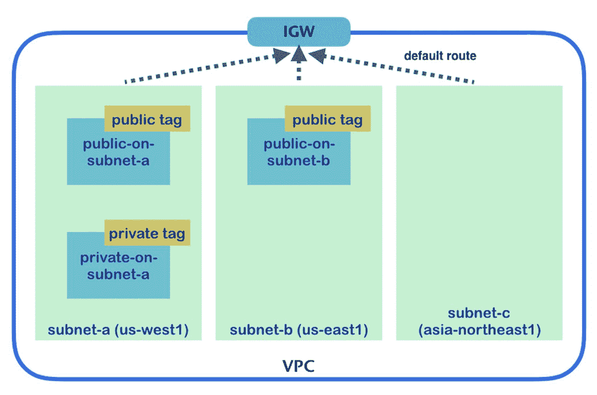
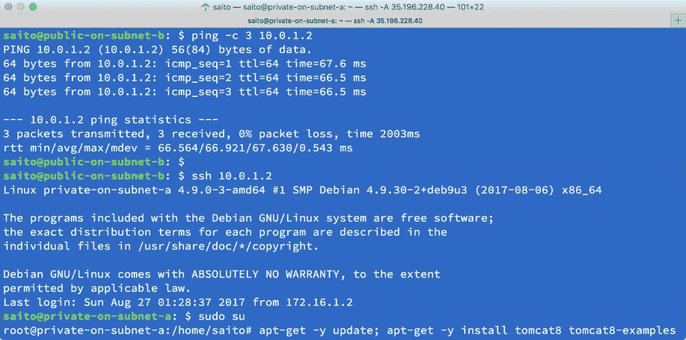
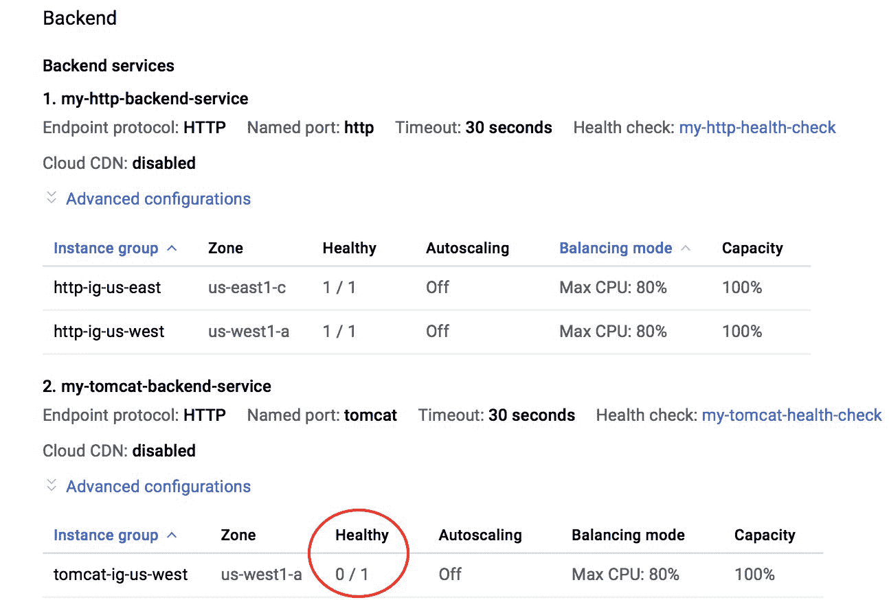
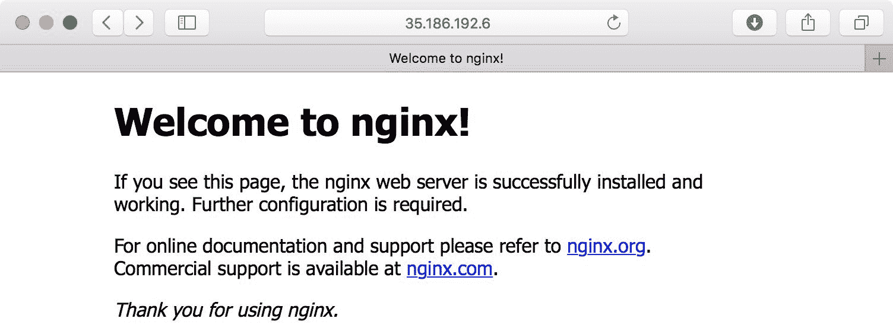
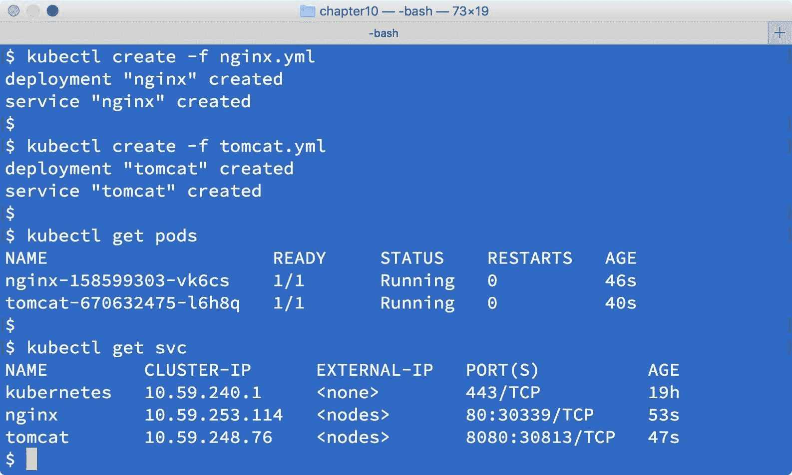

# 第十章：GCP 上的 Kubernetes

Google Cloud Platform（GCP）在公共云行业中越来越受欢迎，由 Google 提供。GCP 与 AWS 具有类似的概念，如 VPC、计算引擎、持久磁盘、负载均衡和一些托管服务。在本章中，您将了解 GCP 以及如何通过以下主题在 GCP 上设置 Kubernetes：

+   理解 GCP

+   使用和理解 GCP 组件

+   使用 Google Container Engine（GKE），托管的 Kubernetes 服务

# GCP 简介

GCP 于 2011 年正式推出。但与 AWS 不同的是，GCP 最初提供了 PaaS（平台即服务）。因此，您可以直接部署您的应用程序，而不是启动虚拟机。之后，不断增强功能，支持各种服务。

对于 Kubernetes 用户来说，最重要的服务是 GKE，这是一个托管的 Kubernetes 服务。因此，您可以从 Kubernetes 的安装、升级和管理中得到一些缓解。它采用按使用 Kubernetes 集群的方式付费。GKE 也是一个非常活跃的服务，不断及时提供新版本的 Kubernetes，并为 Kubernetes 提供新功能和管理工具。

让我们看看 GCP 提供了什么样的基础设施和服务，然后探索 GKE。

# GCP 组件

GCP 提供了 Web 控制台和命令行界面（CLI）。两者都很容易直接地控制 GCP 基础设施，但需要 Google 账户（如 Gmail）。一旦您拥有了 Google 账户，就可以转到 GCP 注册页面（[`cloud.google.com/free/`](https://cloud.google.com/free/)）来创建您的 GCP 账户。

如果您想通过 CLI 进行控制，您需要安装 Cloud SDK（[`cloud.google.com/sdk/gcloud/`](https://cloud.google.com/sdk/gcloud/)），这类似于 AWS CLI，您可以使用它来列出、创建、更新和删除 GCP 资源。安装 Cloud SDK 后，您需要使用以下命令将其配置到 GCP 账户：

```
$ gcloud init
```

# VPC

与 AWS 相比，GCP 中的 VPC 政策有很大不同。首先，您不需要为 VPC 设置 CIDR 前缀，换句话说，您不能为 VPC 设置 CIDR。相反，您只需向 VPC 添加一个或多个子网。因为子网总是带有特定的 CIDR 块，因此 GCP VPC 被识别为一组逻辑子网，VPC 内的子网可以相互通信。

请注意，GCP VPC 有两种模式，即**自动**或**自定义**。如果您选择自动模式，它将在每个区域创建一些具有预定义 CIDR 块的子网。例如，如果您输入以下命令：

```
$ gcloud compute networks create my-auto-network --mode auto
```

它将创建 11 个子网，如下面的屏幕截图所示（因为截至 2017 年 8 月，GCP 有 11 个区域）：


自动模式 VPC 可能是一个很好的起点。但是，在自动模式下，您无法指定 CIDR 前缀，而且来自所有区域的 11 个子网可能无法满足您的用例。例如，如果您想通过 VPN 集成到您的本地数据中心，或者只想从特定区域创建子网。

在这种情况下，选择自定义模式 VPC，然后可以手动创建具有所需 CIDR 前缀的子网。输入以下命令以创建自定义模式 VPC：

```
//create custom mode VPC which is named my-custom-network
$ gcloud compute networks create my-custom-network --mode custom  
```

因为自定义模式 VPC 不会像下面的屏幕截图所示创建任何子网，让我们在这个自定义模式 VPC 上添加子网：


# 子网

在 GCP 中，子网始终跨越区域内的多个区域（可用区）。换句话说，您无法像 AWS 一样在单个区域创建子网。创建子网时，您总是需要指定整个区域。

此外，与 AWS 不同（结合路由和 Internet 网关或 NAT 网关确定为公共或私有子网的重要概念），GCP 没有明显的公共和私有子网概念。这是因为 GCP 中的所有子网都有指向 Internet 网关的路由。

GCP 使用**网络标签**而不是子网级别的访问控制，以确保网络安全。这将在下一节中进行更详细的描述。

这可能会让网络管理员感到紧张，但是 GCP 最佳实践为您带来了更简化和可扩展的 VPC 管理，因为您可以随时添加子网以扩展整个网络块。

从技术上讲，您可以启动 VM 实例设置为 NAT 网关或 HTTP 代理，然后为指向 NAT/代理实例的私有子网创建自定义优先级路由，以实现类似 AWS 的私有子网。

有关详细信息，请参阅以下在线文档：

[`cloud.google.com/compute/docs/vpc/special-configurations`](https://cloud.google.com/compute/docs/vpc/special-configurations)

还有一件事，GCP VPC 的一个有趣且独特的概念是，您可以将不同的 CIDR 前缀网络块添加到单个 VPC 中。例如，如果您有自定义模式 VPC，然后添加以下三个子网：

+   `subnet-a` (`10.0.1.0/24`) 来自 `us-west1`

+   `subnet-b` (`172.16.1.0/24`) 来自 `us-east1`

+   `subnet-c` (`192.168.1.0/24`) 来自 `asia-northeast1`

以下命令将从三个不同的区域创建三个具有不同 CIDR 前缀的子网：

```
$ gcloud compute networks subnets create subnet-a --network=my-custom-network --range=10.0.1.0/24 --region=us-west1
$ gcloud compute networks subnets create subnet-b --network=my-custom-network --range=172.16.1.0/24 --region=us-east1
$ gcloud compute networks subnets create subnet-c --network=my-custom-network --range=192.168.1.0/24 --region=asia-northeast1  
```

结果将是以下 Web 控制台。如果您熟悉 AWS VPC，您将不相信这些 CIDR 前缀的组合在单个 VPC 中！这意味着，每当您需要扩展网络时，您可以随意分配另一个 CIDR 前缀以添加到 VPC 中。


# 防火墙规则

正如之前提到的，GCP 防火墙规则对于实现网络安全非常重要。但是 GCP 防火墙比 AWS 的安全组（SG）更简单和灵活。例如，在 AWS 中，当您启动一个 EC2 实例时，您必须至少分配一个与 EC2 和 SG 紧密耦合的 SG。另一方面，在 GCP 中，您不能直接分配任何防火墙规则。相反，防火墙规则和 VM 实例是通过网络标签松散耦合的。因此，防火墙规则和 VM 实例之间没有直接关联。以下图表是 AWS 安全组和 GCP 防火墙规则之间的比较。EC2 需要安全组，另一方面，GCP VM 实例只需设置一个标签。这与相应的防火墙是否具有相同的标签无关。


例如，根据以下命令为公共主机（使用网络标签`public`）和私有主机（使用网络标签`private`）创建防火墙规则：

```
//create ssh access for public host
$ gcloud compute firewall-rules create public-ssh --network=my-custom-network --allow="tcp:22" --source-ranges="0.0.0.0/0" --target-tags="public"

//create http access (80/tcp for public host)
$ gcloud compute firewall-rules create public-http --network=my-custom-network --allow="tcp:80" --source-ranges="0.0.0.0/0" --target-tags="public"

//create ssh access for private host (allow from host which has "public" tag)
$ gcloud compute firewall-rules create private-ssh --network=my-custom-network --allow="tcp:22" --source-tags="public" --target-tags="private"

//create icmp access for internal each other (allow from host which has either "public" or "private")
$ gcloud compute firewall-rules create internal-icmp --network=my-custom-network --allow="icmp" --source-tags="public,private"
```

它创建了四个防火墙规则，如下图所示。让我们创建 VM 实例，以使用`public`或`private`网络标签，看看它是如何工作的：


# VM 实例

GCP 中的 VM 实例与 AWS EC2 非常相似。您可以选择各种具有不同硬件配置的机器（实例）类型。以及 Linux 或基于 Windows 的 OS 镜像或您定制的 OS，您可以选择。

如在讨论防火墙规则时提到的，您可以指定零个或多个网络标签。标签不一定要事先创建。这意味着您可以首先使用网络标签启动 VM 实例，即使没有创建防火墙规则。这仍然是有效的，但在这种情况下不会应用防火墙规则。然后创建一个防火墙规则来具有网络标签。最终，防火墙规则将应用于 VM 实例。这就是为什么 VM 实例和防火墙规则松散耦合的原因，这为用户提供了灵活性。


在启动 VM 实例之前，您需要首先创建一个 ssh 公钥，与 AWS EC2 相同。这样做的最简单方法是运行以下命令来创建和注册一个新密钥：

```
//this command create new ssh key pair
$ gcloud compute config-ssh

//key will be stored as ~/.ssh/google_compute_engine(.pub)
$ cd ~/.ssh
$ ls -l google_compute_engine*
-rw-------  1 saito  admin  1766 Aug 23 22:58 google_compute_engine
-rw-r--r--  1 saito  admin   417 Aug 23 22:58 google_compute_engine.pub  
```

现在让我们开始在 GCP 上启动一个 VM 实例。

在`subnet-a`和`subnet-b`上部署两个实例作为公共实例（使用`public`网络标签），然后在`subnet-a`上启动另一个实例作为私有实例（使用`private`网络标签）：

```
//create public instance ("public" tag) on subnet-a
$ gcloud compute instances create public-on-subnet-a --machine-type=f1-micro --network=my-custom-network --subnet=subnet-a --zone=us-west1-a --tags=public

//create public instance ("public" tag) on subnet-b
$ gcloud compute instances create public-on-subnet-b --machine-type=f1-micro --network=my-custom-network --subnet=subnet-b --zone=us-east1-c --tags=public

//create private instance ("private" tag) on subnet-a with larger size (g1-small)
$ gcloud compute instances create private-on-subnet-a --machine-type=g1-small --network=my-custom-network --subnet=subnet-a --zone=us-west1-a --tags=private

//Overall, there are 3 VM instances has been created in this example as below
$ gcloud compute instances list
NAME                                           ZONE           MACHINE_TYPE  PREEMPTIBLE  INTERNAL_IP  EXTERNAL_IP      STATUS
public-on-subnet-b                             us-east1-c     f1-micro                   172.16.1.2   35.196.228.40    RUNNING
private-on-subnet-a                            us-west1-a     g1-small                   10.0.1.2     104.199.121.234  RUNNING
public-on-subnet-a                             us-west1-a     f1-micro                   10.0.1.3     35.199.171.31    RUNNING  
```



您可以登录到这些机器上检查防火墙规则是否按预期工作。首先，您需要将 ssh 密钥添加到您的机器上的 ssh-agent 中：

```
$ ssh-add ~/.ssh/google_compute_engine
Enter passphrase for /Users/saito/.ssh/google_compute_engine: 
Identity added: /Users/saito/.ssh/google_compute_engine (/Users/saito/.ssh/google_compute_engine)  
```

然后检查 ICMP 防火墙规则是否可以拒绝来自外部的请求，因为 ICMP 只允许公共或私有标记的主机，因此不应允许来自您的机器的 ping，如下面的屏幕截图所示：


另一方面，公共主机允许来自您的机器的 ssh，因为 public-ssh 规则允许任何（`0.0.0.0/0`）。


当然，这台主机可以通过私有 IP 地址在`subnet-a`（`10.0.1.2`）上 ping 和 ssh 到私有主机，因为有`internal-icmp`规则和`private-ssh`规则。

让我们通过 ssh 连接到私有主机，然后安装`tomcat8`和`tomcat8-examples`包（它将在 Tomcat 中安装`/examples/`应用程序）。



请记住，`subnet-a`是`10.0.1.0/24`的 CIDR 前缀，但`subnet-b`是`172.16.1.0/24`的 CIDR 前缀。但在同一个 VPC 中，它们之间是可以互相连接的。这是使用 GCP 的一个巨大优势，您可以根据需要扩展网络地址块。

现在，在公共主机（`public-on-subnet-a`和`public-on-subnet-b`）上安装 nginx：

```
//logout from VM instance, then back to your machine
$ exit

//install nginx from your machine via ssh
$ ssh 35.196.228.40 "sudo apt-get -y install nginx"
$ ssh 35.199.171.31 "sudo apt-get -y install nginx"

//check whether firewall rule (public-http) work or not
$ curl -I http://35.196.228.40/
HTTP/1.1 200 OK
Server: nginx/1.10.3
Date: Sun, 27 Aug 2017 07:07:01 GMT
Content-Type: text/html
Content-Length: 612
Last-Modified: Fri, 25 Aug 2017 05:48:28 GMT
Connection: keep-alive
ETag: "599fba2c-264"
Accept-Ranges: bytes  
```

然而，此时，您无法访问私有主机上的 Tomcat。即使它有一个公共 IP 地址。这是因为私有主机还没有任何允许 8080/tcp 的防火墙规则：

```
$ curl http://104.199.121.234:8080/examples/
curl: (7) Failed to connect to 104.199.121.234 port 8080: Operation timed out  
```

继续前进，不仅为 Tomcat 创建防火墙规则，还将设置一个负载均衡器，以配置 nginx 和 Tomcat 从单个负载均衡器访问。

# 负载均衡

GCP 提供以下几种类型的负载均衡器：

+   第 4 层 TCP 负载均衡器

+   第 4 层 UDP 负载均衡器

+   第 7 层 HTTP(S)负载均衡器

第 4 层，无论是 TCP 还是 UDP，负载均衡器都类似于 AWS 经典 ELB。另一方面，第 7 层 HTTP(S)负载均衡器具有基于内容（上下文）的路由。例如，URL /img 将转发到实例 a，其他所有内容将转发到实例 b。因此，它更像是一个应用级别的负载均衡器。

AWS 还提供了**应用负载均衡器**（**ALB**或**ELBv2**），它与 GCP 第 7 层 HTTP(S)负载均衡器非常相似。有关详细信息，请访问[`aws.amazon.com/blogs/aws/new-aws-application-load-balancer/`](https://aws.amazon.com/blogs/aws/new-aws-application-load-balancer/)。

为了设置负载均衡器，与 AWS ELB 不同，需要在配置一些项目之前进行几个步骤：

| **配置项** | **目的** |
| --- | --- |
| 实例组 | 确定 VM 实例或 VM 模板（OS 镜像）的组。 |
| 健康检查 | 设置健康阈值（间隔、超时等）以确定实例组的健康状态。 |
| 后端服务 | 设置负载阈值（最大 CPU 或每秒请求）和会话亲和性（粘性会话）到实例组，并关联到健康检查。 |
| url-maps（负载均衡器） | 这是一个实际的占位符，用于表示关联后端服务和目标 HTTP(S)代理的 L7 负载均衡器 |
| 目标 HTTP(S)代理 | 这是一个连接器，它建立了前端转发规则与负载均衡器之间的关系 |
| 前端转发规则 | 将 IP 地址（临时或静态）、端口号与目标 HTTP 代理关联起来 |
| 外部 IP（静态） | （可选）为负载均衡器分配静态外部 IP 地址 |

以下图表显示了构建 L7 负载均衡器的所有前述组件的关联：


首先设置一个实例组。在这个例子中，有三个要创建的实例组。一个用于私有主机 Tomcat 实例（8080/tcp），另外两个实例组用于每个区域的公共 HTTP 实例。

为此，执行以下命令将它们三个分组：

```
//create instance groups for HTTP instances and tomcat instance
$ gcloud compute instance-groups unmanaged create http-ig-us-west --zone us-west1-a
$ gcloud compute instance-groups unmanaged create http-ig-us-east --zone us-east1-c
$ gcloud compute instance-groups unmanaged create tomcat-ig-us-west --zone us-west1-a

//because tomcat uses 8080/tcp, create a new named port as tomcat:8080
$ gcloud compute instance-groups unmanaged set-named-ports tomcat-ig-us-west --zone us-west1-a --named-ports tomcat:8080

//register an existing VM instance to correspond instance group
$ gcloud compute instance-groups unmanaged add-instances http-ig-us-west --instances public-on-subnet-a --zone us-west1-a
$ gcloud compute instance-groups unmanaged add-instances http-ig-us-east --instances public-on-subnet-b --zone us-east1-c
$ gcloud compute instance-groups unmanaged add-instances tomcat-ig-us-west --instances private-on-subnet-a --zone us-west1-a  
```

# 健康检查

通过执行以下命令设置标准设置：

```
//create health check for http (80/tcp) for "/"
$ gcloud compute health-checks create http my-http-health-check --check-interval 5 --healthy-threshold 2 --unhealthy-threshold 3 --timeout 5 --port 80 --request-path /

//create health check for Tomcat (8080/tcp) for "/examples/"
$ gcloud compute health-checks create http my-tomcat-health-check --check-interval 5 --healthy-threshold 2 --unhealthy-threshold 3 --timeout 5 --port 8080 --request-path /examples/  
```

# 后端服务

首先，我们需要创建一个指定健康检查的后端服务。然后为每个实例组添加阈值，CPU 利用率最高为 80%，HTTP 和 Tomcat 的最大容量均为 100%：

```
//create backend service for http (default) and named port tomcat (8080/tcp)
$ gcloud compute backend-services create my-http-backend-service --health-checks my-http-health-check --protocol HTTP --global
$ gcloud compute backend-services create my-tomcat-backend-service --health-checks my-tomcat-health-check --protocol HTTP --port-name tomcat --global

//add http instance groups (both us-west1 and us-east1) to http backend service
$ gcloud compute backend-services add-backend my-http-backend-service --instance-group http-ig-us-west --instance-group-zone us-west1-a --balancing-mode UTILIZATION --max-utilization 0.8 --capacity-scaler 1 --global
$ gcloud compute backend-services add-backend my-http-backend-service --instance-group http-ig-us-east --instance-group-zone us-east1-c --balancing-mode UTILIZATION --max-utilization 0.8 --capacity-scaler 1 --global

//also add tomcat instance group to tomcat backend service
$ gcloud compute backend-services add-backend my-tomcat-backend-service --instance-group tomcat-ig-us-west --instance-group-zone us-west1-a --balancing-mode UTILIZATION --max-utilization 0.8 --capacity-scaler 1 --global  
```

# 创建负载均衡器

负载均衡器需要绑定`my-http-backend-service`和`my-tomcat-backend-service`。在这种情况下，只有`/examples`和`/examples/*`将被转发到`my-tomcat-backend-service`。除此之外，每个 URI 都将转发流量到`my-http-backend-service`：

```
//create load balancer(url-map) to associate my-http-backend-service as default
$ gcloud compute url-maps create my-loadbalancer --default-service my-http-backend-service

//add /examples and /examples/* mapping to my-tomcat-backend-service
$ gcloud compute url-maps add-path-matcher my-loadbalancer --default-service my-http-backend-service --path-matcher-name tomcat-map --path-rules /examples=my-tomcat-backend-service,/examples/*=my-tomcat-backend-service

//create target-http-proxy that associate to load balancer(url-map)
$ gcloud compute target-http-proxies create my-target-http-proxy --url-map=my-loadbalancer

//allocate static global ip address and check assigned address
$ gcloud compute addresses create my-loadbalancer-ip --global
$ gcloud compute addresses describe my-loadbalancer-ip --global
address: 35.186.192.6

//create forwarding rule that associate static IP to target-http-proxy
$ gcloud compute forwarding-rules create my-frontend-rule --global --target-http-proxy my-target-http-proxy --address 35.186.192.6 --ports 80
```

如果您不指定`--address`选项，它将创建并分配一个临时的外部 IP 地址。

最后，负载均衡器已经创建。但是，还有一个缺失的配置。私有主机没有任何防火墙规则来允许 Tomcat 流量（8080/tcp）。这就是为什么当您查看负载均衡器状态时，`my-tomcat-backend-service`的健康状态保持为下线（0）。



在这种情况下，您需要添加一个允许从负载均衡器到私有子网的连接的防火墙规则（使用`private`网络标记）。根据 GCP 文档（[`cloud.google.com/compute/docs/load-balancing/health-checks#https_ssl_proxy_tcp_proxy_and_internal_load_balancing`](https://cloud.google.com/compute/docs/load-balancing/health-checks#https_ssl_proxy_tcp_proxy_and_internal_load_balancing)），健康检查心跳将来自地址范围`130.211.0.0/22`和`35.191.0.0/16`：

```
//add one more Firewall Rule that allow Load Balancer to Tomcat (8080/tcp)
$ gcloud compute firewall-rules create private-tomcat --network=my-custom-network --source-ranges 130.211.0.0/22,35.191.0.0/16 --target-tags private --allow tcp:8080  
```

几分钟后，`my-tomcat-backend-service`的健康状态将变为正常（`1`）；现在您可以从 Web 浏览器访问负载均衡器。当访问`/`时，它应该路由到`my-http-backend-service`，该服务在公共主机上有 nginx 应用程序：



另一方面，如果您使用相同的负载均衡器 IP 地址访问`/examples/` URL，它将路由到`my-tomcat-backend-service`，该服务是私有主机上的 Tomcat 应用程序，如下面的屏幕截图所示：


总的来说，需要执行一些步骤来设置负载均衡器，但将不同的 HTTP 应用集成到单个负载均衡器上，以最小的资源高效地提供服务是很有用的。

# 持久磁盘

GCE 还有一个名为**持久磁盘**（**PD**）的存储服务，它与 AWS EBS 非常相似。您可以在每个区域分配所需的大小和类型（标准或 SSD），并随时附加/分离到 VM 实例。

让我们创建一个 PD，然后将其附加到 VM 实例。请注意，将 PD 附加到 VM 实例时，两者必须位于相同的区域。这个限制与 AWS EBS 相同。因此，在创建 PD 之前，再次检查 VM 实例的位置：

```
$ gcloud compute instances list
NAME                                           ZONE           MACHINE_TYPE  PREEMPTIBLE  INTERNAL_IP  EXTERNAL_IP      STATUS
public-on-subnet-b                             us-east1-c     f1-micro                   172.16.1.2   35.196.228.40    RUNNING
private-on-subnet-a                            us-west1-a     g1-small                   10.0.1.2     104.199.121.234  RUNNING
public-on-subnet-a                             us-west1-a     f1-micro                   10.0.1.3     35.199.171.31    RUNNING  
```

让我们选择`us-west1-a`，然后将其附加到`public-on-subnet-a`：

```
//create 20GB PD on us-west1-a with standard type
$ gcloud compute disks create my-disk-us-west1-a --zone us-west1-a --type pd-standard --size 20

//after a few seconds, check status, you can see existing boot disks as well
$ gcloud compute disks list
NAME                                           ZONE           SIZE_GB  TYPE         STATUS
public-on-subnet-b                             us-east1-c     10       pd-standard  READY
my-disk-us-west1-a                             us-west1-a     20       pd-standard  READY
private-on-subnet-a                            us-west1-a     10       pd-standard  READY
public-on-subnet-a                             us-west1-a     10       pd-standard  READY

//attach PD(my-disk-us-west1-a) to the VM instance(public-on-subnet-a)
$ gcloud compute instances attach-disk public-on-subnet-a --disk my-disk-us-west1-a --zone us-west1-a

//login to public-on-subnet-a to see the status
$ ssh 35.199.171.31
Linux public-on-subnet-a 4.9.0-3-amd64 #1 SMP Debian 4.9.30-2+deb9u3 (2017-08-06) x86_64

The programs included with the Debian GNU/Linux system are free software;
the exact distribution terms for each program are described in the
individual files in /usr/share/doc/*/copyright.

Debian GNU/Linux comes with ABSOLUTELY NO WARRANTY, to the extent
permitted by applicable law.
Last login: Fri Aug 25 03:53:24 2017 from 107.196.102.199
saito@public-on-subnet-a**:**~**$ sudo su
root@public-on-subnet-a:/home/saito# dmesg | tail
[ 7377.421190] systemd[1]: apt-daily-upgrade.timer: Adding 25min 4.773609s random time.
[ 7379.202172] systemd[1]: apt-daily-upgrade.timer: Adding 6min 37.770637s random time.
[243070.866384] scsi 0:0:2:0: Direct-Access     Google   PersistentDisk   1    PQ: 0 ANSI: 6
[243070.875665] sd 0:0:2:0: [sdb] 41943040 512-byte logical blocks: (21.5 GB/20.0 GiB)
[243070.883461] sd 0:0:2:0: [sdb] 4096-byte physical blocks
[243070.889914] sd 0:0:2:0: Attached scsi generic sg1 type 0
[243070.900603] sd 0:0:2:0: [sdb] Write Protect is off
[243070.905834] sd 0:0:2:0: [sdb] Mode Sense: 1f 00 00 08
[243070.905938] sd 0:0:2:0: [sdb] Write cache: enabled, read cache: enabled, doesn't support DPO or FUA
[243070.925713] sd 0:0:2:0: [sdb] Attached SCSI disk  
```

您可能会看到 PD 已经附加到`/dev/sdb`。与 AWS EBS 类似，您必须格式化此磁盘。因为这是一个 Linux 操作系统操作，步骤与第九章中描述的完全相同，*在 AWS 上的 Kubernetes*。

# Google 容器引擎（GKE）

总的来说，一些 GCP 组件已经在前几节中介绍过。现在，您可以开始在 GCP VM 实例上使用这些组件设置 Kubernetes。您甚至可以使用在第九章中介绍的 kops，*在 AWS 上的 Kubernetes*也是如此。

然而，GCP 有一个名为 GKE 的托管 Kubernetes 服务。在底层，它使用了一些 GCP 组件，如 VPC、VM 实例、PD、防火墙规则和负载均衡器。

当然，像往常一样，您可以使用`kubectl`命令来控制 GKE 上的 Kubernetes 集群，该命令包含在 Cloud SDK 中。如果您尚未在您的机器上安装`kubectl`命令，请输入以下命令通过 Cloud SDK 安装`kubectl`：

```
//install kubectl command
$ gcloud components install kubectl  
```

# 在 GKE 上设置您的第一个 Kubernetes 集群

您可以使用`gcloud`命令在 GKE 上设置 Kubernetes 集群。它需要指定几个参数来确定一些配置。其中一个重要的参数是网络。您必须指定将部署到哪个 VPC 和子网。虽然 GKE 支持多个区域进行部署，但您需要至少指定一个区域用于 Kubernetes 主节点。这次，它使用以下参数来启动 GKE 集群：

| **参数** | **描述** | **值** |
| --- | --- | --- |
| `--cluster-version` | 指定 Kubernetes 版本 | `1.6.7` |
| `--machine-type` | Kubernetes 节点的 VM 实例类型 | `f1-micro` |
| `--num-nodes` | Kubernetes 节点的初始数量 | `3` |
| `--network` | 指定 GCP VPC | `my-custom-network` |
| `--subnetwork` | 如果 VPC 是自定义模式，则指定 GCP 子网 | `subnet-c` |
| `--zone` | 指定单个区域 | `asia-northeast1-a` |
| `--tags` | 将分配给 Kubernetes 节点的网络标签 | `private` |

在这种情况下，您需要键入以下命令在 GCP 上启动 Kubernetes 集群。这可能需要几分钟才能完成，因为在幕后，它将启动多个 VM 实例并设置 Kubernetes 主节点和节点。请注意，Kubernetes 主节点和 etcd 将由 GCP 完全管理。这意味着主节点和 etcd 不会占用您的 VM 实例：

```
$ gcloud container clusters create my-k8s-cluster --cluster-version 1.6.7 --machine-type f1-micro --num-nodes 3 --network my-custom-network --subnetwork subnet-c --zone asia-northeast1-a --tags private

Creating cluster my-k8s-cluster...done. 
Created [https://container.googleapis.com/v1/projects/devops-with-kubernetes/zones/asia-northeast1-a/clusters/my-k8s-cluster].
kubeconfig entry generated for my-k8s-cluster.
NAME            ZONE               MASTER_VERSION  MASTER_IP      MACHINE_TYPE  NODE_VERSION  NUM_NODES  STATUS
my-k8s-cluster  asia-northeast1-a  1.6.7           35.189.135.13  f1-micro      1.6.7         3          RUNNING

//check node status
$ kubectl get nodes
NAME                                            STATUS    AGE       VERSION
gke-my-k8s-cluster-default-pool-ae180f53-47h5   Ready     1m        v1.6.7
gke-my-k8s-cluster-default-pool-ae180f53-6prb   Ready     1m        v1.6.7
gke-my-k8s-cluster-default-pool-ae180f53-z6l1   Ready     1m        v1.6.7  
```

请注意，我们指定了`--tags private`选项，因此 Kubernetes 节点 VM 实例具有`private`网络标记。因此，它的行为与具有`private`标记的其他常规 VM 实例相同。因此，您无法从公共互联网进行 ssh，也无法从互联网进行 HTTP。但是，您可以从具有`public`网络标记的另一个 VM 实例进行 ping 和 ssh。

一旦所有节点准备就绪，让我们访问默认安装的 Kubernetes UI。为此，使用`kubectl proxy`命令作为代理连接到您的计算机。然后通过代理访问 UI：

```
//run kubectl proxy on your machine, that will bind to 127.0.0.1:8001
$ kubectl proxy
Starting to serve on 127.0.0.1:8001

//use Web browser on your machine to access to 127.0.0.1:8001/ui/
http://127.0.0.1:8001/ui/
```


# 节点池

在启动 Kubernetes 集群时，您可以使用`--num-nodes`选项指定节点的数量。GKE 将 Kubernetes 节点管理为节点池。这意味着您可以管理一个或多个附加到您的 Kubernetes 集群的节点池。

如果您需要添加更多节点或删除一些节点怎么办？GKE 提供了一个功能，可以通过以下命令将 Kubernetes 节点从 3 更改为 5 来调整节点池的大小：

```
//run resize command to change number of nodes to 5
$ gcloud container clusters resize my-k8s-cluster --size 5 --zone asia-northeast1-a

//after a few minutes later, you may see additional nodes
$ kubectl get nodes
NAME                                            STATUS    AGE       VERSION
gke-my-k8s-cluster-default-pool-ae180f53-47h5   Ready     5m        v1.6.7
gke-my-k8s-cluster-default-pool-ae180f53-6prb   Ready     5m        v1.6.7
gke-my-k8s-cluster-default-pool-ae180f53-f8ps   Ready     30s       v1.6.7
gke-my-k8s-cluster-default-pool-ae180f53-qzxz   Ready     30s       v1.6.7
gke-my-k8s-cluster-default-pool-ae180f53-z6l1   Ready     5m        v1.6.7  
```

增加节点数量将有助于扩展节点容量。但是，在这种情况下，它仍然使用最小的实例类型（`f1-micro`，仅具有 0.6 GB 内存）。如果单个容器需要超过 0.6 GB 内存，则可能无法帮助。在这种情况下，您需要进行扩展，这意味着您需要添加更大尺寸的 VM 实例类型。

在这种情况下，您必须将另一组节点池添加到您的集群中。因为在同一个节点池中，所有 VM 实例都配置相同。因此，您无法在同一个节点池中更改实例类型。

因此，添加一个新的节点池，该节点池具有两组新的`g1-small`（1.7 GB 内存）VM 实例类型到集群中。然后，您可以扩展具有不同硬件配置的 Kubernetes 节点。

默认情况下，您可以在一个区域内创建 VM 实例数量的一些配额限制（例如，在`us-west1`最多八个 CPU 核心）。如果您希望增加此配额，您必须将您的帐户更改为付费帐户。然后向 GCP 请求配额更改。有关更多详细信息，请阅读来自[`cloud.google.com/compute/quotas`](https://cloud.google.com/compute/quotas)和[`cloud.google.com/free/docs/frequently-asked-questions#how-to-upgrade`](https://cloud.google.com/free/docs/frequently-asked-questions#how-to-upgrade)的在线文档。

运行以下命令，添加一个具有两个`g1-small`实例的额外节点池：

```
//create and add node pool which is named "large-mem-pool"
$ gcloud container node-pools create large-mem-pool --cluster my-k8s-cluster --machine-type g1-small --num-nodes 2 --tags private --zone asia-northeast1-a

//after a few minustes, large-mem-pool instances has been added
$ kubectl get nodes
NAME                                              STATUS    AGE       VERSION
gke-my-k8s-cluster-default-pool-ae180f53-47h5     Ready     13m       v1.6.7
gke-my-k8s-cluster-default-pool-ae180f53-6prb     Ready     13m       v1.6.7
gke-my-k8s-cluster-default-pool-ae180f53-f8ps     Ready     8m        v1.6.7
gke-my-k8s-cluster-default-pool-ae180f53-qzxz     Ready     8m        v1.6.7
gke-my-k8s-cluster-default-pool-ae180f53-z6l1     Ready     13m       v1.6.7
gke-my-k8s-cluster-large-mem-pool-f87dd00d-9v5t   Ready     5m        v1.6.7
gke-my-k8s-cluster-large-mem-pool-f87dd00d-fhpn   Ready     5m        v1.6.7  
```

现在您的集群中总共有七个 CPU 核心和 6.4GB 内存的容量更大。然而，由于更大的硬件类型，Kubernetes 调度器可能会首先分配部署 pod 到`large-mem-pool`，因为它有足够的内存容量。

但是，您可能希望保留`large-mem-pool`节点，以防一个大型应用程序需要大的堆内存大小（例如，Java 应用程序）。因此，您可能希望区分`default-pool`和`large-mem-pool`。

在这种情况下，Kubernetes 标签`beta.kubernetes.io/instance-type`有助于区分节点的实例类型。因此，使用`nodeSelector`来指定 pod 的所需节点。例如，以下`nodeSelector`参数将强制使用`f1-micro`节点进行 nginx 应用程序：

```
//nodeSelector specifies f1-micro
$ cat nginx-pod-selector.yml 
apiVersion: v1
kind: Pod
metadata:
 name: nginx
spec:
 containers:
 - name: nginx
 image: nginx
 nodeSelector:
 beta.kubernetes.io/instance-type: f1-micro

//deploy pod
$ kubectl create -f nginx-pod-selector.yml 
pod "nginx" created

//it uses default pool
$ kubectl get pods nginx -o wide
NAME      READY     STATUS    RESTARTS   AGE       IP           NODE
nginx     1/1       Running   0          7s        10.56.1.13   gke-my-k8s-cluster-default-pool-ae180f53-6prb
```

如果您想指定一个特定的标签而不是`beta.kubernetes.io/instance-type`，请使用`--node-labels`选项创建一个节点池。这将为节点池分配您所需的标签。

有关更多详细信息，请阅读以下在线文档：

[`cloud.google.com/sdk/gcloud/reference/container/node-pools/create`](https://cloud.google.com/sdk/gcloud/reference/container/node-pools/create)。

当然，如果您不再需要它，可以随时删除一个节点池。要做到这一点，请运行以下命令删除`default-pool`（`f1-micro` x 5 个实例）。如果在`default-pool`上有一些正在运行的 pod，此操作将自动涉及 pod 迁移（终止`default-pool`上的 pod 并重新在`large-mem-pool`上启动）：

```
//list Node Pool
$ gcloud container node-pools list --cluster my-k8s-cluster --zone asia-northeast1-a
NAME            MACHINE_TYPE  DISK_SIZE_GB  NODE_VERSION
default-pool    f1-micro      100           1.6.7
large-mem-pool  g1-small      100           1.6.7

//delete default-pool
$ gcloud container node-pools delete default-pool --cluster my-k8s-cluster --zone asia-northeast1-a

//after a few minutes, default-pool nodes x 5 has been deleted
$ kubectl get nodes
NAME                                              STATUS    AGE       VERSION
gke-my-k8s-cluster-large-mem-pool-f87dd00d-9v5t   Ready     16m       v1.6.7
gke-my-k8s-cluster-large-mem-pool-f87dd00d-fhpn   Ready     16m       v1.6.7  
```

您可能已经注意到，所有前面的操作都发生在一个单一区域（`asia-northeast1-a`）中。因此，如果`asia-northeast1-a`区域发生故障，您的集群将会宕机。为了避免区域故障，您可以考虑设置一个多区域集群。

# 多区域集群

GKE 支持多区域集群，允许您在多个区域上启动 Kubernetes 节点，但限制在同一地区内。在之前的示例中，它只在`asia-northeast1-a`上进行了配置，因此让我们重新配置一个集群，其中包括`asia-northeast1-a`，`asia-northeast1-b`和`asia-northeast1-c`，总共三个区域。

非常简单；在创建新集群时，只需添加一个`--additional-zones`参数。

截至 2017 年 8 月，有一个测试功能支持将现有集群从单个区域升级到多个区域。使用以下测试命令：

`$ gcloud beta container clusters update my-k8s-cluster --additional-zones=asia-northeast1-b,asia-northeast1-c`。

要将现有集群更改为多区域，可能需要安装额外的 SDK 工具，但不在 SLA 范围内。

让我们删除之前的集群，并使用`--additional-zones`选项创建一个新的集群：

```
//delete cluster first
$ gcloud container clusters delete my-k8s-cluster --zone asia-northeast1-a

//create a new cluster with --additional-zones option but 2 nodes only
$ gcloud container clusters create my-k8s-cluster --cluster-version 1.6.7 --machine-type f1-micro --num-nodes 2 --network my-custom-network --subnetwork subnet-c --zone asia-northeast1-a --tags private --additional-zones asia-northeast1-b,asia-northeast1-c  
```

在此示例中，它将在每个区域（`asia-northeast1-a`，`b`和`c`）创建两个节点；因此，总共将添加六个节点：

```
$ kubectl get nodes
NAME                                            STATUS    AGE       VERSION
gke-my-k8s-cluster-default-pool-0c4fcdf3-3n6d   Ready     44s       v1.6.7
gke-my-k8s-cluster-default-pool-0c4fcdf3-dtjj   Ready     48s       v1.6.7
gke-my-k8s-cluster-default-pool-2407af06-5d28   Ready     41s       v1.6.7
gke-my-k8s-cluster-default-pool-2407af06-tnpj   Ready     45s       v1.6.7
gke-my-k8s-cluster-default-pool-4c20ec6b-395h   Ready     49s       v1.6.7
gke-my-k8s-cluster-default-pool-4c20ec6b-rrvz   Ready     49s       v1.6.7  
```

您还可以通过 Kubernetes 标签`failure-domain.beta.kubernetes.io/zone`区分节点区域，以便指定要部署 Pod 的所需区域。

# 集群升级

一旦开始管理 Kubernetes，您可能会在升级 Kubernetes 集群时遇到一些困难。因为 Kubernetes 项目非常积极，大约每三个月就会有一个新版本发布，例如 1.6.0（2017 年 3 月 28 日发布）到 1.7.0（2017 年 6 月 29 日发布）。

GKE 还会及时添加新版本支持。它允许我们通过`gcloud`命令升级主节点和节点。您可以运行以下命令查看 GKE 支持的 Kubernetes 版本：

```
$ gcloud container get-server-config

Fetching server config for us-east4-b
defaultClusterVersion: 1.6.7
defaultImageType: COS
validImageTypes:
- CONTAINER_VM
- COS
- UBUNTU
validMasterVersions:
- 1.7.3
- 1.6.8
- 1.6.7
validNodeVersions:
- 1.7.3
- 1.7.2
- 1.7.1
- 1.6.8
- 1.6.7
- 1.6.6
- 1.6.4
- 1.5.7
- 1.4.9  
```

因此，您可能会看到此时主节点和节点上支持的最新版本都是 1.7.3。由于之前的示例安装的是 1.6.7 版本，让我们升级到 1.7.3。首先，您需要先升级主节点：

```
//upgrade master using --master option
$ gcloud container clusters upgrade my-k8s-cluster --zone asia-northeast1-a --cluster-version 1.7.3 --master
Master of cluster [my-k8s-cluster] will be upgraded from version 
[1.6.7] to version [1.7.3]. This operation is long-running and will 
block other operations on the cluster (including delete) until it has 
run to completion.

Do you want to continue (Y/n)?  y

Upgrading my-k8s-cluster...done. 
Updated [https://container.googleapis.com/v1/projects/devops-with-kubernetes/zones/asia-northeast1-a/clusters/my-k8s-cluster].  
```

根据环境，大约需要 10 分钟，之后您可以通过以下命令进行验证：

```
//master upgrade has been successfully to done
$ gcloud container clusters list --zone asia-northeast1-a
NAME            ZONE               MASTER_VERSION  MASTER_IP       MACHINE_TYPE  NODE_VERSION  NUM_NODES  STATUS
my-k8s-cluster  asia-northeast1-a  1.7.3           35.189.141.251  f1-micro      1.6.7 *       6          RUNNING  
```

现在您可以将所有节点升级到 1.7.3 版本。因为 GKE 尝试执行滚动升级，它将按照以下步骤逐个节点执行：

1.  从集群中注销目标节点。

1.  删除旧的 VM 实例。

1.  提供一个新的 VM 实例。

1.  设置节点为 1.7.3 版本。

1.  注册到主节点。

因此，它比主节点升级需要更长的时间：

```
//node upgrade (not specify --master)
$ gcloud container clusters upgrade my-k8s-cluster --zone asia-northeast1-a --cluster-version 1.7.3 
All nodes (6 nodes) of cluster [my-k8s-cluster] will be upgraded from 
version [1.6.7] to version [1.7.3]. This operation is long-running and will block other operations on the cluster (including delete) until it has run to completion.

Do you want to continue (Y/n)?  y  
```

在滚动升级期间，您可以看到节点状态如下，并显示滚动更新的中间过程（两个节点已升级到 1.7.3，一个节点正在升级，三个节点处于挂起状态）：

```
NAME                                            STATUS                        AGE       VERSION
gke-my-k8s-cluster-default-pool-0c4fcdf3-3n6d   Ready                         37m       v1.6.7
gke-my-k8s-cluster-default-pool-0c4fcdf3-dtjj   Ready                         37m       v1.6.7
gke-my-k8s-cluster-default-pool-2407af06-5d28   NotReady,SchedulingDisabled   37m       v1.6.7
gke-my-k8s-cluster-default-pool-2407af06-tnpj   Ready                         37m       v1.6.7
gke-my-k8s-cluster-default-pool-4c20ec6b-395h   Ready                         5m        v1.7.3
gke-my-k8s-cluster-default-pool-4c20ec6b-rrvz   Ready                         1m        v1.7.3  
```

# Kubernetes 云提供商

GKE 还集成了 Kubernetes 云提供商，可以深度整合到 GCP 基础设施；例如通过 VPC 路由的覆盖网络，通过持久磁盘的 StorageClass，以及通过 L4 负载均衡器的服务。最好的部分是通过 L7 负载均衡器的入口。让我们看看它是如何工作的。

# StorageClass

与 AWS 上的 kops 一样，GKE 也默认设置了 StorageClass，使用持久磁盘：

```
$ kubectl get storageclass
NAME                 TYPE
standard (default)   kubernetes.io/gce-pd 

$ kubectl describe storageclass standard
Name:       standard
IsDefaultClass:   Yes
Annotations:      storageclass.beta.kubernetes.io/is-default-class=true
Provisioner:      kubernetes.io/gce-pd
Parameters: type=pd-standard
Events:           <none>  
```

因此，在创建持久卷索赔时，它将自动将 GCP 持久磁盘分配为 Kubernetes 持久卷。关于持久卷索赔和动态配置，请参阅第四章，*使用存储和资源*：

```
$ cat pvc-gke.yml 
apiVersion: v1
kind: PersistentVolumeClaim
metadata:
 name: pvc-gke-1
spec:
 storageClassName: "standard"
 accessModes:
 - ReadWriteOnce
 resources:
 requests:
 storage: 10Gi

//create Persistent Volume Claim
$ kubectl create -f pvc-gke.yml 
persistentvolumeclaim "pvc-gke-1" created

//check Persistent Volume
$ kubectl get pv
NAME                                       CAPACITY   ACCESSMODES   RECLAIMPOLICY   STATUS    CLAIM               STORAGECLASS   REASON    AGE
pvc-bc04e717-8c82-11e7-968d-42010a920fc3   10Gi       RWO           Delete          Bound     default/pvc-gke-1   standard                 2s

//check via gcloud command
$ gcloud compute disks list 
NAME                                                             ZONE               SIZE_GB  TYPE         STATUS
gke-my-k8s-cluster-d2e-pvc-bc04e717-8c82-11e7-968d-42010a920fc3  asia-northeast1-a  10       pd-standard  READY  
```

# L4 负载均衡器

与 AWS 云提供商类似，GKE 还支持使用 L4 负载均衡器来为 Kubernetes 服务提供支持。只需将`Service.spec.type`指定为 LoadBalancer，然后 GKE 将自动设置和配置 L4 负载均衡器。

请注意，L4 负载均衡器到 Kubernetes 节点之间的相应防火墙规则可以由云提供商自动创建。如果您想快速将应用程序暴露给互联网，这种方法简单但足够强大：

```
$ cat grafana.yml 
apiVersion: apps/v1beta1
kind: Deployment
metadata:
 name: grafana
spec:
 replicas: 1
 template:
 metadata:
 labels:
 run: grafana
 spec:
 containers:
 - image: grafana/grafana
 name: grafana
 ports:
 - containerPort: 3000
---
apiVersion: v1
kind: Service
metadata:
 name: grafana
spec:
 ports:
 - port: 80
 targetPort: 3000
 type: LoadBalancer
 selector:
 run: grafana

//deploy grafana with Load Balancer service
$ kubectl create -f grafana.yml 
deployment "grafana" created
service "grafana" created

//check L4 Load balancer IP address
$ kubectl get svc grafana
NAME      CLUSTER-IP     EXTERNAL-IP     PORT(S)        AGE
grafana   10.59.249.34   35.189.128.32   80:30584/TCP   5m

//can reach via GCP L4 Load Balancer
$ curl -I 35.189.128.32
HTTP/1.1 302 Found
Location: /login
Set-Cookie: grafana_sess=f92407d7b266aab8; Path=/; HttpOnly
Set-Cookie: redirect_to=%252F; Path=/
Date: Wed, 30 Aug 2017 07:05:20 GMT
Content-Type: text/plain; charset=utf-8  
```

# L7 负载均衡器（入口）

GKE 还支持 Kubernetes 入口，可以设置 GCP L7 负载均衡器，根据 URL 将 HTTP 请求分发到目标服务。您只需要设置一个或多个 NodePort 服务，然后创建入口规则指向服务。在幕后，Kubernetes 会自动创建和配置防火墙规则、健康检查、后端服务、转发规则和 URL 映射。

首先，让我们创建相同的示例，使用 nginx 和 Tomcat 部署到 Kubernetes 集群。这些示例使用绑定到 NodePort 而不是 LoadBalancer 的 Kubernetes 服务：

****

此时，您无法访问服务，因为还没有防火墙规则允许从互联网访问 Kubernetes 节点。因此，让我们创建指向这些服务的 Kubernetes 入口。

您可以使用`kubectl port-forward <pod name> <your machine available port><: service port number>`通过 Kubernetes API 服务器访问。对于前面的情况，请使用`kubectl port-forward tomcat-670632475-l6h8q 10080:8080.`。

之后，打开您的 Web 浏览器到`http://localhost:10080/`，然后您可以直接访问 Tomcat pod。

Kubernetes Ingress 定义与 GCP 后端服务定义非常相似，因为它需要指定 URL 路径、Kubernetes 服务名称和服务端口号的组合。因此，在这种情况下，URL `/` 和 `/*` 指向 nginx 服务，URL `/examples` 和 `/examples/*` 指向 Tomcat 服务，如下所示：

```
$ cat nginx-tomcat-ingress.yaml 
apiVersion: extensions/v1beta1
kind: Ingress
metadata:
 name: nginx-tomcat-ingress
spec:
 rules:
 - http:
 paths:
 - path: /
 backend:
 serviceName: nginx
 servicePort: 80
 - path: /examples
 backend:
 serviceName: tomcat
 servicePort: 8080
 - path: /examples/*
 backend:
 serviceName: tomcat
 servicePort: 8080

$ kubectl create -f nginx-tomcat-ingress.yaml 
ingress "nginx-tomcat-ingress" created  
```

大约需要 10 分钟来完全配置 GCP 组件，如健康检查、转发规则、后端服务和 URL 映射：

```
$ kubectl get ing
NAME                   HOSTS     ADDRESS           PORTS     AGE
nginx-tomcat-ingress   *         107.178.253.174   80        1m  
```

您还可以通过 Web 控制台检查状态，如下所示：

！[](../images/00146.jpeg)

完成 L7 负载均衡器的设置后，您可以访问负载均衡器的公共 IP 地址（`http://107.178.253.174/`）来查看 nginx 页面。以及访问`http://107.178.253.174/examples/`，然后您可以看到`tomcat 示例`页面。

在前面的步骤中，我们为 L7 负载均衡器创建并分配了临时 IP 地址。然而，使用 L7 负载均衡器的最佳实践是分配静态 IP 地址，因为您还可以将 DNS（FQDN）关联到静态 IP 地址。

为此，更新 Ingress 设置以添加注释`kubernetes.io/ingress.global-static-ip-name`，以关联 GCP 静态 IP 地址名称，如下所示：

```
//allocate static IP as my-nginx-tomcat
$ gcloud compute addresses create my-nginx-tomcat --global

//check assigned IP address
$ gcloud compute addresses list 
NAME             REGION  ADDRESS         STATUS
my-nginx-tomcat          35.186.227.252  IN_USE

//add annotations definition
$ cat nginx-tomcat-static-ip-ingress.yaml 
apiVersion: extensions/v1beta1
kind: Ingress
metadata:
 name: nginx-tomcat-ingress
 annotations:
 kubernetes.io/ingress.global-static-ip-name: my-nginx- 
tomcat
spec:
 rules:
 - http:
 paths:
 - path: /
 backend:
 serviceName: nginx
 servicePort: 80
 - path: /examples
 backend:
 serviceName: tomcat
 servicePort: 8080
 - path: /examples/*
 backend:
 serviceName: tomcat
 servicePort: 8080

//apply command to update Ingress
$ kubectl apply -f nginx-tomcat-static-ip-ingress.yaml 

//check Ingress address that associate to static IP
$ kubectl get ing
NAME                   HOSTS     ADDRESS          PORTS     AGE
nginx-tomcat-ingress   *         35.186.227.252   80        48m  
```

所以，现在您可以通过静态 IP 地址访问入口，如`http://35.186.227.252/`（nginx）和`http://35.186.227.252/examples/`（Tomcat）。

# 摘要

在本章中，我们讨论了 Google Cloud Platform。基本概念类似于 AWS，但一些政策和概念是不同的。特别是 Google Container Engine，作为一个非常强大的服务，可以将 Kubernetes 用作生产级别。Kubernetes 集群和节点管理非常容易，不仅安装，还有升级。云提供商也完全集成到 GCP 中，特别是 Ingress，因为它可以通过一个命令配置 L7 负载均衡器。因此，如果您计划在公共云上使用 Kubernetes，强烈建议尝试 GKE。

下一章将提供一些新功能和替代服务的预览，以对抗 Kubernetes。
