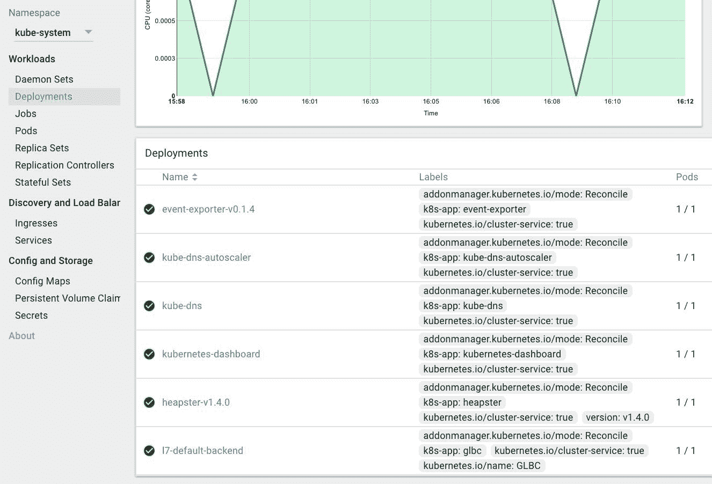

# 接下来是什么

到目前为止，我们已经讨论了在 Kubernetes 上进行 DevOps 任务的各种主题。然而，在实际情况下实施知识总是具有挑战性，因此您可能会想知道 Kubernetes 是否能够解决您目前面临的特定问题。在本章中，我们将学习以下主题来解决挑战：

+   高级 Kubernetes 特性

+   Kubernetes 社区

+   其他容器编排框架

# 探索 Kubernetes 的可能性

Kubernetes 每天都在不断发展，以每季度发布一个主要版本的速度发展。除了每个新 Kubernetes 发行版都带有的内置功能之外，社区的贡献也在生态系统中发挥着重要作用，我们将在本节中对它们进行一番探讨。

# 精通 Kubernetes

Kubernetes 的对象和资源分为三个 API 跟踪，即 alpha、beta 和 stable，以表示它们的成熟度。每个资源开头的`apiVersion`字段表示它们的级别。如果一个功能有类似 v1alpha1 的版本，它属于 alpha 级 API，beta API 以相同的方式命名。alpha 级 API 默认禁用，并且可能会在不通知的情况下发生变化。

beta 级别的 API 默认启用；经过充分测试，被认为是稳定的，但模式或对象语义也可能会发生变化。其余部分是稳定的，通常可用的部分。一旦 API 进入稳定阶段，就不太可能再发生变化。

尽管我们已经广泛讨论了 Kubernetes 的概念和实践，但仍然有许多重要特性尚未提及，涉及各种工作负载和场景，使 Kubernetes 变得非常灵活。它们可能适用于某些人的需求，但在特定情况下并不稳定。让我们简要地看一下流行的特性。

# 作业和定时作业

它们还是高级的 Pod 控制器，允许我们运行最终会终止的容器。作业确保一定数量的 Pod 成功完成运行；CronJob 确保在指定时间调用作业。如果我们需要运行批量工作负载或定时任务，我们会知道内置控制器会发挥作用。相关信息可以在以下网址找到：[`kubernetes.io/docs/concepts/workloads/controllers/jobs-run-to-completion/`](https://kubernetes.io/docs/concepts/workloads/controllers/jobs-run-to-completion/)。

# Pod 和节点之间的亲和性和反亲和性

我们知道可以使用节点选择器手动将 Pod 分配给某些节点，并且节点可以拒绝带有污点的 Pod。然而，在更灵活的情况下，也许我们希望一些 Pod 共存，或者我们希望 Pod 在可用性区域之间均匀分布，通过节点选择器或节点污点来安排我们的 Pod 可能需要很大的努力。因此，亲和性旨在解决这种情况：[`kubernetes.io/docs/concepts/configuration/assign-pod-node/#affinity-and-anti-affinity`](https://kubernetes.io/docs/concepts/configuration/assign-pod-node/#affinity-and-anti-affinity)。

# Pod 的自动扩展

几乎所有现代基础设施都支持自动扩展运行应用程序的实例组，Kubernetes 也是如此。Pod 水平扩展器（`PodHorizontalScaler`）能够根据 CPU/内存指标在诸如 Deployment 的控制器中扩展 Pod 副本。从 Kubernetes 1.6 开始，该扩展器正式支持基于自定义指标（例如每秒事务数）的扩展。更多信息可以在[`kubernetes.io/docs/tasks/run-application/horizontal-pod-autoscale/`](https://kubernetes.io/docs/tasks/run-application/horizontal-pod-autoscale/)找到。

# 预防和减轻 Pod 中断

我们知道 Pod 是不稳定的，它们会在集群的扩展和收缩过程中在节点之间被终止和重新启动。如果一个应用程序的太多 Pod 同时被销毁，可能会导致服务水平下降甚至应用程序失败。特别是当应用程序是有状态的或基于法定人数的时候，它可能几乎无法容忍 Pod 的中断。为了减轻中断，我们可以利用`PodDisruptionBudget`来告知 Kubernetes 我们的应用程序在任何给定时间内可以容忍多少个不可用的 Pod，以便 Kubernetes 能够在了解其上的应用程序的情况下采取适当的行动。有关更多信息，请参阅[`kubernetes.io/docs/concepts/workloads/pods/disruptions/`](https://kubernetes.io/docs/concepts/workloads/pods/disruptions/)。

另一方面，由于`PodDisruptionBudget`是一个受管理的对象，它仍然无法排除 Kubernetes 之外的因素引起的中断，例如节点的硬件故障，或者由于内存不足而被系统杀死的节点组件。因此，我们可以将诸如 node-problem-detector 之类的工具纳入我们的监控堆栈，并适当配置节点资源的阈值，以通知 Kubernetes 开始排空节点或驱逐过多的 Pod，以防止情况恶化。有关 node-problem-detector 和资源阈值的更详细指南，请参阅以下主题：

+   [`kubernetes.io/docs/tasks/debug-application-cluster/monitor-node-health/`](https://kubernetes.io/docs/tasks/debug-application-cluster/monitor-node-health/)

+   [`kubernetes.io/docs/tasks/administer-cluster/out-of-resource/`](https://kubernetes.io/docs/tasks/administer-cluster/out-of-resource/)

# Kubernetes 联邦

联邦是一组集群。换句话说，它由多个 Kubernetes 集群组成，并且可以从单个控制平面访问。在联邦上创建的资源将在所有连接的集群中同步。截至 Kubernetes 1.7，可以联邦的资源包括 Namespace、ConfigMap、Secret、Deployment、DaemonSet、Service 和 Ingress。

联邦的能力为我们构建混合平台带来了另一个灵活性水平，例如，我们可以将部署在本地数据中心和各种公共云中的集群联合起来，通过成本分配工作负载，并利用特定于平台的功能，同时保持灵活性以便移动。另一个典型的用例是将分散在不同地理位置的集群联合起来，以降低全球客户的边缘延迟。此外，支持 5,000 个节点的单个 Kubernetes 集群（在版本 1.6 上）可以保持 API 响应时间的 p99 小于 1 秒。如果需要具有数千个节点或更多的集群，我们可以通过联合集群来实现。

联邦指南可以在以下链接找到：[`kubernetes.io/docs/tasks/federation/set-up-cluster-federation-kubefed/`](https://kubernetes.io/docs/tasks/federation/set-up-cluster-federation-kubefed/)。

# 集群附加组件

集群附加组件是旨在增强 Kubernetes 集群的程序，被认为是 Kubernetes 的固有部分。例如，我们在第六章中使用的 Heapster，*监控和日志*，是其中一个附加组件，我们之前提到的 node-problem-detector 也是如此。

由于集群附加组件可能用于一些关键功能，一些托管的 Kubernetes 服务（如 GKE）部署了附加组件管理器，以保护附加组件的状态不被修改或删除。托管的附加组件将在 pod 控制器上部署一个标签`addonmanager.kubernetes.io/mode`。如果模式是`Reconcile`，对规范的任何修改都将回滚到其初始状态；`EnsureExists`模式只检查控制器是否存在，但不检查其规范是否被修改。例如，默认情况下，在 1.7.3 GKE 集群上部署以下部署，并且它们都受到`Reconcile`模式的保护：



如果您想在自己的集群中部署附加组件，可以在以下链接找到它们：[`github.com/kubernetes/kubernetes/tree/master/cluster/addons`](https://github.com/kubernetes/kubernetes/tree/master/cluster/addons)。

# Kubernetes 和社区

在选择要使用的开源工具时，我们肯定会想知道在开始使用后它的支持性如何。支持性包括项目的领导者是谁，项目是否持有意见，项目的受欢迎程度等因素。

Kubernetes 起源于 Google，现在由**Cloud Native Computing Foundation**（**CNCF**，[`www.cncf.io`](https://www.cncf.io)）支持。在 Kubernetes 1.0 发布时，Google 与 Linux 基金会合作成立了 CNCF，并捐赠了 Kubernetes 作为种子项目。CNCF 旨在推动容器化、动态编排和面向微服务的应用程序的发展。

由于 CNCF 下的所有项目都是基于容器的，它们肯定可以与 Kubernetes 无缝配合。Prometheus、Fluentd 和 OpenTracing，我们在第六章中展示和提到的*监控和日志*，都是 CNCF 的成员项目。

# Kubernetes 孵化器

Kubernetes 孵化器是支持 Kubernetes 项目的过程：

[`github.com/kubernetes/community/blob/master/incubator.md`](https://github.com/kubernetes/community/blob/master/incubator.md).

毕业项目可能成为 Kubernetes 的核心功能、集群附加组件，或者是 Kubernetes 的独立工具。在整本书中，我们已经看到并使用了许多这样的项目，包括 Heapster、cAdvisor、仪表板、minikube、kops、kube-state-metrics 和 kube-problem-detector，所有这些都让 Kubernetes 变得更好。您可以在 Kubernetes（[`github.com/kubernetes`](https://github.com/kubernetes)）或孵化器（[`github.com/kubernetes-incubator`](https://github.com/kubernetes-incubator)）下探索这些项目。

# Helm 和图表

Helm（[`github.com/kubernetes/helm`](https://github.com/kubernetes/helm)）是一个软件包管理器，简化了在 Kubernetes 上运行软件的 day-0 到 day-n 操作。它也是孵化器中的一个毕业项目。

正如我们在第七章中学到的，*持续交付*，将容器化软件部署到 Kubernetes 基本上就是编写清单。尽管如此，一个应用可能由数十个 Kubernetes 资源构建而成。如果我们要多次部署这样的应用程序，重命名冲突部分的任务可能会很繁琐。如果我们引入模板引擎的概念来解决重命名的困扰，我们很快就会意识到我们应该有一个地方来存储模板以及渲染后的清单。因此，Helm 旨在解决这些烦人的琐事。

Helm 中的一个包被称为 chart，它是运行应用程序的配置、定义和清单的集合。社区贡献的图表发布在这里：[`github.com/kubernetes/charts`](https://github.com/kubernetes/charts)。即使我们不打算使用它，我们仍然可以在那里找到特定包的经过验证的清单。

使用 Helm 非常简单。首先通过运行官方安装脚本获取 Helm：[`raw.githubusercontent.com/kubernetes/helm/master/scripts/get`](https://raw.githubusercontent.com/kubernetes/helm/master/scripts/get)。

在获取 Helm 二进制文件后，它会获取我们的 kubectl 配置以连接到集群。我们需要在 Kubernetes 集群中有一个名为`Tiller`的管理器来管理 Helm 的每个部署任务：

```
$ helm init
$HELM_HOME has been configured at /Users/myuser/.helm.

Tiller (the Helm server-side component) has been installed into your Kubernetes Cluster.
Happy Helming!  
```

如果我们想要在不将 Tiller 安装到我们的 Kubernetes 集群中的情况下初始化 Helm 客户端，我们可以在`helm init`中添加`--client-only`标志。此外，一起使用`--skip-refresh`标志可以让我们离线初始化客户端。

Helm 客户端能够从命令行搜索可用的图表：

```
$ helm search
NAME                          VERSION     DESCRIPTION
stable/aws-cluster-autoscaler 0.2.1       Scales worker nodes within autoscaling groups.
stable/chaoskube              0.5.0       Chaoskube periodically kills random pods in you...
...
stable/uchiwa                 0.2.1       Dashboard for the Sensu monitoring framework
stable/wordpress              0.6.3       Web publishing platform for building blogs and ...  
```

让我们从存储库安装一个图表，比如最后一个`wordpress`：

```
$ helm install stable/wordpress
NAME:   plinking-billygoat
LAST DEPLOYED: Wed Sep  6 01:09:20 2017
NAMESPACE: default
STATUS: DEPLOYED
...  
```

在 Helm 中部署的图表被称为发布。在这里，我们有一个名为`plinking-billygoat`的发布已安装。一旦 pod 和服务准备就绪，我们就可以连接到我们的站点并检查结果。


释放发布也只需要一行命令：

```
$ helm delete plinking-billygoat
release "plinking-billygoat" deleted 
```

Helm 利用 ConfigMap 来存储发布的元数据，但使用`helm delete`删除发布不会删除其元数据。要完全清除这些元数据，我们可以手动删除这些 ConfigMaps，或者在执行`helm delete`时添加`--purge`标志。

除了在我们的集群中管理软件包，Helm 带来的另一个价值是它被确立为共享软件包的标准，因此它允许我们直接安装流行的软件，比如我们安装的 Wordpress，而不是为我们使用的每个软件重写清单。

# 朝着未来基础设施的发展趋势。

很难判断一个工具是否合适，特别是在选择一个支撑业务任务的集群管理软件时，因为每个人面临的困难和挑战都不同。除了性能、稳定性、可用性、可扩展性和可用性等客观问题外，实际情况也占据了决策的重要部分。例如，选择一个堆栈来开发全新项目和在庞大的传统系统之上构建额外层次的观点可能是不同的。同样，由高度内聚的 DevOps 团队和以老式方式工作的组织来操作服务也可能导致不同的选择。

除了 Kubernetes，还有其他平台也具有容器编排功能，并且它们都提供了一些简单的入门方式。让我们退一步，对它们进行概述，找出最合适的选择。

# Docker swarm 模式

Swarm 模式（[`docs.docker.com/engine/swarm/`](https://docs.docker.com/engine/swarm/)）是自 Docker 1.12 版本以来集成在 Docker 引擎中的本地编排器。因此，它与 Docker 本身共享相同的 API 和用户界面，包括使用 Docker Compose 文件。这种程度的集成被认为是优势，也被认为是劣势，取决于一个人是否习惯于在一个堆栈上工作，其中所有组件都来自同一个供应商。

一个 swarm 集群由管理者和工作者组成，其中管理者是共识组的一部分，用于维护集群的状态并保持高可用性。启用 swarm 模式非常容易。大致上，这里只有两个步骤：使用`docker swarm init`创建一个集群，然后使用`docker swarm join`加入其他管理者和工作者。此外，Docker 提供的 Docker Cloud（[`cloud.docker.com/swarm`](https://cloud.docker.com/swarm)）帮助我们在各种云提供商上引导一个 swam 集群。

Swarm 模式带来的功能是我们在容器平台中所期望的，也就是说，容器生命周期管理，两种调度策略（复制和全局，分别类似于 Kubernetes 中的部署和 DaemonSet），服务发现，秘密管理等。还有一个类似于 Kubernetes 中 NodePort 类型服务的入口网络，但如果我们需要 L7 层负载均衡器，我们将不得不启动类似 nginx 或 Traefik 的东西。

总的来说，Swarm 模式提供了一个选项，可以在开始使用 Docker 后立即使用的编排容器化应用程序。与此同时，由于它与 Docker 使用相同的语言和简单的架构，它也被认为是所有选择中最简单的平台。因此，选择 Swarm 模式来快速完成某些工作是合理的。然而，它的简单性有时会导致缺乏灵活性。例如，在 Kubernetes 中，我们可以通过简单地操作选择器和标签来使用蓝/绿部署策略，但在 Swarm 模式中没有简单的方法来实现这一点。由于 Swarm 模式仍在积极开发中，例如在 17.06 版本中引入了存储配置数据的功能，这类似于 Kubernetes 中的 ConfigMap，我们确实可以期待 Swarm 模式在保持简单性的同时在未来变得更加强大。

# 亚马逊 EC2 容器服务

EC2 容器服务（ECS，[`aws.amazon.com/ecs/`](https://aws.amazon.com/ecs/)）是 AWS 对 Docker 激增的回应。与谷歌云平台和微软 Azure 提供的开源集群管理器（如 Kubernetes，Docker Swarm 和 DC/OS）不同，AWS 坚持采用自己的方式来满足容器服务的需求。

ECS 将 Docker 作为其容器运行时，并且还接受语法版本 2 的 Docker Compose 文件。此外，ECS 和 Docker Swarm 模式的术语基本相同，比如任务和服务的概念。然而，相似之处止步于此。尽管 ECS 的核心功能简单甚至基本，作为 AWS 的一部分，ECS 充分利用其他 AWS 产品来增强自身，比如用于容器网络的 VPC，用于监控和日志记录的 CloudWatch 和 CloudWatch Logs，用于服务发现的 Application LoadBalancer 和 Network LoadBalancer 与 Target Groups，用于基于 DNS 的服务发现的 Lambda 与 Route 53，用于 CronJob 的 CloudWatch Events，用于数据持久性的 EBS 和 EFS，用于 Docker 注册表的 ECR，用于存储配置文件和秘密的 Parameter Store 和 KMS，用于 CI/CD 的 CodePipeline 等等。还有另一个 AWS 产品，AWS Batch（[`aws.amazon.com/batch/`](https://aws.amazon.com/batch/)），它是建立在 ECS 之上用于处理批处理工作负载的。此外，AWS ECS 团队的开源工具 Blox（[`blox.github.io`](https://blox.github.io)）增强了定制调度的能力，这些能力在 ECS 中没有提供，比如类似 DaemonSet 的策略，通过将 AWS 产品进行耦合。从另一个角度来看，如果我们将 AWS 作为一个整体来评估 ECS，它确实非常强大。

建立 ECS 集群很容易：通过 AWS 控制台或 API 创建 ECS 集群，并使用 ECS 代理将 EC2 节点加入集群。好处在于，主控端由 AWS 管理，因此我们无需时刻警惕主控端。

总的来说，ECS 很容易上手，特别是对于熟悉 Docker 和 AWS 产品的人来说。另一方面，如果我们对目前提供的基本功能不满意，我们必须通过其他 AWS 服务或第三方解决方案来完成一些手工工作，这可能会导致在这些服务上产生不必要的成本，并且需要配置和维护来确保每个组件能够良好地协同工作。此外，ECS 仅在 AWS 上可用，这也可能是人们认真对待它的一个关注点。

# Apache Mesos

Mesos（[`mesos.apache.org/)`](http://mesos.apache.org/)）在 Docker 引发容器潮流之前就已经存在，其目标是解决集群中资源管理的困难，同时支持各种工作负载。为了构建这样一个通用平台，Mesos 利用两层架构来划分资源分配和任务执行。因此，执行部分理论上可以扩展到任何类型的任务，包括编排 Docker 容器。

尽管我们在这里只谈到了 Mesos 这个名字，但实际上它基本上负责一层工作，执行部分是由其他组件称为 Mesos 框架来完成的。例如，Marathon（[`mesosphere.github.io/marathon/`](https://mesosphere.github.io/marathon/)）和 Chronos（[`mesos.github.io/chronos/`](https://mesos.github.io/chronos/)）是两个流行的框架，分别用于部署长时间运行和批处理任务，并且两者都支持 Docker 容器。因此，当提到 Mesos 这个术语时，它指的是一个堆栈，比如 Mesos/Marathon/Chronos 或 Mesos/Aurora。事实上，在 Mesos 的两层架构下，也可以将 Kubernetes 作为 Mesos 框架来运行。

坦率地说，一个组织良好的 Mesos 堆栈和 Kubernetes 在能力方面基本上是一样的，只是 Kubernetes 要求在其上运行的一切都应该是容器化的，无论是 Docker、rkt 还是虚拟化容器。另一方面，由于 Mesos 专注于其通用调度，并倾向于保持其核心精简，一些基本功能需要单独安装、测试和操作，这可能需要额外的努力。

Mesosphere 发布的 DC/OS（[`dcos.io/`](https://dcos.io/)）利用 Mesos 构建了一个全栈集群管理平台，这在功能上更类似于 Kubernetes。作为建立在 Mesos 之上的每个解决方案的一站式商店，它捆绑了一些组件来驱动整个系统，Marathon 用于常见工作负载，Metronome 用于定期作业，Mesos-DNS 用于服务发现等等。尽管这些构建块似乎很复杂，但 DC/OS 通过 CloudFormation/Terraform 模板和其软件包管理系统 Mesosphere Universe 大大简化了安装和配置工作。自 DC/OS 1.10 以来，Kubernetes 已正式集成到 DC/OS 中，并可以通过 Universe 安装。托管的 DC/OS 也可在一些云提供商上使用，如 Microsoft Azure。

以下截图是 DC/OS 的 Web 控制台界面，汇总了来自每个组件的信息：


到目前为止，我们已经讨论了 DC/OS 的社区版本，但一些功能仅在企业版中可用。它们主要涉及安全性和合规性，列表可以在[`mesosphere.com/pricing/`](https://mesosphere.com/pricing/)找到。

# 摘要

在本章中，我们简要讨论了适用于特定更具体用例的 Kubernetes 功能，并指导了如何利用强大的社区，包括 Kubernetes 孵化器和软件包管理器 Helm。

最后，我们回到起点，概述了实现相同目标的其他三种流行替代方案：编排容器，以便让您选择下一代基础架构的结论留在您的脑海中。
