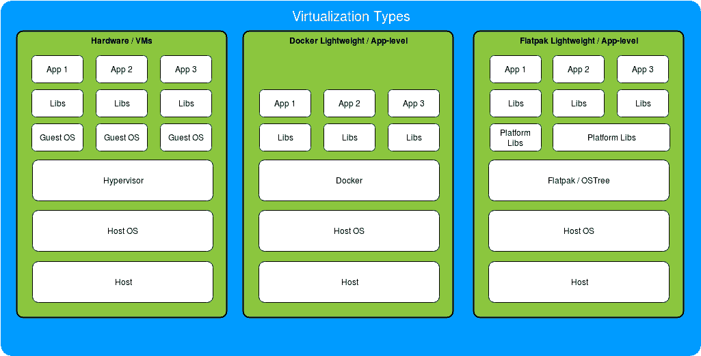

# 第一章：容器-不只是另一个时髦词汇

在技术领域，有时进步的跳跃很小，但就像容器化一样，这种跳跃是巨大的，完全颠覆了长期以来的实践和教学。通过这本书，我们将带你从运行一个微小的服务到使用 Docker 构建弹性可扩展的系统，Docker 是这场革命的基石。我们将通过基本模块进行稳定而一致的升级，重点关注 Docker 的内部工作，随着我们的继续，我们将尽量花费大部分时间在复杂部署及其考虑的世界中。

让我们来看看本章我们将涵盖的内容：

+   什么是容器，为什么我们需要它们？

+   Docker 在容器世界中的地位

+   以容器思维思考

# 容器的作用和意义

我们不能谈论 Docker 而不实际涵盖使其成为强大工具的想法。在最基本的层面上，容器是给定离散功能集的隔离用户空间环境。换句话说，这是一种将系统（或其中的一部分）模块化为更容易管理和维护的部分的方式，同时通常也非常耐用。

实际上，这种净收益从来都不是免费的，需要在采用和实施新工具（如 Docker）上进行一些投资，但这种变化在其生命周期内大大减少了开发、维护和扩展成本，为采用者带来了丰厚的回报。

在这一点上，你可能会问：容器究竟如何能够提供如此巨大的好处？要理解这一点，我们首先需要看一下在此类工具可用之前的部署情况。

在早期的部署中，部署服务的过程大致如下：

1.  开发人员会编写一些代码。

1.  运维团队会部署该代码。

1.  如果部署中出现任何问题，运维团队会告诉开发人员修复一些东西，然后我们会回到第一步。

这个过程的简化看起来大致如下：

[PRE0]

开发人员必须等待整个过程为他们弹回，以尝试在出现问题时编写修复程序。更糟糕的是，运维团队通常必须使用各种古怪的魔法来确保开发人员给他们的代码实际上可以在部署机器上运行，因为库版本、操作系统补丁和语言编译器/解释器的差异都是高风险的失败，并且很可能在这个漫长的破坏-修补-部署尝试周期中花费大量时间。

部署演进的下一步是通过虚拟化裸机主机来改进这个工作流程，因为手动维护异构机器和环境的混合是一场完全的噩梦，即使它们只有个位数。早期的工具如`chroot`在 70 年代后期出现，但后来被（尽管没有完全）Xen、KVM、Hyper-V 等虚拟化技术所取代，这不仅减少了更大系统的管理复杂性，还为运维人员和开发人员提供了更一致、更计算密集的部署环境。

[PRE1]

这有助于减少管道末端的故障，但从开发人员到部署的路径仍然存在风险，因为虚拟机环境很容易与开发人员不同步。

从这里开始，如果我们真的试图找出如何使这个系统更好，我们已经可以看到 Docker 和其他容器技术是有机的下一步。通过使开发人员的沙盒环境尽可能接近生产环境，具有足够功能的容器系统的开发人员可以绕过运维步骤，确保代码在部署环境上能够运行，并防止由于多个团队交互的开销而导致的漫长重写周期：

[PRE2]

随着运维主要在系统设置的早期阶段需要，开发人员现在可以直接将他们的代码从想法一直推送到用户，他们可以有信心地解决大部分问题。

如果你认为这是部署服务的新模式，那么现在理解为什么我们现在有了 DevOps 角色，为什么**平台即服务**（PaaS）设置如此受欢迎，以及为什么如此多的科技巨头可以在 15 分钟内通过开发人员的`git push origin`这样简单的操作对数百万人使用的服务进行更改，而无需与系统进行任何其他交互，是非常合理的。

但好处并不仅限于此！如果你到处都有许多小容器，如果你对某项服务的需求增加或减少，你可以增加或减少主机的一部分，如果容器编排做得当，那么在扩展或缩减时将会零停机和用户察觉不到的变化。这对需要在不同时间处理可变负载的服务提供商非常方便--以 Netflix 及其高峰观看时间为例。在大多数情况下，这些也可以在几乎所有云平台上自动化（即 AWS 自动扩展组，Google 集群自动缩放器和 Azure 自动缩放器），因此，如果发生某些触发器或资源消耗发生变化，服务将自动扩展和缩减主机数量以处理负载。通过自动化所有这些过程，你的 PaaS 基本上可以成为一个灵活的一劳永逸的层，开发人员可以在其上担心真正重要的事情，而不必浪费时间去弄清楚一些系统库是否安装在部署主机上。

现在不要误会我的意思；制作这些令人惊叹的 PaaS 服务绝非易事，而且道路上布满了无数隐藏的陷阱，但如果你想在夜间能够安然入睡，不受愤怒客户、老板或同事的电话骚扰，无论你是开发人员还是其他人，你都必须努力尽可能接近这些理想的设置。

# Docker 的位置

到目前为止，我们已经谈了很多关于容器，但还没有提到 Docker。虽然 Docker 已经成为容器化的事实标准，但它目前是这个领域中许多竞争技术之一，今天相关的内容可能明天就不再适用。因此，我们将涵盖一些容器生态系统的内容，这样如果你看到这个领域发生变化，不要犹豫尝试其他解决方案，因为选择合适的工具几乎总是比试图“把方形钉子塞进圆孔”更好。

虽然大多数人知道 Docker 作为**命令行界面**（**CLI**）工具，但 Docker 平台扩展到包括创建和管理集群的工具、处理持久存储、构建和共享 Docker 容器等等，但现在，我们将专注于该生态系统中最重要的部分：Docker 容器。

# Docker 容器简介

Docker 容器本质上是一组文件系统层，这些层按顺序堆叠在一起，以创建最终的布局，然后由主机机器的内核在隔离的环境中运行。每个层描述了相对于其上一个父层添加、修改和/或删除的文件。例如，你有一个基本层，其中有一个文件`/foo/bar`，下一个层添加了一个文件`/foo/baz`。当容器启动时，它将按顺序组合层，最终的容器将同时拥有`/foo/bar`和`/foo/baz`。对于任何新层，这个过程都会重复，以得到一个完全组成的文件系统来运行指定的服务或服务。

把镜像中文件系统层的安排想象成交响乐中复杂的层次：你有后面的打击乐器提供声音的基础，稍微靠前的吹奏乐器推动乐曲的发展，最前面的弦乐器演奏主旋律。一起，它创造了一个令人愉悦的最终结果。在 Docker 的情况下，通常有基本层设置主要的操作系统层和配置，服务基础设施层放在其上（解释器安装，辅助工具的编译等），最终运行的镜像最终是实际的服务代码。现在，这就是你需要知道的全部，但我们将在下一章节中更详细地涵盖这个主题。

实质上，Docker 在其当前形式下是一个平台，允许在容器内轻松快速地开发隔离的（或者取决于服务配置的）Linux 和 Windows 服务，这些容器是可扩展的，易于互换和分发的。

# 竞争

在我们深入讨论 Docker 本身之前，让我们也大致了解一下一些当前的竞争对手，并看看它们与 Docker 本身的区别。几乎所有这些竞争对手的有趣之处在于，它们通常是围绕 Linux 控制组（`cgroups`）和命名空间的一种抽象形式，这些控制组限制了 Linux 主机的物理资源的使用，并将进程组相互隔离。虽然这里提到的几乎所有工具都提供了某种资源的容器化，但在隔离深度、实现安全性和/或容器分发方面可能存在很大差异。

# rkt

`rkt`，通常写作**Rocket**，是来自 CoreOS 的最接近的竞争应用容器化平台，它最初是作为更安全的应用容器运行时启动的。随着时间的推移，Docker 已经解决了许多安全问题，但与`rkt`不同的是，它以有限的权限作为用户服务运行，而 Docker 的主要服务以 root 权限运行。这意味着如果有人设法打破 Docker 容器，他们将自动获得对主机 root 的完全访问权限，从运营的角度来看，这显然是一个非常糟糕的事情，而使用`rkt`，黑客还需要提升他们的权限从有限用户。虽然从安全的角度来看，这里的比较并没有给 Docker 带来太大的光明，但如果其发展轨迹可以被推断，这个问题可能会在未来得到很大程度的缓解和/或修复。

另一个有趣的区别是，与 Docker 不同，它被设计为在容器内运行单个进程，`rkt`可以在一个容器内运行多个进程。这使得在单个容器内部部署多个服务变得更加容易。现在，话虽如此，你实际上*可以*在 Docker 容器内运行多个进程（我们将在本书的后面部分介绍），但是正确设置这一点是非常麻烦的，但我在实践中发现，保持基于单个进程的服务和容器的压力确实促使开发人员创建真正的微服务容器，而不是将它们视为迷你虚拟机，所以不一定认为这是一个问题。

虽然有许多其他较小的原因可以选择 Docker 而不是`rkt`，反之亦然，但有一件重要的事情是无法忽视的：采用速度。虽然`rkt`有点年轻，但 Docker 已经被几乎所有大型科技巨头采用，而且似乎没有任何停止这一趋势的迹象。考虑到这一点，如果您今天需要处理微服务，选择可能非常明确，但与任何技术领域一样，生态系统在一年甚至只是几个月内可能看起来大不相同。

# 系统级虚拟化

在对立的一面，我们有用于处理完整系统镜像而不是像 LXD、OpenVZ、KVM 和其他一些应用程序的平台。与 Docker 和`rkt`不同，它们旨在为您提供所有虚拟化系统服务的全面支持，但纯粹从定义上来说，资源使用成本要高得多。虽然在主机上拥有单独的系统容器对于诸如更好的安全性、隔离性和可能的兼容性之类的事情是必要的，但根据个人经验，几乎所有这些容器的使用都可以转移到应用级虚拟化系统，只需进行一些工作即可提供更好的资源使用配置文件和更高的模块化，而在创建初始基础设施时稍微增加成本。在这里要遵循的一个明智的规则是，如果您正在编写应用程序和服务，您可能应该使用应用级虚拟化，但如果您正在为最终用户提供 VM 或者希望在服务之间获得更高的隔离性，您应该使用系统级虚拟化。

# 桌面应用程序级虚拟化

Flatpak、AppImage、Snaps 和其他类似技术也为单应用级容器提供隔离和打包，但与 Docker 不同，它们都针对部署桌面应用程序，并且对容器的生命周期（启动、停止、强制终止等）没有如此精确的控制，也通常不提供分层镜像。相反，大多数这些工具都有很好的图形用户界面（GUI），并为安装、运行和更新桌面应用程序提供了显着更好的工作流程。虽然由于对所述 cgroups 和命名空间的相同依赖，大多数与 Docker 有很大的重叠，但这些应用级虚拟化平台通常不处理服务器应用程序（没有 UI 组件运行的应用程序），反之亦然。由于这个领域仍然很年轻，它们所覆盖的空间相对较小，你可能可以期待整合和交叉，因此在这种情况下，要么是 Docker 进入桌面应用程序交付领域，要么是其中一个或多个竞争技术尝试支持服务器应用程序。

# 何时应考虑容器化？

到目前为止，我们已经涵盖了很多内容，但有一个重要的方面我们还没有涵盖，但这是一个非常重要的事情要评估，因为在许多情况下容器化并不合理，无论这个概念有多大的关注度，所以我们将涵盖一些真正应该考虑（或不应该考虑）这种类型平台的一般用例。虽然从运营角度来看，容器化应该是大多数情况下的最终目标，并且在注入到开发过程中时可以带来巨大的回报，但将部署机器转变为容器化平台是一个非常棘手的过程，如果你无法从中获得实际的好处，那么你可能还不如把这段时间用在能为你的服务带来真正和实际价值的事情上。

让我们首先从覆盖缩放阈值开始。如果你的服务作为一个整体可以完全适应并在相对较小或中等虚拟机或裸金属主机上良好运行，并且你不预期突然的扩展需求，部署机器上的虚拟化将使你陷入痛苦的道路，在大多数情况下并不合理。即使是建立一个良性但健壮的虚拟化设置的高前期成本，通常也更好地花在该级别的服务功能开发上。

如果你看到一个由虚拟机或裸金属主机支持的服务需求增加，你可以随时将其扩展到更大的主机（垂直扩展）并重新聚焦你的团队，但除此之外，你可能不应该选择这条路。有许多情况下，一家企业花了几个月的时间来实施容器技术，因为它非常受欢迎，最终由于缺乏开发资源而失去了客户，不得不关闭他们的业务。

现在你的系统正在达到垂直可扩展性的极限，是时候添加诸如 Docker 集群之类的东西了吗？真正的答案是“可能”。如果你的服务在主机上是同质的和一致的，比如分片或集群数据库或简单的 API，在大多数情况下，现在也不是合适的时机，因为你可以通过主机镜像和某种负载均衡器轻松扩展这个系统。如果你想要更多的花样，你可以使用基于云的“数据库即服务”（DBaaS），比如 Amazon RDS、Microsoft DocumentDB 或 Google BigQuery，并根据所需的性能水平通过同一提供商（甚至是不同的提供商）自动扩展服务主机。

如果除此之外还有大量的服务种类预示着，需要从开发人员到部署的更短管道，不断增长的复杂性或指数级增长，你应该将这些都视为重新评估你的利弊的触发器，但没有明确的阈值会成为一个明确的切入点。然而，在这里一个很好的经验法则是，如果你的团队有一个缓慢的时期，探索容器化选项或提升你在这个领域的技能不会有害，但一定要非常小心，不要低估设置这样一个平台所需的时间，无论这些工具中的许多看起来多么容易入门。

有了这一切，什么是你需要尽快将容器纳入工作流程的明显迹象？这里可能有许多微妙的暗示，但以下清单涵盖了如果答案是肯定的话，应立即讨论容器主题的迹象，因为其好处大大超过了投入服务平台的时间：

+   你的部署中是否有超过 10 个独特、离散且相互连接的服务？

+   你是否需要在主机上支持三种或更多编程语言？

+   你的运维资源是否不断部署和升级服务？

+   你的任何服务需要“四个 9”（99.99%）或更高的可用性吗？

+   你的部署中是否有服务经常在部署中出现故障的模式，因为开发人员没有考虑到服务将在其中运行的环境？

+   你是否有一支才华横溢的开发或运维团队闲置着？

+   你的项目是否在挥霍金钱？

好吧，也许最后一个有点玩笑，但它在清单中是为了以一种讽刺的语气来说明，写作时让 PaaS 平台运行、稳定和安全既不容易也不便宜，无论你的货币是时间还是金钱。许多人会试图欺骗你，让你认为你应该始终使用容器并使所有东西都 Docker 化，但保持怀疑的心态，并确保你仔细评估你的选择。

# 理想的 Docker 部署

既然我们已经完成了真实的谈话部分，让我们说我们真的准备好了来处理容器和 Docker 的虚构服务。我们在本章的前面已经涵盖了一些内容，但在这里，我们将明确定义我们的理想要求会是什么样子，如果我们有充足的时间来处理它们：

+   开发人员应能够部署新服务，而无需任何运维资源

+   系统可以自动发现正在运行的服务的新实例

+   系统在上下都具有灵活的可扩展性

+   在所需的代码提交上，新代码将在没有开发或运维干预的情况下自动部署

+   你可以无缝地处理降级节点和服务，而不会中断。

+   你能够充分利用主机上可用的资源（RAM、CPU 等）

+   节点几乎不需要被开发人员单独访问

如果这些是要求，您会高兴地知道几乎所有这些要求在很大程度上都是可行的，我们将在本书中详细介绍几乎所有这些要求。对于其中的许多要求，我们需要更深入地了解 Docker，并超越大多数其他材料，但教授您无法应用到实际场景的部署是没有意义的，这些部署只会打印出“Hello World”。

在我们探索以下章节中的每个主题时，我们一定会涵盖任何潜在的问题，因为有许多这样复杂的系统交互。有些对您来说可能很明显，但许多可能不会（例如 PID1 问题），因为这个领域的工具在相对年轻，许多对 Docker 生态系统至关重要的工具甚至还没有达到 1.0 版本，或者最近才达到 1.0 版本。

因此，您应该考虑这个技术领域仍处于早期发展阶段，所以要现实一点，不要期望奇迹，预期会有一些小“陷阱”。还要记住，一些最大的科技巨头现在已经使用 Docker 很长时间了（红帽、微软、谷歌、IBM 等），所以也不要感到害怕。

要开始并真正开始我们的旅程，我们需要首先重新考虑我们对服务的思考方式。

# 容器思维

今天，正如我们在本章稍早已经涵盖的那样，今天部署的绝大多数服务都是一团杂乱的临时或手动连接和配置的部分，一旦其中一个部分发生变化或移动，整个结构就会分崩离析。很容易想象这就像一堆纸牌，需要更改的部分通常位于其中间，存在风险将整个结构拆除。小到中等规模的项目和有才华的开发和运维团队大多可以管理这种复杂性，但这真的不是一种可扩展的方法。

# 开发者工作流程

即使您不是在开发 PaaS 系统，考虑将服务的每个部分都视为应该在开发人员和最终部署主机之间具有一致的环境，能够在任何地方运行并进行最小的更改，并且足够模块化，以便在需要时可以用 API 兼容的类似物替换。对于许多这种情况，即使是本地 Docker 使用也可以在使部署更容易方面发挥作用，因为您可以将每个组件隔离成不随着开发环境的变化而改变的小部分。

为了说明这一点，想象一个实际情况，我们正在编写一个简单的 Web 服务，该服务与基于最新 Ubuntu 的系统上的数据库进行通信，但我们的部署环境是 CentOS 的某个迭代版本。在这种情况下，由于它们支持周期长度的巨大差异，协调不同版本和库将非常困难，因此作为开发人员，您可以使用 Docker 为您提供与 CentOS 相同版本的数据库，并且您可以在基于 CentOS 的容器中测试您的服务，以确保所有库和依赖项在部署时可以正常工作。即使真实的部署主机没有容器化，这个过程也会改善开发工作流程。

现在，我们将以稍微更加现实的方向来看待这个例子：如果您需要在所有当前支持的 CentOS 版本上无需修改代码即可运行您的服务呢？

使用 Docker，您可以为每个操作系统版本创建一个容器，以便测试服务，以确保不会出现任何意外。另外，您可以自动化一个测试套件运行程序，逐个（甚至更好的是并行）启动每个操作系统版本的容器，以便在任何代码更改时自动运行整个测试套件。通过这些小的调整，我们已经将一个经常在生产中出现故障的临时服务转变为几乎不需要担心的东西，因为您可以确信它在部署时会正常工作，这是一个非常强大的工具。

如果您扩展这个过程，您可以在本地创建 Docker 配方（Dockerfiles），我们将在下一章中详细介绍，其中包含从纯净的 CentOS 安装到完全能够运行服务所需的确切步骤。这些步骤可以由运维团队以最小的更改作为输入，用于他们的自动化配置管理（CM）系统，如 Ansible、Salt、Puppet 或 Chef，以确保主机具有运行所需的确切基线。由服务开发人员编写的端目标上所需的确切步骤的编码传递，这正是 Docker 如此强大的原因。

希望显而易见的是，Docker 作为一种工具不仅可以改善部署机器上的开发流程，而且还可以在整个过程中用于标准化您的环境，从而提高几乎每个部署流程的效率。有了 Docker，您很可能会忘记那句让每个运维人员感到恐惧的臭名昭著的短语：“在我的机器上运行良好！”这本身就足以让您考虑在部署基础设施不支持容器的情况下，插入基于容器的工作流程。

在这里我们一直在绕着弯子说的底线是，您应该始终考虑的是，使用当前可用的工具，将整个部署基础设施转变为基于容器的基础设施略微困难，但在开发流程的任何其他部分添加容器通常并不太困难，并且可以为您的团队提供指数级的工作流程改进。

# 总结

在本章中，我们沿着部署的历史走了一遍，并看了看 Docker 容器是如何让我们更接近微服务的新世界的。我们对 Docker 进行了审查，概述了我们最感兴趣的部分。我们涵盖了竞争对手以及 Docker 在生态系统中的定位和一些使用案例。最后，我们还讨论了何时应该考虑容器在基础架构和开发工作流程中，更重要的是，何时不应该考虑。

在下一章中，我们最终将动手并了解如何安装和运行 Docker 镜像，以及创建我们的第一个 Docker 镜像，所以一定要继续关注。
