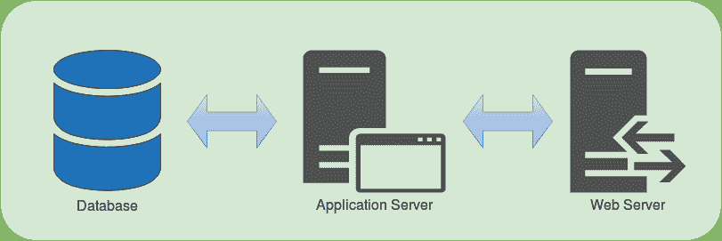
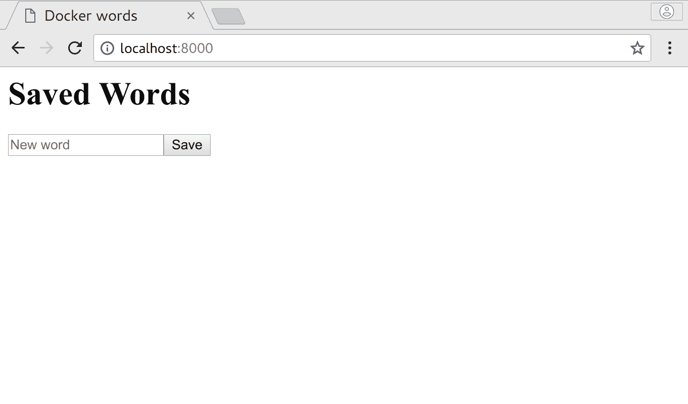
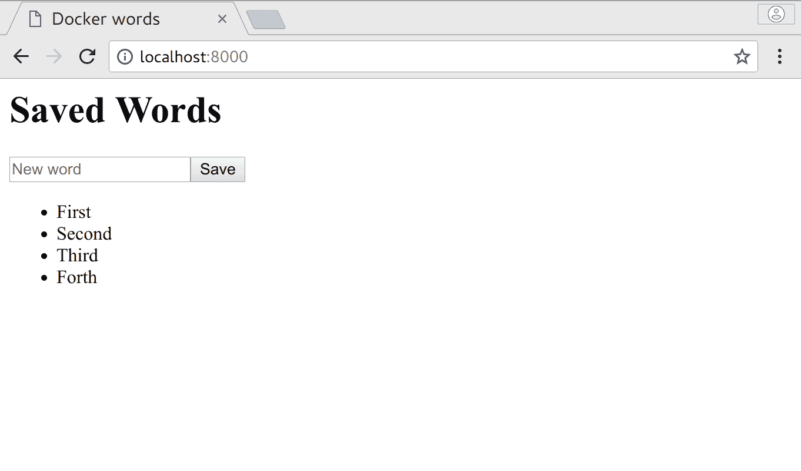
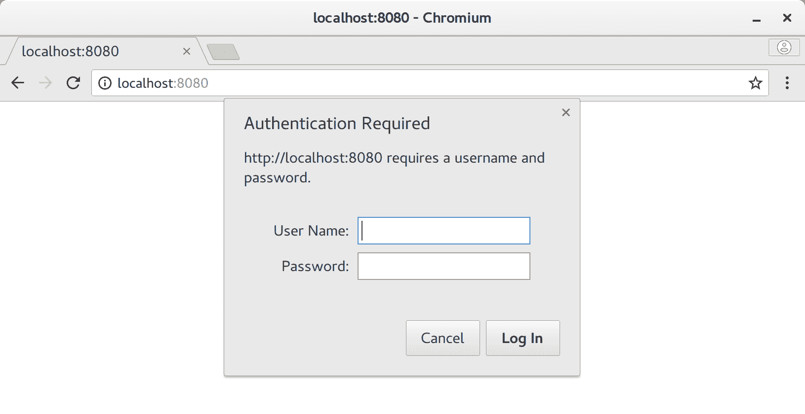
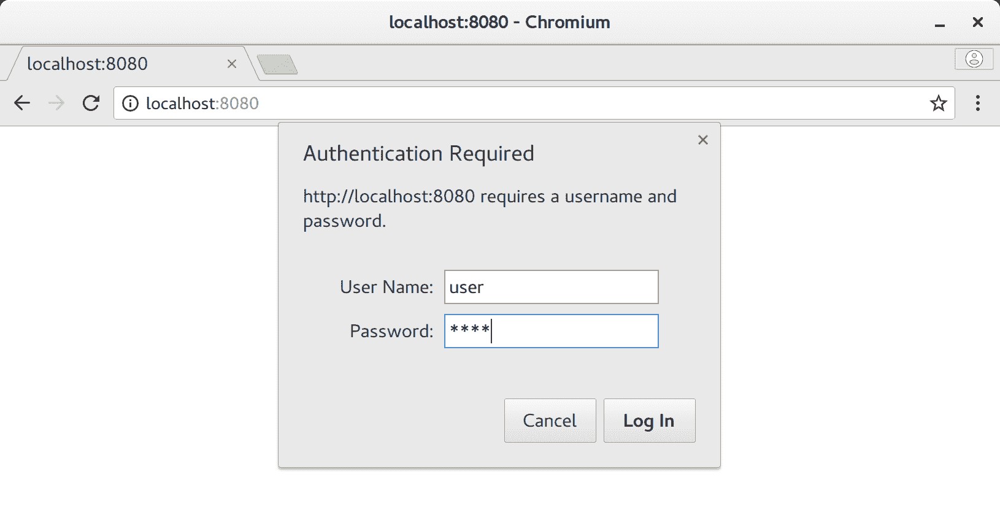

# 服务分解

本章将介绍如何利用上一章的知识来创建和构建数据库和应用服务器容器的附加部分，因为真实世界的服务通常是以这种方式组成的。一旦我们把它们都建立起来，我们将看到需要什么才能将它们组合成一个更可用的服务，并且深入了解 Docker 的更多内容。

在本章中，我们将涵盖以下主题：

+   Docker 命令的快速回顾

+   使用以下内容编写一个真实的服务：

+   一个 Web 服务器服务

+   一个应用服务

+   一个数据库

+   介绍卷

+   凭据传递的安全考虑

# 快速回顾

在我们开始之前，让我们回顾一下我们之前在一个单独的部分中涵盖的 Docker 和 Dockerfile 命令，以便您以后可以作为参考。

# Docker 命令

以下是我们为 Docker 提供的所有命令，还添加了一些其他命令，如果您经常构建容器，可能会用到：

要获取每个参数所需的更深入信息，或者查看我们尚未涵盖的命令，请在终端中键入`docker help`，或者单独在终端中键入该命令。您还可以访问[`docs.docker.com/`](https://docs.docker.com/)并查看文档，如果 CLI 输出提供的信息不够好，它可能包含更新的数据。

```
docker attach - Attach the shell's input/output/error stream to the container
docker build - Build a Docker image based on a provided Dockerfile
docker cp - Copy files between container and host
docker exec - Execute a command in a running container
docker images - List image available to your installation of docker
docker info - Display information about the system
docker inspect - Display information about Docker layers, containers, images, etc
docker kill - Forcefully terminate a container 
docker logs - Display logs from a container since it last started
docker pause - Pause all processes within a container
docker ps - List information about containers and their resource usage
docker pull - Pull an image from a remote repository into the local registry
docker push - Push an image from the local registry into a remote repository
docker rm - Remove a container
docker rmi - Remove an image from the local repository
docker run - Start a new container and run it
docker search - Search DockerHub for images
docker start - Start a stopped container
docker stop - Stop a running container nicely (wait for container to shut down)
docker tag - Create a tag for an image
docker top - Show running processes of a container
docker unpause - Resume all processes in a paused container
docker version - Show the Docker version
```

最近，Docker 命令已经开始被隔离到它们自己的 docker CLI 部分，比如`docker container`，以将它们与其他集群管理命令分开。要使用这种较新的语法，只需在任何命令前加上容器（即`docker stop`变成`docker container stop`）。您可以随意使用任何版本，但请注意，尽管新样式对于大多数 Docker 用法来说过于冗长，但您可能会发现旧样式在某个时候被弃用。

# Dockerfile 命令

以下列表与之前类似，但这次我们涵盖了在 Dockerfile 中可以使用的命令，并按照在 Dockerfile 中工作时的顺序进行了排列：

`FROM <image_name>[:<tag>]`: 将当前镜像基于`<image_name>`

`LABEL <key>=<value> [<key>=value>...]`: 向镜像添加元数据

`EXPOSE <port>`: 指示应该映射到容器中的端口

`WORKDIR <path>`: 设置当前目录以便执行后续命令

`RUN <command> [ && <command>... ]`: 执行一个或多个 shell 命令

`ENV <name>=<value>`：将环境变量设置为特定值

`VOLUME <path>`：表示应该外部挂载<路径>的卷

`COPY <src> <dest>`：将本地文件、一组文件或文件夹复制到容器中

`ADD <src> <dest>`：与`COPY`相同，但可以处理 URI 和本地存档

`USER <user | uid>`：为此命令之后的命令设置运行时上下文为`<user>`或`<uid>`

`CMD ["<path>", "<arg1>", ...]`：定义容器启动时要运行的命令

由于几乎所有您想要构建的容器都可以使用这个集合构建，因此这个列表并不是 Docker 命令的全部超集，其中一些被有意地省略了。如果您对`ENTRYPOINT`、`ARG`、`HEALTHCHECK`或其他内容感到好奇，可以在[`docs.docker.com/engine/reference/builder/`](https://docs.docker.com/engine/reference/builder/)上查看完整的文档。

# 编写一个真实的服务

到目前为止，我们已经花了时间制作了一些帮助我们建立 Docker 技能的假或模拟容器服务，但我们还没有机会去做一些类似真实世界服务的工作。一般来说，大多数在外部被使用的简单服务看起来会类似于高级别图表中所示的内容：



# 概述

在这里，我们将详细讨论每个服务。

**Web 服务器**：

我们刚刚看到的图像中最右边的部分是一个 Web 服务器。Web 服务器充当高速 HTTP 请求处理程序，并且通常在这种情况下被使用如下：

+   用于集群内资源、虚拟专用云（VPC）和/或虚拟专用网络（VPN）的反向代理端点

+   加固的守门人，限制资源访问和/或防止滥用

+   分析收集点

+   负载均衡器

+   静态内容交付服务器

+   应用服务器逻辑利用的减少器

+   SSL 终止端点

+   远程数据的缓存

+   数据二极管（允许数据的入口或出口，但不能同时）

+   本地或联合账户 AAA 处理程序

如果安全需求非常低，服务是内部的，处理能力充足，那么我们想象中的服务的这一部分并不总是严格要求的，但在几乎所有其他情况下，如果这些条件中的任何一个不满足，添加 Web 服务器几乎是强制性的。Web 服务器的一个很好的类比是你的家用路由器。虽然你不一定需要使用互联网，但专用路由器可以更好地共享你的网络，并作为你和互联网之间的专用安全设备。虽然我们在上一章中大部分时间都在使用 NGINX，但还有许多其他可以使用的（如 Apache、Microsoft IIS、lighttpd 等），它们通常在功能上是可以互换的，但要注意配置设置可能会有显著不同。

**应用服务器**：

所以，如果 Web 服务器为我们做了所有这些，应用服务器又做什么呢？应用服务器实际上是您的主要服务逻辑，通常包装在一些可通过 Web 访问的端点或队列消费的守护程序中。这一部分可以这样使用：

+   主要的网站框架

+   数据操作 API 逻辑

+   某种数据转换层

+   数据聚合框架

应用服务器与 Web 服务器的主要区别在于，Web 服务器通常在静态数据上运行，并在流程中做出通常是刚性的决定，而应用服务器几乎所有的动态数据处理都是以非线性方式进行的。属于这一类的通常是诸如 Node.js、Ruby on Rails、JBoss、Tornado 等框架，用于运行可以处理请求的特定编程语言应用程序。在这里不要认为需要一个大型框架是必需的，因为即使是正确的 Bash 脚本或 C 文件也可以完成同样的工作，并且仍然可以作为应用服务器的资格。

我们将尽可能多地将工作推迟到 Web 服务器而不是应用服务器上，原因是由于框架开销，应用服务器通常非常慢，因此不适合执行简单、小型和重复的任务，而这些任务对于 Web 服务器来说是小菜一碟。作为参考，一个专门的 Web 服务器在提供静态页面方面的效率大约是一个完全成熟的应用服务器的一个数量级，因此比大多数应用服务器快得多。正如前面提到的，你可能可以单独或通过一些调整在应用服务器上处理低负载，但超过这个范围的任何负载都需要一个专用的反向代理。

**数据库**：一旦我们掌握了这种逻辑和静态文件处理，它们在没有实际数据进行转换和传递时基本上是无用的。与使用数据的任何软件一样，这是通过后备数据库完成的。由于我们希望能够扩展系统的任何部分并隔离离散的组件，数据库有了自己的部分。然而，在容器之前的世界中，我们依赖于提供了**原子性**、**一致性**、**隔离性**和**持久性**（**ACID**）属性的大型单片数据库，并且它们完成了它们的工作。然而，在容器世界中，我们绝对不希望这种类型的架构，因为它既不像可靠性那样强大，也不像可水平扩展的数据库那样可水平扩展。

然而，使用这种新式数据库，通常无法得到与旧式数据库相同的保证，这是一个重要的区别。与 ACID 相比，大多数容器友好的数据库提供的是**基本可用**、**软状态**、**最终一致性**（**BASE**），这基本上意味着数据最终会正确，但在初始更新发送和最终状态之间，数据可能处于各种中间值的状态。

# 我们要构建什么

我们希望制作一个能够作为一个很好的示例但又不会太复杂的服务，以展示一个真实世界的服务可能看起来像什么。对于这个用例，我们将创建一个容器分组，可以在基本的 HTTP 身份验证后执行两个操作：

+   将登陆页面上输入的字符串保存到数据库中。

+   当我们登陆首页时，显示到目前为止保存的所有字符串的列表。

在这里，我们将尽量涵盖尽可能多的内容，同时构建一个基本现实的容器支持的网络服务的原型。请记住，即使使用可用的工具，制作一个像这样简单的服务也并不容易，因此我们将尽量减少复杂性，尽管我们的内容的难度从这里开始会逐渐增加。

# 实现部分

由于我们已经涵盖了通用服务架构中需要的三个主要部分，我们将把我们的项目分成相同的离散部分，包括一个 Web 服务器、一个应用服务器和一个数据库容器，并在这里概述构建它们所需的步骤。如前所述，如果你不想从这些示例中重新输入代码，你可以使用 Git 轻松地从 GitHub 上检出所有的代码，网址是[`github.com/sgnn7/deploying_with_docker`](https://github.com/sgnn7/deploying_with_docker)。

# Web 服务器

我们可以在这里选择任何 Web 服务器软件，但由于我们之前已经使用过 NGINX，因此重用这个组件的一些部分是有道理的--这实际上就是容器架构的全部意义！Web 服务器组件将提供一些基本的身份验证、缓存数据，并作为其后面的应用服务器的反向代理。我们之前工作过的基本设置可以在这里使用，但我们将对其进行一些修改，使其不再直接提供文件，而是充当代理，然后使用我们将在`Dockerfile`中创建的凭据文件进行身份验证。让我们创建一个名为`web_server`的新文件夹，并将这些文件添加到其中：

`nginx_main_site.conf`:

```
server {
  listen  80;
  server_name    _;

  root /srv/www/html;

  location ~/\. {
    deny all;
  }

  location / {
    auth_basic           "Authentication required";
    auth_basic_user_file /srv/www/html/.htpasswd;

    proxy_pass           http://172.17.0.1:8000;
  }
}
```

这里有三个有趣的配置部分。第一个是包含`auth_basic_`命令，它们在此配置提供的所有端点上启用 HTTP 基本身份验证。第二个是，如果你足够留心新的以`.`开头的凭据文件，我们现在需要拒绝获取所有以`.`开头的文件，因为我们添加了`.htpasswd`。第三个也是最有趣的是使用了`proxy_pass`，它允许服务器将所有经过身份验证的流量路由到后端应用服务器。为什么我们使用`http://172.17.0.1:8000`作为目的地，这开始打开 Docker 网络的潘多拉魔盒，所以我们将在稍后解释为什么我们使用它，如果现在涵盖它，我们将使我们的服务构建偏离轨道。

警告！在大多数情况下，使用基本身份验证是一种安全的恶作剧，因为我们在这里使用它时没有 HTTPS，因为任何网络上的人都可以使用最简单的工具嗅探出您的凭据。在您的服务中，至少要求使用基本身份验证或在部署到具有直接互联网访问权限的任何服务之前依赖于更强大的凭据传递形式。

现在我们可以在同一个目录中添加我们的新`Dockerfile`，它将如下所示：

```
FROM nginx:latest
# Make sure we are fully up to date
RUN apt-get update -q && \
 apt-get dist-upgrade -y && \
 apt-get install openssl && \
 apt-get clean && \
 apt-get autoclean

# Setup any variables we need
ENV SRV_PATH /srv/www/html

# Get a variable defined for our password
ARG PASSWORD=test

# Remove default configuration
RUN rm /etc/nginx/conf.d/default.conf

# Change ownership of copied files
RUN mkdir -p $SRV_PATH && \
 chown nginx:nginx $SRV_PATH

# Setup authentication file
RUN printf "user:$(openssl passwd -1 $PASSWORD)\n" >> $SRV_PATH/.htpasswd

# Add our own configuration in
COPY nginx_main_site.conf /etc/nginx/conf.d/
```

正如您所看到的，我们在这里对上一章中的原始工作进行了一些更改。应该引起注意的初始事情是编写`RUN apt-get`行的新方法，我们在这里简要注释了一下：

```
RUN apt-get update -q && \         # Update our repository information
 apt-get dist-upgrade -y && \   # Upgrade any packages we already have
 apt-get install openssl && \   # Install dependency (openssl)
 apt-get clean && \             # Remove cached package files
 apt-get autoclean              # Remove any packages that are no longer needed on the system
```

与以前的图像不同，在这里，我们安装了`openssl`软件包，因为我们将需要它来为身份验证创建 NGINX 加密密码，但`clean`和`autoclean`行在这里是为了确保我们删除系统上的任何缓存的`apt`软件包并删除孤立的软件包，从而给我们一个更小的镜像，这是我们应该始终努力的目标。就像以前一样，我们以类似的方式组合所有行，以便以前和当前层之间的文件系统差异只是所需的更改，而不是其他任何东西，使其成为一个非常紧凑的更改。当编写自己的图像时，如果您发现自己需要更多的瘦身，许多其他东西都可以删除（例如删除文档文件，`/var`目录，不必要的可选软件包等），但在大多数情况下，这两个应该是最常用的，因为它们很简单并且在基于 Debian 的系统上运行得相当好。

# 身份验证

没有适当的身份验证，我们的服务器对任何访问它的人都是敞开的，所以我们添加了一个用户名/密码组合来充当我们服务的门卫：

```
ARG PASSWORD=test
...
RUN printf "user:$(openssl passwd -1 $PASSWORD)\n" >> $SRV_PATH/.htpasswd
```

`ARG`充当构建时替代`ENV`指令，并允许将密码作为构建参数传递给`--build-arg <arg>`。如果构建没有提供一个，它应该默认为等号后面的参数，在这种情况下是一个非常不安全的`test`。我们将在`Dockerfile`中稍后使用这个变量来为我们的用户创建一个具有特定密码的`.htpasswd`文件。

第二行使用我们之前安装的`openssl`来获取构建参数，并以 NGINX 和大多数其他 Web 服务器可以理解的格式（`<username>:<hashed_password>`）创建带有加密凭据的`.htpasswd`文件。

警告！请记住，`-1`算法比使用**Salted SHA**（SSHA）方法创建`.htpasswd`密码不够安全，但以这种方式创建它们将涉及更复杂的命令，这将分散我们在这里的主要目的，但您可以访问[`nginx.org/en/docs/http/ngx_http_auth_basic_module.html#auth_basic_user_file`](https://nginx.org/en/docs/http/ngx_http_auth_basic_module.html#auth_basic_user_file)获取更多详细信息。还要注意，您不应该使用在线密码生成器，因为它们可能（并经常）窃取您输入的信息。

如果您以前没有使用过 Bash 子 shell，`$(openssl ...)`将在单独的 shell 中运行，并且输出将被替换为字符串变量，然后再进行评估，因此`>>`追加操作将只看到`username:`后的加密密码，与`openssl`无关。从这些事情中应该有些明显，如果我们不提供任何构建参数，容器将具有一个用户名`user`，密码设置为`test`。

警告！此处使用的将凭据传递给镜像的方式仅用作示例，非常不安全，因为任何人都可以运行`docker history`并查看此变量设置为什么，或者启动镜像并回显`PASSWORD`变量。一般来说，传递此类敏感数据的首选方式是在启动容器时通过环境变量传递，将凭据文件挂载为容器的卷，使用`docker secret`或外部凭据共享服务。我们可能会在后面的章节中涵盖其中一些，但现在，您应该记住，出于安全考虑，不要在生产中使用这种特定的凭据传递方式。

`web_server`部分完成后，我们可以转移到下一个部分：数据库。

# 数据库

SQL 数据库在分片和集群方面已经取得了长足的进步，并且通常能够提供良好的性能，但许多面向集群的解决方案都是基于 NoSQL 的，并且在大多数情况下使用键/值存储；此外，它们已经在生态系统中与根深蒂固的 SQL 玩家竞争，逐年获得了越来越多的地位。为了尽快入门并付出最少的努力，我们将选择 MongoDB，这是一个轻而易举的工作，因为它是 NoSQL，我们也不需要设置任何类型的模式，大大减少了我们对棘手配置的需求！

警告！MongoDB 的默认设置非常容易做到，但默认情况下不会启用任何安全性，因此任何具有对该容器的网络访问权限的人都可以读取和写入任何数据库中的数据。在私有云中，这可能是可以接受的，但在任何其他情况下，这都不应该做，因此请记住，如果您计划部署 MongoDB，请确保至少设置了某种隔离和/或身份验证。

我们在这里的整个数据库设置将非常简单，如果我们不需要通过软件包更新来加固它，我们甚至不需要自定义一个：

```
FROM mongo:3

# Make sure we are fully up to date
RUN apt-get update -q && \
 apt-get dist-upgrade -y && \
 apt-get clean && \
 apt-get autoclean
```

当我们运行它时唯一需要考虑的是确保从主机将容器的数据库存储卷（`/var/lib/mongodb`）挂载到容器中，以便在容器停止时保留它，但是一旦我们开始启动容器组，我们可以担心这一点。

# 应用程序服务器

对于这个组件，我们将选择一个需要最少样板代码就能使服务运行的框架，大多数人今天会说是 Node.js 和 Express。由于 Node.js 是基于 JavaScript 的，而 JavaScript 最初是基于类似 Java 的语法的，大多数熟悉 HTML 的人应该能够弄清楚应用程序代码在做什么，但在我们到达那里之前，我们需要定义我们的 Node 包和我们的依赖项，所以在与`web_server`同级的目录下创建一个新的`application_server`目录，并将以下内容添加到一个名为`package.json`的文件中：

```
{
  "name": "application-server",
  "version": "0.0.1",
  "scripts": {
    "start": "node index.js"
  },
  "dependencies": {
    "express": "⁴.15.4"
  }
}
```

这里真的没有什么神奇的东西；我们只是使用了一个 Node 包定义文件来声明我们需要 Express 作为一个依赖项，并且我们的`npm start`命令应该运行`node index.js`。

让我们现在也制作我们的 Dockerfile：

```
FROM node:8

# Make sure we are fully up to date
RUN apt-get update -q && \
 apt-get dist-upgrade -y && \
 apt-get clean && \
 apt-get autoclean

# Container port that should get exposed
EXPOSE 8000

# Setup any variables we need
ENV SRV_PATH /usr/local/share/word_test

# Make our directory
RUN mkdir -p $SRV_PATH && \
 chown node:node $SRV_PATH

WORKDIR $SRV_PATH

USER node

COPY . $SRV_PATH/

RUN npm install

CMD ["npm", "start"]
```

这些东西对很多人来说应该非常熟悉，特别是对于熟悉 Node 的人来说。我们从`node:8`镜像开始，添加我们的应用程序代码，安装我们在`package.json`中定义的依赖项（使用`npm install`），然后最后确保应用程序在从`docker` CLI 运行时启动。

这里的顺序对于避免缓存破坏和确保适当的权限非常重要。我们将那些我们不指望会经常更改的东西（`USER`，`WORKDIR`，`EXPOSE`，`mkdir`和`chown`）放在`COPY`上面，因为与应用程序代码相比，它们更不可能更改，并且它们大部分是可互换的，我们按照我们认为未来最不可能更改的顺序排列它们，以防止重建层和浪费计算资源。

这里还有一个特定于 Node.js 的图像优化技巧：由于`npm install`通常是处理 Node 应用程序代码更改中最耗时和 CPU 密集的部分，您甚至可以通过仅复制`package.json`，运行`npm install`，然后将其余文件复制到容器中来进一步优化这个 Dockerfile。以这种方式创建容器只会在`package.json`更改时执行昂贵的`npm install`，并且通常会大幅提高构建时间，但出于不希望通过特定于框架的优化来使我们的主要对话偏离主题的目的，本示例中将其排除在外。

到目前为止，我们实际上还没有定义任何应用程序代码，所以让我们也看看它是什么样子。首先，我们需要一个 HTML 视图作为我们的登陆页面，我们可以使用`pug`（以前也被称为`jade`）模板很快地创建一个。创建一个`views/`文件夹，并将其放在该文件夹中名为`index.pug`的文件中：

```
html
  head
    title Docker words
  body
    h1 Saved Words

    form(method='POST' action='/new')
        input.form-control(type='text', placeholder='New word' name='word')
        button(type='submit') Save

    ul
        for word in words
            li= word
```

您不必对这种模板样式了解太多，只需知道它是一个简单的 HTML 页面，在渲染时我们将显示传递给它的`words`数组中的所有项目，如果输入了一个新单词，将会有一个表单提交为`POST`请求到`/new`端点。

# 主要应用逻辑

这里没有简单的方法，但我们的主要应用逻辑文件`index.js`不会像其他配置文件那样简单：

```
'use strict'

// Load our dependencies
const bodyParser = require('body-parser')
const express = require('express');
const mongo = require('mongodb')

// Setup database and server constants
const DB_NAME = 'word_database';
const DB_HOST = process.env.DB_HOST || 'localhost:27017';
const COLLECTION_NAME = 'words';
const SERVER_PORT = 8000;

// Create our app, database clients, and the word list array
const app = express();
const client = mongo.MongoClient();
const dbUri = `mongodb://${DB_HOST}/${DB_NAME}`;
const words = [];

// Setup our templating engine and form data parser
app.set('view engine', 'pug')
app.use(bodyParser.urlencoded({ extended: false }))

// Load all words that are in the database
function loadWordsFromDatabase() {
    return client.connect(dbUri).then((db) => {
        return db.collection(COLLECTION_NAME).find({}).toArray();
    })
    .then((docs) => {
        words.push.apply(words, docs.map(doc => doc.word));
        return words;
    });
}

// Our main landing page handler
app.get('/', (req, res) => {
    res.render('index', { words: words });
});

// Handler for POSTing a new word
app.post('/new', (req, res) => {
    const word = req.body.word;

    console.info(`Got word: ${word}`);
    if (word) {
        client.connect(dbUri).then((db) => {
            db.collection(COLLECTION_NAME).insertOne({ word }, () => {
                db.close();
                words.push(word);
            });
        });
    }

    res.redirect('/');
});

// Start everything by loading words and then starting the server 
loadWordsFromDatabase().then((words) => {
    console.info(`Data loaded from database (${words.length} words)`);
    app.listen(SERVER_PORT, () => {
        console.info("Server started on port %d...", SERVER_PORT);
    });
});
```

这个文件一开始可能看起来令人生畏，但这可能是您可以从头开始制作的最小的完全功能的 API 服务。

如果您想了解更多关于 Node、Express 或 MongoDB 驱动程序的信息，您可以访问[`nodejs.org/en/`](https://nodejs.org/en/)，[`expressjs.com/`](https://expressjs.com/)和[`github.com/mongodb/node-mongodb-native`](https://github.com/mongodb/node-mongodb-native)。如果您不想打字，您也可以从[`github.com/sgnn7/deploying_with_docker/`](https://github.com/sgnn7/deploying_with_docker/)复制并粘贴此文件。

该应用的基本操作如下：

+   从`MongoDB`数据库加载任何现有的单词

+   保留该列表的副本在一个变量中，这样我们只需要从数据库中获取一次东西

+   打开端口`8000`并监听请求

+   如果我们收到`/`的`GET`请求，返回渲染的`index.html`模板，并用单词列表数组填充它

+   如果我们收到`/new`的`POST`请求：

+   将值保存在数据库中

+   更新我们的单词列表

+   发送我们回到`/`

然而，这里有一部分需要特别注意：

```
const DB_HOST = process.env.DB_HOST || 'localhost:27017';
```

记得我们之前提到过，很多图像配置应该在环境变量中完成吗？这正是我们在这里要做的！如果设置了环境变量`DB_HOST`（正如我们期望在作为容器运行时设置），我们将使用它作为主机名，但如果没有提供（正如我们在本地运行时期望的那样），它将假定数据库在标准的 MongoDB 端口上本地运行。这提供了作为容器可配置的灵活性，并且可以在 Docker 之外由开发人员在本地进行测试。

主逻辑文件就位后，我们的服务现在应该有一个类似的文件系统布局：

```
$ tree ./
./
├── Dockerfile
├── index.js
├── package.json
└── views
    └── index.pug

1 directory, 4 files
```

由于这实际上是三个中最容易测试的部分，让我们在本地安装 MongoDB 并看看服务的表现。您可以访问[`docs.mongodb.com/manual/installation/`](https://docs.mongodb.com/manual/installation/)获取有关如何在其他平台上手动安装的信息，但我已经包含了以下步骤来在 Ubuntu 16.04 上手动执行此操作：

```
$ # Install MongoDB
$ sudo apt-key adv --keyserver hkp://keyserver.ubuntu.com:80 --recv 0C49F3730359A14518585931BC711F9BA15703C6
$ echo "deb [ arch=amd64,arm64 ] http://repo.mongodb.org/apt/ubuntu xenial/mongodb-org/3.4 multiverse" | sudo tee /etc/apt/sources.list.d/mongodb-org-3.4.list

$ sudo apt-get update 
$ sudo apt-get install -y mongodb-org
$ sudo systemctl start mongodb

$ # Install our service dependencies
$ npm install
application-server@0.0.1 /home/sg/checkout/deploying_with_docker/chapter_3/prototype_service/application_server
<snip>
npm WARN application-server@0.0.1 No license field.

$ # Run the service</strong>
**$ npm start**
**> application-server@0.0.1 start /home/sg/checkout/deploying_with_docker/chapter_3/prototype_service/application_server**
**> node index.js**

**Data loaded from database (10 words)**
**Server started on port 8000...**
```

看起来工作正常：让我们通过访问`http://localhost:8000`来检查浏览器！



让我们在里面放几个词，看看会发生什么：



到目前为止，一切都很顺利！最后的测试是重新启动服务，并确保我们看到相同的列表。按下*Ctrl* + *C*退出我们的 Node 进程，然后运行`npm start`。您应该再次看到相同的列表，这意味着它按预期工作！

# 一起运行

因此，我们已经弄清楚了我们的`web_server`，`application_server`和`database`容器。在继续之前，请验证您是否拥有所有与这些匹配的文件：

```
$ tree .
.
├── application_server
│   ├── Dockerfile
│   ├── index.js
│   ├── package.json
│   └── views
│       └── index.pug
├── database
│   └── Dockerfile
└── web_server
 ├── Dockerfile
 └── nginx_main_site.conf

4 directories, 7 files
```

我们的下一步是构建所有的容器：

```
 $ # Build the app server image
 $ cd application_server
 $ docker build -t application_server .
 Sending build context to Docker daemon 34.3kB
 Step 1/10 : FROM node:8
 <snip>
 Successfully built f04778cb3778
 Successfully tagged application_server:latest

 $ # Build the database image
 $ cd ../database
 $ docker build -t database .
 Sending build context to Docker daemon 2.048kB
 Step 1/2 : FROM mongo:3
 <snip>
 Successfully built 7c0f9399a152
 Successfully tagged database:latest

 $ # Build the web server image
 $ cd ../web_server
 $ docker build -t web_server .
 Sending build context to Docker daemon 3.584kB
 Step 1/8 : FROM nginx:latest
 <snip>
 Successfully built 738c17ddeca8
 Successfully tagged web_server:latest
```

这种顺序构建非常适合显示每个步骤需要做什么，但始终考虑自动化以及如何改进手动流程。在这种特殊情况下，这整个语句和执行块也可以从父目录中用这一行完成：`for dir in *; do cd $dir; docker build -t $dir .; cd ..; done`

# 启动

有了这三个相关的容器，我们现在可以启动它们。需要注意的是，它们需要按照我们的应用程序尝试读取数据库中的数据的顺序启动，如果应用程序不存在，我们不希望 Web 服务器启动，因此我们将按照这个顺序启动它们：`database -> application_server -> web_server`：

```
$ docker run --rm \
             -d \
             -p 27000:27017 \
             database
3baec5d1ceb6ec277a87c46bcf32f3600084ca47e0edf26209ca94c974694009

$ docker run --rm \
             -d \
             -e DB_HOST=172.17.0.1:27000 \
             -p 8000:8000 \
             application_server
dad98a02ab6fff63a2f4096f4e285f350f084b844ddb5d10ea3c8f5b7d1cb24b

$ docker run --rm \
             -d \
             -p 8080:80 \
             web_server
3ba3d1c2a25f26273592a9446fc6ee2a876904d0773aea295a06ed3d664eca5d

$ # Verify that all containers are running
$ docker ps --format "table {{.Image}}\t{{.Status}}\t{{.ID}}\t{{.Ports}}"
IMAGE                STATUS              CONTAINER ID        PORTS
web_server           Up 11 seconds       3ba3d1c2a25f        0.0.0.0:8080->80/tcp
application_server   Up 26 seconds       dad98a02ab6f        0.0.0.0:8000->8000/tcp
database             Up 45 seconds       3baec5d1ceb6        0.0.0.0:27000->27017/tcp
```

这里有几件事需要注意：

+   我们故意将本地端口`27000`映射到数据库`27017`，以避免与主机上已经运行的 MongoDB 数据库发生冲突。

+   我们将神奇的`172.17.0.1` IP 作为主机和端口`27000`传递给我们的应用服务器，用作数据库主机。

+   我们将 Web 服务器启动在端口`8080`上，而不是`80`，以确保我们不需要 root 权限*。

如果您没有看到三个正在运行的容器，请使用`docker logs <container id>`检查日志。最有可能的罪魁祸首可能是容器上的 IP/端口与目的地之间的不匹配，因此只需修复并重新启动失败的容器，直到您有三个正在运行的容器。如果您遇到很多问题，请毫不犹豫地通过从我们使用的命令中删除`-d`标志来以非守护程序模式启动容器。* - 在*nix 系统上，低于`1024`的端口称为注册或特权端口，它们管理系统通信的许多重要方面。为了防止对这些系统端口的恶意使用，几乎所有这些平台都需要 root 级别的访问权限。由于我们并不真的关心我们将用于测试的端口，我们将通过选择端口 8080 来完全避免这个问题。

这个设置中的信息流大致如下：

```
Browser <=> localhost:8080 <=> web_server:80 <=> 172.17.0.1:8000 (Docker "localhost") <=> app_server <=> 172.17.0.1:27000 (Docker "localhost") <=> database:27017
```

# 测试

我们所有的部件都在运行，所以让我们在`http://localhost:8080`上试试看！



很好，我们的身份验证正在工作！让我们输入我们超级秘密的凭据（用户：`user`，密码：`test`）。



一旦我们登录，我们应该能够看到我们的应用服务器接管请求的处理，并给我们一个表单来输入我们想要保存的单词：


正如我们所希望的，一旦我们进行身份验证，应用服务器就会处理请求！输入一些单词，看看会发生什么：


恭喜！您已经创建了您的第一个容器化服务！

# 我们实现的限制和问题

我们应该花一分钟时间考虑如果要在真实系统中使用它，我们服务的哪些部分可能需要改进，以及最优/实际的缓解措施可能是什么。由于处理容器和云的关键部分是评估更大体系结构的利弊，这是您在开发新系统或更改现有系统时应该尝试做的事情。

从粗略的观察来看，这些是可以改进的明显事项，影响是什么，以及可能的缓解措施是什么：

+   数据库没有身份验证

+   **类别**：安全性，影响非常大

+   **缓解措施**：私有云或使用身份验证

+   数据库数据存储在 Docker 容器中（如果容器丢失，则数据也会丢失）

+   **类别**：稳定性，影响严重

+   **缓解措施**：挂载卷和/或分片和集群

+   硬编码的端点

+   **类别**：运维，影响非常大

+   **缓解措施**：服务发现（我们将在后面的章节中介绍）

+   应用服务器假设它是唯一更改单词列表的

+   **类别**：扩展性，影响非常大

+   **缓解措施**：在每次页面加载时刷新数据

+   应用服务器在容器启动时需要数据库

+   **类别**：扩展性/运维，中等影响

+   **缓解措施**：延迟加载直到页面被点击和/或显示数据库不可用的消息

+   Web 服务器身份验证已经嵌入到镜像中

+   **类别**：安全性，影响严重

+   **缓解措施**：在运行时添加凭据

+   Web 服务器身份验证是通过 HTTP 完成的

+   **类别**：安全性，影响非常大

+   **缓解措施**：使用 HTTPS 和/或 OAuth

# 修复关键问题

由于我们在 Docker 的旅程中还处于早期阶段，现在我们只会涵盖一些最关键问题的解决方法，这些问题如下：

+   数据库数据存储在 Docker 容器中（如果容器丢失，数据也会丢失）。

+   Web 服务器身份验证已经内置到镜像中。

# 使用本地卷

第一个问题是一个非常严重的问题，因为我们所有的数据目前都与我们的容器绑定，所以如果数据库应用停止，您必须重新启动相同的容器才能恢复数据。在这种情况下，如果容器使用`--rm`标志运行并停止或以其他方式终止，与其关联的所有数据将消失，这绝对不是我们想要的。虽然针对这个问题的大规模解决方案是通过分片、集群和/或持久卷来完成的，但我们只需直接将数据卷挂载到容器中的所需位置即可。如果容器发生任何问题，这样可以将数据保留在主机文件系统上，并且可以根据需要进一步备份或移动到其他地方。

将目录挂载到容器中的这个过程实际上相对容易，如果我们的卷是存储在 Docker 内部的一个命名卷的话：

```
$ docker run --rm -d -v local_storage:/data/db -p 27000:27017 database
```

这将在 Docker 的本地存储中创建一个名为`local_storage`的命名卷，它将无缝地挂载到容器中的`/data/db`（这是 MongoDB 镜像在 Docker Hub 中存储数据的地方）。如果容器死掉或发生任何事情，您可以将此卷挂载到另一个容器上并保留数据。

`-v`，`--volume`和使用命名卷并不是为 Docker 容器创建卷的唯一方法。我们将在第五章中更详细地讨论为什么我们使用这种语法而不是其他选项（即`--mount`），该章节专门涉及卷的持久性。

让我们看看这在实际中是如何运作的（这可能需要在您的主机上安装一个 MongoDB 客户端 CLI）：

```
$ # Start our container
$ docker run --rm \
             -d \
             -v local_storage:/data/db \
             -p 27000:27017 \
             database
16c72859da1b6f5fbe75aa735b539303c5c14442d8b64b733eca257dc31a2722

$ # Insert a test record in test_db/coll1 as { "item": "value" }
$ mongo localhost:27000
MongoDB shell version: 2.6.10
connecting to: localhost:27000/test

> use test_db
switched to db test_db
 > db.createCollection("coll1")
{ "ok" : 1 }
 > db.coll1.insert({"item": "value"})
WriteResult({ "nInserted" : 1 })
 > exit
bye

$ # Stop the container. The --rm flag will remove it.
$ docker stop 16c72859
16c72859

$ # See what volumes we have
$ docker volume ls
DRIVER              VOLUME NAME
local               local_storage

$ # Run a new container with the volume we saved data onto
$ docker run --rm \
             -d \
             -v local_storage:/data/db \
             -p 27000:27017 \
             database
a5ef005ab9426614d044cc224258fe3f8d63228dd71dee65c188f1a10594b356

$ # Check if we have our records saved
$ mongo localhost:27000
MongoDB shell version: 2.6.10
connecting to: localhost:27000/test

> use test_db
switched to db test_db
 > db.coll1.find()
{ "_id" : ObjectId("599cc7010a367b3ad1668078"), "item" : "value" }
 > exit

$ # Cleanup
$ docker stop a5ef005a
a5ef005a
```

正如您所看到的，我们的记录经过了原始容器的销毁而得以保留，这正是我们想要的！我们将在后面的章节中涵盖如何以其他方式处理卷，但这应该足以让我们解决我们小服务中的这个关键问题。

# 在运行时生成凭据

与数据库问题不同，这个特定问题不那么容易处理，主要是因为从安全角度来看，凭据是一个棘手的问题。如果你包含一个构建参数或内置的环境变量，任何有权访问镜像的人都可以读取它。此外，如果你在容器创建过程中通过环境变量传递凭据，任何具有 docker CLI 访问权限的人都可以读取它，所以你基本上只能将凭据挂载到容器的卷上。

还有一些其他安全地传递凭据的方法，尽管它们有点超出了本练习的范围，比如包含哈希密码的环境变量，使用代理秘密共享服务，使用特定于云的角色机制（即 AWS，IAM 角色，“用户数据”）等等，但对于本节来说，重要的是要理解在处理身份验证数据时应该尽量避免做哪些事情。

为了解决这个问题，我们将在主机上生成自己的凭据文件，并在容器启动时将其挂载到容器上。用你想要的任何用户名替换`user123`，用包含字母数字的密码替换`password123`：

```
$ printf "user123:$(openssl passwd -1 password123)\n" >> ~/test_htpasswd

$ # Start the web_server with our password as the credentials source
$ docker run --rm \
             -v $HOME/test_htpasswd:/srv/www/html/.htpasswd \
             -p 8080:80 web_server
1b96c35269dadb1ac98ea711eec4ea670ad7878a933745678f4385d57e96224a
```

通过这个小改变，你的 Web 服务器现在将使用新的用户名和新的密码进行安全保护，并且配置也不会被能够运行 docker 命令的人所获取。你可以访问[`127.0.0.1:8080`](http://127.0.0.1:8080)来查看新的用户名和密码是唯一有效的凭据。

# 引入 Docker 网络

在较早的时候，我们已经略微提到了在`web_server`代码中使用 IP`172.17.0.1`，这在其他材料中并没有得到很好的涵盖，但如果你想对 Docker 有一个扎实的理解，这是非常重要的事情。当在一台机器上启动 Docker 服务时，会向您的机器添加一些网络`iptables`规则，以允许容器通过转发连接到世界，反之亦然。实际上，您的机器变成了所有启动的容器的互联网路由器。除此之外，每个新容器都被分配一个虚拟地址（很可能在`172.17.0.2`+的范围内），它所进行的任何通信通常对其他容器是不可见的，除非创建了一个软件定义的网络，因此在同一台机器上连接多个容器实际上是一个非常棘手的任务，如果没有 Docker 基础设施中称为**服务发现**的辅助软件。

由于我们现在不想要这个服务发现的开销（我们稍后会更深入地介绍），并且我们不能使用`localhost`/`127.0.0.1`/`::1`，这根本行不通，我们需要给它 Docker 虚拟路由器 IP（几乎总是`172.17.0.1`），这样它就能找到我们的实际机器，其他容器端口已经绑定在那里。

请注意，由于 macOS 和 Windows 机器的网络堆栈实现方式，本节的大部分内容在这些系统上都无法工作。对于这些系统，我建议您使用 Ubuntu 虚拟机来跟随操作。

如果您想验证这一点，我们可以使用一些命令在 Docker 内外来真正看到发生了什么：

```
$ # Host's iptables. If you have running containers, DOCKER chain wouldn't be empty.
$ sudo iptables -L
<snip>
Chain FORWARD (policy DROP)
target     prot opt source               destination 
DOCKER-ISOLATION  all  --  anywhere             anywhere 
ACCEPT     all  --  anywhere             anywhere             ctstate RELATED,ESTABLISHED
DOCKER     all  --  anywhere             anywhere
ACCEPT     all  --  anywhere             anywhere
ACCEPT     all  --  anywhere             anywhere
<snip>
Chain DOCKER (1 references)
target     prot opt source               destination 

Chain DOCKER-ISOLATION (1 references)
target     prot opt source               destination 
RETURN     all  --  anywhere             anywhere 
<snip>

$ # Host's network addresses is 172.17.0.1
$ ip addr
<snip>
5: docker0: <BROADCAST,MULTICAST,UP,LOWER_UP> mtu 1500 qdisc noqueue state UP group default 
 link/ether 02:42:3c:3a:77:c1 brd ff:ff:ff:ff:ff:ff
 inet 172.17.0.1/16 scope global docker0
 valid_lft forever preferred_lft forever
 inet6 fe80::42:3cff:fe3a:77c1/64 scope link 
 valid_lft forever preferred_lft forever
<snip>

$ # Get container's network addresses
$ docker run --rm \
             -it \
             web_server /bin/bash
 root@08b6521702ef:/# # Install pre-requisite (iproute2) package
root@08b6521702ef:/# apt-get update && apt-get install -y iproute2
<snip>
 root@08b6521702ef:/# # Check the container internal address (172.17.0.2)
root@08b6521702ef:/# ip addr
1: lo: <LOOPBACK,UP,LOWER_UP> mtu 65536 qdisc noqueue state UNKNOWN group default qlen 1000
 link/loopback 00:00:00:00:00:00 brd 00:00:00:00:00:00
 inet 127.0.0.1/8 scope host lo
 valid_lft forever preferred_lft forever
722: eth0@if723: <BROADCAST,MULTICAST,UP,LOWER_UP> mtu 1500 qdisc noqueue state UP group default 
 link/ether 02:42:ac:11:00:02 brd ff:ff:ff:ff:ff:ff link-netnsid 0
 inet 172.17.0.2/16 scope global eth0
 valid_lft forever preferred_lft forever
 root@08b6521702ef:/# # Verify that our main route is through our host at 172.17.0.1
root@08b6521702ef:/# ip route
default via 172.17.0.1 dev eth0
172.17.0.0/16 dev eth0 proto kernel scope link src 172.17.0.2
 root@08b6521702ef:/# exit
```

正如您所看到的，这个系统有点奇怪，但它运行得相当不错。通常在构建更大的系统时，服务发现几乎是强制性的，因此您不必在现场担心这样的低级细节。

# 总结

在本章中，我们介绍了如何构建多个容器，以构建由 Web 服务器、应用服务器和数据库组成的基本服务，同时启动多个容器，并通过网络将它们连接在一起。我们还解决了连接服务时可能出现的最常见问题，以及这些基本构建模块的常见陷阱。还提到了一些关于未来主题的提示（卷、服务发现、凭据传递等），但我们将在以后的章节中深入讨论这些内容。在下一章中，我们将把我们的小服务转变成具有水平扩展组件的强大服务。
