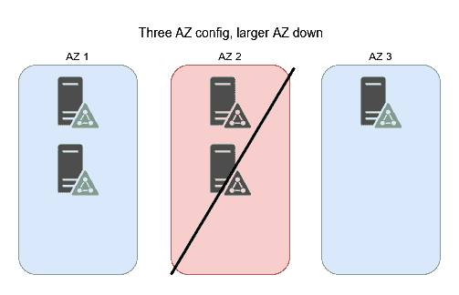
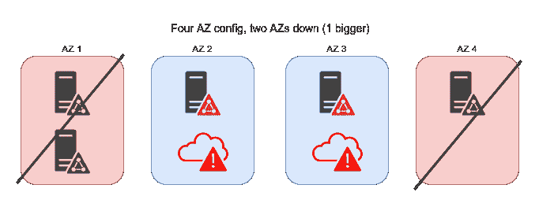
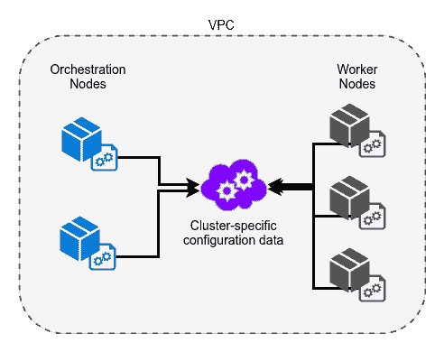
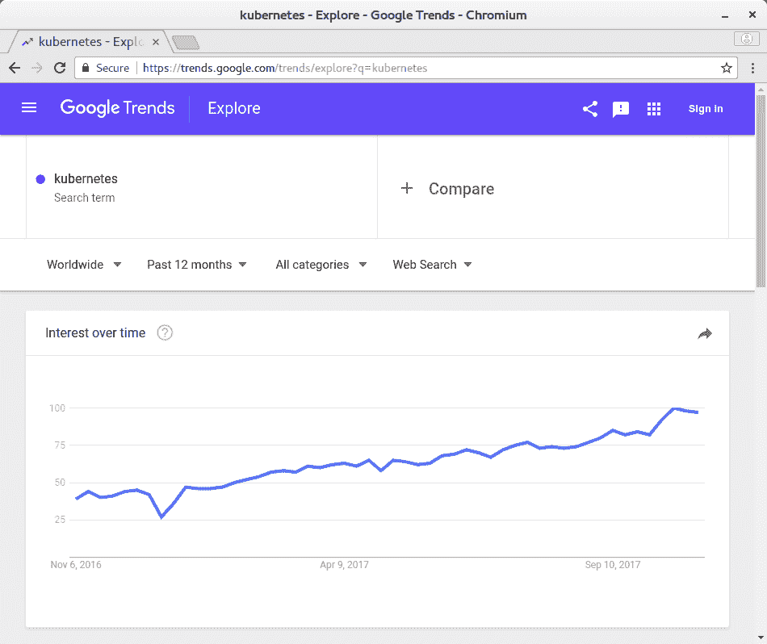

# 第九章：探索最大规模的部署

在前几章中，我们涵盖了部署 Docker 容器的许多不同方面，但是如果我们要将我们的例子转化为一个全球服务，能够承受每秒数百万请求的吞吐量，仍然有一些事情需要解决，这一章特别写作是为了详细讨论其中最重要的一些。由于这里涉及的主题实施将涉及足够的材料，可以单独成书，并且基础设施会根据多种因素大相径庭，因此这里的文本大部分将是理论性的，但是在本章之前我们对服务的理解应该足够好，可以给你一些关于如何以最少的痛苦进行下一步操作的想法。

在其核心，我们将要讨论的主题围绕选择合适的技术，然后遵循三个基本理念：

+   一切都要自动化！

+   真的，一切都要自动化！

+   是的，甚至自动化那些你每隔几周做一次的事情

这可能是一个玩笑，但希望到现在为止应该清楚，所有这些工作的主要目的之一（除了隔离）是从你的系统中消除任何人为干预，以保持你的服务运行，这样你和你的团队就可以专注于实际开发服务，而不是浪费时间在部署上。

# 维护法定人数

在我们之前的例子中，我们大多数时间都是使用单节点管理器，但是如果你想要弹性，你必须确保最小的故障点不会导致整个基础架构崩溃，而单个编排管理节点绝对不足以支持生产服务，无论你使用 Swarm、Kubernetes、Marathon 还是其他编排工具。从最佳实践的角度来看，你至少需要在集群中拥有三个或更多的管理节点，这些节点分布在云的三个或更多的**可用区**（**AZ**）或等效的分组中，以确保在规模上真正实现稳定性，因为数据中心的故障已经被证明会发生，并且给那些没有减轻这类情况的公司造成严重问题。

While in most orchestration platforms you can have any number of backing management nodes (or backing key-value stores in some cases), you will always have to balance resiliency vs speed due to the fact that with more nodes comes better capability to handle failures of larger parts of the system, but changes to this system (such as node additions and removals) must reach more points that will all have to agree, thus making it slower to process data. In most cases where this 3+ availability zone topology is required, we will need to go in details about quorums—the concept we lightly covered earlier, which is the backbone of all **high availability** (**HA**) systems.

Quorums in their basic sense are a grouping of the majority of management nodes, which together can decide whether updates to the cluster are going to be allowed or not. If the quorum is lost by the fact that half or more management nodes are unavailable, all changes to the cluster will be stopped to prevent your cluster infrastructure from having effectively split clusters. To properly divide your network topology for scale in this respect, you must make sure that you have a minimum of three nodes and/or availability zones as the quorum majority is lost with a single failure with less than that number. Taking this further, you will generally also want an odd number of nodes and availability zones since even numbers do not provide much additional protection for maintaining quorum, as we will see in a moment.

在大多数编排平台中，您可以拥有任意数量的后备管理节点（或在某些情况下是后备键值存储），但由于更多的节点意味着更好地处理系统更大部分的故障的能力，您总是必须在弹性和速度之间取得平衡，但对于这个系统的更改（如节点的添加和删除）必须达到更多的点，所有这些点都必须同意，因此处理数据的速度会变慢。在大多数需要 3 个或更多可用区域的拓扑结构中，我们需要详细了解法定人数——这是我们稍早轻描淡写提到的概念，它是所有**高可用性**（**HA**）系统的支柱。

To start off, let's say that you have five management nodes. To maintain a quorum of this number, you must have three or more nodes available, but if you have only two availability zones, the best split you can do is *3-2*, which will work fine if a connection is broken or the **AZ** with two management nodes goes down, but if the **AZ** with three nodes goes down, a quorum cannot be established since two is less than half of the total node count.

现在让我们看看在三个可用区域中我们可以获得什么样的弹性。使用五个管理节点的最佳布局将是*2-2-1*，如果你仔细观察任何一个区域失效时会发生什么，你会发现始终保持了法定人数，因为我们将从集群的其余部分获得*3 (2+1)*或*4 (2+2)*个节点，确保我们的服务运行正常：

当然，展示偶数对效果的影响也是很好的，因为我们提到它们可能有点麻烦。有了四个可用区域，我们可以做出的最佳分割是在它们之间进行*2-1-1-1*的分配，根据这些数字，我们只能容忍两个区域不可用，如果它们都只包含一个节点。通过这种设置，我们有一半的几率，即两个不可用的区域将包括其中有两个节点的区域，使得不可用的总节点数超过 3 个，因此集群将完全离线：

对于集群中更多的可用区域和管理节点，跨更多可用区域的管理节点的分布会更加稳定，但是对于我们这里的简单示例，如果我们有五个管理节点和五个可用区域（*1-1-1-1-1*布局），我们可以看到这种效果。由于法定人数要求至少三个节点，如果五个区域中的任意两个不可用，我们仍将完全运行，从 3 个可用区域的拓扑结构中将故障容忍度提高了 100％；但是您可以假设可能在地理位置上相距很远的区域之间的通信会给任何更新增加大量的延迟。

希望通过这些例子，现在应该清楚了在尝试保持集群的弹性并且能够保持法定人数时，您将使用什么样的考虑和计算。虽然工具可能会有所不同，具体取决于编排工具（即`etcd`节点与 Zookeeper 节点），但原则在几乎所有情况下都是相对相同的，因此这一部分应该是相对可移植的。

# 节点自动化

当我们使用 Packer 制作 Amazon Machine Images（AMIs）时，我们已经看到了我们可以使用预先烘焙的实例映像做什么，但是只有当整个基础设施由它们组成时，它们的真正力量才能得到充分发挥。如果您的编排管理节点和工作节点有自己的系统映像，并且还有一些启动脚本通过 init 系统（例如，systemd 启动服务）烘焙进去，您可以使使用这些映像启动的实例在其预定义角色中在启动时自动加入到集群中。将这进一步提升到概念层面，如果我们将所有有状态的配置提取到映像配置中，将所有动态配置提取到一个对所有节点可访问的单独服务中，例如 EC2 `user-data`或 HashiCorp Vault，除了初始部署和映像构建之外，您的集群几乎完全自我配置。

通过拥有这种强大的自动加入功能，您可以消除与扩展集群的手动工作大部分相关的工作，因为除了启动它之外，无需与 VM 实例进行交互。这种架构的一个相当简单的示例如下图所示，其中编排和工作节点有各自的映像，并在启动时使用 VPC 内的共享配置数据提供程序进行自我配置：

注意！为了防止严重的安全漏洞，请确保将任何敏感信息分离和隔离，只能由此配置服务布局中的所需系统访问。正如我们在早期的章节中提到的，通过使用需要知道的最佳实践，可以确保单个点（很可能是工作节点）的妥协不会轻易传播到集群的其余部分。举个简单的例子，这将包括确保管理秘密对工作节点或其网络不可读。

# 反应式自动扩展

通过实施自动化的自我配置，我们可以开始自动启动实例，从而实现更大规模的目标。如果你还记得之前章节中提到的自动扩展组，即使在大多数云服务中，这也可以实现自动化。通过使用启动配置和预配置的镜像，就像我们刚刚讨论的那样，使用这种设置添加或移除节点将变得像拨号设置所需节点一样简单。自动扩展组将增加或减少工作实例的数量，因为镜像是自我配置的，这将是你所需的全部输入。通过这样简单的输入，你可以轻松地对基础架构进行扩展，并通过许多不同的方式完成。

在进一步的自动化步骤中，有一些云服务提供商可以基于其指标或类似`cron`的计划来触发自动扩展组中的这些操作。原则上，如果你的集群负载增加，你可以触发节点计数的增加，反之，如果集群或单个节点的负载下降到预定义的值以下，你可以激活服务排水并关闭一部分节点来根据需要扩展系统。对于周期性但可预测的需求变化（参见[`en.wikipedia.org/wiki/Internet_Rush_Hour`](https://en.wikipedia.org/wiki/Internet_Rush_Hour)了解更多信息），我们提到的计划的扩展变化可以确保你有足够的资源来处理预期的需求。

# 预测性自动扩展

如果你手动调整节点计数并根据计划或指标触发自动扩展，你仍然会遇到一些问题，因为服务需要一些时间才能上线、自我配置，并开始传播到网络中的各种负载均衡器。在这种架构下，很可能是你的用户发现你没有足够的容量，然后你的系统做出反应来补偿。如果你真的希望从你的服务中获得最佳的用户体验，有时你可能还需要在自动扩展触发器中添加一层，可以在实际需要之前预测你的服务何时需要更多资源，这就是所谓的**预测性扩展**。

在非常广泛的范围内，要将预测层添加到基础架构中，您需要将过去`x`时间内收集的一些指标的一部分导入到诸如 TensorFlow（[`www.tensorflow.org/`](https://www.tensorflow.org/)）之类的**机器学习**（**ML**）工具中，并生成一个训练集，使该工具能够以一定的确定性预测您是否需要更多节点。通过使用这种方法，您的服务可以在需要之前就进行扩展，并且比简单的基于计划的方法更加智能。这些系统在正确整合到您的流水线中时可能会相当困难，但如果您正在全球范围内处理大量数据，并且简单的反应式自动扩展不足以满足需求，那么这可能是一个值得探索的途径。

在机器学习中，训练集指的只是一组训练数据（在我们的情况下，它将是我们长期指标的一部分），您可以使用它来教会神经网络如何正确预测您将需要的需求。就像最近章节中的许多主题一样，实际上有很多关于这个材料（机器学习）的书籍，它们的内容会远远超过这本书，并且对您的实用性也只会提供边际帮助。如果您想详细了解机器学习，这个维基百科页面对此有一个很好的入门介绍：[`en.wikipedia.org/wiki/Machine_learning`](https://en.wikipedia.org/wiki/Machine_learning)，您也可以在[`www.tensorflow.org/get_started/get_started`](https://www.tensorflow.org/get_started/get_started)上尝试 TensorFlow。

最终，如果您成功实施了这些技术中的一些或全部，您几乎不需要对集群进行任何干预，以处理扩展或收缩。作为能够安心入睡的额外奖励，您还将节省资源，因为您将能够将处理资源与服务的实际使用情况紧密匹配，使您、您的预算和您的用户都感到满意。

# 监控

您在服务交付中依赖的任何服务理想情况下都应该有一种方式来通知您它是否出现了问题，我指的不是用户反馈。大多数服务开发现在都以令人难以置信的速度发展，监控就像备份一样，大多数开发人员在发生灾难性事件之前都不会考虑，因此我们应该稍微涉及一下。真正应该决定您如何处理这个问题的重要问题是，如果您的用户能够处理您在没有监控的情况下看不到的停机时间。

大多数小型服务可能对一些中断没有太大问题，但对于其他所有情况，这至少会导致用户发来一些愤怒的电子邮件，最坏的情况是您的公司失去了大部分用户，因此强烈鼓励在各个规模上进行监控。

尽管监控可能被认为是基础设施中那些无聊的部分之一，但在任何时候都能获得对云端正在进行的工作的洞察力绝对是管理多样化系统和服务的绝对必要部分。通过将监控添加到您的关键绩效指标（KPIs）中，您可以确保整个系统的性能符合预期，并通过向关键监控目标添加触发器，您可以立即收到可能影响用户的任何活动的警报。对基础设施的这种洞察力既可以帮助减少用户流失，也可以推动更好的业务决策。

当我们通过示例进行工作时，您可能已经想到了要监控的内容，但以下是一些常见的内容，它们一直被认为是最有用的：

+   **节点 RAM 利用率**：如果您注意到您的节点没有使用分配的所有 RAM，您可以切换到较小的节点，反之亦然。如果您使用受内存限制的 Docker 容器，这个指标通常会变得不那么有用，但仍然是一个很好的指标，因为您希望确保您的节点从未达到系统级最大内存利用率，否则您的容器将以更慢的交换方式运行。

+   **节点 CPU 利用率**：通过这个指标，您可以看到服务密度是否过低或过高，或者服务需求是否出现波动。

+   **节点意外终止**：这个指标很好地跟踪确保您的 CI/CD 流水线没有创建错误的镜像，您的配置服务是在线的，以及可能导致服务中断的其他问题。

+   服务意外终止：找出服务为何意外终止对于消除任何系统中的错误至关重要。看到这个值的增加或减少可能是代码质量的良好指标，尽管它们也可能表明一系列其他问题，无论是内部的还是外部的。

+   消息队列大小：我们之前详细介绍了这一点，但膨胀的队列大小表明您的基础设施无法快速处理生成的数据，因此这个指标总是很有用的。

+   连接吞吐量：准确了解您正在处理的数据量可以很好地指示服务负载。将其与其他收集的统计数据进行比较，还可以告诉您所见问题是内部还是外部造成的。

+   服务延迟：仅仅因为没有故障并不意味着服务不可用。通过跟踪延迟，您可以详细了解需要改进的地方，或者哪些性能不符合您的期望。

+   内核恐慌：虽然罕见但极其致命，内核恐慌可能对部署的服务造成严重影响。尽管监控这些情况相当棘手，但跟踪内核恐慌将在出现潜在的内核或硬件问题时向您发出警报，这将需要您开始解决。

显然，这并不是一个详尽的列表，但它涵盖了一些更有用的内容。随着基础设施的发展，您会发现在各处添加监控会更快地解决问题，并发现服务的可扩展性问题。因此，一旦将监控添加到基础设施中，不要害怕将其连接到系统的尽可能多的部分。最终，通过监控整个基础设施获得可见性和透明度，您可以做出更明智的决策并构建更好的服务，这正是我们想要的。

# 评估下一代技术

我个人感觉大多数关于容器（以及大多数其他技术主题）的文档和学习材料中都忽略了新兴技术的适当评估和风险评估。虽然选择一个基本有缺陷的音乐播放器的风险微不足道，但选择一个基本有缺陷的云技术可能会让你陷入多年的痛苦和开发中，而这些本来是你不需要的。随着云空间中工具的创建和发展速度飞快，良好的评估技术是你可能想要掌握的技能之一，因为它们可以在长远来看为你节省精力、时间和金钱。直觉很棒，但拥有一种坚实、可重复和确定性的评估技术的方式更有可能带来长期的成功。

请注意，尽管这里给出的建议对我和我职业生涯中接触过的其他人来说都有相当不错的记录，但你永远无法完全预测技术领域的发展方向，特别是当大多数科技初创公司可能随时关门（例如 ClusterHQ）时。因此，请记住，这些只是一些有趣的观点，而不是一个能让选择技术中最常见问题消失的神奇清单。

# 技术需求

这应该是一个非常明显的观点，但需要写下来。如果你需要一个工具提供的功能，而你又不想自己开发，那么你将别无选择，只能选择它并希望一切顺利。幸运的是，在大多数云技术和支持它们的工具模块中，通常至少有两个竞争对手在争夺相同的用户，所以事情并不像今天看起来那么可怕，尽管就在一年前，这个领域几乎所有东西的版本号都低于`1.0`。在评估竞争工具如何满足你的需求时，也要记住，即使它们解决了相同的问题，也并非每个工具都面向相同的目的。如果我们以当前的 Kubernetes 与 Marathon 为例，尽管它们都可以用来解决相同的服务部署问题，但 Kubernetes 主要面向单一目的，而 Marathon，例如，还可以用于调度和集群管理作为额外的功能，所以在谚语意义上，我们真的在比较苹果和橙子。

总的来说，你的服务基础设施需求将驱动你的工具需求，所以你通常不会最终使用你最喜欢的编程语言，拥有易于集成的接入点，或者使用一个合理的工具代码库，但集成一个可以节省数百或数千人时的工具绝不可轻视。有时可能通过改变系统架构的部分来完全规避技术要求，以避免给系统增加复杂性，但根据我的个人经验，这几乎从来不容易做到，所以你的情况可能有所不同。

# 流行度

这可能是考虑的最具争议性的维度之一，但也是处理新技术时要注意的最重要的维度之一。虽然绝对真实的是，流行并不等同于技术优点，但可以假设：

+   更多使用特定工具的人将能够提供更好的集成帮助。

+   更容易找到解决问题的方法。

+   如果代码库是开源的，项目更有可能得到修复和功能的添加。

另一种描述这个问题的方式是，你能承担风险将几周/几个月/几年的集成工作投入到一个未经验证或在未来几年内可能被放弃的工具上吗？如果你是一个拥有庞大预算的大型企业，这可能不是一个问题，但在大多数情况下，你将没有机会尝试集成不同的竞争性技术，以找出最好的那个。虽然有时存在完全有效的情况，可以冒险尝试新工具，但由于云系统的复杂性和长期性，失败的代价非常高，因此一般建议采取务实的方法，但你的个人需求可能会有所不同，所以请相应选择。

要评估项目的这一方面，可以使用各种工具，但最简单和最容易的是 GitHub 项目的 forks/stars（对于开源项目）、Google 趋势（[`trends.google.com`](https://trends.google.com)）预测，以及使用过该技术的人们的社交媒体反馈。通过观察这些价值的变化和转变，可以相对准确地推断长期的可行性，并结合对现有工具的比较，可以形成一个项目的总体脉搏的良好图景。上升的项目通常表明具有优越的技术基础，但在某些情况下，这是由于对现有工具的拒绝或大规模的营销推动，因此在评估工具时，不要总是认为流行的选项更好。

****

在上面的截图中，你可以看到 Kubernetes 的兴趣随时间的增加而明显增加，这在某种程度上反映了社区对该编排工具的采纳和接受。如果我们要自己实施这项技术，我们可以相当肯定，在一段时间内，我们将使用一种更容易使用并获得支持的工具。

当将 Kubernetes 与 Marathon 进行比较并使用相同的技术时，情况变得非常混乱，因为 Marathon 也是一种非常常见的长跑活动，因此结果会与不相关的谷歌查询混在一起。在下面的截图中，我们将结果与其他一些与云相关的关键词进行了叠加，你可以看到我们的数据有些问题：

然而，看一下它们的 GitHub 页面右上角以及 forks/stars，我们可以看到它们的比较情况（**3,483** stars 和**810** forks 对比**28,444** stars 和**10,167** forks）：

将上述 GitHub 页面与以下页面进行比较：

在这个特定的例子中，很难看到长期的趋势，我们已经提到这两个工具解决的问题不同，而且这两个工具的设置复杂性迥然不同，因此很难进行适当的评估。

在我们继续下一个维度之前，有一件非常重要的事情需要提到：对于不成熟的工具（这种情况比你想象的更有可能），一个常见且强烈推荐的风险缓解措施是，如果您的开发人员有能力并且被允许在相关的上游项目上修复错误和添加功能。如果一个工具非常适合您的基础架构，并且您可以投入开发资源，那么它是否受欢迎并不重要，只要您可以使其按照您满意的方式工作。

作为参考数据点，在开发云实施过程中，我所在的团队无数次发现了上游项目中的错误和问题，我们很快就修复了这些问题，同时也帮助了该软件的所有其他用户，而不是潜在地等待上游开发人员花时间来修复它们。如果可能的话，我强烈鼓励这种回馈贡献的方式应用到你的工作场所，因为它有助于整个项目的社区，并间接地防止由于未修复的错误而导致项目动力的丧失。

# 团队的技术能力

新的工具往往有一个很好的初始想法，但由于糟糕的执行或架构，很快就变成了难以维护且容易出现错误的意大利面代码。如果设计和实施保持高标准，您可以更有把握地确保不会出现意外的故障，或者至少可以更容易地找到和修复错误。核心项目开发人员的能力在这方面起着巨大作用，由于大多数较新的工具都是开源的，因此查看代码库在这方面通常会非常有帮助。

评估涉及各种技术和系统的项目几乎不可能制定确切的指导方针，但有一些红旗应该被视为对未来可能出现的工具问题的警告信号：

+   **缺乏测试**：没有测试，代码是否有效的保证几乎被消除，您只能希望进行更改的开发人员在实现新功能时足够小心，并且他们没有破坏当前功能。在我的生活中，我只见过少数几个开发人员可以像测试工具一样留意所有边缘情况，但我不会抱太大希望，你正在调查的项目是否有这样的人。

+   **聪明的代码**：有时，一个项目会有一个或多个开发人员更关心展示他们的技能，而不是项目的可维护性，他们几乎总是会把他们接触的文件变成只有他们自己能够处理的代码，导致将来在添加功能或修复错误时出现问题。几乎总是这种改变是单向的，经过足够长的时间后，通常会导致项目的死亡（根据我的经验，这种情况更常见）。

+   **长时间开放的关键错误数量较高**：对于任何项目，总会有一个时刻，你会遇到一个必须尽快修复的关键错误，通过观察修复所需的时间趋势，你可以看出团队是否有能力快速解决问题，或者是否关注更广泛的社区。虽然更多是主观指标，但随着服务的概况或安全姿态的增加，它变得极为重要。

您还可以使用其他评估指标，例如：旧的未合并的拉取请求，任意关闭的错误报告等，只要您能正确了解代码库的质量概念。有了这些知识，您可以正确评估候选工具的未来可能性，以及您的基础架构如何随之发展。

# 摘要

到此为止，我们已经到达了我们书的结尾！在这一章中，我们涵盖了各种你需要通过积极的自动化、将事物分割成多个可用区，并为你的基础设施添加监控来将你的小型服务变成全球化的事物。由于云技术也相对年轻，我们更重要地包括了一些关于如何客观评估新兴工具的建议，以确保你的项目在可预见的未来工具生态系统变化中具有最大的成功可能性。通过假设未来会发生变化，并拥有处理这些变化的工具，我们可以准备好接受任何被扔向我们的东西。
