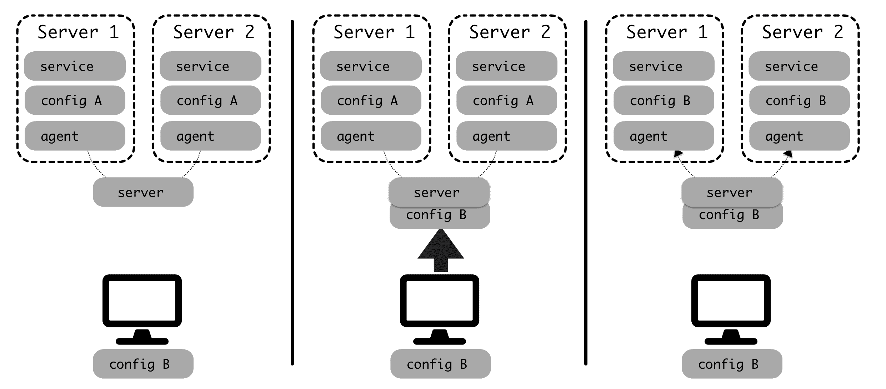

# 使用 GitOps 原则

在了解如何配置 Kubernetes 集群之后，我们将学习如何使用 GitOps 实践来进行配置，而不是应用手动命令和文件。GitOps 意味着使用 Git 存储库来管理集群配置，以存储和跟踪包含配置的 YAML 文件。我们将看到如何将 GitHub 存储库与集群链接，以便使用 Flux 定期更新。

这种方法允许我们以确定性的方式存储配置，以代码描述基础设施的更改。更改可以进行审查，并且集群可以从头开始恢复或复制，正如我们将在第九章 *管理工作流*中看到的那样。

本章将涵盖以下主题：

+   理解 GitOps 的描述

+   设置 Flux 以控制 Kubernetes 集群

+   配置 GitHub

+   通过 GitHub 进行 Kubernetes 集群更改

+   在生产环境中工作

在本章结束时，您将了解如何将 Kubernetes 配置存储在 Git 存储库中，并自动应用合并到主分支的任何更改。

# 技术要求

本章示例的代码可在 GitHub 上找到：[`github.com/PacktPublishing/Hands-On-Docker-for-Microservices-with-Python/tree/master/Chapter08`](https://github.com/PacktPublishing/Hands-On-Docker-for-Microservices-with-Python/tree/master/Chapter08)。

您需要安装`fluxctl`工具。然后，我们将使用此工具手动同步并获取 SSH 密钥，以允许 Flux 与 Git 存储库进行交互。请参阅其文档中的安装方法：[`docs.fluxcd.io/en/stable/tutorials/get-started.html`](https://docs.fluxcd.io/en/stable/tutorials/get-started.html)。

# 理解 GitOps 的描述

运维中的一个传统大问题是确保不同服务器保持适当的配置。当您拥有一大批服务器时，部署服务并保持它们正确配置并不是一项简单的任务。

在本章中，我们将使用*配置*来描述服务以及在生产环境中运行所需的所有配置。这包括服务的特定版本，以及基础设施（操作系统版本，服务器数量等）或依赖服务的软件包和配置（负载均衡器，第三方库等）。

因此，*配置管理*将是进行更改的方式。

随着基础设施的增长，保持所有服务器上的配置跟踪是具有挑战性的。最常见的更改是部署服务的新版本，但还有其他可能性。例如，需要添加到负载均衡器的新服务器，用于修复安全漏洞的 NGINX 的新配置调整，或者用于启用功能的服务的新环境变量。

初始阶段是手动配置，但随着时间的推移，这变得难以做到。

# 管理配置

手动配置意味着团队中的某人跟踪少量服务器，并且在需要进行更改时，单独登录到每台服务器并进行所需的更改。

这种操作方式在多个服务器上需要大量工作，并且容易出错，因为它们可能很容易发散。

因此，一段时间后，可以通过使用 Fabric ([`www.fabfile.org/`](http://www.fabfile.org/))或 Capistrano ([`capistranorb.com/`](https://capistranorb.com/))的一些脚本来改进。基本模型是将配置和新代码推送到服务器，并执行一些自动化任务，在最后重新启动服务。通常，这是直接从团队的计算机上作为手动步骤完成的。

代码和配置通常存在于 Git 上，但手动过程使得可以更改这一点，因为它是分离的。如果以这种方式工作，请确保只部署存储在源代码控制下的文件。

一些服务器维护的元素，如操作系统升级或更新库，可能仍然需要手动完成。

以下图表显示了代码是如何从进行配置更改的团队成员的计算机上推送的：


在这个阶段，可以通过手动添加新的基础设施，也可以使用诸如 Terraform（[`www.terraform.io/`](https://www.terraform.io/)）这样的工具与云服务进行交互。

一个更复杂的选择是使用 Puppet（[`puppet.com/`](https://puppet.com/)）或 Chef（[`www.chef.io/`](https://www.chef.io/)）等工具。它们采用客户端-服务器架构。它们允许我们使用自己的声明性语言描述服务器的状态，当服务器中的状态发生变化时，所有客户端都会更新以遵循定义。服务器将报告任何问题或偏差，并将集中配置定义。

这个过程总结在下面的图表中：



在某些情况下，这些工具可以在云服务中分配资源；例如，在 AWS 中添加一个新的 EC2 实例。

配置管理工具还有助于监控并执行一些纠正任务。例如，它可以重新启动应该运行的服务，或者在更改配置时出现问题时重试。

它也更适合于更多服务器的情况。

所有这些策略都需要专门的工具，通常由特定的运维团队处理。这使得开发人员无法配置，需要他们之间的协调才能进行配置更新。

这种工作分工的划分会产生一些摩擦，随着时间的推移，DevOps 运动提出了其他组织这项工作的方式。

# 理解 DevOps

传统的工作划分方式是创建一个控制基础设施和部署的运维团队，以及一个创建服务的开发团队。

这种方法的问题在于开发人员通常不会真正了解他们的代码在生产环境中是如何工作的，同时，运维人员也不会确切地知道部署包含什么。这可能导致“我不知道它是什么”/“我不知道它在哪里”的情况，两个团队之间存在鸿沟。DevOps 最终被创建为填补这一差距的方法。

一个典型的问题是一个服务在生产环境中经常失败，并被运维发现，运维会执行纠正策略（例如，重新启动服务）。

然而，开发团队并不确切知道是什么导致了失败，他们还有其他紧迫的任务，所以他们不会解决问题。

随着时间的推移，这可能会危及系统的稳定性。

DevOps 是一套旨在改善运营方面和开发方面之间协作的技术。它旨在通过使开发人员了解整个运营方面来实现快速部署，并尽可能地使用自动化来简化运营。

它的核心是赋予团队控制自己的基础设施和部署的能力，加快部署速度并了解基础设施以帮助及早识别问题。团队应该在部署和支持基础设施方面是自治的。

为了实现 DevOps 实践，您需要一些工具来以受控的方式控制不同的操作。GitOps 是一个有趣的选择，特别是如果您使用 Kubernetes。

# 定义 GitOps

GitOps 的想法很简单——我们使用 Git 来描述我们的基础设施和配置管理。对定义分支的任何更改都将触发相关的更改。

如果您能够通过代码定义整个系统，Git 会给您带来很多优势：

+   对基础设施或配置管理的任何更改都是有版本的。它们是明确的，如果有问题可以回滚。版本之间的变化可以通过差异来观察，这是正常的 Git 操作。

+   Git 仓库可以作为备份，可以在底层硬件发生灾难性故障时实现从头恢复。

+   这是最常见的源代码控制工具。公司里的每个人可能都知道它的工作原理并且可以使用它。它也很容易与现有的工作流程集成，比如审查。

GitOps 概念是由 Weaveworks 在一篇博客文章中引入并命名的（[`www.weave.works/blog/gitops-operations-by-pull-request`](https://www.weave.works/blog/gitops-operations-by-pull-request)）。从那时起，它在公司中被越来越多地使用。

虽然 GitOps 也可以应用于其他类型的部署（当然也已经应用了），但它与 Kubernetes 有很好的协同作用，这实际上是 Weaveworks 博客文章中的描述。

可以使用 YAML 文件完全配置 Kubernetes 集群，这几乎包含了整个系统的定义。正如我们在上一章中看到的，这可能包括诸如负载均衡器之类的元素的定义。Kubernetes 集群外的元素，比如外部 DNS，这些不包含在 YAML 文件中的元素，很少发生变化。

服务器和基础设施可以使用其他工具自动化，比如 Terraform，或者使用第七章中描述的自动化程序，*配置和保护生产系统*。

出于实际原因，一些基础设施操作完全可以是手动的。例如，升级 EKS 集群的 Kubernetes 版本是一个可以通过 AWS 控制台完成的操作，而且很少发生，所以手动操作也是可以的。

这些操作保持手动也是可以的，因为自动化它们可能不会带来回报。

正如我们在第六章中看到的，Kubernetes 的 YAML 文件包含可以使用`kubectl apply -f <file>`命令应用的元素定义。Kubernetes 非常灵活，因为一个文件可以包含多个元素或一个元素。

将所有的 YAML 文件分组到一个目录结构下，并将它们纳入 Git 控制，这是一种非常明确的应用变更的方式。这是我们将要操作的方式。

这个操作并不复杂，但我们将使用一个现有的工具，由 Weaveworks 创建，叫做**Flux**。

# 设置 Flux 来控制 Kubernetes 集群

Flux（[`github.com/fluxcd/flux`](https://github.com/fluxcd/flux)）是一个工具，确保 Kubernetes 集群的状态与存储在 Git 仓库中的文件匹配。

它被部署在 Kubernetes 集群内部，作为另一个部署。它每 5 分钟运行一次，并与 Git 仓库和 Docker 注册表进行检查。然后，它应用任何变更。这有助于访问 Git 仓库，因为不需要在 CI 系统内部创建任何推送机制。

我们将看到如何在 Kubernetes 内部启动一个从 GitHub 仓库拉取的 Flux 容器。

# 启动系统

为了简单起见，我们将使用本地 Kubernetes。我们将使用第六章中描述的镜像，所以确保运行以下命令：

```py
$ cd Chapter06
$ cd frontend
$ docker-compose build server
...
Successfully tagged thoughts_frontend:latest
$ cd ..
$ cd thoughts_backend/
$ docker-compose build server db
...
Successfully tagged thoughts_frontend:latest
$ cd ..
$ cd users_backend
$ docker-compose build server db
...
Successfully tagged users_server:latest
```

基本的 Kubernetes 配置存储在示例文件夹（[`github.com/PacktPublishing/Hands-On-Docker-for-Microservices-with-Python/tree/master/Chapter08/example`](https://github.com/PacktPublishing/Hands-On-Docker-for-Microservices-with-Python/tree/master/Chapter08/example)）子目录中。

您可以使用以下命令部署整个系统：

```py
$ cd Chapter08/example
$ kubectl apply -f namespace.yaml
namespace/example created
$ kubectl apply -f . --recursive
deployment.apps/frontend created
ingress.extensions/frontend-ingress created
service/frontend-service created
namespace/example unchanged
deployment.apps/thoughts-backend created
ingress.extensions/thoughts-backend-ingress created
service/thoughts-service created
deployment.apps/users-backend created
ingress.extensions/users-backend-ingress created
service/users-service created
```

这创建了整个系统。

应用`namespace.yaml`文件以避免无法部署元素，因为命名空间不存在，但您可以两次运行`kubectl apply -f . --recursive`命令。

如果您检查系统，应该已经部署了，通过运行`kubectl get pods`命令显示：

```py
$ kubectl get pods -n example
NAME                   READY STATUS  RESTARTS AGE
frontend-j75fp         1/1   Running 0        4m
frontend-n85fk         1/1   Running 0        4m
frontend-nqndl         1/1   Running 0        4m
frontend-xnljj         1/1   Running 0        4m
thoughts-backend-f7tq7 2/2   Running 0        4m
users-backend-7wzts    2/2   Running 0        4m
```

请注意，有四个`frontend`的副本。我们将在本章中更改 Pod 的数量，作为如何更改部署的示例。

现在，删除部署以从头开始：

```py
$ kubectl delete namespace example
namespace "example" deleted
```

有关此设置的更多详细信息，请查看第六章中的*在本地部署完整系统*部分，*使用 Kubernetes 进行本地开发*。

# 配置 Flux

我们将准备一个 Flux 系统，它将帮助我们跟踪我们的 Git 配置。我们根据这个存储库中的 Flux 示例准备了一个（[`github.com/fluxcd/flux/tree/master/deploy`](https://github.com/fluxcd/flux/tree/master/deploy)），它在`Chapter08/flux`子目录中可用。

主文件是`flux-deployment.yaml`。其中大部分是注释的样板文件，但请查看要从中提取的存储库的定义：

```py
# Replace the following URL to change the Git repository used by Flux.
- --git-url=git@github.com:PacktPublishing/Hands-On-Docker-for-Microservices-with-Python.git
- --git-branch=master
# Include this if you want to restrict the manifests considered by flux
# to those under the following relative paths in the git repository
- --git-path=Chapter08/example
```

这些行告诉 Flux 要使用的存储库，分支和任何路径。如果路径被注释了，在您的情况下可能是这样，它将使用整个存储库。在下一节中，我们需要更改要使用的存储库为您自己的存储库。

请注意，我们使用`flux`命名空间来部署所有这些元素。您可以重用您的主要命名空间，或者如果对您更有效，可以使用默认命名空间。

要使用 Flux，请创建命名空间，然后应用完整的`flux`目录：

```py
$ kubectl apply -f flux/namespace.yaml
namespace/flux created
$ kubectl apply -f flux/
serviceaccount/flux created
clusterrole.rbac.authorization.k8s.io/flux created
clusterrolebinding.rbac.authorization.k8s.io/flux created
deployment.apps/flux created
secret/flux-git-deploy created
deployment.apps/memcached created
service/memcached created
namespace/flux unchanged
```

使用以下代码，您可以检查一切是否按预期运行：

```py
$ kubectl get pods -n flux
NAME                       READY STATUS  RESTARTS AGE
flux-75fff6bbf7-bfnq6      1/1   Running 0        34s
memcached-84f9f4d566-jv6gp 1/1   Running 0        34s
```

但是，要能够从 Git 存储库部署，我们需要对其进行配置。

# 配置 GitHub

虽然我们可以配置任何 Git 存储库，但通常，我们将使用 GitHub 进行设置。我们需要设置一个有效的密钥来访问 Git 存储库。

这样做的最简单方法是允许 Flux 生成自己的密钥，并将其添加到 GitHub 存储库。但是，为了能够这样做，我们需要创建自己的 GitHub 存储库。

# 分叉 GitHub 存储库

配置存储库的第一步是分叉。让我们查看更多详细信息的以下步骤：

1.  转到 GitHub 代码的页面（[`github.com/PacktPublishing/Hands-On-Docker-for-Microservices-with-Python/`](https://github.com/PacktPublishing/Hands-On-Docker-for-Microservices-with-Python/)），然后单击右上角的 Fork 以生成您自己的副本。

1.  一旦您拥有自己的副本，它将具有类似以下的 URL：

```py
https://github.com/<YOUR GITHUB USER>/Hands-On-Docker-for-Microservices-with-Python/
```

1.  现在，您需要在`Chapter08/flux/flux-deployment.yaml`文件中替换它为`--git-url`参数。

1.  更改后，使用以下命令重新应用 Flux 配置：

```py
$ kubectl apply -f flux/flux-deployment.yaml
deployment.apps/flux changed
```

现在，Flux 正在跟踪您完全控制的自己的存储库，并且您可以对其进行更改。首先，我们需要允许 Flux 访问 GitHub 存储库，可以通过部署密钥实现。

# 添加部署密钥

为了允许 Flux 访问 GitHub，我们需要将其秘钥添加为有效的部署密钥。使用`fluxctl`，很容易获取当前的`ssh`秘钥；只需运行以下命令：

```py
$ fluxctl identity --k8s-fwd-ns flux
ssh-rsa <secret key>
```

有了这些信息，转到您分叉的 GitHub 项目的“设置|部署密钥”部分。使用描述性名称填写标题，使用之前获取的秘钥填写密钥部分，然后选择“添加密钥”：

！[](img/a8ab5d41-bfa3-4964-83e9-88a473e2f7b5.png)

一定要选择“允许写入访问”的复选框。现在，Flux 将能够联系 GitHub。

下一步是在 GitHub 和集群上同步状态。

# 同步 Flux

我们可以与 Flux 同步，因此 GitHub 中的描述将应用于集群，使用以下命令：

```py
$ fluxctl sync --k8s-fwd-ns flux
Synchronizing with git@github.com:<repo>.git
Revision of master to apply is daf1b12
Waiting for daf1b12 to be applied ...
Done.
Macbook Pro:Chapter08 $ kubectl get pods -n example
NAME                   READY STATUS  RESTARTS AGE
frontend-8srpc         1/1   Running 0        24s
frontend-cfrvk         1/1   Running 0        24s
frontend-kk4hj         1/1   Running 0        24s
frontend-vq4vf         1/1   Running 0        24s
thoughts-backend-zz8jw 2/2   Running 0        24s
users-backend-jrvcr    2/2   Running 0        24s
```

同步需要一点时间，可能会出现错误，指出正在克隆存储库：

```py
$ fluxctl sync --k8s-fwd-ns flux
Error: git repository git@github.com:<repo>.git is not ready to sync (status: cloned)
Run 'fluxctl sync --help' for usage
```

等待几分钟，然后重试：

```py
$ fluxctl sync --k8s-fwd-ns flux
Synchronizing with git@github.com:<repo>.git
Revision of master to apply is daf1b12
Waiting for daf1b12 to be applied ...
Done.
$
```

您的 Flux 部署，因此本地 Kubernetes 集群现在与 Git 中的配置同步，并将随任何更改更新。

# 通过 GitHub 进行 Kubernetes 集群更改

通过 Flux，您的本地 Kubernetes 集群将更新以反映 Git 存储库中的更改。几分钟后，Git 中的任何更改都将传播到集群。

让我们通过测试来查看这一点，更新前端部署中的 Pod 数量：

1.  按照以下描述更改您分叉的存储库中的`Chapter08/example/frontend/deployment.yaml`文件：

```py
---
apiVersion: apps/v1
kind: Deployment
metadata:
    name: frontend
    labels:
        app: frontend
    namespace: example
spec:
    replicas: 2
```

这将将副本的数量从`4`更改为`2`。

1.  将更改提交到`master`分支并推送到 GitHub 仓库。

1.  使用以下命令监视集群：

```py
$ kubectl get pods -n example -w
```

几分钟后，您将看到前端 Pod 的数量减少。您可以通过手动同步 Flux 来加快速度。

1.  撤消更改并查看它们将如何被添加。

Flux 不会删除元素以避免问题。这意味着删除部署或服务文件不会从存储库中删除它。要这样做，您需要手动删除它。

您可以通过将副本的数量设置为零来禁用由部署控制的 Pod。

恭喜！您现在拥有一个由 GitHub 存储库控制的集群。

让我们看看如何在生产环境中有效地使用这种方法。

# 在生产中工作

GitOps 主要针对生产环境，这些环境比本章中使用的示例本地集群更大更复杂。在本节中，我们将描述如何利用 Git 的优势来提高部署和更改的清晰度，以及如何确保我们在源代码控制下结构化不同文件以避免混乱。

# 创建结构

对于大型部署来说，结构化 YAML 文件至关重要。从技术上讲，您可以将所有内容合并到一个文件中，但当它增长时，这并不是处理它的最佳方式。Kubernetes 允许极大的灵活性，因此请尝试找到适合您的结构。

一个简单的方法是按命名空间和微服务创建子目录。这是我们在本示例中的结构方式。这种结构将相关元素放在一起，并为任何涉及微服务的人提供了清晰的路径。如果部署仅影响一个微服务（正如我们在第一章中讨论的那样，*进行移动-设计、计划和执行*，在*并行部署和开发速度*部分），这将使更改保持在同一个子目录中。

但不要感到受限于这种结构。如果对您有意义，您可以尝试一些不同的东西；例如，按元素进行划分，即将所有部署放在一个目录下，所有服务放在另一个目录下，依此类推。不要害怕尝试和移动元素，寻找项目的最佳结构。

所有这些文件都在 GitHub 中受源代码控制，这使我们能够利用它们的功能。

# 使用 GitHub 功能

考虑到任何对主分支的合并都会触发集群的变化，这在上线之前应该进行审查。

您可以通过要求需要批准的拉取请求来进行。批准可以来自专门跟踪集群的 Ops 团队，也可以来自微服务的所有者；例如，团队领导或经理。

您可以在 GitHub 中本地强制执行代码所有者。这意味着特定文件或目录的更改需要某个用户或团队批准。查看 GitHub 文档以获取更多信息（[`help.github.com/en/articles/about-code-owners`](https://help.github.com/en/articles/about-code-owners)）。

单个 GitHub 存储库也可以跟踪多个环境，例如，用于运行测试的暂存环境和向客户提供的生产环境。您可以通过分支或子目录来划分它们。

但 GitHub 功能并不是唯一可用的，常规的 Git 标签非常灵活，可以让我们定义要部署的特定容器。

# 使用标签

在本例中，我们使用了图像的`latest`标签。这使用了最近构建的容器，每次构建图像时都可能会发生变化。对于生产环境，我们应该使用与不可变容器相关联的特定标签，正如我们在第三章中讨论的那样，在*使用远程注册表*部分，以及在第四章中的*创建流水线和工作流程*部分中讨论的那样。

这意味着替换以下行：

```py
spec:
  containers:
  - name: frontend-service
    image: thoughts_frontend:latest
```

我们用以下行替换它们：

```py
spec:
  containers:
  - name: frontend-service
    image: <registry>/thoughts_frontend:v1.5
```

这就是能够以受控方式更新图像的优势所在。您将使用流水线（如第四章中所述的*创建流水线和工作流程*）构建和推送带标记的图像到远程注册表，然后您可以控制在集群中部署哪个特定版本。

在某些情况下，可能需要停止同步。Flux 使用工作负载的概念，这些工作负载是可更新的元素，与部署的方式相同。

你可以停止它们的自动更新或控制它们的更新方式。有关更多信息，请参阅文档：[`github.com/fluxcd/flux/blob/master/docs/using/fluxctl.md#workloads`](https://github.com/fluxcd/flux/blob/master/docs/using/fluxctl.md#workloads)。

将此版本置于 Git 控制之下，使开发人员能够轻松地恢复到以前的版本。

为了遵循持续集成原则，尝试进行小的更改并快速应用。Git 将帮助您撤消不良更改，但小的增量更改易于测试，并减少了破坏系统的风险。

大多数操作将是简单的更改，要么更改要部署的图像的版本，要么调整参数，例如副本的数量或环境变量。

# 总结

我们从回顾最常见的不同类型的配置管理策略开始本章，并讨论了它们在项目增长时的应用方式。我们讨论了 DevOps 方法如何使团队承担起部署的责任，并有助于填补开发和运维之间的传统差距。

我们看到了最新的 GitOps 方法在 Kubernetes 集群中运行得非常好，因为配置被紧密描述为一组文件。我们讨论了使用 Git 跟踪配置的优势。

我们介绍了 Flux，这是一个部署在集群内并从 Git 存储库分支中拉取更改的工具。我们提供了一个示例配置，在本地 Kubernetes 集群中部署了它，并配置了 GitHub 以便与其一起工作。这样一来，GitHub 中对 Git 分支的任何推送都会在本地集群中反映出来。

我们在本章结束时介绍了一些在生产环境中工作的策略。我们研究了确保 Kubernetes YAML 文件结构正确，利用 GitHub 功能的方法，并学习了如何发布和回滚带标记的图像。

在下一章中，我们将描述集群的完整开发周期的过程，从引入新功能到在生产环境中部署。我们将描述在实时系统中工作时的一些有用策略，以确保部署的代码运行顺畅且质量高。

# 问题

1.  使用脚本将新代码推送到服务器和使用 Puppet 等配置管理工具有何区别？

1.  DevOps 的核心理念是什么？

1.  使用 GitOps 的优势是什么？

1.  GitOps 只能在 Kubernetes 集群中使用吗？

1.  Flux 部署位于何处？

1.  为了允许 Flux 访问 GitHub，您需要在 GitHub 中配置什么？

1.  在生产环境中工作时，GitHub 提供了哪些功能可以帮助确保对部署的控制？

# 进一步阅读

您可以在以下书籍中了解更多关于 DevOps 实践和理念：*实用 DevOps-第二版* ([`www.packtpub.com/virtualization-and-cloud/practical-devops-second-edition`](https://www.packtpub.com/virtualization-and-cloud/practical-devops-second-edition))，以及*DevOps 悖论* ([`www.packtpub.com/web-development/devops-paradox`](https://www.packtpub.com/web-development/devops-paradox))。
