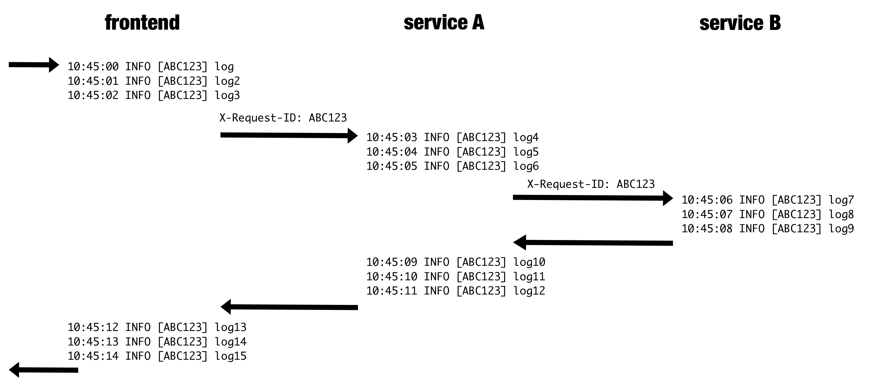
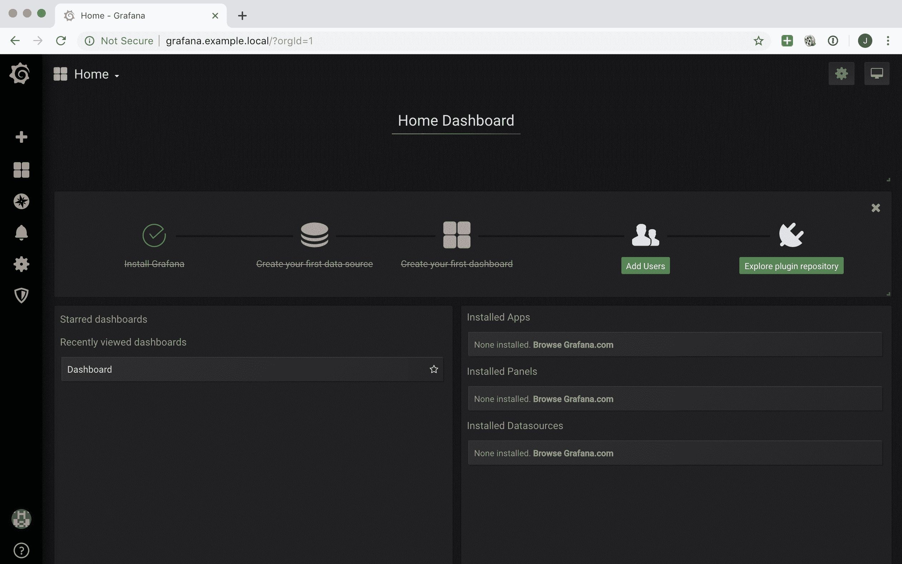
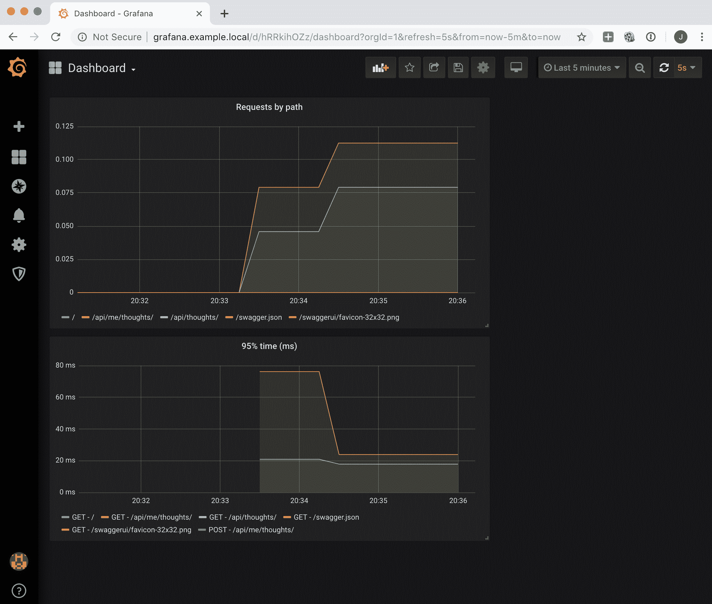

# 监控日志和指标

在实际运营中，快速检测和调试问题的能力至关重要。在本章中，我们将讨论我们可以用来发现在处理大量请求的生产集群中发生了什么的两个最重要的工具。第一个工具是日志，它帮助我们了解单个请求中发生了什么，而另一个工具是指标，它对系统的聚合性能进行分类。

本章将涵盖以下主题：

+   实时系统的可观测性

+   设置日志

+   通过日志检测问题

+   设置指标

+   积极主动

在本章结束时，您将了解如何添加日志以便检测问题，以及如何添加和绘制指标，并了解它们之间的区别。

# 技术要求

我们将使用示例系统，并对其进行调整，包括集中式日志记录和指标。本章的代码可以在本书的 GitHub 存储库中找到：[`github.com/PacktPublishing/Hands-On-Docker-for-Microservices-with-Python/tree/master/Chapter10`](https://github.com/PacktPublishing/Hands-On-Docker-for-Microservices-with-Python/tree/master/Chapter10)。

要安装集群，您需要构建每个单独的微服务：

```py
$ cd Chapter10/microservices/
$ cd frontend
$ docker-compose build
...
$ cd thoughts_backend
$ docker-compose build
...
$ cd users_backend
$ docker-compose build
...
```

本章中的微服务与之前介绍的相同，但它们增加了额外的日志和指标配置。

现在，我们需要创建示例命名空间，并使用`Chapter10/kubernetes`子目录中的`find`配置启动 Kubernetes 集群：

```py
$ cd Chapter10/kubernetes
$ kubectl create namespace example
$ kubectl apply --recursive -f .
...
```

要能够访问不同的服务，您需要更新您的`/etc/hosts`文件，以便包含以下代码行：

```py
127.0.0.1 thoughts.example.local
127.0.0.1 users.example.local
127.0.0.1 frontend.example.local
127.0.0.1 syslog.example.local
127.0.0.1 prometheus.example.local
127.0.0.1 grafana.example.local
```

有了这些，您将能够访问本章的日志和指标。

# 实时系统的可观测性

可观测性是了解实时系统发生情况的能力。我们可能会遇到低可观测性系统，我们无法了解其中发生了什么，或者高可观测性系统，我们可以通过工具从外部推断事件和内部状态。

可观测性是系统本身的属性。通常，监控是获取有关系统当前或过去状态的信息的行为。这有点命名上的争议，但你要监控系统以收集其中可观测的部分。

在大多数情况下，监控是很容易的。有很多出色的工具可以帮助我们捕获和分析信息，并以各种方式呈现。但是，系统需要暴露相关信息，以便可以收集。

暴露正确数量的信息是困难的。太多信息会产生很多噪音，会掩盖相关信号。信息太少将不足以检测问题。在本章中，我们将探讨不同的策略来解决这个问题，但每个系统都必须自行探索和发现。期望在自己的系统中进行实验和更改！

分布式系统，例如遵循微服务架构的系统，也会出现问题，因为系统的复杂性可能会使其内部状态难以理解。在某些情况下，行为也可能是不可预测的。这种规模的系统本质上永远不会完全健康；总会有一些小问题。您需要制定一个优先级系统，以确定哪些问题需要立即解决，哪些可以在以后解决。

微服务可观测性的主要工具是**日志**和**指标**。它们为社区所熟知，并且有许多工具大大简化了它们的使用，既可以作为可以在本地安装的软件包，也可以作为云服务，有助于数据保留和降低维护成本。

使用云服务进行监控将节省您的维护成本。我们将在*设置日志*和*设置指标*部分稍后讨论这一点。

在可观察性方面的另一种选择是诸如 Data Dog（[`www.datadoghq.com/`](https://www.datadoghq.com/)）和 New Relic（[`newrelic.com/`](https://newrelic.com/)）等服务。它们接收事件——通常是日志——并能够从中推导出指标。

集群状态的最重要细节可以通过`kubectl`进行检查，就像我们在之前的章节中看到的那样。这将包括已部署的版本、重启、拉取镜像等详细信息。

对于生产环境，部署一个基于 Web 的工具来显示这种信息可能是一个好主意。查看 Weave Scope，这是一个开源工具，可以在网页上显示数据，类似于可以使用`kubectl`获得的数据，但以更美观和更图形化的方式。您可以在这里了解更多关于这个工具的信息：[`www.weave.works/oss/scope/`](https://www.weave.works/oss/scope/)。

日志和指标有不同的目标，两者都可能很复杂。我们将在本书中看一些它们的常见用法。

# 理解日志

日志跟踪系统中发生的唯一事件。每个日志都存储一个消息，当代码的特定部分被执行时产生。日志可以是完全通用的（*调用函数 X*）或包含特定细节（*使用参数 A 调用函数 X*）。

日志的最常见格式是将它们生成为纯文本。这非常灵活，通常与与日志相关的工具一起使用文本搜索。

每个日志都包含一些关于谁产生了日志、创建时间等元数据。这通常也被编码为文本，出现在日志的开头。标准格式有助于排序和过滤。

日志还包括严重级别。这允许对消息的重要性进行分类。严重级别可以按重要性顺序为`DEBUG`、`INFO`、`WARNING`或`ERROR`。这种严重性允许我们过滤掉不重要的日志，并确定我们应该采取的行动。日志记录设施可以配置为设置阈值；较不严重的日志将被忽略。

有许多严重级别，如果您愿意，可以定义自定义中间级别。然而，除非在非常特定的情况下，否则这并不是非常有用。在本章后面的*通过日志检测问题*部分，我们将描述如何针对每个级别设置策略；太多级别会增加混乱。

在 Web 服务环境中，大多数日志将作为对 Web 请求的响应的一部分生成。这意味着请求将到达系统，被处理，并返回一个值。沿途将生成多个日志。请记住，在负载下的系统中，多个请求将同时发生，因此多个请求的日志也将同时生成。例如，注意第二个日志来自不同的 IP：

```py
Aug 15 00:15:15.100 10.1.0.90 INFO app: REQUEST GET /endpoint
Aug 15 00:15:15.153 10.1.0.92 INFO api: REQUEST GET /api/endpoint
Aug 15 00:15:15.175 10.1.0.90 INFO app: RESPONSE TIME 4 ms
Aug 15 00:15:15.210 10.1.0.90 INFO app: RESPONSE STATUS 200
```

常见的请求 ID 可以添加到所有与单个请求相关的日志中。我们将在本章后面看到如何做到这一点。

每个单独的日志可能相对较大，并且在聚合时会占用大量磁盘空间。在负载下的系统中，日志可能会迅速膨胀。不同的日志系统允许我们调整其保留时间，这意味着我们只保留它们一段时间。在保留日志以查看过去发生的事情和使用合理的空间之间找到平衡是很重要的。

在启用任何新的日志服务时，请务必检查保留策略，无论是本地还是基于云的。您将无法分析发生在时间窗口之前的情况。仔细检查进度是否符合预期——您不希望在跟踪错误时意外超出配额。

一些工具允许我们使用原始日志生成聚合结果。它们可以计算特定日志出现的次数，并生成每分钟的平均时间或其他统计信息。但这很昂贵，因为每个日志都占用空间。要观察这种聚合行为，最好使用特定的指标系统。

# 理解指标

指标处理聚合信息。它们显示与单个事件无关的信息，而是一组事件的信息。这使我们能够以比使用日志更好的方式检查集群的一般状态。

我们将使用与网络服务相关的典型示例，主要涉及请求指标，但不要感到受限。您可以生成特定于您的服务的指标！

日志记录每个单独事件的信息，而指标将信息减少到事件发生的次数，或将其减少到可以进行平均或以某种方式聚合的值。

这使得指标比日志更轻量，并且可以根据时间绘制它们。指标呈现的信息包括每分钟的请求次数，每分钟请求的平均时间，排队请求的数量，每分钟的错误数量等。

指标的分辨率可能取决于用于聚合它们的工具。请记住，更高的分辨率将需要更多的资源。典型的分辨率是 1 分钟，这足够小以呈现详细信息，除非您的系统非常活跃，每秒接收 10 次或更多请求。

捕获和分析与性能相关的信息，如平均请求时间，使我们能够快速检测可能的瓶颈并迅速采取行动以改善系统的性能。这通常更容易处理，因为单个请求可能无法捕获足够的信息让我们看到整体情况。它还有助于我们预测未来的瓶颈。

根据所使用的工具，有许多不同类型的指标。最常见的支持包括以下内容：

+   **计数器**: 每次发生事件时都会生成一个触发器。这将被计数和聚合。这的一个例子是请求的数量和错误的数量。

+   **量规**: 一个唯一的单一数字。它可以增加或减少，但最后一个值会覆盖之前的值。这的一个例子是队列中的请求数量和可用工作者的数量。

+   **度量**: 与之相关的事件具有数字。这些数字可以被平均、求和或以某种方式聚合。与量规相比，前面的度量仍然是独立的；例如，当我们以毫秒为单位请求时间和以字节为单位请求大小时。度量也可以作为计数器工作，因为它们的数量可能很重要；例如，跟踪请求时间还计算请求的数量。

指标有两种主要工作方式：

+   每次发生事件时，事件都会被*推送*到指标收集器。

+   每个系统都维护自己的指标，然后定期从指标系统中*拉取*它们。

每种方式都有其优缺点。推送事件会产生更高的流量，因为每个事件都需要发送；这可能会导致瓶颈和延迟。拉取事件只会对信息进行抽样，并且会错过样本之间发生的确切情况，但它本质上更具可扩展性。

虽然两种方法都在使用，但趋势是向拉取系统转移。它们减少了推送系统所需的维护工作，并且更容易扩展。

我们将设置使用第二种方法的 Prometheus。第一种方法最常用的指标系统是 Graphite。

指标也可以组合以生成其他指标；例如，我们可以将返回错误的请求次数除以生成错误请求的总请求数。这样的派生指标可以帮助我们以有意义的方式呈现信息。

多个指标可以显示在仪表板上，这样我们就可以了解服务或集群的状态。通过这些图形工具，我们可以一目了然地检测系统的一般状态。我们将设置 Grafana，以显示图形信息：


与日志相比，指标占用的空间要少得多，可以捕获更长的时间窗口。甚至可以保留系统的生命周期内的指标。这与日志不同，日志永远无法存储那么长时间。

# 设置日志

我们将把系统生成的所有日志集中到一个单独的 pod 中。在本地开发中，这个 pod 将通过 Web 界面公开所有接收到的日志。

日志将通过`syslog`协议发送，这是传输日志的最标准方式。Python 中有`syslog`的原生支持，几乎任何处理日志并具有 Unix 支持的系统都有。

使用单个容器可以轻松聚合日志。在生产环境中，应该用一个容器来替换这个系统，将接收到的日志传送到 Loggly 或 Splunk 等云服务。

有多个`syslog`服务器可以接收日志并进行聚合；`syslog-ng` ([`www.syslog-ng.com/`](https://www.syslog-ng.com/))和`rsyslog` ([`www.rsyslog.com/`](https://www.rsyslog.com/))是最常见的。最简单的方法是接收日志并将其存储在文件中。让我们启动一个带有`rsyslog`服务器的容器，它将存储接收到的日志。

# 设置 rsyslog 容器

在这一部分，我们将创建自己的`rsyslog`服务器。这是一个非常简单的容器，您可以在 GitHub 上查看有关日志的`docker-compose`和`Dockerfile`的更多信息([`github.com/PacktPublishing/Hands-On-Docker-for-Microservices-with-Python/tree/master/Chapter10/kubernetes/logs`](https://github.com/PacktPublishing/Hands-On-Docker-for-Microservices-with-Python/tree/master/Chapter10/kubernetes/logs))。

我们将使用 UDP 协议设置日志。这是`syslog`的标准协议，但比用于 Web 开发的通常的 TCP 上的 HTTP 要少见。

主要区别在于 UDP 是无连接的，因此日志被发送后不会收到已传递的确认。这使得 UDP 更轻更快，但也更不可靠。如果网络出现问题，一些日志可能会无预警地消失。

这通常是一个合理的权衡，因为日志数量很大，丢失一些日志的影响并不大。`syslog`也可以通过 TCP 工作，从而增加可靠性，但也降低了系统的性能。

Dockerfile 安装了`rsyslog`并复制了其配置文件：

```py
FROM alpine:3.9

RUN apk add --update rsyslog

COPY rsyslog.conf /etc/rsyslog.d/rsyslog.conf
```

配置文件主要是在端口`5140`启动服务器，并将接收到的文件存储在`/var/log/syslog`中：

```py
# Start a UDP listen port at 5140
module(load="imudp")
input(type="imudp" port="5140")
...
# Store the received files in /var/log/syslog, and enable rotation
$outchannel log_rotation,/var/log/syslog, 5000000,/bin/rm /var/log/syslog
```

通过日志轮换，我们设置了`/var/log/syslog`文件的大小限制，以防止其无限增长。

我们可以使用通常的`docker-compose`命令构建容器：

```py
$ docker-compose build
Building rsyslog
...
Successfully built 560bf048c48a
Successfully tagged rsyslog:latest
```

这将创建一个 pod、一个服务和一个 Ingress 的组合，就像我们对其他微服务所做的那样，以收集日志并允许从浏览器进行外部访问。

# 定义 syslog pod

`syslog` pod 将包含`rsyslog`容器和另一个用于显示日志的容器。

为了显示日志，我们将使用 front rail，这是一个将日志文件流式传输到 Web 服务器的应用程序。我们需要在同一个 pod 中的两个容器之间共享文件，最简单的方法是通过卷。

我们使用部署来控制 pod。您可以在[`github.com/PacktPublishing/Hands-On-Docker-for-Microservices-with-Python/blob/master/Chapter10/kubernetes/logs/deployment.yaml`](https://github.com/PacktPublishing/Hands-On-Docker-for-Microservices-with-Python/blob/master/Chapter10/kubernetes/logs/deployment.yaml)中检查部署配置文件。让我们在以下小节中看一下它最有趣的部分。

# log-volume

`log-volume`创建了一个空目录，该目录在两个容器之间共享：

```py
  volumes:
  - emptyDir: {}
    name: log-volume
```

这允许容器在存储信息的同时进行通信。`syslog`容器将向其中写入，而前端容器将从其中读取。

# syslog 容器

`syslog`容器启动了一个`rsyslogd`进程：

```py
spec:
  containers:
  - name: syslog
    command:
      - rsyslogd
      - -n
      - -f
      - /etc/rsyslog.d/rsyslog.conf
    image: rsyslog:latest
    imagePullPolicy: Never
    ports:
      - containerPort: 5140
        protocol: UDP
    volumeMounts:
      - mountPath: /var/log
        name: log-volume
```

`rsyslogd -n -f /etc/rsyslog.d/rsyslog.conf`命令使用我们之前描述的配置文件启动服务器。`-n`参数将进程保持在前台，从而保持容器运行。

指定了 UDP 端口`5140`，这是接收日志的定义端口，并且将`log-volume`挂载到`/var/log`。文件的后面将定义`log-volume`。

# 前端容器

前端容器是从官方容器镜像启动的：

```py
  - name: frontrail
    args:
    - --ui-highlight
    - /var/log/syslog
    - -n
    - "1000"
    image: mthenw/frontail:4.6.0
    imagePullPolicy: Always
    ports:
    - containerPort: 9001
      protocol: TCP
    resources: {}
    volumeMounts:
    - mountPath: /var/log
      name: log-volume
```

我们使用`frontrail /var/log/syslog`命令启动它，指定端口`9001`（这是我们用来访问`frontrail`的端口），并挂载`/var/log`，就像我们用`syslog`容器一样，以共享日志文件。

# 允许外部访问

与其他微服务一样，我们将创建一个服务和一个 Ingress。服务将被其他微服务使用，以便它们可以发送它们的日志。Ingress 将用于访问 Web 界面，以便我们可以在日志到达时查看日志。

YAML 文件位于 GitHub 上（[`github.com/PacktPublishing/Hands-On-Docker-for-Microservices-with-Python/tree/master/Chapter10/kubernetes/logs`](https://github.com/PacktPublishing/Hands-On-Docker-for-Microservices-with-Python/tree/master/Chapter10/kubernetes/logs)），分别是`service.yaml`和`ingress.yaml`文件。

服务非常简单；唯一的特殊之处在于它有两个端口 - 一个 TCP 端口和一个 UDP 端口 - 每个端口连接到不同的容器：

```py
spec:
  ports:
  - name: fronttail
    port: 9001
    protocol: TCP
    targetPort: 9001
  - name: syslog
    port: 5140
    protocol: UDP
    targetPort: 5140
```

Ingress 只暴露了前端端口，这意味着我们可以通过浏览器访问它。请记住，DNS 需要添加到您的`/etc/host`文件中，就像本章开头所描述的那样：

```py
apiVersion: extensions/v1beta1
kind: Ingress
metadata:
  name: syslog-ingress
  namespace: example
spec:
  rules:
  - host: syslog.example.local
    http:
      paths:
      - backend:
          serviceName: syslog
          servicePort: 9001
        path: /
```

在浏览器中输入`http://syslog.example.local`将允许您访问前端界面：


您可以使用右上角的框来过滤日志。

请记住，大多数时候，日志反映了就绪和存活探针，如前面的屏幕截图所示。您的系统中有更多的健康检查，您将会得到更多的噪音。

您可以通过配置`rsyslog.conf`文件在`syslog`级别上将其过滤掉，但要小心不要遗漏任何相关信息。

现在，我们需要看看其他微服务如何配置并将它们的日志发送到这里。

# 发送日志

我们需要在 uWSGI 中配置微服务，以便我们可以将日志转发到日志服务。我们将使用 Thoughts Backend 作为示例，即使 Frontend 和 Users Backend 也有这个配置，可以在`Chapter10/microservices`目录下找到。

打开`uwsgi.ini`配置文件（[`github.com/PacktPublishing/Hands-On-Docker-for-Microservices-with-Python/blob/master/Chapter10/microservices/thoughts_backend/docker/app/uwsgi.ini`](https://github.com/PacktPublishing/Hands-On-Docker-for-Microservices-with-Python/blob/master/Chapter10/microservices/thoughts_backend/docker/app/uwsgi.ini)）。您将看到以下行：

```py
# Log to the logger container
logger = rsyslog:syslog:5140,thoughts_backend
```

这将以`rsyslog`格式发送日志到端口`5140`的`syslog`服务。我们还添加了*facility*，这是日志来源的地方。这将为来自此服务的所有日志添加字符串，有助于排序和过滤。每个`uwsgi.ini`文件应该有自己的 facility 以帮助过滤。

在支持`syslog`协议的旧系统中，facility 需要符合预定值，例如`KERN`，`LOCAL_7`等。但在大多数现代系统中，这是一个任意的字符串，可以取任何值。

uWSGI 自动记录很有趣，但我们还需要为自定义跟踪设置自己的日志。让我们看看如何做。

# 生成应用程序日志

Flask 自动为应用程序配置了一个记录器。我们需要以以下方式添加日志，如`api_namespace.py`文件中所示（[`github.com/PacktPublishing/Hands-On-Docker-for-Microservices-with-Python/blob/master/Chapter10/microservices/thoughts_backend/ThoughtsBackend/thoughts_backend/api_namespace.py#L102`](https://github.com/PacktPublishing/Hands-On-Docker-for-Microservices-with-Python/blob/master/Chapter10/microservices/thoughts_backend/ThoughtsBackend/thoughts_backend/api_namespace.py#L102)）：

```py
from flask import current_app as app

...
if search_param:
    param = f'%{search_param}%'
    app.logger.info(f'Searching with params {param}')
    query = (query.filter(ThoughtModel.text.ilike(param)))
```

`app.logger`可以调用`.debug`、`.info`、`.warning`或`.error`来生成日志。请注意，可以通过导入`current_app`来检索`app`。

记录器遵循 Python 中的标准`logging`模块。它可以以不同的方式进行配置。查看`app.py`文件（[`github.com/PacktPublishing/Hands-On-Docker-for-Microservices-with-Python/blob/master/Chapter10/microservices/thoughts_backend/ThoughtsBackend/thoughts_backend/app.py`](https://github.com/PacktPublishing/Hands-On-Docker-for-Microservices-with-Python/blob/master/Chapter10/microservices/thoughts_backend/ThoughtsBackend/thoughts_backend/app.py)）以查看我们将在以下子部分中进行的不同配置。

# 字典配置

第一级别的日志记录通过默认的`dictConfig`变量。这个变量由 Flask 自动定义，并允许我们按照 Python 文档中定义的方式配置日志（[`docs.python.org/3.7/library/logging.config.html`](https://docs.python.org/3.7/library/logging.config.html)）。您可以在`app.py`文件中查看日志的定义：

```py
from logging.config import dictConfig

dictConfig({
    'version': 1,
    'formatters': {
        'default': {
            'format': '[%(asctime)s] %(levelname)s in 
                        %(module)s: %(message)s',
        }
    },
    'handlers': {
        'wsgi': {
            'class': 'logging.StreamHandler',
            'stream': 'ext://flask.logging.wsgi_errors_stream',
            'formatter': 'default'
        }
    },
    'root': {
        'level': 'INFO',
        'handlers': ['wsgi']
    }
})
```

`dictConfig`字典有三个主要级别：

+   `formatters`：这检查日志的格式。要定义格式，可以使用 Python 文档中提供的自动值（[`docs.python.org/3/library/logging.html#logrecord-attributes`](https://docs.python.org/3/library/logging.html#logrecord-attributes)）。这收集每个日志的信息。

+   `handlers`：这检查日志的去向。您可以将一个或多个分配给记录器。我们定义了一个名为`wsgi`的处理程序，并对其进行了配置，以便将其发送到 uWSGI。

+   `root`：这是日志的顶层，因此以前未记录的任何内容都将参考此级别。我们在这里配置`INFO`日志级别。

这将设置默认配置，以便我们不会错过任何日志。但是，我们可以创建更复杂的日志处理程序。

# 记录请求 ID

在分析大量日志时的一个问题是对其进行关联。我们需要看到哪些日志彼此相关。一种可能性是通过生成它们的 pod 来过滤日志，该 pod 存储在日志的开头（例如，`10-1-0-27.frontend-service.example.svc.cluster.local`）。这类似于生成日志的主机。然而，这个过程很繁琐，并且在某些情况下，单个容器可以同时处理两个请求。我们需要为每个请求添加一个唯一标识符，该标识符将添加到单个请求的所有日志中。

为此，我们将使用`flask-request-id-header`包（[`pypi.org/project/flask-request-id-header/`](https://pypi.org/project/flask-request-id-header/)）。这将添加一个`X-Request-ID`头（如果不存在），我们可以用它来记录每个单独的请求。

为什么我们设置一个头部而不是将随机生成的值存储在内存中以供请求使用？这是一种常见的模式，允许我们将请求 ID 注入到后端。请求 ID 允许我们在不同微服务的请求生命周期中传递相同的请求标识符。例如，我们可以在前端生成它并将其传递到 Thoughts 后端，以便我们可以跟踪具有相同来源的多个内部请求。

尽管出于简单起见，我们不会在示例中包含这一点，但是随着微服务系统的增长，这对于确定流程和来源变得至关重要。生成一个模块，以便我们可以自动传递内部调用，这是一个很好的投资。

以下图表显示了**前端**和两个服务之间的流程。请注意，**前端**服务在到达时未设置`X-Request-ID`头，并且需要转发到任何调用：



我们还需要将日志直接发送到`syslog`服务，以便我们可以创建一个为我们执行此操作的处理程序。

当从脚本执行代码时，与在 web 服务器中运行代码相比，我们不使用此处理程序。直接运行脚本时，我们希望日志记录到我们之前定义的默认记录器。在`create_app`中，我们将设置一个参数来区分它们。

Python 日志模块具有许多有趣的功能。查看 Python 文档以获取更多信息（[`docs.python.org/3/library/logging.html`](https://docs.python.org/3/library/logging.html)）。

正确设置日志比看起来更加棘手。不要灰心，继续调整它们直到它们起作用。

我们将在`app.py`文件中设置所有日志配置。让我们分解配置的每个部分：

1.  首先，我们将生成一个格式化程序，以便在生成日志时附加`request_id`，使其在生成日志时可用：

```py
class RequestFormatter(logging.Formatter):
    ''' Inject the HTTP_X_REQUEST_ID to format logs '''

    def format(self, record):
        record.request_id = 'NA'

        if has_request_context():
            record.request_id = request.environ.get("HTTP_X_REQUEST_ID")

        return super().format(record)
```

如您所见，`HTTP_X_REQUEST_ID`头在`request.environ`变量中可用。

1.  稍后，在`create_app`中，我们将设置附加到`application`记录器的处理程序：

```py
# Enable RequestId
application.config['REQUEST_ID_UNIQUE_VALUE_PREFIX'] = ''
RequestID(application)

if not script:
    # For scripts, it should not connect to Syslog
    handler = logging.handlers.SysLogHandler(('syslog', 5140))
    req_format = ('[%(asctime)s] %(levelname)s [%(request_id)s] '
                    %(module)s: %(message)s')
    handler.setFormatter(RequestFormatter(req_format))
    handler.setLevel(logging.INFO)
    application.logger.addHandler(handler)
    # Do not propagate to avoid log duplication
    application.logger.propagate = False
```

只有在脚本外运行时才设置处理程序。`SysLogHandler`包含在 Python 中。之后，我们设置格式，其中包括`request_id`。格式化程序使用我们之前定义的`RequestFormatter`。

在这里，我们将记录器级别的值硬编码为`INFO`，`syslog`主机为`syslog`，这对应于服务。Kubernetes 将正确解析此 DNS。这两个值都可以通过环境变量传递，但出于简单起见，我们没有在这里这样做。

记录器尚未传播，因此避免将其发送到`root`记录器，这将重复记录。

# 记录每个请求

每个请求中都有一些常见元素需要捕获。Flask 允许我们在请求之前和之后执行代码，因此我们可以使用它来记录每个请求的常见元素。让我们学习如何做到这一点。

从`app.py`文件中，我们将定义`logging_before`函数：

```py
from flask import current_app, g

def logging_before():
    msg = 'REQUEST {REQUEST_METHOD} {REQUEST_URI}'.format(**request.environ)
    current_app.logger.info(msg)

    # Store the start time for the request
    g.start_time = time()
```

这将创建一个带有单词`REQUEST`和每个请求的两个基本部分（方法和 URI）的日志，这些部分来自`request.environ`。然后，它们将添加到应用程序记录器的`INFO`日志中。

我们还使用`g`对象来存储请求开始时的时间。

`g`对象允许我们通过请求存储值。我们将使用它来计算请求将花费的时间。

还有相应的`logging_after`函数。它在请求结束时收集时间并计算毫秒数的差异：

```py
def logging_after(response):
    # Get total time in milliseconds
    total_time = time() - g.start_time
    time_in_ms = int(total_time * 1000)
    msg = f'RESPONSE TIME {time_in_ms} ms'
    current_app.logger.info(msg)

    msg = f'RESPONSE STATUS {response.status_code.value}'
    current_app.logger.info(msg)

    # Store metrics
    ...

    return response
```

这将使我们能够检测到需要更长时间的请求，并将其存储在指标中，我们将在下一节中看到。

然后，在`create_app`函数中启用了这些功能：

```py
def create_app(script=False):
    ...
    application = Flask(__name__)
    application.before_request(logging_before)
    application.after_request(logging_after)
```

每次生成请求时都会创建一组日志。

有了生成的日志，我们可以在`frontrail`界面中搜索它们。

# 搜索所有日志

来自不同应用程序的所有不同日志将被集中并可在`http://syslog.example.local`上搜索。

如果您调用`http://frontend.example.local/search?search=speak`来搜索想法，您将在日志中看到相应的 Thoughts Backend，如下图所示：


我们可以按请求 ID 进行过滤，即`63517c17-5a40-4856-9f3b-904b180688f6`，以获取 Thoughts Backend 请求日志。紧接着是`thoughts_backend_uwsgi`和`frontend_uwsgi`请求日志，显示了请求的流程。

在这里，您可以看到我们之前谈到的所有元素：

+   请求之前的`REQUEST`日志

+   包含应用数据的`api_namespace`请求

+   包含结果和时间的`RESPONSE`日志

在 Thoughts Backend 的代码中，我们故意留下了一个错误。如果用户尝试分享新的想法，它将被触发。我们将使用这个来学习如何通过日志调试问题。

# 通过日志检测问题

在您运行的系统中，可能会出现两种类型的错误：预期错误和意外错误。

# 检测预期错误

预期错误是通过在代码中显式创建`ERROR`日志而引发的错误。如果生成了错误日志，这意味着它反映了事先计划的情况；例如，无法连接到数据库，或者某些数据存储在旧的废弃格式中。我们不希望这种情况发生，但我们看到了它发生的可能性，并准备好了代码来处理它。它们通常描述得足够清楚，以至于问题是显而易见的，即使解决方案不明显。

它们相对容易处理，因为它们描述了预见的问题。

# 捕获意外错误

意外错误是可能发生的其他类型的错误。事情以意想不到的方式出错。意外错误通常是由于代码中某些地方引发了 Python 异常而未被捕获。

如果日志已经正确配置，任何未被捕获的异常或错误都会触发一个`ERROR`日志，其中包括堆栈跟踪。这些错误可能不会立即显而易见，需要进一步调查。

为了帮助解释这些错误，我们在`Chapter10`代码的 Thoughts Backend 中引入了一个异常。您可以在 GitHub 上检查代码([`github.com/PacktPublishing/Hands-On-Docker-for-Microservices-with-Python/tree/master/Chapter10/microservices/thoughts_backend/ThoughtsBackend/thoughts_backend`](https://github.com/PacktPublishing/Hands-On-Docker-for-Microservices-with-Python/tree/master/Chapter10/microservices/thoughts_backend/ThoughtsBackend/thoughts_backend))。这模拟了一个意外的异常。

尝试为已登录用户发布新想法时，我们会遇到奇怪的行为，并在日志中看到以下错误。如下图右上角所示，我们正在按`ERROR`进行过滤以查找问题：


如您所见，堆栈跟踪显示在单行中。这可能取决于您如何捕获和显示日志。Flask 将自动生成一个状态码为 500 的 HTTP 响应。如果调用者没有准备好接收 500 响应，这可能会在路径上触发更多错误。

然后，堆栈跟踪将让您知道出了什么问题。在这种情况下，我们可以看到在第 80 行的`api_namespace.py`文件中有一个`raise Exception`命令。这使我们能够定位异常。

由于这是一个特意生成的合成错误示例，实际上很容易找到根本原因。在示例代码中，我们明确引发了一个异常，这会产生一个错误。在实际用例中可能不是这种情况，异常可能在与实际错误不同的地方生成。异常也可能来自同一集群中的不同微服务。

在检测到错误后，目标应该是在微服务中使用单元测试复制错误以生成异常。这将使我们能够在受控环境中复制条件。

如果我们运行 `Chapter10` 中可用的 Thoughts Backend 代码的测试，我们将看到由于此原因而出现错误。请注意，日志将显示在失败的测试中。

```py
$ docker-compose run test
...
___ ERROR at setup of test_get_non_existing_thought ___
-------- Captured log setup ---------
INFO flask.app:app.py:46 REQUEST POST /api/me/thoughts/
INFO flask.app:token_validation.py:66 Header successfully validated
ERROR flask.app:app.py:1761 Exception on /api/me/thoughts/ [POST]
Traceback (most recent call last):
 File "/opt/venv/lib/python3.6/site-packages/flask/app.py", line 1813, in full_dispatch_request
 rv = self.dispatch_request()
 File "/opt/venv/lib/python3.6/site-packages/flask/app.py", line 1799, in dispatch_request
 return self.view_functionsrule.endpoint
 File "/opt/venv/lib/python3.6/site-packages/flask_restplus/api.py", line 325, in wrapper
 resp = resource(*args, **kwargs)
 File "/opt/venv/lib/python3.6/site-packages/flask/views.py", line 88, in view
 return self.dispatch_request(*args, **kwargs)
 File "/opt/venv/lib/python3.6/site-packages/flask_restplus/resource.py", line 44, in dispatch_request
 resp = meth(*args, **kwargs)
 File "/opt/venv/lib/python3.6/site-packages/flask_restplus/marshalling.py", line 136, in wrapper
 resp = f(*args, **kwargs)
 File "/opt/code/thoughts_backend/api_namespace.py", line 80, in post
 raise Exception('Unexpected error!')
Exception: Unexpected error!
INFO flask.app:app.py:57 RESPONSE TIME 3 ms
INFO flask.app:app.py:60 RESPONSE STATUS 500 
```

一旦在单元测试中重现了错误，修复它通常会很简单。添加一个单元测试来捕获触发错误的条件，然后修复它。新的单元测试将检测每次自动构建中是否重新引入了错误。

要修复示例代码，请删除 `raise` 代码行。然后，事情将再次正常工作。

有时，问题无法解决，因为可能是外部问题。也许我们的数据库中的某些行存在问题，或者另一个服务返回的数据格式不正确。在这些情况下，我们无法完全避免错误的根本原因。但是，可以捕获问题，进行一些补救，并从意外错误转变为预期错误。

请注意，并非每个检测到的意外错误都值得花时间处理。有时，未捕获的错误提供了足够的信息，超出了 Web 服务应该处理的范围；例如，可能存在网络问题，Web 服务无法连接到数据库。在开发时，要根据自己的判断来决定是否要花时间处理。

# 记录策略

处理日志时存在问题。对于特定消息，什么是适当的级别？这是 `WARNING` 还是 `ERROR`？这应该是一个 `INFO` 语句吗？

大多数日志级别描述使用定义，例如“程序显示潜在的有害情况”或“程序突出显示请求的进展”。这些定义模糊且在实际环境中并不是很有用。相反，尝试通过将每个日志级别与预期的后续操作联系起来来定义每个日志级别。这有助于明确发现特定级别的日志时应该采取的行动。

以下表格显示了不同级别的一些示例以及应该采取的行动：

| **日志级别** | **采取的行动** | **评论** |
| --- | --- | --- |
| `DEBUG` | 无。 | 不跟踪。 |
| `INFO` | 无。 | `INFO` 日志显示有关请求流程的通用信息，以帮助跟踪问题。 |
| `WARNING` | 跟踪数量。在提高级别时发出警报。 | `WARNING` 日志跟踪已自动修复的错误，例如重试连接（但最终连接成功）或数据库数据中可修复的格式错误。突然增加可能需要调查。 |
| `ERROR` | 跟踪数量。在提高级别时发出警报。审查所有。 | `ERROR` 日志跟踪无法修复的错误。突然增加可能需要立即采取行动以进行补救。 |
| `CRITICAL` | 立即响应。 | `CRITICAL` 日志表示系统发生了灾难性故障。即使一个 `CRITICAL` 日志也表明系统无法正常工作且无法恢复。 |

这只是一个建议，但它为如何做出响应设定了明确的期望。根据团队和期望的服务水平的工作方式，可以将其调整为自己的用例。

在这里，层次结构非常清晰，并且人们接受一定数量的 `ERROR` 日志将被生成。并非所有问题都需要立即修复，但应该记录并进行审查。

在现实生活中，`ERROR`日志通常被归类为“我们注定要失败”或“无所谓”。开发团队应该积极修复或删除“无所谓”的错误，以尽量减少它们。这可能包括降低日志级别，如果它们没有涵盖实际错误的话。您希望尽可能少的`ERROR`日志，但所有这些日志都需要有意义。

然而，务实一点。有时，错误无法立即修复，时间最好用在其他任务上。然而，团队应该保留时间来减少发生的错误数量。不这样做将会损害系统的中期可靠性。

`WARNING`日志表明某些事情可能不像我们预期的那样顺利，但除非数字增长，否则无需惊慌。`INFO`只是在出现问题时为我们提供上下文，但在其他情况下应该被忽略。

避免在请求返回 400 BAD REQUEST 状态代码时产生`ERROR`日志的诱惑。一些开发人员会认为，如果客户发送了格式不正确的请求，那实际上就是一个错误。但是，如果请求已经被正确检测并返回，这并不是你应该关心的事情。这是业务惯例。如果这种行为可能表明其他问题，比如重复尝试发送不正确的密码，您可以设置`WARNING`日志。当系统表现如预期时，生成`ERROR`日志是没有意义的。

作为一个经验法则，如果一个请求没有返回某种 500 错误（500、502、504 等），它不应该生成`ERROR`日志。记住将 400 错误归类为*您（客户）有问题*，而将 500 错误归类为*我有问题*。

然而，这并非绝对。例如，通常为 4XX 错误的认证错误激增可能表明用户由于真正的内部问题而无法创建日志。

有了这些定义，您的开发和运维团队将有一个共同的理解，这将帮助他们采取有意义的行动。

随着系统的成熟，预计需要调整系统并更改日志级别。

# 在开发过程中添加日志

正如我们已经看到的，正确配置`pytest`将使测试中的任何错误显示捕获的日志。

这是一个机会，可以在开发功能时检查是否生成了预期的日志。检查错误条件的任何测试也应该添加相应的日志，并在开发功能期间检查它们是否生成。

您可以检查日志作为测试的一部分，使用诸如`pytest-catchlog`（[`pypi.org/project/pytest-catchlog/`](https://pypi.org/project/pytest-catchlog/)）这样的工具来强制执行正确的日志生成。

通常情况下，在开发过程中，只需稍加注意并检查是否生成了日志就足够了。但是，确保开发人员了解在开发过程中拥有日志的用处。

在开发过程中，`DEBUG`日志可用于显示关于流程的额外信息，这些信息对于生产环境来说可能过多。这可以填补`INFO`日志之间的空白，并帮助我们养成添加日志的习惯。如果在测试期间发现`DEBUG`日志对于在生产环境中跟踪问题有用，可以将其提升为`INFO`。

在受控情况下，可能会在生产环境中启用`DEBUG`日志以跟踪一些困难的问题，但要注意拥有大量日志的影响。

在`INFO`日志中呈现的信息要明智。在显示的信息方面，避免敏感数据，如密码、密钥、信用卡号或个人信息。日志数量也是如此。

注意任何大小限制以及日志生成的速度。随着新功能的添加、更多请求通过系统流动以及新的工作人员的加入，不断增长的系统可能会导致日志爆炸。

此外，还要仔细检查日志是否被正确生成和捕获，并且它们在所有不同级别和环境中是否起作用。所有这些配置可能需要一些时间，但您需要非常确定您能够在生产环境中捕获意外错误，并且所有的管道都设置正确。

让我们来看看可观察性的另一个关键要素：指标。

# 设置指标

要使用 Prometheus 设置指标，我们需要了解该过程的工作原理。其关键组件是，每个受测量的服务都有自己的 Prometheus 客户端，用于跟踪指标。Prometheus 服务器中的数据将可供 Grafana 服务绘制指标。

以下图表显示了一般架构：


Prometheus 服务器定期拉取信息。这种操作方法非常轻量级，因为注册指标只是更新服务的本地内存并且能够很好地扩展。另一方面，它在特定时间显示采样数据，并且不会注册每个单独的事件。这在存储和表示数据方面有一定的影响，并且对数据的分辨率施加了限制，特别是对于非常低的速率。

有许多可用的指标导出器，它们将在不同系统中公开标准指标，如数据库、硬件、HTTP 服务器或存储。查看 Prometheus 文档以获取更多信息：[`prometheus.io/docs/instrumenting/exporters/`](https://prometheus.io/docs/instrumenting/exporters/)。

这意味着我们的每个服务都需要安装一个 Prometheus 客户端，并以某种方式公开其收集的指标。我们将使用 Flask 和 Django 的标准客户端。

# 思想后端的指标定义

对于 Flask 应用程序，我们将使用`prometheus-flask-exporter`包（[`github.com/rycus86/prometheus_flask_exporter`](https://github.com/rycus86/prometheus_flask_exporter)），已添加到`requirements.txt`中。

当应用程序创建时，它会在`app.py`文件中激活（[`github.com/PacktPublishing/Hands-On-Docker-for-Microservices-with-Python/blob/master/Chapter10/microservices/thoughts_backend/ThoughtsBackend/thoughts_backend/app.py#L95`](https://github.com/PacktPublishing/Hands-On-Docker-for-Microservices-with-Python/blob/master/Chapter10/microservices/thoughts_backend/ThoughtsBackend/thoughts_backend/app.py#L95)）。

`metrics`对象没有设置应用程序，然后在`created_app`函数中实例化：

```py
from prometheus_flask_exporter import PrometheusMetrics

metrics = PrometheusMetrics(app=None)

def create_app(script=False):
    ...
    # Initialise metrics
    metrics.init_app(application)
```

这将生成`/metrics`服务端点中的一个端点，即`http://thoughts.example.local/metrics`，它以 Prometheus 格式返回数据。Prometheus 格式是纯文本，如下截图所示：


`prometheus-flask-exporter`捕获的默认指标是基于端点和方法的请求调用（`flask_http_request_total`），以及它们所花费的时间（`flask_http_request_duration_seconds`）。

# 添加自定义指标

当涉及应用程序细节时，我们可能希望添加更具体的指标。我们还在请求结束时添加了一些额外的代码，以便我们可以存储与`prometheus-flask-exporter`允许我们存储的类似信息。

特别是，我们在`logging_after`函数中添加了此代码（[`github.com/PacktPublishing/Hands-On-Docker-for-Microservices-with-Python/blob/master/Chapter10/microservices/thoughts_backend/ThoughtsBackend/thoughts_backend/app.py#L72`](https://github.com/PacktPublishing/Hands-On-Docker-for-Microservices-with-Python/blob/master/Chapter10/microservices/thoughts_backend/ThoughtsBackend/thoughts_backend/app.py#L72)），使用较低级别的`prometheus_client`。

此代码创建了`Counter`和`Histogram`：

```py
from prometheus_client import Histogram, Counter

METRIC_REQUESTS = Counter('requests', 'Requests',
                          ['endpoint', 'method', 'status_code'])
METRIC_REQ_TIME = Histogram('req_time', 'Req time in ms',
                            ['endpoint', 'method', 'status_code']) 

def logging_after(response):
    ...
    # Store metrics
    endpoint = request.endpoint
    method = request.method.lower()
    status_code = response.status_code
    METRIC_REQUESTS.labels(endpoint, method, status_code).inc()
    METRIC_REQ_TIME.labels(endpoint, method, status_code).observe(time_in_ms)
```

在这里，我们创建了两个指标：一个名为`requests`的计数器和一个名为`req_time`的直方图。直方图是 Prometheus 对具有特定值的度量和事件的实现，例如请求时间（在我们的情况下）。

直方图将值存储在桶中，从而使我们能够计算分位数。分位数对于确定诸如时间的 95%值非常有用，例如聚合时间，其中 95%低于它。这比平均值更有用，因为异常值不会影响平均值。

还有一个类似的指标叫做摘要。差异是微妙的，但通常，我们应该使用直方图。查看 Prometheus 文档以获取更多详细信息([`prometheus.io/docs/practices/histograms/`](https://prometheus.io/docs/practices/histograms/))。

指标由它们的名称、测量和它们定义的标签`METRIC_REQUESTS`和`METRIC_REQ_TIME`定义。每个标签都是指标的额外维度，因此您将能够通过它们进行过滤和聚合。在这里，我们定义了端点、HTTP 方法和生成的 HTTP 状态码。

对于每个请求，指标都会更新。我们需要设置标签、计数器调用，即`.inc()`，以及直方图调用，即`.observe(time)`。

您可以在[`github.com/prometheus/client_python`](https://github.com/prometheus/client_python)找到 Prometheus 客户端的文档。

我们可以在指标页面上看到`request`和`req_time`指标。

为用户后端设置指标遵循类似的模式。用户后端是一个类似的 Flask 应用程序，因此我们也安装了`prometheus-flask-exporter`，但没有自定义指标。您可以在`http://users.example.local/metrics`上访问这些指标。

下一阶段是设置一个 Prometheus 服务器，以便我们可以正确地收集和聚合指标。

# 收集指标。

为此，我们需要使用 Kubernetes 部署指标。我们已经在`Chapter10/kubernetes/prometheus.yaml`文件中准备好了一切。

这个 YAML 文件包含一个部署、一个包含配置文件的`ConfigMap`、一个服务和一个 Ingress。服务和 Ingress 都是非常标准的，所以我们在这里不会对它们进行评论。

`ConfigMap`允许我们定义一个文件：

```py
apiVersion: v1
kind: ConfigMap
metadata:
  name: prometheus-config
  namespace: example
data:
  prometheus.yaml: |
    scrape_configs:
    - job_name: 'example'

      static_configs:
        - targets: ['thoughts-service', 'users-service', 
                    'frontend-service']
```

请注意`prometheus.yaml`文件是在`|`符号之后生成的。这是一个最小的 Prometheus 配置，从`thoughts-service`、`users-service`和`frontend-service`服务器中抓取。正如我们从前面的章节中所知，这些名称访问服务，并将连接到提供应用程序的 pod。它们将自动搜索`/metrics`路径。

这里有一个小注意事项。从 Prometheus 的角度来看，服务后面的一切都是相同的服务器。如果有多个正在提供服务的 pod，那么 Prometheus 访问的指标将被负载平衡，指标将不正确。

这可以通过更复杂的 Prometheus 设置来解决，其中我们安装 Prometheus 操作员，但这超出了本书的范围。但是，这对于生产系统非常推荐。实质上，它允许我们注释每个不同的部署，以便动态更改 Prometheus 配置。这意味着一旦设置完成，我们就可以自动访问由 pod 公开的所有指标端点。Prometheus 操作员注释使我们非常容易向指标系统添加新元素。

如果您想了解如何执行此操作，请查看以下文章：[`sysdig.com/blog/kubernetes-monitoring-prometheus-operator-part3`](https://sysdig.com/blog/kubernetes-monitoring-prometheus-operator-part3)。

部署将从`prom/prometheus`中的公共 Prometheus 镜像创建一个容器，如下所示：

```py
spec:
  containers:
  - name: prometheus
    image: prom/prometheus
    volumeMounts:
    - mountPath: /etc/prometheus/prometheus.yml
      subPath: prometheus.yaml
      name: volume-config
    ports:
    - containerPort: 9090
    volumes:
    - name: volume-config
      configMap:
        name: prometheus-config
```

它还将`ConfigMap`挂载为卷，然后作为文件挂载到`/etc/prometheus/prometheus.yml`中。这将使用该配置启动 Prometheus 服务器。容器打开端口`9090`，这是 Prometheus 的默认端口。

在这一点上，请注意我们委托了 Prometheus 容器。这是使用 Kubernetes 的优势之一：我们可以使用标准可用的容器，以最小的配置为我们的集群添加功能。我们甚至不必担心操作系统或 Prometheus 容器的打包。这简化了操作，并允许我们标准化我们使用的工具。

部署的 Prometheus 服务器可以通过`http://prometheus.example.local/`访问，如 Ingress 和 service 中所述。

这显示了一个图形界面，可用于绘制图形，如下面的屏幕截图所示：


表达式搜索框还将自动完成指标，有助于发现过程。

该界面还显示了来自 Prometheus 的其他有趣元素，例如配置或目标的状态：


此界面中的图形可用，但我们可以通过 Grafana 设置更复杂和有用的仪表板。让我们看看这个设置是如何工作的。

# 绘制图形和仪表板

所需的 Kubernetes 配置`grafana.yaml`可在本书的 GitHub 存储库的`Chapter10/kubernetes/metrics`目录中找到。就像我们使用单个文件配置 Prometheus 一样，我们也使用单个文件配置 Grafana。

出于与之前解释的相同原因，我们不会显示 Ingress 和 service。部署很简单，但我们挂载了两个卷而不是一个，如下面的代码所示：

```py
spec:
  containers:
    - name: grafana
      image: grafana/grafana
      volumeMounts:
        - mountPath: /etc/grafana/provisioning
                     /datasources/prometheus.yaml
          subPath: prometheus.yaml
          name: volume-config
        - mountPath: /etc/grafana/provisioning/dashboards
          name: volume-dashboard
      ports:
        - containerPort: 3000
  volumes:
    - name: volume-config
      configMap:
        name: grafana-config
    - name: volume-dashboard
      configMap:
        name: grafana-dashboard
```

`volume-config`卷共享一个配置 Grafana 的单个文件。`volume-dashboard`卷添加了一个仪表板。后者挂载了一个包含两个文件的目录。这两个挂载点都在 Grafana 期望的配置文件的默认位置。

`volume-config`卷设置了 Grafana 将接收数据以绘制的数据源的位置：

```py
---
apiVersion: v1
kind: ConfigMap
metadata:
  name: grafana-config
  namespace: example
data:
  prometheus.yaml: |
      apiVersion: 1

      datasources:
      - name: Prometheus
        type: prometheus
        url: http://prometheus-service
        access: proxy
        isDefault: true
```

数据来自`http://prometheus-service`，指向我们之前配置的 Prometheus 服务。

`volume-dashboard`定义了两个文件，`dashboard.yaml`和`dashboard.json`：

```py
---
apiVersion: v1
kind: ConfigMap
metadata:
  name: grafana-dashboard
  namespace: example
data:
  dashboard.yaml: |
    apiVersion: 1

    providers:
    - name: 'Example'
      orgId: 1
      folder: ''
      type: file
      editable: true
      options:
        path: /etc/grafana/provisioning/dashboards
  dashboard.json: |-
    <JSON FILE>
```

`dashboard.yaml`是一个简单的文件，指向我们可以找到描述系统可用仪表板的 JSON 文件的目录。我们指向相同的目录以挂载所有内容到单个卷。

`dashboard.json`在此处被编辑以节省空间；查看本书的 GitHub 存储库以获取数据。

`dashboard.json`以 JSON 格式描述了一个仪表板。通过 Grafana 用户界面可以自动生成此文件。添加更多`.json`文件将创建新的仪表板。

# Grafana 用户界面

通过访问`http://grafana.example.local`并使用您的登录/密码详细信息，即`admin/admin`（默认值），您可以访问 Grafana 用户界面：



从那里，您可以检查仪表板，该仪表板可以在左侧中央列中找到：



这捕捉了对 Flask 的调用，无论是数量还是*95^(th)*百分位时间。每个单独的图形都可以进行编辑，以便我们可以看到生成它的配方：


左侧的图标允许我们更改系统中运行的查询，更改可视化（单位、颜色、条形或线条、绘图的类型等），添加名称等一般信息，并创建警报。

Grafana 用户界面允许我们进行实验，因此非常互动。花些时间尝试不同的选项，并学习如何呈现数据。

查询部分允许我们从 Prometheus 添加和显示指标。请注意默认附近的 Prometheus 徽标，这是数据源。

每个查询都有一个从 Prometheus 中提取数据的指标部分。

# 查询 Prometheus

Prometheus 有自己的查询语言称为 PromQL。这种语言非常强大，但它也有一些特殊之处。

Grafana UI 通过自动完成查询来帮助我们，这使我们可以轻松搜索指标名称。您可以直接在仪表板中进行实验，但是 Grafana 上有一个名为 Explore 的页面，允许您从任何仪表板进行查询，并提供一些不错的提示，包括基本元素。这在左侧边栏中用一个指南针图标表示。

首先要记住的是了解 Prometheus 指标。鉴于其采样方法，大多数指标是单调递增的。这意味着绘制指标将显示一条不断上升的线。

要获得值在一段时间内变化的速率，需要使用`rate`：

```py
rate(flask_http_request_duration_seconds_count[5m])
```

这将生成每秒的请求率，平均使用`5`分钟的移动窗口。速率可以进一步使用`sum`和`by`进行聚合：

```py
sum(rate(flask_http_request_duration_seconds_count[5m])) by (path)
```

要计算时间，可以使用`avg`。您还可以按多个标签进行分组：

```py
avg(rate(flask_http_request_duration_seconds_bucket[5m])) by (method, path)
```

但是，您也可以设置分位数，就像我们在图表中可以做的那样。我们乘以 100 以获得以毫秒为单位的时间，而不是秒，并按`method`和`path`进行分组。现在，`le`是一个特殊的标签，会自动创建并将数据分成多个桶。`histogram_quantile`函数使用这个来计算分位数：

```py
histogram_quantile(0.95, sum(rate(flask_http_request_duration_seconds_bucket[5m])) by (method, path, le)) * 1000

```

可以对指标进行过滤，以便仅显示特定的标签。它们还可以用于不同的功能，例如除法，乘法等。

当我们试图显示几个指标的结果时，例如成功请求占总数的百分比时，Prometheus 查询可能会有点长而复杂。一定要测试结果是否符合您的预期，并留出时间来调整请求。

如果您想了解更多，请务必查看 Prometheus 文档：[`prometheus.io/docs/prometheus/latest/querying/basics/`](https://prometheus.io/docs/prometheus/latest/querying/basics/)。

# 更新仪表板

仪表板可以进行交互式更改和保存，但在我们的 Kubernetes 配置中，我们设置了包含文件的卷为非持久性。因此，重新启动 Grafana 将丢弃任何更改，并重新应用`Chapter10/kubernetes/metrics/grafana.yaml`文件中`volume-dashboard`中定义的配置。

这实际上是一件好事，因为我们将相同的 GitOps 原则应用于将完整配置存储在 Git 存储库中。

但是，正如您所看到的，包含在`grafana.yaml`文件中的仪表板的完整 JSON 描述非常长，因为参数的数量以及手动更改它们的困难。

最好的方法是交互式地更改仪表板，然后使用菜单顶部的共享文件按钮将其导出为 JSON 文件。然后，可以将 JSON 文件添加到配置中：


然后可以重新部署 Grafana pod，并且仪表板中的保存更改将包含在内。然后可以通过常规流程在 Git 中更新 Kubernetes 配置。

一定要探索仪表板的所有可能性，包括设置变量的选项，以便您可以使用相同的仪表板监视不同的应用程序或环境以及不同类型的可视化工具。有关更多信息，请参阅完整的 Grafana 文档：[`grafana.com/docs/reference/`](https://grafana.com/docs/reference/)。

有了可用的指标，我们可以利用它们来积极主动地了解系统并预测任何问题。

# 积极主动

指标显示了整个集群状态的聚合视图。它们使我们能够检测趋势问题，但很难找到单个的偶发错误。

不要低估它们。它们对于成功的监控至关重要，因为它们告诉我们系统是否健康。在一些公司，最关键的指标会在墙上的屏幕上显著显示，以便运维团队可以随时看到并迅速做出反应。

在系统中找到指标的适当平衡并不是一项简单的任务，需要时间和反复试验。然而，对于在线服务来说，总有四个重要的指标。它们分别是：

+   **延迟**：系统响应请求所需的毫秒数。

根据不同的时间，可以使用不同的时间单位，比如秒或微秒。根据我的经验，毫秒是足够的，因为在 Web 应用系统中，大多数请求的响应时间应该在 50 毫秒到 1 秒之间。在这里，花费 50 毫秒的系统速度太慢，而花费 1 秒的系统则是非常高效的。

+   **流量**：单位时间内通过系统的请求数，即每秒或每分钟的请求数。

+   **错误**：收到的返回错误的请求的百分比。

+   **饱和度**：集群的容量是否有足够的余地。这包括诸如硬盘空间、内存等元素。例如，有 20%的可用 RAM 内存。

要测量饱和度，请记住安装可用的导出器，它们将自动收集大部分硬件信息（内存、硬盘空间等）。如果您使用云提供商，通常他们也会公开一套相关的指标，例如 AWS 的 CloudWatch。

这些指标可以在 Google SRE Book 中找到，被称为*四个黄金信号*，被认为是成功监控的最重要的高级元素。

# 警报

当指标出现问题时，应该生成自动警报。Prometheus 有一个包含的警报系统，当定义的指标满足定义的条件时会触发警报。

查看有关警报的 Prometheus 文档以获取更多信息：[`prometheus.io/docs/alerting/overview/`](https://prometheus.io/docs/alerting/overview/)。

Prometheus 的 Alertmanager 可以执行某些操作，比如根据规则发送电子邮件进行通知。该系统可以连接到集成的事件解决方案，如 OpsGenie（[`www.opsgenie.com`](https://www.opsgenie.com)），以生成各种警报和通知，如电子邮件、短信、电话等。

日志也可以用来创建警报。有一些工具允许我们在引发`ERROR`时创建一个条目，比如**Sentry**。这使我们能够检测问题并积极地进行补救，即使集群的健康状态没有受到影响。

一些商业工具可以处理日志，比如 Loggly，允许我们从日志中派生指标，根据日志的类型绘制图表，或者从日志中提取值并将其用作数值。虽然不如 Prometheus 这样的系统完整，但它们可以监视一些数值。它们还允许我们在达到阈值时发出通知。

监控领域充满了各种产品，有免费的也有付费的，可以帮助我们处理这些问题。虽然可以创建一个完全内部的监控系统，但能够分析商业云工具是否有帮助是至关重要的。功能的水平以及它们与有用工具的集成，比如外部警报系统，将很难复制和维护。

警报也是一个持续的过程。一些元素将在后续发现，新的警报将不得不被创建。务必投入时间，以确保一切都按预期工作。在系统不健康的时候，日志和指标将被使用，而在那些时刻，时间至关重要。您不希望因为主机参数配置不正确而猜测日志。

# 做好准备

备份如果没有经过测试和工作的恢复过程是没有用的，当检查监控系统是否产生有用信息时要采取主动措施。

特别是，尝试标准化日志，以便对包含什么信息以及其结构有一个良好的期望。不同的系统可能产生不同的日志，但最好让所有微服务以相同的格式记录日志。仔细检查任何参数，例如客户端引用或主机，是否被正确记录。

同样适用于指标。拥有一组所有人都理解的指标和仪表板将在跟踪问题时节省大量时间。

# 摘要

在本章中，我们学习了如何处理日志和指标，以及如何设置日志并使用`syslog`协议将其发送到集中式容器。我们描述了如何向不同的应用程序添加日志，如何包含请求 ID，以及如何从不同的微服务中生成自定义日志。然后，我们学习了如何制定策略，以确保日志在生产中是有用的。

我们还描述了如何在所有微服务中设置标准和自定义的 Prometheus 指标。我们启动了一个 Prometheus 服务器，并对其进行配置，以便从我们的服务收集指标。我们启动了一个 Grafana 服务，以便我们可以绘制指标，并创建了仪表板，以便我们可以显示集群的状态和正在运行的不同服务。

然后，我们向您介绍了 Prometheus 中的警报系统以及如何使用它来通知我们问题。请记住，有商业服务可以帮助您处理日志、指标和警报。分析您的选择，因为它们可以在维护成本方面为您节省大量时间和金钱。

在下一章中，我们将学习如何管理影响多个微服务的更改和依赖关系，以及如何处理配置和秘密。

# 问题

1.  系统的可观察性是什么？

1.  日志中有哪些不同的严重级别可用？

1.  指标用于什么？

1.  为什么需要向日志中添加请求 ID？

1.  Prometheus 有哪些可用的指标类型？

1.  指标中的第 75 百分位是什么，它与平均值有何不同？

1.  四个黄金信号是什么？

# 进一步阅读

您可以通过阅读*监控 Docker*（[`www.packtpub.com/virtualization-and-cloud/monitoring-docker`](https://www.packtpub.com/virtualization-and-cloud/monitoring-docker)）来了解如何使用 Docker 使用不同工具和技术进行监控。要了解有关 Prometheus 和 Grafana 的更多信息，包括如何设置警报，请阅读*使用 Prometheus 进行基础设施监控*（[`www.packtpub.com/virtualization-and-cloud/hands-infrastructure-monitoring-prometheus`](https://www.packtpub.com/virtualization-and-cloud/hands-infrastructure-monitoring-prometheus)）。

监控只是成功运行服务的起点。要了解如何成功改进您的运营，请查看*真实世界 SRE*（[`www.packtpub.com/web-development/real-world-sre`](https://www.packtpub.com/web-development/real-world-sre)）。
