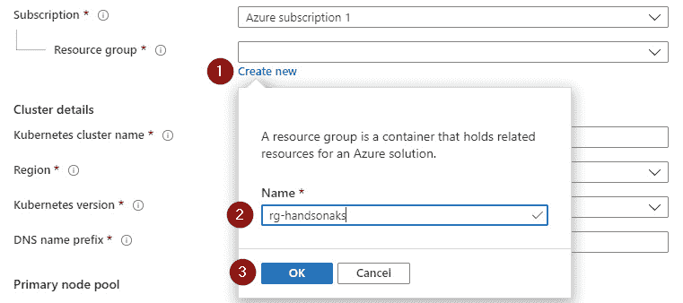
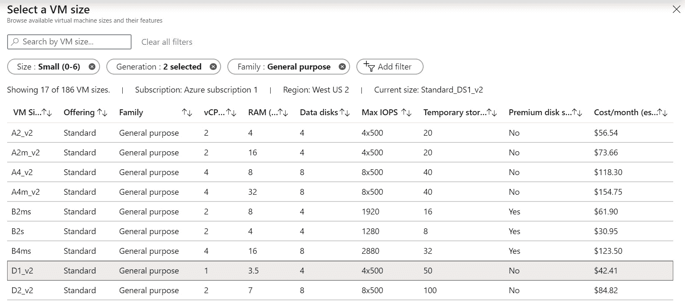
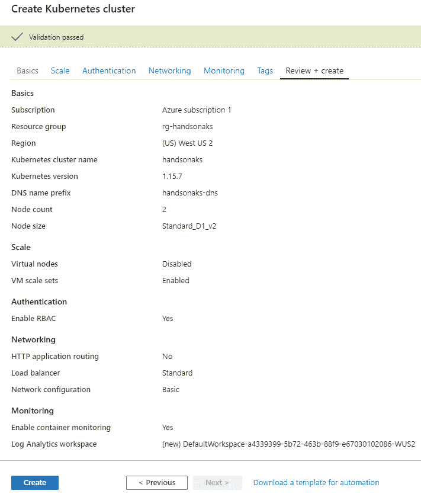
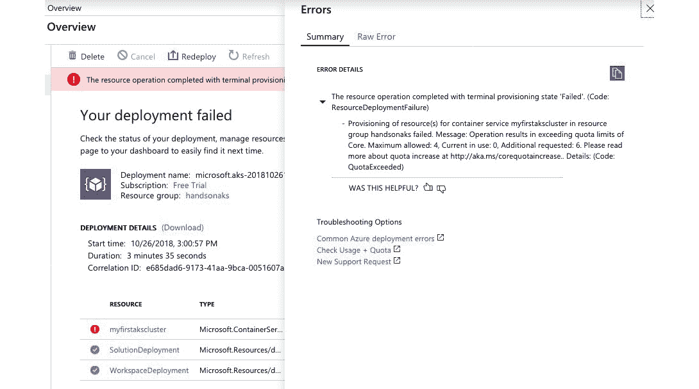
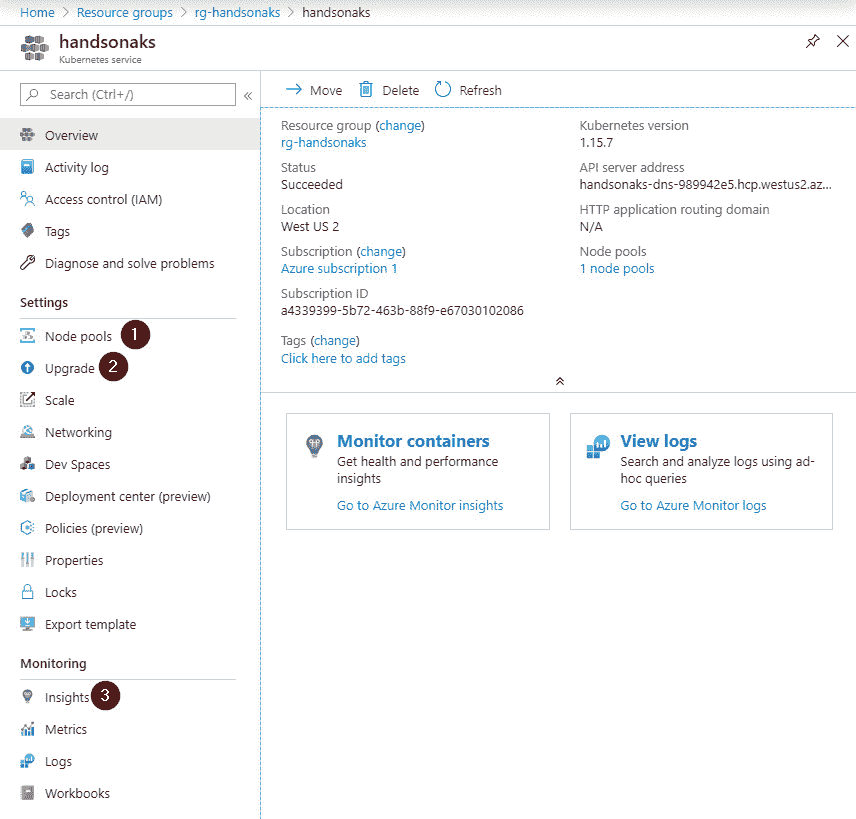
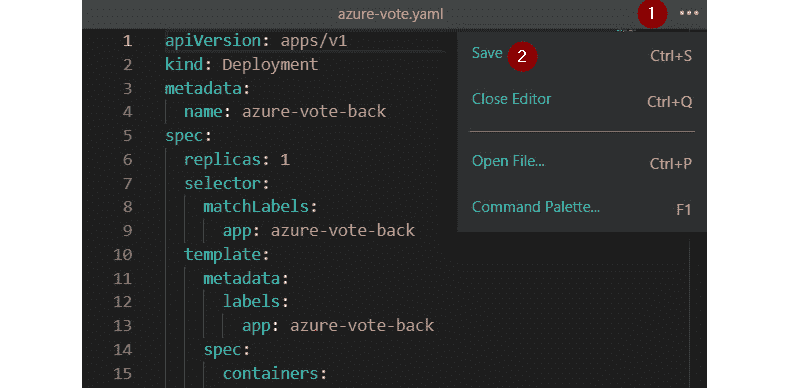

# 第二章：在 Azure 上使用 Kubernetes（AKS）

正确和安全地安装和维护 Kubernetes 集群是困难的。幸运的是，所有主要的云提供商，如 Azure、AWS 和 Google Cloud Platform（GCP），都可以帮助安装和维护集群。在本章中，您将通过 Azure 门户导航，启动自己的集群，并运行一个示例应用程序。所有这些都将在您的浏览器中完成。

本章将涵盖以下主题：

+   创建新的 Azure 免费帐户

+   导航 Azure 门户

+   启动您的第一个集群

+   启动您的第一个应用程序

让我们首先看看创建 AKS 集群的不同方式，然后运行我们的示例应用程序。

## 部署 AKS 集群的不同方式

本章将介绍部署 AKS 集群的图形化方式。然而，有多种方法可以创建您的 AKS 集群：

+   **使用门户**：门户为您提供了通过向导部署集群的图形化方式。这是部署您的第一个集群的好方法。对于多个部署或自动化部署，建议使用以下方法之一。

+   **使用 Azure CLI**：Azure **命令行界面**（**CLI**）是一个用于管理 Azure 资源的跨平台 CLI。这使您可以编写脚本来部署您的集群，可以集成到其他脚本中。

+   **使用 Azure PowerShell**：Azure PowerShell 是一组用于直接从 PowerShell 管理 Azure 资源的 PowerShell 命令。它也可以用于创建 Kubernetes 集群。

+   **使用 ARM 模板**：**Azure 资源管理器**（**ARM**）模板是 Azure 本地的**基础设施即代码**（**IaC**）语言。它允许您声明性地部署您的集群。这使您可以创建一个可以被多个团队重复使用的模板。

+   **使用 Terraform 部署 Azure**：Terraform 是由 HashiCorp 开发的开源 IaC 工具。该工具在开源社区中非常受欢迎，可用于部署云资源，包括 AKS。与 ARM 模板一样，Terraform 也使用声明性模板来创建您的集群。

在本章中，我们将使用 Azure 门户创建我们的集群。如果您有兴趣使用 CLI、ARM 或 Terraform 部署集群，Azure 文档包含了如何使用这些工具创建您的集群的步骤，网址为[`docs.microsoft.com/azure/aks`](https://docs.microsoft.com/azure/aks)。

## 从 Azure 门户开始

我们将使用 Azure 门户开始我们的初始集群部署。Azure 门户是一个基于 Web 的管理控制台。它允许您通过单个控制台构建、管理和监视全球范围内的所有 Azure 部署。

#### 注意

要跟随本书中的示例，您需要一个 Azure 帐户。如果您没有 Azure 帐户，可以按照[azure.microsoft.com/free](http://azure.microsoft.com/free)上的步骤创建免费帐户。如果您计划在现有订阅中运行此操作，您将需要订阅的所有者权限以及在 Azure Active Directory（Azure AD）中创建服务主体的能力。

本书中的所有示例都已通过免费试用帐户进行验证。

我们将通过创建 Azure Kubernetes Service（AKS）集群来直接开始。通过这样做，我们还将熟悉 Azure 门户。

### 创建您的第一个 AKS 集群

在 Azure 门户顶部的搜索栏中输入`aks`关键字。在结果中，点击**服务**类别下的**Kubernetes 服务**：

图 2.1：在顶部的搜索栏中搜索 aks，查找服务类别中的 Kubernetes 服务

###### 图 2.1：使用搜索栏在 Azure 门户顶部输入`aks`关键字

这将带您到门户中的 AKS 刀片。正如您可能期望的那样，您还没有任何集群。继续通过点击**+添加**按钮创建一个新的集群：

图 2.2：在 AKS 刀片内选择左上角的添加按钮，开始集群创建过程。

###### 图 2.2：单击“+添加”按钮开始集群创建过程

#### 注意

在创建 AKS 集群时有很多配置选项。对于您的第一个集群，我们建议使用门户中的默认设置，并在本示例中遵循我们的命名指南。以下设置经过我们测试，可靠地在免费帐户中使用。

这将带您通过创建向导来创建您的第一个 AKS 集群。这里的第一步是创建一个新的资源组。点击“创建新”按钮，给您的资源命名，并点击“确定”。如果您想跟随本书中的示例，请将资源组命名为`rg-handsonaks`：

###### 图 2.3：创建新的资源组

接下来，我们将提供我们的集群详细信息。给您的集群取一个名字 - 如果您想要按照书中的示例进行，请将其命名为`handsonaks`。我们在书中将使用的区域是`(US) West US 2`，但您可以选择靠近您位置的任何其他区域。我们将使用 Kubernetes 版本`1.15.7`，但如果该版本对您不可用，不用担心。Kubernetes 和 AKS 发展非常迅速，经常会推出新版本。接下来，您需要提供一个 DNS 名称前缀。这不必是唯一的，因为 Azure 将在其后附加随机字符：

###### 图 2.4：提供集群详细信息

接下来，我们需要更改节点大小和节点计数。为了优化我们示例集群的免费预算，我们将使用一个没有高级存储的**虚拟机**（**VM**）并部署一个两节点集群。如果您没有使用免费试用版，您可以选择更强大的 VM 大小，尽管这对本书中的实验并非必需。

点击机器大小下方的**更改大小**按钮：

###### 图 2.5：点击“更改大小”选项以选择较小的机器

删除寻找高级存储的筛选器，寻找**D1_v2**。然后将**节点计数**的滑块更改为**2**：

###### 图 2.6：选择 D1_v2 作为机器大小

这应该使您的集群大小看起来类似于*图 2.7*所示的样子：

###### 图 2.7：更新的节点大小和节点计数

#### 注意

您的免费帐户有一个四核限制，如果我们使用默认设置将会违反这一限制。

第一个标签页的最终视图应该类似于*图 2.8*。我们将不更改我们的演示集群的许多其他配置选项。由于我们已经准备好，现在点击“审阅+创建”按钮进行最终审阅并创建您的集群：

###### 图 2.8：设置集群配置

在最终视图中，Azure 将验证应用于您的第一个集群的配置。如果验证通过，请点击**创建**：

###### 图 2.9：您集群配置的最终验证

部署您的集群大约需要 15 分钟。部署完成后，您可以查看部署详细信息，如*图 2.10*所示：

###### 图 2.10：集群成功部署后的部署详细信息

如果您遇到配额限制错误，如*图 2.11*所示，请检查设置并重试。确保您选择了**D1_v2**节点大小，并且只有两个节点：

###### 图 2.11：由于配额限制错误，重试使用较小的集群大小

要进入下一节，我们将快速查看我们的集群，请点击“转到资源”按钮，这将带您进入门户中的 AKS 标签页。

### Azure 门户中您集群的快速概述

如果您在上一节中点击了“转到资源”按钮，现在应该在 Azure 门户中看到您集群的概述：

###### 图 2.12：Azure 门户中的 AKS 标签页

这是对您的集群的快速概述。它提供了名称、位置和 API 服务器地址。左侧导航菜单提供了不同的选项来控制和管理您的集群。让我们走一遍门户提供的一些有趣的选项。

第一个有趣的选项是**节点池**选项。在节点池视图中，您可以通过添加或删除节点来扩展现有的节点池（即集群中的节点或服务器）；您可以添加一个新的节点池，可能具有不同的服务器大小，还可以单独升级您的节点池。在*图 2.13*中，您可以在左上角看到**添加节点池**选项，并在右侧菜单中看到**扩展**或**升级**的选项：

###### 图 2.13：添加、扩展和升级节点池

第二个有趣的刀片是**升级**刀片。在这里，您可以指示 AKS 将管理平面升级到更新版本。通常，在 Kubernetes 升级中，您首先升级主平面，然后分别升级各个节点池：

###### 图 2.14：使用升级刀片升级 API 服务器的 Kubernetes 版本

调查的最后一个有趣的地方是**Insights**。**Insights**选项为您提供了对集群基础设施和运行在集群上的工作负载的监控。由于我们的集群是全新的，没有太多数据可以调查。我们将在*第七章*中再次回到这里，监控 AKS 集群和应用程序：

###### 图 2.15：使用 Insights 刀片显示集群利用率

这就结束了我们对集群和 Azure 门户中一些有趣的配置选项的快速概述。在下一节中，我们将使用 Cloud Shell 连接到我们的 AKS 集群，然后在我们的集群上启动一个演示应用程序。

### 使用 Azure Cloud Shell 访问您的集群

一旦部署成功完成，请在搜索栏附近找到小的 Cloud Shell 图标，如*图 2.16*中所示，并单击它：

###### 图 2.16：单击云外壳图标以打开 Azure 云外壳

门户网站会要求您选择 PowerShell 或 Bash 作为默认的外壳体验。由于我们将主要使用 Linux 工作负载，请选择**Bash**：

###### 图 2.17：选择 Bash 选项

如果这是您第一次启动云外壳，系统会要求您创建一个存储帐户；请确认并创建它。

您可能会收到包含挂载存储错误的错误消息。如果出现该错误，请重新启动您的云外壳：

###### 图 2.18：点击重新启动按钮以解决挂载存储错误

单击电源按钮。它应该重新启动，您应该看到类似*图 2.19*的东西：

###### 图 2.19：成功启动云外壳

您可以拉动分隔器/分隔线，以查看更多或更少的外壳内容：

###### 图 2.20：使用分隔器使云外壳变大或变小

用于与 Kubernetes 集群进行交互的命令行工具称为`kubectl`。使用 Azure 云外壳的好处是，这个工具以及许多其他工具都是预安装的，并且定期维护。`kubectl`使用存储在`~/.kube/config`中的配置文件来存储访问集群的凭据。

#### 注意

在 Kubernetes 社区中有一些关于正确发音`kubectl`的讨论。通常的发音方式是 kube-c-t-l、kube-control 或 kube-cuddle。

要获取访问集群所需的凭据，您需要输入以下命令：

[PRE0]

要验证您是否有访问权限，请输入以下内容：

[PRE1]

你应该看到类似*图 2.21*的东西：

###### 图 2.21：kubectl get nodes 命令的输出

这个命令已经验证了我们可以连接到我们的 AKS 集群。在下一节中，我们将继续启动我们的第一个应用程序。

### 部署您的第一个演示应用程序

您已经连接好了。我们现在将启动我们的第一个应用程序。在 Cloud Shell 中，有两种编辑代码的选项。您可以使用命令行工具，如`vi`或`nano`，也可以通过输入`code`命令来使用图形代码编辑器。我们将在我们的示例中使用图形编辑器，但请随意使用您感觉最舒适的工具。

为了本书的目的，所有的代码示例都托管在一个 GitHub 存储库中。您可以将此存储库克隆到您的 Cloud Shell，并直接使用代码示例。要将 GitHub 存储库克隆到您的 Cloud Shell，请使用以下命令：

[PRE2]

要访问本章的代码示例，请进入代码示例目录并转到`Chapter02`目录：

[PRE3]

我们现在将直接在那里使用代码。在本书的这一部分，我们暂时不会关注`YAML`文件中的内容。本章的目标是在集群上启动一个应用程序。在接下来的章节中，我们将深入探讨它们是如何构建的，以及您如何创建自己的应用程序。

我们将根据`azure-vote.yaml`文件中的定义创建一个应用程序。要在 Cloud Shell 中打开该文件，您可以输入以下命令：

[PRE4]

以下是您方便的代码示例：

[PRE5]

您可以在 Cloud Shell 代码编辑器中对文件进行更改。如果您进行了更改，可以点击右上角的**...**图标，然后点击**保存**来保存文件：

###### 图 2.22：点击[...]保存文件

文件应该已保存。您可以使用以下命令检查：

[PRE6]

#### 注意：

在 Linux 中，按下*Tab*按钮会展开文件名。在前面的场景中，如果您在输入`az`后按下`Tab`，它应该会展开为`azure-vote.yaml`。

现在，让我们启动应用程序：

[PRE7]

您应该很快就会看到*图 2.23*中显示的输出，告诉您已创建了哪些资源：

###### 图 2.23：kubectl create 命令的输出

您可以通过输入以下内容来检查进度：

[PRE8]

如果您输入得很快，您可能会看到某个 pod 仍处于`ContainerCreating`过程中：

###### 图 2.24：kubectl get pods 命令的输出

#### 注意

输入`kubectl`可能会变得乏味。您可以使用`alias`命令使生活变得更轻松。您可以使用以下命令将`k`作为`kubectl`的别名：`alias k=kubectl`。运行上述命令后，您只需使用`k get pods`。出于本书的教学目的，我们将继续使用完整的`kubectl`命令。

按上箭头键并按*Enter*，直到所有 pod 的状态都为`Running`。设置所有 pod 需要一些时间，您可以使用以下命令跟踪它们的状态：

[PRE9]

要停止跟踪 pod 的状态（当它们全部处于运行状态时），可以按*Ctrl* + *C*（Mac 上为*command* + *C*）。

为了公开访问我们的应用程序，我们需要等待另一件事。现在我们想知道负载均衡器的公共 IP，以便我们可以访问它。如果您还记得*第一章，Docker 和 Kubernetes 简介*中的内容，Kubernetes 中的服务将创建一个 Azure 负载均衡器。这个负载均衡器将在我们的应用程序中获得一个公共 IP，以便我们可以公开访问它。

键入以下命令以获取负载均衡器的公共 IP：

[PRE10]

起初，外部 IP 可能显示为“待定”。等待公共 IP 出现，然后按*Ctrl* + *C*（Mac 上为*command* + *C*）退出：

###### 图 2.25：从待定 IP 更改为实际 IP 地址的服务 IP

注意外部 IP 地址，并在浏览器中输入。您应该看到*图 2.26*中显示的输出：

###### 图 2.26：您刚刚启动的实际应用程序

单击**猫**或**狗**，观察计数增加。

您现在已经启动了自己的集群和第一个 Kubernetes 应用程序。请注意，Kubernetes 负责诸如连接前端和后端、将其暴露给外部世界以及为服务提供存储等任务。

在进入下一章之前，我们将清理我们的部署。由于我们是从一个文件创建的所有内容，我们也可以通过将 Kubernetes 指向该文件来删除所有内容。键入`kubectl delete -f azure-vote.yaml`，观察所有对象被删除：

###### 图 2.27：清理部署

在本节中，我们已经使用 Cloud Shell 连接到了我们的 AKS 集群，成功启动并连接到了演示应用程序，最后清理了创建的资源。

## 摘要

完成了本章后，您可以访问并浏览 Azure 门户，执行部署 AKS 集群所需的所有功能。您利用 Azure 的免费试用来学习 AKS 和其他 Azure 服务的方方面面。您启动了自己的 AKS 集群，并可以使用 Azure 门户根据需要自定义配置。

您还可以在不在计算机上安装任何内容的情况下使用 Azure Cloud Shell。这对于接下来的所有部分都很重要，在那里您将做的不仅仅是启动简单的应用程序。最后，您启动了一个可公开访问的服务。这个应用程序的框架与您将在后面的章节中启动的复杂应用程序相同。

在下一章中，我们将深入研究不同的部署选项，将应用程序部署到 AKS 上。
