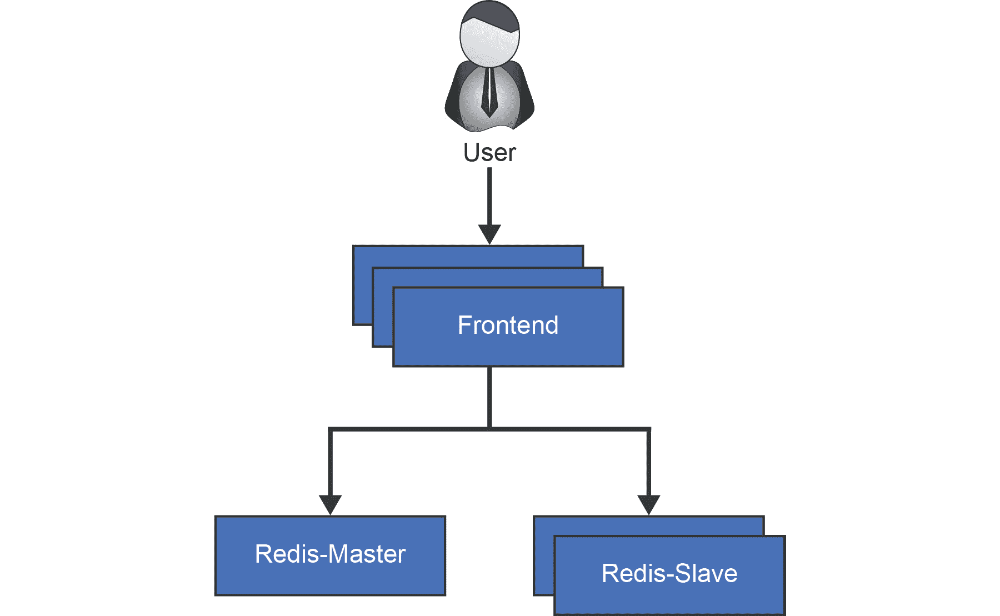
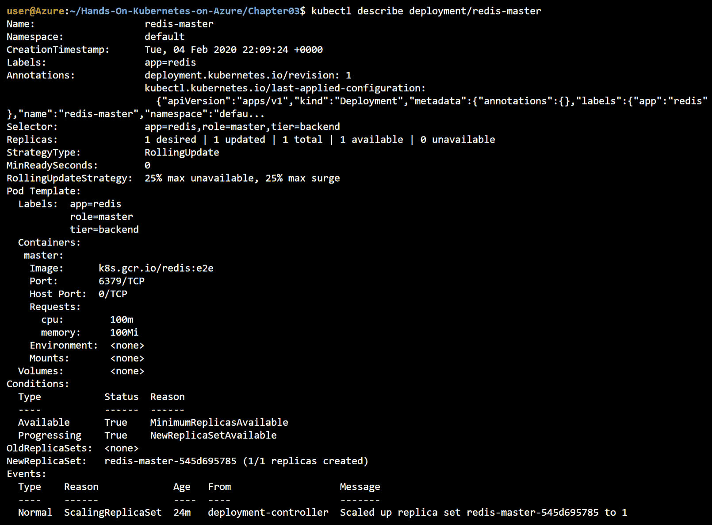
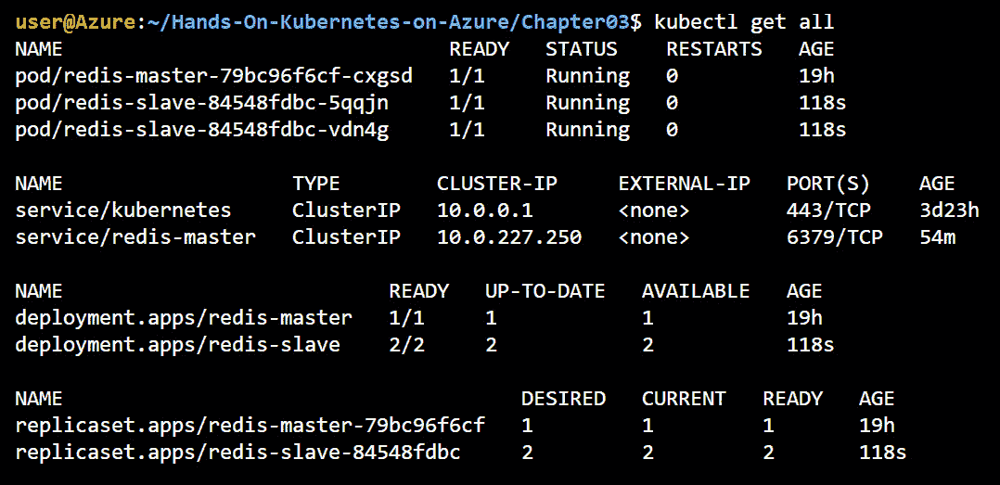
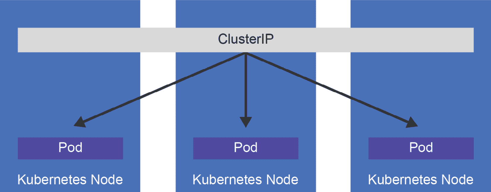
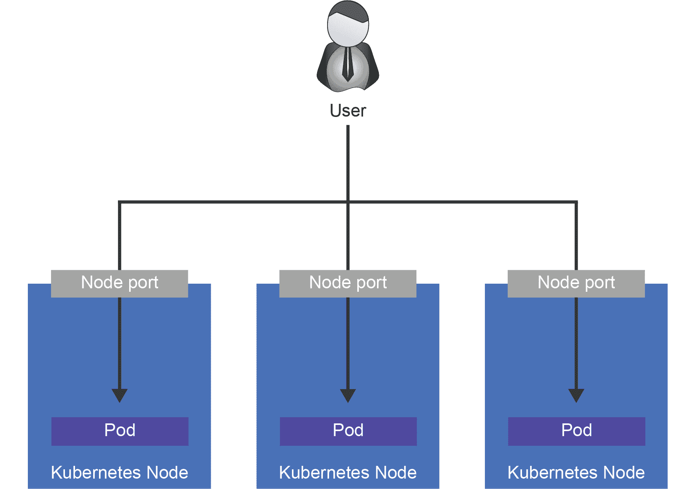
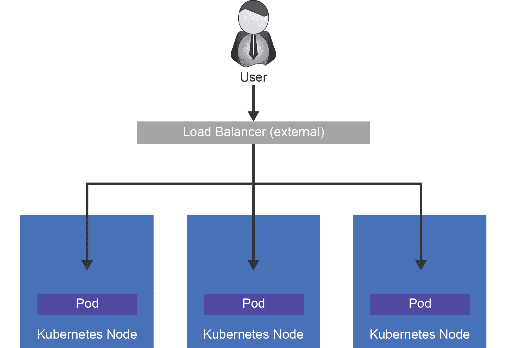
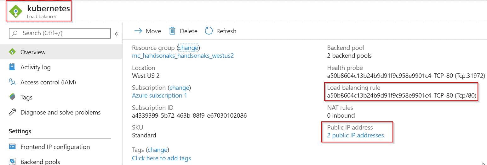
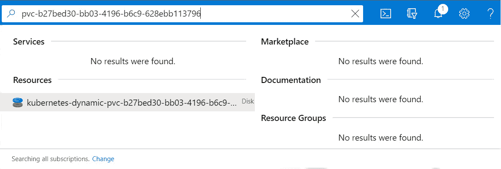

# 第三章：在 AKS 上部署应用程序

在本章中，我们将在**Azure Kubernetes Service**（**AKS**）上部署两个应用程序。一个应用程序由多个部分组成，您将一步一步地构建这些应用程序，同时解释它们背后的概念模型。您将能够轻松地将本章中的步骤调整为在 AKS 上部署任何其他应用程序。

部署应用程序并对其进行更改时，您将使用 YAML 文件。YAML 是**YAML Ain't Markup Language**的首字母缩略词。YAML 是一种用于创建配置文件以部署到 Kubernetes 的语言。虽然您可以使用 JSON 或 YAML 文件来部署应用程序到 Kubernetes，但 YAML 是最常用的语言。YAML 变得流行是因为与 JSON 或 XML 相比，人类更容易阅读它。在本章和整本书中，您将看到多个 YAML 文件的示例。

在部署示例 guestbook 应用程序时，您将看到 Kubernetes 概念的实际应用。您将看到**部署**与**ReplicaSet**的关联，以及它与部署的**Pods**的关联。部署是 Kubernetes 中用于定义应用程序期望状态的对象。部署将创建一个 ReplicaSet。ReplicaSet 是 Kubernetes 中保证一定数量的 Pod 始终可用的对象。因此，ReplicaSet 将创建一个或多个 Pods。Pod 是 Kubernetes 中的一个对象，它是一个或多个容器的组。让我们重新审视部署、ReplicaSet 和 Pod 之间的关系：


###### 图 3.1：部署、ReplicaSet 和 Pod 之间的关系

在部署示例应用程序时，您将使用**服务对象**来连接应用程序。Kubernetes 中的服务是用于为应用程序提供静态 IP 地址和 DNS 名称的对象。由于 Pod 可以在集群中被杀死并移动到不同的节点，服务确保您可以连接到应用程序的静态终点。

您还将编辑示例应用程序，使用 ConfigMap 提供配置细节。ConfigMap 是一个用于向 Pod 提供配置细节的对象。它允许您将配置设置保留在容器之外。然后，您可以通过将 ConfigMap 连接到部署来向应用程序提供这些配置细节。

最后，您将了解 Helm。Helm 是 Kubernetes 的包管理器，有助于简化部署过程。您将使用 Helm 部署 WordPress 网站，并了解 Helm 为 Kubernetes 带来的价值。WordPress 安装在 Kubernetes 中使用持久存储。您将学习如何设置 AKS 中的持久存储。

本章将涵盖以下主题：

+   部署示例留言板应用程序

+   完整部署示例留言板应用程序

+   使用 Helm 安装复杂的 Kubernetes 应用程序

我们将从示例留言板应用程序开始。

## 部署示例留言板应用程序

在本章中，您将部署经典的留言板示例 Kubernetes 应用程序。您将主要按照[`Kubernetes.io/docs/tutorials/stateless-application/guestbook/`](https://Kubernetes.io/docs/tutorials/stateless-application/guestbook/)中的步骤进行，但会进行一些修改。您将使用这些修改来展示额外的概念，比如 ConfigMaps，这些概念在原始示例中并不存在。

示例留言板应用程序是一个简单的多层 Web 应用程序。该应用程序中的不同层将具有多个实例。这对于高可用性和扩展都是有益的。留言板的前端是一个无状态应用程序，因为前端不存储任何状态。后端的 Redis 集群是有状态的，因为它存储所有留言板条目。

你将在下一章中使用这个应用程序作为测试后端和前端独立扩展的基础。

在开始之前，让我们考虑一下我们将要部署的应用程序。

### 介绍应用程序

该应用程序存储并显示留言板条目。您可以使用它来记录所有访问您的酒店或餐厅的人的意见。在此过程中，我们将解释 Kubernetes 概念，如部署和 ReplicaSets。

该应用程序使用 PHP 作为前端。前端将使用多个副本进行部署。该应用程序使用 Redis 作为数据存储。Redis 是一种内存中的键值数据库。Redis 通常用作缓存。根据[`www.datadoghq.com/docker-adoption/`](https://www.datadoghq.com/docker-adoption/)，它是最受欢迎的容器映像之一。



###### 图 3.2：guestbook 应用的高级概述

我们将通过部署 Redis 主节点来开始部署此应用程序。

### 部署 Redis 主节点

在本节中，您将部署 Redis 主节点。您将了解到此部署所需的 YAML 语法。在下一节中，您将对此 YAML 进行更改。在进行更改之前，让我们先部署 Redis 主节点。

执行以下步骤完成任务：

1.  打开友好的 Cloud Shell，如*图 3.3*中所示：

###### 图 3.3：打开 Cloud Shell

1.  如果您尚未克隆此书的 github 存储库，请使用以下命令进行克隆：

```
git clone https://github.com/PacktPublishing/Hands-On-Kubernetes-on-Azure---Second-Edition Hands-On-Kubernetes-on-Azure
cd Hands-On-Kubernetes-on-Azure/Chapter03/
```

1.  输入以下命令以部署主节点：

```
kubectl apply -f redis-master-deployment.yaml
```

应用程序下载和启动需要一些时间。在等待时，让我们了解您刚刚输入和执行的命令。让我们开始探索使用的 YAML 文件的内容：

```
1 apiVersion: apps/v1 # for versions before 1.9.0 use apps/v1beta2
2 kind: Deployment
3 metadata:
4   name: redis-master
5   labels:
6     app: redis
7 spec:
8   selector:
9     matchLabels:
10      app: redis
11      role: master
12      tier: backend
13  replicas: 1
14  template:
15    metadata:
16      labels:
17        app: redis
18        role: master
19        tier: backend
20    spec:
21      containers:
22      - name: master
23        image: k8s.gcr.io/redis:e2e # or just image: redis
24        resources:
25          requests:
26            cpu: 100m
27            memory: 100Mi
28        ports:
29        - containerPort: 6379
```

让我们深入了解提供的参数的代码：

+   第 2 行：这说明我们正在创建一个“部署”。如《第一章》*Docker 和 Kubernetes 简介*中所解释的，部署是围绕 Pods 的包装，使得更新和扩展 Pods 变得容易。

+   第 4-6 行：在这里，“部署”被赋予一个名称，即`redis-master`。

+   第 7-12 行：这些行让我们指定此“部署”将管理的容器。在此示例中，“部署”将选择和管理所有标签匹配的容器（`app: redis`，`role: master`和`tier: backend`）。前面的标签与第 14-19 行提供的标签完全匹配。

+   **第 13 行**：告诉 Kubernetes 我们需要确切地运行一个 Redis 主节点的副本。这是 Kubernetes 声明性质的一个关键方面。您提供了应用程序需要运行的容器的描述（在本例中，只有一个 Redis 主节点的副本），Kubernetes 会处理它。

+   **第 14-19 行**：为运行的实例添加标签，以便将其分组并连接到其他容器。我们将在后面讨论它们是如何使用的。

+   **第 22 行**：为这个容器指定一个名字，即`master`。在多容器 Pod 的情况下，Pod 中的每个容器都需要一个唯一的名字。

+   **第 23 行**：这一行指示将要运行的 Docker 镜像。在这种情况下，它是使用`e2e`标记的`redis`镜像（最新通过端到端[`e2e`]测试的 Redis 镜像）。

+   **第 28-29 行**：这两行表示容器将监听`6379`端口。

+   **第 24-27 行**：设置容器请求的`cpu/memory`资源。在这种情况下，请求的是 0.1 CPU，即`100m`，通常也被称为 100 毫核。请求的内存是`100Mi`，或 104857600 字节，大约等于 105MB ([`Kubernetes.io/docs/concepts/configuration/manage-compute-resources-container/`](https://Kubernetes.io/docs/concepts/configuration/manage-compute-resources-container/))。您也可以以类似的方式设置 CPU 和内存限制。限制是容器可以使用的上限。如果您的 Pod 达到了 CPU 限制，它将被限制，而如果它达到了内存限制，它将被重新启动。在 Kubernetes 中设置请求和限制是最佳实践。

#### 注意

Kubernetes 的 YAML 定义类似于 Docker 运行特定容器镜像时给出的参数。如果您必须手动运行这个例子，您可以这样定义：

`# 运行一个名为 master 的容器，监听 6379 端口，使用 redis:e2e 镜像，内存为 100M，CPU 为 100m。`

`docker run --name master -p 6379:6379 -m 100M -c 100m -d k8s.gcr.io/redis:e2e`

在这一部分，您已经部署了 Redis 主节点，并学习了用于创建此部署的 YAML 文件的语法。在下一部分，您将检查部署并了解创建的不同元素。

**检查部署**

`redis-master`部署现在应该已经完成。继续在您在上一部分打开的 Azure Cloud Shell 中输入以下内容：

```
kubectl get all
```

你应该会得到*图 3.4*中显示的输出：


###### 图 3.4：显示部署创建的对象的输出

你可以看到我们有一个名为`redis-master`的部署。它控制着一个`redis-master-<随机 id>`的 ReplicaSet。进一步检查后，你还会发现 ReplicaSet 正在控制一个名为`redis-master-<replica set 随机 id>-<随机 id>`的 Pod。*图 3.1*以图形方式展示了这种关系。

通过执行`kubectl describe <object> <instance-name>`命令，可以获得更多详细信息，如下所示：

```
kubectl describe deployment/redis-master
```

这将生成以下输出：



###### 图 3.5：描述部署的输出

您现在已经启动了一个具有默认配置的 Redis 主节点。通常，您会使用特定于环境的配置启动应用程序。

在下一节中，我们将介绍一个名为 ConfigMaps 的新概念，然后重新创建 Redis 主节点。因此，在继续之前，我们需要清理当前版本，可以通过运行以下命令来完成：

```
kubectl delete deployment/redis-master
```

执行此命令将产生以下输出：

```
deployment.extensions "redis-master" deleted
```

在本节中，您检查了您创建的 Redis 主节点部署。您看到了部署与 ReplicaSet 的关系，以及 ReplicaSet 与 Pod 的关系。在接下来的部分中，您将使用通过 ConfigMap 提供的特定于环境的配置重新创建这个 Redis 主节点。

### 带有 ConfigMap 的 Redis 主节点

以前的部署没有任何问题。在实际使用情况中，很少会启动一个没有一些配置设置的应用程序。在这种情况下，我们将使用 ConfigMap 为`redis-master`设置配置设置。

ConfigMap 是一种便携的配置容器的方式，而不需要为每个配置专门的镜像。它具有需要在容器上设置的数据的键值对。ConfigMap 用于非机密配置。Kubernetes 有一个名为**Secret**的单独对象。Secret 用于包含关键数据的配置，如密码。这将在本书的*第十章*，*保护您的 AKS 集群*中详细探讨。

在此示例中，我们将创建一个 ConfigMap。在此 ConfigMap 中，我们将`redis-config`配置为键，值将为：

`maxmemory 2mb`

`maxmemory-policy allkeys-lru`

现在，让我们创建此 ConfigMap。有两种创建 ConfigMap 的方法：

+   从文件创建 ConfigMap

+   从 YAML 文件创建 ConfigMap

我们将详细探讨每一个。

**从文件创建 ConfigMap**

以下步骤将帮助我们从文件创建 ConfigMap：

1.  通过在终端中键入`code redis-config`来打开 Azure Cloud Shell 代码编辑器。复制并粘贴以下两行，并将其保存为`redis-config`：

```
maxmemory 2mb
maxmemory-policy allkeys-lru
```

1.  现在您可以使用以下代码创建 ConfigMap：

```
kubectl create configmap example-redis-config --from-file=redis-config
```

1.  您应该得到以下输出：

```
configmap/example-redis-config created
```

1.  您可以使用相同的命令描述此 ConfigMap：

```
kubectl describe configmap/example-redis-config
```

1.  输出将如*图 3.6*所示：

###### 图 3.6：描述 ConfigMap 的输出

在此示例中，您通过引用磁盘上的文件创建了 ConfigMap。部署 ConfigMaps 的另一种方法是通过从 YAML 文件创建它们。让我们看看在以下部分如何完成这一点。

**从 YAML 文件创建 ConfigMap**

在本节中，您将使用 YAML 文件从上一节重新创建 ConfigMap：

1.  首先，删除先前创建的 ConfigMap：

```
kubectl delete configmap/example-redis-config
```

1.  将以下行复制并粘贴到名为`example-redis-config.yaml`的文件中，然后保存该文件：

```
apiVersion: v1
data:
  redis-config: |- 
    maxmemory 2mb
    maxmemory-policy allkeys-lru
kind: ConfigMap
metadata:
  name: example-redis-config
  namespace: default
```

1.  现在，您可以通过以下命令重新创建您的 ConfigMap：

```
kubectl create -f example-redis-config.yaml
```

1.  您应该得到以下输出：

```
configmap/example-redis-config created
```

1.  接下来，运行以下命令：

```
kubectl describe configmap/example-redis-config
```

1.  此命令返回与先前相同的输出：

```
Name:           example-redis-config
Namespace:      default
Labels:         <none>
Annotations:    <none>
Data
====
redis-config:
----
maxmemory 2mb
maxmemory-policy allkeys-lru
Events:	<none>
```

如您所见，使用 YAML 文件，您能够创建相同的 ConfigMap。

#### 注意：

`kubectl get`具有有用的选项`-o`，可用于以 YAML 或 JSON 格式获取对象的输出。这在您对系统进行手动更改并希望以 YAML 格式查看生成的对象时非常有用。您可以使用以下命令以 YAML 格式获取当前的 ConfigMap：

`kubectl get -o yaml configmap/example-redis-config`

现在您已经定义了 ConfigMap，让我们使用它。

**使用 ConfigMap 读取配置数据**

在本节中，您将重新配置`redis-master`部署以从 ConfgMap 读取配置：

1.  首先，修改`redis-master-deployment.yaml`以使用 ConfigMap 如下。在源代码之后将解释需要进行的更改：

#### 注意

如果您下载了本书附带的源代码，在*第三章*，*在 AKS 上部署应用程序*中有一个名为`redis-master-deployment_Modified.yaml`的文件，其中已经应用了必要的更改。

```
1 apiVersion: apps/v1 # for versions before 1.9.0 use apps/v1beta2
2  kind: Deployment
3  metadata:
4    name: redis-master
5    labels:
6      app: redis
7  spec:
8    selector:
9      matchLabels:
10       app: redis
11       role: master
12       tier: backend
13   replicas: 1
14   template:
15     metadata:
16       labels:
17         app: redis
18         role: master
19         tier: backend
20     spec:
21       containers:
22       - name: master
23         image: k8s.gcr.io/redis:e2e
24         command:
25         - redis-server
26         - "/redis-master/redis.conf"
27         env:
28         - name: MASTER
29           value: "true"
30         volumeMounts:
31         - mountPath: /redis-master
32           name: config
33         resources:
34           requests:
35             cpu: 100m
36             memory: 100Mi
37         ports:
38         - containerPort: 6379
39       volumes:
40         - name: config
41           configMap:
42             name: example-redis-config
43             items:
44             - key: redis-config
45               path: redis.conf
```

让我们深入了解代码，以理解不同的部分：

+   第 24-26 行：这些行介绍了在 Pod 启动时将执行的命令。在这种情况下，这将启动指向特定配置文件的`redis-server`。

+   第 27-29 行：显示如何将配置数据传递给正在运行的容器。这种方法使用环境变量。在 Docker 形式中，这相当于`docker run -e "MASTER=true". --name master -p 6379:6379 -m 100M -c 100m -d Kubernetes /redis:v1`。这将环境变量`MASTER`设置为`true`。您的应用程序可以读取环境变量设置以进行配置。

+   第 30-32 行：这些行在运行的容器上的`/redis-master`路径上挂载名为`config`的卷（此卷在第 39-45 行中定义）。它将隐藏原始容器上`/redis-master`上存在的任何内容。

以 Docker 术语来说，相当于`docker run -v config:/redis-master. -e "MASTER=TRUE" --name master -p 6379:6379 -m 100M -c 100m -d Kubernetes /redis:v1`。

+   第 40 行：为卷命名为`config`。此名称将在此 Pod 的上下文中使用。

+   第 41-42 行：声明应该从`example-redis-config` ConfigMap 加载此卷。此 ConfigMap 应该已经存在于系统中。您已经定义了这一点，所以没问题。

+   第 43-45 行：在这里，您正在将`redis-config`键的值（两行`maxmemory`设置）加载为`redis.conf`文件。

1.  让我们创建这个更新后的部署：

```
kubectl create -f redis-master-deployment_Modified.yml
```

1.  这应该输出以下内容：

```
deployment.apps/redis-master created
```

1.  现在让我们确保配置已成功应用。首先，获取 Pod 的名称：

```
kubectl get pods
```

1.  然后`exec`进入 Pod 并验证已应用设置：

```
kubectl exec -it redis-master-<pod-id> redis-cli
127.0.0.1:6379&gt; CONFIG GET maxmemory
  1) "maxmemory" 2) "2097152"
127.0.0.1:6379&gt; CONFIG GET maxmemory-policy
  "maxmemory-policy"
  "allkeys-lru" 127.0.0.1:6379&gt;exit
```

总之，您刚刚执行了配置云原生应用程序的重要且棘手的部分。您还会注意到应用程序必须配置为动态读取配置。配置应用程序后，您访问了正在运行的容器以验证运行配置。

#### 注意

连接到运行中的容器对于故障排除和诊断非常有用。由于容器的短暂性质，您不应该连接到容器进行额外的配置或安装。这应该是您容器镜像的一部分，或者是您通过 Kubernetes 提供的配置（就像我们刚刚做的那样）。

在本节中，您配置了 Redis Master 从 ConfigMap 加载配置数据。在下一节中，我们将部署端到端的应用程序。

## 示例 guestbook 应用程序的完整部署

在了解使用 ConfigMap 动态配置应用程序的过程中，我们将现在返回到部署其余 guestbook 应用程序的过程中。您将再次遇到部署、ReplicaSets 和后端和前端的 Pods 的概念。除此之外，您还将被介绍另一个关键概念，称为服务。

为了开始完整的部署，我们将创建一个服务来公开 Redis 主服务。

### 公开 Redis 主服务

在普通 Docker 中公开端口时，公开的端口受限于其运行的主机。在 Kubernetes 网络中，集群中不同 Pod 之间存在网络连接。但是，Pod 本身是短暂的，这意味着它们可以被关闭、重新启动，甚至移动到其他主机而不保留其 IP 地址。如果您直接连接到 Pod 的 IP，如果该 Pod 被移动到新主机，您可能会失去连接。

Kubernetes 提供了`service`对象，它处理了这个确切的问题。使用标签匹配选择器，它代理流量到正确的 Pod，并进行负载平衡。在这种情况下，主服务只有一个 Pod，因此它只确保流量被定向到独立于 Pod 所在节点的 Pod。要创建服务，请运行以下命令：

```
kubectl apply -f redis-master-service.yaml 
```

Redis 主服务具有以下内容：

```
1   apiVersion: v1
2   kind: Service
3   metadata:
4     name: redis-master
5     labels:
6       app: redis
7       role: master
8       tier: backend
9   spec:
10   ports:
11   - port: 6379
12     targetPort: 6379
13    selector:
14      app: redis
15      role: master
16      tier: backend
```

现在让我们看看您使用前面的代码创建了什么：

+   **第 1-8 行：**这些行告诉 Kubernetes，我们想要一个名为`redis-master`的服务，它具有与我们的`redis-master`服务器 Pod 相同的标签。

+   **第 10-12 行：**这些行表示服务应该处理到达端口`6379`的流量，并将其转发到与第 13 行和第 16 行之间定义的选择器匹配的 Pod 的端口`6379`。

+   **第 13-16 行**：这些行用于查找需要代理传入流量的 Pod。因此，任何具有匹配标签（`app: redis`、`role: master`和`tier: backend`）的 Pod 都应该处理端口`6379`的流量。如果您回顾前面的示例，这些标签正是我们应用于该部署的标签。

我们可以通过运行以下命令来检查服务的属性：

```
kubectl get service
```

这将给您一个如*图 3.7*所示的输出：

使用 kubectl get service 命令，您将看到每个服务的名称、类型、集群 IP、外部 IP、端口和年龄等详细信息。

###### 图 3.7：创建的服务的输出

您会看到一个名为`redis-master`的新服务已创建。它具有集群范围的 IP`10.0.227.250`（在您的情况下，IP 可能会有所不同）。请注意，此 IP 仅在集群内部有效（因此是`ClusterIP`类型）。

服务还为该服务引入了一个域名服务器（DNS）名称。DNS 名称的格式为`<service-name>.<namespace>.svc.cluster.local`；在我们的情况下，那将是`redis-master.default.svc.cluster.local`。为了看到这一点，我们将在我们的`redis-master` VM 上进行名称解析。默认镜像没有安装`nslookup`，所以我们将通过运行`ping`命令来绕过。如果该流量没有返回，不要担心；这是因为您没有在服务上公开`ping`，只有`redis`端口。让我们来看一下：

```
kubectl get pods
#note the name of your redis-master pod
kubectl exec -it redis-master-<pod-id> bash
ping redis-master
```

这应该输出结果名称解析，显示您服务的完全合格域名（FQDN）和之前显示的 IP 地址。您可以通过`exit`命令退出 Pod，如*图 3.8*所示：

输出显示了服务的 FQDN 以及 IP 地址。

###### 图 3.8：使用 ping 命令查看服务的 FQDN

在这一部分，您使用服务公开了 Redis 主服务器。在下一部分，您将部署 Redis 从服务器。

### 部署 Redis 从服务器

在云上运行单个后端是不推荐的。您可以在主从设置中配置 Redis。这意味着您可以有一个主服务器用于写入流量，以及多个从服务器用于处理读取流量。这对于处理增加的读取流量和提高可用性非常有用。

让我们来设置一下：

1.  通过运行以下命令创建部署：

```
kubectl apply -f redis-slave-deployment.yaml
```

1.  让我们现在检查所有已创建的资源：

```
kubectl get all
```

输出将如*图 3.9*所示：



###### 图 3.9：部署 Redis 从节点会创建一些新对象

1.  根据前面的输出，您可以看到您创建了两个`redis-slave` Pod 的副本。这可以通过检查`redis-slave-deployment.yaml`文件来确认：

```
1   apiVersion: apps/v1 # for versions before 1.9.0 use apps/v1beta2
2   kind: Deployment
3   metadata:
4     name: redis-slave
5     labels:
6       app: redis
7   spec:
8     selector:
9       matchLabels:
10       app: redis
11       role: slave
12       tier: backend
13   replicas: 2
14   template:
15     metadata:
16       labels:
17         app: redis
18         role: slave
19         tier: backend
20     spec:
21       containers:
22       - name: slave
23         image: gcr.io/google_samples/gb-redisslave:v1
24         resources:
25           requests:
26             cpu: 100m
27             memory: 100Mi
28         env:
29         - name: GET_HOSTS_FROM
30           value: dns
31           # Using 'GET_HOSTS_FROM=dns' requires your cluster to
32           # provide a dns service. As of Kubernetes 1.3, DNS is a built-in
33           # service launched automatically. However, if the cluster you are using
34           # does not have a built-in DNS service, you can instead
35           # access an environment variable to find the master
36           # service's host. To do so, comment out the 'value: dns' line above, and
37           # uncomment the line below:
38           # value: env
39         ports:
40         - containerPort: 6379
```

除了以下内容之外，其他都是一样的：

+   **第 13 行**：副本数量为`2`。

+   **第 23 行**：您现在正在使用特定的从节点镜像。

+   **第 29-30 行**：将`GET_HOSTS_FROM`设置为`dns`。正如您在前面的示例中看到的，DNS 在集群中解析。

1.  与主服务一样，您需要通过运行以下命令公开从服务：

```
kubectl apply -f redis-slave-service.yaml
```

这个服务和`redis-master`服务之间唯一的区别是，这个服务会将流量代理到具有`role:slave`标签的 Pod。

1.  通过运行以下命令来检查`redis-slave`服务：

```
kubectl get service
```

这应该会给您显示*图 3.10*中显示的输出：


###### 图 3.10：输出显示了 redis-master 和 redis-slave 服务

现在您已经拥有一个 Redis 集群正在运行，有一个主节点和两个副本。在下一节中，您将部署和公开前端。

### 部署和公开前端

到目前为止，您已经专注于 Redis 后端。现在您已经准备好部署前端。这将为您的应用程序添加一个图形网页，您将能够与之交互。

您可以使用以下命令创建前端：

```
kubectl apply -f frontend-deployment.yaml
```

要验证部署，请运行此代码：

```
kubectl get pods
```

这将显示*图 3.11*中显示的输出：


###### 图 3.11：显示运行前端的额外 Pod 的输出

您会注意到这个部署指定了`3`个副本。部署具有通常的方面，但有一些小的变化，如下面的代码所示：

```
1   apiVersion: apps/v1 # for versions before 1.9.0 use apps/v1beta2 kind: Deployment
2   metadata:
3     name: frontend
4     labels:
5       app: guestbook
6   spec:
7     selector:
8       matchLabels:
9         app: guestbook
10        tier: frontend
11    replicas: 3
12    template:
13      metadata:
14        labels:
15          app: guestbook
16          tier: frontend
17      spec:
18        containers:
19        - name: php-redis
20          image: gcr.io/google-samples/gb-frontend:v4
21          resources:
22            requests:
23              cpu: 100m
24              memory: 100Mi
25          env:
26          - name: GET_HOSTS_FROM
27            value: dns
28            # Using GET_HOSTS_FROM=dns requires your cluster to
29            # provide a dns service. As of Kubernetes 1.3, DNS is a built-in
30            # service launched automatically. However, if the cluster you are using
31            # does not have a built-in DNS service, you can instead
32            # access an environment variable to find the master
33            # service's host. To do so, comment out the 'value: dns' line above, and
34            # uncomment the line below:
35            # value: env
36          ports:
37          - containerPort: 80
```

让我们看看这些变化：

+   **第 11 行**：副本数量设置为`3`。

+   **第 8-10 行和 14-16 行**：标签设置为`app: guestbook`和`tier: frontend`。

+   **第 20 行**：使用`gb-frontend:v4`作为镜像。

您现在已经创建了前端部署。现在您需要将其公开为服务。

**公开前端服务**

定义 Kubernetes 服务的多种方式。我们创建的两个 Redis 服务都是`ClusterIP`类型。这意味着它们仅在集群内可访问，如*图 3.12*所示：



###### 图 3.12：类型为 ClusterIP 的 Kubernetes 服务

另一种服务类型是`NodePort`类型。这种服务将在每个节点上的静态端口上暴露，如*图 3.13*所示：



###### 图 3.13：类型为 NodePort 的 Kubernetes 服务

最后一种类型 - 我们将在示例中使用的类型 - 是`LoadBalancer`类型。这将创建一个**Azure 负载均衡器**，我们可以使用它来连接的公共 IP，如*图 3.14*所示：



###### 图 3.14：类型为 LoadBalancer 的 Kubernetes 服务

以下代码将帮助我们了解如何暴露前端服务：

```
1   apiVersion: v1
2   kind: Service
3   metadata:
4     name: frontend
5     labels:
6       app: guestbook
7       tier: frontend
8   spec:
9     # comment or delete the following line if you want to use a LoadBalancer
10    # type: NodePort # line commented out
11    # if your cluster supports it, uncomment the following to automatically create
12    # an external load-balanced IP for the frontend service.
13    type: LoadBalancer # line uncommented
14    ports:
15    - port: 80
16    selector:
17      app: guestbook
18      tier: frontend
```

+   现在您已经看到了前端服务是如何暴露的，让我们通过以下步骤使 guestbook 应用程序准备好使用：

1.  要创建服务，请运行以下命令：

```
kubectl create -f frontend-service.yaml
```

当您首次运行此步骤时，执行此步骤需要一些时间。在后台，Azure 必须执行一些操作以使其无缝。它必须创建一个 Azure 负载均衡器和一个公共 IP，并设置端口转发规则，以将端口`80`上的流量转发到集群的内部端口。

1.  运行以下命令，直到`EXTERNAL-IP`列中有值为止：

```
kubectl get service
```

这应该显示*图 3.15*中显示的输出：


###### 图 3.15：一段时间后显示外部 IP 值的输出

1.  在 Azure 门户中，如果您点击**所有资源**并过滤**负载均衡器**，您将看到一个**kubernetes 负载均衡器**。点击它会显示类似于*图 3.16*的内容。突出显示的部分显示了在端口`80`上接受流量的负载均衡规则，以及您有 2 个公共 IP 地址：

###### 图 3.16：在 Azure 门户中显示 Kubernetes 负载均衡器

如果您点击两个公共 IP 地址，您会看到这两个 IP 地址都链接到您的集群。其中一个将是您实际服务的 IP 地址；另一个是 AKS 用于进行出站连接的 IP 地址。

#### 注意：

Azure 有两种类型的负载均衡器：基本和标准。

基本负载均衡器后面的虚拟机可以在没有特定配置的情况下进行出站连接。标准负载均衡器后面的虚拟机（这是 AKS 的默认设置）需要特定配置才能进行出站连接。这就是为什么您会看到第二个 IP 地址配置的原因。

我们终于准备好让我们的 guestbook 应用程序投入使用！

### 正在运行的 guestbook 应用程序

在您喜欢的浏览器中输入服务的公共 IP。您应该会得到*图 3.17*中显示的输出：


###### 图 3.17：Guestbook 应用程序正在运行

继续记录您的消息。它们将被保存。打开另一个浏览器并输入相同的 IP；您将看到您输入的所有消息。

恭喜 - 您已经完成了您的第一个完全部署的、多层、云原生的 Kubernetes 应用程序！

为了节省您的免费试用虚拟机资源，最好删除创建的部署，然后使用以下命令运行下一轮部署：

```
kubectl delete deployment frontend redis-master redis-slave
kubectl delete service frontend redis-master redis-slave
```

在前面的章节中，您已经部署了一个 Redis 集群并部署了一个可公开访问的 Web 应用程序。您已经了解了部署、ReplicaSets 和 Pods 之间的关联，以及 Kubernetes 如何使用`service`对象来路由网络流量。在本章的下一节中，您将使用 Helm 在 Kubernetes 上部署一个更复杂的应用程序。

## 使用 Helm 安装复杂的 Kubernetes 应用程序

在上一节中，我们使用静态 YAML 文件部署了我们的应用程序。当部署更复杂的应用程序跨多个环境（如开发/测试/生产）时，手动编辑每个环境的 YAML 文件可能会变得繁琐。这就是 Helm 工具的用武之地。

Helm 是 Kubernetes 的包管理器。Helm 帮助您以规模部署、更新和管理 Kubernetes 应用程序。为此，您需要编写一种称为 Helm Charts 的东西。

您可以将 Helm Charts 视为参数化的 Kubernetes YAML 文件。如果您考虑一下我们在上一节中编写的 Kubernetes YAML 文件，那些文件是静态的。您需要进入文件并编辑它们以进行更改。

Helm Charts 允许您编写带有特定参数的 YAML 文件，您可以动态设置这些参数。可以通过值文件或在部署图表时作为命令行变量来设置这些参数。

最后，使用 Helm，您不一定需要自己编写 Helm Charts；您还可以使用丰富的预先编写的 Helm Charts 库，并通过简单的命令（例如`helm install --name my-release stable/mysql`）在集群中安装流行的软件。

这正是您将在下一节中要做的。您将通过发出仅两个命令在您的集群上安装 WordPress。在接下来的章节中，您还将深入研究自定义 Helm Charts。

#### 注意

2019 年 11 月 13 日，Helm v3 的第一个稳定版本发布。在接下来的示例中，我们将使用 Helm v3。Helm v2 和 Helm v3 之间最大的区别是，Helm v3 是一个完全客户端工具，不再需要名为`tiller`的服务器端工具。

如果您想更全面地了解如何编写自己的 Helm Charts，可以参考本书作者之一的博客文章：[`blog.nillsf.com/index.php/2019/11/23/writing-a-helm-v3-chart/`](https://blog.nillsf.com/index.php/2019/11/23/writing-a-helm-v3-chart/)。

让我们从使用 Helm 在您的集群上安装 WordPress 开始。在本节中，您还将了解 Kubernetes 中的持久存储。

### 使用 Helm 安装 WordPress

如介绍中所述，Helm 具有丰富的预先编写的 Helm Charts 库。要访问此库，您需要向 Helm 客户端添加一个存储库：

1.  使用以下命令添加包含稳定 Helm Charts 的存储库：

```
helm repo add stable https://kubernetes-charts.storage.googleapis.com/
```

1.  要安装 WordPress，我们将运行以下命令：

```
helm install handsonakswp stable/wordpress
```

此操作将导致 Helm 安装详细说明在[`github.com/helm/charts/tree/master/stable/wordpress`](https://github.com/helm/charts/tree/master/stable/wordpress)的图表。

Helm 安装需要一些时间，网站才能启动。让我们在网站加载时看一下一个关键概念，即 PersistentVolumeClaims。在介绍完这个概念后，我们将回过头来看看我们创建的网站。

**PersistentVolumeClaims**

一个进程需要计算、内存、网络和存储。在 guestbook 示例中，我们看到 Kubernetes 如何帮助我们抽象出计算、内存和网络。相同的 YAML 文件适用于所有云提供商，包括特定于云的公共负载均衡器的设置。WordPress 示例显示了最后一部分，即存储，是如何从底层云提供商中抽象出来的。

在这种情况下，WordPress Helm Chart 依赖于 MariaDB helm chart（[`github.com/helm/charts/tree/master/stable/mariadb`](https://github.com/helm/charts/tree/master/stable/mariadb)）来进行数据库安装。

与无状态应用程序（如我们的前端）不同，MariaDB 需要对存储进行仔细处理。为了让 Kubernetes 处理有状态的工作负载，它有一个特定的对象称为 StatefulSet。StatefulSet（[`kubernetes.io/docs/concepts/workloads/controllers/statefulset/`](https://kubernetes.io/docs/concepts/workloads/controllers/statefulset/)）类似于部署，具有顺序的额外能力和 Pod 的唯一性。这意味着 Kubernetes 将确保 Pod 及其存储被保持在一起。StatefulSets 的另一个帮助方式是一致地命名 StatefulSet 中的 Pod。Pod 的命名方式是`<pod-name>-#`，其中`#`从第一个 Pod 开始为`0`，第二个 Pod 为`1`。

运行以下命令，您可以看到 MariaDB 附有可预测的编号，而 WordPress 部署附有随机编号：

```
kubectl get pods
```

这将生成*图 3.18*中显示的输出：


###### 图 3.18：显示 MariaDB Pod 的可预测编号，而 WordPress Pod 的随机名称

编号强调了部署 Pod 与 StatefulSet Pod 的短暂性质。

另一个区别是如何处理 pod 的删除。当删除部署的 pod 时，Kubernetes 会在任何可以的地方重新启动它，而当 StatefulSet 的 pod 被删除时，Kubernetes 只会在它曾经运行的节点上重新启动它。只有在节点从 Kubernetes 集群中移除时，它才会重新定位 pod。

通常，您会希望将存储附加到 StatefulSet。为了实现这一点，StatefulSet 需要一个持久卷。这个卷可以由许多机制支持（包括块，如 Azure Blob、EBS 和 iSCSI，以及网络文件系统，如 AFS、NFS 和 GlusterFS）。请参考 https://Kubernetes.io/docs/concepts/storage/volumes/#persistentvolumeclaim 获取更多信息。

StatefulSets 要求预先配置的卷或由**PersistentVolumeClaim**（**PVC**）处理的动态配置的卷。在我们的示例中，我们使用了 PVC。PVC 提供了对底层存储机制的抽象。让我们看看 MariaDB Helm Chart 通过运行以下命令为我们做了什么：

```
kubectl get statefulsets
```

这将向我们展示类似于*图 3.19*的东西：


###### 图 3.19：显示创建 MariaDB Pods 的 StatefulSet 的输出。

通过导出 StatefulSet 的 YAML 定义，让我们更深入地了解一下：

```
kubectl get statefulset -o yaml > mariadbss.yaml
code mariadbss.yaml
```

让我们看一下该 YAML 文件的最相关部分。代码已经被截断，只显示了最相关的部分：

```
1   apiVersion: v1
2   items:
3   - apiVersion: apps/v1
4     kind: StatefulSet
...
106           volumeMounts:
107           - mountPath: /bitnami/mariadb
108             name: data
...           
128     volumeClaimTemplates:
129     - metadata:
130         creationTimestamp: null
131         labels:
132           app: mariadb
133           component: master
134           heritage: Helm
135           release: handsonakswp
136         name: data
137       spec:
138         accessModes:
139         - ReadWriteOnce
140         resources:
141           requests:
142             storage: 8Gi
143         volumeMode: Filesystem
...
```

前面代码的大部分元素在部署中已经涵盖过了。在接下来的块中，我们将突出显示关键的不同之处，只看 PVC：

#### 注意

PVC 可以被任何 Pod 使用，而不仅仅是 StatefulSet Pods。

让我们详细讨论前面代码的不同元素：

+   第 4 行：此行指示了`StatefulSet`的声明。

+   第 106-108 行：挂载定义为“数据”的卷，并将其挂载在`/bitnami/mariadb`路径下。

+   第 128-143 行：声明 PVC。特别注意：

+   第 136 行：此行将其命名为“数据”，在第 108 行重复使用。

+   第 139 行：给出了访问模式`ReadWriteOnce`，这将创建块存储，在 Azure 上是一个磁盘。

+   第 142 行：定义磁盘的大小。

根据前面的信息，Kubernetes 动态请求并将 8Gi 卷绑定到此 Pod。在这种情况下，使用了由 Azure 磁盘支持的默认动态存储 provisioner。动态 provisioner 是在创建集群时由 Azure 设置的。要查看集群上可用的存储类，可以运行以下命令：

```
kubectl get storageclass
```

这将显示类似于*图 3.20*的输出：


###### 图 3.20：显示集群中不同存储类的输出

通过运行以下命令，我们可以获取有关 PVC 的更多详细信息：

```
kubectl get pvc
```

生成的输出显示在*图 3.21*中：


###### 图 3.21：集群中不同的 PVCs

当我们在 StatefulSet 描述中请求存储（第 128-143 行）时，Kubernetes 执行了 Azure-disk 特定的操作，以获取 8 GiB 存储的 Azure 磁盘。如果您复制 PVC 的名称并将其粘贴到 Azure 搜索栏中，您应该会找到已创建的磁盘：



###### 图 3.22：获取与 PVC 关联的磁盘

PVC 的概念抽象了云提供商的存储细节。这使得相同的 Helm 模板可以在 Azure、AWS 或 GCP 上工作。在 AWS 上，它将由**弹性块存储**（**EBS**）支持，在 GCP 上将由持久磁盘支持。

另外，请注意，可以在不使用 Helm 的情况下部署 PVC。

**检查 WordPress 部署**

在分析 PVC 之后，让我们再次检查 Helm 部署。我们可以使用以下命令检查部署的状态：

```
helm ls
```

这应该返回*图 3.23*中显示的输出：


###### 图 3.23：Helm 显示我们的 WordPress 应用程序已部署

我们可以使用以下命令从 Helm 中获取更多信息：

```
helm status handsonakswp
```

这将返回*图 3.24*中显示的输出：

使用 helm status handsonakswp 命令，您可以获取有关应用程序的更多详细信息。

###### 图 3.24：获取有关应用程序的更多详细信息

这表明我们的图表已成功部署。它还显示了如何连接到我们的网站的更多信息。我们现在不会使用这些步骤；我们将在*第五章*“处理 AKS 中的常见故障”中重新讨论这些步骤，在该部分中我们将介绍如何修复存储挂载问题。现在，我们将查看 Helm 为我们创建的所有内容：

```
kubectl get all
```

这将生成类似于*图 3.25*的输出：

图 3.25：执行 kubectl get all 命令会生成一个输出屏幕，显示 Helm 创建的对象，如 Pod、Service、Deployment、ReplicaSet 和 StatefulSet，以及每个对象的信息。您还将获得 WordPress 服务的外部 IP。

###### 图 3.25：显示 Helm 创建的所有对象的输出

如果您还没有外部 IP，请等待几分钟，然后重试该命令。

然后，您可以继续连接到您的外部 IP 并访问您的 WordPress 网站。以下截图是生成的输出：

当您将外部 IP 连接到 WordPress 网站时，您将看到一个显示“Hello World！”并鼓励您开始撰写博客文章的屏幕。

###### 图 3.26：连接到外部 IP 时显示的 WordPress 网站

为了确保在接下来的章节中不会遇到问题，让我们删除 WordPress 网站。可以通过以下方式完成：

```
helm delete handsonakswp
```

按设计，我们的 PVCs 不会被删除。这确保持久数据得到保留。由于我们没有任何持久数据，我们也可以安全地删除这些数据：

```
kubectl delete pvc --all
```

#### 注意

在执行`kubectl delete <object> --all`时要非常小心，因为它会删除命名空间中的所有对象。这在生产集群上是不推荐的。

在本节中，您使用 Helm 部署了一个完整的 WordPress 网站。您还了解了 Kubernetes 如何使用 PVC 处理持久存储。

## 总结

在本章中，我们部署了两个应用程序。我们首先部署了 guestbook 应用程序。在部署过程中，我们查看了 Pods、ReplicaSets 和 deployments 的详细信息。我们还使用 ConfigMaps 进行动态配置。最后，我们了解了服务如何用于将流量路由到部署的应用程序。

我们部署的第二个应用是 WordPress 应用程序。我们通过 Helm 软件包管理器部署了它。作为部署的一部分，我们使用了 PVC，并探讨了它们在系统中的使用方式。

在下一章中，我们将探讨应用程序和集群本身的扩展。我们将首先看一下应用程序的手动和自动扩展，然后再看一下集群本身的手动和自动扩展。最后，我们将解释在 Kubernetes 上更新应用程序的不同方式。
