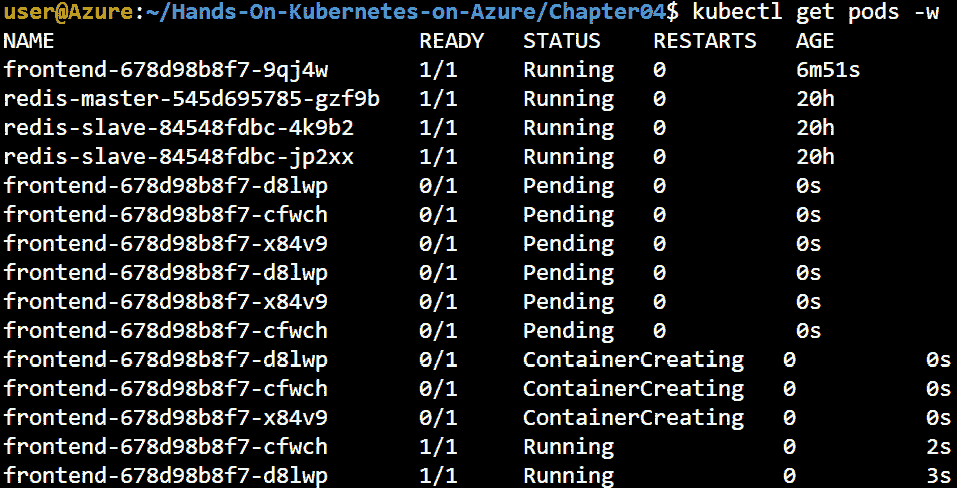
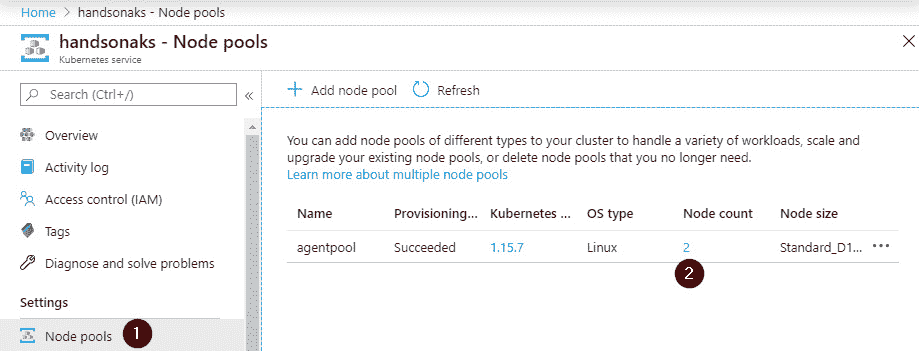
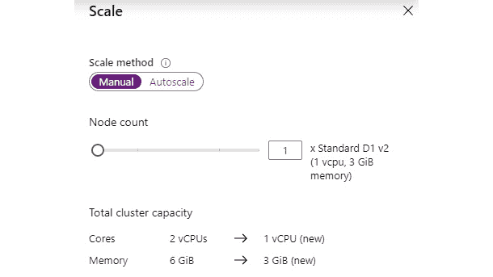
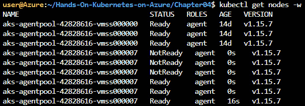
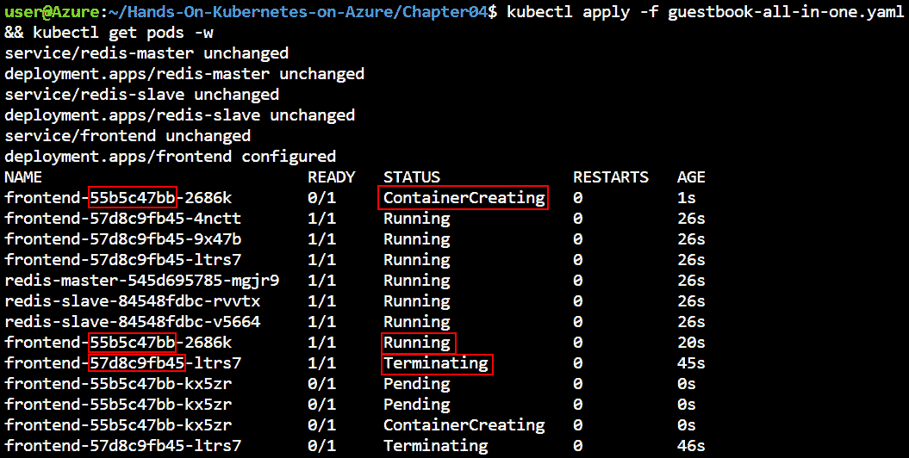

# 第四章：构建可扩展的应用程序

在运行应用程序时，扩展和升级应用程序的能力至关重要。**扩展**是处理应用程序的额外负载所必需的，而升级是保持应用程序最新并能够引入新功能所必需的。

按需扩展是使用基于云的应用程序的关键好处之一。它还有助于优化应用程序的资源。如果前端组件遇到重负载，您可以单独扩展前端，同时保持相同数量的后端实例。您可以根据工作负载和高峰需求小时增加或减少所需的**虚拟机**（**VM**）的数量/大小。本章将详细介绍两种扩展维度。

在本章中，我们将向您展示如何扩展我们在*第三章* *在 AKS 上部署应用程序*中介绍的示例留言簿应用程序。我们将首先使用手动命令扩展此应用程序，然后我们将使用**水平 Pod 自动缩放器（HPA）**对其进行自动缩放。我们的目标是让您熟悉`kubectl`，这是管理在**Azure Kubernetes** **Service**（**AKS**）上运行的应用程序的重要工具。在扩展应用程序本身之后，我们还将扩展集群。我们将首先手动扩展集群，然后使用集群自动缩放器自动扩展集群。此外，在本章中，您将简要介绍如何升级在 AKS 上运行的应用程序。

在本章中，我们将涵盖以下主题：

+   扩展您的应用程序

+   扩展您的集群

+   升级您的应用程序

我们将从讨论在 AKS 上扩展应用程序时涉及的不同维度开始本章。

#### 注意

在上一章中，我们在 Cloud Shell 中克隆了示例文件。如果您当时没有这样做，我们建议现在这样做：

`git clone` [`github.com/PacktPublishing/Hands-On-Kubernetes-on-Azure---Second-Edition/tree/SecondEdition`](https://github.com/PacktPublishing/Hands-On-Kubernetes-on-Azure---Second-Edition/tree/SecondEdition)

对于本章，请导航到`Chapter04`目录：

`cd Chapter04`

## 扩展您的应用程序

在 AKS 上运行的应用程序有两个扩展维度。第一个扩展维度是部署的 Pod 的数量，而 AKS 中的第二个扩展维度是集群中节点的数量。

通过向部署添加额外的 Pod，也称为扩展，您为部署的应用程序增加了额外的计算能力。您可以手动扩展应用程序，也可以让 Kubernetes 通过 HPA 自动处理这一点。HPA 将监视诸如 CPU 之类的指标，以确定是否需要向部署添加 Pod。

AKS 中的第二个扩展维度是集群中的节点数。集群中的节点数定义了集群上所有应用程序可用的 CPU 和内存量。您可以通过手动更改节点数来扩展集群，也可以使用集群自动缩放器自动扩展集群。集群自动缩放器将监视无法由于资源约束而无法调度的 Pod。如果无法调度 Pod，它将向集群添加节点，以确保您的应用程序可以运行。

本章将涵盖两个扩展维度。在本节中，您将学习如何扩展您的应用程序。首先，您将手动扩展您的应用程序，然后，您将自动扩展您的应用程序。

### 实施应用程序的扩展

为了演示手动扩展，让我们使用在上一章中使用的 guestbook 示例。按照以下步骤学习如何实施手动扩展：

1.  通过在 Azure 命令行中运行`kubectl create`命令来安装 guestbook：

```
kubectl create -f guestbook-all-in-one.yaml
```

1.  输入上述命令后，您应该在命令行输出中看到类似的内容，如*图 4.1*所示：

###### 图 4.1：启动 guestbook 应用程序

1.  目前，没有任何服务是公开可访问的。我们可以通过运行以下命令来验证这一点：

```
kubectl get svc 
```

1.  *图 4.2*显示没有任何服务具有外部 IP：

###### 图 4.2：显示没有任何服务具有公共 IP 的输出

1.  为了测试我们的应用程序，我们将公开它。为此，我们将介绍一个新的命令，允许您在 Kubernetes 中编辑服务，而无需更改文件系统上的文件。要开始编辑，请执行以下命令：

```
kubectl edit service frontend
```

1.  这将打开一个`vi`环境。导航到现在显示为`type:` `ClusterIP`（第 27 行），并将其更改为`type: LoadBalancer`，如*图 4.3*所示。要进行更改，请按*I*按钮，输入更改，按*Esc*按钮，输入`:wq!`，然后按*Enter*保存更改：

###### 图 4.3：将此行更改为 type: LoadBalancer

1.  保存更改后，您可以观察服务对象，直到公共 IP 可用。要做到这一点，请输入以下内容：

```
kubectl get svc -w
```

1.  更新 IP 地址可能需要几分钟时间。一旦看到正确的公共 IP，您可以通过按*Ctrl* + *C*（Mac 上为*command + C*）退出`watch`命令：

###### 图 4.4：显示前端服务获得公共 IP

1.  在浏览器导航栏中输入前面命令获取的 IP 地址，如下所示：`http://<EXTERNAL-IP>/`。其结果如*图 4.5*所示：

###### 图 4.5：浏览访客留言应用程序

熟悉的访客留言示例应该是可见的。这表明您已成功地公开访问了访客留言。

现在您已经部署了访客留言应用程序，可以开始扩展应用程序的不同组件。

### 扩展访客留言前端组件

Kubernetes 使我们能够动态地扩展应用程序的每个组件。在本节中，我们将向您展示如何扩展访客留言应用程序的前端。这将导致 Kubernetes 向部署添加额外的 Pods：

```
kubectl scale deployment/frontend --replicas=6
```

您可以设置要使用的副本数，Kubernetes 会处理其余的工作。您甚至可以将其缩减为零（用于重新加载配置的技巧之一，当应用程序不支持动态重新加载配置时）。要验证整体扩展是否正确工作，您可以使用以下命令：

```
kubectl get pods
```

这应该给您一个如*图 4.6*所示的输出：

执行 kubectl get pods 命令后，您将看到前端现在运行了六个 Pods。

###### 图 4.6：扩展后访客留言应用程序中运行的不同 Pods

如您所见，前端服务扩展到了六个 Pod。Kubernetes 还将这些 Pod 分布在集群中的多个节点上。您可以使用以下命令查看此服务运行在哪些节点上：

```
kubectl get pods -o wide
```

这将生成以下输出：


###### 图 4.7：显示 Pod 运行在哪些节点上。

在本节中，您已经看到了使用 Kubernetes 扩展 Pod 有多么容易。这种能力为您提供了一个非常强大的工具，不仅可以动态调整应用程序组件，还可以通过同时运行多个组件实例来提供具有故障转移能力的弹性应用程序。然而，您并不总是希望手动扩展您的应用程序。在下一节中，您将学习如何自动扩展您的应用程序。

### 使用 HPA

在您工作在集群上时，手动扩展是有用的。然而，在大多数情况下，您希望应用程序发生某种自动缩放。在 Kubernetes 中，您可以使用名为**水平 Pod 自动缩放器**（**HPA**）的对象来配置部署的自动缩放。

HPA 定期监视 Kubernetes 指标，并根据您定义的规则自动缩放您的部署。例如，您可以配置 HPA 在应用程序的 CPU 利用率超过 50%时向部署添加额外的 Pod。

在本节中，您将配置 HPA 自动扩展应用程序的前端部分：

1.  要开始配置，让我们首先手动将我们的部署缩减到 1 个实例：

```
kubectl scale deployment/frontend --replicas=1
```

1.  接下来，我们将创建一个 HPA。通过输入`code hpa.yaml`在 Cloud Shell 中打开代码编辑器，并输入以下代码：

```
1  apiVersion: autoscaling/v2beta1
2  kind: HorizontalPodAutoscaler
3  metadata:
4    name: frontend-scaler
5  spec:
6    scaleTargetRef:
7      apiVersion: extensions/v1beta1
8      kind: Deployment
9      name: frontend
10   minReplicas: 1
11   maxReplicas: 10
12   metrics:
13   - type: Resource
14     resource:
15       name: cpu
16       targetAverageUtilization: 25
```

让我们来看看这个文件中配置了什么：

+   **第 2 行**：在这里，我们定义了需要`HorizontalPodAutoscaler`。

+   **第 6-9 行**：这些行定义了我们要自动缩放的部署。

+   **第 10-11 行**：在这里，我们配置了部署中的最小和最大 Pod 数。

+   **第 12-16 行**：在这里，我们定义了 Kubernetes 将要监视的指标，以便进行扩展。

1.  保存此文件，并使用以下命令创建 HPA：

```
kubectl create -f hpa.yaml
```

这将创建我们的自动缩放器。您可以使用以下命令查看您的自动缩放器：

```
kubectl get hpa
```

这将最初输出如*图 4.8*所示的内容：


###### 图 4.8：未知的目标显示 HPA 尚未准备好

HPA 需要几秒钟来读取指标。等待 HPA 返回的结果看起来类似于*图 4.9*中显示的输出：


###### 图 4.9：一旦目标显示百分比，HPA 就准备好了

1.  现在，我们将继续做两件事：首先，我们将观察我们的 Pods，看看是否创建了新的 Pods。然后，我们将创建一个新的 shell，并为我们的系统创建一些负载。让我们从第一个任务开始——观察我们的 Pods：

```
kubectl get pods -w
```

这将持续监视创建或终止的 Pod。

现在让我们在一个新的 shell 中创建一些负载。在 Cloud Shell 中，点击按钮打开一个新的 shell：


###### 图 4.10：使用此按钮打开一个新的 Cloud Shell

这将在浏览器中打开一个新的选项卡，其中包含 Cloud Shell 中的新会话。我们将从这个选项卡为我们的应用程序生成一些负载。

1.  接下来，我们将使用一个名为`hey`的程序来生成这个负载。`hey`是一个发送负载到 Web 应用程序的小程序。我们可以使用以下命令安装和运行`hey`：

```
export GOPATH=~/go
export PATH=$GOPATH/bin:$PATH
go get -u github.com/rakyll/hey
hey -z 20m http://<external-ip>
```

`hey`程序现在将尝试创建多达 2000 万个连接到我们的前端。这将在我们的系统上生成 CPU 负载，这将触发 HPA 开始扩展我们的部署。这将需要几分钟才能触发扩展操作，但在某个时刻，您应该看到创建多个 Pod 来处理额外的负载，如*图 4.11*所示：



###### 图 4.11：HPA 启动新的 Pod

在这一点上，您可以继续通过按*Ctrl* + *C*（Mac 上的*command* + *C*）来终止`hey`程序。

1.  让我们通过运行以下命令来更仔细地查看我们的 HPA 所做的事情：

```
kubectl describe hpa
```

我们可以在“描述”操作中看到一些有趣的点，如*图 4.12*所示：


###### 图 4.12：HPA 的详细视图

*图 4.12*中的注释解释如下：

**1**：这向您显示当前的 CPU 利用率（132%）与期望值（25%）的对比。当前的 CPU 利用率在您的情况下可能会有所不同。

**2**：这向您显示当前期望的副本数高于我们配置的实际最大值。这确保了单个部署不会消耗集群中的所有资源。

**3**：这向您显示了 HPA 所采取的扩展操作。它首先将部署扩展到 4 个，然后扩展到 8 个，然后扩展到 10 个 Pod。

1.  如果您等待几分钟，HPA 应该开始缩减。您可以使用以下命令跟踪此缩减操作：

```
kubectl get hpa -w
```

这将跟踪 HPA 并向您显示部署的逐渐缩减，如*图 4.13*所示：


###### 图 4.13：观察 HPA 的缩减

1.  在我们进入下一节之前，让我们清理一下在本节中创建的资源：

```
kubectl delete -f hpa.yaml
kubectl delete -f guestbook-all-in-one.yaml
```

在本节中，我们首先手动，然后自动扩展了我们的应用程序。但是，集群资源是静态的；我们在一个两节点的集群上运行了这个。在许多情况下，您可能也会在集群本身耗尽资源。在下一节中，我们将处理这个问题，并解释如何自己扩展您的 AKS 集群。

## 扩展您的集群

在上一节中，我们处理了在集群顶部运行的应用程序的扩展。在本节中，我们将解释如何扩展您正在运行的实际集群。我们将首先讨论如何手动扩展您的集群。我们将从将我们的集群缩减到一个节点开始。然后，我们将配置集群自动缩放器。集群自动缩放器将监视我们的集群，并在无法在我们的集群上安排的 Pod 时进行扩展。

### 手动扩展您的集群

您可以通过为集群设置静态节点数来手动扩展您的 AKS 集群。您可以通过 Azure 门户或命令行来扩展您的集群。

在本节中，我们将向您展示如何通过将集群缩减到一个节点来手动扩展您的集群。这将导致 Azure 从您的集群中移除一个节点。首先，即将被移除的节点上的工作负载将被重新调度到其他节点上。一旦工作负载安全地重新调度，节点将从您的集群中移除，然后 VM 将从 Azure 中删除。

要扩展您的集群，请按照以下步骤操作：

1.  打开 Azure 门户并转到您的集群。一旦到达那里，转到**节点池**并点击**节点计数**下面的数字，如*图 4.14*所示：

###### 图 4.14：手动扩展集群

1.  这将打开一个弹出窗口，其中将提供扩展集群的选项。在我们的示例中，我们将将集群缩减到一个节点，如*图 4.15*所示：

###### 图 4.15：确认新集群大小的弹出窗口

1.  点击屏幕底部的**应用**按钮以保存这些设置。这将导致 Azure 从您的集群中移除一个节点。这个过程大约需要 5 分钟才能完成。您可以通过点击 Azure 门户顶部的通知图标来跟踪进度，如下所示：

###### 图 4.16：可以通过 Azure 门户中的通知来跟踪集群的扩展

一旦这个缩减操作完成，我们将在这个小集群上重新启动我们的 guestbook 应用程序：

```
kubectl create -f guestbook-all-in-one.yaml
```

在下一节中，我们将扩展 guestbook，以便它不再在我们的小集群上运行。然后，我们将配置集群自动缩放器来扩展我们的集群。

### 使用集群自动缩放器扩展您的集群

在本节中，我们将探讨集群自动缩放器。集群自动缩放器将监视集群中的部署，并根据您的应用程序需求来扩展您的集群。集群自动缩放器会监视集群中由于资源不足而无法被调度的 Pod 的数量。我们将首先强制我们的部署有无法被调度的 Pod，然后我们将配置集群自动缩放器自动扩展我们的集群。

为了强制我们的集群资源不足，我们将手动扩展`redis-slave`部署。要做到这一点，请使用以下命令：

```
kubectl scale deployment redis-slave --replicas 5
```

您可以通过查看我们集群中的 Pod 来验证此命令是否成功：

```
kubectl get pods
```

这应该显示类似于*图 4.17*中生成的输出：


###### 图 4.17：五个 Pod 中有四个处于挂起状态，意味着它们无法被调度

如您所见，我们现在有四个处于“挂起”状态的 Pod。在 Kubernetes 中，“挂起”状态意味着该 Pod 无法被调度到节点上。在我们的情况下，这是由于集群资源不足造成的。

我们现在将配置集群自动缩放器自动扩展我们的集群。与上一节中的手动扩展一样，您可以通过两种方式配置集群自动缩放器。您可以通过 Azure 门户配置它，类似于我们进行手动扩展的方式，或者您可以使用**命令行界面（CLI）**进行配置。在本例中，我们将使用 CLI 来启用集群自动缩放器。以下命令将为我们的集群配置集群自动缩放器：

```
az aks nodepool update --enable-cluster-autoscaler \
  -g rg-handsonaks --cluster-name handsonaks \
  --name agentpool --min-count 1 --max-count 3
```

此命令在我们集群中的节点池上配置了集群自动缩放器。它将其配置为最少一个节点和最多三个节点。这将花费几分钟来配置。

配置了集群自动缩放器后，您可以使用以下命令来观察集群中节点的数量：

```
kubectl get nodes -w
```

新节点出现并在集群中变为`Ready`大约需要 5 分钟。一旦新节点处于`Ready`状态，您可以通过按下*Ctrl* + *C*（Mac 上的*command* + *C*）来停止观察节点。您应该看到类似于*图 4.18*中的输出：



###### 图 4.18：新节点加入集群

新节点应该确保我们的集群有足够的资源来调度扩展的`redis-slave`部署。要验证这一点，请运行以下命令来检查 Pod 的状态：

```
kubectl get pods
```

这应该显示所有处于`Running`状态的 Pod，如下所示：


###### 图 4.19：所有 Pod 现在都处于 Running 状态

我们现在将清理我们创建的资源，禁用集群自动缩放器，并确保我们的集群在接下来的示例中有两个节点。要做到这一点，请使用以下命令：

```
kubectl delete -f guestbook-all-in-one.yaml
az aks nodepool update --disable-cluster-autoscaler \
  -g rg-handsonaks --cluster-name handsonaks --name agentpool
az aks nodepool scale --node-count 2 -g rg-handsonaks \
  --cluster-name handsonaks --name agentpool
```

#### 注意

上一个示例中的最后一个命令将在集群已经有两个节点的情况下显示错误。您可以安全地忽略此错误。

在本节中，我们首先手动缩减了我们的集群，然后我们使用了集群自动缩放器来扩展我们的集群。我们首先使用 Azure 门户手动扩展了集群，然后我们还使用了 Azure CLI 来配置集群自动缩放器。在下一节中，我们将探讨如何升级在 AKS 上运行的应用程序。

## 升级您的应用程序

在 Kubernetes 中使用部署使升级应用程序成为一个简单的操作。与任何升级一样，如果出现问题，您应该有良好的回退。您将遇到的大多数问题将发生在升级过程中。云原生应用程序应该使处理这些问题相对容易，如果您有一个非常强大的开发团队，他们拥抱 DevOps 原则是可能的。

DevOps 报告（[`services.google.com/fh/files/misc/state-of-devops-2019.pdf`](https://services.google.com/fh/files/misc/state-of-devops-2019.pdf)）已经多年报告说，具有高软件部署频率的公司在其应用程序中具有更高的可用性和稳定性。这可能看起来违反直觉，因为进行软件部署会增加问题的风险。然而，通过更频繁地部署并使用自动化的 DevOps 实践进行部署，您可以限制软件部署的影响。

在 Kubernetes 集群中，我们可以进行多种方式的更新。在本节中，我们将探讨以下更新 Kubernetes 资源的方式：

+   通过更改 YAML 文件进行升级

+   使用`kubectl edit`进行升级

+   使用`kubectl patch`进行升级

+   使用 Helm 进行升级

我们将在下一节中描述的方法非常适用于无状态应用程序。如果您在任何地方存储了状态，请确保在尝试任何操作之前备份该状态。

让我们通过进行第一种类型的升级来开始本节：更改 YAML 文件。

### 通过更改 YAML 文件进行升级

为了升级 Kubernetes 服务或部署，我们可以更新实际的 YAML 定义文件，并将其应用到当前部署的应用程序中。通常，我们使用`kubectl create`来创建资源。同样，我们可以使用`kubectl apply`来对资源进行更改。

部署检测更改（如果有）并将`Running`状态与期望状态匹配。让我们看看这是如何完成的：

1.  我们从我们的留言簿应用程序开始，以演示这个例子：

```
kubectl create -f guestbook-all-in-one.yaml
```

1.  几分钟后，所有的 Pod 应该都在运行。让我们通过将服务从`ClusterIP`更改为`LoadBalancer`来执行我们的第一个升级，就像我们在本章前面所做的那样。然而，现在我们将编辑我们的 YAML 文件，而不是使用`kubectl edit`。使用以下命令编辑 YAML 文件：

```
code guestbook-all-in-one.yaml
```

取消注释此文件中的第 108 行，将类型设置为`LoadBalancer`并保存文件。如*图 4.20*所示：


###### 图 4.20：更改 guestbook-all-in-one YAML 文件中的这一行

1.  按照以下代码进行更改：

```
kubectl apply -f guestbook-all-in-one.yaml
```

1.  您现在可以使用以下命令获取服务的公共 IP：

```
kubectl get svc
```

等几分钟，您应该会看到 IP，就像*图 4.21*中显示的那样：


###### 图 4.21：显示公共 IP 的输出

1.  现在我们将进行另一个更改。我们将把第 133 行的前端图像从`image: gcr.io/google-samples/gb-frontend:v4`降级为以下内容：

```
image: gcr.io/google-samples/gb-frontend:v3
```

通过使用这个熟悉的命令在编辑器中打开留言簿应用程序，可以进行此更改：

```
code guestbook-all-in-one.yaml
```

1.  运行以下命令执行更新并观察 Pod 更改：

```
kubectl apply -f guestbook-all-in-one.yaml && kubectl get pods -w
```

1.  这将生成以下输出：

###### 图 4.22：从新的 ReplicaSet 创建的 Pod

在这里你可以看到旧版本的 Pod（基于旧的 ReplicaSet）被终止，而新版本被创建。

1.  运行`kubectl get events | grep ReplicaSet`将显示部署使用的滚动更新策略，以更新前端图像如下：

###### 图 4.23：监视 Kubernetes 事件并筛选只看到与 ReplicaSet 相关的事件

#### 注意

在上面的示例中，我们使用了管道—由`|`符号表示—和`grep`命令。在 Linux 中，管道用于将一个命令的输出发送到另一个命令的输入。在我们的情况下，我们将`kubectl get events`的输出发送到`grep`命令。`grep`是 Linux 中用于过滤文本的命令。在我们的情况下，我们使用`grep`命令只显示包含单词 ReplicaSet 的行。

您可以在这里看到新的 ReplicaSet 被扩展，而旧的 ReplicaSet 被缩减。您还将看到前端有两个 ReplicaSets，新的 ReplicaSet 逐个替换另一个 Pod：

```
kubectl get replicaset
```

这将显示如*图 4.24*所示的输出：

使用 kubectl get replicaset 命令，您可以看到两个不同的 ReplicaSets。

###### 图 4.24：两个不同的 ReplicaSets

1.  Kubernetes 还将保留您的部署历史。您可以使用此命令查看部署历史：

```
kubectl rollout history deployment frontend
```

这将生成如*图 4.25*所示的输出：

图 4.25：输出屏幕显示了应用程序的历史。它显示了修订次数、更改和更改的原因。

###### 图 4.25：应用程序的部署历史

1.  由于 Kubernetes 保留了我们部署的历史记录，这也使得回滚成为可能。让我们对部署进行回滚：

```
kubectl rollout undo deployment frontend
```

这将触发回滚。这意味着新的 ReplicaSet 将被缩减为零个实例，而旧的 ReplicaSet 将再次扩展为三个实例。我们可以使用以下命令来验证这一点：

```
kubectl get replicaset
```

产生的输出如*图 4.26*所示：

图 4.26：执行 kubectl get rs 命令显示两个前端 ReplicaSets。一个没有 pod，另一个有 3 个 pod。

###### 图 4.26：旧的 ReplicaSet 现在有三个 Pod，而新的 ReplicaSet 被缩减为零

这向我们展示了，正如预期的那样，旧的 ReplicaSet 被缩减为三个实例，新的 ReplicaSet 被缩减为零个实例。

1.  最后，让我们再次通过运行`kubectl delete`命令进行清理：

```
kubectl delete -f guestbook-all-in-one.yaml
```

恭喜！您已完成了应用程序的升级和回滚到先前版本。

在此示例中，您已使用`kubectl apply`对应用程序进行更改。您也可以类似地使用`kubectl edit`进行更改，这将在下一节中探讨。

### 使用 kubectl edit 升级应用程序

我们可以通过使用`kubectl edit`对运行在 Kubernetes 之上的应用程序进行更改。您在本章中先前使用过这个。运行`kubectl edit`时，`vi`编辑器将为您打开，这将允许您直接对 Kubernetes 中的对象进行更改。

让我们重新部署我们的 guestbook 应用程序，而不使用公共负载均衡器，并使用`kubectl`创建负载均衡器：

1.  您将开始部署 guestbook 应用程序：

```
kubectl create -f guestbook-all-in-one.yaml
```

1.  要开始编辑，请执行以下命令：

```
kubectl edit service frontend
```

1.  这将打开一个`vi`环境。导航到现在显示为`type:` `ClusterIP`（第 27 行），并将其更改为`type: LoadBalancer`，如*图 4.27*所示。要进行更改，请按*I*按钮，输入更改内容，按*Esc*按钮，输入`:wq!`，然后按*Enter*保存更改：

###### 图 4.27：将此行更改为类型：LoadBalancer

1.  保存更改后，您可以观察服务对象，直到公共 IP 可用。要做到这一点，请输入以下内容：

```
kubectl get svc -w
```

1.  它将花费几分钟时间来显示更新后的 IP。一旦看到正确的公共 IP，您可以通过按*Ctrl* + *C*（Mac 上为*command* + *C*）退出`watch`命令

这是使用`kubectl edit`对 Kubernetes 对象进行更改的示例。此命令将打开一个文本编辑器，以交互方式进行更改。这意味着您需要与文本编辑器交互以进行更改。这在自动化环境中不起作用。要进行自动化更改，您可以使用`kubectl patch`命令。

### 使用 kubectl patch 升级应用程序

在先前的示例中，您使用文本编辑器对 Kubernetes 进行更改。在这个示例中，您将使用`kubectl patch`命令对 Kubernetes 上的资源进行更改。`patch`命令在自动化系统中特别有用，例如在脚本中或在持续集成/持续部署系统中。

有两种主要方式可以使用`kubectl patch`，一种是创建一个包含更改的文件（称为补丁文件），另一种是提供内联更改。我们将探讨这两种方法。首先，在这个例子中，我们将使用补丁文件将前端的图像从`v4`更改为`v3`：

1.  通过创建一个名为`frontend-image-patch.yaml`的文件来开始这个例子：

```
code frontend-image-patch.yaml
```

1.  在该文件中使用以下文本作为补丁：

```
spec:
  template:
    spec:
      containers:
      - name: php-redis
        image: gcr.io/google-samples/gb-frontend:v3
```

此补丁文件使用与典型 YAML 文件相同的 YAML 布局。补丁文件的主要特点是它只需要包含更改，而不必能够部署整个资源。

1.  要应用补丁，请使用以下命令：

```
kubectl patch deployment frontend --patch "$(cat frontend-image-patch.yaml)"
```

此命令执行两件事：首先，它读取`frontend-image-patch.yaml`文件，然后将其传递给`patch`命令以执行更改。

1.  您可以通过描述前端部署并查找`Image`部分来验证更改：

```
kubectl describe deployment frontend
```

这将显示如下输出：


###### 图 4.28：补丁后，我们正在运行旧图像

这是使用`patch`命令使用补丁文件的一个例子。您还可以在命令行上直接应用补丁，而不创建 YAML 文件。在这种情况下，您将以 JSON 而不是 YAML 描述更改。

让我们通过一个例子来说明，我们将图像更改恢复到`v4`：

1.  运行以下命令将图像补丁回到`v4`：

```
kubectl patch deployment frontend --patch='{"spec":{"template":{"spec":{"containers":[{"name":"php-redis","image":"gcr.io/google-samples/gb-frontend:v4"}]}}}}'
```

1.  您可以通过描述部署并查找`Image`部分来验证此更改：

```
kubectl describe deployment frontend
```

这将显示如图 4.29 所示的输出：


###### 图 4.29：应用另一个补丁后，我们再次运行新版本

在我们继续下一个例子之前，让我们从集群中删除 guestbook 应用程序：

```
kubectl delete -f guestbook-all-in-one.yaml
```

到目前为止，您已经探索了升级 Kubernetes 应用程序的三种方式。首先，您对实际的 YAML 文件进行了更改，并使用`kubectl apply`应用了这些更改。之后，您使用了`kubectl edit`和`kubectl patch`进行了更多更改。在本章的最后一节中，我们将使用 Helm 来升级我们的应用程序。

### 使用 Helm 升级应用程序

本节将解释如何使用 Helm 操作符执行升级：

1.  运行以下命令：

```
helm install wp stable/wordpress
```

我们将强制更新`WordPress`容器的图像。让我们首先检查当前图像的版本：

```
kubectl describe statefulset wp-mariadb | grep Image
```

在我们的情况下，图像版本为`10.3.21-debian-10-r0`如下：


###### 图 4.30：获取 StatefulSet 的当前图像

让我们看一下来自[`hub.docker.com/r/bitnami/mariadb/tags`](https://hub.docker.com/r/bitnami/mariadb/tags)的标签，并选择另一个标签。在我们的情况下，我们将选择`10.3.22-debian-10-r9`标签来更新我们的 StatefulSet。

然而，为了更新 MariaDB 容器图像，我们需要获取服务器的 root 密码和数据库的密码。我们可以通过以下方式获取这些密码：

```
kubectl get secret wp-mariadb -o yaml
```

这将生成一个如*图 4.31*所示的输出：


###### 图 4.31：MariaDB 使用的加密密码

为了获取解码后的密码，请使用以下命令：

```
echo "<password>" | base64 -d
```

这将向我们显示解码后的 root 密码和解码后的数据库密码。

1.  我们可以使用 Helm 更新图像标签，然后使用以下命令观察 Pod 的更改：

```
helm upgrade wp stable/wordpress --set mariadb.image.tag=10.3.21-debian-10-r1,mariadb.rootUser.password=<decoded password>,mariadb.db.password=<decoded db password> && kubectl get pods -w
```

这将更新我们的 MariaDB 的图像并启动一个新的 Pod。在新的 Pod 上运行`describe`并使用`grep`查找`Image`将向我们显示新的图像版本：

```
kubectl describe pod wp-mariadb-0 | grep Image
```

这将生成一个如*图 4.32*所示的输出：


###### 图 4.32：显示新图像

1.  最后，通过运行以下命令进行清理：

```
helm delete wp
kubectl delete pvc --all
kubectl delete pv --all
```

因此，我们已经使用 Helm 升级了我们的应用程序。正如您在本例中所看到的，使用 Helm 进行升级可以通过使用`--set`运算符来完成。这使得使用 Helm 进行升级和多次部署变得非常高效。

## 总结

这是一个充满大量信息的章节。我们的目标是向您展示如何使用 Kubernetes 扩展部署。我们通过向您展示如何创建应用程序的多个实例来实现这一点。

我们开始这一章是通过研究如何定义负载均衡器的使用，并利用 Kubernetes 中的部署规模功能来实现可伸缩性。通过这种类型的可伸缩性，我们还可以通过使用负载均衡器和多个无状态应用程序实例来实现故障转移。我们还研究了如何使用 HPA 根据负载自动扩展我们的部署。

之后，我们还研究了如何扩展集群本身。首先，我们手动扩展了我们的集群，然后我们使用了集群自动缩放器根据应用程序需求来扩展我们的集群。

我们通过研究不同的方法来升级已部署的应用程序来完成了这一章。首先，我们探讨了手动更新 YAML 文件。然后，我们深入研究了两个额外的`kubectl`命令（`edit`和`patch`），可以用来进行更改。最后，我们展示了如何使用 Helm 来执行这些升级。

在下一章中，我们将看到在部署应用程序到 AKS 时可能遇到的常见故障以及如何修复它们。
