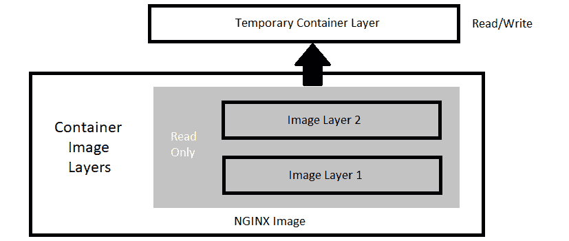

# 第一章：Docker 和容器基础知识

容器是我们多年来见过的最具变革性的技术之一。技术公司、企业和最终用户都采用它来处理日常工作负载。越来越多的**通用现成**（**COTS**）应用程序正在从传统安装转变为完全容器化的部署。随着这样一个巨大的技术转变，任何信息技术领域的人都有必要了解容器。

在这一章中，我们将介绍容器解决的问题。在介绍容器的重要性之后，我们将介绍引发现代容器狂热的运行时，Docker。通过本章的学习，您将了解如何安装 Docker 以及如何使用最常见的 Docker CLI 命令。

在这一章中，我们将涵盖以下主题：

+   理解容器化的需求

+   理解 Docker

+   安装 Docker

+   使用 Docker CLI

让我们开始吧！

# 技术要求

这一章有以下技术要求：

+   一个 Ubuntu 18.04 服务器，至少需要 4GB 的 RAM，建议使用 8GB

您可以通过访问以下 GitHub 存储库获取本章的代码：[`github.com/PacktPublishing/Kubernetes-and-Docker-The-Complete-Guide`](https://github.com/PacktPublishing/Kubernetes-and-Docker-The-Complete-Guide)。

# 理解容器化的需求

您可能在办公室或学校经历过这样的对话：

**开发者**：“这是新的应用程序。经过数周的测试，你是第一个获得新版本的人。”

*….. 过了一会儿 ….*

**用户**：“它不工作。当我点击提交按钮时，它显示了一个缺少依赖项的错误。”

**开发者**：“这很奇怪；在我的机器上一切都正常。”

这是开发者交付应用程序时可能遇到的最令人沮丧的事情之一。经常出现的问题与开发者在他们的机器上使用的库有关，但这些库并未包含在软件包的分发中。似乎一个简单的解决方法是将所有的库都包含在发布中，但如果这个发布包含一个新的库，它会覆盖旧版本，而这可能是其他应用程序所需要的。

开发人员需要考虑他们的新发布，以及与用户工作站上任何现有软件可能存在的冲突。这经常成为一个需要更大的部署团队在不同的系统配置上测试应用程序的谨慎平衡行为。这可能会导致开发人员需要额外的重做，或者在一些极端情况下，与现有应用程序完全不兼容。

多年来，已经有各种尝试使应用程序交付变得更加容易。首先，有诸如 VMware 的 Thinapp 之类的解决方案，它们虚拟化了一个应用程序（不要与虚拟化操作系统混淆）。它允许您将应用程序及其依赖项打包到一个单个可执行包中。这种打包消除了应用程序依赖项与另一个应用程序的依赖项发生冲突的问题，因为应用程序在一个自包含的包中。这种打包提供的应用程序隔离不仅消除了依赖性问题，还提供了更高级别的安全性，并减轻了操作系统迁移的负担。

在阅读本书之前，您可能已经听说过应用程序流式传输，这听起来像是解决“在我的机器上可以运行”的问题的一个很好的解决方案。尽管有许多原因导致它没有如预期般成功。首先，大多数提供的解决方案都是需要大量投资的付费解决方案。除了许可证，它们还需要一个“干净的 PC”，这意味着对于您想要虚拟化的每个应用程序，您都需要从一个基本系统开始。您想要创建的软件包使用了基本安装和初始系统快照后添加的任何内容之间的差异。然后，这些差异被打包到您的分发文件中，可以在任何工作站上执行。

我们提到应用程序虚拟化是为了突出多年来“在我的机器上可以运行”的应用程序问题已经有了不同的解决方案。像 Thinapp 这样的产品只是解决这个问题的一种尝试。其他尝试包括在运行 Citrix 或远程桌面的服务器上运行应用程序，Linux 容器，甚至虚拟机。

## 引入 Docker

行业甚至最终用户需要更简单、更便宜的东西——Docker 容器应运而生。容器并不是一种新技术；多年来它们以各种形式被使用。Docker 所做的是让它们对普通开发人员可访问。

Docker 为大众带来了一个抽象层。它易于使用，并且在创建软件包之前不需要为每个应用程序清理 PC，因此提供了解决依赖问题的解决方案，但最吸引人的是它是*免费*的。 Docker 成为 GitHub 上许多项目的标准，团队经常会创建 Docker 容器并向团队成员分发 Docker 镜像或**Dockerfile**，提供标准的测试或开发环境。最终，最终用户的采用是最终将 Docker 引入企业并最终使其成为标准的原因。

虽然有很多关于 Docker 的书，但本书侧重于与容器交互所使用的 Docker 的基本主题。本书将侧重于在尝试使用本地 Kubernetes 环境时需要了解的内容。Docker 有一个悠久而有趣的历史，以及它是如何演变成我们今天使用的标准容器镜像格式的。我们鼓励你阅读有关这家公司以及他们是如何引领我们今天所知的容器世界的历史。

虽然我们的重点不是全面教授 Docker，但我们认为那些对 Docker 新手会受益于对一般容器概念的快速入门。如果您有一些 Docker 经验并且了解临时和无状态等术语，请继续阅读*安装 Docker*部分。

# 理解 Docker

本书假设您对 Docker 和容器概念有一些基本的了解。我们意识到并非每个人都可能以前使用过 Docker 或容器，因此我们希望对容器概念和使用 Docker 进行快速入门。

重要提示

如果您是容器的新手，我们建议阅读 Docker 网站上可以找到的文档以获取更多信息：[`docs.docker.com/`](https://docs.docker.com/)。

## 容器是临时的

首要理解的主题是容器镜像是临时的。

对于那些对 Docker 新手来说，临时的意思是短暂的。按设计，容器可以随时被销毁，并在没有用户干预的情况下重新启动。在前面的例子中，有人交互地向 web 服务器添加了文件。这些添加的文件只是临时的，因为基础镜像中并不包含这些文件。

这意味着一旦创建并运行容器，对镜像进行的任何更改在容器从 Docker 主机中删除或销毁时都不会被保存。让我们看一个例子：

1.  您在主机上启动一个使用**NGINX**运行的 web 服务器的容器，而没有任何基本的**HTML**页面。

1.  使用 Docker 命令，您执行**copy**命令将一些 web 文件复制到容器的文件系统中。

1.  为了测试复制是否成功，您浏览网站并确认它正在提供正确的网页。

1.  对结果感到满意后，您停止容器并从主机中删除它。当天晚些时候，您想向同事展示网站，然后启动 NGINX 容器。您再次浏览网站，但当网站打开时，您收到 404 错误（页面未找到错误）。

在您停止并从主机中删除容器之前上传的文件发生了什么？

容器重新启动后无法找到您上传的网页的原因是因为所有容器都是**短暂的**。

基本容器镜像中的内容是每次容器最初启动时都会包含的内容。您在容器内部进行的任何更改都是短暂的。

如果您需要向现有镜像添加永久文件，则需要使用包含文件的镜像重新构建镜像，或者，正如我们将在本章后面的*持久数据*部分中解释的那样，您可以在容器中挂载 Docker 卷。在这一点上，要理解的主要概念是容器是短暂的。

但等等！您可能会想，*"如果容器是短暂的，那我是如何向服务器添加网页的呢？"*。短暂只是意味着更改不会被保存；这并不妨碍您对正在运行的容器进行更改。

对正在运行的容器进行的任何更改都将被写入临时层，称为**容器层**，这是本地主机文件系统上的一个目录。Docker 存储驱动程序负责处理使用容器层的请求。此位置将存储容器文件系统中的任何更改，因此当您将 HTML 页面添加到容器时，它们将存储在本地主机上。容器层与正在运行的镜像的容器 ID 相关联，并且将保留在主机系统上，直到通过使用 CLI 或运行 Docker 清理作业从 Docker 中删除容器。

如果一个容器是临时的，镜像无法被写入，你如何修改容器中的数据呢？Docker 使用镜像分层来创建多个链接的层，看起来像是一个单一的文件系统。

## Docker 镜像

在高层次上，Docker 镜像是一组镜像层，每个层都有一个包含该层元数据的 JSON 文件。这些都被组合在一起，创建了当容器镜像启动时你与之交互的运行应用程序。

你可以在 Docker 的 GitHub 上阅读更多关于镜像内容的信息 [`github.com/moby/moby/blob/master/image/spec/v1.md`](https://github.com/moby/moby/blob/master/image/spec/v1.md)。

## 镜像层

正如我们在前一节中提到的，运行中的容器使用一个位于基础镜像层“之上”的容器层，如下图所示：

图 1.1 – Docker 镜像层

镜像层无法被写入，因为它们处于只读状态，但是临时的容器层是可写的。你添加到容器中的任何数据都存储在这个层中，并且只要容器在运行，它就会被保留。

为了高效处理多个层，Docker 实现了写时复制，这意味着如果文件已经存在，它将不会被创建。但是，如果当前镜像中需要一个不存在的文件，它将被写入。在容器世界中，如果一个文件存在于较低的层中，它上面的层就不需要包含它。例如，如果第一层中有一个名为 **/opt/nginx/index.html** 的文件，第二层就不需要在它的层中包含相同的文件。

这解释了系统如何处理已经存在或不存在的文件，但是对于已经被修改的文件呢？有时候你需要“替换”一个位于较低层的文件。当你构建一个镜像或者临时修复一个运行中的容器问题时，你可能需要这样做。写时复制系统知道如何处理这些问题。由于镜像是自上而下读取的，容器只使用最高层的文件。如果你的系统在第一层有一个 **/opt/nginx/index.html** 文件，并且你修改并保存了这个文件，运行中的容器会将新文件存储在容器层中。由于容器层是最顶层的层，所以镜像层中旧版本的 **index.html** 总是会在新版本之前被读取。

## 持久数据

我们将在*第二章*中讨论如何使用持久磁盘，*使用 Docker 数据*。现在，我们只提供一个简要介绍。

仅限于短暂容器将严重限制 Docker 的用例。很可能您会有一些用例需要持久存储，或者数据会在停止容器后保留。

这可能看起来与我们之前关于容器是短暂的说法相矛盾，但这仍然是真的。当您将数据存储在容器镜像层中时，基础镜像不会改变。当容器从主机中移除时，容器层也会被移除。如果使用相同的镜像来启动一个新的容器，也会创建一个新的容器镜像层。因此，容器是短暂的，但通过向容器添加 Docker 卷，您可以在容器之外存储数据，从而获得数据持久性。

Docker 通过几种方法提供持久性，我们将在*第二章*中更详细地讨论，*使用 Docker 数据*，但现在知道 Docker 确实提供了一种持久化数据的方法。

## 访问运行在容器中的服务

我们将在*第三章*中讨论如何暴露容器，*理解 Docker 网络*。现在，我们只提供一个简要介绍。

与物理机或虚拟机不同，容器不直接连接到网络。当容器需要发送或接收流量时，它通过 Docker 主机系统使用桥接**NAT 网络**连接。这意味着当您运行一个容器并且希望接收传入的流量请求时，您需要为希望接收流量的每个容器公开端口。在基于 Linux 的系统上，**iptables**有规则来将流量转发到 Docker 守护程序，它将为每个容器服务分配的端口。

这完成了对基本容器和 Docker 的介绍。在下一节中，我们将解释如何在主机上安装 Docker。

# 安装 Docker

本书中的实践练习将需要您拥有一个可用的 Docker 主机。您可以按照本书中的步骤操作，或者您可以执行本书 GitHub 存储库中位于**chapter1**目录下的脚本**install-docker.sh**。

今天，你几乎可以在所有硬件平台上安装 Docker。每个版本的 Docker 在每个平台上的操作和外观都是相同的，这使得需要开发跨平台应用程序的人们可以轻松开发和使用 Docker。通过在不同平台之间使功能和命令相同，开发人员不需要学习不同的容器运行时来运行图像。

以下是 Docker 可用平台的表格。你可以看到，有多个操作系统的安装，以及多个 CPU 架构的安装：

图 1.2 - 可用的 Docker 平台

重要提示

使用一种架构创建的图像无法在不同的架构上运行。这意味着你不能基于 x86 硬件创建图像，然后期望同样的图像在运行 ARM 处理器的树莓派上运行。同样重要的是要注意，虽然你可以在 Windows 机器上运行 Linux 容器，但你不能在 Linux 机器上运行 Windows 容器。

用于安装 Docker 的安装程序在不同平台之间有所不同。幸运的是，Docker 已经在他们的网站上记录了许多安装程序：[`docs.docker.com/install/`](https://docs.docker.com/install/)。

在本章中，我们将在 Ubuntu 18.04 系统上安装 Docker。如果你没有 Ubuntu 机器可以安装，你仍然可以阅读安装步骤，因为每个步骤都将得到解释，不需要你有一个运行的系统来理解这个过程。如果你有不同的 Linux 安装，你可以使用 Docker 网站上概述的安装程序[`docs.docker.com/`](https://docs.docker.com/)。为 CentOS、Debian、Fedora、Ubuntu 提供了步骤，并为其他 Linux 发行版提供了通用步骤。

## 准备安装 Docker

在开始安装之前，我们需要考虑使用什么存储驱动程序。存储驱动程序提供了联合文件系统，管理容器的层以及容器的可写层是如何访问的。

在大多数安装中，你不需要更改默认的存储驱动程序，因为会选择默认选项。如果你运行的是至少 4.0 或更高版本的 Linux 内核，你的 Docker 安装将使用**overlay2**存储驱动程序；较早的内核将安装**AUFS**存储驱动程序。

供参考，除了**overlay2**和**AUFS**驱动程序外，Docker 还支持**devicemapper**、**btrfs**、**zfs**和**vfs**存储驱动程序。但是，这些在新系统中很少使用，这里仅作为参考提到。

如果您想了解每个存储驱动程序，请查看以下 Docker 网页，该网页详细介绍了每个驱动程序及其用例：[`docs.docker.com/storage/storagedriver/select-storage-driver/`](https://docs.docker.com/storage/storagedriver/select-storage-driver/)。

现在您了解了存储驱动程序的要求，下一步是选择安装方法。您可以使用三种方法之一安装 Docker：

+   将 Docker 存储库添加到您的主机系统中。

+   手动安装软件包。

+   使用 Docker 提供的安装脚本。

第一种选项被认为是最佳选项，因为它允许轻松安装和更新 Docker 引擎。第二个选项适用于没有互联网访问服务器的企业，也称为“空隙”服务器。第三个选项用于安装 Docker 的边缘和测试版本，不建议用于生产环境。

由于首选方法是将 Docker 的存储库添加到我们的主机，我们将使用该选项并解释应该使用的过程来添加存储库并安装 Docker。

## 在 Ubuntu 上安装 Docker

现在我们已经准备好了一切，让我们安装 Docker：

1.  第一步是通过执行**apt-get update**来更新软件包索引：

**sudo apt-get update**

1.  接下来，我们需要添加可能在主机系统上缺失的任何软件包，以允许 HTTPS apt 访问：

**sudo apt-get install apt-transport-https ca-certificates curl gnupg-agent software-properties-common**

1.  要从 Docker 的存储库中拉取软件包，我们需要添加它们的密钥。您可以使用以下命令添加密钥，该命令将下载 gpg 密钥并将其添加到您的系统中：

**curl -fsSL https://download.docker.com/linux/ubuntu/gpg | sudo apt-key add –**

1.  现在将 Docker 的存储库添加到您的主机系统中：

**sudo add-apt-repository "deb [arch=amd64] https://download.docker.com/linux/ubuntu $(lsb_release -cs) stable"**

1.  完成所有先决条件后，您可以在服务器上安装 Docker：

**sudo apt-get update sudo apt-get install docker-ce docker-ce-cli containerd.io**

1.  Docker 现在已安装在您的主机上，但与大多数新服务一样，Docker 目前未运行，并且尚未配置为随系统启动。要启动 Docker 并在启动时启用它，请使用以下命令：

**sudo systemctl enable docker && systemctl start docker**

现在我们已经安装了 Docker，让我们先进行一些配置。首先，我们将授予 Docker 权限。

## 授予 Docker 权限

在默认安装中，Docker 需要 root 访问权限，因此您需要以 root 身份运行所有 Docker 命令。您可以将您的用户帐户添加到服务器上的一个新组，以便在不需要对每个命令使用 sudo 的情况下提供 Docker 访问权限。

如果您以标准用户身份登录并尝试运行 Docker 命令，您将收到一个错误：

在尝试连接到 Docker 守护程序套接字 unix:///var/run/docker.sock 时，出现了权限被拒绝的情况：获取 http://%2Fvar%2Frun%2Fdocker.sock/v1.40/images/json:拨号 unix /var/run/docker.sock:连接：权限被拒绝

要允许您的用户或任何其他您想要添加的用户执行 Docker 命令，您需要创建一个新的组并将用户添加到该组中。以下是一个示例命令，您可以使用它来添加当前登录的用户：

使用 sudo groupadd docker 命令和 sudo usermod -aG docker $USER 命令

第一个命令创建了 docker 组，而第二个命令将您当前登录的用户帐户添加到 docker 组中。

要将新成员添加到您的帐户，您需要注销系统并重新登录，这将更新您的组。

最后，您可以通过运行标准的 hello world 镜像来测试它是否有效（请注意，我们不需要 sudo 来运行 Docker 命令）：

docker run hello-world

如果您看到以下输出，则已成功安装 Docker 并授予非 root 帐户对 Docker 的访问权限：

图 1.3- hello-world 的输出

现在我们已经授予了 Docker 无需 sudo 运行的权限，我们可以通过学习如何使用 Docker CLI 来开始解锁我们可以使用的命令。

# 使用 Docker CLI

当您运行 hello-world 容器来测试您的安装时，您使用了 Docker CLI。Docker 命令是您将用于与 Docker 守护程序交互的命令。使用这个单个可执行文件，您可以执行以下操作，以及更多：

+   启动和停止容器

+   拉取和推送镜像

+   在活动容器中运行 shell

+   查看容器日志

+   创建 Docker 卷

+   创建 Docker 网络

+   清理旧的镜像和卷

本章不打算详尽解释每个 Docker 命令；相反，我们将解释一些您需要用来与 Docker 守护程序和容器交互的常见命令。由于我们认为卷和网络对于本书非常重要，我们将对这些主题进行更详细的介绍。

您可以将 Docker 命令分为两类：通用 Docker 命令和 Docker 管理命令。标准的 Docker 命令允许您管理容器，而管理命令允许您管理 Docker 选项，如管理卷和网络。

## docker 帮助

忘记选项或命令的语法是很常见的，Docker 意识到了这一点。每当您在尝试记住一个命令时遇到困难，您总是可以使用**docker help**命令来刷新您的记忆。

## docker 运行

要运行一个容器，使用提供的镜像名称**docker run**命令。在执行**docker run**命令之前，您应该了解在启动容器时可以提供的选项。

在其最简单的形式中，您可以用来运行 NGINX Web 服务器的示例命令是**docker run bitnami/nginx:latest**。虽然这将启动一个运行 NGINX 的容器，但它将在前台运行：

图 1.4 – NGINX 容器启动

要将容器作为后台进程运行，您需要在 Docker 命令中添加**-d**选项，这将以分离模式运行容器。现在，当您运行一个分离的容器时，您只会看到容器 ID，而不是交互式或附加的屏幕：

图 1.5 – Docker 运行输出

默认情况下，容器启动后将被赋予一个随机名称。在我们之前的分离示例中，容器被赋予了名称**silly_keldysh**：

图 1.6 – Docker 命名示例

如果您没有为容器分配名称，当您开始在单个主机上运行多个容器时，很快就会变得混乱。为了使管理更容易，您应该始终使用一个易于管理的名称启动容器。Docker 提供了另一个选项，即**run**命令：**--name**选项。在我们之前的示例基础上，我们将命名我们的容器为**nginx-test**。我们的新**docker run**命令将如下所示：

docker run --name nginx-test -d bitnami/nginx:latest

就像运行任何分离的镜像一样，这将返回容器的 ID，但不会返回您提供的名称。为了验证容器是否以名称**nginx-test**运行，我们可以使用**docker ps**命令列出容器。

## docker ps

每天，您都需要检索正在运行的容器的列表或已停止的容器的列表。Docker CLI 有一个名为**ps**的选项，它将列出所有正在运行的容器，或者如果您向**ps**命令添加额外选项，还会列出所有正在运行和已停止的容器。输出将列出容器，包括它们的容器 ID、镜像标签、入口命令、创建日期、状态、端口和容器名称。以下是当前正在运行的容器的示例：

图 1.7 – 当前正在运行的容器

如果您要查找的容器当前正在运行，这将很有帮助。如果容器已停止，或者更糟糕的是，如果您启动了容器但未能启动然后停止了呢？您可以通过向**docker ps**命令添加**-a**选项来查看所有容器的状态，包括先前运行的容器。当您执行**docker ps -a**时，您将看到与标准**ps**命令相同的输出，但您会注意到列表可能包括其他容器。

您如何区分正在运行的容器和已停止的容器？如果您查看列表的**STATUS**字段，正在运行的容器将显示运行时间；例如，**Up xx hours**或**Up xx days**。但是，如果由于任何原因容器已停止，状态将显示停止的时间；例如，**Exited (1) 3 days ago**。

图 1.8 – Docker PS 输出

停止的容器并不意味着运行镜像时出现问题。有些容器可能执行单个任务，一旦完成，容器可能会正常停止。确定退出是正常的还是由于启动失败的一种方法是检查容器的日志。

## docker start 和 stop

要停止运行的容器，请使用**docker stop**选项加上要停止的容器的名称。您可能希望停止容器，因为主机上的资源可能有限，只能同时运行几个容器。

如果您需要在将来的某个时间启动该容器进行额外的测试或开发，请执行**docker start 容器名称**，这将使用最初启动时的所有选项启动容器，包括分配的任何网络或卷。

## docker attach

您可能需要交互式地访问容器来解决问题或查看日志文件。连接到正在运行的容器的一种方法是使用**docker attach 容器名称**命令。当您连接到正在运行的容器时，您将连接到正在运行的容器进程，因此如果您连接到运行进程的容器，您不太可能只看到任何一种命令提示符。实际上，您可能会在一段时间内什么都看不到，直到容器向屏幕输出一些数据。

一旦您连接到容器，您必须小心 - 您可能会意外停止运行的进程，从而停止容器。让我们以连接到运行 NGINX 的 Web 服务器为例。首先，我们需要使用**docker ps**来验证容器是否正在运行：

图 1.9 - docker ps 输出

使用**attach**命令，我们执行**docker attach bbadb2bddaab**：

图 1.10 - docker attach 输出

如前面的屏幕截图所示，一旦您连接到正在运行的容器进程，似乎什么都没有发生。当您连接到一个进程时，您只能与该进程进行交互，并且您将看到的唯一输出是发送到标准输出的数据。在 NGINX 容器的情况下，**attach**命令已连接到 NGINX 进程。为了证明这一点，我们将离开附件并从另一个会话中 curl 到 Web 服务器。一旦我们 curl 到容器端口，您将看到日志输出到附加的控制台：

图 1.11 - 容器的标准输出

附加到运行的容器具有不同的好处，这取决于容器中运行的内容。

我们提到一旦附加到容器中，您需要小心。对 Docker 不熟悉的人可能会附加到 NGINX 图像并假设服务器上没有任何操作或附加失败。由于他们认为可能存在问题，因为它只是坐在那里，他们可能决定使用标准的*Ctrl + C*键盘命令跳出容器。这将把他们送回到 bash 提示符，他们可以运行**docker ps**来查看运行的容器：

图 1.12 - docker ps 输出

NGINX 容器在哪里？我们没有执行**docker stop**命令，容器在我们附加到容器之前一直在运行。为什么容器在附加后停止了？

当附加到容器时，您附加到正在运行的进程。所有键盘命令将以与在交互式 shell 中运行 NGINX 的物理服务器相同的方式起作用。这意味着当用户使用*Ctrl + C*返回到提示符时，他们停止了运行的 NGINX 进程。如果容器的运行进程停止，容器也将停止，这就是为什么**docker ps**命令不显示运行的容器的原因。

不是使用*ctrl-c*返回提示符，用户应该使用*Ctrl + P*，然后是*Ctrl + Q*。

有一个**attach**命令的替代方法：**docker exec**命令。**exec**命令不同于**attach**命令，因为您提供要在容器上执行的进程。

## docker exec

与附加到容器相比，与运行的容器进行交互的更好选择是**exec**命令。您可以使用**docker exec**命令在容器中执行进程，而不是附加到容器。您需要提供容器名称和要在图像中执行的进程。当然，该进程必须包含在运行的图像中 - 如果图像中没有 bash 可执行文件，则在尝试在容器中执行 bash 时将收到错误。

我们将再次以 NGINX 容器为例。我们将使用**docker ps**验证 NGINX 是否正在运行，然后使用容器 ID 或名称，我们进入容器。命令语法是**docker exec <选项> <容器名称> <进程>**：

图 1.13 – docker exec 示例

我们包含的选项是**-it**，它告诉**exec**在交互式 TTY 会话中运行。在这里，我们要执行的进程是 bash。请注意名称已从原始用户和主机名更改。主机名是**Blade**，而容器名称是**0a7c916e7411**。您可能还注意到当前工作目录已从**~**更改为**/app**，提示不是以 root 用户身份运行，如**$**提示所示。

您可以像使用标准**SSH**连接一样使用此会话；您正在容器中运行 bash。

由于我们没有连接到容器，*ctrl-c*不会停止任何进程运行。要退出交互式会话，您只需输入**exit**，然后按*Enter*，即可退出容器。然后运行**docker ps**，您会注意到容器仍处于运行状态：

图 1.14 – docker ps 输出

接下来，让我们看看关于 Docker 日志文件我们能学到什么。

## docker logs

**docker logs**命令允许您使用使用**docker ps**命令检索的容器名称或容器 ID 检索容器的日志。您可以查看**ps**命令中列出的任何容器的日志；无论它当前是否正在运行或已停止。

日志文件通常是排除容器启动失败或容器处于退出状态的唯一方法。例如，如果您尝试运行一个镜像，镜像启动后突然停止，您可以通过查看该容器的日志找到答案。

要查看容器的日志，可以使用**docker logs <容器 ID 或名称>**命令。

要查看容器 ID 为**7967c50b260f**的容器的日志，您将使用以下命令：

docker logs 7967c50b260f

这将把容器的日志输出到您的屏幕上，这可能非常长且冗长。由于许多日志可能包含大量信息，您可以通过为**logs**命令提供附加选项来限制输出。以下表列出了查看日志的可用选项：

## docker rm

一旦您为容器命名，除非使用**docker rm**命令将其删除，否则无法使用分配的名称启动不同的容器。如果您有一个名为**nginx-test**的正在运行的容器，它已停止，并且您尝试使用名称**nginx-test**启动另一个容器，Docker 守护程序将返回错误，指出该名称正在使用中：

图 1.15 – Docker 命名冲突错误

这个容器没有在运行，但守护进程知道该容器名称先前已被使用，并且仍在先前运行的容器列表中。

如果您想重复使用相同的名称，您需要在启动另一个具有该名称的容器之前删除容器。这是在测试容器映像时经常发生的情况。您可能启动一个容器，只是发现应用程序或映像存在问题。您停止容器，修复映像/应用程序问题，并希望重新部署使用相同的名称。由于该名称先前已被使用并且仍然是 Docker 历史的一部分，您需要在重用名称之前删除映像。

我们还没有讨论卷，但是在删除具有附加卷的容器时，最好在删除命令中添加**-v**选项。将**-v**选项添加到**docker rm**命令将删除附加到容器的任何卷。

# 总结

在本章中，您了解了 Docker 如何解决常见的开发问题，包括令人头痛的“在我的机器上可以运行”问题。我们还介绍了您将在日常使用中使用的最常用的 Docker CLI 命令。我们通过查看如何处理容器的持久数据和自定义容器网络来结束本章。

在下一章中，我们将介绍容器为什么以及如何使用持久数据。我们将解释可以附加到容器的每种数据类型，包括卷、绑定挂载和 tmpfs。

# 问题

1.  单个 Docker 映像可以在任何 Docker 主机上使用，而不管使用的架构如何。

A. 真

B. 假

1.  Docker 使用什么来将多个镜像层合并成单个文件系统？

A. 合并文件系统

B. NTFS 文件系统

C. EXT4 文件系统

D. 联合文件系统

1.  在使用版本高于 4.0 的内核时，最常用的 Docker 存储驱动是什么？

A. AUFS

B. ZFS

C. VFS

D. Overlay2

1.  当您交互式地编辑容器的文件系统时，更改会写入哪一层？

A. 操作系统层

B. 最底层

C. 容器层

D. 临时层

1.  假设镜像包含所需的二进制文件，哪个 Docker 命令允许您访问容器的 bash 提示符？

A. **docker shell -it <container> /bin/bash**

B. **docker run -it <container> /bin/bash**

C. **docker exec -it <container> /bin/bash**

D. **docker spawn -it <container> /bin/bash**

1.  当容器停止时，Docker 守护程序将删除容器的所有痕迹。

A. 真

B. 假

1.  哪个命令会显示所有容器的列表，包括任何已停止的容器？

A. **docker ps -all**

B. **docker ps -a**

C. **docker ps -list**

D. **docker list all**
