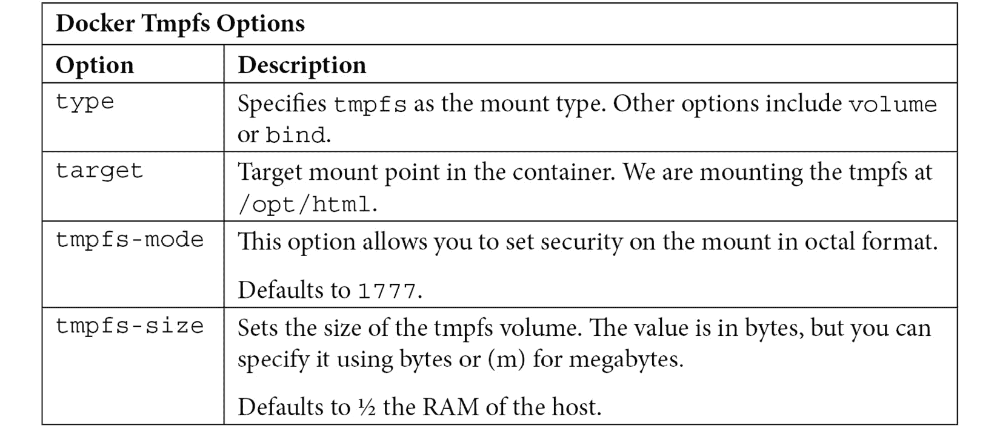

# *第二章*：使用 Docker 数据

曾经，容器用于无状态工作负载，可以快速扩展，快速移动，并且在不影响工作负载的情况下从一个位置移动到另一个位置。无状态工作负载限制了您可以运行的容器类型，禁止您运行除基础镜像中存储的项目之外的任何内容。

在本章中，我们将涵盖以下主题：

+   为什么需要持久数据

+   Docker 卷

+   Docker 绑定挂载

+   Docker tmpfs 挂载

让我们开始吧！

# 技术要求

本章没有任何技术要求。

如果您想使用本章中的示例创建卷，可以使用我们在*第一章*中创建的 Docker 主机，*Docker 和容器基础*。本章中将使用的卷对于未来章节并非必需。

您可以访问*第一章*中创建 Docker 主机的代码，*Docker 和容器基础*，访问以下 GitHub 存储库：[`github.com/PacktPublishing/Kubernetes-and-Docker-The-Complete-Guide`](https://github.com/PacktPublishing/Kubernetes-and-Docker-The-Complete-Guide)。

# 为什么需要持久数据

让我们考虑一个示例用例，您可能希望从容器向持久位置写入数据。

假设您有一个系统，需要您部署由**MySQL**数据库和运行在**NGINX**上的基于 Web 的应用程序。您使用标准**docker run**命令为应用程序启动两个容器。您与用户进行了一些初始测试，他们确认一切都按预期工作。用户在添加记录、查询记录、编辑和删除方面都取得了成功 - 一切都正常工作。容器运行几天后，您收到一封来自安全部门的电子邮件，告知所有用户所有 MySQL 服务器需要尽快部署新补丁以解决安全漏洞。

您可以快速处理一个包含最新补丁的新 MySQL 镜像，并将其推送到您的容器注册表。与用户一起工作，您决定部署新容器的时间，并通过以下方式开始该过程：

+   停止运行的容器。

+   使用与先前图像相同的容器名称运行新图像。为此，您需要使用**docker rm**命令删除当前容器。

+   启动新的 MySQL 容器。

容器启动后，你登录验证 MySQL 是否在运行，并确认补丁已经应用。接下来，你登录应用程序并搜索数据库中的记录，收到一个未找到记录的错误。你觉得这很奇怪，因为系统已经运行了几天。为了进一步排除故障，你直接登录数据库检查数据库的健康状况，发现服务器上没有数据库。

你的数据库发生了什么？为什么看起来数据库服务器已经被清空并重新初始化？你知道系统在过去几天一直在运行，一切都按预期运行，也就是说，直到你下载了一个新的 MySQL 镜像并在原始容器的位置启动它。

回想一下我们在*第一章*中关于短暂讨论，*Docker 和容器基础*，容器的可写层是短暂的，当容器被移除时，所有写入其中的数据都会丢失，即使你使用相同的名称启动一个容器。当你移除容器以重用名称时，包含数据库的容器层被删除。新容器启动时，它创建了一个新的容器层，当 MySQL 启动时，它没有看到任何基本文件，并创建了一个新的、完全初始化的 MySQL 实例。

当然，你不希望每次需要部署数据库服务器的新版本时都丢失数据库。由于容器层是短暂的，你需要将数据库存储在基础层之外的某个东西上，这样在镜像升级之间可以持久存在。到目前为止，我们一直告诉你容器是短暂的，那么你如何配置容器来保存数据呢？

幸运的是，Docker 包括使用两种方法向容器添加持久数据的能力：

+   Docker 卷

+   Docker 绑定挂载

还有第三种选项，使用主机的 RAM 提供存储，称为**tmpfs**。这种类型的挂载在容器重启、Docker 重启或主机重启时不是持久的。它只用作临时存储数据的位置，存储在高速 RAM 中，是真正的短暂的。虽然它不提供持久性，但在选择 tmpfs 的特定用例中可能是有益的。

当您需要运行需要持久数据的容器时，应选择哪个选项？卷和绑定挂载都类似地存储文件在本地主机文件系统上，以提供持久性给您的容器。最终决定取决于理解每个选项是如何管理的，以及如果不正确使用可能会暴露哪些数据。

# Docker 卷

Docker 卷是向容器添加持久数据的首选选项。卷只是本地主机上的一个目录，通过卷挂载映射到容器中。创建卷时，在主机文件系统上创建一个新目录，通常在**/var/lib/docker/volumes/<volume ID>/**下。如果您有主机的 root 访问权限，您可以像查看其他目录一样查看文件结构。以下屏幕截图显示了在运行使用卷的 Docker 主机上**volumes**目录下的目录：

图 2.1 - Docker 文件夹目录

为了在重启之间保持信息，Docker 使用 Boltdb 在主机上的各种数据库中存储关键元数据，Boltdb 是用 Go 编写的快速数据库，用于存储持久键值。当浏览**/var/lib/docker**文件夹时，您可能会遇到两个 Boltdb 数据库：

+   **/var/lib/docker/volumes/metadata.db**：维护 Docker 卷的元数据，如名称、驱动程序、标签和选项

+   **/var/lib/docker/network/files/local-kv.db**：维护 Docker 网络的元数据

由于本章重点是数据，我们将使用**metadata.db**数据库。正如您将在本章后面看到的，当您创建 Docker 卷时，可以提供名称或标签等选项。这些信息存储在数据库中以保持卷的持久性。

以下是 JSON 格式的**metadata.db**中关于名为**webdata**的 Docker 卷的示例：

webdata{"Name":"webdata","Driver":"local","Labels":null,"Options":null}

每个 Docker 卷在**/var/lib/docker/volumes**目录中都有一个目录。在每个卷文件夹中，有一个名为**_data**的目录，其中包含容器的实际数据。

在使用卷与容器之前，必须创建它。可以使用 Docker CLI 手动创建 Docker 卷，也可以在启动容器时由 Docker 守护程序自动创建。由于这两种方法都是由 Docker 创建的，它们由 Docker 自身拥有和管理，因此可以使用 Docker CLI 轻松管理和跟踪它们。

## 使用 CLI 创建卷

要创建 Docker 卷，我们可以使用卷管理选项：

docker volume <选项>

可用的选项如下：

表 2.1 - 卷管理选项

要创建新卷，请使用 **create** 选项：

docker volume create <可选卷名称>

执行 **create** 后，您将看到创建的卷名称。如果您没有提供可选的卷名称，Docker 将分配卷 ID 作为名称。在不提供卷名称的情况下创建卷称为匿名卷：

图 2.2 - 匿名卷输出

匿名卷在向主机添加使用卷的额外容器时可能难以跟踪。因此，最佳做法是在创建时为卷命名，而不是允许 Docker 生成一个很长的匿名卷名称。

在创建时为其提供卷名称的任何卷都称为命名卷。要创建命名卷，您需要将卷名称提供给 **docker volume create** 命令：

图 2.3 - 命名卷输出

](image/Fig_2.3_B15514.jpg)

图 2.3 - 命名卷输出

使用任一方法创建卷后，您可以通过查看 **/var/lib/docker/volumes** 来验证为您的卷创建了目录。您会发现一个以 **create** 命令返回的卷名称命名的目录。

现在您知道如何创建卷，下一步是将其与容器一起使用。

## 在容器中挂载卷

在容器中挂载卷的过程与命名卷或匿名卷的过程相同。我们已经介绍了使用 Docker CLI 创建卷的过程，但我们没有解释如何让 Docker 自动创建卷。

在本节中，我们将解释如何让 Docker 自动创建卷并挂载它。我们还将解释如何将先前创建的命名卷挂载到容器中。

在容器中挂载卷时，您需要为**docker start**命令提供两个选项中的一个。您可以使用**--mount**或**-v**这两个选项来挂载卷。如果您运行的是标准容器，您可以使用任一选项，但**-v**是最常用的选项。

在本章的前面，我们创建了一个名为**pv-mysql-data**的卷。现在我们想要使用命名卷启动我们的 MySQL 容器，这样我们就会有一个持久的数据库。要在容器中挂载卷，您需要在启动容器时传递**-v**选项。**-v**选项需要两个参数：卷名称和容器挂载点。在下面的示例命令中，您可以看到启动 MySQL 的命令，使用了命名卷挂载。我们还添加了一些额外的选项传递给容器，特别是**-e**选项，用于设置环境变量：

docker run --name mysql-01 -v pv-mysql-data:/var/lib/mysql -e MYSQL_ROOT_PASSWORD=my-password -d mysql

这将启动一个运行 MySQL 的容器，名称为**mysql-01**，在容器中挂载了一个名为**pv-mysql-data**的卷，挂载点为**/var/lib/mysql**。最后一个选项，使用了**-e**，创建了一个名为**MYSQL_ROOT_PASSWORD**的环境变量，其值为**my-password**。

容器启动后，您可以查看卷目录，通过检查目录中的数据来验证 MySQL 是否正确挂载了卷：

图 2.4 – MySQL 持久卷

正如您所看到的，新卷包含了在第一次启动新的 MySQL 服务器时创建的所有标准文件。

我们还提到过，您可以让 Docker 自动创建卷，而不是自己创建卷。要让 Docker 在容器启动时创建卷，请运行与使用预先创建的卷相同的命令。例如，使用之前的 MySQL 示例，假设*我们没有*使用**docker volume create**命令预先创建卷。

让我们执行相同的命令：

docker run --name mysql-01 -v pv-mysql-data:/var/lib/mysql -e MYSQL_ROOT_PASSWORD=my-password -d mysql

当我们这样做时，Docker 守护程序将会意识到没有名为**pv-mysql-data**的现有卷，它将在挂载到容器之前创建一个。

## 挂载现有卷

与容器层不同，卷也存储在本地主机上，如果容器从 Docker 中移除，卷不会丢失。在我们之前的 MySQL 升级示例中，我们将数据库服务器升级到了一个更新的版本。由于我们希望保持容器名称与先前部署的容器相同，我们移除了旧容器，并使用相同的名称启动了新容器。通过移除容器，我们移除了存储在本地文件系统上的容器层。

为了避免在升级后丢失我们的数据库，或者在容器从主机中移除后，我们可以在新运行的容器中挂载现有卷。由于卷默认情况下不会被删除，数据仍然存储在本地文件系统上，并且可以被任何其他容器使用。

当我们停止并移除我们的 MySQL 服务器时，卷仍然保持完好。当我们启动新的 MySQL 容器时，我们只需要使用相同的卷名称提供**-v**选项。这就是为什么创建一个命名卷优于匿名卷。在我们的例子中，我们创建了一个名为**pv-mysql-data**的命名卷。要运行新的容器，使用相同的卷，我们可以使用**docker run**命令和**-v**选项，如下所示：

docker run --name mysql-01 -v pv-mysql-data:/var/lib/mysql -e MYSQL_ROOT_PASSWORD=my-password -d mysql:v2

这将使用与先前容器相同的卷启动我们的新**mysql:v2**容器，现有数据库完全完好无损。

## 在多个容器中挂载卷

如果您有一个需要多个容器的应用程序，并且每个容器都需要相同的数据，那么您可以为每个容器创建一个卷并将数据复制到每个容器中，但更有效的方法是在多个容器之间共享单个卷。

Docker 卷的一个独特特性是多个容器可以访问同一个卷。虽然这听起来像是一个提供共享数据的简单解决方案，但你需要记住，并非每个应用程序在多个进程访问相同数据时都能很好地运行。以我们的数据库示例为例，启动使用相同卷的第二个容器会导致第二个容器的 MySQL 服务器在启动时失败。由于文件被第一个容器的数据库锁定，第二个容器无法获得对数据库的独占访问以挂载它。如果你查看第二个实例的日志，你会看到这里显示的错误：

图 2.5 – 锁定错误输出

有一些用例中，共享卷将为你的应用程序带来好处。想象一下，你在主机上运行了几个实例的 Web 服务器，它们只呈现每晚从一个文件夹中检索的数据。一个选择是每晚使用流水线创建一个新的容器，但是在这个例子中，我们假设你没有建立 CI/CD 系统。

相反，你可能在主机上有一个过程将数据拉入到创建了 Docker 卷的目录中。每个 Web 服务器将使用卷挂载，使用相同的 Docker 卷。这允许每个容器从单个共享位置访问数据，而无需对基本镜像进行任何更改。

为了实现这一点，当容器启动时，你只需要为每个容器提供相同的挂载选项。例如，我们在主机上创建了一个名为**webdata**的卷，我们想要启动四个 NGINX 服务器，它们将使用 Docker 卷中的数据。当你启动每个实例时，只需使用相同的**webdata**命名卷：

docker run --name webserver01 -v webdata:/opt/web/data -d bitnami/nginx:latest docker run --name webserver02 -v webdata:/opt/web/data -d bitnami/nginx:latest docker run --name webserver03 -v webdata:/opt/web/data -d bitnami/nginx:latest docker run --name webserver04 -v webdata:/opt/web/data -d bitnami/nginx:latest

由于 NGINX 服务器只会读取数据，我们不会遇到我们在 MySQL 中遇到的任何锁定错误。

现在我们已经在谈论卷并创建了一些卷，您可能会意识到当主机上有许多卷时，可能会难以记住存在哪些卷。下一节将讨论我们卷的一些基本管理选项。

## 列出 Docker 卷

请记住，卷由 Docker 管理，因此守护程序知道每个已创建的卷。如果要列出您或 Docker 守护程序创建的每个卷，请使用**docker volume list**选项：

图 2.6 - docker 卷列表输出

此选项将显示 Docker 当前管理的所有卷。

## 清理卷

默认情况下，Docker 永远不会删除为容器创建的卷。我们已经知道，当我们使用卷停止和启动容器时，数据会持久存在，但是当我们不再需要数据时该怎么办呢？

想象一下，**/var/lib/docker/volumes**文件夹中的数据量可能会以惊人的速度增长。因此，最佳做法是修剪或删除卷以释放磁盘空间 - 我们通常将其称为垃圾收集过程的一部分。

从不再需要的镜像中删除数据的最简单方法是在从 Docker 中删除容器时使用**-v**选项。在本书中，我们已经多次使用**docker rm <image name>**来从主机中删除镜像。如果您有一个附加到容器的卷，并且希望在删除镜像时删除数据，可以将**-v**选项添加到**rm**命令中，这将删除与容器关联的所有卷。要删除我们的 MySQL 服务器和持久数据，我们将使用以下命令：

docker rm -v mysql

有时您可能不希望通过删除容器来删除数据。删除卷是无法撤消的，因此更好的做法是删除容器并保留卷一段时间。在一定时间后，您可能更愿意删除卷或卷。

如果要删除单个或多个卷，可以使用**docker volume rm**选项。您可以在**rm**选项后提供卷名称或名称。系统将删除提供的每个卷，从而释放主机系统上的磁盘空间。

您可能担心自己可能会删除正在容器使用的卷。不用担心 – Docker 已经为您考虑到了。如果您尝试删除任何当前正在运行的容器使用的卷，或者分配给已停止容器的卷，您将收到错误：

守护程序的错误响应：删除 test-auto: 卷正在使用 - [51000e2f61c79ae705cdac78692fa5590fb2b26d3d0eb0a3916df230 daf1b617]

Docker 只允许您删除尚未被运行容器打开的卷。

您可能有许多要删除的卷。虽然您可以使用**remove**命令提供每个名称，但 Docker 提供了另一个选项，称为清理。清理将查看所有卷，并删除任何当前未挂载在运行容器上的卷。

谨慎使用此选项 – 只有在您知道未使用的卷不包含您出于任何原因需要的数据时才使用它。此过程是最终的，一旦运行，它将删除*所有*未使用的卷。

要删除未使用的卷，我们使用**docker volume prune**选项。此命令将查看所有卷，并删除任何未附加到运行容器的卷。当您发出命令时，它将警告您它将删除任何没有至少一个运行容器的卷：

图 2.7 – docker 清理确认

**谨慎选择** **y** **以确认** – 此操作没有撤销命令。一旦执行，您将收到已删除卷的摘要，包括它们的名称和总共回收的磁盘空间：

图 2.8 – docker 清理结果

这完成了本章的 Docker 卷部分。请记住，卷只是为容器提供数据持久性的一种方式。另一种方法称为绑定挂载，虽然它也像卷一样使用主机文件系统，但绑定挂载有一个非常不同的用例。

# Docker 绑定挂载

您可以用来为容器提供持久数据的第二个选项称为绑定挂载。总的来说，卷和绑定挂载可能看起来相似；两者都使用本地主机的文件系统，并且都使用**docker -v**选项进行挂载。虽然它们共享许多相同的特征，但绑定挂载与卷挂载在一个主要领域有所不同：它 *不* 由 Docker 管理。

与 Docker 卷不同，绑定挂载不能由 Docker 创建。您不能使用**docker volume create**选项创建绑定挂载；但是，当容器启动时，Docker 可以自动创建绑定挂载。尽管 Docker 可以在主机上创建绑定挂载位置，但它不会“管理”挂载。

由于 Docker 不管理绑定挂载，因此无法使用 Docker 命令删除它们。Docker 不会在列表中跟踪绑定挂载的位置。如果您在主机的文件系统的不同区域创建绑定挂载，您需要跟踪每个挂载的位置，以便在不再需要数据时手动删除它们。

绑定挂载是主机文件系统上的任何位置的目录，使用**docker -v**选项绑定到容器中。与卷不同，卷通常位于预定义位置，例如**/var/lib/docker/volumes**，绑定挂载可以位于主机文件系统的任何位置。由于目录位于文件系统上，当尝试访问目录时可能会遇到权限问题。这个讨论超出了本书的范围，并涉及到 Linux 文件系统权限的领域。

您可以绑定任何现有目录或创建一个新目录，可以通过预先创建目录或让 Docker 在容器启动时创建目录。

在我们解释如何使用绑定挂载之前，您可能会问自己，“为什么要使用绑定挂载？”或“为什么要使用卷？我为什么要关心我应该使用哪一个？”我们将解释为什么您可能或可能不想使用绑定挂载，然后将它们与卷进行比较。

当您需要与运行的容器共享主机系统上的某些内容时，绑定挂载可能是有益的。例如，您在本地笔记本电脑上开发应用程序，并且希望在最终编写代码之前测试应用程序。您可以将源代码存储在**/source**中，然后在编译时，您可以将可执行文件和任何库存储在**/apps/testapp**中。让我们来看一下：

1.  您可以使用**-v**选项启动一个容器，该选项将在容器中绑定挂载本地主机的**/apps/testapp**文件夹。这与在容器中使用卷并没有太大区别。实际上，当使用**docker run -v**选项将卷挂载到容器时，挂载绑定位置的语法与挂载卷到容器时相同。但是，与在**-v**选项中提供卷名称不同，您需要提供本地主机目录；例如：

**docker run -d -v /apps/testapp:/bin/testapp ubuntu:latest**

这将启动一个运行 Ubuntu 的容器，容器内部有一个挂载点，绑定到本地主机的**/apps/testapp**路径，编译的应用程序就在这里。

1.  要测试应用程序，您需要附加到运行中的镜像，并通过运行**/bin/testapp/testapp**来执行应用程序。由于容器的挂载使用了本地主机目录，您可以测试该应用程序，如果遇到任何错误，您可以修复代码并简单地重新编译可执行文件。

1.  一旦重新编译，您可以再次在容器中运行新的可执行文件来测试应用程序。这样可以避免在发现问题后创建多个测试镜像并在镜像之间进行迭代。一旦成功测试了应用程序，您可以停止容器并创建包含应用程序的最终容器镜像。

Docker 卷无法提供相同的解决方案，因为它们都位于主机上的一个目录中，无法指向现有目录。

使用绑定挂载还有其他示例用例。要记住的主要观点是，绑定挂载可以用于在主机系统上的任何位置与容器共享数据。在正确的场景中使用绑定挂载非常有用，但如果使用不当，可能会导致系统不稳定或安全漏洞。

毋庸置疑，当在容器中使用主机系统上的任何现有目录时，您应该小心。将主机的**/etc**目录绑定到容器中可能会导致意想不到的结果。在容器中运行 shell 的人可以轻松地删除或编辑文件，或多个文件，使主机系统不稳定。

# Docker tmpfs 挂载

在本章的开头，我们提到 Docker 允许您将主机的 RAM 用作容器数据的临时存储位置。这种类型的挂载不会持久化数据，但对于适当的工作负载，它可以是一个非常有用的存储位置。tmpfs 提供了一些独特的优势，这些优势在卷或绑定挂载中是不可用的：

+   大小可以预先定义以限制所消耗的 RAM 量。

+   提供非常快速的数据访问。

tmpfs 挂载也有一些限制：

+   它们仅在 Linux 上可用；不支持 Windows。

+   单个 tmpfs 只能挂载到一个容器。

## 在容器中使用 tmpfs 挂载

可以通过添加**--mount**或使用**--tmpfs**选项来启动容器并使用 tmpfs 挂载。一般来说，您应该默认使用**--mount**选项，因为**--tmpfs**不允许对挂载进行任何自定义。如果使用**--tmpfs**，您将无法设置大小限制或任何文件模式安全性。由于这种类型的挂载将使用昂贵的资源，即主机的 RAM，您将希望为您的挂载创建一个大小。由于这些限制，我们强烈建议您不要使用**--tmpfs**来创建您的 tmpfs 挂载。

要为 NGINX 容器使用 tmpfs 挂载，您需要在启动镜像时使用**--mount**选项：

docker run --mount type=tmpfs,target=/opt/html,tmpfs-mode=1770,tmpfs-size=1000000 --name nginx-test -d bitnami/nginx:latest

在**run**命令中指定**--mount**后，挂载选项允许您添加多个选项。在我们的示例中，我们添加了挂载类型、容器中的目标挂载、文件模式和大小的选项。以下表格显示了每个选项的详细信息：

表 2.2 - Docker tmpfs 选项

现在我们已经创建了一个 tmpfs 挂载，我们想要列出主机上的卷，以验证我们有一个 tmpfs 挂载。您可能还记得，我们可以使用**docker volume ls**命令列出卷。创建 tmpfs 挂载后的输出如下所示：

图 2.9 - Docker 卷列表

请注意，列表是空的；根据 Docker 守护程序，没有正在使用的卷。tmpfs 挂载不会出现在卷列表中，因为它们不是“真正的”卷；只有在使用**docker volume ls**命令时才会出现卷。

如果您想验证容器中的 tmpfs 挂载，可以查看容器的**docker inspect**命令输出，并查找**"Mounts"**部分：

图 2.10 – Docker 检查输出

您还可以通过使用**docker exec**命令执行 Linux **df**命令来验证运行中的容器内的挂载：

图 2.11 – Linux 中的 tmpfs 挂载

正如您在**df**命令输出的突出显示部分中所看到的，挂载点存在于容器中，大小是正确的。

我们想展示一个最后的例子，即使用一个未指定 tmpfs 空间大小的挂载。如果您未指定大小，Docker 将使用主机 RAM 的一半创建一个挂载。我们的示例服务器有**26 GB** RAM，并且我们已经使用相同的容器执行了**docker run**命令，而没有指定大小。

请注意，在**mount**命令中我们确实指定了大小。要验证容器是否具有**/opt/html**目标，我们可以使用**docker exec**执行**df -u**命令，并确认已创建**/opt/html**挂载。正如您可能已经注意到的那样，卷的大小为**13 GB**，这是主机**26 GB** RAM 的**一半**。需要指出的是，虽然卷设置为 26 GB，但目前没有数据，因此尚未消耗任何 RAM。只有在容器中存储数据时才会消耗 RAM，因此您需要非常小心处理 tmpfs 卷，否则可能会在主机上耗尽 RAM 并可能导致系统崩溃。

# 总结

在本章中，您学会了多种处理容器中数据的方法。阅读完本章后，您应该知道如何决定要为容器使用何种适当类型的存储。

在下一章中，我们将通过学习 Docker 默认桥接网络来学习 Docker 网络。我们还将学习如何使用和创建用户定义的桥接，并在网络上公开容器服务。

# 问题

1.  以下哪种卷为容器提供持久存储？

A. tmpfs

B. 绑定挂载

C. 卷

D. SAN

1.  Docker 卷必须在挂载之前创建。

A. 真

B. 错误

1.  您在具有 64 GB RAM 的主机上创建了一个 tmpfs 卷。在创建过程中，您未设置大小。Docker 会创建多大的卷？

A. 1 GB

B. 64 GB

C. 20 GB

D. 32 GB

1.  当您删除一个容器时，Docker 卷会自动删除。

A. 真

B. 错误

1.  哪种卷类型由 Docker 守护程序管理？

A. 绑定卷

B. 命名卷

C. 所有卷

D. 无

1.  如何删除未使用的绑定卷？

A. 不需要；Docker 会自动删除它

B. **docker volume prune**

C. **docker volume bind prune**

D. 您必须手动删除绑定文件夹
