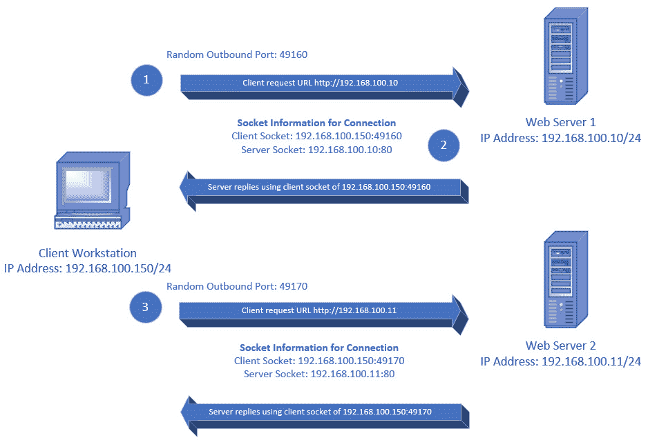
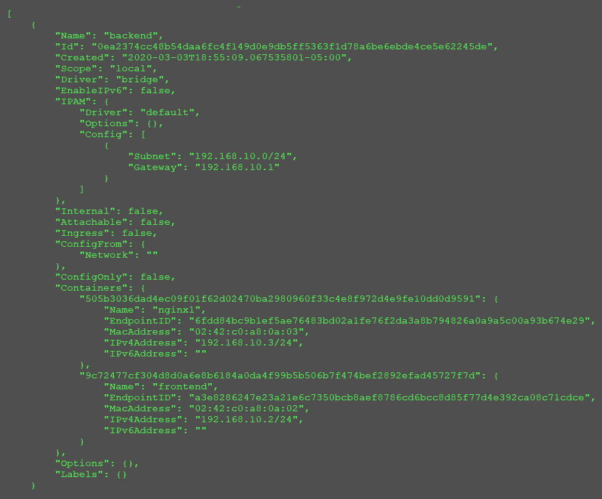
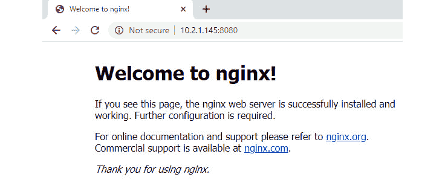

# 第三章：理解 Docker 网络

到目前为止，我们已经专注于在主机系统上本地访问容器的方法。有些情况下，只需要本地容器访问，但通常情况下，您会希望将容器暴露给外部用户或系统。将容器暴露给外部用户并不总是简单地运行一个容器。您需要考虑 Docker 提供的各种选项，以连接您的容器到网络。为了避免挫折，您还应该了解系统如何使用 IP 进行通信，包括在暴露 IP 端口方面的任何限制。

在本章中，我们将涵盖以下主题：

+   探索 Docker 网络

+   创建用户定义的桥接网络

让我们开始吧！

# 技术要求

本章没有任何技术要求。

如果您想使用本章中的示例创建网络，可以使用我们在*第一章*中创建的 Docker 主机，*Docker 和容器基础*。本章中将使用的网络对于未来的章节并非必需。

您可以访问*第一章*中创建 Docker 主机的代码，*Docker 和容器基础*，访问以下 GitHub 存储库：[`github.com/PacktPublishing/Kubernetes-and-Docker-The-Complete-Guide`](https://github.com/PacktPublishing/Kubernetes-and-Docker-The-Complete-Guide)。

# 探索 Docker 网络

在本节中，我们将讨论 Docker 中可用的网络选项以及如何使用它们将您的容器暴露给外部用户和系统。Docker 包括各种网络选项，以连接容器到您的网络，如果没有包括的网络选项符合您的要求，您可以从许多第三方网络附加组件中进行选择，这些组件提供了基本网络堆栈中可能不包括的功能。默认情况下，Docker 网络侧重于单个主机，但对于更复杂的用例，它包括网络功能，通过使用 Docker Swarm 来促进跨主机网络。由于行业已经摆脱了使用 Docker Swarm 转向其他提供，如 Kubernetes，本章将专注于单主机网络。

为了避免在暴露容器时可能出现的挫折，您应该对 IP 如何使用端口进行通信有很好的理解。你们中的许多人可能对 IP 很了解，但我们认为提供一个关于 TCP/IP 如何使用端口进行通信的简短复习会很有益处。

## 快速 TCP/IP 端口复习

我们假设您对 TCP/IP 有一定的了解，但对于那些对此还不熟悉的人来说，重点介绍一些网络主题是很重要的，因为这些主题将在本章中被引用。理解端口是一个至关重要的概念，以充分了解在 Docker 中暴露服务的限制。

正如您可能知道的那样，当您在系统上配置 IP 时，您会为系统中的每个网络适配器分配一个唯一的 IP 地址。当进行传入或传出连接时，请求包括 IP 地址和**1**到**65535**之间的端口。您可能在请求中并不总是看到端口，因为许多应用程序将根据所使用的协议自动包含在默认请求中。当您在浏览器中输入 URL 时，通常只需使用协议和主机名输入 URL。例如，假设您想打开主 Kubernetes 页面，所以您在浏览器中输入[`kubernetes.io`](http://kubernetes.io)。不显示或不需要的是端口。HTTP 的默认端口是 80，所有浏览器都会默认请求使用端口**80** - 在幕后，浏览器正在请求[`kubernetes.io:80`](http://kubernetes.io:80)。

IP 地址和端口的组合称为套接字，表示为**<IP 地址>:<端口>**（即**192.168.1.1:443**）。套接字是双向通信所必需的。当您请求一个网页时，您的计算机将使用从**49152**到**65535**之间随机选择的端口进行传出请求。如果您对 IP 还不熟悉，这可能有点令人困惑，因此以下是一个从工作站到两个不同的 Web 服务器的连接示例：

图 3.1 – 套接字示例

在*步骤 1*中，工作站向运行在**192.168.100.10**上的 Web 服务器发送请求。工作站使用随机生成的端口来启动到端口**80**的 Web 服务器的传出请求。接下来，在*步骤 2*中，Web 服务器使用客户端 IP **192.168.100.150**和端口**49160**回复客户端。

我们添加了*步骤 3*，以显示与另一个 Web 服务器的同时连接将生成不同的出站端口，从而针对端口 80 上的第二个 Web 服务器。

## 将端口绑定到服务

在服务器端，您可能正在运行像 NGINX 这样的服务器来托管网站，您必须将套接字绑定到 Web 服务器进程。绑定的 IP 地址可以是单个 IP，也可以使用地址 0.0.0.0 绑定到所有可用的服务器 IP 地址上的所有 IP 地址。

作为示例，我们将使用具有单个网络卡和单个 IP 地址的主机。当您想要将端口绑定到进程时，您配置该进程以使用服务器的 IP 并分配端口**80**。我们想要强调上一句中的一个关键词，*绑定* - 根据定义，绑定某物是将其紧密地绑定或固定。当您将端口绑定到 IP 地址时，它是专门绑定的，并且不能绑定到使用该 IP 地址的任何其他运行中的进程。换句话说，由于套接字已被绑定，它不能绑定到主机上的任何其他进程。

如果您尝试配置已绑定的端口上的进程，您将收到类似以下错误的消息：

绑定到 192.168.1.1:443 失败：端口已被分配。

如果您想在主机上运行另一个进程，您只需要指定一个唯一的端口。在运行 NGINX 的同一台服务器上，您可以运行在端口**3306**上运行的 MySQL 服务器。由于该端口与在端口**80**上运行的 Web 服务器不同，因此它创建了一个唯一的套接字。

使用端口公开容器的方式取决于您为容器使用的 Docker 网络驱动程序。在本章中，我们将解释常见的网络选项以及如何在主机上配置和使用每个选项。一旦您了解了这些选项，我们将通过查看如何使用端口分配将容器暴露给本地主机系统外的用户来完成本章。

首先，让我们开始讨论 Docker 包含的各种网络驱动程序。

## Docker 网络驱动程序

Docker 的网络系统是模块化的。基本的 Docker 安装包括一些网络驱动程序，如果您需要专门的网络驱动程序，还可以从其他供应商那里获得选项。对于本书的目的，我们将仅使用网络的包含网络驱动程序。

默认情况下，您可以选择使用五种网络选项。实际上，您有四种选项，第五种选项是无; 也就是说，禁用网络。Docker 包含的选项在下表中详细说明：

图 3.2 - Docker 网络驱动程序

](image/Fig_3.1a_B15514.jpg)

图 3.2 - Docker 网络驱动程序

默认的 Docker 安装将包括一些预配置的网络：

+   默认桥接网络

+   默认主机网络

+   无

大多数 Docker 用户只是使用默认的桥接网络，这对大多数用例都有效，但它确实有一些需要考虑的限制。

在本节中，我们将介绍默认桥接网络、自定义桥接网络和无网络选项。主机网络选项主要用于当您的主机是 Docker Swarm 的一部分时使用，但如果您了解在使用它时端口暴露的限制，也可以在没有 Swarm 的情况下使用。

## 默认桥接网络

在前面的表中，您了解到桥接网络只为在同一 Docker 主机上运行的容器提供网络。除非您使用 Docker Swarm 运行多个 Docker 主机，否则通常会使用桥接网络与 Docker 容器一起使用。安装 Docker 时，它将创建所谓的默认 Docker 桥接网络。通过为所有安装提供默认桥接，Docker 使得在容器中使用网络变得非常简单。许多用户只是开始使用默认的网络设置和选项来使用 Docker，从而启动容器而不了解默认桥接的限制和潜在安全风险。在使用 Docker 主机之前，您应该始终考虑创建用户定义的桥接，或根据您的要求创建多个桥接。

Docker 包含一个易于使用的默认网络，那么为什么要考虑创建用户定义的桥接？由于默认桥接保持向后兼容，许多桥接功能必须受到限制。由于这些限制，与用户定义的桥接相比，默认桥接被认为是较差的。虽然这听起来有点苛刻，但请考虑以下清单，其中详细说明了在使用默认桥接时需要考虑的事项：

+   当启动一个容器时，如果没有指定网络，它将使用默认的桥接。这意味着多个容器默认情况下可以通信，而不需要考虑工作负载。

*考虑*: 如果您运行多个容器，并且希望将某些容器与其他容器隔离开来，您可能会无意中允许容器之间的通信，因为它们使用默认桥接。

+   默认桥接限制容器之间的通信仅限于 IP 地址。连接到用户定义的桥接的容器可以使用容器名称或 IP 地址进行通信。使用用户定义的桥接的容器可以使用 IP 地址或主机名进行通信。

*考虑*: 当您启动容器时，IP 地址可能与上次运行镜像时不同。

如果您想配置一个具有多个相互作用的容器的应用程序，您可以使用容器名称，这些名称将在重新启动时保持不变。如果您使用默认桥接，您可能需要更改配置文件，因为容器以不同的 IP 地址启动。

+   使用默认桥接的容器需要在将它们移动到不同网络之前停止。但是，在使用用户定义的桥接的容器上，您可以在不重新启动容器的情况下更改网络。

*考虑*: 根据您的工作负载，您可能无法在没有约定的维护窗口的情况下停止运行的容器。虽然在大多数公司中，网络更改仍然需要更改请求，但如果您使用用户定义的桥接，则可以在不停止容器的情况下进行更改。这将限制对应用程序的任何潜在影响，并在新的网络桥接上配置错误时提供快速回退。

+   使用单个默认桥接会限制所有容器的网络选项。由于所有容器都在单个网络上，所有容器的网络设置都相同。

*考虑*: 您可能需要一些容器运行巨幅帧的要求，而其他容器将使用标准的 MTU 大小。如果您只使用单个默认桥接，您只能设置一个 MTU 大小。但是，您可以创建一个将 MTU 设置为 9000 的用户定义的桥接，另一个保持默认 MTU 大小为 1500。

有了这个，你就可以看到为什么我们提到默认桥接比用户定义的桥接差。根据您的用例，您可能可以将默认桥接用于您所有的需求，就本书而言，我们将使用默认桥接进行练习。然而，在运行 Docker 的生产环境中，您应该**始终**创建一个新的用户定义的桥接。

现在您已经了解了各种网络选项以及每种类型的优缺点，是时候深入了解管理和创建 Docker 网络了。在创建网络之前，我们将查看 Docker 默认包含的默认网络以及如何使用 Docker CLI 查看网络的详细信息。

## 查看可用网络

要查看 Docker 主机上所有现有的网络，我们可以使用 Docker CLI 中的**network**管理选项和**ls**选项。当您执行 Docker 网络列表时，输出将类似于以下内容：

图 3.3 - 默认 Docker 网络列表

上面的列表来自基本的 Docker 安装，因此只有三个默认网络选项可用。

**docker network ls**命令不包含太多信息；它旨在为您提供可用网络的快速摘要。要深入了解网络的详细信息，您可以要求 Docker 检查网络，这将提供所有网络设置。

## 检索网络的详细信息

一旦您创建了多个用户定义的网络，您可能会开始迷失每个网络的设置，或者每个网络上运行的容器。您可以使用**docker network inspect <network name>**选项在主机上查看每个网络的详细信息。**inspect**命令的输出包含有关网络的详细信息，包括子网、网关、驱动类型以及所有连接的容器：

图 3.4 - 网络检查输出

前面的截图显示网络是一个桥接网络，但我们已经从输出的**"Driver": "bridge"**部分知道了这一点。在输出的容器部分，您可以看到桥接网络有两个容器连接到它。第一个容器名为**NGINX1**，IP 地址为**192.168.10.3**，而第二个容器名为**frontend**，IP 地址为**192.168.10.2**。**inspect**命令还显示了每个容器的分配 MAC 地址，以及（如果启用）IPV6 地址。

现在您知道如何跟踪主机上的网络了，让我们深入了解用户定义的桥接网络。

# 创建用户定义的桥接网络

当您创建一个新的用户定义网络时，您可以提供大多数标准 IP 选项，这些选项在 Docker 之外创建新网络时会使用。您可以为子网、IP 范围和网关设置选项。请记住，您在这里定义的网络仅在您的 Docker 主机内部，并且您分配的 IP 地址将无法在主机外部寻址。要了解更多高级选项，请访问[`docs.docker.com/engine/reference/commandline/network_create/#specify-advanced-options`](https://docs.docker.com/engine/reference/commandline/network_create/#specify-advanced-options)上的高级 Docker 网络页面。

要创建一个用户定义的网络，我们在 Docker CLI 中使用**网络管理**选项，以及**创建**选项。语法非常简单；您只需要为新网络提供所需的网络名称，Docker 将创建新网络。要创建一个名为 frontend 的新网络，我们只需要执行以下命令：

图 3.5 – 创建 Docker 网络的输出

这将返回网络 ID。如果您再次列出网络，您将看到一个新的桥接网络可用：

图 3.6 – Docker 网络列表

由于我们除了网络名称之外没有指定任何选项，Docker 将为网络分配一个不重叠的 IP 范围。

如果您想要创建一个名为 backend 的第二个网络，该网络使用**192.168.10.0/24**子网，网关为**192.168.10.1**，您只需要在**docker network create**命令中添加**--subnet**和**--gateway**：

图 3.7 – 添加选项示例

当您创建一个新网络，就像我们为后端网络示例所做的那样，Docker 会在主机上绑定一个新的 IP，该 IP 等于我们在**创建**命令中使用的网关地址。以下是在我们的主机上使用**ip addr**的输出：

图 3.8 – 主机 IP 在网络创建后添加

这将允许您的主机将网络流量路由到任何连接到交换机的容器。容器可以通过使用主机 IP 作为默认网关来访问主机外部的网络资源。

现在您已经创建了一个用户定义网络，让我们看看如何在运行镜像时将新网络分配给容器。

## 将容器连接到用户定义网络

您可以通过在**docker run**命令中添加**--network**选项来在启动容器时将容器连接到特定网络。要将新的 NGINX 容器连接到我们之前创建的 frontend 网络，我们只需要在启动容器时添加**--network=frontend**：

图 3.9 - 在启动时连接网络

上述命令将在名为 frontend 的用户定义网络上启动一个新的 NGINX 容器。

## 更改运行中容器的网络

我们提到使用用户定义网络而不是默认网络的一个优势是能够在不停止容器的情况下随时更改容器的网络。

要更改运行中容器的网络，您可以使用称为**connect**和**disconnect**的 Docker 网络选项，以及网络名称和容器名称。当您使用**connect**选项时，您向容器添加一个网络，而如果您使用**disconnect**选项，则从容器中删除一个网络，而无需停止容器。

在我们的 NGINX 示例中，我们分配了 frontend 网络，但是如果我们想要将其更改为 backend 网络，我们只需要添加一个网络并删除另一个。第一步是使用**docker network connect**命令连接 backend 网络：

图 3.10 - 连接网络

这将把名为 backend 的网络连接到我们名为 frontend 的容器。

第二步是使用**disconnect**选项删除 frontend 网络：

图 3.11 - 断开网络

您可能想知道是否可以将容器连接到多个网络，答案是可以的。如果您需要容器访问需要巨幅帧的网络，但它也需要访问标准网络连接，您可以将容器连接到两个不同的用户定义网络。详细说明这种情况超出了本书的范围，并且可能会变成一个复杂的话题，因为它可能需要在容器中创建自定义路由，但知道它是可以做到的，并且有特定的用例。

## 删除网络

如果您不再需要用户定义的网络，可以使用**docker network rm <network name>**命令从主机中删除网络。要删除之前创建的前端网络，我们将使用带有网络名称**frontend**的**docker network rm**命令：

图 3.12 - 删除网络

如果您有多个要删除的网络，那么可以使用**prune**命令，它将删除主机上所有未使用的网络。这类似于清理未使用的卷。您只需要运行**docker network prune**来删除未使用的网络：

图 3.13 - 清理网络

一旦您确认要继续，Docker 将列出已删除的网络。在我们的示例中，它删除了一个名为**network4**的网络。

就像我们之前讨论的**volume prune**命令一样，**这是一个单向过程**。当您选择是来清理网络时，就没有撤销操作，所以在确认操作之前一定要**100%**确定您要删除网络。

## 在没有网络的情况下运行容器

请记住，如果您启动一个没有网络选项的容器，它将连接到默认的桥接网络。您可能需要测试一个可能包含可疑内容的容器，并且让它连接到**网络**可能会对整个网络造成风险。

这与现实世界没有什么不同。例如，如果你有一台机器看起来像是恶意行为，你会关闭网络端口或者拔掉网络电缆。在容器世界中，我们可能在主机上运行多个容器，而且可能不能简单地拔掉电缆而不影响许多工作负载。我们有两个选项可用，取决于容器是否已经在运行，如果是的话，你不想丢失运行状态。

如果容器已经停止，你可以在启动容器时使用**--network=none**选项来简单地启动不附加网络的容器。这与你在启动具有用户定义网络的容器时遵循的相同过程，只是我们将网络名称指定为**none**。

如果你怀疑容器中有恶意运行的东西，你可能无法停止容器。如果你需要查看运行中的进程、RAM 内容等，停止镜像会销毁任何正在运行的东西，你可能会丢失宝贵的信息。与其停止并重新启动容器，使用网络值为 none，你可以只是将运行中的容器与网络断开连接。这将限制容器影响本地镜像之外的任何东西的能力。

## 暴露容器服务

现在你知道了 Docker 中可用的网络选项，下一步是在启动容器时暴露任何想要接受流量的端口。在暴露端口时有两个选项。第一个是使用**主机网络**选项，而第二个是在容器启动时在桥接网络上暴露端口。使用**主机网络**选项更容易，因为你不需要任何手动端口映射，但随着运行容器数量的增加，这会使跟踪端口变得困难。我们建议只在计划运行单个容器时使用**主机网络**选项。

## 使用主机网络暴露端口

正如我们在本章前面提供的表格中所述，*"使用主机网络驱动程序的容器将不会获得 IP 地址，也不需要暴露端口来允许传入流量。"*由于容器将直接在主机网络上启动，完全绕过 Docker 的网络堆栈，你不需要为容器暴露任何端口。

例如，要在主机上使用主机网络运行 NGINX 的 Web 服务器，您将运行**docker run**命令，同时提供**host**作为网络类型：

图 3.14 - 使用主机网络选项

我们想要验证容器是否正在运行，并查看可能暴露的任何端口，因此我们将运行**docker ps**来列出正在运行的容器。容器显示为正在运行，但在**PORTS**下，我们没有看到任何列出的内容：

图 3.15 - 从主机连接的示例端口视图

由于容器是使用**主机网络**选项启动的，我们不需要暴露任何端口。我们一直在使用的 NGINX 容器在端口**8080**上运行，并且由于它绕过了 Docker 网络，证明它正在使用端口**8080**的唯一方法是在主机系统上运行**netstat**：

图 3.16 - 主机 netstat 显示端口 8080 正在使用

看起来容器正在运行并在端口 8080 上监听。在网络上的另一台机器上，我们可以打开浏览器并输入 Docker 主机机器的 IP 地址并使用端口 8080：

图 3.17 - NGINX 在主机网络上运行

在这里，我们收到了 NGINX 的欢迎页面，证明容器正在运行。

由于**docker ps**命令未列出正在使用的端口，您可以看到在使用**主机网络**选项时，如果主机运行多个容器，您可能会开始丢失已分配的端口。这就是为什么我们建议限制使用**主机网络**选项，除非您正在运行单个容器或需要主机网络的容器。

重要提示

正如我们所述，主机上的套接字必须是唯一的。在我们的示例中，我们一直在使用单个 NIC 和单个 IP 地址，这意味着端口只能在主机上使用一次。由于套接字是 IP 地址和端口的组合，您可以向单个 NIC 添加第二个 IP 地址，或者添加一个带有新 IP 地址的附加 NIC，以创建一个新的唯一套接字。这将允许您将已分配端口的新绑定到另一个进程，因为套接字将是唯一的。

现在，让我们停止 NGINX 容器，并再次查看**netstat**，以显示该端口不再被使用。我们将使用以下命令：

**sudo docker stop nginx**

**sudo docker rm nginx**

然后，我们将使用 netstat 来显示活动端口：

图 3.18 – 主机 netstat 显示端口 8080 未被使用

如你所见，主机上唯一打开的端口是 SSH；端口**8080**已经关闭，因为容器已经停止。

## 使用桥接网络暴露端口

使用**主机网络**选项似乎使暴露端口变得容易，因为你实际上不需要做任何事情来暴露它们。这一开始可能看起来很吸引人，但如果你在主机上运行多个容器，并且有多个配置为在相同的端口上运行，比如我们的 NGINX 容器的端口 8080，由于端口冲突，你将受限于一个容器。

当一个选项看起来更容易时，通常意味着它的健壮性或可配置性较差，这就是为什么它一开始看起来更容易。这就是在使用主机网络与桥接网络暴露端口时的情况，但一旦你了解了我们如何以及为什么使用桥接网络暴露端口，你就会明白为什么它提供了更好的全面解决方案。

当你想要在使用桥接网络的容器上暴露端口时，你只需要在启动容器时指定要打开的端口。如果你有多个桥接网络，你还需要提供网络名称，但在我们的示例中，我们假设你正在使用内置的桥接网络。

在 Docker 中暴露端口时，你需要使用**incoming port:destination port**的语法来指定传入的（Docker 主机）端口和目的地（容器）端口。通常，这些数字会保持一致以保持简单，但也会有一些情况需要使用不同的端口。

如果你只为目的地提供了一个端口，那么将假定为 TCP 连接。你可能需要为容器暴露 UDP 端口，为了将端口暴露为 UDP 端口，只需在目的地端口分配中添加**/udp**。因此，你的语法将变成**incoming port:destination port/udp**。

使用我们的示例 Web 服务器，我们将使用默认的桥接网络在端口**8080**上启动容器，使用**docker run**命令和**-p**选项来指定端口；也就是说，**docker run -p 8080:8080 -p 8443:8443**：

图 3.19 - 暴露端口 8080

为了验证容器正在运行，我们将使用 docker ps 命令，并注意 PORTS 列，该列显示了容器的映射端口：

图 3.20 - docker ps 输出显示分配的端口

](image/Fig_3.19_B15514.jpg)

图 3.20 - docker ps 输出显示分配的端口

在这里，我们可以看到容器正在运行，并且我们已将传入主机端口 8080 和 8443 映射到容器端口 8080 和 8443。对 Docker 主机上 8080 和 8443 端口的任何传入请求，无论在任何接口（0.0.0.0）上，都将被转发到容器。

就像我们使用主机网络时一样，我们可以看到主机正在使用 netstat 监听 8080 和 8443 端口：

图 3.21 - 主机 netstat 显示端口 8080

您的项目现在需要为另一个开发站点部署第二个 Web 服务器，并且您希望部署另一个 NGINX 容器。该镜像使用端口 8080 和 8443，但这两个端口都被我们的第一个 NGINX 容器使用。在主机上尝试使用 8080 和 8443 运行另一个容器将导致端口已分配错误：

图 3.22 - 端口冲突示例

](image/Fig_3.21_B15514.jpg)

图 3.22 - 端口冲突示例

一个解决方案是创建另一个容器，监听不同的端口，比如 8081 和 8444，但这开始变得难以维护。相反，记住当您暴露一个端口时，您指定了传入和目标端口。我们想使用相同的 NGINX 镜像，所以我们不能更改容器端口，但我们可以更改主机上的传入端口。当我们启动第二个容器时，我们将每个端口增加一，以避免与现有的 8080 和 8443 规则冲突，但我们仍将将端口转发到新容器的 8080 和 8433。这可能听起来很混乱，所以最好看一个示例 docker run 命令；即 docker run -p 8081:8080 -p 80444:8443 –name nginx2 bitnami/nginx:latest：

图 3.23 - 分配端口 8081 和 8443 的示例

由于 Docker 返回了新的容器 ID，我们可以看到，通过逐一增加传入端口，我们不再有任何冲突的端口。

列出当前运行的容器将显示两个 NGINX 容器和端口映射：

图 3.24 – 显示运行中的两个 NGINX 服务器

从网络上的另一台机器浏览到主机的 8081 端口将显示默认的 NGINX 欢迎页面：

图 3.25 – 浏览示例到端口 8081 的 NGINX

查看 netstat，我们可以看到主机上的所有四个端口都在监听：

图 3.26 – 主机 netstat 显示分配的四个 NGINX 端口

如果您需要运行另一个 NGINX 容器，您可以使用另一个主机端口，可能是**8082**或**8445**。主要的要点是主机上的传入端口必须是唯一的，以避免端口冲突。容器的端口可以相同，因为每个容器都在自己的命名空间中运行，并且每个容器都有自己的资源和端口。

# 总结

在本章中，您了解了 IP 套接字以及主机如何使用端口与服务器建立连接。您了解到套接字是 IP 地址和端口的组合，必须在主机上是唯一的。然后，我们介绍了 Docker 提供的每种网络类型及其各自的用例，以及何时使用默认桥接网络、自定义桥接网络、主机网络或无网络。最后，您学会了如何将容器暴露给外部用户。

在下一章中，我们将开始探索 Kubernetes，通过探索 Kubernetes 集群，查看其控制平面，了解**kublet**和 API 之间的区别，学习工作节点的功能，并审查超过 25 个 Kubernetes 对象。

# 问题

1.  由于 Docker 创建了默认的桥接网络，因此没有理由创建自定义桥接。

A. True

B. False

1.  以下哪项是套接字的示例？

A. **http:192.168.100.10**

B. **192.168.100.10**

C. **192.168.100.10:80**

D. **https://192.168.100.10**

1.  如何在已将其主机端口（8080）绑定到另一个容器的主机上启动一个名为**nginx-web**的端口为**8080**的 Web 服务器的容器？

A. **docker run -d nginx-web bitnami/nginx**

B. **docker run -p 8080:8080 -d nginx-web bitnami/nginx –force**

C. **docker run -p 8081:8080 -d nginx-web bitnami/nginx**

D. 由于主机上绑定了端口**8080**，你无法在端口**8080**上运行容器

1.  你怀疑一个镜像可能包含恶意软件。你需要安全地运行这个镜像来查看它的内容。哪个 Docker 命令可以减轻任何网络影响？

A. **docker run -isolate -it badimage bash**

B. **docker run -p 0:0 -it badimage bash**

C. **docker run -it badimage bash**

D. **docker run --network=none -it badimage bash**

1.  一旦一个容器连接到自定义桥接网络，你就无法更改连接的网络。

A. True

B. False

1.  你可以在容器上暴露的最高 IP 端口号是多少？

A. 没有限制

B. 65535

C. 65530

D. 65532

E. 65435
