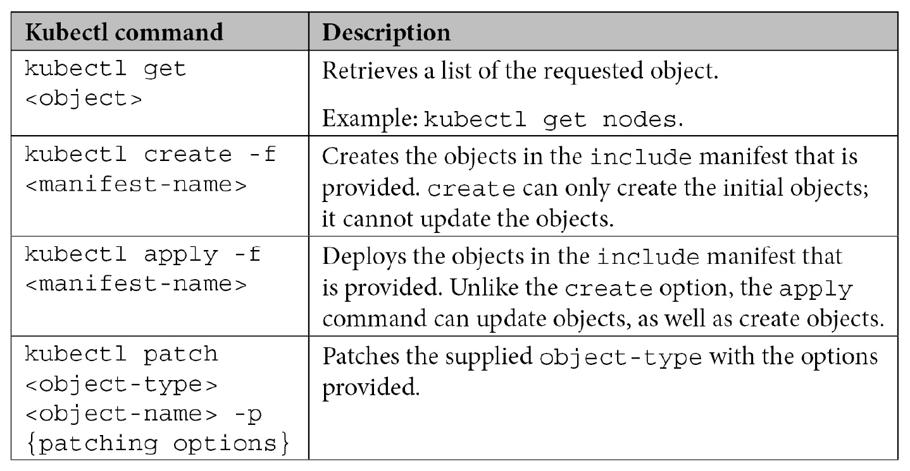
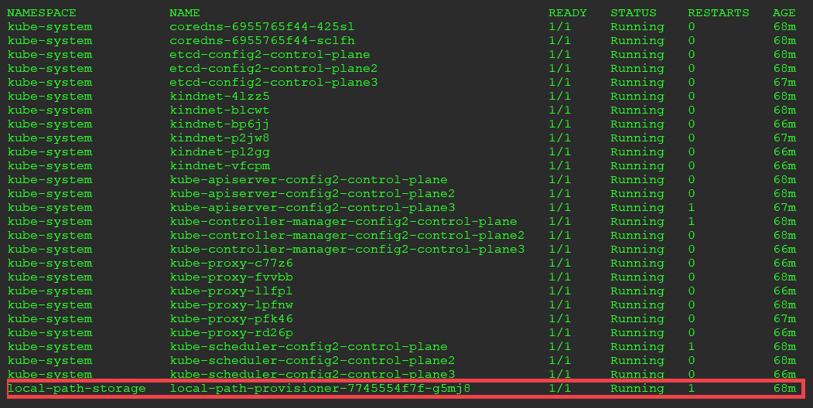
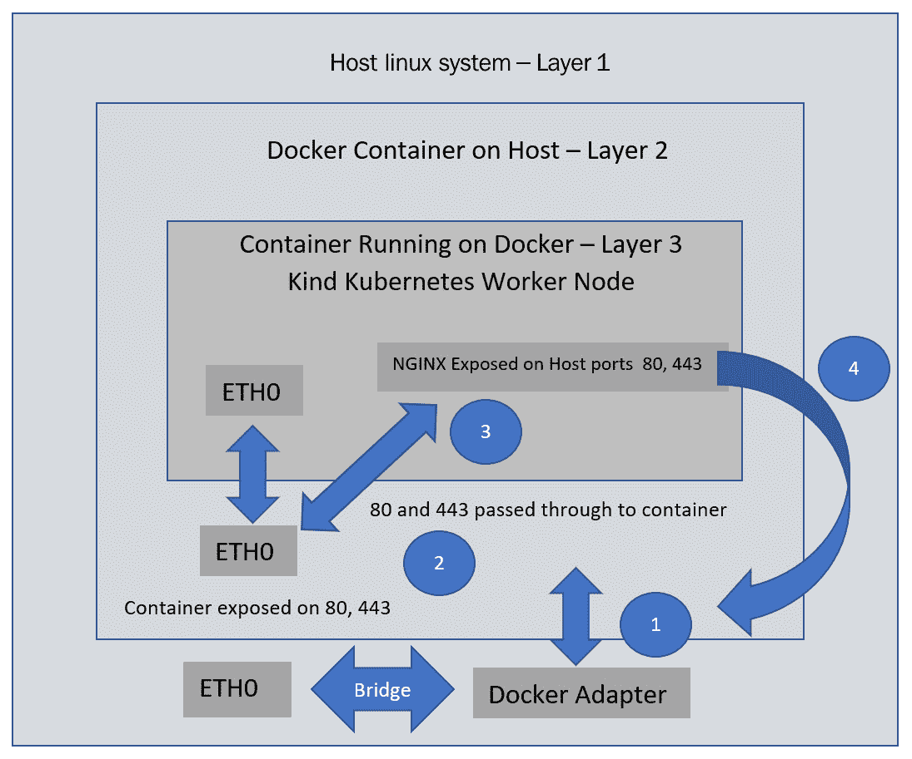
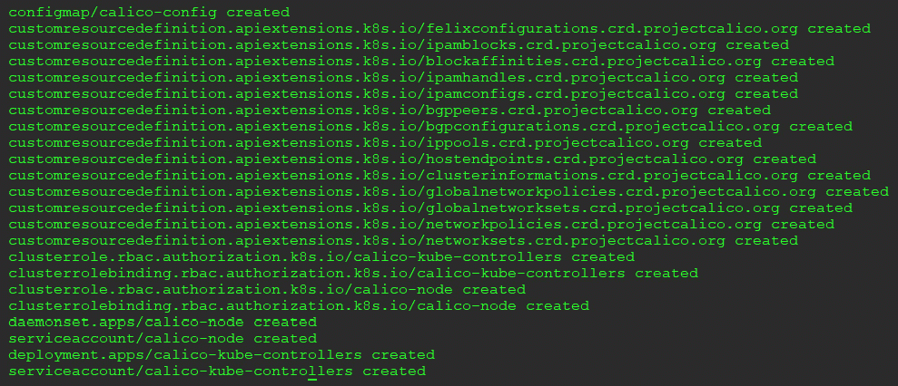

# *第四章*：使用 KinD 部署 Kubernetes

学习 Kubernetes 最大的障碍之一是拥有足够的资源来创建用于测试或开发的集群。像大多数 IT 专业人员一样，我们喜欢在笔记本电脑上拥有一个 Kubernetes 集群，用于演示和测试产品。

通常，您可能需要运行多个集群进行复杂的演示，比如多集群服务网格或测试**kubefed2**。这些场景将需要多台服务器来创建必要的集群，这又需要大量的 RAM 和一个虚拟化程序。

在多集群场景下进行全面测试，您需要为每个集群创建六个节点。如果您使用虚拟机创建集群，您需要有足够的资源来运行 6 个虚拟机。每台机器都会有一些开销，包括磁盘空间、内存和 CPU 利用率。

但是，如果您可以只使用容器来创建一个集群呢？使用容器而不是完整的虚拟机将使您能够由于降低的系统要求而运行额外的节点，用单个命令在几分钟内创建和删除集群，脚本化集群创建，并允许您在单个主机上运行多个集群。

使用容器来运行 Kubernetes 集群为您提供了一个环境，对于大多数人来说，使用虚拟机或物理硬件部署将会很困难，因为资源受限。为了解释如何在本地仅使用容器运行集群，我们将使用 KinD 在您的 Docker 主机上创建一个 Kubernetes 集群。我们将部署一个多节点集群，您将在未来的章节中用来测试和部署诸如 Ingress 控制器、认证、RBAC、安全策略等组件。

在本章中，我们将涵盖以下主题：

+   介绍 Kubernetes 组件和对象

+   使用开发集群

+   安装 KinD

+   创建一个 KinD 集群

+   审查您的 KinD 集群

+   为 Ingress 添加自定义负载均衡器

让我们开始吧！

# 技术要求

本章具有以下技术要求：

+   使用*第一章*中的步骤安装的 Docker 主机，*Docker 和容器基础知识*

+   本书 GitHub 存储库中的安装脚本

您可以通过访问本书的 GitHub 存储库来获取本章的代码：[`github.com/PacktPublishing/Kubernetes-and-Docker-The-Complete-Guide`](https://github.com/PacktPublishing/Kubernetes-and-Docker-The-Complete-Guide)。

注意

我们认为有必要指出，本章将涉及多个 Kubernetes 对象，其中一些没有太多的上下文。[*第五章*]（B15514_05_Final_ASB_ePub.xhtml#_idTextAnchor150）*，Kubernetes Bootcamp*详细介绍了 Kubernetes 对象，其中许多带有您可以使用的命令来理解它们，因此我们认为在阅读本章时使用集群将会很有用。

本章涵盖的大多数基本 Kubernetes 主题将在以后的章节中讨论，因此如果在阅读本章后某些主题有点模糊，不要担心！它们将在以后的章节中详细讨论。

# 介绍 Kubernetes 组件和对象

由于本章将涉及常见的 Kubernetes 对象和组件，我们想提供一个术语表，您将在其中看到每个术语的简要定义，以提供上下文。

在[*第五章*]（B15514_05_Final_ASB_ePub.xhtml#_idTextAnchor150）*，Kubernetes Bootcamp*中，我们将介绍 Kubernetes 的组件和集群中包含的基本对象集。我们还将讨论如何使用 kubectl 可执行文件与集群进行交互：

表 4.1 – Kubernetes 组件和对象

虽然这些只是 Kubernetes 集群中可用的一些对象，但它们是我们将在本章中提到的主要对象。了解每个对象是什么，并具有它们功能的基本知识将有助于您理解本章并部署 KinD 集群。

## 与集群交互

为了测试我们的 KinD 安装，我们将使用 kubectl 可执行文件与集群进行交互。我们将在[*第五章*]（B15514_05_Final_ASB_ePub.xhtml#_idTextAnchor150）*，Kubernetes Bootcamp*中介绍 kubectl，但由于我们将在本章中使用一些命令，我们想提供我们将在表格中使用的命令以及选项提供的解释：

表 4.2 – 基本 kubectl 命令

在这一章中，您将使用这些基本命令部署我们在本书中将使用的集群的部分。

接下来，我们将介绍开发集群的概念，然后重点介绍用于创建开发集群的最流行工具之一：KinD。

# 使用开发集群

多年来，已经创建了各种工具来安装开发 Kubernetes 集群，使管理员和开发人员能够在本地系统上进行测试。这些工具中的许多工作都适用于基本的 Kubernetes 测试，但它们经常存在限制，使它们不太适合快速、高级的场景。

一些最常见的解决方案如下：

+   Docker Desktop

+   minikube

+   kubeadm

每种解决方案都有其优势、局限性和使用情况。有些解决方案限制您只能在单个节点上运行控制平面和工作节点。其他解决方案提供多节点支持，但需要额外的资源来创建多个虚拟机。根据您的开发或测试需求，这些解决方案可能无法完全满足您的需求。

似乎每隔几周就会出现一种新的解决方案，用于创建开发集群的最新选项之一是来自**Kubernetes in Docker**（**KinD**）Kubernetes SIG 的项目。

使用单个主机，KinD 允许您创建多个集群，每个集群可以有多个控制平面和工作节点。运行多个节点的能力允许进行高级测试，而使用其他解决方案可能需要更多的资源。KinD 在社区中受到了很好的评价，并且在[`github.com/kubernetes-sigs/kind`](https://github.com/kubernetes-sigs/kind)上有一个活跃的 Git 社区，以及一个 Slack 频道（*#kind*）。

注意

不要将 KinD 用作生产集群或将 KinD 集群暴露在互联网上。虽然 KinD 集群提供了大部分您在生产集群中想要的功能，但它**不**是为生产环境而设计的。

## 为什么我们选择 KinD 来写这本书？

当我们开始写这本书时，我们希望包括理论和实践经验。KinD 允许我们提供脚本来快速创建和关闭集群，虽然其他解决方案也可以做类似的事情，但 KinD 可以在几分钟内创建一个新的多节点集群。我们希望将控制平面和工作节点分开，以提供一个更“真实”的集群。为了限制硬件要求并使 Ingress 更容易配置，我们将在本书的练习中只创建一个两节点集群。

多节点集群可以在几分钟内创建，一旦测试完成，集群可以在几秒内被拆除。快速创建和销毁集群的能力使 KinD 成为我们练习的理想平台。KinD 的要求很简单：您只需要运行的 Docker 守护程序来创建集群。这意味着它与大多数操作系统兼容，包括以下操作系统：

+   Linux

+   运行 Docker 桌面的 macOS

+   运行 Docker 桌面的 Windows

+   运行 WSL2 的 Windows

重要提示

在撰写本文时，KinD 不支持 Chrome OS。

虽然 KinD 支持大多数操作系统，但我们选择了 Ubuntu 18.04 作为我们的主机系统。本书中的一些练习需要文件放在特定的目录中，选择单个 Linux 版本可以确保练习按设计工作。如果您在家里没有 Ubuntu 服务器，可以在 GCP 等云提供商中创建虚拟机。Google 提供 300 美元的信用额度，足够您运行单个 Ubuntu 服务器数周。您可以在[`cloud.google.com/free/`](https://cloud.google.com/free/)查看 GCP 的免费选项。

现在，让我们解释一下 KinD 的工作原理以及基本的 KinD Kubernetes 集群是什么样子的。

## 使用基本的 KinD Kubernetes 集群

从高层次来看，您可以将 KinD 集群视为由一个**单个**Docker 容器组成，该容器运行控制平面节点和工作节点以创建 Kubernetes 集群。为了使部署简单而稳健，KinD 将每个 Kubernetes 对象捆绑到一个单一的镜像中，称为节点镜像。此节点镜像包含创建单节点集群或多节点集群所需的所有 Kubernetes 组件。

一旦集群运行起来，您可以使用 Docker 执行进入控制平面节点容器并查看进程列表。在进程列表中，您将看到运行控制平面节点的标准 Kubernetes 组件：

图 4.1 - 显示控制平面组件的主机进程列表

如果您要执行到工作节点以检查组件，您将看到所有标准的工作节点组件：

图 4.2 - 显示工作组件的主机进程列表

（图像/Fig_4.2_B15514.jpg）

图 4.2 - 显示工作组件的主机进程列表

我们将在第五章《Kubernetes Bootcamp》中涵盖标准的 Kubernetes 组件，包括 kube-apiserver，kubelets，kube-proxy，kube-scheduler 和 kube-controller-manager。

除了标准的 Kubernetes 组件，KinD 节点都有一个不是大多数标准安装的组件：Kindnet。当您安装基本的 KinD 集群时，Kindnet 是包含的默认 CNI。虽然 Kindnet 是默认的 CNI，但您可以选择禁用它并使用其他选择，比如 Calico。

现在您已经看到了每个节点和 Kubernetes 组件，让我们来看看基本 KinD 集群包含的内容。要显示完整的集群和所有正在运行的组件，我们可以运行 kubectl get pods --all-namespaces 命令。这将列出集群的所有运行组件，包括我们将在第五章《Kubernetes Bootcamp》中讨论的基本组件。除了基本集群组件之外，您可能会注意到在一个名为 local-path-storage 的命名空间中有一个正在运行的 pod，以及一个名为 local-path-provisioner 的 pod。这个 pod 正在运行 KinD 包含的附加组件之一，为集群提供自动配置 PersistentVolumeClaims 的能力：

图 4.3 - kubectl get pods 显示 local-path-provisioner

大多数开发集群提供类似的常见功能，人们需要在 Kubernetes 上测试部署。它们都提供一个 Kubernetes 控制平面和工作节点，大多数包括用于网络的默认 CNI。很少有提供超出这些基本功能的功能，随着 Kubernetes 工作负载的成熟，您可能会发现需要额外的插件，比如 local-path-provisioner。我们将在本书的一些练习中大量利用这个组件，因为如果没有它，我们将更难创建一些流程。

为什么您应该关心开发集群中的持久卷？大多数运行 Kubernetes 的生产集群将为开发人员提供持久存储。通常，存储将由基于块存储、S3 或 NFS 的存储系统支持。除了 NFS，大多数家庭实验室很少有资源来运行功能齐全的存储系统。本地路径供应程序通过为您的 KinD 集群提供昂贵存储解决方案提供的所有功能，消除了用户的这一限制。

在《第五章 Kubernetes Bootcamp》中，我们将讨论一些 Kubernetes 存储的 API 对象。我们将讨论 CSIdrivers、CSInodes 和 StorageClass 对象。这些对象被集群用来提供对后端存储系统的访问。一旦安装和配置完成，pod 将使用 PersistentVolumes 和 PersistentVolumeClaims 对象来消耗存储。存储对象很重要，但当它们首次发布时，大多数人很难测试，因为它们没有包含在大多数 Kubernetes 开发产品中。

KinD 意识到了这个限制，并选择捆绑来自 Rancher 的一个名为本地路径供应程序的项目，该项目基于 Kubernetes 1.10 中引入的 Kubernetes 本地持久卷。

您可能想知道为什么有人需要一个附加组件，因为 Kubernetes 本地主机持久卷已经有了原生支持。虽然已经为本地持久存储添加了支持，但 Kubernetes 还没有添加自动供应的能力。CNCF 确实提供了一个自动供应程序，但它必须作为一个单独的 Kubernetes 组件安装和配置。KinD 使自动供应变得容易，因为供应程序包含在所有基本安装中。

Rancher 的项目为 KinD 提供了以下内容：

+   当创建 PVC 请求时自动创建 PersistentVolumes

+   一个名为 standard 的默认 StorageClass

当自动供应程序看到一个 PersistentVolumeClaim 请求命中 API 服务器时，将创建一个 PersistentVolume，并将 pod 的 PVC 绑定到新创建的 PVC 上。

本地路径供应程序为 KinD 集群增加了一个功能，极大地扩展了您可以运行的潜在测试场景。如果没有自动供应持久磁盘的能力，测试许多需要持久磁盘的预构建部署将是一项挑战。

借助 Rancher 的帮助，KinD 为您提供了一个解决方案，以便您可以尝试动态卷、存储类和其他存储测试，否则在数据中心之外是不可能运行的。我们将在多个章节中使用提供程序为不同的部署提供卷。我们将指出这些以强调使用自动配置的优势。

## 理解节点镜像

节点镜像是为 KinD 提供魔力以在 Docker 容器内运行 Kubernetes 的关键。这是一个令人印象深刻的成就，因为 Docker 依赖于运行 systemd 的系统和大多数容器镜像中不包括的其他组件。

KinD 从一个基础镜像开始，这是团队开发的一个包含运行 Docker、Kubernetes 和 systemd 所需的一切的镜像。由于基础镜像是基于 Ubuntu 镜像的，团队移除了不需要的服务，并为 Docker 配置了 systemd。最后，使用基础镜像创建节点镜像。

提示

如果您想了解基础镜像是如何创建的细节，您可以查看 KinD 团队在 GitHub 仓库中的 Dockerfile，网址为 [`github.com/kubernetes-sigs/kind/blob/controlplane/images/base/Dockerfile`](https://github.com/kubernetes-sigs/kind/blob/controlplane/images/base/Dockerfile)。

## KinD 和 Docker 网络

由于 KinD 使用 Docker 作为容器引擎来运行集群节点，所有集群都受到与标准 Docker 容器相同的网络约束限制。在《第三章》《理解 Docker 网络》中，我们对 Docker 网络和 Docker 默认网络堆栈的潜在限制进行了复习。这些限制不会限制从本地主机测试您的 KinD Kubernetes 集群，但当您想要从网络上的其他计算机测试容器时，可能会导致问题。

除了 Docker 网络考虑因素，我们还必须考虑 Kubernetes 容器网络接口（CNI）。在官方上，KinD 团队将网络选项限制为两种 CNI：Kindnet 和 Calico。Kindnet 是他们唯一支持的 CNI，但您可以选择禁用默认的 Kindnet 安装，这将创建一个没有安装 CNI 的集群。在集群部署后，您可以部署 Calico 等 CNI 清单。

许多用于小型开发集群和企业集群的 Kubernetes 安装都使用 Tigera 的 Calico 作为 CNI，因此，我们选择在本书的练习中使用 Calico 作为我们的 CNI。

### 跟踪套娃

运行诸如 KinD 之类的解决方案可能会令人困惑，因为它是一个容器中的容器部署。我们将其比作俄罗斯套娃，一个娃娃套进另一个娃娃，然后再套进另一个，依此类推。当你开始使用 KinD 来搭建自己的集群时，你可能会迷失在主机、Docker 和 Kubernetes 节点之间的通信路径中。为了保持理智，你应该对每个组件的运行位置有一个清晰的理解，以及如何与每个组件进行交互。

下图显示了必须运行的三个层，以形成一个 KinD 集群。重要的是要注意，每个层只能与直接位于其上方的层进行交互。这意味着第 3 层中的 KinD 容器只能看到第 2 层中运行的 Docker 镜像，而 Docker 镜像只能看到第 1 层中运行的 Linux 主机。如果你想要直接从主机与运行在你的 KinD 集群中的容器进行通信，你需要通过 Docker 层，然后到第 3 层的 Kubernetes 容器。

了解这一点很重要，这样你才能有效地将 KinD 作为测试环境使用：

图 4.4 - 主机无法直接与 KinD 通信

举个例子，假设你想要将 web 服务器部署到你的 Kubernetes 集群中。你在 KinD 集群中部署了一个 Ingress 控制器，并且你想要使用 Chrome 在你的 Docker 主机上或者网络上的另一台工作站上测试该网站。你尝试以端口 80 定位主机，并在浏览器中收到了失败。为什么会失败呢？

运行 web 服务器的 pod 位于第 3 层，无法直接接收来自主机或网络上的机器的流量。为了从主机访问 web 服务器，你需要将流量从 Docker 层转发到 KinD 层。请记住，在*第三章**，理解 Docker 网络*中，我们解释了如何通过向容器添加监听端口来将容器暴露给网络。在我们的情况下，我们需要端口 80 和端口 443。当一个容器启动时带有一个端口，Docker 守护程序将把来自主机的传入流量转发到正在运行的 Docker 容器：

图 4.5 - 主机通过 Ingress 控制器与 KinD 通信

在 Docker 容器上暴露了端口 80 和 443 后，Docker 守护程序现在将接受端口 80 和 443 的传入请求，并且 NGINX Ingress 控制器将接收流量。这是因为我们在 Docker 层上两个地方都暴露了端口 80 和 443。我们在 Kubernetes 层上通过使用主机端口 80 和 443 运行我们的 NGINX 容器来暴露它。这个安装过程将在本章后面解释，但现在，您只需要了解基本流程。

在主机上，您对 Kubernetes 集群中具有 Ingress 规则的 Web 服务器发出请求：

1.  请求查看了所请求的 IP 地址（在本例中为本地 IP 地址）。

1.  运行我们的 Kubernetes 节点的 Docker 容器正在监听端口 80 和 443 的 IP 地址，因此请求被接受并发送到正在运行的容器。

1.  您的 Kubernetes 集群中的 NGINX pod 已配置为使用主机端口 80 和 443，因此流量被转发到该 pod。

1.  用户通过 NGINX Ingress 控制器从 Web 服务器接收所请求的网页。

这有点令人困惑，但你使用 KinD 并与其交互的次数越多，这就变得越容易。

要满足开发需求，您需要了解 KinD 的工作原理。到目前为止，您已经了解了节点镜像以及如何使用该镜像创建集群。您还了解了 KinD 网络流量是如何在 Docker 主机和运行集群的容器之间流动的。有了这些基础知识，我们将继续使用 KinD 创建一个 Kubernetes 集群。

# 安装 KinD

本章的文件位于 KinD 目录中。您可以使用提供的文件，也可以根据本章的内容创建自己的文件。我们将在本节中解释安装过程的每个步骤。

注意

在撰写本文时，KinD 的当前版本为 0.8.1。版本 0.8.0 引入了一个新功能；即在重启和 Docker 重新启动之间维护集群状态。

## 安装 KinD - 先决条件

在创建集群之前，KinD 需要满足一些先决条件。在本节中，我们将详细介绍每个要求以及如何安装每个组件。

### 安装 Kubectl

由于 KinD 是一个单个可执行文件，它不会安装 **kubectl**。如果您尚未安装 **kubectl** 并且正在使用 Ubuntu 18.04 系统，可以通过运行 snap install 来安装它：

sudo snap install kubectl --classic

### 安装 Go

在我们创建 KinD 集群之前，您需要在主机上安装 Go。如果您已经安装并且正常工作，可以跳过此步骤。安装 Go 需要您下载 Go 存档，提取可执行文件，并设置项目路径。以下命令可用于在您的机器上安装 Go。

可以通过运行 **/chapter4/install-go.sh** 从本书存储库执行安装 Go 的脚本：

wget https://dl.google.com/go/go1.13.3.linux-amd64.tar.gz

tar -xzf go1.13.3.linux-amd64.tar.gz

sudo mv go /usr/local

mkdir -p $HOME/Projects/Project1

cat << 'EOF' >> ~/.bash_profile

export -p GOROOT=/usr/local/go

export -p GOPATH=$HOME/Projects/Project1

export -p PATH=$GOPATH/bin:$GOROOT/bin:$PATH

EOF

source ~/.bash_profile

前面列表中的命令将执行以下操作：

+   将 Go 下载到您的主机，解压缩存档，并将文件移动到 **/usr/local**。

+   在您的主目录中创建一个名为 **Projects/Project1** 的 Go 项目文件夹。

+   将 Go 环境变量添加到 **.bash_profile**，这些变量是执行 Go 应用程序所需的。

现在您已经具备了先决条件，我们可以继续安装 KinD。

## 安装 KinD 二进制文件

安装 KinD 是一个简单的过程；可以通过一个命令完成。您可以通过运行本书存储库中包含的脚本来安装 KinD，该脚本位于 **/chapter4/install-kind.sh**。或者，您可以执行以下命令：

GO111MODULE="on" go get sigs.k8s.io/kind@v0.7.0

安装完成后，您可以通过在提示符中键入 **kind version** 来验证 KinD 是否已正确安装：

kind version

这将返回已安装的版本：

kind v0.7.0 go1.13.3 linux/amd64

KinD 可执行文件提供了您需要维护集群生命周期的每个选项。当然，KinD 可执行文件可以创建和删除集群，但它还提供了以下功能：

+   创建自定义构建基础和节点映像的能力

+   可以导出 **kubeconfig** 或日志文件

+   可以检索集群、节点或 **kubeconfig** 文件

+   可以将映像加载到节点中

现在您已经安装了 KinD 实用程序，您几乎可以准备好创建您的 KinD 集群了。在执行一些**create cluster**命令之前，我们将解释 KinD 提供的一些创建选项。

# 创建一个 KinD 集群

现在您已经满足了所有的要求，您可以使用 KinD 可执行文件创建您的第一个集群。KinD 实用程序可以创建单节点集群，也可以创建一个运行多个控制平面节点和多个工作节点的复杂集群。在本节中，我们将讨论 KinD 可执行文件的选项。在本章结束时，您将拥有一个运行的双节点集群 - 一个单一的控制平面节点和一个单一的工作节点。

重要提示

在本书的练习中，我们将安装一个多节点集群。简单的集群配置是一个示例，不应该用于我们的练习。

## 创建一个简单的集群

要创建一个简单的集群，在单个容器中运行控制平面和工作节点，您只需要使用**create cluster**选项执行 KinD 可执行文件。

让我们创建一个快速的单节点集群，看看 KinD 如何快速创建一个快速开发集群。在您的主机上，使用以下命令创建一个集群：

kind create cluster

这将快速创建一个集群，其中包含一个单一的 Docker 容器中的所有 Kubernetes 组件，使用**kind**作为集群名称。它还将为 Docker 容器分配一个**kind-control-plane**的名称。如果您想要分配一个集群名称，而不是默认名称，您需要在**create cluster**命令中添加**--name <cluster name>**选项：

**创建集群"kind" ...**

**确保节点镜像（kindest/node:v1.18.2）**

**准备节点**

**编写配置**

**启动控制平面**

**安装 CNI**

**安装 StorageClass**

**将 kubectl 上下文设置为"kind-kind"**

**现在您可以使用您的集群：**

**kubectl cluster-info --context kind-kind**

**create**命令将创建集群并修改 kubectl **config**文件。KinD 将把新集群添加到当前的 kubectl **config**文件中，并将新集群设置为默认上下文。

我们可以通过使用 kubectl 实用程序列出节点来验证集群是否成功创建：

kubectl get nodes

这将返回正在运行的节点，对于基本集群来说，是单个节点：

名称               状态     角色     年龄     版本

kind-control-plane Ready    master   130m  v1.18.2

部署此单节点集群的主要目的是向您展示 KinD 可以多快地创建一个用于测试的集群。对于我们的练习，我们希望将控制平面和工作节点分开，以便我们可以使用下一节中的步骤删除此集群。

## 删除集群

测试完成后，您可以使用**删除**命令删除集群：

kind delete cluster –name <cluster name>

**删除**命令将快速删除集群，包括您的**kubeconfig**文件中的任何条目。

快速单节点集群对于许多用例都很有用，但您可能希望为各种测试场景创建多节点集群。创建更复杂的集群需要您创建一个配置文件。

## 创建集群配置文件

创建多节点集群（例如具有自定义选项的两节点集群）时，我们需要创建一个集群配置文件。配置文件是一个 YAML 文件，其格式应该看起来很熟悉。在此文件中设置值允许您自定义 KinD 集群，包括节点数、API 选项等。我们将用于创建本书集群的配置文件如下 - 它包含在本书的存储库中的**/chapter4/cluster01-kind.yaml**中：

种类：集群

apiVersion：kind.x-k8s.io/v1alpha4

网络：

apiServerAddress："0.0.0.0"

disableDefaultCNI：true

kubeadmConfigPatches：

- |

apiVersion：kubeadm.k8s.io/v1beta2

种类：集群配置

元数据：

名称：配置

网络：

服务子网："10.96.0.1/12"

Pod 子网："192.168.0.0/16"

节点：

- 角色：控制平面

- 角色：工作节点

额外端口映射：

- containerPort：80

主机端口：80

- containerPort：443

主机端口：443

额外挂载：

- hostPath：/usr/src

容器路径：/usr/src

文件中每个自定义选项的详细信息在下表中提供：

表 4.3 - KinD 配置选项

如果您计划创建一个超出单节点集群的集群而不使用高级选项，您将需要创建一个配置文件。了解可用的选项将允许您创建具有高级组件（如 Ingress 控制器或多个节点）的 Kubernetes 集群，以测试部署的故障和恢复过程。

现在您知道如何创建一个简单的一体化容器来运行集群，以及如何使用配置文件创建多节点集群，让我们讨论一个更复杂的集群示例。

## 多节点集群配置

如果您只想要一个没有任何额外选项的多节点集群，您可以创建一个简单的配置文件，列出您在集群中想要的节点数量和类型。以下**配置**文件将创建一个包含三个控制平面节点和三个工作节点的集群：

种类：集群

apiVersion: kind.x-k8s.io/v1alpha4

节点：

- 角色：控制平面

- 角色：控制平面

- 角色：控制平面

- 角色：工作节点

- 角色：工作节点

- 角色：工作节点

使用多个控制平面服务器会引入额外的复杂性，因为我们在配置文件中只能针对单个主机或 IP。为了使这个配置可用，我们需要在集群前部署一个负载均衡器。

KinD 已经考虑到了这一点，如果您部署多个控制平面节点，安装将创建一个额外的运行 HAProxy 负载均衡器的容器。如果我们查看多节点配置的运行容器，我们将看到六个节点容器运行和一个 HAProxy 容器：

表 4.4 - KinD 配置选项

请记住，在*第三章**，理解 Docker 网络*中，我们解释了端口和套接字。由于我们只有一个主机，每个控制平面节点和 HAProxy 容器都在唯一的端口上运行。每个容器都需要暴露给主机，以便它们可以接收传入的请求。在这个例子中，需要注意的是分配给 HAProxy 的端口，因为那是集群的目标端口。如果您查看 Kubernetes 配置文件，您会看到它是针对[`127.0.0.1:32791`](https://127.0.0.1:32791)，这是分配给 HAProxy 容器的端口。

当使用**kubectl**执行命令时，它直接发送到 HAProxy 服务器。使用 KinD 在集群创建期间创建的配置文件，HAProxy 容器知道如何在三个控制平面节点之间路由流量：

# 由 kind 生成

全局

日志 /dev/log local0

日志 /dev/log local1 注意

守护程序

默认值

日志 全局

模式 tcp

选项 dontlognull

# TODO: 调整这些

连接超时 5000

客户端超时 50000

服务器超时 50000

前端 控制平面

绑定 *:6443

默认后端 kube-apiservers

后端 kube-apiservers

选项 httpchk GET /healthz

# TODO: 我们应该进行验证(!)

服务器 config2-control-plane 172.17.0.8:6443 检查 检查-ssl 验证 无

server config2-control-plane2 172.17.0.6:6443 check check-ssl verify none

server config2-control-plane3 172.17.0.5:6443 check check-ssl verify none

如前面的配置文件所示，有一个名为**kube-apiservers**的后端部分，其中包含三个控制平面容器。每个条目都包含一个控制平面节点的 Docker IP 地址，端口分配为 6443，指向容器中运行的 API 服务器。当您请求[`127.0.0.1:32791`](https://127.0.0.1:32791)时，该请求将命中 HAProxy 容器。使用 HAProxy 配置文件中的规则，请求将被路由到列表中的三个节点之一。

由于我们的集群现在由负载均衡器前端，我们有一个高可用的控制平面用于测试。

注意

包含的 HAProxy 镜像不可配置。它只用于处理控制平面和负载均衡 API 服务器。由于这个限制，如果您需要为工作节点使用负载均衡器，您将需要提供自己的负载均衡器。

一个使用案例是，如果您想要在多个工作节点上使用 Ingress 控制器。您需要在工作节点前面放置一个负载均衡器，以接受传入的 80 和 443 请求，并将流量转发到运行 NGINX 的每个节点。在本章末尾，我们提供了一个示例配置，其中包括用于将流量负载均衡到工作节点的自定义 HAProxy 配置。

## 自定义控制平面和 Kubelet 选项

您可能希望进一步测试 OIDC 集成或 Kubernetes 功能门。KinD 使用与 kubeadm 安装相同的配置。例如，如果您想要将集群与 OIDC 提供程序集成，可以将所需的选项添加到配置补丁部分：

kind: Cluster

apiVersion: kind.x-k8s.io/v1alpha4

kubeadmConfigPatches:

- |

kind: ClusterConfiguration

metadata:

name: config

apiServer:

extraArgs:

oidc-issuer-url: "https://oidc.testdomain.com/auth/idp/k8sIdp"

oidc-client-id: "kubernetes"

oidc-username-claim: sub

oidc-client-id: kubernetes

oidc-ca-file: /etc/oidc/ca.crt

nodes:

- role: control-plane

- role: control-plane

- role: control-plane

- role: worker

- role: worker

- rol: worker

有关可用配置选项的列表，请查看 Kubernetes 网站上的*使用 kubeadm 自定义控制平面配置* [`kubernetes.io/docs/setup/production-environment/tools/kubeadm/control-plane-flags/`](https://kubernetes.io/docs/setup/production-environment/tools/kubeadm/control-plane-flags/)。

现在你已经创建了集群文件，你可以创建你的 KinD 集群。

## 创建自定义的 KinD 集群

终于了！现在你已经熟悉了 KinD，我们可以继续并创建我们的集群了。

我们需要创建一个受控的、已知的环境，所以我们将为集群命名，并提供我们在上一节讨论过的配置文件。

确保你在**chapter4**目录下的克隆存储库中。

为了使用我们需要的选项创建一个 KinD 集群，我们需要使用以下选项运行 KinD 安装程序：

kind create cluster --name cluster01 --config c

luster01-kind.yaml 选项**--name**将集群名称设置为 cluster01，而**--config**告诉安装程序使用配置文件**cluster01-kind.yaml**。

当你在主机上执行安装程序时，KinD 将开始安装并告诉你正在执行的每一步。整个集群创建过程应该不到 2 分钟：

图 4.6 – KinD 集群创建输出

部署的最后一步是创建或编辑现有的 Kubernetes 配置文件。无论哪种情况，安装程序都会创建一个名为**kind-<cluster name>**的新上下文，并将其设置为默认上下文。

虽然看起来集群安装过程已经完成了它的任务，但是集群**还没有**准备好。一些任务需要几分钟才能完全初始化，而且由于我们禁用了默认的 CNI 来使用 Calico，我们仍然需要部署 Calico 来提供集群网络。

## 安装 Calico

为了为集群中的 pod 提供网络，我们需要安装一个容器网络接口，或者 CNI。我们选择安装 Calico 作为我们的 CNI，而由于 KinD 只包括 Kindnet CNI，我们需要手动安装 Calico。

如果你在创建步骤之后暂停并查看集群，你会注意到一些 pod 处于等待状态：

coredns-6955765f44-86l77 0/1 Pending 0 10m

coredns-6955765f44-bznjl 0/1 Pending 0 10m

local-path-provisioner-7 0/1 Pending 0 11m 745554f7f-jgmxv

这里列出的 pods 需要一个可用的 CNI 才能启动。这将把 pods 置于等待网络的挂起状态。由于我们没有部署默认的 CNI，我们的集群没有网络支持。为了将这些 pods 从挂起状态变为运行状态，我们需要安装一个 CNI - 对于我们的集群来说，就是 Calico。

为了安装 Calico，我们将使用标准的 Calico 部署，只需要一个清单。要开始部署 Calico，请使用以下命令：

kubectl apply -f https://docs.projectcalico.org/v3.11/manifests/calico.yaml

这将从互联网上拉取清单并将其应用到集群。在部署过程中，您会看到创建了许多 Kubernetes 对象：

图 4.7 - Calico 安装输出

安装过程大约需要一分钟，您可以使用**kubectl get pods -n kube-system**来检查其状态。您会看到创建了三个 Calico pods。其中两个是**calico-node** pods，另一个是**calico-kube-controller** pod：

名称                    准备状态 重启次数 年龄

calico-kube-controllers 1/1 Running 0 64s -5b644bc49c-nm5wn

calico-node-4dqnv 1/1 Running 0 64s

calico-node-vwbpf 1/1 Running 0 64s

如果您再次检查**kube-system**命名空间中的两个 CoreDNS pods，您会注意到它们已经从之前安装 Calico 之前的挂起状态变为运行状态：

coredns-6955765f44-86l77 1/1 Running 0 18m

coredns-6955765f44-bznjl 1/1 Running 0 18m

现在集群安装了一个可用的 CNI，任何依赖网络的 pods 都将处于运行状态。

## 安装 Ingress 控制器

我们有一个专门的章节来解释 Ingress 的所有技术细节。由于我们正在部署一个集群，并且未来的章节需要 Ingress，我们需要部署一个 Ingress 控制器来展示一个完整的集群构建。所有这些细节将在*第六章*中更详细地解释，*服务、负载均衡和外部 DNS*。

安装 NGINX Ingress 控制器只需要两个清单，我们将从互联网上拉取以使安装更容易。要安装控制器，请执行以下两行：

kubectl apply -f https://raw.githubusercontent.com/kubernetes/ingress-nginx/nginx-0.28.0/deploy/static/mandatory.yaml

kubectl apply -f https://raw.githubusercontent.com/kubernetes/ingress-nginx/nginx-0.27.0/deploy/static/provider/baremetal/service-nodeport.yaml

部署将创建一些 Ingress 所需的 Kubernetes 对象，这些对象位于名为**ingress-nginx**的命名空间中：

图 4.8 – NGINX 安装输出

我们还有一步，以便我们有一个完全运行的 Ingress 控制器：我们需要将端口 80 和 443 暴露给运行的 pod。这可以通过对部署进行修补来完成。在这里，我们已经包含了修补部署的修补程序：

kubectl patch deployments -n ingress-nginx nginx-ingress-controller -p '{"spec":{"template":{"spec":{"containers":[{"name":"nginx-ingress-controller","ports":[{"containerPort":80,"hostPort":80},{"containerPort":443,"hostPort":443}]}]}}}}'

恭喜！您现在拥有一个完全运行的、运行 Calico 的双节点 Kubernetes 集群，带有一个 Ingress 控制器。

# 审查您的 KinD 集群

现在有一个 Kubernetes 集群，我们有能力直接查看 Kubernetes 对象。这将帮助您理解上一章，我们在其中涵盖了 Kubernetes 集群中包含的许多基本对象。特别是，我们将讨论包含在您的 KinD 集群中的存储对象。

## KinD 存储对象

请记住，KinD 包括 Rancher 的自动配置程序，为集群提供自动持久磁盘管理。在第五章《Kubernetes Bootcamp》中，我们讨论了与存储相关的对象，现在我们有了一个配置了存储系统的集群，我们可以更详细地解释它们。

由于能够使用本地主机路径作为 PVC 的功能是 Kubernetes 的一部分，因此我们在 KinD 集群中将不会看到任何**CSIdriver**对象。自动配置程序不需要的一个对象是：它不需要**CSIdriver**。

我们将讨论的 KinD 集群中的第一个对象是我们的**CSInodes**。在 bootcamp 中，我们提到创建此对象是为了将任何 CSI 对象与基本节点对象解耦。可以运行工作负载的任何节点都将具有**CSInode**对象。在我们的 KinD 集群中，两个节点都有**CSInode**对象。您可以通过执行**kubectl get csinodes**来验证这一点：

名称                      创建于

cluster01-control-plane   2020-03-27T15:18:19Z

cluster01-worker          2020-03-27T15:19:01Z

如果我们使用**kubectl describe csinodes <node name>**来描述其中一个节点，您将看到对象的详细信息：

图 4.9 - CSInode 描述

要指出的主要事项是输出的**Spec**部分。这列出了可能安装的任何驱动程序的详细信息，以支持后端存储系统。由于我们没有后端存储系统，我们在集群上不需要额外的驱动程序。

为了展示一个节点会列出什么样的示例，这里是一个安装了两个驱动程序，支持两种不同供应商存储解决方案的集群的输出：

图 4.10 - 多驱动器示例

如果您查看这个节点的**spec.drivers**部分，您将看到两个不同的名称部分。第一个显示我们安装了一个驱动程序来支持 NetApp SolidFire，而第二个是支持 Reduxio 的存储解决方案的驱动程序。

## 存储驱动程序

正如我们已经提到的，您的 KinD 集群没有安装任何额外的存储驱动程序。如果您执行**kubectl get csidrivers**，API 将不会列出任何资源。

## KinD 存储类

要连接到任何集群提供的存储，集群需要一个**StorageClass**对象。Rancher 的提供者创建了一个名为 standard 的默认存储类。它还将该类设置为默认的**StorageClass**，因此您不需要在 PVC 请求中提供**StorageClass**名称。如果没有设置默认的**StorageClass**，每个 PVC 请求都将需要在请求中提供**StorageClass**名称。如果未启用默认类并且 PVC 请求未能设置**StorageClass**名称，PVC 分配将失败，因为 API 服务器将无法将请求链接到**StorageClass**。

注意

在生产集群中，通常认为省略分配默认的**StorageClass**是一个好的做法。根据您的用户，您可能会有一些部署忘记设置一个类，而默认的存储系统可能不适合部署的需求。这个问题可能直到它变成一个生产问题才会出现，并且可能会影响业务收入或公司的声誉。如果您不分配一个默认的类，开发人员将会有一个失败的 PVC 请求，并且在对业务造成任何伤害之前会发现这个问题。

要列出集群上的存储类，请执行**kubectl get storageclasses**，或者使用**sc**而不是**storageclasses**的缩写版本：

图 4.11 - 默认存储类

接下来，让我们学习如何使用配置程序。

## 使用 KinD 的存储配置程序

使用包含的配置程序非常简单。由于它可以自动配置存储并设置为默认类，任何进来的 PVC 请求都会被配置 pod 看到，然后创建**PersistentVolume**和**PersistentVolumeClaim**。

为了展示这个过程，让我们通过必要的步骤。以下是在基本 KinD 集群上运行**get pv**和**get pvc**的输出：

图 4.12 - PV 和 PVC 示例

请记住，**PersistentVolume**不是一个命名空间对象，所以我们不需要在命令中添加命名空间选项。PVC 是命名空间对象，所以我告诉 Kubernetes 向我展示所有命名空间中可用的 PVC。由于这是一个新的集群，没有默认的工作负载需要持久磁盘，所以没有 PV 或 PVC 对象。

如果没有自动配置程序，我们需要在 PVC 声明卷之前创建 PV。由于我们在集群中运行了 Rancher 配置程序，我们可以通过部署一个带有 PVC 请求的 pod 来测试创建过程，就像这里列出的一样：

种类：PersistentVolumeClaim

apiVersion：v1

元数据：

名称：test-claim

规格：

访问模式：

- ReadWriteOnce

资源：

请求：

存储：1Mi

---

种类：Pod

apiVersion：v1

元数据：

名称：test-pvc-claim

规格：

容器：

- 名称：测试 pod

图像：busybox

命令：

- “/bin/sh”

参数：

- “-c”

- “touch /mnt/test && exit 0 || exit 1”

volumeMounts：

- 名称：测试-pvc

mountPath：“/mnt”

重启策略：“永不”

卷：

- 名称：测试-pvc

persistentVolumeClaim：

claimName：test-claim

这个 PVC 请求将在默认命名空间中命名为**test-claim**，并且请求一个 1MB 的卷。由于 KinD 为集群设置了默认的**StorageClass**，我们确实需要包括**StorageClass**选项。

要创建 PVC，我们可以使用 kubectl 执行**create**命令，例如**kubectl create -f pvctest.yaml** - Kubernetes 将返回，指出 PVC 已创建，但重要的是要注意，这并不意味着 PVC 完全工作。PVC 对象已创建，但如果 PVC 请求中缺少任何依赖项，它仍将创建对象，尽管无法完全创建 PVC 请求。

创建 PVC 后，可以使用两种选项之一检查实际状态。第一个是一个简单的**get**命令；也就是**kubectl get pvc**。由于我的请求在默认命名空间中，所以在**get**命令中不需要包含命名空间值（请注意，我们必须缩短卷的名称以适应页面）：

名称 状态 容量 访问模式 存储类 年龄

测试声明 Bound pvc-9c56cf65-d661-49e3- 1Mi RWO 标准 2s

我们知道我们在清单中创建了 PVC 请求，但我们没有创建 PV 请求。如果我们现在查看 PV，我们将看到从我们的 PVC 请求创建了一个 PV。同样，我们缩短了 PV 名称以适应单行输出：

名称 容量 访问模式 回收策略 状态 声明

pvc-9c56cf65-d661-49e3- 1Mi RWO 删除 已绑定 默认/测试声明

这完成了 KinD 存储部分。

由于许多工作负载需要持久磁盘，了解 Kubernetes 工作负载如何与存储系统集成非常重要。在本节中，您了解了 KinD 如何向集群添加自动配置程序。我们将在下一章*第五章**，Kubernetes Bootcamp*中加强我们对这些 Kubernetes 存储对象的知识。

# 为 Ingress 添加自定义负载均衡器

注意

这一部分是一个复杂的主题，涵盖了添加一个自定义的 HAProxy 容器，您可以使用它来负载均衡 KinD 集群中的工作节点。*您不应该在我们将用于剩余章节的 KinD 集群上部署这些步骤。*

我们为任何想要了解如何在多个工作节点之间进行负载平衡的人添加了这一部分。

KinD 不包括用于工作节点的负载均衡器。包含的 HAProxy 容器只为 API 服务器创建一个配置文件；团队不正式支持对默认镜像或配置的任何修改。由于您在日常工作中将与负载均衡器进行交互，我们希望添加一个关于如何配置自己的 HAProxy 容器以在三个 KinD 节点之间进行负载均衡的部分。

首先，我们不会在本书的任何章节中使用这个配置。我们希望让练习对每个人都可用，所以为了限制所需的资源，我们将始终使用在本章前面创建的双节点集群。如果您想测试带有负载均衡器的 KinD 节点，我们建议使用不同的 Docker 主机，或者等到您完成本书并删除 KinD 集群后再进行测试。

## 安装先决条件

我们假设您有一个基于以下配置的 KinD 集群：

+   任意数量的控制平面节点

+   三个工作节点

+   集群名称为**cluster01**

+   一个可用的**Kindnet 或 Calico**（**CNI**）

+   已安装 NGINX Ingress 控制器 - 补丁以在主机上监听端口 80 和 443

## 创建 KinD 集群配置

由于您将在 Docker 主机上使用暴露在端口 80 和 443 上的 HAProxy 容器，因此您不需要在集群的**config**文件中暴露任何端口。

为了使测试部署更容易，您可以使用这里显示的示例集群配置，它将创建一个简单的六节点集群，并禁用 Kindnet：

kind: Cluster

apiVersion: kind.x-k8s.io/v1alpha4

networking:

apiServerAddress: "0.0.0.0"

disableDefaultCNI: true

kubeadmConfigPatches:

- |

apiVersion: kubeadm.k8s.io/v1beta2

kind: ClusterConfiguration

元数据：

名称：config

网络：

serviceSubnet: "10.96.0.1/12"

podSubnet: "192.168.0.0/16"

nodes:

- 角色：控制平面

- 角色：控制平面

- 角色：控制平面

- 角色：工作节点

- 角色：工作节点

- 角色：工作节点

您需要使用本章前面使用的相同清单安装 Calico。安装 Calico 后，您需要使用本章前面提供的步骤安装 NGINX Ingress 控制器。

一旦您部署了 Calico 和 NGINX，您应该有一个可用的基本集群。现在，您可以继续部署自定义的 HAProxy 容器。

## 部署自定义的 HAProxy 容器

HAProxy 在 Docker Hub 上提供了一个容器，很容易部署，只需要一个配置文件就可以启动容器。

要创建配置文件，您需要知道集群中每个工作节点的 IP 地址。在本书的 GitHub 存储库中，我们已经包含了一个脚本文件，可以为您找到这些信息，创建配置文件，并启动 HAProxy 容器。它位于**HAProxy**目录下，名为**HAProxy-ingress.sh**。

为了帮助您更好地理解这个脚本，我们将分解脚本的各个部分，并详细说明每个部分执行的内容。首先，以下代码块正在获取我们集群中每个工作节点的 IP 地址，并将结果保存在一个变量中。我们将需要这些信息用于后端服务器列表：

#!/bin/bash

worker1=$(docker inspect --format '{{ .NetworkSettings.IPAddress }}' cluster01-worker)

worker2=$(docker inspect --format '{{ .NetworkSettings.IPAddress }}' cluster01-worker2)

worker3=$(docker inspect --format '{{ .NetworkSettings.IPAddress }}' cluster01-worker3)

接下来，由于我们在启动容器时将使用绑定挂载，我们需要在已知位置拥有配置文件。我们选择将其存储在当前用户的主目录下，一个名为**HAProxy**的目录中：

# 在当前用户的主目录下创建一个 HAProxy 目录

mkdir ~/HAProxy

接下来，脚本的以下部分将创建**HAProxy**目录：

# 为工作节点创建 HAProxy.cfg 文件

tee ~/HAProxy/HAProxy.cfg <<EOF

配置的**全局**部分设置了全局性的安全和性能设置。

全局

log /dev/log local0

log /dev/log local1 notice

守护进程

**defaults**部分用于配置将应用于配置值中所有前端和后端部分的值：

默认值

全局日志

tcp 模式

连接超时 5000

客户端超时 50000

服务器超时 50000

前端 workers_https

绑定 *:443

tcp 模式

use_backend ingress_https

后端 ingress_https

选项 httpchk GET /healthz

tcp 模式

服务器 worker $worker1:443 检查端口 80

服务器 worker2 $worker2:443 检查端口 80

服务器 worker3 $worker3:443 检查端口 80

这告诉 HAProxy 创建一个名为**workers_https**的前端，以及绑定传入请求的 IP 地址和端口，使用 TCP 模式，并使用名为**ingress_https**的后端。

**ingress_https**后端包括了三个使用端口 443 作为目的地的工作节点。检查端口是一个健康检查，将测试端口 80。如果服务器在端口 80 上回复，它将被添加为请求的目标。虽然这是一个 HTTPS 端口 443 规则，但我们只使用端口 80 来检查 NGINX pod 的网络回复：

前端 workers_http

绑定*:80

use_backend ingress_http

后端 ingress_http

模式 http

选项 httpchk GET /healthz

服务器 worker $worker1:80 检查端口 80

服务器 worker2 $worker2:80 检查端口 80

服务器 worker3 $worker3:80 检查端口 80

这个**前端**部分创建了一个前端，接受端口 80 上的传入 HTTP 流量。然后使用后端**ingress_http**中的服务器列表作为端点。就像在 HTTPS 部分一样，我们使用端口 80 来检查是否有任何运行在端口 80 上的节点。任何回复检查的端点都将被添加为 HTTP 流量的目的地，而任何没有运行 NGINX 的节点将不会回复，这意味着它们不会被添加为目的地：

EOF

这结束了我们文件的创建。最终文件将在**HAProxy**目录中创建：

# 启动工作节点的 HAProxy 容器

docker run --name HAProxy-workers-lb -d -p 80:80 -p 443:443 -v ~/HAProxy:/usr/local/etc/HAProxy:ro HAProxy -f /usr/local/etc/HAProxy/HAProxy.cfg

最后一步是启动一个运行 HAProxy 的 Docker 容器，其中包含我们创建的配置文件，其中包含三个工作节点，暴露在 Docker 主机上的端口 80 和 443 上。

现在您已经学会了如何为工作节点安装自定义的 HAProxy 负载均衡器，让我们看看配置是如何工作的。

## 理解 HAProxy 流量流向

集群将总共有八个容器在运行。其中六个容器将是标准的 Kubernetes 组件，即三个控制平面服务器和三个工作节点。另外两个容器是 KinD 的 HAProxy 服务器和您自己的自定义 HAProxy 容器：

图 4.13-运行自定义 HAProxy 容器

这个集群输出与我们的两节点集群有一些不同。请注意，工作节点没有暴露在任何主机端口上。工作节点不需要任何映射，因为我们有我们的新 HAProxy 服务器在运行。如果您查看我们创建的 HAProxy 容器，它是在主机端口 80 和 443 上暴露的。这意味着对端口 80 或 443 的任何传入请求都将被定向到自定义的 HAProxy 容器。

默认的 NGINX 部署只有一个副本，这意味着 Ingress 控制器正在单个节点上运行。如果我们查看 HAProxy 容器的日志，我们将看到一些有趣的东西：

[注意] 093/191701 (1)：新工作人员＃1（6）分叉

[警告] 093/191701 (6)：服务器 ingress_https/worker 已关闭，原因：第 4 层连接问题，信息：“SSL 握手失败（连接被拒绝）”，检查持续时间：0 毫秒。剩下 2 个活动服务器和 0 个备份服务器。0 个会话活动，0 个重新排队，0 个在队列中剩余。

[警告] 093/191702 (6)：服务器 ingress_https/worker3 已关闭，原因：第 4 层连接问题，信息：“SSL 握手失败（连接被拒绝）”，检查持续时间：0 毫秒。剩下 1 个活动服务器和 0 个备份服务器。0 个会话活动，0 个重新排队，0 个在队列中剩余。

[警告] 093/191702 (6)：服务器 ingress_http/worker 已关闭，原因：第 4 层连接问题，信息：“连接被拒绝”，检查持续时间：0 毫秒。剩下 2 个活动服务器和 0 个备份服务器。0 个会话活动，0 个重新排队，0 个在队列中剩余。

[警告] 093/191703 (6)：服务器 ingress_http/worker3 已关闭，原因：第 4 层连接问题，信息：“连接被拒绝”，检查持续时间：0 毫秒。剩下 1 个活动服务器和 0 个备份服务器。0 个会话活动，0 个重新排队，0 个在队列中剩余。

您可能已经注意到日志中有一些错误，比如 SSL 握手失败和**连接被拒绝**。虽然这些看起来像错误，但实际上它们是工作节点上的失败检查事件。请记住，NGINX 只在一个 pod 上运行，而且由于我们在 HAProxy 后端配置中有所有三个节点，它将检查每个节点上的端口。未能回复的任何节点将不用于负载平衡流量。在我们当前的配置中，这确实进行了负载平衡，因为我们只在一个节点上有 NGINX。但是，它确实为 Ingress 控制器提供了高可用性。

如果您仔细查看日志输出，您将看到在定义的后端上有多少个活动服务器；例如：

检查持续时间：0 毫秒。剩下 1 个活动服务器和 0 个备份服务器。

日志输出中的每个服务器池显示 1 个活动端点，因此我们知道 HAProxy 已成功找到端口 80 和 443 上的 NGINX 控制器。

要找出 HAProxy 服务器连接到哪个 worker，我们可以使用日志中的失败连接。每个后端将列出失败的连接。例如，根据其他两个 worker 节点显示为**DOWN**的日志，我们知道正在工作的节点是**cluster01-worker2**：

服务器 ingress_https/worker 已宕机 服务器 ingress_https/worker3 已宕机

让我们模拟节点故障，以证明 HAProxy 为 NGINX 提供了高可用性。

## 模拟 Kubelet 故障

请记住，KinD 节点是临时的，停止任何容器可能会导致其在重新启动时失败。那么，我们如何模拟 worker 节点故障，因为我们不能简单地停止容器？

要模拟故障，我们可以停止节点上的 kubelet 服务，这将提醒**kube-apisever**不在节点上调度任何其他 pod。在我们的示例中，我们想证明 HAProxy 为 NGINX 提供了 HA 支持。我们知道正在运行的容器在**worker2**上，因此这是我们想要“关闭”的节点。

停止**kubelet**的最简单方法是向容器发送**docker exec**命令：

docker exec cluster01-worker2 systemctl stop kubelet

您不会从此命令中看到任何输出，但是如果您等待几分钟，让集群接收更新的节点状态，您可以通过查看节点列表来验证节点是否已关闭：

kubectl get nodes。

您将收到以下输出：

图 4.14 - worker2 处于 NotReady 状态

这验证了我们刚刚模拟了 kubelet 故障，并且**worker2**处于**NotReady**状态。

在 kubelet“故障”之前运行的任何 pod 将继续运行，但是**kube-scheduler**在 kubelet 问题解决之前不会在节点上调度任何工作负载。由于我们知道 pod 不会在节点上重新启动，我们可以删除 pod，以便它可以在不同的节点上重新调度。

您需要获取 pod 名称，然后将其删除以强制重新启动：

kubectl get pods -n ingress-nginx

nginx-ingress-controller-7d6bf88c86-r7ztq

kubectl delete pod nginx-ingress-controller-7d6bf88c86-r7ztq -n ingress-nginx

这将强制调度程序在另一个工作节点上启动容器。它还会导致 HAProxy 容器更新后端列表，因为 NGINX 控制器已移动到另一个工作节点。

如果您再次查看 HAProxy 日志，您将看到 HAProxy 已更新后端以包括**cluster01-worker3**，并且已将**cluster01-worker2**从活动服务器列表中删除：

[警告] 093/194006 (6) : 服务器 ingress_https/worker3 已启动，原因：Layer7 检查通过，代码：200，信息：“OK”，检查持续时间：4 毫秒。2 个活动服务器和 0 个备用服务器在线。0 个会话重新排队，队列中总共 0 个。

[警告] 093/194008 (6) : 服务器 ingress_http/worker3 已启动，原因：Layer7 检查通过，代码：200，信息：“OK”，检查持续时间：0 毫秒。2 个活动服务器和 0 个备用服务器在线。0 个会话重新排队，队列中总共 0 个。

[警告] 093/195130 (6) : 服务器 ingress_http/worker2 已关闭，原因：Layer4 超时，检查持续时间：2000 毫秒。1 个活动服务器和 0 个备用服务器剩下。0 个会话活动，0 个重新排队，0 个剩余在队列中。

[警告] 093/195131 (6) : 服务器 ingress_https/worker2 已关闭，原因：Layer4 超时，检查持续时间：2001 毫秒。1 个活动服务器和 0 个备用服务器剩下。0 个会话活动，0 个重新排队，0 个剩余在队列中。

如果您计划将此 HA 集群用于其他测试，您将需要重新启动**cluster01-worker2**上的 kubelet。如果您计划删除 HA 集群，只需运行 KinD 集群删除，所有节点将被删除。

## 删除 HAProxy 容器

一旦删除了 KinD 集群，您将需要手动删除我们添加的 HAProxy 容器。由于 KinD 没有创建我们的自定义负载均衡器，删除集群不会删除容器。

要删除自定义的 HAProxy 容器，请运行**docker rm**命令以强制删除镜像：

docker rm HAProxy-workers-lb –force

这将停止容器并将其从 Docker 的列表中删除，从而允许您在将来的 KinD 集群中再次使用相同的名称运行它。

# 总结

在本章中，您了解了名为 KinD 的 Kubernetes SIG 项目。我们详细介绍了如何在 KinD 集群中安装可选组件，包括 Calico 作为 CNI 和 NGINX 作为 Ingress 控制器。最后，我们介绍了包含在 KinD 集群中的 Kubernetes 存储对象的详细信息。

希望通过本章的帮助，您现在了解使用 KinD 可以为您和您的组织带来的力量。它提供了一个易于部署、完全可配置的 Kubernetes 集群。在单个主机上运行的集群数量在理论上仅受主机资源的限制。

在下一章中，我们将深入研究 Kubernetes 对象。我们将下一章称为*Kubernetes 训练营*，因为它将涵盖大多数基本的 Kubernetes 对象以及它们各自的用途。下一章可以被视为“Kubernetes 口袋指南”。它包含了 Kubernetes 对象的快速参考以及它们的作用，以及何时使用它们。

这是一个内容丰富的章节，旨在为那些具有 Kubernetes 经验的人提供复习，或者为那些新手提供速成课程。我们撰写本书的目的是超越基本的 Kubernetes 对象，因为当今市场上有许多涵盖 Kubernetes 基础知识的书籍。

# 问题

1.  在创建**持久卷索赔**之前必须创建哪个对象？

A. PVC

B. 磁盘

C. **持久卷**

D. **虚拟磁盘**

1.  KinD 包括一个动态磁盘提供程序。是哪家公司创建了这个提供程序？

A. 微软

B. CNCF

C. VMware

D. 牧场主

1.  如果您创建了一个具有多个工作节点的 KinD 集群，您将安装什么来将流量引导到每个节点？

A. 负载均衡器

B. 代理服务器

C. 什么都不用

D. 网络负载均衡器

1.  正确或错误：Kubernetes 集群只能安装一个 CSIdriver。

A. 正确

B. 错误
